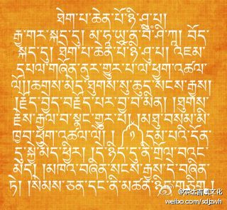
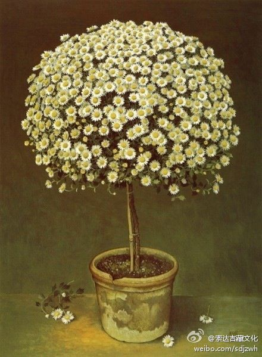
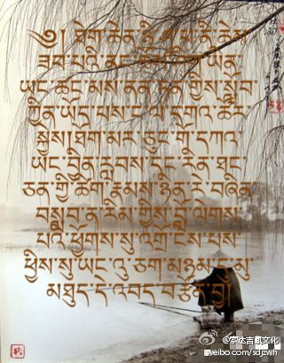
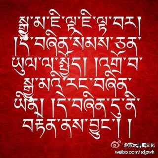
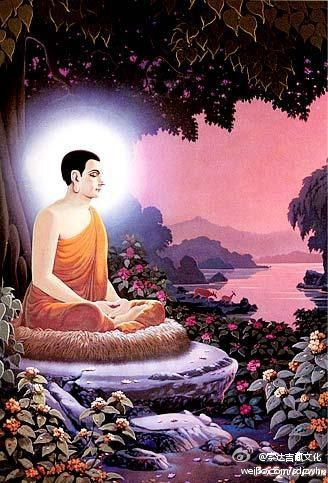
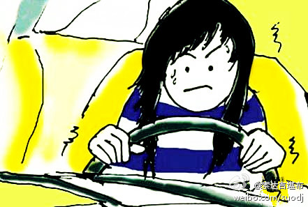
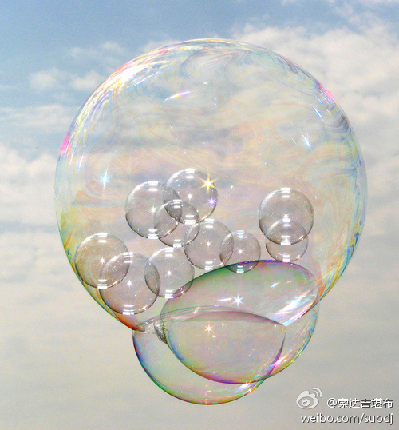
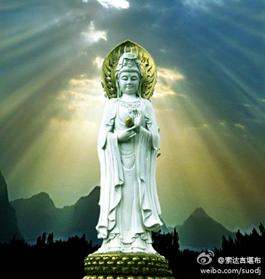
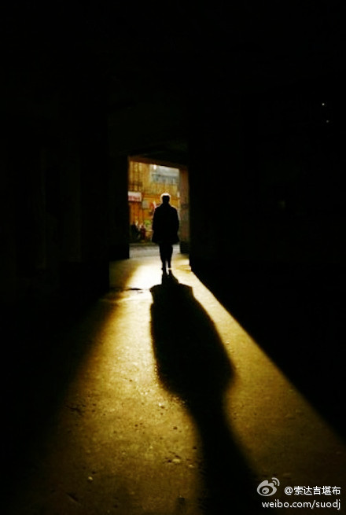

 ## 2012-01-01 06:44
一个人在没有开悟乃至佛果之前，不管自己的境界有多高，也不能放弃积累资粮、净除罪障！
 ## 2012-01-01 20:39
祝你新年吉祥

 ## 2012-01-02 18:06
古人说得好：“纵有良田万顷，不过日食三斗；纵有广厦万间，不过夜宿一床。”既然如此，我们又何必为了那用不上的很多东西，把一辈子的宝贵时光都搭上呢？
 ## 2012-01-03 14:33
佛教中的戒律，不了解的人觉得是一种教条、是一种束缚，但了解的人就会知道，它为每个趋往解脱的人提供了很大帮助。就像马路上的绿灯、红灯，它虽然让每个开车者不太自在，但却极大保证了他们的生命安全，能令其更快地抵达目的地.
 ## 2012-01-04 12:32
但凡世上之事,有求皆苦,无欲则刚.
 ## 2012-01-05 15:18
什么是幸福？从古人造字来看，“幸”字上方是“土”，下方是钱的符号“¥”；“福”左边是“衣”，右上是“一口”，要合家团圆，右下是“田”。也就是说，有钱、有地、有衣、有食，这便是幸福。但幸福真是建立在物质上的吗？幸福到底从何而来呢？O网页链接

 ## 2012-01-06 15:39
若想成办一件事情，必须要持之以恒、循序渐进，不能只是三分钟的热情。如果太急功近利、急于求成，则很容易事倍功半，甚至一败涂地。所以，“快快走”有时候会“慢慢到”，而“慢慢走”的话，反而可能会“快快到”。
 ## 2012-01-07 09:55
很多人都不知道，自己的一切痛苦，其实来自于各种执著。而要想消除这些执著，佛法中有最殊胜的窍诀和方便。现在不少人学了佛以后，虽不敢说完全摆脱了所有执著，但确实对一些事物容易看开，不会特别偏激，以此给自己的生活也重新打开了一片天空。
 ## 2012-01-08 13:19
大千世界，万种诱惑，什么都想要，会累死你。该放就放，才会快乐一生。

 ## 2012-01-09 09:26
上师法王如意宝，在8年前的今天离开了我们，那个冬天彻骨的冷，每每想起都不禁哽咽、颤抖。上师的恩德昊天罔极，为了报答他老人家，我只有一遍又一遍在心中发愿：穷此一生，乃至生生世世，都要利益众生的利益！喇嘛钦！

 ## 2012-01-10 10:56
有人问：“对一切执著要学会看破、放下，但我就是看不破、放不下怎么办？”答：看破，不是说看破就能看破了，它必须要先懂得道理，然后经过一定的修行，才能做到“收放自如”。修行是一种长期、高水平的训练，依靠特殊的窍诀、特殊的环境，常人看起来难如登天的事情，修行人很容易就能做到。
 ## 2012-01-11 17:24
忍，不是含泪度日、忍气吞声的懦弱之举，而是为人处世、化干戈为玉帛的上上之策。不能忍一时之痛，必将受百年之忧。人生有太多的不如意，退一步海阔天空，这也是一种雅量。

 ## 2012-01-12 08:16
供养上师三宝

 ## 2012-01-12 08:21
酥油花

 ## 2012-01-12 16:43
佛陀常教导我们要“随顺众生”，但这并不是一味地纵容，看到众生在为非作歹，自己也要去助一臂之力。真正的随顺，是看到对众生暂时或究竟有利的，才会顺应他的心意；而对自他没有丝毫利益，甚至反而有害的，则绝对不会“助纣为虐”。

 ## 2012-01-13 12:49
很多人认为空性是什么都“没有”，但实际上恰恰相反，空性是什么都“有”。万法如果不空，就不可能有无常变化，就像一颗种子，不空的话，它永远无法结出果实。正因为是空性，才会随因缘而变，才能衍生出形形色色的大千世界。

 ## 2012-01-14 12:14
乐观的人，在绝望中也能找到希望；悲观的人，在希望中却能看到绝望。其实，每一个明天都是希望，不管你陷入怎样的绝境，都不应该绝望。因为，一切都可以改变。

 ## 2012-01-15 10:12
有些人在得了绝症时，才想去赶快实现没完成的梦想，每一天从此变得珍贵无比。但事实上，每个人都患有一种“绝症”，那就是不可抗拒的死亡。你之所以不能抛开一切无聊的东西，去做些对今生来世有意义的事，就是因为没有意识到这一点，反而还认为自己会活很久。

 ## 2012-01-16 13:21
现在很多商品，如雨后春笋般冒了出来，争相做各种广告宣传。但他们若是缺少诚实的后盾，一时的欺骗虽可能得逞，但不久定会原形毕露、一败涂地。其实，“欺骗”永远是靠不住的谋财之道，天下没有一种广告能比“诚实”的美誉，更能得到他人的青睐。

 ## 2012-01-16 15:58
还剩下一个小橘子，快吃了吧！

 ## 2012-01-17 11:25
很多人平时口口声声说“利益众生”，可一旦自己遭受巨大的伤害，就会完全被嗔心蒙蔽，对于伤害自己的人，不但不想去利益，反而恨不得灭之而后快。但作为真正的大乘修行人，就算别人将自己害得体无完肤，自己也会千方百计地维护他，宁死也不愿产生一念害他之心。如此慈悲，正是需要我们永远修持的。

 ## 2012-01-18 11:43
要想除掉旷野中的杂草，最好的办法就是在上面种庄稼。同样，要想遣除我们内心的纷扰、苦恼，唯一的方法就是用无我利他的美德去占据它。

 ## 2012-01-19 11:20
敏感多疑、我执很重的人，对自己会带来痛苦，给他人也带来压力；宽容大度、慈悲心强的人，对自己会带来快乐，给他人也带来轻松。

 ## 2012-01-20 10:37
一个鸡蛋放进水里煮熟时，外壳似乎没什么变化，但内在却从“软”弱变得坚“硬”，不再害怕外在的打击。同样，我们通过学习佛法，外表似乎没什么改变，但内心的强大已不可同日而语。这时候，无论出现何种煎熬、折磨，都会转化为让自己成熟的动力。

 ## 2012-01-21 13:51
不管是清晨、白天、傍晚，只要看到大海，心就自然广阔起来。其实，我们的心比大海还宽、还广，若能经常有意识地去扩大它，一切烦恼在它面前，都会显得微不足道。

 ## 2012-01-22 08:19
吉祥是最佳的礼物，知足是最大的财富，利他是最好的品德，关心是最真挚的问候，祝福是最美好的话语。祝你新年快乐，平安幸福！

 ## 2012-01-23 14:01
辞“旧”迎“新”，不仅仅是外面的节日庆祝，更应该是内心的净化与重新定位。人有善念，天必从之，所以，在新年的第一天，让我们根据自己的情况，发个殊胜、坚定的善愿吧！

 ## 2012-01-24 14:24
随缘而去，是很快乐的！可真正的随缘，并非什么都不做，一味地等着老天安排，而是需要全心全力的付出，对结果如何却不会太在意。所以，随缘是一种洞彻万法的智慧，而不是一种消极逃避的心态。

 ## 2012-01-25 11:33
现在很多年轻人，生下来就要什么有什么，这未必是一种幸福。过度地依赖父母，让自己过得衣食无忧，从而放弃了人生斗志，这只能输掉自己的一生。大教育家陶行知先生说：“滴自己的血，流自己的汗，自己的事情自己干，靠天靠地靠老子，不算是好汉。”所以，从小学会自立很重要！

 ## 2012-01-26 09:37
小孩在沙滩上在玩耍时，喜欢用沙子堆成房屋，一旦沙屋被海浪冲垮了，就会哇哇大哭，在大人看来非常好笑。实际上，我们对名利地位的执著，又何尝不是如此？对本来就无常、虚假的东西，拼了命去争取，得不到就痛不欲生。这在智者的眼里，跟看待小孩迷恋沙屋一样，只会一笑置之。

 ## 2012-01-27 12:10
有些人发愿不杀生，但想吃肉的话，就唆使他人杀生。其实按小乘戒律来讲，这样做的罪业，跟亲自杀生一样。而在大乘菩萨戒中，罪业比这更严重。为什么呢？因为自己杀只是自己染上罪过，但让别人杀的话，既害了自己，又害了别人。大乘主要是讲利他，因此这个过失更大。

 ## 2012-01-28 11:05
曾遇到一个专门给人治病的按摩师，他做这工作从15岁就开始了，如今到了50岁仍没有放弃，甚至经常连续按摩7个小时也不觉累，内心始终很快乐。我们修行人若也有他这样长年如一日、充满快乐、恒常不变的心态，又何愁道业不成呢？
 ## 2012-01-29 08:59
珍惜现在，比不切实际地妄想未来重要得多。现在，给予我们的实在太多了，可惜大多数人都看不懂，一生始终在寻寻觅觅，为很多实现不了的期望，劳苦终日、行色匆匆。这样的人，或许到了弥留之际，也找不到自己想要的东西，因为这些早已与你擦肩而过。

 ## 2012-01-30 12:44
芸芸众生的表现，真是稀奇！不真实的执为真实，一切就似乎真实了；不迷乱的执为迷乱，一切就似乎迷乱了；不确定的执为确定，一切就似乎确定了；不是的执为是，一切就似乎是了；不合理的执为合理，一切就似乎合理了。——《法界宝藏论》

 ## 2012-01-30 15:41
尽管我发现，如今一些人对前辈祖师大德的教言并不感兴趣，但这些金玉良言，却是对今生来世有重大意义的真理之语。弘扬这些珍宝，也是我毕生的主要奋斗方向。从明天开始的二十天中，我准备将龙树菩萨撰著的《大乘二十颂》译成汉语，并陆续在微博上发表，以飧读者。望有缘者能一睹为快，并有所受益。
 ## 2012-01-31 09:07
转发微博
 > @索达吉藏文化
 > 《大乘二十颂》 梵音：玛哈雅那波协噶；汉译：大乘二十颂 顶礼文殊童子！证达无贪佛，非能所说境，恭礼力超思，大悲所现佛！胜义无生故，亦无有解脱，如来若虚空，众生一体相。

 ## 2012-01-31 09:08
转发微博
 > @索达吉藏文化
 > 《大乘二十颂浅释》 ，译者在开篇之初，便按照藏地经论翻译的常规，首先恭敬顶礼智慧本尊文殊童子。之后是顶礼偈：证达对万法无有贪执的佛陀，绝非能所之语与所说之义的境界。在大悲心所化现的，力量超越思维意识的佛陀前，作者龙树菩萨毕恭毕敬地顶礼！

 ## 2012-01-31 09:08
转发微博
 > @索达吉藏文化
 > 在胜义当中，没有产生，所以也没有众生与轮回；没有解脱，故而也没有从轮回中解脱的佛陀。如来就像虚空一般清净本空，众生也与其一味一体、无二无别，但在名言当中，众生与佛陀都真实存在，不可混淆（下文也应如是理解）。

 ## 2012-01-31 10:28
我经常发愿生生世世不损害任何生命，并愿自己的身口意随时都能利益众生。如果你觉得这样做有道理，希望也能如此发愿、如此实践。

 ## 2012-02-01 09:11
转发微博
 > @索达吉藏文化
 > 此彼岸无生，无涅槃自性，有为法皆空，遍知佛行境。 .

 ## 2012-02-01 09:11
转发微博
 > @索达吉藏文化
 > 无论从自生、他生、共生、无因生等各个角度来观察，此岸所象征的轮回，与彼岸所象征的涅槃，都是无生的，所以没有自性存在的涅槃。同样，一切可见、可思、可言、可生、可灭的有为法都是空性，这不是普通凡夫所能了知的范畴，而是智慧不可思议之遍知佛的行境。

 ## 2012-02-01 09:18
虽然大乘佛法的究竟观点，是证达万法皆空、广度无量众生等，但我们刚开始学时，可能很难有如此境界。不过，为了自己的家庭和谐、身体健康、平安幸福，而虔诚祈祷诸佛菩萨保佑，也绝对会是有利的！

 ## 2012-02-02 09:40
转发微博
 > @索达吉藏文化
 > 通晓万法性，有如影像故，真如性平等，清净寂无二。

 ## 2012-02-02 09:40
转发微博
 > @索达吉藏文化
 > 通晓一切万法在世俗谛中，如同镜中之影像一般如梦如幻、自性本空；于胜义谛中，则为清净、寂灭，与世俗谛一体无二之平等真如法性。

 ## 2012-02-02 10:07
鸵鸟在遇到危险时，常常把头埋在沙土中，行掩耳盗铃之举，这在人类看来非常好笑。不过，我们有时也会犯同样的错误，将来必定面对的死亡和来世问题，许多人总是一味逃避、自欺欺人，一旦这些真的来了，自己又往往束手无策、措手不及。

 ## 2012-02-03 08:53
转发微博
 > @索达吉藏文化
 > 我无我皆空，凡夫心假立。苦乐相观待，惑解亦如是。.

 ## 2012-02-03 08:53
转发微博
 > @索达吉藏文化
 > 在真实义中，我与无我都是空性无实，都不存在，但凡夫俗子却以分别之心而将其假立为有或者无。快乐与痛苦也是互相依存、互相观待的，一者不存在，另一者也不可能存在，如同长与短、父与子、大与小等等一样。同样，流转轮回的烦恼与解脱的智慧也是如此。

 ## 2012-02-03 11:03
面对别人的恶语中伤，我们最容易做出、也是最下策的反应，就是反唇相讥。这样固然可发泄一时之气，但最后伤害的，还是自己。倒不如像拜伦所说：“恨我的，我一笑置之。”以如如不动的心态，用这微微“一笑”，让人生活出豁达、活出洒脱。

 ## 2012-02-04 08:43
转发微博
 > @索达吉藏文化
 > 流转六道众，各于自境中，感受善趣乐，地狱大痛苦。

 ## 2012-02-04 08:43
转发微博
 > @索达吉藏文化
 > 在没有证悟万法实相之前，流转于六道轮回的众生，只能在自己业力所感的环境中，感受有漏的人间、天界、阿修罗等三善趣之安乐，与难以堪忍、无量无边之地狱、饿鬼、旁生等三恶趣之痛苦，别无选择。

 ## 2012-02-04 09:02
俗话说：“一日之际在于晨。”你每天早上睁开眼后，第一个念头是什么呢？A、利他 B、利己 C、浑浑噩噩

 ## 2012-02-04 14:43
2009年5月8日，联合国秘书长潘基文说：“我们所有人都要学习佛陀的大悲精神，他的永恒教言可帮助我们驾驭许多当今所面临的全球问题。”"All of us can learn from the Buddha's spirit of compassion. His timeless teachings can help us to navigate the many global problems we face today.”

 ## 2012-02-05 08:38
转发微博
 > @索达吉藏文化
 > 不善生极苦，喜乐瞬时灭，善业必定生，胜妙之安乐。.

 ## 2012-02-05 08:38
转发微博
 > @索达吉藏文化
 > 众生流转轮回所遭遇的一切，都是咎由自取，而不是无因无缘的偶然。因不善之业的大小程度，而产生相应之细微与剧烈之苦，即使是欢喜快乐，也会瞬间化为乌有，而变为痛苦。而善业又必定会产生胜妙之安乐。如同毒和药的种子分别产生各自之果一般，这都是谁也无法转移的自然规律。

 ## 2012-02-05 09:14
我们日常生活中的情绪起伏，都会不可避免地影响周围的人；喜怒无常，也注定会破坏别人对自己的信任。所以，懂得做人，有时候比懂得做事更重要。即使你不懂怎么为人处世，至少也要学会控制情绪，而不要让情绪控制自己。

 ## 2012-02-06 09:03
转发微博
 > @索达吉藏文化
 > 众生妄分别，烦恼火炽燃，现地狱等象，苦如火烧林。

 ## 2012-02-06 09:03
转发微博
 > @索达吉藏文化
 > 众生因虚妄分别念的驱使，引起烦恼之火熊熊炽燃，以烦恼而造业，以致显现地狱等六趣之现象，并承受极度猛烈之痛苦煎熬，犹如野火焚烧森林一般势不可挡。.

 ## 2012-02-06 09:25
今天是龙年的第一个月圆之日，祈祷诸佛菩萨加持保佑每个人：家庭和和美美、身体健健康康、工作顺顺利利、心情快快乐乐、修行圆圆满满、世间平平安安！

 ## 2012-02-07 07:55
转发微博
 > @索达吉藏文化
 > 虽然≪大乘二十颂≫很难，大家却学得很认真，心里十分欣慰。尽管万事开头难，但若能每天坚持学习一些具有加持与价值的词句，经过长期的日积月累，内心潜移默化，一定会往好的方向发展。让我们大家一起继续努力、共同进步。

 ## 2012-02-07 07:55
转发微博
 > @索达吉藏文化
 > 众生所取境，如同幻化相，有情本幻性，皆为缘起生。.

 ## 2012-02-07 07:56
转发微博
 > @索达吉藏文化
 > 众生执着、贪恋、缘取、行持的对境，都如同幻师以幻术幻化出的景象一般虚无不实；有情众生本身，也是犹如梦幻的本性。若以智慧观察，无论内在与外在，宇宙与生命，一切的一切，都是现而无实有，因为都是各种因缘缘起而生。

 ## 2012-02-07 08:19
开车不要太快，性子不要太急，办事不要太慢，说话不要太多，起床不要太晚，贪欲不要太强，修行不要太懒，依师不要太杂，观心不要太少，微博不要太长

 ## 2012-02-08 08:27
转发微博
 > @索达吉藏文化
 > 如画师自画，夜叉像自怖，无智者流转，亦为同等理。  

 ## 2012-02-08 08:27
转发微博
 > @索达吉藏文化
 > 就像画师画出栩栩如生的夜叉图像后，自己却被自己所画的像吓得惊魂不定，其实都是自己吓自己一样，没有通达万法真相的愚者，也是因为自己的虚幻之心幻化出虚无缥缈的轮回现象，从而流转轮回、漂泊不定，感受轮回中的种种恐怖与痛苦，其实都是自己把自己约束于六道之中而不得解脱。

 ## 2012-02-08 08:38
如今依靠天文望远镜的帮助，我们发现在浩渺无垠的宇宙中，地球只是沧海中的一滴水，还有不计其数的其他星球存在。但早在2500多年前，佛陀不必依赖外在器械，就早已对此清清楚楚，而且他所描述的星球和世界，远比我们现在发现的多得多。假如你翻开佛经细致研究，肯定会大吃一惊。

 ## 2012-02-09 08:55
转发微博
 > @索达吉藏文化
 > 如自作泥潭，愚童沉其中；陷分别泥中，众生难自拔。

 ## 2012-02-09 08:55
转发微博
 > @索达吉藏文化
 > 犹如愚昧的顽童在玩耍时自己造作泥潭，最后自己沉入其中而难以自拔一样，众生因愚痴分别妄念的驱使，将无常执为常有，不净的执为不净，无我执为有我，空性执为实有，从而作茧自缚，陷入轮回泥沼中，长时受苦、永无出期。

 ## 2012-02-09 09:45
要想成功，仅凭一个人的能力很难，必须要有他人的帮助。而这种人际关系，只有真诚、包容、体谅的心，才能巩固起来。假如狭隘地认为自己最能干，跟任何人都没有合作的默契，滴水则很难变成汪洋。

 ## 2012-02-10 08:51
转发微博
 > @索达吉藏文化
 > 外境与心识，分别念所缚，无实执实有，感受诸痛苦。 .

 ## 2012-02-10 08:51
转发微博
 > @索达吉藏文化
 > 没有证悟境界的凡夫，会因色声香味触法等六种外境，与眼耳鼻舌身意六种根识之因缘，而产生有毒之分别妄念，从而将无实之法执为实有，并因实有之执着而产生烦恼，继而造作恶业，之后饱尝各种痛苦之果，始终束缚于轮回之中，长时不得解脱。

 ## 2012-02-10 09:04
感恩父母众生，常常包容我；感恩珍贵教言，常常提醒我；感恩诸佛菩萨，常常垂念我；感恩本尊护法，常常指引我；感恩根本上师，常常加持我。喇嘛钦！

 ## 2012-02-11 09:04
转发微博
 > @索达吉藏文化
 > 当证无实性，生起智悲心，为利众生故，置彼于佛地。  

 ## 2012-02-11 09:04
转发微博
 > @索达吉藏文化
 > 我们应当洞彻一切万法原本无实之本性，从而生起超然之智慧与大悲菩提心，为了利益天边无际的众生而精勤修持，力争早日度尽一切众生，将他们安置于佛的无上安乐之地。

 ## 2012-02-11 09:08
我们纵然无法改变人生，但可以改变自己的人生观；纵然无法改变环境，但可以改变自己的心境。毕竟，我们的生活，并非由所发生的事件决定，而是由面对事情的态度来决定。

 ## 2012-02-12 08:43
转发微博
 > @索达吉藏文化
 > 世俗中积资，获无上觉果，超离分别缚，此佛乃世亲。.

 ## 2012-02-12 08:43
转发微博
 > @索达吉藏文化
 > 在世俗中广泛积累福德与智慧资粮，并以此等善根获得无上菩提妙果，从而超越脱离分别妄念之网的缠缚，这样的佛陀，犹如日轮般既可带来温暖，又能指明前程，的确堪称世间众生之至亲。

 ## 2012-02-12 08:50
倘若没有宿世的缘分，我们就不会有福报遇到贤善上师；倘若内心不清净，即使值遇真佛般的上师，也不可能将他看作是有功德者。

 ## 2012-02-13 08:39
转发微博
 > @索达吉藏文化
 > 佛证缘起性，真实之本意；洞彻众生空，远离初中后。

 ## 2012-02-13 08:39
转发微博
 > @索达吉藏文化
 > 唯有断证圆满的佛陀，能够彻底照见一切万法无欺缘起而生的真实之意，并洞彻三界六道之轮回与其间之众生原本为空，远离初中后等一切时空概念，不可言表、超离思维。

 ## 2012-02-13 11:01
人生需要一些压力，才能激发自己抵御逆境的潜力。那些没有丝毫压力、整天得过且过的人，就像风暴中没有载货的空船，往往一场突如其来的“狂风巨浪”，便会把他们轻易打翻。所以，压力对有智慧的人来说，确实是一种动力。

 ## 2012-02-14 08:24
转发微博
 > @索达吉藏文化
 > 通达诸轮回，涅槃皆非有，无有烦恼相，亦无初中后。

 ## 2012-02-14 08:24
转发微博
 > @索达吉藏文化
 > 若能通达万法的自性，不清净的轮回与清净的涅槃，在究竟实相中均不存在。包括我们所产生的贪、嗔、痴等烦恼，也全部了不可得，根本没有最初的产生、中间的安住、最后的消失。

 ## 2012-02-14 08:28
射箭时，靶子近一点，箭就射得比较近；靶子远一点，箭就射得比较远。我们修行也是如此，如果只希求眼前的利益，则只能得到短暂的快乐；若是想到长久的利益，终会获得永恒的安乐。

 ## 2012-02-14 18:21
分享图片

 ## 2012-02-15 08:55
转发微博
 > @索达吉藏文化
 > 如感梦寐境，智分辨则无，愚痴梦若醒，轮回不可得。 .

 ## 2012-02-15 08:56
转发微博
 > @索达吉藏文化
 > 犹如梦境中所感受的一切痛苦与快乐、安然与惊恐、富贵与贫穷等等，若以智慧观察、辨别，或从梦中醒来，都了不可得一样。若能从无明愚痴所制造的大梦中苏醒，则所有轮回间的一切功名利禄、穷苦窘迫、至爱亲朋、怨敌仇人，乃至生老病死、上升下堕等等，都将灰飞烟灭、不复存在。

 ## 2012-02-15 09:01
现在很多人觉得生活无聊，就开始找各种刺激。其实不管是成天酗酒、吞云吐雾，还是纸醉金迷、灯红酒绿，都只能带来短暂的享受，对身体有百害而无一利，而且根本无法填补内心的空虚。

 ## 2012-02-16 08:28
转发微博
 > @索达吉藏文化
 > 如见诸幻师，幻化诸聚集，彼时纤毫无，此乃诸法性。 .

 ## 2012-02-16 08:28
转发微博
 > @索达吉藏文化
 > 如同在见到魔术师幻化出的各种幻变景象时，一切集聚都是虚无缥缈的幻像，哪怕其中的一丝一毫，都并不存在一样。在见到大千世界所集聚之森罗万象的当下，一切也都只是幻像而已，这是一切万法的本质。

 ## 2012-02-16 08:33
现在常有人问：“你最喜欢的是什么？”其实，这是很难回答的。“最”代表了无可匹敌、至高至巅，但一切都是无常的，今天的“最”，也许到了明天，就不是了。所以，凡事不要轻易下结论，还是给自己留点变化的空间吧。

 ## 2012-02-17 08:37
转发微博
 > @索达吉藏文化
 > 此等皆为心，如幻而安存，以善不善业，衍生贤劣果。  

 ## 2012-02-17 08:37
转发微博
 > @索达吉藏文化
 > 所有我们能够感知的一切现象与感受，都仅仅是心的造作而已。现实生活中的一切，都只能以如梦如幻的方式而安存于世。在这个梦幻泡影似的世界中，众生将以杀盗淫妄等不善业，感召三恶道等恶劣果报；同时以布施、持戒、安忍等善业，感召人天福德等善果。

 ## 2012-02-17 08:37
转发微博
 > @索达吉藏文化
 > 公告：《大乘二十颂》学完后，准备仍按照每天一个偈颂的学习进程，为大家翻译并略解前辈大德土观秋吉尼玛仁波切撰著的《世间规》。敬请各位，继续关注！.

 ## 2012-02-17 09:41
学佛，并不是求佛。虽说供养三宝能种下善根，但佛陀告诉我们，关键是自己造了什么因，才会感召什么果，苦乐纯粹是自作自受。而没有说只要肯花大钱贿赂，佛陀就会将快乐、名声、财富、健康、平安统统赐予。若是如此，佛度有缘人，岂不变成了佛度“有钱人”？

 ## 2012-02-18 08:28
转发微博
 > @索达吉藏文化
 > 若除心根本，诸法皆灭尽，法性本无我，亦为清净界。  

 ## 2012-02-18 08:29
转发微博
 > @索达吉藏文化
 > 若能从根本上断除一切分别妄心，则芸芸众生与山河大地等一切，都将土崩瓦解、不复留存。本来法性实相远离言思戏论，无有任何人我与法我，是清净、空性、光明之法界。

 ## 2012-02-18 08:32
现在不少人为减肥发愁，往昔印度的波斯匿王也有这种苦恼。肥胖的身体，给他的行住坐卧带来诸多不便。他去请教佛陀，佛讲了一个减肥的方法：“人当自系念，每食知节量，是则诸受薄，安消而保寿。”国王听了无比欢喜，以后每每进食，都让人在旁唱此偈文。以此，他终于瘦身成功，容貌也随之庄严起来。

 ## 2012-02-19 09:08
转发微博
 > @索达吉藏文化
 > 若于物本性，恒存安乐想，无明愚痴障，凡愚漂轮回。 .

 ## 2012-02-19 09:08
转发微博
 > @索达吉藏文化
 > 如果不能通达万法之实质，对一切事物及其本性，一直存有恒常、安乐、有我、清净之颠倒妄想，则因为这些无明愚痴的障碍，凡夫有情只能在生死轮回的茫茫大海中，时上时下、漂泊不定、终难出头。

 ## 2012-02-19 09:13
当你在利益众生的同时，也不要忘了身边的亲人，请多倾听他们的心声，多体谅他们的情绪，多照顾他们的感受。毕竟他们也是“众生”，而且与你因缘深厚！

 ## 2012-02-20 08:28
转发微博
 > @索达吉藏文化
 > 轮回大苦海，溢满分别流，不登大乘筏，谁能达彼岸？

 ## 2012-02-20 08:28
转发微博
 > @索达吉藏文化
 > 在无边无际的轮回六道大苦海中，充溢着大大小小的贪嗔痴分别妄念瀑流，波涛滚滚、流淌不尽。如果没有登上大乘妙法之殊胜宝舟，又有谁能抵达解脱之光明彼岸呢？

 ## 2012-02-20 08:48
对于现在人的修行，我有几点肺腑之言：看破红尘与生活没有着落，请不要混淆；出离心和一味逃避，请不要混淆；大智慧和小聪明，请不要混淆；大成就者的行为与精神疯癫，请不要混淆。这些看似相似、实则不同，请务必要用佛教的教理加以辨别！

 ## 2012-02-21 08:04
转发微博
 > @索达吉藏文化
 > 无明缘所生，世间解方知，彼等分别念，皆从何处生。龙树菩萨撰著之《大乘二十颂》圆满译竟。 .

 ## 2012-02-21 08:04
转发微博
 > @索达吉藏文化
 > 唯有堪称世间解的佛陀，才能通晓由无明之因缘所产生的一切内外世界的因果关系及其本质，也知道众生的喜怒哀乐等分别妄念，都是从何处而生。更重要的，是知道在这些表面现象的背后，世界是怎样一副模样，以及最终彻见这一万法本相的途径。

 ## 2012-02-21 08:38
明天就是藏历的一月初一了！这个月叫“神变月”，每一天都是吉祥日，行持任何善法，功德均会成十亿倍增长，请大家切莫散乱。同时，我们佛学院也将开15天的持明法会，僧众共诵九本尊心咒，为一切众生和世界祈福。你若有兴趣也可参与，假如不会念此心咒，则可念观音菩萨的六字真言“嗡玛尼贝美吽”。

 ## 2012-02-21 22:28
到今天为止，龙树菩萨的《二十颂》已圆满结束，非常随喜大家学习的功德！下面我还会在藏文微博中，继续公布适合年轻人的《世间规之忠言》，大家有兴趣可以不断学习。O索达吉藏文化

 ## 2012-02-22 08:31
有些人学佛之后，就自以为看破一切了，衣服邋遢、蓬头垢面、懒于打扮，以至于家人见了都退避三舍，同事见了也敬而远之，以为学佛必须有如此“境界”，这就有点走极端了。其实，适当的穿着、得体的妆容，对在家居士来讲也是有必要的，这也是利益有情的一种方便。

 ## 2012-02-23 08:56
有些人对自己所不了解的佛菩萨功德等，经常喜欢说“我觉得这在忽悠人”、“我觉得这不可能”。其实我们的分别念并不可靠，千万不要轻易相信它。佛陀曾说：“慎勿信汝意，汝意不可信。”所以，凡事应当用正理来抉择，而不要单凭“我觉得”作取舍。毕竟，我们已经被自己的分别念欺骗很多次了……

 ## 2012-02-24 08:56
人生在世，固然要了解包罗万象的各种知识，但更有意义的是，应当认识自心的本来面目。认识它的方法，佛教中有直接、间接、简单、复杂等多种，每个人皆可根据自己的根基和兴趣，各取所需。

 ## 2012-02-25 08:48
俗话说：“尺有所短，寸有所长。”再伟大的人也有自己的短处，再渺小的人也有自己的优点。所以，不必拿别人的优势，来和自己的短处比。你的长处，或许是他人永远也无法比拟的！

 ## 2012-02-26 10:33
依靠佛法来饶益有情，是“百千万劫难遭遇”的。我们若有这样的机缘，务必要好好抓住，在有限而短暂的生命中，尽己所能、竭尽全力地做一些事情！

 ## 2012-02-27 09:23
所谓“活佛”，在藏地根本没有这种称呼，它的本意是转世的修行人，而不是活生生的佛。但有些汉人喜欢夸大的名词，觉得听起来比较神气，于是“活佛”就应运而生了。其实，能不能拜一个人为师，佛陀并没有叫我们看他的前世是谁，而要看他今生的戒律、智慧、悲心等，是否达到了上师的资格。

 ## 2012-02-28 10:47
如今，有些别有用心的人，打着“某某佛菩萨转世”、“秘传佛教大法”的旗号，以达到谋取私利的目的。而个别佛教徒在寻找上师时，也不经过长期观察，饥不择食地就盲目依止。最后所造成的不良后果，双方都有不可推卸的责任，而并不是藏传佛教的过失。

 ## 2012-02-29 08:40
藏地真正的大德，肯定也大有人在。但如果有些人假借藏传佛教的包装，太过分地宣扬不如法的思想，我们还是有责任去制止他，而不能只顾自己的利益，害怕自己到处树敌。否则，这对佛法、对众生，甚至对他本人，都会带来无法弥补的危害！

 ## 2012-02-29 18:43
因与个别学校的师生交流，我到了广西南宁。今天在离开之前，与当地佛教徒一起作了放生。在此，我想起了15年前随从上师如意宝来到这里，上师慈悲开示佛法，并举行了隆重的放生仪式。当年上师的音容笑貌、谈笑风生，至今仍然历历在目，特别想念上师！喇嘛钦！

 ## 2012-03-01 10:02
《华严经》中言：“佛法无人说，虽慧莫能了。”佛法要是没有善知识讲解，再有智慧的人，凭借自力也无法通达。所以，在佛教中，依止真正的善知识至关重要。对于各大教派具有法相的高僧大德，还是应当如理如法地恭敬依止、清净供养，而不要因为个别害群之马，就让自己堕入极端！

 ## 2012-03-02 09:35
20年前，广西有几个年轻人，千里迢迢来我们佛学院学佛；20年后，我在广西又遇到他们，虽然他们已不再年轻，但学佛的心却没有苍老，对佛法的教义仍在不断探索。学佛确实需要这样的恒心，假如只是三分钟的热情，三天打鱼、两天晒网，那佛法的大门永远很难为你打开！

 ## 2012-03-03 13:29
人人都在寻求幸福，但幸福究竟是什么？它是一种得到满足的心态，有时候跟金钱有关，有时候跟金钱无关。即便跟金钱有关，心理学家研究发现：金钱在影响幸福的各种因素中，也只起到20%的作用。所以，幸福的根本，并不在于你拥有了多少金钱，而在于你减轻了多少欲望。

 ## 2012-03-04 14:03
减少“欲望”，是指减少对无意义事物的不必要贪求。至于对自他有利益的事，比如对文化的求知、对科学的探索、对心灵的充实、对行善的希求，这方面是不应该有满足之心的。

 ## 2012-03-05 10:24
离开了痛苦，有时也是一种幸福。美国著名盲人女作家海伦•凯勒说，假如给她三天光明，她就是最幸福的人；南非前总统曼德拉，因反抗种族歧视入狱27年，他后来说，坐牢时每天晒半小时太阳，便是最幸福的事。其实，幸福也并非那么遥不可及，现在你就有好多这样的机会，但你珍惜过吗？

 ## 2012-03-06 08:27
“人定胜天”这个成语，多年来一直被人误用。其实，它的本意是：人心安定高于一切。并不是说人类一定能战胜自然。“定”是安定，而不是一定。可是很多人没有弄明白它的意思，就常常打着“人定胜天”的旗号，肆意掠夺、破坏大自然，给子孙后代不留半点余地……

 ## 2012-03-07 08:23
假使有这么一天，周围所有的人都背叛你、唾弃你，你孤立无援、众叛亲离，此时也千万不要放弃自己。人生在世，不必太在意别人的指指点点，只要敢于坚强地走下去，就肯定会有柳暗花明、拨云见日的一天！

 ## 2012-03-07 17:50
明天开始，我在藏微博上，将翻译并共同学习阿底峡尊者撰著的《中观入二谛论》。这个论典稍微有点难，但一旦学懂，却会受益匪浅。尤其对知识分子来说，通达二谛之理是必不可少的一个环节。敬请大家继续关注！O索达吉藏文化

 ## 2012-03-08 08:34
很多人常把造恶视为正常，将行善看作异类。倘若有人贪嗔充满、自私自利，就觉得他是可以亲近的；有人做了点好事，他们就特别看不惯，千方百计地挑毛病。尽管现在如此世风日下、人心不古，但我们仍不应该同流合污，而要坚持高尚的行为。毕竟，将来的因果绝对会自作自受，只不过是早晚而已！

 ## 2012-03-08 09:29
今天是妇女节，祝愿你们像观音菩萨一样慈悲，像妙音天女一样温柔，像度母一样利他事业有成！

 ## 2012-03-09 09:10
假如痛苦已降临在了你身上，怨天尤人也于事无补，还不如换个角度想想。比如，当你失业了，就想明天或许有更好的机会；当你塞车了，正好可以抽空看看书……毕竟塞翁失马焉知非福，有时候你的心态好了，事情也往往会出现转圜的余地。

 ## 2012-03-10 08:25
我们在这个人世上，其实都可以成为一盏明灯，不仅仅能照亮自己，更重要的是，还能照亮身边的群生；不仅仅会成天想着“我能得到什么”，更重要的是，还可以认识到“我能给予什么”。若有了这种观念，烦恼、痛苦定会与你无缘，因为这些已失去了孳生的沃土。

 ## 2012-03-11 08:22
我从小对度母就有极大信心，有空就常念“二十一度母赞”。不管是放牛、上学时代，还是出家时代，自己通过祈祷度母，遣除了各种违缘。前不久，我的一位老上师给我了一尊度母像，我非常欢喜，发愿有生之年无论去哪儿，都将此像带在身边，恭敬礼拜。其实，在如今的浊世中，随身带这样的护身佛像很重要！

 ## 2012-03-12 09:03
近日，听到了这样一句言论：“活人献血都可以，活熊取胆怎么就不可以了？”其实说这种话，是对生命价值不了解、对生命不负责的一种态度。假如这些人真要提倡平等，那不妨试着易地而处，自己在哪种环境下被抽取胆汁试试。倘若他仍觉得可以接受、轻而易举，那活熊取胆应该也没有问题。

 ## 2012-03-13 10:19
外境，不管是好是坏，都不是造成我们痛苦的主因。而对外境的执著，才是一切痛苦的根本来源。所以，若想彻底根除痛苦，不能一味地从改变外境上下手，更应该从斩断内心的执著做起！

 ## 2012-03-14 08:28
世界末日不一定到来，但每个人的死亡末日，却随时都有可能突然降临。此时我们若来不及修很多法，莲师专门讲过一个“刹那往生法”：当死亡突如其来时，观想阿弥陀佛或上师在头顶上方，自己的心识往上去，融入他的心间。有了这种意念，一定不会堕落而获得解脱。此窍诀极为殊胜难得，望大家莫等闲视之！

 ## 2012-03-15 08:28
前几天，也就是3月10日，恰逢释迦牟尼佛诞辰2600周年。为了纪念这个伟大的日子，泰国的僧人们集体上街，接受民众的清净供养，场面相当感人。有善根的人见后，很容易生起无比的信心。泰国堪称为全民信教的“佛国”，这种画面，确实可以涤荡许多人浮躁的心灵。

 ## 2012-03-16 09:50
这个世间，我们来时是独自一人，走时也是茕茕一身。正如佛陀所言：“人在爱欲之中，独生独死，独去独来。”我们没有一个人会不死，死时纵有再多的财富，也一分钱都带不走，唯有善业才对自己最有帮助。但是，又有多少人知道呢？

 ## 2012-03-17 08:17
如今的人们，不太明白因果的取舍关系。原本发财需要布施之因，他们却为了发财，一味地掠夺；明明长寿需要放生之因，他们却为了长寿，一味地杀生……最终只能南辕北辙，不想痛苦，痛苦却一个接一个降临；想要快乐，快乐却像仇敌一样被灭掉了。

 ## 2012-03-18 07:22
举目四望，都市里人们在干什么呢？几乎都在用手机——打电话、发短信、玩游戏、上网……许多人对手机极度沉迷，一段时间内没有电话打来，或听不到短信铃声，便心情低落，空荡荡地难受。离开手机一刻，就坐立难安，似乎少了点什么。这其实是一种流行病，叫“手机综合症”。你是这样的病人吗？

 ## 2012-03-19 11:07
为了治病，我独自在某个城市住院近一个月。在此期间，我一个人排队、挂号、交费、取药、输液……看到了医院里林林总总的现象。上班不到一个月的小护士，每次给我扎针，都要扎五六次才找得到位置；身边有些病患，小病大治的的经历，听了让人唏嘘不已。通过种种现象，让我体会到了一个普通人看病的无奈。

 ## 2012-03-20 07:58
学习佛法时，明理如同双目，实行如同双足。若不明佛理便修行，就像无目之人乱走一样，很容易误入歧途；若只会讲道理却从不去做，则如明眼人没有双足一样，永远也到不了目的地。所以，“知”与“行”必须相结合，不然，就会“学佛一年，佛在心间；学佛两年，佛在大殿；学佛三年，佛在天边”。

 ## 2012-03-21 09:54
现在很多寺院变成了旅游景点，我建议这二者最好是分开。寺院应该具备传播佛法的实质，有法师传法，让大众懂得佛理，心灵得以充实。所以，寺院最好不要卖门票，否则，寺院就起不到寺院的作用，还会将想学习佛法的人拒之门外

 ## 2012-03-22 09:55
痛苦，是人人都要面对的。世人怎么样对待痛苦？佛教中又有哪些方法？我在香港理工大学，就讲了这个问题：O网页链接 ；现场问答环节：O网页链接

 ## 2012-03-23 08:56
人生在世，谁都要面对压力、情绪、烦恼、生病、死亡……在遇到这些时，我们应当有独自解决一切的勇气，不要总想着依赖别人。别人的力量再强大，也不可能时时与你寸步不离。只有自己，才是自己的救赎！

 ## 2012-03-24 07:24
在这个世界上，心真的很奇妙，它可以大到极致，也可以小到极致。心量大的人，可容天地一切万物，纵然天崩地裂、日月无光，也能泰然处之；心量小的人，别人的一句冷语，或一个脸色，就能让他的人生变成末日。所以，我们的心，可以比虚空大，可以比微尘小。

 ## 2012-03-25 08:17
昨天之前发生的一切，是昨晚的梦；明天之后发生的一切，是明晚的梦；现在的一切，正在做梦。

 ## 2012-03-26 07:39
女人的魅力，是由内散发出来的慈悲、温柔，并不是手术刀、化妆品雕琢出来的精致面孔。假如一个女人拥有天使般的脸庞，却是一副魔鬼般的心肠，那再美也会让人退避三舍。所以，有智慧的女人，不应该舍近求远，成天追逐外在的各种装扮，而应当给内心好好整一下容，这样的美才是最持久的。

 ## 2012-03-27 07:13
因与一些学校交流，前段时间我来到汉地，并抽空做了翻译、放生、看病等。今天，我就回到喇荣五明佛学院了，虽然近期那边的信号不太好，但我仍会想尽一切办法，尽量保证微博不中断，请大家放心！
 ## 2012-03-27 07:17
我们所感受的一切痛苦，假如追根究底的话，其实全部来自于对“我”的执著。若能经常读读《心经》、《金刚经》等佛典，明白这个“我”如梦如幻、了不可得，那么很多痛苦就会减轻，乃至烟消云散。

 ## 2012-03-27 08:41
回去的路上——山顶的雪、山间的云、山下的雨，交织成了藏地独特的春天。

 ## 2012-03-28 08:39
选择什么装进自己心里，是人生的一门学问。心里装着别人的错误，就会到处用放大镜挑毛病，一再地折磨他人，也无利于自己；心里装着善良、宽容、感恩，生命就会充满阳光，他人的一切不好，会在你博大的胸怀中瓦解冰消。所以，人生是苦是乐，关键看你喜欢与什么相伴。

 ## 2012-03-29 07:19
现在很多家庭只有一个孩子，孩子的未来，就是家庭的未来，所以对孩子的教育至关重要。佛教和科学都认为，1岁到13岁之间，是吸纳知识的关键时期，此时所学的东西毕生难忘。因此，作为家长，不要把孩子交给电视、网络，而应尽量抽时间陪陪他，教他一些做人的道理，这样对孩子才是负责任的！

 ## 2012-03-29 09:30
今天，是我们佛学院“长寿法会”的第一天，僧众正在共修长寿仪轨，共诵长寿佛心咒“嗡 格热阿耶色德吽舍 阿马热讷则万得耶娑哈”，以此祈情十方高僧大德长久住世、广利有情。如果大家希望自己长寿，诵此心咒也是最好的秘诀之一。

 ## 2012-03-29 09:32
学院下雪了，白皑皑的一片，分不清是雪、是云……

 ## 2012-03-30 07:11
人从年轻到衰老，就像春夏秋冬的次第变迁，是谁也无法逆转的规律。其实，四季各有其独特的美景，“春有百花秋有月，夏有凉风冬有雪”，同样，人生的每一阶段，也有每一阶段的灿烂，关键就看你能否认识到它而已！

 ## 2012-03-31 08:46
一个人若心胸狭窄，眼里容不得半点沙子，那即使给他全世界的一切，他仍然觉得这个世界太小，有诸多不满；一个人若心胸宽广，对任何事物都不执著，那即使他生活简陋，屋里只有一张床，他依然觉得天地很宽，心怀感恩。诚如日本的梦窗国师所说：“眼内有尘三界窄，心头无事一床宽。”

 ## 2012-04-01 07:22
今天是西方的愚人节，听说东方不少人也效仿他们，纷纷以骗人为乐。在当今时代，唯一不缺的就是骗人，又何必独为它设个节日呢？口说一句妄语，就算是开玩笑，过失也极大，佛陀曾言：“乃至戏笑尚不应妄语。”多希望以后能有个“智”人节啊！

 ## 2012-04-02 07:58
我们每个人，就像正在攀登高峰的游客，就算有一天历经艰辛登上了山顶，万般美景一览无余，但迟早还是要下山的，这些不可能永远属于自己。同样，有些人的这一辈子，或为名，或为利，或为权，或为貌，殚精竭虑、费尽心机，就算最终得到了想要的一切，也不过是一时的美景而已，迟早还是会离开的。

 ## 2012-04-02 08:58
刚得到消息：汉地一代高僧本焕老和尚于4月2日0点36分在弘法寺圆寂，世寿106岁。这对整个佛教界和众生来讲，实在是一大损失！尽管我与老和尚只有一面之缘，但深深佩服他老人家的弘法事业和利他精神。虽然大成就者不需要我们助念，但为了与老和尚结上善缘，希望大家多念“南无阿弥陀佛”！

 ## 2012-04-03 07:34
这是几年前我写的一篇文章《乐在吃素中》，是讲自己做飞机的一段偶遇，讲藏传佛教对素食是如何看待的。这几天翻出来看看，好像还可以，在此通过长微博跟大家分享：

 ## 2012-04-03 19:15
明天就“清明节”了，汉地许多地方都有烧纸钱的习俗，这对生者是一种慰藉和缅怀，但光是烧了很多纸，亡人能否真正得到“钱”也不好说。假如大家在烧纸钱时，多念一些观音心咒“嗡玛尼巴美哄”，则绝对会给亡人带来利益！

 ## 2012-04-04 22:09
在佛教中，对金钱如何看待呢？它既不是善也不是恶，既不是美也不是丑，关键要看用它的人怎么用。用好了，就可以济世救人、自利利他；用不好，也能颠倒黑白、自害害他。但可惜的是，现在许多人都没有把它用好，以至于这个世界上80%的幸福与金钱无关，80%的痛苦却与金钱息息相关。

 ## 2012-04-06 07:26
我不识何等为“君子”，但看每事肯吃亏的便是；我不识何等为“小人”，但看每事好便宜的便是。——弘一法师

 ## 2012-04-07 08:16
7岁女孩拯救近2万个非洲孩子——

 ## 2012-04-08 08:38
《法华经》中说：“若人散乱心，乃至以一花，供养于画像，渐见无数佛。”所以今天发一副释迦牟尼佛像，让我们一起在微博上作供养（评论中就有、[玫瑰]等）。只要有供养的心或供养的行为，便可积累非常大的功德。以此回向，愿求者如愿，愿苦者得乐，愿这世界吉祥安乐，愿每颗心充满善念！

 ## 2012-04-09 08:18
在佛门中，什么样的“供养”才是最殊胜的？是法供养。所谓的“法供养”，指利益众生、摄受众生、代众生苦、勤修善根、不舍菩萨业、不离菩提心。这样的供养，令十方佛菩萨最为欢喜，功德远胜于财供养无数倍。《华严经》中也说：“一切供养中，法供养最。”

 ## 2012-04-10 08:14
仅仅是剃着光头、穿着僧衣，不一定个个都是出家人。现在有些别有用心的人，打着佛教旗号而招摇过市、四处行骗。他们不如法的行为，只代表自己，不能代表出家人，更不代表佛教。所以，希望大家在看待某些“出家人”的行为时，应当透过现象看本质，不要被一些表面形象迷惑，从而随意诽谤！

 ## 2012-04-11 08:45
古大德曾说，人有上中下三种：下等者，见别人快乐，自己因嫉妒所逼，心生苦恼；中等者，自己受苦时，只想着自己尽快解脱；上等者，见他人快乐，自己就快乐，见他人受苦，如自己受苦。扪心自问，我们属于哪一种呢？

 ## 2012-04-12 08:37
让人流泪的水缸——

 ## 2012-04-13 09:10
常有人问：“出家虽好，但若人人都出家，那谁来养活你们？”这种想法实在多虑了。这个社会上，各行各业不乏其数，每个人的缘分各不相同，谁也不必担忧：“如果人人都去经商，没人务农，谁来种庄稼养活大家？”出家也是如此，并非所有人都有这种因缘，故大可不必有此忧虑。

 ## 2012-04-14 08:52
佛陀曾在《华严经》中说：“一个人要想保护自己，就要先保住生命；同样，菩萨若想护持佛法，就应先保护菩提心。”什么是菩提心呢？即誓愿上求佛道、下化众生。

 ## 2012-04-15 07:49
香烟，是童叟无欺的“催命符”。1支烟所含的尼古丁，可杀死1只老鼠。医学家通过试验还发现，抽1支烟会折寿11分钟。不说佛教中烟草的过患罄竹难书，单从医学来看，吸烟也有百害而无一利。当你沉浸于吞云吐雾时，不仅仅是钱变成烟，飞走了；寿命也变成烟，飞走了……

 ## 2012-04-16 07:19
佛教提倡“过午不食”，就是不吃晚饭。中医也说，从下午4点到凌晨4点，人体的新陈代谢逐渐下降，因此晚上不要吃太多，否则食物就会变为废物。其实，现代人的很多疾病，并非营养不良造成的，而是营养过剩导致的，《短命条辩》亦云：“过饱伤人，饿治百病。”所以，让晚上有点饥饿感，才有助于延年益寿。

 ## 2012-04-17 08:06
你也可以很富有——

 ## 2012-04-18 08:27
如今，影视剧对人们的误导日益加深，宫廷戏的花样百出，使大家越来越推崇“厚黑学”，认为只有脸皮厚如墙、心黑如煤炭，才能生存下去，最终成就一番伟业。这种黑暗自私的处世之道，并不可取。一个人的功名利禄，其实跟前世福报有关，倘若不择手段、损人利己，只能折损现有的福报，与所求南辕北辙！

 ## 2012-04-19 08:08
这世上没有绝对的恶人，之所以“恶”，只是因为他被业风所吹，身不由己，故我们要有容人之量。

 ## 2012-04-20 07:47
如今许多人每天都会上网，为给大家提供一个便利的积福条件，我请专人设计了一页“在线供佛”。只要一早打开电脑，就能以花、香、灯、果等供佛、发愿。虽说是虚幻供养，但只要发心清净，则与真实供佛无异。如此日积月累，定可罪障日减、福报日增！O在线供佛-智悲佛网

 ## 2012-04-21 08:10
佛旗的涵义：佛旗始于1950年，世界佛教徒友谊会在斯里兰卡举行了第一次会议，当时，代表们根据佛陀成道时曾发出六种光芒的颜色，一致同意佛旗由蓝、黄、红、白、橙以及此五色的混合组成。从此，它就在全世界流传开来了。以此甚深缘起力，只要有它的地方，就会带来吉祥平安！

 ## 2012-04-22 08:32
如果太过拮据，连基本的物质条件也没有，生活则很难维持；如果太过奢靡，成天灯红酒绿、挥金如土，只会让自己愈发贪得无厌。所以，佛教提倡生活不堕两边，保持中道。

 ## 2012-04-23 08:56
锦上添花无人记， 雪中送炭难忘怀， 授人玫瑰手留香， 帮助他人即利己。 ——对慈善有感而发

 ## 2012-04-24 08:43
他人若对我有恩，要时时想到“人家帮我，永志不忘”；他人若对不起我，则应尽快忘掉，不要耿耿于怀、记恨心上。大乘佛教只讲报恩，不讲报怨。一般人做不到的话，也应尽量少一点报怨，多一点报恩。

 ## 2012-04-25 08:53
有些人交友比较草率，看到一个人不错，就交上了朋友，从此形影不离、推心置腹；之后再进行观察，慢慢又开始不共戴天、势同水火。这是不懂交友之道所致。古人说：“先淡后浓，先疏后亲，先远后近，交友道也。”先了解，再亲近，才能减少不必要的后悔。交友如此，凡与人相交，也莫不需要如此。

 ## 2012-04-26 08:16
前段时间，有两个北漂歌手故意假扮僧人，在大庭广众中和女伴喝酒嬉戏，然后带其去宾馆，种种不如法行为，引起不少人对佛教的误解，影响十分恶劣。其实，僧衣在许多地方都能买，光头也可以随便剃，形象上装成僧人并不难。判断一个人是僧是俗，不能单凭衣着打扮，否则，电视上扮和尚的演员也可以当真了。

 ## 2012-04-27 08:16
生活中，遇到别人的无端挑衅、恶口谩骂，或者疾病缠身、痛不欲生，我们光是口头上说“忍”，不一定能忍得下来。过于勉强，只会憋出“内伤”。而佛教中对如何忍的方法，讲得特别到位。尤其是《入行论》的安忍品，如果你真的学修过，再难以忍受的事物，也会荣辱不惊、云淡风轻。

 ## 2012-04-28 09:09
近几日，斯里兰卡的一只母鸡，直接生了一只小鸡。这种“胎生鸡”的现象，让许多人无比好奇，因为它超出了科学的认知领域。其实，这在佛教中很好解释。众生的业力千差万别，每一种众生虽有固定的产生方式，但极个别众生的前世心识，在特殊业力的支配下，也会出现不同的现象，就像两头猫、六足人一样。

 ## 2012-04-29 13:21
从前，一个年轻人跟睿智的老人打赌，他手握一小雏鸟问：“您能洞悉一切，请告诉我，我手中的鸟是死是活？”年轻人认为他胜券在握，老人若说是活的，他手轻轻一动，就把小鸟捏死；说是死的，他手心一张，小鸟就会飞走。不管怎么样，老人一定会输。没想到，老人微微一笑，说了一句话：“生命在你手中！”

 ## 2012-04-30 08:05
如今信仰的缺失、物质的丰富，令越来越多人迷失了自己。许多人整天东奔西跑、忙忙碌碌，各种压力此起彼伏，但在实现了一个又一个生活目标后，却不知道自己为了什么而活着。其实，若能懂得一些佛教的道理，以此来制定自己的人生方向，绝对会消除这种困惑，带来真正的幸福和满足！

 ## 2012-05-01 08:14
近日有新闻说：南京一位九旬老人过世后，家人惊奇地发现，他留下了数万元保健品，要吃十多年才能吃完……不仅仅老人会这样，现在许多年轻人也是如此，为了“将来”殚精竭虑，不停地计划安排，但无常的突如其来，就会把这一切彻底打乱。其实，他们都忘了一件事：死亡的到来，往往是不按常理出牌。

 ## 2012-05-02 09:02
佛看众生都是佛，魔看众生都是魔。我们的心是什么样，所呈现出来的外境，就会是什么样。当我们在一味指责别人时，很可能自己也有这样的毛病。

 ## 2012-05-03 07:53
学生与教授散步时，看到一双农夫的鞋，就想把它藏起来。教授劝他:“不要把快乐建立在别人的痛苦上，你在鞋里放硬币，再躲起来观察。”学生照做了。农夫发现硬币后，激动地仰望蓝天，大声表达感激之情，他提到了无钱看病的妻子、没有东西吃的孩子…学生被感动了，说：“我懂得了，给予比接受更快乐！”

 ## 2012-05-04 08:08
佛教虽说提倡要“随顺众生”，但如果过于世间化、低俗化，则太过肤浅或迷信，无法体现它的深广、超越。其实，佛教的精髓都收藏在《大藏经》中，若能深入研究，其中的每一部佛经，都可以找到非常精彩的风光！

 ## 2012-05-05 06:04
一个人在人生中遇到任何挫折，也千万不要轻生，千万不要放弃自己！有一句话说得好：“有生命就有希望。”只要勇敢地坚持下去，早晚有一天，你决定会破茧成蝶、柳暗花明。

 ## 2012-05-06 08:00
一个人若没有利他、慈悲、正直之心，即使美貌动人，或者富可敌国，或者名震天下，也都是不值得信赖的。内在的高尚，其实远远胜过外在的光鲜。

 ## 2012-05-07 06:22
这个世间上，有些人内“穷”外“富”，有些人内“富”外“穷”，有些人内外皆“富”，有些人内外皆“穷”。其实，要想我们这一生没有白活，外在是穷是富都可以，只有内在的富足，才是最值得追求的。

 ## 2012-05-08 07:32
如今“过劳死”的现象层出不穷，据统计中国每天有1000多人猝死，中青年人的比例不断上升。熬夜、疲惫、失眠、压力，让越来越多的人“薪有余而力不足”。其实，佛教中的禅定，是舒缓压力的最好方法，能令身体机能迅速恢复。依靠它，有些高僧大德弘法利生时，虽也时时处于过劳的状态，却可以非常长寿。

 ## 2012-05-09 08:12
修禅定，先要具足七个要诀：双足跏趺坐或半跏趺坐，双手结定印，脊背端直，颈部稍向前屈，臂膀后展放松，双目垂视鼻尖，舌抵上颚。然后，什么都不想，身心全部放松，能安住多久都可以。这是初学者的修法，可让粗糙、波动的心安静下来，逐渐令我们见到本来面目。

 ## 2012-05-10 08:34
有人很难理解佛教中的空性，认为“我面前的瓶子明明存在，为什么说它不存在，这不是自欺欺人吗？”其实并非如此。且不说佛教，就算在物理学的眼中，瓶子也只是一堆原子的组合体。所以，不经观察的话，一切法都可以显现、成立，但一经详细观察，它的本体就荡然无存了。

 ## 2012-05-11 08:45
今天，我就把《普贤行愿品》讲圆满了。这部佛经的功德无法言表，若能或抄写，或读诵，或听闻，或传讲，可以迅速灭尽一切罪业，迅速积累一切功德，命终后往生极乐世界。希望大家能经常念诵，如此对自他的利益不可思议！

 ## 2012-05-11 10:34
  吾的书房

 ## 2012-05-12 08:59
有些人认为出家是一种逃避。其实，一个人出了家的话，没有家庭、工作、子女等束缚，不会有太多的顾此失彼，是全身心投入利他的最好形式。所以，一个真正的出家人，从辞亲割爱、剃除须发那天起，就与贪恋红尘一刀两断，从此汇入了万难无畏的利生队伍中

 ## 2012-05-12 09:37
  供佛

 ## 2012-05-13 07:34
  药师七佛

 ## 2012-05-13 08:32
今天是“母亲节”，感恩每一位母亲！您的恩德，世上无人能及；您的美名，早已传遍大地。母亲河、母校、地球母亲、般若佛母……凡是滋养生命的一切，都提到了您的名字。没有母亲，世间万物又如何诞育？

 ## 2012-05-14 08:41
世间男女之情，表面看海誓山盟、轰轰烈烈，似乎是人间最美好不过的。但实际上，只要有爱，就会患得患失；只要有爱，就会有担忧、害怕。诚如佛陀在《涅槃经》中所说：“因爱生忧，因爱生怖，若离于爱，何忧何怖？”

 ## 2012-05-15 08:43
今天的喇荣，白雪、绿树、鸟鸣、寂静……

 ## 2012-05-16 08:54
如今，外星人的报道非常多，很多人对外星人深感好奇。其实如果学过佛教，这些现象不难解释。生命原本就有多种，且不说别的，单单是人类，就有四种不同的种类，彼此之间完全隔绝、互不相通。具体描述，可见《长阿含经》、《楼炭经》、《俱舍论》等。

 ## 2012-05-17 09:13
我们身边的书籍多如繁星，所接触的知识也是琳琅满目，短短的人生中不可能全部学完，故应从中选取对生生世世有利的，如利他心、菩提心等善法，这样所积累的功德，永远也不会耗尽，死时才可以带得走。

 ## 2012-05-18 08:34
我们的心很有弹性，每天庸庸碌碌、无所事事的话，它似乎也没什么不同；可是一旦遇到磨难、压力，它所爆发出的潜力，有时让自己都为之震惊。所以，没必要太追求安逸了，否则只会越来越退化。

 ## 2012-05-19 09:56
痛苦，并不是一个人命不好才招致的，它是每个人生活的一部分。当你越排斥它、抗拒它，它的力量就会越强，何时何地都挥之不去；你若能接受它、认识它，它反而没那么厉害了，甚至会慢慢退出你的人生。

 ## 2012-05-20 07:47
今天，门措上师从汉地回到喇荣五明佛学院。学院的僧众万分欢喜，手持哈达、花束列队迎接。门措上师是当代非常了不起的女高僧，她的慈悲，给许多生命带来了温暖和快乐；她的修行境界十分超胜，当今藏地许多高僧大德，都是她灌顶、传法的弟子。

 ## 2012-05-21 09:25
常听到语言攻击他人的事情，尤其是网上，因为看不到样子、听不到声音，有些人就肆无忌惮。当然，每个人想说什么是自由的，但你用语言竭尽所能地伤害别人，只会让自己越来越残忍，这种残忍所散发出来的气场，会让你在人生中越走越艰难，到头来，绝对会伤害到自己。做人，厚道吧！

 ## 2012-05-22 08:34
许多人常喜欢研究“说话之道”，以便在为人处世中游刃有余。其实，最好的说话之道，不是学习怎么说话，而是怎么做人。人做得比较善良、诚恳，就算语言拙劣一点，大家也会喜欢你；如果心肠不好，就算嘴巴再会说，别人被蒙骗了一时，也不会被蒙骗一世。所以，言为心声，学说话不要舍本逐末！

 ## 2012-05-23 09:00
怎么样才能不吵架呢？其实，任何一次吵架，我们都是在指责别人不对。假如反过来看一下，就会发现自己或多或少也有错，比如，自己要求对方太高，自己太自以为是，自己过于斤斤计较，自己没有设身处地想到别人的难处……明白了这一点，对别人的抱怨自然就熄下了。

 ## 2012-05-24 09:03
南非总统曼德拉曾写过一本书，凝聚了他一生的智慧，书名叫《与自己对话》。他在书中建议：每天睡觉之前，和自己对话15分钟，反思自己全天的行为，去克服一些不好的方面，然后发挥出内在美好的一面。坚持尝试10次以后，在自我完善、自我成功上，就会看到良好的效果。

 ## 2012-05-25 07:44
感情受挫了，事业破产了，身患重病了，家庭不幸福了，有些人就万念俱灰，觉得活着了无生趣。其实，人生又不是只有一条路，这条路走不通的话，再换一条就是了。

 ## 2012-05-26 08:04
世人喜欢追求名声、地位、财富，可是没有一定的福报，这无异于缘木求鱼。而福报之树，永远扎根于善良的泥土中，有了善良的心行，福分才会不求自来。

 ## 2012-05-27 08:29
古人云：“喜闻人过，不如喜闻己过。”喜欢听闻别人的过失，不如喜欢听到自己的过失，这样可以了知自己的不足，便于改过迁善。否则，一天到晚找别人的毛病，不要说是普通人，甚至是佛菩萨来到面前，也会觉得他一无是处。

 ## 2012-05-28 08:19
痛苦的根源，就是执著。即便只有针尖那么小的执著，也会引来绵绵不绝的痛苦。对于自己执著的，得到了，患得患失；得不到，伤心欲绝。如果没有执著，这一切得失又与你何干？

 ## 2012-05-29 07:53
从今天开始，喇荣五明佛学院将举办为期八天的金刚萨埵法会。念修金刚萨埵心咒“嗡班杂萨多哄”，是忏悔业障最有力、最灵验的法门。若能念诵四十万遍，即便是最难忏悔的罪业，也能得以清净。故望大家精进念诵！

 ## 2012-05-29 11:34
  金萨法会场面

 ## 2012-05-29 11:55
喇荣五明佛学院“金刚萨埵法会”现场实况同步：O网页链接
 ## 2012-05-30 08:03
学佛就像学开车。学开车时，理论、上路、教练，这三者缺一不可。同样，学佛也必须有理论、实修、上师。若不懂道理就实修，犹如不懂驾驶理论就去开车，非常危险；若只懂理论而不实修，就像懂驾驶理论而不上路，东西学了也用不上；若没有找对上师，则如找个一窍不通的教练教开车，最终只能断送自己。

 ## 2012-06-01 09:23
今天是“六一”儿童节，我学校的很多孩子兴奋得一整夜没睡，一大早就爬起来化妆，准备节目。看着一张张天真、激动的小脸，我也不禁被他们的喜悦所感染……愿普天下的孩子都有个快乐的童年，对周围的一切能懂得感恩！

 ## 2012-06-01 14:17
盛装的孩子们

 ## 2012-06-02 12:12
依止任何一位上师，之前都要长期、详细地观察。当年，元帝忽必烈依止国师八思巴时，就足足观察了6年。假如依止上师过于草率，然后又对上师挑三拣四、评头论足，到头来只会害了自己。

 ## 2012-06-03 10:06
明天（6月4日），是释迦牟尼佛成道和涅槃日，并恰遇月偏食，时间是17：59—20：07。此日行持任何善法，功德都不可思议。故望大家尽量抽出时间，为自己、为他人、为整个世界，放生、诵经、念佛、打坐、修行等，不要浪费这一千载难逢之机！

 ## 2012-06-03 17:06
今晚8点，我想对佛教徒为主的人提一些希望，同时念一些具有加持力的传承，为大家祈福。如果你有兴趣，可以到“法音频道”来，这里会同步播出O网页链接
 ## 2012-06-04 06:56
昨晚在网上跟大家交流，主要讲了以下内容：1、在家佛教徒要有三个责任：家庭、工作、修行。2、佛教道场应当闻思、实修、传播佛法。3、道场负责人应具备人品、智慧、利他心三个条件。4、佛教徒需要有信心、大悲、智慧。
 ## 2012-06-04 06:56
5、藏地大德到汉地弘法，应以弘法为主、基础法为主、素食为主。6、依止上师要细心观察、恒心依止、开心得法。7、弘法应当有无私奉献、无偏悲心、无畏精神。
 ## 2012-06-05 07:52
马上就要高考了。为了缓解众多学子的压力、紧张、焦虑，以考出自己最优异的成绩，希望家人与其本人能多念“南无观世音菩萨”，祈祷观世音菩萨加持！

 ## 2012-06-06 07:50
佛陀告诉我们，发财的主因是布施，其实这并不是天方夜谭。范蠡一生三次散尽家财，结果富可敌国，被后人奉为“财神”；比尔•盖茨是是最大的慈善家，也是众所周知的全球首富；李嘉诚经常广兴慈善、救助贫困，也稳居亚洲首富之位。所以，看看这些“首富”就知道，发财到底要靠什么手段？

 ## 2012-06-07 07:48
一个社会的风气，跟媒体有极大关系。假如媒体常播报一些为非作歹、见死不救的事迹，把个别现象扩大化，人们就会以为道德已沦落至此，自己造恶也理所当然。反之，若经常报道一些像司机吴斌这样的感人事迹，人心就会得以净化，人人也都可能变成菩萨。其实，这个人间并不缺少爱，只是缺少发现爱的眼睛！

 ## 2012-06-08 09:07
在当今这个时代，生活跟以往相比，有了翻天覆地的变化，但人们内心的痛苦、压力、烦躁，却比过去增加了几十倍、甚至几百倍，真可谓“得”不偿“失”。其实，要想真正活得快乐，佛教中有最好的指南。但若没有弄懂佛教究竟讲了什么，往往就会让自己与幸福失之交臂。

 ## 2012-06-09 07:54
弘扬佛法，每个佛教徒应齐心合力，不要分你的上师、我的上师，你的宗派、我的宗派……大家都是佛陀的弟子，都在学习佛陀的慈悲和智慧，这才是最根本的。就像基督教，他们只有一个上帝，每个教徒都赞叹上帝，不会分这个牧师、那个神父，如此团结的力量才非常大，这也是值得我们学习的地方！

 ## 2012-06-10 07:55
我们从出生到现在，后天所学的一切知识，都是在告诉我们：五官所接触的世界是真实的。却不知世界根本不是这个样子。而这一点，只有当你认识了心的本来面目后，才能洞彻。

 ## 2012-06-11 08:07
每天看看新闻，就会发现到处都是死亡的消息。那些因车祸、战争、溺水而突然离世的人，可曾想过他们当天会死？死亡的到来，从来不跟任何人打招呼，我们也不敢保证自己下一分钟不会像他们那样。所以，趁着现在还有时间，我们应该为死亡那一刻多做准备。

 ## 2012-06-12 08:28
乔布斯年轻时，每天凌晨4点起床，9点半前把一天的工作做完。他说过：“自由从何而来？从自信来。自信则是从自律来。自律就是严格控制自己的时间。”所以，我们每天也要尽量抽出一点时间，做些有意义的事情，而不要总以“忙”为借口，让这个人生留太多遗憾。

 ## 2012-06-13 08:42
有些人学佛时，不注重次第学习佛法以调伏内心，而只关心自己是否可以跏趺坐、打双盘，其实这是很大的误区。古德说过：“念佛不在嘴，参禅不在腿。”就算你的双盘坐得稳稳当当、风雨不动，也不代表你就能解脱。所以，什么是形式、什么是实质，还是需要分清楚一点！

 ## 2012-06-14 08:17
我们寺院有位老法师，今年80多岁了，多年来一直坚持早上4点起床修行，从不间断。我们纵然做不到像他这样，也可以每天早上或晚上稍微抽一点时间，训练自己的心，如此很多痛苦就会迎刃而解。毕竟，痛苦是从心而生，故也可从心而灭。

 ## 2012-06-15 09:02
我们生命中的苦难，不一定都是不好。若能把它视为磨炼自己的机会，你的人生就会越走越顺。

 ## 2012-06-16 08:32
昨天讲完了《二十一度母赞》。汉地许多人对度母不太熟悉，度母是观音菩萨的化身，在当今这个时代，祈祷度母的感应最快速。尤其是女人最关心的婚姻，男人最关心的事业，老人最关心的无病，孩子最关心的学业，除非是前世的定业不可转，否则都能通过祈祷度母而圆满。望大家能经常念此《度母赞》！

 ## 2012-06-17 08:15
全知麦彭仁波切，是藏地最伟大的成就者之一，明天是他圆寂100周年的纪念日，并恰逢藏文智悲佛网推出，其中收录了藏地高僧大德讲法的视频、音频、著作，以及环保、慈善等方面的许多文章，希望能给懂藏文的人带来暂时和究竟利益。（届时请详见智悲佛网公告O网页链接）

 ## 2012-06-18 09:00
谅解他人也是善待自己——

 ## 2012-06-19 09:17
上师饶益弟子，不是和颜悦色、经常问候就可以了，最殊胜的饶益是引导他们趋入正法，懂得取舍。弟子最大的受益，也不是得些加持物或上师的认可就够了，而是让自己的心真正入于正法。伟大的阿底峡尊者也说过：“殊胜饶益乃令入正法，殊胜受益是心入正法。”

 ## 2012-06-20 08:21
如今家庭不和的主因，大多是源于怀疑、误解、猜忌、抱怨……这一切的根源，其实来自于对“我”的爱执，说白了，是一种自私。若能放下自我的角度，经常体谅对方、理解对方，为对方而默默付出，那一切冲突就化为零了。所以，放下“我”，不会没有，而会得到。

 ## 2012-06-21 08:21
一位大学生登上火车，见一老人手执念珠念念有词。学生：你还信这过时的东西？老人：我信。学生：去了解了解科学对此的解释吧。老人：我不懂这方面的科学。学生：请留下地址，我寄些书给你看。老人递上一张名片，学生接过一看，脸一下子就红了。名片上写着——路易士.巴斯德，巴黎科学研究院院长。

 ## 2012-06-21 19:00
分享图片

 ## 2012-06-22 08:50
今天5点就出发了，去藏地一个地方讲课。虽然路途遥远，非常难行，身体也极为疲累，可是只要能用佛法，对偏僻的地方稍微有点利益，自己也愿意略尽绵薄之力。

 ## 2012-06-23 08:49
今天端午节，祝福大家吉祥、喜乐！在这几天节假日中，放松的不仅仅是身体，还应该有自己的心。试着禅修一下吧，你可能会有意想不到的的心灵收获。

 ## 2012-06-24 08:05
哈佛大学历史学教授伯恩.玛丽，多次对她的学生说：“少躺在被窝里，多学习和做事，不要埋葬自己青春的时光。如果你现在懒惰，将来就一无所获！”对此，我们每个人也应引以为鉴，假如自己现在懒惰，就会错过人生中改变命运的很多机会，所以，希望大家珍惜分分秒秒，尽量控制自己的睡眠！

 ## 2012-06-25 08:47
现在寺院修得越来越庄严，烧香拜佛的人越来越多，形形色色的出家人被大众关注，似乎学佛的队伍在日益庞大。但实际上，如果你没有系统学习佛法的真谛——博爱一切的慈悲、无我空性的智慧，这些虽然值得随喜，却无法一窥佛教中最精彩的风景。可是，这又有多少人知道呢？

 ## 2012-06-26 08:11
当你正在遭受痛苦时，可以观察这颗痛苦的心到底在哪里？一观察会发现它一无所住，痛苦当下就烟消云散了。这是佛教中斩断痛苦最锋利的智慧宝剑！

 ## 2012-06-27 07:50
人生就像夏天的天气，瞬息万变。当你痛苦的时候，不必灰心丧气，因为它迟早会雨过天晴；当你快乐的时候，也不必得意忘形，因为它随时可能乌云密布。所以，不管碰到什么境遇，都应淡然处之，没必要大悲大喜。

 ## 2012-06-28 08:26
伟大的顶果钦哲法王，即便在70多岁高龄，每天也会读几页《大圆满前行》，此习惯多年从未改变。同样，我们不管是什么地位、拥有何等学识，对于真正有用的知识，每天也应不断地学习，如此才能潜移默化地改变自己。

 ## 2012-06-29 08:51
慈悲的心，是任何一个时代都需要的。它不像很多时髦的东西那样吸人眼球，但就像水和空气一样，淡得让人察觉不到它的存在，可在任何一个环境中，离开它都不会活很久。

 ## 2012-06-30 08:20
生活是一场电影，心就是导演，我们这个角色是苦是乐，完全取决于这一颗心。

 ## 2012-07-01 07:08
昨天发生的一切，已经成了今天的梦。所以，对身边的人何必太计较？对依赖自己的人何必太抱怨？

 ## 2012-07-02 07:45
死亡，可以抹杀我们现在所拥有的一切——辛勤积累的财富、最为执著的身体、亲密无比的爱人，甚至是自己享受其中的阳光雨露。在那种恐怖无依的情况下，唯有前世今生的善业，才是最明亮的指路明灯。

 ## 2012-07-03 08:26
马克思曾说“宗教是鸦片”，这一度成了很多人打击宗教的有力武器。后来钱钟书找到了它的原话：“宗教乃人民对实际困苦之抗议，不啻为人民之鸦片。”原来，在马克思生活的19世纪，鸦片是一种镇痛剂，可以解忧止痛，息灭人们的痛苦。用它来比喻宗教，是就宗教功能而言的，并非指宗教的本质是一种毒品。

 ## 2012-07-04 08:12
恶人胆大，善人福大，君子量大，小人气大。

 ## 2012-07-05 06:45
我们常说“善有善报，恶有恶报”，但什么是善？什么是恶？如果没有弄清善恶的界限，有些人自以为是在行善，但实际上，却可能恰恰相反。

 ## 2012-07-06 07:54
许多人都在追求成功。其实成功，不一定非要迎合世俗的判断标准。一个人对眼前拥有的一切，感到快乐、满足，并从中能获得成就感，这就是成功；反之，一个人纵有亿万家财，几辈子都用之不尽，可内心仍然贪婪无比，欲望的大坑难以填平，这又岂能叫做成功？

 ## 2012-07-07 08:13
现在不少人喜欢到处求灌顶，似乎得了一个大法的灌顶，自己什么都不用做，也能很快成就。但实际上，灌顶只是赐予你修这个法的资格，只是把你引入这个门而已，至于能不能到达目的地，就要看你以后的修行了。

 ## 2012-07-07 12:49
  他们是我学校的六年级毕业生,每个都面带微笑。

 ## 2012-07-07 12:55
分享图片

 ## 2012-07-08 08:27
快乐就是如此简单

 ## 2012-07-09 08:44
有钱人的生活衣食无缺，却容易让人心思散乱，精神空虚；修行人的生活十分简单，但确实法喜充满，快乐无比。

 ## 2012-07-10 08:41
当一个人没有责任时，就算身处在这个位置上，也觉得很多事情与自己无关，常以种种借口逃避，去做其他的事；当一个人有了责任时，就会自动自发，最完美地履行自己的职责，甚至主动争取做得更多，让满腔热情成为一种习惯。所以，长远来说，有责任的人，远远胜过有能力的人。家庭、工作、其他，都是如此。

 ## 2012-07-11 08:18
一个人信不信佛教，这个一点也不勉强。佛陀也曾说过：“对于不信佛的人，如果非要给他讲法，这大可不必。”然而，每个人都难免生老病死，而佛教中，正好有面对这些问题的最好秘诀。你如果用了其他方法都无济于事，那么试一试佛法，又有什么损失呢？

 ## 2012-07-12 09:26
很多时候，事情刚发生时，我们并不是太生气，但因为没能及时制止，才使得怒火不断蔓延。实际上，有时候我们的嗔心，正是自己在煽风点火。

 ## 2012-07-13 07:47
我们每天早上起床，第一件事就是要刷牙洗脸；晚上入睡前，也是要洗漱沐浴，洗掉一天的尘垢。既然身体都需要如此洁净，那我们的心在一天忙碌中，受到的染污更多，为什么偏偏忘了给它也洗个澡呢？若能在晨起、入眠前，打坐一会儿，念几句佛咒，心的垃圾就不会越积越厚了。

 ## 2012-07-14 08:08
财富，犹如雨后的彩虹，绚丽无比，却越追越远；名声，好似空谷的回声，乍听响亮，却迅速消失；地位，如同空中的白云，遥不可及，却并不稳固。所以，静静观察，众人耗尽一生追求的东西，又有什么实质可言？只有认识内心的光明，才是别人夺不去的。

 ## 2012-07-15 08:24
昨天，我在北大进行了一场讲座，叫“禅与财富管理”。主要讲了红尘中浮躁烦杂的心，如何通过“禅”来调伏？并提醒大家：只有管理好了自己的心，才是最高层的管理。通过此次的交流，让我再次感受到了北大包容、开放的学风。

 ## 2012-07-16 08:02
人生本来苦多乐少，对此用不着逃避、抗拒，若用佛法的智慧去面对苦、认识苦、接受苦，快乐便会不求自得。这方面在佛教中有许多秘诀，所以最近我写了一本书，叫《苦才是人生》，希望在这个纷繁的时代中，为你炙热难耐的心送去一丝清凉！O网页链接；O网页链接；O苦才是人生:索达吉堪布教你守住

 ## 2012-07-17 09:00
少欲无为，身心自在，得失从缘，心无增减。

 ## 2012-07-18 07:19
如今全世界有无数宗教，每个宗教都有各自的教义，但你不管信仰哪一个，都需要有理性的智慧。

 ## 2012-07-19 08:37
1987年朝拜五台山时，上师命我将《佛子行》等译成汉语，为当地汉族僧俗传讲。当时，我的汉语水平捉襟见肘，汉传佛教的专用词汇更是一窍不通。但为了不违上师教言、不破坏缘起，我费尽周折，连夜查阅了许多资料，才算勉强完成任务。这，也是我第一次以佛法与汉地众生结缘。

 ## 2012-07-20 07:38
手持智慧宝剑、般若经函的庄严佛像，只是形象的文殊菩萨。而认识明空无二、不可言说的心性本来面目，才是真正的文殊菩萨。在内观的当下，有缘者谁都可以亲见他。

 ## 2012-07-21 08:30
什么时候，当你倾力做一件事情不是为了赚钱，而是因为热爱它、喜欢它，并想用它来造福更多的人。那么，财富自然会滚滚而来，幸福更会与你如影随形。

 ## 2012-07-22 08:26
明天藏历六月初四，是释迦牟尼佛初转法轮日，此日行善功德不可思议，为此我们佛学院也正在举行“普贤云供法会”。希望大家尽量断恶行善，有条件的话，多放生、供佛、吃素，共修念诵《普贤行愿品》10遍以上。

 ## 2012-07-23 07:56
听说今天有许多人放生，非常感恩！对我们有些人来讲，一个动物的生命，似乎微不足道、不值一提；但对动物自身而言，自己的生命比什么都珍贵！（附：《放生歌》一首）O网页链接
 ## 2012-07-23 20:28
15年前，一位大德预言，我在56岁会有寿障。算算时间，自己今年已经50岁了，不管这个预言是否成真，无常时时刻刻都在逼近我们。所以，在这个有限的人生里，希望每个人都能够珍惜，好好修持善法，好好利益众生！

 ## 2012-07-24 08:58
在每个人的人生中，风雨和彩虹都会交替出现，痛苦和快乐也在所难免。只要懂得调伏自己的心，一切苦乐都会转为道用，每个阶段也会有每个阶段的精彩！

 ## 2012-07-25 08:15
许多人对佛教的认识，经常有一种误区，认为“学佛就要不执著善，也不执著恶，一切皆空”，进而做什么都肆无忌惮。其实，空执也是一种可怕的执著。佛陀曾说过：宁可执著“有”大如山王，也不能执著“无”小如芥子许。所以，希望大家学佛时，要从谨慎取舍因果做起，切莫用“不执著”来为自己造恶找借口。

 ## 2012-07-26 09:16
学佛的人不管出家、在家，都必须先做一个好人，在此基础上，才能有成佛的机会。倘若连世间高尚的人都不如，那佛教的成就无疑是空中楼阁！

 ## 2012-07-27 08:18
1987年，法王带领一万余僧俗朝拜五台山时，在菩萨顶造了一尊莲师像，并亲自装藏、开光。这尊佛像的加持不可思议，是佛法在汉地重兴的一个重要缘起。以后你们若有因缘去五台山，最好也能朝拜一下莲师殿，并多发善愿。

 ## 2012-07-28 09:34
  文殊金莲花

 ## 2012-07-29 08:46
近几日来，许多地方暴雨成灾，夺去了很多众生的宝贵生命，也让成千上万的人流离失所、无家可归。为了给亡者超度、令生者消灾免难，让我们共同祈祷观音菩萨，念观音心咒“嗡玛呢叭美吽”108遍以上。

 ## 2012-07-30 08:01
这12天里，我在五台山以独自隐居的方式，忏悔、祈祷、发愿、禅修、翻译、回向等，行持了一些善法，今天就要告别这个圣地了。在此期间，常会想起25年前自己跟上师在五台山的点点滴滴，上师的教言历历在耳，上师的微笑恍如隔世，多想能够再次回到从前。喇嘛钦！

 ## 2012-07-30 09:05
昔日25岁的生日，我是在五台山过的；25年之后，今年50岁的生日，我也是在五台山过的。尽管都没人送生日蛋糕，唱生日快乐歌，但自己在那罗延窟山洞里却自得其乐，唱大圆满见歌。

 ## 2012-07-30 18:41
  哥伦比亚咖啡

 ## 2012-07-31 08:02
再昂贵的衣服，穿久了不洗也会很臭、很脏，同样，不管是什么样的人，如果长时间没有调整和修炼自心，也会慢慢变得语言无味、面目可憎。所以，不定期地到一些寂静地方，给我们的内心充充电，还是非常有必要的！

 ## 2012-08-01 11:33
最近在香港开佛教研讨会，主要是跟一些大学生、知识分子、佛教人士，探讨“佛教科学与环保”、“佛教的心灵教育”、“认识藏传佛教”这方面的课题。在此期间，时间安排得非常紧，不一定有空发微博。实在抽不出时间的话，过几天回来再跟大家交流。

 ## 2012-08-08 08:24
这次的研讨会特别圆满，来自世界各国的许多学者，不管是佛教徒，还是非佛教徒，都不同程度地得到了一些利益。我本人也在这个过程中，学习了不少有用的知识。通过交流，我发现，如今越来越多的人，纷纷把目光投注于心灵世界，而不是一味地追求物质发展了。这是非常可喜的！

 ## 2012-08-09 08:46
压力太大了，往往是由于欲望太大了。即使我们有时候做不到完全放下，至少也要懂得知足少欲，以随缘的心来面对一切，切莫让贪欲过度膨胀。

 ## 2012-08-09 14:10
  回寺途中的美景

 ## 2012-08-11 08:36
昨天晚上，学院僧众今年的期中考试结束，我参与了颁奖典礼。其实，不管对于出家人、在家人，通过考试来培养佛教人才，令其深入经藏，对当前来讲非常重要。他们只要参加了，即使没有得奖，也是一种成功。毕竟佛法博大精深，如果只浮皮潦草地懂一点，对自利、对利他，都是远远不够的！

 ## 2012-08-11 11:44
世间上就算学习简单的开车、厨艺，尚且需要一系列的考试、培训、实习，才能真正“上岗”。那么，作为佛教的弘扬者，肩负着开启众生智慧的使命，更需要经过专业的学习、实修了。否则，若对佛法只是略有涉猎、一知半解，则很容易以“盲”导“盲”。

 ## 2012-08-12 08:03
在生活中，嗔恨心的产生，通常有两种原因：一种是我不想要的，非要塞给我；一种是我很想要的，他人却百般阻挠。以此原因，就会让自己无法控制愤怒，心被它踩在脚下，一直做它的奴仆。

 ## 2012-08-13 08:37
藏地有种俗话是：“娇弱的人，将遭受无量苦海。”怯懦软弱的人，一点点挫折就足以让他一蹶不振；而意志坚勇的人，纵然泰山崩于前，也能面不改色、如如不动。所以，我们面对痛苦时，外境并不能起决定作用，关键要看自己的心是否坚强。

 ## 2012-08-14 08:25
一个心理学家做了个实验：让几个人把未来七天的烦恼写下来，投入箱子，三周之后打开，结果发现，九成的烦恼并未真正发生；又让他们把现在的烦恼写下来，投入箱子，三周之后打开，结果发现，绝大多数的烦恼已不再是烦恼。可见，烦恼这东西，是担忧的多，出现的少，大多数的烦恼都是庸人自扰。

 ## 2012-08-15 07:41
前段时间，我在五台山发愿：一年半内念诵“大自在祈祷文”一万遍。若有人想生生世世与我一起闻思修行，顺利成办弘法利生事业，也可参与这次共修（念诵藏文、汉文皆可）。O网页链接

 ## 2012-08-16 06:25
作为大乘修行人，务必要时时以利他为重。看到他人正在痛苦时，应马上观想：“希望诸佛菩萨加持，把他的痛苦，全部转移到我的身上！”以此断除对自我的执著，久而久之，才能生起无我利他之心。否则，成天只会夸夸其谈，心心念念都是“我”的快乐、“我”的解脱，那什么时候才能装得下众生？

 ## 2012-08-17 07:57
当你事事顺利的时候，不要沾沾自喜，因为这正在用尽你的福报；当你屡屡受挫的时候，不要怨天尤人，因为依此可消除你往昔的罪业。换一种心态看成败，生命就会更加精彩！

 ## 2012-08-18 08:29
如果长期通过一些窍诀，不断训练我们的心、观察我们的心，一旦哪天认识了心的本来面目，就会真正看到世间万事万物的真相，也会醒悟现在所见的一切多么迷乱、颠倒。

 ## 2012-08-19 08:06
大庭广众话不要多，一人独处手不要贱，交心的挚友绝不能蒙，别人的财物切莫眼红。

 ## 2012-08-20 08:30
饭要一口一口吃，不可能一口就吃成胖子；路要一步一步走，不可能一步就跨过千里。同样，修心也要一点一点来，不可能修了几天就想超凡入圣。只要今天比昨天有一点进步，这就值得欢喜，如此日积月累，滴水一定可以穿石。

 ## 2012-08-21 08:21
一提到来世、轮回、因果等字眼，许多人常会嗤之以鼻，觉得这与科学相悖。不过，爱因斯坦却是这样说的：“有些人认为宗教不合乎科学道理。我是一位研究科学的人，我深切知道，今天的科学，只能证明某种物体存在，而不能证明某种物体不存在。”

 ## 2012-08-23 08:47
一个小孩不愿上学，母亲把他扔到学校里就走了，他大哭。另一个小孩跑到劝他：“我刚来时也爱哭，但这里不像家里，哭也没人理，我只好慢慢坚强起来。”这个小孩想想也有道理，就止住了。同样，我们在生活中，痛苦也不一定有人理，一切还是要靠自己，坚强一点吧！

 ## 2012-08-25 07:35
遇到问题的时候，最好是先解决心态，再解决事态，否则就很容易失态。

 ## 2012-08-25 23:23
从昨天9点出发，到现在23点回学院，为了去新龙统宵地方传2个小时的佛法，我在山路上颠簸了整整20个小时。虽然感觉很累，但只要是为了佛法，再怎么辛苦也值得。在那里，我还有幸朝拜了上师如意宝1995年开“极乐法会”时的场地和法座——

 ## 2012-08-26 08:51
青春的容颜，衰老在昼夜间；娇艳的花朵，凋谢在转眼间；绚丽的彩虹，消失在一瞬间。世间的一切，都是这么无常！

 ## 2012-08-27 08:43
我们的钱财，真的够用就好！如果想赚钱的欲望太大了，只会给自己带来层出不穷的烦恼，怎么赚，怎么花都会耗费大量的精力。其实，真正的财富，是内心的知足与安乐，只有当你不过分追求金钱时，它才会不期而至。

 ## 2012-08-28 08:57
前不久，有个孤儿考上大学，却没有钱念书，他为了学费到处奔走，但相关人员却置若罔闻。后来，我看到这些人在餐桌上浪费的食物，折成钱的话，远远超过了那个孩子的学费，内心有一种说不出的滋味。尽管事后我帮这个孩子交了学费，但这一幕在我心中久久挥之不去，这个社会真的生病了啊！

 ## 2012-08-29 08:31
我们在人生中，都会遇到好的赞美，以及不好的非议。一般人只喜欢听好的，听到不好的就马上为自己辩解。但实际上，非议中也有不少可取之处，当你以豁达、坦荡的心去接受它，并试着以此调整自己时，往往会有意想不到的收获。

 ## 2012-08-30 08:37
看书真的很重要！钱财能维持基本生活就好，而书籍则要越多越好。这是我书房的一角，只要有时间，我都呆在这儿看书，这实在是最享受、最开心的事了！

 ## 2012-08-30 09:02
《修心利刃轮》是一部不可多得的宝典！我已经开讲一段时间了，不少人从中收获很大。这里有它的现场直播，以及具体播出时间，如果你有兴趣，可以来共同学习。（讲课时间为19:30—21:00，课前有半个小时的念诵，若没有时间参与，也可从20:00开始听。）O网页链接
 ## 2012-08-31 07:55
一个社会若没有因果观，不相信善恶到头终有报，不知道一切苦乐是自作自受，人就没有了任何约束，什么都敢说、什么都敢做，并觉得自己不必为此负任何责任，种种可怕的现象令人不寒而栗。

 ## 2012-09-01 07:57
多年来，大家一直以为每天睡8小时是最健康的，结果美医学研究发现这样死得更快。 这项实验长达六年时间，由加州大学圣地亚哥药学院和美国癌症学会联手进行。研究发现每天仅睡6、7个小时的人，比每天睡超过8小时，或少于4小时的人死亡率要低很多。所以，多睡不一定对健康有利。

 ## 2012-09-02 08:18
经过几年的时间，我终于将第二世敦珠法王的《藏密佛教史》翻译出来了。全书约有30万字，是非常权威的一部藏密历史。这部历史如实记录了历代大德的生平事迹，无论是研究藏传佛教，还是修学藏传佛教，它都是一部不可多得的宝典。

 ## 2012-09-03 08:13
学佛的主要目的，就是为了减少烦恼。谁若通过修学佛陀的教义，性格越来越温和，心情越来越快乐，这就是一种“成就”的境界。

 ## 2012-09-04 08:13
当今疾病层出不穷，人们求医问药只是治“身”，却往往忽略了治“心”。古希腊哲学家柏拉图也说：“医生所犯的最大错误，在于他们只为病人治疗身体，却不为他们医治思想。可身和心是一体的，不能分别治疗。”所以，若想真正健康，不能只依赖医生，更要依赖自己，自己要学会用各种办法调整自己的心。

 ## 2012-09-05 08:26
生命稍纵即逝，每个人的精力也很有限。如果你真想在一生中做些有意义的事情，就不要把大好时光浪费在一些鸡毛蒜皮的小事上，整天为了这些而心烦意乱。

 ## 2012-09-06 07:56
你想得到什么，就要先把这个给别人。比如，想发财，就要先把钱财给别人，这是布施；想长寿，就要先把生命给别人，这是放生；想开智慧，就要先把智慧给别人，这是法施……总之，不管你对别人做了什么，这些最后都会回到你身上，这就是因果规律。

 ## 2012-09-07 08:34
我听到一个藏族老乡的发愿，内心非常感动！当时他衣衫褴褛，满面沧桑，跪在佛堂前虔诚地发愿：“祈求佛菩萨加持，愿我在有生之年，不管在什么情况下，都不要杀害哪怕一个众生。如果因缘使然，不得不杀生，那我不如早点死了好，以免造下如此罪孽！”

 ## 2012-09-08 08:10
人要有一颗感恩的心，而不是索取的心。人要知恩图报，而不是过河拆桥。

 ## 2012-09-10 09:53
昨天在智悲学校跟老师们开会，一直到深夜。今天恰逢“教师节”，让我献上真心的感恩与祝福。对每个人来说，老师都是改写我们命运的人，没有他们，就不会有我们的今天。

 ## 2012-09-11 06:39
佛教常说的“苦”，不是指痛苦，而是指一切都在变化，一切都存在不确定性。这是非常细微的，以至于人们常忽略它的存在，直到哪一天疼痛了、没钱了、失恋了，才开始叫苦连天，但这时候已经来不及了。

 ## 2012-09-12 08:14
学习佛法，就是学习认识自己。而学习认识自己，就要先学会忘掉自己。

 ## 2012-09-13 08:04
有些人常做善事，但仍会遭受一些痛苦，这是什么原因呢？因为行善虽会有乐果，但若以前造过恶业，这也会成熟苦果。除非用忏悔来消除恶业，否则，善恶因果不能抵消。这就像种瓜会得瓜、种豆会得豆，不可能因为瓜种多了，就不会结豆。所以，因果昭昭，不可不慎！

 ## 2012-09-14 08:21
如今人心有点浮躁，好多人都喜欢向外索求，自以为所追求的一切，肯定是快乐的源泉。其实，你若静下来内观自心，有时候就会发现：你现在追求的东西，未必是真正需要的东西。

 ## 2012-09-14 09:27
今天下午13:00-14:00，我在搜狐微博做微访谈，跟大家交流一下佛教的伦理观，你若有兴趣可以来。OError 404 Not Found

 ## 2012-09-15 08:59
现在好多人只看数量，不看质量：影视剧只看票房、收视率，这样就有了暗箱操作；买卖书籍只看排行榜，这样就有了潜规则；微博只看粉丝多少、转发多少，这样就有了刷粉……虽然在某种程度上，数量多少可以体现质量好坏，但这并不完全。所以，对有些事情的判断，还是不要总被数量忽悠！

 ## 2012-09-16 08:47
藏地有句俗话说：“一根手指的力量很小，但五根手指攥成了拳头，力量就强大无比。”如今中日局势日益紧张，战争的代价不是你我能承受得起的，大家若共同祈祷观世音菩萨，聚集众人的善念，汇集成一股无形的力量，必定可以为这个世界注入一股祥和、安宁。南无观世音菩萨……

 ## 2012-09-16 22:30
但愿大家以此得到点滴的利益，感恩！
 > @陈坤
 > 推荐这本书！

 ## 2012-09-18 08:00
我们无力做伟大的事情，我们只能以伟大的爱，做细小的事情。——“诺贝尔和平奖”获得者特蕾莎修女

 ## 2012-09-19 08:38
有些人做的事就像芝麻一样小，但到处表功的声音，却像雷声一样大。这就如同被淋湿的木柴，燃火的能力非常微弱，但冒出的滚滚黑烟，却四处弥漫。

 ## 2012-09-27 14:06
不杀生先从自己做起。看到别人杀生，多念观音心咒。
 > @BOBO心灵小屋
 > 向 @索达吉堪布 提问: 现在社会身边杀生太多，应如何去做，看到但自己劝阻不了的，应如何超度回向？ O网页链接
 ## 2012-09-27 14:08
自己先要明白佛法是什么，它是不是科学的？它对我们有什么作用？只有说服了自己，才能真正说服别人。
 > @恭送啦
 > 向 @索达吉堪布 提问: 尊敬的堪布，请问我们应当怎样向别人介绍佛法？ O网页链接
 ## 2012-09-27 14:08
大乘佛教利他主，南传以自解脱而断苦恼。
 > @苏丰雷
 > 向 @索达吉堪布 提问: 上师您好，作为佛教人士应该做到哪些方才合格？ O网页链接
 ## 2012-09-27 14:09
对任何上师都要长期观察，看他是否戒律清净、智慧广大、有大悲心，而不是人云亦云。
 > 转发的微博已被删除
 ## 2012-09-27 14:12
你比吾年青，应该来得及。
 > @crystalniu公主
 > 向 @索达吉堪布 提问：堪布好！从去年九月我才加入菩提小组学佛，我今年49岁了，组里的成员都比我年纪轻，我总担心我学的太晚了，会来不及跟不上。请上师开示。 O网页链接
 ## 2012-09-27 14:12
在家学佛的人，不单单有修行的责任，而且还有家庭的责任、工作的责任，所以最好不要偏堕一边，他们也是众生。
 > @偶然1968
 > 向 @索达吉堪布 提问: 顶礼上师!您好!怎样避免闻思修行时被家人打扰(断)?谢谢 O网页链接
 ## 2012-09-27 14:13
先学会放下对自我的爱执！
 > @萨云若
 > 对 @索达吉堪布 提问:顶礼大恩上师，怎么样做才能利益众生 O网页链接
 ## 2012-09-27 14:16
多为他们做事，少想自己。
 > 转发的微博已被删除
 ## 2012-09-27 14:16
先长期观察了解再依止具智悲能力的善知识。
 > 转发的微博已被删除
 ## 2012-09-27 14:19
发心就是最好的修行。只要多想众生，长期为众生做事，我执自然就会减轻，这就是修行的最终目的。
 > @心念0322
 > 向@索达吉堪布 提问：顶礼上师！发心与自己修行如何圆融。请上师慈悲开示！ O网页链接
 ## 2012-09-27 14:21
推荐你学习一下《入行论》的“安忍品”O网页链接，学完后就很容易控制自己的怒气。
 > @蓝精灵-5519
 > 向@索达吉堪布 提问：顶礼大恩上师！当遇到一些对境嗔恨心还很重，咋办呢！ O网页链接
 ## 2012-09-27 14:21
最好是共修
 > @幻化网
 > 向 @索达吉堪布 提问: 上师现在菩提小组学员可以在家自己学习佛法，不用参加没周日的共修吗 O网页链接
 ## 2012-09-27 14:22
先闻思，再实修，次第不能混乱，二者缺一不可！
 > @不带这么玩的哈
 > 向 @索达吉堪布 提问：顶礼大恩上师。对于初学者，闻思和实修哪个更重要？ O网页链接
 ## 2012-09-27 14:24
佛教中所说的“苦”，主要是指无常。任何美好的事物都难逃这个命运，这就不是苦吗？
 > 转发的微博已被删除
 ## 2012-09-27 14:26
应该有的
 > 转发的微博已被删除
 ## 2012-09-27 14:26
要想制服自己的心，灭除一切烦恼，只看一两本书、修行很短的时间，是远远不够的。就像一位重病缠身的病患，仅仅服了几颗药，便希望自己大病痊愈、健康如初，这无疑不太现实。所以，需要长期学习佛法，这样才能慢慢改变自己
 > 转发的微博已被删除
 ## 2012-09-27 14:28
学佛是否有境界，关键看自己的烦恼是否减轻了，利他心是否增上了。
 > @张元恒-i
 > 向 @索达吉堪布 提问: 顶礼上师！生活已经很苦很烦恼了，但是看到有些学佛的师兄学佛之后反而变得比以前更加执着或者偏执，这样的师兄他们修法是不是有问题，该如何对治，作为旁观者该如何对待？ O网页链接
 ## 2012-09-27 14:29
只要不害竞争对手，在此基础上，遇到合适的机会，还是可以积极争取的。
 > 转发的微博已被删除
 ## 2012-09-27 14:30
观想消除往昔的业障，或者代一切众生受苦。
 > @龙女622
 > 向 @索达吉堪布 提问:顶礼上师：请问 在发心过程中遇违缘，该怎么办? O网页链接
 ## 2012-09-27 14:31
放松、不执着、随缘。
 > @宣-佳-丽
 > 向 @索达吉堪布 提问: 顶礼大恩上师。如何平静心绪，减轻压力？ O网页链接
 ## 2012-09-27 14:33
不管怎么样，都不能杀害众生，否则就违背了皈依戒。实在有蚊子，也可以买蚊帐嘛
 > @种庆娟
 > 对 @索达吉堪布 提问:顶礼大恩上师！家有小儿，夏天蚊虫叮咬，瞬间忘记不杀生，打完蚊虫，才又忏悔,心中实在不安，请上师开示！ O网页链接
 ## 2012-09-27 14:35
找借口是愚者的行为，放下是智慧。
 > 转发的微博已被删除
 ## 2012-09-27 14:36
每天只要抽出一个小时，甚至半个小时，持之以恒地坚持修行，久而久之也会有效果。
 > @萨云若
 > 对 @索达吉堪布 提问:顶礼大恩上师，平时没有太多时间，应该如何修行 O网页链接
 ## 2012-09-27 14:38
内心真诚地随喜即可。
 > @不带这么玩的哈
 > 向 @索达吉堪布 提问：顶礼大恩上师。现今重建寺庙很多，当个人财力不足以供养的时候，应该怎么办？ O网页链接
 ## 2012-09-27 14:40
没事！生命最珍贵，佛最爱众生，不会介意的
 > @所南秋措代英
 > 向 @索达吉堪布 提问: 顶礼大恩上师！我家的蟑螂太多，佛龛上都是，佛像上身都有，请上师开示 O网页链接
 ## 2012-09-27 14:42
多布施！
 > @文朵朵丰富
 > 向 @索达吉堪布 提问：如何能发财呢？？ O网页链接
 ## 2012-09-27 14:43
继续抄，同时还要弄懂《金刚经》的意思
 > @杨劲松2011
 > 对 @索达吉堪布 提问:弟子抄了两年多的金刚经，但境界现前时还是难伏妄心！ O网页链接
 ## 2012-09-27 14:47
有些事情是靠因缘的，别给自己太大的压力，欲速则不达。
 > @卡么晖
 > 向 @索达吉堪布 提问: 顶礼上师！在面临改变时时，对自己要求太高，急于求成，该如何？ O网页链接
 ## 2012-09-27 14:49
向上看！
 > @回归极乐31_840
 > 向 @索达吉堪布 提问: 顶礼大恩上师，，要如何对治昏沉。。 O网页链接
 ## 2012-09-27 14:49
能说出来的，就不是开悟了。
 > @回归极乐31_840
 > 向 @索达吉堪布 提问: 顶礼上师。怎样才是真正的开悟呢 O网页链接
 ## 2012-09-27 14:50
有无皆可。
 > @VIVIAN喜儿娘
 > 对 @索达吉堪布 提问:请问上师，观音心咒后面要加“舍”字吗？ O网页链接
 ## 2012-09-27 14:53
信心和兴趣
 > @泉丷
 > 向 @索达吉堪布 提问: 顶礼上师！具备什么条件能上啦荣无明学院。 O网页链接
 ## 2012-09-27 14:55
学会知足少欲
 > @婷轩嫣语
 > 向 @索达吉堪布 提问: 工作工资低，也有压力；高也有压力，您能指点迷津吗！》 O网页链接
 ## 2012-09-27 14:57
给他多开示钱财的过患。
 > @轮回迷途客
 > 对 @索达吉堪布 提问:顶礼仁波切:怎样才能不让活佛偏爱一切有钱众生? O网页链接
 ## 2012-09-27 14:57
没有任何危险，这是最有价值的换位思考
 > @DrBian
 > 向 @索达吉堪布 提问: 堪布吉祥！若有非佛教徒、未皈依的，教他們修學自他交換法有任何危險么？謝謝！ O网页链接
 ## 2012-09-27 14:59
时间马上到了，很多有价值的问题都没办法回答。但有时候别人的许多问题，其实也是我们自己的问题，希望大家借这次交流，今后能对这方面多多关注、多多思考！特别感谢所有的参与者！
 > 转发的微博已被删除
 ## 2012-09-27 14:59
看书
 > 转发的微博已被删除
 ## 2012-09-27 15:02
当然可以
 > 转发的微博已被删除
 ## 2012-09-27 15:03
先念哪个都可以，看你喜欢
 > @就是个普通的不能再普通的胖子
 > 向 @索达吉堪布 提问：我该先念观音心咒过百万还是该先念金刚萨垛 O网页链接
 ## 2012-09-27 15:05
完全可以
 > @海灵鸟的美好生活
 > 向 @索达吉堪布 提问：上师您好！请问没有接过传承能否学习您讲过的《入菩萨行论~善说海》，和《前行》一类的课程？ O网页链接
 ## 2012-09-27 15:05
看你的境界。
 > @少用暗语你们圈里行话和我说话
 > 向 @索达吉堪布 提问：请问在梦中修行，是否可行那？ O网页链接
 ## 2012-09-27 15:06
如果身体允许，可以
 > @可爱活力飞天
 > 向 @索达吉堪布 提问: 顶礼上师:50岁以上的人可以修加行吗？ O网页链接
 ## 2012-09-27 15:07
凡事都有因缘，过了就过了，不要多想。
 > 转发的微博已被删除
 ## 2012-09-27 15:08
有。
 > @菩提心圆立
 > 向 @索达吉堪布 提问: 顶礼大恩上师！我非常珍惜般若摄受颂，常带在身边。把般若摄受颂结缘给还未学佛的老人和朋友，也能对他们有利益吗？ O网页链接
 ## 2012-09-27 15:10
静
 > @panjunlian
 > 向 @索达吉堪布 提问: 顶礼上师，请问如何对峙修行中，心的散乱 O网页链接
 ## 2012-09-27 15:13
没有
 > 转发的微博已被删除
 ## 2012-09-27 15:14
不会啊，这几年我去很多大学跟年轻人交流，他们都可以接受。O网页链接
 > @婷轩嫣语
 > 向 @索达吉堪布 提问: 佛法度化老人，却不受年轻人喜爱，您觉得是因为老人行将就木，所以对什么都信对什么都不信，还是年轻人不吃这套？？？？ O网页链接
 ## 2012-09-27 15:15
多为他们放生，多念长寿咒。
 > @楚国的老虎
 > 向 @索达吉堪布 提问：尊贵的堪布大人，用什么方法可以帮助父母延寿？ O网页链接
 ## 2012-09-27 15:17
若懂得因果不虚，你会知道怎么办了。
 > @Tinayy0706
 > 向 @索达吉堪布 提问：我很懒散，，不想行善，更懒得行恶，看着别人行善也就记着，看着别人行恶也不去阻止，我怎么样呢？ O网页链接
 ## 2012-09-27 15:20
མདོ་ཕྱོགས་ཚང་མ་ཉན་ཆོག་རྒྱུ་རེད།
 > @TB--Q
 > 对 @索达吉堪布 提问:མཁན་པོ་ལགས། ཤེས་རབ་བྱམས་བརྩེའི་དྲ་བ་རུ་ཡོད་པའི་སློབ་ཁྲིད་ཆ་ཚང་ལ་དབང་ལུང་མེད་པར་ཉན་ཆོག་གམ། O网页链接
 ## 2012-09-27 15:20
如果你是狮子，别人骂你是狗，你不会真的变成狗，故不用为此而生嗔；如果你是狗，别人赞叹你是狮子，你也不会真的变成狮子，故不必为此而生喜。所以，别人的赞叹，不会让你变好；别人的指责，也不会让你变坏，这些没什么可执著的。
 > 转发的微博已被删除
 ## 2012-09-27 15:22
如果真是为了利他，那过失不大。
 > 转发的微博已被删除
 ## 2012-09-27 15:23
以大悲心和智慧来对待，他们也是众生
 > @邬金让雄多杰
 > 对 @索达吉堪布 提问:怎样对待反对佛教的人 O网页链接
 ## 2012-09-27 15:25
她这样也可以，只要有一颗供佛的心即可
 > 转发的微博已被删除
 ## 2012-09-27 15:26
清者自清，是非以不辩为解脱。
 > @婷轩嫣语
 > 向 @索达吉堪布 提问: 堪布大人，如何不受外界流言蜚语所恼，让自身遗世独立？ O网页链接
 ## 2012-09-27 15:26
搔痒固然觉得无比舒服，但不痒的话，岂不是更快乐吗？
 > 转发的微博已被删除
 ## 2012-09-27 15:28
我们的所知非常有限，不懂不一定是糟粕。慢慢学习，你会懂的。
 > @zhangbinbest1970
 > 向 @索达吉堪布 提问: 佛教里80%是精华，20%我不懂，不敢冒昧地说是糟粕 O网页链接
 ## 2012-09-27 15:29
戒酒是戒律的根本之一。
 > @不带这么玩的哈
 > 向 @索达吉堪布 提问：顶礼大恩上师。戒律是一切功德的根本。戒酒是根本中的基础，可以这样理解吗。 O网页链接
 ## 2012-09-27 15:30
不算辛苦，很欢喜，大家的问题很有价值！
 > 转发的微博已被删除
 ## 2012-09-27 15:32
可以。
 > @金大地0730
 > 向@索达吉堪布 提问：社交恐惧症怎么克服？念地藏经可以吗？ O网页链接
 ## 2012-09-27 15:32
最好学学佛
 > @嘉楠Amelie
 > 向 @索达吉堪布 提问: 年轻人如何做到不浮躁，实现内心的富足？ O网页链接
 ## 2012-09-27 15:32
心善即佛，心恶即魔。
 > 转发的微博已被删除
 ## 2012-09-28 10:16
许多人常因感情不顺而饱受痛苦，其实他们并不知道，自己迷恋的，可能只是内心塑造的一个幻象。自己总在编造对方应该是什么人，应该怎么样爱自己……可对方不一定就是如此。一旦幻象与真实之间出现了偏差，有些人就接受不了、怨天尤人，却忽略了问题的根本出在哪里。

 ## 2012-09-29 08:01
马上就要过节了，大家也能放松一下疲劳的身心了。不过，我有点煞风景地想提个小建议：亲友欢聚时，餐桌上尽量不要浪费，不要点杀活物，不知道可以吗？

 ## 2012-09-30 08:00
在这月圆人圆的日子里，祈祷观音菩萨赐予你慈悲心，文殊菩萨赐予你大智慧，地藏菩萨赐予你一切所求，药师佛赐予你健康无病……一切吉祥的祝福都送给你，祝你中秋节快乐！

 ## 2012-10-02 08:27
当别人打你、骂你、诽谤你、背叛你时，有一个方法可迅速消除内心的痛苦——此时在心里默默发愿：“不管别人对我怎么样，都愿见到、听到、接触、忆念我的人，尽快脱离苦海，获得究竟的安乐！”经常这样练习，你就会发现：自己的痛苦日益减少，快乐越来越多。

 ## 2012-10-03 07:50
身体生病了，不能一直拖着，而要尽快找出病因去医治它。同样，我们遇到麻烦时，也不能总想拖延、逃避、推卸，而应尽快找出它的要害，然后全力一击把它消灭。这才是明智之举。

 ## 2012-10-04 08:01
《修心利刃轮》已经讲了近20课，很快就要讲完了。从下周三开始，若没有特殊情况，我打算开讲《六祖坛经》，跟大家一起学习。如果你想了解为什么说“菩提本无树，明镜亦非台，本来无一物，何处惹尘埃”，到时可以登陆O网页链接

 ## 2012-10-05 08:22
今天，我们佛学院下大雪了！我院子里的树昨天还绿绿的，今天都变成了银色，真是“忽如一夜冬风来，千树万树银花开”~

 ## 2012-10-06 08:54
依止一位佛法的上师，并不是他承诺一句“你是我弟子”，彼此就成立了师徒关系。只有上师给你传讲佛法，你依之修行而逐渐改变自己，这才是建立了师徒关系。就像世间上的老师与学生，老师若从来不给学生讲课，只是口头上答应“你是我学生”，那怎么称得上是老师？

 ## 2012-10-07 06:23
今天，我去藏地一个地方传讲《佛子行》和皈依，来回可能要坐9个小时的车。我并不是宣扬自己做了什么，而是提醒大家：为了佛法的弘扬、学习、听受，再怎么辛苦地付出，也是特别值得的，此举有极大的意义！

 ## 2012-10-08 08:15
车如果没有刹车，遇到危险的路段，就会出事。人如果没有控制能力，当自己的烦恼极度爆发时，就很容易做出不理智的事来。

 ## 2012-10-09 08:15
放个长假，谁都想让轻松驱走身心的疲累，结果无常却不期降临，仅仅在8天的时间里，就发生了车祸68422起、2473人受伤、794人死亡——当你看到或听到这些消息时，除了感慨以外，希望也能为这些人念几句观音心咒“嗡玛尼贝美吽”，这对生者、亡者都是有利的！

 ## 2012-10-10 07:46
听到别人的恶意中伤，没必要对此念念不忘，转头放下便是。如果一直不停地去想，就像把别人吐出来的东西，自己又捡起来吃一样愚笨。

 ## 2012-10-11 08:13
没人能一手把你拽到天堂，也没人能一脚把你踹到地狱，命运是苦是乐，掌握在你自己手里，所以，不要自己欺骗自己！

 ## 2012-10-12 09:08
不论做什么事情，性子不能太懒散，也不能太急躁，不紧不慢行持中道，所做的一切才会有所成效。

 ## 2012-10-13 07:50
人生几十年，有时候浑浑噩噩就过了，对不少人来说，一辈子做了些什么，好像自己也记不清楚。若能每天把自己做的事，选择有意义的记录下来，多年以后回顾，这也是一笔财富，对自己也是一种鞭策！

 ## 2012-10-14 07:45
我们的痛苦，实际上不是来自于外境本身，而是自己内心的执著。古罗马的哲学家爱比克泰德，也说过：“真正困扰我们的，并不是发生在我们身上的事，而是我们对这件事的想法。”

 ## 2012-10-15 08:34
人生原本就起起落落，尽管谁都渴望顺顺利利，但生活中难免有坎坎坷坷。若能对无常之理明明了了，遇到逆境时就会轻轻松松，关心你的人也会安安心心。

 ## 2012-10-16 08:40
我们眼睛所见的非常有限——太近的话，见不到眼球自己；太远的话，见不到山上的露珠；太细的话，见不到手上的细菌。所以，眼睛只能见到一些粗大、明显的东西，我们又岂能指望用“眼见为实”来衡量一切呢？

 ## 2012-10-17 08:29
我们做一件事情，追求尽善尽美固然无可厚非，但与此同时，也要看自己的力量能否达到。假如你的理想只是幻想，根本不切实际，那追求它只有一个后果：除了给自己带来巨大的压力，此外不会有什么快乐可言。所以，一切都要量力而行！

 ## 2012-10-18 08:08
听到别人的侮辱、诽谤，我们如果觉得“你凭什么骂我？我哪有这样”，那事态只会越来越恶劣，矛盾也会越来越难解；假如你换一个角度想想，“我可能是有这些不足，他说的应该没错”，那一切的冲突都会冰消瓦解。

 ## 2012-10-19 07:58
世间人对钱财感兴趣，而学佛的人对解脱感兴趣。不过，佛教崇尚中道，学佛后也不一定要把钱财都扔进河里。因为障碍解脱的，不是财富，而是对财富的执著。

 ## 2012-10-20 07:59
人们不讲道理、思想谬误、以自我为中心，不管怎样，总是要爱他们；如果你做善事，人们说你自私自利、别有用心，不管怎样，总是要做善事。——特蕾莎修女

 ## 2012-10-21 09:02
如今人们的疾病层出不穷，若在寻医问药、遵循医嘱的同时，经常祈祷药师佛，以虔诚的信心，念其名号“南无药师琉璃光如来”，则对灭除疾病、消灾延寿有极大助益。

 ## 2012-10-22 07:12
这是1995年我跟上师如意宝在新加坡的照片，不经意中看到了它，不敢触摸的记忆由此打开，脑海中浮现出一幕幕当年的美好画面……

 ## 2012-10-23 08:31
今天是九九重阳节，也是中国的老人节，愿每个人都能善待自己身边的老人，体谅他们的言行，安慰他们的脆弱！愿普天下的老菩萨们健康长寿、安乐长久！

 ## 2012-10-24 08:31
佛陀曾说“甜语第一善”、“恶语第一恶”。凡能伤害他人的恶言恶语，即使对仇敌也不要说，否则，就算你让他一时哑口无言、无地自容，但你骂他的那些话，就如空谷的回声一样，终会成熟在自己身上。

 ## 2012-10-24 23:36
今天，我在上海交大讲了《幸福的根本是心》，主要分析了金钱、地位、爱情是否可以带来幸福，告诉大家：幸福不是欲望的满足，而是有一颗知足之心。下午又讲了《自他快乐的八个秘诀》，并作了一场随机问答。

 ## 2012-10-26 07:51
心存傲慢的人，自认为比谁都更胜一筹，一知半解就指指点点，成天给别人挑毛病。有了这样的习惯，久而久之，一切功德都会被你挡在门外，正如俗语所说：“傲慢的山顶上，留不住功德的水。”

 ## 2012-10-27 07:58
每个人都在日日夜夜寻求幸福，但在这个浮躁而复杂的时代中，如果没有找对方法，反而会带来更大的痛苦。

 ## 2012-10-28 09:55
对自己最重要的人，往往是最容易被忽略的，就像空气、水一样，自己早已习以为常，似乎不觉得他有多珍贵。直到哪一天突然失去了，才意识到自己有多么离不开他，但此时再后悔，来得及吗？

 ## 2012-10-29 10:12
人一旦喜欢与别人比较，就会日夜焦躁，惶惶于所欲，碌碌于不平，成天生活在明争暗斗之中。所以要学会放下一些东西，否则，事事在意会活得很累。

 ## 2012-10-30 13:01
  喇嘛钦

 ## 2012-10-31 08:32
有个人汽车抛锚被困，一路人帮了他。车主拿钱酬谢，路人说：“我不要回报，但请给我一个承诺：别人有困难时，你也要尽力帮他。”后来车主帮了许多人，每次都转述那句话。多年后，他又遇到困境，一少年救了他，竟也说出那句话。车主突然明白：爱的传递终会回到自己身上，他一生做的好事，全是为自己做的

 ## 2012-11-01 08:19
从今天开始，喇荣五明佛学院开为期8天的“极乐大法会”。大家若能念《极乐愿文》、《普贤行愿品》，并持诵阿弥陀佛心咒“嗡阿弥德瓦阿依斯得吽舍”30万遍，则可得到与僧众共修的一切功德。望大家精进努力！

 ## 2012-11-02 08:35
如今科技产品琳琅满目，人们喜欢把有用的知识存在手机里、电脑里，而不是自己的头脑里，如此一来，最需要的时候往往用不上。

 ## 2012-11-03 08:14
据统计，人生如果没有压力，人的潜能只能挖掘出25%；但一遇到压力，其他75%的潜能才能被开发出来。所以，对一个成功者来说，压力越大，动力越大。

 ## 2012-11-04 07:27
人生中无论你得到什么，都需要付出代价。想不劳而获，只是自欺欺人

 ## 2012-11-04 08:33
广西，千年大榕树，法王曾在这里念经，赐予一切众生吉祥……

 ## 2012-11-05 08:10
人死后是否有灵魂，不仅佛教中承认，其实科学也不排斥。诺贝尔医学奖得主约翰•艾克理爵士，就曾说：人在胚胎或极年幼时，一种“自我”的心识就进入大脑中，操纵大脑的一切功用，就像人脑掌控电脑一样。它在大脑死亡之后依然存在，并仍拥有生命活动的形态，而且可以永生不灭。

 ## 2012-11-06 08:04
今天是我这个微博两岁的生日。茫茫人海中，相遇就是一种缘分，感谢这个平台把我们联在一起，相伴走过人生的每一天！感谢你们的转发和评论，从大家的留言中，我也学到了很多，非常感恩！

 ## 2012-11-06 08:17
今天是“天降日”，无论作何善行，功德皆会成千上万倍增长。望大家把握良机，有条件的话，多放生、供佛、吃素、念《普贤行愿品》等，尽量断恶行善、切莫散乱！

 ## 2012-11-07 07:54
人生有苦乐才知道取舍，有成败才知道看破，有得失才知道感恩，有生死才知道珍惜。

 ## 2012-11-09 08:15
一提到“修行”，很多人都会自然想到：抽出一段时间，把自己关起来，什么都不接触。其实，这样的条件一般人并不具足，也很难长期坚持。若能将修行融入生活的点点滴滴，每天的行住坐卧，都不离善心善行，这才是最好的修行。

 ## 2012-11-10 08:25
与大家共勉！
 > @索达吉藏文化
 > 一直以来，我都将无著菩萨的一句话，作为自己的座右铭——无论爱我或是恨我，赞我或是损我，助我或是害我，甚至见到我、听到我、忆念我，愿他们都能迅速获得解脱的菩提圣果。

 ## 2012-11-11 07:49
从下周一开始，《六祖坛经》继续传讲。一周两次，分别为周一、周四的晚上7:30。O网页链接
 ## 2012-11-11 08:14
我们得到赞美就心花怒放，被别人造谣就特别伤心，生怕在人前抬不起头来。其实真正剖析的话，不管别人怎么样诽谤，对身体根本无有伤害，而心没有形状、颜色、本体，也不会受到伤害。既然对身无害，对心也无害，外界的毁誉对自己又起什么作用呢？

 ## 2012-11-12 07:54
再出名的哲学家、再迷人的艺术家、再显赫的政治家，都无法抗拒轮回的痛苦。只有通达了生命的真相，人活着才能找到方向。而这一扇大门，佛教可以为你开启。

 ## 2012-11-13 08:31
不管对什么样的人，哪怕他的职业再低贱、身份再卑微、行为再恶劣，我们也不应该随意轻视，而要尽量观清净心、平等心。六祖也说：“欲学无上菩提，不可轻于初学，下下人有上上智……”

 ## 2012-11-14 09:02
今生得个人身非常不容易，佛陀告诉我们，必须要有前世的持戒、布施、发善愿为因，才可以得到。所以，若想来世也转生为人，今生也离不开这三种善法。

 ## 2012-11-15 08:05
《做才是得到》中有一处瑕疵：因为排版时字体转换，154页的莲师七句祈祷文中，最前面的“吽”字不见了，烦请大家补上并互相转告，谢谢！

 ## 2012-11-15 08:05
《苦才是人生》出版后，得到了许多人的认可和支持，非常感恩！为了让大家进一步认识苦，把苦变成正能量，我又出了一本《做才是得到》。佛法就是活法，“做得到”才是真本事，愿大家以此得到点滴的利益！（当当O网页链接 京东O网页链接 亚马逊O网页链接）

 ## 2012-11-16 08:33
藏地大名鼎鼎的米拉日巴尊者，当年在山洞修行时，唯一的家当就是一把茶壶。后来有一次不小心，茶壶掉在地上摔成了碎片，米拉日巴非常心痛，却以此证得了无常的深层境界。可见，失去自己最心爱的东西，有时候也不一定是件坏事，人生在这边对你关上一扇窗，或许在那边已经为你打开一扇门。

 ## 2012-11-17 08:13
前世后世存在吗？物质能否产生心识？佛是真正的量士夫吗？众生能解脱吗？这四个问题，可能是当今不少人的困惑。明天（周日）上午8:00-12:00、下午14:00-18:00，我们佛学院的部分法师将会对此展开一场探讨和辩论，有兴趣的人可以来听O网页链接

 ## 2012-11-17 08:23
我写了一首歌《佛赞》，与你分享 O网页链接

 ## 2012-11-18 07:24
不管是谁对自己有恩，我们一定要想办法报答。假如能力有限，暂时报不了，至少也应把内心的感激告诉他。

 ## 2012-11-20 08:14
广阔无垠的天空中，乌云不会停留太久，它来自于天空，也消失于天空。同样，一切烦恼也并非实有，它来自于虚无的法界，也消失于虚无的法界，之所以能给你带来痛苦，是因为你把它当成了真的。

 ## 2012-11-21 08:36
古往今来，关于“爱”的故事林林总总，但除了虚构杜撰的以外，在现实中真正发生的爱，结果不外乎只有两种：自私的爱带来痛苦，无私的爱带来快乐。

 ## 2012-11-21 11:19
圣地、屋顶、昏鸦，夕阳西下，修行人在天涯——昨日黄昏吾于禅房偶拍

 ## 2012-11-21 19:18
今天的黄昏也很美

 ## 2012-11-22 08:51
许多人常抱怨这个世界、抱怨身边的人，经常内心非常纠结。但实际上，换一个角度看世界，就会发现它有前所未有的美丽；换一个角度看身边的人，就会发现他也有美好的一面。释放别人，就是释放自己，试试吧！

 ## 2012-11-23 09:03
佛教既不是有神论，也不是无神论，既不是唯物，也不是唯心。大乘最巅峰的见解，远离了一切承认，也不偏堕任何一方。正如龙猛菩萨所说：“我无承认故，我即为无过。”

 ## 2012-11-24 07:12
明天是“国际素食日”，它起源于1986年的印度，渐渐发展为一个世界性节日。这一天许多屠宰场停宰，饭堂、医院、监狱等供应全素食品，当年就有超过950万人响应该运动。希望大家明天也能尽量吃素，即使做不到，也请不要点杀活物。

 ## 2012-11-25 08:36
人生这一辈子，遇到或好或坏的人、或顺或逆的事，都是缘分，要好好珍惜！

 ## 2012-11-26 08:35
常有人说，好多道理懂了，但就是做不到。实际上，你做不到，就是因为没有真正懂。假如你真的明白毒药有毒，还会去喝吗？

 ## 2012-11-28 08:18
只有悲心而无智慧，就如同断臂的母亲见独子掉在河里，心急如焚，却无计可施；只有智慧而无悲心，则像掌握高科技的犯罪分子，动动手指就可以翻天覆地，却只会贻害人间。所以，智慧与悲心，犹如人的双足，缺一不可。

 ## 2012-11-29 08:29
人生这个大舞台上，每个人因前世的不同业力，扮演着喜怒哀乐的不同角色。但不管你演得精彩与否、重要与否，迟早都要谢幕的。所以，人生本是一场戏，输不起、看不破又何必？

 ## 2012-11-30 08:18
不管你想达成什么愿望，祈祷、念诵、赞叹度母的话，都可以迅速成就所愿。《二十一度母赞》：O网页链接

 ## 2012-12-01 08:18
多一分磨难，长一分见识；多一分享受，消一分福气。

 ## 2012-12-01 09:46
今天是“世界艾滋病日”。据联合国的数据显示，全球每天有7100多人感染艾滋病。尤其在环境恶劣的少数民族地区，许多人没有这方面的防范意识，艾滋病传播得非常快速。所以，从今天开始，我发愿要为这些地区的人防治艾滋病，略尽自己的绵薄之力。假如你身边有这样的患者，也请尽己所能地给他们关爱！

 ## 2012-12-02 08:27
如果有算命的说“你以前还是很苦啊”，几乎所有的人都会点头称是。而且，人的面相本就是一个“苦”字。所以，人生苦多乐少，并非没有道理。只要你有勇气正视它了，才会有勇气去解决它。

 ## 2012-12-03 08:34
在我们佛学院的僧团中，有不少高学历、高素质的出家人，他们以前的世间地位再高，出家后也依然非常谦卑，努力地修行放下自我，以真正做到无我为荣。同样，你们有些人就算没有出家的缘分，但若想在世间上有一番作为，也应尽量学习无我的精神，这样不但对他人有利，自己也可以心态平和地面对人生。

 ## 2012-12-04 08:11
学佛的最究竟目的，并不是为了保佑“我”，而是明白这个“我”并不存在。有了“我”，才会招致“我”的各种痛苦；只有断除了对“我”的执著，才能从根本上拔除痛苦。

 ## 2012-12-05 08:12
今天，《释量论•成量品》就圆满讲完了。这部论典通过逻辑推理，辨析了佛陀所说的是否正确？前世后世是否存在？众生是否能得到解脱？恰好，昨天也刚讲完了密宗《大幻化网》的见解部分。在我所学的佛法中，这两部论典相当重要，可以让我们理性地认识显、密佛教。只有明白了这些，才知道佛教有何殊胜。

 ## 2012-12-06 08:10
有人说：有德有才是精品，有德无才是次品，无德无才是废品，无德有才是危险品。你认为呢？

 ## 2012-12-07 07:54
一个人的贫穷，并不一定是身无分文、衣不蔽体、食不果腹，而是内心中缺少爱，自己不愿意关心别人，所以也不被别人关心。

 ## 2012-12-08 07:48
今天是藏地的燃灯节，是为了纪念格鲁派创始人宗喀巴大师圆寂的节日。人们在各大寺院、家里的经堂，都会点亮长明灯，昼夜不灭。希望大家今天也能多行善法，点灯祈福。如果没有条件，也可以在网上供灯，观想供养三宝，祈祷心中所愿。（在线供佛：O在线供佛-智悲佛网）

 ## 2012-12-10 07:54
一项心理学研究表明：喜爱利他者，比一般人更能忍受痛苦。比如将手伸进刺骨的冰水中，普通人只能忍受60到90秒，但在喜爱利他者中，最出色的人，得分最高，往往能忍受更长的时间。所以，当你习惯于利益别人时，痛苦很难轻易把你打倒。

 ## 2012-12-11 08:13
黑格尔在《生命的哲学》中讲：有个年轻死囚押赴刑场时，围观有个老太太突然冒出一句：“看，他那金色的头发多么漂亮迷人！”即将告别人世的年轻人听后，朝老太太深深鞠了一躬，含着泪大声说：“周围若多一些像您这样的人，我也许不会有今天。”慈善不一定只是钱，试着对身边的人，说句贴心的爱语吧！

 ## 2012-12-13 08:23
对世间人来说，虽然为生计而赚钱也没什么问题，但在此过程中，如果不懂一些调心方法，对身外之物输不起、看不破，到头来不管你是否得到了这些，都不是赢家。

 ## 2012-12-14 09:18
许多人一直认为，放下会让自己一无所有，但现实生活常常上演相反的结局——放下可以让我们得到真正的自在。

 ## 2012-12-15 09:10
在这个盛行谣言的时代里，我们唯独不缺的就是谣言，又何必再弄个“2012世界末日”的幌子，搞得人心惶惶？再过几天，一切自然就见分晓，希望“谣言止于智者”，不要再以讹传讹、杞人忧天！

 ## 2012-12-16 09:08
我们日常生活中的情绪起伏，都会不可避免地影响周围的人；喜怒无常，也注定会破坏别人对自己的信任。所以，懂得做人，有时候比懂得做事更重要。即使你不懂怎么为人处世，至少也要学会控制情绪，而不要让情绪控制自己。

 ## 2012-12-17 08:47
藏地著名学者根登群佩，说过：“佛教的特点，不是处处发动战争，用武力征服整个世界。而是以连蚂蚁都不杀害的行为，感动了整个世界。”这种博爱，无论是谁都会叹服。

 ## 2012-12-18 13:30
你追求的很多东西，没有几样是必须拥有的，只不过你已经习惯了某些思维，误以为离开这个就活不下去。一旦你主动或被迫改变了这种习惯，就会发现对生命可以有另一种理解。苏格拉底曾站在百货市场中开怀大笑：“看哪，天底下有这么多我不需要的东西，我真幸福！”

 ## 2012-12-19 08:38
现在不少人喜欢前往藏地，感受那里的蓝天、白云、纯净无染的笑容，虽然当时的心得到了洗礼，但回去后很快又融入红尘了。若能了解藏地神秘古老的佛教文化，哪怕只学到了一句教言，对内心的涤荡也是长久的，甚至可以影响自己一辈子。

 ## 2012-12-21 08:52
今天是传说中的“世界末日”。其实仔细想想，我们生命的每一天，在这个人生中都不会重现，可以说是最后一天，是“末日”。若能把每一天都当成末日来过，尽量做些有意义的事情，而不是得过且过、放逸懈怠，那人生肯定不会有太多遗憾。

 ## 2012-12-22 08:18
一生都是修来的，求什么？今日不知明日事，愁什么？得便宜处失便宜，贪什么？食过三寸成何物，谗什么？ 死后一文带不去，悭什么？ 举头三尺有神明，欺什么？ 荣华富贵眼前花，傲什么？ 他家富贵前生定，妒什么？ 前世不修今受苦，怨什么？ 一旦无常万事休，忙什么？ ——济公和尚《圣训歌》

 ## 2012-12-24 08:31
“大自在祈祷文”，又名怀业自在之本尊祈祷文。我请著名音乐人浮克、郭乔伊，结合法王如意宝的声音唱诵，若能多听、多念，必得身心自在，顺利成办一切所愿。大家若有条件，也可用各种不同的音调传唱，如此功德不可思议！O网页链接

 ## 2012-12-24 22:21
祈祷诸佛菩萨加持，每一个生命平平安安，每一个家庭平平安安，整个世界平平安安！

 ## 2012-12-25 09:09
爱一个人，就要给他自由。如果以“爱”的名义，把他盯得死死的，根本不给他自由的空间，只会让他的心离你越来越远。不仅是恋人之间如此，父母与子女之间也如此。任何一种爱，若建立在控制别人的基础上，自己一味地付出，却完全不顾对方的感受，那你越爱他，他越累。

 ## 2012-12-26 09:10

 > @索达吉藏文化
 > 认为快乐是快乐、痛苦是痛苦，二者之前水火不容，这是一般人的想法。而能在痛苦中发现快乐，在快乐中认清痛苦，这才是智者的高明。

 ## 2012-12-26 22:13
法王如意宝晋美彭措九周年圆寂法会，藏历十一月十四日至二十一日（阳历2012年12月27日至2013年1月3日），为期八天。法会从每天早上7点到晚上7点，主要念诵“上师供”、“金刚萨埵修法仪轨”、金刚萨埵心咒。在线直播网址：O网页链接

 ## 2012-12-27 08:20

 > @索达吉堪布
 > 法王如意宝晋美彭措九周年圆寂法会，藏历十一月十四日至二十一日（阳历2012年12月27日至2013年1月3日），为期八天。法会从每天早上7点到晚上7点，主要念诵“上师供”、“金刚萨埵修法仪轨”、金刚萨埵心咒。在线直播网址：O网页链接

 ## 2012-12-28 06:25
今天是法王如意宝圆寂的纪念日。大家若想与法王结上善缘，发愿往生极乐世界，可以恭敬心和信心，观看法王临圆寂前最后一次的“阿弥陀佛灌顶” 。L阿弥陀佛修法灌顶实录（法王如意宝）

 ## 2012-12-29 08:25
稻子越是成熟越低头，人越是成熟越低调。

 ## 2012-12-30 08:09
诺贝尔文学奖得主莫言，对自己作品《生死疲劳》的一段解说——

 ## 2012-12-31 15:13
过去的一年不管是苦是乐，已经离我们悄然远去了。新的一年马上就要进入我们的生命，祈祷诸佛菩萨加持，祝福你智慧无量，身心自在！愿这祝福带走你一年的疲惫，带给你无限的清凉！

