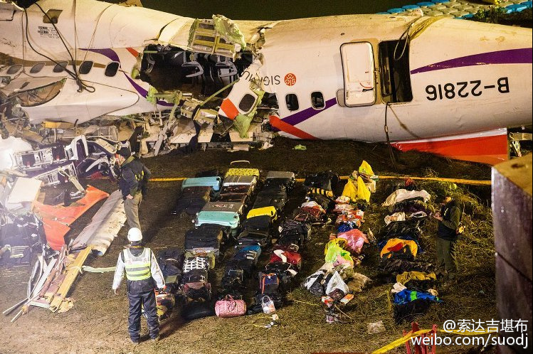
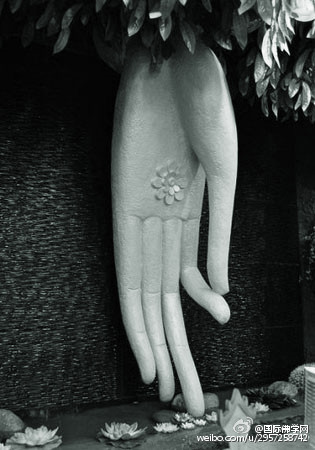
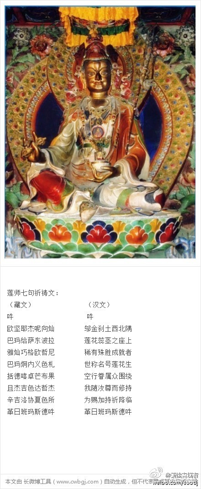
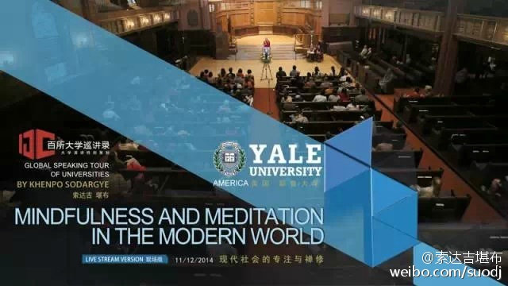
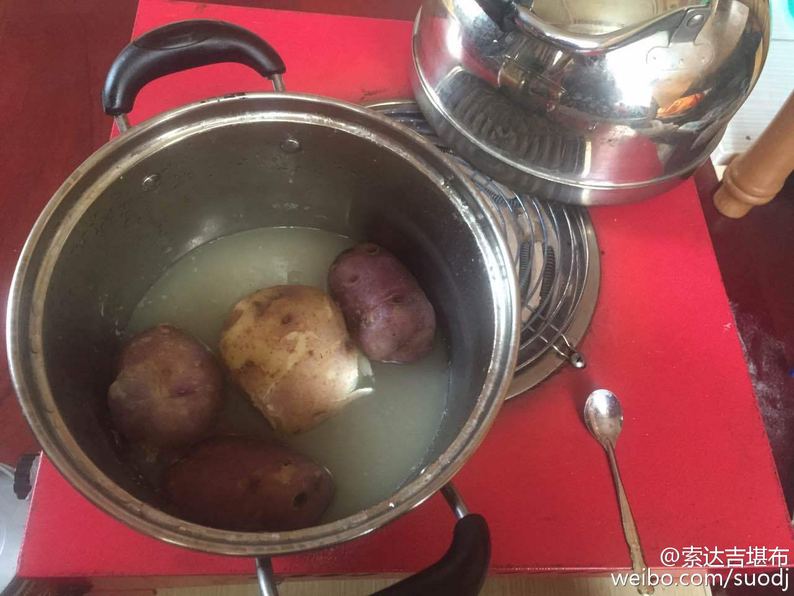
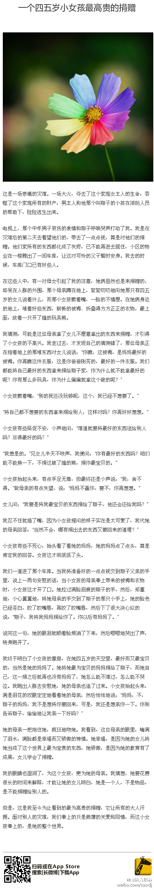

 ## 2015-01-01 08:32
在新年的第一天，祝福大家健康、吉祥、快乐。若能在今天念莲师心咒“嗡啊吽 班则革日班玛色德吽”、度母心咒“嗡 达热 德达热 德热 索哈”108遍，有助于遣除一年中的不顺，所愿的事情如愿以偿。我们一起来吧！

 ## 2015-01-02 07:23
1月2日—1月9日，为期8天，喇荣五明佛学院将举办法王圆寂11周年纪念法会。法会每天四座，从早上7点半到晚上6点半，主要念诵“上师供”、“金刚萨埵修法及心咒”、“普贤行愿品”等。忆念上师的功德很大，望大家尽量参与，同时推荐看一遍法王传记与《不离》。直播地址如下：

 ## 2015-01-03 11:04
每个人都有前世，只不过我们不知道而已，这在佛教里面讲得非常详细。L死后10年投胎转世，回去找家人，你信吗?

 ## 2015-01-04 11:40
O不离，一个跨越生死的誓言——听索达吉堪布怀念...

 ## 2015-01-04 11:41
今天是上师法王如意宝圆寂十一周年纪念日，但上师的智慧、慈悲、加持没有离开我们。O网页链接
 > @索达吉堪布
 > O不离，一个跨越生死的誓言——听索达吉堪布怀念...

 ## 2015-01-05 12:21
法王圆寂法会，这些供品是酥油做的。

 ## 2015-01-05 23:27
这几天翻以前上学时的笔记本，不经意发现了这个。那是出家的前一年，我上街买了一盒彩笔，兴奋地回到宿舍画了这只孔雀，结果没有去上晚自习。献给有缘的你~

 ## 2015-01-06 00:00
这也是当时我画的，或许它预示着我的未来……

 ## 2015-01-07 15:49
你我都可以快乐，很简单。

 ## 2015-01-08 10:25
为什么很多人学佛会被骗？最关键的原因就是，现代人对佛陀的真实教义很不重视。他们对佛法的认识，只以自己的分别念作取舍，几乎从来不以佛菩萨的言教为依据，致使一些不学无术的人有机可乘，到处招摇撞骗。——法王如意宝晋美彭措

 ## 2015-01-09 08:14
很多人都曾拥有幸福，最后却变成痛苦，这是为什么？因为他们忘了很重要的一件事：幸福是短暂、有限的美丽。若知道这一点，你幸福了一阵子，一旦它消失也很正常。否则，把所有希望都寄托在肥皂泡上，结果可想而知。

 ## 2015-01-13 08:50
很多重要的事情，因缘具足了就要马上做，不能一直拖。否则，机会稍纵即逝，最后想做也做不成了。

 ## 2015-01-14 10:57
财富、感情、地位、名声，当你没有得到时，感觉这些特别美好，可真正拥有了，发现也不过如此。而以信心获得的证悟，没得到时很想要，一旦得到了，它的美好经久不衰，带给你的快乐绵绵不绝。

 ## 2015-01-15 22:58
今天在特殊的日子里，祈祷二十一度母加持你。平常也要多念度母心咒“嗡 达热 德达热 德热 索哈”。信心、咒语、佛菩萨加持等众缘具足时，它的力量不可思议。

 ## 2015-01-16 22:23
解疑

 ## 2015-01-17 20:44
莫舍己道，勿扰他心。
 > @国际佛学网
 > 第12届法王菩提伽耶涅槃法会O网页链接

 ## 2015-01-18 08:16
现在有些人说话很直，不管什么话都敢说，结果得到很多人的赞叹，认为这不装，有个性。其实，说话应该考虑别人的感受，这是做人最起码的素质。藏族有句俗话：“说一句话，要看在场所有人的脸。”真正有智慧的人，说话特别有分寸，说什么都会考虑护别人的心，这才是值得随学的。

 ## 2015-01-18 18:12
不管在什么环境中，有利他心的行为都让人感动。姚贝娜走了，却把光明留给别人，唱响了人生中最美的歌曲。嗡玛尼贝美吽~

 ## 2015-01-20 10:16

 > @索达吉藏文化
 > 贪心、嗔恨、愚痴、傲慢、怀疑这五毒烦恼，没有认识它时，它就像大石头一样，压在每个人的头上。一旦认清了烦恼的本性是智慧，一切烦恼自然解脱，所有的石头都会卸掉。

 ## 2015-01-20 11:31
据说，钱没有人时是一张废纸，人没有钱时是一个废物。但是，钱有人时可能会易主，人有钱时可能会迷醉。

 ## 2015-01-23 07:56
打坐的姿势很重要

 ## 2015-01-23 21:07
不管对谁，名人也好，普通人也好，我们都不要太苛刻。看到别人有不对的地方，应当反省自己有没有这个问题，而不是拼命去辱骂他、诽谤他、攻击他。古人说，择其善者而从之，其不善者而“改”之。不是而“责”之。

 ## 2015-01-25 06:18
白天想念您，晚上梦见您，无论在哪里，上师都不离。喇嘛钦~

 ## 2015-01-26 10:11
不管是什么东西，你越执著，它越会让你痛苦。要想不执著，唯一方法就是认清它的真相。只有这样，这个游戏才会结束，你才能不继续被骗，也不再自欺欺人。这在佛教中，被称为解脱。

 ## 2015-01-28 08:01
佛教分为小乘、大乘。小乘的修行目标是为了自己从烦恼和痛苦中解脱；大乘唯一希望所有众生彻底解脱，并身体力行地饶益他们。

 ## 2015-01-30 10:51
人生是一场戏，而死亡不是生命的断灭，只是这场戏演完之后，进入下一场戏的换场过程。实际上，我们每一个人都是入戏很深的演员，只不过没有认识而已。

 ## 2015-01-31 10:28

 > @索达吉藏文化
 > 一个穷人问佛陀：“我为什么这么穷？”佛陀回答：“因为你以前没有布施。”穷人：“我没有钱，布施什么呢？”佛陀：“即使没有钱，但你给别人一个微笑、用欢喜的眼神看别人、口里赞叹别人的功德、心里想要利益别人、身体对别人恭敬承侍，这些也都可以布施。”

 ## 2015-01-31 11:01
南无本师释迦牟尼佛

 ## 2015-01-31 17:58
我也想参与
 > @上海慈慧公益基金会
 > 【志愿者年会】#爱是一种生活#2015慈慧志愿者年会开场，爱会带给你无限温暖，也会带给你快乐和平安。爱是一种生活，他就在我们身边，今天，我们就一起来感受爱，表达爱～

 ## 2015-02-02 07:57
不要因为一点小事就发很大的脾气，更没必要跟人大吵。即使出现了让你不高兴的事，也不能让嗔心一直“凝固”，融化不了。生气后转头就忘，在佛教中也是一种成就相。有句格言说得好：大成就者生气，就像棍子击打水面的痕迹，一下子就没了。

 ## 2015-02-03 11:46
现在，很多人只是表面上皈依了佛教，却从来没有系统地学过佛法，这不算真正入了佛门。就像一个学生只是办了入学登记，但根本没有上过课，哪怕他在学校呆了十几年，也算不上是这所学校的学生。

 ## 2015-02-05 20:37
看看近期发生的几起灾难，越发觉得生命如此脆弱。嗡玛尼贝美吽，嗡玛尼贝美吽，嗡玛尼贝美吽

 ## 2015-02-07 13:45
悲惨的，不只是动物的痛苦与死亡，而是人间丧失了同情与悲悯。《悲惨世界》（有声书O网页链接），静候你的慈悲。

 ## 2015-02-08 20:54
早晨喝一杯开水，有利于治百病，让身体得到净化；早晨发一念善心，可以清扫内心的垃圾，让心灵得到净化。若能天天这样坚持，我们的身心会健康起来，不但自己快乐，也会给身边的人带来幸福。

 ## 2015-02-11 10:09
“低头症”是一个代词，表示“手机”与“冷落”的结合。它已经出现在了2012年澳大利亚的国家新词典当中。

 ## 2015-02-12 09:24
烦恼就像一片云，来时无有影，去时无踪迹；烦恼就像一阵风，看似很有力，实则无本体。

 ## 2015-02-13 10:12
放下仇恨，用慈悲包容敌人，可能许多人一下子很难接受。但从长远来看，报复让自己永远得不到解脱，只有宽恕，才能让仇恨得到超度。
 > @国际佛学网
 > 台大副教授谢焕儒在河滨公园遭毒瘾发作的杨振堂用棍棒打死，他的妻子张美瑛马上从花莲赶回台北。她没有呼天抢地的大哭，也没有咒骂杨振堂，她默默流着眼泪，靠在丈夫耳边轻声说：“爸爸，我们原谅他。”若丈夫能够听见她的声音，她只希望丈夫走得无有牵挂O网页链接放下仇恨，用慈悲唤醒他人

 ## 2015-02-14 10:56
把一个陌生人变成自己的至亲，以他的苦为苦，以他的乐为乐，这是世间上的爱。把每一个陌生人都当成至亲，希望这世上最好的东西给他，却不执著他为己有，这是佛教中的爱。

 ## 2015-02-15 10:15
我们现在迷恋的很多东西，如同小孩的玩具。玩具只能带来一时满足，如果把它当真，注定会让自己陷入痛苦。但若认识到它背后是空洞的，即使得不到也无所谓。

 ## 2015-02-16 09:31
观赏别人的痛苦，是最冷漠的看客。O网页链接

 ## 2015-02-17 08:03
当一个人兴盛成功时，不是他的功劳也会推到他头上，无数人进行点赞、献花；当一个人衰败破落时，不是他的过失也会堆到他身上，无数人进行谩骂、唾弃。所以，面对一些是是非非，若具有敏锐的辨别智慧，才不会随声附和、人云亦云。

 ## 2015-02-18 09:58
我合掌祈请八吉祥佛、八吉祥菩萨、八吉祥天女、八吉祥护法加持：赐予你健康、安乐、圆满，遣除不顺、违缘、痛苦。一年之计在于始，新年的第一天，若能念诵《圣八吉祥颂》一遍，依靠佛菩萨的加持，可护佑自己和他人在这一年里吉祥增上，快乐连连，身心自在，六时吉祥。L《圣八吉祥颂》原声首发 索达吉堪布新年祝福 ¡查看图片

 ## 2015-02-19 07:42
新年好，祝福你~L五明佛学院索达吉堪布新年祝福

 ## 2015-02-23 07:33
这个月是“神变月”，每一天都是吉祥日，行持任何善法，功德均会成千上万倍增长。希望大家在这样的日子里，尽量不要散乱，放生、吃素、念经、供灯、回向……并发愿在新的一年里尽可能做些帮助别人的事。

 ## 2015-02-25 09:09
爱，不单单是付出，也要顾及对方的感受。如果以“爱”的名义，把对方盯得死死的，一呼一吸都在你的监视范围之内，那你越爱他，他越想逃。不仅恋人之间如此，父母与子女之间也是一样。

 ## 2015-02-26 07:50
人类所有的思想中，利他心是最珍贵的。不管是什么国家、什么身份的人拥有，我们都应该给他点赞。

 ## 2015-02-27 08:57
纵然你无法得到渴望的一切，满足现在所拥有的，也是第一富翁。

 ## 2015-02-28 10:58
当你的理想与现实冲突时，只有选择现实，因为你暂时没有自由。但若不忘初心，也会有美梦成真的一天。

 ## 2015-03-04 08:16
O最真实的东西，往往看不见——索达吉堪布加拿大... L发现之旅——索达吉堪布加拿大高校巡讲

 ## 2015-03-05 07:58
在新年的第一个月圆之日，愿你的智慧、善心、福德，如今晚的月亮一样圆满！元宵节快乐！

 ## 2015-03-06 09:07
人生只是一场戏，每个在台上演戏的人，认真扮演自己的角色就好。如果你不会因台下观众的喝彩而兴奋，就不会因他们的嘘声而伤心。如此心不随境转，你会自在而出色地演好每一场戏份

 ## 2015-03-07 11:56
没有雾霾的藏地天空，纯净

 ## 2015-03-08 08:21
淡定的心，不再浮躁；自在的心，不再寂寞；轻松的心，不再忙碌；解脱的心，不再苦恼……祝普天下的女人节日快乐！

 ## 2015-03-09 07:46
在这些山顶上，我小时候经常光着脚放牦牛，很亲切。如今童年已逝，蓝天依旧。

 ## 2015-03-09 08:04
这几天佛学院共修“莲师七句祈祷文”，要求每人念三万遍。即使你不能参与，最好也尽量念诵，如此，功德水滴会融入僧众共修的大海。

 ## 2015-03-20 07:47
今天的日子很殊胜，是世界无肉日，神变月的最后一天，还会出现日全食（15:40-19:50）。希望大家不要错过难得的机会，尽量吃素、放生、行持善法

 ## 2015-03-21 07:40
攻人之恶勿太严，要思其堪受；教人之善勿过高，当使其可从。——菜根谭

 ## 2015-03-23 08:15
佛陀不是去除你的痛苦，而是告诉你真相，让你想办法从痛苦的梦魇中醒来。什么真相呢？束缚你的，是你自己，所以解开它，也只有靠自己。

 ## 2015-03-25 09:53
三十多年来，我认真学习修行《大圆满前行》，始终不离的就是这部法。你们若想全面了解佛法，希望经常翻阅它。对有信心的人来说，这部法越学越深。

 ## 2015-03-25 11:30

 > @索达吉藏文化
 > 如今，多芒佛学院的外部建筑已全部竣工，僧众可以在里面正常地闻思修行了。感恩对此给予支持、帮助的所有人，将此善根水滴融入菩提大海而进行回向！

 ## 2015-03-26 08:27
一个人不管犯了什么错，都要学会宽恕他。你可以这样想：＂假如我置身于跟他一样的处境，承受一样的因缘，难保不做出同样的事情。虽然这并不绝对，但有这种可能。”所以，像宽恕自己一样去宽恕别人吧。

 ## 2015-03-27 08:57
对一个极度痛苦的人来说，不管他是什么身份，心理都会很脆弱。我们如果看到了，一定要尽量帮助他。哪怕给他一点安慰，也可能改变他当下的心态，甚至影响他的一生。

 ## 2015-03-28 07:56
当你遇到不可逆转的命运时，不应该用惯性思维去面对，若能从另一个角度理解，事情马上就有不一样的意义。思考问题，不能只困在一个极端。

 ## 2015-03-29 09:04
很多人只喜欢迎接出生，却拒绝接受死亡，这有点偏激。就像一个人只爱早上醒来，却不愿晚上睡下一样，忽略了后者也是自己必须经历的事。其实，就算你睡下了，第二天照样还会醒来，生死也是一样的道理。

 ## 2015-03-30 08:08
这两张照片，是1990年在不丹时，法王去莲师虎穴的途中拍的。回顾20多年前朝拜莲师山洞的历程，记得法王当时说：若能多祈祷莲花生大师，每天念莲师心咒“嗡啊吽 班则革日班玛色德吽”108遍，在这个如梦幻般的人生中，很多愿望都可以实现。

 ## 2015-03-31 08:05
量子物理学家玻尔告诫：在寻找生命的和谐时，人们千万不能忘记，在存在的戏剧中，我们自身既是演员，又是观众。

 ## 2015-04-01 07:57
轮回中的众生，没有认识自心的本来面目，无我执著为我，无常执著为常有，颠颠倒倒犯了很多错。所以，我们都可以叫愚人。每逢愚人节，应当以此来提醒自己：不要再愚下去了！

 ## 2015-04-02 08:10
不能不知道的“念珠那些事”O不能不知道的“念珠那些事”——索达吉堪布开示念...

 ## 2015-04-03 07:54
过于地爱和过于地恨，都让心处于不平衡的状态，人一极端了，什么都会做得出来。人们总认为恨能带来伤害，却忽视了爱也有这种杀伤力。

 ## 2015-04-04 07:54
今天（4月4日）18:15—21：45是月全食。《时轮金刚》中说，在出现日食或月食的日子里，无论作任何善行，功德均会成千上万倍增长。汉地的《苏悉地经》亦云：“于月蚀时，成就最上之物；于日蚀时，通上中下成就之物。”希望大家把握良机，精进行持善法。
 > @索达吉堪布
 > 为什么日月食是极为重要的修法时机呢？《时轮金刚》认为，外在的日、月，是人体内在气脉明点的一种投影。我们每个人每天的呼吸次数是21600次，其中绝大多数是业气，智慧气的比例很少。但在这些特殊的日子里，多数业气就变成了智慧气，气脉明点运行处于特殊阶段，在这时候精进修行，其效果会非比寻常！
 ## 2015-04-04 09:05
英文版《不离：上师人生开示录》，近期由美国香巴拉出版社发行。《西藏生死书》作者索甲仁波切推荐说：“晋美彭措仁波切是一位难以置信的精神导师，为藏地乃至中国佛教的再弘做出了不可磨灭的贡献。我毫不犹豫竭诚向所有寻找真理的人推荐这本珍贵的教言。”香巴拉网站：O网页链接

 ## 2015-04-05 09:18
多念“嗡玛尼巴美吽”（观音心咒）、“南无观世音菩萨”、“南无阿弥陀佛”，或者《地藏经》，这是纪念亡人最好的礼物。

 ## 2015-04-06 07:51
回到过去，找不到“我”；前往未来，找不到“我”；就算当下也找不到“我”，但如梦中的“我”，就是它。

 ## 2015-04-07 09:36
今天是农历二月十九，观世音菩萨的圣诞日。许多人跟观世音菩萨的因缘非常深，不管是否学佛，都喜爱并崇敬这位大慈大悲的菩萨。希望大家今天多祈祷观世音菩萨，多念“南无观世音菩萨”，为自己、为他人、为这个世界增添一分平安喜乐。南无观世音菩萨~

 ## 2015-04-08 08:06
这个时代，找到知识很容易，但更需要理解它们的真正含义。【Kia Ora 新西兰】——海外高校巡讲系列纪录片L索达吉堪布新西兰高校巡讲纪录片 更多视频请关注：O网页链接海外用户O网页链接 ¡查看图片

 ## 2015-04-09 18:23
我在院子里种了一棵树，不知道叫什么名字，说是很好~

 ## 2015-04-10 07:55
未经观察的人间快乐，如果你得到了它，会发现：每一个快乐带着一个痛苦。

 ## 2015-04-12 08:22
你今天的善良真诚，会成为明天的快乐；你今天的快乐，来自昨天善良的汇集。

 ## 2015-04-14 08:15
我们在无明“导演”、业力“剧本”的支配下，正在演着不同的戏。虽然有时需要笑、有时需要哭，但不要太当真，毕竟它是虚幻的。

 ## 2015-04-16 09:05
这个时代，知识可以从网上轻易获取，博学不再是人们的向往，但由于缺少了文化，即使你掌握再多以前不知道的知识，也不一定有能力与烦恼相处。其实，人一辈子的时间非常有限，每天在浏览铺天盖地的信息时，我们应该想一想：到底什么才是自己最需要的？

 ## 2015-04-18 07:54
接触一件新的事物时，不管别人说得有多玄妙，我们也应该用智慧去观察、用逻辑去推断，包括对佛教也应如此。藏传佛教中的辩论，起的就是这个作用，它让我们不盲从、不回避，任何疑问都可以拿到桌面上来分析。

 ## 2015-04-19 08:52
2015年佛学院的金刚萨埵法会，现在流传有很多版本，但都不是官方通知。今年的法会比较小型，鉴于附近正在修路，佛学院的食宿、厕所、用水等不能满足很多人的希求，佛学院负责人通过商量，希望想来参加法会的人，在当地共修，以此也可得到同样的功德。我们也会通过网络直播等，给大家提供方便。感恩~

 ## 2015-04-22 08:24
孤独寂寞时，找朋友倾诉或者疯狂购物，不一定能解决问题。依靠禅修内观自心，即使不需要人陪，也会自在快乐。

 ## 2015-04-23 06:31
春天来了，藏地还在下大雪，真美！

 ## 2015-04-23 19:55
今天去了不同的四个地方，讲了四堂课，每堂都是2小时左右，又下雪，如果不是佛法真理，确实很难支持，有点累。明天、后天还要……

 ## 2015-04-25 20:03
尼泊尔发生8.1级地震，已有多人遇难，佛学院全体僧众正在念经，希望大家也为生者多念莲师心咒“嗡啊吽 班则革日班玛色德吽”，为亡者多念观音心咒“嗡玛尼贝美吽”。

 ## 2015-04-27 08:47
修行好的人，不管遇到逆境、顺境，都会成为修行的助缘。藏地大德晋美朗巴说：在突然面临恶缘和障碍时，应把这些全看成是上师和佛陀的慈悲加持，以及修行的成果。

 ## 2015-04-28 07:16
当你真正证悟时，会对每一个被“我执”束缚的众生，生起强烈的悲悯之心。因为你深深体会到：他们的这种颠倒执著，会让自己尝尽苦头。

 ## 2015-04-29 07:03
以众生作为对境，希望他（它）远离一切痛苦，这叫“悲心”；这种心态无法控制，以致泪流满面、身体颤抖，这叫“大悲心”；不单单是一个众生，希望所有众生都远离痛苦，这叫“悲无量心”。试问，我们有哪一种？

 ## 2015-05-01 07:12
智慧没有国界L智慧没有国界——索达吉堪布美国高校巡讲 O智慧没有国界——索达吉堪布美国高校巡讲

 ## 2015-05-03 07:49
人总会在有意无意间，做下很多让自己后悔的事，若想忏悔这些罪业，念修金刚萨埵是最灵验的法门。本月底，佛学院将举办金刚萨埵法会，集僧众之力为一切众生忏悔业障。如果你想参与，可以从现在起开始，念金刚萨埵心咒“嗡班杂萨多吽”， 若能念满四十万遍，最难忏悔的罪业也可清净。

 ## 2015-05-04 07:53
修金刚萨埵法门，如何清净自己的罪业呢？《略说忏罪》O智悲佛网

 ## 2015-05-04 07:55
早上一看，院子里长了很多银树，真美！

 ## 2015-05-05 07:37
以前一个人牵着羊走路，五个骗子为了得到羊，约定在不同地方告诉他：他牵着的是狗。起初这人确信是羊，后来有点动摇，最后看这么多人都说是“狗”，就把羊给扔了。这故事听起来荒唐，但在我们生活中随处可见。很多人在各种宣传下，渐渐会迷失判断方向，把假误以为是真，最后放弃自己的原则，人云亦云。

 ## 2015-05-07 07:49
随着工业革命、科技进步，晴朗的天空被雾霾取代了，有些人的白衬衫，出去一天就脏了；随着网络、智能手机等问世，单纯的生活被海量信息取代了，有些人早上一开机，就停不下来了。跟古人相比，毋庸置疑，我们现在便利了许多，但是短期的便利与长期的幸福，哪一个更需要呢？我们该为此做些什么？

 ## 2015-05-08 07:59
我知道年轻人喜欢外在这个多彩世界，也希望借由对各类事物的拥有来证明自己，但是，我倒宁愿大家更理智地看待人生。也许你们认为拥有了就是成功，没有就是平凡，但更多经验却证明，你如何拥有，如何面对平凡，如何在情感、名利、责任等问题上取舍，是很决定人生品质的。O网页链接

 ## 2015-05-09 08:08
处世让一步为高，退步即进步的张本；待人宽一分是福，利人实利己的根基。——菜根谭

 ## 2015-05-10 08:19
汉字的“妈”，是由“女”和“马”组成。在我们的生命中，有个女人一辈子在给自己当牛做马，她就是妈妈。所以，母亲的恩德无法言喻。今天恰逢母亲节，祝福所有母亲节日快乐，也祈愿所有子女能够体会母亲的苦心，想清楚如何才是真正的报答。

 ## 2015-05-10 10:11
今天，很多人给我发来一条微信，问是不是我写的，名为“索达吉堪布母亲节的祝福：献给我无数的母亲”，落款是局.索达吉。这条微信跟我没有关系，我也不认识此人，近期很多人把他当成我，特此澄清一下。

 ## 2015-05-11 07:21
心念的本性如虚空，如果你自然安住，它是无利无害的；一旦分别执著，则有百害而无一利。

 ## 2015-05-13 08:48
不管发生什么，别人赞你也好，骂你也罢，总是无常变化的。若不了知这一点，就会过于计较眼前的得失，执著一时的荣辱。只有明白了，才能对一切坦然处之，真正做到“宠辱不惊，闲看庭前花开花落”。

 ## 2015-05-14 07:31
#你在忙什么？#身体的忙碌，根本在心。愿你通过这本书得到宁静的心灵，减少无意义的忙碌，活得更加淡定。当当O网页链接 亚马逊O你在忙什么 京东O网页链接 淘宝O网页链接

 ## 2015-05-17 08:21
许多人希望自己好运，经常到处求这个拜那个。其实，好运的钥匙，别人给不了你，它唯一掌握在你的手里。是什么呢？印光大师曾为我们揭示了这个秘密——心好命又好，富贵直到老；命好心不好，福变为祸兆；心好命不好，祸转为福报；心命俱不好，遭殃且贫夭。

 ## 2015-05-18 08:25
刚刚得知，世间明灯、我的大恩上师德巴堪布仁波切已示现圆寂。对我而言，他老人家的恩德难以报答，他让我出家，他带我依止法王如意宝，他给我传授了甚深佛法……有缘者若想与德巴堪布仁波切接上善缘，请多放生、供灯等行持善法。喇嘛钦

 ## 2015-05-19 17:55
当具德上师永远离开这个世界时，作为弟子，虽然也懂一切无常，任何美好都不会长久，但仍觉得世界突然变得空荡荡，一切都暗淡无色，有时候自己也有种麻木的感觉

 ## 2015-05-20 18:04
这个世上，谁都不想当坏人，但因为生存的需要，可能说过谎话；因为工作的缘故，可能伤害过别人；因为智慧不够，可能产生过邪见……对有些人来说，往昔的过错压在心里像一座山，让自己有强烈的负罪感。其实，若能默默在佛像面前，真诚不虚伪地忏悔，这会产生一种无形的力量，让一切罪恶渐渐清净。

 ## 2015-05-21 08:15
手持智慧宝剑、般若经函的佛像，只是形象的文殊菩萨。而认识明空无二、不可言说的心性，才是真正的文殊菩萨。在内观的当下，有缘者谁都可以亲见他。今天是文殊菩萨圣诞，望大家多祈祷文殊菩萨，以期早日见到自己的本来面目。

 ## 2015-05-23 08:29
障碍我们的，不是财富，是对财富的执著。——《你在忙什么》

 ## 2015-05-24 07:52
明天是汉历四月初八，释迦牟尼佛的圣诞，藏历也是佛诞日。本月又是特殊的萨迦月，做任何善法，功德均会呈无数倍增长。所以，希望大家为了自己，也为了一切众生，明天吃素、放生、持咒、忏悔等，尽可能多地行持一些善法。

 ## 2015-05-25 06:37
2015年5月26日－6月2日（藏历四月初八至十五），喇荣五明佛学院将举办为期八天的金刚萨埵法会。大家若有条件，希望按照佛学院的要求参与共修；即使没有时间参加，最好也能多念金刚萨埵心咒“嗡班杂萨多吽”，这是忏悔业障最有力、最灵验的方法，任何人都可以念修。O网页链接

 ## 2015-05-27 06:56
金刚语的加持不可思议，请多念此祈祷文。L“怀”念 怀业祈祷文

 ## 2015-05-29 08:31
诽谤、挫折、失败、疾病等任何形式的痛苦，其实是非常伟大的老师。依靠它，可以看清很多事情的真相，不再盲目地自我膨胀。

 ## 2015-05-30 08:48
我们都在做梦，你信吗？L清华解梦 L《盗梦空间》的佛学实相（访谈） ¡查看图片

 ## 2015-06-01 22:32
不要总想让孩子变成什么样的人，父母应该先变成这样的人，因为你就是孩子的“传承上师”，孩子的未来跟你有关。O网页链接
 ## 2015-06-02 16:01
祈祷观世音菩萨加持，这个世界不要再有那么多灾难了，嗡玛尼贝美吽

 ## 2015-06-05 18:37
许多人都喜欢自己漂亮，其实，漂亮的最好方法就是保持内心清净，这样的美才令人视而不厌。《正法念处经》中说： “心清净故，血则清净；血清净故，颜色清净；颜色净故，端正无比；以端正故，一切人见心得清净，爱乐瞻仰。”

 ## 2015-06-07 06:51
祝福广大学子高考顺利！同时，有几句话想跟你说——

 ## 2015-06-09 10:19
到澳门了，一个似乎没有太多商业气息的城市，今天的交流主题是《佛教如何面对灾难》

 ## 2015-06-09 21:39
人做的善事和恶事会互相抵消吗？

 ## 2015-06-11 08:11
当你爱一个人的时候，无论对方做错什么，都可以原谅；当你恨一个人的时候，就算对方什么都没做错，也有理由讨厌他。所以，自心是一切的作者。

 ## 2015-06-14 08:02
常常发现，小孩问到有关死的问题时，家长便惊慌地阻止，叫他不要瞎想。其实，死是人生第一大事，古希腊哲学家将其看作最重要的哲学问题，无人可以回避。只有从小就敢于正视和思考死亡的人，长大后对人生的态度才会更加深刻、正确。

 ## 2015-06-16 06:45
从前一个流浪多年的乞丐，每天都睡在一个旧箱子上，突然有个陌生人告诉他，箱子里藏有无价之宝，他打开一看竟然满是黄金。我们每个人其实也像这个乞丐，明明身怀圆满佛性却不自知，直到某一天，有缘的上师以窍诀指点，自己认识了本来面目，才发现一切痛苦都白受了，一切问题都解决了。

 ## 2015-06-18 08:52
当我们因为一些事情不开心时，要学会想到：这事若是发生在有一定境界的人身上，他们也许并不在意，这一切只是自己庸人自扰。同时应该反观内心，去体会烦恼从自心产生，也消失于自心，犹如乌云，生于虚空，也灭于虚空。

 ## 2015-06-19 14:07
希望更多人关心身边需要帮助的人
 > @山东监狱
 > 近日，索达吉堪布到青岛监狱讲座交流并捐款救助贫困服刑人员，索达吉堪布应青岛市红十字会邀请到青岛监狱为服刑人员进行讲座交流，并向青岛市红十字会心桥基金捐款5万元定向资助家庭贫困服刑人员，赠送其述著《你在忙什么》。@索达吉堪布

 ## 2015-06-24 22:30
高僧大德为什么不“大显神通”？

 ## 2015-06-27 07:50
每个人的人生 ，都有顺利到达顶峰时，也有受挫跌入低谷时。所以，成功时不要趾高气昂，落魄时不必垂头丧气，因为一切都会过去的。

 ## 2015-06-30 13:03
此次出行，今天终于圆满了，吃个水果、喝杯咖啡庆祝一下

 ## 2015-07-01 21:07
以恨对恨，恨永远存在；以爱对恨，恨自然消融。

 ## 2015-07-03 20:58
不苦也需要学佛吗？

 ## 2015-07-07 09:25
这是六月每一天的记录。短短30天，在人生长河中似乎微不足道，每个人有每个人的活法。这种活法，有些人或许不以为然，有些人或许会得到一点什么。O人间六月天——索达吉堪布30天的密密足迹

 ## 2015-07-18 08:19
佛教中如何看待金钱呢？它不是善也不是恶，不是美也不是丑，关键要看它怎么用。用好了，可以造福众生、自利利他；用不好，也能滋长欲望、害人害己。但可惜的是，许多人没有把它用好，以至于这世上80%的幸福与金钱无关，80%的痛苦与金钱息息相关。

 ## 2015-07-20 07:13
今天是我的生日，给你们唱一首祈祷文，祝福大家平安吉祥。如果想送我“生日蛋糕”，我最喜欢的是放生，哪怕只有一只鸟、一条鱼、一个小蚊子。L索达吉堪布《怀业祈祷文》原声首发 O它能让你更自在——索达吉堪布《怀业祈祷文》原... ¡查看图片

 ## 2015-07-23 09:35
最近佛学院正在开“地藏法会”。地藏菩萨可满足众生一切所愿，若能多祈祷、多念“南无地藏王菩萨”，不管你有什么心愿，都容易顺利实现。

 ## 2015-07-26 09:57
在人世间，我们遇到的事情，经常有各种复杂、棘手、麻烦，但不管怎样，不能因为事情而影响心情。事情还是要做，但心情要保持快乐。

 ## 2015-07-27 08:32
小木屋周围的宁静

 ## 2015-07-29 09:34
宽恕不是给别人一条生路，而是给自己一条生路。不懂宽恕别人的人，只会让自己的路越走越窄，因为他忘了，自己迟早也需要被宽恕。

 ## 2015-07-29 19:39
时时是好日~

 ## 2015-08-01 07:15
2015年8月1日-4日，第五届世界青年佛学研讨会在美丽的泰国清迈举办，围绕“终极关怀”主题，深入探讨“心灵安适”、“生与死”、“藏传佛教传统”三个话题。 观看现场视频 1.中文： O网页链接 2.英文： O网页链接

 ## 2015-08-01 07:28
从小就希求解脱

 ## 2015-08-02 08:40
南传佛教、北传佛教、藏传佛教三大教派高僧大德，对当前人们心理问题的探讨——第五届世界青年佛学研讨会

 ## 2015-08-06 19:27
第五届世界青年佛学研讨会终于圆满了，感谢每一位参与者！

 ## 2015-08-07 07:19
向外走，你会做梦。向内走，你会觉悟。L第五界世界青年佛学研讨会视频－宣传片

 ## 2015-08-08 08:40
每个人，或许有不同的人生，但一定有相同的压力。中文版：L心灵安适（中文版） 英文版：L第五界世界青年佛学研讨会视频－心灵安适

 ## 2015-08-08 08:43
岁月是最高明的化妆术。中文版：L生与死（中文版） 英文版：O第五界世界青年佛学研讨会视频－生与死_土豆_...

 ## 2015-08-08 09:00
这就是西藏，用令人眩晕的海拔，守护着迄今最完整、传承最清净的藏传佛教。中文版：L藏传佛教传统（中文版） 英文版：L藏传佛教传统

 ## 2015-08-08 10:22
第五届世界青年佛学研讨会精彩回顾L第五届世界青年佛学研讨会精彩回顾

 ## 2015-08-11 09:10
佛教怎么看待算命？它往往揭示了事物的现象，却少触及事物的本质。某人为什么短命，为什么贫穷，为什么一生不得志？……很难解释清楚。如此知其然，不知其所以然，有点舍本逐末。佛教认为，只有认清了业力的规律，才能从根本上通达命理，用断恶修善的方法改造命运，否则，其他一切都徒劳无益。

 ## 2015-08-12 07:53
我们身边的环境，各种诱惑很多，要想不被这些所吸引，就要认清Ta的真相。如果通过观察，看清Ta的本质虚幻不实，那Ta表演得再精彩,，也不可能染污你、动摇你。有了这面“智慧”照妖镜，哪怕在最糟糕的环境中，你依然可以像一朵莲花，出淤泥而不染。

 ## 2015-08-13 10:23
嗡玛呢叭美吽，嗡玛呢叭美吽，嗡玛呢叭美吽……

 ## 2015-08-14 09:36
正直的人，通过自己的了解认定一个朋友之后，不管他有什么遭遇，对他的情谊永远不变。不会因为他被人拥护就亲近他，也不会因为他遭受衰败而舍弃他。这种情谊就像松树，四季都是绿色的，不随严寒酷暑而随意变色。

 ## 2015-08-15 08:55
要想做好一件事情，经验有时候比技术更重要。没有经验的人，看起来很有本事，口才很好，但常会不顾实际情况，只会纸上谈兵。就像一个刚拿了驾照的新手，在驾校的考试成绩再好，也不如开车多年的老司机。

 ## 2015-08-16 08:27
我们情绪上的很多波动，常是一些不必要的担心和焦虑。若能通过禅修，认识心性，令心安住，让心回到原始的状态，那不论遇到什么，情绪都不容易随外境而起伏。这种快乐，是拥有财富、名声等无法代替的。

 ## 2015-08-17 08:51
人在快乐的时候，一般不容易学到很深的道理。如果感受一次痛苦，有智慧的人就会思考很多，学到很多。痛苦是一种经验，也是一种教育，依靠它，可以让自己内心强大，还能生起一种同理心，理解别人的情绪和感受，对别人的痛苦萌发悲心。

 ## 2015-08-18 00:11
哈哈 L泰国2岁超萌小和尚，不爱念经爱睡觉 ¡查看图片

 ## 2015-08-20 10:13
很多时候，你遇到一些棘手的问题时，若苦思冥想也想不出解决之道，那不如暂时先放下思考，然后看看这方面的书，请教一下有经验的人，或许你会从中得到想要的答案。孔子也说：“吾尝终日不食，终夜不寝，以思。无益，不如学也。”

 ## 2015-08-20 17:51
煮了一锅土豆，味道不错

 ## 2015-08-22 08:18
今天的善行，明天的美好。

 ## 2015-08-23 08:00
心底宽阔的人，不管到哪里，接触什么人，自己都很快乐；而嫉妒敏感的人，则觉得处处都是荆棘的刺，把自己扎得浑身是伤。

 ## 2015-08-24 09:09
见人说人话，见鬼说鬼话，虽然是个贬义词，但你如果内心无私、一心想利他，与人沟通时，也许需要这种说话技巧。不然，你不关心别人喜欢什么，只讲自己认为正确的东西，对方不一定听得进去，也很难从中有什么收获。所以，有些事情的是否对错，不一定在于约定俗成的判断，而在于你的当下一念。

 ## 2015-08-26 08:38
有些人依靠自己的福报和努力，获得与众不同的成就时，经常有人莫名其妙就看不惯，动不动就无理取闹、说三道四。其实古往今来，这是一个正常规律，古人也说：“木秀于林，风必摧之；堆出于岸，流必湍之；行高于人，众必非之。”

 ## 2015-08-27 08:28
我们在学修佛法时，需要通过理性的抉择，对三宝生起一种信心。这种信心不是人云亦云，也不是一时冲动。有了它，即使你身处最艰难的环境，行为上不得不随顺他人，内心也不会舍弃三宝。

 ## 2015-08-28 09:54
一辈子听了很多道理，但一句也没有用上，还不如只听过一句道理，却用了一辈子。

 ## 2015-08-29 09:10
美国钢铁大王卡内基在《财富的福音》中说过：“带钱进棺材，死也不光彩。”比尔盖茨看到后很喜欢，以此建立了自己的慈善观，并说：“我要把赚的每一笔钱，都花得很有价值，不会浪费一分钱。”所以，当一个人有钱时，买很多衣服、车子、房子不一定很有必要，如何运用这些财富帮助他人，才是最值得追求的

 ## 2015-08-30 21:44
藏地的夏天，明年见~

 ## 2015-09-01 08:14
人生在世，才华和德行都重要，但起决定作用的是德行。一个人如果没有德行，所作所为经常损人利己，福报就会慢慢减少，以前再厉害的才华，也会日益衰退；一个人如果有了德行，即使一时才华不够，但随着福报不断积累，智慧也会得以开启，最终必定可以利人利己。

 ## 2015-09-04 12:17
9月3日，上罗科玛学校初中部终于建成并开学了，近800名农牧民的孩子可以安心地继续读书了。特别感恩十方善心人士的支持，你们的爱心，成就了孩子们的未来。

 ## 2015-09-07 12:15
昨天去了五所学校，其中有一所学校的孩子，给我留下的印象很深。那些孩子们虽有语言、听力、智力等方面的障碍，却不抱怨、不放弃，凡事多进取，认真学习各种有用的知识。看到了他们之后，我们很多人在人生中遇到一些不公、不顺，又有什么可自暴自弃的呢？

 ## 2015-09-09 09:17
一条小溪，只要不断地流，就一定能汇入大海，即使遇到各种拐弯、阻碍。一件事情，只要不断去做，就一定能有起色，只要你不半途而废。坚持不放弃，虽然难熬，但它会有奇迹。

 ## 2015-09-10 09:21
在家庭的乐园里，父母是第一任老师；在学校的乐园里，师长是我们的老师；在社会的乐园里，智者是我们的老师；在心灵的乐园里，上师是我们的老师。感恩您们一路上的指点、开导，教师节快乐！O网页链接

 ## 2015-09-10 10:18
据佛典记载，药王星每年会出现7天，此时依靠它放光和药师佛的加持，江河湖海等一切水源皆具药性，用来沐浴，对遣除疾病、身心健康有极大作用。藏地大德历来对此比较提倡。今年9月9日-15日，正好是药王星当空，望大家勤洗澡，多念药师佛的心咒或名号。

 ## 2015-09-12 09:35
草木不生的荒地，通过开垦，可以变成 生机勃勃的田野。浮躁沮丧的情绪，通过禅修，可以变成淡定柔和的心境。

 ## 2015-09-14 10:50
幸福最大的绊脚石，是只想得到“我”的幸福。

 ## 2015-09-17 07:48
对成功越渴望，对失败就会越恐惧。而渴望与恐惧，会带来各种不安全感。你得到的越多，这种不安全感就越深。只有懂得一切随缘，对成败不会特别执著，一切困扰才会冰消瓦解。

 ## 2015-09-20 07:52
对自我的保护欲越强，内心的不安全感就越大。只有证悟了无我的境界，才能彻底得到真正的安全感。

 ## 2015-09-21 09:25
听了一些好的道理，就要尽量用上，以改善自己的不足，而不要用来掩饰自己的短处，甚至把它变成攻击别人的工具。古人说，心地纯净无瑕的人，才能研读古圣先贤的道理，这是值得深思的。

 ## 2015-09-22 07:55
希望能给不同众生种下一点善根，喇嘛钦

 ## 2015-09-23 12:27
O感动世界的葡萄牙小男孩 拒绝吃肉

 ## 2015-09-24 22:46
一棵树的树叶，有些被风吹到粪坑中，有些飘在花园里，每片叶子的归宿看似偶然，实则有各自的因缘在推动。同样，一个环境中的人，有些突然暴富，有些一贫如洗，人生中似乎发生着各种偶然，但其实背后也有一种深层的力量，这叫业力。

 ## 2015-09-27 08:07
天上的月亮是圆圆满满 ，我们心里的爱也是圆圆满满的。祝福大家中秋快乐、吉祥如意！L【索达吉堪布中秋寄语】：“团圆”属于每一个生...

 ## 2015-09-28 14:03
荷兰，莱顿大学，今天讲“藏传佛教对都市青年的吸引力”。

 ## 2015-09-30 12:04
O2015年索达吉堪布仁波切欧洲弘法之行 英国站

 ## 2015-10-01 18:21
1978年诺贝尔文学奖得主艾萨克•巴甚维斯•辛格曾说：“对动物而言，每一天都是特雷布林卡灭绝营。”“对动物们来说，人类就是纳粹分子；对动物们来说，这就是永无休止的特雷布林卡。”

 ## 2015-10-04 08:22
见您最后一面时，您拉着我的手所说的每个字一直回荡在耳边，当时的情景也一次次浮现在眼前，也许它会陪伴我的一生。——怀念大恩上师德巴堪布

 ## 2015-10-05 13:41
在格勒诺布尔到巴黎的火车上，本来外面的风景很美，但不小心睡了很长时间，可能这几天有点累了吧

 ## 2015-10-06 11:54
今天看到新闻里说法航3000多员工罢工，我很吃惊。一个法国人云淡风轻地说：“没事，我们法国人春天浪漫，夏天度假，因为没钱了，秋天就罢工，然后冬天睡觉。”

 ## 2015-10-08 15:04
衰老、疾病、死亡，对没有信仰的人来讲，是一件痛苦到无法面对的事。而受过佛教知识训练的人，会觉得它是一段美好的历程，面对这一切再寻常不过。

 ## 2015-10-11 13:33
生活中的每一个经历，若能用善巧的智慧来提炼、加工，都会成为有用的资源和财富。

 ## 2015-10-13 15:03
每个人的心中，都藏有一份大爱。一旦它被唤醒，那么，圣人能做到的，我们也能做到。

 ## 2015-10-17 14:33
父母教了孩子，孩子教了父母

 ## 2015-10-22 13:07
这两天，据说以我名义写的这条微信转发很疯狂，不少人看了痛哭流涕，但很遗憾地告诉大家，这不是我写。这样的事情，过去有，现在有，未来也会有。我无法判断别人这样做的初衷是什么，但希望大家以后方便的话，最好通过一些正式平台来获取资讯。

 ## 2015-10-23 16:50
近期佛学院为了世界和平，消除灾难，众生安乐，自身修行远离违缘，从今年开始利用三年时间修三根本。今年先修上师莲花生大士，每人120万莲师心咒。如今僧众正在闭关修行，每个人先圆满60万莲师心咒，剩下的部分争取今年完成。大家若想发心，也可参与僧众此次共修。

 ## 2015-10-27 17:36
离开英国伦敦后，乘12小时的飞机到达了非洲

 ## 2015-10-28 14:00
在非洲的很多地方，据说有三种东西不值钱：生命、土地、时间。尽管这里有令人担忧恐惧的各种不安全因素，但对我而言，内心还是有一些希望和期待。无论在什么环境中，爱他人都是爱自己的最好方法。

 ## 2015-10-29 12:48
2015年10月30日—11月6日（藏历九月十八日至二十五日），喇荣五明佛学院将举行为期八天的“极乐法会”。按法会要求，每人需圆满30万阿弥陀佛心咒“嗡阿弥得瓦阿依斯德吽舍”。你 若有时间，于此天降月中参加法会，将获得与全体僧众共修的功德。直播安排如下：

 ## 2015-10-31 13:32
在非洲，很多人工作是以日来结算。如果做一天耍一天，算是比较勤快的；做一天耍三天，算是正常；做一天耍N天，算是懒惰的。在这个连走路都匆忙的时代，非洲却是这般光景，你感觉怎么样？

 ## 2015-11-07 13:32
这次非洲之行圆满了。去了很多孤儿院、原始部落和几所大学，学到了很多，感受很深，极其难忘！

 ## 2015-11-11 20:16
跟不同的人，过不同的生活，会出生新的感悟~

 ## 2015-11-13 07:47
对于很多人或事，你表面上看到的，不一定就是真相。尤其是，若没有以智慧为根据，仅凭自己的喜好、感觉、经历来衡量，很容易吃亏，更容易与真相擦肩而过。

 ## 2015-11-15 05:45
法国巴黎发生恐怖袭击后，很多人瞬间就与我们阴阳相隔，幸存的人心存梦魇、极其哀痛。当我们看到这个消息时，除了感慨，最好也能为此念一千遍以上的观音心咒“嗡玛尼贝美吽”，这对幸存者、逝去者都是有利的。

 ## 2015-11-17 07:00
《没什么放不下》—当当O网页链接京东O网页链接亚马逊O网页链接文轩 O没什么放不下 索达吉 新华书店正版畅销图书...博库O新书现货 没什么放不下 索达吉堪布著 人生苦...；《有什么舍不得》—当当O网页链接京东O网页链接亚马逊O有什么舍不得:索达吉堪布说人生断舍离文轩O有什么舍不得 索达吉 新华书店正版畅销图书...博库O有什么舍不得 索达吉堪布说人生断舍离 上师私...

 ## 2015-11-17 07:25
“我从哪里来，会到哪里去？活着，到底是为了什么？”浮躁世界中，需要静静。这是一套心灵成长之书。本书记录的烦恼与疑惑，或许是你正在经历或将会经历的，通过倾听他们的执念与出离，也许你会获得不一样的人生体验，少走弯路。
 > @索达吉堪布
 > 《没什么放不下》—当当O网页链接京东O网页链接亚马逊O网页链接文轩 O没什么放不下 索达吉 新华书店正版畅销图书...博库O新书现货 没什么放不下 索达吉堪布著 人生苦...；《有什么舍不得》—当当O网页链接京东O网页链接亚马逊O有什么舍不得:索达吉堪布说人生断舍离文轩O有什么舍不得 索达吉 新华书店正版畅销图书...博库O有什么舍不得 索达吉堪布说人生断舍离 上师私...

 ## 2015-11-23 07:55
一个人不管生活还是修行，不能成天想着依赖别人，而要培养独立面对事情的能力。否则，总指望别人帮你抵挡风雨，自己却束手无策，久了，内心很容易患得患失，经常处于痛苦之中。

 ## 2015-11-25 08:25
今天是“国际素食日”。它起源于1986年的印度，渐渐发展为一个世界性节日，这一天许多屠宰场停宰，饭堂、医院、监狱等供应全素食品，当年就有超过950万人响应该运动。希望大家也能尽量吃素，多呼吁吃素，这不但有利于个人的健康、智商、慈悲心，而且对缓解地球暖化非常有帮助。

 ## 2015-11-27 08:31
真性情不一定都是好事，若缺少智慧，真诚的无知是邪恶最好的温床，是道德最大的敌人。马丁•路德•金说过：“这世界上最大的危险，莫过于真诚的无知和认真的愚蠢。”

 ## 2015-12-02 09:29
大多数人爱上的，不一定是恋人本身，而是某种爱的概念。一旦看清了他不是你所想的那样，这种脆弱的关系就很难维系，进而会上演各种纠结和不幸。如果依靠佛法的智慧，明白一切都是心的游戏，并不存在一个真实的恋人，很多痛苦就可以提前屏蔽。

 ## 2015-12-03 08:34
不少人认为，学佛之后心境平和，这也有点麻烦，因为自己跟自己和解了，创作就会失去灵感。其实，灵感并非只有“烦恼”这一个来源，“智慧”的力量更广、更强。古往今来有很多诗人、画家对佛法造诣极高，很多传世之作都跟佛教有关，就足以说明这一点。

 ## 2015-12-05 10:23
有些人把活佛的名号当成自己谋取名利的工具，这种认定者和被认定者，是对佛教极不负责的行为。同时也提醒很多人，学习佛法不应建立在迷信和盲目崇拜的基础上，选择上师也不能以名气大小、弟子多少来判断。

 ## 2015-12-07 09:23
谈到慈悲心，一般人总以为是要为别人，对自己无益。其实这只是表面看法，如果你真能慈悲待人，就会发现直接受益的是你自己。别人从中可能只得到50%的利益，而你却得到了100%。

 ## 2015-12-10 08:44
我们通过智慧观察，如果决定要做一件事，提前要有两个心理准备：第一，必须尽力把这件事做圆满，千万不要半途而废；第二，在做事的过程中，可能会遇到各种困难、误解等，要把这一切当成磨练自己、完善自己的方便，心怀感恩。

 ## 2015-12-12 08:18
被人误解很正常，哪怕是你最亲的人。不要总盼着别人跟你想到一起，毕竟心不同，想法就不一样。出现矛盾时，不妨一笑而过，相信时间是最好的磨合剂。

 ## 2015-12-17 22:59
与人相处，身体不要损害他，语言不要伤害他，心里不要危害他。你只有善待别人，才可能得到别人善待。

 ## 2015-12-21 13:06
海浪起起伏伏，当下灭，当下生。心念起起伏伏，当下生，当下灭。一切海浪不离大海，一切念头不离空性。

 ## 2015-12-22 07:19
这次我出了一本《漫谈弟子规》。它不是一本古代的儿童读物，而值得每一个现代的成年人阅读。古人的智慧不可思议，一本书，也许会改变你的命运，改变你的生活，改变你的子孙后代。请购方式：电脑O网页链接；手机O网页链接 O网页链接

 ## 2015-12-23 11:01
2015年12月25日（藏历十一月十五），是法王如意宝圆寂12周年的纪念日。12月23日—29日，为期7天，学院将举办“法王圆寂纪念法会”。 届时，全体僧众将共修《上师供》、《上师瑜伽》、金刚萨埵仪轨及心咒、《普贤行愿品》等。忆念上师的功德很大，望大家尽量参与。直播地址O网页链接

 ## 2015-12-24 10:25
过度感性会让我们冲动，盲目接受那些不该相信的事；过度理性会让我们死板，盲目排斥那些令人难以置信的事。这两种陷阱都会让我们迷惑，看不清事情的真面目。

 ## 2015-12-25 09:42
12年了，上师，想念您……

 ## 2015-12-27 07:49
上师，自您离开我们的那天起，整个世界变成灰蒙蒙的，内心变成空荡荡的，自己变成孤零零的。很渴望见到您那熟悉、亲切、温暖的面容。您在世时，没想到这是多么大的幸福，现在除了梦中，再也无法见你一面。唯有您的智慧一直伴随着我，不离……

 ## 2015-12-29 19:18

 > @索达吉藏文化
 > ངའི་སེམས་ཀྱི་རང་སྒྲ།喜马拉雅听书：关于慈善的思考（藏语版）O网页链接

 ## 2015-12-31 08:20
有人在的地方，不管是哪里，就会有是非，会看到人性的复杂。如果自己不参与其中，是非就会与你绝缘，否则，你很难成为淤泥中的莲花。

 ## 2015-12-31 17:59
元旦快乐！L和平的钟声——索达吉堪布元旦祈愿

