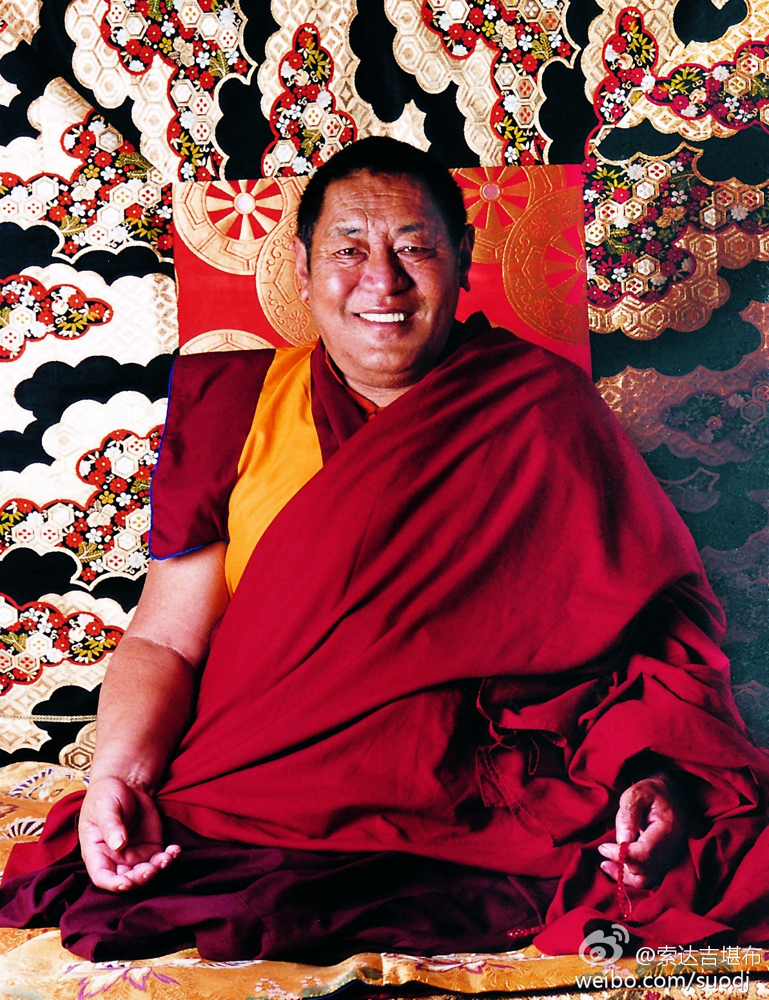
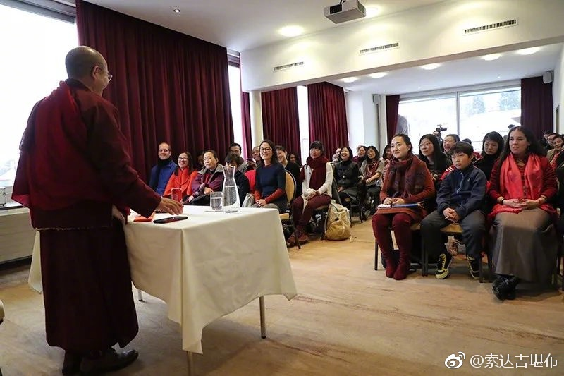

 ## 2017-01-01 08:17
祝大家新年快乐，吉祥如意！L要幸福 索达吉堪布的新年约定 ¡查看图片

 ## 2017-01-03 08:35
很多人都说要“解放天性”。所谓天性，大多不外乎欲望。若把欲望的野兽放出笼子，伤害的不仅是他人，最终也包括自己。就像在一场婚姻里，双方都解放天性，无拘无束，那谁来为一纸婚约保驾护航？如果世上人人都随心所欲，想干什么就干什么，到头来谁也不会有安全感。所以，自由固然值得追求，但仍需以“戒”为伴侣。

 ## 2017-01-04 11:41
有人说，幸福是个东西，可以带给你；有人说，幸福是个目标，可以追求它；有人说，幸福是种心态，可以去领悟。但实际上，无论幸福还是不幸，都是虚假的。

 ## 2017-01-05 08:01
不管是什么身份的人，都应该看看爱因斯坦的这一段演讲。

 ## 2017-01-05 10:50
今天是释迦牟尼佛的成道日，民间也是腊八节。在这个吉祥的日子里，希望每人念“南无本师释迦牟尼佛”108遍，祈愿来年一切吉祥。

 ## 2017-01-06 08:17
经核实，这篇文章what i beileve 虽然是爱因斯坦写的，但不是诺贝尔奖的获奖词，而是出自living philosophiesXIII，特此说明一下。
 > @索达吉堪布
 > 不管是什么身份的人，都应该看看爱因斯坦的这一段演讲。

 ## 2017-01-06 12:21
离开蓝天白云，寻找雾霾

 ## 2017-01-07 07:37
万一我们在生活中遇到灾难，应以什么样的方式面对？以前我坐车时就有一次车子失控，翻到雅鲁藏布江里去了，当时是如何化险为夷的？

第2集：澳门大学
《佛教如何面对灾难》
1、演讲视频：L大学演讲33-澳门大学-演讲-佛教如何面对灾难-...
2、现场互动：L大学演讲33-澳门大学-问答 ¡查看图片

 ## 2017-01-09 08:47
2017年1月12日（藏历十一月十五），是法王如意宝圆寂纪念日。1月10日—1月16日，学院将举办7天的“法王圆寂13周年法会”。全体僧众将共修《上师供》、《上师瑜伽》、金刚萨埵仪轨及心咒、《普贤行愿品》等。忆念上师的功德很大，若条件具足，大家最好能共修祈祷，尤其在12日当天。

 ## 2017-01-10 08:12
本次法会，下述平台将同步直播： 1、新浪show转播房间：智悲讲堂九（房间号：491337）、智悲讲堂十（608144） 2、YY转播房间：智悲讲堂九（频道号：80122986）  每天四座的时间：第一座07:30 - 09:30，第二座10:30 - 12:00，第三座13:30 - 16:00，第四座17:00 - 18:30。  愿吉祥！
 > @索达吉堪布
 > 2017年1月12日（藏历十一月十五），是法王如意宝圆寂纪念日。1月10日—1月16日，学院将举办7天的“法王圆寂13周年法会”。全体僧众将共修《上师供》、《上师瑜伽》、金刚萨埵仪轨及心咒、《普贤行愿品》等。忆念上师的功德很大，若条件具足，大家最好能共修祈祷，尤其在12日当天。

 ## 2017-01-11 10:22
“百年世事三更梦，万里江山一局棋，举世尽从忙里老，谁人肯向死前休？”

 ## 2017-01-11 13:43
分享视频 O网页链接 .
 ## 2017-01-12 07:58
今天是法王圆寂十三周年的纪念日，希望每一个听到法王金刚语的人，都能获得传承上师的强烈加持。（附法王珍贵原声：祈祷持明传承上师O幻觉中又能和您，走在一起——法王如意宝涅槃13...）

 ## 2017-01-14 08:23
中医的“中”字，不单单是指中国，更重要的是中道。

第3集：中国中医科学院
《药师佛与中医》
1、演讲视频：L大学演讲32-中国中医科学院-演讲-药师佛与中医
2、现场互动：L大学演讲32-中国中医科学院-问答

 ## 2017-01-17 07:20
虽然您离开13年了，但不同的人还可以看到您不同的笑容

 ## 2017-01-18 10:45
当有不开心、紧张、担忧等负面情绪时，如果一直跟着它走，心情会越来越糟糕，做什么事也效果不好。如果能够随缘而行，用放松的心情面对一切得失，不经意间，就会出现一股温暖的力量，让你看到更好的希望之光。

 ## 2017-01-19 16:56
古德曾说，佛经之上不能放佛像。足以见得，佛陀的智慧胜于佛陀的身相。所以，如果你想亲近佛教，不能只单单顶礼佛像，更要学习比这更超胜的佛法。

 ## 2017-01-21 06:29
最高的艺术，是能息灭所有的烦恼和痛苦，让我们认清自己本来的样子。

第4集：北京大学
《密宗文化与现代艺术》
对谈视频：L大学演讲31-北京大学-密宗文化与现代艺术 ¡查看图片

 ## 2017-01-26 10:11
万事万物为什么有好有坏？因为不同程度染上了“我”的色彩。我喜欢的，就好；我不喜欢的，就坏。站在“我”的角度去看问题，万法自然会呈现出好坏、苦乐、利害、荣辱。

 ## 2017-01-27 08:14
过去的一年不管是苦是乐，已离我们悄然远去。新的一年马上就要来了，希望大家在今天念《普贤行愿品》，藏文、汉文都可以。哪怕你不懂其中意思，仅仅听一遍，也可以带来无限加持。祝福你智慧无量，身心自在。愿这祝福带走你一年的疲惫，带给你无上清凉！L索达吉堪布《普贤行愿品》原声贺岁 陪你许愿 ¡查看图片

 ## 2017-01-27 15:02
正月初二（1月29日），是门措上师的生日，请大家多行善法，祈愿上师法体安康，利乐有情。L门措上师住世祈祷文--加持大宝藏

 ## 2017-01-28 00:00
新年快乐！按照藏传佛教的传统，新年的第一天，若能念诵或听闻《圣八吉祥颂》一遍，可保佑自己在这一年里吉祥增上，诸愿成就。L《圣八吉祥颂》原声首发 索达吉堪布新年祝福 ¡查看图片

 ## 2017-01-28 07:15
宁静是这个时代的奢侈品，它要用什么来买呢？

第5集：中国科技大学演讲
《喧嚣中的宁静之道》

1、演讲视频：
L大学26期-3.1喧嚣中的宁静之道-中国科技大学...
2、现场互动：
L大学26期-3.2喧嚣中的宁静之道-中国科技大学... ¡查看图片

 ## 2017-01-29 20:09
修行既不是为了见到诸佛菩萨，也不是为了享受天人之乐，而是为了更亲切地贴近众生、更直接地彻见自己。

 ## 2017-01-31 10:47
今天看了贡珠·云登嘉措造的《大手印了义炬》，有一段文字很棒，翻译成汉语的话，意思大概是：
有些人跟上师在一起时，信心非常大，但离开后就把上师忘得一干二净，或者遇到挫折时，这种信心也无影无踪。只有当他们在修法或财物方面想索取一些东西，或者遭受魔障违缘的危害时，才会想起上师，但用不了多久，这种信心就会淡化。他们对根本上师和甚深法缺乏专注的信心，依止一个，就舍弃另一个，这是非常错误的行为。真正的修行人应以稳固的信心，并非表面假装、而要发自内心去实修，以此得到法的利益。只有好好修行，逐渐感受到法的不共加持，此时才能体会到上师教言之甚深，进而自然对法生起定解，对上师生起感恩心，一切修道也会顺利成就。

 ## 2017-02-01 09:15
不知从何时开始，大年初五成了迎财神的日子。既然大家喜欢发财，那我也应个景，给大家分享一下佛教的生财之道。

 ## 2017-02-02 11:57
童年的天真，少年的懵懂，青年的迷茫，中年的忙碌，老年的忧虑，每一个阶段都那么真实，但回头一看，又如此地虚幻。这就是佛教讲的缘起性空。

 ## 2017-02-04 08:06
所有的快乐，来自利他；所有的痛苦，源于自利。

第6集：香港教育学院
《为什么要利他》

1、演讲：
视频O网页链接
文字O网页链接

2、现场互动：
视频O网页链接
文字O网页链接 

 ## 2017-02-06 18:48
学佛，不但要学习佛的超然物外，也要学习佛的和光同尘。

 ## 2017-02-11 06:39
恨不能止息恨，唯有通过爱来止息。

第7集：泰国清迈国际会展中心
《藏传佛教和平观》

1、演讲视频 & 现场互动：
L14和平之路之藏传佛教和平观-索达吉堪布

2、附：第六届世界青年佛学研讨会（精彩视频）：O网页链接 ¡查看图片

 ## 2017-02-11 08:00
不管好人还是坏人，遇到他都是一种特定的缘分；不管快乐还是痛苦，经历它都是一次蜕变的机会。
祝大家元宵节快乐！

 ## 2017-02-16 07:53
别人对你发脾气，常常是因为他潜意识对你有幻想，给你设定了一些预期，当你不符合的时候，他就接受不了。尽管预期可能不切实际，你也不知道有这些标准，但他根本不管，于是矛盾就此产生。
反过来说，你对别人挑三拣四，往往也是这个原因。
所以，佛陀教我们“无住生心”，不要有设定，不要有框架，才能更贴近真相。

 ## 2017-02-18 06:29
见人说人话，见鬼说鬼话，是个贬义词吗？

第8集：中国青年政治学院
《与人沟通的智慧》

1、演讲视频
O网页链接

2、 现场互动
L大学27- 与人沟通的智慧 -中国青年政治学院问答 ¡查看图片

 ## 2017-02-19 23:30
放肆的自由，不单单是想做什么就做什么，更是不想做什么就能不做什么。

 ## 2017-02-22 08:05
2月20日-25日，喇荣五明佛学院将举行“八吉祥法会”，僧众共诵《八吉祥颂》，祈请八吉祥佛、八吉祥菩萨、八吉祥天女、八吉祥护法，加持众生安乐、世界吉祥。此次法会，功德非常殊胜，大家若想参与共修，少则10遍，多则2000遍，皆可在线报名。（法会期间若念不完，在今年5月20日前圆满也可以。）
有意参加共修者，请在2月24日中午12点之前，上报实际或发愿念诵的数量。25日僧众会进行统一回向。
共修报名链接：O网页链接

 ## 2017-02-23 15:39
喇荣的雪天不好找食物，我院子里的小伙伴，吃得还不错

 ## 2017-02-24 11:54
喇荣的黑+白

 ## 2017-02-25 06:51
虽然我不是医生，但我是心理医生，用这个方法，确实治愈了很多抑郁症患者。

第9集：英国 剑桥大学
《修持佛道——为修而修还是通向更美好的世界？》
（藏语演讲，英文翻译、中文字幕）

演讲+现场互动
O网页链接 

 ## 2017-02-26 07:33
今天是藏历大年三十的团聚日。去年您跟我们在一起很开心，今年却不在了。您还好吗？想念您，嗡嘛呢贝美吽~L此生无憾 索达吉堪布最后一次听阿妈说

 ## 2017-02-26 19:06
欧洲大陆时间2017年2月26日13点10分有日环食，这也是今年第一次，也是唯一的一次日环食。北京时间是从20时10分开始，至27日凌晨1时36分结束。
诸经论中说，在出现日食或月食的日子里，无论作任何善行，功德均会成千上万倍增长。希望大家把握良机，精进行持善法，如果有时间，最好能念100遍大自在祈祷文。

 ## 2017-02-27 08:03
བོད་ཀྱི་གནམ་ལོ་གསར་ཚེས་ལ་བཀྲ་ཤིས་བདེ་ལེགས་ཞུ། Happy Losar.藏历新年吉祥如意！ L秒拍视频 .

 ## 2017-03-02 09:35
遇到别人故意伤害你，你的任务不是去嗔怪他、惩罚他。业报自会妥善处理这一切。你的任务是去理解、宽恕，爱才是生命的本质。

 ## 2017-03-04 06:17
我们正在感受的快乐，很可能是下一个痛苦的因。

第10集：日本 早稻田大学
《快乐人生——佛法可以改变世界》
（中文演讲，日语翻译）

演讲+现场互动
O网页链接 

 ## 2017-03-04 09:57
“春有百花秋有月，夏有凉风冬有雪，若无闲事挂心头，便是人间好时节。”

 ## 2017-03-10 10:00
给大家布置一个作业题：
请写下自己的十个优点，公布到微博或朋友圈里。
哪怕你认为自己缺点太多，十条很难憋出来；哪怕你认为自己优点太多，十条也装不下，也请硬着头皮试试。
试过了，你会发现不一样的世界，不一样的你！

 ## 2017-03-11 06:35
在法国格伦诺布，很多人来给我敬酒，说这酒特别珍贵，有两三百年的历史，来自耶稣的一些信徒留传的秘方……

第11集：奥地利 维也纳大学
《藏传金刚乘的特点》
（藏语演讲，德语翻译、中文字幕）

演讲+现场互动
O网页链接 

 ## 2017-03-14 17:18
黑色和白色如果调配好，可以变成五颜六色，生活也是如此。

 ## 2017-03-16 17:30
这世上没有绝对的好与坏，一个人深深吸引你的特质，也许正是别人无法接受的东西。所以，我们不能要求别人跟自己一模一样，很多事情也不可能用一种方式来完成。

 ## 2017-03-17 09:56
高明的医生，把什么草都可以配成治病妙药；高明的修行人，把什么环境都可以当成快乐源泉。

 ## 2017-03-18 05:54
看新闻，到处都是死亡的气息，因车祸、战争、突然事件而离世的人，可曾想过他当天会死。死亡的到来，不按常理出牌，我们敢保证下一分钟不会像他们那样吗？

第12集：青岛大学
《人类面对灾难的心理安慰》

演讲O网页链接
现场互动L大学30-人类面对灾难的心理安慰-青岛大学-问答 ¡查看图片

 ## 2017-03-18 17:53
我的小伙伴们~ L秒拍视频 .

 ## 2017-03-24 08:27
与人交往时应该注意，给别人留一些空间，不要以“我是好心”为理由，给别人加很多框框。适合你的，不一定适合他。

 ## 2017-03-25 06:16
别人都在问：“我怎么做才能使自己有价值？”德鲁克却在问：“我怎么做才能对别人有价值？”

第13集：东北财经大学
《博学与济世》

演讲L博学与济世（东北财经大学）(索达吉堪布仁波...
现场互动L东北财经大学佛学问答(索达吉堪布仁波切） ¡查看图片

 ## 2017-03-26 16:37
不欲获得，是最殊胜的获得；不念名声，是最殊胜的名声；不趋赞誉，是最殊胜的赞誉；不求眷属，是最殊胜的眷属。——噶当派夏沃工巴格西

 ## 2017-03-31 17:45
再好吃的食物，天天吃这个，时间久了也觉得腻。再感兴趣的话题，天天讲这个，别人也容易听不进去。所以，分寸很重要。

 ## 2017-04-01 06:38
“爱得越深，恨得越深。”所以，不懂如何去爱的话，也会带来一些痛苦。

第14集：非洲 莱索托国立大学
《有爱的生活》
（汉语演讲，英语翻译）

演讲+现场互动
O网页链接 

 ## 2017-04-01 07:54
这篇文章流传很久了，很遗憾，这不是我写的。
网络世界有点神奇，有时候明明是我翻译的、我写的，却冠上别人的名字；有时候明明是别人的作品，却冠上我的名字。似乎天天都在过愚人节，哈哈。
类似的文章不止一个，不管作者是出于善意或恶意，我都非常感谢。只是这种现象愈演愈烈，渐渐会让有些东西面目全非。我只好出来提醒一下，希望大家尽量观察了。

 ## 2017-04-04 17:38
今天是清明节，也是关心亡人的日子。大家在依习俗烧纸时，请至少念108遍观音心咒“嗡玛尼贝美吽”或“南无阿弥陀佛”，然后念亡人的名字进行回向。
今晚我也会跟僧众一起，为这世上所有的亡灵，念观音心咒和《普贤行愿品》来超度回向。

 ## 2017-04-08 04:42
年轻人不崇拜权威、教条，开放的思想让他们追求可以说服自己的逻辑。

第15集：荷兰 莱顿大学
《藏传佛教对都市青年的吸引力》
（汉语演讲，英语翻译）

演讲+现场互动
O网页链接 

 ## 2017-04-13 16:45
当我们无法把控命运时，要学会把控自己对命运的态度，得失从缘，心无增减。

 ## 2017-04-15 06:21
物理学无法告诉我们“世界的真相是什么”，而只能告诉我们“观察到的世界是什么”。——量子物理学家 玻尔

第16集：新加坡国立大学
《佛教与信仰——梦幻的人生》
（汉语演讲，英语翻译）

演讲+现场互动
O网页链接 

 ## 2017-04-16 16:28
爱和权力分别处在天平的两端，当爱多一分的时候，权力就会少一分，当权力多一分的时候，爱就会少一分。当权力完全占据你的内心的时候，爱已经当然无存。反过来，当爱全然占据你内心的时候，权力已经消失——荣格

 ## 2017-04-22 06:09
藏传佛教，并非只传递了禅修、环保、心理调适、男女平等，也不只是神秘的佛教仪式、上师文化。

第17集：日本 东京大学
《藏传佛教思想》
（汉语演讲，日语翻译）

演讲+现场互动
O网页链接 

 ## 2017-04-27 08:21
多芒寺，法王如意宝、德巴堪布、扬唐活佛、帝察活佛的祖师纪念法会

 ## 2017-04-27 09:49
多芒寺法会现场 L秒拍视频 .

 ## 2017-04-29 06:22
若能驾驭自己的心，任何人都能感受到生活的美好。

第18集：美国 耶鲁大学
《现代社会的专注与禅修》
（藏语演讲，中文字幕）

演讲L第29期-1.1--现代社会的专注与禅修-耶鲁大学...
现场互动L第29期-1.2-现代社会的专注与禅修-耶鲁大学问... 

 ## 2017-04-29 08:26
喇荣又下雪了，好冷

 ## 2017-05-03 07:44
今天是农历四月初八，释迦牟尼佛的圣诞日。希望大家为了自己，为了一切众生，念108遍“南无本师释迦牟尼佛”，同时尽量吃素、放生、发愿、持咒、忏悔等行持各种善法。

 ## 2017-05-04 07:20
今天到明天，佛学院念两天的莲师心咒并祈祷护法神，从早上8点到下午5点。这次虽然没有直播，但大家若有条件的话，最好在两天中念满一万遍莲师心咒，以此遣除个人或道场的障碍，修行圆满。

 ## 2017-05-06 23:17
都立夏了，还在下大雪~

 ## 2017-05-06 23:20
回来的路上 L秒拍视频 .

 ## 2017-05-10 08:24
有人曾问一位大德：当千姿百态的美女、令人恐惧的妖魔同时出现在你面前，当你看到五颜六色、纷纷扰扰的外境，你如何对待？
大德回答：让青色归于青色、黄色归于黄色，让看只是看、听只是听。

 ## 2017-05-11 07:00
《法华经》被佛陀亲口誉为“经中之王”，极为超胜，若能与此结缘，功德不可思议。
您这一生中，如果发愿看一遍，或读一遍，或抄一遍，或讲一遍，或听一遍，或背下来，或用灯、水、香等长期供养此经，或长期随身携带它，只要做到其中一种，请按下右下角的“赞”来报名，到时候我们会将此功德做大回向。
发愿日期：5月11日~20日。

 ## 2017-05-13 06:08
这个世界上最贵的，往往是无用的东西。

第20集：上海外国语大学
《探寻生活的另一种价值》

演讲
O网页链接
现场互动
O网页链接 

 ## 2017-05-18 10:22
对于好的修行人来讲，一切都是顺缘；对于不好的修行人来讲，一切都是违缘。

 ## 2017-05-20 06:13
佛教认为，尽管每个人习气不同，但本性都是善的。更深一层的话，人性远离善恶等一切戏论。

第21集：湖南大学
《佛教关于人性的探索和教育》

演讲
O网页链接
现场互动
O网页链接 

 ## 2017-05-23 08:53
金刚萨埵心咒“嗡班杂萨多吽”，是忏悔业障最有力、最灵验的法门。如果你做过让自己后悔的事，诚心诚意念诵40万遍金刚萨埵心咒，即便是最难忏悔的罪业，也可以得以清净。
不管是什么人，若能在2017年9月1日之前念满40万遍，可以点右下角的赞来报名，届时学院僧众会将此共修功德进行回向。
报名时间截止2017年6月6日。

 ## 2017-05-27 07:08
只有科技，是危险的。

第22集：四川大学
《信仰、科技与法律》

演讲
视频：L[大学演讲18]四川大学演讲-信仰、科技与法律
文字：O网页链接

现场互动
视频：L[大学演讲18]四川大学问答-信仰、科技与法律
文字：O网页链接 ¡查看图片

 ## 2017-06-01 05:54
2017年6月2日－6月8日（藏历四月初八－四月十四），早上7点到晚上7点，学院内部将举行为期7天的金刚萨埵法会。届时，全体僧众将共同念修金刚萨埵心咒“嗡班杂萨多吽”。
本次法会，下述房间将同步直播：
1、新浪show直播房间：智悲讲堂九（房间号：491337）
2、YY直播房间：智悲讲堂九（频道号：73553690）
愿吉祥！

 ## 2017-06-03 06:27
菩提心有很多学处，最根本的就是，不伤害众生。

第23集：美国 普林斯顿大学
《当代菩萨道——现今社会菩萨的修与行》
（藏语演讲，中文字幕）
演讲：L大学演讲29-当代菩萨道——现今社会菩萨的修与...
现场问答：http://t.cn/RSi9IEA ¡查看图片

 ## 2017-06-05 06:19
今天是我母亲离世一周年的纪念日。她走的时候虽然很安详，但我也经常想起她。如果你方便的话，能否为她念108遍观音心咒“嗡玛尼贝美吽”呢？
L此生无憾 索达吉堪布最后一次听阿妈说

 ## 2017-06-06 00:05
雪后的喇荣，虔诚的帐篷~

 ## 2017-06-10 06:08
人的快乐，是有期限的。每一个快乐的旁边，都有一个痛苦在等待着。

第24集：上海交通大学
《修行与精神健康》

演讲：L大学演讲41-上海交通大学-演讲
现场问答：O网页链接 ¡查看图片

 ## 2017-06-10 10:41
我们在人生中，如果一些重要的计划、目标不能实现，也不必因此而一蹶不振。人生并非只有一种可能性，这条路走不通，换一条就是了。若能利用这次挫折增加一些智慧，或者调整一下方向，也许未来会看到更精彩的风景。

 ## 2017-06-17 06:31
我修“动中禅”的最好工具，就是我的念珠。

第25集：悉尼科技大学
《动中禅》

演讲：L大学28-悉尼科技大学-演讲-动中禅
现场问答：L大学28-悉尼科技大学-问答 ¡查看图片

 ## 2017-06-18 13:23
感恩所有的上师，父亲节快乐！

 ## 2017-06-23 07:27
宁愿躺在温热的沙漠上，也不想坐在有荆棘的花丛里。宁愿成为心地善良的无信仰者，也不要成为心肠恶毒的宗教徒。

 ## 2017-06-24 06:20
很多人到藏地，都会拍一些蓝天白云、风土人情。实际上，藏地最美的风景，不在你相机的取景框里，而在……

第26集：台湾师范大学
《藏文化的特色》

1、演讲：
视频： O网页链接
文字：O网页链接

2、现场互动：
视频： O网页链接
文字：O网页链接

 ## 2017-06-28 08:19
就算你不能读诵，也不能听闻、思维，更不能实地修持，只是将法本拿在手里，带在身边，不久的将来也能速证佛果。

当当：O网页链接
京东：O网页链接
亚马逊：O网页链接

 ## 2017-06-28 21:22
今天翻出来读书时的笔记本，这是我19岁画的

 ## 2017-07-01 07:25
为了开启智慧，一起来祈祷文殊菩萨！
从今天起，截至今年9月1号之前，若能能念满10万遍以上文殊心咒“嗡阿热巴杂那德”的，可以给此微博点赞（上半年已经发愿念诵的，也可算在里面）。让我们共同祈愿，一起回向！

 ## 2017-07-01 08:16
不同系统所呈现的，只不过是以不同的技巧来体现本有澄明心。

第27集：泰国 摩诃朱拉隆功大学
《藏传佛教的本来面目》

1、演讲：L大学演讲35-摩诃朱拉隆功大学清迈校区-演讲-...
2、现场互动：L大学演讲35-摩诃朱拉隆功大学清迈校区-问答 ¡查看图片

 ## 2017-07-05 09:06
世间万事万物，其实都是阴阳并存的。
最自由的人，往往是最受束缚的；最受束缚的人，也许是最自由的。
最复杂的人，常有最简单的一面；最简单的人，或许想法比谁都复杂。
最可爱的人，常常让你有远离的冲动；最可恨的人，反而有你最喜欢的特质。
凡事并无一定之规，所以，我们看问题不要太单一。

 ## 2017-07-06 13:30
我的小世界~
宠辱不惊，闲看庭前花开花落。去留无意，漫随天外云卷云舒。

 ## 2017-07-08 11:49
佛陀教导我们：以真理为皈依处，不要因为“这是佛陀说的”而盲目接受。

第28集：台湾大学

《神秘的修心之路》

1、演讲：O网页链接
2、现场互动：O网页链接 

 ## 2017-07-13 08:53
本书改变人心的力量非常大，在东南亚、欧美等许多国家，无数人通过学习它、修持它，身心发生了极大改变。
对佛教徒而言，它包含了所有最根本的修行秘诀；对非佛教徒来说，本书也可灭除你的烦恼、痛苦和压力。

当当：O网页链接

京东：O网页链接

亚马逊：O网页链接

文轩：O网页链接

博库：O网页链接

 ## 2017-07-15 06:16
与其说佛教是宣扬和平的，不如说和平只是佛教的修行。

第29集：泰国 第六届世界青年佛学研讨会
《世界为什么需要和平》
（汉语演讲，英语翻译）

1、演讲：L第六届世界青年佛学研讨会-《世界为什么需要...
2、现场互动：L泰国 第六届世界青年佛学研讨会-《世界为什么... ¡查看图片

 ## 2017-07-18 10:27
今天

 ## 2017-07-20 10:11

 > @索达吉藏文化
 > Oསྐབསབཅུ་པའི་ཨེའགོག་རང...

 ## 2017-07-21 11:38
跟小孩子们一起，自己也变得天真无忧了

 ## 2017-07-22 06:27
我们在生活中，经常依靠一个偶然的机会，改变了命运。
比如，偶然遇到一个陌生人，跟他变成朋友，生活有了很大改变。或者偶然看了一本书，书的内容让自己变化。或者偶然去了一个地方，人生也有很多更改。
表面上看，这都是偶然的相遇，偶然的幸运或不幸。但我们往往没有想到，在它的后面，有一些复杂、隐藏的因缘。

第30集：意大利 都灵
《生命中的偶遇》
（汉语演讲，意大利语翻译）

1、演讲：L荷兰 意大利 都灵-《生命中的偶遇》-演讲合并
2、现场互动：L荷兰 意大利 都灵-《生命中的偶遇》-问答¡查看图片

 ## 2017-07-24 23:00
快过生日了，很多人都说要送我礼物。其实我最喜欢的礼物是放生，哪怕只放一只鸟、一条鱼。如果谁能给我这样的“生日蛋糕”，我会非常欢喜地享用，并且也分你一大块，甜甜的~

 ## 2017-07-29 05:28
佛教是没有性别歧视的，女性和男性的境遇一样，重点在于是否获得深刻的觉悟。
《涅槃经》中说：“若有众生，不知自身持有如来性，虽是男儿身，我说此辈是女人；若有女人，能知自身持有如来性，虽是女儿身，我说此人是男子。”

第31集：法国巴黎 喜马拉雅研究中心
《女性在藏传佛教中的地位》
（藏语演讲，法语翻译，中文字幕） 1、演讲：O网页链接 2、现场互动：O网页链接

 ## 2017-08-04 07:47
勿 忘 上 师 ， 时 时 祈 请 。
勿 随 妄 想 ， 善 观 自 心 。
勿 忘 死 亡 ， 坚 持 佛 法 。
勿 忘 众 生 ， 慈 心 回 向 。
——顶果钦哲法王

 ## 2017-08-05 05:55
怀疑是大家必须通过的大门口，只有通过这个大门口，才能进入真理的殿堂。——莎士比亚

第32集：荷兰 莱顿大学
《佛教与社会德行》
（藏语演讲，英语翻译，中文字幕）

专场问答：O网页链接

 ## 2017-08-12 06:26
老人对社会、对家庭都是非常珍贵的，以后我也希望有机会为老人提供这样的环境。

第33集：法国 格勒布UIAD综合大学
《幸福人生》
（中文演讲，法语翻译）

演讲&现场互动：O网页链接

 ## 2017-08-18 10:32
一切的焦躁、不安、恐惧、痛苦，都来自我们这颗不听话的心。而这颗心有一个很棒的特质，就是可以被驯化。要想让心听话，就要先学习相关理论，再用它来指导实践，这在佛教中被称为“闻思修”。

 ## 2017-08-19 06:16
我为什么在翻译上有这么强烈的动力呢？藏地智者根登群佩的这一句话，对我最初翻译起到了很大的鼓舞作用。

第34集：英国 牛津大学
《跨文化译传藏传佛教之人生感悟》
（藏语演讲，英语翻译，中文字幕）

演讲：L大学36-英国牛津 《跨文化译传藏传佛教之人生...
现场互动：L大学36-英国牛津 《跨文化译传藏传佛教之人生... ¡查看图片

 ## 2017-08-20 23:08
偷得浮生半日闲~

 ## 2017-08-22 07:10
太阳照耀每一个人，不会有分别；镜子映现每一个人，不会有取舍。我们的心也是如此，只有摘除一切“凭主观喜好对事物评判好坏”的标签，才能爆发出本有的潜质，彻见最真实的自己。

 ## 2017-08-23 07:02
我的一生经历了很多糟糕的事情，其中一部分是真正发生的，更多一部分是我们自己想象出来的。
——马克.吐温

 ## 2017-08-24 06:49
我们的烦恼，就像水中月亮、镜中面容，看起来真实无比，本质上只是虚假的幻影，经不起智慧的暴击。

 ## 2017-08-25 07:12
这是最好的时代，这是最坏的时代；这是智慧的时代，这是愚蠢的时代；这是信仰的时期，这是怀疑的时期；这是光明的季节，这是黑暗的季节；这是希望之春，这是失望之冬；人们面前有着各样事物，人们面前一无所有。
——狄更斯《双城记》

 ## 2017-08-26 06:46
科学的性质决定了，科学无论如何发展，也无法改变人性中的贪婪、仇恨、愚痴、嫉妒和傲慢。
当科技之剑被人性中的黑暗力量所利用，人类的灾难就可能爆发。

第35集：非洲  莱索托科技大学
《信仰与科技》
（汉语演讲，英语翻译）

演讲：L莱索托科技大学-《信仰与科技》-演讲完整版
现场互动：L大学演讲38-莱索托科技大学-问答-分段1 

 ## 2017-09-02 06:14
当我们的心生病了怎么办？通过心来观察心，心无散乱而安住。其实，我们与光明从未分离过一个刹那。

第36集：英国 剑桥大学
《修持佛道——为修而修还是通向更美好的世界？》
（藏语演讲，英语翻译，中文字幕）

演讲：L大学36-英国剑桥 《修持佛道：一个自身的结束...
现场互动：L大学36-英国剑桥 《修持佛道：一个自身的结束... ¡查看图片

 ## 2017-09-05 17:40
是的
 > @慈诚罗珠堪布
 > 30年前，我们刚刚起步的时候，将要走的路很远很远。

 ## 2017-09-09 06:12
佛陀去某地讲法，却不受待见；佛的弟子去，被万人追捧。人与人之间的关系，到底隐藏着什么秘密？

第37集：北京大学
《走出人际关系的雾霾》

演讲L北京大学-《走出人际关系的雾霾》-演讲
现场互动L北京大学-《走出人际关系的雾霾》-问答 ¡查看图片

 ## 2017-09-10 07:11
从1985-2017年，我当了 33个年头的老师，虽然当老师不轻松，但还是觉得非常有意义。今天是教师节，祝我的同行们节日快乐，继续努力，不要改行！

 ## 2017-09-16 06:37
有时候，人们痛苦不一定是因为缺什么。
法国皇帝拿破仑，在他所处的时代被认为是世上最富有的人，地位、权力等方面无可比拟，他的军队也非常勇猛。可以说，当时整个欧洲几乎没有一个人不羡慕他。但是他在最后的日记里说，他一生中连一天的幸福也没有拥有过。
与他恰恰相反，美国的海伦•凯勒是既聋又盲又哑的一个残疾人，但是她觉得自己非常快乐和成功，她对所有人讲：“生命是多么的美好！”

第38集：华东师范大学
《滋心养智》

演讲
视频：L大学21-华东师范大学-演讲-滋心养智-
文字：O网页链接

现场互动
视频：http://t.cn/RpRlltd
文字：O网页链接

 ## 2017-09-21 09:08
很多人不敢问的问题，她都问出来了。//@易立竞: 《易时间》的目标是做对观众思想上有供养的节目，希望通过走近被采访者的世界，为我们的生活探索其他的可能性。希望呈现的结果离我们的初衷不远。特别节目第一期正式上线了，邀请你，一起同行50分钟吧
 > 转发的微博已被删除
 ## 2017-09-23 06:20
按照佛教的观点，在刚开始给众生启迪时，可以说诸法“如”梦；到了更高层次，说诸法“是”梦。这里有“是梦”与“如梦”的差别。
当然，在佛教的最高层次上，甚至梦也不存在，一切全是空性，是一种与光明无二无别的境界。但还没有达到这个境界之前，我们要想打破实有执著，用梦来比喻是非常适合的。

第39集：清华大学
《盗梦空间》的佛学实相

演讲
L大学26期-1.1《盗梦空间》的佛学实相-清华大...

访谈：
L大学26期-1.2《盗梦空间》的佛学实相-清华大...

现场互动
L大学26期-1.3《盗梦空间》的佛学实相-清华大...

 ## 2017-09-27 08:35
活着，就是要勇敢去迎接变化，面对未知。不要像一束风干的花，只停留在过去某个时刻，沉浸在那一刻的虚幻中。以为自己让华彩永驻，却失去了让生命绽放的机会。

 ## 2017-09-30 06:24
究竟用什么才能解开轮回的密码呢？
无我空性。若没有空性的力量，就无法断除轮回的根本——无明。
我们今生得个人身非常不容易，以后是继续在轮回中流转，还是烧毁无明的种子，完全取决于自己。

第40集：泰国 朱拉隆功大学
《解读轮回密码》

演讲
视频：L大学演讲24-解读轮回密码-泰国朱拉隆功大学演讲
文字：O网页链接

现场互动
视频：L大学演讲24-解读轮回密码-泰国朱拉隆功大学问答
文字：O网页链接

 ## 2017-10-04 09:26
天上的明月，圆际必缺、缺际必圆，我们不会为此而烦恼，因为知道这是正常现象。同样，我们的人生乐际必苦、苦际必乐，也是一种正常规律，若能正视无常、放下抗拒，与“变化”共处，你将觉知到痛苦本不存在，是自己应对的方式制造了痛苦。
有烦恼就看看月亮吧，中秋快乐！

 ## 2017-10-05 09:58
不管你是否学佛，看看都不错，至少在遇到麻烦时多一种智慧。
走出自己的舒适区，有时候能邂逅更美妙的舒适。

《易时间》专访宗萨仁波切

1、加拿大篇
L专访宗萨仁波切·加拿大篇 最离经叛道佛教大师

2、印度篇
L专访宗萨仁波切·印度篇 我不介意当一个替罪羊 ¡查看图片

 ## 2017-10-07 07:13
虽然可以说佛教是一种心灵的科学。但在究竟意义上，《心经》中讲“无眼耳鼻舌身意”——六识包括的一切法都不存在，因此，所谓的“心灵”也被超越了。

第41集：泰国  第六届世界青年佛学研讨会
《当出家人遇到科学家 》——索达吉堪布与潘宗光教授对话

视频：O网页链接
文字：O网页链接

 ## 2017-10-07 22:41
平凡，不意味着不成功。就像小草，虽没有大树挺拔，却同样以自己的力量装点着大自然。
昔日，杜鲁门当选为美国总统时，有记者去采访他的家人。他弟弟朴实地说：“我为哥哥而感到自豪，他将是美国最优秀的总统之一。但我也同时为自己感到骄傲，我是一名农夫，我用自己的手养活自己，照顾父母。”
所以，我们对自己的身份应该有一种认同感，不要整天费尽心思地往高处追，却不愿看一眼近在咫尺的普通快乐。

 ## 2017-10-14 08:14
现在很多人喜欢去藏传佛教寺院，尤其爱看喇嘛们辩经。边看边拍很多照片，“哇！藏传佛教辩论很好看啊，你看喇嘛的动作像舞蹈一样！”其实也没什么好看的，只是一两个动作而已。
我们不能把辩论看成一种好玩的表演。它的内容和意义到底是什么？这是我们更需要知道的。

第42集：台湾华梵大学
《击掌空声.佛教的辩论方法 》

演讲
视频：L佛教的辩论方法——华梵大学演讲 (索达吉堪布仁...
文字：O网页链接

现场互动
视频：L[大学演讲19]华梵大学问答_佛教的辩论方法-土...
文字：O网页链接

 ## 2017-10-20 10:25
苦乐，其实跟心有很大关系。当你认识了心的本面，纵然处于特别艰难的环境，也会快乐无比。只不过心太狡猾，善于伪装，很难一下子认出来而已。

 ## 2017-10-20 17:00
昨天，今天

 ## 2017-10-21 06:39
“我既不贪执佛陀，也不嗔恨外道导师，谁的语言符合正理，我就承认他是本师。”

第43集：德国 马普研究所
《藏传佛教在中国的现代表述》

演讲
视频：L藏传佛教在中国的现代表述——马普研究所演讲
文字：O网页链接

现场互动
视频：L马普研究所佛学问答
文字：O网页链接 

 ## 2017-10-21 16:56
L超感人微电影《The Other Pair》，一双鞋的故...

 ## 2017-10-22 21:27
夏威夷，1993年，法王如意宝在火山国家公园。想念上师，喇嘛钦！

 ## 2017-10-27 17:13
不要太执著我们现实生活中的一切，如果用智慧去观察，它会变得如梦如幻；再深一层观察的话，连如梦如幻都不存在。此时你会感到惊吓，也会感到惊喜！

 ## 2017-10-28 06:48
现在很多人认为，人脑能操控一切，一旦大脑受到损害，心识的功能就不正常了，会变成老年痴呆、失忆、植物人等。因此，科学家普遍认为，人脑最重要，人心是人脑的产物。
但如果是这样，有些现象便无法解释了。比如，世界上有很多高智商、生活正常的人，却没有大脑，此类案例在美英德法等国家都发现过。

第44集：浙江大学
《认知科学与佛学》

演讲
视频：O网页链接
文字：O网页链接

现场互动
视频：O网页链接
文字：O网页链接
 ## 2017-10-30 19:34
没有一个人是我的亲人，我唯一的亲人就是我内在的觉性；
没有一个人是我的敌人，我唯一的敌人就是我内在的无明烦恼。
————米拉日巴尊者

 ## 2017-10-31 11:03
芝加哥公共图书馆，书很多，看书的人也很多，待在这儿很舒服

 ## 2017-11-01 10:47
你知道这里怎么过万圣节🎃吗？

 ## 2017-11-01 20:14
芝加哥大学的图书馆，藏汉文的佛教书籍非常多，有些都几乎绝迹了，但在这里可以找到~

 ## 2017-11-04 07:35
我们有时候非常烦躁，无缘无故跟别人发脾气，事后自己也很难受。这种情绪，在佛教中称为嗔恨心。
嗔恨心的本体是什么呢？就是菩提，是智慧。《六祖坛经》也讲：“烦恼即菩提。”
如果你没有认识嗔恨心的本来面目，它就是烦恼，给你带来无量痛苦；但当你认识到了之后，它不但对你没有丝毫障碍，反而会成为智慧的助伴。

第45集：首都经贸大学
《佛法与当代社会》

演讲
视频：O网页链接
文字：O网页链接

现场互动
视频：O网页链接
文字：O网页链接

 ## 2017-11-06 18:21
密歇根湖畔的风，吹送智慧的笛音——2017索达吉堪布海外弘法纪实
第一站：美国芝加哥O【现场】密歇根湖畔的风，吹送智慧的笛音——20...

 ## 2017-11-11 06:11
一旦有了攀比心，再多的财富也不会感到满足，这就是大多数人不快乐的原因。
打个比方，如果你有一万元，周围的人都只有几千元，你会觉得还不错，但如果他们有几十万、几百万，你就很难平衡，“一万元太少，别人那么富。”
其实，就算你有一千万也是一个道理，问题不在钱多少，而在我们心里会比较，这个摆脱不掉。

第46集：中央财经大学
《佛教的经济观》

演讲
视频：L佛教的经济观（中央财经大学）(索达吉堪布仁...
文字：O网页链接

现场互动
视频：L中央财经大学佛教问答(索达吉堪布仁波切）
文字：O网页链接¡查看图片

 ## 2017-11-13 18:19
有些传统值得尊重——2017索达吉堪布海外弘法纪实
第二站：美国波士顿
O【现场】有些传统值得尊重——2017索达吉堪布海...

 ## 2017-11-15 10:49
在人生中，女人想要得到成功与幸福，最重要的，不是找到一个好男人，而是拥有一颗明白、觉醒的心。

 ## 2017-11-15 20:27
纽约公共图书馆，是世界上最美的图书馆，藏书5300多万册，学习气氛非常好。如果你来纽约，一定要来这里感受一下智慧的芬芳。
在三楼最大的阅览室，我看到木框上有一句话，出自于约翰·弥尔顿的诗篇。大致意思是，一本好书是伟大灵魂的宝贵血脉，为了超越生命，理应珍藏和铭记。
旁边还有一副油画，描述的场景是：在昏暗的书房里，弥尔顿坐在椅子上，看上去在低头沉思。由于眼盲，他正在向三个女儿口述著名史诗《失乐园》，并由她们记录下来。
看到这里，不禁想起了上师如意宝。他老人家晚年时眼睛不好，看字不太清楚，12年中的传法、灌顶，都是先让人把法本内容录下来，一边听录音一边传。记得当年来美国时，我也为上师录过音。上师传讲时，完全凭记忆来讲解，引经据典分毫不差。很多重要的传法、灌顶都是这样完成的。

 ## 2017-11-18 06:21
伏藏法与其他知识不同，甚深难测，且具有无比的加持力。一旦与它结上因缘，也会具有殊胜的功德。

第47集：美国 科罗拉多大学
《伏藏授记的密意与缘起》

演讲
视频：L伏藏授记的密意与缘起——科罗拉多大学演讲
文字：O网页链接

现场互动
视频：L科罗拉多大学佛学问答
文字：O网页链接 ¡查看图片

 ## 2017-11-21 09:33
今天就离开美国了，一切圆满，感恩大家！下次见……

 ## 2017-11-21 10:00
The U.S. tour comes to a successful completion,  and I am about to be on my departure.
Much gratitude to everyone! See you all next time.

 ## 2017-11-21 10:27
今天在纽约遇到二十多年前的朋友，岁月~

 ## 2017-11-23 14:23
瑞典人喜欢吃素，大多是为了健康和悲悯动物

 ## 2017-11-25 06:20
我们所面临的压力中，有些是不得不承受的，有些则是不必要，甚至是自找的。有了佛法的智慧，许多压力能轻松化解。

第48集：广西师范大学
《减轻压力的智慧》

演讲
视频：O网页链接
文字：O网页链接

现场互动
视频：O网页链接
文字：O网页链接 

 ## 2017-11-26 06:46
在瑞典，每天至少要喝三杯咖啡，才跟得上他们的习惯。我晚上11点还在喝，不知道能否睡得着？

 ## 2017-11-26 19:08
念一遍260字的《心经》和108遍的观音心咒“嗡玛尼贝美吽”，最多只用2分钟。我们一天有1440分钟，拿掉这2分钟，还剩下1438分钟足够用来做其他事。
因为特殊缘起，我发愿从今天开始，在有生之年，每天念1遍《心经》和108遍观音心咒。如果你能与我同愿同行，请点击右下角的“点赞”，让我们一起来共同发愿。

 ## 2017-11-28 00:49
在911废墟上，放一朵无常的花——2017索达吉堪布海外弘法纪实
第三站：美国纽约
O网页链接

 ## 2017-11-29 22:04
要走了，瑞典的朋友，88~
Just about to leave Sweden, friends from Sweden, Bye!

 ## 2017-11-30 19:02
喜欢吃糖的人，吃第一颗糖觉得快乐，吃到第六颗就不一定了，所以这种快乐很难持续。现在很多人的所谓快乐，也都与感官有关，一开始觉得很甜蜜，之后却转瞬即逝。
佛教所讲的快乐，有一定的持续性。
O索达吉堪布2017年11月28日最新演讲——瑞典隆德...

 ## 2017-12-01 13:09
监狱里，探讨不自由中的自由——2017索达吉堪布海外弘法纪实
第四站：瑞典
O网页链接

 ## 2017-12-02 05:40
我们眼、耳、鼻、舌、身、意的认知范畴十分有限，佛陀在《三摩地王经》中也说，倘若一味地用这些去衡量所有事物，认为这些就是正量，那圣道又有什么用呢？

第49集：西北大学
《来世生命及往生净土》

演讲
视频：L来世生命与往生净土-西北大学演讲
文字：O网页链接

现场互动
视频：L西北大学问答
文字：O网页链接¡查看图片

 ## 2017-12-03 06:43
分享一个小故事：一位老人非常孤独，丈夫、儿子死于车祸，她在老人院里得了抑郁症，医生对她也特别嫌弃。她准备买药自杀，结果卖药的人态度和善，对她很有耐心。临走时，她塞给那人一个纸条，上面写着：“今天我本想离开人世，但你的笑容温暖了我冰封的心，给我了活下去的力量，谢谢！”
所以，我们平时不要吝啬自己的爱，对陌生人哪怕微笑一下、轻语几句，也许就可以扭转一个人的命运。

 ## 2017-12-03 15:08
什么是藏传佛教的核心？
什么是法脉传承？
什么是五部大论？
什么是伏藏？
……
《藏传佛教的修行与学习 ——索达吉堪布挪威奥斯陆大学演讲 》
O藏传佛教的修行与学习 ——索达吉堪布挪威奥斯...

 ## 2017-12-07 16:28
挪威，来也匆匆，去也匆匆~

 ## 2017-12-09 06:18
现在很多人认为，人脑能操控一切，一旦大脑区域受到损害，心识的功能就不正常了，会变成老年痴呆、失忆、植物人等。因此，科学家普遍认为，人脑最重要，心是人脑的产物。
但如果是这样，有些现象便无法解释了。比如，世界上有很多高智商、生活正常的人，却没有脑，此类案例在美英德法等国家都发现过。所谓的因果，应该符合“无则不生”的规律。那心和脑之间若是因果关系，无脑人的心是从哪里产生的？毕竟科学发现脑细胞只存在于大脑中，其他部位都没有，其他细胞也没有这个功能。既然如此，“无脑也能产生心识”的现象就很难解释。
所以，我们研究的对象，一方面是人脑，但更重要的是“心”。

第50集：浙江大学
《认知科学与佛学》

演讲
视频：O网页链接
文字：O网页链接

现场互动
视频：O网页链接
文字：O网页链接

 ## 2017-12-09 19:29
瑞士的雪、瑞士的山，让我想起了喇荣的雪、喇荣的山

 ## 2017-12-09 19:38
瑞士好冷哦~ L索达吉堪布的秒拍视频

 ## 2017-12-10 11:03
像欧石楠一样坚定地绽放——2017索达吉堪布海外弘法纪实
第五站：挪威
O【现场】像欧石楠一样坚定地绽放——2017索达吉...

 ## 2017-12-11 21:59
不会挨饿的
 > 转发的微博已被删除
 ## 2017-12-13 18:03
轻轻地我走了，正如我轻轻地来，我轻轻地挥手，作别瑞士的云彩

 ## 2017-12-16 06:32
这个时代，经常有人爆料他人的负面信息，有时候这人是被冤枉的，但消息一旦发出去就没办法更改了。现在的人特别喜欢刺激性的消息，有时甚至去特意编造，这些消息可以在短时间内被转发成千上万次，最后，假的也变成真的了。
一般来讲，任何事情都会有三面：你的一面，我的一面，还有事情的客观真相。其中“你的一面”带有你的主观判断，“我的一面”则带有我的主观判断，而真相往往很难被发掘出来。

第51集：天津大学
《微时代 微道德》

演讲
视频：L大学26期-2.1微时代 微道德-天津大学演讲-150...

现场互动
视频：L大学26期-2.2微时代 微道德-天津大学问答-150...¡查看图片

 ## 2017-12-16 14:37
西班牙斗牛场，外面辉煌壮观，里面却血迹斑斑。每年有25000多头牛会死于此，嗡玛尼北美吽……

 ## 2017-12-17 08:14
我想起了喇荣——2017索达吉堪布海外弘法纪实
第六站：瑞士
O【现场】我想起了喇荣——2017索达吉堪布海外弘...

 ## 2017-12-17 16:23
结束了西班牙的美好时光，感谢大家，感谢欧洲的佛友们！

 ## 2017-12-18 23:59
我今天在耶路撒冷的希伯来大学，见到了三尊分别代表犹太教、基督教、伊斯兰教的塑像。谁能将其对号入座？

 ## 2017-12-20 22:02
热情奔放的“妈妈快跑！”——2017索达吉堪布海外弘法纪实
第七站：西班牙
O【现场】热情奔放的“妈妈快跑！”——2017索达吉...

 ## 2017-12-22 13:33
“天时人事日相催，冬至阳生春又来。”冬至快乐。——来自耶路撒冷的问候

 ## 2017-12-23 00:06
战争、冲突、命运……

 ## 2017-12-23 05:28
人除了肉身以外，实际上还有生生不断的一种细微心识，它能产生不可思议的力量。
这种力量，科学家恐怕暂时还没有触及，他们对心的探索仍是一片空白。

第52集：南京大学
《佛法的生命科学观》

演讲
视频：L佛法的生命科学观
文字：O网页链接

现场互动
视频：L南京大学博士论坛问答
文字：O网页链接¡查看图片

 ## 2017-12-23 16:59
བླ་མ་དཀོན་མཆོག་གསུམ་མཁྱེན།དེ་རིང་ཨ་རབ་ཕྱོགས་ནས་རང་ཡུལ་ལ་ལོག་བཞིན་ཡོད།སྐབས་འདིའི་འགྲོ་དགོས་ས་ཚང་མར་བགྲོད་ཚར་སོང་།
今天离开以色列，这次所有行程圆满了，感恩三宝加持
Leaving Israel today. Completed all the scheduled events. Gratitude for the blessings from the three jewels.

 ## 2017-12-23 18:26
穿越智慧的伤痕——2017索达吉堪布海外弘法纪实
终点站：以色列
O【现场】穿越智慧的伤痕——2017索达吉堪布海外...

 ## 2017-12-25 22:25
揭晓答案：从左到右依次是伊斯兰教，犹太教，基督教
 > @索达吉堪布
 > 我今天在耶路撒冷的希伯来大学，见到了三尊分别代表犹太教、基督教、伊斯兰教的塑像。谁能将其对号入座？

 ## 2017-12-30 06:30
痛苦由心而生，也要由心而灭。若想依靠钱财等外物来除苦，解决不了根本问题。
我以上所讲的解除痛苦的方法，是方方面面的，你们不一定全部都用，毕竟每个人的情况不同，选择适合自己的就可以。就像生了病以后，有些人吃中药能好，有些人用按摩也行，有些人还可以打针，但不管选择哪一种，目的都是为了断除痛苦。

第53集：香港理工大学
《怎样面对痛苦》

演讲
视频：L怎样面对痛苦-索达吉堪布2011香港理工大学演讲
文字：O网页链接

现场互动
视频：L索达吉堪布2011香港理工大学佛学问答
文字：O网页链接¡查看图片

 ## 2017-12-30 07:09
一年圆满了！年初的承诺也兑现了，没有落下一次，共有53期。 对我来讲，每周从上百场大学演讲中选出一期，是一种压力；对你来说，每周坚持看一期，也是一种压力。 压力并不完全是坏事，可以鞭策自己不断前行。 以后有因缘，我们再继续。
 > @索达吉堪布
 > 近十年来，我去过国内、国外很多学校。从2017年起，打算每周六公布一期大学演讲。
我走过的路，你也可以走走试试。

第1集：台北大学

《生命科学与价值观》

1、演讲：
视频：O网页链接
文字：O网页链接

2、现场互动：
视频：O网页链接
文字：O网页链接 

 ## 2017-12-31 09:02
为了纪念法王如意宝圆寂14周年，2017年12月31日—2018年1月6日，为期7天，僧众将共修《上师供》《上师瑜伽》、金刚萨埵仪轨及心咒、《普贤行愿品》等。

直播：
新浪show房间：智悲讲堂九（房间号：491337）。
YY房间：智悲讲堂九（频道号：80122986）。届时若遇房间故障无法进入，则请登录新浪show房间听闻。

每天四座：
第一座：7:30–10:00 ；第二座：11:00–12:30 ； 第三座：13:30–16:00；第四座：17:00–18:30 。

愿吉祥！

 ## 2017-12-31 22:20
更正：第一座：7:00–9:30 ；第二座：10:30–12:30
 > @索达吉堪布
 > 为了纪念法王如意宝圆寂14周年，2017年12月31日—2018年1月6日，为期7天，僧众将共修《上师供》《上师瑜伽》、金刚萨埵仪轨及心咒、《普贤行愿品》等。

直播：
新浪show房间：智悲讲堂九（房间号：491337）。
YY房间：智悲讲堂九（频道号：80122986）。届时若遇房间故障无法进入，则请登录新浪show房间听闻。

每天四座：
第一座：7:30–10:00 ；第二座：11:00–12:30 ； 第三座：13:30–16:00；第四座：17:00–18:30 。

愿吉祥！

