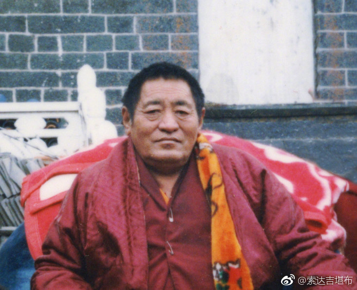
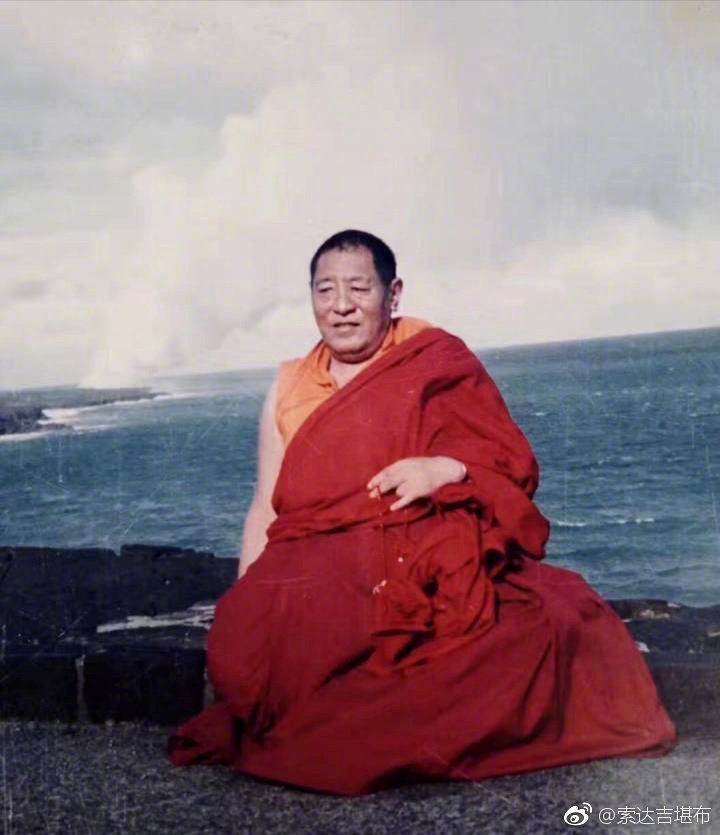
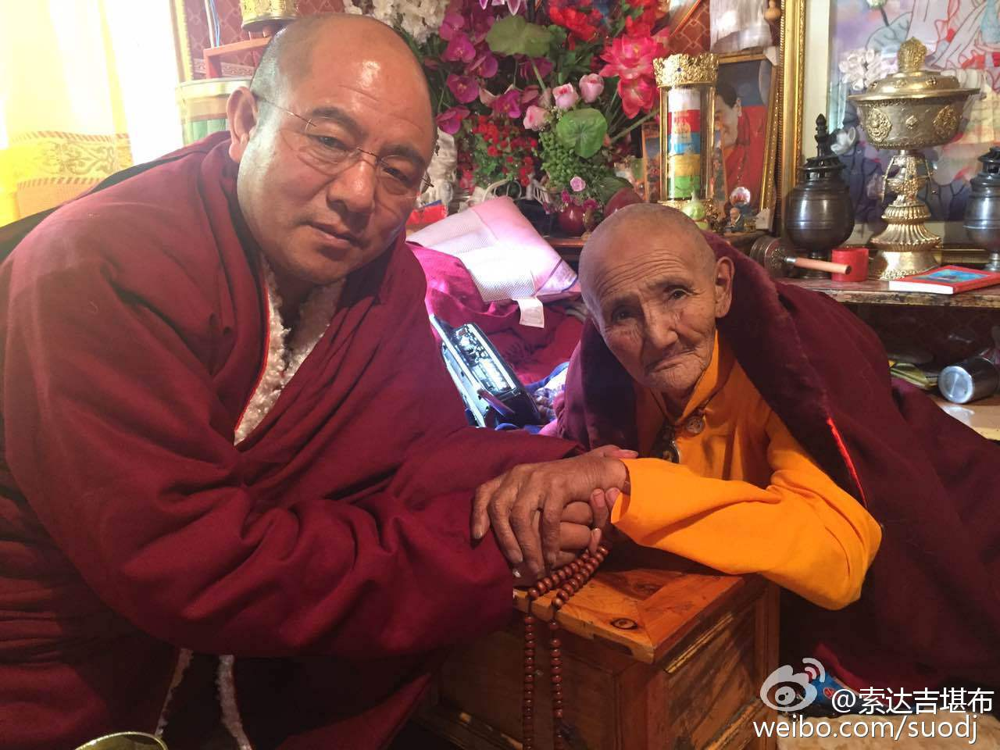
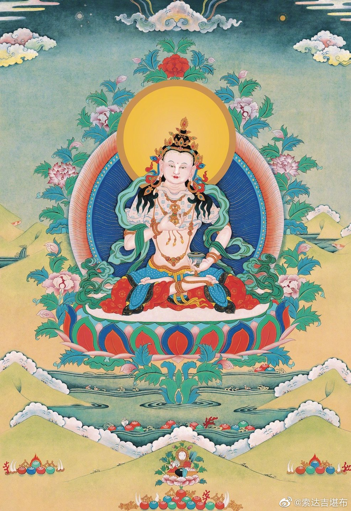
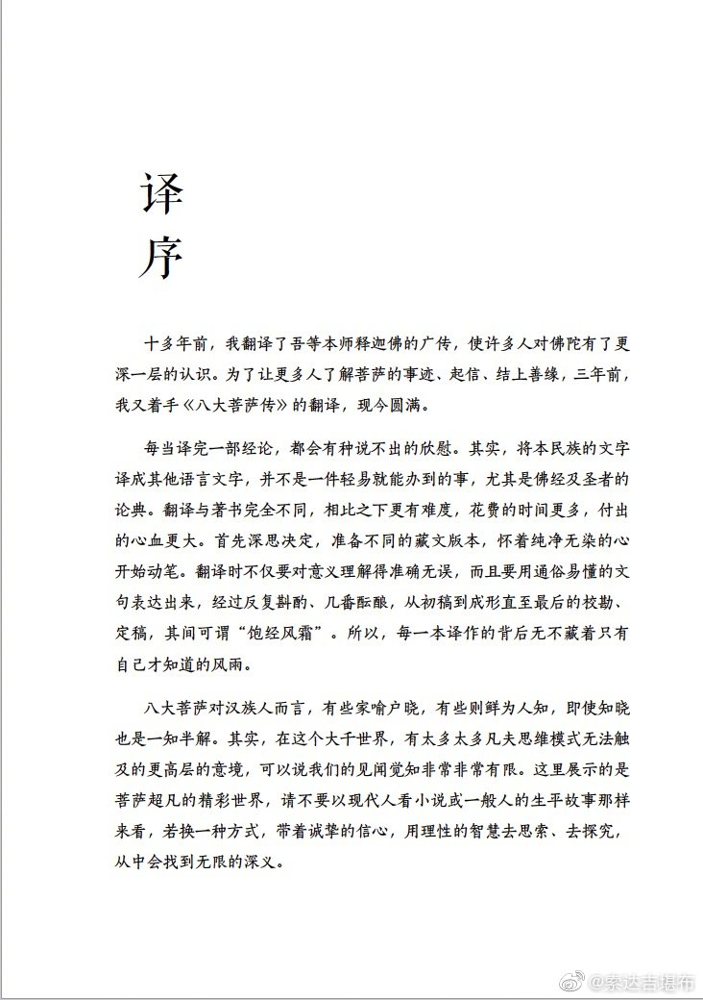
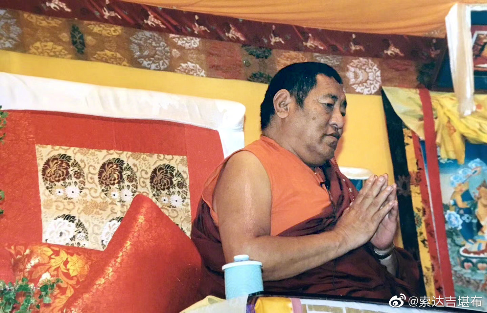
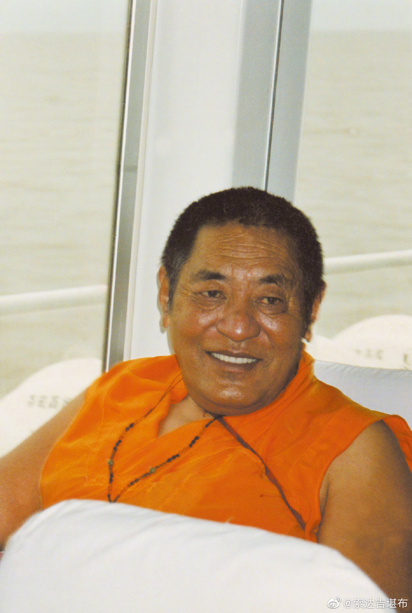

 ## 2019-01-01 05:20
莫舍己道，勿扰他心。
——法王晋美彭措

 ## 2019-01-01 17:16
新年的第一天，我是闭关在书海里度过的，无暇一一回复大家的祝福，但你的心意我都收到了，祝元旦快乐！

 ## 2019-01-02 05:06
学习佛法时，恭敬和智慧非常重要。
若无恭敬，对佛陀和高僧大德的金刚语就不会重视，这样即使佛法再殊胜，也不可能得到点滴利益；而若无智慧，则不会认真思维、反复抉择，对甚深法义就无法获得真切的认知。
——法王晋美彭措

 ## 2019-01-03 05:09
在佛陀的教言里，经常会提到四魔中的“天魔”。通常，人们认为这是指魔王波旬，但实际上，真正的魔王，就是我们的无明迷乱。
——法王晋美彭措

 ## 2019-01-04 05:18
不管显宗还是密宗，最根本的就是要证悟心的本性，如此一来，所有魔众才会无所遁形，自然而然消失。
——法王晋美彭措

 ## 2019-01-05 05:30
我们对一切人事物，都不应该生起贪心。为什么？因为那些引生贪欲的外境，若去观察其本体，不过像水泡一样没有实义，又有什么可贪的呢？
——法王晋美彭措

 ## 2019-01-06 05:28
我们生起的每个心念，看似真真切切、实实在在，但若仔细去剖析，就会发现它是刹那性的，当下生、当下灭，本体犹如虚空，了不可得。
——法王晋美彭措

 ## 2019-01-06 06:18
2019年1月7日（藏历12月2日）是至尊门措上师的生日。请大家共同行持放生、供灯、吃素等善法，祈愿门措上师长久住世，广传法轮。

 ## 2019-01-07 05:15
凡夫被无明所障蔽，把原本不存在的东西，往往当成了真实不虚，进而不断产生执著、烦恼、痛苦……说白了，这完全是作茧自缚、自作自受。
——法王晋美彭措

 ## 2019-01-08 05:11
明白了贪心是空性的，这还远远不够，我们必须还要证悟。就像一个人只是理论上懂得了怎么开车，却从来没付诸行动的话，那不叫真正会开车。
——法王晋美彭措

 ## 2019-01-09 05:36
证悟的方法，在佛教中有很多，我们可以用中观的方法来推理、观察，也可以用大手印、大圆满的窍诀，借助于上师的加持而现见心性。
不管用哪一种，大家务必要牢记：一切法在究竟上虽然是空性，但对空性也不能执著！
——法王晋美彭措

 ## 2019-01-10 05:20
不管是什么样的怨敌，哪怕他再伤害我们，我们也不应生起嗔心，而要尽量把他观成自己的母亲，修慈悲心。
我们不但不能对他恨之入骨、想要报复，还应从内心中真切地发愿：祈求上师三宝加持，愿他早日获得安乐，永远脱离苦海。
——法王晋美彭措

 ## 2019-01-11 05:04
有些人的嫉妒心特别猛烈，看到别人名声大了、钱财多了，内心就特别难受，好像自己的福报被夺走了一样。
但实际上，别人拥有的一切，跟你半点关系也没有。就算他有财有势、功成名就，那也都是他的福报，你再怎么嫉妒，自己也得不到一点一滴。
——法王晋美彭措

 ## 2019-01-12 10:20
现在某些人，认为别人的声誉如日中天，会对自己的名声造成妨碍；别人若是名誉扫地，自己便会声名鹊起，这无疑是在痴心妄想。
其实，就算全世界的人都拥有圆满功德，对你个人的名声也不会造成丝毫损害；反之，假如所有人都活在穷困潦倒中，你也不可能从中得到什么声誉。因此，当别人具有福报时，我们没必要嫉妒不已，而应当生起欢喜心，由衷地随喜。
——法王晋美彭措

 ## 2019-01-12 11:59
弟子在选择上师时，不单单要观察上师，更要观察自己的发心。
如果你并不是真正想解脱，而只是想从上师身上得到情感的满足，比如缺失的父爱、异性的关怀、世间的温暖，那上师不需要具足善知识的法相，只要对你经常嘘寒问暖，就完全足够了。

 ## 2019-01-13 05:10
现在许多人不明白，自己的财富、地位、才华等一切，只不过是前世行善的果报。若是耽著于此而夜郎自大，定会将原有的善根毁坏，心中再也生不出功德。
——法王晋美彭措

 ## 2019-01-14 05:17
有傲慢心的人，总认为自己的智慧出类拔萃、才华傲视群雄，但只要认真去观察，就会明白这些根本不值一提。
在一段时期内，或者特定的小范围里，你的才华或长相等各方面，或许确有过人之处，但不要忘了：在这世上，还有无数人千百万倍地超胜于你。
退一步说，纵然你的功德在凡夫中无人能及，但在圣者当中，肯定是有超过你的人。并且你这种所谓的功德，也并非永存，它只是因缘聚合的产物，十分无常。
——法王晋美彭措

 ## 2019-01-15 05:19
当年，在我的上师托嘎如意宝身旁，智慧卓越、严守净戒的修行人，犹如天上繁星那么多。可到了现在，不少人已堕落到了极为卑劣的地步。反而，过去有些戒律不清净、智慧比较浅薄的人，如今却成了非常了不起的高僧大德。
回顾这些历史足以看出：即便我们现在有智慧、有福德，这些也并非一成不变，实在不应以此而轻视他人。
——法王晋美彭措

 ## 2019-01-15 10:15
攀登不同的山，才知道自己的体力强弱；遇见不同的人，才知道自己的修行高低。

 ## 2019-01-16 05:06
别人心中隐含的功德，我们在没有证得他心通之前，根本无法现量见到。有些人的言行举止，尽管看起来不太如法，但实际上，他内在的功德，说不定如海一样广大。所以，我们对谁都不应轻视与傲慢。
——法王晋美彭措

 ## 2019-01-17 05:40
作为业障深重的凡夫，不管是什么人，烦恼与功德都相互掺杂，就像粪便中混合着妙药，对此我们又有什么可得意的？假如因为自己有了少许功德就开始傲慢，那为什么不因烦恼炽盛而心生惭愧呢？
——法王晋美彭措

 ## 2019-01-18 05:34
仲敦巴尊者曾说过：“在整个世界上，我是最卑劣的人。”阿底峡尊者也说：“自己若有学问，就会特别谦虚地对待别人。”这些具有殊胜功德、远离一切过患的大成就者，对所有众生尚且一视同仁、十分谦逊，我们凡夫的过患如尘垢一样多，又凭什么理直气壮地傲气冲天呢？
——法王晋美彭措

 ## 2019-01-19 05:08
极为傲慢、自以为是的人，往往是中了魔王的花箭，因此，我们千万不要认为自己高人一等，而应学会谦虚、低调，就像被驯服的骏马，不管是什么人，都可以让他骑在自己身上，恭敬地为别人做事情。
——法王晋美彭措

 ## 2019-01-20 05:04
一切万法在胜义中犹如虚空，没有任何贪嗔烦恼，但在世俗中，如幻如梦的显现也是不灭的。
——法王晋美彭措

 ## 2019-01-21 05:13
若以大圆满的窍诀来调伏自心，懂得诸法本体无实有，所见所闻都是大空性，同时在名言中，整个轮回还可以显现，以幻化八喻来对待一切。
这就是大中观、大圆满的观点，也是文殊菩萨大悲化现的“智慧宝剑”。
——法王晋美彭措

 ## 2019-01-22 05:42
若能根除无明愚痴，就像架子的三只脚断了一只，另两只脚也无法支撑一样，整个魔宫将会彻底坍塌，从此任何魔众都对你无法加害。
——法王晋美彭措

 ## 2019-01-23 05:36
在这个世间，分别念给我们带来了无尽痛苦。
就拿贪心而言，一个男人若爱上一个女子，并与之结为夫妻，开始时会觉得她美丽不可方物，而过一段时间后，对她的兴趣就慢慢淡了，甚至还觉得她毫无可爱之处，于是又开始追求别的女人。
实际上，他以前钟爱的女人，与今天讨厌的妻子同为一人，之所以前后的态度迥然不同，完全是他自己的分别念在作怪。
——法王晋美彭措

 ## 2019-01-24 05:29
但凡有了狂乱的分别念，人就像风中的棉絮一样飘忽不定，今天追求甲，明天喜欢乙……结果得到手的美人，最后又认为过于平凡。
试想，假如美丽真有稳固不变的自性，那这个人前后就不该有如此巨大的变化，对于喜欢的人，应该永远喜欢才对，并且还应得到全人类的一致认同。但事实并非如此，某人认为一个女人长得勾魂摄魄、无比迷人，但别的男人就不一定欣赏，甚至觉得也不过尔尔。这就是分别念的不同体现。
——法王晋美彭措

 ## 2019-01-25 05:18
对于污秽的不净粪，人见后定会恶心，但在猪狗看来，却是不可多得的美味。因此，对于美丑、好坏的判别，全是众生一时的分别念所致。事实上，外境中并不存在绝对的好或绝对的坏。
——法王晋美彭措

 ## 2019-01-26 05:34
世间一切的本性皆是无常、空性，没有一法是值得信赖的。然而，凡夫人以虚妄的分别念，把外境误以为实有，将不净视为清净、痛苦当作安乐、无常执为常有，就这样将自心捆缚了，并做出种种颠倒的行为。
——法王晋美彭措

 ## 2019-01-26 06:27
佛教不承认一切是命中注定，努不努力结果都一样。佛教更推崇命自我立，一切成败靠的是自己。
正如《杂阿含经》中一则公案所说：
有一天，佛陀带着阿难去舍卫城化缘，路上看到一对老夫妇，形如乞丐，非常可怜。
佛陀问阿难：“你看到这对老夫妇没有？”
阿难回答：“看到了。”
佛陀说：“这两人在少年时，若非常努力地赚钱，会成为舍卫城第一大富翁；若选择出家学道，则会成就第一阿罗汉果。
在盛年时若非常努力地赚钱，会成为舍卫城第二大富翁；若选择出家学道，则会成就第二阿那含果。
在中年时若非常努力地赚钱，会成为舍卫城第三大富翁；若选择出家修道，则会成就第三斯陀含果。
在老年时若非常努力地赚钱，会成为舍卫城第四大富翁；若选择出家修道，则会成就第四须陀洹果。
只可惜，他们在世间法和出世间法上都没努力过，现今才沦落成这个样子。”

 ## 2019-01-27 05:17
一切颠倒分别念都像纸糊的屠刀，认识了它的本性，这把假屠刀就无法再伤害我们。否则，始终随着分别念而转，哪怕我们拥有的东西再多，也始终拥有不了快乐。
——法王晋美彭措

 ## 2019-01-28 05:07
人如果怀有嗔心，则始终得不到自在，连一个快乐的机会也没有，别人更不会恭敬自己。
——法王晋美彭措

 ## 2019-01-29 05:31
嗔恨是烧毁自心的猛火，一刹那能将所有善根摧毁无余，在这个世上，再也找不到比嗔心更严重的过患了。
——法王晋美彭措

 ## 2019-01-30 05:22
若想消除嗔心，我们就要想方设法修持自他平等，要懂得：自己喜欢快乐，别人也是；自己不愿受苦，别人也是。如此推己及人，就会知道别人在伤害自己时，也是身不由己，有他的烦恼缠缚，如是便不至于斤斤计较，甚至还祝愿他尽早获得安乐。
——法王晋美彭措

 ## 2019-01-31 05:17
有了无明愚痴，必然会遮覆我们暂时和长远的快乐。
为什么呢？因为从无明中可以产生烦恼，烦恼又能引发恶业，恶业又会牵扯出形形色色的痛苦。由此可知，无明是烦恼与痛苦的来源，更是一切过患的根本。
——法王晋美彭措

 ## 2019-02-01 05:04
不知取舍善恶因果，不知闻思修行，这是一种愚痴；对远离戏论的空性并无点滴了解，这又是一种愚痴；对无欺因果的缘起性也丝毫不了达，这还是一种愚痴。
所以，我们现在应断的，就是这种不知取舍的“愚痴”；而最终必须要根除的，则是不通达诸法本性的“无明”。
——法王晋美彭措

 ## 2019-02-02 05:02
如今，各种邪说层出不穷，希望大家在宣讲佛法时，不要离开佛的教证，更不要跟随自己的分别念去诠释佛法。否则，不管是造论著书还是给人传法，这一切都只与无明愚痴相应，不可能成为无明愚痴的对治！
——法王晋美彭措

 ## 2019-02-03 05:05
作为居士和出家人，希望大家不要业际颠倒！
什么是业际颠倒呢？比如，不努力闻思修行，经常破坏戒律，失毁自己的誓言；又如，不愿好好学法，经常跑到各地化缘，营谋私利，或者返回故乡，协助家人搞世间法，这都属于业际颠倒。
——法王晋美彭措

 ## 2019-02-04 05:09
我们一切的痛苦和快乐，其实是各自业力造成的。尤其痛苦的根本，就是贪嗔痴三毒。龙猛菩萨也说：“贪嗔痴及彼，所生业不善；无有贪嗔痴，及彼生业善。”
——法王晋美彭措

 ## 2019-02-04 08:05
一个人过年啦

 ## 2019-02-04 20:30
新年吉祥！这个月是神变月，2月5日-19日是殊胜的日子，在此期间，喇荣历来都会念修观音九本尊，望大家多行善法，减少散乱，为自己、为他人带来一分圣能量。

 ## 2019-02-05 05:06
我们日常的言行举止、起心动念中，掺杂了贪嗔痴的都是恶业，断除了贪嗔痴的才是善法。因此，想方设法断除贪嗔痴，对每个人来讲至关重要。
只有远离了这三毒，才能从根本上得到暂时和究竟的安乐。
——法王晋美彭措

 ## 2019-02-05 05:22
这是我给自己布置的寒假作业：在假期内，完成汉译《显句论》《宝性论》的翻译、校对，写完《梦尘回忆录》的初稿，藏译《杂阿含经》翻译出来一部分。
虽然如期完成有点困难，但我在争分夺秒地拼命赶，请别打扰我啊

 ## 2019-02-06 05:16
佛法的殊胜教言，就如天人的甘露能治愈一切病苦一样，有缘者听受并付诸实践后，可以清净自己的贪嗔痴烦恼。
——法王晋美彭措

 ## 2019-02-07 05:11
我们每个人业感不同，故从中幻化的苦乐有天壤之别。哪怕是一家三口，整天在一起同吃同住，感受也不尽相同——一个人晚上做梦吉祥，身体也安康，而另一个人却可能噩梦连连，身体不适，心情糟糕得一塌糊涂。所以，不管是谁，哪怕关系再亲密，都不可能是同一个感受。
——法王晋美彭措

 ## 2019-02-08 05:09
这些千奇百怪的痛苦和快乐，到底是从哪里来的呢？它并不是外境招致的，而是源于我们的心。
——法王晋美彭措

 ## 2019-02-09 05:00
如果我们心中充满慈悲和信心，今生一定会安乐；而若以无漏的智慧摄持，还将达到圆满究竟的解脱。但假如经常生起恶念而造业，那么等待自己的，无疑就只有狰狞的恶趣、难忍的苦痛。
——法王晋美彭措

 ## 2019-02-10 05:05
释迦牟尼佛在佛经中指出：“心为一切诸法之源，故名为普作王。”为什么称为“普作”呢？因为心既能作清净的涅槃，也能作不清净的轮回。就是说，轮回中的一切，是不清净心的显现；涅槃和智慧，是清净心的显现。
——法王晋美彭措
 ## 2019-02-11 05:05
若详加观察，我们会发现，外境中根本找不到真正实有的事物，所以，清净和不清净的根本，唯一就是自己的心。
——法王晋美彭措

 ## 2019-02-12 05:13
既然心能显现轮回、涅槃等一切法，那么，若将自己的心转到善法方面，安乐将会指日可待；假如不能调伏自心，经常在烦恼的推动下为非作歹，未来也必定是自讨“苦”吃。
——法王晋美彭措

 ## 2019-02-13 05:14
不管是男人还是女人，谁离不开贪心，谁就会被痛苦的镣铐束缚着，永远也不会拥有宁静的生活。
——法王晋美彭措

 ## 2019-02-14 05:02
众生的贪欲始终无法满足，越享受，会越增上。
就像从未经历过男女之事的人，虽然也有贪欲，但还不会严重到不可抑制的程度。可如果享受过一次，就会越来越希求，以至于欲望不断增长，始终没有满足之时。
有些人天真地认为，自己只享受一次欲乐，就足够了。但若想以此令贪欲变淡，这无疑是异想天开。如同饮用盐水，只会越喝越渴，贪欲越享受就会越炽盛，永远也不可能让你心甘情愿地舍离。
——法王晋美彭措

 ## 2019-02-15 05:06
假如贪欲在满足之后真会减少，那很多人一生中已得过无数次的满足了，可时至今日，为什么我们的贪欲还在不断增长，并没有随时间流逝而减轻呢？
——法王晋美彭措

 ## 2019-02-16 05:11
贪心带给我们的快乐，少而短暂，而最后的苦果，却需要多生累劫去承受。
——法王晋美彭措

 ## 2019-02-17 05:16
就像拉车的牲口，为了吃路边的一撮草，就要遭受不断的鞭挞。它得到的，只有一口草那么少，身心却蒙受了巨大苦痛。
得利少，痛苦多，世间贪欲莫不如此。
——法王晋美彭措

 ## 2019-02-18 09:38
既然贪欲如此害人，若想真正消除它，就不能靠满足它来淡化，而要依佛法的窍诀加以对治。
——法王晋美彭措

 ## 2019-02-19 05:12
如今有些权富之人，身处在悦意的环境中，有许多人围着他们歌功颂德，但即便如此，他们将来也会像普通人一样，面临恐怖的死魔，没有丝毫自在。甚至不少人在活着的时候，就因福报穷尽而倾家荡产，感受无常的诸般戏弄……
所以，人的苦乐是不定的。犹如煮饭时米粒在锅里沉沉浮浮，我们的人生中，也会有时因善业而感受快乐，有时因恶业而饱尝痛苦，苦乐就这样一直形影不离、此起彼伏。
——法王晋美彭措

 ## 2019-02-20 05:08
麦彭仁波切说过：“轮回中的安乐，犹如闪电般短暂，丝毫也不可靠。”
现在我们拥有了宝贵的人身，又听受了殊胜的佛法，此时不管是谁，都应好好利用这个机会修行，如此才能对死亡有一定的把握。
就像华智仁波切所说：“永舍天灵盖！”意思就是，我们通过精进修行，舍弃今生这个人身后，便不会再以业和烦恼流转轮回，永远从苦海中获得了解脱。
——法王晋美彭措

 ## 2019-02-20 18:01
在无边的轮回中，在漂泊的人生中，我们还有多少个春秋可以闻思修行？这种机会难以确定，万望珍惜。

 ## 2019-02-21 05:04
可惜的是，不少人总以为自己离死亡很远，对死期从来就没想过，一辈子的时间都在汲汲经营名利，完全没把解脱放在心上。他们平日放逸无度，却不知无常会突然降临，死亡的极大恐怖瞬间就会将其击垮。
——法王晋美彭措

 ## 2019-02-22 05:12
死神将于何时何地出现，这是谁也无法预料的。当这一天到来时，就算关系密切的亲友围绕在身旁，声嘶力竭地呼唤着我们的名字，撕心裂肺地痛哭流涕，甚至因悲伤过度而昏厥倒地，死神也会毫不留情。此时，哪怕心中再依依不舍，我们还是不得不离开人间，孤身一人走上凄凄惨惨的中阴路。
——法王晋美彭措

 ## 2019-02-23 05:17
每个人在不久的将来，注定都会走上这条路——离开这个幻化无常的人间，离开自己最爱恋的亲人。因此，对于今生的一切，我们没必要过于执著，而应抓紧时间，为长久的安乐而修行正法，为死亡的到来做好充分准备。
——法王晋美彭措

 ## 2019-02-24 05:40
世间的一切，并非一成不变。
就拿身体来说，年轻时，我们的脸庞犹如白莲花一样白里透红，英俊可爱，但即便美若天仙，一旦人老珠黄，也会像一截干枯的朽木，这时，自己看自己都心生厌烦，只有在心里默默怀念一去不复返的青春。
多少人愿意欣赏老迈的身体呢？像我们这些上了六十岁的老年人，年轻人看了都会避之不及。但可以预见，在不久的将来，他们健美挺拔的身体，也定会如我们一样老朽。
——法王晋美彭措

 ## 2019-02-24 14:08
许多人不懂什么叫爱，只不过把自私的实执，美其名曰为“爱”。
真正的爱，是无论在任何时候、任何地点、对任何众生，既不恨，也不害。
这种爱在佛教中，叫大乘菩提心。

 ## 2019-02-25 04:43
不仅身体是无常的，外在的世界也无一不是如此。
高山平川、城市乡村、大漠戈壁……这些形形色色的环境，既有赏心悦目的地方，也有危险凶恶的处所。但不管是什么样的，终究都会被无常摧毁，就像沧海可以化为桑田一般，改头换面。
——法王晋美彭措

 ## 2019-02-26 05:03
既然无论是外在的世界，还是我们自身，都没有恒常不变的东西，那又何必对于现在所拥有的贪恋不舍呢？
——法王晋美彭措

 ## 2019-02-26 10:25
别人骂我们是“疯子”，我们常常特别生气。
实际上，如果我们被嫉妒、嗔恨所驱使，说的话、做的事，也跟疯子没什么差别。
因为这时候的自己，心也是不受控制的，标准具足了疯子的法相。

 ## 2019-02-27 05:08
在这个世界上，每个人的苦乐虽不相同，但有一点却是共同的：我们的快乐与痛苦，宛如天空中的闪电，全都是无常。
可许多人不明白这一点，他们执著于虚幻不实的身体、财物等，并为此造下了各种恶业。直到临终之际才猛然发现，原来苦苦追求的这一切，竟连一根毛都带不走。而跟自己如影随形、紧追不舍的，唯有这辈子所造的善业和恶业。
——法王晋美彭措

 ## 2019-02-28 05:17
年轻人在长相、才华、财富等方面比较圆满时，没有必要骄傲。虽然，你与眼下很多人相比还过得去，但世间一定还有你不知道的、比你更优秀的人物让你相形见绌。
——法王晋美彭措

 ## 2019-03-01 05:12
年轻的时候，要怀有一颗谦虚朴实的心，对无常有着充分的准备，别以为万法会恒常不变。
在我的一生中，曾看到很多地位显赫的人，后来堕落到了极其可怜的地步。富裕的人一下贫穷，穷人转眼变成富人，这个大地上的事物，变化真是太大了。
——法王晋美彭措

 ## 2019-03-02 05:11
富贵无常犹如空中的浮云，地位无常宛如山顶的云雾，美名无常如同空谷的回声。
当别人羡慕你的容貌、才华、智慧等时，请记住：这犹如在梦中赞叹我们一样，没有多大实义！
尽管这些东西对世人比较重要，但临终时没有一样能带得走，肯定全部留在人间。因此，对名声、财富、地位等世间法，我们最好不要有强烈的贪执，否则，只会让自己无休止地痛苦。
——法王晋美彭措

 ## 2019-03-03 05:06
我们所感受的一切苦，都是往昔造恶的果报现前。但许多人并未深刻认识到这一点，以至于遇到点滴违缘便怨天尤人，这种做法确实愚不可及。
——法王晋美彭措

 ## 2019-03-04 05:09
如今许多人在遭受挫折时，要么埋怨亲友没有本事，要么抱怨环境没提供足够的机遇，却不知苦乐的根源是自己。
打个比方，如果我们的脸上没有污渍，在镜子中也照不出来；同样，我们昔日若从未造过恶业，今生绝不会无缘无故感召痛苦。
——法王晋美彭措

 ## 2019-03-05 05:17
每一个众生的痛苦，都跟往昔的业力有关。表面上看来，外境对我们的苦乐似乎有着直接影响，但实际上，它只是通过业力在起作用，伤害你的人也是被业力操控，身不由己。
——法王晋美彭措

 ## 2019-03-06 05:04
在业力成熟之际，我们再有钱、再有势，也无法驱走曾酿下的苦果；纵有天人的神变，在业力面前也无济于事。若想将其彻底净除，唯有通过忏悔才可以。
——法王晋美彭措

 ## 2019-03-07 05:07
不论何时何地，当我们习惯用慈悲心来对待所有人时，即便是本来欲制造违缘的仇敌，也会逐渐对我们心生欢喜。
——法王晋美彭措

 ## 2019-03-08 05:44
倘若我们希望别人帮助自己，那就要先主动帮助别人。如果真心喜欢自己的人越来越多，反对的势力便会日渐减弱。纵然有人本来不太赞同我们，但在我们善意的感召下，他们所说的有些语言，也会成为对我们的赞扬。
反之，假如自己到处树敌，令人怨声载道，那无论做什么都很难成功。
所以，若想得到众人接受，最有力的法宝就是慈悲心。
——法王晋美彭措

 ## 2019-03-09 05:25
若想赢得别人的好感，自己首先应具备功德，并要以慈悲心对待所有人，不能随意轻视他们。
——法王晋美彭措

 ## 2019-03-10 05:18
生活中，无论说话还是做事，有些人总是有意无意地采取不诚实的态度，如此习惯之后，他所做的一切，在别人眼里都变成了狡诈。暂时看来，他的事情也能成功，但其后必将走向衰败。
这种人就像山上的水，刚开始是高高在上，但渐渐地就会越来越下降，再也没有上升的机会。所以，以狡诈的行为来成办事业，既虚伪又不可靠，最终也不会得到长远的利益。
——法王晋美彭措

 ## 2019-03-11 18:44
爱耍小聪明的人，看似精明，实则愚笨。他们情不自禁只关心眼前的蝇头小利，从没想过自己的所作所为会让很多事适得其反。而具有大智慧、大能力的人，眼光就比较深远，一切都是为了长远打算，这样的人，他的今生来世必将成熟无止无尽的安乐。
——法王晋美彭措

 ## 2019-03-12 05:03
有些人各种欲望层出不穷，始终期待着一些不切实际的东西，白天晚上都在焦虑之中度过，致使生活中鲜少安乐。他们不知道自己的命还有多长，却总盘算着在这做一件大事，在那做一件大事……天天这样打妄想，真是很可怜。
这种行为，若静下心来想想，就会发现它对自己不仅没有任何实益，还让人生虚度得很快。
——法王晋美彭措

 ## 2019-03-12 05:45
作为上层管理人员，无论上师还是高官，都必须具足世间和出世间的智慧，高瞻远瞩，善于取舍因果，处理问题不能有偏袒之心。尤其当自己经手一些财物时，千万不能贪污。
——法王晋美彭措

 ## 2019-03-12 19:07
刚回来了
 > @索达吉藏文化
 > ད་ཁྱིམ་ལ་ཐོན་ཐལ།

 ## 2019-03-13 05:07
处于贫穷痛苦的时候，别人若对我做过帮助，日后当我财富势力圆满时，也不能忘记他。否则，即使自己的名声、地位再高，实际上也是一个卑劣的小人。
现在有些人就是这样，稍微有一点地位，就把以前的恩人忘得一干二净。他把有恩于己的人舍弃，结交上一个势力比较大的，到了一定的时候，他又会故伎重演……所以，跟这种人打交道没有任何意义。
——法王晋美彭措

 ## 2019-03-14 06:33
交友，关键要看对方的品格，如果人格好一点，哪怕他与你关系一般，甚至对你可能还有点偏见，也绝不会做有损你的事情。而如果为了与你交好，甘愿舍弃之前的旧友，那此人就很不可靠，总有一天，他也会这样对待你。
甚至有些人对自己的上师也是如此，当他见到一个更有名望的上师，就把原来的上师舍弃了，这种忘恩之人极不稳重。
从前，有三位远道而来的喇嘛向钦则仁波切求法，仁波切对他们说：“如果你们舍弃以前所有的上师，我就给你们传法。”
当时，有两个喇嘛觉得，他们以前的上师名望低下，而钦则仁波切声名远播，于是就同意了。但剩下那位喇嘛认为：“钦则仁波切虽是一位非凡的大德，但以前的上师对我恩德深厚，所以，我宁可不求法也不能舍弃上师。”
钦则仁波切见状，就对那两位喇嘛说：“你们这样对待以前的上师，以后肯定也会这样对我，所以你俩不是法器，不能听我的法。另外那个喇嘛，则可以留下。”
后来，那个喇嘛在仁波切面前闻受了许多佛法，证悟了非常殊胜的境界。他的名字，就叫阿克沃热。
——法王晋美彭措

 ## 2019-03-15 05:13
当自己的地位越来越高时，对下面的人越要有慈悲心，对上面的人也不能卑躬屈膝，应当做到不卑不亢。
——法王晋美彭措

 ## 2019-03-16 05:17
与人人都和睦相处，并且具有慈悲心，对上者恭敬，对下者爱护，也不贪求自己的财利名声，这种人可以当首领。
——法王晋美彭措

 ## 2019-03-17 05:45
占便宜是一种颠倒因果的行为，哪怕你平时行为正直、生性慈悲，但若不重视这些因果，到头来也终将毁了自己。
——法王晋美彭措

 ## 2019-03-18 05:27
损失财物只是暂时的痛苦，损坏名声是一生的痛苦，损害因果则是生生世世的痛苦。所以，就算你没有财富也没关系，没有名声也无所谓，但千万不要失坏了自己的因果正见。
——法王晋美彭措

 ## 2019-03-19 05:09
愚笨的人总是贪著眼前小利，有智慧的人则会作长远打算，追求自身功德的完善，才是一切幸福圆满的因。
——法王晋美彭措

 ## 2019-03-19 16:08
顶礼莲师多杰卓罗！
佛教中的忿怒佛像，是一种表法，是智慧与大悲结合的游舞。他并不会伤害任何众生，只是降伏众生相续中的烦恼、五毒和痛苦，就像父母永远不会伤害孩子，只不过对他的刚强难化示现一种怒目调教。

 ## 2019-03-20 05:14
不管是什么人，最好不要贪执财物，而应经常思维无常，取舍因果小心翼翼，这样才能令自己越来越安乐！
——法王晋美彭措

 ## 2019-03-21 05:18
现在许多人经常声称，自己于某某境界中，亲见了上师、佛陀、本尊等。
对于这种人，大家务必要认清其真面目，千万别听任他们信口开河。同时，也希望此等妄语之人，要警惕因果报应。
——法王晋美彭措

 ## 2019-03-22 05:03
第一世敦珠仁波切驻锡喇荣沟时，当地曾有位叫阿切桑给的修行人。他时而将帽子戴在头顶，声称自己生有肉髻；时而又自言能够飞翔。可当他真从高高的房顶纵身跃下后，身体却摔成了重伤。
有一次，他自称拥有许多伏藏品，要求敦珠仁波切予以鉴定。敦珠仁波切看过之后，坦率地说：“这些并非真正的伏藏，你可能是着魔了。”
然而，阿切桑给并不相信这些话。他不仅坚持认为自己的“伏藏品”货真价实，还诽谤敦珠仁波切是因为嫉妒才这样说的。
之后，他又找另一位大成就者鉴定“伏藏品”的真伪，结果依然不被认可。
不过，他还是固执己见，最后来到蒋阳钦哲仁波切面前，要求再次予以鉴定。仁波切善巧地为那些伪伏藏作了签字，同时要求他念诵一千万遍莲师心咒，说只有如此才可以显示鉴定结果。
他按照要求将莲师心咒念完之后，在境界中忽见一名出家人应声坠地，自以为是的魔相也以此破灭。至此，他才幡然醒悟，并开始向真正修行人的方向转变。
实际上，阿切桑给当时确已着魔，后来是依靠咒语的力量和蒋阳钦哲仁波切的殊胜加持，才得以遣除违缘、恢复正常的。
通过这个例子，我们可以得知：凡夫所见的境界不一定真实可靠。有些人之所以昼夜都能见到佛菩萨的形象，不过是其风脉明点在外境上的显现，丝毫也不值得欢喜和夸耀。
以后当我们也遇到这种情形时，千万要牢记：切不可以自我吹嘘之心，向他人宣称自己亲见了佛菩萨。因为，这相当于彻头彻尾的大妄语！
——法王晋美彭措

 ## 2019-03-23 05:08
纵观古今，凡夫人往往不甘寂寞、乐于散乱，喜欢到喧哗的场所打发时光。如果生活中有个什么风吹草动，大家就赶紧聚在一起，兴致勃勃地议论纷纷。假如身边有一点纠葛发生，人们更是兴奋莫名——所谓的安分守己者，就躲在一旁隔岸观火；而好事之徒，则以说三道四的形式为之推波助澜。
龙猛菩萨在《亲友书》中曾讲了观看热闹的过失。华智仁波切在《自我教言》里，也讲述了我们应时常安住一处的道理，并要求大家将身体安住于房屋中，心安住于身体里。
——法王晋美彭措

 ## 2019-03-24 05:11
如今的世间人莫说不看热闹，或者时常安住一处，就连平时讲话，嗓门也是越来越大。
其实，不管是什么人，平日里都应当心性调柔、轻声慢语，不要随意高声叫喊。
——法王晋美彭措

 ## 2019-03-25 05:04
一般而言，有些高僧大德害怕为名利所累，故决不贪计个人财物，常常以苦行僧的面目调化众生；但也有一些大成就者，为了利益更多有情，不得不“沾染”世间名利。
当年，华智仁波切和贡珠·云丹嘉措都是著名的成就者，并且私交甚笃。贡珠仁波切在石渠的弟子很多，起居坐卧如同众星捧月一般，身边的马匹和财物也多得难以计数。
有一次两人共处时，华智仁波切因对贡珠仁波切的声名显赫、财富广积心生厌倦，便对身边的人说：“贡珠·云丹嘉措如今已闻名遐迩、财富丰饶，像我这样的苦行僧再逗留于此，恐怕会大煞风景，我还是走吧。”
贡珠仁波切听后，再三祈请他留下来。华智仁波切以开玩笑的方式说：“当初在西穷晋美土登南嘉面前听闻佛法时，我俩不但衣不蔽体，而且房屋简陋，时常遭受众人的欺辱。当时为了果腹，我们还常结伴外出乞讨、化缘，这些事不知你现在是否还记得？如今，你已成为著名的高僧，也不再需要我为你做什么了，我呆在这里还有什么意义呢？”
听闻此言，贡珠仁波切摇摇头说：“你千万别这样想。有些事情，我根本就是迫于无奈而行之，绝非贪图个人利益，若不是以此可饶益众生……”听完挚友的一番解释，华智仁波切点头表示理解。
想想这两位震古铄今的大德，一位以贫穷僧人的形象度众，一位则以富裕僧人的面目饶益有情，但不管如何示现，他们都具有无私的境界，一心只为了利益众生。相形之下，有些人内心深处只有自己，不择手段地贪图名闻利养，这又有什么可值得世人敬仰呢？
——法王晋美彭措

 ## 2019-03-26 05:12
当遭遇怨敌伤害时，浅慧之人的嗔心会油然而生，情不自禁就采取各种报复手段——当然，导致的后果也可想而知。
释迦牟尼佛曾着重指出：所有痛苦与快乐，皆是源于自己以前的业力。如果把受苦的原因怪罪于外境与别人，而不知励力忏悔业障，那只会增上无边烦恼。就像一个患了胆病的人，随意享用油腻食物，结果加重了病情，这时候他只该责怪自己，而不应迁怒于食物，对它大生嗔心。
——法王晋美彭措

 ## 2019-03-27 05:43
对外境生嗔，只会毁坏自己的今生后世。所以，包括自己在患病时，对病魔也不要嗔恨，否则会让自己苦上加苦。
——法王晋美彭措

 ## 2019-03-28 05:25
一切祸害的根本，就是我们自己的心，也可以说是往昔所造的罪业。
若能通达这个道理，当苦难来临时，就知道这一切都是自作自受，便不会一味抱怨外境了。
——法王晋美彭措

 ## 2019-03-29 05:10
若进一步观察，就会发现，所有痛苦的来源实际上是我执。
只有从根本上斩断了我执，才能让痛苦荡然无存。
诚如寂天菩萨所说：“世间一切灾害、恐怖和痛苦，皆从我执而生，既然如此，还留着我执这个大魔王做什么呢？”
——法王晋美彭措

 ## 2019-03-30 05:15
人生的所有痛苦，实际上都是从未调伏自心产生的。
我们内心的分别念，就像只小猴子一样蹦蹦跳跳，要想抓住它，必须用一根正念的绳子，否则，它一刹那也不会老实安分。
——法王晋美彭措

 ## 2019-03-31 05:03
假如不愿意对治分别念，它的力量有时候相当可怕。就像家中有个性格恶劣的妻子，整天大吵大闹，家人的生活会一直陷于不安之中。
同理，如果烦恼存在心中，我们永远也不会有安乐。一个恶妻，不但会耗尽家财，家中男人也可能因她丧命。而我们心中的烦恼若没有调伏，后果比家有恶妻更为可怕。
——法王晋美彭措

 ## 2019-04-01 05:26
现在许多人希望自己健康无病，永远青春年轻，其实这些意义并不大，若能调伏自己的心，其价值将远远超过世上的一切。
华智仁波切也说：“调伏心、调伏心，用菩提心来调伏心，纵然身体和语言没行持任何善法，实际上这也对自己和众生有利。”
——法王晋美彭措

 ## 2019-04-01 09:01
还在下大雪。

 ## 2019-04-02 05:10
对一个普通人而言，不愿接受痛苦、强烈地执著安乐，这种分别念一直在不断地涌现。
而我们作为修行人，应当断除这种心态，将一切苦乐转为道用。比如，自己正在痛苦时，最好安住于空性当中；倘若没有这种境界，那就修持自他交换的菩提心，观想代所有众生受苦。
如此修一次法，就可以积累千百万劫的资粮，痛苦当下会转为功德。
——法王晋美彭措

 ## 2019-04-03 05:15
每个人都有一些愿望和目标，但一个愿望实现了，还有更多的目标紧跟着，还想追求更多的安乐。
分别念就是这样，一个愿望达成了，接着又生起一个新的希求心。就像有些人，有了房子还想要院子，有了院子还需要花园……在我执尚未断尽之前，这种心始终没完没了。根登群佩大师也说：“乃至小蚂蚁在内的所有众生，都在为自己的利乐而奔波。”
——法王晋美彭措

 ## 2019-04-04 05:05
我们不管是希求善法，还是追求无意义的琐事，到了最后，都应该观察心的本性，断除一切期望和疑虑的分别念，在无有任何执著的境界中安住，如此烦恼才会销声匿迹。
——法王晋美彭措

 ## 2019-04-04 09:47
人在年轻时，总喜欢想“未来”多美好。
人在年长时，总喜欢想“过去”多美好。

 ## 2019-04-05 05:14
最初心若无法安住，可以在自己面前放一尊释迦牟尼佛像，然后注视佛像的心间；如果时间久了产生昏沉，则可往上观佛像的顶髻。
如此观修，很容易调伏这颗躁动的心，所有的分别念都会消失。
——法王晋美彭措

 ## 2019-04-06 05:40
当年我在石渠求学时，有一天上师托嘎如意宝说：“如果我们没有去调伏心，心的力量会非常凶猛可畏；但如果去调伏它，就会发现它只不过是一只纸老虎。我们哪怕只用短短七天，好好地祈祷上师，认真调伏自己的心，心的状况也会与从前有极大不同。”
我对上师的话深信不疑。其实只要肯下功夫，依靠殊胜的修法窍诀，调伏心并不困难。我们之所以一直做不到，只不过是没在这方面痛下苦功而已。
——法王晋美彭措

 ## 2019-04-07 05:24
佛陀曾说，即使以散乱心看佛像，将来也会离苦得乐。甚至，哪怕以嗔恨心看佛像，此人虽然暂时会堕入恶趣，但由于他已与佛陀结上了缘，最终也会渐渐证得菩提。
佛像的功德如此之大，所以《亲友书》中说，只要是佛像，不管它的材质如何、制作是否精致，哪怕是泥塑木雕的，也应生起恭敬心。
——法王晋美彭措

 ## 2019-04-08 05:06
释迦牟尼佛当年亲口承诺：“在我涅槃之后，人们若造佛像，对其存有感恩心或信心，经常去忆念，这跟佛陀在世没什么差别。”
所以，观想具足相好的佛像，对今生和来世有重大的意义。（当然，观想和修持佛陀的智慧身，如是功德更为殊胜。）
——法王晋美彭措

 ## 2019-04-09 05:03
贪心极为强盛的人，见到一个绝世美女后，她的笑靥会时时刻刻浮现在脑海中。同样，对诸佛菩萨若也有这样的“贪心”，日日夜夜不断地忆念，乃至我们获得菩提果之间，佛菩萨都不会远离，并时时以大悲心加持我们，带来一切利乐的悉地。
——法王晋美彭措

 ## 2019-04-10 05:01
不论祈祷哪一位圣尊，都会增长智慧。尤其若想得到加持，就应祈祷上师；想获得悉地，就应祈祷本尊；要成就事业，就应祈祷空行母；要遣除违缘，就应祈祷护法神。
所以，若想成办不同的利益，望大家经常作如是祈祷。
——法王晋美彭措

 ## 2019-04-11 05:13
大家方便的时候，最好回顾一下自己的人生：“我造过多少恶业？吃过多少苦头？”其实，只要稍加观察，就会发现痛苦从未远离过自己。所以，若想不再受这些难忍之苦，我们务必要精进修行。
——法王晋美彭措

 ## 2019-04-12 05:03
修行佛法，实际上并不像有人认为的那样高不可攀。譬如说，最下等的人也能往生极乐世界，这就比较简单吧！只要对阿弥陀佛有坚定的信心，一心一意发愿往生，然后依教奉行，不造五无间罪和舍法罪，那么定会如释迦牟尼佛和阿弥陀佛亲口承诺的：我们命终后一定能往生极乐世界。
——法王晋美彭措

 ## 2019-04-13 05:07
当今时代，任何人修法都不可能没有违缘，即便是接近登地的圣者，也会遭受种种困苦和挫折。
然而，只要值遇磨难时不退失信心，坚定地祈祷上师三宝，不为外境所束缚，就一定会得到强大的加持和庇护，从而迅速得到解脱。
——法王晋美彭措

 ## 2019-04-14 05:17
修行人的内心一旦具足正念，什么东西也伤害不了他。魔王波旬当年在佛陀面前，就亲口承认过这一点。
——法王晋美彭措

 ## 2019-04-15 05:13
现在，不少人喜欢给别人取绰号，叫什么“大鼻子、小眼睛、小个子、大胖子……”，甚至还有更不堪入耳的。其实，如果你经常叫人“大胖子”，那自己五百世可能会转生为大胖子，一不小心就造下了令自己后悔的恶业。
我的根本上师托嘎如意宝，常讲给别人取外号的果报，并引华智仁波切在《大圆满前行》中的公案说：一个人曾用十八种动物头的绰号辱骂他人，结果就转生成了有十八个动物头的怪物。
——法王晋美彭措

 ## 2019-04-16 05:09
口业是最容易造的，所以智者从不随便多言。他们常以圣者的教言，观察自己说话的时机、环境、轻重，然后才说些有必要的话语。
——法王晋美彭措

 ## 2019-04-17 05:18
我们平时一定要谨小慎微，管好自己的嘴巴，不要随意对人恶言相向。假如自己因业力现前，控制不住骂了人，也应马上念“嗡班匝萨埵吽”至少一千遍，乃至十万遍。以此咒力的不可思议加持，可以忏净任何可怕的业障。
——法王晋美彭措

 ## 2019-04-18 05:11
生起菩提心和受持菩提心，是极为甚深的心灵之道。
——法王晋美彭措

 ## 2019-04-19 05:01
我从很小开始，就以学习和修持佛法为主，并有幸跟随一百三十多位了不起的上师修学，也有机缘为成千上万的人宣讲佛法。
从我自身经验来看，在所有的佛教法门中，菩提心的教授极为甚深。且不说实际修持菩提心的利益，仅仅是听闻这个法门，也会播下解脱的种子。
——法王晋美彭措

 ## 2019-04-20 05:11
若能以菩提心摄持自己的生活与修行，将会得到不可思议的利益。不仅能带来健康、长寿、富足，同时，还可遣除自己乃至整个社会的种种负能量。
——法王晋美彭措

 ## 2019-04-21 05:14
世间上的任何妙欲，从中可以享受的快乐十分微薄，但随之而来的痛苦却无穷无尽。可遗憾的是，许多人好像并不清楚妙欲的众多过患，对此毫不在意，日日夜夜沉溺其中不能自拔。
——法王晋美彭措

 ## 2019-04-22 05:08
许多人在年轻时代，花费大量精力追求一些不必要的妙欲，自以为人生还特别漫长。但事实上，人的一生相当短暂，老人们对此就深有感触。
——法王晋美彭措

 ## 2019-04-23 05:58
我们从一岁到十几岁，都是贪玩的孩童时期，这段时间如梦般恍恍惚惚就过了；十几岁到四十来岁，可以算是人生的鼎盛时期，但也转眼即逝，并且在此期间，还经常遭遇家庭、工作的各种违缘，抽不出时间修持善法；到了五六十岁以上，身体大不如以前了，尽管也想行善断恶，但心有余而力不足，这时候后悔也来不及了。
所以，大家一定要把握住眼前的时光，不要肆意挥霍宝贵的人生。尤其当妙欲勾住了我们的心时，应通过各种方法了知其本性，不要让自己再成为它任意摆布的奴隶了！
——法王晋美彭措

 ## 2019-04-24 05:46
我们在日常生活中，理应随时随地观修万法如梦，对一切不要特别执著。当我们对别人生贪心或嗔心时，马上意识到这跟梦中嗔敌贪亲一样；当自己成功或失败时，也知道这就如同梦中的成败一样……
若以此慢慢断除执著，不但各种痛苦会离你远去，最终还可以认清一切诸法的真相，证悟三世如来的果位。
——法王晋美彭措

 ## 2019-04-25 05:27
作为一个人，对自己的前途务必要好好思索。为了使现在、将来圆满幸福，每个人均应抓紧时间做有益于自己的事情。
在我看来，对众生今生来世最有帮助的，莫过于殊胜的佛法。
——法王晋美彭措

 ## 2019-04-26 05:09
在佛法中，有两个要点必不可少：
第一、清净的见解，尤其是相信因果的正见。如果没有它，就得不到善趣的安乐。
第二、无垢的信心，即对三宝有永不退转的信心，这是今生和来世一切圆满的根本。
——法王晋美彭措

 ## 2019-04-27 05:13
对三宝的信心和因果不虚的正见，对每个人有多重要呢？
佛陀告诉我们，若具足了这二者，就一定不会堕入恶趣，并且所希求的一切功德皆可依此而成就。
——法王晋美彭措

 ## 2019-04-28 05:37
信心和正见是我们最究竟的朋友，除此以外，像财产、地位、名声等，并不是永久可靠的依赖，因为当自己奔赴中阴时，这些一点都带不走。
——法王晋美彭措

 ## 2019-04-29 05:27
我们的生命，犹如黎明时的星星般眨眼即逝。作为一个老人，我比较容易有这种感悟，而年轻人，也别以为未来还很长，不要盲目地有这种自信。今后应该有什么打算，每个人都需要想一想。
——法王晋美彭措

 ## 2019-04-30 05:15
不管国王还是乞丐，在死亡面前都是平等的。每一个众生死亡之后，均会随自己所造的善恶业而流转，因此，为了今生利益而造诸多恶业，是相当不明智的行为。
——法王晋美彭措

 ## 2019-05-01 05:07
无论是什么身份的人，谁都希望得到快乐，而不愿意感受痛苦。因此，为了日后的长久安乐，在今生短暂的时光里，趁选择权还掌握在自己手中时，我们应该修持正法。
——法王晋美彭措

 ## 2019-05-02 05:11
麦彭仁波切讲过：今生是因，来世是果。既然如此，那现在为什么不多造善业呢？就像农民种庄稼，若想在秋天收获，就必须在春天好好播种耕耘。
——法王晋美彭措

 ## 2019-05-03 10:25
我再三讲过，哪怕造一个小小的善业，将来也可获得无量安乐。比如每日念一遍《普贤行愿品》，花的时间虽然很短，但依此功德，未来定能断除恶趣的根本，获得无量胜妙的安乐。
又比如，佛经中讲，就算听到讲法之前的海螺声，也不会堕入三恶趣，更何况是亲自听闻佛法了？
因此，我们不要以为一些小善微不足道。假如一味地贪执闪电般的今生享乐，对将来从来不做任何准备，年老时一定后悔莫及。
——法王晋美彭措

 ## 2019-05-04 05:42
我们的心居住在身体中，就像小鸟暂停在大树上一样，相聚的时间非常短暂。尤其是作为老年人，头发正在一根根被风霜染白，走路也不能像往昔一样挺直，这说明小鸟就要离开大树了。
所以，大家一定要趁现在心识的小鸟和身体这棵大树正聚合在一起的难得因缘，好好精进修持。
——法王晋美彭措

 ## 2019-05-05 05:42
对因果要有一定的信解，这是佛教徒最起码的条件。倘若对因果没有信心，哪怕修再甚深的法，也不会有什么成效。
——法王晋美彭措

 ## 2019-05-06 05:30
大家首先应明白，果报是众生的业所感召的。而业又有善、有恶，有定业、有不定业，有今生受的、有来世受的，来世中又有下一世受的、有好多世之后受的。所以，众生的业感，在时间、果报上各不相同。
——法王晋美彭措

 ## 2019-05-07 05:11
现在有些人认为：“我今天造一个善业，马上就要成熟善报；今天造一个恶业，很快就会受到恶报。”
这是不了解因果的缘故，若真正了解的话，当知“因缘聚合时，其果定成熟”。
——法王晋美彭措

 ## 2019-05-08 05:13
有些人说:“我一生念佛、参禅，造了许多布施等善业，但心里仍是烦恼不断，家庭不和顺，生意又不好，不知三宝的加持哪里去了？因果是虚妄的吧！”
这是很大的邪见。要知道，就算是释迦牟尼佛，也从没讲过造业是即造即成熟，而是说“百劫不毁灭”——就算经过了一百个大劫，业果也不会消失毁灭。
——法王晋美彭措

 ## 2019-05-09 05:18
或许有人问：“佛陀在世时，许多人修行能立即证果，善恶也是现世现报。而如今，众生修行不能如此，业报也不会很快成熟，这是为什么呢？”
原因很简单。因为佛陀住世时是果法期，众生的根基比较利，修行后马上就会证果，尤其是证小乘圣果非常快；而现在是末法期，众生的根基明显大不如前，业报成熟也没有那么快了。
但即便如此，业力的本性也不会改变，正所谓“纵经百千劫，所造业不亡”。只要我们现在好好修行，迟早有一天，定会证得相应的果位。
——法王晋美彭措

 ## 2019-05-10 05:08
在轮回中，众生希求无常的世间法，而不愿追求解脱，以至于始终陷在苦海中头出头没，就像水中冒出的气泡一样。
——法王晋美彭措

 ## 2019-05-11 05:12
世间法犹如闪电般刹那无常，希求这些始终不会有一个结局。正如无垢光尊者所说：“世间上的琐事，若去希求，就没有一个完结之时。何时放下，何时才会了。”
无始以来，我们在世间法方面花费了无数精力，结果却是徒劳无益。所以，现在该是让心好好休息的时候了。
——法王晋美彭措

 ## 2019-05-12 05:16
有些人对世间的一切非常执著，尽管自己腰缠万贯，但对需要帮助的众生，却丝毫也不愿伸出援手。其实，世间的有漏财富，品格卑劣的人也能得到，所以当我们拥有一点点钱财时，千万不要有傲慢心。
——法王晋美彭措

 ## 2019-05-12 08:17
今天是释迦牟尼佛成道日，也是母亲节。
这个日子，是一个让我们感恩的日子。在世间，母亲的恩德最大；在出世间，佛陀的恩德最深。
希望每个人都能记住心中的这颗感恩之心。

 ## 2019-05-12 11:13
ཨོཾ་མ་ཎི་པདྨེ་ཧཱུཾ 嗡玛尼贝美吽~

父 母 经
（索达吉堪布 译）

梵语：布哲玛哲色札
藏语：帕蜜多
汉语：父母经

顶礼一切佛菩萨！
如是我闻，一时佛与声闻僧众住于舍卫城给孤独苑精舍。
世尊告言：诸比丘，居家于父母双亲恭敬孝养，精心事奉之彼等在家人具足梵天。何以故？诸比丘，善男子之父母，依理而言犹如梵天故。
诸比丘，居家于父母双亲恭敬孝养、精心事奉之彼等在家人具足阿阇黎，何以故？诸比丘，善男子之父母，依理而言犹如阿阇黎。
诸比丘，居家于父母双亲恭敬孝养、善加供养、精心事奉之彼等在家人具足应供处。何以故？诸比丘，善男子之父母依理而言是应供处故。
诸比丘，居家于父母双亲恭敬孝养、善加供养、精心事奉之彼等在家人具足人君，何以故？诸比丘，善男子之父母依理而言犹如人君。
诸比丘，居家于父母双亲恭敬孝养、善加供养、精心事奉之彼等在家人具足天神。诸比丘，善男子之父母依理而言犹如天神。
佛说此言已复说偈曰：
父母即梵天，第一阿阇黎，
是子应供处，人君亦是天，
故是应礼处。按摩及沐浴，
涂抹其诸足，或以诸饮食，
衣服卧具垫，智者当承待。
是故诸智者，恭敬事父母，
现世无诋毁，死后转善趣。
佛说此言已，彼等比丘随喜称叹世尊所言。

父母经竟

 ## 2019-05-13 05:03
上师托嘎如意宝曾讲过，有一次，多闻天子穿上自己最好的衣服，不可一世地去拜访贡嘎天子，结果发现，贡嘎天子的财富远远超过了自己。于是，他的傲慢当下就荡然无存了。
既然多闻天子的财富都没什么了不起，我们的财富又有什么可骄傲的呢？
因此，我们应当观察万法无常，以如幻如梦来对待一切，看世间法就如同看荧屏上的影像，如是久而久之，对人事物的强烈执著会慢慢褪尽，一切功德也就自然具足了。
——法王晋美彭措

 ## 2019-05-14 05:10
为了使人生有长足进步，我们平时一定不能攀缘太多。假如身体做各种世间杂务，口中言说许多闲言碎语，心里不断生起层出不穷的分别念，这会给自己带来极大的违缘。
——法王晋美彭措

 ## 2019-05-15 05:28
从现在开始，我们应当舍弃无意义的事情，修持具有无量功德并能调伏自心的佛法。假如依靠善知识的窍诀，真正精进地修行，哪怕是仅修一个月，也会得到明显的受用。
——法王晋美彭措

 ## 2019-05-16 05:16
有些人本来有许许多多的修行机会，但他却经常找一些借口延误，从而把绝好的缘分都断绝了。
还有些人虽然修行多年，但内心整天在烦恼中虚度时光，烦恼贼已将他的善法全部偷走了。他们始终得不到修行的验相，这并不是三宝没有加持，而是自己的业力深重，或是精进不够。
因此，散乱心和烦恼恶念，我们最好不要去依止，而应将其彻底舍弃，否则永远不会安宁。
——法王晋美彭措

 ## 2019-05-17 05:02
当然，我们若想在短时间内成就，这也不太可能。但缘起的真理是不会欺惑的，我相信，只要自己不断地精进，依靠无欺的缘起力，一定会得到某种相应的功德，今生来世的一切都吉祥，不会出现任何违缘。
——法王晋美彭措

 ## 2019-05-18 05:17
如今，值得信赖的人少之又少，因此，当我们做重大事情时，不要随便宣扬，应以秘密的方式去做，这样就不容易遇到违缘。
除此之外，我们还需要具备猛厉的行为和怀柔的能力，对自方慈悲，对敌人勇敢，并能辨别他人的行为是好是坏。
——法王晋美彭措

 ## 2019-05-19 05:04
从历史上看，许多众生的惨烈痛苦，有时就是一两个人的恶行造成的。所以，对于这种恶人，尤其是十恶不赦的人，必须要立即舍弃，不然就会毁坏国家和团体。
包括在佛教中，对于性情极其恶劣的众生，若以柔和的方式无法度化，那在慈悲心的前提下，佛菩萨必须示现威猛的行为加以降伏，这也符合世间的正规。
——法王晋美彭措

 ## 2019-05-20 05:27
不管是大上师还是小上师，无论名声是否广大，只要在他面前得过佛法，他就是自己的上师，对此我们应感恩不尽。
——法王晋美彭措

 ## 2019-05-21 05:17
从前，在释迦牟尼佛时代，有一位菩萨尊者，在五比丘之一的大德比丘座下发起了出离心。后来，当他见到大德比丘和佛陀在一起时，首先顶礼了自己的上师，再顶礼释迦牟尼佛。佛陀见后连声赞叹：“你做得很对！在哪一位上师面前受过法恩，就应该先对他顶礼。”
按理来说，大德比丘的智慧和功德，肯定不及佛陀，但佛陀之所以这样做，就是为了提醒大家不能忘记上师的恩德。
——法王晋美彭措

 ## 2019-05-22 05:08
真正有智慧的人，哪怕获得一点点修行境界，也很清楚这并非靠一己之力，而是源于上师的慈悲加持，进而对上师感恩戴德，并从言语中时时表现出来。
——法王晋美彭措

 ## 2019-05-23 05:16
一些品行低劣的人，见到声名远播、财富丰足的上师，才把他认成自己的上师；而那些知足少欲、具足法相的上师，就算从他那儿得过很多法，自己也不愿意说出口。如此对小上师保密、大上师宣扬，实在是一种可笑的行为。
这种人得到一些殊胜教言，从不认为是上师的恩德，反而觉得是自己智慧和福报过人，跟上师没有任何关系。他们最初对上师毕恭毕敬，但得到教言后就舍弃了上师，如同有些病人，病好后就一走了之，再也不理睬医生了。
这不是真正的法器！这种愚笨的人自高自满，不知道上师的殊胜，将证悟的缘分已经完全断送了。他就算悟性再高、闻思再广，也根本得不到任何成就。
——法王晋美彭措

 ## 2019-05-24 05:19
对上师的恭敬，不在于外面的行为，而在于内心。
比如，麦彭仁波切曾有一个侍者，叫涅内俄萨。本来他是个愚笨的人，脾气比较暴躁，甚至在上师面前也显得非常无礼，态度极不调柔恭顺。
有时上师亲自开许的弟子前来拜见，他却将其挡在外面，说上师病得特别严重，就是不让他们进门。
麦彭仁波切本人，似乎也害怕这个侍者。有一次，拥嘎堪布为撰著《功德藏》的讲义而前来请教，麦彭仁波切有许多甚深教言正想解说，结果这个俄萨来了，麦彭仁波切就很紧张，赶忙对拥嘎说：“你快回去吧！俄萨来了，我现在不敢给你讲。”
从表面上看，俄萨对上师特别不恭敬，但实际上，他是对上师极度关心，担心上师抱病利益众生太辛苦。以此虔诚的信心，最终上师的智慧也全部传给了他。
后来，麦彭仁波切圆寂之前，对俄萨说：“你以后遇到困难，就去找华木钦哲。”并告诉其他人：“以后他生病的话，你们一定要关照他！”
所以，表面上的花言巧语不重要，弟子对上师到底怎么样，关键看他是否真正有信心、恭敬心和欢喜心。
——法王晋美彭措

 ## 2019-05-25 05:11
愚人交朋结友，往往会观察对方的财产、地位、相貌，而如今寻找上师好像也是如此，若其父母有一定地位，人也长得比较庄严，很多人就喜欢当他的弟子。
在古代，活佛长相并不一定端庄妙好。像大名鼎鼎的布顿大师，是夏鲁派的创始人，他生下来时嘴巴、鼻子都很大，异常难看。他的母亲特别伤心：“我只有这一个孩子，却长得如此丑陋，谁愿意见到他呢？”没想到，这个婴儿竟然开口说道：“布顿巴（藏文音译，意为这个孩子谁都可见），我并不计较这些！”结果，他长大之后成了一代高僧。
在格鲁派的历史中，其貌不扬的高僧大德也为数不少。
其实，若是娶媳妇，选个美貌一点的也可以，但依止大德就不一定非要如此了。以貌取人，这是愚人的观察方法，作为有智慧的人，理应注重内在胜于外在——只有详细观察了上师的悲心、智慧后，再决定是否去依止，这样才会比较可靠。
——法王晋美彭措

 ## 2019-05-26 05:13
昔日，阿底峡尊者一生依止过很多上师。在这些上师中，有的功德超过他，有的则与他平等，有的还不如他。但不管怎样，他对每一位上师都心怀感恩，非常恭敬。
而仲敦巴，一生只有两位上师：一位是居士身份的上师，一位是阿底峡尊者。
后来，博多瓦问上师：“像仲敦巴那样依止的上师少好，还是像阿底峡尊者那样依止的上师多好呢？”
上师告诉他：“如果你清净心修得好，那依止的上师越多越好；但若清净心不足，总喜欢观察上师的过失，依止的上师越少越好。”
——法王晋美彭措

 ## 2019-05-27 05:05
当今时代，很多人遇到一个上师，立刻就跑去恭敬供养，但过不了多久，又觉得上师有诸多毛病，于是将其舍弃，甚至还到处诽谤；还有些人经常试探上师，本来想着这一件事，口头却说另一件，这样依止的上师再多，对自己也没有任何益处。
所以，对大多数人而言，一生中只依止少数几位上师即可，不要总是喜新厌旧，到处寻找“新鲜”的上师！
——法王晋美彭措

 ## 2019-05-28 05:10
在这个世间上，林林总总的行业，都有各自的师承。同样，佛教中无论显宗、密宗，也相当重视传承，它不仅仅是一种法脉延续，更是一种无形的加持力。
——法王晋美彭措

 ## 2019-05-28 14:07
我到了一个神秘的地方，据说这三个小和尚也是同一天抵达，他们的法名是少看、少听、少说。

 ## 2019-05-29 05:15
释迦牟尼佛八万四千法门的精华，就是大圆满。而大圆满的传承，是从法身普贤王如来，一直到莲花生大士、布玛莫扎等，直至现在的根本上师。
这一代代的上师，以赐予灌顶、传授教言的方式，使黄金般纯净无染的传承，连续不断地继承了下来。
——法王晋美彭措

 ## 2019-05-30 05:56
作为一位传承上师，除了亲自领受过灌顶、闻受过教言，还要对甚深窍诀有一定的体悟。在这个传承体系中，若从未出现过诽谤上师、毁坏誓言之人，这就是清净的传承。
——法王晋美彭措

 ## 2019-05-31 05:42
我们必须在具有清净传承的上师面前领受教言。
有些人对传承不太重视，甚至依靠没有传承的教言，就自认为已经证悟了。但对具有智慧的人而言，遇到这种所谓的“开悟者”，肯定只会敬而远之。
——法王晋美彭措

 ## 2019-06-01 05:24
某些人往昔与大圆满的缘分很深，因此，今生看到一些相关教言时，心中自然就生起智慧——当然，这种现象比较罕见。不过，即便他们已经由此获得了证悟，显现上还是要依止上师。就像莲花生大士，本来他已现见了法身，但一生中的上师仍不乏其数。
因此，无论是名声如何显赫的高僧大德，都必须要依止上师，然后接受清净的传承。
——法王晋美彭措

 ## 2019-06-02 05:16
在这个世上，有许多以悲愿力度化众生的圣者。
他们在众人眼中，似乎也有痛苦和快乐，会生病、衰老、生烦恼，但实际上，他们的境界中一点也不存在这些不清净的法。《宝性论》中指出：“圣者远离一切痛苦和生老病死。”《经庄严论》也说：“已证悟空性的菩萨在度化众生时，就像观赏花园一样，没有任何痛苦。”
甚至有些时候，圣者为了利益某类特定的众生，还会示现为比普通人更差劲的形象。对于他们的这些行为，我们不能随意诽谤。
——法王晋美彭措

 ## 2019-06-03 05:18
在佛教中，释迦牟尼佛传下来的佛典，叫做“经”；佛陀涅槃之后，历代高僧大德所造的，则称为“论”。
当然，经典肯定有不可思议的功德。而高僧大德和圣者撰著的论典，虽然不是佛陀亲口所说，但若与佛陀的密意相合，我们也应敬如佛说。
——法王晋美彭措

 ## 2019-06-04 05:13
或许有人会问：“那是不是所有论典都值得恭敬呢？”
并非如此！假如一个人没有通达佛教经论，却四处宣讲佛法、撰写论典，这对自他不一定真正有利。
——法王晋美彭措

 ## 2019-06-05 05:03
在佛教中，造论者必须具足三种条件之一：上等造论者必须是登地菩萨，中等者是面见本尊，下等者必须精通五明。
倘若不具备以上资格，纵然所著洋洋洒洒、包罗万象，也无法指引众生离苦得乐。
——法王晋美彭措

 ## 2019-06-05 08:14
母亲离开已三年了。嗡嘛呢贝美吽……
 > @索达吉堪布
 > 我的大恩母亲仁措，今早8时离开了这个世界。请有缘者为她念百遍以上观音心咒＂嗡嘛呢贝美吽＂或放点生🙏

 ## 2019-06-05 08:21
嗡嘛呢贝美吽
 > @索达吉堪布
 > “快三十年了，从来没有扰乱过任何一个人的心，也没有伤害过任何众生，连杀一只小虫的恶业也没有造过。以前腿脚好的时候去转塔，可能踩到过。现在我应该往生净土了。”
L此生无憾 索达吉堪布最后一次听阿妈说

 ## 2019-06-06 05:12
对于登地菩萨所造的论典，后人有没有争议呢？
当然也不乏辩论。例如，对宗喀巴大师、米拉日巴尊者及觉囊派、萨迦派中许多大成就者所著的论典，到今天，仍是存在着不同的声音。但我认为，作为一个普通凡夫，因为智慧有限，若想驳倒圣者菩萨的教言，就如乌鸦想伪装成大鹏一样，绝对不可能获胜。
——法王晋美彭措

 ## 2019-06-06 07:44
按照上师如意宝的教言，我们每年会共修金刚萨埵法门，每人须念40万遍金刚萨埵心咒“嗡班杂萨多吽”。
从现在开始，你若能在100天内完成，请给此微博点赞报名，届时僧众将一起回向。如此共修所获功德不可估量。

 ## 2019-06-07 05:07
若想造论，不管是谁，都不能有追求名闻利养的私心。同样，传法、辩论、闻法、修行也是如此。否则，没有一颗清净的利他心，外表上再怎么伪装行善，所做的一切也毫无意义。
只有断了一己私利，之后再为别人传法，或是听闻佛法，功德才会像天人的甘露般能够遣除一切违缘.
——法王晋美彭措

 ## 2019-06-08 05:19
世上总有一些人，自己没有任何实践经验，嘴上却讲得口若悬河、滔滔不绝，把不明真相的人们唬得一愣一愣的。
就像从没去过印度菩提迦耶的人，仅凭着从电视或照片得来的信息，就开始对大众讲述菩提迦耶的详细状况。如是，他讲的肯定抓不住要点，也不值得人们信赖。而一个人如果去过菩提迦耶，那即使他不擅长表达，但他所说的每一句话，相信也会与实际情况相差不多。
传讲佛法也是如此，假如稍微有一点修证和经验，就不会把众生引入邪道。否则，像鹦鹉学舌一样，只是对书本上的东西照本宣科，那听闻者得不到真实的利益。华智仁波切也说：“自己若没有丝毫体会与证悟，为他人讲经说法，意义并不大。”
——法王晋美彭措

 ## 2019-06-09 05:27
天边美丽的彩虹，传说是天人的弯弓，可当我们去寻觅它时，却了无所得。同样，凡夫的花言巧语，尽管与其他凡夫的心态非常相应，听起来也好像掷地有声、引人入胜，但因为没有一点真修实证，并不会带来什么“营养”。
只有真正证悟了心性的修行人，他们所传讲的佛法，才能正确无误地引导众生走向解脱！
——法王晋美彭措

 ## 2019-06-10 05:01
当我们供养僧众时，哪怕财物极其微薄，也应选择一位具有法相的善知识，而不要盲目相信心怀叵测的奸诈之辈。
——法王晋美彭措

 ## 2019-06-10 08:24
今天就开始念金刚萨埵心咒了，机会难得，我也发愿跟大家一起念修。嗡班杂萨埵吽……
 > @索达吉堪布
 > 按照上师如意宝的教言，我们每年会共修金刚萨埵法门，每人须念40万遍金刚萨埵心咒“嗡班杂萨多吽”。
从现在开始，你若能在100天内完成，请给此微博点赞报名，届时僧众将一起回向。如此共修所获功德不可估量。

 ## 2019-06-11 05:11
喇拉曲智仁波切曾指出：“福德浅薄之人，就算想供养财产，也遇不到真正的福田。”此话确是金玉良言。
现在，许多人往往真伪不辨，因而很难值遇真正的大善知识。对于具有智慧、守持净戒、却生活俭朴的出家人，他们不仅不懂得尊重，反而嗤之以鼻、不屑一顾；而对于信口开河、妄说神通的狡诈之徒，他们倒会钦佩有加。
——法王晋美彭措

 ## 2019-06-12 05:16
米拉日巴尊者对弟子热琼巴说：“当今，智者不会受到恭敬，愚者却备受拥戴；了义的佛法不受重视，不了义的法门却被推崇备至。所以，你应努力追随真正的善知识，去寻求了义的法要。”如今，这样的教诲对我们依然有效。
——法王晋美彭措

 ## 2019-06-13 05:09
纵览当今时势，有些人表面上挂着堪布、活佛的名号，实则并不珍视佛法，只知追求世间种种享受，悲悯众生者寥若晨星。这些徒有虚名的“高僧大德”，动辄以各种借口欺骗众生，堂而皇之地聚敛钱财，而许多人竟也不加观察就开始争相供养，甚至到处吹嘘他们的“功德”……
这种现象，真是佛教的悲哀、僧众的悲哀、信徒的悲哀！正是这些人的丑恶行径，才使佛法进入末法时期，破坏了佛教在世人心目中的崇高地位。
——法王晋美彭措

 ## 2019-06-14 05:12
昔日，大多数人品行高尚，极少欺骗他人，一旦做错了事，就会马上感到羞愧，并立即忏悔。他们大都非常讲求信誉，为了恪守誓言，即使付出宝贵的生命也在所不惜。然而，如今不少人为了达到种种个人目的，所作所为不择手段，甚至为了一点蝇头小利，就不惜背叛亲人、践踏法律。
古人对待给予自己关心和帮助的人，大多心存感激、牢牢铭记。等到因缘成熟之际，不论达官显贵，还是山野村夫，都懂得“滴水之恩，涌泉相报”。可是，今人非但不能如此，反倒常常恩将仇报。
古人愿意听取别人的不同意见，接受他人的忠告。今人却对这些逆耳忠言无法容忍，只愿听到一片赞美之声。许多人一旦受到恭维，便如饮甘露，欣欣然忘乎所以，如此一来，他们对自己与周围环境的认识，就会离真相越来越远。
以往人们相互见面时，态度温和、谦逊，言语礼貌周到。但现如今的人，结交人多半出于功利的目的，即使本无仇怨，相处不久也会产生莫名的隔阂与不快，继而生起强烈的嗔心。究其原因，就是各自的利益冲突在作祟。
不仅是人与人之间，以往部落与部落、国家与国家之间也能和睦相处。如今的情形却恰恰相反：世界上很多国家、地区都在爆发冲突，到处战火纷飞。所谓的和平年代，也并不和平。与此相应，社会上大多数人在交往中，都是互相戒备、互相算计，整个人群中，到处弥漫着勾心斗角的气息。
所有这些世间乱象，无不应验了莲花生大士的授记：在末法时代，男女老少的心中，都藏有一个恶魔。这并不是环境改变造成的，而是众生的行为趋向恶劣所致。
——法王晋美彭措

 ## 2019-06-15 05:16
我们对一件事物作出判断时，应时刻保持清醒的头脑，首先要用佛法的智慧来观察和抉择，其次再参照世间法。
然而，现在许多人遇到事情时，只是盲目听从自己的私心或他人的分别念，然后人云亦云，少有自己独立的见解，更谈不上运用佛法了。
——法王晋美彭措

 ## 2019-06-15 11:22
此次在这里报名共修金刚萨埵心咒，到今天为止，共有13940人，每人发愿40万遍，共计55.76亿遍。今天将与僧众一起回向，随喜大家！

 ## 2019-06-16 05:05
全知麦彭仁波切曾特别强调：无论我们做什么事，都必须要有智慧。如果自己缺乏这方面的能力，就应向有头脑的人请教，在权衡得失之后，方可付诸行动。
对修行人来讲，若欲成办某种事业，一方面应在上师面前请教，并祈祷三宝加持，同时，自己也要认真分析、反复思考。若能如此，最终的选择才能称为“明智”，才能避免损人损己。
——法王晋美彭措

 ## 2019-06-17 05:12
假如你大事小事都独断专行，以自我为中心，不经观察就随意行之，那所做之事不仅很难成就，还会带来无量后患，最终把自己引向痛苦的深渊。
——法王晋美彭措

 ## 2019-06-17 09:30
又要出发了~

 ## 2019-06-18 05:16
末法时代的种种征相，更多的还是体现在出家人身上。
有些形象上的出家人，认为只要拥有了一定社会地位，就能成为高僧大德。这些人从不闻思修行，也不具备些许功德，有的甚至连最基本的佛教常识也弄不清楚，常常表演一些将五方佛误认成“可怜如来”的笑话。他们的行为在令人忍俊不禁的同时，又不免让我们为佛教的前途黯然神伤。
——法王晋美彭措

 ## 2019-06-19 13:53
据佛经记载，早在迦叶佛时代，就有一位哲哲国王梦到过一头大象，它的身躯已出窗外，尾巴却迟迟不肯出来。这个梦境是什么意思呢？它预示着释迦佛教法的末期，许多僧人虽然身体出家，心中却仍然留恋着世间八法。
——法王晋美彭措

 ## 2019-06-20 05:16
有些人对财物贪心极大，为了满足个人私欲，他们可以变得伶牙俐齿，口中全是些美丽的谎言。
例如，他在别人家见到一只精美华贵的碗，就会想方设法地据为己有，不达目的绝不罢休。
他会对主人先花言巧语一番，诸如赞叹此碗做工如何精细、历史如何悠久之类。其次，再恭维碗的主人豪爽大方、品格高尚。继而，他还可以举出各种各样的例证，以此说明自己同主人的关系如何亲密，犹如自家人一样。最后，他会信誓旦旦地立下誓言，说什么假如主人将碗赠送给他，他日后定会对主人全力支持，甚至为报深恩不惜赴汤蹈火……
其实，如果你信以为真地将碗赠送给他，他立即就将刚才的话忘得一干二净，哪里还谈得上报答恩德？
相反，假如有人急需一笔财物，被这种人得知之后，则会千方百计从中作梗，大力阻挠。
像这样的人，自己希求某些物品时，就对他人恭维赞叹；别人得到了某些物品，就会立即心生嫉妒。无论做任何事情，都会心怀狡诈、面目虚伪，进而采取不可告人的手段……这些行为实在令人心生厌离！
——法王晋美彭措

 ## 2019-06-21 05:03
曾有这样一位出家人，有一次他到某地化缘，当问及一户人家的生活是否平安时，主人回答：“很好！”孰料他听到此话，大为失望。为什么呢？因为此户人家若恰巧有亲人去世，他就有机会念经超度，以此得到财物供养了。
像这样的修行人，心地如此邪恶，行为也必定离解脱越来越远。
然而，这种人越无知，往往越加傲慢。当他们有幸见到真正的大德时，非但一丝恭敬心也生不起来，还狂妄无礼、目中无人。他们表面上削发为僧，舍弃了尘世间的小家，但实际上，却在建立和维护另一个更大的“名利之家”！
——法王晋美彭措

 ## 2019-06-21 16:59
Hello，爱听佛号的小客人  L索达吉堪布的秒拍视频

 ## 2019-06-21 17:01
在想什么呢？

 ## 2019-06-22 05:12
现今，真正具足法相的善知识，可谓少而又少，如理如法的行为反倒成了众矢之的。
观察我们身边，很多寺庙已沦为在家人的社区，与喧嚣的闹市几乎无别，作为佛教道场，若不具备闻思修行的条件，又怎能称得上是解脱圣地？而在热闹寺庙中的某些法师，既无弘法利生的事业，也不护持清净戒律，只是贪婪地笼络那些以钱财供养的追随者，如此，又怎能让人看到正法弘传的希望？
——法王晋美彭措

 ## 2019-06-23 05:08
有一类人：他们从未依止过任何上师，也没有经过实际修持，却公然向他人兜售“佛法”。这就如同自己在伸手不见五指的黑夜，闭上眼睛胡乱摸索，却还要别有用心地“引导”他人一样。
现在，这种貌似大德的法师已充斥世间，他们自欺欺人，信口开河，并将无数信众引向歧途……
之所以出现这种现象，其中最关键的原因，就是现代人对佛陀的真实教义很不重视。他们对佛法的认识，只以自己的分别念作取舍，几乎从来不以佛菩萨的言教为依据，致使一些不学无术的人有机可乘，到处招摇撞骗。
——法王晋美彭措

 ## 2019-06-24 05:03
目前有一些出家人，在社会上拥有一点点名气后，便开始傲气冲天，自以为是起来。他们认为自己的所作所为一贯正确，不需要再接受任何人的批评与建议。这些人往往是浅薄无知、名不副实之徒。而他们身边，也聚集了不少盲目的追随者。
——法王晋美彭措

 ## 2019-06-25 05:11
在我看来，现在大多数人不太具备辨别智者和愚者的能力，能慧眼识人的实在寥寥无几。为什么会这样呢？就是因为人们不注重佛法的内证功德，看重的只是一个师父的外表与名声。
如此日久成习，背离僧侣戒律的非法之徒，常被认为是无拘无束的证悟者；明显的破戒行为，硬要当作独特的善巧方便；阴险狡诈者，被认为具有超胜的智慧；凶残暴虐之人，竟被称颂为“浑身充满英雄气概”；恶意中伤他人、搬弄是非者，反被交口称赞能言善辩、口才出众……
——法王晋美彭措

 ## 2019-06-26 05:25
衡量一位善知识的标准，唯一就是看他内在的悲与智——有没有舍己为天下众生的悲心，有没有证悟法界实相的智慧。
但可惜的是，世人总是背离这样的标准，有意无意被愚痴之见所左右。
——法王晋美彭措

 ## 2019-06-27 05:09
无始以来，让众生一直沉溺于无边苦海的根源，就是五毒烦恼。它是危害我们今生和来世的敌人，因此，我们现在最应该做的，就是时时刻刻观察自己的心，不让这些烦恼左右自己，更不能只注重表面行为。
——法王晋美彭措

 ## 2019-06-28 05:13
有些人心中的五毒烦恼丝毫未减，只是表面上依止寂静的地方，装模作样地为别人宣讲佛法，自以为这很了不起，却不知此举并没有什么意义。
如今有些人也非常简单，看到一个陌生人衣饰华丽、派头不小，就认为他必定境界非凡，于是不加观察就盲目依止。而对于修行精进、戒律清净、智慧超群的修行人，几乎很少尊重，这种现象实在令人悲哀。
——法王晋美彭措

 ## 2019-06-28 07:57
炎炎夏日，人造瀑布让我想起了雪域的清凉  L索达吉堪布的秒拍视频

 ## 2019-06-29 05:02
无垢光尊者说过：有智慧和功德的人不被推崇，而装腔作势、不学无术的人却备受恭敬，这就是末法时代的标志。
这些愚昧浅薄之人，在受到别人恭敬时，傲慢心也越来越增上，就像火上浇油一般，最终只能损人不利己。
——法王晋美彭措

 ## 2019-06-30 05:19
其实，自己有什么样的境界，别人可能不知道，但自己无疑最清楚。因此，不要随便听信他人的吹嘘，而应该经常反观自心。
——法王晋美彭措

 ## 2019-07-01 08:15
有位大德说：面对别人的赞叹，若是合理，用不着生起欢喜心；若不合理，这种赞叹也就虚妄不实，更不值得为此而沾沾自喜。
因此，我们要时时观察自心，不要自欺欺人。
——法王晋美彭措

 ## 2019-07-02 05:52
假如自己得到了宝贵的人身后，却将毕生的大多数时间用于追求名声、钱财，真正的善心却非常稀少，那就实在太可惜了。
——法王晋美彭措

 ## 2019-07-05 09:47
知识是加法，智慧是减法。

 ## 2019-07-06 16:56
愿日月照耀的地方，每个众生都生起纯净的善心。

 ## 2019-07-08 07:59
གུ་རུ་རིན་པོ་ཆེ་མཁྱེན།格日仁波切钦🙏🙏🙏

 ## 2019-07-09 07:24
祈祷上师加持，愿生生世世莫舍己道，勿扰他心。

 ## 2019-07-11 06:41
“传记”在藏文中有另一层涵义，那就是，一经见闻便能种下解脱种子。
这本《八大菩萨传》，由全知麦彭仁波切所造，其故事全部来自佛经，而非民间传说。它不仅是一部传记，也是一部修行法要。我有幸将其翻译出来，愿以此广利一切有缘者，与八大菩萨结上安乐缘。

 ## 2019-07-12 05:39
一个人若真具有大慈大悲心，以及对三宝的诚挚信心，那即便虚空和大地都布满了鬼魔，对他也不会造成任何损害。尤其是念《普贤行愿品》的人，邪魔外道不可能摧毁他。
退一步说，哪怕你真正遇到了鬼魔，也不应该对它生起害心，并千方百计地将其灭除，而应以慈悲心对待它们，观想自己的身体化为甘露统统布施给它们，令其获得安乐与满足。如此断除我执，才是真正的降妖伏魔。
——法王晋美彭措

 ## 2019-07-13 05:33
三界中最大的恶魔，就是我执。一切恶魔和鬼神，都是我执的“部下”。我们天天与这个大魔王朝夕相处、形影不离，除了他以外，就再也没有一个外在之魔了。米拉日巴也曾说：“如果自己的心没有变成魔，那外境上没有任何一个魔。”
——法王晋美彭措

 ## 2019-07-13 11:43
活在别人的世界里，是痛苦的，因为答案不是它。
活在自己的世界里，是快乐的，因为当下就是它。

 ## 2019-07-14 09:57
现在有些人劝大家不要学经论，说这没有什么意义，一定要实际修行。这种说法不正确，试想，假如你从来没有闻思过，又岂会真正懂得修行呢？
纵然释迦牟尼佛在世，也会要求我们先闻法、再思维、后修行。萨迦班智达也说过：“没有闻思而去实修，就像断臂之人想爬上悬崖一样，无疑是痴心妄想。”
——法王晋美彭措

 ## 2019-07-16 05:11
无垢光尊者指出：“只有闻思究竟的人，才能证悟无上大圆满。”可见，若想修有所成，一定要有广大的闻思。
——法王晋美彭措

 ## 2019-07-17 05:17
我认为，在佛教里，再也没有比闻思更重要的事情了。昔日的喇拉曲智仁波切，是继麦彭仁波切之后又一位非凡的大德，他说：“对讲闻佛法不满或是不愿意闻思的人，即生得不到解脱；而对闻思作诽谤的人，若想得到暂时和究竟的解脱，犹如石女希望生儿子一样，根本就是不可能的事。”
——法王晋美彭措

 ## 2019-07-18 05:11
希望大家学佛一定要先闻思。否则，没有因的话，果又岂会产生呢？若想不学习就得到智慧，这在佛典中找不到任何依据。
——法王晋美彭措

 ## 2019-07-19 05:18
要知道，脱离了闻思的修行，完全是一种盲修瞎炼，我保证这种人不会生起与佛法相应的真实见解。如今，有些人仅仅是住在寂静的地方，整天打坐什么都不想，这样没有佛法窍诀的引导，哪怕枯坐了五六年，修行上也不一定有任何进展。
——法王晋美彭措

 ## 2019-07-20 05:13
在我的身边，有些人平时尽讲空话，说什么“轮回涅槃不存在”“一切善恶无取舍”“我对什么都不怕”，口中也随便哼着一些密法的偈子……
这些人虽然嘴上说什么都不怕，但遇到一点小小的挫折，马上就开始惊恐不安；虽然声称对一切无取无舍，但看到一些美色、钱财，立刻就露出欣喜的神色。他们自认为是大修行人，却从不在大悲、智慧方面做丝毫努力，根本不知道这才是衡量自己是否证悟的标准。
——法王晋美彭措

 ## 2019-07-21 05:35
有一些人，说轮回是本来清净，无有什么可舍的，哪怕下地狱也无所谓。话虽如此，可当别人说他是骗子时，他顿时火冒三丈、怒不可遏。既然你连地狱都不怕，为何还要怕一个普通人的恶语呢？你见到人间的监狱都毛骨悚然，那地狱的痛苦更甚于此亿万倍，说不怕是绝不可能的事。
——法王晋美彭措

 ## 2019-07-22 05:24
真正的大成就者，确实没有苦乐的取舍，既没有对佛果的希求，也没有对轮回的恐惧。但我们到底有什么样的境界？自己应该心知肚明。
常见有些人修持了一点世间善法，如念了三亿遍观音心咒后，就说自己现在连死也不怕了。一方面看，修善法的功德确实不可思议，但另一方面，你也应该想一想，根据佛经的道理，有时哪怕是生一刹那的嗔恨心，也会断尽无数的善根资粮，而你又曾生过多少嗔心呢？所以千万不要认为自己很了不起。
——法王晋美彭措

 ## 2019-07-23 05:10
我曾遇到一个出家人，他说空话比较厉害，我好心劝告他：“你要注意啊，你的见解并不高，应该踏踏实实地修行。”他听后却不以为然：“没事！我每天都在用转经轮，一点也不害怕地狱。”
作为凡夫，千万不要太自以为是。如果你明明喜欢得到，不喜欢失去；喜欢快乐，不喜欢痛苦；喜欢被称扬，不喜欢被谩骂，整天被世间八法吹得团团转，却自称对一切都不执著，那只是自欺欺人罢了。
——法王晋美彭措

 ## 2019-07-24 05:03
有些人自认为远离了世间八法，并经常以此自赞谤他，其实此举本身就是最大的世间法。这种人受世间八法的缠缚，实际上一点也不亚于他人。
比如，对于别人的供养，他表面上说不需要，但内心深处却非常渴求，这就是世间八法。
有些出家人特别执著，好像不需要任何人的恭敬，当别人为他设立了一个法座或高位时，自己不愿意坐在上面，这也是世间八法。
此外，在众人面前显得特别谦虚，以此表明自己远离了世间八法，希望人人都赞叹自己，这还是世间八法。
——法王晋美彭措

 ## 2019-07-25 05:10
自以为见解高深、境界不凡，并以此傲视他人，这正是修行中的毒药。像有些人戒律清净，见别人犯戒而生悲心，这是名副其实的修行人；但若对自己的净戒生傲慢心，赞叹自己、轻视别人，整天挑剔别人护戒不清净，这种人无疑是真正的“破戒者”。
——法王晋美彭措

 ## 2019-07-26 05:13
有些人表面上看破了一切，对世间琐事兴趣索然，长期呆在深山老林修苦行，但内心总觉得自己高人一等，一开口就贬低他人，这不是真正的出离心。
——法王晋美彭措

 ## 2019-07-26 05:17
哪怕你已经明心见性了，也不能有“我开悟了”的念头，更不能拿这个到处炫耀。记得我在十八岁时，见过一位德格的老人，叫索甲。他平时就是个普普通通的人，谁都不知道他有什么修行境界，但当他圆寂时，竟然成就了虹光身，大家才明白他是大成就者。所以，证悟心性也不一定轻易示人。
——法王晋美彭措

 ## 2019-07-27 05:19
若能见一切为清净，对万法无有任何贪嗔，这才是究竟的证悟。假如认为自己智慧非凡，于是狂傲我慢、蔑视他人，这种人连品德高尚都算不上，更不用说修行了。
——法王晋美彭措

 ## 2019-07-28 05:04
当我们与别人相处时，要细察自己有没有贪、嗔、痴、嫉妒、我慢等烦恼。假如清清楚楚知道内心这些烦恼非常深重，这说明自己没什么了不起的，修行还需要好好提升，千万不能因为有一点境界就得意忘形！
——法王晋美彭措

 ## 2019-07-29 05:11
若想断除自己的烦恼，必须长时间地依止上师闻法，否则，仅仅听了一两天的法，不会有什么明显效果。
——法王晋美彭措

 ## 2019-07-30 05:35
有些人喜欢独自在山洞或树下打坐，却不知这种行为相当危险，很容易遭到非人的干扰。虽然佛经中说要依止寂静的地方，但其前提是先要依止上师很长时间，精通所有教典，断除了一切疑惑，这样才可以到寂静处闭关。否则，对教理一窍不通，对上师也没有虔诚的恭敬心，只是自己一个人远离红尘，看了几本书就开始修行，这不可能得到任何利益，甚至还会有生命危险。
——法王晋美彭措

 ## 2019-08-14 05:37
当亲眼见到他人的过失时，要再三观察是不是自己的心不清净。若不是很有必要，最好不要举他人之过，否则会自背因果。
——法王晋美彭措

 ## 2019-08-15 05:25
有些人只注重身、语方面是否清净，只关心外在威仪是否得体，却忽略了内在的起心动念。这就如同一个人只会洗脸、洗澡，却从来不懂得清洗灵魂一样。
——法王晋美彭措

 ## 2019-08-16 05:38
生而为人，应该追寻心灵之道。若非如此，则浪费了宝贵的人身。如同已抵达遍满黄金的宝洲，却没有拿任何财宝而双手空空返回，这是多么可惜！
——法王晋美彭措

 ## 2019-08-17 05:49
在修学佛法的道路上，你并非独自一人，而会得到三宝的加持。所以在修行中，千万别忘了祈祷三宝！
——法王晋美彭措

 ## 2019-08-18 05:18
我们应建立起对上师尊重和欣赏的态度。要了解到上师代表什么？他们通过自身的努力修持佛法，又是为了什么？
——法王晋美彭措

 ## 2019-08-19 05:10
佛法的生命与核心，就是对慈悲心的培养。慈心，是祈愿众生得到安乐；悲心，是希望众生远离痛苦。不管是什么人，都应开发这种对自己和他人有利的品质。
——法王晋美彭措

 ## 2019-08-20 05:02
科学与佛教对人类来说，都是必不可缺的组成因素。
科学技术可以满足人们的物质需求，促进生活水平的提高；佛教则给人们带来精神上的快乐，遣除内心世界的愚暗。
如果没有佛教，只是一味地追求物质的享受，只会适得其反。
——法王晋美彭措

 ## 2019-08-21 05:10
佛教中最为注重强调的，即是爱心。
当然，佛教中所讲的爱心，并不是一般人理解的比较狭隘的爱，而是具有无我利他的慈悲之心。
假如人人都能将自己善良、仁慈的心，升华为真正无私的奉献，那么人类社会将充满和平友爱的气氛，否则，精神世界将成为一片贫瘠的荒漠。
——法王晋美彭措

 ## 2019-08-21 10:54
感恩是极有教养的产物，你不可能从一般人身上得到。忘记或不会感谢，乃是人的天性。
——戴尔·卡耐基

 ## 2019-08-22 05:11
现在我们师徒都要深深思维：难得的宝贵人身已经得到，难遇的善知识已经遇到，尤其是更难值遇的正法，以及正法的精要金刚乘，已经值遇。此时，务必要脚踏实地修行真实的教言，不要虚度暇满人身。
——法王晋美彭措

 ## 2019-08-23 05:06
讲闻正法的这一功德，是世俗善法中无与伦比的。在讲闻的开头，对上师及本尊顶礼必不可缺。而且在讲考等场合中，最好也先念顶礼句。
——法王晋美彭措

 ## 2019-08-24 05:12
就像华智仁波切曾说：“上等者从家里出来时要记得发菩提心，中等者听到法螺声时要记得发心，下等者要在上师提醒发心时尽可能发心。”法师们在传法时，也要提醒听法者发心，这很关键。
——法王晋美彭措

 ## 2019-08-25 05:18
对于具有上等智慧的行人而言，依靠安乐道菩萨乘达到安乐果佛地的善妙方便，唯一就是这颗珍宝菩提心。正如《入菩萨行论》中所说：“犹如乌云暗夜中，刹那闪电极明亮，如是因佛威德力，世人暂萌修福意。”
——法王晋美彭措

 ## 2019-08-25 15:34
藏地的秋天~

 ## 2019-08-26 05:44
珍宝菩提心，是轮回涅槃一切善妙之法的源泉，是所有利乐的唯一因。有了这颗菩提心，就能无余灭尽三界一切众生的痛苦，轻易成办一切安乐善妙资粮，这是慈悲的佛菩萨历经多劫观察分析得出的结论，根本没有一个法的功德能胜过菩提心。
——法王晋美彭措

 ## 2019-08-26 23:43
今天，我去了法王如意宝1986年冬天开取伏藏的文殊洞。这里的伏藏，是促成法王朝拜五台山的殊胜缘起。时隔34年，重新来到这里，感觉加持特别大。
以此因缘，愿有缘者开启智慧。嗡阿热巴扎那德ཨོཾ་ཨ་ར་པ་ཙ་ན་དྷིཿ

 ## 2019-08-27 10:59
如此珍贵的菩提心，哪怕在自相续中仅生起一次，也将获得佛子菩萨的称号。如寂天菩萨所说 ：“生死狱系苦有情，若生刹那菩提心，即刻得名诸佛子，世间人天应礼敬。”
——法王晋美彭措

 ## 2019-08-28 05:15
没有以菩提心摄持的善根，会被未回向、颠倒回向等摧毁善根的四种因所灭尽。而以菩提心摄持的善根，就算微乎其微，也会令我们暂时获得人天不可思议的安乐富足，在没有究竟证得菩提之前，善根一直越来越增长，不会有穷尽的时候。
——法王晋美彭措

 ## 2019-08-29 05:18
如果相续中具有珍宝菩提心，即使是死后必定立即感受的五无间罪等，也会基本上清净无遗。假设剩下一点点儿，也只需要在地狱中感受如毛线团从地上弹起般短暂的痛苦。
正如寂天菩萨所说：“如人虽犯极重罪，然依勇士得除畏，若有速令解脱者，畏罪之人何不依？菩提心如末劫火，刹那能毁诸重罪，智者弥勒谕善财，彼心利益无限量。”
——法王晋美彭措

 ## 2019-08-30 05:32
珍宝菩提心有愿菩提心和行菩提心两种。了知它们的功德差别，按照仪轨于各自相续中得受菩萨戒，是非常重要的。一旦相续中生起这样的菩提心，善根就会连续不断产生。
关于这一道理，《入菩萨行论》中也说：“即自彼时起，纵眠或放逸，福德相续生，量多等虚空。”

 ## 2019-08-31 10:00
你们不要用石头打那些家畜和流浪狗！
我去年也讲过，你们可能认为我心太软，本来我是有心脏病的人，也许是因为这个而心软的。但我确实不是假装，你们打狗，基本上跟用石头打我没什么差别。

——法王晋美彭措

 ## 2019-09-01 05:44
从今以后，只要你们打狗，那就跟打我一模一样。
有的僧人装英勇，用大大的石头如雨点般打到狗身上，我实在忍不了。说起来好像是假装的，但你们在那边打狗时，我心里的确非常非常刺痛。它们也是我的责任，拜托你们了！
从牧区来的那些在家人，我们没法控制，他们会打，也没办法。三恶趣的众生恒常都在感受痛苦，我们也无可奈何。可是，凡属于我的眷属、把我当成上师的人，对一切众生都不能加害，尤其是不要打我们周围的这些老狗，不要伤害这些众生。谢谢你们，拜托了！
确实，有时想到浊世众生因业力显现的痛苦，似乎坐都坐不住，特别是当亲眼见到、亲耳听到，就更难受了。
想想每个进入屠宰场的牲畜，因业所感的痛苦，真的很恐怖。它们在牧区被收购上来后，到目的地之间，一直被装在车里，上下嘴唇被铁钉钉上，据说这样不咀嚼就不会消瘦。到了屠宰场，它们所感受的各种痛苦，除了时间短以外，恐怕跟地狱痛苦没什么差别。一想到它们，心脏病都要发作了，可对此也无计可施。

 ## 2019-09-02 05:31
依靠佛、法、僧三宝造的恶业，是一切恶业中最大的，而且大多数是现世现报。假设今生没有报，它是顺次生受业，死后必定立即报。相反，供养三宝，哪怕只少量供养，也会培植广大福德。
特别是，与供养佛陀、佛法相比，供养僧宝的功德更大，因为僧宝总集了三宝。

——法王晋美彭措

 ## 2019-09-02 09:00
第一次见到上师，上师是坐在椅子上，对我用手摸头加持。
最后一次见到上师，上师是坐在车子里，对我招手默默加持。
上师的加持，永远不离~

 ## 2019-09-03 05:20
如果供养佛像、舍利塔等，虽有供养的功德，但没有享用的功德，而供养僧宝，既有供养的功德，也有享用的功德。哪怕是供养微薄的资具、食用的一口食物，基本上今生就会成熟果报。而且，并不是今生受报后就完竭了，直至没成佛、没证觉之前，一直会出生广大的果。
僧宝是积福的圆满福田。若能将自己所拥有的财物供养，哪怕只有一点点，也有意想不到的功德利益。

——法王晋美彭措

 ## 2019-09-04 05:34
所谓的死亡无常，不知道什么时候就会来临。年少的、年老的，不一定谁先死，死的外缘也是不定的。
什么才是对死亡有利的法呢？就是信心、悲心、实修大圆满法，这些能使你以后不用再流转三有轮回，没有比它更好的了。大家要下功夫勤修。不论是谁，都要尽心尽力修这些法。

——法王晋美彭措

 ## 2019-09-05 05:26
如果造了舍法罪，一定没有解脱的机会，这是特别要谨慎的事。
那什么是舍法罪呢？诽谤菩萨也是舍法罪。我们完全不知道菩萨到底在哪儿，所以对谁都要慎重。出家人里有菩萨，在家人里也有，甚至动物群体中有没有菩萨，我们也不得而知。

——法王晋美彭措

 ## 2019-09-06 05:10
在这个世界上，有印度教、基督教、伊斯兰教、佛教四大宗教，小的宗教则不胜枚举。如果所有宗教内部、相互之间发生冲突争斗，势必会给众生带来巨大的灾难。为此，所有宗教要和睦相处，避免偏执争斗。

——法王晋美彭措

 ## 2019-09-07 05:17
作为一名佛教徒，不管学哪宗哪派，对自己的宗派要有牢固的定解，对自己有缘的法和有缘的本尊，要有坚固的信心。当然，只有信心还不够，还必须长期修行。对于自宗，无论是所学的理论、所诵的仪轨心咒、所修的道次第及窍诀的运用，都要做到了如指掌。

——法王晋美彭措

 ## 2019-09-08 05:45
不论出家人还是在家居士，都不要整天到处乱跑，参观寺院、参访各种人士，这样到头来会一无所得，白白浪费宝贵的光阴。每个人要尽可能持之以恒、深入一门地修持自宗，这应该是人生中最重要的一件大事。

——法王晋美彭措

 ## 2019-09-09 05:27
一般而言，佛菩萨的悲心无有偏袒，但由于他们在学道阶段的发心、发愿不同，我们多劫中祈祷其他佛陀，不如祈祷莲花生大士一次的加持大。并且，莲师对遣除外界地水火风等灾难的威德力尤为显著，这在《七品祈祷文》中也有宣说。
——法王晋美彭措

 ## 2019-09-10 05:09
大家一定要怀着强烈的信心、诚挚的恭敬心，深情地祈祷莲花生大士，关键是要坚信不疑。在雪域，堪称最有缘的圆满上师，唯一就是第二大佛莲花生大士。
——法王晋美彭措

 ## 2019-09-10 07:54
1985-2019年，我当老师已有 35个年头了。虽然不易，但很有意义。
今天是教师节，祝我的同行们节日快乐！也把我写的这首歌《感恩老师》，当作礼物送给你们。O网页链接

 ## 2019-09-11 05:05
就我本人而言，这一世转生在前译持明传承的教法中，而且遇到了光明金刚藏法理，自认为三传持明上师的加持融入了心相续，有获得如理自在拥有大圆满法义的缘分，总的来讲，这是邬金第二大佛等传承上师的恩德，尤其是上师麦彭仁波切的恩赐。所以，如果要依靠我来获得加持，就要依止麦彭仁波切的这些言教，甚至宗派间的关键性问题，连旁敲侧击也不能破麦彭仁波切的观点，否则会阻挡加持之门。
对我来说，看到他的四句言词，也会增上信心、悲心和觉受证悟，百论的难点都会迎刃而解，这种境界，大约七八天会一直萦绕在心里。因此，希望你们也以真挚的心至诚祈祷。

 ## 2019-09-12 05:03
只要你对三恩德上师有视为真佛的信心，尽可能如理护持戒律誓言，孜孜不倦实修大圆满法，发愿往生极乐世界，从此之后必定无疑能成办自他一切众生利益。

——法王晋美彭措

 ## 2019-09-13 05:41
当今正值见解浊的时代，福报浅薄的行人，往往是法越甚深，信心越小。假设你觉得不用如理依止具有持明传承窍诀的上师，只是依靠表面听闻听闻、表面理解理解、懂得辩论的运用方法就能轻而易举通达甚深的法，那是完全错误的想法。
就像上师麦彭仁波切所说：“纵经百年勤思维，若无宿修成熟因，具大智慧极精进，然却不能通达也。”所以，刚刚闻思的初学者不要轻视深法。
——法王晋美彭措

 ## 2019-09-14 05:32
以前萨迦派、格鲁派、噶举派、宁玛派的智者们，相互之间有非常精彩的辩论，然而，我们有些人不知道其必要性，认为他们的观点是完全抵触的相违。如果谁认定他们就像内与外一样针锋相对，那就是在造漂泊无边恶趣的舍法罪。

——法王晋美彭措

 ## 2019-09-15 05:13
真正说起来，藏地雪域的所有佛法，全部都是大乘。如果讲中观，大家一律是中观应成派，没有一个人说“我是自续派的”。就密宗而言，大家统统是实修无上续部的人。所以，知道“一切教派并不相违”极为重要。

——法王晋美彭措

 ## 2019-09-16 05:16
落在一个枝头上的鸟群，不可能长久居住在那里，同样，我们聚集于此的各位，也不会有长久同等住在这世间的机会。所以，在短短的人生里，不要做一些毫无意义的长远筹划。大家要断恶行善，起码做些顶礼、转绕、积资净障、发菩提心，然后专心致志地勤修生起次第、圆满次第等法要。

——法王晋美彭措

 ## 2019-09-17 05:18
对宗派怀有贪嗔之心，必定是下堕恶趣的因，也是造舍法罪，尤其犯密宗第六条根本戒。因此，十方僧众、各教各派都要团结和睦、清净戒律，恭敬顶戴自己有缘的本尊，对其他宗派无有嗔恚，观清净心。

——法王晋美彭措

 ## 2019-09-18 05:39
当今这个世界，大到国家之间、部落之间，小到家庭之间，以贪嗔引发的纷争事件屡屡发生，对此大家要予以关注。为了实现世界和平，要全力以赴中止、平息国家与国家之间、部落与部落之间、家庭与家庭之间的各种战争，创造世界和谐安宁。
——法王晋美彭措

 ## 2019-09-18 23:32
夜深人静，心性明然

 ## 2019-09-19 05:20
对上面的人不要心生嫉妒，对中间的人不要攀比竞争，对下面的人不要轻凌污辱，力求做到有一颗善良的心和利他的善行。
——法王晋美彭措

 ## 2019-09-20 05:04
从现在开始，我们要修怀业。我们师徒一起发愿：“将来面见阿弥陀佛，获得菩提授记，圆满宏愿、成熟有情、清净刹土已达究竟后，直至尽虚空际期间利益众生。”
——法王晋美彭措

 ## 2019-09-21 05:08
各教各派不争不执、各国各民族不偏不倚、利乐一切有情，这是我们喇荣佛教大学的清净事业，大家务必要铭刻于心。
我说的这些话用不着保密，要辗转相告，这就是我的继承者。
——法王晋美彭措

 ## 2019-09-22 05:12
我们所有人就像秋天的鲜花，不知道还能住留多久。有些人很快会离去，有些人还会共住几年，但总有一天，我们喇荣现有的人会一个也不剩，全部去往后世。死的时候，除了正法，无一言辞有利，所以大家要实修正法。
——法王晋美彭措

 ## 2019-09-23 05:36
佛经广博、圣教数多、知识无尽，而浊世人生暂短、外缘重重、违缘猖獗，要实修所有的法，是相当困难的。所以，对适合自己心相续的法，务必要扎扎实实去修行。
——法王晋美彭措

 ## 2019-09-23 07:59
今年喇荣的第一场雪，好冷哦  L索达吉堪布的微博视频

 ## 2019-09-24 05:22
上等者，实修光明大圆满道，达到虹身法身的果位；中等者，实修菩萨道所有法藏，逐渐历经五道十地达到佛地；下等者，也要守护以出离心引发的清净戒律，解脱轮回一切痛苦。
——法王晋美彭措

 ## 2019-09-25 05:03
在顺缘样样具足时，我们不能自己欺骗自己。如果到死的时候心里能有这样的念头“不管是修广大的善法，还是微不足道的善法，反正这一辈子我是尽心尽力了”，那就证明人生有义。这一点请大家务必牢记在心。
——法王晋美彭措

 ## 2019-09-26 05:09
我们从无始生世以来积累的一切堕罪，尤其是破誓言的一切罪，最殊胜的对治法就是金刚萨埵六字真言。《金刚手威猛续》等中说：如果念诵十万遍此心咒，破根本誓言之罪也能清净。那障碍往生极乐世界的舍法罪与无间罪，今生能得清净就更不用说了。
所以，这不仅对出家人，而且对在家男女信众也非常重要。念诵的数量，续中说念十万遍，但按照所说的“圆满劫所念诵数量，具诤时要增到四倍”，为此需要念四十万遍。
——法王晋美彭措

 ## 2019-09-27 05:16
诵咒时，要吐字清晰、一心专注所缘境来念诵，上等者安住于生起次第、圆满次第的境界来念，最低也要具足四种对治力来念。如果这样诵咒，自性罪及破别解脱、菩萨戒、密宗誓言的一切罪，以及舍法罪、无间罪、享用信财的罪障等，一定会无余得以清净。
——法王晋美彭措

 ## 2019-09-28 10:25
我在玉哲取的甚深伏藏法《金刚萨埵仪轨》后文中提及：此法在伏藏地附近修行容易成就，利生事业主要普及汉地。所以我想，劝勉汉地信众念诵金刚萨埵心咒，应该比其他法门更有利。
——法王晋美彭措

 ## 2019-09-29 05:19
在我等本师释迦佛初转法轮的吉祥日子，我们学院开这一地藏法会，也叫亿修普贤行愿法会，主要是修地藏法。而亿修普贤行愿，在四大法会中普遍都有。
地藏法会与金刚萨埵法会，基本是针对在家人开的。地藏法会专为庄稼丰收、万事顺遂而设，为此数劫祈祷文殊菩萨、普贤菩萨、弥勒菩萨、观音菩萨等，不如短短片刻祈祷地藏菩萨一次利益大，这在《地藏赞》中有宣说。说者不是别人，就是大悲释迦佛。

 ## 2019-09-30 05:06
大的方面，想获得最高成就佛果，要往生西方极乐世界；小的方面，为了吃的、喝的、穿的应有尽有，为了运气亨通、心想事成，也没有比祈祷地藏菩萨更好的了。
祈祷地藏菩萨，今生能长寿无病、拥有财富、如愿以偿，对后世来讲，也是命终后能即刻同与自己结缘的一切众生往生极乐世界的不共近因。
——法王晋美彭措

 ## 2019-10-01 05:02
如果祈祷地藏菩萨，究竟而言，自相续中必定会得到声闻、缘觉、菩萨、佛陀的无上功德与智慧。
这位地藏菩萨，是十万个如意宝也无法与之相比的独特宝珠。若是祈祷普通的如意宝珠，它只能给予世间的财富，而不能赐予出世间的戒、定、慧等一切功德。
——法王晋美彭措

 ## 2019-10-02 05:12
开极乐法会的原因是，依靠阿弥陀佛的发心发愿力，容易修成往生极乐的因，并能往生到彼国，具有最大的功德利益。因此主要考虑到广大信众，才打开了极乐法会的大门。
特别是，跟具有戒律的持藏大僧团一起共修，是非常殊胜的积资途径，是往生极乐净土捷径中的捷径。
——法王晋美彭措

 ## 2019-10-03 05:02
活佛们不要从小就恣意放纵地吃信财。米拉日巴尊者说过：“享用黑财生命剑，斩断解脱之命根。”能斩断解脱命根的，确实就是这个黑信财。只有具备生起次第、圆满次第修行境界这一生铁利齿的菩萨，才能咬得动黑信财的铁丸子。
——法王晋美彭措

 ## 2019-10-04 05:09
我们已经得到人身，不仅得到了，而且有幸进入持戒持藏者的行列中，或者步入了释迦牟尼佛四众眷属的行列中，所以要十分慎重。作为出家人或者佛的随行者，要做到不损害上至高级的人类、下至蝼蚁以上低级动物的身体和生命，佛陀说过“害他非沙门”，请大家认真身体力行。
——法王晋美彭措

 ## 2019-10-04 18:34
“终日看山不厌山，买山终待老山间。山花落尽山长在，山水空流山自闲。”  L索达吉堪布的微博视频

 ## 2019-10-05 05:01
如果是一个专门利他的人、心地善良的人，吉祥也会属于他，财富也会属于他。我们所说的“好人”，并不是指口才好的人，也不是指勇敢的人，因为他们中也有坏人。总的来说，有好心肠的人才是好人。所以，平时做到心善、行善相当关键。
——法王晋美彭措

 ## 2019-10-06 05:10
心善是指什么呢？就是怀有信心祈祷三宝，想让一切众生都幸福快乐，就像我自己快乐幸福一样，想到一切有情都拥有。看看你相续中生没生起这样的善心。
当然，善行比这更重要。
——法王晋美彭措

 ## 2019-10-07 05:15
对每个人来说，交往善友是极为关要的。华智仁波切曾说过：如果交往有贪嗔痴的友伴，自己也会变成有贪嗔痴的人；如果交往有信心、悲心的友伴，自己也会变成有信心、悲心的人。所以，在没有证得一地之前，自己变成怎样，唯一靠友伴。
——法王晋美彭措

 ## 2019-10-08 05:02
不管你住在城市还是深山寺院等何处，远离恶友随时随地都很重要。作为僧人的你，如果喜欢经商的人，与他交往，可能你也会变成商人；如果喜欢读书人，与他交往，可能你也会变成读书人；如果喜欢实修的人，与他交往，可能你也会变成修行人；如果交往恶友，那可能自己也是个恶人。
如果你想观察别人是不是好人，那就察言观色，看他的行为举动便可知道。那人如果与狡猾者、盗贼共行共住，证明他也是个奸诈的人、行窃的人。很多人不也说 “某某僧人本来是个高尚的人，可他因交往一个坏朋友而完蛋了”吗？
——法王晋美彭措

 ## 2019-10-08 09:13
“宠辱不惊，闲看庭前花开花落；去留无意，漫随天外云卷云舒。”

 ## 2019-10-09 05:16
虽然你们以前跟恶友交往过，但重要的是，以后要交往贤善的友伴。就像上师麦彭仁波切所说：“当断诸散乱，假设不能断，当交贤良士，彼是汝妙药。”意思是说，你如果实在不能断绝散乱，那就交往有功德的友人，他会把功德熏染给你。
——法王晋美彭措

 ## 2019-10-09 06:30
一切痛苦和丑陋来源于自私，一切快乐和美好来源于利他。

 ## 2019-10-10 05:08
大家对所有人都要生慈悲心，对上上下下的人不要生嗔恨心。我们即使没法做到对敌人不生嗔恨，也千万不要对同行道友生嗔心，我们是直至菩提果之间需要像灯光与灯芯一样相伴不离的。
——法王晋美彭措

 ## 2019-10-11 05:35
就像在《整顿佛教通告》中所立的一样，佛教的基础是守护清净戒律，佛教的心要是精进闻思修行，佛教的结果是成办众生利益。所有佛法无不包括在这三要点中，即使一切佛陀聚集于一座上，也没有什么可再宣说的了，因此各位要付诸实践。
——法王晋美彭措

 ## 2019-10-12 05:19
在佛法兴盛的藏地，可以完全信赖的就是三宝，如果你能全心全意依靠三宝，那么今生快乐，后世也快乐。
——法王晋美彭措

 ## 2019-10-13 05:13
你们花三十元钱请个转经轮，钱只是三十元整，但它的善根是无穷无尽的。请去请转经轮！请去请转经轮！大家要发起大心力，我的好孩子们，这样的事情没有什么做不到的。我们要请转经轮，要转转经轮。
——法王晋美彭措

 ## 2019-10-14 05:16
转经轮不能横着转，也不能把它扔在床上，不能在转经轮上跨越，平时要把它放在清洁的地方。真正的观世音菩萨就是这个转经轮，请大家记在心里。
——法王晋美彭措

 ## 2019-10-15 05:19
现今喇荣佛教大学，几乎没有一个人不拿念珠的，这应该是我的贡献，我不确定你们有没有这么说。只要持着念珠，就表明是观世音菩萨的随行者。华智仁波切不是说过嘛，“诸佛总集的一位本尊，观世音菩萨；密咒总集的一个心咒，六字大明咒；生圆总集的一个妙法，菩提心。于‘知一解脱一切’的境界中，诵六字真言”。念观音心咒！念观音心咒！念观音心咒！嗡玛尼贝美吽。
——法王晋美彭措

 ## 2019-10-16 10:50
藏地雪域本是观世音菩萨的所化刹土，即使你现在别的什么也不能做，但拿串念珠念观音心咒，也应该做得到。或者念金刚萨埵心咒、文殊心咒、莲师心咒都无有差别，所有本尊都是一位本尊的本体。不会有连这样行善也不会的人，如果有谁说不会行善，那纯粹是在说妄语。
——法王晋美彭措

 ## 2019-10-17 05:34
供灯的功德实在不可思议，它是一切供养之王，尤其是依靠灯光照射十方的缘起，能遣除自相续一切烦恼根本的无明。
——法王晋美彭措

 ## 2019-10-18 05:15
能驱散无明的，再没有比这供灯更好的了。噶当派前辈善知识博多瓦、金厄瓦、普穹瓦等所有传承大德，枕头上方都会放一尊佛像，前面供水、供灯从不间断。
——法王晋美彭措

 ## 2019-10-19 05:17
藏族有自己的特色，从法王松赞干布、赤松德赞、赤热巴坚祖孙三君执政以来，藏族人就始终盛行着手拿念珠和转经轮，口念观音心咒，主食吃糌粑。
——法王晋美彭措

 ## 2019-10-20 05:08
即使你不会广泛修行，但手里拿串念珠，再拿个转经轮，口里念诵观音心咒，也是清净的藏传佛教徒。
——法王晋美彭措

 ## 2019-10-20 07:46
我想念非洲的小朋友了  O网页链接
 ## 2019-10-21 05:05
我们守护一分清净的戒律，做一点一滴的善事，都要专注清净刹土，除了特殊情况以外，都要以强烈的向往心专注极乐世界。
——法王晋美彭措

 ## 2019-10-22 05:02
我最初在汉地五台山怙主文殊菩萨前发愿，最好我能将全球的芸芸众生都领到解脱道上，中等能将中国的多数人领到解脱道上，最低也是将藏地雪域的大多数人领到解脱道上。
——法王晋美彭措

 ## 2019-10-23 05:12
我的愿望是，能不能令凡是见到、听到、忆念、接触我的众生全部往生极乐世界，如果做不到这样，看能不能使大多数往生极乐。我自己平时的修行也是发愿往生极乐世界，你们最好也这样选择。
——法王晋美彭措

 ## 2019-10-24 05:18
有的人一会儿发愿生到兜率天，一会儿发愿往生铜色吉祥山，一会儿又发愿现喜刹土，一会儿又发愿普陀山，这样不太好。临死的心，就像在雷鸣电闪、霹雳巨响时的心态一样，那时候心如果不能做到淡定，一会儿祈祷莲花生大士，一会儿祈祷至尊度母，一会儿皈依上师，一会儿皈依佛陀，没有一个指定处，就像逗疯子说话一样，怎么能行呢？死亡时是非常恐怖的。
——法王晋美彭措

 ## 2019-10-24 08:10
我做的面，好吃吗？

 ## 2019-10-25 05:02
提到“修行净土”，那个净土是不需要我们依靠自力来修的，阿弥陀佛已经在他的世界设好丰盛的美味佳肴等着我们，就像儿子回到父亲家里一样，不会有一点儿困难。因此，大家要一心向往西方极乐。
——法王晋美彭措

 ## 2019-10-26 05:19
邬金莲花生大师、上师麦彭仁波切都说过我会广利众生，令与我结缘者往生极乐世界。特别二百多年前有位叫多哲钦的上师明确授记：下方阿拉达则神山、上方单坚神山、腾俄树神女所在地有个叫喇荣的地方，这里有四个学院僧团及我本人。
另外，列绕朗巴也说过：在紫美秋雷地方，有个名为晋美彭措的人，他的父亲名叫班玛，母亲耶措，他鸡年出生，身语意有许多瑞相，他转法轮消除浊世的衰败，将大众接引到极乐世界。
他们不会说妄语的，他们都是在我没有出生之前早就说了的，如果是在我出生以后说，有可能会是上师们说好话，但并不是那样。还有很多授记。我不是说谎话的，也不是为了我好而说的，是为了让你们欢喜才说的。所以，你们要欢欢喜喜发愿往生极乐世界。
如今来参加这一法会的人要好好诚信，不要打架，不要偷盗，我想你们会一个不剩全部往生极乐世界。我一个接近死亡的人也是这般努力在做，也是因为这些授记不会有错，我也想广利有情。
因此，你们若念诵阿弥陀佛名号一百万遍，命终之后立即会往生到极乐世界。我以佛菩萨作证来担保，对此你们无需怀疑、犹豫。
——法王晋美彭措

 ## 2019-10-27 05:13
你们要发愿往生极乐世界，要念念不忘，这是第一件事。
你们要尽力做到不杀生，再再拜托，这是第二件事。
你们要想办法对上中下各阶层的人都生起善良的心，这是第三件事。
这三件事包含了一切佛法。
——法王晋美彭措

 ## 2019-10-27 09:55
童年时在此白银世界里光脚留过足影，参加过许多雪战，法尘美梦～  L索达吉堪布的微博视频

 ## 2019-10-28 05:17
也许这是我们最后一次聚会，但愿不是，希望我们还会相见，发愿今生还能再次相遇。可是，也许我就要离开这个世间，如果我不在了，你们可能会说“要找转世活佛”，在七七四十九天还没完之前，在母胎里还没满九个月零十天，就认定活佛。但是，我去世后如果能自由自在，那我一开始肯定不会来此转世的。
——法王晋美彭措

 ## 2019-10-29 05:19
我一直想要往生西方极乐世界，在那里面见阿弥陀佛，听他说法，他用莲花瓣一样的右手温柔地放在我头顶，赐予菩提授记，自在得到五眼六通等。如果需要利益众生，那时不会像现在一样这么脆弱、这么无奈，而是已经获得了如海功德，就像《普贤行愿品》中所说的：“我于一切诸有中，所修福智恒无尽，定慧方便及解脱，获诸无尽功德藏。”到那时，再转生到世间中来，智慧、方便、精进、等持、神变等都已得到自在。
——法王晋美彭措

 ## 2019-10-29 20:58
从今天开始，进入天降月（10月29日到11月26日）。天降月是释迦牟尼佛到天界为母亲说法后，回到人间的特殊时间。此时行持任何善法都功德无量，希望大家珍惜！

 ## 2019-10-30 05:13
我以悲心绝不会舍弃整个世界，特别是雪域，尤其是多康下游自己的故土瓦西色达这个地方。如果我往生到任意一个清净刹土，我永远都不会舍弃我曾所在的这片土地和寺院的僧人信众们。
——法王晋美彭措

 ## 2019-10-31 05:05
莫舍己道，勿扰他心。
——法王晋美彭措

 ## 2019-11-01 05:59
如果有人问：我们师徒实修法要的真正核心到底是什么呢？
以别解脱戒为基础，以菩萨道扩展，以大圆满究竟。这样的窍诀必不可少。
——法王晋美彭措

 ## 2019-11-02 05:48
就别解脱戒而言，汇集如海律典的要义，比《根本律》更为超胜、具有五种特法的，就是《戒律花鬘论》。
——法王晋美彭措

 ## 2019-11-03 05:36
菩萨的教言，无与伦比的的要算是《入菩萨行论》了。
——法王晋美彭措

 ## 2019-11-04 05:24
大圆满阿底约嘎中，具足所有窍诀精华的，就是《上师心滴如意宝》。
——法王晋美彭措

 ## 2019-11-05 05:37
无论是谁，他总会具有少分的功德，这样即使我们功德巍巍，那也要学会尊重他人，应该取受别人的长处。我们应把自己的功德看得很轻，而把别人的功德看得很重，这样自己的功德也就会越来越增上。
——法王晋美彭措

 ## 2019-11-06 05:29
现在有些人，好像是在测试上师，本来他自己在心里面想着一件事，而在口头却说着另外一件事，或者他在面前说一套，在背后又是做另一套。这种对三宝没有信心有邪见的人，我们见到他也会对自己有很大的损害，更何况跟这种人一起来往。
——法王晋美彭措

 ## 2019-11-07 14:37
知道报恩德、非常可靠、对三宝也是有虔诚的恭敬心、思维并相信因果的这些人，护法神也会经常帮助他。看见这个人也会为我们带来吉祥和增上善根，即生和来世的许多事情也会圆满成功。
——法王晋美彭措

 ## 2019-11-08 05:28
我们在这个世间遭受着各式各样的痛苦，修持众多法门也没有什么感应，这其中最主要的原因就是自己的烦恼分别念猛厉强烈。
——法王晋美彭措

 ## 2019-11-09 05:26
现在末法时代的人不重视上师的功德，而是以名声地位高下来决定是否依止，后来又诽谤自己的上师，如此致使自他都堕入金刚地狱，所以首先应该观察上师。
——法王晋美彭措

 ## 2019-11-10 05:13
如果要依止一位大圆满的上师，自己首先应深信此上师已经证悟了大圆满，如果上师还未证悟大圆满，那他怎么摄受弟子呢？这是第一个条件。
并且，他的传承犹如金丝般没有被破誓言的锈所污染，非但这个上师对传承上师有无伪不退的信心，而且历代传承上师也都是如此，这是第二个条件。
此外，上师对今生的名闻利养等世间法没有太大的兴趣，即对世间法的贪欲非常微薄。
最后是他本人通达大圆满的教义，能够如理如法地给别人讲经说法。
总共有四个条件。
——法王晋美彭措

 ## 2019-11-11 05:02
根据续部和论典，上师必须要精通显密一切经论，即使不通达显宗，那至少大圆满的一百零八个窍诀已经精通。否则，在大圆满中有时讲烦恼是智慧，有时则说不是智慧，因此作为上师就必须通达教理。
——法王晋美彭措

 ## 2019-11-12 05:07
要摄受弟子，必须要精通教理。若是独自修持，则没有这些条件也可以。
——法王晋美彭措

 ## 2019-11-13 05:17
作为一个人，对于自己的前途一定要进行思索，为了使自己的将来美满幸福，现在已经得到人身过后，每个人都应该做有益于自己即生和未来的事情。
——法王晋美彭措

 ## 2019-11-14 05:04
趁现在佛法的光明还未隐没之前，我们应抓紧时间修持善法而不要去造恶业，这就是对自己的人生最有利的事情。
——法王晋美彭措

 ## 2019-11-15 05:09
对于修持大圆满的上师来说，可能某位上师经常显示神通，有的则可能偶尔显示一下，但不管怎样，如果上师对未来的授记非常准确，那说明他是一位大成就者。此外，亲见本尊的事情，一般人难以揣测，但如果这位上师弘法利生的事业和发心非常广大，这说明他与本尊有密切的关系，从此也可证明他是一位大成就者。因此，当大家观察自己的上师是不是大成就者时，以大圆满的自宗来讲，若是具有神通、亲见本尊和利益众生三种能力，麦彭仁波切说这就是大成就者的一种征象。
——法王晋美彭措

 ## 2019-11-16 05:12
大家观察本学院的一些堪布们是不是大成就者，也可以用上面这三种条件来衡量分析。可能有些假成就者会打一些妄语，但他对未来的授记并不是全部准确无误，这就说明他在大圆满的修持方面并非高不可攀。即便对无上大圆满稍微作一点精进，也会得到殊胜的感应和智慧，因此只要我们不断地精进，自然而然就会圆满获得持明上师的功德和智慧。
——法王晋美彭措

 ## 2019-11-16 09:17
现在是天降月，一年一度的“阿弥陀佛共修”也开始了，每人需念30万遍阿弥陀佛心咒“嗡阿弥得瓦阿依斯德吽舍”。
从现在开始，你若能在100天内完成，请给此微博点赞报名，届时僧众将一起回向。如此共修所获功德不可估量。

 ## 2019-11-17 05:06
全知无垢光尊者曾授记，将来大圆满法越来越兴盛。全知麦彭仁波切也指出，末法时代的黑暗越来越深时，大圆满的日光就越来越强烈。因此当众生的贪嗔痴烦恼越来越深时，大圆满的加持也是越来越大。
——法王晋美彭措

 ## 2019-11-18 05:12
如果对上师和大圆满有真诚的信心，可以堪为法器。若所作所为全都是为了今生的世间法，那这种人也不是大圆满的法器。
——法王晋美彭措

 ## 2019-11-18 16:54
只要见到了心，一切迷茫和痛苦当下消失。

 ## 2019-11-19 07:53
今天是天降日，做任何善法，功德都会成倍增长。
当然，我们不能仅仅在某个殊胜日行持善法，无论何时何地，清净的修行都不能放弃。每天若有固定、不间断的课诵，道心则不容易退失。
这是最根本的。

 ## 2019-11-19 08:08
因为众生的根机意乐不同，每一个人的做法和行为也是千差万别。我相信，我们这样传授佛法，虽然有极少数人得不到利益，但从大局来看，对我们大多数人肯定会有极大的利益。

 ## 2019-11-20 05:10
若传承上师、本尊和护法神生起欢喜，那自己所作的弘法利生事业会圆满成功，否则，一切事情都不会吉祥顺利。有时，我们看见某些人在修道过程中违缘重重，其原因就是持明圣者没有生起欢喜心。
若是想方设法让持明上师生起欢喜心，那自己的功德就会逐渐圆满，这种人今生和来世都是在幸福安乐中度过，其弘法利生事业非常广大，连自己也感到稀有。并且，自然了知这就是大圆满的殊胜特点，才知道大圆满之人间初祖极喜金刚的恩德。
——法王晋美彭措

 ## 2019-11-21 05:17
有些修持比较好的老年人，自己对往生清净刹土有一定的把握，若是现在让他变成一位年轻人，他就不愿意，因为年轻人修法不一定都是那么一帆风顺。而有些老年人则可能情愿换成年轻人的身体，这说明他一生修行的结果欠佳。
——法王晋美彭措

 ## 2019-11-22 05:19
生起次第和圆满次第也是一种分别念，最后无相圆满次第也是一种分别念。而通过观修分别念不可能断尽分别念，因此从究竟意义来讲，生圆次第都不是最为殊胜的法门。无论是你观清净还是不清净，都是一种分别念，最后都应全部舍离。
——法王晋美彭措

 ## 2019-11-23 05:35
大乘作为大圆满当中一种所摄，这时所有的分别念都应全部断除。在末法时代，若是仅仅观修分别念，各种分别念的梦境是不可能消尽的，因此除了无上大圆满法，其他的任何一个法门都难以有办法调伏众生的相续。
——法王晋美彭措

 ## 2019-11-24 05:25
就像万丈光芒的太阳从虚空升起来的时候，黑暗自然而然会消除无余，同样，如果我们精进修持大圆满的自然本智，所有的分别念和痛苦就会自然消于法界，这时本尊和空行母在白天和晚上都会不间断地显现，这句话有深刻的含义。
——法王晋美彭措

 ## 2019-11-24 12:04
佛经中说，若以嗔恨心谩骂他人，相当于自己喝毒后却想让别人中毒。所以，我们应当经常调整自己的情绪，不管遇到什么，尽量不要乱发脾气，这样对自己的身心有利。

 ## 2019-11-25 05:17
修持大圆满时，念诵不念诵都可以。有些上师说在休息时，也不能念任何咒语，有些则说一边要念一边要安住，有各种说法。如果要念诵，安住在本性当中念诵，这一点很重要。一般不用修，要修则在本性当中修。
对我来说，我是一个初学者，什么都不念都不修也不行，应该要念诵要修持，经常祈祷上师和本尊。但在念诵和修持时，都应安住在觉性当中来进行，否则我们若没有认识其本性，则始终得不到感应。
——法王晋美彭措

 ## 2019-11-25 23:03
《地藏菩萨本愿经》，在藏传佛教中没有藏文版，但它的内容极其殊胜，所以我考虑再三后，发愿将其翻译出来。
截至昨日，已翻译完了第三卷，今天开始第四卷了。加油~

 ## 2019-11-26 05:01
若我们能经常安住在本性之中，那修本尊和念咒语等生圆次第就都可以包括在其中。自己在行持一切行为包括吃饭走路、挖地剪草等都可以时刻安住在大圆满的见解当中，这样无论你做任何一件事情也是可以转为道用。
——法王晋美彭措

 ## 2019-11-27 05:08
如果我们要去寻找梦境的边际，那始终都是找不到。一切显现也是梦中的显现，全部摄收在自己心的本体当中。
——法王晋美彭措

 ## 2019-11-28 05:16
无边的一切显现，无论是清净还是不清净的显现，全部可以包括在自己心的本性当中。
——法王晋美彭措

 ## 2019-11-29 05:19
心的本性即是空乐无二，无有定准，也无有所认，光明遍照，不可思议。如果你真正认识了心的本性，那一切都是清净刹土和清净本尊，否则，就会显现三有的轮回和三恶趣的各种痛苦。
——法王晋美彭措

 ## 2019-11-30 05:07
无始以来我们受过很多的痛苦，其中最根本的原因，就是没有证悟自己的心。如果以后我们还是一如既往，那就会照样无定地漂泊在三界轮回当中。
——法王晋美彭措

 ## 2019-12-01 05:04
就像我们梦中积累财产一样，没有任何意义。我们若是执著轮回中的各种财物，其结果终有一天自己也会后悔的。
——法王晋美彭措

 ## 2019-12-02 05:09
以大悲心不舍众生，以大信心不舍三根本，以大智慧不舍圣法，这三个誓言非常重要。一切佛法，即显宗和密宗的精华要义都可以涵括在这里面。
——法王晋美彭措

 ## 2019-12-02 16:56
佛陀曾说：“我为汝说解脱法，解脱依赖于自己。”
这个教义，如今仍然没有过期。对现在的我们也是一样。

 ## 2019-12-03 05:41
一切诸法无有取舍的本性，是大乐法界，如果自然安住就可以现前，而在有分别念的人面前则不能现前。就像摇动的水始终不能清澈。
——法王晋美彭措

 ## 2019-12-04 05:25
有些人虽然在寂静处已经精进修持相当长时间，却始终没有感应，三根本的加持一点都没有得到。原因是什么呢？并不是三根本没有加持，而是因为自己的心相续中就像是荒漠的旷野，没有播种及萌发增长善根之故。
——法王晋美彭措

 ## 2019-12-05 05:08
虽然你依止寂静的地方长期修法，但无始以来造的恶业现前时，在自己的心相续中也是得不到修法的感应和利益。因此当修法实在是不能成功的时候，我们应该依靠各种方便来忏除自己的罪障，然后将自心好好地调伏，心调伏之后，修法的感应才会显现。
——法王晋美彭措

 ## 2019-12-06 05:11
咒语肯定具有能力，因此当自己已精进念诵了许多咒语仍没有明显的效果，那就不能责怪其他，只能说明是自己的等持力太差或是密乘戒不清净，或是信心不具足，或是今生的业力非常深重，有此类原因。
——法王晋美彭措

 ## 2019-12-07 04:45
分别念虽然非常厉害，但现在通过上师的教言，我们可以戳穿它极其虚伪的假面具，进而认识到心的本性。为达此目的，我们就要断除一切贪欲，修持清净的法门。
——法王晋美彭措

 ## 2019-12-07 04:49
今天要回学院

 ## 2019-12-08 05:10
无论所修的是寂静或是忿怒尊，实际上一切诸佛的智慧身体在法界当中是一体的。一切圣尊全都是智慧圣尊的本体，一切咒语同是密咒的本性，一切道皆是圣道的本性。因此当我们修任何一位本尊，实际上也是修了其他的本尊，应该有如此见解。
——法王晋美彭措

 ## 2019-12-09 05:17
在佛法里，有两个要点非常重要必不可少。第一，清净的见解是世间安乐的因，尤其是需要具有相信因果的正见，如果没有这个见解，那就得不到善趣的安乐。第二，无垢的信心是今生和来世一切圆满的根本，即对自己的根本上师为主的三宝具有一个坚定不移永不退转的信心。
——法王晋美彭措

 ## 2019-12-10 05:05
作为相信因果的人，对自己以前曾造过的众多恶业，会感到非常恐惧害怕，由此想在诸佛菩萨面前诚心发露忏悔，并发愿从此以后纵遇命难也绝对不再造恶业。而对因果不信任的这种人，不管是自己将来堕地狱还是享受人天的安乐，他都不会去考虑。但无论是谁，要是真正堕入地狱去感受痛苦，当这种悲惨的果报成熟时，不害怕的人却是一个也找不到。
——法王晋美彭措

 ## 2019-12-10 07:43
藏地的蓝天、湖泊是如此清净，我们每个人的心性更为清净，只不过看自己能否认识它而已。

 ## 2019-12-11 05:12
信心和见解的重要之处，佛陀已经告诉过我们，若具足这二者，那就一定不会堕入恶趣，并且世间和出世间的一切功德皆可依此而生长。因此，信心和正见是我们最究竟的朋友，除此以外，其他的比如财产和亲朋好友都是过眼云烟，并非永久可靠的依赖处，这些在我们赶赴中阴时一点都带不走。
——法王晋美彭措

 ## 2019-12-11 14:32
今天的喇荣~

 ## 2019-12-12 05:16
我们的寿命就像闪电一样，没有任何可靠。当然对于老年人就不用提了，他们继续存活在世间的时间肯定不会太长久，因为我们今生当中的一切，都是现量所见，很明显皆是无常。作为一个老人心里也比较容易有这种体悟，可是你们有些年轻人也不要以为自己的未来还很遥远，一个人的寿命确实非常短暂。
——法王晋美彭措

 ## 2019-12-13 05:19
我们的身体，是自己最珍爱的，它也是与生俱来，但不管我们怎样精心呵护，总有一天也是要舍弃这个身体。既然如此，那更何况说是自己的亲朋好友呢？因此我们要断除一切不可靠的世间法，应该为了后世而精进修持真正对自己有利益的佛法。
——法王晋美彭措

 ## 2019-12-13 08:41
今天的早餐

 ## 2019-12-14 05:46
富贵无常就像空中的乌云，高者无常犹如山上的云雾。老年人都会有类似经验，在我的一生当中，也曾看到以前有些地位高显的人，后来坠落到了很可怜的地步。富裕的人变为贫穷，穷人变成了富人，在这个大地上变化真是大，就像山上的云雾和天空的乌云一样。
——法王晋美彭措

 ## 2019-12-15 05:33
名声无异空谷回声，如别人在容貌、才华、智慧等方面赞叹你时，这也没有任何意义，就像是空谷回声一样。备受恭敬也如梦中的享受，当人人对我们恭敬的时候，这犹如在梦中对我们恭敬一样，没有任何实有。
——法王晋美彭措

 ## 2019-12-15 17:18
每天若念一遍《三十五佛忏悔文》，或是礼拜三十五佛，功德利益不可思议。

附：

《三十五佛忏悔文》

  南无皈依十方尽虚空界一切诸佛、尊法、贤圣僧。
  南无如来，应供，正遍知，明行足，善逝，世间解，无上士调御丈夫，天人师，佛，世尊。

     南无释迦牟尼佛        南无金刚不坏佛   
     南无宝光佛            南无龙尊王佛
     南无精进军佛          南无精进喜佛
     南无宝火佛            南无宝月光佛
     南无现无愚佛          南无宝月佛      
     南无无垢佛            南无离垢佛
     南无勇施佛            南无清净佛      
     南无清净施佛          南无娑留那佛
     南无水天佛            南无坚德佛      
     南无旃檀功德佛        南无无量掬光佛
     南无光德佛            南无无忧德佛    
     南无那罗延佛          南无功德华佛
     南无莲花光游戏神通佛  南无财功德佛     
     南无德念佛            南无善名称功德佛
     南无红焰帝幢王佛      南无善游步功德佛
     南无斗战胜佛          南无善游步佛
     南无周匝庄严功德佛    南无宝华游步佛
     南无宝莲花善住娑罗树王佛。

    如是皈命已，所有十方一切世界，如来应供正等觉，诸佛世尊，常住在世，愿诸世尊，忆念于我。若我此生，若我前生，无始生死以来，在一切轮回中所受生处，所作众罪，若自作，若教他作，见作随喜。若塔物，若僧物，若十方僧物。若自取若教他取，见取随喜。五无间罪，若自作，若教他作，见作随喜。十不善道，若自入，若教他入，见入随喜。由是罪障之所覆藏，我有情，应堕地狱，饿鬼旁生，或生边地，及蔑戾车，或生长寿诸天，设得人身，诸根不具，或执邪见，或厌诸佛出兴于世。所有罪障，今对一切诸佛世尊，智慧者，眼证者，称量者，知者，见者，彼诸尊前，发露忏悔，不敢覆藏，从此制止永不再犯。愿彼诸佛世尊，忆念于我，若我此生，若我前生，无始生死以来，在其他轮回中，所受生处，乃至施与畜生一抟之食，若我布施之善根，若我护戒之善根，若我净行之善根，若我成熟诸有情之善根，若我发无上菩提心之善根，若我修无上智之善根，悉皆合集，校计筹量，今对无上，无能胜，胜中胜，尊中尊前，悉皆回向阿耨多罗三藐三菩提。过去诸佛世尊云何回向，未来诸佛世尊云何回向，现在诸佛世尊云何回向，我亦如是普皆回向。众罪皆忏悔，诸福尽随喜，我今劝请祈祷一切佛，愿证最胜无上智。过去未来现在佛，人中最胜尊，赞叹无量功德海，我今合掌皈命礼。

     菩萨具足大悲力       利益救护诸有情  
     救护无依罪恶我       彼诸菩萨我皈依
            身业有三种       口业复有四  
            以及意三业       十不善尽忏  
            愿戒净无垢       无执戒度圆  
            无始至今生       十恶五无间  
            心随烦恼转       诸罪皆忏悔
     我昔所作诸恶业      皆由无始贪嗔痴  
     从身语意之所生      一切我今皆忏悔  
     所有礼赞供养福      请佛住世转法轮  
     随喜忏悔诸善根      回向众生及佛道

 ## 2019-12-16 05:15
有些年轻人在长相、才华、财富等各方面比较圆满的时候，自己也不要骄傲。虽然你与某几个人相比还过得去，但你若跟其他的优秀人物比较则可能会相形见绌。我们老人脸上的皱纹就像山上的小路一样弯弯曲曲，牙齿也在一颗颗地脱落，但这些年轻人在不久的将来也要变成我们这样年迈体衰，到那时你们自己的心里也会懊丧不已。因此在自己年轻的时候，就要经常怀有一颗谦虚朴实的心，这样会使自己的今生和来世都得到安乐。
——法王晋美彭措

 ## 2019-12-17 05:03
在我们临死时，这些名声、财富、地位丝毫不能携带，它们必须全部遗留在人间，而自己却不得不离开此世。因此对于名声、财富和地位等世间法，最好不要有特别强烈坚固的执著，若是越来越执著，就会给自己带来难忍痛苦。
——法王晋美彭措

 ## 2019-12-18 05:19
对轮回诸法的本性，我们必须要有一个清楚的认识。即每一个众生死亡之后都是跟随着自己的业力而去，因此真正从因果方面来讲，那些可怜的乞丐和拥有崇高威望地位的国王，他们死后的地位在中阴法王面前是平等的。因此我们不应为贪执今生的安乐而造众多的恶业。
——法王晋美彭措

 ## 2019-12-19 10:54
每一个人都想离苦得乐，以后不论自己转生何处变成何等样的众生，也都是同样愿意获得安乐。因此为了以后获得长期安乐，在今生短暂的时间里，趁现在选择的权利仍掌握在自己手中的时候，我们应该修持正法。
麦彭仁波切在其他的教言中也讲过：今生是因地，来世是果地，因此为何现在不造善业？就像农民种庄稼一样，既然想在秋天得到收获，那在春天为何不播种耕耘灌溉水田呢？既然每一个众生都必须要跟随着自己的业力，那现在就一定要造善业。
——法王晋美彭措

 ## 2019-12-19 11:20
《三十五佛忏悔文》，在遣除痛苦、增上安乐、证悟解脱方面，有不可思议的加持力。
若能发愿念诵或拜忏100遍以上，乃至终身不间断念修的，可在此微博下点赞。届时我会为大家一起回向。

【附】《三十五佛忏悔文》念修仪轨

  南无皈依十方尽虚空界一切诸佛、尊法、贤圣僧。
  南无如来，应供，正遍知，明行足，善逝，世间解，无上士调御丈夫，天人师，佛，世尊。

     南无释迦牟尼佛        南无金刚不坏佛   
     南无宝光佛            南无龙尊王佛
     南无精进军佛          南无精进喜佛
     南无宝火佛            南无宝月光佛
     南无现无愚佛          南无宝月佛      
     南无无垢佛            南无离垢佛
     南无勇施佛            南无清净佛      
     南无清净施佛          南无娑留那佛
     南无水天佛            南无坚德佛      
     南无旃檀功德佛        南无无量掬光佛
     南无光德佛            南无无忧德佛    
     南无那罗延佛          南无功德华佛
     南无莲花光游戏神通佛  南无财功德佛     
     南无德念佛            南无善名称功德佛
     南无红焰帝幢王佛      南无善游步功德佛
     南无斗战胜佛          南无善游步佛
     南无周匝庄严功德佛    南无宝华游步佛
     南无宝莲花善住娑罗树王佛。

如是等十方一切世界中，如来应供正等觉，诸佛世尊，常住在世，愿诸世尊，慈念于我。若我此生，若我前生，无始生死以来，于一切轮回中所受生处，所作众罪，若自作，若教他作，见作随喜。若塔物，若僧物，若十方僧物。若自取，若教他取，见取随喜。五无间罪，若自作，若教他作，见作随喜。十不善道，若自作，若教他作，见作随喜。由是罪障之所覆藏，我有情应堕地狱、饿鬼、旁生，或生边地及蔑戾车，或生长寿天，设得人身诸根不具，或执邪见，或厌诸佛出兴于世。所有罪障，今对一切诸佛世尊，智慧者，五眼者，见证者，称量者，知者，见者，彼诸尊前，发露忏悔，不覆不藏，从此制止，永不再犯。
愿彼诸佛世尊，慈念于我，若我此生，若我前生，无始生死以来，于一切轮回中，所受生处，若我乃至布施畜生一抟食之善根，若我护戒之善根，若我净行之善根，若我成熟诸有情之善根，若我发无上菩提心之善根，若我修无上智之善根，悉皆合集校计筹量，今对无上，无能胜，胜中胜，尊中尊前，悉皆回向阿耨多罗三藐三菩提。过去诸佛世尊云何回向，未来诸佛世尊云何回向，现在诸佛世尊云何回向，我亦如是普皆回向。众罪皆忏悔，诸福尽随喜，及劝请诸佛，愿证无上智。过去及未来，现在人中尊，无量功德海，我今皈命礼。

菩萨具足大悲力     勇士救护利有情
普救无依罪恶我     彼诸菩萨我皈依
身业之三种       口业之四种  
以及意三业       十不善皆忏
无始至今生       十恶五无间  
心随烦恼转       诸罪皆忏悔
愿戒无有过       具足清净戒
以无执心戒       戒度得圆满
我昔所作诸恶业      皆由无始贪嗔痴  
从身语意之所生      一切我今皆忏悔  
所有礼赞供养福      请佛住世转法轮  
随喜忏悔诸善根      回向众生及佛道

 ## 2019-12-20 05:17
你们有些人，不要以为自己是闻思者，只要戒律清净，那其他什么修行都不需要了。所谓的戒律清净，如果我们严格依照教典和律典来衡量，那也是并不容易做到的一件事，因此希望大家不要生起骄傲之心，应该以卑下谦虚的态度来闻思修行。并且依靠上师的教言向解脱的涅槃城一步步不断地攀登，这样对今生和来世都有切实的意义。
——法王晋美彭措

 ## 2019-12-20 14:38
祈请上师如意宝垂念：愿您身语意的所有加持融入我心，令我无勤利益一切众生。喇嘛钦~

 ## 2019-12-21 05:20
八万四千法门可以集聚在无上大圆满阿底瑜伽中，而阿底瑜伽所有的要点，又可以包括在自然本智当中。所谓的自然本智，就是依靠上师的教言认识自心的本体光明，这就是无二智慧，也就是文殊菩萨。
——法王晋美彭措

 ## 2019-12-21 22:22
父母在世的时候，要学会生活自理。上师在世的时候，要学会修行自理。

 ## 2019-12-22 05:04
所有的诸佛菩萨都可以涵摄在一个本尊当中，那么此本尊，也可以包括在自己的心当中。当我们认识到自心本面的时候，这就是大圆满，也是自己的本尊。但此心就像是一个蹦跳淘气的猴子一样，经常受着各种环境的影响，因此我们修行的首要任务就是观察自己的心，到寂静的地方作精进修持。
——法王晋美彭措

 ## 2019-12-23 05:19
即使某人以散乱心看见墙上的佛像，他将来也会逐渐得到解脱，这是佛的金刚语。以嗔恨心或扰乱心来看佛像，虽然此人暂时会堕入恶趣，但实际因为他已经与佛陀结上了缘分，那这个人最终渐渐也会证得佛果。因此希望大家对佛像应该生起信心。
——法王晋美彭措

 ## 2019-12-24 05:10
一切三世诸佛的智慧身是文殊师利菩萨，还有三世诸佛的代表和总集莲花生大士，我们就把莲花生大士、文殊菩萨和上师无二无别的形象再三地观想。如果能坚持经常这样观想，他们就乃至菩提果之间都不会离开我们，并且用大悲心时时都在加持，为我们带来一切利乐的悉地。
——法王晋美彭措

 ## 2019-12-25 05:33
不论祈祷哪一位圣尊，都会增长智慧。尤其是想得到加持就对上师祈祷，想获得悉地就向本尊祈祷，要成就事业就对空行母祈祷，要遣除违缘就向护法神祈祷，望大家经常如是作祈祷。
——法王晋美彭措

 ## 2019-12-26 05:06
一切有为法就像是闪电一样刹那无常，我们不能去希求它们，否则始终不会有一个结局。全知无垢光尊者说：“世间上的琐事，若我们去希求它就没有一个完结的时候，但当我们何时把它放下，它就已经了结了。”
——法王晋美彭措

 ## 2019-12-26 07:45
今天，北京时间26日10时29分至16时05分，将出现日环食。此次日食又恰逢藏历十月三十日，所以是难得的修行时机。望珍惜！

 ## 2019-12-27 05:10
我们应该观察内心的无常，并以如幻如梦来对待一切诸法，这样就能现前如梦如幻的觉受，于是对世间法就不会有太强烈的执著，就像看见电视荧屏上显现的这些影像一样，慢慢地，自己的执著心自然会消尽。
——法王晋美彭措

 ## 2019-12-27 17:39
藏地老人常说：空闲的时候，要晒晒太阳，念念心咒。

 ## 2019-12-28 05:18
对所有世间上的人，断除贪嗔之心，以一颗平等心来对待，这样世间法和佛法的功德自然而然会具足。
——法王晋美彭措

 ## 2019-12-29 05:00
很多人对这个不清净、具有生老病死痛苦的身体，经常地清洗和刻意打扮，既然我们对无常的身体都是这样费心尽力地去爱护，那对于生生世世都不能离开自己的这个心，为什么不去以各种功德来庄严它呢？既然我们对身体如是地重视，对心为什么不重视呢？所以我们一定要精进地去行持善法。
——法王晋美彭措

 ## 2019-12-29 12:16
闻思修行，应如一日三餐，永不间断。

 ## 2019-12-30 05:09
我们一般人的智慧，就像三十日的月亮一样是看不见的，为此我们应通过不断的努力，来使自己的智慧像初一至十五上弦的月亮一样，光芒越来越增盛。
——法王晋美彭措

 ## 2019-12-30 22:00
关于“菩提学会”的声明

为弘扬佛法、利乐众生，2004年我创立了“菩提学会”，此后为方便“菩提学会”的组织管理，成立“弘法教务处”，2006年开始尝试通过互联网平台进行讲经授课，但随着网络科技的迅猛发展普及和社会上不良风气的出现，我发现有一些人在利用这个平台开展一些不符合佛法教义的活动，有的所传非佛法，有的借此敛财，这些危害社会的做法，不仅违背国家法律，也违背佛陀教言。因此在2015年，我提出了取消“菩提学会”。然而，近年来仍听闻有一些人员打着“菩提学会”名义开展活动，有的甚至涉嫌违法犯罪活动，对此我深感不安。若未观察自错误，以法形相行非法，是故恒时审自己，断除过患佛子行。在此我郑重声明：
1．本人重申解散“菩提学会”及其“弘法教务处”，以“菩提学会”名义成立的各分会、小组及所有与此相关的组织应自行解散，终止一切活动，关停相关网站。
2．今后以“菩提学会”名义发布的任何信息均属虚假信息，进行的任何集资行为与本人无关，请大家谨防上当受骗。如有此类行为，本人将依据相关法律法规追究责任。
3．我将一如既往爱国爱教、服务信众，希望广大信众正信正行、遵纪守法，让佛法健康传承。

声明人：索达吉
2019年12月30日
 ## 2019-12-31 05:59
世界上有两种好的修行人，一是在寂静的地方享受甘露妙法，也就是在佛法方面修行非常好的人；还有一种就是具有功德普受众人恭敬的人。佛说这两种人都非常值得人们的尊重，他们在佛教里也受到了赞叹。若一个人同时具足两种功德则比较完美，但只具足其中一种功德也是值得称赞和随喜。
或者是在寂静处修持，或者是在人群中饶益众生，这就是上等修行人。
——法王晋美彭措

 ## 2019-12-31 07:56
《普贤行愿品》中告诉我们：若欲成就佛陀的无上功德，应修十种广大行愿：一者礼敬诸佛，二者称赞如来，三者广修供养，四者忏悔业障，五者随喜功德，六者请转法轮，七者请佛住世，八者常随佛学，九者恒顺众生，十者普皆回向。
愿我们常发此愿，精进修行，认识心性，广利群生。

