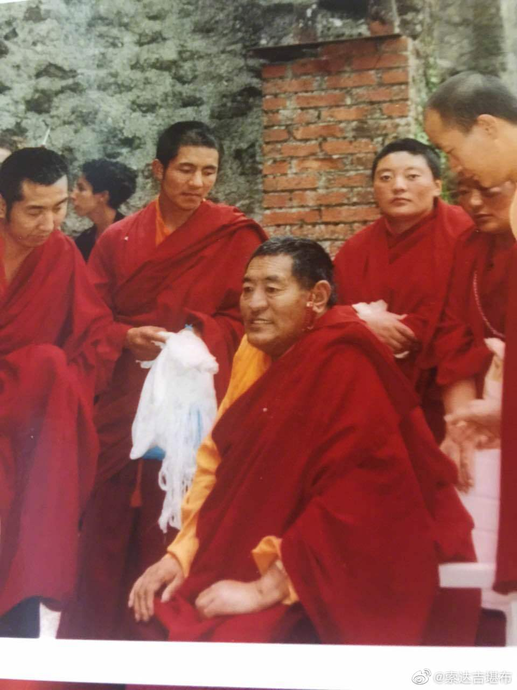
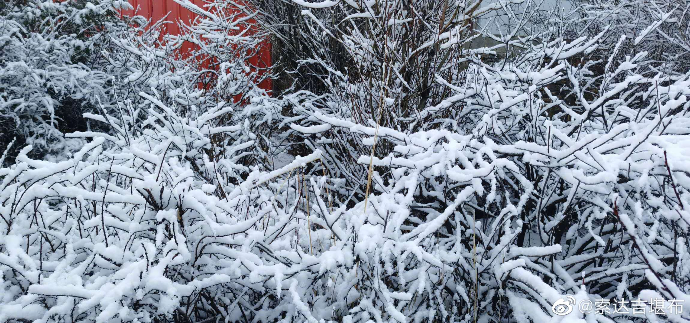
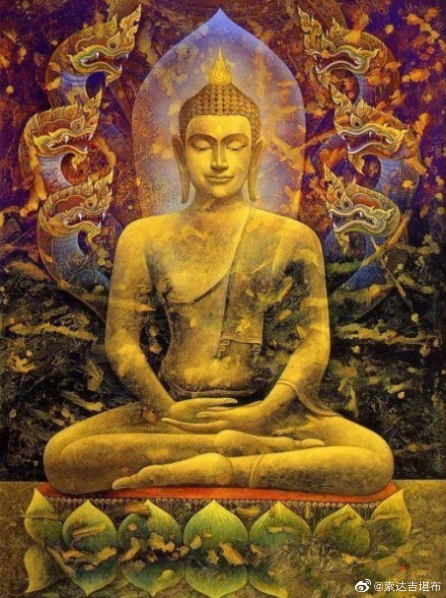
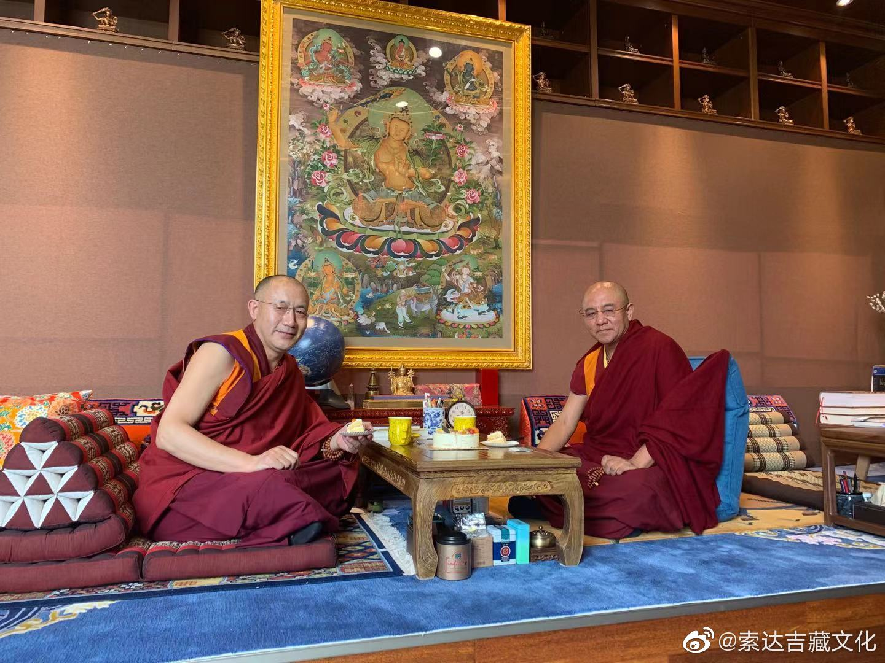

 ## 2020-01-01 05:20
祝大家元旦快乐，身心自在，六时吉祥！

 ## 2020-01-02 06:02
如人水所漂，惧溺而渴死，于法不修习，多闻亦如是。
如人设美膳，自饿而不食，于法不修习，多闻亦如是。
如人善方药，自疾不能救，于法不修习，多闻亦如是。
如人数他宝，自无半钱分，于法不修习，多闻亦如是。
如聋奏音乐，悦彼不自闻，于法不修习，多闻亦如是。
——《华严经》

 ## 2020-01-03 07:40
不管是什么样的人，都会有或多或少的自卑，有的比较明显，有的隐藏得很好。这种情绪会不断扰乱自己，使自己没有安全感。
如果你想从根本上解决它，方法非常简单：利用你自己的优势去帮助别人。
这样，你会充满成就感，也会渐渐自信起来。

 ## 2020-01-04 09:40
今年我给自己布置的作业是：
1、将《地藏菩萨本愿经》翻译成藏文；
2、将荣索班智达的《入大乘论》翻译成汉文；
3、继续校对已翻译好的《如意宝藏论》《杰珍大圆满》；
4、重新编辑并校对《喇荣课诵集》。
依靠这个多病的躯体，希望给后人多留一点宝贵“财富”。祈请上师三宝、护法空行予以加持，如果未来因缘具足，我很想给有缘者传授《地藏经》《入大乘论》等。

 ## 2020-01-06 14:24
如果我们经常做关于鬼魂或死人的噩梦，梦里有许多可怕的场景，根据《地藏经》，这是前世眷属亲友堕在恶趣，通过托梦，希望我们以福力救拔。若能在佛像面前读三遍或七遍《地藏经》，他们就会获得解脱，这样的噩梦也不会带来不吉祥。

 ## 2020-01-07 20:08
1月10日（藏历十一月十五），是法王晋美彭措圆寂16周年的纪念日。所以，从明天1月8日，直至1月14日，僧众将在7天之内进行共修。
续部说: “何人俱眡劫，修十万本尊，不如一剎那，忆念上师胜。”您如果有条件、有意乐，也可以参与念修《上师供》《上师瑜伽》、金刚萨埵仪轨及心咒、《普贤行愿品》等。特别是在法王圆寂日当天，更应该好好发愿，珍惜这难得的修行机会。

 ## 2020-01-07 22:09
བླ་མ་མཁྱེན།喇嘛钦~生生世世不离师  L索达吉堪布的微博视频

 ## 2020-01-08 07:25
依止您19年了，离开您16年了。
您在的时候，没扰乱过一次您的心；您不在了，没产生过一次邪见。
您在的时候，跟随您，尽心尽力承侍；您不在了，随学您，尽量传播正法。
此生无憾。
上师，很想念您！祈祷您的不断加持……

 ## 2020-01-09 09:02
1984年冬天，22岁的我，披上了梦寐以求的红黄僧衣。
当天，德巴堪布手里拿着这张法王的照片，阳光透过窗户照在上面。这是我第一次看到法王如意宝的法相，激动不已，泪流满面，从此改变了我的一生。

 ## 2020-01-10 06:30
88年前，上师的色身在这里降生。16年前，上师的色身融入了法界。然而，事实上，上师并没有真正离开。正如佛经所说，“正法无隐没，佛陀无涅槃”，当我们忆念上师时，他的加持无处不在。

 ## 2020-01-10 15:27
喇嘛钦Oཆོས་རྗེ་བླ་མའི་རྣམ་ཐར་བསྡུས་པ། བརྙན་སྐད་རི...

 ## 2020-01-11 11:36
如果是亲人离世，每过一年，思念会减轻一分。如果是上师离世，每过一年，思念会强烈一分。

 ## 2020-01-12 05:19
我第一次见到法王如意宝，是在1985年春天的一个下午。他坐在一把旧椅子上，慈爱地摸着我的头，念了一遍莲师七句祈祷文和莲师心咒、文殊心咒对我加持，并告诉我：“好好闻思，别乱跑。”我永远不会忘记这一幕。
我最后见到法王如意宝，是在2003年的冬天。上师因病要去医院，我问：“要不要像以前一样陪您一起去？”上师说：“这次就不用了吧。”然后慈爱地摸了摸我的头，为我加持。第二天，天空飘着清雪，上师在离开时，拉下车窗向我挥手。从那以后，我再也没有见过上师。

 ## 2020-01-13 05:35
这是喇荣第一条水泥路，从法王的闭关房通往甘多拉经堂。每天下午，法王讲完课，都会沿着这条小路回去。有时候小狗还会在前面带路。
那段时光，是我闻思修行最精进的时光，也是人生中最有意义的时光。

 ## 2020-01-13 23:37
有一次跟法王朝圣时，法王在中途有点累了，说：“休息一下，再继续赶路。”如今想起这一幕，让人回味无穷。

 ## 2020-01-16 22:24
心不调伏，身在何处都是地狱；心调伏了，身在何处都是天堂。

 ## 2020-01-17 11:37
要生孩子的人，应提前看看这段窍诀，并如是去做。这样则母子平安，也不会得“产后抑郁症”——

《地藏经》云：“是阎浮提人初生之时，不问男女，或欲生时，但作善事，增益舍宅，自令土地无量欢喜，拥护子母，得大安乐，利益眷属。或已生下，慎勿杀害，取诸鲜味供给产母，及广聚眷属，饮酒食肉，歌乐弦管，能令子母不得安乐。何以故？是产难时，有无数恶鬼，及魍魉精魅，欲食腥血。是我早令舍宅土地灵祇，荷护子母，使令安乐，而得利益。如是之人，见安乐故，便合设福，答诸土地；翻为杀害，聚集眷属，以是之故，犯殃自受，子母俱损。”

 ## 2020-01-18 06:56
“我给你说，密法好珍贵哦！”

 ## 2020-01-19 07:15
一个人在临终之时，对他最有利的是什么？

《地藏经》云：“世尊，如是阎浮提男子、女人，临命终时，神识昏昧，不辨善恶，乃至眼耳更无见闻。是诸眷属，当须设大供养，转读尊经，念佛菩萨名号。如是善缘，能令亡者离诸恶道，诸魔鬼神悉皆退散。世尊，一切众生临命终时，若得闻一佛名、一菩萨名，或大乘经典一句一偈，我观如是辈人，除五无间杀害之罪，小小恶业，合堕恶趣者，寻即解脱。”

 ## 2020-01-19 19:08
今天我去朝拜了一座寺庙，30年前我随上师去过那里，有很多上师的气息。
如今，虽然上师不在身边，但上师的法一直在我心里，生生世世……

 ## 2020-01-20 21:41
快过年了，最好不要杀生~

 ## 2020-01-23 07:29
听到地藏菩萨的名号，见到地藏菩萨的塑像、画像，将会得到什么利益呢？
大家可以看看《地藏经》，或是这个动画片O地藏菩萨见闻利益品-Aputi.com佛典动画-超清

 ## 2020-01-24 07:42
今天是大年三十了，真心祈祷三宝：祝你新春吉祥，身体安康，疾横不临，善念增上，解脱自在~

 ## 2020-01-24 18:10
吃年夜饭咯

 ## 2020-01-25 06:00
一年之初，一切吉祥
O网页链接

 ## 2020-01-30 15:24
嗡玛尼贝美吽舍……
 > @索达吉藏文化
 > བདག་གིས་དེ་རིང་ནས་བཟུང་ཉིན་བཅུ་ཚུན་ཆོད་ལ་བོའུ་ཧན་གྲོང་ཁྱེར་གཙོས་མི་ཤི་གསོན་རྣམས་ལ་མ་ཎི་འབུམ་ཐེར་ཞིག་འདོན་རྒྱུ་ཡིན།རྣམ་པ་ཚོས་ཀྱང་དེ་ལྟར་འདོན་རྒྱུ་མ་འཆུག—ཨོཾ་མ་ཎི་པདྨེ་ཧཱུཾ་ཧྲཱིཿ
我想从今天开始，10天内为以武汉为主的众生，念十万遍观音心咒“嗡玛尼贝美吽舍”。如果你想，也可以一起。

 ## 2020-01-31 15:22
🙏
 > @索达吉藏文化
 > ད་རུང་ཡར་འགྲོ་མར་འགྲོ་མི་བྱེད་པར་མཚམས་ལ་བསྡད་ན་དགའ་ས་རེད།མི་སུ་ལའང་མི་འཕྲད་པར་གཟབ་ན་དགའ་ས་རེད།
现在还不能到处乱跑，最好是“闭关”，跟谁都不接触，格外谨慎为好。O紧急扩散！这235个车次、航班发现患者，急寻...

 ## 2020-02-04 10:03
《心经》
观自在菩萨，行深般若波罗蜜多时，照见五蕴皆空，度一切苦厄。
舍利子，色不异空，空不异色，色即是空，空即是色，受想行识亦复如是。
舍利子，是诸法空相，不生不灭，不垢不净，不增不减。是故空中无色，无受想行识，无眼耳鼻舌身意，无色声香味触法，无眼界乃至无意识界，无无明亦无无明尽，乃至无老死，亦无老死尽，无苦集灭道，无智亦无得，以无所得故。
菩提萨埵。依般若波罗蜜多故，心无挂碍，无挂碍故，无有恐怖，远离颠倒梦想，究竟涅槃。
三世诸佛，依般若波罗蜜多故，得阿耨多罗三藐三菩提。
故知般若波罗蜜多，是大神咒，是大明咒，是无上咒，是无等等咒，能除一切苦，真实不虚。
故说般若波罗蜜多咒，即说咒曰：揭谛揭谛　波罗揭谛　波罗僧揭谛　菩提萨婆诃。

 ## 2020-02-06 15:14
喇嘛钦。嗡玛尼贝美吽……

 ## 2020-02-10 19:47
O除疫莲师观修法

 ## 2020-02-13 07:42
上师，您的色身是一时的，智慧身是永恒的。不间断在利益众生。想念您~

 ## 2020-02-17 17:53
快乐，表面上让人喜欢，但依此或许会沉迷堕落；痛苦，表面上让人害怕，但依此或许可感悟人生。

 ## 2020-02-22 11:40
今天是藏历12月29日。按照传统，若能在黄昏念9遍《心经》进行回遮，可以遣除下一年以死亡为主的不吉祥。

附：

《心经回遮》

无可言思般若度  不生不灭虚空体
各别自证智行境  三世佛母我敬礼

心经
观自在菩萨。行深般若波罗蜜多时。照见五蕴皆空。度一切苦厄。舍利子。色不异空。空不异色。色即是空。空即是色。受想行识亦复如是。舍利子。是诸法空相。不生不灭。不垢不净。不增不减。是故空中无色。无受想行识。无眼耳鼻舌身意。无色声香味触法。无眼界。乃至无意识界。无无明。亦无无明尽。乃至无老死。亦无老死尽。无苦集灭道。无智亦无得。以无所得故。菩提萨埵。依般若波罗蜜多故。心无挂碍。无挂碍故。无有恐怖。远离颠倒梦想。究竟涅槃。三世诸佛。依般若波罗蜜多故。得阿耨多罗三藐三菩提。故知般若波罗蜜多。是大神咒。是大明咒。是无上咒。是无等等咒。能除一切苦。真实不虚。故说般若波罗蜜多咒。即说咒曰。揭谛揭谛。波罗揭谛。波罗僧揭谛。菩提萨婆诃。

南无敬礼师，敬礼佛，敬礼法，敬礼僧，敬礼大佛母般若波罗蜜多。我之一切真实语，当愿成就。如昔时天王帝释思维大佛母甚深般若波罗蜜多义，依止念诵而遣除魔王波旬等一切违缘，如是我亦思维大佛母甚深般若波罗蜜多义，依止念诵，魔王波旬等一切违缘，愿皆遣除，愿成无有，愿成寂灭，愿极寂灭。

不生亦不灭  不常亦不断
不来亦不去  不一亦不异
能说是因缘  善灭诸戏论

 ## 2020-02-24 05:19
这个月是“神变月”（2.24-3.24），每一天都是吉祥日，行持任何善法，功德均会成千上万倍增长。希望大家在这样的日子里，尽量不要散乱，并发愿尽可能做些帮助别人的事。

 ## 2020-02-25 11:56
有时候跟众生广泛交流、利益群生，有时候独自静修、内观自心，这两者都是大乘佛教的殊胜行为。不要空耗难得的暇满人身，要精进！

 ## 2020-02-26 14:06
今天是您的生日，我的上师。
您曾来到这个人世间，降下了无比的智悲甘霖，又悄无声息地离开。
昔日师徒间的欢愉如此短暂，好似美梦一场。未来和您相见只能在梦中，重温陪伴在您身边的那种美好。
祈祷您加持我们这些还在轮回中的众生~

 ## 2020-02-29 18:14
散乱堕迷惘，静修见真谛。

 ## 2020-03-05 21:28
痛苦的时候，因为痛苦而不修行；快乐的时候，因为快乐而不修行；不苦不乐的时候，因为忙碌而不修行。那么，什么时候才会修行呢？

 ## 2020-03-08 11:54
女性历来是一个非常伟大的群体，在家庭和工作中付出的，往往比男性多。尤其是在这次疫情中，大多数医护人员是女性，她们的利他精神、爱的力量，深深让人动容。
在这里，我祝福天下所有女性节日快乐，像度母一样美丽，像观音一样慈悲。

 ## 2020-03-13 13:25
终生学习
终生修行
终生利他

 ## 2020-03-15 20:53
为了我们，也为了它们，让我们珍爱每一个生命，让这世界变成野生动物的天堂。

 ## 2020-03-17 11:35
好的也会变坏，坏的也会变好，这才是无常的真谛。

 ## 2020-03-17 23:50
由于疫情的原因，喇荣今年秋季的闭关计划，提前到现在。从今天到阳历的四月下旬，请有缘者在各自的所在地，继续念修阿弥陀佛名号，并闻思佛法。
我也在尽最大的努力精进念佛，希望早日完成发过的誓愿。

 ## 2020-03-20 05:20
今生获得这么难得的人身，遇到这么难得的大乘佛法和善知识，如果不精进修行就太可惜了！所以这辈子一定要好好修行，争取获得解脱。否则，茫茫轮回苦海中，以后基本不可能再有这样的机会了！！！

 ## 2020-03-21 07:48
上等修行人，寂静处、红尘中，无一不是道场。
中等修行人，只有寂静处才是道场。
下等修行人，哪里都不是道场。

 ## 2020-03-21 23:06
作为佛弟子，应当学习一下《赞僧功德经》。我也准备将此翻译成藏文。O网页链接

 ## 2020-03-22 11:47
当全球人类都在“闭门思过”时，地球可以歇息一会儿。天也蓝了，水也清了，鸟也多了……

 ## 2020-03-25 12:03
没完没了的琐事，纵然免不了，但持之以恒的修行，依然不能忘。

 ## 2020-03-26 15:45
第二世敦珠法王在向大家传授禅修方法时，以直视鼻尖、舌抵上腭等毗卢七法坐式，身体自然放松，心不执一切，自然安住。安住一段时间后再出定。
他说：“这样的禅修叫做入定。在出定后，不离这种境界而行住坐卧、念经等，叫做后得。如果后得时能不离入定的境界，这种禅修将得以稳固。”
“入定禅修时，心自然放松，不为执着所动摇，就像湖水没有被风搅动一样……”  L索达吉堪布的微博视频

 ## 2020-03-27 11:49
修行不好也没关系，毕竟我们普通人难免会受到外境影响。但是无论如何，都不要把修行彻底放下，即使是一点一滴积累，也可以。

 ## 2020-03-29 21:22
“你”和“你所拥有的”其实是两个概念。你所拥有的钱财不是“你”，你所拥有的名声不是“你”，你所拥有的权力不是“你”，你所拥有的美貌不是“你”……但许多人常会混淆二者的界限，结果弄丢了自己，迷失了人生。

 ## 2020-03-30 17:02
随着节气的不同，天气冷热有变化，但广大无边的虚空没有变化；
随着因缘的不同，情绪苦乐有变化，但明空无二的心性没有变化。

 ## 2020-03-31 22:24
壮年不久停，盛色病所侵，命为死所吞，无有法常者。
——《大般涅槃经》

 ## 2020-04-04 00:06
嗡玛尼贝美吽舍
 > @索达吉藏文化
 > དེ་རིང་ནི་ཤི་བོ་རྣམས་ལ་བསྔོ་སྨོན་བྱེད་པའི་དུས་ཆེན་ཞིག་ཡིན། ད་ཐེངས་ནད་ཡམས་འདིས་འཛམ་བུ་གླིང་གི་མི་གྲངས་ཁྲི་ཕྲག་ལྔ་ལྷག་གི་ཚེ་སྲོག་འཕྲོག་ཟིན་པ་དང་ད་དུང་ཡང་མང་པོ་ཞིག་འཆི་བཞིན་ཡོད། དེ་དག་གཙོར་བྱས་པའི་ཤི་བོ་རྣམས་ལ་མ་མཐའ་ཡང་མ་ཎི་ཁྲི་རེ་གསུང་རོགས་ཞུ། ངས་ཀྱང་འདོན་རྒྱུ་ཡིན། ཨོཾ་མ་ཎི་པདྨེ་ཧཱུཾ་ཧྲཱིཿ
今天是清明节。这次疫情已经在全世界夺去了5万多人的生命，还有许多人濒临死亡。
希望大家能为以他们为主的亡人，念至少一万遍观音心咒。我也如是发愿。
嗡玛尼贝美吽舍……

 ## 2020-04-09 21:16
世亲论师所造的《往生论》，被净土宗归入“五经一论”，希望有缘者好好学习。我也正在将其翻译成藏文。
附：
《往生论》（原文） O网页链接

 ## 2020-04-10 06:36
如果我们把自律当成习惯，按时吃饭、按时睡觉、按时做事、按时学习、按时修行，就能减少烦恼，健康长寿，身心喜乐。

 ## 2020-04-10 16:10
由于疫情尚未结束，上半年应该不开课，望各自在家学修~

 ## 2020-04-11 13:42

 > @索达吉藏文化
 > དེ་རིང་རྒྱབ་ཉི་མས་དྲོས། ཁ་ཇ་ཡིས་དྲོས། སེམས་ཆོས་ཀྱིས་དྲོས། ཅུང་རེ་སྐྱིད་པོ་འདུག་ཨ།
背后是暖暖的阳光，口中是暖暖的茶水，心里是暖暖的佛法。此时此刻，有点惬意啊~

 ## 2020-04-13 09:48
看似“有”，实则“无”；看似“无”，实则“有”。这是难以置信的真相。

 ## 2020-04-15 22:50
诸法因缘生，诸法因缘灭，吾师大沙门，常作如是说。

 ## 2020-04-22 10:21
我们的心性犹如虚空，偶尔会被苦乐的浮云遮挡，但并不会有损它一丝一毫。

 ## 2020-04-23 10:17
生活中，我们身边有许多不开心的事，其实每个人都会有。此时不要丧，不要觉得好多事情过不去。只要以强大、开朗的心态面对，相信一切都会过去的。

 ## 2020-04-25 10:37
如果每天念1万遍金刚萨埵心咒，“嗡班杂萨埵吽”，不到两个月，就能完成40万遍。我决定了，从明天开始念~

 ## 2020-04-28 06:56
理论的通达很重要，更重要的是实地修行。若能深入修持正法，逐渐就会照见万法真相。那时，世间再巨大的苦痛，对你也是小菜一碟。

 ## 2020-04-30 09:47
O菩萨戒略轨——法王如意宝晋美彭措传授

 ## 2020-05-01 13:23
有一句俗话：“When life gives you lemons, make lemonade.（假如生活给了你一颗柠檬，那就榨杯柠檬汁吧）”所以，当我们生活不如意时，直接接受痛苦是很难的，但如果把痛苦以榨汁的方式进行剖析，再兑些修行的法水、窍诀的蜂蜜，就能把它转化成一杯美味。

 ## 2020-05-01 21:37
若能念大威德心咒一万遍以上，极为殊胜🙏

 ## 2020-05-04 16:52
这是很古老的藏文版《妙法莲华经》，其加持不可思议，愿见闻忆触此经的众生皆得解脱~

 ## 2020-05-05 18:44
我今天的涂鸦，你看得懂吗？

 ## 2020-05-06 08:52
དཀོན་བརྩེགས་ལས།ཆོས་རྣམས་ཐམས་ཅད་རྨི་ལམ་སྒྱུ་མ་འདྲ།།ངོ་བོ་ཉིད་ཀྱིས་སྟོང་ཞིང་བདག་མེད་ལ།།བྱིས་པས་ཡོད་དམ་མེད་ཅེས་སོ་སོར་རྟོག།།ཅེས་གསུངས།
《宝积经》：
一切诸法如梦幻，体性空性无有我，凡愚分别谓有无。

 ## 2020-05-07 08:23
当佛教徒遇到一些重要的事情时，不要到处打卦算命、占卜吉凶，应该秉持佛法的根本教义“诸恶莫作，诸善奉行，自净其意"。这一点特别重要，每个人务必要清楚！

 ## 2020-05-10 08:19
今天是母亲节。在许多国家的语言中，“妈妈”的发音完全一样，它是最原始的呼唤，是所有生命的来源。在大乘佛教中，了知母恩、忆念母恩，也是最重要的修行。如果您的母亲还健在，请平时多嘘寒问暖，有空就陪陪她。如果她已不在了，请多念观音心咒回向她，愿她离苦得乐、自在解脱。

 ## 2020-05-11 06:47
早上发现，院子里长满了银树。在藏地，真是“夏有白雪冬有雪，春夏秋冬皆有雪” ❄️❄️❄️

 ## 2020-05-14 20:17
独自望夕阳，沉思见光明。

 ## 2020-05-14 21:03
星斗坠山寺，非幻亦非真。

 ## 2020-05-15 07:40
བླ་མ་མཁྱེན།喇嘛钦🙏O不灭的明灯——纪念大恩上师德巴堪布圆寂五周年

 ## 2020-05-16 20:43
一个佛教团体经常说是道非，说明它的闻思修行气氛很弱。一个佛教徒整天看别人的过失，说明他的内在修行很差。
就像一个戴灰色太阳镜的人，看到的一切都是灰色。如果眼镜戴了很长时间，他会抱怨世界太灰暗，却忘了这是他自己的问题。

 ## 2020-05-17 09:10
当你童年天真无邪时，看什么都是“真”的。
当你刚步入社会上当受骗时，看什么都是“假”的。
当你有一定的生活阅历时，知道“真”“假”可以共存。
当你看尽了人间荣辱得失时，就会不计较孰“真”孰“假”。

 ## 2020-05-20 10:58
如果能像爱自己一样爱别人，甚至是所有生命，这才是真正的爱，也是大乘的菩提心。所以，在这充满爱意的520，让我们也大声对所有众生说一句，“我爱你”。

 ## 2020-05-21 08:08
风雨里，要像个大人；天晴时，要像个孩子。
——莎士比亚《仲夏夜之梦》

 ## 2020-05-22 19:42
一生都是修来的，求什么？

今日不知明日事，愁什么？

不礼爹娘礼世尊，敬什么？

兄弟姐妹皆同气，气什么？

儿孙自有儿孙福，忧什么？

岂可人无得运时，急什么？

人世难逢开口笑，苦什么？

补破遮寒暖即休，摆什么？

食过三寸成何物，谗什么？

死后一文带不去，悭什么？

前人田地后人收，占什么？

得便宜处失便宜，贪什么？

举头三尺有神明，欺什么？

荣华富贵眼前花，傲什么？

他家富贵前生定，妒什么？

前世不修今受苦，怨什么？

赌博之人无下梢，耍什么？

治家勤俭胜求人，奢什么？

冤冤相报几时休，结什么？

世事如同棋一局，算什么？

聪明反被聪明误，巧什么？

虚言折尽平生福，谎什么？

是非到底见分明，辩什么？

谁能保得长无事，诮什么？

穴在人心不在山，谋什么？

欺人是祸饶人福，卜什么？

寿自护生爱物增，杀什么？

一旦无常万事休，忙什么？

——济公和尚《圣训歌》

 ## 2020-05-23 19:32
天降甘霖，打开窗户，倾听雨声，悠然自得~  L索达吉堪布的微博视频

 ## 2020-05-24 22:20
愿我们生生世世也同发此愿🙏🙏🙏
 > @索达吉藏文化
 > ལྷ་མོ་དཔལ་ཕྲེང་གི་སེང་གེ་སྒྲའི་མདོ་ལས།    ལྷ་མོ་དཔལ་ཕྲེང་གིས་བཅོམ་ལྡན་འདས་ཀྱིས་སྤྱན་སྔར་སྨོན་ལམ་ཆེན་པོ་གསུམ་བཏབ་བོ། །གསུམ་གང་ཞེ་ན། བཅོམ་ལྡན་འདས། བདག་གིས་བདེན་པའི་བྱིན་གྱི་རླབས་འདིས་སེམས་ཅན་དཔག་ཏུ་མཆིས་པ་དག་ལ་སྨན་བཏགས་པ་གང་ལགས་པའི་བསོད་ནམས་བསགས་པའི་དགེ་བའི་རྩ་བ་དེས། བཅོམ་ལྡན་འདས། བདག་ཚེ་རབས་ཐམས་ཅད་དུ་དམ་པའི་ཆོས་རྟོགས་པ་ཐོབ་པར་གྱུར་ཅིག །བཅོམ་ལྡན་འདས། འདི་ནི་བདག་གི་སྨོན་ལམ་ཆེན་པོ་དང་པོ་ལགས་སོ། །བཅོམ་ལྡན་འདས། བདག་གིས་དམ་པའི་ཆོས་རྟོགས་པ་དེ་ཐོབ་ནས་ཀྱང་ངལ་བ་དང་ཡོངས་སུ་སྐྱོ་བ་མ་མཆིས་པར་སེམས་ཅན་རྣམས་ལ་ཆོས་སྟོན་པར་གྱུར་ཅིག །བཅོམ་ལྡན་འདས། དེ་ནི་བདག་གི་སྨོན་ལམ་ཆེན་པོ་གཉིས་པ་ལགས་སོ། །བཅོམ་ལྡན་འདས། བདག་གིས་དམ་པའི་ཆོས་བསྟན་པ་དེ་ཡང་ལུས་དང་སྲོག་ལ་མི་ལྟ་བར་དམ་པའི་ཆོས་བསྲུང་བ་དང༌། དམ་པའི་ཆོས་ཡོངས་སུ་གཟུང་བར་འཚལ་ལོ། །བཅོམ་ལྡན་འདས། འདི་ནི་བདག་གི་སྨོན་ལམ་ཆེན་པོ་གསུམ་པ་ལགས་སོ།།ཞེས་གསུངས།
《宝积经·胜鬘夫人会》（菩提流志翻译）：
尔时胜鬘夫人，复于佛前发三弘愿，以兹愿力，利益无边诸有情类。
第一愿者，以我善根，于一切生得正法智。
第二愿者，若我所生得正智已，为诸众生演说无倦。
第三愿者，我为摄受护持正法，于所生身不惜躯命。

 ## 2020-05-26 07:28
一帆风顺时，不一定是好事，“福兮，祸之所倚”；
一蹶不振时，不一定是坏事，“祸兮，福之所伏”。
这世上，没有绝对的好，也没有绝对的坏，因为万法皆为无常。

 ## 2020-05-29 06:35
今年的5月23日-6月21日，是藏历的“萨迦月”，在此期间若能忏悔、吃素、念咒、绕塔、禅修等，身语意行持任何善法，都有无量功德。每个人应根据自己的情况，尽量不浪费时间精进修行，并将善根回向一切众生，祈愿世界和平、众生安乐。
嗡班杂萨埵吽……

 ## 2020-06-01 00:06
儿童节快乐！祝愿每个孩子拥有一个充满爱心、懂得感恩的童年。

 ## 2020-06-05 07:32
ཨོཾ་མ་ཎི་པདྨེ་ཧཱུྃཿ嗡玛尼巴美吽O“这是我的孝顺方式”——索达吉堪布母亲离世四周...

 ## 2020-06-09 09:09
很惭愧~发愿念的金刚萨埵心咒还没念完，ཨོཾ་བཛྲ་ས་ཏྭ་ཧཱུཾ།嗡班杂萨埵吽

 ## 2020-06-11 06:54
《苦乐道用》：当我们遭到有情与非有情的损恼时，如果心里习惯性存着唯一都是痛苦的想法，那么即使一个微乎其微的对境外缘，也会给我们心理上带来巨大刺痛。
串习苦乐的任何想法，它就会越来越增长，这是一种自然规律。

Whenever we are harmed by sentient beings or anything else, if we make a habit out of perceiving only the suffering, then even the most insignificant matter will cause enormous anguish in our mind. This is the nature of any perception or idea; be it happiness or sorrow, is to grow stronger and stronger the more we become accustomed to it.

 ## 2020-06-16 06:59
钟鼎山林都是梦，人间宠辱休惊，只消闲处遇平生。
——辛弃疾

 ## 2020-06-21 14:06
今天14：33 -16：59有日环食，是精进修行的好时机。

 ## 2020-06-25 11:51
端午节快乐，来吃饭啦

 ## 2020-07-02 08:39
夏天的草原，人间的乐土，蜜蜂的欢笑，蝴蝶的舞场，你可以闻到花香吗？

 ## 2020-07-05 21:50
有些人认为学习佛法三五年就够了。事实上，他充其量只触及了佛法的皮毛。
如果是世俗的知识，要连续九年才能达到初中毕业的基础水平，那么诠释深广实相的佛法智慧，更不可能短短几年就完全掌握。
假如你真的想品尝佛法美味，方法只有一个——活到老，学到老。

 ## 2020-07-10 07:46
当时的自己，跟上师一起喝饮料、看大海，是多么幸福。
现在，唯一只能靠照片来缅怀。在护持上师传承教法的过程中，一次又一次感受上师的气息。

 ## 2020-07-15 13:34
🙏🙏🙏
 > @索达吉藏文化
 > མཁན་རིན་པོ་ཆེའི་འཁྲུངས་སྐར་ལ་བཀྲ་ཤིས་བདེ་ལེགས་དང་སྐུ་ཚེ་བརྟན་ཅིང་མཛད་ཕྲིན་རྒྱས་པའི་སྨོན་འདུན་ཡང་ཡང་ཞུ།
祝慈诚罗珠堪布仁波切生日快乐、长久住世、弘法利生事业广大！

 ## 2020-07-22 15:41
数劫中祈祷文殊菩萨、普贤菩萨、弥勒菩萨、观音菩萨等，不如短短片刻祈祷地藏菩萨一次利益大，这在《地藏赞》中有宣说。说者不是别人，就是大悲释迦佛。
大的方面，想获得最高成就佛果，要往生西方极乐世界；小的方面，为了吃的、喝的、穿的应有尽有，为了运气亨通、心想事成，也没有比祈祷地藏菩萨更好的了。
祈祷地藏菩萨，今生能长寿无病、拥有财富、如愿以偿，对后世来讲，也是命终后能即刻同与自己结缘的一切众生往生极乐世界的不共近因。
——法王晋美彭措《不忘》

 ## 2020-07-24 17:48
今天这样受菩萨戒非常好~
 > @索达吉藏文化
 > དེ་རིང་འདི་བཞིན་བྱང་སྡོམ་བླངས་ན་བཟང་།
O菩萨戒略轨——法王如意宝晋美彭措传授

 ## 2020-07-31 23:52
今天，我爬了很长时间的山，走了14250步，专门去朝拜了法王如意宝在石头上留下的这个脚印。
这是法王1986年在古屋神山示现神变留下的，当时我也在场。如此难以想象的不可思议境界，给我留下了深刻印象。
现在，34年过去了，脚印还是这么清晰……

 ## 2020-08-12 12:40
30年前的今天，我和上师如意宝在印度的拉鲁巴赫公园（སྐྱེད་ཚལ་དམར་པོ，Lalbagh Garden），当地人称其为“红色花园”。
美好的回忆~~喇嘛钦！

 ## 2020-08-14 17:52
《诸法集要经》：
一切乐有尽，一切爱有离，一切命有终，未死当修学。

 ## 2020-08-18 16:58
《大乘悲分陀利经》：人天福报，譬如疾风，无有住时，如水中月。

 ## 2020-08-23 16:09
逆境往往让人坚强成功，顺境往往让人迷失堕落。

 ## 2020-08-23 20:11
“曲径通幽处，禅房花木深。”

 ## 2020-08-25 15:29
这是我儿时放牛的地方。漫山遍野，都是我光脚放牛的足迹~

 ## 2020-08-26 09:27
梦中的上师，心中的明月，不断赐予清凉的甘霖……

 ## 2020-09-02 13:25
佛欢喜日，节日快乐！来，晒晒太阳吧~

 ## 2020-09-10 08:25
人生中，无论是世间的老师，还是出世间的老师，对我们的恩德都非常大。
如果没有他们，我们看不清这个世界的缤纷。永远感恩他们的付出。
教师节快乐！

 ## 2020-09-11 07:37
早年，在法王新房子的门口。
这是当时的我们，一眨眼，快30年了~

 ## 2020-09-30 21:48
在轮回中，别太乐观，再好的荣华也抵不过无常变化；别太悲观，再差的境遇也抵不过恶趣痛苦。

 ## 2020-10-10 10:34
能给你带来深度快乐的东西，必定能给你带来深度痛苦。
得不到，心心念念；得到了，患得患失。
这就是佛陀所讲的，“有漏皆苦”。

 ## 2020-10-15 22:10
整天玩手机，不好好修行，也不好好学习，宝贵人身就这么浪费了。再这样下去，眼也坏了，心也乱了。我们可以每天白天关机两个小时吗？

 ## 2020-10-16 09:18
只要我们有信心，伟大上师们的爱和加持永远不会消失。它会一次又一次把我们从迷梦中唤醒，直至证悟菩提。

 ## 2020-10-18 09:42
几天前，喇荣佛学院一位默默无闻的堪布旺钦，非常安详地示现圆寂。
值得随喜的是，他是在传讲六部论典时离开人间的。我特意了解了一下他正在讲的法——
1、他给般若班、医学班讲了法王如意宝的《续释日藏论》，讲到“非以勤作而撰著，唯一入定之结果，极深三传密意精，无勤慧界如是现”这一颂时圆寂的。
2、他给下戒律班讲了益西加村的《誓言明然论释·净镜论》，讲到“一切三世诸佛以此誓言而出现”时圆寂的。
3、他给上中观班讲了荣索班智达的《窍诀见鬘论释》，讲到“因殊胜悉地等同于无上菩提，故未另外宣说”时圆寂的。
4、他给上戒律班讲了卓玛桑竹多杰的《续部纲要·宝焰幕》，讲到“以诸多教证明示：此乃教量说”时圆寂的。
（以上是他给喇嘛传讲的法。下面是给觉姆传讲的法。）
5、他给因明班讲了格孜班智达的《生起次第双运穗》，讲到“五智慧镜住于灿然五光之中”时圆寂的。
6、他给戒律班也讲了卓玛桑竹多杰的《续部纲要·宝焰幕》，讲到“顿时解脱道在第六品、第九品、第十一品、第十二品、第十九品里有明说”时圆寂的。
这些密法还没讲完，他就离开了。看起来非常遗憾，实际上真的很了不起。在这个时代，同一时间传讲这么多密法是极其罕见的。🙏🙏🙏

 ## 2020-10-19 06:06
今年的天降月，是从公历10月17日-11月15日。
每一年，我们都会在此期间修净土法门，发愿往生极乐世界。
每个人最好能念诵阿弥陀佛心咒 “嗡 阿弥得瓦 阿依斯德吽舍” 30万遍。

 ## 2020-10-20 06:18
曾经日日期待拜见您，现今夜夜期待梦见你，时时刻刻加持我，生生世世利众生！ L索达吉堪布的微博视频

 ## 2020-10-24 06:48
冬天的天气越来越冷，修法的内心越来越暖。

 ## 2020-10-25 20:01
看到彩虹时，奋力去追逐它，结果了不可得；感受痛苦时，用智慧去分析它，同样了不可得。
这就是佛教中所说的“显而无自性”。

 ## 2020-10-26 08:29
从明天开始，我准备闭关一周，观修净土法门。
在此天降月，若能闭关至少七天来修法，则非常殊胜。我们只有通过实修，才能品尝到妙法甘露的美味。

 ## 2020-10-26 17:40
本来闭关七天的口粮和资具都准备好了，但临时有一些事情又要延缓。计划没有变化快，闭关只能过几天再说。世间唯一不变的，就是无常，哈哈~

 ## 2020-10-27 07:19
轮回里的爱也好，恨也好，都是前世业力的重演。
我们所坚持的是非对错，不过是当局者迷。却没有察觉到，自己只是业力的玩具。

 ## 2020-10-30 08:02
许多人崇拜的成功人士，其标配是金钱、名声、权势、美貌。
但事实上，最成功的人，应该是利益他众者。哪怕只能利益一个人。

 ## 2020-11-01 06:17
古德说，若想健康、幸福、长寿，并且将来往生极乐世界，最好念三十万遍阿弥陀佛心咒“嗡 阿弥得瓦 阿依斯德吽舍” （ཨོཾ་ཨ་མི་དྷེ་ཝ་ཨ་ཡུ་སིདྡྷི་ཧཱུཾ་ཧྲཱིཿ）。

 ## 2020-11-02 18:44
好大声啊~你们是不是在念“嗡 阿弥得瓦 阿依斯德吽舍” ？  L索达吉堪布的微博视频

 ## 2020-11-16 10:34
许多人认为，人生的道路是单行线。但如果擦亮眼睛一看，原来它四通八达，只不过转弯时需要抉择路线。

 ## 2020-12-14 07:31
如果经常观修根本上师与本尊无二无别，并时时加以恭敬祈祷，以此缘起，可以开启自己的本俱智慧，修行不容易退失，并能自然而然利益众生。

 ## 2020-12-26 16:16
根本上师圆寂之后，如果在他的圆寂日进行祈祷，弟子会得到更多加被。
如今，上师如意宝已离开我们17个年头了，若想获得意传加持，大家应该多祈祷上师。

གནས་ཆེན་རི་བོ་རྩེ་ལྔའི་ཞིང་ཁམས་སུ།།
内钦热卧贼诶央堪色        自大圣境五台山
འཇམ་དཔལ་ཐུགས་ཀྱི་བྱིན་རླབས་ཡིད་ལ་སྨིན།།
将华特吉辛拉耶拉门        文殊加持入心者
འཇིགས་མེད་ཕུན་ཚོགས་ཞབས་ལ་གསོལ་བ་འདེབས།།
晋美彭措雅拉所瓦得        祈祷晋美彭措足
དགོངས་བརྒྱུད་རྟོགས་པ་འཕོ་བར་བྱིན་གྱིས་རློབས།།
恭杰多巴颇瓦辛吉洛        证悟意传求加持

 ## 2020-12-28 17:43
明天是法王如意宝的圆寂日。
如果在佛堂或其他地方，于法王的法像前陈设供品，自己一个人或是与有缘者一起，念诵《上师瑜伽》《上师供》《普贤行愿品》等，必定会得到传承上师不可思议的加持。
根据许多经续教证，修行人若想明心见性，唯一依赖于上师的加持。因此，希望大家珍惜这个难得的机会，精进修行。

 ## 2020-12-29 10:36
莫舍己道，勿扰他心。——法王晋美彭措

 ## 2020-12-29 13:09
我的至尊上师也曾经亲口说过：“众生怙主金刚持我的至尊上师的确是圆满正等觉大金刚持，为饶益众生化现为补特伽罗的形象而降临世间，这并非是我以虔诚的信心与恭敬心作赞叹的。如果你们能够修持、祈祷，那么在我的上师与你们之间除了我以外再没有其他传承隔断。我也是从最初幸遇金刚持上师之后，一直依教奉行以三欢喜依止上师，从来没有做过任何不称上师心意的事，甚至让上师斜视一眼的事也没有做过，可以说，传承的金线没有被破誓言的锈所污染，因此传承的加持与众不同。”
——华智仁波切

 ## 2020-12-31 15:59
上师的色身会示现无常，而他的智慧永不消失，会融入每个具有信心、清净心、虔敬心的有缘者的心中。

