 ## 2021-01-01 15:55
具德上师与具相弟子的关系，或许超过了父母与子女等世间亲密关系。
这一点，通过上师的直指，当你了悟万法实相时，自会明白其中的奥秘。

 ## 2021-01-02 15:43
作为法王如意宝的弟子，假使所有人都抛弃了你，也不必感到孤独、寂寞、伤心。因为法王赐予的正法一直在你身边，不离不弃。

 ## 2021-01-04 16:24
很多时候，我们的不自由，是由欲望引起的。
如果可以减少欲望，则无论是时间、物质、心灵哪方面，都可以重获自由。

 ## 2021-01-08 15:56
当你彻悟心性原本无来无去、无苦无乐时，会发现众生将一切执为实有是多么稀有、可笑！

 ## 2021-01-13 17:34
从前，华智仁波切的弟子若萨华给有一个心爱的银碗。后来，一个觊觎银碗的人想抢走它。华给生起了无法控制的愤怒，捡起一块大石头要与他拼命。此时，华智仁波切发现了，淡淡地提醒他：“安忍，安忍……”华给听后，止住了他的怒气，慢慢将那块大石头放下，并扔到了地上。
无论你是什么样的人，只要被严重的嗔心所控制，情绪就会完全失控，与疯狂的人无二无别，所做的事可能自己也无法想象。
因此，嗔恨在佛教中被称为“毒”，它可以侵骨蚀髓，让你变得面目全非。而要想治愈它，最好的妙药就是安忍。

 ## 2021-01-14 10:46
祝门措上师生日快乐，长久住世，广利有情🙏
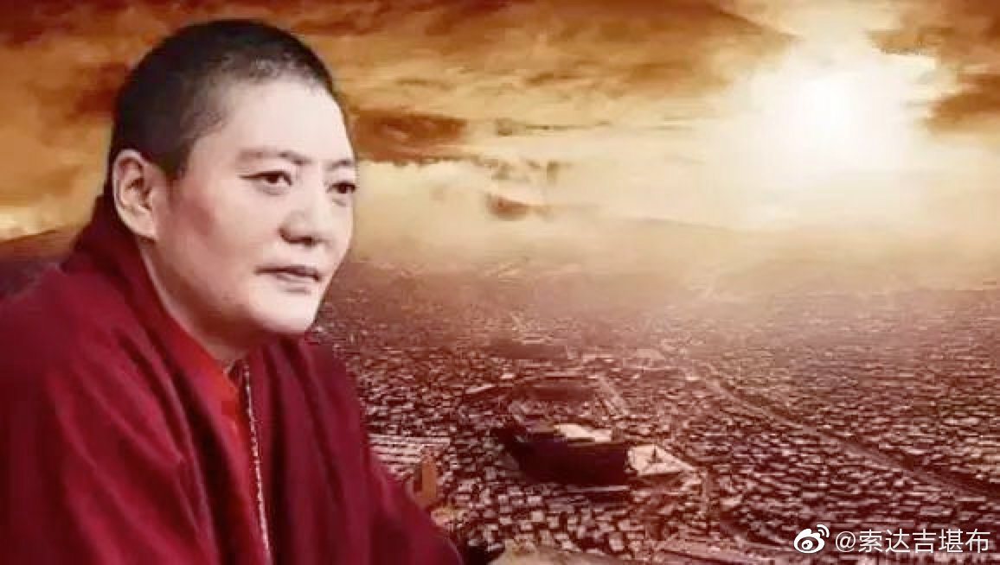
 ## 2021-01-22 16:25
轮回中的凡夫众生，所作所为都被业力所支配着，并不是通过自己努力就可以心想事成。尽管努力也会起到一定的作用，但这只是一小部分外缘，远远抵不过业力的巨大影响。

 ## 2021-01-28 07:39
🙏
 > @索达吉藏文化
 > མི་ཚེ་ཐུང་ཐུང་འདི་ལ། འདི་ལྟ་བུའི་བླ་མ་དང་ཆོས་བཟང་པོར་འཕྲད་དུས། བྱང་ཆུབ་ཀྱི་སེམས་དང་རྫོགས་ཆེན་གང་རུང་ལ་གདེང་ཅུང་ཙམ་རེ་མ་ཐོབ་ན་ཧ་ཅང་ཕངས་བས་འདི་ལ་ངེས་པར་དུ་ནན་ཏན་དགོས་འུ་འདུག
在短暂的人生中，遇到如此殊胜的上师和正法，此时，在菩提心和大圆满方面若没有得到一点有把握的境界，则是最大的遗憾。我们对此应该值得精进。

 ## 2021-01-30 17:01
我们每一个人，都有共同显现的业力、不共感受的业力。
前者造就了外在的世界，后者造就了内在的苦乐。
但这都是我们坚固习气的一种幻觉。

 ## 2021-02-02 17:20
我们每个人每天都有相同的时间。但是有些人争分夺秒，把时间用于自利利他；有些人得过且过，把时间变成各种散乱；有些人损人害己，利用时间去做尽坏事。
时间对每个人都是平等的，关键看你怎么利用。这就成了你的人生。

 ## 2021-02-05 16:01
乐观的人，可以在任何时间、任何地点、任何情况下找到理由，让自己过得很快乐；悲观的人，与此恰恰相反。
所以，外在环境对我们的影响，并没有想象中那么大。说到底，只有自己的心，才能决定自己的苦乐。

 ## 2021-02-07 08:33
一些人每天与散乱为伴——
生性喜欢散乱，随时制造散乱，时时沉迷散乱，一生以散乱度日，最终以散乱离世。
人生只有这么一点点，几乎被散乱占满了。怎么会有修行的时间呢？

 ## 2021-02-10 14:12
今天是藏历十二月二十九日。按照传统，若能在黄昏念9遍《心经》进行回遮，可以遣除下一年以死亡为主的各种不吉祥。

附：

《心经回遮仪轨》

无可言思般若度  不生不灭虚空体
各别自证智行境  三世佛母我敬礼

心经
观自在菩萨。行深般若波罗蜜多时。照见五蕴皆空。度一切苦厄。舍利子。色不异空。空不异色。色即是空。空即是色。受想行识亦复如是。舍利子。是诸法空相。不生不灭。不垢不净。不增不减。是故空中无色。无受想行识。无眼耳鼻舌身意。无色声香味触法。无眼界。乃至无意识界。无无明。亦无无明尽。乃至无老死。亦无老死尽。无苦集灭道。无智亦无得。以无所得故。菩提萨埵。依般若波罗蜜多故。心无挂碍。无挂碍故。无有恐怖。远离颠倒梦想。究竟涅槃。三世诸佛。依般若波罗蜜多故。得阿耨多罗三藐三菩提。故知般若波罗蜜多。是大神咒。是大明咒。是无上咒。是无等等咒。能除一切苦。真实不虚。故说般若波罗蜜多咒。即说咒曰。揭谛揭谛。波罗揭谛。波罗僧揭谛。菩提萨婆诃。

南无敬礼师，敬礼佛，敬礼法，敬礼僧，敬礼大佛母般若波罗蜜多。我之一切真实语，当愿成就。如昔时天王帝释思维大佛母甚深般若波罗蜜多义，依止念诵而遣除魔王波旬等一切违缘，如是我亦思维大佛母甚深般若波罗蜜多义，依止念诵，魔王波旬等一切违缘，愿皆遣除，愿成无有，愿成寂灭，愿极寂灭。

不生亦不灭  不常亦不断
不来亦不去  不一亦不异
能说是因缘  善灭诸戏论

 ## 2021-02-12 07:58
一个人过年，自己做的美味早餐。祝大家新年快乐！
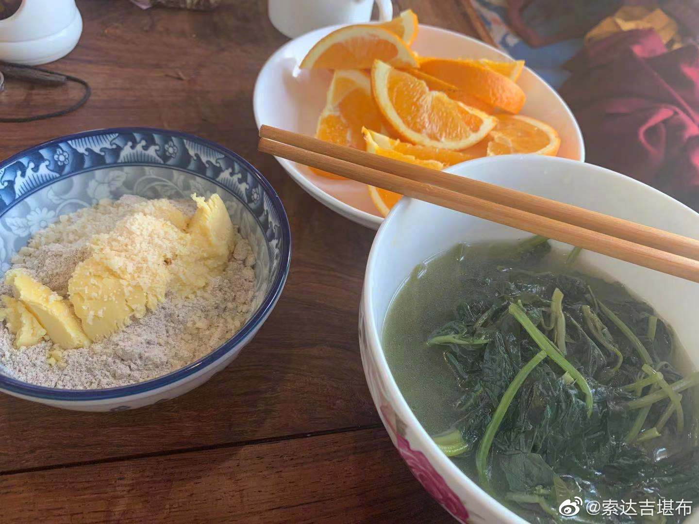
 ## 2021-02-15 13:48
怀业红光遍一切，一切幻化融自身~  L索达吉堪布的微博视频
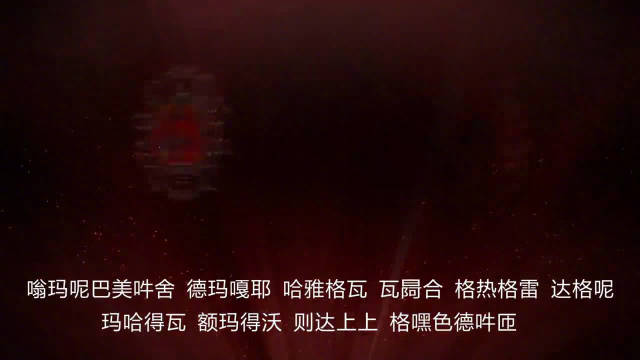
 ## 2021-02-17 07:35
一切得自在~  L索达吉堪布的微博视频

 ## 2021-02-19 12:08
做点家务，比如做饭、炒菜、扫地，可以念诵咒语、消除傲慢、锻炼身体。这是一种很好的动中禅。

 ## 2021-02-22 17:03
今天是莲师会供日。祈祷莲师非常重要！
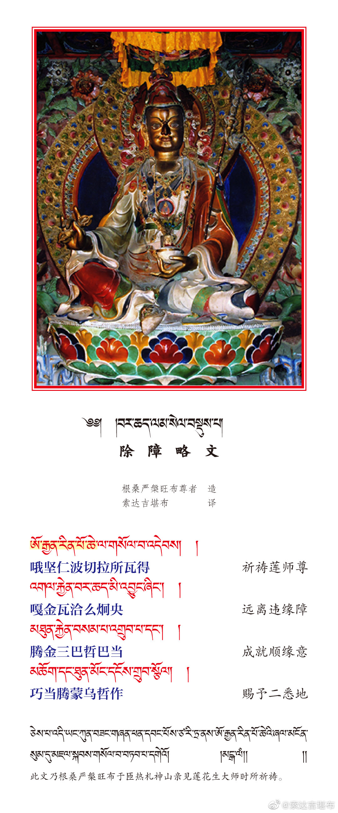
 ## 2021-02-24 10:51
谁具有菩提心，谁就会永远爱你。否则，一旦触及到自己的利益，那种“爱”就容易变质。

 ## 2021-02-25 07:26
如果一天念三遍，一定能开启你的智慧。
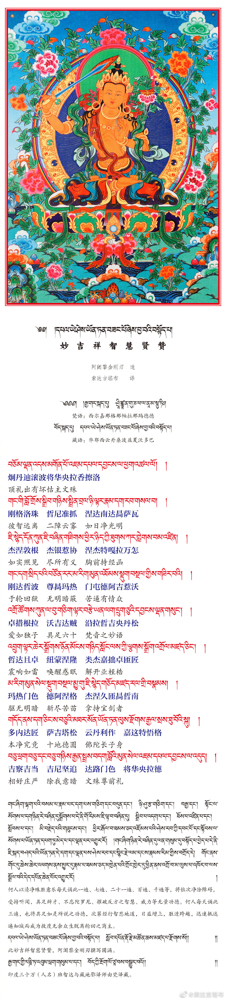
 ## 2021-03-07 06:51
修行，不是靠一位上师的加持就高枕无忧了，而是需要我们自己的勤奋学习。
如果你想全面了解道次第，应该主要修学《大圆满心性休息》；如果你想对本师释迦牟尼佛生起不退转的信心，那就要认真研读《释迦牟尼佛广传·白莲花论》。
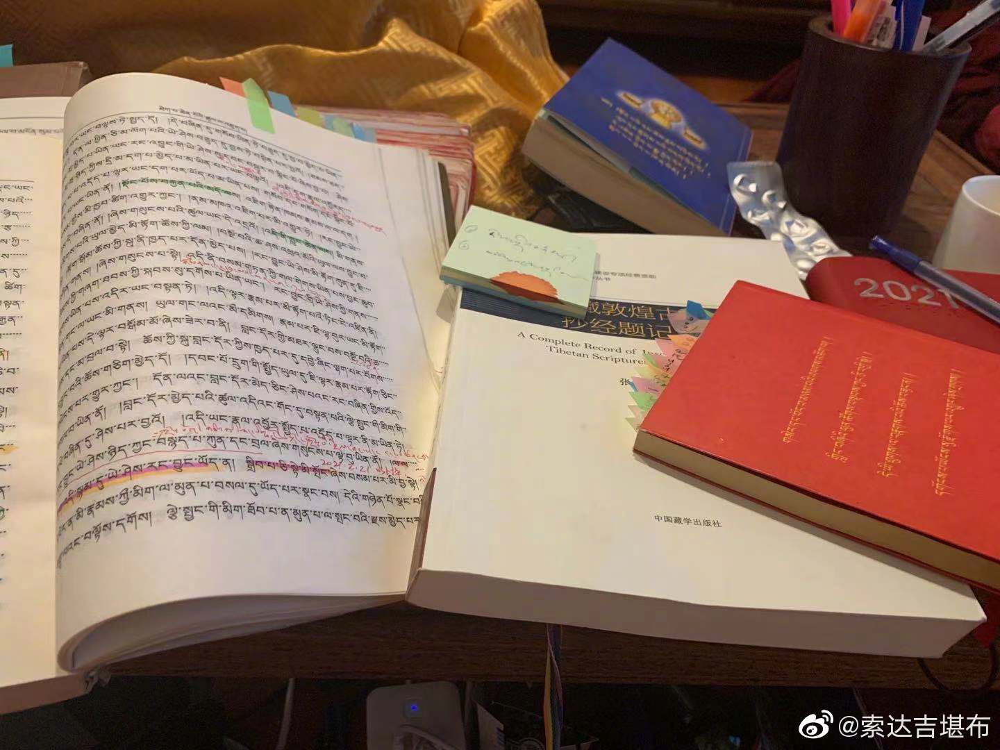
 ## 2021-03-09 07:58
如果一生中修完五加行、学完五部大论，再尽量修持大圆满，发愿往生极乐世界，那么死也无憾。
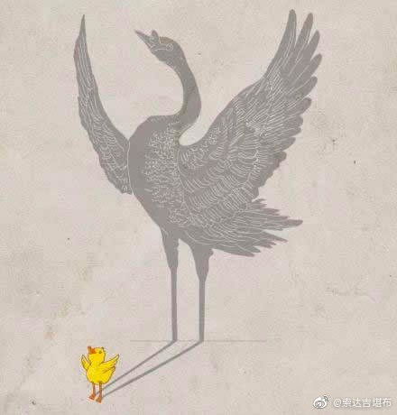
 ## 2021-03-09 19:02
我的寒假作业还没有做完
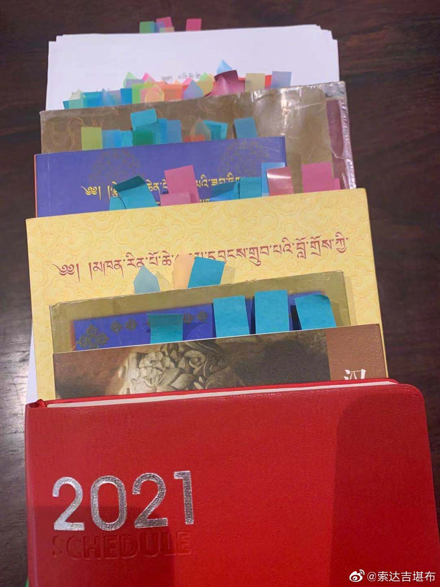
 ## 2021-03-16 22:15
🙏
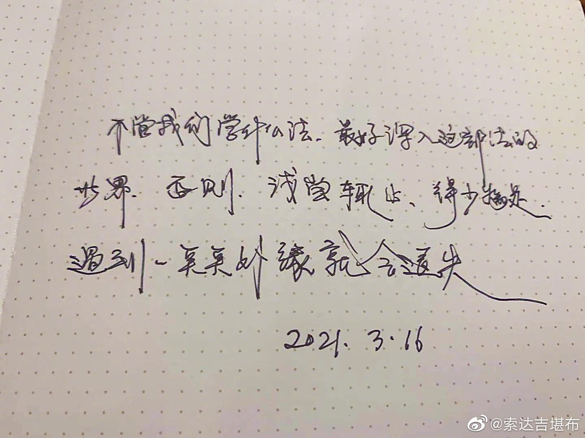
 ## 2021-03-19 09:45
有福报的人，无论接触什么样的人、修什么样的法、住什么样的地方，不仅适应性很强，还会依此增长善根。对于没有福报的人来说，情况正好相反。
所以，为了今生和来世的利乐，积累福慧资粮是很重要的。

 ## 2021-03-31 23:06
观音心咒“嗡玛尼贝美吽”的功德不可思议，我们应该经常念~  L索达吉堪布的微博视频

 ## 2021-04-02 06:25
如果喜爱参禅打坐，就不会整天东奔西跑；如果喜爱念经诵咒，就不会总说别人过失；如果喜爱明观心性，就不会被烦恼痛苦所左右。

 ## 2021-04-19 07:36
“贪婪者，永远不会满足；嗔恨者，跟谁也合不拢；愚痴者，做事难以成办；嫉妒者，心里不会快乐；傲慢者，看不到别人的功德；怀疑者，见不到事物的真相。”

 ## 2021-04-20 17:36
“毁掉我们的，不是我们所憎恨的东西，而恰恰是我们所热爱的东西。”
——《娱乐至死》
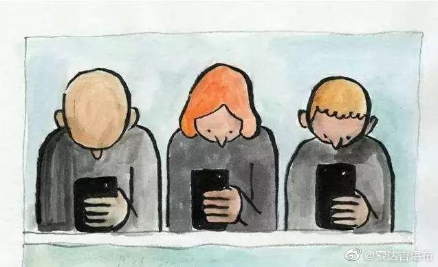
 ## 2021-04-27 22:35
贪心如萎莲，嗔心如蜜蜂，痴心如糠秕，心性如虚空，证悟如梦醒。

 ## 2021-05-09 07:16
世界上最美丽的，就是母亲的笑容；世界上最温暖的，就是母亲的怀抱。
在今天这样的日子里，更加想念母亲、感恩母亲。
感恩世上每一位伟大的母亲！
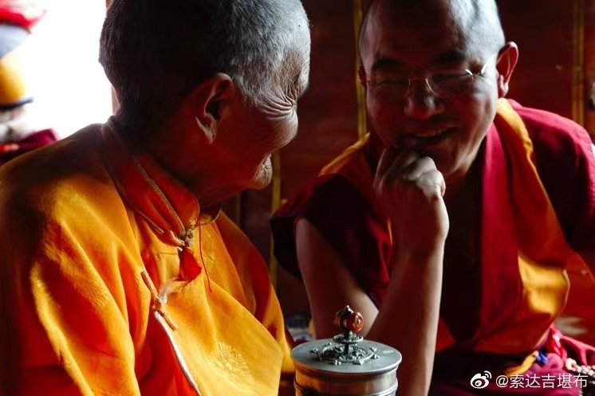
 ## 2021-05-13 10:16
大家方便的话，应该看看这部佛经——

《称赞大乘功德经》

大唐三藏法师玄奘奉 诏译

如是我闻。一时薄伽梵。住法界藏诸佛所行众宝庄严大功德殿。与无央数大声闻众大菩萨俱。及诸天人阿素洛等无量大众前后围绕。

尔时会中有一菩萨。示为女相名德严华。承佛威神从座而起。稽首作礼而白佛言。何等名为菩萨恶友。新学菩萨知已远离。

尔时佛告德严华言。我观世间。无有天魔梵释沙门婆罗门等。与新学菩萨。于无上菩提为恶知识。如乐声闻独觉乘者。所以者何。夫为菩萨。必为利乐诸有情故。勤求无上正等菩提。乐二乘人志意下劣。惟求自证般涅槃乐。以是因缘。新学菩萨不应与彼同住一寺。同止一房。同处经行。同路游适。若诸菩萨。已于大乘具足多闻得不坏信。我别开许与彼同居。为引发心趣菩提故。若彼种类善根未熟。不应为说大乘法教。令生诽谤获罪无量。

新学菩萨但应亲近久学大乘多闻菩萨。为于无上正等菩提。所种善根速成熟故。不应亲近乐二乘者。所以者何。彼障菩萨菩提心故。彼令弃舍菩提心故。彼令亏损菩提心故。彼令毁犯菩萨行故。菩萨宁当弃舍身命。不应弃舍大菩提心。发起趣求二乘作意。若诸菩萨劝诸有情。舍菩提心趣二乘地。若诸菩萨劝诸有情。舍菩提心造诸恶业。俱堕地狱受诸剧苦。菩萨宁守大菩提心。造五无间受地狱苦。终不弃舍大菩提心。而欲趣求预流果证。菩萨宁守大菩提心。百千大劫受地狱苦。终不弃舍大菩提心。而欲趣求一来果证。菩萨宁守大菩提心。受傍生身或作饿鬼。终不弃舍大菩提心。而欲趣求不还果证。菩萨宁守大菩提心。造十恶业堕诸恶趣。终不弃舍大菩提心。而欲趣求无生果证。菩萨宁守大菩提心。入大火坑救诸含识。终不弃舍大菩提心。而同怯贼投涅槃界。

菩萨哀愍一切有情。于生死中轮转无救。初发无上菩提心时。一切天人阿素洛等皆应供养。已能映夺一切声闻独觉极果。已能摧伏一切魔军。诸恶魔王皆大惊怖。

时德严华闻佛语已。重请佛言。何谓魔军。惟愿世尊哀愍为说。

佛告德严华。若有闻说大乘法教。不生随喜不乐听闻。不求悟入不能信受。反加轻笑毁訾凌蔑。离间谤讟捶打驱摈。应知此等皆是魔军。是则名为乐非法者。性鄙劣者。求外道者。行邪行者。坏正见者。应知此等谤毁大乘。当堕地狱受诸剧苦。从彼出已生饿鬼中。经百千劫常食粪秽。后生人中。盲聋喑痖支体不具。其鼻匾[匚@虒]。愚钝无知形貌矬陋。如是渐次罪障消除。流转十方。或遇诸佛亲近供养。复闻大乘闻已或能随喜信受。因此便发大菩提心。勇猛精勤修菩萨行。渐次进学。乃至菩提。

诸佛世尊无别作意。为有情类说五乘法。由本愿力依法界身。于一切时。从诸毛孔任运流出无量法光。以一妙音等澍法雨于一众会无量有情。昔来信乐声闻乘者。闻佛为说声闻乘法。昔来信乐独觉乘者。闻佛为说独觉乘法。昔来信乐无上乘者。闻佛为说无上乘法。昔来信乐种种乘者。闻佛为说种种乘法。昔来信乐人天乘者。闻佛为说人天乘法。傍生鬼等。亦闻如来以随类音而为说法。若有昔来未闻法者。彼惟见佛处众默然。曾闻大乘而诽谤者。经无量劫堕大地狱傍生饿鬼及天人中备受苦已。闻大乘法即能随喜深生净信。便发阿耨多罗三藐三菩提心。

时德严华闻佛说已。重请佛言。何谓大乘。此大乘名为目何义。

世尊告曰。善哉善哉。汝能乐闻大乘功德。谛听谛听。善思念之。吾当为汝分别解说。此大乘名所目诸义。此乘综摄。笼驾弘远无所遗漏。故曰大乘。此乘功德甚深微妙过诸数量。故曰大乘。此乘坚固虚妄分别不能倾动。故曰大乘。此乘真实穷未来际无有断尽。故曰大乘。此乘寥廓该罗法界邈无边际。故曰大乘。此乘如海吞纳蕴积功德宝聚。故曰大乘。此乘如山作镇区域邪徒不扰。故曰大乘。此乘如空包含一切情非情类。故曰大乘。此乘如地普能生长世出世善。故曰大乘。此乘如水等润一切令无枯槁。故曰大乘。此乘如火焚灭诸障令无余习。故曰大乘。此乘如风扫除一切生死云雾。故曰大乘。此乘如日开照群品成熟一切。故曰大乘。此乘如月能除热恼破诸邪暗。故曰大乘。此乘尊贵。天龙八部咸所敬奉。故曰大乘。此乘恒为诸健达缚歌咏赞美。故曰大乘。此乘恒为四王梵释礼敬尊重。故曰大乘。此乘恒为诸龙神等敬事防守。故曰大乘。此乘恒为一切菩萨精勤修学。故曰大乘。此乘任持诸佛圣种展转增盛。故曰大乘。此乘圆满具大威德映夺一切。故曰大乘。此乘周给一切有情令无匮乏。故曰大乘。此乘威力犹如药树救疗众病。故曰大乘。此乘能害一切有情诸烦恼贼。故曰大乘。此乘能转无上法轮饶益一切。故曰大乘。此乘微妙甚深秘密不可宣说。故曰大乘。此乘神用绍三宝种能使不绝。故曰大乘。此乘能显世俗胜义理趣究竟。故曰大乘。此乘能显诸菩萨行无不具足。故曰大乘。此乘能显佛地功德无不备悉。故曰大乘。此乘利乐一切有情尽未来际。故曰大乘。此乘至功能建大义妙用无尽。故曰大乘。此乘幽玄下劣意乐不能信受。故曰大乘。此乘平等增上意乐方能信受。故曰大乘。此乘广大下愚不测而为轻笑。故曰大乘。此乘尊高上智能达常所宝玩。故曰大乘。此乘超过独觉乘等最上无比。故曰大乘。

佛说如是大乘名义体用殊胜诸功德时。于此三千大千世界六种震动。空中天乐百千万类。不鼓自呜。诸妙天花缤纷乱堕。无量天子无数声闻。闻此法音睹斯瑞应。皆发阿耨多罗三藐三菩提心。百千俱[并*氐]新学菩萨。同时证得无生法忍。

尔时阿难即从座起。合掌恭敬而白佛言。今此法门甚为希有。能普利乐一切有情。当以何名奉持流布。

佛告阿难。此经名为称赞大乘功德。亦名显说谤法业障。以是名字汝当奉持。

时薄伽梵说此经已。阿难陀等无量声闻。德严华等无数菩萨。及诸天人阿素洛等一切大众。闻佛所说皆大欢喜。信受奉行。
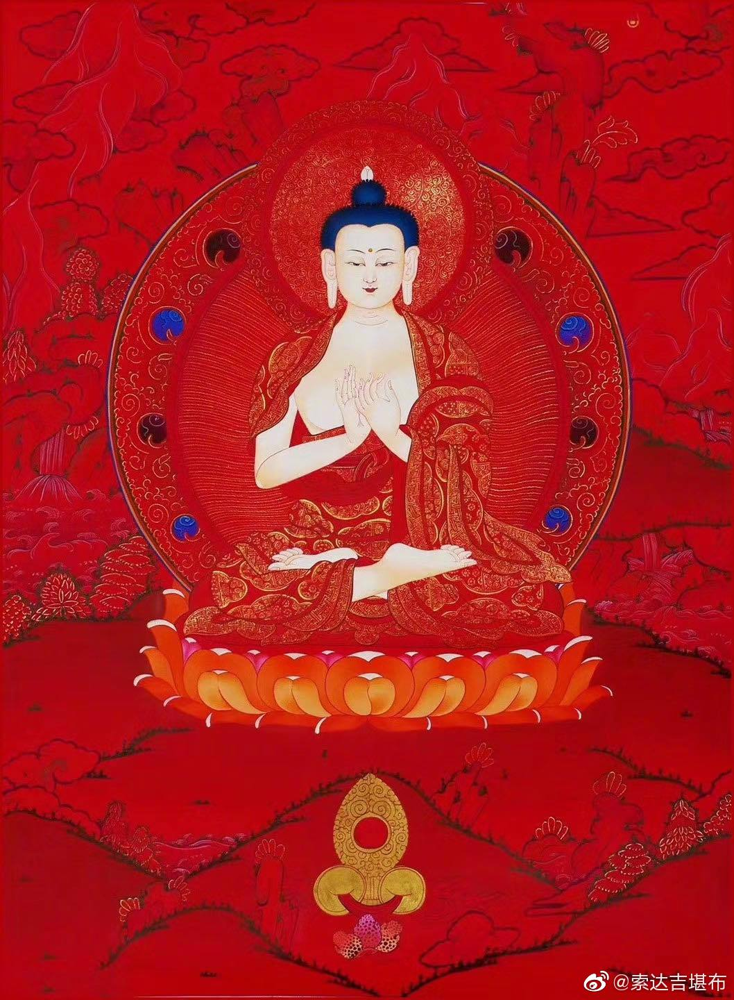
 ## 2021-05-15 07:52
今年5月12日-6月10日，是藏历的“萨迦月”。佛陀诞生、成道、涅槃，都发生在这个神圣的月份。这个月，无论做任何善事，功德都会以几何倍数增长。
为了忏悔自己和他人过去、现在、未来的一切业障，让我们一起来完成40万金刚萨埵心咒吧，“嗡班杂萨埵吽”……
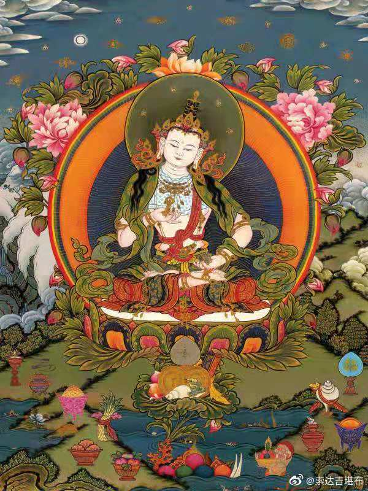
 ## 2021-05-16 08:02
早上打开门，惊喜地发现满院子一片晶莹洁白。
这场雪，在藏人眼里是布谷鸟的礼物，大地母亲要从寒冷中苏醒了……
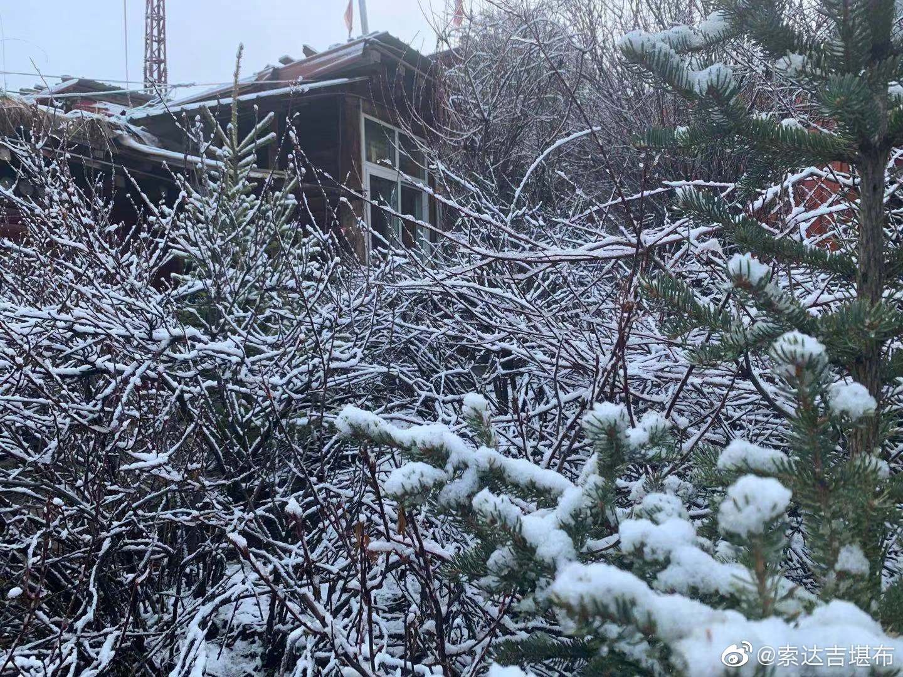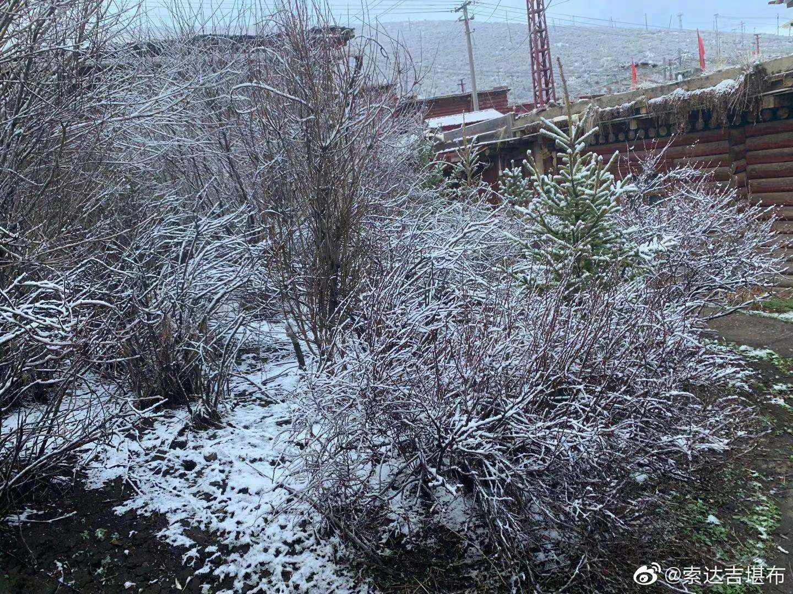
 ## 2021-05-19 07:59
今天是释迦牟尼佛的圣诞日，希望大家一心一意祈祷佛陀，至少念“南无本师释迦牟尼佛”108遍。
“天上天下，唯我独尊，
虚空有尽，我愿无穷。”
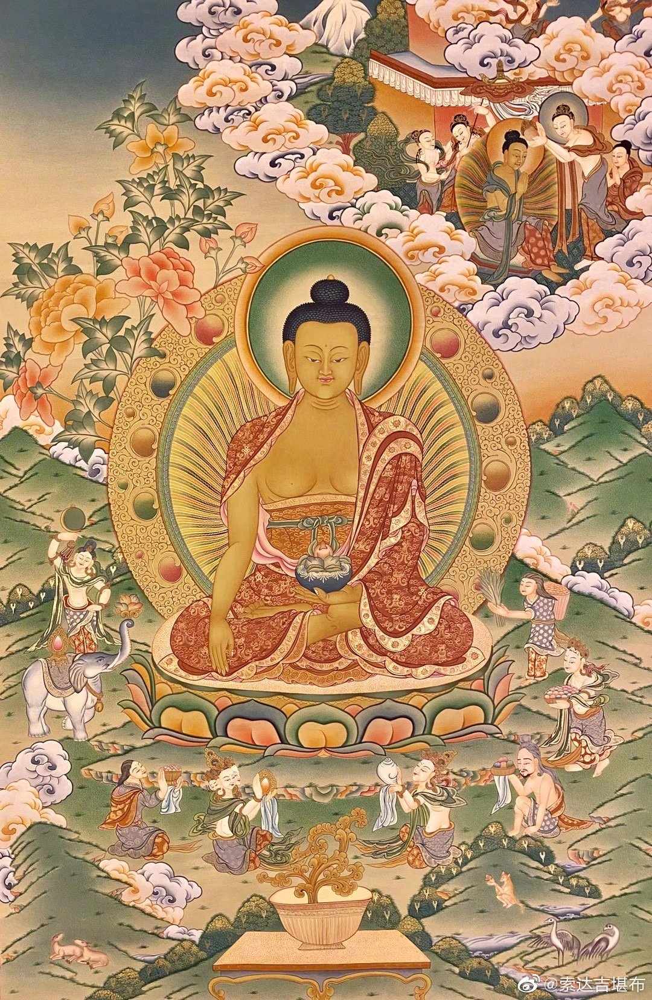
