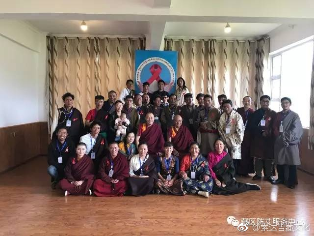

 ## 2017-01-07 16:05
°祈祷莲师 ¡查看图片

 ## 2017-02-21 12:44
བོད་རིགས་སྤུན་ཟླ་རྣམ་པ་ཚོ།དེ་རིང་འཛམ་གླིང་ཕ་སྐད་དུས་ཆེན་འདིར་ཚང་མས་རང་རེའི་སྐད་ཡིག་གི་ཚེ་སྲོག་ཡུན་རིང་དུ་གནས་ཐུབ་པར་བརྩོན་པའི་རི་མོ་སྙིང་དབུས་སུ་འབྲི་བར་བཀའ་དྲིན་ཞུ།།

 ## 2017-02-27 07:49
ལོ་སར་བཀྲ་ཤིས་བདེ་ལེགས་ཞུ།新年吉祥L索达吉堪布祝福藏历火鸡年（藏语）

 ## 2017-05-10 08:12
ཁྱེད་ལ་སོ་བཀྲུ་ཐབས་ཡང་དག་པ་ཞིག་བཤད།L【宫雀古旃扎】索达吉堪布教你刷牙 ¡查看图片

 ## 2017-05-25 08:40
ལུས་ཁྲུསL谈谈洗澡那些事

佛告耆域：澡浴之法……何谓除去七病？一者、四大安隐；二者、除风病；三者、除湿痹；四者、除寒冰；五者、除热气；六者、除垢秽；七者、身体轻便，眼目精明。
——《佛说温室洗浴众僧经》 ¡查看图片

 ## 2017-06-24 07:32
L【宫雀古旃扎】索达吉堪布说：要洗手

 ## 2017-06-24 07:32
L【宫雀古旃扎】索达吉堪布：一顿饭里的修为

 ## 2017-07-09 18:30
L早餐要吃好

 ## 2017-07-20 10:08
Oསྐབསབཅུ་པའི་ཨེའགོག་རང...

 ## 2017-08-30 13:08
L【宫雀古旃扎】索达吉堪布：佛塔跟我们有啥关...

 ## 2017-09-20 09:36
L宫雀古旃扎 索达吉堪布：怎样与佛像“共处”

 ## 2017-10-25 10:17
O今天我升级为VIP2了

