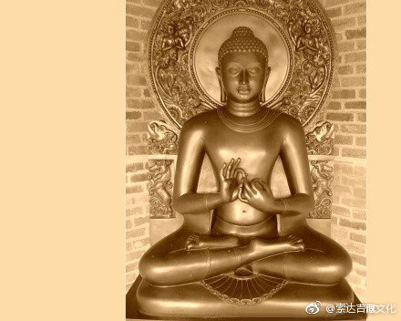

 ## 2018-01-01 19:15
法王晋美彭措：
ཆོས་རྗེ་འཇིགས་མེད་ཕུན་ཚོགས་ཀྱིས།རང་ཚུགས་མ་ཤོར།།གཞན་སེམས་མ་དཀྲུགས།།ཞེས་གསུངས།
莫舍己道、 勿扰他心。

 ## 2018-01-03 07:23
མདོ་རྒྱ་ཆེར་རོལ་བ་ལས།བསོད་ནམས་རྣམ་སྨིན་བདེ་སྟེ་སྡུག་བསྔལ་ཐམས་ཅད་སེལ།།བསོད་ནམས་ལྡན་པའི་མི་ཡི་བསམ་པ་རྣམས་ཀྱང་འགྲུབ།།བདུད་བཅོམ་ནསནི་བྱང་ཆུབ་མྱུར་དུ་རེག་པར་འགྱུར།།ཞེས་སོ།
《方广游戏经》:
行善积德，离苦得乐。具足福德，所愿皆遂，摧毁魔众，速得菩提。

 ## 2018-01-03 13:08
རྒྱས་སྲས་ཞི་བ་ལྷས།བདག་ནི་རྙེད་དང་བཀུར་བསྟི་དང་།།ལུས་དང་འཚོ་བ་མེད་བླ་ཞིང་།།དགེ་བ་གཞན་ཡང་ཉམས་བླ་ཡི།།སེམས་ནི་ནམ་ཡང་ཉམས་མི་བྱ།།ཞེས་གསུངས།
寂天菩萨：
我宁可失坏供养、恭敬、身体、资具，以及其他善根，也绝不能有损利他心。

 ## 2018-01-04 09:57
ས་སྐྱ་པཎ་ཆེན་གྱིས།རང་ལ་དགོས་པའི་བསྟན་བཅོས་རྣམས།།ཉི་མ་རེ་རེར་ཚིག་རེ་བཟུང་།།གྲོག་མཁར་དང་ནི་སྦྲང་རྩི་ལྟར།།རིང་པོར་མི་ཐོགས་མཁས་པར་འགྱུར།།ཞེས་གསུངས།
萨迦格言：
自己所需诸论典，每日之中记一句，如同蜂蜜及蚁窝，不久即将成智者。

 ## 2018-01-05 08:35
ཁྱད་པར་འཕགས་བསྟོད་ལས།མུ་སྟེགས་ཅན་གྱི་གཞུང་ལུགས་ལ།།ཇི་ལྟ་ཇི་ལྟར་རྣམ་བསམ་པ།།དེ་ལྟ་དེ་ལྟར་མགོན་ཁྱོད་ལ།།བདག་གི་སེམས་ནི་དད་པར་གྱུར།།ཞེས་སོ།
《殊胜赞》：
对外道典籍越深究，对怙主（佛陀）您就越坚信。

 ## 2018-01-06 05:05
ཀུན་མཁྱེན་མི་ཕམ་པས།གདམས་ངག་བཟང་པོའི་ཚིག་འདི་ལ།།བལྟ་ཞིང་དེའི་དོན་བསམ་པ་དང་།།བསམས་ནས་དེ་ལ་ཡིད་ཆེས་པས།།དེ་ཡི་དོན་བཞིན་སྤྱད་པར་བྱ།།ཞེས་གསུངས།
全知麦彭仁波切：
对于殊胜教言，先要去看，再去思考并生起定解，之后去如理行持。

 ## 2018-01-07 19:14
མདོ་སྡེ་རྒྱན་ལས།དེ་ཡིས་ཆོས་ཀུན་སྒྱུ་མ་ལྟ་བུ་དང་།།རྐྱེ་བ་སྐྱེད་མོའི་ཚལ་་འགྲོ་ལྟར་རྟོགས་ནས།།འབྱོར་བའི་དུས་དང་རྒུད་པའི་དུས་ན་ཡང་།།ཉོན་མོངས་སྡུག་བསྔལ་དག་གིས་འཇིགས་པ་མེད།།ཅེས་གསུངས།
《大乘经庄严论》
了悟诸法如幻的圣者，在恶趣中流转投生，也像入于花园一样快乐，纵遇兴盛、衰败，也不会被烦恼染污。

 ## 2018-01-08 06:37
རྡོ་རྗེ་གཅོད་པ་ལས།འདས་པའི་སེམས་ཀྱང་དམིགས་སུ་མེད།
མ་འོངས་པའི་སེམས་ཀྱང་དམིགས་སུ་མེད།
ད་ལྟར་བྱུང་བའི་སེམས་ཀྱང་དམིགས་སུ་མེད། ཅེས་གསུངས།
《金刚经》：
过去心不可得
未来心不可得
现在心不可得

 ## 2018-01-09 07:14
དཀོན་མཆོག་སྒྲོན་མེ་ལས།དད་པ་སྔོན་འགྲོ་མ་ལྟར་བསྐྱེད་པ་སྟེ།།ཡོན་ཏན་ཐམས་ཅད་སྲུང་ཞིང་འཕེལ་བར་བྱེད།།ཅེས་གསུངས།
《宝灯经》：
信为前行如生母，能护功德令增上。

 ## 2018-01-15 10:55
དབུས་ཟ་མཁའ་འགྲོའི་རང་རྣམ་ལས།ཨེ་མ་ཧོཿསྐྱབས་གནས་ཀུན་འདུས་མཁའ་འགྲོ་མཚོ་རྒྱལ་མར།།བཟོད་མེད་གདུངཤུགས་དྲག་པོས་གསོལ་བ་འདེབས།།ཕྱི་ནང་གསང་བའི་བར་ཆད་ཀུན་ཞི་ི་ཞིང་།།བསམ་པ་ལྷུན་གྱིས་འགྲུབ་པར་བྱིན་གྱིས་རློབས།།ཞེས་གསུངས།
《卫萨空行母自传》
唉玛火，
皈依总集措嘉空行母，
无比强烈之信而祈祷，
遣除内外密之诸违缘，
一切所愿成就求加持。

 ## 2018-01-15 11:42
རྩ་ཤེས་ལས།བདག་ལས་མ་ཡིན་གཞན་ལས་མིན།།གཉིས་ལས་མ་ཡིན་གཞན་ལས་མིན།།དངོས་པོ་གང་དག་གང་ན་ཡང་།།སྐྱེ་བ་ནམ་ཡང་ཡོད་མ་ཡིན།།ཞེས་གསུངས།
《中论》：
诸法不自生， 亦不从他生，不共不无因， 是故知无生。

 ## 2018-01-16 06:44
མྱང་འདས་ཆེན་པོ་ལས།ང་མྱང་ངན་ལས་འདས་ནས་གང་གིས་ཐེག་པ་ཆེན་པོའི་མདོ་སྡེ་ཤིན་ཏུ་ཟབ་མོའདི་ཐོས་ནས་དད་པའི་སེམས་སྐྱེས་ན།དེ་མ་འོངས་བའ་ི་དུས་སུ་བསྐལ་པ་བརྒྱ་སྟོང་གི་བར་དུ་ངན་སོང་དུ་མི་ལྟུང་བར་རིག་པར་བྱའོ།ཞེས་སོ།
《大涅槃经》：
“应当了知，我涅槃后，若有人听闻甚深大乘典籍，并对其生信，未来千百万劫不堕恶趣。”

 ## 2018-01-16 12:30
མདོ་སྡེ་རྒྱན་ལས།ཇི་ལྟར་བློ་ལྡན་སེམས་ཅན་ལ།།རབ་ཏུ་བྱམས་པར་གྱུར་པ་ལྟར།།སེམས་ཅན་བདག་དང་ཆུང་མ་དང་།།བུ་བཤེས་གཉེན་ལ་དེ་ལྟ་མིན།།ཞེས་སོ།
《大乘经庄严论》：
具有智慧的菩萨，对一切众生的爱，远远超过凡夫人对自己、妻子、儿女、亲友的爱。

 ## 2018-01-17 08:03
ཆུ་ཤིང་བསྟན་བཅོས་ལས།ཐོས་མང་ཉམས་སུ་མ་བླངས་ན།།རང་གི་རྒྱུད་ལ་མི་ཕན་ཏེ།།ཆུ་ནང་ལོ་བརྒྱར་གནས་པ་ཡི།།རྡོ་བའི་རང་བཞིན་སྐམ་པོར་གནས།།ཞེས་གསུངས།
《水木格言》：
只是多闻却未实修，自心不会有多大改变，犹如水中浸泡百年的石头，自性始终是干燥的。

 ## 2018-01-17 20:36
ཀླུ་སྒྲུབ་ཀྱིས།ཕྱུག་པོ་ཀླ་ཀློ་ལ་ཡང་ཡོད།།དཔའ་བོ་དུད་འགྲོ་ལ་ཡང་ཡོད།།དོན་དང་མཐུན་པའིགཏམ་སྨྲ་བ།།འཇིག་རྟེན་འདི་ན་ཤིན་ཏུ་དཀོན།།ཞེས་གསུངས།
龙猛菩萨：
富翁在愚夫中也有，英雄在动物中也有，但能说真理的人，在此世上却极罕见。

 ## 2018-01-18 23:48
རྗེ་བཙུན་བྱམས་པ་མགོན་པོས།ལྷ་ཡི་རྒྱལ་པོས་ཆར་ཕབ་ཀྱང་།།ས་བོན་མི་རུང་མི་འཁྲུངས་ལྟར།།སངས་རྒྱས་རྣམས་ནི་བྱོན་གྱུར་ཀྱང་།།སྐལ་བ་མེད་པས་བཟང་མི་མྱོང་།།ཞེས་སོ།
弥勒菩萨：
老天虽然降下大雨，但种子坏了，也不可能发芽。诸佛尽管出现于世，但无缘之人也得不到善妙的解脱。

 ## 2018-01-19 05:37
བཞི་བརྒྱ་པར།རིན་ཆེན་རང་བཞིན་མཆོད་རྟེན་ནི།།འཇིག་རྟེན་སྙེད་མཐོ་འགའ་བྱས་པ།།དེ་བས་སེམས་ཅན་གཅིག་འདུལ་བ།།མཆོག་ཏུ་སྤྲས་པར་བརྗོད་པ་ཡིན།།ཞེས་གསུངས།
《四百论》：
调伏一个众生令其发菩提心，其功德远远超过修造这世上最高的珍宝塔。

 ## 2018-01-19 23:44
ཀླུ་སྒྲུབ་ཀྱིས།འཇིག་རྟེན་པ་ཡི་ཡང་དག་ལྟ།།ཆེན་པོ་སུ་ལ་ཡོད་གྱུར་པ།།དེ་ནི་ཚེ་རབས་སྟོང་དུ་ཡང་།།ངན་འགྲོར་འགྲོ་བར་མི་འགྱུར་རོ།།ཞེས་སོ
龙猛菩萨：
谁具世间正见，千世不堕恶趣。

 ## 2018-01-20 05:23
མི་ཕམ་རིན་པོ་ཆེས།འདུ་འཛི་ཀུན་ཏུ་སྤང་བར་གྱིས།།གལ་ཏེ་དེ་སྤོང་མ་ནུས་ན།།དམ་པ་དག་དང་འདྲེ་བར་གྱིས།།དེ་ཉིད་དེ་ཡི་སྨན་ཡིན་ནོ།།ཞེས་གསུངས།
麦彭仁波切：
要舍弃散乱愦闹。若实在不能舍弃，则去与贤者交往，这是最好的“药”。

 ## 2018-01-20 23:10
གུང་ཐང་བསྟན་པའི་སྒྲོན་མེས།ཆོས་ཀུན་ཅིག་ཅར་མི་ཤེས་ཀྱང་།།ཅི་ཙམ་ཤེས་བཞིན་དོན་དུ་འགྱུར།།ཆུ་ཀླུང་རྫོགས་པར་མ་འཐུངས་ཀྱང་།།ཅི་ཙམ་བཏུངས་པས་སྐོམ་པ་སེལ།།ཞེས་གསུངས།
贡塘丹毕准美：
世间万法纵然难以全部了知，略知一点也会得到大利。江河虽然无法全部饮光，喝上几口也可以解渴。

 ## 2018-01-21 05:53
ལུགས་ཀྱི་བསྟན་བཅོས་ལས།མི་ལ་བཟང་ངན་སྣ་ཚོགས་ཀྱི།།སྐྱོན་ཡོན་ཁོང་ན་གནས་གྱུར་པ།།ཁ་ནས་བཤད་པ་ཅི་འདྲ་ཡང་།།ལག་གི་བྱ་བས་ངེས་པར་རྟོགས།།ཞེས་སོ།
《君规教言论》：
人有好坏不同，功德、过失都藏在心中，不管嘴上怎么说，了解他还是要看行为。

 ## 2018-01-22 05:40
མཁས་དབང་དགེ་ཆོས་ཀྱིས།ཕྱུག་པོ་ཕྱུག་པོའི་ས་ནས་སྡུག་གཏམ་བྱེད།།དབུལ་བོ་དབུལ་པོའི་ས་ནས་སྨྲེ་སྔགས་འདོན།།མི་རེ་སེམས་ལ་སྡུག་བསྔལ་ཁུར་བོ་རེ།།འཁོར་བའི་གནས་ན་བདེ་བའི་སྐབས་མི་མཆིས།།ཞེས་སོ།
根登群佩：
富人有富人的哭泣，穷人有穷人的哀嚎，人人都背着痛苦包袱，轮回之中难觅快乐。

 ## 2018-01-23 05:36
ལྕང་སྐྱའི་བསླབ་བྱ་གཞན་ཕན་བདུད་རྩི་སྙིང་པོ་ལས།ཁྱད་པར་ལྷ་དང་བླ་མ་དབྱེར་མེད་ལ།།མོས་གུས་ཤུགས་དྲག་བློ་སེམས་གཅིག་དྲིལ་གྱིས།།ཚིག་ཙམ་མིན་པར་གསོལ་བ་ལེགས་བཏབ་ན།།ཅི་བྱས་ལམ་དུ་འགྲོ་བ་གདོན་མི་ཟ།།ཞེས་སོ།
章嘉国师《利他甘露精要》
若观上师与本尊无二无别，以强烈的信心、虔诚的恭敬心由衷祈祷，所做一切必定如愿以偿。

 ## 2018-01-24 05:45
སློབ་དཔོན་ཨཱརྱ་དྷེ་ཝས།འཆི་བའི་རྐྱེན་ནི་ཤིན་ཏུ་མང་།།འཚོ་བའི་རྐྱེན་ནི་ཤིན་ཏུ་ཉུང་།།དེ་ཡང་འཆི་བའི་རྐྱེན་དུ་འགྱུར།།ཞེས་གསུངས།
圣天论师：
死缘极众多，生缘极稀少，彼亦成死缘。

 ## 2018-01-25 05:43
ཨོ་རྒྱན་ཆེན་པོས།ཆོས་ལ་ཕྱི་བཤོལ་མ་བྱེད་རྗེ་འབངས་རྣམས།།སྙིང་རུས་མ་ཆུང་སྒྲུབ་ལ་རེམ་པར་གྱིས།།ཚེ་གང་དུས་བརྒྱའི་ཟ་མ་ལན་གཅིག་ཡིན།ཞེས་གསུངས།
莲花生大士：
诸弟子对修法切莫拖延，应以大精进来修行，遇法如百日一餐极难得。

 ## 2018-01-26 05:29
རྗེ་བཙུན་མི་ལས།མི་མེད་དབེན་པའི་བྲགཕུག་ནས།།སྐྱོ་ཆད་དེ་བ་ལ་སང་དུས་མེད།།བླ་མ་དུས་གསུམ་སངས་རྒྱས་ལ།།ཡིད་དུང་ངེ་ལ་འབྲལ་བ་མེད།།ཅེས་སོ།
米拉日巴尊者：
无人山谷岩洞中，恒具出离厌世心，上师乃为三世佛，强烈坚信永不离。

 ## 2018-01-27 05:19
ཞི་བ་ལྷས།བདག་ནི་མེད་པར་འགྱུར་བའི་དུས།།དེ་ནི་གདོན་མི་ཟ་བར་འབྱུང་།།ཞེས་གསུངས།
《入行论》：
吾生终归尽，死期必降临。

 ## 2018-01-28 22:25
མི་ཕམ་རིན་པོ་ཆེས།ཤིན་ཏུ་གསང་བར་འོས་པ་ནི།།རང་ལས་གཞན་པ་སུ་ལའང་མིན།།མཛའ་བས་མཛའ་བར་ཚིག་སྤེལ་ནས།།ཐ་མ་རྒྱལ་ཁམས་ཁྱབ་པར་འགྱུར།།ཅེས་གསུངས།
麦彭仁波切：
该保密的事情，除了自己谁都不要说，否则密友传密友，秘密就会遍天下。

 ## 2018-01-29 05:56
དགེ་ཆོས་ཀྱིས།བྱིས་པའི་དུས་ནས་རྒས་ཤིང་འཁོགས་པའི་བར།།སེམས་ཀྱི་འཁྱེར་སོ་ཅི་ཙམ་བརྗེས་གྱུར་པ།།རང་གི་མྱོང་བས་དཔྱད་ན་ཤེས་ནུས་པས།།ད་ལྟའི་འཆར་སྒོ་འདི་ལ་ཡིད་བརྟན་ཅི།།ཞེས་གསུངས།
根登群佩：
从孩提到耄耋，自己的心变化过很多次，这一点凭经验观察即可清楚。因此，当下的心念又有什么可信度？

 ## 2018-01-30 05:39
སྤྱོད་འཇུག་ལས།བསྐལ་པ་སྟོང་དུ་བསགས་པ་ཡི།།སྦྱིན་དང་བདེ་གཤེགས་མཆོད་ལ་སོགས།།ལེགས་སྤྱད་གང་ཡིན་དེ་ཀུན་ཀྱང་།།ཁོང་ཁྲོ་གཅིག་གིས་འཇོམས་པར་བྱེད།།ཅེས་གསུངས།
《入行论》：
一嗔能摧毁，千劫所积聚，施供善逝等，一切诸福善。

 ## 2018-01-31 05:22
པད་མ་བདུད་འདུལ་གྱིས།ཨ་ཧོ་ཐུབ་དབང་ཕྱོགས་དུས་རྒྱལ་བ་སྲས་བཅས་མཁྱེན།།
རྒྱུ་འབྲས་གོ་ལོག་བུ་ལ་ཐུགས་རྗེས་གཟིགས།།  
དྲིན་ཅན་རྩ་བརྒྱུད་བླ་མའི་ཚོགས་རྣམས་མཁྱེན།།
རྒྱུ་འབྲས་གོ་ལོག་བུ་ལ་ཐུགས་རྗེས་གཟིགས།།
ལྷག་པའི་ལྷ་མཆོག་སྤྱན་རས་གཟིགས་དབང་མཁྱེན།།
རྒྱུ་འབྲས་གོ་ལོག་བུ་ལ་ཐུགས་རྗེས་གཟིགས།།
班玛敦德：
阿吙！                                                      
十方诸佛佛子知，悲视颠倒因果者。  
大恩本传众师知，悲视颠倒因果者。      
殊胜本尊观音知，悲视颠倒因果者。

 ## 2018-02-01 05:39
མདོ་ལས།ཟབ་མོའི་ཆོས་ནི་སྟོན་པ་ལ།།གལ་ཏེ་མོས་པར་མ་གྱུར་ཀྱང་།།སྐུལ་བ་དག་ནི་མི་གདབ་སྟེ།།ཆོས་ཉིད་བསམ་མི་ཁྱབ་དྲན་བྱ།།ཞེས་གསུངས།
佛经：
宣说甚深微妙法，倘若于此未生信，亦不随意作诋毁，当念法性不思议。

 ## 2018-02-02 05:17
ཞབས་དཀར་པས།ཚེ་རབས་ཀུན་ཏུ་ཕ་མ་སེམས་ཅན་གྱི།།
ཤ་ཁྲག་ནམ་ཡང་ཟ་བར་མ་གྱུར་ཅིག།
སངས་རྒྱས་ཐུགས་རྗེ་ཅན་གྱི་བྱིན་རླབས་ཀྱིས།།
ཤ་ལ་ནམ་ཡང་སྲེད་པ་མེད་པར་ཤོག།  
夏嘎巴：
愿我生生世世中，不食父母众血肉，
愿以悲尊佛加持，永不贪爱诸肉食。

 ## 2018-02-03 05:20
ཕལ་པོ་ཆེ་ལས།ཤེས་རབ་ཆུང་ངུས་ཆོས་འདི་དག།།ཀུན་ནས་ཤེས་པར་མི་ནུས་ཏེ།།ཡེ་ཤེས་མིག་ནི་རྣམ་སྦྱངས་པས།།འདི་ཡི་ཚུལ་ལ་འཇུག་པར་འགྱུར།།ཞེས་གསུངས།
《华严经》：
小智于此法，不可悉通达，若净智慧目，则可趋入彼。

 ## 2018-02-04 05:31
མདོ་སྡེ་རྒྱན་ལས།རྒྱལ་སྲས་བརྩོན་འགྲུས་མཆོག་ལ་བསྟེན་པ་སྟེ།།སེམས་ཅན་ཚོགས་རབ་སྨིན་པར་བྱེད་པ་ན།།ཕ་རོལ་སེམས་དགེ་གཅིག་གི་ཕྱིར་ཡང་ནི།།བསྐལ་པ་བྱེ་བ་སྟོང་དུའང་སྐྱོ་མི་འགྱུར།།ཞེས་གསུངས།
《经庄严论》：
佛子依胜勤，成熟有情众，为他一善心，久劫亦不厌。

 ## 2018-02-05 05:37
བཀའ་བསྡུས་ལས།ཉིན་མོ་བྱུང་དུས་ཐུགས་རྗེ་ཆེན་པོ་སྒོམས།།སེམས་ཅན་དོན་དུ་སྙིང་པོ་མ་ཎི་དྲོངས།།ཕ་མ་རིགས་དྲུག་དྲིན་ལན་ཁྱེར་ཏེ་འོང་།།མཚན་མོ་བྱུང་དུས་པད་མ་ང་ཉིད་སྒོམས།།རང་གི་དོན་དུ་བཛྲ་གུ་རུ་དྲོངས།།སྙིགས་མའི་སེམས་ཅན་ཐམས་ཅད་ང་ཡིས་སྐྱོབ།།ཅེས་གསུངས།
《莲师略传》：
白天修观世音菩萨，为众生念六字真言，报恩六道父母众；晚上修莲花生大士，为自己念莲师心咒，浊世众生得救护。

 ## 2018-02-06 05:32
རྒྱུད་བླ་མ་ལས།འཕགས་པས་འཆི་དང་ན་བ་དང་།།རྒ་བའི་སྡུག་བསྔལ་རྩད་ནས་སྤངས།།ལས་དང་ཉོན་མོངས་དབང་གིས་སྐྱེ།།དེ་ལ་དེ་མེད་ཕྱིར་དེ་མེད།།ཅེས་གསུངས་།
《宝性论》：
圣者已断除，死病与老苦，依业烦恼生，彼无故彼无。

 ## 2018-02-07 05:22
མགོན་པོ་ཀླུ་སྒྲུབ་ཀྱིས།རང་ལུས་དག་ལ་ཚེར་མ་ཡི།།རྩེ་མོའང་བཟོད་པར་མི་འགྱུར་ན།།གཞན་གྱི་ལུས་ལ་མཚོན་དག་གིས།།སྲོག་དང་འབྲལ་བ་ཅི་ཕྱིར་བཟོད།ཅེས་གསུངས།
龙猛菩萨：
自己的身体，用尖刺触碰都难以忍受；他众的身体，用兵刃砍割令其丧生，又怎能忍心呢？

 ## 2018-02-08 05:33
ཀུན་མཁྱེན་ཀློང་ཆེན་པས།གཞུང་དང་ཞལ་གདམས་ཟིན་བྲིས་ལ་སོགས་པ།།ཟབ་མོའི་དཔེ་ཆ་མཁོ་དགུ་འཛོམས་ན་ཡང་།།ཉམས་ལེན་མ་བྱས་འཆི་ཚེ་དཔེས་མི་ཕན།།སེམས་ལ་བལྟ་བ་ཁོ་བོའི་སྙིང་གཏམ་ཡིན།།ཞེས་གསུངས།
全知龙钦巴：
典籍教言以及记录等，虽聚种种所需深义书，若无修持临死书无利，当观心性即是吾忠告。

 ## 2018-02-09 05:17
པད་མ་བདུད་འདུལ་གྱིས།དགེ་བའི་འབྲས་བུས་སེམས་ཅན་ཐམས་ཅད་ཀྱི།།
ཤ་ཟོས་ཉེས་སྒྲིབ་མ་ལུས་ཀུན་བྱང་ནས།།
སངས་རྒྱས་སྟོང་གི་ཞལ་ཡང་མཐོང་བར་ཤོག།
班玛敦德：
愿以善果悉清净，食众生肉诸罪障，
亦得面见千佛陀。

 ## 2018-02-09 23:33
ལོ་འདིའི་སྤྱི་ཟླ་དང་པོའི་ཚེས་གཅིག་ནས་བཟུང་དུས་ཚོད་དང་བསྟུན་ཏེ་ཉིན་རེ་བཞིན་བོད་ཀྱི་མཁས་པ་རྣམས་དང་ཁྱད་པར་བདག་གི་བླ་མ་གོང་མ་དག་གིས་རྒྱུན་དུ་ཐུགས་ཐོག་ནས་གསུང་དར་ཞིང་རང་གིས་ཀྱང་སྔོན་བློ་ལ་ལེན་མྱོང་བའི་ལུང་ཚིག་བྱིན་རླབས་ཅན་འགའ་རེ་རྒྱ་སྐད་དུ་བསྒྱུར་ཏེ་རྣམ་པ་ཚོར་ཕུལ་བ་ལ་འདིའི་ཚིག་བློ་ལ་བཟུང་ནས་དོན་ཉམས་སུ་བླངས་ན་དོན་ཆེན་པོ་ཡོད་པར་སེམས།
从今年1月1日开始，我准备每天发一条藏文微博，内容是摘自不同经论的佛法教言，非常具有加持力。这些教言，前辈大德十分重视，尤其是我的上师们倒背如流、经常引用，我自己也曾背诵过。
我将此翻译成汉语，与你分享。你若能背诵词句、依文修持，应该会有极大利益。

 ## 2018-02-10 05:24
འདུལ་བ་ལུང་ལས།རྒྱ་མཚོ་ཆུ་སྲིན་གནས་ཀྱི་རླབས།།དུས་ལས་ཡོལ་བ་འགྱུར་སྲིད་ཀྱང་།།གདུལ་བར་བྱ་བའི་སྲས་རྣམས་ལ།།སངས་རྒྱས་དུས་ལས་ཡོལ་མི་མངའ།།ཞེས་གསུངས།
《毗奈耶经》:
假使大海离开波浪，佛陀的慈悲也不会离开众生。

 ## 2018-02-11 05:05
ཐེག་བསྡུས་ལས།ཐབས་ཆེན་རྣམས་དང་ལྡན་པ་ལ།།ཉོན་མོངས་བྱང་ཆུབ་ཡན་ལག་འགྱུར།།འཁོར་བ་ཞི་བའི་བདེ་བ་ལ།།དེ་ལྟར་རྒྱལ་སྲས་བསམ་མི་ཁྱབ།།ཅེས་གསུངས
《摄大乘论》：
具足大方便，烦恼菩提支，轮回寂法性，如来不可思。

 ## 2018-02-12 05:05
དྲན་པ་ཉེར་བཞག་ལས།གང་ཞིག་སྡིག་ལ་ཉེར་བསྟེན་པ།།དེ་ནི་ཤིན་ཏུ་བཀྲ་མི་ཤིས།།ཐོག་མ་བར་དང་མཐར་ངན་པ།།དམ་པས་དེ་ནི་རྣམ་པར་སྨད།།ཅེས་གསུངས།
《正法念处经》：
何人造罪恶，此为不吉祥，初中后皆厄，圣者所呵斥。

 ## 2018-02-13 05:27
མཛོད་ལས།འཕགས་པ་མིན་ཡང་ཕ་མ་དང་།།ནད་པ་དང་ནི་ཆོས་སྨྲ་དང་།།བྱང་ཆུབ་སེམས་དཔའ་ངེས་གནས་དང་།།སྐྱེ་མཐའི་བྱང་ཆུབ་སེམས་དཔའ་ལ།།ཡོན་ནི་གཞལ་དུ་མེད་པ་ཡིན།།ཞེས་གསུངས།
《俱舍论》：
虽非圣者然而于，父母病人说法者，最后有者之菩萨，供养功德无有量。

 ## 2018-02-14 05:51
མ་དྲོས་པས་ཞུས་པའི་མདོ་ལས།གང་ཞིག་སྐྱེན་ལས་སྐྱེས་པས་དེ་མསྐྱེས།།དེ་ལ་སྐྱེ་བའི་རང་བཞིན་ཡོད་མ་ཡིན།།རྐྱེན་ལ་རག་ལས་གང་དེ་སྟོང་ཉིད་དེ།།གང་གིས་སྟོང་ཉིད་ཤེས་ཏེ་བག་ཡོད་ཡིན།།ཞེས་གསུངས།
《无热恼请问经》：
依缘则不生，彼生无自性，依缘彼空性，悟空不放逸。

 ## 2018-02-15 05:03
མི་ཕམ་རིན་པོ་ཆེས།ས་འདི་མ་རབས་ཀྱིས་གང་ཡང་།།རང་ཉིད་ཡ་རབ་སྤྱོད་པ་བྱ།།དེ་ལྟ་ན་ནི་ཆོས་ཉིད་ཀྱིས།།རང་ལ་ཕུན་སུམ་ཚོགས་པར་འགྱུར།།ཞེས་གསུངས།
麦彭仁波切：
虽此大地满恶人，然自当持高尚行，如是行持则自己，自然功德圆满成。

 ## 2018-02-16 05:16
མགོན་པོ་ཀླུ་སྒྲུབ་ཀྱིས།གང་གིས་ཐུགས་བརྩེ་ཉེར་བཟུང་ནས།།ལྟ་བ་ཐམས་ཅད་སྤང་བའི་ཕྱིར།།དམ་པའི་ཆོས་ནི་སྟོན་མཛད་པ།།གོོོ་ཏམ་དེ་ལ་ཕྱག་འཚལ་ལོ།།ཞེས་གསུངས།
《中论》：
瞿昙大圣主，怜愍说正法，悉断一切见，我今稽首礼。

 ## 2018-02-16 07:16
ལོ་སར་བཟང་།L春节－藏语开示-10Mbps ¡查看图片

 ## 2018-02-17 05:27
འཕགས་པ་ལྷས།ཇི་ལྟར་རྒྱུན་ལ་བལྟ་ཉེས་ན།།རྟག་པ་ཡོད་ཅེས་བྱ་འགྱུར་ལ།།ཇི་ལྟར་ཚོགས་ལ་བལྟ་ཉེས་ན།།དངོས་པོ་ཡོད་ཅེས་བྱ་བར་འགྱུར།།ཞེས་གསུངས།
圣天论师：
于相续假法，恶见谓真常，积集假法中，邪执言实有。

 ## 2018-02-18 05:17
ཆོས་རྗེ་འཇིགས་མེད་ཕུན་ཚོགས་ཀྱི་སྐུ་སྐྱེ་སྔ་མ་གཏེར་ཆེན་ལས་རབ་གླིང་པས་མི་འགྱུར་བ་བདུན་གྱི་ཡང་སྲིད་ཕྱི་མ་ལུང་བསྟན་པ་ནི་འདི་ལྟར།གནས་མི་འགྱུར་ཆོས་ཀྱི་འབྱུང་གནས་སུ།།མདངས་མི་འགྱུར་གཡུ་ཡི་མཚོ་མོ་ལ།།རིགས་མི་འགྱུར་པདྨའི་སྡོང་པོའི་རྩེར།།སྔགས་སྣ་ནམ་སྤྲུལ་པའི་ཁྱེའུ་མཆོག།ལོ་མི་འགྱུར་མཁའ་ལྡིང་བྱ་ལ་བལྟམས།།ལུས་མི་འགྱུར་ལག་མཐིལ་མཁའ་འགྲོའི་དལ།།ངག་མི་འགྱུར་སྡེ་སྣོད་རྒྱ་མཚོས་བརྒྱན།།སེམས་མི་འགྱུར་ཆོས་སྐུའི་རང་ངོ་འཕྲོད།།
法王如意宝的前世——伏藏大师列绕朗巴，授记自己转世的七种标志：
降魔金刚之化身，出生年不变，鸡年降生；
出生地不变，为秋及迥内；
父族不变，名班玛德瓦；
母名不变，即耶衣措姆；
身不变，掌具空行坛城；
语不变，庄严如海三藏；
心不变，认识法身本面。

 ## 2018-02-19 05:05
དྲན་པ་ཉེར་བཞག་ལས།སྐྱོན་དང་ཡོན་ཏན་ཡོངས་ཤེས་པ།།དེ་དག་མཁས་པའི་མཚན་ཉིད་ཡིན།།སྐྱོན་ཡོན་ཡོངས་སུ་མི་ཤེས་པ།།དེ་དག་བླུན་པོའི་བྱེད་པ་ཡིན།།ཞེས་གསུངས།
《正法念处经》：
了知功与过，此为智者相；不知功与过，则是愚者行。

 ## 2018-02-20 05:13
བྱང་ཆུབ་སེམས་འགྲེལ་ལས།གཞན་དོན་ལས་ལ་མཐུ་མེད་ཀྱང་།།དེ་ཡི་བསམ་པ་རྟག་ཏུ་བྱ།།གང་ལ་བསམ་པ་དེ་ཡོད་པ།།དེ་ནི་དེ་ལ་དོན་གྱིས་ཞུགས།།ཞེས་གསུངས།
《菩提心释》：
纵无利他力，恒有利他心，何人有此心，彼亦谓利他。

 ## 2018-02-21 05:21
མི་ཕམ་རིན་པོ་ཆེས།བྱིས་པ་ནོག་ཆུང་རྩེ་མོས་བསླུ།།དར་མ་ཆགས་སྡང་ཡུལ་གྱིས་བསླུ།།རྒན་པ་ལུས་སེམས་རྒུད་པས་བསླུ།།བག་མེད་ནམ་ཡང་བསླུ་ཞིང་བསླུས།།ཞེས་གསུངས།
麦彭仁波切：
孩童时受玩具游戏所惑，年轻时受贪嗔对境所惑，年老时受身心衰败所惑，一生始终被放逸迷惑。

 ## 2018-02-22 05:29
མདོ་ལས།རྣམ་རྟོག་མ་རིག་ཆེན་པོསྟེ།།འཁོར་བའི་རྒྱ་མཚོར་ལྟུང་བྱེད་ཡིན།།མི་རྟོག་ཏིང་འཛིན་ལ་གནས་ན།།མཁའ་བཞིན་དྲི་མ་མེད་པར་འགྱུར།།ཞེས་གསུངས།
佛经:
动念大无明，能堕轮回海，若住无念定，无垢如虚空。

 ## 2018-02-23 05:39
ཆོས་ཀྱི་གྲགས་པས།བྱམས་སོགས་རྨོངས་དང་འགལ་མེད་ཕྱིར།།ཤིན་ཏུ་ཉེས་པ་ཚར་གཅོད་མིན།།ཞེས་གསུངས།
法称论师：
慈等痴无违，故非尽除过。

 ## 2018-02-24 05:08
ཡེ་ཤེས་སྣང་བརྒྱན་གྱི་མདོ་ལས།བྱིས་པའི་བློ་ཅན་མཚན་མར་འཛིན་པ་རྣམས།།འཇིག་རྟེན་ན་ནི་མེད་པའི་ཆོས་ལ་སྤྱོད།།ཅེས་གསུངས།
《智慧庄严经》：
执着于相的凡夫俗子，在此世间界，将“无”妄执“有”而行。

 ## 2018-02-25 05:11
༢༠༡༨ལོའི་ཟླ་༢་པའི་ཚེས་༢༧་ནས་བཟུང་ཉིན་གསུམ་རིང་ལ་མགོན་པོ་ཀླུ་སྒྲུབ་ཀྱིས་མཛད་པའི་དབུ་མ་རིན་ཆེན་ཕྲེང་བའི་ལུང་དང་རྒྱ་སྐད་ཀྱི་ཐོག་ནས་ཆོས་ཁྲིད་བསྡུས་པ་ཞིག་བྱེད་རྒྱུ་ཡིན།
从 2月27日开始，我会用三天时间，念《中观宝鬘论》的藏语传承，并用汉语做简单讲解。

【电脑用户】
O网页链接

【智能手机用户】
O网页链接

 ## 2018-02-25 05:13
ཁྱད་པར་འཕགས་བསྟོད་ལས།བདག་ནི་སྟོན་པ་གཞན་སྤངས་ནས།།བཅོམ་ལྡན་ཁྱོད་ལ་སྐྱབ་མཆིས་པ།།དེ་ཅིའི་སླད་དུ་ཞེ་ན་ཁྱོད།།སྐྱོན་མི་མངའ་ལ་ཡོན་ཏན་ལྡན།།ཞེས་གསུངས།
《殊胜赞》：
我舍弃其他本师，而皈依佛陀您，为什么呢？因为您没有过失，只有功德。

 ## 2018-02-26 08:40
རྩ་ཤེས་ལས།ནང་དང་ཕྱི་རོལ་ཉིད་དག་ལ།།བདག་དང་བདག་གིར་སྙམ་ཟད་ན།།ཉེ་བར་ལེན་པ་ཟད་འགྱུར་ཞིང་།།དེ་ཟད་པས་ན་སྐྱེ་བ་ཟད།།ཅེས་གསུངས།
《中论》：
内外我我所， 若尽灭无有，诸取即为灭， 取灭则生灭。

 ## 2018-02-27 05:50
དཀོན་བརྩེགས་ལས།ཆོས་དབྱིངས་རྣམ་་པ་ཐམས་ཅད་དུ།།འགྱུར་མེད་མཁས་པའི་སྐྱེ་བོས་རྟོགས།།བྱིས་པ་རྣམས་ནི་དེ་ལ་འཁྲུལ།།བློ་སྦྱངས་བས་ནི་ཡང་དག་རྟོགས།།ཞེས་གསུངས།
《大宝积经》：
不变之法界，智者通达彼，凡愚则迷惑，心净可了悟。

 ## 2018-02-28 05:33
རྒྱལ་པོ་ཚངས་བྱིན་གྱིས་ཞུས་པ་ལས།ལེགས་པར་གསུངས་པའི་ཆོས་ནི་སྟོན་པ་ན།།སྡིག་པའི་སྤྱོད་ཡུལ་ཅན་དེས་མི་འཐད་འཛིན།།དད་མེད་ཆོས་ལ་ཐེ་ཚོམ་བསྐྱེད་ནས་ནི།།བསྐལ་པ་བྱེ་བ་མང་པོར་སྨྱོན་པར་འགྱུར།།ཞེས་གསུངས།
《梵施王所问经》：
善说佛法时，恶者谓非理，无信生疑惑，多劫成疯癫。

 ## 2018-03-01 05:39
མགོན་པོ་ཀླུ་སྒྲུབ་ཀྱིས།གལ་ཏེ་མི་སྟོང་ཅུང་ཟད་ཡོད།།སྟོང་པའང་ཅུང་ཟད་ཡོད་པར་འགྱུར།།སྟོང་མིན་ཅུང་ཟད་ཡོད་མིན་ན།།སྟོང་པ་ཡོད་པ་ག་ལ་འགྱུར།།ཞེས་གསུངས།
龙猛菩萨：
若有不空法， 则应有空法。实无不空法， 何得有空法？

 ## 2018-03-02 05:25
འདུལ་བ་ལས།རང་དབང་ཐམས་ཅད་བདེ་བ་ཡིན།།གཞན་དབང་ཐམས་ཅད་སྡུག་བསྔལ་ཡིན།།ཐུན་མོང་དག་གི་གནོད་བྱེད་དེ།།འབྲེལ་བ་ཤིན་ཏུ་འདའ་བར་དཀའ།།ཞེས་གསུངས
《毗奈耶经》:
自由是快乐的，没有自由是痛苦的，互相损害的业缘，是难以超离的。

 ## 2018-03-03 05:53
ལེགས་བཤད་རིན་པོ་ཆེའི་གཏེར་ལས།བསྟོད་པས་དགའ་བར་མི་འགྱུར་ལ།།སྨད་པས་མི་དགར་མི་འགྱུར་ཞིང་།།རང་གི་ཡོན་ཏན་ལེགས་གནས་པ།།སྐྱེ་བོ་དམ་པའི་མཚན་ཉིད་ཡིན།།ཞེས་གསུངས།
《格言宝藏论》：
不因赞称而高兴，不因辱骂而忧伤，善持自之功德者，此乃正士之法相。

 ## 2018-03-04 05:10
མདོ་སྡེ་རྒྱན་ལས།དབང་པོ་དམན་ཞིང་ཁམས་ཀྱང་ཤིན་ཏུ་དམན།།གྲོགས་པོ་དམན་པ་དག་གིས་ཡོངས་བསྐོར་བས།།ཟབ་ཅིང་རྒྱ་ཆེ ལེགས་པར་བཤད་པའི་ཆོས།།གལ་ཏེ་འདི་ལ་མོས་མེད་གྲུབ་པ་ཡིན།།ཞེས་གསུངས།
《大乘经庄严论》：
信劣界极劣，劣伴普围绕，正说深广法，无信成立此。

 ## 2018-03-05 05:00
ཕལ་པོ་ཆེ་ལས།ཇི་ལྟར་བར་སྣང་གནས་ཀྱི་བྱ་ཡི་རྗེས།།ཤིན་ཏུ་བལྟ་དཀའ་སྨྲ་བར་མི་ནུས་པ།།དེ་བཞིན་བདེ་གཤེགས་སྲས་ཀྱི་ས་རྣམས་ཀྱང་།།ཡིད་དང་སེམས་ཀྱི་ཡུལ་གྱིས་མི་ཤེས་སོ།།ཞེས་གསུངས།
《华严经》：
犹如空中之鸟迹，无法观见无法言，如是善逝佛子地，以意心境无法知。

 ## 2018-03-06 05:06
རྟེན་འབྲེལ་བསྟོད་པ་ལས།སྟོན་པ་བླ་ན་མེད་པའི་བསྟན་པ་དང་།།མཇལ་བ་འདི་འདྲ་བླ་མའི་དྲིན་ཡིན་པས།།དགེ་བ་འདི་ཡང་མ་ལུས་འགྲོ་བ་མ་ལུས་པ།།བཤེས་གཉེན་དམ་པས་འཛིན་པའི་རྒྱུ་རུ་བསྔོ།།ཞེས་གསུངས།
《缘起赞》：
无上导师之圣教，有幸值遇源师恩，此善回向无余众，承蒙正师摄受因。

 ## 2018-03-07 05:12
བསླབ་བྱ་ནོར་བུའི་ཕྲེང་བ་ལས།ཀུན་དང་མཐུན་ན་རྩ་བ་ཡིན་མོད་ཀྱང་།།མཐོང་ཚད་ལད་མོ་བྱས་ན་ཀླད་མེད་ཡིན།།སྐད་ཐམས་ཅད་ཤེས་ན་བཟང་མོད་ཀྱང་།།རང་གི་ཕ་སྐད་བརྗེད་ན་ངོ་ཚ་ཡིན།།ཞེས་གསུངས།
《教言宝鬘论》：
与人和谐相处是很好，但若所做都模仿别人，这是没头脑的行为。
精通多种语言是很好，但若忘记自己的母语，这是很羞耻的行为。

 ## 2018-03-08 05:23
སྤྱོད་འཇུག་ལས།འདི་འདྲའི་དལ་བ་རྙེད་གྱུར་ནས།།བདག་གིས་དགེ་གོམས་མ་བྱས་ན།།འདི་ལས་བསླུས་པ་གཞན་མེད་དེ།།འདི་ལས་རྨོངས་པའང་གཞན་མེད་དོ།།ཞེས་གསུངས།
《入行论》：
得如是暇已，我若不修善，无余欺过此，亦无过此愚。

 ## 2018-03-09 05:31
དཀོན་མཆོག་སྤྲིན་ལས།འཇིག་རྟེན་སེམས་ཀྱིས་བྲིས་པ་སྟེ།།སེམས་ནི་སེམས་ཀྱིས་མི་མཐོང་ངོ་།།དགེ་བའམ་འོན་ཏེ་མི་དགེ་བ།།ལས་ནི་སེམས་ཀྱིས་བསགས་པ་ཡིན།།ཞེས་གསུངས།
《宝云经》：
世间心所画，心者不见心，善业或恶业，皆由心所造。

 ## 2018-03-10 05:19
འཕགས་པ་སྤྱན་རས་གཟིགས་ཀྱིས།གང་གིས་རྒུད་ཚེ་བདག་དྲན་ན།།དེ་ཡི་་རྒུད་པ་བདག་གིས་བཟློག།།རང་གི་ཐོག་མའི་སྨོན་ལམ་འདི།།བདག་ལ་འབྲས་བུ་ལྡན་པར་མཛོད།།ཞེས་གསུངས།
观音菩萨：
谁遇难时能忆念我，我即能遣除一切灾难，这是我往昔发愿的结果。

 ## 2018-03-11 05:09
བསླབ་བྱ་རིན་ཆེན་ཕྲེང་བ་ལས།གཅེས་པའི་བུ་དང་སྙིང་གི་གྲོགས་ལ་ཡང་།།སྙིང་གཏམ་སྔོན་དུ་མ་བཤད་རེ་ཞིག་གསོང་།།ཧ་ཅང་དགའ་བའི་དུས་དང་ཁྲོས་པའི་དུས།།སེམ་ལ་གང་ཡོད་ཁ་ནས་འཆོར་ཉེན་ཡོད།།ཅེས་གསུངས།
《教言宝鬘论》：
哪怕对最爱的孩子、最亲的朋友，也不能说出自己的秘密。因为当他们极度欢喜或非常生气时，心里的秘密就会不小心泄露。

 ## 2018-03-12 05:09
མཁས་དབང་དགེ་ཆོས་ཀྱིས།མི་ཆེན་དཔོན་པོའི་རྗེས་རྒྱུགས་མཁས་ཤིང་།།འབྱོར་ལྡན་བྱུག་པོའི་ངོ་ལ་འཛུམ་མཁས་པ།།མདོར་ན་ཡར་འགྲོའི་མི་ལ་ངོ་དགའ་མཁན།།འཁྲེལ་མེད་ཁྲམ་པའི་བུ་དེ་དེང་སང་མང་།།ཞེས་གསུངས།
根登群佩：
对大高官善于溜须拍马，对富贵者善于谄媚取宠，总之，在飞黄腾达者面前演戏的无愧之人，如今可谓比比皆是。

 ## 2018-03-13 05:25
རྩ་ཤེས་ལས།སྡུག་པ་ཡོད་པ་མ་ཡིན་ན།།འདོད་ཆགས་ཡོད་པ་ག་ལ་འགྱུར།།མི་སྡུག་ཡོད་པ་མ་ཡིན་ན།།ཞེ་སྡང་ཡོད་པ་ག་ལ་འགྱུར།།ཞེས་གསུངས།
《中论》：
若无有净者，由何而有贪，若无有不净，由何而有恚？

 ## 2018-03-14 05:28
ས་ཆེན་གྲགས་པ་རྒྱལ་མཚན་གྱིས།ཚེ་འདི་ལ་ཞེན་ན་ཆོས་པ་མིན།འཁོར་བ་ལ་ཞེན་ན་ངེས་འབྱུང་མིན།བདག་དོན་ལ་ཞེན་ན་བྱང་སེམས་མིན།འཛིན་པ་བྱུང་ན་ལྟ་བ་མིན།ཞེས་གསུངས།
萨迦扎巴加参：
贪着今生不是修行人，贪着轮回不是出离心，贪着自利不是菩提心，心有执着不是正知见。

 ## 2018-03-15 05:23
རིན་ཆེན་ཕྲེང་བ་ལས།མེད་པ་བ་ནི་ིངན་འགྲོར་འགྲོ།།ཡོད་པ་བ་ནི་བདེ་འགྲོར་འགྲོ།།ཡང་དག་ཇི་བཞིན་ཡོངས་ཤེས་པས།།གཉིས་ལ་མི་བརྟེན་ཐར་བ་ལགས།།ཞེས་གསུངས།
《中观宝鬘论》：
无见堕恶趣，有见趋善趣，如实知真义，不依二解脱。

 ## 2018-03-16 05:52
ཞི་བ་ལྷས།གང་གི་ཆོས་ཀྱི་གཙོ་བོ་མཆོག།སེམས་ཀྱི་གསང་འདི་མ་ཤེས་ན།།བདེ་ཐོབ་སྡུག་བསྔལ་གཞོམ་འདོད་ཀྱང་།།དེ་དག་དོན་མེད་གྱི་ནར་འཁྱམས།།ཞེས་གསུངས།
寂天菩萨：
若不知此心，奥秘法中尊，求乐或避苦，无义终漂泊。

 ## 2018-03-17 05:29
ལེགས་བཤད་རིན་ཆེན་ཕྲེང་བ་ལས།འཁོར་འདས་ཆོས་རྣམས་མ་ལུས་པ།།སྒྱུ་མ་ཆུ་ནང་ཟླ་བ་ལྟར།།བདེན་མེད་རྟོགས་པའི་ལམ་གོམས་པས།།ཉེས་བརྒྱའི་རྩ་བ་དྲུང་ནས་འབྱིན།།ཞེས་གསུངས།
《善说宝鬘论》：
通达轮回与涅槃一切法如幻、如水月，现而无实，并对此进行修持，则可根除百恶之患。

 ## 2018-03-18 05:16
དཔལ་ལྡན་མར་མེ་མཛད་གྱིས།མང་པོའི་ནང་དུ་ངག་ལ་བརྟག།གཅིག་པུར་འདུག་ཚེ་སེམས་ལ་བརྟག།ཞེས་གསུངས།
阿底峡尊者：
众人中要观察自己的语言，独处时要观察自己的心。

 ## 2018-03-19 05:24
རྫ་དཔལ་སྤྲུལ་ཚང་གིས།སྐྱིད་ན་མི་དགའ་སྡིག་ན་དགའ།།སྐྱིད་ན་ཉོན་མོངས་དུག་ལྔ་འབར།།སྡིག་ན་སྔོན་བསགས་ལས་ངན་འཛད།།སྡིག་བསྔལ་བླ་མའི་ཐུགས་རྗེ་ཡིན།།ཞེས་གསུངས།
华智仁波切：
快乐不如受痛苦，快乐令五毒炽盛，痛苦令罪业消弥，痛苦乃上师恩赐。

 ## 2018-03-20 05:07
བཤེས་སྤྲིང་ལས།གང་ཞིག་སྔོན་ཆད་བག་མེད་གྱུར་པ་ལ།།ཕྱི་ནས་བག་དང་ལྡན་པར་གྱུར་ཏེ་ཡང་།།ཟླ་བ་སྤྲིན་བྲལ་ལྟ་བུར་རྣམ་མཛེས་ཏེ།།དགའ་བོ་སོར་ཕྲེང་མཐོང་ལྡན་བདེ་བྱེད་བཞིན།།ཞེས་གསུངས།
《亲友书》：
何者昔日极放逸，尔后行为倍谨慎，如月离云极绚丽，难陀指鬘见乐同。

 ## 2018-03-21 05:13
རྒྱལ་པོ་ལ་གདམས་པའི་མདོ་ལས།དུས་ཀྱི་ཉེན་ཏེ་རྒྱལ་པོ་འགྲོ་འགྱུར་ན།།ལོངས་སྤྱོད་མཛའ་དང་བཤེས་རྣམས་རྗེས་མི་འབྲང་།།སྐྱེས་བུ་དག་ནི་གང་ནས་གར་འའགྲོ་ཡང་།།ལས་ནི་གྲིབ་མ་བཞིན་དུ་རྗེས་སུ་འབྲང་།།ཞེས་གསུངས།
《教王经》：
国王趋入死亡时，受用亲友不随身，士夫无论至何处，业如身影紧随后。

 ## 2018-03-22 05:22
མི་ཕམ་རིན་པོ་ཆེས།ན་ཚོད་མ་སྨིན་པ་དང་ནི།།ས་རྒྱ་ཆུང་ངུའི་རང་མཐོང་གིས།།སྐྱེ་བོ་རང་གིས་སྔར་བྱས་ལ།།རང་ཉིད་ཁྲེལ་བ་མང་དུ་འོང་།།ཞེས་གསུངས
麦彭仁波切：
或由年龄未成熟，或是孤陋寡闻者，自己往昔所做事，亦有众多自所笑。

 ## 2018-03-23 05:29
དབུ་མ་བཞི་བརྒྱ་པ་ལས།མི་རྟག་པ་ལ་ངེས་པར་གནོད།།གང་ལ་གནོད་ཡོད་དེ་བདེ་མིན།།དེ་ཕྱིེར་གང་ཞིག་མིརྟག་པ།།དེ་ནི་ཐམས་ཅད་སྡུག་བསྔལ་ཡིན།།ཞེས་གསུངས།
《四百论》：
无常定有损，有损则非乐，故说凡无常，一切皆是苦。

 ## 2018-03-24 05:38
རྫ་དཔལ་སྤྲུལ་རིན་པོ་ཆེས།ཅི་ནས་རང་གི་སེམས་ལ་མི་ཕན་པའི།།ཆོས་དེ་ཁ་ཆོས་ཡིན་གྱི་དོན་ཆོས་མིན།།རང་གི་སེམས་ལ་ཁྱད་པར་མི་འདུག་ན།།ལོ་བརྒྱ་མཚམས་བསྒྲུབ་བྱས་ཀྱང་ངལ་བའི་རྒྱུ།།ཞེས་གསུངས།
华智仁波切：
对心不利的法，只是口头的法，不是真正的法。如果心没有改变，闭关百年也徒劳无益。

 ## 2018-03-25 05:47
རྗེ་ཙོང་ཁ་པས།རིགས་ལམ་ཕྲ་མོ་འབྱེད་པའི་རྣམ་དཔྱོད་དང་།།གཞུང་ལུགས་གདམས་པར་ཤར་བའི་ཉམས་ལེན་དང་།།ཚིག་སྦྱོར་ཚུལ་ལ་མཁས་པའི་ངག་གི་དཔལ།།ས་སྟེང་འདི་རིན་ཆེན་རྣམ་གསུམ་སྣང་།།ཞེས་གསུངས།
宗喀巴大师：
辨别细微理性之智慧，诸论转为教言之修行，精通言辞诀窍之辩才，于此世间乃为三珍宝。

 ## 2018-03-26 05:55
སྤྱོད་འཇུག་ལས།ཇི་སྲིད་ནམ་མཁའ་གནས་པ་དང་།།འགྲོ་བ་སྲིད་གནས་གྱུར་པ།།དེ་སྲིད་བདག་ནི་གནས་གྱུར་ནས།།འགྲོ་བའི་སྡུག་བསྔལ་སེལ་བར་ཤོག།ཅེས་གསུངས།
《入行论》：
乃至有虚空，以及众生住，愿吾住世间，尽除众生苦。

 ## 2018-03-27 05:12
རྗེ་ཞབས་དཀར་པས།བཟོད་པ་ཚིག་ངན་བྱུང་དུས་སྒོམས།།སྦྱིན་པ་ཟས་ནོར་ཡོད་དུས་ཐོངས།།ཕྱག་སྐོར་སྒྱུ་ལུས་བདེ་དུས་ཀྱིས།།གདམས་ངག་བློ་རིག་གསལ་དུས་སྒོམས།།ཞེས་གསུངས།
夏嘎巴尊者：
出现恶语时，应该修安忍；具足财富时，应该做布施；身康体健时，应该转绕礼拜；精力旺盛时，应该精进修行。

 ## 2018-03-28 05:20
མདོ་ལས།དམ་པའི་ཆོས་ནི་ཐོག་མར་དགེ་བ།བར་དུ་དགེ་བ།ཐ་མར་དགེ་བ།དོན་བཟང་པོ།ཚིག་འབྲུ་བཟང་པོ།མ་འདྲེས་པ།ཡོངས་སུ་རྫོགས་པ།ཡོངས་སུ་དག་པ།ཡོངས་སུ་བྱང་བ།ཞེས་གསུངས།
佛经：
正法者，初善、中善、后善。义妙、文巧。纯一、圆满、清净、鲜白。

 ## 2018-03-29 02:28
O今天我升级为VIP3了

 ## 2018-03-29 05:33
རྩོད་བཟློག་ལས།གང་ཞིག་སྟོང་དང་རྟེན་བྱུང་དག།དབུ་མའི་ལམ་དུ་དོན་གཅིག་པར།།གསུང་མཆོག་ཚུངས་པ་མེད་པ་ཡི།།སངས་རྒྱས་དེ་ལ་ཕྱག་ཚལ་ལོ།།ཞེས་གསུངས།
《回诤论》：
性空缘起法，中观道一体，无比善说者，佛前我顶礼。

 ## 2018-03-30 05:27
རྒྱལ་པོ་ལ་གདམས་པ་ལས།བདག་གིས་ནོར་འདི་བཏང་ལ་ལུས་བསྲུང་བྱ།།ནོར་དང་ལུས་ཀྱང་བཏང་ལ་སྲོག་བསྲུང་སྟེ།ནོར་དང་ལུས་དང་དེ་བཞིན་སྲོག་རྣམས་དང་།།ཐམས་ཅད་བཏང་ནས་འདིར་ནི་ཆོས་བསྲུང་ངོ་།།ཞེས་གསུངས།
《教王经》：
吾为护身舍财产，为护生命舍身财，为护正法可舍弃，财产身体与生命。

 ## 2018-03-31 05:15
མདོ་སྡེ་ས་བཅུ་པ་ལས།དུ་བ་ལས་ནི་མེར་ཤེས་དང་།།ཆུ་སྐྱར་ལས་ནི་ཆུ་ཤེས་ལྟར།།བྱང་ཆུབ་སེམས་དཔའ་བློ་ལྡན་གྱི།།རིགས་ནི་མཚན་མ་དག་ལས་ཤེས།།ཞེས་གསུངས།
《佛说大乘十法经》：
相烟即知火，鸳鸯以显水，复相知诸性，菩萨大名称。

 ## 2018-04-01 05:00
ཀླུ་སྒྲུབ་ཀྱིས།དགེ་བའི་བཤེས་གཉེན་དེ་དག་་གི།མཚན་ཉིད་མདོར་བསྡུས་མཁྱེན་པར་མཛོད།།ཆོག་ཤེས་སྙིང་རྗེ་ཚུལ་ཁྲིམས་ལྡན།།ཉོན་མོངས་སེལ་བའི་ཤེས་རབ་ཅན།།དེ་དག་ལ་ནི་ཁྱོད་བསྟེན་ན།།ཁྱོད་ཀྱིས་མཁྱེན་གྱིས་གུས་པར་མཛོད།།ཅེས་གསུངས།
龙猛菩萨：
善知识法相，略说当了知，
知足悲具戒，有除烦恼慧，
彼等若教诲，汝应知恭敬。

 ## 2018-04-02 05:08
ཚོམས་ལས།སྡིག་པ་ཆུང་ངུ་བྱས་པས་ཀྱང་།།འཇིག་རྟེན་ཕ་རོལ་འཇིགས་ཆེན་དང་།།ཕུང་ཁྲོལ་ཆེན་པོ་བྱེད་འགྱུར་ཏེ།།ཁོང་བར་སོང་བའི་དུག་བཞིན་ནོ།།ཞེས་གསུངས།
《因缘品》：
纵然造小恶，来世大恐怖，并生诸祸患，犹如毒入腹。

 ## 2018-04-03 05:16
ཆོས་རྗེ་ཏིལ་མགོ་མཁྱེན་བརྩེ་རིན་པོ་ཆེས།བླ་མ་མ་བརྗེད་རྟག་ཏུ་གསོལ་བ་ཐོབ།།རང་སེམས་མ་ཡེངས་རང་ངོ་རང་གིས་ལྟོས།།འཆི་བ་མ་བརྗེད་ཆོས་ལ་བསྐུལ་མ་ཐོབ།།སེམས་ཅན་མ་བརྗེད་སྙིང་རྗེ་བསྔོ་སྨོན་གྱིས།།ཞེས་གསུངས།
顶果钦哲法王 :
勿 忘 上 师 ， 时 时 祈 请 。
勿 随 妄 想 ， 善 观 自 心 。
勿 忘 死 亡 ， 坚 持 佛 法 。
勿 忘 众 生 ， 慈 心 回 向 。

 ## 2018-04-04 05:25
དབུ་མ་རྩ་ཤེས་ལས།གང་ལ་སྟོང་པ་ཉིད་རུང་བ།།དེ་ལ་ཐམས་ཅད་རུང་བར་འགྱུར།།གང་ལ་སྟོང་ཉིད་མི་རུང་བ།།དེ་ལ་ཐམས་ཅད་མི་རུང་འགྱུར།།ཞེས་གསུངས།
《中论》：
以有空义故， 一切法得成；若无空义者， 一切则不成。

 ## 2018-04-05 05:18
སྡོང་པོ་བཀོད་པ་ལས།འཇིག་རྟེན་ཁམས་མང་ལ་ལ་དག།བསམ་གྱིས་མི་ཁྱབ་ཚིག་གྱུར་ཀྱང་།།ནམ་མཁའ་འཇིག་པར་འགྱུར་བ་མེད།།རང་བྱུང་ཡེ་ཤེས་དེ་བཞིནནོ།།ཞེས་གསུངས།
《华严经》：
不可思世间，纵经烈火焚，虚空不可坏，本智亦如是。

 ## 2018-04-06 05:41
འཕགས་པ་ཀླུ་སྒྲུབ་ཀྱིས།རྟེན་ཅིང་འབྲེལ་བར་འབྱུང་བ་ཀུན།།དེ་ནི་སྟོང་པ་ཉིད་དུ་བཤད།།དེ་ནི་རྟེན་ནས་གདགས་པ་སྟེ།།དེ་ཉིད་དབུ་མའི་ལམ་ཡིན་ནོ།།ཞེས་གསུངས།
龙猛菩萨：
众因缘生法， 我说即是空，亦为是假名， 亦是中道义。

 ## 2018-04-07 05:11
རྒྱན་སྟུག་པོ་བཀོད་པ་ལས།ཇི་ལྟར་སྲེག་པར་བྱེད་པའི་མེ།།བསྲེག་བྱ་མེད་པས་མི་གནས་སོ།།དེ་བཞིན་བསྲེག་བྱའི་ལྟ་ཚིག་ན།།སྟོང་ཉིད་མེ་ཡང་འགག་པར་འགྱུར།།ཞེས་གསུངས།
《密严庄严经》：
如同能烧火，无所烧则无，如是见薪焚，空性火亦灭。

 ## 2018-04-08 05:21
དབུ་མ་རྩ་བ་ཤེས་རབ་ལས།གང་ཕྱིར་རྟེན་འབྱུང་མ་ཡིན་པའི།།ཆོས་འགའ་ཡོད་པ་མ་ཡིན་ལ།།དེ་ཕྱིར་སྟོང་ཉིད་མ་ཡིན་པའི།།ཆོས་འགའ་ཡོད་པ་མ་ཡིན་ནོ།།ཞེས་གསུངས།
《中论》：
未曾有一法， 不从因缘生。是故一切法， 无不是空者。

 ## 2018-04-09 05:08
ཇི་སྐད་དུ།ཐུབ་རྣམས་སྡིག་པ་ཆུ་ཡིས་མི་འཁྲུ་ཞིང་།།འགྲོ་བའི་སྡིག་བསྔལ་ཕྱག་གིས་མི་སེལ་ལ།།ཉིད་ཀྱི་རྟོགས་པ་གཞན་ལ་འཕོ་མིན་ཏེ།།ཆོས་ཉིད་བདེན་པ་བསྟན་པས་གྲོལ་བར་མཛད།།ཞེས་གསུངས།
佛典：
佛非水洗众生罪，亦非手拔有情苦，非将已德移于余，唯为说法令解脱。

 ## 2018-04-10 05:21
མགོན་པོ་ཀླུ་སྒྲུབ་ཀྱིས།ཁ་དོན་མར་མེ་མེ་ལོང་རྒྱ།།མེ་ཤེལ་ས་བོན་སྐྱུར་དང་སྒྲས།།ཕུང་པོ་ཉིང་མཚམས་སྦྱོར་བ་ཡང་།།མི་འཕོ་བར་ཡང་མཁས་རྟོགས་བྱ།།ཞེས་གསུངས།
龙猛菩萨：
讽诵灯镜印，火晶种酸声，令蕴结生者，不迁智者知。

 ## 2018-04-11 05:11
རྩ་ཤེས་ལས།ཡོད་ཅེས་བྱ་རྟག་པར་ལྟ།།མེད་ཅེས་བྱ་བ་ཆད་པར་འཛིན།།དེ་ཕྱིར་ཡོད་དང་མེད་པ་ལ།།མཁས་པ་གནས་པར་མི་བྱའོ།།ཞེས་གསུངས།
《中论》：
定有则著常， 定无则著断。是故有智者， 不应著有无。

 ## 2018-04-12 05:07
མདོ་ཏིང་འཛིན་རྒྱལ་པོ་ལས།མིག་དང་རྣ་བ་སྣ་ཡང་ཚད་མ་མིན།།ལྕེ་དང་ལུས་དང་ཡིད་ཀྱང་ཚད་མ་མིན།།གལ་ཏེ་དབང་པོ་འདི་དག་ཚད་ཡིན་ན།།འཕགས་པའི་ལམ་གྱིསས་སུ་ལ་ཅི་ཞིག་བྱ།།ཞེས་གསུངས།
三摩地王经：
眼耳鼻非量，舌身意亦非，若诸根为量，圣道复益谁?

 ## 2018-04-13 05:39
དུས་འཁོར་བསྡུས་རྒྱུད་ལས།བསྲེག་བཅད་བརྡར་བས་གསེར་བཞིན་དུ།།མཁས་པ་རྣམས་ཀྱིས་ཡོངས་བརྟགས་ནས།།བདག་གསུང་བླང་བྱ་དགེ་སློང་དག།གུས་པའི་ཕྱིར་ནི་མ་ཡིན་ནོ།།ཞེས་གསུངས།
《时轮金刚略续》：
诸智者、比丘，对于我的教言，应像冶炼、锻造、打磨黄金一样，通过观察而接受，不应以恭敬而遵从。

 ## 2018-04-14 05:30
ཆོས་རྗེ་འཇིགས་མེད་ཕུན་ཚོགས་ཀྱིས།དུས་ཀུན་ཏུ་བསམ་སྤྱོད་གྲོགས་དང་བསྟུན།།རྒྱུད་དྲང་ཞིང་བསམ་པ་དཀར་ལ་བརྩོན།།ཕུགས་རང་དོན་རྒྱ་ཆེར་བསྒྲུབ་འདོད་ཀྱང།།ཚུལ་གཞན་ཕན་བྱེད་པ་མན་ངག་ཡིན།།ཞེས་གསུངས།
法王晋美彭措：
言行恒时随顺友，秉性正直心善良，
若欲长久利己者，暂时利他乃窍诀。

 ## 2018-04-15 05:45
སྒྲ་གཅན་འཛིན་གྱིས་ཡུམ་ལ་བསྟོད་པ་ལས།སྨྲ་བསམ་བརྗོད་མེད་ཤེས་རབ་ཕ་རོལ་ཕྱིན།།མ་སྐྱེས་མི་འགག་ནམ་མཁའི་ངོ་ཉིད།།སོ་སོ་རང་རིག་ཡེ་ཤེས་སྤྱོད་ཡུལ་བ།།དུས་གསུམ་རྒྱལ་བའི་ཡུམ་ལ་ཕྱག་འཚལ་ལོ།།ཞེས་གསུངས།
《罗睺罗般若赞》：
无可言思般若度，不生不灭虚空体，各别自证智行境，三世佛母我敬礼。

 ## 2018-04-16 05:28
དྲན་པ་ཉེར་བཞག་ལས།མེ་ནི་གྲང་བར་འགྱུར་ཡང་སྲིད།།རླུང་ནི་ཞགས་པས་ཟིན་ཡང་སྲིད།།ཉི་ཟླ་ཐང་ལ་ལྷུང་ཡང་སྲིད།།ལས་ཀྱི་རྣམ་སྨིན་བསླུ་མི་སྲིད།།ཅེས་གསུངས།
《正法念处经》：
火可令变凉，风可令系缚，日月可令坠，业力不可惑。

 ## 2018-04-17 05:20
མགོན་པོ་ཀླུ་སྒྲུབ་ཀྱིས།ཐ་སྙད་ལ་ནི་མ་བརྟེན་པར།།དམ་པའི་དོན་ནི་བསྟན་མི་ནུས།།དམ་པའི་དོན་ནི་མ་རྟོགས་པར།།མྱ་ངན་འདས་པ་ཐོབ་མི་འགྱུར།།ཞེས་གསུངས།
龙猛菩萨：
若不依俗谛， 不得第一义。不得第一义， 则不得涅槃。

 ## 2018-04-18 05:16
དྲི་མ་མེད་པར་གྲགས་པའི་མདོ་ལས།གཙང་ཞིང་མཛེས་པ་པད་མའི་འདབ་ལྟར་ཡངས་པའི་སྤྱན།།དགོངས་པ་དག་ཅིང་ཞི་གནས་ཕ་རོལ་ཕྱིན་མཆོག་བརྙེས།།དགེ་བའི་ལས་བསགས་ཡོན་ཏན་རྒྱ་མཚོ་དཔག་མི་ལང་།།དགེ་སྦྱོང་ཞི་བའི་ལམ་བརྟེན་ཁྱོད་ལ་ཕྱག་ཚལ་ལོ།།ཞེས་གསུངས།
《维摩诘经》：
目净修广如青莲， 心净已度诸禅定，久积净业称无量， 导众以寂故稽首。

 ## 2018-04-19 05:09
མདོ་སྡེ་མྱང་འདས་ཆེན་པོ་ལས།དཀོན་མཆོག་གསུམ་སྐྱབས་སོང་བ།།འཇིགས་པ་མེད་པ་ཐོབ་པར་འགྱུར།།ཞེས་གསུངས།
《大般涅槃经》：
皈依三宝者，远离诸恐怖。

 ## 2018-04-20 05:17
བཤེས་སྤྲིང་ལས།དམྱལ་བ་བྲིས་པ་མཐོང་དང་ཐོས་པ་དང་།།དྲན་དང་བཀླག་དང་གཟུགས་སུ་བགྱིས་རྣམས་ཀྱང་།།འཇིགས་པ་སྐྱེས་པར་གྱུར་ན་མི་བཟད་པའི།།རྣམ་སྨིན་ཉམས་སུ་མྱོང་རྣམས་སྨོས་ཅི་འཚལ།།ཞེས་གསུངས།
《亲友书》：
即便见闻地狱图，忆念读诵或造形，亦能生起怖畏心，何况真受异熟果。

 ## 2018-04-21 05:26
མདོ་མྱང་འདས་ལས།སངས་རྒྱས་དག་ལ་སྐྱབས་སོང་བ།།དེ་ནི་ཡང་དག་དགེ་བསྙེན་ཏེ།།ནམ་ཡང་ལྷ་རྣམས་གཞན་དག་ལ།།སྐྱབས་སུ་གསོལ་བར་མི་འགྱུར་རོ།།ཞེས་གསུངས།
《涅槃经》：
皈依诸佛者，乃为真居士，始终不皈依，其余天尊众。

 ## 2018-04-22 05:18
ཞི་བ་ལྷས།ཡིད་བརྟན་མི་རུང་འཆི་བདག་འདིས།།བྱས་དང་མ་བྱས་མི་སྡོད་པར།།ན་དང་མི་ན་ཀུན་གྱིས་ཀྱང་།།གློ་བུར་ཚེ་ལ་ཡིད་མི་བརྟན།།ཞེས་གསུངས།
寂天菩萨：
死神不足信，不待罪净否，无论病未病，寿暂不可恃。

 ## 2018-04-23 05:04
གསེར་འོད་དམ་པའི་མདོ་ལས།གང་གིས་བསྐལ་པ་སྟོང་རྣམས་སུ།།སྡིག་པ་ཤིན་ཏུ་མི་ཟད་བགྱིས།།ལན་གཅིག་རབ་ཏུ་བཤགས་པ་ཡིས།།དེ་དག་ཐམས་ཅད་བྱང་བར་འགྱུར།།ཞེས་གསུངས།
《胜光明经》：
何人千劫中，造作极重罪，若以猛忏悔，彼等皆清净。

 ## 2018-04-24 05:07
དབུ་མ་རྒྱན་ལས།དངོས་པོ་གང་དང་གང་རྣམ་དཔྱད།།དེ་དང་དེ་ལ་གཅིག་ཉིད་མེད།།གང་ལ་གཅིག་ཉིད་ཡོད་མིན་པ།།དེ་ལ་དུ་མ་ཉིད་ཀྱང་མེད།།ཅེས་གསུངས།
《中观庄严论》：
分析何实法，某法无一性，何法一非有，彼亦无多体。

 ## 2018-04-25 05:14
མ་སུ་རཀྵས།ཇི་སྲིད་འཇིགས་པ་མ་བྱུང་བ།།དེ་སྲིད་བར་དུ་འཇིགས་པར་བྱ།།འཇིགས་པ་དངོས་སུ་བྱུང་བའི་ཚེ།།འཇིགས་པ་བཏང་སྟེ་བརྡེག་པར་བྱ།།ཞེས་གསུངས
马斯绕嘉大师：
恐惧未出时，应怀畏惧心，一旦恐惧现，不惧而接受。

 ## 2018-04-26 05:21
རྗེ་བཙུན་ཀུན་དགའ་གྲོལ་མཆོག་གིས།ཕ་ནི་ཡོངས་དུ་གསོ་བའི་ཆེད།།མ་དག་བཀུམ་པ་སྲིད་མིན་ལྟར།།རང་གི་བསྟན་པ་སྤེལ་བའི་ཕྱིར།།གཞན་གྱི་བསྟན་པ་ཇི་ལྟར་བཤིག།ཅེས་གསུངས།
至尊根噶卓确：
若为养父，不可杀母；为弘自教，不可坏他。

 ## 2018-04-27 05:11
རྡོ་རྗེ་འཆང་གིས།ཉིན་བཞིན་བྲམ་ཟེ་གསོད་པ་དང་།།མཚམས་མེད་ལྔ་པོ་བྱེད་པ་ཡང་།།གདམས་པ་འདི་དང་འཕྲད་གྱུར་ན།།གྲོལ་འགྱུར་འདི་ལ་ཐེ་ཚོམ་མེད།།ཅེས་གསུངས།
金刚持如来：
白天杀梵志，并造无间罪，若于此教言，无疑得解脱。

 ## 2018-04-28 10:34
མི་ཕམ་རིན་པོ་ཆེས།རིག་པ་ནམ་མཁའ་འདྲ་བའི་དོན་རྟོགས་ན།།བརྗེད་པའི་གོ་སྐབས་ཤིན་ཏུ་ཉུང་བར་འགྱུར།།ཞེས་གསུངས།
麦彭仁波切：
若证虚空般觉性，遗忘之事极鲜少。

 ## 2018-04-29 05:24
རྒྱུད་ཀུན་བྱེད་ལས།ལུས་ནི་གང་ཟག་ལྷ་མི་ཡང་།།དགོངས་པ་ཆོས་ཉིད་སངས་རྒྱས་ཡིན།།དེ་ཡིས་སེམསཅན་དོན་བྱས་ནས།།རྩོལ་སྒྲུབ་མི་བྱེད་བདེ་བར་གནས།།ཞེས་གསུངས།
《普作续》：
虽为人天身，意则法性佛，彼恒利众生，不勤而乐住。

 ## 2018-04-30 05:05
ས་སྐྱ་པཎ་ཆེན་གྱིས།ཐེག་པ་ཆེ་ལས་ཤ་རྣམས་བཀག།ཟོས་ན་ངན་འགྲོའི་རྒྱུ་རུ་གསུངས།།ཞེས་་གསུངས།
萨迦班智达：
大乘遮食肉，否则堕恶趣。

 ## 2018-05-01 05:23
མགོན་པོ་ཀླུ་སྒྲུབ་གྱིས།འགྲོ་བ་འདི་དག་ཐམས་ཅད་ནི།།རྟག་ཏུ་མ་སྐྱེ་མ་འགག་ཉིད།།འགྲོ་བ་རྨི་ལམ་ལྟ་བུ་སྟེ།།རྣམ་པར་དཔྱད་ན་ཆུ་ཤིང་འདྲ།།ཞེས་གསུངས།
龙树菩萨：
此等诸有情，不生亦不灭，若析此众生，如梦如芭蕉。

 ## 2018-05-02 05:16
རྗེ་རིན་པོ་ཆེས།བསྟན་པ་ཐམས་ཅད་འགལ་མེད་རྟོགས་པ་དང་།།གསུང་རབ་མ་ལུས་གདམས་པར་ཤར་བ་དང་།།རྒྱལ་བའི་དགོངས་པ་བདེ་བླག་རྙེད་པ་དང་།།ཉེས་སྤྱོད་ཆེན་པོའི་གཡང་ས་ལས་ཀྱང་བསྲུང་།།ཞེས་གསུངས།
宗喀巴大师：
通达一切佛法不相违，一切教典显现为窍诀，轻易获取如来秘密意，由从大患深渊中救护。

 ## 2018-05-03 05:07
མདོ་རྒྱན་ལས།ཡིད་ཀྱི་ཉེས་པ་རང་བཞིན་གདུག་པ་སྟེ།།མི་རིགས་པ་ཡི་གཟུགས་ལའང་མི་རིགས་ན།།ཐེ་ཚོམ་ཟ་བའི་ཆོས་ལ་སྨོས་ཅི་དགོས།།དེ་བས་བཏང་སྙོམས་བཞག་ལེགས་ཉེས་པ་མེད།།ཅེས་གསུངས།
《经庄严论》：
意罪自性恶，非理色非理，疑法何须说，等舍善无过。

 ## 2018-05-04 05:04
ཞི་བ་ལྷས།བདག་ལ་རྨོངས་པའི་འབད་པ་ཡིས།།སྨྱོས་པས་ས་སྟེང་ཀུན་ཏུ་འཁྲུགས།།ཞེས་གསུངས།
寂天菩萨：
自迷痴狂徒，呜呼满天下。

 ## 2018-05-05 05:17
མགོན་པོ་ཀླུ་སྒྲུབ་ཀྱིས།ཆོས་རྣམས་སྟོང་པ་ཉིད་ཤེས་ན།།ལས་དང་འབྲས་བུ་བརྟེན་པ་གང་།།ངོ་མཚར་བས་ཀྱང་འདི་ངོ་མཚར།།རྨད་བྱུང་བས་ཀྱང་འདི་རྨད་བྱུང་།།ཞེས་གསུངས།
龙猛菩萨：
知此诸法空性理，一切业果依缘起，稀有又此极稀有，稀奇又此极稀奇。

 ## 2018-05-06 05:05
དཔལ་ལྡན་ཟླ་བ་གྲགས་པས།འདི་ན་ཇི་ལྟར་སད་བཞིན་ཇི་སྲིད་དུ།།མ་སད་དེ་སྲིད་དེ་ལ་གསུམ་པོ་ཡོད།།སད་པར་གྱུར་ན་གསུམ་ཆར་ཡོད་མ་ཡིན།།གཏི་མུག་གཉིད་སད་ལས་དེ་དེ་བཞིན་ནོ།།ཞེས་གསུངས།
月称论师：
此中犹如已觉位，乃至未觉三皆有，如已觉后三非有，痴睡尽后亦如是。

 ## 2018-05-07 05:01
དྲི་མ་མེད་པའི་མདོ་ལས།སྐྱབས་སུ་སོང་བའི་བསོད་ནམས་གང་།།གལ་ཏེ་དེ་ལ་གཟུགས་མཆི་ན།།ནམ་མཁའི་ཁམས་ནི་ཀུན་བཀང་ན།།དེ་ནི་དེ་བས་ལྷག་པར་འགྱུར།།ཞེས་གསུངས།
《无垢经》：
皈依之福德，若其具色相，遍满虚空界，彼将胜虚空。

 ## 2018-05-08 05:15
ཨོ་རྒྱན་རིན་པོ་ཆེས།སེམས་ཞེས་བྱ་བའི་རིག་རིག་ཏུར་ཏུར་པོ།།ཡོད་ནི་གཅིག་ཀྱང་ཡོད་པ་མ་ཡིན་ཏེ།།སྣང་ནི་འཁོར་འདས་ཐེག་པ་སྣ་ཚོགས་སྣང་།།ཞེས་གསུངས།
莲花生大士：
心为明明清清，有则一无所有，现则轮涅诸乘。

 ## 2018-05-09 05:16
སློབ་དཔོ་ན་དབྱིག་གཉེན་གྱིས།སྟོན་པའི་དམ་ཆོས་རྣམ་གཉིས་ཏེ།།ལུང་དང་རྟོགས་པའི་བདག་ཉིད་དོ།།དེ་འཛིན་བྱེད་པ་སྨྲ་བྱེད་དང་།།སྒྲུབ་པར་བྱེད་པ་ཁོ་ན་ཡིན།།ཞེས་གསུངས།
世亲论师：
佛之妙法有二种，教法证法之体性，持教法者唯讲经，持证法者唯修行。

 ## 2018-05-10 05:18
མདོ་སྡེ་པད་དཀར་ལས།མང་དུ་ཐོས་ཤིང་འཇིགས་མེད་སྣ་ཚོགས་བརྗོད།།རྟག་ཏུ་མི་སྐྱོ་ཡང་དག་དགའ་བར་བྱེད།།ཅེས་གསུངས།
《法华经》（鸠摩罗什译）：
志念力坚固，常勤求智慧，说种种妙法，其心无所畏。

 ## 2018-05-11 05:28
ཨོ་རྒྱན་ཆེན་པོས།མི་ངན་ཚིག་ནི་དུག་གི་སྡོང་པོ་འདྲ།།གར་ཕོག་ས་ན་དུམ་རེ་ཆད་དུ་འགྲོ།།ཞེས་གསུངས།
莲花生大士：
恶人之语如毒树，触于何处断一节。

 ## 2018-05-12 05:04
འཕགས་པ་ཀླུ་སྒྲུབ་ཀྱིས།གལ་ཏེ་མཐོ་རིས་ཐར་བ་མངོན་བཞེད་ན།།ཡང་དག་ལྟ་ལ་གོམས་པ་ཉིད་དུ་མཛོད།།གང་ཟག་ལོག་པར་ལྟ་བས་དགེ་སྤྱད་ཀྱང་།།ཐམས་ཅད་རྣམ་པར་སྨིན་པ་མི་བཟད་ལྡན།།ཞེས་གསུངས།
龙猛菩萨：
若欲趋善趣，当修习正见，邪见者行善，其果亦难忍。

 ## 2018-05-13 05:01
ཚོམས་ལས།སྡིག་པ་ཆུང་ངུ་བྱས་གྱུར་ཀྱང་།།འཇིག་རྟེན་ཕ་རོལ་སྡུག་བསྔལ་ཐོབ།།བསོད་ནམས་ཆུང་ངུ་བྱས་གྱུར་ཀྱང་།།འཇིག་རྟེན་ཕ་རོལ་བདེ་བ་ཐོབ།།ཞེས་གསུངས།
《因缘品》：
虽造微小罪，来世受痛苦，虽积微小福，来世得安乐。

 ## 2018-05-14 05:10
རྒྱད་བླ་མ་ལས།གང་ཞིག་རྒྱལ་བའི་བསྟན་པ་འབའ་ཞིག་གི།དབང་བྱས་རྣམ་གཡེང་མེད་ཡིད་ཅན་གྱིས་བཤད།།ཐར་བ་ཐོབ་པའི་ལམ་དང་རྗེ་འབྲེལ་ན།།དེ་དྲང་སྲོང་བཀའ་བཞིན་སྤྱི་བོས་བླངས།།ཞེས་གསུངས།
《宝性论》：
何人一心为佛法，无有散乱意宣说，相合获得解脱道，当如佛语作顶戴。

 ## 2018-05-15 05:13
སློབ་དཔོན་དབྱིག་གཉེན་གྱིས།སྟོན་པ་འཇིག་རྟེན་མིག་ནི་ཟུམ་གྱུར་ཅིང་།།དཔང་གྱུར་སྐྱེ་བོ་ཕལ་ཆེར་ཟད་པ་ན།།དེ་ཉིད་མ་མཐོང་རང་དགར་གྱུར་བ་ཡི།།ངན་རྟོག་རྣམས་ཀྱིས་བསྟན་པ་འདི་དཀྲུགས་སོ།།ཞེས་གསུངས།
世亲论师：
本师世目今已闭，堪作证者多入灭，未见真谛放肆者，以邪分别乱佛教。

 ## 2018-05-16 05:22
སློབ་དཔོན་ཀླུ་སྒྲུབ་ཀྱིས།གར་ཡང་མ་རྟོག་ཅིར་ཡང་མ་སེམས་ཤིག།བཅས་བཅོས་མ་བྱས་རང་བབ་ལྷུག་པར་ཞོག།མ་བཅོས་པ་དེ་སྐྱེ་མེད་རིན་ཆེན་མཛོད།།དུས་གསུམ་རྒྱལ་བ་ཀུན་གྱི་གཤེགས་ཤུལ་ཡིན།།ཞེས་གསུངས།
龙猛菩萨：
不要分别勿思维，不要改造自然住，不改无生之宝藏，三世诸佛之足迹。

 ## 2018-05-17 05:25
མདོ་རྒྱན་ལས།ཇི་ལྟར་བློ་ལྡན་སེམས་ཅན་ལ།།རབ་ཏུ་བྱམས་པར་གྱུར་བ་ལྟར།།སེམས་ཅན་བདག་དང་ཆུང་མ་དང་།།བུ་བཤེས་གཉེན་ལ་དེ་ལྟ་མིན།།ཞེས་གསུངས།
《经庄严论》：
犹如具慧者，极慈诸有情，众生于自妻，子亲非如是。

 ## 2018-05-18 05:18
མདོ་ཏིང་འཛིན་རྒྱལ་པོ་ལས།ཐུབ་པའི་སྐུ་ནི་མཚན་གྱིས་རབ་བ྄རྒྱན་པ།།འཆག་ཅིང་འདུག་དང་འགྲེང་དང་ཉལ་བ་ན།།གང་ཞིག་ཐུབ་པའི་དབང་པོདྲན་བྱེད་པ།།དེ་ཡི་མདུན་ན་རྟག་ཏུ་སྟོན་པ་བཞུགས།།ཞེས་གསུངས།
《三摩地王经》：
妙相庄严之佛像，无论行住与坐卧，何人观想彼佛陀，佛于彼前恒安住。

 ## 2018-05-19 05:30
བདེ་མཆོག་རྩ་རྒྱུད་ལས།སེམས་ཅན་མོས་པ་བསམ་མི་ཁྱབ།།སངས་རྒྱས་རོལ་བ་བསམ་མི་ཁྱབ།།རང་གི་གཞུང་དང་མ་མཐུན་ཡང་།།སྨོད་ཅིང་སྤང་བར་མི་བྱ་སྟེ།།ནམ་ཞིག་གོ་བར་སྨོན་ལམ་ཐོབ།།ཅེས་གསུངས།
《胜乐金刚续》：
众生意乐不思议，佛陀游舞不思议，虽与自宗不相同，不可诋毁而舍弃，发愿一朝能通达。

 ## 2018-05-20 05:18
མགོན་པོ་ཀླུ་སྒྲུབ་ཀྱིས།གདོད་ནས་སྐྱེ་མེད་ཆོས་ཉིད་འདི།།བློ་ཡི་གཏིང་ནསརྟོགས་གྱུར་ན།།འཁོར་བའི་འདམ་དུ་བྱིང་བ་ལ།།སྙིང་རྗེ་ངང་གིས་སྐྱེ་བར་འགྱུར།།ཞེས་གསུངས།
龙猛菩萨：
本来无生之法性，若已通达其意义，于沉轮回淤泥众，自然生起大悲心。

 ## 2018-05-21 05:09
ཚད་མ་རིགས་གཏེར་ལས།བྱམས་སོགས་བདག་དང་མི་འགལ་ཕྱིར།།འཁོར་བའི་རྩ་བ་གཅོད་ནུས་མིན།།བདག་མེད་བདག་དང་འགལ་བས་ན།།བདག་མེད་མཐོང་བས་དེ་སུན་འབྱིན།།ཞེས་གསུངས།
《量理宝藏论》：
慈等与我不相违，因非能断轮回根。无我与我相违故，现见无我彼即除。

 ## 2018-05-22 05:03
རིན་ཆེན་ཕྲེང་བ་ལས།རྗེའུ་ཚོང་སུམ་བརྒྱའི་ཁ་ཟས་དག།ཉིན་རེ་དུས་གསུམ་བྱིན་པས་ཀྱང་།བྱམས་པ་ཡུདཙམ་ཐང་ཅིག་གི།བསོད་ནམསདག་ལ་ཆར་མི་ཕོད།།ཞེས་གསུངས།
《中观宝鬘论》：
每日三时施，三百罐饮食，不及须臾间，修慈一分福。

 ## 2018-05-23 05:21
རྩ་བ་ཤེས་རབ་ལས།གང་གིས་རྟེན་ཅིང་འབྲེལ་བར་འབྱུང་།།འགག་པ་མེད་པ་སྐྱེ་མེད་པ།།ཆད་པ་མེད་པ་རྟག་མེད་པ།།འོང་བ་མེད་པ་འགྲོ་མེད་པ།།ཐ་དད་དོན་མིན་དོན་གཅིག་མིན། སྤྲོ་པ་ཉེ་བར་ཞི་བསྟན་པ།།རྫོགས་པའི་སངས་རྒྱས་སྨྲ་རྣམས་ཀྱི།།དམ་པ་དེ་ལ་ཕྱག་འཚལ་ལོ།།ཞེས་གསུངས།
《中论》：
不生亦不灭，不常亦不断，不一亦不异，不来亦不去。
能说是因缘，善灭诸戏论，我稽首礼佛，诸说中第一。

 ## 2018-05-24 05:29
མཁས་དབང་དགེ་འདུན་ཆོས་འཕེལ་གྱིས།བལྟས་ན་སྐྱིད་སྐྱིད་འདྲ་བའི་འཇིག་རྟེན་གྱི་ཕུན་ཚོགས།།ཐོབ་ན་རང་རང་སྐབས་ཀྱི་སྡུག་བསྔལ་རེ་འདུག་པས།།འཕྲལ་སྣང་བདེ་བའི་གནས་སྐབས་རྨི་ལམ་ཙམ་སོང་རྗེས།།ཅིས་ཀྱང་རང་སེམས་སྐྱོ་བའི་རྐྱེན་སྣང་རེ་འདུག་གོ།།ཞེས་གསུངས།
根登群佩：
看似令人快乐的世间美满，得到后会有各自的痛苦，如梦般的短暂快乐结束后，总有让你厌烦的因缘出现。

 ## 2018-05-25 17:27
མི་ཕམ་རྒྱ་མཚོའི་བྱིན་རླབས་སྙིང་ལ་ཞུགས།།ཀུན་བཟང་བླ་མའི་བཀའ་ལུང་གནད་དུ་སྨིན།།འཇིགས་མེད་བླ་མའི་མན་ངག་ཡིད་ལ་སུམ།།འཇམ་དབྱངས་གྲུབ་པའི་བློ་གྲོས་ལ་གསོལ་བ་འདེབས།།
德巴堪布祈祷文：
麦彭上师加持入心间，根桑上师教传无二得，
晋美上师窍诀融于意，祈祷嘉扬智比罗珠尊。

 ## 2018-05-26 05:18
མདོ་སྡེ་པད་དཀར་ལས།མང་དུ་ཐོས་ཤིང་འཇིགས་མེད་སྣ་ཚོགས་བརྗོད།།རྟག་ཏུ་མི་སྐྱོ་ཡང་དག་དགའ་བར་བྱེད།།ཅེས་གསུངས།
《法华经》：
志念力坚固，常勤求智慧，说种种妙法，其心无所畏。

 ## 2018-05-27 05:07
ཆགས་མེད་རིན་པོ་ཆེས།ད་ཚུར་ལྟོས་རང་གི་སེམས་ལ་ལྟོས།།སེམས་བལྟས་པས་མི་མཐོང་སྟོང་པ་ཉིད།།དེ་མཐོང་བའི་ངང་ལ་ལྷོད་ཀྱིས་གློད།།ཆོས་ཕྱག་རྒྱ་ཆེན་པ་ོལོགས་ན་མེད།།ཅེས་གསུངས།
乔美仁波切：
当下内观观自心，观心不见即空性，见性彼中自放松，别无余大手印法。

 ## 2018-05-28 05:12
མགོན་པོ་ཀླུ་སྒྲུབ་ཀྱིས།བཅོམ་ལྡན་དངོས་དང་དངོས་མེད་པ།།མཁྱེན་པའི་ཀཱ་ཏ་ཡ་ན་ཡི།།གདམས་ངག་ལས་ནི་ཡོད་པ་དང་།།མེད་པ་གཉི་གའང་དགག་པ་མཛད།།ཅེས་གསུངས།
龙猛菩萨：
佛能灭有无，于化迦旃延，经中之所说，离有亦离无。

 ## 2018-05-29 05:02
མདོ་ལས།གཟུགས་ནི་དབུ་བ་རྡོས་པ་འདྲ།།ཚོར་བ་ཆུ་ཡི་ཆུ་བུར་བཞིན།།འདུ་ཤེས་རྨིག་རྒྱུ་ལྟ་བུ་སྟེ།།འདུ་བྱེད་ཆུ་ཤིང་སྡོང་པོ་འདྲ།།རྣམ་ཤེས་སྒྱུ་མ་ལྟ་བུ་ཞེས།།ཉི་མའི་གཉེན་གྱིས་བཀའ་བསྩལ་ཏོ།ཞེས་གསུངས།
《阿含经》：
色如聚沫，受如浮泡，想如野马，行如芭蕉，识为幻法，最胜所说。

 ## 2018-05-30 05:07
ཆོས་རྗེ་འཇིག་མེད་ཕུན་ཚོགས་ཀྱིས།དུས་གསུམ་རྒྱལ་བ་ཐམས་ཅད་ཀྱི།།ཟབ་དང་རྒྱ་ཆེའི་ཆོས་ཚུལ་ཀུན།།བསམ་སྤྱོད་བཟང་པོ་གཉིས་སུ་འདུ།།ཉམས་སུ་ལོངས་ཤིག་སྐལ་ལྡན་རྣམས།།ཞེས་གསུངས།
法王晋美彭措：
三世一切佛，甚深广大法，摄为善心行，有缘者当修。

 ## 2018-05-31 05:21
ཁྲག་འཐུང་བདུད་འཇོམས་རྡོ་རྗེས།སྒོམ་པའི་ཚེ་ན་ཅི་ཡང་མི་བསྒོམ་པ།།ནམ་མཁའ་མིག་གིས་མ་བོར་ཙམ་གྱིས་ཆོག།ཅེས་གསུངས།
第一世敦珠法王：
修时一切皆不修，目视虚空则即可。

 ## 2018-06-01 13:36
མདོ་ལས།དམ་ཆོས་རྣམ་པར་མི་ཤེས་པའི།།བྱིས་པ་རྣམས་ལ་འཁོར་བ་རིང་།།ཞེས་གསུངས།
佛经：
不知正法者，凡愚生死长。

 ## 2018-06-02 05:46
དཔལ་སྤྲུལ་རིན་པོ་ཆེས།འཆར་ལུགས་སྔར་དང་འདྲ་བ་ལ།།གྲོལ་ལུགས་ཁྱད་པར་གནད་དུ་ཆེ།།ཞེས་གསུངས།
华智仁波切：
所现与前相同，解脱迥然有异。

 ## 2018-06-03 05:32
མི་ཕམ་རིན་པོ་ཆེས།གྲུབ་མཐའི་ཆོས་སྐད་ཙམ་འདིའི་དོན།།ལོ་བརྒྱར་བསྒྲིམས་ཏེ་འབད་བྱས་ཀྱང་།།སྔོན་གོམས་སྨིན་པའི་རྒྱུ་མེད་ན།།བློ་ཆེན་སྦྱངས་བ་མི་དམན་མོད།།ཐུགས་སུ་ཆུད་པ་མ་ཡིན་ནོ།།ཞེས་གསུངས།
《定解宝灯论》：
仅是宗派术语义，纵经百年勤思维，若无宿修成熟因，具大智慧极精进，然却不能通达也。

 ## 2018-06-04 05:16
དཔལ་ཆོས་ཀྱི་གྲགས་པས།མཐོང་དང་མ་མཐོང་དངོས་པོ་ཡི།།དོན་དེ་དག་ལ་མངོན་སུམ་དང་།།རྗེ་དཔག་རྣམ་པ་གཉིས་ཀྱིས་ཀྱང་།།གནོད་མེད་འདི་ཡི་མི་བསླུ་བའོ།།ཞེས་གསུངས།
《释量论》
于见不见事，现量及比量，一切理无害，此乃无欺惑。

 ## 2018-06-05 05:05
རྒྱལ་སྲས་ཞི་བ་ལྷས།བསག་དང་བསྲུང་དང་བརླགས་པའི་གདུང་བ་ཡིས།།ནོར་ནི་ཕུང་ཁྲོལ་མཐའ་ཡས་ཤེས་པར་བྱ།།ནོར་ལ་ཆགས་པས་གཡེང་བར་གྱུར་པ་རྣམས།།སྲིད་པའི་སྡུག་བསྔལ་ལས་གྲོལ་སྐབས་མེད་དོ།།ཞེས་གསུངས།
寂天菩萨：
积护耗尽苦，应知财多祸，贪金涣散人，脱苦遥无期。

 ## 2018-06-05 08:17
ཕ་ཞོ་པོ་དང་མ་རིག་མཚོ་གཉིས་གཙོས་ཤི་བོ་རྣམས་ཀྱི་དོན་དུ་ཨོཾ་མ་ཎི་པདྨེ་ཧཱུཾཿ

 ## 2018-06-05 18:39
ལོ་སུམ་ཅུར་ཉེ་བའི་རིང་ལ།ངས་མི་གཅིག་གི་སེམས་ཀྱང་དཀྲུག་མ་མྱོང་།སེམས་ཅན་གཅིག་ལའང་གནོད་པ་བྱས་པ་མེད།ཐ་ན་འབུ་གཅིག་གསོད་པའི་སྡིག་པ་བསགས་མེད།སྔོན་རྐང་པ་ཡོད་དུས་མཆོད་རྟེན་སྐོར་ས་ནས་རྡོག་རྫུས་རེ་བྱས་ཡོད་ན་ཐང་།ད་ང་རང་བདེ་བ་ཅན་དུ་འགྲོ་རྒྱུ་རེད་སྙམ།
O网页链接
 ## 2018-06-06 05:11
འདུལ་བ་མདོ་རྩ་བ་ལས།གདམས་ངག་མེད་པར་བསྒོམ་པར་མི་བྱའོ།་་་བརྩོན་འགྲུས་ལྷོད་པར་མི་བྱའོ།ཞེས་གསུངས།
《戒律根本论》：
无教言不应修行……精进不松懈。

 ## 2018-06-07 05:25
དགེ་བཤེས་གླང་ཐང་པས།མདོར་ན་དངོས་སམ་བརྒྱུད་པ་ཡིས།།ཕན་བདེ་མ་རྣམས་ཀུན་ལ་འབུལ།།མ་ཡི་གནོད་དང་སྡུག་བསྔལ་ཀུན།།གསང་བས་བདག་ལ་ལེན་པར་ཤོག།།ཅེས་གསུངས།
格西朗日塘巴：
愿我直接与间接，利乐敬献诸慈母， 老母有情诸苦厄，自己默默而承受。

 ## 2018-06-08 05:17
ཀརྨ་གླིང་པས།ཤེས་བྱ་སྒྱུ་མའི་དཔེ་བཅུ་དེ་བཞིན་དུ།།འཁོར་འདས་ཆོས་རྣམས་ཁྱེད་ཀྱིས་ཤེས་པར་གྱིས།།ཞེས་གསུངས།
噶玛林巴：
以所知幻化十喻，汝应了知轮涅法。

 ## 2018-06-09 05:08
སློབ་དཔོན་ཨརྱ་དེ་ཝས།ཡོད་པ་མ་ཡིན་མེད་པའང་མིན།།གཉིས་ཀ་མ་ཡིན་གཉིས་མེད་མིན།།མཐའ་བཞི་དག་དང་བྲལ་བ་ནི།།དབུ་མའི་ལམ་དུ་འདོད་པ་ཡིན།།ཞེས་གསུངས།
圣天论师：
非有亦非无，非俱非非俱，远离四边者，许为中观道。

 ## 2018-06-10 05:28
མདོ་ཕལ་པོ་ཆེ་ལས།ཇི་ལྟར་འོན་པ་རོལ་མོ་མཁན།།གཞན་དག་དེའི་དགའ་བྱེད་ཀྱང་།།རང་ཉིད་ཀྱི་ནི་མི་ཐོས་ལྟར།།མ་བསྒོམ་ཆོས་ཀྱང་དེ་དང་འདྲ།།ཞེས་གསུངས།
《华严经》：
如聋奏音乐，悦彼不自闻，于法不修行，多闻亦如是。

 ## 2018-06-11 05:08
རིག་འཛིན་འཇིགས་མེད་གླིང་པས།བློ་བླ་མར་གཏོད་པ་སྐྱབས་འགྲོ་ཡི་མཐར་ཐུག།དོན་གཞན་དོན་ལྷུར་ལེན་སེམས་བསྐྱེད་ཀྱི་ངོ་བོ།།དྲན་ཤེས་བཞིན་སྐྱོང་བ་མདོ་སྔགས་ཀྱི་ལམ་ཁྱེར།།ལས་ཤེས་ཤེས་མང་པོའི་ཕེར་ཡོད་དེ་ཽཞོག་མཛོད།།ཅེས་གསུངས།
持明晋美朗巴：
念师乃为究竟之皈依，利他乃为发心之本体，正念乃为显密之修法，其余众多形象皆放弃。

 ## 2018-06-12 05:19
བྱམས་སྨོན་ལས།ངན་འགྲོ་ཐམས་ཅད་ཟློག་བྱེད་ཅིང་།།མཐོ་རིས་ལམ་ནི་རབ་སྟོན་ལ།།རྒ་ཤི་མེད་པར་འདྲེན་བགྱིད་པ།།བྱང་ཆུབ་སེམས་ལ་ཕྱག་འཚལ་ལོ།།ཞེས་གསུངས།
《弥勒发愿品》：
断除诸恶趣，明示善趣道，能趋无老死，顶礼菩提心。

 ## 2018-06-13 05:33
མཆོད་རྟེན་སྐོར་བ་ཞེས་བྱ་བའི་མདོ་ལས།མཆོད་རྟེན་སྐོར་བ་བྱས་པས་ནི།།མི་ཁོམ་བརྒྱད་རྣམས་སྤོང་བར་འགྱུར།།ལྷ་དང་དེ་བཞིན་མི་རྣམས་ཀྱི།།ཚེ་རིང་བ་ཡང་དེ་ཡིས་འཐོབ།།ཅེས་གསུངས།
《右绕佛塔功德经》：
转绕佛塔者，远离于八难，获得人与天，寿命悉长远。

 ## 2018-06-14 05:00
དམ་ཆོས་པད་དཀར་ལས།གང་གི་རྩིག་ངོས་གཟུགས་ཀྱ་རི་མོ་དག།བསོད་ནམས་རྒྱལ་མཚན་ཡོངས་སུ་རྫོགས་པའི་སྐུ།།བདག་གིས་བྲིས་སམ་འབྲི་རུ་བཅུག་ཀྱང་རུང་།།དེ་དག་ཐམས་ཅད་བྱང་ཆུབ་ཐོབ་པར་འགྱུར།།ཞེས་གསུངས།
《法华经》：
彩画作佛像，百福庄严相，自作若使人，皆已成佛道。

 ## 2018-06-15 05:12
དམ་ཆོས་པད་དཀར་ལས།གང་གི་རང་བསྲེལ་གནས་པ་དེ་དག་ལ།།གཡེང་བའི་སེམས་ཀྱིས་སངས་རྒྱས་ཕྱག་འཚལ་ཞེས།།ཚིག་གཅིག་ལན་འགའ་བརྗོད་པར་བྱས་པ་ཡང་།།དེ་དག་ཀུན་གྱིས་བྱང་ཆུབ་མཆོག་འདི་འཐོབ།།ཅེས་གསུངས།།
《法华经》：
若人散乱心，入于塔庙中，一称南无佛，皆已成佛道。

 ## 2018-06-16 05:17
དམ་ཆོས་པད་དཀར་ལས།བྱིས་པས་རྩེད་མོས་དེ་དང་དེ་དག་དུ།།གང་གི་རྒྱལ་བ་དེ་ཕྱིར་མཆོད་རྟེན་དང་།།བྱེ་མ་ལས་ནི་ཕུང་པོ་བྱས་པ་ཡང་།།དེ་རྣམས་ཀྱིས་ཀྱང་བྱང་ཆུབ་ཐོབ་པར་འགྱུར།།ཞེས་གསུངས།
《法华经》：
乃至童子戏，聚沙为佛塔，如是诸人等，皆已成佛道。

 ## 2018-06-17 05:10
དབུ་མ་བཞི་བརྒྱ་བ་ལས།སངས་རྒྱས་ཀྱིས་གསུངས་ལྐོག་གྱུར་ལ།།གང་ཞིག་ཐེ་ཚོམ་སྐྱེས་གྱུར་པ།།དེ་ཡིས་སྟོང་པ་ཉིད་བརྟེན་ཏེ།།དེ་ཉིད་ཁོ་ནར་ཡིད་ཆེས་བྱ།།ཞེས་གསུངས།
《四百论》：
若于佛所说，深事以生疑，可依无相空，而生决定信。

 ## 2018-06-18 05:18
ཚད་མ་རྣམ་འགྲེལ་ལས།བླང་དང་དོར་བྱའི་དེ་ཉིད་ནི།།ཐབས་བཅས་རབ་ཏུ་ངེས་པ་ཡིས།།གཙོ་བོའི་དོན་ལ་མི་བསླུ་ཕྱིར།།གཞན་ལའང་རྗེས་སུ་དཔག་པ་ཡིན།།ཞེས་གསུངས།
《释量论》：
所取所舍性，及方便决定，要义无欺故，可比度其余。

 ## 2018-06-19 05:33
སློབ་དཔོན་ཕྱོགས་ཀྱི་གླང་པོས།རྣམ་རྟོག་མ་རིག་ཆེན་པོ་སྟེ།།འཁོར་བའི་རྒྱ་མཚོར་ལྟུང་བྱེད་ཡིན།།ཞེས་གསུངས
陈那论师：
妄念大无明，能堕轮回海。

 ## 2018-06-20 05:38
དབུ་མ་བཞི་བརྒྱ་བ་ལས།སངས་རྒྱས་ཀྱིས་གསུངས་ལྐོག་གྱུར་ལ།།གང་ཞིག་ཐེ་ཚོམ་སྐྱེས་གྱུར་པ།།དེ་ཡིས་སྟོང་པ་ཉིད་བརྟེན་ཏེ།།དེ་ཉིད་ཁོ་ནར་ཡིད་ཆེས་བྱ།།ཞེས་གསུངས།
《四百论》：
若于佛所说，深事以生疑，可依无相空，而生决定信。

 ## 2018-06-21 05:44
ཚད་མ་རྣམ་འགྲེལ་ལས།བླང་དང་དོར་བྱའི་དེ་ཉིད་ནི།།ཐབས་བཅས་རབ་ཏུ་ངེས་པ་ཡིས།།གཙོ་བོའི་དོན་ལ་མི་བསླུ་ཕྱིར།།གཞན་ལའང་རྗེས་སུ་དཔག་པ་ཡིན།།ཞེས་གསུངས།
《释量论》：
所取所舍性，及方便决定，要义无欺故，可比度其余。

 ## 2018-06-22 05:17
རྗེ་རིན་པོ་ཆེས།བསམ་པ་བཟང་ན་ས་དང་ལམ་ཡང་བཟང་།།བསམ་པ་ངན་ན་ས་དང་ལམ་ཡང་ངན།།ཐམས་ཅད་བསམ་པ་དག་ལ་རག་ལས་པས།།རྟག་ཏུ་བསམ་བཟང་ལ་འབད་པར་བྱ།།ཞེས་གསུངས།
宗喀巴大师：
心善地道亦贤善，心恶地道亦恶劣，一切依赖于自心，故应精勤修善心。

 ## 2018-06-23 05:47
འབྲོམ་སྟོན་པས།མདོར་ན་མཐོ་བ་ཐམས་ཅད་ཞྭ་བཞིན་ཁུར།།དམའ་བ་རལ་གྲིའི་སོ་བཞིན་ཀུན་ནས་སྐྱོངས།།མཉམ་པ་རྨོས་དོར་བཞིན་དུ་དགའ་བར་འགྲོགས།།བྱ་བ་གང་ལའང་རང་འདོད་ཆུང་བར་མཛོད།།ཅེས་གསུངས།
仲敦巴尊者：
对上者如帽子般顶戴，对下者如护刃般爱惜，对中者如耕牛般相处，凡做何事莫太过自我。

 ## 2018-06-24 05:27
ཤེས་རབ་སྡོང་བུ་ལས།མཁས་རྣམས་རྣ་བར་མི་སྙན་ཡང་།།ཕན་ཚིག་སྨན་བཞིན་འཐུང་བར་གྱིས།།ཞེས་གསུངས།
《智慧树》：
智者闻逆言，饮之如良药。

 ## 2018-06-25 05:16
བསྟོད་པ་བརྒྱ་ལྔ་བཅུ་པ་ལས།བག་མེད་རྣམས་ནི་སྐྲགས་པར་མཛད།།མཁས་པ་རྣམས་ཀྱི་དགའ་བ་སྐྱེད།།བར་མ་རྣམས་ཀྱི་བློ་ཡང་སྤེལ།།གསུང་འདི་སྐྱེ་བོ་ཀུན་ལ་སྨན།།ཞེས་གསུངས།
《一百五十赞》：
愚者生怖畏，智者生欢喜，中者开智慧，彼语皆利之。

 ## 2018-06-26 05:13
མདོ་ལས།ཇི་ལྟར་ཡན་ལག་ཚོགས་རྣམས་ལ།།བརྟེན་ནས་ཤིང་རྟར་བརྗོད་པ་ལྟར།།དེ་བཞིན་ཕུང་པོ་རྣམས་བརྟེན་ནས།།ཀུན་རྫོབ་སེམས་ཅན་ཞེས་བྱའོ།།ཞེས་གསུངས།
佛经：
如支分积聚，故称之为车，如是依诸蕴，俗谛名众生。

 ## 2018-06-27 05:12
ས་སྐྱ་པཎ་ཆེན་གྱིས།སྐྱེས་མཆོག་རང་གི་སྐྱོན་ལ་ལྟ།།སྐྱེ་བོ་ངན་པ་གཞན་སྐྱོན་འཚོལ།།རྨ་བྱ་རང་གི་ལུས་ལ་རྟོག།སྲིན་བྱ་གཞན་ལ་ལྟས་ངན་གཏོང་།།ཞེས་གསུངས།
萨迦班智达：
圣士观察自过失，劣者观察他过失，孔雀观察自身体，鸱鸮给人起恶兆。

 ## 2018-06-28 05:19
རྒྱལ་སྲས་ཞི་བ་ལྷས།བདག་གིས་གཞན་གྱི་སྡུག་བསྔལ་བསལ།།སྡུག་བསྔལ་ཡིན་ཕྱིར་བདག་སྡུག་བཞིན།།བདག་གིས་གཞན་ལ་ཕན་པར་བྱ།།སེམས་ཅན་ཡིན་ཕྱིར་བདག་ལུས་བཞིན།།ཞེས་གསུངས།
寂天菩萨：
吾应除他苦，他苦如自苦，吾当利乐他，有情如吾身。

 ## 2018-06-29 05:19
དགྱེས་པའི་རྡོ་རྗེ་ལས།སེམས་ཅན་རྣམས་ནི་སངས་རྒྱས་ཉིད།།འོན་ཀྱང་གློ་བུར་དྲི་མས་བསྒྲིབས།།དེ་བསལ་ན་ནི་སངས་རྒྱས་ཉིད།།ཅེས་གསུངས།
《喜金刚续》：
众生本来佛，然以客尘遮，除彼乃真佛。

 ## 2018-06-30 05:04
མདོ་ཕལ་བོ་ཆེ་ལས།ཇི་ལྟར་བར་སྣང་གནས་ཀྱི་བྱ་ཡི་རྗེས།།ཤིན་ཏུ་སྨྲ་དཀའ་བལྟ་བར་མི་ནུས་པ།།དེ་ལྟར་བདེ་གཤེགས་སྲས་ཀྱི་ས་རྣམས་ཀྱང་།།ཡིད་དང་སེམས་ཀྱི་ཡུལ་གྱིས་ཤེས་མི་ནུས།།ཞེས་གསུངས།
《华严经》：
犹如空中之鸟迹，极难观见无法言，如是善逝佛子地，以意心境无法知。

 ## 2018-07-01 05:03
མདོ་ཕལ་པོ་ཆེ་ལས།འོན་ཀྱང་བྱམས་དང་སྙིང་རྗེ་སྨོན་ལམ་གྱིས།།དེ་ལ་ཕྱོགས་ཙམ་རིམ་པའི་ཚུལ་བཞིན་དུ།།སྤྱད་པར་བྱ་སྟེ་སེམས་ཀྱི་སྤྱོད་ཡུལ་མིན།།ཡེ་ཤེས་ཚུལ་གྱིས་རྫོགས་པར་བྱ་བའོ།།ཞེས་གསུངས།
《华严经 》：
是事虽为难，发愿行慈悲，渐次具诸地，智者所能及。

 ## 2018-07-02 05:12
རིགས་པ་དྲུགཅུ་པ་ལས།དགེ་བ་འདི་ཡིས་སྐྱེ་བོ་ཀུན།།བསོད་ནམས་ཡེ་ཤེས་ཚོགས་བསགས་ཤིང་།།བསོད་ནམས་ཡེ་ཤེས་ལས་བྱུང་བའི།།དམ་པ་གཉིས་ནི་ཐོབ་པར་ཤོག།ཅེས་གསུངས།
《六十正理论》：
以此之善根，回向诸众生，愿积福慧资，终得法色身。

 ## 2018-07-03 05:20
ཀུན་མཁྱེན་མི་ཕམ་པས།མ་བསླབ་ཁ་རོག་འདུག་པ་ལ།།ལོ་བརྒྱ་སོང་ཡང་བཟང་སྐྱེད་མེད།།མཁས་པའི་སྤྱོད་ཡུལ་ཐོབ་འདོད་ན།།བརྩོན་པས་དཀའ་བ་དང་དུ་ལོངས།།ཞེས་གསུངས།
全知麦彭仁波切：
无精打采不学者，纵过百年无上进，若欲获得智者位，则当刻苦勤奋学。

 ## 2018-07-04 05:12
གུང་ཐང་བསྟན་པའི་སྒྲོན་མེས།རྩ་བ་བསོད་ནམས་མེད་གྱུར་ན།།བསགས་པས་དབུལ་བ་མི་སེལ་ཏེ།།སྡོང་པོ་རླན་དང་བྲལ་བལ།།ཡལ་ག་ཆུ་བོས་བྱུགས་ཀྱང་ཅི།།ཞེས་གསུངས།
贡塘丹毕准美：
无有根本福德，积财无法除贫，树干离开湿润，树枝浇水何用？

 ## 2018-07-05 05:06
ཀུན་མཁྱེན་མི་ཕམ་པས།དེང་དུས་སྐྱེ་བོ་བློ་དང་ཐོས་པ་དམན།།ཕྱོགས་ལྷུང་ཕྲག་དོག་སྙེམས་པའི་འདུ་ཤེས་མཐོ།།དེ་ཕྱིར་གཞན་དོན་འགྱུར་བར་དཀའ་ན་ཡང་།།རང་བློ་ལེགས་བཤད་གོམས་པའི་ཆེད་དུ་བྲིས།།ཞེས་གསུངས།
全知麦彭仁波切：
今士寡闻智慧浅，偏堕嫉妒慢心高，是故实难成利他，为自心修善说著。

 ## 2018-07-06 09:43
ཡབ་སྲས་མཇལ་བའི་མདོ་ལས།མེ་ལོང་ཤིན་ཏུ་ཡོངས་དག་ལ།།ཇི་ལྟར་རང་བཞིན་མེད་པ་ཡི།།གཟུགས་བརྙན་སྣང་བ་དེ་བཞིན་དུ།།ལྗོན་པ་ཆོས་འདི་ཤེས་པར་གྱིས།།ཞེས་གསུངས།
《父子相会经》：
犹如明镜中，显现无自性，影像之呈现，诸法如是知。

 ## 2018-07-07 05:02
ཏིང་འཛིན་རྒྱལ་པོ་ལས།ཇི་ལྟར་མཚན་མོ་ཆུ་ཡི་ཟླ་བ་དག།།དྭངས་ཤིང་རྙོག་པ་མེད་པའི་ཆུ་ནང་སྣང་།།ཆུ་ཟླ་སྟོང་པ་གསོག་སྟེ་གཟུང་དུ་མེད།།ཆོས་རྣམས་ཐམས་ཅད་དེ་བཞིན་ཤེས་པར་གྱིས།།ཞེས་གསུངས།
《月灯三昧经》：
如净虚空月，影现于清池，非月形入水，诸法亦复然。

 ## 2018-07-08 05:06
ཀུན་མཁྱེན་མི་ཕམ་པས།གསེར་དང་བོང་བ་མཉམ་པའི་འཕགས་མཆོག་ལ།།གླིང་བཞིའི་ཕུན་ཚོགས་བསྟབས་ཀྱང་ཅི་བགྱིས་སྟེ།།དེ་ཡི་ཐུགས་ལ་བརྣག་པའི་ཆོས་བཟུང་ན།།དགོངས་པ་ཡོངས་སུ་རྫོགས་པར་འགྱུར་ཞེས་གྲགས།།ཞེས་གསུངས།
全知麦彭仁波切：
金粪等同圣者前，供四洲富有何用？受持彼心铭刻法，必定满足其意愿。

 ## 2018-07-09 05:09
མདོ་ལས།བྱང་ཆུབ་སེམས་དཔས་ཆོས་གཅིག་ཉིད་ལ་བསླབ་པར་བྱ་སྟེ་སྙིང་རྗེ་ཆེན་པོའོ།ཞེས་གསུངས།
佛经：
菩萨唯持一法，彼即为大悲心。

 ## 2018-07-10 05:19
ཞབས་དཀར་ཚོགས་དྲུག་རང་གྲོལ་གྱིས།ཁ་ནས་མ་ཎི་པདྨེ་ཐོན།།ཁོག་གི་བསམ་པ་དཀར་པོ་གྱིས།།ལུས་ཀྱིས་ཕྱག་དང་སྐོར་བ་རེམ།།ལག་གིས་མ་ཎི་ཆོས་འཁོར་སྐོར།།ཞེས་གསུངས།
夏噶措智让珠：
口诵六字真言，心怀良善之念，身行礼拜转绕，手转玛尼经轮。

 ## 2018-07-11 05:13
དཔལ་ལྡན་ཟླ་བ་གྲགས་པས།དེ་ཕྱིར་རྟེན་འབྱུང་རིགས་པ་འདི་ཡིས་ནི།།ལྟ་ངན་དྲྭ་བ་མཐའ་དག་གཅོད་པར་བྱེད།།ཞེས་གསུངས།
月称论师：
是故以此缘起理，能破一切恶见网。

 ## 2018-07-12 05:07
མགོན་པོ་ཀླུ་སྒྲུབ་ཀྱིས།གལ་ཏེ་ངས་དམ་བཅའ་འགའ་ཡོད།།དེས་ན་ང་ལ་སྐྱོན་དེ་ཡོད།།ང་ལ་དམ་བཅའ་མེད་པས་ན།།ང་ནི་སྐྱོན་མེད་ཁོ་ན་ཡིན།།ཞེས་གསུངས།
龙猛菩萨：
若有少立宗，则我有彼过。我无承认故，我乃唯无过。

 ## 2018-07-13 05:30
བཞི་བརྒྱ་པ་ལས།ལུས་ལ་ལུས་དབང་ཇི་བཞིན་དུ།།གཏི་མུག་ཀུན་ལ་གནས་འགྱུར་ཏེ།།དེ་ཕྱིར་ཉོན་མོངས་ཐམས་ཅད་ནི།།གཏི་མུག་བཅོམ་པས་བཅོམ་པར་འགྱུར།།ཞེས་གསུངས།
《四百论》：
如身中身根，痴遍一切住，故一切烦恼，由痴断随断。

 ## 2018-07-14 05:11
ལུང་རིང་མོར་གཏོགས་པའི་མདོ་སྡེ་ལས།རྒྱལ་ན་དགྲ་འཁོན་ཆེས་ཆེར་འཕེལ།།ཕམ་ན་སྡུག་བསྔལ་ཡིད་མི་བདེ།།རྒྱལ་ཕམ་རྩོད་མེད་ཞི་བ་ནི།།བདེ་བ་ཀུན་ཀྱི་མཆོག་ཡིན་ནོ།།ཞེས་གསུངས།
《杂宝藏经》：
得胜增长怨 ，负则益忧苦，不诤胜负者 ，其乐最第一。

 ## 2018-07-15 05:19
བདུད་འཇོམས་རྡོ་རྗེས།ཕྱི་སློང་ལྷ་འདྲེའི་ཆོས་འཕྲུལ་དང་།།ནང་སློང་ལུས་ཀྱི་ན་ཚ་དང་།།གསང་སློང་སེམས་ཀྱི་དགའ་སྡུག་ཀུན།།འཛིན་ཞེན་མེད་པའི་ངང་དུ་ཞོག།།ཅེས་གསུངས།
第一世敦珠法王：
外现鬼神之扰变，内现身体之病痛，密现自心之苦乐，皆于无执中安住。

 ## 2018-07-16 05:26
མདོ་སྡེ་རྒྱན་ལས།རབ་ཏུ་བྱུང་བའི་ཕྱོགས་དག་ནི།།ཡོན་ཏན་ཚད་མེད་རྣམས་དང་ལྡན།།དེ་ལྟས་སྡོམ་བརྩོན་ཁྱིམ་པ་ཡི།།བྱང་ཆུབ་སེམས་དཔའ་ལས་ཁྱད་འཕགས།།ཞེས་གསུངས།
《经庄严论》：
诸位出家者，功德无有量。精勤持戒者，胜在家菩萨。

 ## 2018-07-17 05:33
མདོ་ལས།ཁྱིམ་པའི་སྐྱེ་བོ་རྣམས་ཀྱིས་ནི།།སེན་མོའི་སྟེང་་ལ་ཞིང་རྨོས་ཀྱང་།།ང་ཡི་རབ་ཏུ་བྱུང་བ་རྣམས།།འཚོ་བས་ཕོངས་བར་མི་འགྱུར་རོ།།ཞེས་གསུངས།
佛经：
纵诸在家者，指甲上耕田，我之出家众，生活无贫穷。

 ## 2018-07-18 05:39
བྱམས་པ་མགོན་པོས།བརྩེ་དང་སྙན་པར་སྨྲ་བ་དང་།།བརྟན་པ་ཉིད་དང་ལག་བརྐྱང་ཉིད།།དགོངས་པ་ཟབ་མོ་ངེས་འགྲེལ་བ།།འདི་དག་བློ་ལྡན་རྣམས་ཀྱི་རྟགས།།ཞེས་གསུངས།
弥勒菩萨：
慈悲说爱语，坚稳与伸手，决定解密意，此等具慧相。

 ## 2018-07-19 04:53
མགོན་པོ་ཀླུ་སྒྲུབ་ཀྱིས།གཞོན་པའི་དུས་སུ་རིག་པ་བསླབ།།ཞོ་འདོད་པ་ནི་དགུན་ནས་གསོ།།དྲོད་གཤེར་ལྡན་དུས་ས་བོན་གདབ།།དེ་གསུམ་འཕྲལ་དུ་སྨིན་པའི་རྒྱུ།།ཞེས་གསུངས།
龙猛菩萨：
童年学知识，冬季养奶牛，春季播种子，此三成熟因。

 ## 2018-07-20 05:19
དབུ་མ་རྒྱན་འགྲེལ་ལས།ཤེས་བྱའི་ཁོང་ན་བདེན་གྲུབ་གཅིག་ཡོད་ན།།ཤེས་བྱ་འདི་ཀུན་གཏན་དུ་མི་སྣང་འགྱུར།།ཤེས་བྱ་གཅིག་ཀྱང་བདེན་པར་མ་གྲུབ་པས།།མཐའ་མེད་ཤེས་བྱའི་ཆོས་ཚུལ་རྣམ་པར་བཀྲ།།ཞེས་གསུངས།
《中观庄严论释》：
万法若有一成实，诸所知成永不现，万法无一成实故，无边所知了分明。

 ## 2018-07-21 05:11
རྒྱ་ཆེར་རོལ་པ་ལས།སྲིད་གསུམ་མི་རྟག་སྟོན་ཀའི་སྤྲིན་དང་འདྲ།།འགྲོ་བའི་སྐྱེ་འཆི་གར་ལ་བལྟ་དང་མཚུངས།།འགྲོ་བའི་ཚེ་འགྲོ་མན་མཁའི་གློག་འདྲ་སྟེ།།རི་གཟར་འབབ་ཆུ་ལྟ་བུར་མྱུར་མགྱོགས་འགྲོ།།ཞེས་གསུངས།
《方广游戏经》：
三有无常如秋云，众生生死等观戏，众生寿行如空电，犹崖瀑布速疾行。

 ## 2018-07-22 05:07
དཔལ་སྤྲུལ་རིན་པོ་ཆེས།བདག་སྐྱེས་བ་ནས་སྐྱེས་བ།ཚེ་རབས་ནས་ཚེ་རབས་ཐམས་ཅད་དུ་་སེམས་ཅན་གཞན་གྱི་ཐ་ན་བ་སྤུའི་ཁུང་བུ་གཅིག་ཙམ་ལ་གནོད་པ་མ་བྱེད་པར་གྱུར་ཅིག ཕན་འདོགས་པར་གྱུར་ཅིག།
华智仁波切：
但愿我在辗转投生的生生世世中，就连其他有情的一根毛孔也不损害，一心一意利益他们。

 ## 2018-07-23 05:14
འཕགས་པ་ཀ་དྱ་ནས།ཕ་ཤ་ཟ་ཞིང་མ་ལ་རྡེག།ལས་ངན་དགྲ་བོ་པང་དུ་བླངས།།ཆུང་མས་ཁྱོ་ཡི་རུས་པ་འཆའ།།འཁོར་བའི་ཆོས་ལ་གད་མོ་བྲོ།།ཞེས་གསུངས།
嘎达亚那尊者：
口食父肉打其母，怀抱杀己之怨仇，妻子啃食丈夫骨，轮回之法诚稀有。

 ## 2018-07-24 05:08
རྫ་དཔལ་སྤྲུལ་རིན་པོ་ཆེས།དུས་རྟག་པར་དུ་དཀོན་མཆོག་གསུམ་ལ་སྐྱབས་སུ་མ་སོང་ན།།གནས་སྐབས་ལ་ཆོས་ལ་དད་ཀྱང་མི་རྣམས་ཀྱི་སྣང་བ་བྲིད་མཁས།རིག་པ་ཅོར་ཆུང་།རྣམས་རྟོག་བསླུ་རྐྱེན་པས་འགྱུར་སླའོ།ཞེས་གསུངས།
华智仁波切：
若没有经常皈依祈祷三宝，虽然暂时对佛法有信心，但人们没有主见，外境善于蛊惑人心，加之分别念很容易被诱惑，因此很快会退失善心。

 ## 2018-07-25 05:03
རིག་འཛིན་འཇིགས་མེད་གླིང་པས།ཇི་ལྟར་མལ་ཡ་ཡི་ནགས་ཀློང་དུ།།རྣམ་པ་འཁྱམས་པའི་སྡོང་དུ་ཕལ་པ་ཡང་།།ཡལ་འདབ་བརླན་པས་ཙན་དན་དྲི་བསུང་ལྟར།།གང་ལ་བསྟེན་པ་དེ་ཡི་རྗེས་སུ་འགྲོ།།ཞེས་གསུངས།
智悲光尊者：
如玛拉雅树林中，漂落普通一节木，枝叶浸润旃檀香，依止何人即随彼。

 ## 2018-07-26 05:08
ཤེས་རབ་སྡོང་བུ་ལས།གཞུང་ལུགས་དག་ལ་བྱང་བྱས་ཀྱང་།།ཉམས་སུ་ལེན་པར་མི་བྱེད་ན།།ལག་ན་སྒྲོན་མེ་ཡོད་ཀྱང་ནི།།ལོང་བས་ལམ་ནི་མཐོང་མི་འགྱུར།།ཞེས་་གསུངས།
《智慧树》：
纵然学论典，若不行持之，如手持灯炬，盲人不见路。

 ## 2018-07-27 05:14
པཎ་ཆེེན་ཀུན་དགའ་དགའ་རྒྱན་མཚན་གྱིས།དམ་པ་རྣམས་དང་ཕལ་པ་ལ།།བྱས་པ་མཉམ་ཡང་དྲིན་མི་འདྲ།།ཞིང་ལ་ས་བོན་ཁྱད་མེད་ཀྱང་།།ལོ་ཏོག་ཁྱད་པར་དཔག་ཏུ་མེད།།ཅེས་གསུངས།
大班智达根噶嘉村：
正士常人同做事，彼二报恩却不同，于田撒下同种子，长出庄稼不相同。

 ## 2018-07-28 05:11
དབ་མ་འཇུག་པ་་ལས།ཉོན་མོངས་སྐྱོན་རྣམས་མ་ལུས་འཇིག་ཚོགས་ལ།།ལྟ་ལས་བྱུང་བར་བློ་ཡིས་མཐོང་གྱུར་ཏེ།།བདག་ནི་འདི་ཡི་ཡུལ་དུ་རྟོགས་བྱས་ནས།།རྣལ་འབྱོར་པ་ཡིས་བདག་ནི་འགོག་པར་བྱེད།།ཅེས་གསུངས།
《入中论》：慧见烦恼诸过患，皆从萨迦耶见生，由了知我是彼境 ，故瑜伽师先破我。

 ## 2018-07-29 05:15
འཕགས་པ་ལྷས།ཀུན་རྟོག་ཐམས་ཅད་སྤོང་བའི་ཕྱིར།།སྟོང་ཉིད་བདུད་རྩི་བསྟན་པར་མཛད།།གང་ཞིག་དེ་ལ་ཞེན་གྱུར་པ།།དེ་ཡང་ཁྱོད་ཀྱི་སྤང་བྱ་ཡིན།།ཞེས་གསུངས།
圣天论师：
为断妄分别，说空性甘露，若人耽执空，汝亦应舍弃。

 ## 2018-07-30 05:26
མདོ་ཕལ་པོ་ཆེ་ལས།ཇི་ལྟར་སྐྱེ་བོ་སྐོམ་པ་དག།ཆུ་ནི་མཐོང་དང་ཐོས་པ་ཡིས།།སྐོམ་པའི་སྡུག་བསྔལ་མི་སེལ་ལྟར།།མ་བསྒོམ་ཆོས་ཀྱང་དེ་དང་འདྲ།།ཞེས་གསུངས།
《华严经》：
犹如诸士夫，见水或闻水，不除干渴苦，不修法亦然。

 ## 2018-07-31 09:37
རྒྱལ་སྲས་ཞི་བ་ལྷས།འཇིགས་དང་དགའ་སྟོན་སོགས་འབྲེལ་བར།།གལ་ཏེ་མི་ནུས་ཅི་བདེར་བྱ།།འདི་ལྟར་སྦྱིན་པའི་དུས་དག་ཏུ།།ཚུལ་ཁྲིམས་བཏང་སྙོམས་བཞག་པར་གསུངས།
寂天菩萨：
危难喜庆时，心散亦应安，经说行施时，可舍微细戒。

 ## 2018-08-01 05:09
མདོ་ལས།རང་གི་ལུས་ལ་དཔེ་ལོངས་ལ།།གཞན་ལ་གནོད་པ་མ་བྱེད་ཅིག།།སེམས་ཅན་མགུ་བྱ་མ་གཏོགས་པ།།དམ་པའི་ཆོས་ནི་གཞན་མེད་དོ།།ཞེས་གསུངས།
佛经：
以自身为例，切莫害他众，令众欢喜外，别无余正法。

 ## 2018-08-02 05:30
དཔལ་སྤྲུལ་རིན་པོ་ཆེས།བསྟན་པ་མི་ཤེས་བསྟན་དོན་བསྒྲུབ་པའི།།བསྟན་འཛིན་དེ་འདྲ་དེང་སང་མང་སྟེ།།ཕན་བདེ་འབྱུང་གནས་རྒྱལ་བསྟན་རིན་ཆེན།།རྨང་ནས་བཤིགས་ལ་དེ་ཚོ་ཐུའོ།།ཞེས་གསུངས།
华智仁波切：
不懂佛教而弘扬佛法的所谓“持教大德”，当今时代比比皆是，从根本上毁坏利乐源泉的佛法如意宝，他们是最厉害的。

 ## 2018-08-03 05:16
རྗེ་གོང་ཐང་ཚང་གིས།གོ་ན་འཇིག་རྟེན་གྱི་སྣང་བ།།ཀུན་ཀྱང་བློ་སྦྱོང་དུ་ཤར་ཡོད།།མིན་ན་གསུང་རབ་ཀྱི་པོ་ཏི།།བརྒྱ་ཕྲག་ཕྱག་མཛོད་དུ་རྩིགས་ཤིག།ཅེས་གསུངས།
贡唐仓尊者：
世间一切现象，你若看懂了，它就是修行的好书，若看不懂，那只能将千经万论堆满自己书房。

 ## 2018-08-04 05:09
དབུ་མ་བཞི་བརྒྱ་པ་ལས།མཆོག་ལ་ཡིད་ཀྱི་སྡུག་བསྔལ་ཏེ།།དམན་པ་རྣམས་ལ་ལུས་ཀྱིའོ།།སྡུག་བསྔལ་གཉིས་ཀྱིས་འཇིག་རྟེན་འདི།།ཉིན་རེ་ཉིན་རེ་འཇོམས་པར་བྱེད།།ཅེས་གསུངས།
《四百论》：
胜者为意苦，劣者从身生，即由此二苦，日日坏世间。

 ## 2018-08-05 05:34
མདོ་ལས།འདོད་པ་ལ་སེམས་གཡེངས་བས་དཀའ་ཐུབ་དང་ཁ་བཏོན་ལ་སོགས་པ་ནི་འབྲས་བུ་མེད་པར་འགྱུར་རོ།ཞེས་གསུངས།
佛经：
对妙欲心生散乱者，苦行或讽诵等行善皆无果。

 ## 2018-08-06 05:28
རྒྱལ་སྲས་ཆེན་པོ་ཞི་བ་ལྷས།དཔྱད་ན་གསོན་པོའི་འཇིག་རྟེན་འདི།།གང་ཞིག་འདིར་ནི་འཆི་འགྱུར་ཏེ།།འབྱུང་འགྱུར་གང་ཡིན་བྱུང་གྱུར་གང་།།གཉེན་དང་བཤེས་ཀྱང་གང་ཞིག་ཡིན།།ཐམས་ཅད་ནམ་མཁའ་འདྲ་བར་ནི།།བདག་འདྲས་ཡོངས་སུ་བཟུང་བར་གྱིས།།ཞེས་གསུངས།
寂天菩萨：
细究此世人，谁将辞此世？孰生孰当生？谁为亲与友？如我当受持，一切如虚空？

 ## 2018-08-07 05:14
ཆགས་མེད་རི་ཆོས་ལས།ཕ་མ་རྡོ་རྗེ་སློབ་དཔོན་དང་།།ས་བཅུའི་སེམས་དཔའ་སངས་རྒྱས་ལ།།དགེ་དང་སྡིག་པ་གང་བསགས་པ།།ཚེ་འདིར་སྨིན་པའང་སྲིད་ཅེས་གསུངས།།ཞེས་གསུངས།
《乔美山法》：
若于父母金刚师，十地菩萨及佛陀，积累善或不善业，佛说今生能成熟。

 ## 2018-08-08 05:06
རྡོ་རྗེ་གཅོད་པ་ལས།གང་དག་ང་ལ་གཟུགས་སུ་མཐོང་།།གང་དག་ང་ལ་སྒྲར་ཤེས་པ།།ལོག་པའི་ལམ་དུ་ཞུགས་པ་ཡི།།སྐྱེ་བོ་དེས་ནི་ང་མི་མཐོང་།།ཞེས་གསུངས།
《金刚经》：
若以色见我，以音声求我，是人行邪道，不能见如来。

 ## 2018-08-09 05:31
རྒྱལ་བ་ཀློང་ཆེན་པས།དེང་སང་ཨ་ཏིར་སྨྲ་བའི་གླང་ཆེན་དག།འགྱུ་འཕྲོའི་རྟོག་ཚོགས་བྱང་ཆུབ་སེམས་ཡིན་ལོ།།རྨོངས་པ་འདི་ཀུན་མུན་པའི་ཀློང་ཉིད་དེ།།རང་བཞིན་རྫོགས་པ་ཆེེན་པོའི་དོན་ལ་རིང་།།རྩལ་དང་རྩལ་ལས་ཤར་བའང་མིི་ཤེས་ན།།བྱང་ཆུབ་སེམས་ཀྱི་ངོ་བོ་སྨྲོས་ཅི་དགོས།།ཞེས་གསུངས།
龙钦巴尊者：
今诩阿底之大象，称动念聚菩提心，迷茫黑暗之境界，远离自性大圆义。妙力力现尚不知，菩提心体何需言？

 ## 2018-08-10 05:24
དཔལ་ཏེ་ལོ་པས།བུ་སྣང་བས་མི་འཆང་ཞེན་པས་འཆང་།།ཞེན་པ་ཆོད་ཅིག་ན་རོ་པ།།ཞེས་གསུངས།
帝洛巴尊者：
显现不缚执著缚，断除执著那若巴。

 ## 2018-08-11 05:21
སློབ་དཔོན་ཨརྱ་དེ་ཝས།ཆོས་རྣམས་ནམ་མཁའ་ལྟར་མཐོང་ལ།།རྣམ་པར་སྨིན་ལ་ཡིད་ཆེས་པ།།ངོ་མཚར་བས་ཀྱང་འདི་ངོ་མཚར།།རྨད་བྱུང་བས་ཀྱང་འདི་རྨད་བྱུང་།།ཞེས་གསུངས།
圣天论师：
见法如虚空，仍信业果报，稀奇真稀奇，稀有真稀有。

 ## 2018-08-12 05:14
དཔལ་སྤྲུལ་རིན་པོ་ཆེས།ལུས་ངག་ཡིད་གསུམ་གཙོ་བོ་སེམས་ཞེས།།རྙིང་རྒན་རྒན་པོའི་ཁ་སྲོལ་བདེན་ན།།ལྷ་ཆོས་སྒྲུབ་ལ་སེམས་རང་གཙོ་ཡིས།།གཞན་གྱིས་མི་ཕན་ཟེར་རྒྱུ་བདེན་ནམ།།ཞེས་གསུངས།
华智仁波切：
宁玛老人言若真，身口意中意为主，修行正法心为要，其余善行岂有用？

 ## 2018-08-13 05:43
མངོན་པ་མཛོད་ལས།གང་ཞིག་ཀུན་ལ་མུན་པ་གཏན་བཅོམ་ཞིང་།།འཁོར་བའི་འདམ་ལས་འགྲོ་བ་དྲང་མཛད་པ།།དོན་བཞིན་སྟོན་པ་དེ་ལ་ཕྱག་འཚལ་ལོ།།ཞེས་གསུངས།
《俱舍论》：
何者尽毁一切暗，引众脱离轮回泥，顶礼如理说法佛。

 ## 2018-08-14 05:30
ཚད་མ་རྣམ་འགྲེལ་ལས།རྟོག་པའི་དྲ་བ་རྣམ་བསལ་ཞིང་།།ཟབ་དང་རྒྱ་ཆེ་སྐུ་མངའ་བ།།ཀུན་ཏུ་བཟང་པོའི་འོད་ཟེར་དག།ཀུན་ནས་འཕྲོ་ལ་ཕྱག་འཚལ་ལོ།།ཞེས་གསུངས།
《释量论》：
敬礼于具足，除灭分别网，甚深广大身，遍放普贤光。

 ## 2018-08-15 05:22
བཞི་བརྒྱ་པ་ལས།ཕལ་མོ་ཆེར་ན་མི་རྣམས་ནི།།དམ་པ་མ་ཡིན་ཕྱོགས་ཡོངས་འཛིན།།དེས་ན་སོ་སོའི་སྐྱེ་བོ་རྣམས།།ཕལ་ཆེར་ངེས་པར་ངན་འགྲོར་འགྲོ།།ཞེས་གསུངས།
《四百论》：
由于诸人类，多持不善品，以是诸异生，多堕于恶趣。

 ## 2018-08-16 05:11
རྩ་ཤེས་ལས།ཡོད་ཅེས་བྱ་བ་རྟག་པར་འཛིན།།མེད་ཅེས་བྱ་བ་ཆད་པར་ལྟ།།དེ་ཕྱི་ཡོད་དང་མེད་པ་ལ།།མཁས་པ་གནས་པར་མི་བྱའོ།།ཞེས་གསུངས།
《中论》：
定有则著常， 定无则著断。是故有智者，不应著有无。

 ## 2018-08-17 05:30
རྒྱལ་ཚབས་བྱམས་པས།འདི་ལ་བསལ་བྱ་ཅི་ཡང་མེད།།བཞག་པར་བྱ་བ་ཅུང་ཟད་མེད།།ཡང་དག་ཉིད་ལ་ཡང་དག་ལྟ།།ཡང་དག་མཐོང་ན་རྣམ་པར་གྲོལ།།ཞེས་གསུངས།
弥勒菩萨：
于此无所破，所立亦毫无，真实见真性，见真性解脱。

 ## 2018-08-18 05:21
བྱང་ཆུབ་ལམ་རིམ་ཆེན་མོ་ལས།བསྟན་པ་རིན་ཆེན་མཆོག་གིས་མ་ཁྱབ་པའམ།།ཁྱབ་ཀྱང་ཉམས་པར་གྱུར་བའི་ཕྱོགས་དེར་ནི།།སྙིང་རྗེ་ཆེན་པོས་ཡིད་རབ་བསྐྱོད་པ་ཡིས།།ཕན་བདེའི་གཏེར་དེ་གསལ་བར་བྱེད་པར་ཤོག།ཅེས་གསུངས།
《菩提道次第广论》：
圣教大宝未普及，虽遍迁灭于是方，愿由大悲动我意，光显如是利乐藏。

 ## 2018-08-19 05:26
མཁས་དབང་དགེ་འདུན་ཆོས་འཕེལ་གྱིས།བླུན་པོ་རང་གི་རྗེས་སུ་མི་འབྲིང་ཡང་།།རང་ཉིད་བླུན་པོའི་རྗེས་སུ་མི་འབྲིང་བ།།དེ་ནི་མཁས་པའི་དམ་ཚིག་དང་པོ་སྟེ།།སྲོག་ལ་བབས་ཀྱང་འབད་པས་བསྲུང་བར་བྱ།།ཞེས་གསུངས།
根登群佩：
纵然愚者不随我，我绝不随愚者行，此乃智者第一誓，纵遇命难也守护。

 ## 2018-08-20 05:06
བཞི་བརྒྱ་པ་ལས།བསོད་ནམས་མ་ཡིན་དང་པོ་བཟློག།བར་དུ་བདག་ནི་བཟློག་དང་།།ཐ་མ་ལྟ་གཞི་ཀུན་བཟློག་པ།།གང་གིས་ཤེས་དེ་མཁས་པ་ཡིན།།ཞེས་གསུངས།
《四百论》：
先遮遣非福，中应遣除我，后遮一切见，知此为智者。

 ## 2018-08-21 05:11
མདོ་ལས།དོན་ལ་ངེས་པའི་གདིང་རྙེད་ན།།སེམས་ལས་ཆོས་གཏེར་འབུམ་ཕྲག་རྡོལཞེས་གསུངས།
佛经：
若于真如确信定解，心中流露十万法藏。

 ## 2018-08-22 05:40
དྲན་པ་ཉེར་བཞག་ལས།ཉོན་མོངས་རྣམས་ཀྱི་གཞི་གཅིག་ནི།།ལེ་ལོ་ཡིན་ཏེ་གང་ལ་ཡོད།།གང་ལ་ལེ་ལོ་གཅིག་ཡོད་པ།།དེ་ལ་ཆོས་ཀུན་མེད་པ་ཡིན།།ཞེས་གསུངས།
《正法念处经》：
诸烦恼之根，即是为懈怠，何人具懈怠，彼无诸善法。

 ## 2018-08-23 05:26
རྒྱལ་སྲས་ཞི་བ་ལྷས།བྱེ་མའི་ཁང་བུ་རྡིབ་གྱུར་ན།།བྱིས་པ་རྣམས་ནི་ག་ཆད་ངུ།།དེ་བཞིན་བསྟོད་དང་གྲགས་ཉམས་ན།།རང་གི་སེམས་ནི་བྱིས་བཞིན།།ཞེས་གསུངས།
《入行论》：
沙屋倾颓时，愚童哀极泣，若我伤失誉，岂非似愚童？

 ## 2018-08-24 05:12
དཔུང་བཟང་གིས་ཞུས་པ་ལས།རེ་ཞིག་ཅིག་ན་དགྲ་བོ་ཡང་མཛའ་བོར་འགྱུར།།མཛའ་བོ་ཡང་དེ་བཞིན་དགྲར་ཡང་འགྱུར།།དེ་བཞིན་ཁ་ཅིག་ཀྱང་ནི་བར་མར་འགྱུར།།བར་མ་དེ་ཉིད་ཀྱང་ནི་དགྲ་བོར་འགྱུར།།དེ་བཞིན་མཛའ་བཤེས་འགྱུར་བར་་རིག་ནས་ནི།།བློ་གྲོས་ལྡན་པས་ནམ་ཡང་ཆགས་མི་བྱ།།ཞེས་གསུངས།
《妙臂请问经》：
有时怨敌转为亲，亲爱如是亦为怨，如是一类为中庸，即诸中庸复为怨。
如是亦复为亲爱，具慧了知终莫贪，于亲当止爱分别，于心善法安乐住。

 ## 2018-08-25 05:06
ཀུན་མཁྱེན་ཀློང་ཆེན་པས།འཕོ་འགྱུར་མེད་པའི་རིག་པ་བྱང་ཆུབ་ལ།།སྤངས་ཐོབ་མེད་པའི་སྣང་སྲིད་འཁོར་འདས་ཤར།།གཟུང་འཛིན་མེད་པའི་རྣལ་འབྱོར་ངོ་ཁ་ལ།།མེད་ལ་སྣང་འདི་ཡ་མཚན་དགོད་པོ་འཆོར།།ཞེས་གསུངས
龙钦巴尊者：
不变觉性菩提中，现无断得轮涅相，无能所取瑜伽士，无而显现奇可笑！

 ## 2018-08-26 05:14
འཕགས་པ་དཀོན་མཆོག་ཏ་ལ་ལའི་མདོ་ལས།ཆོས་རྣམས་ཐམས་ཅད་བདེ་བར་གཤེགས་དང་འདྲ།།བྱིས་པའི་བློ་ཅན་མཚན་མར་འཛིན་པ་རྣམས།།འཇིག་རྟེན་དག་ན་མེད་པའི་ཆོས་ལ་སྤྱོད།།ཅེས་གསུངས
《圣宝箧经》：
一切诸法如善逝，一切凡愚执相状，行持世间本无法。

 ## 2018-08-27 05:09
ཞེ་ཆེན་རྒྱལ་ཚབ་འགྱུར་མེད་པདྨ་རྣམ་རྒྱལ་གྱིས།ཚེ་འདི་ལས་ཕྱི་མ་གཅེས་པར་ཟུངས།།མི་ཆོས་ལས་ལྷ་ཆོས་དམ་པོར་ཟུངས།།རང་དོན་ལས་གཞན་དོན་གཙོ་བོར་ཟུངས།།འདི་བསླབ་བྱ་ལགས་སོ་ཐུགས་ལ་ཟུངས།།ཞེས་གསུངས།
协钦嘉察班玛南嘉：
来世比今生重要，正法比世法重要，利他比利己重要，此乃教言铭记心。

 ## 2018-08-28 05:15
རྗེ་མི་ལ་རེ་པས།བྲག་དཀར་རྟར་སོ་གོང་མ་འདི།།བྱ་ཆེན་འཕུར་ན་གཤོགས་རྩ་འདར།།བྱ་ཆུང་འཕུར་ན་སེམས་རྩ་ལྷོད།།ང་མི་ལ་རེ་པ་འཕུར་ཀྱང་ནི།།སེམས་ལ་ཡ་ང་ཡོད་མ་ཡིན།།བུ་ལྟད་མོ་ལྟ་ན་འདི་ལ་ལྟོས།།རྐྱང་མ་བུ་གཅིག་ལ་ལྟད་མོ་མེད།།ཅེས་གསུངས།
米拉日巴尊者：
达索贡玛之白岩，大鸟飞翔翅膀抖，小鸟飞翔心胆颤，我米拉今此飞翔，心里无有毫无惧。弟子若赏观此景，野马母子有何看？

 ## 2018-08-29 05:13
མི་ཕམ་རིན་པོ་ཆེས།མེ་སྟག་ཕྲ་མོ་མི་བཟོད་གཅེས་དགུ་ཡི་ལུས་ལ།།དམྱལ་བའི་ལྕགས་བསྲེག་ས་གཞི་སུ་ཞིག་གིས་བཟོད་ནུས།།ཞེས་གསུངས།
麦彭仁波切：
不忍微小火星贪爱之身体，何能堪忍燃烧地狱之铁地？

 ## 2018-08-30 05:23
རྣལ་འབྱོར་ཆེན་པོ་དྷེ་ཀེ་བཛྲ་གྱིས།རྒྱ་གྲོལ་རྣལ་འབྱོར་ནམ་ལངས་ཉི་ཤར་འདྲ།།ཆོས་སྐུའི་སྣང་བ་ཡིན་ནོ་ཨེ་མ་ཧོ།།ཞེས་གསུངས།
大瑜伽士德阁班札：
逸然解脱瑜伽如日出，即是法身显现诶玛吙。

 ## 2018-08-31 05:30
རྗེ་མི་ལས།བྲག་ལ་བསྒོམ་པའི་སྒོམ་ཆེན་དང་།།གྲོང་གནས་པའི་ཡོན་བདག་གཉིས།།སངས་མཉམ་པོར་རྒྱ་བའི་རྟེན་འབྲེལ་ཡོད།།རྟེན་འབྲེལ་གྱི་སྙིང་པོ་བསྔོ་བ་ཡིན།།ཞེས་གསུངས།
米拉日巴尊者：
山间静修大行者，及作供养之施主，彼二具有成佛缘，缘起精华即回向 。

 ## 2018-09-01 05:32
མགོན་པོ་ཀླུ་སྒྲུབ་ཀྱིས།མཐོང་དང་མ་མཐོང་ཡོན་ཏན་འདི།།ཀུན་གྱི་རྩ་བ་ཤེས་རབ་ཡིན།།དེ་ལྟར་གཉིས་ཀ་བསྒྲུབ་པའི་ཕྱིར།།ཤེས་རབ་ཡོངས་སུ་གཟུང་བར་བྱ།།ཞེས་གསུངས།
龙猛菩萨：
慧为见不见，一切功德本，为办此二故，应当摄受慧。

 ## 2018-09-02 05:15
རིན་ཆེན་སྤུངས་པའི་རྒྱུད་ལས།དངོས་པོ་གཤིས་ཀྱི་འདུག་ཚུལ་ལྟོས་དང་།སྣང་བ་འདི་སྤུ་མ་བརྗེས་མདོག་མ་བསྒྱུར་བ་ངོ་མཚར།བདེ་སྡུག་ཇི་ལྟར་བསམ་ཀྱང་།དོན་ལ་འགྱུར་བ་མེད་པ་ཧ་ཧ།ཞེས་གསུངས།
《宝积续》：
且观万法之实相，此等显现纤毫未改真稀有，无论思维苦或乐，实则无有改变哈哈。

 ## 2018-09-03 05:10
མདོ་ལས།ཉོན་ཅིག་ཚངས་པའི་རྒྱལ་པོ་ཁྱོད།།བཅོམ་ལྡན་འདས་ལ་གསོལ་འདེབས་པ།།བསོད་ནམས་དེ་ནི་ཁྱད་པར་འཕགས།།ཞེས་གསུངས།
佛经：
谛听梵天王，祈祷诸佛尊，福德极超胜。

 ## 2018-09-04 05:19
ཚུལ་གསུམ་སྒྲོན་མེ་ལས།ཐབས་མང་དཀའ་བ་མེད་པ་དང་།།དབང་པོ་རྣོན་པོའི་དབང་བྱས་པས།།སྔགས་ཀྱི་ཐེག་པ་ཁྱད་པར་འཕགས།།ཞེས་གསུངས།
《三相灯论》：
不难方便多，是为利根故，极胜秘密乘。

 ## 2018-09-05 05:25
རིག་འཛིན་ཀུ་མཱ་རཱ་ཙས།གནས་ལུགས་རྟོགས་སམ་མ་རྟོགས་ཞེན་པ་དང་བྲལ་བ་དང་མ་བྲལ་བས་ཤེས།ཞེས་གསུངས།
大持明者格玛燃匝：
证没证悟实相，以远没远离耽著便可知晓。

 ## 2018-09-06 05:16
དཔལ་ས་ར་ཧའི་དོ་ཧ་ལས།ཏིལ་གྱི་ཤུན་པ་ཙམ་གྱི་ཟུག་རྔུས་ཀྱང་།།ནམ་ཡང་སྡུག་བསྔལ་འབའ་ཞིགབསྐྱེད་པར་ཟད།།ཅེས་གསུངས།
萨绕哈巴在《道情歌集》中说：
芝麻皮许之执著，亦永唯生痛苦已。

 ## 2018-09-07 04:52
ཆོས་རྗེ་ཡིད་བཞིན་ནོར་བུས།བསྟན་པ་ཐམས་ཅད་འགལ་མེད་འགལ་མེད་དུ་ཤེས་པར་གྱིས།བསྟན་འཛིན་རྣམས་ལ་ཕྱོགས་མེད་དུ་དག་སྣང་སྦྱོངས།ཞེས་གསུངས།
法王如意宝：
对所有佛教教派，要懂得互不相违；对所有持教大德，要无偏观清净心。

 ## 2018-09-08 05:37
འཆི་མེད་རྔ་སྒྲའི་གཟུངས་ལས།སངས་རྒྱས་བཅོམ་ལྡན་བསམ་མི་ཁྱབ།།དམ་པའི་ཆོས་ཀྱང་བསམ་མི་ཁྱབ།།འཕགས་པའི་དགེ་འདུན་བསམ་མི་ཁྱབ།།བསམ་མི་ཁྱབ་ལ་དད་རྣམས་ཀྱི།།རྣམ་པར་སྨིན་པའང་བསམ་མི་ཁྱབ།།ཅེས་གསུངས།
《无死鼓声陀罗尼经》：
诸佛不思议，正法不思议，圣僧不思议，于此生诚信，果报不思议。

 ## 2018-09-09 05:21
དམ་པ་གོ་མ་དག་གིས།གོ་བ་ལྷན་པ་འདྲ་སྟེ་གོག་ནས་འགྲོ།ཉམས་ན་བུན་འདྲ་སྟེ་ཡལ་ནས་འགྲོ།རྟོགས་པ་རི་རྒྱལ་འདྲ་སྟེ་འཕོ་འགྱུར་མེད།ཅེས་གསུངས།
古大德：
理解如补丁，很快凋落；觉受如云雾，很快消散；证悟如山王，恒常不动。

 ## 2018-09-10 05:09
རྒྱལ་སྲས་ཞི་བལྷས།ཇི་ལྟར་མཚན་མོ་མུན་ནག་སྤྲིན་རུམ་ན།།གློག་འགྱུ་སྐད་ཅིག་རབ་སྣང་སྟོན་པ་ལྟར།།དེ་བཞིན་སངས་རྒྱས་མཐུ་ཡིས་བརྒྱ་ལམ་ན།།འཇིག་རྟེན་བསོད་ནམས་བློ་གྲོས་ཐང་འགའ་འབྱུང་།།ཞེས་གསུངས།
寂天菩萨：
犹如乌云暗夜中，刹那闪电极明亮，如是因佛威德力，世人暂萌修福意。

 ## 2018-09-11 05:15
བདག་ཉིད་ཆེན་པོ་ཕྱོགས་ཀྱི་གླང་པོས།གཏིང་མཐའ་མེད་པའི་འཁོར་བ་ནི།།རྒྱ་མཚོའི་ནང་ན་རྣམ་པར་གནས།།འདོད་ཆགས་ལ་སོགས་མི་བཟད་པའི།།ཆུ་སྲིན་གྱིས་ནི་ལུས་ཟོས་པས།།དེ་རིང་གང་ལ་སྐྱབས་སུ་མཆི།།ཞེས་གསུངས།
陈那论师：
安住无边底，生死大海中，贪等极暴恶，大鲸嚼其身，今当归依谁。

 ## 2018-09-12 05:27
རྫོགས་པ་ཆེན་པོ་སེམས་ཉིད་ངལ་གསོ་ལས།ཇི་སྲིད་སེམས་ལ་བརྟན་པ་མ་ཐོབ་བར།།ཕྱི་རོལ་ཡུལ་གྱིས་རབ་ཏུ་བསླུ་བས་ན།།དབེན་པའི་གནས་སུ་སྤྲོ་བས་གནས་པར་བྱ།།ཞེས་གསུངས།
《大圆满心性休息》：
乃至自己之内心，尚未获得稳固前，易受外境诱惑故，当喜安住静林间。

 ## 2018-09-13 05:05
ཕལ་པོ་ཆེ་ལས།དཔེར་ན་འོན་པ་རོལ་མོ་མཁན།།གཞན་དག་དེ་ཡིས་དགའ་བྱེད་ཀྱང་།།བདག་ཉིད་ཀྱི་ནི་མི་ཐོས་པ།།མ་སྒོམ་ཆོས་ཀྱང་དེ་བཞིན་ནོ།།ཞེས་གསུངས།
《华严经》
比如聋乐师，能令他众乐，然自听不见，不修法亦然。

 ## 2018-09-14 05:09
མདོ་ཕལ་པོ་ཆེ་ལས།ཆུ་བོ་དང་ནི་རྒྱ་མཚོ་ལས།།གྲུ་དང་གཟིངས་བཅས་མཉན་པ་ཞིག།གཞན་དག་དེ་སྒྲོལ་བྱེད་ཀྱང་།།བདག་ཉིད་དེ་ན་འཆི་བ་བཞིན།།མ་བསྒོམས་ཆོས་ཀྱང་དེ་བཞིན་ནོ།།ཞེས་གསུངས།
《华严经》
河中大海上，具船之舟子，能度载他众，然自葬其中，不修法亦然。

 ## 2018-09-15 05:21
མདོ་ཕལ་པོ་ཆེ་ལས།དཔེར་ན་བུ་རམ་མངར་བའི་རོ།།བརྗོད་པས་རོ་ནི་མི་མྱོང་སྟེ།།ཟོས་པས་རོ་ནི་མྱོང་བ་ལྟར།།དེ་བཞིན་སྟོང་པ་ཉིད་ཀྱི་རོ།བརྗོད་པས་དེ་ནི་མི་མྱོང་སྟེ།།སྒོམ་པས་རོ་ནི་མྱོང་བར་འགྱུར།།ཞེས་གསུངས།
《华严经》
比如糖甜味，说不能感受，咀嚼可品味。如是空性味，说不能感受，以修可品味。

 ## 2018-09-16 05:32
མཁན་ཆེན་བྱང་ཆུབ་སེམས་དཔའ་ཞི་བ་འཚོའི་ཞལ་ནས།རྒྱལ་བའི་བསྟན་པ་ཉམས་དམའ་ཞིངཿཚེ་དང་ལྡན་ཉམ་ཐག་ནཿསྟོན་པའི་ཐུགས་རྗེ་བསྐུལ་བར་གྱིསཿང་ལ་གསོལ་བ་ཡང་ཡང་ཐོབསཿཕྱི་ལྟར་འདུལ་ཁྲིམས་ལེགས་པར་བསྲུངསཿནང་ལྟར་བྱང་ཆུབ་སེམས་འབྱོངས་ནསཿགསང་བ་སྔགས་ཀྱི་གྲུབ་པ་བརྙེསཿཞེས་གསུངས།
大堪布静命菩萨：
若佛法衰败，修行人堪怜，祈请慈悲佛，再三祈祷我。外守净律仪，内修菩提心，密获秘成就。

 ## 2018-09-17 05:08
འཇམ་དཔལ་གྱིས་ལྟ་འདོད་མདོར་བསྟན་པ་ལས།ཕུང་པོ་རྣམ་དཔྱད་སྟོང་པ་ཉིད།།ཆུ་ཤིང་ཇི་བཞིན་སྙིང་པོ་མེད།།རྣམ་པ་ཐམས་ཅད་མཆོག་ལྡན་པའི།།སྟོང་ཉིད་དེ་ལྟར་འགྱུར་མ་ཡིན།།ཞེས་གསུངས།
《文殊欲见略说经》：
观察诸蕴皆空性，犹如芭蕉无实质；具诸殊胜之空性，并非如是之自性。

 ## 2018-09-18 05:14
ལང་ཀར་གཤེགས་པ་ལས།ཕྱི་རོལ་སྣང་བ་ཡོད་མེད་དེ།།སེམས་ནི་སྣ་ཚོགས་རྣམས་སུ་སྣང་།།ལུས་དང་ལོངས་སྤྱོད་གནས་འདྲ་བ།།སེམས་ཙམ་དུ་ནི་ངས་བཤད་དོ།།ཞེས་གསུངས།
《楞伽经》：
外境悉非有，心变种种相，似身受用处，故我说唯心。

 ## 2018-09-19 05:22
མགོན་པོ་ཀླུ་སྒྲུབ་ཀྱིས་སེམས་ཀྱི་རྡོ་རྗེའི་བསྟོད་པ་ལས།སེམས་མཐོང་བ་ནི་བྱང་ཆུབ་སྟེ།།སེམས་ནི་འགྲོ་བ་ལྔ་པོ་ཡིན།།བདེ་དང་སྡུག་བསྔལ་མཚན་ཉིད་དག།སེམས་ལས་མ་གཏོགས་ཅུང་ཟད་མེད།།ཅེས་གསུངས།
龙猛菩萨《赞金刚心》：
见心即菩提，心乃五趣众，苦乐诸法相，除心无少许。

 ## 2018-09-20 11:31
འཕགས་ལྷས།ཇི་ལྟར་ཀླ་ཀློ་སྐད་གཞན་གྱིས།།གཟུང་བར་མི་ནུས་དེ་བཞིན་དུ།།འཇིག་རྟེན་པ་ཡི་མ་གཏོགས་པ།།འཇིག་རྟེན་གཟུང་བར་ནུས་མ་ཡིན།།ཞེས་གསུངས།
圣天论师：
如对蔑戾车，余言不能攝，世间未通达，不能摄世间。

 ## 2018-09-21 11:17
རྣམ་འགྲེལ་ལས།ཐ་མའི་སེམས་ནི་སེམས་གཞན་དང་།།མཚམས་སྦྱོར་བ་ལ་འགལ་ཅི་ཡོད།།ཅེས་གསུངས།
《释量论》：
后心与余心，结续有何违？

 ## 2018-09-21 11:17
རྣམ་འགྲེལ་ལས།ཐ་མའི་སེམས་ནི་སེམས་གཞན་དང་།།མཚམས་སྦྱོར་བ་ལ་འགལ་ཅི་ཡོད།།ཅེས་གསུངས།
《释量论》：
后心与余心，结续有何违？

 ## 2018-09-22 11:25
ནམ་མཁའ་མཛོད་ཀྱི་ཞུས་པའི་མདོལས།ཇི་ལྟར་བསྐལ་པ་བྱེ་སྟོང་བརྗོད་ཀྱང་།།སངས་རྒྱས་ཡེ་ཤེས་མཐའ་ཡོད་མ་ཡིན་ལྟར།།དེ་བཞིན་གཤེགས་པའི་དམ་པའི་ཆོས་འཛིན་པའི།།བསོད་ནམས་དེ་ཡང་ཚད་ཡོད་མ་ཡིན་ནོ།།ཞེས་གསུངས།
《虚空藏请问经》：
纵演千百劫，佛智无有边，如是持正法，彼福亦无量。

 ## 2018-09-23 11:24
ས་སྐྱ་པཎ་ཆེན་གྱིས།སྡོམ་བརྩོན་དམ་པ་དཔལ་ལྡན་ཞི་བ་འཚོ།།བསྟུལ་ཞུགས་གྲུབ་པ་པདྨ་འབྱུང་གནས་དཔལ།།བློ་གསལ་དབང་པོ་པདྨའི་ངང་ཚུལ་ཅན།།རྩོད་པའི་དུས་ཀྱི་རྒྱལ་བ་གཉིས་པ་ཡིན།།ཞེས་གསུངས།
萨迦班智达：
持戒具德静命尊，禁行成就莲花生，明智自在莲花戒，此为浊世第二佛。

 ## 2018-09-24 11:09
མགོན་པོ་ཀླུ་སྒྲུབ་ཀྱིས།གཞན་གྱི་ཡུལ་ན་གནས་པ་དང་།།གཞན་གྱི་འཚོ་བས་འཚོ་བའི་ཚེ།།ཇི་ལྟ་བུར་ནི་བརྙས་གྱུར་ཀྱང་།།ཁ་རོག་འདུག་པས་བདེ་བ་འཐོབ།།ཞེས་གསུངས།
怙主龙猛菩萨：
若住他人处，仰他人鼻息，如何受轻蔑，不语最适宜。

 ## 2018-09-25 11:22
སློབ་དཔོན་ཟླ་བ་གྲགས་པས།མ་རིག་གཉིད་ལས་སངས་ཕྱིར་དང་།།བློ་རྒྱས་ཕྱིར་ན་སངས་རྒྱས་ཡིན།།ཞེས་གསུངས།
月称论师：
苏醒无明眠，增智故名佛。

 ## 2018-09-26 11:07
རིག་འཛིན་ཚངས་དབྱངས་རྒྱ་མཚོས།ལྕང་མ་བྱེའུར་སེམས་ཤོར།།བྱེའུ་ལྕང་མར་སེམས་ཤོར།།སེམས་ཤོར་མཐུན་པ་བྱུང་ན།།བྱ་ཁྲ་ཧོར་པས་མི་ཐུབ།།ཅེས་གསུངས།
持明仓央嘉措：
柳树爱上了小鸟, 小鸟对柳树倾心。只要情投意合, 鹞鹰也无隙可乘。

 ## 2018-09-27 11:10
ཟླ་གྲགས་ཀྱི་དབུ་མ་བཞི་བརྒྱ་བའི་རྒྱ་ཆེར་འགྲེལ་ལས།རྟོག་གེའི་གཞུང་ལུགས་མུན་པས་བཀག་པ་ཡི།།བློ་ཡི་མིག་འདི་ད་ལྟ་ཕྱེ་བྱས་ནས།།བསོད་ནམས་གང་ཐོབ་དེ་ཡིས་སྐྱེ་བོ་འདི།།ཡོངས་ཀྱིས་དེ་ཉིད་བློ་མིག་གིས་མཐོང་ཤོག།ཅེས་གསུངས།
月称论师《四百论广释》：
寻思论典的黑暗所遮蔽的心眼，当下已经开启。以此获得之福德，祈愿众生得到现见真如的慧眼。

 ## 2018-09-28 11:22
མདོ་ཕལ་པོ་ཆེ་ལས།སྟོན་པ་འཇིག་རྟེན་ཁམས་བྱོན་ནས།།འཇིག་རྟེན་མ་རིག་མུན་པ་བསལ།།དེ་འདྲའི་འཇིག་རྟེན་སྒྲོན་མེ་མཆོག།མཇལ་བ་འདི་ནི་ངོ་མཚར་ཆེ།།ཞེས་གསུངས།
《华严经》：
如来出世间，为世除痴冥，如是世间灯，希有难可见。

 ## 2018-09-28 17:18
གྱང་ར་མཐོན་པོའི་ནང་གི་བཙོན་པ་འདི་ཚོ་ལ་ཡང་མཛེས་སྡུག་གི་འཛུམ་མདངས་ལྡན། ངས་འདི་དག་ལ་སྤྱན་རས་གཟིགས་ཀྱི་གཟུངས་སྔགས་ཨོཾ་མ་ཎི་པདྨེ་ཧཱུྃ་ཞེས་བསླབས་པ་ཡིན།

 ## 2018-09-29 11:13
སློབ་དཔོན་ཀླུ་སྒྲུབ་ཀྱིས།ཤིན་ཏུ་བླུན་པ་ལ་ལ་དག།འཆི་བའི་རྣམ་པ་རབ་བརྗེད་ནས།།བྱ་བ་མང་པོ་རྩོམ་བྱེད་པ།།བདུད་ཀྱིས་བསླུས་པར་ཤེས་པར་བྱ།།ཞེས་གསུངས།
龙猛阿阇梨：
极其愚痴者，忘失终将死，欲造种种事，当知魔所惑。

 ## 2018-09-30 11:21
བཞི་བརྒྱ་པ་ལས།བསམ་པས་བྱང་ཆུབ་སེམས་དཔའ་ལ།།དགེའམ་ཡང་ན་མི་དགེ་བ།།ཐམས་ཅད་དགེ་ལེགས་ཉིད་འགྱུར་ཏེ།།གང་ཕྱིར་སེམས་དེ་གཙོ་བོའི་ཕྱིར།།ཞེས་གསུངས།
《四百论》：
菩萨由意乐，若善若不善，一切成妙善，以意自在故。

 ## 2018-10-01 11:30
ཕྱག་ཆེན་ཐིག་ལེ་ལས།དབང་མེད་ན་ནི་དངོས་གྲུབ་མེད།།བྱེ་མ་བཙུར་ཡང་མར་མེད་བཞིན།།གང་ཞིག་རྒྱུད་ལུང་ང་རྒྱལ་གྱིས།།དབང་བསྐུར་མེད་པར་འཆད་བྱེད་པ།།སློབ་དཔོན་སློབ་མ་ཤི་མ་ཐག།དངོས་གྲུབ་ཐོབ་ཀྱང་དམྱལ་བར་སྐྱེ།།ཞེས་གསུངས།
《大手印明点》：
若无灌顶无成就，如同榨沙不出油。若于未得灌顶者，何人傲慢传续典，师徒二者命终时，纵得悉地堕地狱。

 ## 2018-10-02 11:10
འཕགས་པ་ཀླུ་སྒྲུབ་ཀྱིས།སེམས་ཅན་ཀུན་ལ་ཕན་སེམས་བསྐྱེད།།རེས་འགའ་རྩྭ་བཞིན་ཞུམ་པར་བྱ།།རེས་འགའ་མེ་བཞིན་སྦར་བར་གྱིས།།རེས་འགའ་གངས་རི་ལྟ་བུར་གྱིས།།རེས་འགའ་དམག་ལ་ངར་བ་བཞིན།།ཞེས་གསུངས།
龙猛菩萨：
于众饶益心，或如草丝柔，或如火炽盛，或如山傲然，或如军猛厉。

 ## 2018-10-02 13:18
འཕགས་པ་སྤྱན་རས་གཟིགས་ལ་ཕྱག་འཚལ་ལོ།བླ་མ་མཁྱེན།南无观世音菩萨，喇嘛钦

 ## 2018-10-03 11:06
ཆུ་ཤིང་བསྟན་བཅོས་ལས།གཙོ་བོ་བཟང་ཡང་འཁོར་ངན་ན།།དེ་ཡི་དྲུང་དུ་བསྟེན་པར་དཀའ།།གདུག་པའི་སྦྲུལ་གྱི་དཀྲིས་པ་ཡི།།ཙན་ཏན་ལྗོན་པ་སུ་ཡིས་བརྟེན།།ཞེས་གསུངས།
《水木格言》：
君主虽善眷恶，彼前亦难依止，毒蛇所缠旃檀，谁会依于其前。

 ## 2018-10-04 11:16
མི་ཕམ་རིན་པོ་ཆེས།ལེགས་ཉེས་གང་དང་གང་མྱོང་ཡང་།།བསམ་དཔྱོད་ཅན་ལ་བློ་སྐྱེད་ཐོན།།སྐྱིད་སྡུག་བརྒྱ་ཕྲག་མཐོང་ན་ཡང་།།བསམ་མེད་བླུན་པོར་བོགས་སྐྱེད་མེད།།ཅེས་གསུངས།
麦彭仁波切：
无论享乐受痛苦，智者深思有促进，纵然百见苦与乐，无心愚者无收益。

 ## 2018-10-05 09:20
གུང་ཐང་བསྟན་པའི་སྒྲོན་མེས།དུག་དང་སྨན་གྱི་མྱུ་གུ་ལས།།འབྲས་བུ་འཆོལ་བ་འགར་ཡང་མེད།།དགེ་དང་མི་དགེ་ལས་ལས་ཀྱང་།།འབྲས་བུ་གཞན་འབྱུང་གནས་མ་ཡིན།།ཞེས་གསུངས།
贡塘丹毕准美尊者：
毒与药之苗芽，结果毫无错乱，善与不善之业，不会生出他果。

 ## 2018-10-06 05:11
རྒྱལ་པོ་ལུགས་ཀྱི་བསྟན་བཅོས་ལས།མི་ལ་ལྟ་བའི་མིག་ཡོད་ཀྱང་།།རང་ལ་ལྟ་ན་མེ་ལོང་དགོས།།རང་བློ་ནང་དུ་མ་བསྡུས་ན།།རང་སྐྱོན་རང་གིས་མཐོང་བར་དཀའ།།ཞེས་གསུངས།
《君规教言论》：
虽有见他人眼目，若观自己时需镜，倘若不内观自心，难以现见自过失。

 ## 2018-10-07 05:16
རྒྱལ་སྲས་ཞི་བ་ལྷས།ཕྱོགས་བཅུ་ནམ་མཁའི་མཐས་གཏུགས་པར།།སེམས་ཅན་དོན་ཀུན་བསྒྲུབ་བྱའི་ཕྱིར།།ཇི་ལྟར་འཇམ་དབྱངས་སྤྱོད་མཛད་པ།།བདག་གིས་སྤྱོད་པའང་དེ་འདྲར་ཤོག།།ཅེས་གསུངས།
寂天菩萨：
为于十方际，成办有情利，吾行愿得如，文殊圆满行。

 ## 2018-10-08 05:10
ཚངས་དབྱངས་མཚོའི་མགུར་གླུ་ལས།བྱ་དེ་ཁྲུང་ཁྲུང་དཀར་པོ།།གཤོག་རྩལ་ང་ལ་གཡོར་དང་།།ཐག་རིང་རྒྱང་ལ་མི་འགྲོ།།ལི་ཐང་བསྐོར་ནས་བསླེབ་ཡོང་།།ཞེས་གསུངས།
《仓央嘉措道歌》：
洁白的仙鹤啊，请把你的翅膀借给我，我不会飞到很远的地方，我到理塘转转就回来 。

 ## 2018-10-09 05:13
སློབ་དཔོན་ཀླུ་སྒྲུབ་ཀྱིས།བྱིས་པ་རྣམས་ནི་གཟུགས་ལ་ཆགས།།འབྲིང་པོ་རྣམས་ནི་ཆགས་བྲལ་འགྱུར།།གཟུགས་སོགས་ངོ་བོ་ཉིད་ཤེས་ནས།།བློ་མཆོག་རྣམས་ནི་གྲོལ་བར་འགྱུར།།ཞེས་གསུངས།
龙猛菩萨：
凡愚贪恋色，中者离贪欲，胜者已了悟，色等性解脱。

 ## 2018-10-10 05:04
ས྄་སྐྱ་གྲགས་པ་རྒྱལ་མཚན་གྱིས།དད་པ་དམན་ཞིང་དགེ་བའི་བློ་གྲོས་དམན།།ཆོས་ལ་འཇུག་པའི་སྐལ་བ་དམན་རྣམས་ཀྱང་།།བདག་གིས་ཐབས་མཁས་འཕྲིན་ལས་སྣ་ཚོགས་ཀྱིས།།ཀུན་ཀྱང་དབང་འདུས་དགེ་ལསྦྱོར་བར་ཤོག།ཅེས་གསུངས།
萨迦扎巴嘉村：
信心智慧善根皆低劣，无缘趣入正法诸有情，以我善巧方便事业力，摄受彼等行持诸善法。

 ## 2018-10-11 05:14
ཏིང་འཛིན་རྒྱལ་པོ་ལས།བདེ་གཤེགས་སྙིང་པོ་འགྲོ་བ་ཡོངས་ལ་ཁྱབ།།འདི་ན་སྣོད་མིན་སེམས་ཅན་གང་ཡང་མེད།།འགྲོ་བ་འདི་དག་མ་ལུས་སངས་རྒྱས་འགྱུར།།ཞེས་གསུངས།
《三摩地王经》：
如来藏遍诸有情，于此无有非法器，此等众生皆成佛。

 ## 2018-10-12 05:37
དགྱེས་རྡོར་ལས།གཞན་གྱིས་བརྗོད་མིན་ལྷན་ཅིག་སྐྱེས།།གང་དུ་ཡང་ནི་མི་རྙེད་དེ།།བླ་མས་དུས་ཐབས་བསྟན་པ་དང་།།རང་གི་བསོད་ནམས་ལས་ཤེས་བྱ།།ཞེས་གསུངས།
《喜金刚》：
非由他说俱生智，何处亦不可获得，唯有上师方便示，依自福德而了悟。

 ## 2018-10-13 05:30
ཀླུ་སྒྲུབ་ཀྱིས་སེམས་ཀྱི་རྡོ་རྗེའི་བསྟོད་པ་ལས།སེམས་ཅན་མོས་པ་སྣ་ཚོགས་པ།།ཐ་དད་པ་ཡི་ལྷ་དམིགས་ཏེ།།རིན་ཆེན་སེམས་ནི་རྣམ་གྲོལ་ལས།།ལྷ་གཞན་བསྒྲུབ་ཏུ་ཡོད་མ་ཡིན།།ཞེས་གསུངས།
龙猛菩萨《赞金刚心》：
众生意乐异，所缘本尊异，心宝解脱外，无修余本尊。

 ## 2018-10-14 05:21
དགྱེས་རྡོར་ལས།ལུས་ལ་ཡེ་ཤེས་ཆེན་པོ་གནས།།རྟོག་པ་ཐམས་ཅད་ཡང་དག་སྤངས།།དངོས་པོ་ཀུན་ལ་ཁྱབ་པ་པོ།།ལུས་གནས་ལུས་ལས་མ་སྐྱེས་པའོ།།ཞེས་གསུངས།
《喜金刚》：
身住大智慧，远离诸分别，遍诸事物者，住身非身生。

 ## 2018-10-15 05:10
སློབ་དཔོན་དབྱིག་གཉེན་གྱིས།ཚུལ་གནས་ཐོས་དང་བསམ་ལྡན་པ།།སྒོམ་པ་ལ་ནི་རབ་ཏུ་སྦྱོར།།ཞེས་གསུངས།
世亲论师：
守戒具足闻思慧，极为精勤而修行。

 ## 2018-10-16 05:18
ཀོང་སྤྲུལ་ཡོན་ཏན་རྒྱ་མཚོས།བླ་མ་བཟང་ངན་སློབ་མའི་ཁྱད་ཀྱིས་ཤེས།།ཞེས་གསུངས།
贡智云登加措：
上师的好坏，由弟子的言行而推知。

 ## 2018-10-16 08:31
འགྲུལ་བཞུདO红 • 尘——2018索达吉堪布在非洲

 ## 2018-10-17 05:10
དཔལ་སྤྲུལ་རིན་པོ་ཆེས།ང་རྒྱལ་ཅན་ལ་མགུ་དུས་མེད།།ཕྲག་དོག་ཅན་ལ་དགའ་དུས་མེད།།འདོད་ཆགས་ཅན་ལ་ཆོག་དུས་མེད།།ཞེ་སྡང་ཅན་ལ་མཐུན་དུས་མེད།།སེར་སྣ་ཅན་ལ་ཡོད་དུས་མེད།།གཏི་མུག་ཅན་ལ་འགྲུབ་དུས་མེད།།འཁྲུལ་བའི་སེམས་ལ་བདེ་དུས་མེད།།ཅེས་གསུངས།
华智仁波切：
傲慢者无满足之时，嫉妒者无欢喜之时，贪欲者无餍足之时，嗔恨者无和睦之时，吝啬者无具财之时，愚痴者无成事之时，心乱者无快乐之时。

 ## 2018-10-18 05:15
མདོ་རྒྱ་ཆེར་རོལ་བ་ལས།དེ་ལ་དད་པ་ནི་ཆོས་སྣང་བའི་སྒོ་སྟེ་སེམས་ལས་སུ་རུང་བར་བྱེད་དོ།ཞེས་གསུངས།
《方广游戏经》：
信心开启诸法之门，亦令自心堪能。

 ## 2018-10-19 05:21
གཏམ་པདྨ་ཚལ་གྱི་ཟློས་གར་ལས།གོང་གི་དཔོན་ལ་འཇལ་འཇལ་ནི་འཇལ་ཡོད།།འཇལ་ཚོད་མི་འདུག་གང་དགའ་རུ་བསྐྱུར་ཐོངས།།འོག་གི་གཡོག་ལ་བྱིན་བྱིན་ནི་བྱིན་ཡོད།།བྱིན་ཚོད་མི་འདུག་གང་དགའ་རུ་བསྐྱུར་ཐོངས།།བར་གྱི་གཉེན་ལ་བསྐྱང་བསྐྱངས་ནི་བསྐྱངས་ཡོད།།བསྐྱང་ཚོད་མི་འདུག་གང་དགའ་རུ་བསྐྱུར་ཐོངས།།སྡང་བའི་དགྲ་ལ་འཐབ་འཐབ་ནི་འཐབས་ཡོད།།འཐབ་ཚོད་མི་གང་དགའ་རུ་བསྐྱུར་ཐོངས།།རྨོས་པའི་ཞིང་ལ་བཏབ་བཏབ་ནི་བཏབ་ཡོད།།འདེབས་ཚོད་མི་འདུག་ཐལ་རྒོད་དུ་བསྐྱུར་ཐོངས།།བརྩེགས་པའི་མཁར་དུ་བསྡད་བསྡད་ནི་བསྡད་ཡོད།།འདུག་ཚོད་མི་འདུག་དབེན་རི་ལ་ཆས་འགྲོ།།བཟའ་བའི་ཟས་ཟོས་ཟོས་ནི་ཟོས་ཡོད།།ཟ་ཚོད་མི་འདུག་དཀའ་ཐུབ་ལ་བསྟེན་འགྲོ།།བགོ་བའི་གོས་ལ་གྱོན་གྱོན་ནི་གྱོན་ཡོད།།གྱོན་ཚོད་མི་གཅེར་བུ་ལ་འཕྱོངས་འགྲོ།།ད་བྱེད་ད་བྱེད་ལྷ་ཆོས་རང་བྱེད་དོ།།ད་སྒྲུབ་ད་སྒྲུབ་འཆི་ཆོས་ཤིག་སྒྲུབ་བོ།།དམ་བཅའ་ཡིན་ནོ་ལྷ་རྣམས་ཀྱིས་དགོངས་མཛོད།།ཁས་ལེན་ཡིན་ནོ་རང་སེམས་འདི་དཔང་ངོ་།།ཞེས་གསུངས།
《莲苑歌舞》：
于上长官数数已交税，交税无止随缘而放弃；于下仆人数数已赏赐，赏赐无止随缘而放弃；于中亲友数数已呵护，呵护无止随缘而放弃；于己怨敌数数已争斗，争斗无止随缘而放弃；于己良田数数已种植，种植无止抛舍成荒地；于己屋室数数已居住，居住无止徒步入空山；于己食物数数已享用，享用无止就此修苦行；于己衣裳数数已穿着，穿着无止赤身而远去。当机立断迅速修佛法，当机立断迅速修死道，我此誓言诸佛请垂念，我此承诺自心为见证。

 ## 2018-10-20 05:28
རྫ་དཔལ་སྤྲུལ་རིན་པོ་ཆེས།ཉོན་མོངས་ཆུང་ན་སྡུག་བསྔལ་ཆུང་།།ཉོན་མོངས་ཟད་ན་སྡུག་བསྔལ་ཟད།།དེ་ཕྱིར་མི་འདོད་ཀུན་གྱི་གཞི།།ཉོན་མོངས་དགའ་བོ་བཅོམ་ན་ལེགས།།ཞེས་གསུངས།
华智仁波切：
烦恼弱则痛苦消，烦恼灭则痛苦尽，若欲断除诸苦根，摧毁惑敌极微妙。

 ## 2018-10-21 05:17
རྒྱུད་ལས།སློབ་དཔོན་མཉེས་པར་མ་བྱས་ཤིང་།།དབང་རྣམས་ཐོབ་པར་མ་བྱས་པར།།ཉན་པ་ལ་སོགས་བརྩོན་པ་རྣམས།།འབྲས་བུ་མེད་ཅིང་བརླག་པར་འགྱུར།།ཞེས་གསུངས།
续部：
若未令师喜，若未获灌顶，于此听闻等，无果而坏己。

 ## 2018-10-22 05:22
མདོ་ལས།བདག་ཉིད་བདག་གི་མགོན་ཡིན་གྱི།།གཞན་ལྟ་སུ་ཞིག་མགོན་དུ་འགྱུར།།བདག་ཉིད་བདག་གི་མགོན་གྱུར་པས།།སྡུག་བསྔལ་ཀུན་ལས་རབ་ཏུ་ཐར།།ཞེས་གསུངས།
佛经：
自为自怙主，余者岂可怙？自成自怙主，解脱一切苦。

 ## 2018-10-23 05:20
རྒྱལ་སྲས་ཞི་བ་ལྷས།ཆོག་ཤེས་བདེ་སྤྱད་གང་ཡིན་པ།།དབང་པོས་ཀྱང་ནི་རྙེད་པར་དཀའ།།ཞེས་གསུངས།
寂天菩萨：
天王亦难享，知足闲居欢。

 ## 2018-10-24 05:13
མགོན་པོ་ཀླུ་སྒྲུབ་ཀྱིས།ནོར་རྣམས་ཀུན་གྱི་ནང་ན་ཆོག་ཤེས་པ།།རབ་མཆོག་ལགས་པར་ལྷ་མིའི་སྟོན་པས་གསུངས།།ཀུན་ཏུ་ཆོག་ཤེས་མཛོད་ཅིག་ཆོག་མཁྱེན་ན།།ནོར་མི་བདོག་ཀྱང་ཡང་དག་འབྱོར་བ་ལགས།།ཞེས་གསུངས།
龙猛菩萨：
佛说一切财产中，知足乃为最殊胜，是故应当常知足，知足无财真富翁。

 ## 2018-10-25 05:18
གཏམ་པདྨ་ཚལ་གྱི་ཟློས་གར་ལས།གློ་བུར་ངེས་འབྱུང་རཱ་ཛའི་ཆོ་འཕྲུལ་ཡིན།།དེ་སྙིང་པོ་མེད་པ་མ་དགོངས་སམ།།འཕྲལ་སྣང་དད་པ་བློ་ཡི་འགྱུར་བག་ཡིན།།དེ་ལ་ནམ་ཕུག་མེད་པ་མ་དགོངས་སམ།།ཞེས་གསངས།
《莲苑歌舞》：
暂时的出离，是魔王之幻变，难道不知道它毫无意义吗？偶尔的信心，是心态之变换，难道不知道它并不长久吗？

 ## 2018-10-26 05:25
འདོད་པའི་ཚོམས་ལས།ཀཱར་ཥཱ་པ་ཎིའི་ཆར་བབས་ཀྱང་།།འདོད་པ་རྣམས་ཀྱིས་ངོམས་མི་འགྱུར།།འདོད་པ་མནོག་ཆུང་ཉེས་མང་བ།།མཁས་པ་རྣམས་ཀྱིས་ཁོང་དུ་ཆུད།།ཅེས་གསུངས།
佛经：
纵降金钱雨，世人无满足，财具患无义，智者皆通达。

 ## 2018-10-27 05:18
ཚོམས་ལས།སྐྱེས་པ་བུད་མེད་མང་པོ་དང་།།དར་ལ་བབ་པའང་འཆི་འགྱུར་ན།།དེ་ལ་མི་འདི་གཞོན་ཞེས་ཏེ།།གསོན་པའི་གདེང་དྲོད་ཅི་ཞིག་ཡོད།།ཁ་ཅིག་མངལ་དུ་འཆི་བར་འགྱུར།།དེ་བཞིན་ཁ་ཅིག་བཙས་པའི་སར།།དེ་བཞིན་ཁ་ཅིག་གོག་ཙམ་ན།།དེ་བཞིན་ཁ་ཅིག་ཡོངས་རྒྱུག་ན།།ལ་ལ་རྒན་དང་ལ་ལ་གཞོན།།ལ་ལ་དར་ལ་བབ་པའི་མི།།རིམ་གྱིས་རབ་ཏུ་འགྲོ་འགྱུར་ཏེ།།འབྲས་བུ་སྨིན་པ་ལྟུང་བ་བཞིན།།ཞེས་གསུངས།
《法集要颂经》：
若众多男女，强壮亦殁亡，何能保此人，尚幼能定活？一类胎中死，或是临产时，又有始能爬，亦有能行走，有老有幼稚，亦有中年人，渐次当趣没，犹如堕熟果。

 ## 2018-10-28 05:29
ཀུན་མཁྱེན་ཀློང་ཆེན་པས།སྐབས་སུ་རང་སྣང་མཐུན་པའི་རྐྱེན་གྲོགས་ལྟོས།།རང་སྣང་ཤེས་པས་ཉམས་སྣང་གྲོགས་སུ་འཆར།།སྐབས་སུ་མི་མཐུན་གནོད་པའི་རྐྱེན་སྣང་ལྟོས།།འཁྲུལ་བ་ཞེན་ལོག་གནད་དུ་ཆེ་བ་ཡིན།།ཞེས་གསུངས།
全知龙钦巴：
有时观察自现之顺缘，了知自现觉受现助伴；有时观察有害之逆缘，即是断除迷执大要点。

 ## 2018-10-29 05:16
རྒྱ་གར་དམ་པས།བྱིན་རླབས་སེམས་ལས་འབྱུང་བ་ཡིན་པས་བླ་མ་དང་ཡི་དམ་གསོལ་བ་ཐོབ།།ཅེས་གསུངས།
印度帕丹巴尊者：
加持是由心而产生，要多祈祷上师本尊。

 ## 2018-10-30 05:22
དགེ་བཤེས་པུ་ཏོ་བའི་ཞལ་ནས།ང་ཚོར་མི་འོས་པ་ཞིག་གློ་བུར་དུ་བྱུང་བ་མིན།མི་འོས་པ་ཞིག་ན་བ་མིན།ཤི་མི་འོས་པ་ཞིག་ཤི་བ་མིན།ཁ་ཆག་སྣ་རལ་ཡོང་མི་འོས་པ་ཞིག་བྱུང་བ་མིན།ན་རྒྱུ་ཞིག་ན་བ་དང་།ཤི་རྒྱུ་ཞིག་ཤི་བ་ཡིན།།གང་ལྟར་སྐྱེ་རྒ་ན་འཆིའི་སྡིག་བསྔལ་འདི་མ་འོས་པ་ཞིག་གློ་བུར་དུ་ཐོག་ཏུ་བབས་པ་མིན། སྐྱེ་རྒ་ན་འཆི་འདོད་ཀྱི་མི་འདུག་ན་སྐྱེ་བའི་རྒྱུན་གཅོད་དགོས། སྐྱེ་བའི་རྒྱུན་ཆོད་པ་ལ་ཉོན་མོངས་པ་ཟད་དགོས། དེ་ལ་ཉོན་མོངས་དང་འཐབ་དགོས་ཞེས་གསུངས་སོ།
博多瓦格西：
很多事情并不是不该发生，不是不该病的病了、不该死的死了、不该倒霉的倒霉了，而是该病的病了、该死的死了。
生老病死的痛苦，不是不该发生的突然发生了。
若不想生老病死，就要根除“生”。要根除“生”，就要断除烦恼。所以，要与烦恼作战。

 ## 2018-10-31 05:31
རྒྱལ་པོ་ལུགས་ཀྱི་བསྟན་བཅོས་ལས།རང་ཉིད་བདེ་བར་གནས་པ་ཕལ།།ཕ་རོལ་ཉམས་ལ་གནས་པ་དཀོན།།གཞན་གྱི་ཁོང་དུ་ཞུགས་པ་ལྟའི།།བསམ་དཔྱོད་ཅན་གྱི་རྗེ་བོ་བཟང་།།ཞེས་གསུངས།
《君规教言论》：
多数自己享乐者，关心他人极稀少，犹如入于他心中，明知实情乃智者。

 ## 2018-11-01 05:23
འཕགས་པ་ཀླུ་སྒྲུབ་ཀྱིས།མི་ཡི་ཆོས་ལུགས་ལེགས་སྤྱད་ན།།ལྷ་ཡུལ་བགྲོད་པ་ཐག་མི་རིང་།།ལྷ་དང་མི་ཡི་ཐེམ་སྐས་ལ།།འཛེགས་ན་ཐར་བ་གམ་ན་གནས།།ཞེས་གསུངས།
龙猛菩萨：
若行世间法，生天不遥远；若攀人天梯，解脱近在前。

 ## 2018-11-02 05:36
སློབ་དཔོན་དབྱིག་གཉེན་གྱིས།ཉོན་མོངས་དགྲ་རྣམས་མ་ལུས་འཆོས་པ་དང་།།ངན་འགྲོའི་སྲིད་ལས་སྐྱོབ་བྱེད་གང་ཡིན་པ།།འཆོས་སྐྱོབ་ཡོན་ཏན་ཕྱིར་ན་བསྟན་བཅོས་ཏེ།།གཉིས་པོ་འདི་དག་གཞན་གྱི་ལུགས་ལ་མེད།།ཅེས་གསུངས།
世亲论师：
对治烦恼敌，救护恶趣众，救治称论典，余宗无此二。

 ## 2018-11-03 05:22
ཆོས་རྗེ་ཡིད་བཞིན་ནོར་བུའི་བརྡ་གླུ་ལས།ཇོ་ཇོ་གྲོགས་ལ་བཀུག་ནས།།ངེས་མེད་ཡུལ་དུ་འཁྱམ་འགྲོ།།དགའ་སྐྱོ་འཕེལ་བའི་ལྟད་མོ།།མང་པོ་མིག་གིས་མཐོང་ཡོང་།།ཞེས་གསུངས།
法王如意宝《暗示道歌》：
伴随长子文殊尊，云游种种诸世界，必将亲睹极欢喜，以及忧伤之游戏。

 ## 2018-11-04 05:11
ཉམས་མྱོང་རྒན་པོའི་འབེལ་གཏམ་ལས།གཞོན་དུས་རྐང་ཞིག་འཛུག་ཐུབ་ན།།རྒས་ཀྱང་ལག་ལེན་སླ་ཚོད་རེད།།ཆོས་ཀྱི་གནད་ཅིག་གོ་བྱུང་ན།།ཅི་བྱས་ཆོས་སུ་འགྲོ་ཚོད་རེད།།ཅེས་གསུངས།
《经验老人漫谈》：
若年轻时打好佛法基础，年迈时修行则很容易。若懂得一切佛法要义，所作则成为修行正法。

 ## 2018-11-05 05:17
རྗེ་ཙོང་ཁ་བ་བློ་བཟང་གྲགས་པས།མཛད་པ་ཀུན་ལས་གསུང་གི་ནི།།མཛད་པ་མཆོག་ཡིན་དེ་ཡང་ནི།།དེ་ཉིད་ཡིན་ཕྱིར་མཁས་པ་ཡིས།།འདི་ལས་སངས་རྒྱས་རྗེ་དྲན་བྱོས།།ཞེས་གསུངས།
宗喀巴大师：
您之一切事业中，语之事业最殊胜，语之最即缘起故，智者依此随念佛。

 ## 2018-11-06 05:20
དཔལ་སྤྲུལ་རིན་པོ་ཆེས།རྒན་པོའི་སློབ་གཉེར་གཞོན་ནུའི་ཉམས་ལེན་འདི།།བསྟན་དང་འགྲོ་བའི་དོན་དུ་འགྱུར་དཀའ་བས།།ཞེས་གསུངས།
华智仁波切：
年老闻思年轻修行法，难以成办弘法利生事。

 ## 2018-11-07 05:26
རྟེན་འབྲེལ་བསྟོད་པ་ལས།སྟོན་པའི་ནང་ན་རྟེན་འབྲེལ་སྟོན་པ་དང་།།ཤེས་རབ་ནང་ན་རྟེན་འབྲེལ་ཤེས་པ་གཉིས།།འཇིག་རྟེན་དག་ན་རྒྱལ་བའི་དབང་པོ་བཞིན།།ཕུལ་བྱུང་ལེགས་པར་ཁྱོད་མིན་གཞན་གྱིས་མིན།།ཞེས་གསུངས།
《缘起赞》：
讲说之中缘起说，妙慧之中缘起慧，犹如世间之君王，超胜绝伦唯您知。

 ## 2018-11-08 05:21
སློབ་དཔོན་ཀླུས། རྟེན་ཅིང་འབྲེལ་བར་འབྱུང་འདི་རྒྱལ་བ་ཡི། །གསུང་གི་མཛོད་ཀྱི་གཅེས་པ་ཟབ་མོ་སྟེ། །གང་གིས་འདི་ཉིད་རྣམ་པར་མཐོང་བ་དེས། །སངས་རྒྱས་དེ་ཉིད་རིག་པའི་རྣམ་མཆོག་མཐོང་། །ཞེསགསུངས།
龙猛菩萨：
缘起法是佛陀宣说的所有法藏中，最甚深、最珍贵之法。若见到缘起法，就会以智慧的形相见到佛陀。

 ## 2018-11-09 05:30
ཆོས་རྗེ་འཇིགས་མེད་ཕུན་ཚོགས་ཀྱིས།ངེད་འདིར་ཚོགས་སྐལ་ལྡན་ཕོ་མོ་ཡི།།ལུས་འདི་ལ་དགྲ་བླའི་དཔའ་རྫོང་ཆོས།།ངག་མི་འགྱུར་བདེན་ཚིག་ནུས་པ་སྩོལ།།སེམས་ཆོས་སྐུའི་རང་ཞལ་མངོན་སུམ་སྟོན།།རྗེ་ཁྱེད་དང་དབྱེར་མེད་བྱིན་གྱིས་རློབས།།ཞེས་གསུངས།
法王晋美彭措：
吾等男女有缘众，身堡聚诸护法神，语得不变谛实力，心现见法身本面，与您无别求加持。

 ## 2018-11-10 05:21
ཚོམས་ལས།སྔ་དྲོ་སྐྱེ་བོ་མང་མཐོང་བ།།ཕྱི་དྲོ་ཁ་ཅིག་མཐོང་མི་འགྱུར།།ཕྱི་དྲོ་སྐྱེ་བོ་མང་མཐོང་བ།།སྔ་དྲོ་ཁ་ཅིག་མཐོང་མི་འགྱུར།།ཞེས་གསུངས།
《法集要颂经》：
上日见多人，下日有不见，下日多见者，上日有不见。

 ## 2018-11-11 05:31
སྒྱུ་འཕྲུལ་ལས།སངས་རྒྱངས་མྱ་ངན་ཡོངས་མི་འདའ།།ཆོས་ཀྱང་ནུབ་པར་མི་འགྱུར་ཏེ།།མ་རིག་སྨིན་མཛད་འདུལ་བའི་ཕྱིར།།བྱུང་ནས་མྱ་ངན་འདའ་བར་སྟོན།།ཞེས་གསུངས།
《幻化网续》：
佛陀不涅槃，佛法不隐没，为调无明众，示现生灭相。

 ## 2018-11-12 10:34
སློབ་དཔོན་རྟ་དབྱངས་ཀྱིས་ཀུན་རྫོབ་བྱང་ཆུབ་སེམས་བསྒོམ་པ་ལས།ཆོས་ཀུན་སྟོང་པ་ཉིད་རྟོགས་པས།།འགྲོ་ལ་སྙིང་རྗེའི་ཆུ་རྒྱུན་འབྱུང་།།ཐབས་མཁས་སྤྱོད་པ་མཐའ་ཡས་པ།།ངེས་འབྱང་མཆོག་གི་སྤྱོད་པ་ཡིན།།ཞེས་གསུངས།
马鸣菩萨《修世俗菩提心论》：
由达诸法空，生悲众生流，无边巧便行，是胜出离行。

 ## 2018-11-13 05:41
མཛོད་ལས།དམག་ལ་སོགས་པ་དོན་གཅིག་ཕྱིར།།ཐམས་ཅད་བྱེད་པ་པོ་བཞིན་ལྡན།།ཞེས་གསུངས།
《俱舍论》：
军兵等为同一事，一切人均如作者。

 ## 2018-11-14 05:27
དམ་པ་གོང་མ་དག་གིས།རྩ་བརྒྱུད་བླ་མའི་བྱིན་རླབས་སྙིང་ལ་ཞུགས།།ཡི་དམ་ལྷ་ཡི་ས་རྗེས་བཟུང་དངོས་གྲུབ་ཐོབ།།མཁའ་འགྲོ་དམ་ཅན་ལུས་དང་གྲིབ་བཞིན་འགྲོགས།།གང་བསམ་ལྷུན་གྱིས་གྲུབ་པའི་བཀྲ་ཤིས་ཤོག།ཅེས་གསུངས།
古大德：
本传上师加持入心间，诸天本尊摄受得悉地，空行护法如影而随形，成办一切所欲增吉祥。

 ## 2018-11-15 05:18
མཁན་ཏེ་པ་རིན་པོ་ཆེས།ས་གར་སོང་བདེ་བའི་རྐྱེན་དུ་སྣང་།།མི་སུ་འཕྲད་མཐུན་པའི་བཤེས་དང་གཉེན།།ཡུལ་གང་ཐོན་སྐྱིད་པའི་ཕ་ཡུལ་དངོས།།དེ་སྐྱབས་གནས་བརྩན་པའི་ཐུགས་རྗེ་ལགས།།ཞེས་གསུངས།
堪布德巴仁波切：
去于何处快乐因，见于何人善知识，住于何处快乐乡，此乃三宝之加持。

 ## 2018-11-16 05:25
ཆོས་རྗེ་འཇིགས་མེད་ཕུན་ཚོགས་ཀྱིས།ཕྱི་ཡི་ཡུལ་རྫོང་དཀོན་མཆོག་སྐྱབས་སུ་བསྙེན།།ནང་མཁར་རྫོང་དྲན་ཤེས་བག་ཡོད་བསྟེན།།གསང་བའི་ཁྲབ་རྫོང་ཟང་ཐལ་རིག་སྟོང་བསྒོམ།།རྫོང་གསུམ་འཛོམས་ལ་བདུད་སྡེས་གླག་མི་རྙེད།།ཅེས་གསུངས།
法王晋美彭措：
祈祷皈依三宝外碉堡，正知正念谨慎内碉堡，修持通彻觉性密碉堡，具三碉堡魔众不可害。

 ## 2018-11-17 05:31
ཀུན་མཁྱེན་མི་ཕམ་པས།ནམ་ཞིག་བཟང་ཤོང་ངན་ཤོང་བའི།།མཐོང་རྒྱ་ཡངས་པོ་སྐྱེས་པ་ན།།ད་གདོད་སྐྱེ་བོའི་གྲལ་དུ་ཚུད།།དེ་ཕྱིར་མཐོང་རྒྱ་ཆེ་བ་གཙོ།།ཞེས་གསུངས།
全知麦彭仁波切：
一旦胸怀极宽广，接受好坏诸事时，方能位列正人中，是故广见极为要。

 ## 2018-11-18 05:42
རྫོགས་པ་ཆེན་པོ་སེམས་ཉིད་ངལ་གསོ་ལས།སྔ་རབས་སྐྱེ་བོ་གྲངས་མེད་འདས་གྱུར་ཅིང་།།ད་ལྟའི་ས་སྟེང་འགྲོ་བ་ཕལ་ཆེར་ཡང་།།ལོ་བརྒྱའི་ནང་དུ་ངེས་པར་མི་རྟག་པ།།མ་འོང་རྣམས་ཀྱང་དེ་ཡི་རྗེས་སུ་འགྲོ།།ཞེས་གསུངས།
《大圆满心性休息》：
先前无量人已逝，如今人间多数众，百年之内定死亡，未来一切亦复然。

 ## 2018-11-19 05:31
གཎྜིའི་མདོ་ལས།དམ་ཆོས་བསྟན་པའི་དུས་བསྟན་ཕྱིར།།རྔའམ་གཎྚི་བརྡུངས་བའི་སྒྲ།།ཐོས་པས་བྱང་ཆུབ་འཐོབ་འགྱུར་ན།།ཉན་ཕྱིར་ལྷགས་པ་སྨོས་ཅི་དགོས།།ཞེས་གསུངས།
《犍椎经》：
为示讲法时，击鼓敲犍椎，闻声获解脱，何况去听闻？

 ## 2018-11-20 05:08
སྒྱུ་འཕྲུལ་དྲྭ་བའི་རྒྱུད་ལས།  གང་གིས་སྒོ་གསུམ་བཏུད་བྱས་ནས།  །རྒྱལ་བའི་སྐུ་ལ་ཕྱག་འཚལ་ན།  །དེ་ཡི་བསོད་ནམས་འཇིག་རྟེན་དུ།  །གཟུགས་ཅན་གྱུར་ན་ཤོང་མི་འགྱུར། ཞེས་གསུངས།
《幻化网续》：
何人敬三门，顶礼如来身，福德若有形，世间不可容。

 ## 2018-11-21 05:17
རྗེ་བཙུན་མི་ལས་རས་པས་རས་ཆུང་པ་ལ་འདས་རྗེས་བབས་པ་ལས།  བར་དབུས་གཙང་རུ་བཞིའི་ས་ཆ་ལ། །ཆོས་ངེས་དོན་མི་འཚོལ་དྲང་དོན་འཚོལ། །ངེས་དོན་འཚོལ་ཅིག་རས་ཆུང་པ། །སྨད་མདོ་ཁམས་སྒང་དྲུག་ས་ཆ་ལ།  །ཆོས་མཁས་པ་མི་བྲིན་བླུན་པོ་བྲིན། །ཆོས་མཁས་པ་བསྟེན་ཅིག་རས་ཆུང་པ།  ། ཞེས་གསུངས།
米拉日巴赐予惹琼巴的遗言：
前后藏之四翼地，舍了义寻不了义，请寻了义惹琼巴；多康六冈之地域，不喜智者喜愚者，请依智者惹琼巴。

 ## 2018-11-22 05:13
མགོན་པོ་ཀླུ་སྒྲུབ་ཀྱིས།རི་དབང་རྩེ་ནས་འགའ་ཞིག་ལྷུང་གྱུར་ན།།ལྷུང་བར་མི་འགྱུར་སྙམ་ཡང་ལྷུང་བར་འགྱུར།།བླ་མའི་དྲིན་གྱིས་ཕན་པའི་ལུང་ཐོབ་ན།།གྲོལ་བར་མི་འགྱུར་སྙམ་ཡང་གྲོལ་བར་འགྱུར།།ཞེས་གསུངས།
龙猛菩萨：
若人山顶坠落，不欲亦会下堕，恩师赐予传承，不欲亦得解脱。

 ## 2018-11-23 05:00
ཀ་མ་བའི་ཞལ་ནས།ད་ལྟ་འཆི་བས་འཇིགས་པ་ཞིག་དགོས།འཆི་ཁར་མི་འཚེར་བ་ཞིག་དགོས་པ་ལ།འོ་སྐོལ་དེ་ལས་ལྡོག་ནས་ད་ལྟ་མི་འཇིགས།འཆི་ཁར་བྲང་ལ་སེན་མོ་འདེབས།ཞེས་གསུངས།
噶玛瓦尊者：
现在须畏死，如此临终则无惧。我等与此相反，现在无畏死，至临终时，用手抓胸。

 ## 2018-11-24 05:06
བླ་མ་ཨོ་རྒྱན་ཆེན་པོས།ཡིད་ཁྱེད་ཤེས་ཀྱི་དད་པས་བྱིན་རླབས་འཇུག།བློ་ཐེ་ཚོམ་དང་བྲལ་ན་ཅི་བསམ་འགྲུབ།།ཅེས་གསུངས།
邬金莲师：
具有坚信得加持，若离疑心成所愿。

 ## 2018-11-25 05:14
བློ་གྲོས་རྒྱ་མཚོས་ཞུས་པའི་མདོ་ལས།ཇི་ལྟར་རྒྱ་མཚོ་ཆེ་ནང་ཆུ་ཐིགས་ལྷུང་།།རྒྱ་མཚོ་མ་ཟད་བར་དུ་དེ་མི་འཛད།།དེ་བཞིན་བྱང་ཆུབ་ཡོངས་བསྔོས་དགེ་བ་ཡང་།།བྱང་ཆུབ་མ་ཐོབ་བར་དུ་སྐམ་མི་འགྱུར།།ཞེས་གསུངས།
《慧海请问经》：
水滴落入大海中，海未干涸其不尽，回向菩提善亦然，未获菩提其不尽。

 ## 2018-11-26 10:10
ཨོ་རྒྱན་ཆེན་པོས།དད་མེད་བྲག་ཕུག་བྱང་བལྟས་ལྟ་བུ་ལ།།ཐུགས་རྗེ་ཉི་མ་ནམ་ཡང་འཆར་དུས་མེད།།ཅེས་གསུངས།
莲花生大士：
无信如朝北山洞，大悲日光无法入。

 ## 2018-11-27 05:21
དཀོན་མཆོག་བརྩེགས་པ་ལས།དད་པ་མེད་པའི་མི་རྣམས་ལ།།དཀར་པོའི་ཆོས་ནི་མི་འབྱུང་སྟེ།།ས་བོན་མེ་ཡིས་ཚིག་པ་ལ།།མྱུ་གུ་སྔོན་མོ་ཇི་བཞིན་ནོ།།ཞེས་གསུངས།
《大宝积经》：
若不信之人，不生诸白法，犹如烧种子，不生根芽等。

 ## 2018-11-28 05:16
ཀུན་མཁྱེན་འཇིགས་མེད་གླིང་པས། རྟོགས་པ་དོན་གྱི་བརྒྱུད་པ་དང་ལྡན་པའི་བླ་མ་དམ་པ་མཚན་ཉིན་དང་ལྡན་པ་ཞིག་དང་མཇལ། དེ་ལ་རྩེ་གཅིག་གི་དད་འདུན་དྲག་པོས་ཡིད་ཁྱེད་ཤེས་ཀྱི་བློ་ཁེལ་གསོལ་བ་འདེབས་ཤེས་ན་རྐྱེན་མོས་གུས་ཀྱིས་བྱས་ཏེ་བླ་མའི་རྟོགས་པ་སློབ་མ་ལ་འཕོས་ནས་རང་བཞིན་བརྗོད་བྲལ་རྫོགས་པ་ཆེན་པོའི་གནས་ལུགས་རྟོགས་པར་གསུངས།
全知智悲光尊者：
遇到几位具有法相和传承证悟的上师后，若能对其以一心一意、身心交付的心来祈祷，以此信心、恭敬的因缘，上师的证悟会融入弟子相续，令其证悟无言自性大圆满的实相。

 ## 2018-11-29 05:13
རྗེ་མི་ལས། རྗེ་ལ་གསོལ་བ་མི་འདེབས་པའི།  །མི་རྟོག་ཡེ་ཤེས་འདོད་པ་དེ།  །བྱང་བསྟན་ཕུག་པར་ཉི་སྒུག་འདྲ།  །སྣང་སེམས་འདྲེས་དུས་དེ་ལ་མེད།། ཅེས་གསུངས།
米拉日把尊者：
不祈祷上师者，欲得无分别智，如朝北洞待日，彼难与师相应。

 ## 2018-11-30 05:24
སངས་རྒྱས་རྡོ་རྗེ་འཆང་གི་ཞལ་ནས།ཉིན་བཞིན་བྲམ་ཟེ་གསོད་པ་དང་།།མཚམས་མེད་ལྔ་པོ་བྱེད་པ་ཡང་།།གདམས་པ་འདི་དང་འཕྲད་གྱུར་ན།།གྲོལ་འགྱུར་འདི་ལ་ཐེ་ཚོམ་མེད།།ཅེས་གསུངས།
金刚持如来：
日日杀梵志，及造五无间，若遇此教言，无疑得解脱。

 ## 2018-12-01 05:32
སྐྱེ་མེད་རིན་པོ་ཆེའི་མཛོད་ལས། གར་ཡང་མ་རྟོགས་ཅིར་ཡང་མ་བསམས་ཤིག  །བཅས་བཅོས་མ་བྱེད་རང་བཞིན་ལྷུག་བར་ཞོག  །མ་བཅོས་པ་དེ་སྐྱེ་མེད་རིན་ཆེན་མཛོད། དུས་གསུམ་རྒྱལ་བ་ཀུན་གྱི་གཤེགས་ཤུལ་ཡིན། །ཞེས་གསུངས།
《无生宝藏》：
皆不分别无所思，莫改自性悠然住，无改无生珍宝藏，三世诸佛之遗迹。

 ## 2018-12-02 05:39
སྤྱོད་འཇུག་ལས། གང་ཚེ་དངོས་དང་དངོས་མེད་དག  ། བློ་ཡི་མདུན་ན་མི་གནས་པ། །དེ་ཚེ་རྣམ་པ་གཞན་མེད་པས།  དམིགས་པ་མེད་པ་རབ་ཏུ་ཞི། །ཞེས་གསུངས།
《入行论》：
若实无实法，悉不住心前，彼时无余相，无缘最寂灭。

 ## 2018-12-03 05:37
སློབ་དཔོན་དབྱིག་གཉེན་གྱིས།མཐོ་རིས་དོན་དུ་ཚུལ་ཁྲིམས་གཙོ།།ཐར་བའི་དོན་དུ་བསྒོམ་གཙོ་ཕྱིར།།ཞེས་གསུངས།
世亲论师：
为得善趣戒重要，为离烦恼修重要。

 ## 2018-12-04 05:26
རྗེ་བཙུན་མི་ལས།ང་འཆི་བས་འཇིགས་ནས་རི་ལ་ཕྱིན།།ནམ་འཆི་འཆི་ཆ་མེད་བསྒོམ་བསྒོམ་པས།།འཆི་མེད་གཉུག་མའི་བཙན་ས་ཟིན།།ད་འཆི་བའི་འཇིགས་པ་བོར་ཏེ་ཐལ།།ཞེས་གསུངས།
米拉日巴尊者：
吾初畏死赴山中，数数观修死无定，已获无死本坚地，此时远离死畏惧。

 ## 2018-12-05 05:16
དཀོན་མཆོག་བརྩེགས་པ་ལས། དགེ་བའི་ལས་ལས་བདེ་བ་རྣམས་འབྱུང་ཞིང་།  །སངས་རྒྱས་ཞིང་མང་མཐའ་ཡས་མཐོང་བར་འགྱུར།  །མི་དགེའི་ལས་ལས་སྡུག་བསྔལ་རྣམ་པར་འབྱུང་།  །ངན་སོང་ངན་འགྲོ་འབར་བའི་གནས་རྣམས་མྱོང་།  །ཞེས་གསུངས།
《大宝积经》：
由善业中生诸乐，见多无边佛刹土，不善业中生痛苦，感受炽燃恶趣处。

 ## 2018-12-06 05:02
ཏིང་ངེ་འཛིན་གྱི་རྒྱལ་པོ་ལས།  ལས་བྱས་བསགས་པ་ནམ་ཡང་མེད་མི་འགྱུར།  །འཁོར་བ་ན་ཡང་དཀར་ནག་འབྲས་བུ་སྨིན། ཞེས་གསུངས།
《三摩地王经》：
造作积业永不无，轮回成熟黑白果。

 ## 2018-12-07 05:11
ས་སྙིང་འཁོར་ལོ་བཅུ་པའི་མདོ་ལས།ཁམས་གསུམ་ཀུན་ལ་བདེ་སྐྱིད་པ།།དེ་ཡང་དཀོན་མཆོག་གསུམ་ལས་བྱུང་།།དེ་བས་བདེ་ཞིང་སྐྱིད་འདོད་པ།།རྟག་ཏུ་དཀོན་མཆོག་མཆོད་པར་བྱ།།ཞེས་གསུངས།
《地藏十轮经》：
三界诸快乐，皆由三宝生，若欲快乐者，恒时供三宝。

 ## 2018-12-08 05:16
མདོ་ལས།སང་དང་འཇིག་རྟེན་ཕྱི་མ་གཉིས།།སྔོན་དུ་གང་འོང་གཏོལ་མེད་པས།།སང་གི་ཚིས་ལ་མ་འབད་པར།།ཕྱི་མའི་དོན་ལ་འབད་པར་རིགས།།ཞེས་གསུངས།
佛经：
明日与后世，不知何先至，不为明日勤，精进于后世。

 ## 2018-12-09 04:52
ཉི་མའི་སྙིང་པོའི་མདོ་ལས།སངས་རྒྱས་སྐྱབས་སུ་སེམས་ཅན་སུ་འགྲོ་བ།།བདུད་རྣམས་བྱེ་བས་བསད་པར་མི་ནུས་ཏེ།།ཚུལ་ཁྲིམས་ཉམས་ཤིང་བློ་ནི་འཁྲུགས་གྱུར་ཀྱང་།།དེ་ནི་ངེས་པར་སྐྱེ་བའི་ཕ་རོལ་འགྲོ།།ཞེས་གསུངས།
《日藏经》：
有情谁人皈依佛，俱胝魔众不能害，纵破戒律心散乱，彼亦定能趋涅槃。

 ## 2018-12-10 05:27
འཕགས་པ་དཀོན་མཆོག་བརྩེགས་པ་ལས། སེམས་དང་ཡིད་དང་རྣམ་པར་ཤེས་པ་དང་ཡང་བྲལ་ལ། ཏིང་ངེ་འཛིན་གྱི་གནས་ཀྱང་མི་འདོར་བ་སྟེ། འདི་ནི་དེ་བཞིན་གཤེགས་པ་རྣམས་ཀྱི་ཐུགས་ཀྱི་གསང་བ་བསམ་གྱིས་མི་ཁྱབ་པ་ཞེས་གསུངས།
《大宝积经》：
心、意、识皆远离，等持之处亦不舍，此乃一切如来不可思议之密意。

 ## 2018-12-11 05:10
ཟ་མ་ཏོག་བཀོད་པའི་མདོལས།།མདོ་སྡེ་ཟ་མ་ཏོག་བཀོད་པ་འདི་ཐོས་པའི་སེམས་ཅན་དེ་དག་ནི།ནུབ་ཕྱོགས་བདེ་བ་ཅན་གྱི་ཞིང་ཁམས་སུ་པདྨ་ལ་བརྫུས་ཏེ་སྐྱེས་ནས་དེ་བཞིན་གཤེགས་པ་དགྲ་བཅོམ་པ་ཡང་དག་པར་རྫོགས་པའི་སངས་རྒྱས་སྣང་བ་མཐའ་ཡས་ལས་ཆོས་ཉན་པར་འགྱུར་རོ།ཞེས་གསུངས།
《大乘庄严宝王经》：
若众生闻此《庄严宝王经》，则能于西方极乐世界中莲花化生，在如来正等觉阿弥陀佛前听闻正法。

 ## 2018-12-12 05:23
དཔལ་ས་ར་ཧ་པའི་ཞལ་ནས། སྙིང་རྗེ་དང་བྲལ་སྟོང་པ་ཉིད་གང་ཞིག།དེས་ནི་ལམ་མཆོག་རྙེད་པ་མ་ཡིན་ཏེ།།འོན་ཏེ་སྙིང་རྗེ་འབའ་ཞིག་བསྒོམ་ན་ཡང་།།འཁོར་བ་འདིར་གནས་ཐར་བ་ཐོབ་མི་འགྱུར།།ཞེས་གསུངས།
吉祥萨绕哈巴：
远离大悲入空性，依彼不得殊胜道，倘若唯一修大悲，住此轮回不解脱。

 ## 2018-12-13 05:17
མདོ་ལས།བསྐལ་པ་བྱེ་བ་གང་གའི་བྱེ་སྙེད་དུ།།གང་དག་མི་བརྟན་བསམ་གཏན་བསྒོམ་པ་བས།།གང་ཞིག་འདི་ལས་ཚིག་བཅད་འགའ་ལུང་མནོས།།དེ་ཡི་བསོད་ནམས་ཚད་བཟུང་མི་སླའོ།།ཞེས་གསུངས།
佛经：
何人俱胝恒河沙劫，修持不定诸禅定，不如受一偈传承，彼之功德更超胜。

 ## 2018-12-14 05:08
ཡོན་ཏན་མཛོད་ལས།མཛད་སྤྱོད་གང་ཡང་ལོག་པར་མི་བལྟ་སྟེ།  །འཕགས་པའི་ཡུལ་གྱི་དབང་ཕྱུག་ཕལ་མོ་ཆེ། །གདོལ་བ་གཡུང་པོ་སྡིག་སྤྱོད་ཕལ་བའི་ཚུལ། །ཉམས་པ་ལས་ཀྱང་ཤིན་ཏུ་ཉམས་པར་ཡོད། །ཅེས་གསུངས།
《功德藏》：
何行皆莫起邪见，印度多数自在者，现贱屠夫恶人相，乃至极其低劣身。

 ## 2018-12-15 05:19
ཀུན་མཁྱེན་ཆོས་ཀྱི་རྒྱལ་པོས། །མི་གཙང་ཕུང་པོ་ལྟ་བུའི་བླ་མ་ནི།  །གདུལ་བྱའི་བུང་བ་མང་ཡང་རིང་དུ་སྤང་།  །དད་ལྡན་ལོག་ལམ་ངན་འགྲོར་འཁྲིད་པས་ན། །ཐར་ལམ་འདོད་པས་ནམ་ཡང་བསྟེན་མི་བྱ།  །ཞེས་གསུངས།
《大圆满心性休息》：
如不净堆之上师，所化蛆眷多亦弃，引信士入歧恶道，欲解脱者永莫依。

 ## 2018-12-16 05:24
རྗེ་རེ་མདའ་བ་ཆེན་པོའི་ཞལ་ནས།ཕྱོགས་བཅུར་བཞུགས་པའི་རྒྱལ་དང་དེའི་སྲས་རྣམས།།བདག་གི་མདུན་མཁར་མངོན་སུམ་བྱོན་ནས་ནི།།འདི་ལས་གཞན་པའི་ཐར་བའི་ལམ་བསྟན་ཀྱང་།།བདག་བློ་གཡོ་བ་མེད་དོ་གྲོགས་པོ་དག།ཅེས་གསུངས།
任达瓦大师：
十方诸佛与菩萨，亲住于我前虚空，此外宣说解脱道，我心无动诸朋友。

 ## 2018-12-17 05:14
བཀའ་གདམས་ཕ་ཆོས་ལས།དེ་ཡི་བསྟན་པའི་མཇུག་མ་ལ།།བསམ་གཏན་ཆགས་སྡང་དག་གིས་ཁྱེར།།འདོད་ཡོན་བདུད་ཀྱི་གཡམ་མོ་འབྱུང་།།ཞེས་གསུངས།
《噶单父法录》：
彼至佛法末期时，禅定为贪嗔所扰，欲妙财魔频招手。

 ## 2018-12-18 15:24
སོ་སོར་ཐར་བའི་མདོ་ལས། སངས་རྒྱས་ཞེས་བྱའི་སྒྲ་འདི་ཡང་། །འཇིག་རྟེན་དག་ན་རབ་ཏུ་དཀོན། །མི་ཉིད་རྙེད་པ་ཤིན་ཏུ་དཀའ། །རབ་ཏུ་བྱུང་བ་ཤིན་ཏུ་དཀོན། །དེ་བཞིན་རབ་ཏུ་བྱུང་རྣམས་ཀྱི།  །ཚུལ་ཁྲིམས་ཕུན་སུམ་ཚོགས་རབ་དཀོན།།ཞེས་གསུངས།
《别解脱经》：
如来之名号，世间极罕见，人身极难得，出家亦为难，如是出家众，净戒更为难。

 ## 2018-12-19 05:35
ཀུན་མཁྱེན་ཀློང་ཆེན་པས། གང་ཡིན་ཅི་ཡིན་འདི་ཡིན་གཏད་སོ་མེད།། ཁྱེད་ཅག་ཅི་བྱ་ང་ནི་གང་ན་འདུག ། སྔར་ཤུལ་ད་མེད་འདི་ལ་སུས་ཅི་བྱ།། ཧ་ཧ་འདི་འདྲ་མཚར་ཆེ་དགོད་རེ་བྲོ།། ཞེས་གསུངས།
全知龙钦巴：
无有此彼指定处，汝等何为我居何？遗迹今无此何为？哈哈稀有真可笑！

 ## 2018-12-20 05:17
གྲུབ་ཆེན་ས་ར་ཧ་པས།ང་ཡིས་རྩེད་མོ་བྱས་པ་ལ།།བྱིས་པ་རྣམས་ནི་ཨ་ཐང་ཆད།།ཅེས་གསུངས།
大成就者萨绕哈巴：
我所作游戏，凡愚真疲惫。

 ## 2018-12-21 05:42
དགེ་སློང་ལ་གཅེས་པའི་མདོ་ལས།ལ་ལའི་ཚུལ་ཁྲིམས་བདེ་བ་སྟེ།།ལ་ལའི་ཚུལ་ཁྲིམས་སྡུག་བསྔལ་རྒྱུ།།ཚུལ་ཁྲིམས་ལྡན་པ་བདེ་བའི་མཆོག།ཚུལ་ཁྲིམས་འཆལ་བ་སྡུལ་བསྔལ་ཡིན།།ཞེས་གསུངས།
《教诫比丘经》：
有者戒律为快乐，有者戒律痛苦因，具足戒律胜安乐，毁坏戒律乃痛苦。

 ## 2018-12-22 05:33
མི་རྟག་པའི་མདོ་ལས།ཀྱེ་མ་འདུ་བྱེད་རྣམས་མི་རྟག  །སྐྱེ་ཞིང་འཇིག་པའི་ཆོས་ཅན་ཡིན།  །སྐྱེ་ནས་འཇིག་པར་འགྱུར་བ་སྟེ།  །དེ་བས་ཉེ་བར་ཞི་བ་བདེ། ཞེས་གསུངས།
《无常经》：
呜呼诸法皆无常，生而毁灭之自性，生之当下即为灭，是故寂灭得安乐。

 ## 2018-12-23 05:39
དགེ་སློང་ལ་གཅེས་པའི་མདོ་ལས།ཚུལ་ཁྲིམས་འདི་ནི་བདེ་བའི་མཆོག   །ཚུལ་ཁྲིམས་འདི་ནི་ཐར་པའི་ལམ།  ཚུལ་ཁྲིམས་འདི་ནི་ཡོན་ཏན་ཞིང་། ཚུལ་ཁྲིམས་འདི་ནི་སངས་རྒྱས་རྒྱུ།  ཚུལ་ཁྲིམས་འདི་ནི་རབ་མཆོག་ཡིན། མིག་གི་འབྲས་བུ་བཞིན་དུ་སྲུངས། སྲོག་ལ་བབ་ཀྱང་ཚུལ་ཁྲིམས་ནི། གཏོང་བ་མི་མཁས་བླུན་པོ་ཡིན། ཞེས་གསུངས།
《教诫比丘经》：
此戒律乃胜安乐，此戒律乃解脱道，此戒律乃功德田，此戒律乃成佛因，此戒律乃最殊胜，故当护持如眼目，纵遇命难不舍戒，若舍则为极愚痴。

 ## 2018-12-24 05:20
བློ་སྦྱོང་མཚོན་ཆ་འཁོར་ལོ་ལས།ཨེ་མ་མ་བརྟགས་གཅིག་པུར་ཉམས་དགའ་བའི།།སྣང་བ་འདི་ལ་སྙིང་པོ་མ་མ྄ཆིས་མོད།།འོན་ཀྱང་ཡོད་པ་ལྟ་བུར་སྣང་བ་ཡི།།ཆོས་འདི་ཟབ་སྟེ་དམན་པས་རྟོགས་པར་དཀའ།།ཞེས་གསུངས།
《修行利刃轮》：
奇哉未择似欢喜，此种显现无实质，然而显现似存在，此法甚深劣难见。

 ## 2018-12-25 05:33
རྒྱལ་སྲས་ཞི་བ་ལྷས།དེ་ལྟར་སྟོང་པའི་དངོས་རྣམས་ལ།།ཐོབ་པ་ཅི་ཡོད་ཤོར་ཅི་ཡོད།།གང་གིས་རིམ་གྲོ་བྱས་པའམ།།ཡོངས་སུ་བརྙས་པའང་ཅི་ཞིག་ཡོད།།བདེའམ་སྡུག་བསྔལ་གང་ལས་ཡིན།།མི་དགར་ཅི་ཡོད་དགར་ཅི་ཡོད།།ཅེས་གསུངས།
寂天菩萨：
故于诸空法，何有得与失？谁人恭敬我？谁复轻蔑我？苦乐由何生？何足忧与喜？

 ## 2018-12-26 05:18
རྩོད་བཟློག་ལས།གལ་ཏེ་ངས་དམ་བཅས་འགའ་ཡོད།།དེས་ན་ང་ལ་སྐྱོན་འདི་ཡོད།།ང་ལ་དམ་བཅའ་མེད་པས་ན།།ང་ནི་སྐྱོན་མེད་ཁོ་ན་ཡིན།།ཅེས་གསུངས།
《回诤论》：
若我有少宗，则我有彼过，我无立宗故，唯我为无过。

 ## 2018-12-27 05:09
ཀུན་མཁྱེན་ཀློང་ཆེན་རབ་འབྱམས་ཀྱིས།རྣམ་རྟོག་སྐྱེས་ཚེ་གཅེར་གྱིས་ལྟ་བ་གཅེས།།སེམས་ཐག་ཆོད་ཚེ་ཐོག་ཏུ་བཞག་པ་གཅེས།།སྒོམ་དུ་མེད་པ་སྒོམ་དུ་བཞག་པ་གཅེས།།ཡེངས་མེད་སྐྱོང་བ་ཁོ་བོའི་སྙིང་གཏམ་ཡིན།།ཞེས་གསུངས།
全知龙钦绕降：
心生分别之时直视要，已得定解之时安住要，修行安住无修是为要，修习无散即是吾忠告。

 ## 2018-12-28 05:09
ཆོས་རྗེ་འཇིགས་མེད་ཕུན་ཚོགས་ཀྱིས།བདག་ནི་འདི་ནས་ཚེ་རབས་ཐམས་ཅད་དུ།།བླ་མ་ལྷག་པའི་ལྷ་ཡིས་རྗེས་སུ་བཟུང་།།བསླབ་གསུམ་ཡོན་ཏན་རྒྱ་མཚོའི་གཏེར་ལ་དབང་།།བསྟན་འགྲོའི་དོན་ཆེན་འབད་མེད་འགྲུབ་པར་ཤོག།ཅེས་གསུངས།
法王晋美彭措：
愿我生生世世中，上师本尊予摄受，自在如海三学德，弘法利生任运成。

 ## 2018-12-29 05:15
རྒྱ་ཆེར་རོལ་པ་ལས། ཟབ་ཞི་རྡུལ་བྲལ་འོད་གསལ་འདུས་མ་བྱས། །བདུད་རྩིའི་ཆོས་ནི་བདག་གིས་ཐོབ་པར་གྱུར། །བདག་གིས་བསྟན་ཀྱང་གཞན་གྱིས་མི་ཤེས་དེ། །མི་སྨྲ་ནགས་འདབ་གནས་པར་བྱ་བ་སྙམ། །ཞེས་གསུངས།
《广大游舞经》云：
深寂离戏光明无为法，犹如甘露此法我已得，纵为谁说亦不能了知，是 故默然安住于林间。

 ## 2018-12-30 05:36
གྲུབ་ཆེན་ས་ར་ཧ་པས།བསམ་དང་བསམ་བྱ་རབ་ཏུ་སྤངས་ནས་སུ།།བསམ་མེད་བུ་ཆུང་ཚུལ་དུ་གནས་བྱ་ཞིང་།།བླ་མའི་གསུང་ལ་བསྒྲིམས་ཏེ་རབ་འབད་ན།།ལྷན་ཅིག་སྐྱེས་པ་འབྱུང་བར་ཐེ་ཚོམ་མེད།།ཅེས་གསུངས།
大成就者萨绕哈：
思维所思皆远离，无思安住如婴孩。专心精勤师教言，无疑生起俱生智。

 ## 2018-12-31 05:16
རིགས་པ་དྲུག་ཅུ་པ་ལས།དགེ་བ་འདི་ཡིས་སྐྱེ་བོ་ཀུན།། བསོད་ནམས་ཡེ་ཤེས་ཚོགས་བསགས་ཏེ།།བསོད་ནམས་ཡེ་ཤེས་ལས་བྱུང་བའི།།དམ་པ་གཉིས་ནི་ཐོབ་པར་ཤོག།ཅེས་གསུངས།
《六十正理论》：
此善愿诸众，积累福慧资，福慧资所生，获得二身果。

 ## 2018-12-31 10:39
ངས་ལོ་གཅིག་གི་རིང་ཉིན་རེར་ལུང་ཚིག་རེ་བར་མ་ཆད་པར་ཕུལ་བར་ཉིད་ཀྱིས་དེ་ལྟར་གཟིགས་ཡོད་དམ།
在这一年当中，我每天都发一条佛典偈颂，并翻译成汉文提供给大家，从未间断。不知道你看了吗？

