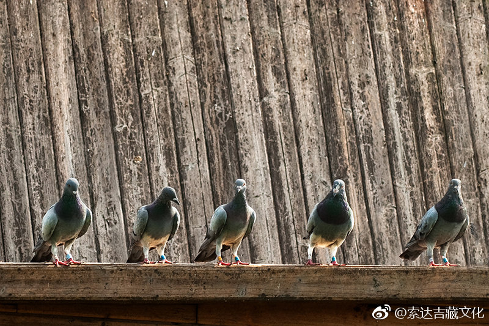
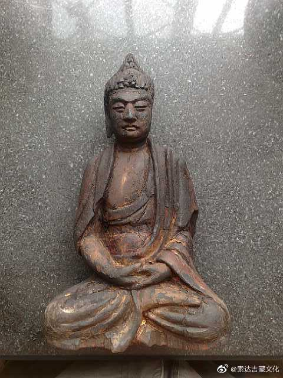
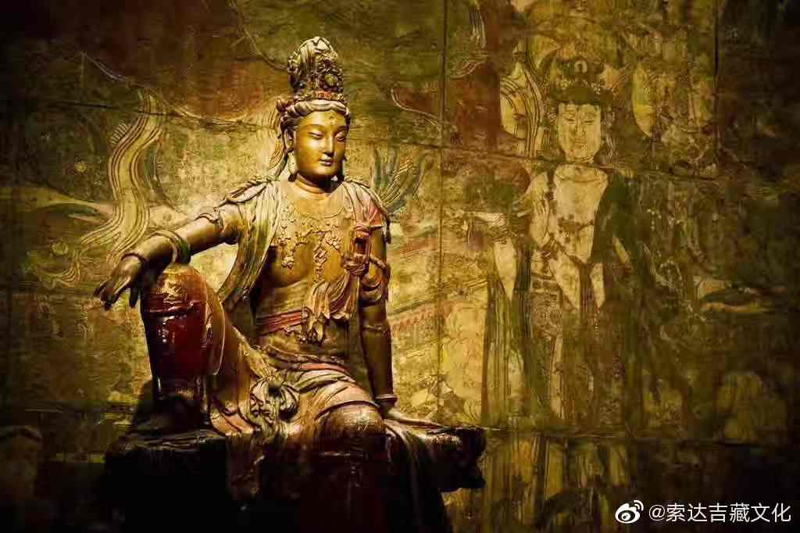

 ## 2019-01-01 05:19
ལུང་དག་ལྡན་ཞེས་པའི་མདོ་འདི་སངས་རྒྱས་ཐུགས་རྗེ་ཅན་གྱིས་ཞལ་ནས་གསུང་པ་ཡིན་ཡང་བོད་ཀྱི་བཀའ་འགྱུར་ནང་འགྱུར་མེད་པས་ད་ལན་བདག་གིས་རྒྱ་ཡིག་ནས་བོད་སྐད་ཐོག་བསྒྱུར་ཏེ་ནང་དོན་འགའ་རེ་རྣམ་པ་ཚོར་འབུལ་རྩིས་ཡིན་པས་དེ་ལུགས་གཟིགས་རོགས།དུས་ཚོད་ལ་ཏིག་ཏིག་མེད།
《杂阿含经》是大悲佛陀亲口所说，在藏文《甘珠尔》里没有。从今年开始，我想把它从汉文翻译成藏文，部分内容准备不定期地与大家分享。

 ## 2019-01-01 05:50
（1）
ལུང་དག་ལྡན་བཞུགས་སོ།།  
༼༡༽འདི་སྐད་བདག་གིས་ཐོས་པ་དུས་གཅིག་ན། བཅོམ་ལྡན་འདས་རྒྱལ་པོའི་ཁབ་རྒྱལ་བུ་རྒྱལ་བྱེད་ཀྱི་ཚལ་མགོན་མེད་ཟས་སྦྱིན་གྱི་ཀུན་དགའ་ར་བ་ན་བཞུགས་སོ།། དེའི་ཚེ་བཅོམ་ལྡན་འདས་ཀྱིས་དགེ་སློང་རྣམས་ལ་བཀའ་སྩལ་པ། དགེ་སློང་དག་འདི་ལྟ་སྟེ། གཟུགས་མི་རྟག་པའོ།། དེ་བཞིན་དུ་བལྟ་བ་ནི་ཡང་དག་པའི་ལྟ་བའོ།། ཡང་དག་པའི་ལྟ་བ་ནི་ངེས་པར་འབྱུང་བའོ།། ངེས་པར་འབྱུང་བ་ནི་དགའ་བ་དང་ཆགས་པ་ཟད་པའོ།། དགའ་བ་དང་ཆགས་པ་ཟད་པ་ནི་སེམས་རྣམ་པར་གྲོལ་བ་ཞེས་བྱའོ།། དེ་བཞིན་དུ་ཚོར་བ་དང་། འདུ་ཤེས་དང་། འདུ་བྱེད་དང་། རྣམ་པར་ཤེས་པ་རྣམས་མི་རྟག་པའོ།། དེ་བཞིན་དུ་བལྟ་བ་ནི་ཡང་དག་པའི་ལྟ་བའོ།། ཡང་དག་པའི་ལྟ་བ་ནི་ངེས་པར་འབྱུང་བའོ།། ངེས་པར་འབྱུང་བ་ནི་དགའ་བ་དང་ཆགས་པ་ཟད་པའོ།། དགའ་བ་དང་ཆགས་པ་ཟད་པ་ནི་སེམས་རྣམ་པར་གྲོལ་བ་ཞེས་བྱའོ།། དགེ་སློང་དག་འདི་ལྟ་སྟེ། དེ་ལྟར་སེམས་རྣམ་པར་གྲོལ་བས་བདག་ཉིད་མངོན་པར་རྟོགས་པར་འདོད་པས་བདག་ཉིད་མངོན་པར་རྟོགས་པར་བྱ་སྟེ། བདག་གི་སྐྱེ་བ་ནི་ཟད། ཚངས་པ་སྤྱོད་པ་ནི་བསྒྲུབས། བྱ་བ་རྣམས་ནི་བྱས་སོ།། བདག་གི་འབྱུང་བར་འགྱུར་བའི་སྐྱེ་བ་མི་ལེན་པ་ཡང་ཤེས་སོ།། མི་རྟག་པ་དེ་བཞིན་དུ་སྡུག་བསྔལ་དང་། སྟོང་པ་དང་། བདག་མེད་པ་རྣམས་ཀྱང་དེ་བཞིན་ནོ།། དེའི་ཚེ་བཅོམ་ལྡན་འདས་ཀྱིས་དེ་སྐད་ཅེས་བཀའ་སྩལ་ནས། དགེ་སློང་དེ་དག་ཡི་རངས་ཏེ། བཅོམ་ལྡན་འདས་ཀྱི་གསུངས་པ་ལ་མངོན་པར་བསྟོད་དོ།།
如是我闻：
一时，佛住舍卫国祇树给孤独园。
尔时，世尊告诸比丘：“当观色无常。如是观者，则为正观；正观者，则生厌离；厌离者，喜、贪尽；喜、贪尽者，说心解脱。
如是观受、想、行、识无常。如是观者，则为正观；正观者，则生厌离；厌离者，喜、贪尽；喜、贪尽者，说心解脱。
如是比丘心解脱者，若欲自证，则能自证：我生已尽、梵行已立、所作已作，自知不受后有。”
如观无常，苦、空、非我，亦复如是。
时，诸比丘闻佛所说，欢喜奉行。

 ## 2019-01-02 17:21
སློབ་དཔོན་ཀླུ་སྒྲུབ་ཀྱི་ལྟུང་བཤགས་འགྲེལ་བ་ལས།།ལྟ་བ་ཐམས་ཅད་སེལ་མཛད་ཅིང་། །ཡང་དག་ལམ་ནི་སྟོན་པ་པོ། །སེང་གེ་ལྟ་བུའི་བདུད་འཇོམས་པའི། །གཽ་ཏམ་དེ་ལ་ཕྱག་འཚལ་ལོ།།ཞེས་གསུངས།
龙猛菩萨《三十五佛忏悔文释》：
悉断一切见，引导正道者，摧魔如狮子，瞿昙尊前礼。

 ## 2019-01-02 23:33
སློབ་དཔོན་ཟླ་བ་གྲགས་པའི་དབུ་མ་ཤེས་རབ་ལ་འཇུག་པ་ལས།གཡེང་བ་ཐམས་ཅད་སྤངས་ནས་ནི།།བསྒྲུབ་པ་ལ་ནི་བརྩོན་པར་བྱ།།བདག་གིས་འདི་བྱས་བསོད་ནམས་ཀྱིས།།སེམས་ཅན་ཐམས་ཅད་གྲོལ་གྱུར་ཅིག།ཅེས་གསུངས།
月称论师《入中观智慧论》：
断除诸散乱，精勤修正法，吾以此福德，愿众生解脱。

 ## 2019-01-03 05:17
མདོ་སྡེ་རྒྱན་ལས།རྟོག་གེས་རྟེན་ཅིང་མ་ངེས་ལ།།མ་ཁྱབ་ཀུན་རྫོབ་སྐྱོ་བ་ཅན།།བྱིས་པ་ལ་ནི་བརྟེན་པར་བརྗོད།།དེ་ཕྱིར་དེ་ཉིད་དེ་ཡུལ་མིན།།ཞེས་གསུངས།
《大乘经庄严论》：
寻思依不定，不遍俗弱者，凡夫许所依，故彼非彼境。

 ## 2019-01-04 05:32
རིགས་དྲུག་ཅུ་པ་ལས།གང་དག་བརྟེན་ནས་དངོས་པོ་རྣམས།།ཆུ་ཡི་ཟླ་བ་ལྟ་བུར་ནི།།ཡང་དག་མ་ཡིན་ལོག་མ་ཡིན།།འདོད་པ་དེ་དག་ལྟས་མི་འཕྲོག།ཅེས་གསུངས།
《六十正理论》：
若有许缘起，诸法如水月，非真非颠倒，彼非见能夺。

 ## 2019-01-05 05:19
མངོན་པ་མཛོདད་ལས།ཕྲ་རྒྱས་སྤང་བ་མ་ཡིན་དང་།།ཡུལ་ནི་ཉེ་བར་གྱུར་བ་དང་།།ཚུལ་བཞིན་མ་ཡིན་ཡིད་བྱེད་ལས།།ཉོན་མོངས་སྐྱེ་བར་འགྱུར་བ་ཡིན།།ཞེས་གསུངས།
《俱舍论》：
尚未断随眠，亲近宜对境，非理作意中，生出诸烦恼。

 ## 2019-01-06 05:09
（2）
༼༼༢༽འདི་སྐད་བདག་གིས་ཐོས་པ་དུས་གཅིག་ན། བཅོམ་ལྡན་འདས་རྒྱལ་པོའི་ཁབ་རྒྱལ་བུ་རྒྱལ་བྱེད་ཀྱི་ཚལ་མགོན་མེད་ཟས་སྦྱིན་གྱི་ཀུན་དགའ་ར་བ་ན་བཞུགས་སོ།། དེའི་ཚེ། བཅོམ་ལྡན་འདས་ཀྱིས་དགེ་སློང་རྣམས་ལ་བཀའ་སྩལ་པ། དགེ་སློང་དག་འདི་ལྟ་སྟེ། གཟུགས་ཡང་དག་པ་ཡིད་ལ་བྱས་ཤིང་། གཟུགས་མི་རྟག་པ་ཇི་ལྟ་བ་བཞིན་བལྟ་བར་བྱའོ།། དེ་ཅིའི་ཕྱིར་ཞེ་ན།  དགེ་སློང་དག་གཟུགས་ཡང་དག་པ་ཡིད་ལ་བྱས་ཤིང་། གཟུགས་མི་རྟག་པ་ཇི་ལྟ་བ་བཞིན་བལྟས་པས་། གཟུགས་ལ་འདོད་པ་ཡོངས་སུ་སྤང་བར་འགྱུར་རོ།། འདོད་པ་རྣམ་པར་སྤངས་བས་སེམས་གྲོལ་བ་ཞེས་བྱའོ།། དེ་བཞིན་དུ། ཚོར་བ་དང་། འདུ་ཤེས་དང་། འདུ་བྱེད་དང་། རྣམ་པར་ཤེས་པ་རྣམས་ཀྱང་དེ་ལྟར་བལྟའོ།རྣམ་པར་ཤེས་པ་ཡང་དག་པ་ཡིད་ལ་བྱས་ཤིང་རྣམ་པར་ཤེས་པ་མི་རྟག་པར་ཤེས་པར་ཡོངས་སུ་བལྟ་བ་བྱའོ།། དེ་ཅིའི་ཕྱིར་ཞེ་ན།  རྣམ་པར་ཤེས་པ་ཡིད་ལ་བྱས་ཤིང་། རྣམ་པར་ཤེས་པ་མི་རྟག་པ་ཇི་ལྟ་བ་བཞིན་བལྟས་པས། རྣམ་པར་ཤེས་པ་ལ་འདོད་པ་ཡོངས་སུ་སྤང་བར་འགྱུར་རོ།། འདོད་པ་རྣམ་པར་སྤངས་བས་སེམས་གྲོལ་བ་ཞེས་བྱའོ།།  དེ་ལྟར་སེམས་རྣམ་པར་གྲོལ་བའི་བདག་ཉིད་མངོན་པར་རྟོགས་པར་འདོད་པས་བདག་ཉིད་མངོན་པར་རྟོགས་པར་བྱ་སྟེ། བདག་གི་སྐྱེ་བ་ནི་ཟད། ཚངས་པ་སྤྱོད་པ་ནི་བསྒྲུབས། བྱ་བ་རྣམས་ནི་བྱས་སོ།། བདག་གིས་འབྱུང་བར་འགྱུར་བའི་སྐྱེ་བ་མི་ལེན་པ་ཡང་ཤེས་སོ།། དེའི་ཚེ་བཅོམ་ལྡན་འདས་ཀྱིས་དེ་སྐད་ཅེས་བཀའ་སྩལ་ནས། དགེ་སློང་དེ་དག་ཡི་རངས་ཏེ། བཅོམ་ལྡན་འདས་ཀྱི་གསུངས་པ་ལ་མངོན་པར་བསྟོད་དོ།།

如是我闻：
一时，佛住舍卫国祇树给孤独园。
尔时，世尊告诸比丘：“于色当正思惟，观色无常如实知。所以者何？比丘于色正思惟、观色无常如实知者，于色欲贪断；欲贪断者，说心解脱。
如是受、想、行、识当正思惟，观识无常如实知。所以者何？于识正思惟、观识无常者，则于识欲贪断；欲贪断者，说心解脱。
如是心解脱者，若欲自证，则能自证则能自证：我生已尽、梵行已立、所作已作，自知不受后有。”
  时，诸比丘闻佛所说，欢喜奉行。

 ## 2019-01-06 05:19
དྲན་པ་ཉེར་བཞག་ལས།ཐོས་པ་མང་དང་ཆོས་འཛིན་དང་།།ཤེས་རབ་ལྡན་ཞིང་ཐར་འདོད་པ།།ཡོན་ཏན་རྣམས་ལ་དགའ་བའི་མི།།དེ་རྣམས་དགའ་ལྡན་ཉེ་བར་འགྲོ།།ཞེས་གསུངས།
《正法念处经》：
多闻知正法，具慧求解脱，欣求功德者，往生兜率刹。

 ## 2019-01-07 05:25
དགོངས་པ་ངེས་པར་འགྲེལ་བ་ལས།འདུ་བྱེད་ཁམས་དང་དོན་དམ་དེ་བཞིན་ཉིད།།གཅིག་དང་ཐ་དད་བྲལ་བའི་མཚན་ཉིད་དེ།།གཅིག་དང་ཐ་དད་ཉིད་དུ་གང་རྟོགས་པ།།དེ་དག་ཚུལ་མིན་ལྟ་ལ་ཞུགས་པ་ཡིན།།ཞེས་གསུངས།
《解深密经》：
胜义世俗谛，远离一异相，分别一异者，此人入邪见。

 ## 2019-01-08 05:30
སློབ་དཔོན་ཀླུ་སྒྲུབ་གྱིས།སྟོང་པ་ཉིད་ཀྱིས་བརྩད་བྱས་ཚེ།།གང་ཞིག་ལན་འདེབས་སྨྲ་བྱེད་པ།།དེ་ཡི་ཐམས་ཅད་ལན་བཏབ་མིན།།བསྒྲུབ་པར་བྱ་དང་མཚུངས་ཕྱིར་རོ།།ཞེས་གསུངས།
龙猛菩萨：
以空辩论时， 若人欲答辩，是则不成答， 俱同所立故。

 ## 2019-01-09 05:00
འཕགས་པ་བྱམས་པ་མགོན་པོས།སྐྱེ་བ་མངོན་པར་སྐྱེ་བ་དང་། དགའ་ལྡན་གནས་ནས་འཕོ་བ་དང་། ལྷུམས་སུ་འཇུག་དང་བལྟམས་པ་དང་། བཟོ་ཡི་གནས་ལ་མཁས་པ་དང་། བཙུན་མོའི་འཁོར་དགྱེས་རོལ་པ་དང་། ངེས་འབྱུང་དཀའ་བ་སྤྱོད་པ་དང་། བྱང་ཆུབ་སྙིང་པོར་གཤེགས་པ་དང་། བདུད་སྡེ་འཇོམས་དང་རྫོགས་པར་ནི། བྱང་ཆུབ་ཆོས་ཀྱི་འཁོར་ལོ་དང་། མྱ་ངན་འདས་པར་གཤེགས་མཛོད་རྣམས། ཡོངས་སུ་མ་དག་ཞིང་རྣམས་སུ། སྲིད་པ་ཇི་སྲིད་གནས་པར་སྟོན། ཞེས་གསུངས་སོ།།
弥勒菩萨：
真实而投生，从兜率天降，入胎及诞生，精通工巧明，嬉享妃眷属，出家与苦行，趋至菩提树，降魔圆正觉，转大妙法轮，示现涅槃相，于诸不净刹，有间示安住。

 ## 2019-01-10 05:16
སྤྱོད་འཇུག་ལས།ཉོན་མོངས་ཤེས་བྱའི་སྒྲིབ་པ་་ཡི།།མུན་པའི་གཉེན་པོ་སྟོང་པ་ཉིད།།མྱུར་དུ་ཐམས་ཅད་མཁྱེན་འདོད་པས།།སྟོང་པ་ཉིད་ནི་ཅིས་མི་བསྒོམ།།ཞེས་གསུངས།
《入行论》
空性能对治，烦恼所知障， 欲速成佛者，何不修空性？

 ## 2019-01-11 05:25
གླ་རུ་ལུང་བསྟན་གྱི་མདོ་ལས།ཇི་སྲིད་དེ་བཞིན་གཤེགས་པའི་གཟུགས་བརྙན་ཕྱོགས་ཕྱོགས་ན་བཞུགས་པ་་དེ་དག་མཆོད་གནས་སུ་བྱེད་པ་དེ་སྲིད་དུ་ཡུལ་འདི་བརླག་པར་མི་འགྱུར་རོ།ཡུལ་འདི་ནས་སྐྱེས་པའི་མིའམ་ཡུལ་གཞན་ནས་སྐྱེས་པའི་མི་ལ་ལ་ཞིག་དེ་བཞིན་གཤེགས་པའི་གཟུགས་རྙན་འདི་དག་ལ་སྙིང་ཐག་པ་ནས་དད་པ་དང་གུས་པ་དང་རབ་ཏུ་དང་བར་བྱེད་ཅིང་།འདི་སྙམ་དུ་དེ་བཞིན་གཤེགས་པའི་གཟུགས་བརྙན་འདི་དག་ནི་ཡུལ་འདི་བསྲུང་བའི་སླད་དུ་གཤེགས་སོ་སྙམ་དུ་ཡང་སེམས་ན།གཟུགས་བརྙན་དེ་དག་ཡང་སངས་རྒྱས་བཞུགས་པ་བཞིན་དུ་དོན་མཛད་པར་འགྱུར་རོ།དེ་ཅིའི་ཕྱིར་ཞེ་ན།གཟུགས་བརྙན་དེ་དག་ང་དང་དུས་གསུམ་དུ་གཏོགས་སངས་རྒྱས་ཐམས་ཅད་ཀྱིས་བྱིན་གྱིས་པའི་ཕྱིར་རོ།ཞེས་གསུངས།
《朗日山大乘授记经》：
若在具足佛像的地方，此地不会受到损害。在当地或其他地方出生的人，若能对佛像真诚产生信心、恭敬心、清净心，并认为佛像亲临此地保护自己，则彼佛像犹如佛陀真实住世一样可以饶益他们。为什么呢？我（释迦牟尼佛）与三世佛对此佛像皆予以加持之故。

 ## 2019-01-12 05:30
（3）
༼ ༼༣༽འདི་སྐད་བདག་གིས་ཐོས་པ་དུས་གཅིག་ན། བཅོམ་ལྡན་འདས་རྒྱལ་པོའི་ཁབ་རྒྱལ་བུ་རྒྱལ་བྱེད་ཀྱི་ཚལ་མགོན་མེད་ཟས་སྦྱིན་གྱི་ཀུན་དགའ་ར་བ་ན་བཞུགས་སོ།། དེའི་ཚེ། བཅོམ་ལྡན་འདས་ཀྱིས་དགེ་སློང་རྣམས་ལ་བཀའ་སྩལ་པ། དགེ་སློང་དག་འདི་ལྟ་སྟེ། གཟུགས་མ་ཤེས་པ་དང་། གཟུགས་མ་རྟོགས་པ་དང་། གཟུགས་མ་སྤངས་བ་དང་། གཟུགས་ལ་འདོད་པ་དང་མ་བྲལ་ན། སྡུག་བསྔལ་གཅོད་པར་མི་ནུས་སོ།། དེ་བཞིན་དུ་ཚོར་བ་དང་། འདུ་ཤེས་དང་། འདུ་བྱེད་དང་། རྣམ་པར་ཤེས་པ་རྣམས་མ་ཤེས་པ་དང་། མ་རྟོགས་པ་དང་། མ་སྤངས་བ་དང་། འདོད་པ་དང་མ་བྲལ་བས།  སྡུག་བསྔལ་སྤོང་བར་མི་ནུས་སོ།། དགེ་སློང་དག་འདི་ལྟ་སྟེ། གཟུགས་ཡོངས་སུ་ཤེས་པ་དང་། གཟུགས་ཡོངས་སུ་རྟོགས་པ་དང་། གཟུགས་ཡོངས་སུ་སྤངས་བ་དང་། གཟུགས་ལ་འདོད་པ་རྣམ་པར་བྲལ་ན། སྡུག་བསྔལ་རྣམས་གཅོད་པར་ནུས་སོ།། དེ་བཞིན་དུ་ཚོར་བ་དང་། འདུ་ཤེས་དང་། འདུ་བྱེད་དང་། རྣམ་པར་ཤེས་པ་རྣམས་ཡོངས་སུ་ཤེས་པ་དང་། ཡོངས་སུ་རྟོགས་པ་དང་། ཡོངས་སུ་སྤངས་བ་དང་། འདོད་པ་དང་བྲལ་བར་གྱུར་ན། སྡུག་བསྔལ་ཐམས་ཅད་ཡོངས་སུ་སྤོང་བར་འགྱུར་རོ།། དེའི་ཚེ་བཅོམ་ལྡན་འདས་ཀྱིས་དེ་སྐད་ཅེས་བཀའ་སྩལ་ནས། དགེ་སློང་དེ་དག་ཡི་རངས་ཏེ། བཅོམ་ལྡན་འདས་ཀྱི་གསུངས་པ་ལ་མངོན་པར་བསྟོད་དོ།།

如是我闻：
一时，佛住舍卫国祇树给孤独园。
尔时，世尊告诸比丘：“于色不知、不明、不断、不离欲，则不能断苦。如是受、想、行、识不知、不明、不断、不离欲，则不能断苦。
诸比丘，于色若知、若明、若断、若离欲，则能断苦。如是受、想、行、识若知、若明、若断、若离欲，则能堪任断苦。”
时，诸比丘闻佛所说，欢喜奉行。

 ## 2019-01-12 05:54
མདོ་སྡེ་ཟ་མ་ཏོག་བཀོད་པ་ལས།རིགས་ཀྱི་བུ།ངས་རྡུལ་ཕྲ་རབ་ཀྱི་ཚད་ནི་བཟུང་བར་ནུས་ཀྱི།རིགས་ཀྱི་བུ།ཡི་གེ་དྲུག་པའི་རིག་པ་ཆེན་མོ་ལན་གཅིག་བཟློས་པའི་བསོད་ནམས་ཀྱི་ཕུང་པོ་ནི་བགྲང་མི་ནུས་སོ།ཞེས་གསུངས།
《大乘庄严宝王经》：
佛告善男子，微尘之数可衡量，诵一遍六字大明咒的福德不可量。

 ## 2019-01-13 05:26
བླ་མ་རིན་པོ་ཆེ་མི་ཕམ་གྱིས།གང་ཤར་ཁྲེགས་ཆོད་ཀྱི་ཤེས་རབ་རལ་གྲི།། ཐད་ཀ་ཁོལ་བྱུང་གི་སེམས་ལ་བཏབ་པས།། དེ་ཡིན་འདི་མིན་གྱི་ངོས་བཟུང་བྲལ་ཙམ།། ངོ་བོ་བསྐྱང་རྒྱུ་དེ་ཨེ་ཡིན་སྙམ་མོ།། ཞེས་གསུངས།
麦彭仁波切：
以显现直断的智慧宝剑，直接斩断涌现的妄念，远离此是彼非的分别，这难道不是所守护的本心吗？

 ## 2019-01-14 05:21
ཞབས་དཀར་པས། རྣམ་རྟོག་སྤྲིན་ཕུང་དྭངས་སུ་གཅུག ། སེམས་ཀྱི་ནམ་མཁར་ཧྲིག་གེར་བལྟ།། ཉམས་ཀྱི་འཇའ་ཚོན་ཅི་ཤར་ཡང་།། དེ་ལ་ཆེད་འཛིན་མེད་པར་བཞག །ཞེས་གསུངས།
夏嘎巴尊者：
散开妄念云，直视心虚空，于觉受彩虹，不执而安住。

 ## 2019-01-15 05:39
ཆོས་རྗེ་དམ་པ་ཡིད་བཞིན་ནོར་བུ་འཇིགས་མེད་ཕུན་ཚོགསཀྱིས།།ཁོ་བོའི་འཕྲིན་འདི་རིས་མེད་བསྟན་འཛིན་གྱི། །སྙན་དུ་ཞུས་ལ་ཐུགས་ཀྱིས་དགོངས་ཞེས་གསོལ། །རྒྱལ་བསྟན་ཉི་མ་ཆུ་ལྷའི་ཕྱོགས་དང་ཉེ། །
སྙིགས་ལྔའི་གྲིབ་མ་ལྷག་པར་བདོ་སྐབས་སུ། །མི་ཆེན་རྒྱལ་པོའི་ལད་མོ་མི་མཛད་པར། །ནང་དུ་མཉམ་པར་འཇོག་པའི་རང་དོན་དང་། །
གཡོ་སྒྱུ་མེད་པའི་གཞན་ཕན་བསམ་སྤྱོད་གཉིས། །ཟུང་དུ་འབྲེལ་བས་བསྟན་ལ་གཅེས་འཛིན་མཛོད།།ཅེས་གསུངས།
法王如意宝晋美彭措:
请于无偏持教大德前，为我捎此口信，祈请予以关注：如今佛法日轮已近西山，五浊的阴影四起之时，不应效仿大人物和君王的行为，而应以内观禅修的自利心行、无谄无曲的利他心行，来护持如来教法。

 ## 2019-01-16 05:08
བླ་མ་ཨོ་རྒྱན་ཆེན་པོས།ད་ལྟའི་ཤེས་རིག་མ་འགགས་སལ་ལེ་བ།།ཀུན་བཟང་གདོད་མའི་མགོན་པོ་དེ་ཀའོ།།ཞེས་གསུངས།
上师莲花生大士：
当下不灭明了之此心，乃为本来怙主普贤王。

 ## 2019-01-17 05:13
མི་ཕམ་རིན་པོ་ཆེས། ཕར་བལྟས་རྒྱང་གི་ཆོས་བརྒྱ་ལས།། ཚུར་བལྟས་སེམས་ཀྱི་ཆོས་གཅིག་ཆོག ། ཕར་ལ་བལྟ་བའི་གཅེས་ཕྲུག་པོ།། དེ་རིང་ཚུར་ལ་བལྟ་བར་རིགས།།ཞེས་གསུངས།
麦彭仁波切：
外观远方诸百法，不如内观一心胜。迷恋外境之顽心，今日理当往内观。

 ## 2019-01-18 09:17
ངེས་ཤེས་རིན་པོ་ཆེ་སྒྲོན་མེ་ལས། དེ་ཚེ་ཐད་ཀའི་ནམ་མཁའ་ལ།། བལྟས་པ་བཞིན་དུ་རང་གི་སེམས།།  འགྱུ་བཞིན་པ་ལ་སྟོང་པ་ཉིད།། ངེས་ཤེས་ཁོ་ཐག་ཆོད་པ་དགོས།། ཞེས་གསུངས།
《定解宝灯论》：
尔时如视前虚空，自心正在动念时，亦为空性之定解，必须深深而生起。

 ## 2019-01-19 05:17
（4）
༼༼༤༽འདི་སྐད་བདག་གིས་ཐོས་པ་དུས་གཅིག་ན། བཅོམ་ལྡན་འདས་རྒྱལ་པོའི་ཁབ་རྒྱལ་བུ་རྒྱལ་བྱེད་ཀྱི་ཚལ་མགོན་མེད་ཟས་སྦྱིན་གྱི་ཀུན་དགའ་ར་བ་ན་བཞུགས་སོ།།  དེའི་ཚེ། བཅོམ་ལྡན་འདས་ཀྱིས་དགེ་སློང་རྣམས་ལ་བཀའ་སྩལ་པ། དགེ་སློང་དག་འདི་ལྟ་སྟེ། གཟུགས་ཡོངས་སུ་མ་ཤེས་པ་དང་། གཟུགས་ཡོངས་སུ་མ་རྟོགས་པ་དང་། གཟུགས་ཡོངས་སུ་མ་སྤངས་བ་དང་། གཟུགས་ལ་འདོད་པ་ཡོངས་སུ་མ་བྲལ་བས། སེམས་རྣམ་པར་གྲོལ་བར་མི་འགྱུར་རོ།། དེ་ལྟར་ན། སྐྱེ་བའི་འཇིགས་པ་དང་། རྒ་བའི་འཇིགས་པ་དང་། ན་བའི་འཇིགས་པ་དང་། འཆི་བའི་འཇིགས་པ་ལས་ཡོངས་སུ་བརྒལ་བར་མི་ནུས་སོ།། དེ་བཞིན་དུ། ཚོར་བ་དང་། འདུ་ཤེས་དང་། འདུ་བྱེད་དང་། རྣམ་པར་ཤེས་པ་རྣམས་ཡོངས་སུ་མ་ཤེས་པ་དང་། ཡོངས་སུ་མ་རྟོགས་པ་དང་། ཡོངས་སུ་མ་སྤངས་བ་དང་། འདོད་པ་ཡོངས་སུ་མ་བྲལ་བས། སེམས་རྣམ་པར་གྲོལ་བར་མི་འགྱུར་རོ།། དེ་ལྟར་ན། སྐྱེ་བའི་འཇིགས་པ་དང་། རྒ་བའི་འཇིགས་པ་དང་། ན་བའི་འཇིགས་པ་དང་། འཆི་བའི་འཇིགས་པ་ལས་ཡོངས་སུ་བརྒལ་བར་མི་ནུས་སོ།། དགེ་སློང་དག་འདི་ལྟ་སྟེ།  གཟུགས་ཡོངས་སུ་ཤེས་པ་དང་། གཟུགས་ཡོངས་སུ་རྟོགས་པ་དང་། གཟུགས་ཡོངས་སུ་སྤངས་བ་དང་། གཟུགས་ལ་འདོད་པ་རྣམ་པར་བྲལ་བས་ན། སེམས་རྣམ་པར་གྲོལ་བར་འགྱུར་རོ།། དེ་ལྟར་ན། སྐྱེ་བའི་འཇིགས་པ་དང་། རྒ་བའི་འཇིགས་པ་དང་། ན་བའི་འཇིགས་པ་དང་། འཆི་བའི་འཇིགས་པ་ལས་ཡོངས་སུ་བརྒལ་བར་འགྱུར་རོ།། དེ་བཞིན་དུ། ཚོར་བ་དང་། འདུ་ཤེས་དང་། འདུ་བྱེད་དང་། རྣམ་པར་ཤེས་པ་རྣམས་ཡོངས་སུ་ཤེས་པ་དང་། ཡོངས་སུ་རྟོགས་པ་དང་། ཡོངས་སུ་སྤངས་བ་དང་། འདོད་པ་ཡོངས་སུ་བྲལ་བར་གྱུར་ན། སེམས་རྣམ་པར་གྲོལ་བར་འགྱུར་རོ།། དེ་ལྟར་ན། སྐྱེ་བའི་འཇིགས་པ་དང་། རྒ་བའི་འཇིགས་པ་དང་། ན་བའི་འཇིགས་པ་དང་། འཆི་བའི་འཇིགས་པ་ལས་ཡོངས་སུ་གྲོལ་བར་འགྱུར་རོ།། དེའི་ཚེ་བཅོམ་ལྡན་འདས་ཀྱིས་དེ་སྐད་ཅེས་བཀའ་སྩལ་ནས། དགེ་སློང་དེ་དག་ཡི་རངས་ཏེ། བཅོམ་ལྡན་འདས་ཀྱི་གསུངས་པ་ལ་མངོན་པར་བསྟོད་དོ།།

如是我闻：
一时，佛住舍卫国祇树给孤独园。
尔时，世尊告诸比丘：“于色不知、不明、不断、不离欲、心不解脱者，则不能越生、老、病、死怖。如是受、想、行、识不知、不明、不断、不离欲贪、心不解脱者，则不能越生、老、病、死怖。
比丘，于色若知、若明、若断、若离欲、心解脱者，则能越生、老、病、死怖。如是受、想、行、识若知、若明、若断、若离欲贪、心解脱者，则能越生、老、病、死怖。”
时，诸比丘闻佛所说，欢喜奉行。

 ## 2019-01-19 05:18
སློབ་དཔོན་འཕགས་པ་ལྷས།མདོར་ན་ཆོས་ནི་མི་འཚེ་བ།།དེ་བཞིན་གཤེགས་པ་རྣམས་ཀྱིས་གསུངས།།སྟོང་ཉིད་མྱང་ངན་འདས་པ་སྟེ།།འདིར་ནི་དེ་གཉིས་འབའ་ཞིག་གོ།ཞེས་གསུངས།
圣天论师： 如来所说法，略言唯二种， 不害生人天，观空证涅槃。

 ## 2019-01-20 05:29
ཡུམ་ལས།མཁའ་ལ་རླུང་བརྟེན་དེ་ལ་ཆུ་ཡི་ཕུང་པོ་བརྟེན།དེ་ལ་ས་ཆེན་འདི་བརྟེན་དེ་ལ་འགྲོ་བ་བརྟེན།ཞེས་གསུངས།
《般若经》：
众生依于地，地依于水，水依于风，风依于虚空。

 ## 2019-01-21 05:15
རྗེ་བཙུན་བྱམས་པ་མགོན་པོ།སེམས་ཀྱི་རང་བཞིན་འོད་གསལ་གང་ཡིན་པ།།དེ་ནི་ནམ་མཁའ་བཞིན་དུ་འགྱུར་བ་མེད།།ཡང་དག་མིན་རྟོག་ལས་བྱུང་འདོད་ཆགས་སོགས།།གློ་བུར་དྲི་མས་དེ་ཉོན་མོངས་མི་འགྱུར།།ཞེས་གསུངས།
至尊弥勒菩萨：
心自性光明，无变如虚空，邪念生贪等，客尘不染彼。

 ## 2019-01-22 05:20
རྒྱུད་བླ་མ་ལས།རྫོགས་སངས་སྐུ་ནི་འཕྲོ་ཕྱིར་དང་།།དེ་བཞིན་ཉིད་དབྱེར་མེད་ཕྱིར་དང་།།རིགས་ཡོད་ཕྱིར་ན་ལུས་ཅན་ཀུན།།རྟག་ཏུ་སངས་རྒྱས་སྙིང་པ་ོ་ཅན།།ཞེས་གསུངས།
《宝性论》：
佛身普现故，真如无别故，具种故众生，恒具如来藏。

 ## 2019-01-23 05:28
བསླབ་བཏུས་ལས།དུས་ངན་དེ་ཚེ་བདག་ཅག་རྣམས།།སེམས་ཅན་དག་ལ་ཕན་སླད་དུ།།ལུས་དང་སྲོག་ཀྱང་རབ་བཏང་སྟེ།།དམ་པའི་ཆོས་ནི་གཟུང་བར་བགྱི།།ཞེས་གསུངས།
《大乘集菩萨学论》：
当来恶世时，宁丧于身命，护持正法故，作众生利益。

 ## 2019-01-24 05:38
ཟླ་བ་སྒྲོན་མའི་མདོ་ལས། བསྐལ་པ་བྱེ་བ་གང་གཱའི་བྱེ་སྙེད་དུ། །སངས་རྒྱས་དག་ནི་བྱེ་བ་ཁྲག་ཁྲིག་ལ། །གདུགས་དང་བ་དན་མར་མེའི་ཕྲེང་བ་དང་། །ཟས་དང་སྐོམ་གྱིས་དད་སེམས་མཆོད་བྱས་པས། །གང་གིས་དམ་པའི་ཆོས་འདི་འཇིག་པའི་ཚེ། །བདེ་བར་གཤེགས་པའི་བསྟན་པ་འགག་པ་ན། །ཉིན་ཞག་དུས་ནི་བསླབ་པ་གཅིག་བཟུང་བ། །དེ་བས་བསོད་ནམས་འདི་ནི་ཁྱད་པར་འཕགས། །ཞེས་གསུངས།
《月灯三昧经》：
若于河沙多亿劫，供养百亿那由佛，清净信心施肴膳，亦施灯鬘及幡盖。若于正法衰末世，如是佛法欲灭时，于一日夜学是行，比前福报胜于彼。

 ## 2019-01-25 05:33
སོ་སོར་ཐར་བའི་མདོ་ལས། །བསྐལ་པ་བྱེ་བ་རྣམས་སུ་ཡང་། །སོ་སོར་ཐར་པ་ཐོས་པ་དང་། །གཟུང་དང་འཛིན་པ་རྙེད་དཀའ་སྟེ། །སྒྲུབ་པར་བྱེད་པ་ཤིན་ཏུ་དཀོན།ཞེས་གསུངས།
《别解脱戒经》：
若于俱胝劫，听闻并受持，讽诵及修行，戒律极难得。

 ## 2019-01-26 05:22
（5）
༼༼༥༽འདི་སྐད་བདག་གིས་ཐོས་པ་དུས་གཅིག་ན། བཅོམ་ལྡན་འདས་རྒྱལ་པོའི་ཁབ་རྒྱལ་བུ་རྒྱལ་བྱེད་ཀྱི་ཚལ་མགོན་མེད་ཟས་སྦྱིན་གྱི་ཀུན་དགའ་ར་བ་ན་བཞུགས་སོ།།  དེའི་ཚེ། བཅོམ་ལྡན་འདས་ཀྱིས་དགེ་སློང་རྣམས་ལ་བཀའ་སྩལ་པ། དགེ་སློང་དག་འདི་ལྟ་སྟེ། གཟུགས་ཡོངས་སུ་མ་ཤེས་པ་དང་། གཟུགས་ཡོངས་སུ་མ་རྟོགས་པ་དང་། འདོད་པ་ཡོངས་སུ་མ་བྲལ་བ་དང་། སེམས་ཡོངས་སུ་མ་གྲོལ་བས། སྡུག་བསྔལ་ཡོངས་སུ་སྤོང་བར་མི་ནུས་སོ།། དེ་བཞིན་དུ་ཚོར་བ་དང་། འདུ་ཤེས་དང་། འདུ་བྱེད་དང་། རྣམ་པར་ཤེས་པ་རྣམས་ཡོངས་སུ་མ་ཤེས་པ་དང་། ཡོངས་སུ་མ་རྟོགས་པ་དང་། འདོད་པ་ཡོངས་སུ་མ་སྤངས་བ་དང་། སེམས་ཡོངས་སུ་མ་གྲོལ་བས། སྡུག་བསྔལ་ཡོངས་སུ་སྤོང་བར་མི་ནུས་སོ།། དེ་ལྟར་ན། གཟུགས་ཡོངས་སུ་ཤེས་པ་དང་། གཟུགས་ཡོངས་སུ་རྟོགས་པ་དང་། འདོད་པ་ཡོངས་སུ་སྤངས་བ་དང་། སེམས་ཡོངས་སུ་གྲོལ་བས། སྡུག་བསྔལ་ཡོངས་སུ་སྤོང་བར་ནུས་སོ།། དེ་བཞིན་དུ་ཚོར་བ་དང་། འདུ་ཤེས་དང་། འདུ་བྱེད་དང་། རྣམ་པར་ཤེས་པ་རྣམས་ཡོངས་སུ་ཤེས་པ་དང་། ཡོངས་སུ་རྟོགས་པ་དང་། འདོད་པ་ཡོངས་སུ་སྤངས་བ་དང་། སེམས་ཡོངས་སུ་གྲོལ་བས། སྡུག་བསྔལ་ཡོངས་སུ་སྤོང་བར་ནུས་སོ།། དེའི་ཚེ་བཅོམ་ལྡན་འདས་ཀྱིས་དེ་སྐད་ཅེས་བཀའ་བསྩལ་ནས། དགེ་སློང་དེ་དག་ཡི་རངས་ཏེ། བཅོམ་ལྡན་འདས་ཀྱི་གསུངས་པ་ལ་མངོན་པར་བསྟོད་དོ།།

如是我闻：
一时，佛住舍卫国祇树给孤独园。
尔时，世尊告诸比丘：“于色不知、不明、不离欲贪、心不解脱者，则不能断苦。如是受、想、行、识不知、不明、不离欲贪、心不解脱者，则不能断苦。
于色若知、若明、若离欲贪，心解脱者，则能断苦。如是受、想、行、识若知、若明、若离欲贪、心解脱者，则能断苦。”
时，诸比丘闻佛所说，欢喜奉行。

 ## 2019-01-26 05:29
ཚིག་གསལ་དུ་དྲངས་བའི་མདོ་ལས།སྲིད་གསུམ་རྨི་ལམ་དང་འདྲ་སྙིང་པོ་མེད།།མྱུར་དུ་འཇིག་ཅིང་མི་རྟག་སྒྱུ་མ་བཞིན།།འོང་བ་མེད་ཅིང་འདི་ནས་འགྲོ་བའང་མེད།།རྒྱུན་རྣམས་རྟག་ཏུ་སྟོང་ཞིང་མཚན་མ་མེད།།ཅེས་གསུངས།
《显句论》所引用之佛经：
三有如梦无实质，速灭无常如幻术，无来亦无由此去，相续常空无相状。

 ## 2019-01-27 05:24
མགོན་པོ་ཀླུ་སྒྲུབ་ཀྱིས།གང་ལ་སྟོང་བ་ཉིད་རུང་བ།།དེ་ལ་ཐམས་ཅད་རུང་བར་འགྱུར།།གང་ལ་སྟོང་ཉིད་མི་རུང་བ།།དེ་ལ་ཐམས་ཅད་རུང་མི་འགྱུར།།ཞེས་གསུངས།
龙猛菩萨：
以有空义故， 一切法得成；若无空义者， 一切则不成。

 ## 2019-01-28 05:05
སློབ་དཔོན་ཕྱོགས་ཀྱི་གླང་པོས། ཚད་མར་གྱུར་པ་འགྲོ་ལ་ཕན་བཞེད་པ། །སྟོན་པ་བདེ་གཤེགས་སྐྱོབ་ལ་ཕྱག་འཚལ་ནས། །ཚད་མ་བསྒྲུབ་ཕྱིར་རང་གི་གཞུང་ཀུན་ལས། །བཏུས་ཏེ་སྣ་ཚོགས་འཐོར་རྣམས་འདིར་གཅིག་བྱ། །ཞེས་གསུངས།
陈那论师：
敬礼定量欲利生，大师善逝救护者，为成量故从自论，集诸散说汇为一。

 ## 2019-01-29 05:00
རྒྱུད་བླ་མ་ལས།རང་བྱུང་རྣམས་ཀྱི་དོན་དམ་དེ།། དད་པ་ཉིད་ཀྱིས་རྟོགས་བྱ་ཡིན།།  ཉི་མའི་དཀྱིལ་འཁོར་འོད་འབར་བ།། མིག་མེད་པས་ནི་མཐོང་བ་མེད།། ཅེས་གསུངས།
《宝性论》：
自然之胜义，是以信所证，日轮璀璨光，无目不得见。

 ## 2019-01-30 05:07
སློབ་དཔོན་འཕགས་པ་ལྷས། སངས་རྒྱས་ཀྱིས་གསུངས་ལྐོག་གྱུར་ལ། །གང་ཞིག་ཐེ་ཚོམ་སྐྱེ་འགྱུར་བ། །དེ་ཡིས་སྟོང་པ་ཉིད་བརྟེན་ཏེ། །འདི་ཉིད་ཁོ་ནར་ཡིད་ཆེས་བྱ། །ཞེས་གསུངས།
圣天论师：
若于佛所说，深事以生疑，可依无相空，而生决定信。

 ## 2019-01-31 05:13
འཕགས་པ་བྱམས་པ་མགོན་པོས།རྣམ་དབྱེ་བཅས་པའི་མཚན་ཉིད་ཅན།། གློ་བུར་དག་གིས་ཁམས་སྟོང་གི །  རྣམ་དབྱེ་མེད་པའི་མཚན་ཉིད་ཅན།།  བླ་མེད་ཆོས་ཀྱི་སྟོང་མ་ཡིན།། ཞེས་གསུངས།
弥勒菩萨：
具有别法相，界性客尘空，具无别法相，无上法不空。

 ## 2019-02-01 04:43
ཕལ་པོ་ཆེ་ལས། རྒྱལ་བ་དེ་དག་ཐོས་མཐོང་མཆོད་པ་བྱས་པས་ཀྱང་། །ཚད་མེད་པ་ཡི་བསོད་ནམས་ཕུང་པོ་འཕེལ་བར་འགྱུར། །ཉོན་མོངས་འཁོར་བའི་སྡུག་བསྔལ་ཐམས་ཅད་སྤངས་གྱུར་དུ། །འདུས་བྱས་འདི་ནང་བར་མ་དོར་ནི་ཟད་མི་འགྱུར། །ཞེས་གསུངས།
《华严经》：
见闻供养诸如来，彼增无量福德聚，断除烦恼轮回苦，成熟彼果不唐捐。

 ## 2019-02-02 04:57
（6）
༦ འདི་སྐད་བདག་གིས་ཐོས་པ་དུས་གཅིག་ན། བཅོམ་ལྡན་འདས་རྒྱལ་པོའི་ཁབ་རྒྱལ་བུ་རྒྱལ་བྱེད་ཀྱི་ཚལ་མགོན་མེད་ཟས་སྦྱིན་གྱི་ཀུན་དགའ་ར་བ་ན་བཞུགས་སོ།། དེའི་ཚེ། བཅོམ་ལྡན་འདས་ཀྱིས་དགེ་སློང་རྣམས་ལ་བཀའ་སྩལ་པ། དགེ་སློང་དག་འདི་ལྟ་སྟེ། གཟུགས་ཡོངས་སུ་མ་ཤེས་པ་དང་། གཟུགས་ཡོངས་སུ་མ་རྟོགས་པ་དང་། འདོད་པ་ཡོངས་སུ་མ་སྤངས་བ་དང་། སེམས་ཡོངས་སུ་མ་གྲོལ་བས། སྐྱེ་བའི་འཇིགས་པ་དང་། རྒ་བའི་འཇིགས་པ་དང་། ན་བའི་འཇིགས་པ་དང་། འཆི་བའི་འཇིགས་པ་ལས་ཡོངས་སུ་བརྒལ་བར་མི་ནུས་སོ།། དེ་བཞིན་དུ་ཚོར་བ་དང་། འདུ་ཤེས་དང་། འདུ་བྱེད་དང་། རྣམ་པར་ཤེས་པ་རྣམས་ཡོངས་སུ་མ་ཤེས་པ་དང་། ཡོངས་སུ་མ་རྟོགས་པ་དང་། འདོད་པ་ཡོངས་སུ་མ་སྤངས་བ་དང་། སེམས་ཡོངས་སུ་མ་བྲལ་བས། སྐྱེ་བའི་འཇིགས་པ་དང་། རྒ་བའི་འཇིགས་པ་དང་། ན་བའི་འཇིགས་པ་དང་། འཆི་བའི་འཇིགས་པ་ལས་ཡོངས་སུ་བརྒལ་བར་མི་ནུས་སོ།། དགེ་སློང་དག་འདི་ལྟ་སྟེ། གཟུགས་ཡོངས་སུ་ཤེས་པ་དང་། ཡོངས་སུ་རྟོགས་པ་དང་། འདོད་པ་ཡོངས་སུ་སྤངས་བ་དང་། སེམས་ཡོངས་སུ་བྲལ་བས། སྐྱེ་བའི་འཇིགས་པ་དང་། རྒ་བའི་འཇིགས་པ་དང་།  ན་བའི་འཇིགས་པ་དང་། འཆི་བའི་འཇིགས་པ་ལས་ཡོངས་སུ་བརྒལ་བར་མི་ནུས་སོ།། དེ་བཞིན་དུ་ཚོར་བ་དང་། འདུ་ཤེས་དང་། འདུ་བྱེད་དང་། རྣམ་པར་ཤེས་པ་རྣམས་ཡོངས་སུ་ཤེས་པ་དང་། ཡོངས་སུ་རྟོགས་པ་དང་། འདོད་པ་ཡོངས་སུ་སྤངས་བ་དང་། སེམས་ཡོངས་སུ་གྲོལ་བས། སྐྱེ་བའི་འཇིགས་པ་དང་། རྒ་བའི་འཇིགས་པ་དང་། ན་བའི་འཇིགས་པ་དང་། འཆི་བའི་འཇིགས་པ་ལས་ཡོངས་སུ་བརྒལ་བར་ནུས་སོ།། དེའི་ཚེ་བཅོམ་ལྡན་འདས་ཀྱིས་དེ་སྐད་ཅེས་བཀའ་སྩལ་ནས། དགེ་སློང་དེ་དག་ཡི་རངས་ཏེ་བཅོམ་ལྡན་འདས་ཀྱི་གསུངས་པ་ལ་མངོན་པར་བསྟོད་དོ།།

如是我闻：
一时，佛住舍卫国祇树给孤独园。
尔时，世尊告诸比丘：“于色不知、不明、不离欲贪、心不解脱者，则不能越生、老、病、死怖。如是受、想、行、识不知、不明、不离欲贪、心不解脱者，则不能越生、老、病、死怖。
诸比丘，于色若知、若明、若离欲贪、心解脱者，则能越生、老、病、死怖。如是受、想、行、识若知、若明、若离欲贪、心解脱者，则能越生、老、病、死怖。”
时，诸比丘闻佛所说，欢喜奉行。

 ## 2019-02-02 05:28
མདོ་ལས།ཆོས་རྣམས་ཐམས་ཅད་རྐྱེན་བཞིན་ཏེ། །འདུན་པའི་རྩེ་ལ་རབ་ཏུ་གནས། ། གང་གིས་སྨོན་ལམ་ཅི་བཏབ་པ། །དེ་འདྲའི་འབྲས་བུ་འཐོབ་པར་འགྱུར། །ཞེས་གསུངས།
佛经：
诸法依缘生，住于意乐上，何者发何愿，将获如是果。

 ## 2019-02-03 05:16
ཀུན་མཁྱེན་མི་ཕམ་རྒྱ་མཚོས།མདོར་ན་ཞིང་དེར་སྐྱེས་པའི་ཡོན་ཏན་དང་། སྐྱེ་ནུས་པའི་ཚུལ་ཤེས་ནས་ཉིན་མཚན་ཀུན་ཏུ་དད་བརྩོན་རྒྱུན་ཆགས་པ་ཅི་ནུས་སུ་བསྐྱེད་ཅིང་། དགེ་རྩ་ཐམས་ཅད་ཞིང་དེར་སྐྱེ་བའི་ཕྱིར་བསྔོ་བ་ལ་འབད་པར་བྱའོ། །དེ་ལྟར་བྱས་ན་རབ་ཀྱིས་ཚེ་འདིར་འདྲེན་པ་འོད་དཔག་མེད་དངོས་སུ་མཐོང་ཞིང་ལུང་བསྟན་ནས་ཞིང་ཁམས་དེར་སྐྱེ་བའི་གདེངས་ཐོབ་པ་དང་། འབྲིང་གིས་ཉམས་ཀྱི་ཚུལ་དུ་བྱིན་གྱི་རླབས་ཐོབ་པ་དང་། ཐ་མའང་རྨི་ལམ་དུ་ཞིང་དང་སྟོན་པའི་རྣམ་པ་རྨིས་པ་དག་ནི་རྟགས་ཡིན་ཏེ། འདུན་པའི་སྟོབས་ཀྱིས་རྨི་ལམ་ན་སྣང་བའང་ཇི་ལྟར་དམན་ཀྱང་བག་ཆགས་ཐེབ་པ་ཙམ་མིན་པ་མི་སྲིད་པས་འདུན་པའི་བག་ཆགས་ཆུང་ངུ་དེས་ཀྱང་ཞིང་དུ་སྐྱེ་ནུས་ཏེ་སངས་རྒྱས་ཀྱི་སྨོན་ལམ་གྱི་མཐུ་ལས་ཡིན་ནོ། །གལ་ཏེ་རྟགས་ཀྱི་རྣམ་པ་གསལ་པོ་མེད་ཀྱང་། ཚེ་འདིར་དད་འདུན་ཡང་ཡང་བསྐྱེད་པ་ལྟ་ཅི་སྨྲོས། འཆི་ཁ་མའི་རྣ་ལམ་དུ་སངས་རྒྱས་ཀྱི་མཚན་ཐོས་སུ་གཞུག་ཅིང་ཞིང་དེར་འདུན་པ་བསྐྱེད་ན་ཡང་སྐྱེ་བར་འགྱུར་ཏེ། འཆི་ཁའི་འདུ་ཤེས་གང་གསལ་བ་ཤིན་ཏུ་སྟོབས་དང་ལྡན་ཅིང་སངས་རྒྱས་འདིའི་སྨོན་ལམ་ཁྱད་པར་འཕགས་པའི་ཕྱིར་རོ། །བར་དོར་སངས་རྒྱས་ཀྱི་མཚན་དྲན་པས་ཀྱང་ འཕྲལ་དུ་ཞིང་དེར་སྐྱེ་བའི་རྒྱུ་བྱེད་དེ། བར་དོའི་གནས་སྐབས་བསྒྱུར་སླ་ཞིང་། སངས་རྒྱས་ཀྱི་སྨོན་ལམ་ཤིན་ཏུ་སྟོབས་ཆེ་བའི་ཕྱིར་རོ། །དེས་ན་འདི་དང་འཆི་ཁ་དང་བར་དོའི་ཉམས་ལེན་གྱི་གནད་འདི་ལྟ་བུ་ལ་བྱེད་པ་གལ་ཆེའོ། །དེས་ན་གང་དག་བློ་ལྡན་སྐལ་བ་བཟང་པོ་རྣམས་ཀྱིས་བདེ་བར་གཤེགས་པའི་བཀའ་འདི་ལྟ་བུ་ལ་བརྟེན་ནས། ཚེགས་ཆུང་ངུའི་སྒོ་ནས་བྱང་ཆུབ་སེམས་དཔའི་ཡོན་ཏན་རྨད་དུ་བྱུང་བ་དང་རྒྱུད་ལ་བདེ་བླག་ཏུ་འདྲེན་པའི་ཐབས་དམ་པ་འདི་ལ་རྣལ་འབྱོར་དུ་བྱ་བར་རིགས་སོ།ཞེས་གསུངས།
全知麦彭仁波切：
总而言之，首先了知往生的功德和能够往生的道理后，日夜不断生起信心、发起精进并将一切善根回向往生极乐世界，若能如是行持，上等者今生便能亲见导师阿弥陀佛并得授记，获得往生极乐世界的把握；中等者出现获得加持的验相；下等者也可梦见极乐世界和阿弥陀佛的形象，这些都是往生极乐世界的征兆，因为依靠意乐力，在梦中显现，至少也必定种下了习气的种子，以细微的意乐习气，也能往生，这是佛陀的誓愿力所致。
即便是没有获得如此明显的验相，然而不用说今生再三生起信心与意乐会往生，甚至让临终者耳边听到阿弥陀佛名号，并对极乐世界生起向往之心也能往生，因为临死时的神识具有极强之力，再加上阿弥陀佛的殊胜愿力。在中阴界忆念佛号也能作为立即往生彼刹的因，这是由于在中阴界时神识容易转变，并且阿弥陀佛的誓愿力量极其强大。由此可见，今生、临终、中阴的这些修法要诀极为关键。
因此，一切具有智慧的善缘者依靠这样的如来圣教，自相续不费艰辛、轻轻松松便能获得菩萨的殊胜奇妙功德，理应修学如此殊胜的方便法。

 ## 2019-02-04 05:30
ཙོང་ཁ་པའི་གསང་འདུས་དམར་ཁྲིད་དུ་དྲངས་བའི་རིམ་ལྔ་ལས།འདི་ནི་རང་བྱུང་བཅོམ་ལྡན་འདས།།ལྷག་པའི་ལྷ་ནི་གཅིག་པུ་ཉིད།།མན་ངག་རབ་ཏུ་སྟེར་བའི་ཕྱིར།།རྡོ་རྗེ་སློབ་དཔོན་དེ་བས་ལྷག།ཅེས་གསུངས།
《密集金刚密修法》所引用之《五次第论》：
此佛出有坏，乃唯一本尊，金刚师胜彼，赐予窍诀故。

 ## 2019-02-05 05:21
སོ་སོར་ཐར་བའི་མདོ་ལས།འཇུག་ངོགས་བདེ་བའི་ཆུ་ཀླུང་བདེ། །ཆོས་ལ་གོམས་པའི་སྐྱེ་བོ་བདེ། །ཤེས་རབ་ཐོབ་པར་གྱུར་པ་བདེ། །ངའོ་ང་རྒྱལ་ཟད་པ་བདེ། །ཞེསགསུངས།
《别解脱经》：
渠道顺则水流畅，修佛法则心快乐，获智慧则心快乐，灭我慢则心快乐。

 ## 2019-02-06 04:47
ཆོས་རྗེ་འཇིགས་མེད་ཕུན་ཚོགས་ཀྱིས།ཆོས་དང་སྲིད་ཀྱི་ཡོན་ཏན་མཐའ་དག་གི །སྙིང་པོ་མཐར་ཐུག་བསམ་པ་བཟང་པོ་ཡིན། །
འདི་མེད་ཡོན་ཏན་གཞན་ལ་རེ་ཐག་ཆད། །འདི་ཉིད་ཁོ་ན་ཐུགས་ཀྱི་རྒྱན་དུ་ཆོངས།ཞེས་གསུངས།
法王晋美彭措：
世间与出世间的一切功德，其根本就是心地善良。若没有它，其他功德则无法得到。所以，应把“善良”二字铭记于心。

 ## 2019-02-07 05:33
དགས་པོ་རིན་པོ་ཆེས།བླ་མ་ལ་ཡུན་རིང་དུ་བསྟེན་པ་གཅིག་དགོས་ཏེ།་དེ་ཡང་བླ་མ་དང་གཡག་འགྲོགས་བྱས་པས་མི་ཆོག །ལུས་ངག་ཡིད་གསུམ་གྱི་སྤྱོད་ལམ་མ་དག་པ་ཐམས་ཅད་སྤངས་ནས་ལུས་ངག་ཡིད་གསུམ་གུས་པའི་སྒོ་ནས་བསྟེན་ནོ།    ཞེས་གསུངས།
达波仁波切：
必须长期依止上师，不能像牦牛之间的交往一样。要断除不清净的身口意，三门恭敬地进行依止。

 ## 2019-02-08 05:27
ཆོས་རྗེ་འཇིགས་མེད་ཕུན་ཚོགས་ཀྱིས།སྐྱོ་བར་མ་བྱེད་འདུས་མཐའ་བྲལ་བ་འདི།།འདུས་བྱས་རང་མཚན་ཡིན་པས་བཅོས་སུ་མེད།།ནམ་ཞིག་སྐྱེ་མཐའ་འཆི་བའང་འོང་ངེས་པས།།བག་མེད་སྤོང་ལ་དམ་པའི་ལྷ་ཆོས་སྒྲུབས།།ཞེས་གསུངས།
法王晋美彭措：
聚际必散莫悲伤，万法自性不可改，生际必死定降临，断除放逸修正法。

 ## 2019-02-09 05:11
སློབ་དཔོན་ཟླ་བ་གྲགས་པས།སོ་སོ་སྐྱེ་བོའི་དུས་ནའང་སྟོང་པ་ཉིད་ཐོས་ནས། །ནང་དུ་རབ་ཏུ་དགའ་བ་ཡང་དང་ཡང་དུ་འབྱུང་། །རབ་ཏུ་དགའ་བ་ལས་བྱུང་མཆི་མས་མིག་བརླན་ཞིང་། །ལུས་ཀྱི་བ་སྤུ་ལྡང་བར་འགྱུར་བ་གང་ཡིན་པ། །དེ་ལ་རྫོགས་པའི་སངས་རྒྱས་བློ་ཡི་ས་བོན་ཡོད། །ཅེས་གསུངས།
月称论师：
若异生位闻空性，内心数数发欢喜，由喜引生泪流注，周身毛孔自动竖。

 ## 2019-02-09 05:25
（7）
༧ འདི་སྐད་བདག་གིས་ཐོས་པ་དུས་གཅིག་ན། བཅོམ་ལྡན་འདས་རྒྱལ་པོའི་ཁབ་རྒྱལ་བུ་རྒྱལ་བྱེད་ཀྱི་ཚལ་མགོན་མེད་ཟས་སྦྱིན་གྱི་ཀུན་དགའ་ར་བ་ན་བཞུགས་སོ།། དེའི་ཚེ་བཅོམ་ལྡན་འདས་ཀྱིས་དགེ་སློང་རྣམས་ལ་བཀའ་སྩལ་པ། དགེ་སློང་དག་འདི་ལྟ་སྟེ། གཟུགས་ལ་དགའ་ཞིང་ཆགས་པས། སྡུག་བསྔལ་ལ་དགའ་ཞིང་ཆགས་པར་འགྱུར་རོ།། སྡུག་བསྔལ་ལ་དགའ་ཞིང་ཆགས་པས། སྡུག་བསྔལ་ལས་ཐར་བར་མི་འགྱུར་རོ།། དེ་བཞིན་དུ་ཚོར་བ་དང་། འདུ་ཤེས་དང་། འདུ་བྱེད་དང་། རྣམ་པར་ཤེས་པ་རྣམས་ལ་དགའ་ཞིང་ཆགས་པས། སྡུག་བསྔལ་ལ་དགའ་ཞིང་ཆགས་པར་འགྱུར་རོ།། སྡུག་བསྔལ་ལ་དགའ་ཞིང་ཆགས་པས། སྡུག་བསྔལ་ལས་ཐར་བར་མི་འགྱུར་རོ།། དགེ་སློང་དག་འདི་ལྟ་སྟེ། གཟུགས་ལ་མི་དགའ་ཞིང་མ་ཆགས་པས། སྡུག་བསྔལ་ལ་མི་དགའ་ཞིང་མ་ཆགས་པར་འགྱུར་རོ།། སྡུག་བསྔལ་ལ་མི་དགའ་ཞིང་མ་ཆགས་པས། སྡུག་བསྔལ་ལས་ཐར་བར་འགྱུར་རོ།། དེ་བཞིན་དུ་ཚོར་བ་དང་། འདུ་ཤེས་དང་། འདུ་བྱེད་དང་། རྣམ་པར་ཤེས་པ་རྣམས་ལ་མི་དགའ་ཞིང་མ་ཆགས་པས། སྡུག་བསྔལ་ལ་མི་དགའ་ཞིང་མ་ཆགས་པར་འགྱུར་རོ།། སྡུག་བསྔལ་ལ་མི་དགའ་ཞིང་མ་ཆགས་པས། སྡུག་བསྔལ་ལས་ཐར་བར་འགྱུར་རོ།། དེའི་ཚེ་བཅོམ་ལྡན་འདས་ཀྱིས་དེ་སྐད་ཅེས་བཀའ་སྩལ་ནས། དགེ་སློང་དེ་དག་ཡི་རངས་ཏེ། བཅོམ་ལྡན་འདས་ཀྱི་གསུངས་པ་ལ་མངོན་པར་བསྟོད་དོ།།
མི་རྟག་སྡུག་བསྔལ་སྟོང་བདག་མེད།།
ཡང་དག་ཡིད་ལ་བྱས་པ་ཡིན།།
མ་ཤེས་ལ་སོགས་བཞི་པོ་དང་།།
གཟུགས་ལ་དགའ་ཞིང་ཆགས་པའོ།།
如是我闻：
一时，佛住舍卫国祇树给孤独园。
尔时，世尊告诸比丘：“于色爱喜者，则于苦爱喜；于苦爱喜者，则于苦不得解脱。如是受、想、行、识爱喜者，则爱喜苦；爱喜苦者，则于苦不得解脱。
诸比丘，于色不爱喜者，则不喜于苦；不喜于苦者，则于苦得解脱。如是受、想、行、识不爱喜者，则不喜于苦；不喜于苦者，则于苦得解脱。”
  时，诸比丘闻佛所说，欢喜奉行。

无常及苦空，非我正思惟，
无知等四种，及于色喜乐。

 ## 2019-02-10 05:08
ཆོས་རྗེ་འཇིགས་མེད་ཕུན་ཚོགས་ཀྱིས།གཞན་གྱི་རྫས་ལ་བརྣབ་སེམས་ཆེ་བ་དང་།ཡུན་དུ་འགྲོགས་ན་དགའ་སྡུག་གྲངས་མང་བ།ཐ་ཆད་སྐྱེ་བོ་མས་ཀྱང་འདོར་ངེས་པས།།ངང་བཟང་ཕྱི་ཐག་རིང་བའི་ཚུལ་ལ་སློབས།།ཞེས་གསུངས།
法王晋美彭措：
若过于贪爱他人财物，与之交往时，动辄喜怒无常，对这样的恶人，纵然是母亲也会舍弃，所以要学会善良、宽容、情意绵长。

 ## 2019-02-10 05:12
ཆོས་རྗེ་འཇིགས་མེད་ཕུན་ཚོགས་ཀྱིས།གཞན་གྱི་རྫས་ལ་བརྣབ་སེམས་ཆེ་བ་དང་།ཡུན་དུ་འགྲོགས་ན་དགའ་སྡུག་གྲངས་མང་བ།ཐ་ཆད་སྐྱེ་བོ་མས་ཀྱང་འདོར་ངེས་པས།།ངང་བཟང་ཕྱི་ཐག་རིང་བའི་ཚུལ་ལ་སློབས།།ཞེས་གསུངས།
法王晋美彭措：
若过于贪爱他人财物，与之交往时动辄喜怒无常，对这样的恶人，纵然是母亲也会舍弃他，所以要学会善良、宽容、情意绵长。

 ## 2019-02-11 05:08
སློབ་དཔོན་དཔའ་བོས།མི་བཟད་འཆི་བའི་བདག་པོ་ལ། །རབ་ཏུ་མྱོས་པའི་སྐྱེ་བོ་འདི། །ནགས་ན་གསོད་སྲེད་སེང་གེ་ཡི། །མདུན་ན་རི་དགས་གནས་པ་བཞིན། །ཞེས་གསུངས།
马鸣菩萨：
万分恐怖死神前，极其迷惑诸众生，如遇林中嗜杀狮，野兽自命不久矣。

 ## 2019-02-12 05:18
མི་རྟག་པའི་དོན་གྱི་གཏམ་ལས།གང་ཕྱིར་འདུས་བྱས་ཐམས་ཅད་ནི། །རྐྱེན་གྱིས་གཞན་དུ་འགྱུར་བ་སྟེ། །རྩྭ་རྩེ་རླུང་གིས་བསྐྱོད་པ་ཡི། །ཟིལ་པ་བཞིན་དུ་མི་རྟག་གོ། །ཞེས་གསུངས།
《无常义语》：
一切有为法，依缘皆无常，犹如风吹动，草尖之露珠。

 ## 2019-02-13 05:15
སློབ་དཔོན་དབྱིག་གཉེན་གྱི་ཚིགས་སུ་བཅད་པའི་བསྟན་བཅོས་ལས།སྐྱེས་བུ་ཁྱུ་མཆོག་ཁྱོད་འདྲའི་དགེ་སྦྱོང་ཆེན་པོ་གཞན་དག་ལྷ་ཡུལ་ས་ལ་མེད། །འཇིག་རྟེན་འདི་ནའང་ཡོད་པ་མ་ཡིན་རྣམ་ཐོས་བུ་ཡི་གནས་ནའང་ཡོད་མ་ཡིན། །ལྷ་ཡི་ཕོ་བྲང་གནས་མཆོག་དག་ནའང་མེད་ལ་ཕྱོགས་སམ་ཕྱོགས་མཚམས་དག་ནའང་མེད། །རི་དང་ནགས་སུ་བཅས་པའི་ས་སྟེང་རྒྱས་པ་ཀུན་དུ་བསྐོར་ཡང་ག་ལ་ཡོད།།ཅེས་གསུངས།
世亲论师《偈颂论》：
天地此界多闻室，释宫天处十方无，丈夫牛王大沙门，寻地山林遍无等。

 ## 2019-02-14 05:19
སློབ་དཔོན་རྟ་དབྱངས་ཀྱི་མྱ་ངན་བསལ་བ་ལས།སའམ་ཅི་སྟེ་མཐོ་རིས་ན། །སྐྱེས་ནས་ལ་ལ་མ་ཤི་བ། །འགའ་ཞིག་ཁྱོད་ཀྱིས་མ་མཐོང་བ། །ཐོས་སམ་འོན་ཏེ་ཐེ་ཚོམ་ཟ། །ཞེས་གསུངས
马鸣菩萨《解忧书》：
地上或天间，有生然不死，此事汝岂见，岂闻或生疑？

 ## 2019-02-15 05:04
དབུ་མ་འཇུག་པ་ལས།གལ་ཏེ་ཁྱོད་ལ་འཇིག་རྟེན་མི་གནོད་ན། །འཇིག་རྟེན་ཉིད་ལྟོས་འདི་ནི་དགག་པར་གྱིས། །  ཁྱོད་དང་འཇིག་རྟེན་འདིར་ནི་རྩོད་གྱིས་དང་། །ཕྱི་ནས་སྟོབས་ལྡན་བདག་གིས་བརྟེན་པར་བྱ། །ཞེས་གསུངས།
《入中论》：
若世于汝无妨害 ，当待世间而破此，汝可先于世间诤， 后有力者我当依。

 ## 2019-02-16 05:02
（8）
༨ འདི་སྐད་བདག་གིས་ཐོས་པ་དུས་གཅིག་ན། བཅོམ་ལྡན་འདས་རྒྱལ་པོའི་ཁབ་རྒྱལ་བུ་རྒྱལ་བྱེད་ཀྱི་ཚལ་མགོན་མེད་ཟས་སྦྱིན་གྱི་ཀུན་དགའ་ར་བ་ན་བཞུགས་སོ།། དེའི་ཚེ་བཅོམ་ལྡན་འདས་ཀྱིས་དགེ་སློང་རྣམས་ལ་བཀའ་སྩལ་པ། དགེ་སློང་དག་འདི་ལྟ་སྟེ།  འདས་པའི་གཟུགས་མི་རྟག་པ་དང་། མ་འོངས་པའི་གཟུགས་མི་རྟག་པར་གྱུར་ན། ད་ལྟའི་གཟུགས་མི་རྟག་པར་སྨོས་མ་དགོས་སོ།། ཉན་ཐོས་ཀྱི་སློབ་བུ་རྣམས་ཀྱིས་འདི་ལྟར་བལྟ་བར་བྱ་སྟེ། འདས་པའི་གཟུགས་ལ་མ་ཆགས་པ་དང་། མ་འོངས་པའི་གཟུགས་ལ་མི་དགའ་བས། ད་ལྟའི་གཟུགས་ལ་ངེས་པར་འབྱུང་བ་དང་། འདོད་པ་དང་བྲལ་བ་དང་། འགོག་པ་ལ་མངོན་པར་ཕྱོགས་པར་འགྱུར་རོ།།  དེ་བཞིན་དུ་འདས་པ་དང་། མ་འོངས་པའི་ཚོར་བ་དང་། འདུ་ཤེས་དང་།  འདུ་བྱེད་དང་། རྣམ་པར་ཤེས་པ་རྣམས་མི་རྟག་པར་གྱུར་ན། ད་ལྟ་བའི་རྣམ་པར་ཤེས་པ་སྨོས་མ་དགོས་སོ།། ཉན་ཐོས་ཀྱི་སློབ་བུ་རྣམས་ཀྱིས་འདི་ལྟར་བལྟ་བར་བྱ་སྟེ།  འདས་པའི་རྣམ་པར་ཤེས་པ་ལ་མ་ཆགས་པ་དང་། མ་འོངས་པའི་རྣམ་པར་ཤེས་པ་ལ་མི་དགའ་བར་གྱུར་ན། ད་ལྟའི་རྣམ་པར་ཤེས་པ་ལ་ངེས་པར་འབྱུང་བ་དང་། འདོད་པ་དང་བྲལ་བ་དང་། འགོག་པ་ལ་མངོན་པར་ཕྱོགས་པར་འགྱུར་རོ།།  མི་རྟག་པ་ཇི་བཞིན་དུ། སྡུག་བསྔལ་དང་། སྟོང་པ་དང་། བདག་མེད་པ་རྣམས་ཀྱང་དེ་བཞིན་ནོ།། དེའི་ཚེ་བཅོམ་ལྡན་འདས་ཀྱིས་དེ་སྐད་ཅེས་བཀའ་སྩལ་ནས། དགེ་སློང་དེ་དག་ཡི་རངས་ཏེ། བཅོམ་ལྡན་འདས་ཀྱི་གསུངས་པ་ལ་མངོན་པར་བསྟོད་དོ།།
如是我闻：
一时，佛住舍卫国祇树给孤独园。
尔时，世尊告诸比丘：“过去、未来色无常，况现在色！圣弟子如是观者，不顾过去色，不欣未来色，于现在色厌、离欲、正向灭尽。
如是过去、未来受、想、行、识无常，况现在识！圣弟子如是观者，不顾过去识，不欣未来识，于现在识厌、离欲、正向灭尽。”
如无常，苦、空、非我亦复如是。
时诸比丘闻佛所说，欢喜奉行。

 ## 2019-02-16 05:10
སློབ་དཔོན་དབྱིག་གཉེན་གྱིས །ཀྱེ་མ་འདུས་བྱས་རྣམས་མི་རྟག །སྐྱེ་ཞིང་འཇིག་པའི་ཆོས་ཅན་ཡིན། །སྐྱེས་ནས་འཇིག་པར་འགྱུར་བ་སྟེ། །དེ་དག་ཉེ་བར་ཞི་བ་བདེ།།ཞེས་གསུངས།
世亲论师：
呜呼有为法，无常生灭性，生后即灭尽，寂灭则安乐。

 ## 2019-02-17 05:02
དཔའ་སྤྲུལ་རིན་པོ་ཆེས།ཚོགས་པའི་བྱིན་རླབས་མེ་དཔུང་འདྲ།།གང་ཟག་བྱིན་རླབས་མེ་སྟག་འདྲ།།ཞེས་གསུངས།
华智仁波切：
众会加持如烈焰，个人加持如火星。

 ## 2019-02-18 04:56
སློབ་དཔོན་དབྱིག་གཉེན་གྱིས།ཐོས་པས་ཆོས་ནི་བྱེ་བྲག་ཤེས། །ཐོས་པས་སྡིག་ལས་ལྡོག་པར་བྱེད། །ཐོས་པས་དོན་མ་ཡིན་པ་སྤོང་། །ཐོས་པས་མྱ་ངན་འདས་པ་ཐོབ།།ཅེས་གསུངས།
世亲论师：
以闻知诸法，以闻遮罪恶，以闻断无意，以闻得涅槃。

 ## 2019-02-19 05:25
རྒྱ་གར་སློབ་དཔོན་དགའ་བའི་དབང་པོས།སྐྱེ་དགུ་འདི་དག་སྐྱེ་ན་གཅིག་པུ་སྟེ། །དེ་བཞིན་འཆི་ནའང་གཅིག་པུ་འཆི་བར་འགྱུར། །འདི་ནི་གཅིག་པུས་སྡུག་བསྔལ་མྱོང་འགྱུར་གྱི། །འཁོར་བ་ན་ནི་གྲོགས་ཡོད་མ་ཡིན་ནོ།།ཞེས་གསུངས།
印度的欢喜自在论师：
众生独自生，亦是独自死，独自受痛苦，轮回无友伴。

 ## 2019-02-20 05:35
ཡུམ་བར་མ་ལས།  གཟུགས་སྟོང་ཞེས་བྱ་བར་སྤྱོད་ན་མཚན་མ་ལ་སྤྱོད་དོ། །གཟུགས་མི་སྟོང་ཞེས་བྱ་བར་སྤྱོད་ན་མཚན་མ་ལ་སྤྱོད་དོ། །ཞེས་གསུངས།
《中般若经》：
若说色空而行，则为执相。若说色不空而行，亦为执相。

 ## 2019-02-21 05:23
རྒྱུད་བླའི་འགྲེལ་བ་ལེགས་བཤད་ཉི་མའི་འོད་ཟེར་དུ་དྲངས་བའི་ལུང་ལས།གང་གི་རང་བཞིན་ཆགས་སྡང་རྣམ་བྲལ་ཡང་།།ཆགས་སེམས་ཅན་ལ་ཆགས་པ་ལྟར་སྟོན་དང་།།གདུལ་བྱའི་དབང་གིས་ཁྲོ་ལ་ཁྲོར་སྟོན་པ།།བྱང་ཆུབ་མཆོག་གནས་དེ་ལ་ཕྱག་འཚལ་ལོ།།ཞེས་གསུངས།
《宝性论释·日光疏》：
其自性虽无贪嗔，贪心者前现似贪，因所化嗔示现嗔，住大菩提佛前礼。

 ## 2019-02-22 09:23
ཇོ་ནང་ཏཱ་ར་ནཱ་ཐའི་ཞལ་ནས།རྙེད་དཀའི་མི་ལུས་ཐོབ་པ་ལ། །སྡུག་བསྔལ་གྱི་འཁོར་ལོ་མ་སྐོར་ཅིག །ནམ་ཞིག་ནམ་འཆི་ཆ་མེད་པས། །དགེ་བ་ལ་འཕྲལ་དུ་འབད་པ་ཞུ། །ཞེས་གསུངས།
觉囊多罗那他：
难得人身时，勿以苦度日，不知何时死，立即行善法。

 ## 2019-02-23 05:10
（9）
༩ འདི་སྐད་བདག་གིས་ཐོས་པ་དུས་གཅིག་ན། བཅོམ་ལྡན་འདས་རྒྱལ་པོའི་ཁབ་རྒྱལ་བུ་རྒྱལ་བྱེད་ཀྱི་ཚལ་མགོན་མེད་ཟས་སྦྱིན་གྱི་ཀུན་དགའ་ར་བ་ན་བཞུགས་སོ།། དེའི་ཚེ་བཅོམ་ལྡན་འདས་ཀྱིས་དགེ་སློང་རྣམས་ལ་བཀའ་སྩལ་པ། དགེ་སློང་དག་འདི་ལྟ་སྟེ། གཟུགས་མི་རྟག་པའོ།། མི་རྟག་པ་ནི་སྡུག་བསྔལ་ལོ།། སྡུག་བསྔལ་ནི་བདག་མེད་པའོ།། བདག་མེད་པ་ནི་བདག་གི་བ་མེད་པའོ།། དེ་བཞིན་དུ་བལྟ་བ་ནི་ཡང་དག་པའི་ལྟ་བའོ།། དེ་བཞིན་དུ་ཚོར་བ་དང་། འདུ་ཤེས་དང་། འདུ་བྱེད་དང་། རྣམ་པར་ཤེས་པ་རྣམས་མི་རྟག་པའོ།། མི་རྟག་པ་ནི་སྡུག་བསྔལ་ལོ།། སྡུག་བསྔལ་ནི་བདག་མེད་པའོ།། བདག་མེད་པ་ནི་བདག་གི་བ་མེད་པའོ།། དེ་བཞིན་དུ་བལྟ་བ་ནི་ཡང་དག་པའི་ལྟ་བའོ།། ཉན་ཐོས་ཀྱི་སློབ་བུ་རྣམས་ཀྱིས་འདི་ལྟར་བལྟ་བར་བྱ་སྟེ། གཟུགས་ལ་ངེས་པར་འབྱུང་བར་བྱའོ།། དེ་བཞིན་དུ་ཚོར་བ་དང་། འདུ་ཤེས་དང་། འདུ་བྱེད་དང་། རྣམ་པར་ཤེས་པ་རྣམས་ལ་ངེས་པར་འབྱུང་བར་བྱའོ།། ངེས་པར་འབྱུང་བས་མི་དགའ་བར་འགྱུར་རོ།། མི་དགའ་བས་རྣམ་པར་གྲོལ་བར་འགྱུར་རོ།། རྣམ་པར་གྲོལ་བས་ཡང་དག་པའི་ཡེ་ཤེས་སྐྱེས་སོ།། བདག་གི་སྐྱེ་བ་ནི་ཟད། ཚངས་པར་སྤྱོད་པ་ནི་བསྒྲུབས། བྱ་བ་རྣམས་ནི་བྱས་སོ།། བདག་གི་འབྱུང་བར་འགྱུར་བའི་སྐྱེ་བ་མི་ལེན་པ་ཡང་ཤེས་སོ།།
དེའི་ཚེ་བཅོམ་ལྡན་འདས་ཀྱིས་དེ་སྐད་ཅེས་བཀའ་སྩལ་ནས། དགེ་སློང་དེ་དག་ཡི་རངས་ཏེ། བཅོམ་ལྡན་འདས་ཀྱི་གསུངས་པ་ལ་མངོན་པར་བསྟོད་དོ།།
如是我闻：
一时，佛住舍卫国祇树给孤独园。
尔时，世尊告诸比丘：“色无常，无常即苦，苦即非我，非我者亦非我所。如是观者，名真实正观。
如是受、想、行、识无常，无常即苦，苦即非我，非我亦非我所。如是观者，名真实正观。
圣弟子如是观者，厌于色，厌受、想、行、识。厌故不乐，不乐故得解脱。解脱者真实智生。我生已尽，梵行已立，所作已作，自知不受后有。”
时，诸比丘闻佛所说，欢喜奉行。

 ## 2019-02-23 05:24
ས་སྐྱ་བསོད་ནམས་སེང་གེས།ཀྱེ་མ་ཀྱི་ཧུད་སྙིགས་དུས་སེམས་ཅན་རྣམས། །རྒྱ་བོད་མཁས་གྲུབ་རྣམས་ཀྱིས་མགྲིན་གཅིག་ཏུ། །བཀྲལ་བའི་ལམ་བཟང་གསེར་རྒྱན་དོར་ནས་ནི། །རང་བཟོའི་མགལ་དུམ་རྒྱན་དུ་བྱེད་པ་མཚར། །ཞེས་གསུངས།
萨迦索朗桑格：
呜呼浊世诸众生，舍弃了“金项链”般印藏智者共同赞叹的妙道，而把“灰烬”般自己所造的的东西拿来装饰，实在遗憾！

 ## 2019-02-24 05:12
རྒྱུད་བླ་མ་ལས།ངེས་པར་འབྱིན་པ་ས་བཅུ་སྟེ།།ཚོགས་གཉིས་དག་ནི་དེ་ཡི་རྒྱུ།།དེ་འབྲས་བྱང་ཆུབ་མཆོག་ཡིན་ཏེ།།བྱང་ཆུབ་སེམས་ཅན་ཡོངས་སུ་འཛིན།།ཞེས་གསུངས།
《宝性论》：
出离即十地，二资是彼因，彼果胜菩提，菩提摄众生。

 ## 2019-02-25 05:16
མགོན་པོ་བྱམས་པ།ཐེག་པ་མཆོག་ལ་དང་བ་དང་། བར་མ་དང་ནི་སྡང་བ་ཡི།། ཕུང་པོ་གསུམ་ནི་མི་དག་དང་།། རྨ་བྱ་དང་ནི་ཡི་དྭགས་འདྲ།། ཞེས་གསུངས།
弥勒菩萨：
于胜乘净信，中等与嗔群，三种如众人，孔雀与饿鬼。

 ## 2019-02-26 05:30
ནཱ་རོ་པཎ་ཆེན་གྱིས། བྱང་ཕྱོགས་མུན་པའི་སྨག་རུམ་ན།། གངས་ལ་ཉི་མ་ཤར་འདྲ་བ།། ཐོས་པ་དགའ་ཞེས་བྱ་བ་ཡི།། སྐྱེས་བུ་དེ་ལ་ཕྱག་འཚལ་ལོ།།
大班智达那若巴：
北方黑暗处，如日照雪山，名为闻喜者，顶礼彼尊者。

 ## 2019-02-27 05:21
སློབ་དཔོན་ཀ་མ་ལ་ཤཱི་ལའི་དད་སྐྱེས་སྒྲོན་མེ་ལས།གཞོན་ཚེ་དམ་པའི་ཆོས་ལ་མ་འབད་ན། །རྒས་ནས་ཉན་འདོད་རྣ་བས་སྒྲ་མི་ཐོས། །ཤེས་རབ་བྱིང་བས་བློ་ལ་རྟོགས་པ་དཀའ། །ཆོས་ལ་འགྲོ་འདོད་ལུས་ལ་ནུས་པ་མེད། །ཅེས་གསུངས
莲花戒论师《起信之灯》：
年轻若不修正法，老时以耳不得闻，智慧愚钝难悟道，欲去求法身无力。

 ## 2019-02-28 05:15
རྒྱུད་བླ་མ་ལས།ཇི་ལྟར་བཻ་ཌཱུར་ས་གཞི་གཙང་མ་ལ།། ལྷ་དབང་ལུས་ཀྱི་གཟུགས་བརྙན་སྣང་བ་ལྟར།།དེ་བཞིན་འགྲོ་སེམས་ས་གཞི་གཙང་མ་ལ།། ཐུབ་པའི་དབང་པོའི་སྐུ་ཡི་གཟུགས་བརྙན་འཆར།།ཞེས་གསུངས།
《宝性论》：
如净琉璃地，现天王身影，众生净心地，映现佛身影。

 ## 2019-03-01 05:17
།ཇོ་ནང་ཏཱ་ར་ནཱ་ཐས།ཕྱག་དང་སྐོར་བ་ལ་སོགས་པ། །ལུས་ཀྱི་དགེ་བ་ཅི་འགྲུབ་བྱ། །མི་ལུས་ཐོབ་པ་ལ་མདོ་དོན་ཡོད་པ་ཡིན། ། མདོ་འདོན་གསོལ་འདེབས་སྔགས་བཟླས་སོགས། །ངག་གི་དགེ་བ་ཅི་ནུས་བྱ། །ངག་ནུས་པ་རྙེད་པའི་ཕན་ཡོན་ཡོད། །ལྷ་སྒོམ་དང་དད་པ་ཡི་རང་སོགས། །ཡིད་ཀྱི་དགེ་བ་ལ་འབད་པར་བྱ། །སེམས་ཏིང་འཛིན་ལ་རང་བྱང་ཆུབ་ནས་འོང༌། །ཞེས་གསུངས།
觉囊多罗那他：
顶礼转绕等，尽力行身善，得人身有益；念经咒祈祷，尽力行语善，语力得利益；见修信随喜，尽力行意善，心定自然悟。

 ## 2019-03-02 05:26
（10）
༡༠ འདི་སྐད་བདག་གིས་ཐོས་པ་དུས་གཅིག་ན། བཅོམ་ལྡན་འདས་རྒྱལ་པོའི་ཁབ་རྒྱལ་བུ་རྒྱལ་བྱེད་ཀྱི་ཚལ་མགོན་མེད་ཟས་སྦྱིན་གྱི་ཀུན་དགའ་ར་བ་ན་བཞུགས་སོ། དེའི་ཚེ་བཅོམ་ལྡན་འདས་ཀྱིས་དགེ་སློང་རྣམས་ལ་བཀའ་སྩལ་པ། དགེ་སློང་དག་འདི་ལྟ་སྟེ། གཟུགས་མི་རྟག་པའོ།། མི་རྟག་པ་ནི་སྡུག་བསྔལ་ལོ། སྡུག་བསྔལ་ནི་བདག་མེད་པའོ། བདག་མེད་པ་ནི་བདག་གི་བ་མེད་པའོ། དེ་བཞིན་དུ་བལྟ་བ་ནི་ཡང་དག་པའི་ལྟ་བའོ། དེ་བཞིན་དུ་ཚོར་བ་དང་། འདུ་ཤེས་དང་། འདུ་བྱེད་དང་། རྣམ་པར་ཤེས་པ་རྣམས་མི་རྟག་པའོ། མི་རྟག་པ་ནི་སྡུག་བསྔལ་ལོ། སྡུག་བསྔལ་ནི་བདག་མེད་པའོ། བདག་མེད་པ་ནི་བདག་གི་བ་མེད་པའོ།དེ་བཞིན་དུ་བལྟ་བ་ནི་ཡང་དག་པའི་ལྟ་བའོ། ཉན་ཐོས་ཀྱི་སློབ་བུ་རྣམས་ཀྱིས་འདི་ལྟར་བལྟ་བར་བྱ་སྟེ། གཟུགས་རྣམ་པར་གྲོལ་བས། ཚོར་བ་དང་། འདུ་ཤེས་དང་། འདུ་བྱེད་དང་། རྣམ་པར་ཤེས་པ་རྣམས་གྲོལ་བར་འགྱུར་རོ། དེ་བཞིན་དུ་སྐྱེ་བ་དང་། རྒ་བ་དང་། ན་བ་དང་། འཆི་བ་དང་།  གདུང་བ་དང་། སྐྱོ་བ་དང་། སྡུག་བསྔལ་བ་དང་། ཉོན་མོངས་པ་རྣམས་ཀྱང་གྲོལ་བར་འགྱུར་རོ་ཞེས་བདག་གིས་སྨྲའོ།།་ཚེ་བཅོམ་ལྡན་འདས་ཀྱིས་དེ་སྐད་ཅེས་བཀའ་སྩལ་ནས། དགེ་སློང་དེ་དག་ཡི་རངས་ཏེ། བཅོམ་ལྡན་འདས་ཀྱི་གསུངས་པ་ལ་མངོན་པར་བསྟོད་དོ།།

如是我闻：
一时，佛住舍卫国祇树给孤独园。
尔时，世尊告诸比丘：“色无常，无常即苦，苦即非我，非我者即非我所。如是观者，名真实正观。
如是受、想、行、识无常，无常即苦，苦即非我，非我即非我所。如是观者，名真实正观。
圣弟子如是观者，于色解脱，于受、想、行、识解脱。我说是等解脱于生老病死、忧悲苦恼。”
时，诸比丘闻佛所说，欢喜奉行。

 ## 2019-03-02 05:37
སློབ་དཔོན་ཀ་མ་ལ་ཤཱི་ལའི་དད་སྐྱེས་སྒྲོན་མེ་ལས།བདེ་སྐྱིད་འདོད་དང་སྡུག་བསྔལ་སྤོང་འདོད་དང་། །རིགས་མཐོ་བཞིན་ལེགས་བདེ་བའི་གནས་ཐོབ་དང་། །བདེ་མཐོང་མོས་ཤིང་སྡུག་བསྔལ་སྤོང་འདོད་པས། །དམ་ཆོས་འདི་ནི་རྟག་ཏུ་སྤྱད་པར་བྱ། །ཞེས་གསུངས།
莲花戒论师《起信之灯》：
欲断忧恼求快乐，高贵美貌胜权位，希求快乐离苦者，恒常行持此正法。

 ## 2019-03-03 05:26
མགོན་པོ་བྱམས་པས།གང་ཕྱིར་གདུལ་བྱ་དག་པ་ཡི།། ཆུ་ཡི་སྣོད་ནི་ཐམས་ཅད་ལ།། བདེ་གཤེགས་ཉི་མའི་གཟུགས་བརྙན་ནི།། དཔག་ཏུ་མེད་པ་ཅིག་ཅར་འཆར།། ཞེས་གསུངས།
弥勒菩萨：
是于诸清净，所化水器中，善逝之日影，顿时现无量。

 ## 2019-03-04 05:21
པཎ་ཆེན་སད་ཛ་ཏས།བུ་ཁྱོད་ང་ལ་མཆོད་འདོད་ན། །གདམས་པ་བཞིན་དུ་རྗེས་སུ་སྒྲུབས། །ཞེས་གསུངས།
大班智达善匝达：
弟子，若欲供养我，依教而修行。

 ## 2019-03-05 05:08
མཁས་པ་དཱི་པཾ་ཀ་ར་ཤྲཱི་ཛྙཱ་ནས།མི་སྙན་ཚིག་རྣམས་ཐོས་པའི་ཚེ། །བྲག་ཅ་ལྟ་བུར་མཁྱེན་པར་མཛོད། །ལུས་ལ་གནོད་པ་བྱུང་བའི་ཚེ། །སྔོན་གྱི་ལས་སུ་བལྟ་བར་བྱ། །ཞེས་གསུངས།
智者德帮呷绕西尔嘉纳：
若闻不悦声，当知空谷音，身现患难时，当视宿世业。

 ## 2019-03-07 05:40
དྲི་མ་མེད་པ་རིན་པོ་ཆེའི་སྤྲིངས་ཡིག་ལས།གང་དུ་དགེ་བའི་བཤེས་གནས་པ། །དེར་ནི་རྟག་ཏུ་གནས་པར་བྱ། །བླ་མ་རྟག་ཏུ་བསྟེན་པ་དང་། །རྟག་ཏུ་མདོ་སྡེ་བལྟ་བར་བྱ།།ཞེས་གསུངས།
《无垢珍宝书》：
上师居何处，恒常住彼处，恒常依上师，恒常阅经典。

 ## 2019-03-08 05:19
ཇོ་ནང་ཏཱ་ར་ན་ཐཱས།རང་བཞིན་གདོད་ནས་སྤྲོས་བྲལ་ལ། །དེ་ལྟར་ཡིན་པར་ངོ་ཤེས་པའི། །ཐབས་ཀྱི་རྒྱལ་པོ་ཟླ་མེད་པ། །མཚན་ལྡན་བླ་མའི་མོས་གུས་ཡིན། །ཞེས་གསུངས།
觉囊多罗那他：
自性本离戏，如是而了悟，唯胜方便法，乃敬信上师。

 ## 2019-03-09 04:57
（11）
༡༡ འདི་སྐད་བདག་གིས་ཐོས་པ་དུས་གཅིག་ན། བཅོམ་ལྡན་འདས་རྒྱལ་པོའི་ཁབ་རྒྱལ་བུ་རྒྱལ་བྱེད་ཀྱི་ཚལ་མགོན་མེད་ཟས་སྦྱིན་གྱི་ཀུན་དགའ་ར་བ་ན་བཞུགས་སོ། དེའི་ཚེ་བཅོམ་ལྡན་འདས་ཀྱིས་དགེ་སློང་རྣམས་ལ་བཀའ་སྩལ་པ། དགེ་སློང་དག་འདི་ལྟ་སྟེ། གཟུགས་མི་རྟག་པ་སྟེ། གཟུགས་རྣམས་རྒྱུ་དང་རྐྱེན་ལས་སྐྱེས་པས་དེ་ཡང་མི་རྟག་པའོ། མི་རྟག་པའི་རྒྱུ་དང་མི་རྟག་པའི་རྐྱེན་ལས་སྐྱེས་པའི་གཟུགས་རྣམས་ཅིའི་ཕྱིར་ན་རྟག་པར་འགྱུར་ཏེ་མི་འགྱུར་རོ། དེ་བཞིན་དུ་ཚོར་བ་དང་། འདུ་ཤེས་དང་། འདུ་བྱེད་དང་། རྣམ་པར་ཤེས་པ་རྣམས་ཀྱང་མི་རྟག་པའོ།། མི་རྟག་པའི་རྒྱུ་དང་མི་རྟག་པའི་རྐྱེན་ལས་སྐྱེས་པའི་རྣམ་པར་ཤེས་པ་རྣམས་ཅིའི་ཕྱིར་ན་རྟག་པར་འགྱུར་ཏེ་མི་འགྱུར་རོ། དགེ་སློང་དག ། གཟུགས་མི་རྟག་པ་དེ་བཞིན་དུ། ཚོར་བ་དང་། འདུ་ཤེས་དང་། འདུ་བྱེད་དང་། རྣམ་པར་ཤེས་པ་རྣམས་ཀྱང་མི་རྟག་པའོ། མི་རྟག་པ་ནི་སྡུག་བསྔལ་ལོ། སྡུག་བསྔལ་ནི་བདག་མེད་པའོ། བདག་མེད་པ་ནི་བདག་གི་བ་མེད་པའོ། ཉན་ཐོས་ཀྱི་སློབ་བུ་རྣམས་ཀྱིས་འདི་ལྟར་བལྟ་བར་བྱ་སྟེ། གཟུགས་ལ་ངེས་པར་འབྱུང་བ་དང་། དེ་བཞིན་དུ་ཚོར་བ་དང་། འདུ་ཤེས་དང་། འདུ་བྱེད་དང་། རྣམ་པར་ཤེས་པ་རྣམས་ལ་ངེས་པར་འབྱུང་བར་བྱའོ། ངེས་པར་འབྱུང་བས། དགའ་བར་མི་འགྱུར་རོ། མི་དགའ་བས། རྣམ་པར་གྲོལ་བར་འགྱུར་རོ། རྣམ་པར་གྲོལ་བས། འདི་ལྟར་མངོན་པར་རྟོགས་པར་བྱ་སྟེ། བདག་གི་སྐྱེ་བ་ནི་ཟད། ཚངས་པར་སྤྱོད་པ་ནི་བསྒྲུབས། བྱ་བ་རྣམས་ནི་བྱས་སོ། བདག་གི་འབྱུང་བར་འགྱུར་བའི་སྐྱེ་བ་མི་ལེན་པ་ཡང་ཤེས་སོ། དེའི་ཚེ་བཅོམ་ལྡན་འདས་ཀྱིས་དེ་སྐད་ཅེས་བཀའ་སྩལ་ནས། དགེ་སློང་དེ་དག་ཡི་རངས་ཏེ། བཅོམ་ལྡན་འདས་ཀྱི་གསུངས་པ་ལ་མངོན་པར་བསྟོད་དོ།།如是我闻：
一时，佛住舍卫国祇树给孤独园。
尔时，世尊告诸比丘：“色无常，若因、若缘生诸色者，彼亦无常——无常因、无常缘所生诸色，云何有常？
如是受、想、行、识无常，若因、若缘生诸识者，彼亦无常——无常因、无常缘所生诸识，云何有常？
如是，诸比丘，色无常，受、想、行、识无常。无常者则是苦，苦者则非我，非我者则非我所。
圣弟子如是观者，厌于色，厌于受、想、行、识。厌者不乐，不乐则解脱，解脱知见：我生已尽，梵行已立，所作已作，自知不受后有。”
时，诸比丘闻佛所说，欢喜奉行。

 ## 2019-03-09 05:13
སྟོན་པ་ཐུགས་རྗེ་ཅན་གྱིས།འཇིག་རྟེན་ང་དང་ལྷན་ཅིག་རྩོད་ཀྱི།  ང་ནི་འཇིག་རྟེན་དང་ལྷན་ཅིག་མི་རྩོད་དེ།  གང་འཇིག་རྟེན་ན་ཡོད་པར་འདོད་པ་དེ་ནི་ངས་ཀྱང་ཡོད་པར་བཞེད་དོ། །གང་འཇིག་རྟེན་ན་མེད་པར་འདོད་པ་དེ་ནི་ང་ཡང་མེད་པར་བཞེད་དོ། །ཞེས་གསུངས།
大悲佛陀：
世间与我诤，我不与世诤。世间说有，我承许有；世间说无，我承许无。

 ## 2019-03-10 05:15
ཀུན་མཁྱེན་མི་ཕམ་པས།བསྟན་བཅོས་རྣམས་ལ་མ་བྱང་ན།  །བློ་གྲོས་ཆུང་ངུའི་ཤེས་པ་ཡིས།  །བླང་དོར་རྒྱ་ཆེན་མི་འབྱེད་པས།  །བཀའ་དང་དགོངས་འགྲེལ་བལྟ་བར་བྱ།།ཞེས་གསུངས།
全知麦彭巴：
若未精通诸论义，仅以浅薄之智慧，不能广辨取舍处，故当先阅经论疏。

 ## 2019-03-12 05:22
ཆོས་རྗེ་འཇིགས་མེད་ཕུན་ཚོགས་ཀྱིས།ཁྱབ་བདག་འཇམ་པའི་རྡོ་རྗེར།།གསོལ་བ་སྙིང་ནས་འདེབས་སོ།།བྱིན་རླབས་ཡེ་ཤེས་མཆོག་གིས།།བདག་རྒྱུད་གང་བར་མཛོད་ཅིག།ཅེས་གསུངས།
法王晋美彭措：
一心一意而祈祷，遍智文殊金刚尊，赐予殊胜之加持，智慧融入吾相续。

 ## 2019-03-12 09:44
འཕགས་པ་ལྷས།ཡོད་དང་མེད་དང་ཡོད་མེད་ཅེས།།ཕྱོགས་ནི་གང་ལའང་ཡོད་མིན་པ།།དེ་ལ་ཡུན་ནི་རིང་པོ་ནའང་།།ཀླན་ཀ་བརྗོད་པར་ནུས་མ་ཡིན།།ཞེས་གསུངས།
圣天论师：
有非有俱非，诸宗皆寂灭，于中欲兴难，毕竟不能申。

 ## 2019-03-12 19:06
ད་ཁྱིམ་ལ་ཐོན་ཐལ།

 ## 2019-03-13 05:10
ཀུན་མཁྱེན་མི་ཕམ་པས།བྱིས་པ་རྣམས་ཀྱི་རྩེད་མོ་ལ།  །ལྟད་མོ་ལྟ་བའི་རྒན་པ་བཞིན།  །ཅོལ་ཆུང་རྣམས་ཀྱི་བྱ་བ་ལ།  །ཁྲོ་དང་དགའ་བ་བསྐྱེད་མི་བྱ།།ཞེས་གསུངས།
全知麦彭巴：
恰似年迈之老者，观看孩童之游戏，于诸愚者之行为，君主莫生喜怒心。

 ## 2019-03-14 06:33
ལང་ཀར་གཤེགས་པ་ལས།  ཕྱི་རོལ་སྣང་བ་ཡོད་མེད་དེ། །སེམས་ནི་སྣ་ཚོགས་རྣམས་སུ་སྣང་། །ལུས་དང་ལོངས་སྤྱོད་གནས་འདྲ་བ། །སེམས་ཙམ་དུ་ནི་ངས་བཤད་དོ། །ཞེས་གསུངས།
《楞伽经》：
外境本无有，由心现种种，身体受用处，我说乃唯心。

 ## 2019-03-15 05:28
རྗེ་བཙུན་ཙོང་ཁ་པ་ཆེན་པོས །དེ་ཡང་རྣམ་པ་རྗེ་བཙུན་ཡབ་ཡུམ་དུ་སྒོམ་ཡང་ངོ་བོ་རྩ་བའི་བླ་མ་རང་དུ་སྒོམས་ནས་རབ་ཐུན་དྲུག་འབྲིང་ཐུན་བཞི་ཐ་མའང་ཉིན་ཞག་རེ་ལ་ལན་རེ་མ་ཆག་པ་བསྒོམ་ཞིང་གསོལ་བ་འདེབས་པ་ཡིན་ཏེ། དེ་ལྟར་བྱས་པའི་ཕན་ཡོན་ནི་ཤིན་ཏུ་གནད་ཆེ་བ་མང་དུ་ཡོད་དོ།ཞེས་གསུངས།
宗喀巴大师：
要修持形象为文殊本尊、本体为根本上师，一天六座或四座，至少也要每天不间断地修一座并祈祷，如此有非常多的重要功德。

 ## 2019-03-16 05:33
ངེས་ཤེས་སྒྲོན་མེ་ལས།འཕགས་བོད་མཁས་གྲུབ་ཆེ་རྣམས་ཀྱིས། །ཡུན་རིང་འབད་དེ་རྟོགས་པའི་དོན། །ཀྱེ་མ་བླུན་པོས་ཡུད་ཙམ་ལ། །རྟོགས་པར་སྨྲ་ལ་ཐེ་ཚོམ་གཡོ། །ཞེས་གསུངས།
《定解宝灯论》：
印藏诸大成就者，长久精勤所证义，奇哉愚者于瞬间，说是证悟起怀疑。

 ## 2019-03-16 15:33
（12）
༡༢ འདི་སྐད་བདག་གིས་ཐོས་པ་དུས་གཅིག་ན། བཅོམ་ལྡན་འདས་རྒྱལ་པོའི་ཁབ་རྒྱལ་བུ་རྒྱལ་བྱེད་ཀྱི་ཚལ་མགོན་མེད་ཟས་སྦྱིན་གྱི་ཀུན་དགའ་ར་བ་ན་བཞུགས་སོ། དེའི་ཚེ་བཅོམ་ལྡན་འདས་ཀྱིས་དགེ་སློང་རྣམས་ལ་བཀའ་སྩལ་པ། དགེ་སློང་དག་འདི་ལྟ་སྟེ། གཟུགས་མི་རྟག་པ་སྟེ། གཟུགས་རྣམས་རྒྱུ་དང་རྐྱེན་ལས་སྐྱེས་པས་དེ་ཡང་མི་རྟག་པའོ། མི་རྟག་པའི་རྒྱུ་དང་མི་རྟག་པའི་རྐྱེན་ལས་སྐྱེས་པའི་གཟུགས་རྣམས་ཅིའི་ཕྱིར་ན་རྟག་པར་འགྱུར་ཏེ་མི་འགྱུར་རོ། དེ་བཞིན་དུ་ཚོར་བ་དང་། འདུ་ཤེས་དང་། འདུ་བྱེད་དང་། རྣམ་པར་ཤེས་པ་རྣམས་ཀྱང་མི་རྟག་པའོ། མི་རྟག་པའི་རྒྱུ་དང་མི་རྟག་པའི་རྐྱེན་ལས་སྐྱེས་པའི་རྣམ་པར་ཤེས་པ་རྣམས་ཅིའི་ཕྱིར་ན་རྟག་པར་འགྱུར་ཏེ་མི་འགྱུར་རོ། དགེ་སློང་དག ། གཟུགས་མི་རྟག་པ་དེ་བཞིན་དུ། ཚོར་བ་དང་། འདུ་ཤེས་དང་། འདུ་བྱེད་དང་། རྣམ་པར་ཤེས་པ་རྣམས་ཀྱང་མི་རྟག་པའོ།མི་རྟག་པ་ནི་སྡུག་བསྔལ་ལོ། སྡུག་བསྔལ་ནི་བདག་མེད་པའོ།བདག་མེད་པ་ནི་བདག་གི་བ་མེད་པའོ། དེ་བཞིན་དུ་བལྟ་བ་ནི། ཡང་དག་པའི་ལྟ་བའོ། ཉན་ཐོས་ཀྱི་སློབ་བུ་རྣམས་ཀྱིས་འདི་ལྟར་བལྟ་བར་བྱ་སྟེ། གཟུགས་རྣམ་པར་གྲོལ་བས། ཚོར་བ་དང་། འདུ་ཤེས་དང་། འདུ་བྱེད་དང་། རྣམ་པར་ཤེས་པ་རྣམས་གྲོལ་བར་འགྱུར་རོ། དེ་བཞིན་དུ་སྐྱེ་བ་དང་། རྒ་བ་དང་། ན་བ་དང་། འཆི་བ་དང་།  གདུང་བ་དང་། སྐྱོ་བ་དང་། སྡུག་བསྔལ་བ་དང་། ཉོན་མོངས་པ་རྣམས་ཀྱང་གྲོལ་བར་འགྱུར་རོ་ཞེས་བདག་གིས་སྨྲའོ། དེའི་ཚེ་བཅོམ་ལྡན་འདས་ཀྱིས་དེ་སྐད་ཅེས་བཀའ་སྩལ་ནས། དགེ་སློང་དེ་དག་ཡི་རངས་ཏེ། བཅོམ་ལྡན་འདས་ཀྱི་གསུངས་པ་ལ་མངོན་པར་བསྟོད་དོ།།
如是我闻：
一时，佛住舍卫国祇树给孤独园。
尔时，世尊告诸比丘：“色无常，若因、若缘生诸色者，彼亦无常——无常因、无常缘所生诸色，云何有常？
受、想、行、识无常，若因、若缘生诸识者，彼亦无常——无常因、无常缘所生诸识，云何有常？
如是，比丘，色无常，受、想、行、识无常。无常者则是苦，苦者则非我，非我者则非我所。如是观者，名真实正观。
圣弟子如是观者，于色解脱，于受、想、行、识解脱。我说是等为解脱生老病死、忧悲苦恼。”
时，诸比丘闻佛所说，欢喜奉行。

 ## 2019-03-17 08:20
ཐེག་མཆོག་རིན་པོ་ཆེ་ལས། དེ་ཡང་གསང་མཆོག་ངེས་པ་འདིར་ཞུགས་ནས།། ཁྲིད་དང་གདམས་པ་ཐོབ་ནས་གོ་དོན་མ་རྙེད་ཀྱང་།། སྐྱེས་པ་དང་བུད་མེད་དང་བྱིས་པ་དེ་དག་ཐོས་པའི་ཕན་ཡོན་གྱིས་མྱུར་དུ་གྲོལ་ངེས་ཏེ།། འབྲས་བུའི་ཐུས་ཀ་བླ་ན་མེད་པ་དང་ཕྲད་པ་ཡིན་པའི་ཕྱིར་རོ།། ཞེས་གསུངས།
《胜乘宝藏论》：
无论是男人、女人还是孩童，只要趋入殊胜极密之法，并获得引导和窍诀，即使没有通达其意，也因听闻之功德而必定迅速解脱。因为已值遇无上果法心滴之故。

 ## 2019-03-18 05:32
སློབ་དཔོན་དགའ་རབ་རྡོ་རྗེས།  ཆོས་འདི་ཐོས་པ་ཙམ་གྱིས་ཀྱང་།། སྐྱེ་བ་བདུན་ལས་མི་ཐོགས་གྲོལ། ཞེས་གསུངས།
阿阇黎嘎绕多吉：
仅闻此法者，七世定解脱。

 ## 2019-03-19 05:22
འཇིགས་མེད་ཆོས་ཀྱི་དབང་པོའི་ཞལ་ནས། །བློ་སྦྱོངས་བློ་སྦྱོངས་རང་གི་བློ་སྦྱོངས་ཤིག ། བློ་ལྡོག་རྣམ་བཞིས་རང་གི་བློ་སྦྱངས་ན།  །ལུས་ངག་དགེ་བ་སྣ་གཅིག་མ་འགྲུབ་ཀྱང་།  ཐར་བའི་ལམ་ལས་གཞན་དུ་འགྲོ་ས་མེད། ཅེས་གསུངས།
晋美秋吉旺波：
修心修心修自心，以四厌离修自心，身语纵未修一善，除至解脱无余处。

 ## 2019-03-20 05:11
ཨོ་རྒྱན་རིན་པོ་ཆེས། དོན་གྱི་ནོར་བུ་རིན་ཆེན་འདིས།  །ཚེ་འདིར་དགོས་འདོད་ཐམས་ཅད་འབྱུང་། །ཕྱི་མ་སངས་རྒྱས་ངེས་པར་འཐོབ། །དེ་སྔོན་མཚམས་མེད་ལྔ་བྱས་ཀྱང་།། འདི་འཕྲད་ངན་སོང་ལྟུང་མི་སྲིད། །ཆོས་མ་བྱས་ཀྱང་འཚང་རྒྱའོ།། ཞེས་གསུངས།
莲花生大士：
以此密法宝，今生得所需，来世必成佛。纵造无间罪，遇此不堕恶，无修亦成就。

 ## 2019-03-21 05:45
༄༄།། ལྷ་མོ་འོད་ཟེར་ཅན་ལ་བསྟོད་པ། ཨོཾ་ལྷ་མོ་འོད་ཟེར་ཅན་མ་ལ་ཕྱག་འཚལ་ལོ།། ཕྱག་འཚལ་བདུད་ཀྱི་བདུད་དགྲ་ཆེན་མོ།། གཞན་གྱིས་མི་ཐུབ་རྣམ་པར་འཇོམས་མ།། ཉི་མ་ཟླ་བའི་མདུན་ནས་འགྲོ་ཞིང་། ཆུ་སྲིན་རྒྱལ་མཚན་རྣམ་པར་སྐྲོད་མ།། ཁྱོད་ལ་གསོལ་བ་བཏབ་པ་ཙམ་གྱིས།། དགྲ་ཡི་དཔུང་ནི་རྣམ་པར་ཆོམས་ཤིག ། བསད་དང་དབྱེ་དང་བསྐྲད་རྨོངས་བྱེར་བས།། ཕྱོགས་ལས་རྣམ་རྒྱལ་དངོས་གྲུབ་སྩོལ་ཅིག ཨོཾ་མཱ་རི་ཙྱེེ་སྭཱ་ཧཱ། དུས་འཁྲུགས་གི་འཇིགས་པ་སྐྱོབ་ཕྱིར་རིག་འཛིན་འཇིགས་བྲལ་གླིང་པས་སོ།།
《具光佛母赞》：
嗡
顶礼具光佛母尊，
顶礼魔之怨敌母，
余众不敌摧毁母，
日月之前游行者，
驱逐鳌鱼胜幢母，
精进于您祈祷者，
摧毁一切诸敌军，
杀离驱惑溃散败，
赐予胜利诸悉地。

（具光佛母心咒：嗡玛热匝耶索哈）

为救乱世之灾，持明持明无畏洲撰著。

 ## 2019-03-22 05:40
རིག་འཛིན་འཇིགས་མེད་གླིང་པས།ཞེ་སྡང་དྲག་པོའི་ཀུན་སློང་སྐྱེས་པའི་ཚེ།།  བློ་སྣ་ཆོས་ལ་བསྒྱུར་ཅིག་གུ་རུ་མཁྱེན།། ལམ་གོལ་དམན་པར་མ་གཏོང་ཀུན་མཁྱེན་རྗེ།། གཉིས་སུ་མེད་དོ་དྲིན་ཆེན་བླ་མ་མཁྱེན།།
持明晋美朗巴：
生起猛烈嗔心时，心转正法莲师知，莫入歧途全知护，悉皆无二恩师知。

 ## 2019-03-23 05:31
（13）
（13）
༡༣ འདི་སྐད་བདག་གིས་ཐོས་པ་དུས་གཅིག་ན། བཅོམ་ལྡན་འདས་རྒྱལ་པོའི་ཁབ་རྒྱལ་བུ་རྒྱལ་བྱེད་ཀྱི་ཚལ་མགོན་མེད་ཟས་སྦྱིན་གྱི་ཀུན་དགའ་ར་བ་ན་བཞུགས་སོ། དེའི་ཚེ་བཅོམ་ལྡན་འདས་ཀྱིས་དགེ་སློང་རྣམས་ལ་བཀའ་སྩལ་པ། དགེ་སློང་དག་འདི་ལྟ་སྟེ། སེམས་ཅན་རྣམས་གཟུགས་ཀྱི་རོ་ལ་མངོན་པར་མ་ཆགས་ན། གཟུགས་ཀྱིས་གོས་པ་མི་འགྱུར་རོ། འོན་ཀྱང་། སེམས་ཅན་དེ་དག་གཟུགས་ཀྱི་རོ་ལ་ཆགས་པའི་ཕྱིར། དེས་གོས་པ་འགྱུར་རོ། དེ་བཞིན་དུ། སེམས་ཅན་རྣམས་ཚོར་བ་དང་། འདུ་ཤེས་དང་། འདུ་བྱེད་དང་། རྣམ་པར་ཤེས་པ་ལ་མ་ཆགས་ན། སེམས་ཅན་དེ་དག་རྣམ་པར་ཤེས་པས་གོས་པ་མི་འགྱུར་རོ། འོན་ཀྱང་། སེམས་ཅན་དེ་དག་ཚོར་བ་དང་། འདུ་ཤེས་དང་། འདུ་བྱེད་དང་། རྣམ་པར་ཤེས་པ་རྣམས་ཀྱི་རོ་ལ་ཆགས་པའི་ཕྱིར། སེམས་ཅན་དེ་དག་རྣམ་པར་ཤེས་པས་གོས་པ་འགྱུར་རོ། དགེ་སློང་དག ། འདི་ལྟ་སྟེ། སེམས་ཅན་རྣམས་ལ་གཟུགས་ཀྱི་སྐྱོན་དུ་མ་གྱུར་ན། སེམས་ཅན་དེ་དག་གཟུགས་ལས་ངེས་པར་འབྱུང་བར་མི་རིགས་ན་ཡང་། སེམས་ཅན་དེ་དག་ལ་སྐྱོན་དུ་གྱུར་བའི་ཕྱིར།  སེམས་ཅན་དེ་དག་གཟུགས་ལས་ངེས་པར་འབྱུང་བར་བྱའོ། དེ་བཞིན་དུ། སེམས་ཅན་རྣམས་ལ་ཚོར་བ་དང་། འདུ་ཤེས་དང་། འདུ་བྱེད་དང་། རྣམ་པར་ཤེས་པ་རྣམས་ཀྱི་སྐྱོན་དུ་མ་གྱུར་ན། སེམས་ཅན་དེ་དག་ངེས་པར་འབྱུང་བར་མི་རིགས་ན་ཡང་། སེམས་ཅན་དེ་དག་ལ་ཚོར་བ་དང་། འདུ་ཤེས་དང་། འདུ་བྱེད་དང་། རྣམ་པར་ཤེས་པ་རྣམས་ཀྱི་སྐྱོན་དུ་གྱུར་བའི་ཕྱིར། སེམས་ཅན་དེ་དག་རྣམ་པར་ཤེས་པ་ལས་ངེས་པར་འབྱུང་བར་བྱའོ། དགེ་སློང་དག ། འདི་ལྟ་སྟེ། སེམས་ཅན་རྣམས་ལ་གཟུགས་ལས་ངེས་པར་འབྱུང་བ་མེད་ན། སེམས་ཅན་དེ་དག་གཟུགས་ལས་ངེས་པར་འབྱུང་བར་མི་རིགས་ན་ཡང་། སེམས་ཅན་རྣམས་གཟུགས་ལས་ངེས་པར་འབྱུང་བའི་ཕྱིར། སེམས་ཅན་དེ་དག་གཟུགས་ལས་ངེས་པར་འབྱུང་བར་བྱའོ། དེ་བཞིན་དུ། སེམས་ཅན་རྣམས་ཚོར་བ་དང་། འདུ་ཤེས་དང་། འདུ་བྱེད་དང་། རྣམ་པར་ཤེས་པ་ལས་ངེས་པར་འབྱུང་བ་མེད་ན། སེམས་ཅན་དེ་དག་རྣམ་པར་ཤེས་པ་ལས་ངེས་པར་འབྱུང་བ་མི་རིགས་ན་ཡང་། སེམས་ཅན་རྣམས་ཚོར་བ་དང་། འདུ་ཤེས་དང་། འདུ་བྱེད་དང་། རྣམ་པར་ཤེས་པ་རྣམས་ལས་ངེས་པར་འབྱུང་བ་ཡོད་པའི་ཕྱིར། སེམས་ཅན་དེ་དག་རྣམ་པར་ཤེས་པ་ལས་ངེས་པར་འབྱུང་བར་བྱའོ། དགེ་སློང་དག ། བདག་གིས་ཕུང་པོ་ལྔ་ཡི་རོ་ལ་རོ་རུ་ཆགས་པ་དང་། སྐྱོན་ལ་སྐྱོན་དུ་བལྟ་བ་དང་། ངེས་པར་འབྱུང་བར་ངེས་པར་འབྱུང་བར་དུ་ཡང་དག་པར་ཇི་ལྟར་བ་བཞིན་དུ་མ་ཤེས་ན། འདོད་པའི་ལྷ་རྣམས་དང་། བདུད་རྣམས་དང་། ཚངས་པ་དང་། དགེ་སྦྱོང་དང་། བྲམ་ཟེ་དང་གཞན་པའི་ལྷ་དང་མི་རྣམས་ཀྱི་ནང་ནས་རྣམ་པར་གྲོལ་བ་དང་། ངེས་པར་འབྱུང་བ་དང་། འདོད་པ་དང་བྲལ་བར་མི་འགྱུར་ཞིང་། རྟག་ཏུ་ཕྱིན་ཅི་ལོག་ལ་གནས་པར་འགྱུར་རོ། དེ་ལྟར་ན། བདག་གིས་ཡང་དག་པར་རྫོགས་པའི་བྱང་ཆུབ་ཐོབ་པར་མི་འགྱུར་རོ། དགེ་སློང་དག། བདག་གིས་ཕུང་པོ་ལྔ་ཡི་རོ་ལ་རོ་རུ་ཆགས་པ་དང་། སྐྱོན་ལ་སྐྱོན་དུ་བལྟ་བ་དང་། ངེས་པར་འབྱུང་བ་ལ་ངེས་པར་འབྱུང་བ་ཇི་ལྟར་བ་བཞིན་དུ་ཡོངས་སུ་ཤེས་པས། འདོད་པའི་ལྷ་རྣམས་དང། བདུད་རྣམས་དང་། ཚངས་པ་དང་། དགེ་སྦྱོང་དང་། བྲམ་ཟེ་དང་གཞན་པའི་ལྷ་དང་མི་རྣམས་ཀྱི་ནང་ནས་རྣམ་པར་གྲོལ་བ་དང་། ངེས་པར་འབྱུང་བ་དང་། འདོད་པ་དང་བྲལ་བར་གྱུར་བས། མདུད་པ་ཐམས་ཅད་ལས་གྲོལ་བ་གྱུར་ཅིང་དུས་རྟག་ཏུ་ཕྱིན་ཅི་ལོག་ལ་གནས་པར་མི་འགྱུར་རོ། དེ་ལྟར་ན། བདག་གིས་ཡང་དག་པར་རྫོགས་པའི་བྱང་ཆུབ་ཐོབ་པར་འགྱུར་རོ། དེའི་ཚེ་བཅོམ་ལྡན་འདས་ཀྱིས་དེ་སྐད་ཅེས་བཀའ་སྩལ་ནས་དགེ་སློང་དེ་དག་ཡི་རངས་ཏེ་བཅོམ་ལྡན་འདས་ཀྱི་གསུངས་པ་ལ་མངོན་པར་བསྟོད་དོ།།
如是我闻：
一时，佛住舍卫国祇树给孤独园。
尔时，世尊告诸比丘：“若众生于色不味者，则不染于色；以众生于色味故，则有染著。如是众生于受、想、行、识不味者，彼众生则不染于识；以众生味受、想、行、识故，彼众生染著于识。
诸比丘，若色于众生不为患者，彼诸众生不应厌色；以色为众生患故，彼诸众生则厌于色。如是受、想、行、识不为患者，彼诸众生不应厌识；以受、想、行、识为众生患故，彼诸众生则厌于识。
诸比丘，若色于众生无出离者，彼诸众生不应出离于色；以色于众生有出离故，彼诸众生出离于色。如是受、想、行、识于众生无出离者，彼诸众生不应出离于识；以受、想、行、识于众生有出离故，彼诸众生出离于识。
诸比丘，若我于此五受阴不如实知味是味、患是患、离是离者，我于诸天、若魔、若梵、沙门、婆罗门、天人众中不脱、不出、不离，永住颠倒，亦不能自证得阿耨多罗三藐三菩提。诸比丘，我以如实知此五受阴，味是味、患是患、离是离故，我于诸天、若魔、若梵、沙门、婆罗门、天人众中，自证得脱、得出、得离、得解脱结缚，永不住颠倒，亦能自证得阿耨多罗三藐三菩提。”
时，诸比丘闻佛所说，欢喜奉行。

 ## 2019-03-23 05:36
ཀུན་མཁྱེན་མི་ཕམ་པས།བརྩོན་པ་དག་དང་བྲལ་གྱུར་ན།  །དོན་ཆུང་ཡིན་ཡང་འགྲུབ་པར་དཀའ།  །བརྩོན་འགྲུས་ལྡན་ན་ཡོན་ཏན་ཀུན།  །རང་གི་ལག་ན་•གནས་དང་མཚུངས། །ཞེས་གསུངས།
全知麦彭巴：
倘若无有精进心，纵为小事亦难成，若具精进诸功德，如同握于手掌中。

 ## 2019-03-24 05:33
ས་སྐྱ་པཎྚི་ཏས།སེམས་ཅན་ལས་ངན་སྤྱོད་པ་ལ།།སངས་རྒྱས་ཀྱིས་ཀྱང་ཅི་བྱར་ཡོད།།ཅེས་གསུངས།
萨迦班智达：
众生行恶果，佛陀也难救。

 ## 2019-03-25 05:26
ཉེ་བ་འཁོར་གྱིས་ཞུས་པའི་མདོ་ལས། འཁོར་བ་ལ་མི་ཕྱོགས་པ་ནི་བྱང་ཆུབ་སེམས་དཔའ་རྣམས་ཀྱི་འཆལ་བའི་ཚུལ་ཁྲིམས་ཀྱི་མཆོག་ཡིན་ནོ།། འཁོར་བ་ཡོངས་སུ་འཛིན་པ་ནི་ཚུལ་ཁྲིམས་ཀྱི་མཆོག་ཡིན་ནོ།ཞེས་གསུངས།
《富楼那请问经》：
不入轮回是菩萨之破戒，受持轮回是殊胜之戒律。

 ## 2019-03-26 05:13
དྲི་མ་མེད་པར་གྲགས་པས་བསྟན་པ་ལས། ཐབས་ཀྱི་སྲིད་པར་འགྲོ་བའི་འགྲོ་བ་འདི་ནི་བྱང་ཆུབ་སེམས་དཔའ་རྣམས་ཀྱི་ཐར་པའོ། ། ཐབས་དང་བྲལ་བའི་ཤེས་རབ་འདི་ནི་འཆིང་བའོ།།ཤེས་རབ་དང་བྲལ་བའི་ཐབས་ཀྱང་འཆིང་བའོ།།ཞེས་གསུངས།
《无垢称经》：
以方便度众生，是诸菩萨之解脱。离方便之智慧，为束缚，离智慧之方便，亦为束缚。

 ## 2019-03-27 05:17
གྲུབ་ཆེན་ས་ར་ཧས།དེ་རིང་ཉིད་དུ་མགོན་པོ་ང་ལྟར་འཁྲུལ་བ་ཟད།།ད་ནི་སུ་ལའང་འདྲི་བར་མི་བྱའོ།།ཞེས་གསུངས།
大成就者萨绕哈巴：
今日如我灭迷乱，从此谁也不询问。

 ## 2019-03-28 04:55
རིན་ཆེན་ཕྲེང་བ་ལས།ཆོས་ཀྱི་སྦྱིན་པ་དྲི་མེད་པས།།ཚེ་རབས་དྲན་པ་འཐོབ་པར་འགྱུར།།ཞེས་གསུངས།
《中观宝鬘论》：
法施无有垢，故得宿命通。

 ## 2019-03-29 05:36
ཡོན་ཏན་མཛོད་ལས།སྲིད་ན་ལ་ལའི་སྣང་བ་ལ་ལའི་མུན། ། ལ་ལའི་བདུད་རྩི་ལ་ལའི་ཆུ་དང་མེ།། ཀུན་ནས་རྣམ་པར་འགའ་བའི་འདུ་ཤེས་རྣམས།བག་ཆགས་རྗེས་འགྲོ་ངེས་པ་འགའ་ཡང་མེད།། ཅེས་གསུངས།
《功德藏》：
或为光明或黑暗，或为甘露或水火，业感相违诸众生，随其习气无确定。

 ## 2019-03-30 05:22
ཀུན་མཁྱེན་ཀློང་ཆེན་པས།དེ་ཕྱིར་བྱང་ཆུབ་དོན་དུ་གཉེར་རྣམས་ཀྱིས།། ནམ་གྱི་ཆ་སྟོད་ཉིད་དང་ཆ་སྨད་དང་། སྔ་དྲོ་ཕྱི་དྲོ་གུང་རྣམས་རྟག་བརྩོན་པས།། བསམ་གཏན་དང་ནི་འདོན་ལ་བརྩོན་འགྲུས་བརྩམ། ། ཞེས་གསུངས།
全知龙钦巴：
希求菩提者，上夜及下夜，上下午精进，修禅与诵经。

 ## 2019-03-30 05:40
（14）
༡༤འདི་སྐད་བདག་གིས་ཐོས་པ་དུས་གཅིག་ན། བཅོམ་ལྡན་འདས་རྒྱལ་པོའི་ཁབ་རྒྱལ་བུ་རྒྱལ་བྱེད་ཀྱི་ཚལ་མགོན་མེད་ཟས་སྦྱིན་གྱི་ཀུན་དགའ་ར་བ་ན་བཞུགས་སོ། དེའི་ཚེ་བཅོམ་ལྡན་འདས་ཀྱིས་དགེ་སློང་རྣམས་ལ་བཀའ་སྩལ་པ། དགེ་སློང་དག་འདི་ལྟ་སྟེ། སྔོན་བདག་གིས་གཟུགས་ཀྱི་རོ་ལ་དོན་དུ་གཉེར་བ་དང་། རྣམ་པར་སྤྱོད་པ་དང་། གཟུགས་ཀྱི་རོ་ལ་རྗེས་སུ་རྟོགས་པས། ཡང་དག་པའི་ཤེས་རབ་ཀྱིས་གཟུགས་ཀྱི་རོ་ཇི་ལྟར་བ་བཞིན་དུ་མཐོང་ངོ། དེ་བཞིན་དུ་ཚོར་བ་དང་། འདུ་ཤེས་དང་། འདུ་བྱེད་དང་། རྣམ་པར་ཤེས་པའི་རོ་ལ་དོན་དུ་གཉེར་བ་དང་། རྣམ་པར་སྤྱོད་པ་དང་། ཚོར་བ་དང་། འདུ་ཤེས་དང་། འདུ་བྱེད་དང་། རྣམ་པར་ཤེས་པའི་རོ་ལ་རྗེས་སུ་རྟོགས་པས། ཡང་དག་པའི་ཤེས་རབ་ཀྱིས་རྣམ་པར་ཤེས་པའི་རོ་ཇི་ལྟར་བ་བཞིན་དུ་མཐོང་ངོ། དགེ་སློང་དག ། སྔོན་བདག་གིས་གཟུགས་ཀྱི་སྐྱོན་ལ་དོན་དུ་གཉེར་བ་དང་། རྣམ་པར་སྤྱོད་པ་དང་། གཟུགས་ཀྱི་སྐྱོན་ལ་རྗེས་སུ་རྟོགས་པས། ཡང་དག་པའི་ཤེས་རབ་ཀྱིས་གཟུགས་ཀྱི་སྐྱོན་ཇི་ལྟར་བ་བཞིན་དུ་མཐོང་ངོ། དེ་བཞིན་དུ་ཚོར་བ་དང་། འདུ་ཤེས་དང་། འདུ་བྱེད་དང་། རྣམ་པར་ཤེས་པའི་སྐྱོན་ལ་དོན་དུ་གཉེར་བ་དང་། རྣམ་པར་སྤྱོད་པ་དང་། རྣམ་པར་ཤེས་པའི་སྐྱོན་ལ་རྗེས་སུ་རྟོགས་པས། ཡང་དག་པའི་ཤེས་རབ་ཀྱིས་རྣམ་པར་ཤེས་པའི་སྐྱོན་ལ་ཇི་ལྟར་བ་བཞིན་དུ་མཐོང་ངོ། དགེ་སློང་དག ། བདག་གིས་གཟུགས་རྣམ་པར་བྲལ་བ་ལ་དོན་དུ་གཉེར་བ་དང་། རྣམ་པར་སྤྱོད་པ་དང་། གཟུགས་རྣམ་པར་བྲལ་བ་ལ་རྗེས་སུ་རྟོགས་པས། ཡང་དག་པའི་ཤེས་རབ་ཀྱིས་གཟུགས་རྣམ་པར་བྲལ་བ་ཇི་ལྟར་བ་བཞིན་དུ་མཐོང་ངོ།  དེ་བཞིན་དུ་ཚོར་བ་དང་། འདུ་ཤེས་དང་། འདུ་བྱེད་དང་། རྣམ་པར་ཤེས་པ་རྣམས་རྣམ་པར་བྲལ་བ་ལ་དོན་དུ་གཉེར་བ་དང་། རྣམ་པར་སྤྱོད་པ་དང་། ཚོར་བ་དང་། འདུ་ཤེས་དང་། འདུ་བྱེད་དང་། རྣམ་པར་ཤེས་པ་རྣམས་རྣམ་པར་བྲལ་བ་ལ་རྗེས་སུ་རྟོགས་པས། ཡང་དག་པའི་ཤེས་རབ་ཀྱིས་ཚོར་བ་དང་། འདུ་ཤེས་དང་། འདུ་བྱེད་དང་། རྣམ་པར་ཤེས་པ་རྣམས་རྣམ་པར་བྲལ་བ་ཇི་ལྟར་བ་བཞིན་དུ་མཐོང་ངོ།  དགེ་སློང་དག ། བདག་གིས་ཕུང་པོ་ལྔ་ཡི་རོ་ལ་རོ་རུ་ཆགས་པ་དང་། སྐྱོན་ལ་སྐྱོན་དུ་བལྟ་བ་དང་། ངེས་པར་འབྱུང་བར་ངེས་པར་འབྱུང་བར་དུ་ཡང་དག་པར་ཇི་ལྟར་བ་བཞིན་དུ་མ་ཤེས་ན། འདོད་པའི་ལྷ་རྣམས་དང་། བདུད་རྣམས་དང་། ཚངས་པ་དང་། དགེ་སྦྱོང་དང་། བྲམ་ཟེ་དང་གཞན་པའི་ལྷ་དང་མི་རྣམས་ཀྱི་ནང་ནས་རྣམ་པར་གྲོལ་བ་དང་། ངེས་པར་འབྱུང་བ་དང་། འདོད་པ་དང་བྲལ་བར་མི་འགྱུར་ཞིང་། རྟག་ཏུ་ཕྱིན་ཅི་ལོག་ལ་གནས་པར་འགྱུར་རོ། དེ་ལྟར་ན། བདག་གིས་ཡང་དག་པར་རྫོགས་པའི་བྱང་ཆུབ་ཐོབ་པར་མི་འགྱུར་རོ། དགེ་སློང་དག། བདག་གིས་ཕུང་པོ་ལྔ་ཡི་རོ་ལ་རོ་རུ་ཆགས་པ་དང་། སྐྱོན་ལ་སྐྱོན་དུ་བལྟ་བ་དང་། ངེས་པར་འབྱུང་བ་ལ་ངེས་པར་འབྱུང་བ་ཇི་ལྟར་བ་བཞིན་དུ་ཡོངས་སུ་ཤེས་པས། འདོད་པའི་ལྷ་རྣམས་དང། བདུད་རྣམས་དང་། ཚངས་པ་དང་། དགེ་སྦྱོང་དང་། བྲམ་ཟེ་དང་གཞན་པའི་ལྷ་དང་མི་རྣམས་ཀྱི་ནང་ནས་རྣམ་པར་གྲོལ་བ་དང་། ངེས་པར་འབྱུང་བ་དང་། འདོད་པ་དང་བྲལ་བར་གྱུར་བས། མདུད་པ་ཐམས་ཅད་ལས་གྲོལ་བ་གྱུར་ཅིང་། དུས་རྟག་ཏུ་ཕྱིན་ཅི་ལོག་ལ་གནས་པར་མི་འགྱུར་རོ། དེ་ལྟར་ན། བདག་གིས་ཡང་དག་པར་རྫོགས་པའི་བྱང་ཆུབ་ཐོབ་པར་འགྱུར་རོ། དེའི་ཚེ་བཅོམ་ལྡན་འདས་ཀྱིས་དེ་སྐད་ཅེས་བཀའ་སྩལ་ནས་དགེ་སློང་དེ་དག་ཡི་རངས་ཏེ་བཅོམ་ལྡན་འདས་ཀྱི་གསུངས་པ་ལ་མངོན་པར་བསྟོད་དོ།།
འདས་དང་རྣམ་པ་བཞི་རུ་བཤད།།
ངེས་པར་འབྱུང་དང་རྣམ་པར་གྲོལ།།
རྒྱུ་རྐྱེན་གཉིས་སུ་བཤད་པ་སྟེ།།
རོ་ཡང་རྣམ་པ་གཉིས་སུའོ།།

如是我闻：
一时，佛住舍卫国祇树给孤独园。
尔时，世尊告诸比丘：“我昔于色味有求有行，若于色味随顺觉，则于色味以智慧如实见。如是于受、想、行、识味有求有行，若于受、想、行、识味随顺觉，则于识味以智慧如实见。
诸比丘，我于色患有求有行，若于色患随顺觉，则于色患以智慧如实见。如是受、想、行、识患有求有行，若于识患随顺觉，则于识患以智慧如实见。
诸比丘，我于色离有求有行，若于色随顺觉，则于色离以智慧如实见。如是受、想、行、识离有求有行，若于受、想、行、识离随顺觉，则于受、想、行、识离以智慧如实见。
诸比丘，我于五受阴不如实知味是味、患是患、离是离者，我于诸天、若魔、若梵、沙门、婆罗门、天人众中不脱、不离、不出，永住颠倒，不能自证得阿耨多罗三藐三菩提。诸比丘，我以如实知五受阴，味是味、患是患、离是离，我于诸天、若魔、若梵、沙门、婆罗门、天人众中，已脱、已离、已出，永不住颠倒，能自证得阿耨多罗三藐三菩提。”
时，诸比丘闻佛所说，欢喜奉行。

过去四种说，厌离及解脱，
二种说因缘，味亦复二种。

 ## 2019-03-31 05:10
རིག་འཛིན་འཇིགས་མེད་གླིང་པས།ས་བླ་མཐོན་པོར་གཤེགས་པའི་མཁའ་ལྡིང་གི ། གྲིབ་མ་རེ་ཞིག་བལྟ་བར་མི་མངོན་ཡང་།། གཟུགས་ཅན་ཉིད་དང་འདུ་འབྲལ་སྤངས་པ་བཞིན།། ཚོགས་ཤིང་དུས་ལ་བབས་ཚེ་ལྷག་པར་མངོན།། ཞེས་གསུངས།
持明晋美朗巴：
高空飞翔金翅鸟，虽暂不见身影现，然与其身无离合，因缘聚合定现前。

 ## 2019-04-01 05:02
།ཀུན་མཁྱེན་མི་ཕམ་པས།ཤེས་རབ་རྒྱ་ཆེར་འཕེལ་བ་ན།  ། བྱ་བ་ཀུན་ལ་ཐོགས་རྡུག་མེད།  །དམུས་ལོང་སྟོང་གིས་བགྲོད་དཀའ་བའི།  །ལམ་རྣམས་མིག་ལྡན་གཅིག་གིས་གཅོད།།ཅེས་གསུངས།
全知麦彭仁波切：
广大智慧若增上，一切事情无阻碍，千数盲人难行道，明目一人亦能过。

 ## 2019-04-02 04:59
རྒྱུད་ལས།དོན་ལ་ཐེ་ཚོམ་མེད་པ་ཡི།།མཁས་པ་ལ་ནི་དངོས་གྲུབ་ཉེ།།ཞེས་གསུངས།
密续：
于意无怀疑，智者得悉地。

 ## 2019-04-03 05:29
འཇམ་དཔལ་རྩ་རྒྱུད་ལས།ཡང་ན་བླུན་པོ་དད་པ་ཅན།།དེ་ལ་སྦྱོར་བའི་དངོས་གྲུབ་ཉེ།།ཞེས་གསུངས།
《文殊根本续》：
或是愚笨坚信者，彼修近得诸成就。

 ## 2019-04-04 05:33
དྲི་མ་མེད་པར་གྲགས་པས་བསྟན་པའི་མདོ་ལས།རྣམ་གྲངས་འདིས་ཉོན་མོངས་པ་ཐམས་ཅད་ནི་དེ་བཞིན་གཤེགས་པ་རྣམས་ཀྱི་རིགས་སུ་རིག་པར་བྱའོ།།ཞེས་གསུངས།
《维摩诘经》：
是故当知，一切烦恼，为如来种。

 ## 2019-04-05 05:07
འཕགས་པ་དྲི་མ་མེད་པར་གྲགས་པས་བསྟན་པ་ཞེས་པའི་མདོ་ལས། བྱང་ཆུབ་སེམས་པ་རྣམས་དག་གི །  མ་ནི་ཤེས་རབ་ཕ་རོལ་ཕྱིན།། ཕ་ནི་ཐབས་ལ་མཁས་པ་སྟེ།། འདྲེན་པ་རྣམས་ནི་དེ་ལས་སྐྱེས།། ཞེས་གསུངས།
《维摩诘经》：
智度菩萨母， 方便以为父，一切众导师， 无不由是生。

 ## 2019-04-05 10:14
（15）
༼༡༥༽འདི་སྐད་བདག་གིས་ཐོས་པ་དུས་གཅིག་ན། བཅོམ་ལྡན་འདས་རྒྱལ་པོའི་ཁབ་རྒྱལ་བུ་རྒྱལ་བྱེད་ཀྱི་ཚལ་མགོན་མེད་ཟས་སྦྱིན་གྱི་ཀུན་དགའ་ར་བ་ན་བཞུགས་སོ། དེའི་ཚེ་བཅོམ་ལྡན་འདས་ཀྱི་དྲུང་དུ་དགེ་སློང་གཅིག་འོངས་ནས་བཅོམ་ལྡན་འདས་ཀྱི་ཞབས་ལ་མགོ་བོས་རབ་ཏུ་ཕྱག་འཚལ་ཏེ་ཕྱོགས་གཅིག་ཏུ་འདུག་གོ། དེ་ནས་བཅོམ་ལྡན་འདས་ལ་དགེ་སློང་དེས་འདི་སྐད་དུ་གསོལ་ཏོ། ཨེ་མ་བཅོམ་ལྡན་འདས། ཆོས་ཀྱི་གནད་བསྡུས་པའི་སྒོ་ནས་བདག་ལ་བསྟན་དུ་གསོལ། བདག་གིས་ལེགས་པར་ཉན་ནས་དབེན་པའི་གནས་སུ་ཕྱོགས་གཅིག་ཏུ་བསྡད་ནས་བག་མེད་པ་སྤོང་བའི་སྒོ་ནས་སྒོམ་པར་བྱའོ།བག་མེད་པ་སྤངས་ནས་སླར་ཡང་འདི་ལྟར་ཡིད་ལ་བྱ་སྟེ། རིགས་ཀྱི་བུ་གང་ཞིག་རབ་ཏུ་བྱུང་ནས་སྐྲ་དང་ཁ་སྤུ་འབྲེག ། ལུས་ལ་ཆོས་གོས་གསོལ། ཁྱིམ་ལས་ཁྱིམ་མེད་པ་རབ་ཏུ་བྱུང་། བླ་ན་མེད་པའི་ཚངས་པར་སྤྱོད་པ་མཐར་ཕྱིན་པའི་ཆེད་དུ་ཆོས་རྣམས་ཀྱི་ཆོས་ཉིད་མངོན་སུམ་དུ་རྟོགས་པར་བྱ་སྟེ། བདག་གི་སྐྱེ་བ་ནི་ཟད། ཚངས་པ་སྤྱོད་པ་ནི་བསྒྲུབས། བྱ་བ་རྣམས་ནི་བྱས་སོ། བདག་གི་འབྱུང་བར་འགྱུར་བའི་སྐྱེ་བ་མི་ལེན་པ་ཡང་ཤེས་སོ། དེའི་ཚེ། བཅོམ་ལྡན་འདས་ཀྱིས་དགེ་སློང་དེ་ལ་བཀའ་སྩལ་པ། ལེགས་སོ། ལེགས་སོ།དགེ་སློང་ཁྱེད་ཀྱི་སྨྲས་པ་དེ་ཤིན་ཏུ་ལེགས་སོ། ཁྱེད་ཀྱིས་བདག་ལ་འདི་སྐད་དུ། ཆོས་ཀྱི་གནད་བསྡུས་པའི་སྒོ་ནས་བདག་ལ་བསྟན་དུ་གསོལ། བདག་གིས་ལེགས་པར་ཉན་ནས་དབེན་པའི་གནས་སུ་ཕྱོགས་གཅིག་ཏུ་བསྡད་ནས་བག་མེད་པ་སྤོང་བའི་སྒོ་ནས་སྒོམ་པར་བྱའོ། བག་མེད་པ་སྤངས་ནས་སླར་ཡང་འདི་ལྟར་ཡིད་ལ་བྱ་སྟེ། རིགས་ཀྱི་བུ་གང་ཞིག་རབ་ཏུ་བྱུང་ནས་སྐྲ་དང་ཁ་སྤུ་འབྲེག ། ལུས་ལ་ཆོས་གོས་གསོལ། ཁྱིམ་ལས་ཁྱིམ་མེད་པ་རབ་ཏུ་བྱུང་། བླ་ན་མེད་པའི་ཚངས་པར་སྤྱོད་པ་མཐར་ཕྱིན་པའི་ཆེད་དུ་ཆོས་རྣམས་ཀྱི་ཆོས་ཉིད་མངོན་སུམ་དུ་རྟོགས་པར་བྱ་སྟེ། བདག་གི་སྐྱེ་བ་ནི་ཟད། ཚངས་པ་སྤྱོད་པ་ནི་བསྒྲུབས། བྱ་བ་རྣམས་ནི་བྱས་སོ། བདག་གི་འབྱུང་བར་འགྱུར་བའི་སྐྱེ་བ་མི་ལེན་པ་ཡང་ཤེས་སོ་ཞེས་སྨྲས་པ་ཡིན་ནམ། དགེ་སློང་གིས་གསོལ་བ། བཅོམ་ལྡན་འདས། དེ་ལྟར་དུ་ལགས་སོ། དེ་ནས་བཅོམ་ལྡན་འདས་ཀྱིས་དགེ་སློང་དེ་ལ་བཀའ་སྩལ་པ། ལེགས་པར་ཉོན་ལ་ཡིད་ལ་ཟུངས་ཤིག་དང་ངས་ཁྱེད་ལ་བསྟན་པར་བྱའོ། དགེ་སློང་འདི་ལྟ་སྟེ། ཉོན་མོངས་པ་ལ་རྗེས་སུ་ཞུགས་པས། སྐྱེ་བ་ནས་འཆི་བའི་བར་དུ་རྗེས་སུ་ཞུགས་པར་འགྱུར་རོ། སྐྱེ་བ་ནས་འཆི་བའི་བར་དུ་རྗེས་སུ་ཞུགས་པས། ལེན་པ་ལས་ཀུན་ནས་འཆིང་བར་འགྱུར་རོ། དགེ་སློང་འདི་ལྟ་སྟེ། ཉོན་མོངས་པའི་རྗེས་སུ་མ་ཞུགས་པས། སྐྱེ་བ་ནས་འཆི་བའི་བར་དུ་ཉོན་མོངས་པའི་རྗེས་སུ་མི་ཞུགས་པར་འགྱུར་རོ། སྐྱེ་བ་ནས་འཆི་བའི་བར་དུ་ཉོན་མོངས་པའི་རྗེས་སུ་མ་ཞུགས་པས། ལེན་པ་ལས་ཡོངས་སུ་ཐར་བར་འགྱུར་རོ། དགེ་སློང་དེས་བཅོམ་ལྡན་འདས་ལ་གསོལ་བ། བཅོམ་ལྡན་འདས་ལགས་སོ། བདག་གིས་ཤེས་སོ། བདེ་བར་གཤེགས་པ་ལགས་སོ། བདག་གིས་ཤེས་སོ། དེ་ནས་བཅོམ་ལྡན་འདས་ཀྱིས་དགེ་སློང་ལ་བཀའ་སྩལ་པ། ངས་བསྡུས་པའི་སྒོ་ནས་བསྟན་པ་གང་ཡིན་པའི་དོན་དེ་ཁྱེད་ཀྱིས་སླར་ཡང་རྒྱས་པའི་ཚིག་གིས་སྟོན་ཅིག ། དགེ་སློང་དེས་གསོལ་བ། བཅོམ་ལྡན་འདས། གཟུགས་ལ་ཉོན་མོངས་པ་རྗེས་སུ་ཞུགས་པས། སྐྱེ་བ་ནས་འཆི་བའི་བར་དུ་གཟུགས་ལ་ཉོན་མོངས་པ་རྗེས་སུ་ཞུགས་པར་འགྱུར་རོ། ཉོན་མོངས་པ་རྗེས་སུ་ཞུགས་ཤིང་སྐྱེ་བ་ནས་ཤི་བའི་བར་དུ། ཉོན་མོངས་པ་རྗེས་སུ་ཞུགས་པས། ལེན་པ་ལས་ཀུན་ནས་འཆིང་བར་འགྱུར་རོ། དེ་བཞིན་དུ་ཚོར་བ་དང་། འདུ་ཤེས་དང་། འདུ་བྱེད་དང་། རྣམ་པར་ཤེས་པ་རྣམས་ལ་ཉོན་མོངས་པ་རྗེས་སུ་ཞུགས་ཤིང་སྐྱེ་བ་ནས་འཆི་བའི་བར་དུ་ཉོན་མོངས་པ་རྗེས་སུ་ཞུགས་པར་འགྱུར་རོ། ཉོན་མོངས་པ་རྗེས་སུ་ཞུགས་ཤིང་སྐྱེ་བ་ནས་ཤི་བའི་བར་དུ་ཉོན་མོངས་པ་རྗེས་སུ་ཞུགས་པས། ལེན་པ་ལས་ཀུན་ནས་འཆིང་བར་འགྱུར་རོ། བཅོམ་ལྡན་འདས། གཟུགས་ལ་ཉོན་མོངས་པ་རྗེས་སུ་མ་ཞུགས་ཤིང་སྐྱེ་བ་ནས་འཆི་བའི་བར་དུ་ཉོན་མོངས་པ་རྗེས་སུ་མ་ཞུགས་པར་འགྱུར་རོ། ཉོན་མོངས་པ་རྗེས་སུ་མ་ཞུགས་ཤིང་སྐྱེ་བ་ནས་འཆི་བའི་བར་དུ་ཉོན་མོངས་པ་རྗེས་སུ་མ་ཞུགས་པས། ལེན་པ་ལས་ཡོངས་སུ་ཐར་བར་འགྱུར་རོ། དེ་བཞིན་དུ་ཚོར་བ་དང་། འདུ་ཤེས་དང་། འདུ་བྱེད་དང་། རྣམ་པར་ཤེས་པ་རྣམས་ལ་ཉོན་མོངས་པ་རྗེས་སུ་མ་ཞུགས་ཤིང་སྐྱེ་བ་ནས་ཤི་བའི་བར་དུ་ཉོན་མོངས་པ་རྗེས་སུ་མ་ཞུགས་པས། ལེན་པ་ལས་ཡོངས་སུ་ཐར་བར་འགྱུར་རོ། དེ་ལྟར་བཅོམ་ལྡན་འདས་ཀྱིས་བསྡུས་པའི་སྒོ་ནས་གསུངས་པའི་དོན་སླར་ཡང་རྒྱས་པའི་ཚིག་གིས་བསྟན་པའོ། དེ་ནས་བཅོམ་ལྡན་འདས་ཀྱིས་དགེ་སློང་ལ་བཀའ་སྩལ་པ། ལེགས་སོ། ལེགས་སོ། དགེ་སློང་འདི་ལྟ་སྟེ། ཁྱེད་ཀྱིས་ངས་བསྡུས་པའི་སྒོ་ནས་བསྟན་པའི་དོན་དེ་རྒྱས་པའི་ཚིག་གིས་ལེགས་པར་སྨྲས་པའོ། དེ་ཅིའི་ཕྱིར་ཞེ་ན། གཟུགས་ལ་ཉོན་མོངས་པ་རྗེས་སུ་ཞུགས་པས། སྐྱེ་བ་ནས་འཆི་བའི་བར་དུ་ཉོན་མོངས་པ་ཞུགས་པར་འགྱུར་རོ། ཉོན་མོངས་པ་རྗེས་སུ་ཞུགས་ཤིང་སྐྱེ་བ་ནས་འཆི་བའི་བར་དུ། ཉོན་མོངས་པ་རྗེས་སུ་ཞུགས་པས། ལེན་པ་ལས་ཀུན་ནས་འཆིང་བར་འགྱུར་རོ།།

 ## 2019-04-05 10:15
（续）དེ་བཞིན་དུ་ཚོར་བ་དང་། འདུ་ཤེས་དང་། འདུ་བྱེད་དང་། རྣམ་པར་ཤེས་པ་རྣམས་ལ་ཉོན་མོངས་པ་རྗེས་སུ་ཞུགས་པས། སྐྱེ་བ་ནས་འཆི་བའི་བར་དུ་ཉོན་མོངས་པ་རྗེས་སུ་ཞུགས་པར་འགྱུར་རོ།ཉོན་མོངས་པ་རྗེས་སུ་ཞུགས་ཤིང་སྐྱེ་བ་ནས་འཆི་བའི་བར་དུ། ཉོན་མོངས་པ་རྗེས་སུ་ཞུགས་པས། ལེན་པ་ལས་ཀུན་ནས་འཆིང་བར་འགྱུར་རོ། དགེ་སློང་འདི་ལྟ་སྟེ། གཟུགས་ལ་ཉོན་མོངས་པ་རྗེས་སུ་མ་ཞུགས་པས། སྐྱེ་བ་ནས་འཆི་བའི་བར་དུ་ཉོན་མོངས་པ་ཞུགས་པར་མི་འགྱུར་རོ། ཉོན་མོངས་པ་རྗེས་སུ་མ་ཞུགས་ཤིང་སྐྱེ་བ་ནས་འཆི་བའི་བར་དུ་ཉོན་མོངས་པ་རྗེས་སུ་མ་ཞུགས་པས། ལེན་པ་ལས་ཡོངས་སུ་ཐར་བར་འགྱུར་རོ།། དེ་བཞིན་དུ་ཚོར་བ་དང་། འདུ་ཤེས་དང་། འདུ་བྱེད་དང་། རྣམ་པར་ཤེས་པ་རྣམས་ཉོན་མོངས་པ་ལ་རྗེས་སུ་མ་ཞུགས་པས། སྐྱེ་བ་ནས་འཆི་བའི་བར་དུ་ཉོན་མོངས་པ་རྗེས་སུ་ཞུགས་པར་མི་འགྱུར་རོ། ཉོན་མོངས་པ་རྗེས་སུ་མ་ཞུགས་ཤིང་སྐྱེ་བ་ནས་འཆི་བའི་བར་དུ་ཉོན་མོངས་པ་རྗེས་སུ་མ་ཞུགས་པས། ལེན་པ་ལས་ཡོངས་སུ་ཐར་བར་འགྱུར་རོ། དེའི་ཚེ་དགེ་སློང་འདིས་བཅོམ་ལྡན་འདས་ཀྱིས་བཀའ་སྩལ་པ་ཐོས་ནས་རྗེས་སུ་ཡི་རངས་སྟེ་སེམས་དགའ་བ་ཆེན་པོས་བཅོམ་ལྡན་འདས་ཀྱི་ཞབས་ལ་མགོ་བོས་རབ་ཏུ་ཕྱག་འཚལ་ནས་སོང་ངོ། དེ་ནས་དགེ་སློང་དེ་དབེན་པའི་གནས་སུ་རང་ཉིད་གཅིག་པུ་བག་མེེད་པ་ཡོངས་སུ་སྤངས་ནས་རྩེ་གཅིག་ཏུ་སྒོམ་པར་བྱས་པའོ། བག་མེད་པ་ཡོངས་སུ་སྤངས་ནས་རྩེ་གཅིག་ཏུ་སྒོམ་པར་བྱས་པས། ཡིད་ལ་འདི་ལྟར་བྱས་པ་སྟེ། རིགས་ཀྱི་བུ་གང་ཞིག་རབ་ཏུ་བྱུང་ནས་སྐྲ་དང་ཁ་སྤུ་འབྲེག ། ལུས་ལ་ཆོས་གོས་གསོལ། ཁྱིམ་ལས་ཁྱིམ་མེད་པ་རབ་ཏུ་བྱུང་། བླ་ན་མེད་པའི་ཚངས་པར་སྤྱོད་པ་མཐར་ཕྱིན་པའི་ཆེད་དུ་ཆོས་རྣམས་ཀྱི་ཆོས་ཉིད་མངོན་སུམ་དུ་རྟོགས་པར་བྱ་སྟེ། བདག་གི་སྐྱེ་བ་ནི་ཟད། ཚངས་པ་སྤྱོད་པ་ནི་བསྒྲུབས། བྱ་བ་རྣམས་ནི་བྱས་སོ། བདག་གི་འབྱུང་བར་འགྱུར་བའི་སྐྱེ་བ་མི་ལེན་པ་ཡང་ཤེས་སོ། དེའི་ཚེ། དགེ་སློང་དེ་དགྲ་བཅོམ་པའི་གོ་འཕང་ཐོབ་སྟེ་སེམས་རྣམ་པར་གྲོལ་བར་གྱུར་ཏོ།།
 ## 2019-04-05 10:20
如是我闻：
一时，佛住舍卫国祇树给孤独园。
尔时，有异比丘来诣佛所，稽首佛足，却住一面，白佛言：“善哉！世尊，今当为我略说法要。我闻法已，当独一静处，修不放逸。修不放逸已，当复思惟‘所以善男子出家，剃除须发，身着法服，信家非家出家，为究竟无上梵行’，现法作证：我生已尽，梵行已立，所作已作，自知不受后有。”
尔时，世尊告彼比丘：“善哉，善哉！比丘快说此言，云：‘当为我略说法要，我闻法已，独一静处，修不放逸……’乃至自知不受后有。如是说耶？”
比丘白佛：“如是，世尊。”
佛告比丘：“谛听谛听，善思念之，当为汝说。比丘，若随使使者，即随使死；若随死者，为取所缚。比丘，若不随使使，则不随使死；不随使死者，则于取解脱。”
比丘白佛：“知已，世尊。知已，善逝！”
佛告比丘：“汝云何于我略说法中广解其义？”
比丘白佛言：“世尊，色随使使，色随使死；随使使，随使死者，则为取所缚。如是受、想、行、识，随使使，随使死；随使使，随使死者，为取所缚。世尊，若色不随使使，不随使死；不随使使，不随使死者，则于取解脱。如是受、想、行、识，不随使使，不随使死；不随使使，不随使死者，则于取解脱。如是世尊略说法中广解其义。”
佛告比丘：“善哉，善哉！比丘，于我略说法中广解其义。所以者何？色随使使，随使死；随使使，随使死者，则为取所缚。如是受、想、行、识，随使使，随使死；随使使，随使死者，则为取所缚。比丘，色不随使使，不随使死；不随使使，不随使死者，则于取解脱。如是受、想、行、识，不随使使，不随使死；不随使使，不随使死者，则于取解脱。”
时，彼比丘闻佛所说，心大欢喜，礼佛而退。独在静处，精勤修习，住不放逸。精勤修习、住不放逸已，思惟“所以善男子出家，剃除须发，身着法服，信家非家出家……”乃至自知不受后有。时，彼比丘即成罗汉，心得解脱。
 ## 2019-04-06 05:13
འཕགས་པ་དྲི་མ་མེད་པར་གྲགས་པས་བསྟན་པ་ཞེས་པའི་མདོ་ལས། ཆོས་ལ་དགའ་བ་ཆུང་མ་སྟེ།།  བྱམས་དང་སྙིང་རྗེ་བུ་མོ་ཡིན།། ཆོས་དང་བདེན་གཉིས་བུ་ཕོ་ཡིན།། སྟོང་པའི་དོན་སེམས་ཁྱིམ་ཡིན་ནོ།། ཞེས་གསུངས།
《维摩诘经》：
法喜以为妻， 慈悲心为女，善心诚实男， 毕竟空寂舍。

 ## 2019-04-07 05:13
རྡོ་གྲུབ་རིན་པོ་ཆེས། དེ་ཡང་རྟག་པ་རྒྱུན་གྱི་ཐུགས་རྗེ་ནི་ཆུ་བོའི་རྒྱུན་ལྟ་བུ། རང་བཞིན་ཤུགས་ཀྱི་ཐུགས་རྗེ་ནི་ཉི་མའི་འོད་ཟེར་ལྟ་བུ། བསྐུལ་ཞིང་གསོལ་བ་འདེབས་པའི་ཐུགས་རྗེ་ནི་གཏོང་ཕོད་ཅན་ལ་སློང་མོ་བྱེད་པ་ལྟ་བུ། ཡུལ་དང་འཕྲད་པའི་ཐུགས་རྗེ་ནི་གདོན་གྱིས་བཏབ་པའི་བུ་ལ་མས་བརྩེ་བ་ལྟ་བུའོ།། ཞེས་གསུངས །།
多智仁波切：
恒常相续之大悲，犹如河流；本性自然之大悲，犹如阳光；劝请祈祷之大悲，犹如乞者求布施；值遇对境之大悲，犹如母怜着魔子。

 ## 2019-04-08 05:35
བདེ་ཆེན་ཞིང་བཀོད་ལས།བསོད་ནམས་དག་ནི་མ་བྱས་པ།། འདི་འདྲ་འདི་དག་ཐོས་མི་འགྱུར།། དཔའ་བོ་གང་དག་དོན་གྲུབ་པ།། དེ་དག་གསུང་འདི་ཐོས་པར་འགྱུར།། ཞེས་གསུངས།
《极乐国土庄严经》：
若未修福德，不闻此正法，勇士成事者，必当闻此理。

 ## 2019-04-09 05:23
བདེ་ཆེན་ཞིང་བཀོད་ལས།སངས་རྒྱས་འབྱུང་བ་རྙེད་པར་དཀའ་འོ།། ཆོས་བསྟན་པ་རྙེད་པར་དཀའ་འོ།། དལ་བ་ཕུན་སུམ་ཚོགས་པར་རྙེད་པར་དཀའ་བའོ།། ཞེས་གསུངས།
《极乐国土庄严经》：
佛陀出世难，宣说正法难，获得人身难。

 ## 2019-04-10 05:10
གནས་ལུགས་མཛོད་ལས། གསེར་སྒྲོག་ཐག་སྒྲོག་འཆིང་བ་མཉམ་པ་ལྟར།། ཆོས་དང་ཆོས་མིན་སེམས་ཀྱིས་འཆིང་བ་མཉམ།། དཀར་ནག་སྤྲིན་ཚོགས་སྒྲིབ་པ་མཉམ་པ་ལྟར།། དགེ་སྡིག་གཉིས་ཀྱིས་རིག་པ་སྒྲིབ་པར་མཉམ།། ཞེས་གསུངས།
《实相宝藏论》：
如金绳链同束缚，法与非法同缚心，如黑白云同遮蔽，善恶同为觉性障。

 ## 2019-04-11 05:31
སློབ་དཔོན་ཆེན་པོ་དགའ་རབ་རྡོ་རྗེའི་ཞལ་སྔ་ནས། ཡིད་དཔྱོད་འཛིན་པའི་ལྟ་བ་ཉོན་རེ་མོངས།། དེ་ལ་བརྟེན་པའི་བསྒོམ་པ་ཡི་རེ་མུག ། དེ་ལ་སྤྱོད་པའི་སྤྱོད་པ་ཐང་རེ་ཆད།།  དེ་ལ་འབྲས་བུ་རེ་བ་ཡོང་རེ་འཁྲུལ།། ཞེས་གསུངས།
大阿阇黎嘎绕多吉：
执伺意见真愚昧，依彼之修真失望，持彼之行真疲惫，于彼求果真迷乱。

 ## 2019-04-12 05:21
ཀུན་མཁྱེན་ཀློང་ཆེན་པས། མངོན་རློམ་ཡིད་དཔྱོད་ལ་གདེང་བཅས་ནས་ངས་ལྟ་བ་རྟོགས་སོ་བྱར་མེད་ཡིན་ནོ་ཞེས་རྔམ་པོ་ཆེར་སྨྲ་བ་ནི། རྣལ་དོན་དང་མ་འབྲེལ་བས་ངོ་ཚ་མེད་པའི་ཚིག་སྟེ་བླུན་རྨོངས་མུན་པ་ཅན་མིན་པ་སུ་ཞིག་དེ་སྐད་སྒྲོག་པར་བྱེད། གང་ལ་བློ་གྲོས་ཀྱི་མིག་ཟུམ་ཞིང་ལོག་པར་ཞུགས་པའི་ཕྱོགས་མང་བ་དག་གི་འདོད་པ་སྟེ། ཕྱིན་ཅི་ལོག་པ་དེ་ནི་བསྟན་པ་དམ་པའི་ཆོས་དང་འགལ་བས་མཁས་པ་དག་གིས་ཤིན་ཏུ་སྨད་པའི་གནས་སོ།། ཞེས་གསུངས།      
全知无垢光尊者：
一直挂碍着伺察意狂妄地说我是证悟见解无作者，与本义毫不相干，这种无耻之语除非愚昧盲目者外谁会宣扬？许多闭上智慧的双目趋入歧途者的观点，完全是颠倒的，与正法相违，因此是诸位智者极度谴责之处。

 ## 2019-04-13 05:37
ཐེག་ཆེན་མདོ་སྡེ་མཐོང་བའི་ཕན་ཡོན་ལས། བྱིས་བློས་ལྷད་མེད་ཐུབ་པའི་མདོ་སྡེ་ནི།། བྱིན་རླབས་ཉི་མ་སྙིང་ལ་འོད་སྣང་སྦྱིན།། ཚིག་གཅིག་ཐོས་ཀྱང་བསྐལ་མང་སྡིག་སྒྲིབ་སྦྱོང་།། ཞེས་གསུངས།
《见大乘经功德论》：
无愚所染之佛经，于心赐加持日光，闻一句灭累劫罪。

 ## 2019-04-16 07:17
དྲི་མ་མེད་པར་གྲགས་པས་བསྟན་པ་ཞེས་པའི་མདོ་ལས། སངས་རྒྱས་ཞིང་ནི་ཇི་རྙེད་པ།  །བསམ་གྱིས་མི་ཁྱབ་དམྱལ་བར་ཡང་།  །སེམས་ཅན་རྣམས་ལ་ཕན་པའི་ཕྱིར།  །བསམས་བཞིན་དུ་ནི་དེར་འགྲོའོ།། ཞེས་གསུངས།
《维摩诘经》：一切国土中， 诸有地狱处，辄往到于彼，勉济其苦恼。

 ## 2019-04-16 11:22
དྲི་མ་མེད་པར་གྲགས་པས་བསྟན་པ་ཞེས་པའི་མདོ་ལས།  ཟླ་བའམ་ཉི་མར་དེ་གྱུར་ཏེ།  །བརྒྱ་བྱིན་ཚངས་པ་སྐྱེ་དགུ་དབང་།  །ཆུ་དང་མེར་ཀྱང་རབ་གྱུར་ཏེ།  །ས་དང་རླུང་དུའང་དེ་བཞིན་ནོ།། ཞེས་གསུངས།
《维摩诘经》：或作日月天，梵王世界主，或时作地水，或复作风火。

 ## 2019-04-16 16:09
དྲི་མ་མེད་པར་གྲགས་པས་བསྟན་པ་ཞེས་པའི་མདོ་ལས། བསམས་བཞིན་སྨད་འཚོང་རྣམས་སུ་སྒྱུར།  སྐྱེས་པ་རྣམས་ནི་བསྡུ་བའི་ཕྱིར། །འདོད་ཆགས་ལྕགས་ཀྱུས་བརྗོད་ནས་སུ།  ། དེ་དག་སངས་རྒྱས་ཡེ་ཤེས་འགོད།། ཞེས་གསུངས།                                    
《维摩诘经》：或现作淫女，引诸好色者，先以欲钩牵，后令入佛道。

 ## 2019-04-17 07:44
རྩ་རྒྱུད་ལས།གཅིག་དང་དུ་མ་བྲལ་བ་ཡི།།མཐའ་དང་དབུས་མེད་དེ་བཞིན་ཉིད།།སངས་རྒྱས་ཀྱིས་ཀྱང་མི་གཟིགས་ཏེ།།རང་བྱུང་ཡེ་ཤེས་གནས་མེད་སྣང་།།ཞེས་གསུངས།
《根本续》：
远离一与多，无中边真如，如来亦不见，本智无住现。

 ## 2019-04-18 09:50
ཀུན་མཁྱེན་འཇིགས་མེད་གླིང་པས།རིག་ངོ་འཕྲོད་ཀྱང་གོམས་འདྲེས་མ་བྱས་ན།།རྣམ་རྟོག་དགྲས་ཁྱེར་གཡུལ་ངོའི་བུ་ཆུང་འདྲ།།ཞེས་གསུངས།
全知无畏洲：
纵然认识了本性，但若没有修行，则会被分别念的怨敌拐走，就像在战场上的孩子一样。

 ## 2019-04-19 17:07
སྤྲིང་ཡིག་བདུད་རྩིའི་ཐིགས་པ་ལས་ཀྱང་། ཇི་ལྟར་ཆུ་ལ་ཆུ་ཐིམ་དང་།། མར་ལ་མར་ནི་རྗེས་ཞུགས་ལྟར།། ཤེས་བྱ་སྤྲོས་བྲལ་དེ་ཉིད་དང་།།  དབྱེར་མེད་ཡེ་ཤེས་རྣམ་འདྲེས་པ།། དེ་ཉིད་སངས་རྒྱས་ཐམས་ཅད་ཀྱི།། རང་བཞིན་ཆོས་སྐུ་ཞེས་བྱ་བརྗོད།། ཅེས་གསུངས།
《甘露滴书》：
犹如水融水，酥油入酥油，所知离戏性，无别智相融。彼即一切佛，自性称法身。

 ## 2019-04-20 05:07
མུ་ཏིག་ཕྲེང་བ་ལས། འཁོར་བ་ཉིད་ཀྱི་དོན་རྟོགས་ན།། མྱ་ངན་འདས་ཞེས་ཡོད་མ་ཡིན།། ཉོན་མོངས་ལྔ་ཡི་དོན་རྟོགས་ན།། ཡེ་ཤེས་གཞན་དུ་ཡོད་མ་ཡིན།། སྡུག་བསྔལ་ཉིད་ཀྱི་དོན་རྟོགས་ན།། བདེ་བ་ཆེན་པོ་བཙལ་དུ་མེད། ཅེས་གསུངས།
《珍珠鬘续》：
若证轮回义，非有涅槃名；若证五惑义，本智他非有；若证痛苦义，大乐无可寻。

 ## 2019-04-21 05:18
དགེ་སྐྱེས་ཀྱི་མདོ་ལས། དྲོ་གྲང་དག་ལ་མི་འཛེམས་པར།། ཉིན་མཚན་ཀུན་ཏུ་བརྩོན་བྱས་ན།། མི་འགྲུབ་བྱ་བ་གཅིག་ཀྱང་མེད།། མཐར་ཐུག་མྱ་ངན་མེད་པར་འགྱུར།། ཞེས་གསུངས།
《善生经》：
若不计寒暑，朝夕勤修务，事业无不成，至终无忧患。

 ## 2019-04-22 07:38
གྲུབ་མཐའ་མཛོད་ལས།དེའང་སེམས་ཅན་གྱི་མོས་པ་སྣ་ཚོགས་པས།གང་ཟག་དང་ཆོས་ཀྱང་སྣ་ཚོགས་སུ་སྣང་བས་དོན་བྱེད་པའི་ཕྱིར།ཆོས་ཀྱི་རིགས་གང་ལའང་འདི་ནི་ལོག་པའོ།འདི་ནི་བཅོས་མའོ།འདི་ནི་ངན་པའོ་ཞེས་སྒྲོ་སྐུར་བར་མི་བྱ་བ་ཁོ་ནའོ།ཞེས་གསུངས།
《宗派宝藏论》：
因为众生的兴趣千差万别，（佛菩萨）会显现为各种各样的补特伽罗和正法来饶益他们，所以不能把任何教派称为邪教、伪教、恶教而进行诽谤和诋毁。

 ## 2019-04-23 05:35
ཚིག་དོན་མཛོད་ལས།ད་ལྟའི་སྙིང་ཏིག་འདའི་བསྟན་པའི་མཐའ་མ་མོས་པས་སྤྱོད་པའི་ས་ཞེས་བྱ་བ་ལ་སླེབ་པའི་དུས་ཏེ།ཁྱད་པར་གསང་བ་རྒྱལ་པོ་འདི་ཀུན་གྱི་རྩེ་མོ་ཡིན་པས་ཐོས་བསམ་ཆེ་ལ་ཤེས་རབ་དང་སྐལ་བ་མཆོག་མ་གཏོགས་པས་འདིའི་དོན་རྟོགས་མི་སྲིད་པའི་ཕྱིར་ན་ཐེག་འདིར་འཇུག་པ་ལ་ཐོས་བསམ་རྒྱ་ཆེ་བ་ཞིག་དགོས།ཞེས་གསུངས།
《句义宝藏论》：
如今，心滴教法已到信解地之末时，尤其它是一切乘之顶的秘密王，除非有闻思智慧和殊胜缘分，否则难以证悟。所以，若想趋入此乘，必须要广闻深思。

 ## 2019-04-24 07:31
ཆེད་དུ་བརྗོད་པའི་ཚོམས་ལས།སངས་རྒྱས་རྣམས་ནི་འབྱུང་བ་བདེ།།དེ་བཞིན་ཆོས་རྣམས་བསྟན་པ་བདེ།།དགེ་འདུན་རྣམས་ནི་མཐུན་པ་བདེ།།མཐུན་པ་རྣམས་ཀྱི་དཀའ་ཐུབ་བདེ།།ཞེས་གསུངས།
《法集要颂经》：诸佛出兴乐，说法堪受乐，众僧和合乐，和则常有安。

 ## 2019-04-25 07:31
མཆོད་རྟེན་བསྐོར་བའི་ཚིགས་བཅད་ལས།དེ་ལྟར་སངས་རྒྱས་བསམ་མི་ཁྱབ།།སངས་རྒྱས་ཆོས་ཀྱང་བསམ་མི་ཁྱབ།།བསམ་མི་ཁྱབ་ལ་དད་རྣམས་ཀྱིས།།རྣམ་པར་སྨིན་པ་བསམ་མི་ཁྱབ།།ཞེས་གསུངས།
《右绕佛塔功德经》：
佛陀不可思，正法不可思，于不可思生信，异熟不可思。

 ## 2019-04-26 05:03
གསལ་རྒྱལ་གྱི་ཚིགས་སུ་བཅད་པ་ལས།སུ་དག་འཇིག་རྟེན་བླ་མས་གསུངས་པ་ཡི།  །དམ་ཆོས་ཚུལ་བཟང་ཐོས་ནས་ཉམས་སུ་ལེན།  །དེ་དག་ཉོན་མོངས་ཆུ་རླབས་རབ་འཇིགས་པའི།  །སྲིད་པའི་རྒྱ་མཚོ་མྱུར་དུ་རྒལ་བར་འགྱུར།    ཞེས་གསུངས།
《波斯匿王经》：
何人听闻并修持，世间导师所说法，彼等定能速超越，惑怖汹涌轮回海。

 ## 2019-04-27 06:32
མངོན་རྟོགས་རྒྱན་ལས།གང་གི་སྲིད་པ་ཇི་སྲིད་པར།།འགྲོ་བ་ཕན་པ་སྣ་ཚོགས་དག།མཉམདུ་མཛད་པའིསྐུ་དེ་ནི།།ཐུབ་པའི་སྤྲུལ་སྐུ་རྒྱུན་མི་འཆད།།ཅེས་གསུངས།
《现观庄严论》：
若乃至三有，于众生平等，作种种利益，佛化身无断。

 ## 2019-04-28 08:09
ལས་ཀྱི་རྣམ་པར་སྨིན་པའི་འབྲས་བུའི་མདོ་ལས།མི་ཡི་ལུས་ནི་ཐོབ་པ་དཀའ།།སངས་རྒྱས་བསྟན་པ་ཐོས་པ་དཀའ།།དགེ་བའི་སེམས་ནི་བསྐྱེད་པ་དཀའ།།དམ་པའི་ཆོས་ནི་ཤེས་པ་དཀའ།།ཞེས་གསུངས།
《业果成熟经》：
人身极难得，佛法极难闻，善心极难生，正法极难证。

 ## 2019-04-29 05:25
ལས་ཀྱི་རྣམ་པར་སྨིན་པའི་འབྲ་བུའི་མདོ་ལས།སངས་རྒྱས་འདོད་ན་གསུང་རབ་སྒྲོགས་བརྩོན་བྱ།།དགེ་སེམས་འདོད་ན་ཞེ་སྡང་མི་བྱའོ།།འབྲས་བཟང་འདོད་མཆོད་པ་རྟག་ཏུ་བྱ།།ཚེ་རིང་འདོད་ན་སྲོག་གཅོད་སྤང་བར་བྱ།།ཞེས་གསུངས།
《业果成熟经》：
若欲成佛宣正法，若欲心善不生嗔，若欲妙果常供养，若欲长寿断杀生。

 ## 2019-04-30 08:27
ཚུལ་ཁྲིམས་ཡང་དག་པར་ལྡན་པའི་མདོ་ལས། དབུ་བ་དག་ལ་སྙིང་པོ་མེད།  །ལོངས་སྤྱོད་དག་ལ་རྟག་པ་མེད།   །ལོངས་སྤྱོད་དག་ནི་འབབ་ཆུ་བཞིན། གྲུ་དེ་ཅི་འདྲ་ཁྱིམ་དེ་འདྲ།  །མེ་ཏོག་ཅི་འདྲ་གཟུགས་དེ་བཞིན།  །སྲོག་ནི་ཆུ་བུར་འདྲ་བ་ཡིན།  ཞེས་གསུངས།
《清净律仪经》：
水泡无实质，财富不恒常，受用如水流，家舍如浮舟，美貌如鲜花，生命如聚沫。

 ## 2019-05-01 06:05
དྲི་མ་མེད་པར་གྲགས་པས་བསྟན་པའི་མདོ་ལས།འཇམ་དཔལ་གྱིས་སྨྲས་པ། སྐྱེས་བུ་དམ་པ་ཁྱེད་ཀུན་གྱིས་ཀྱང་ལེགས་པར་སྨྲས་མོད་ཀྱི་ཁྱེད་ཀྱིས་བཤད་པ་དེ་ཐམས་ཅད་ནི་གཉིས་སོ།  བསྟན་པ་གཅིག་ནི་མ་གཏོགས་ཏེ་བརྗོད་དུ་མེད་པ།  །སྨྲར་མེད་པ།   བཤད་དུ་མེད་པ།  བསྒྲག་ཏུ་མེད་པ།  བསྟན་དུ་མེད་པར་གདགས་སུ་མེད་པ་དེ་ནི་གཉིས་སུ་མེད་པར་འཇུག་པའོ།། ཞེས་གསུངས།
《无垢称经》：
时，妙吉祥告诸菩萨：“汝等所言虽皆是善，如我意者，汝等此说犹名为二。若诸菩萨于一切法，无言无说无表无示，离诸戏论绝于分别，是为悟入不二法门。”

 ## 2019-05-02 04:53
ཉི་ཟླ་ཁ་སྦྱོར་ལས།གང་ཞིག་ལུས་ཅན་སྐྱེས་བུ་རྣམས།།ཚེ་ནི་རྟག་རྨི་ལམ་འདྲ།།རྨི་ལམ་གྱིས་ནི་གྲུབ་པ་མེད།།ཚེ་ནི་མི་རྟག་ཆུ་དྲག་འདྲ།།འབབ་ཆུས་གཅིག་ཏུ་བསྡད་པ་མེད།།ཚེ་ནི་མི་རྟག་འཛིན་རླུང་འདྲ།།རླུང་གིས་སྐྱེས་བུ་གཟུང་བ་མེད།།ཅེས་གསུངས།
《日月吻合续》：
一切世间众有情，生命无常如梦境，梦境本来无所成；生命无常如流水，流水不可停一处；生命无常如飓风，风本不可持有情。

 ## 2019-05-03 07:37
དོ་ཧ་ལས།མཁས་པ་ཐམས་ཅད་བསྟན་བཅོས་འཆད་པ་ཡིས།།ལུས་ལ་སངས་རྒྱས་ཡོད་པ་མ་རྟོགས་སོ།།ཞེས་གསུངས།
《多哈道歌》：
诸多智者宣教典，不知自身具佛陀。

 ## 2019-05-04 05:14
མི་ཕམ་རིན་པོ་ཆེའི་ཚིག་གསུམ་གནད་ཀྱི་མན་ངག་ལས།ཐ་མལ་ཤེས་པ་རྒྱ་ཡན་ལ།།ཚིག་གིས་མི་མཚོན་རང་གིས་རིག།བཟོ་བཅོས་འཛིན་ཞེན་རང་ལོག་ན།།སེམས་ཀྱི་ངོ་བོ་རིག་ཅེས་བྱ།།ཞེས་གསུངས།
麦彭仁波切《三句要诀》：
放任平庸识，不依词自证，自灭勤作执，可谓证心性。

 ## 2019-05-05 05:11
མི་ཕམ་རིན་པོ་ཆེའི་ཚིག་གསུམ་གནད་ཀྱི་མན་ངག་ལས།ནམ་མཁའི་ངང་ནས་སྤྲིན་བཞིན་དུ།།སྣ་ཚོགས་རྣམ་རྟོག་རྦ་རླབས་ཀུན།།ཕན་གནོད་མེད་པར་བློ་བདེ་ན།།རང་སར་གྲོལ་ཞེས་དེ་ལ་བྱ།།ཞེས་གསུངས།
麦彭仁波切《三句要诀》：
犹如空中云，分别念波涛，无利无害时，可谓自解脱。

 ## 2019-05-05 07:50
（16）
༼༡༦༽ འདི་སྐད་བདག་གིས་ཐོས་པ་དུས་གཅིག་ན། བཅོམ་ལྡན་འདས་རྒྱལ་པོའི་ཁབ་རྒྱལ་བུ་རྒྱལ་བྱེད་ཀྱི་ཚལ་མགོན་མེད་ཟས་སྦྱིན་གྱི་ཀུན་དགའ་ར་བ་ན་བཞུགས་སོ། དེའི་ཚེ། དགེ་སློང་ཞིག་བཅོམ་ལྡན་འདས་ཀྱི་དྲུང་དུ་འོངས་ནས་གོང་ལྟར་དུ་དྲི་བ་རྣམས་བསྡུས་པར་བརྗོད་དོ། དེ་ལྟར་ནའང་། དེའི་ཁྱད་པར་ནི་འདི་ལྟ་སྟེ། ཉོན་མོངས་པ་རྗེས་སུ་ཞུགས་ཤིང་སྐྱེ་བ་ནས་འཆི་བའི་བར་དུ་ཉོན་མོངས་པ་རྗེས་སུ་ཞུགས་པས། འཁོར་བར་སྐྱེ་བའི་གྲངས་འཕེལ་བར་འགྱུར་རོ།  ཉོན་མོངས་པ་རྗེས་སུ་མ་ཞུགས་ཤིང་སྐྱེ་བ་ནས་འཆི་བའི་བར་དུ་ཉོན་མོངས་པ་རྗེས་སུ་མ་ཞུགས་པས། འཁོར་བར་སྐྱེ་བའི་གྲངས་འཕེལ་བར་མི་འགྱུར་རོ། བཅོམ་ལྡན་འདས་ཀྱིས་དགེ་སློང་ལ་བཀའ་སྩལ་པ། དགེ་སློང་འདི་ལྟ་སྟེ། ཁྱེད་ཀྱིས་མདོ་བསྡུས་པའི་སྒོ་ནས་ངས་བསྟན་པ་གང་ཡིན་པའི་དོན་དེ་རྒྱས་པའི་ཚིག་གིས་སྟོན་ཅིག ། དགེ་སློང་དེས་བཅོམ་ལྡན་འདས་ལ་འདི་སྐད་ཀྱིས་གསོལ་ཏོ། བཅོམ་ལྡན་འདས། གཟུགས་ལ་ཉོན་མོངས་པ་རྗེས་སུ་ཞུགས་པས། སྐྱེ་བ་ནས་འཆི་བའི་བར་དུ་ཉོན་མོངས་པ་རྗེས་སུ་ཞུགས་པར་འགྱུར་རོ། ཉོན་མོངས་པ་རྗེས་སུ་ཞུགས་ཤིང་སྐྱེ་བ་ནས་འཆི་བའི་བར་དུ་ཉོན་མོངས་པ་རྗེས་སུ་ཞུགས་པས་འཁོར་བར་སྐྱེ་བའི་གྲངས་འཕེལ་བར་འགྱུར་རོ། དེ་བཞིན་དུ་ཚོར་བ་དང་། འདུ་ཤེས་དང་། འདུ་བྱེད་དང་། རྣམ་པར་ཤེས་པ་རྣམས་ལ་ཉོན་མོངས་པ་རྗེས་སུ་ཞུགས་པས། སྐྱེ་བ་ནས་འཆི་བའི་བར་དུ་ཉོན་མོངས་པ་རྗེས་སུ་ཞུགས་པར་འགྱུར་རོ།ཉོན་མོངས་པ་རྗེས་སུ་ཞུགས་ཤིང་སྐྱེ་བ་ནས་འཆི་བའི་བར་དུ་ཉོན་མོངས་པ་རྗེས་སུ་ཞུགས་པས། འཁོར་བར་སྐྱེས་པའི་གྲངས་འཕེལ་བར་འགྱུར་རོ། བཅོམ་ལྡན་འདས། གཟུགས་ལ་ཉོན་མོངས་པ་རྗེས་སུ་མ་ཞུགས་པས། སྐྱེ་བ་ནས་འཆི་བའི་བར་དུ་ཉོན་མོངས་པ་རྗེས་སུ་ཞུགས་པར་མི་འགྱུར་རོ། ཉོན་མོངས་པ་རྗེས་སུ་མ་ཞུགས་ཤིང་སྐྱེ་བ་ནས་འཆི་བའི་བར་དུ་ཉོན་མོངས་པ་རྗེས་སུ་མ་ཞུགས་པས། འཁོར་བར་སྐྱེ་བའི་གྲངས་འཕེལ་བར་མི་འགྱུར་རོ། དེ་བཞིན་དུ་ཚོར་བ་དང་། འདུ་ཤེས་དང་། འདུ་བྱེད་དང་། རྣམ་པར་ཤེས་པ་རྣམས་ལ་ཉོན་མོངས་པ་རྗེས་སུ་མ་ཞུགས་པས། སྐྱེ་བ་ནས་འཆི་བའི་བར་དུ་ཉོན་མོངས་པ་རྗེས་སུ་ཞུགས་པར་མི་འགྱུར་རོ། ཉོན་མོངས་པ་རྗེས་སུ་མ་ཞུགས་ཤིང་སྐྱེ་བ་ནས་འཆི་བའི་བར་དུ་ཉོན་མོངས་པ་རྗེས་སུ་མ་ཞུགས་པས། འཁོར་བར་སྐྱེ་བའི་གྲངས་འཕེལ་བར་མི་འགྱུར་རོ། དེ་བཞིན་དུ་བཅོམ་ལྡན་འདས། བདག་གིས་དོན་བསྡུས་པའི་སྒོ་ནས་ཉིད་ཀྱིས་གསུངས་པའི་དོན་རྒྱས་པར་སྨྲས་པའོ། ཞེས་པ་ནས་དགྲ་བཅོམ་པའི་གོ་འཕང་ཐོབ་སྟེ་སེམས་རྣམ་པར་གྲོལ་བའི་བར་དུའོ།།
如是我闻：
一时，佛住舍卫国祇树给孤独园。
尔时，有异比丘来诣佛所，所问如上。
差别者：“随使使，随使死者，则增诸数。若不随使使，不随使死者，则不增诸数。”
佛告比丘：“汝云何于我略说法中广解其义？”
时，彼比丘白佛言：“世尊，若色随使使，随使死；随使使，随使死者，则增诸数。如是受、想、行、识，随使使，随使死；随使使，随使死者，则增诸数。世尊，若色不随使使，不随使死；不随使使，不随使死者，则不增诸数。如是受、想、行、识，不随使使，不随使死；不随使使，不随使死者，则不增诸数。如是世尊，我于略说法中广解其义。”
如是乃至得阿罗汉，心得解脱。

 ## 2019-05-06 05:18
ཆོས་རྗེ་འཇིགས་མེད་ཕུན་ཚོགས་ཀྱིས།རྗེ་མི་ཕམ་རྒྱ་མཚོའི་བུ་རྒྱུད་དུ་གྱུར་ཚད།།གནས་ནང་གསལ་དབྱིངས་སུ་ཁྱུང་ལྡིང་བཞིན་འཕུར་ཐལ།།བདག་ད་ལྟ་སྐབས་རྟོགས་པའི་རྩལ་ཤུགས་ཆེར་མེད་ཀྱང་།།གནས་ངན་འགྲོའི་གཡང་དུ་ལྷུང་དོགས་ནི་མི་འདུག།ཅེས་གསུངས།
法王晋美彭措：
至尊麦彭嘉措传承徒，皆如大鹏翱翔内明界，我今证悟妙力虽微弱，似无坠入恶趣深渊虑。

 ## 2019-05-07 05:12
རྗེ་རྒོད་ཚང་བའི་ཞལ་ནས།གཞན་རྣམས་བདེ་སྐྱིད་བྱུང་ཚེ་བླ་མའི་བྱིན་རླབས་སུ་འདོད་པས།ང་སྡུག་བསྔལ་བྱུང་ཡང་བླ་མའི་བྱིན་རླབས་སུ་འདོད་པས།རྐྱེན་སྣང་རང་བླ་མ་རུ་ཀྲོང་ངེ་རུ་ཤར་བ་འདི་གཞན་དང་མོས་གུས་ཀྱི་ཁྱད་པར་ཆེ་བ་ཡིན།
至尊果仓巴：
别人出现快乐时，认为此乃上师之加持，而我出现痛苦时，认为此乃上师之加持。无论出现任何外缘，直接显现为上师相，这是我与众不同的敬信。

 ## 2019-05-08 05:02
གསེར་འོད་དམ་པ་ལས། སངས་རྒྱས་མྱ་ངན་ཡོངས་མི་འདའ།  །ཆོས་ཀྱང་ནུབ་པར་མི་འགྱུར་ཏེ།  །མ་རིག་སྨིན་མཛད་གདུལ་བའི་ཕྱིར།  །ཞེས་གསུངས།
《胜光明经》：
如来不涅槃，正法不隐没，为度无明众。

 ## 2019-05-09 05:27
བཅོམ་ལྡན་འདས་ཀྱིས།  མྱ་ངན་མ་བྱེད་ཀུན་དགའ་བོ།   །སྨྲེ་སྔགས་མ་འདོན་ཀུན་དགའ་བོ།   །ང་ནི་ཕྱི་མའི་དུས་ཀྱི་ཚེ།   །དགེ་བའི་བཤེས་གཉེན་ཉིད་སྤྲུལ་ནས།  །ཁྱོད་ལ་སོགས་པའི་དོན་བྱེད་འགྱུར།  །ཞེས་གསུངས།
世尊：
阿难莫哀伤，阿难莫哭泣，末时五百世，我现善知识，饶益汝等众。

 ## 2019-05-10 05:13
སྒྱུ་འཕྲུལ་གསང་སྙིང་ལས།  རྡོ་རྗེ་ཕུང་པོའི་ཡན་ལག་ནི།   ། རྫོགས་པའི་སངས་རྒྱས་ལྔ་རུ་གྲགས།  །སྐྱེ་མཆེད་ཁམས་རྣམས་མང་པོ་ཀུན།  །བྱང་ཆུབ་སེམས་དཔའི་དཀྱིལ་འཁོར་ཉིད།  །ཞེས་གསུངས།
《幻化网续》：
金刚蕴之分支者，共称圆满五佛陀，一切处界诸多种，悉为菩萨坛城性。

 ## 2019-05-11 05:08
སྒྱུ་འཕྲུལ་གསང་སྙིང་ལས།  །ས་ཆུ་སྤྱན་དང་མ་མ་ཀཱི།  །མེ་རླུང་གོས་དཀར་དམ་ཚིག་སྒྲོལ།  །ནམ་མཁའ་དབྱིངས་ཀྱི་དབང་ཕྱུག་མ།  །སྲིད་གསུམ་ཡེ་ནས་སངས་རྒྱས་ཞིང་།   །ཞེས་གསུངས།
《幻化网续》：
水玛玛格地佛眼，火为白衣风度母，虚空法界自在母，三有本来正等觉。

 ## 2019-05-11 05:28
（17）
༼༡༧༽ འདི་སྐད་བདག་གིས་ཐོས་པ་དུས་གཅིག་ན། བཅོམ་ལྡན་འདས་རྒྱལ་པོའི་ཁབ་རྒྱལ་བུ་རྒྱལ་བྱེད་ཀྱི་ཚལ་མགོན་མེད་ཟས་སྦྱིན་གྱི་ཀུན་དགའ་ར་བ་ན་བཞུགས་སོ། དེའི་ཚེ། དགེ་སློང་གཅིག་སྟན་ནས་ལངས་ཏེ་ཆོས་གོས་ཕྲག་པ་གཡས་སུ་གཟར་ནས་བཅོམ་ལྡན་འདས་ག་ལ་བར་དེར་ལོགས་སུ་ཐལ་མོ་སྦྱར་བར་བཏུད་ནས་བཅོམ་ལྡན་འདས་ལ་འདི་སྐད་དུ་གསོལ་ཏོ། ལེགས་སོ། བཙུན་པ་བཅོམ་ལྡན་འདས། བདག་ལ་ཕན་པའི་ཕྱིར་ཆོས་ཀྱི་སྙིང་པོ་བསྟན་དུ་གསོལ། བདག་གིས་ལེགས་པར་ཉན་ནས་དབེན་པའི་གནས་སུ་ཕྱོགས་གཅིག་ཏུ་བསྡད་ནས་བག་མེད་པ་སྤོང་བར་སྒོ་ནས་སྒོམ་པར་བྱའོ། བག་མེད་པ་སྤངས་ནས་སླར་ཡང་འདི་ལྟར་ཡིད་ལ་བྱ་སྟེ། རིགས་ཀྱི་བུ་གང་ཞིག་རབ་ཏུ་བྱུང་ནས་སྐྲ་དང་ཁ་སྤུ་འབྲེག ། ལུས་ལ་ཆོས་གོས་གསོལ། ཁྱིམ་ལས་ཁྱིམ་མེད་པ་རབ་ཏུ་བྱུང་། བླ་ན་མེད་པའི་ཚངས་པར་སྤྱོད་པ་མཐར་ཕྱིན་པའི་ཆེད་དུ་ཆོས་རྣམས་ཀྱི་ཆོས་ཉིད་མངོན་སུམ་དུ་རྟོགས་པར་བྱ་སྟེ། བདག་གི་སྐྱེ་བ་ནི་ཟད། ཚངས་པར་སྤྱོད་པ་ནི་བསྒྲུབས། བྱ་བ་རྣམས་ནི་བྱས་སོ། བདག་གི་འབྱུང་བར་འགྱུར་བའི་སྐྱེ་བ་མི་ལེན་པ་ཡང་ཤེས་སོ། དེའི་ཚེ། བཅོམ་ལྡན་འདས་ཀྱིས་དགེ་སློང་དེ་ལ་བཀའ་སྩལ་པ། ལེགས་སོ། ལེགས་སོ། ཁྱེད་ཀྱིས་བདག་ལ་བཅོམ་ལྡན་འདས། བདག་གི་ཆེད་དུ་ཆོས་ཀྱི་སྙིང་པོ་བསྟན་དུ་གསོལ། ཆོས་ཀྱི་སྙིང་པོ་བསྟན་པའི་དོན་དེ་ཚིག་རྒྱས་པའི་སྒོ་ནས་བསྟན་དུ་གསོལ། བདག་གིས་བག་མེད་པ་ཡོངས་སུ་སྤངས་ནས་དབེན་པའི་གནས་གཅིག་ཏུ་བརྩོན་པ་ཆེན་པོས་ཉམས་སུ་བླང་བར་བྱའོ་ཞེས་པ་ནས་སྐྱེ་བ་ཕྱི་མ་མི་ལེན་པའི་བར་དུ་སྨྲས་པ་ཡིན་ནམ། དགེ་སློང་གིས་གསོལ་བ། བཅོམ་ལྡན་འདས། དེ་ལྟར་དུ་ལགས་སོ། དེ་ནས་བཅོམ་ལྡན་འདས་ཀྱིས་དགེ་སློང་དེ་ལ་བཀའ་སྩལ་པ། ལེགས་པར་ཉོན་ལ་ཡིད་ལ་ཟུངས་ཤིག་དང་ངས་ཁྱེད་ལ་བསྟན་པར་བྱའོ། དགེ་སློང་། འདི་ལྟ་སྟེ། ཁྱེད་ཀྱིས་བདག་དང་མི་མཐུན་པའི་ཆོས་མྱུར་དུ་སྤང་བར་བྱའོ། ཆོས་དེ་སྤངས་ནས་ཆོས་ལ་བརྟེན་པའི་ཕན་པ་འགྱུར་ཞིང་ཡུན་རིང་དུ་བདེ་བ་ལ་གནས་པར་འགྱུར་རོ། དེའི་ཚེ། དགེ་སློང་དེས་བཅོམ་ལྡན་འདས་ལ་གསོལ་བ། ལགས་སོ་བཅོམ་ལྡན་འདས། དེ་ལྟར་དུ་ཤེས་སོ།  ལགས་སོ་བདེ་བར་གཤེགས་པ། དེ་ལྟར་དུ་ཤེས་སོ། བཅོམ་ལྡན་འདས་ཀྱིས་དགེ་སློང་ལ་བཀའ་སྩལ་པ། ཅིའི་ཕྱིར་ན་བདག་གིས་ཆོས་ཀྱི་སྙིང་པོ་བསྟན་པའི་དོན་དེ་སླར་ཡང་རྒྱས་པའི་ཚིག་གིས་བསྟན་པར་བྱས་ཏོ། དེ་ནས་དགེ་སློང་དེས་བཅོམ་ལྡན་འདས་ལ་གསོལ་བ། བཙུན་པ་བཅོམ་ལྡན་འདས། གཟུགས་བདག་དང་མི་མཐུན་པ་མྱུར་དུ་སྤང་བར་བྱའོ།དེ་བཞིན་དུ་ཚོར་བ་དང་། འདུ་ཤེས་དང་། འདུ་བྱེད་དང་། རྣམ་པར་ཤེས་པ་རྣམས་བདག་དང་མི་མཐུན་པས་མྱུར་དུ་སྤང་བར་བྱའོ། དེས་ཆོས་ཀྱི་དོན་ལ་བརྟེན་པའི་ཕན་པ་འགྱུར་ཞིང་ཡུན་རིང་དུ་བདེ་བ་ལ་གནས་པར་འགྱུར་རོ། དེའི་ཕྱིར། བཙུན་པ་བཅོམ་ལྡན་འདས། བདག་གིས་ཉིད་ཀྱིས་གསུངས་པའི་ཆོས་ཀྱི་སྙིང་པོའི་དོན་དེ་ཚིག་རྒྱས་པའི་སྒོ་ནས་བསྟན་པའོ། བཅོམ་ལྡན་འདས་ཀྱིས་ལེགས་སོ། ལེགས་སོ། དགེ་སློང་འདི་ལྟ་སྟེ། ཁྱེད་ཀྱིས་བདག་གི་ཆོས་ཀྱི་སྙིང་པོའི་དོན་དེ་ཚིག་རྒྱས་པའི་སྒོ་ནས་བསྟན་པར་ལེགས་སོ། དེ་ཅིའི་ཕྱིར་ཞེ་ན། གཟུགས་བདག་དང་མི་མཐུན་པས་མྱུར་དུ་སྤང་བར་བྱའོ། དེ་བཞིན་དུ་ཚོར་བ་དང་། འདུ་ཤེས་དང་། འདུ་བྱེད་དང་། རྣམ་པར་ཤེས་པ་རྣམས་བདག་དང་མི་མཐུན་པས་མྱུར་དུ་སྤང་བར་བྱའོ། དེ་སྤངས་ནས་ཀྱང་། དེས་ཆོས་ཀྱི་དོན་ལ་བརྟེན་པའི་ཕན་པ་འགྱུར་ཞིང་ཡུན་རིང་དུ་བདེ་བ་ལ་གནས་པར་འགྱུར་རོ། དེའི་ཚེ། དགེ་སློང་དེས་བཅོམ་ལྡན་འདས་ཀྱིས་བཀའ་སྩལ་པ་ཐོས་ནས། རྗེས་སུ་ཡི་རངས་ཏེ་སེམས་དགའ་བ་ཆེན་པོས་བཅོམ་ལྡན་འདས་ཀྱི་ཞབས་ལ་མགོ་བོས་རབ་ཏུ་ཕྱག་འཚལ་ནས་སོང་ངོ། དེ་ནས་དགེ་སློང་དེ་དབེན་པའི་གནས་གཅིག་ཏུ་བག་མེད་པ་སྤོང་བར་སྒོ་ནས་སྒོམ་པར་བྱས་སོ། བག་མེད་པ་སྤངས་ནས་སླར་ཡང་འདི་ལྟར་ཡིད་ལ་བྱས་ཏེ། རིགས་ཀྱི་བུ་གང་ཞིག་རབ་ཏུ་བྱུང་ནས་སྐྲ་དང་ཁ་སྤུ་འབྲེག ། ལུས་ལ་ཆོས་གོས་གསོལ། ཁྱིམ་ལས་ཁྱིམ་མེད་པ་རབ་ཏུ་བྱུང་། བླ་ན་མེད་པའི་ཚངས་པར་སྤྱོད་པ་མཐར་ཕྱིན་པའི་ཆེད་དུ་ཆོས་རྣམས་ཀྱི་ཆོས་ཉིད་མངོན་སུམ་དུ་རྟོགས་པར་བྱས་སྟེ། བདག་གི་སྐྱེ་བ་ནི་ཟད། ཚངས་པ་སྤྱོད་པ་ནི་བསྒྲུབས། བྱ་བ་རྣམས་ནི་བྱས་སོ། བདག་གི་འབྱུང་བར་འགྱུར་བའི་སྐྱེ་བ་མི་ལེན་པ་ཡང་ཤེས་སོ། དེའི་ཚེ། དགེ་སློང་དེས་དགྲ་བཅོམ་པའི་གོ་འཕང་ཐོབ་སྟེ་སེམས་རྣམ་པར་གྲོལ་བར་གྱུར་ཏོ།
如是我闻：
一时，佛住舍卫国祇树给孤独园。
有异比丘从座起，偏袒右肩，合掌白佛言：“善哉！世尊，为我略说法要。我闻法已，当独一静处，专精思惟，住不放逸。‘所以善男子出家，剃除须发，身着法服，信家非家，出家学道，为究竟无上梵行’，现法身作证：我生已尽，梵行已立，所作已作，自知不受后有。”
尔时世尊告彼比丘：“善哉，善哉！汝作是说：‘世尊，为我略说法要。我于略说法中广解其义，当独一静处，专精思惟，住不放逸，乃至自知不受后有。’汝如是说耶？”
比丘白佛：“如是，世尊。”
佛告比丘：“谛听谛听，善思念之，当为汝说。比丘，非汝所应之法，宜速断除。断彼法者，以义饶益，长夜安乐。”
时，彼比丘白佛言：“知已，世尊。知已，善逝！”
佛告比丘：“云何于我略说法中广解其义？”
比丘白佛言：“世尊，色非我所应，宜速断除；受、想、行、识非我所应，宜速断除。以义饶益，长夜安乐。是故世尊，我于世尊略说法中广解其义。”
佛言：“善哉善哉！比丘，汝于我略说法中广解其义。所以者何？色者非汝所应，宜速断除。如是受、想、行、识非汝所应，宜速断除。断除已，以义饶益，长夜安乐。”
时，彼比丘闻佛所说，心大欢喜，礼佛而退。独一静处，精勤修习，住不放逸。精勤修习，住不放逸已，思惟所以善男子出家，剃除须发，身着法服，正信非家，出家乃至自知不受后有。
时，彼比丘成阿罗汉，心得解脱。

 ## 2019-05-12 05:18
སྒྱུ་འཕྲུལ་གསང་སྙིང་ལས། ཐམས་ཅད་མ་ལུས་ཆོས་སོ་ཅོག  །སངས་རྒྱས་ཉིད་ལས་གཞན་མ་ཡིན།  །སངས་རྒྱས་ཉིད་ལས་གཞན་པའི་ཆོས།  །སངས་རྒྱས་ཉིད་ཀྱིས་མི་བརྙེས་སོ།  ཞེས་གསུངས།
《幻化网续》：
无余所有一切法，除佛陀外无他法，除正觉外其他法，一切佛陀亦不得。

 ## 2019-05-13 05:16
བླ་མ་རིན་པོ་ཆེ་མི་ཕམ་ཚང་གིས།སླ་བས་ཡིད་མ་ཆེས་པ་སེམས་ཀྱི་གསང་།  །བླ་མའི་མན་ངག་སྟོབས་ཀྱིས་མཐོང་གྱུར་ཅིག  ། ཅེས་གསུངས།
麦彭仁波切：
自心简易难信之秘密，愿以上师窍诀力见之。

 ## 2019-05-14 05:19
གནའ་བོའི་སྒྲུང་གཏམ་ལས།  མགོ་པད་ཞུ་ནམ་མཁའ་ལྡེམ་ནི་བས། །སློག་ཞུ་རྣ་རྩར་དྲོ་ན་དགའ།  །ཞེས་གསུངས།
古谚语：
飘扬空中莲花帽，不如耳边暖皮帽。

 ## 2019-05-15 05:34
མདོ་སྡེ་རྒྱན་ལས། བཤེས་གཉེན་དུལ་བ་ཞི་བ་ཉེར་ཞི་བ།  །ཡོན་ཏན་བརྩོན་བཅས་ལྷག་པར་ལུང་གིས་ཕྱུག  །དེ་ཉིད་རབ་ཏུ་རྟོགས་པར་སྨྲ་མཁས་ལྡན།  །བརྩེ་བའི་བདག་ཉིད་སྐྱོ་ངལ་སྤངས་ལ་བསྟེན།  །ཞེས་གསུངས།
《经庄严论》：
依师当调柔，寂灭功德胜，勤富教悟真，善说悲无厌。

 ## 2019-05-16 05:19
སློབ་དཔོན་སེང་གེ་བཟང་པོས།  ཀྱེ་མ་གཞུང་ལུགས་སྣ་ཚོགས་ཀྱིས།  །དུབ་པ་བདག་གི་ངལ་གསོའི་གནས།  །ཤེས་རབ་ཕ་རོལ་ཕྱིན་པའི་ལུགས།  །རིང་མོ་ཞིག་ནས་མཐོང་བ་ཡིན།  །ཞེས་གསུངས།
狮子贤论师：
奇哉种种宗，疲惫我憩处，般若之显宗，经久方现见。

 ## 2019-05-17 05:12
བྲམ་ཟེ་གཉུག་མའི་གླུ་ལས།  གང་གང་མཐོང་བ་དེ་དེ་ཉིད།  །དེ་རིང་མགོན་པོ་ད་ལྟར་འཁྲུལ་པ་ཆད།  །ད་ནི་སུ་ལའང་དྲི་བར་མི་བྱའོ།   །ཞེས་གསུངས།
《萨饶哈道歌》：
现见何法彼彼性，今如怙主我断迷，现今谁亦不必问。

 ## 2019-05-18 05:22
ཆོས་དབྱིངས་མཛོད་ལས། བདག་ལ་བརྟེན་ནས་འགྲོ་བ་གང་ཞིག་རྣམས།  །ཁྲོའམ་དད་དམ་གནོད་པ་བྱེད་གྱུར་ཏམ།  །བསྟོད་དམ་རྗེས་སུ་ཞུགས་པར་གྱུར་ཀྱང་རུང་།  །ཐམས་ཅད་མྱུར་དུ་བདག་གིས་འདྲེན་པར་ཤོག ། ཅེས་གསུངས།
《法界宝藏论》：
愿依于我何有情，嗔恨起信或加害，赞叹抑或随行者，一切速由我引导。

 ## 2019-05-19 05:34
རྒྱལ་སྲས་ཞི་བ་ལྷས།བདག་བདེ་གཞན་གྱི་སྡུག་བསྔལ་དག །ཡང་དག་བརྗེ་བ་མ་བྱས་ན། །སངས་རྒྱས་ཉིད་དུ་མི་འགྲུབ་ཅིང་། །འཁོར་བ་ན་ཡང་བདེ་བ་མེད། །ཅེས་གསུངས།
寂天菩萨：
若不以自乐，真实换他苦，非仅不成佛，生死亦无乐。

 ## 2019-05-20 06:34
གསོལ་འདེབས་དངོས་གྲུབ་ཀུན་འབྱུང་བཞུགས། སྤྲུལ་པའི་གུ་རུ་མཚན་བརྒྱད་དང་། །གྲུབ་པའི་རིག་འཛིན་ཆེན་པོ་བརྒྱད། །བྱང་སེམས་ཉེ་བའི་སྲས་བརྒྱད་དང་། །སྒྲུབ་ཆེན་འགའ་བརྒྱད་ལྷ་ཚོགས་ལ། །གསོལ་བ་འདེབས་སོ་བྱིན་གྱིས་རློབས། །ཕྱི་ནང་གསང་བའི་བར་ཆད་སོལ། །བསམ་པ་ཡིད་བཞིན་འགྲུབ་པ་དང་། །མཆོག་དང་ཐུན་མོང་དངོས་གྲུབ་སྩོལ། །གསེར་འཕྱོང་མེ་བྱ་སྨིན་ཟླའི་དམར་ཕྱོགས་དགའ་བ་དང་པོའི་ཉི་ཤར་ལ་འཇམ་དཔལ་རྡོ་རྗེའི་ཡིད་མཚོ་ལས་བརྡོལ་བའོ། །རང་གི་དུས་གསུམ་ཀུན་གྱི་འདོན་ཆ་ཡི། །སྙིང་པོ་འདི་ནི་འདི་ཤར་ནས་ནི་བདག །ཤིན་ཏུ་བརྒལ་དཀའ་སྡུག་བསྔལ་འདམ་ལས་ཐར། །དགེ་ལེགས་རྟག་པ་དམ་པའི་དངོས་གྲུབ་ཐོབ། །སླན་ཆད་འདི་འབུམ་བཏོན་ན་རང་བསམ་གེགས་མེད་བསམ་འཕེལ་ལྷུན་གྲུབ་འབྱུང་། དགེ། །

《普获悉地祈祷文》
八相幻化莲师尊，八大成就持明者，
八大菩萨近佛子，八大法行尊众前，
虔诚祈祷予加持，尽除外内密违缘，
如意成就诸所愿，赐予共不共悉地。                          

火鸡年十一月上旬初一吉日晨朝，蒋阳多吉（麦彭仁波切）觉海中自然流露。 自诸三时念诵中，此精华偈显现已，我离难越苦淤泥，恒善妙得胜悉地。若将来有人诵此十万遍，则无碍如意任运实现所愿。

 ## 2019-05-21 04:51
བཤེས་པའི་སྤྲིང་ཡིག་ལས།ཇི་ལྟར་བདེ་གཤེགས་སྐུ་གཟུགས་ཤིང་ལས་ཀྱང་། །བགྱིས་པ་ཅི་འདྲའང་རུང་སྟེ་མཁས་པས་མཆོད། །ཅེས་གསུངས།
《亲友书》：
佛像纵然以木雕，无论如何智者供。

 ## 2019-05-22 05:29
བཤེས་སྤྲིང་ལས།སྐྱེས་བུ་རིགས་གཟུགས་ཐོས་དང་ལྡན་རྣམས་ཀྱང་། །ཤེས་རབ་ཚུལ་ཁྲིམས་བྲལ་བ་བཀུར་མ་ལགས། །དེ་ལྟས་གང་ལ་ཡོན་ཏན་འདི་གཉིས་ལྡན། །དེ་ནི་ཡོན་ཏན་གཞན་དང་བྲལ་ཡང་མཆོད། །ཅེས་གསུངས།
《亲友书》：
族貌闻虽具全士，然离慧戒非受敬，何者具此二功德，彼无他德亦应供。

 ## 2019-05-24 05:14
ཆོས་ཀྱི་གྲགས་པའི་རྣམ་ངེས་ལས།ལོག་པའི་ལམ་ལ་མཐའ་མེད་ཕྱིར།།དེ་དག་འདིར་ནི་སྤྲོ་བྱ་མིན།།ཞེས་གསུངས།
法称论师《定量论》：
邪道无边故，一一难述尽。

 ## 2019-05-25 05:05
ཕལ་པོ་ཆེ་ལས།རྒྱལ་བའི་ཡེ་ཤེས་བླ་མེད་ཀྱིས།།སྐད་ཅིག་གིས་ནི་དོན་ཀུན་རིག།ཅེས་གསུངས།
《华严经》：
如来无上智，刹那见诸法。

 ## 2019-05-26 16:55
རྒྱུད་བླ་ལས། འདུས་མ་བྱས་ཤིང་ལྷུན་གྱིས་གྲུབ། །གཞན་གྱི་རྐྱེན་གྱིས་རྟོགས་མིན་པ། །མཁྱེན་དང་བརྩེ་དང་ནུས་པར་ལྡན། །དོན་གཉིས་ལྡན་པའི་སངས་རྒྱས་ཉིད། །ཅེས་གསུངས།
《宝性论》：
无为任运成，非依他缘证，具足智悲力，具二利佛陀。

 ## 2019-05-27 05:11
རྒྱུད་བླ་ལས། བསམ་མེད་གཉིས་མེད་རྟོག་མེད་པ། །དག་གསལ་གཉེན་པོའི་ཕྱོགས་ཉིད་ཀྱིས། །གང་ཞིག་གང་གིས་ཆགས་བྲལ་བ། །བདེན་གཉིས་མཚན་ཉིད་ཅན་དེ་ཆོས། །ཞེས་གསུངས།
《宝性论》：
无思二分别，净明对治品，所能离贪者，具二谛相法。

 ## 2019-05-28 05:18
རྒྱུད་བླ་ལས། ཇི་བཞིན་ཇི་སྙེད་ནང་གི་ནི། །ཡེ་ཤེས་གཟིགས་པ་དག་པའི་ཕྱིར། །བློ་ལྡན་ཕྱིར་མི་ལྡོག་པའི་ཚོགས། །བླ་མེད་ཡོན་ཏན་དང་ལྡན་ཉིད། །ཅེས་གསུངས།
《宝性论》：
如所尽所有，内智见清净，具慧不退僧，具无上功德。

 ## 2019-05-29 12:46
དཀོན་མཆོག་གསུམ་གྱི་བསྟོད་པ་ལས།སངས་རྒྱས་གཙོ་ལ་ཕྱག་འཚལ་ལོ། །སྐྱོབ་པའི་ཆོས་ལ་ཕྱག་འཚལ་ལོ། །དགེ་འདུན་ཆེ་ལ་ཕྱག་འཚལ་ལོ། །གསུམ་ལ་རྟག་ཏུ་བདག་ཕྱག་འཚལ། །ཞེས་གསུངས།
《三宝赞》：
顶礼主尊佛，顶礼救护法，顶礼大众僧，我恒礼三宝。

 ## 2019-05-30 08:05
རྒྱལ་སྲས་ཞི་བ་ལྷས།བསྐལ་པ་དུ་མར་རབ་དགོངས་མཛད་པ་ཡི། །ཐུབ་དབང་རྣམས་ཀྱིས་འདི་ཉིད་ཕན་པར་གཟིགས། །འདིས་ནི་ཚད་མེད་སྐྱེ་བོའི་ཚོགས་རྣམས་ཀྱིས། །བདེ་མཆོག་བདེ་བླག་ཉིད་དུ་ཐོབ་པར་བྱེད། །ཅེས་གསུངས།
寂天菩萨：
佛于多劫深思维，见此觉心最饶益，无量众生依于此，顺利能获最胜乐。

 ## 2019-06-02 09:52
མདོ་ལས། འགྲོ་འདི་ཐམས་ཅད་ལས་ལས་བྱུང་། །ལས་རྣམས་ཀུན་ལ་མཐུ་ཡོད་པས། ། ལུས་ཅན་ཀུན་གྱི་སྐྱིད་སྡུག་འདི། །ལས་རྣམས་ཡིན་པར་ཤེས་པར་བྱ། །ཅེས་གསུངས།
佛经：
众生依业生，诸业具威力，众生诸苦乐，当知皆由业。

 ## 2019-06-02 17:09
སྤྱོད་འཇུག་ལས། གང་ཚེ་བདག་དང་གཞན་གཉིས་ཀ །བདེ་བ་འདོད་དུ་མཚུངས་པ་ལས། །བདག་གཞན་ཁྱད་པར་ཅི་ཡོད་ན། །གང་ཕྱིར་བདག་གི་བདེ་བ་བརྩོན། །ཞེས་གསུངས།
《入行论》：
自与他双方，求乐既相同，自他何差殊？何故求独乐？

 ## 2019-06-06 14:54
བྱམས་པ་སེང་གེ་སྒྲ་ཆེན་པོ་བསྟན་པའི་མདོ་ལས།དེ་བཞིན་གཤེགས་པ་བལྟ་བར་བྱ་སྙམ་དུ་རྣམ་པར་རྟོག་པ་གང་ཡིན་པ་དེ་ནི་དེ་བཞིན་གཤེགས་པའི་སྐུ་གཟུགས་འདི་ཇི་ལྟ་བ་བཞིན་དུ་བལྟ་བར་བྱ་ཞིང་།སྐུ་གཟུགས་འདི་ཇི་ལྟར་མཐོང་བ་དེ་བཞིན་དུ་དེ་བཞིན་གཤེགས་པ་ཡང་བལྟ་བར་བྱ་སྟེ།དེ་ལྟར་མཐོང་ན་དེ་བཞིན་གཤེགས་པ་ལེགས་པར་མཐོང་བ་ཡིན་ནོ།ཞེས་གསུངས།
《弥勒狮吼经》：
欲见如来身相之分别念，实为如来身相；眼目所见之画像，实为如来真身。若明了此理，则为已睹如来。

 ## 2019-06-06 16:16
སྒྱུ་མ་མཁན་བཟང་པོས་ཞུས་པ་ལས།  བཟང་པོ་རྒྱལ་བ་གཅིག་ལ་མཆོད་བྱེད་ན།  །ཕྱོགས་བཅུའི་སངས་རྒྱས་ལ་ནི་མཆོད་འགྱུར་ཏེ།  །འདི་ལྟར་དེ་དག་ང་ཡི་ཆོས་དབྱིངས་དང་།   ཐ་དད་བྱ་བ་ནམ་ཡང་ཡོད་མ་ཡིན།  །ཞེས་གསུངས།
《幻师妙贤请问经》：
妙贤若人供一佛，则供十方一切佛，诸如来与我法界，恒时无二无别故。

 ## 2019-06-07 05:05
སངས་རྒྱས་ཕལ་པོ་ཆེ་ལས། སངས་རྒྱས་མཐོང་བ་ཙམ་གྱིས་འགྲོ་བ་ཡི།  །ལས་ཀྱི་སྒྲིབ་པ་ཐམས་ཅད་བཟློག་པར་འགྱུར།  །བདུད་ཀྱི་ལས་རྣམས་ཀུན་ཀྱང་དེ་བཞིན་སྤོང་།   །ཞེས་གསུངས།
《华严经》：
仅仅见如来，能断诸业障，远离众魔业。

 ## 2019-06-07 07:32
མདོ་ལས།བྱང་ཆུབ་སེམས་དཔའ་ད་ལྟར་གྱི་སངས་རྒྱས་མངོན་སུམ་དུ་བཞུགས་པའི་ཏིང་ངེ་འཛིན་དེ་ནི་ཆོས་བཞི་དང་ལྡན་ན་འཐོབ་སྟེ། བཞི་གང་ཞེ་ན། མི་འཕྲོག་པའི་དད་པ་དང་། ཕྱིར་མི་ལྡོག་པའི་བརྩོན་འགྲུས་དང་། གཞན་དྲིང་མི་འཇོག་པའི་ཤེས་རབ་དང་། དགེ་བའི་བཤེས་གཉེན་ལ་བསྙེན་བཀུར་བྱེད་པའོ།།ཞེས་གསུངས།
佛经：
现今如来住世等持可以四法获取。何为四法？坚定不移之信心、永不退转之精进、不依他人之智慧、依止善知识。

 ## 2019-06-08 05:11
དཔུང་བཟང་གིས་ཞུས་པ་ལས། སེམས་ནི་གློག་དང་རླུང་དང་སྤྲིན་དང་འདྲ།  །རྒྱ་མཚོ་ཆེན་པོ་ཡི་ནི་རླབས་དང་མཚུངས།  །སྒྱུ་ཅན་འདོད་དགུར་ཡུལ་ལ་མངོན་དགའ་བ།  །གཡོ་ཞིང་འཕྱན་པ་ངེས་པར་གདུལ་བར་བྱ།  །ཞེས་གསུངས།
《妙臂请问经》：
心如电如风如云，亦如大海起波浪，须臾随意散外境，动摇迷乱当调伏。

 ## 2019-06-08 07:27
རྒྱལ་བའི་ཡུམ་ལས། ཆོས་ཐམས་ཅད་ནི་སྒྱུ་མ་དང་རྨི་ལམ་ལྟ་བུ།  གལ་ཏེ་མྱ་ངན་ལས་འདས་པ་ལས་ལྷག་པའི་ཆོས་ཤིག་ཡོད་ན་དེ་ཡང་སྒྱུ་མ་དང་རྨི་ལམ་ལྟ་བུའོ།  ཞེས་གསུངས།
《般若经》：
诸法如幻如梦，涅槃如幻如梦，若有超胜涅槃之法，亦如幻如梦。

 ## 2019-06-09 05:21
མདོ་ཏིང་འཛིན་རྒྱལ་པོ་ལས།  ཇི་ལྟར་སྨིག་རྒྱུ་དྲི་ཟའི་གྲོང་ཁྱེར་དང་།  །སྒྱུ་མ་ཇི་བཞིན་རྨི་ལམ་ཇི་ལྟ་བུར།  །མཚན་མ་སྒོམ་པ་ངོ་བོ་ཉིད་ཀྱི་སྟོང་།  །ཆོས་རྣམས་ཐམས་ཅད་དེ་བཞིན་ཤེས་པར་གྱིས།  །ཞེས་གསུངས།
《三摩地王经》：
如梦亦如幻，阳焰乾闼婆，夜灯本性空，诸法如是观。

 ## 2019-06-09 06:31
འཕགས་པ་སྒྲ་གཅན་འཛིན་གྱི་ཞལ་སྔ་ནས།   །སྨྲ་བསམ་བརྗོད་མེད་ཤེས་རབ་ཕ་རོལ་ཕྱིན།   །མ་སྐྱེས་མི་འགག་ནམ་མཁའི་ངོ་བོ་ཉིད།  །སོ་སོ་རང་རིག་ཡེ་ཤེས་སྤྱོད་ཡུལ་བ།   །དུས་གསུམ་རྒྱལ་བའི་ཡུམ་ལ་ཕྱག་འཚལ་ལོ།  །ཞེས་གསུངས།
罗睺罗：
无可言思智慧到彼岸，无生无灭虚空之本性，各别自证智慧之行境，顶礼三世如来之佛母。

 ## 2019-06-10 05:22
མགོན་པོ་ཀླུ་སྒྲུབ་ཀྱིས།  གཞན་ལས་ཤེས་མིན་ཞི་བ་དང་།   །སྤྲོས་པ་རྣམས་ཀྱིས་མ་སྤྲོས་པ།   །རྣམ་རྟོག་མེད་དོན་ཐ་དད་མེད།   །དེ་ནི་དེ་ཉིད་མཚན་ཉིད་དོ།  །ཞེས་གསུངས།
龙猛菩萨：
自知不随他，寂灭无戏论，无异无分别，是则名实相。

 ## 2019-06-11 05:26
བཤེས་པའི་སྤྲིང་ཡིག་ལས།  འཇིག་རྟེན་མཁྱེན་པ་རྙེད་དང་མ་རྙེད་དང་།   །བདེ་དང་མི་བདེ་སྙན་དང་མི་སྙན་དང་།   །བསྟོད་སྨད་ཅེས་བགྱི་འཇིག་རྟེན་ཆོས་བརྒྱད་པོ།   །བདག་གི་ཡིད་ཡུལ་མིན་པར་མགོ་སྙོམས་མཛོད། །ཅེས་གསུངས།
《亲友书》：
知世法者得与失，乐忧美言与恶语，赞毁世间此八法，非我意境当平息。

 ## 2019-06-12 05:09
བཤེས་པའི་སྤྲིང་ཡིག་ལས།  དད་དང་ཚུལ་ཁྲིམས་ཐོས་དང་གཏོང་བ་དང་།  །དྲི་མེད་ངོ་ཚ་ཤེས་དང་ཁྲེལ་ཡོད་དང་།  །ཤེས་རབ་ནོར་བདུན་ལགས་པར་ཐུབ་པས་གསུངས།  །ནོར་གཞན་ཕལ་པ་དོན་མ་མཆིས་རྟོགས་མཛོད།  །ཅེས་གསུངས།
《亲友书》：
佛说信心与持戒，多闻布施净知惭，有愧智慧圣七财，了知余财无实义。

 ## 2019-06-13 05:14
བཤེས་པའི་སྤྲིང་ཡིག་ལས། གལ་ཏེ་མཐོ་རིས་ཐར་པ་མངོན་བཞེད་ན།   །ཡང་དག་ལྟ་བ་གོམས་པ་ཉིད་དུ་མཛོད།    །གང་ཟག་ལོག་པར་ལྟ་བས་ལེགས་སྤྱད་ཀྱང་།   །ཐམས་ཅད་རྣམ་པར་སྨིན་པ་མི་བཟད་ལྡན།  ཞེས་གསུངས།
《亲友书》：
若求善趣与解脱，理当修习世正见，若持邪见纵行善，亦具难忍之苦果。

 ## 2019-06-14 05:21
བཤེས་པའི་སྤྲིང་ཡིག་ལས།  ཚེ་ནི་གནོད་མང་རླུང་གིས་བཏབ་པ་ཡི།   །ཆུ་ཡི་ཆུ་བུར་བས་ཀྱང་མི་རྟག་ན།   །དབུགས་རྔུབ་དབུགས་དབྱུང་གཉིད་ཀྱིས་ལོག་པ་ལས།   །སད་ཁོམ་གང་ལགས་དེ་ནི་ངོ་མཚར་ཆེ།  ཞེས་གསུངས།
《亲友书》：
寿命多害即无常，犹如水泡为风吹，呼气吸气沉睡间，能得觉醒极稀奇！

 ## 2019-06-15 05:24
བཤེས་པའི་སྤྲིང་ཡིག་ལས། དམྱལ་བ་བྲིས་པ་མཐོང་དང་ཐོས་པ་དང་།  །དྲན་དང་བཀླགས་དང་གཟུགས་སུ་བགྱིས་རྣམས་ཀྱང་།  །འཇིགས་པ་བསྐྱེད་པར་འགྱུར་ན་མི་བཟོད་པའི།  ། རྣམ་སྨིན་ཉམས་སུ་མྱོང་ན་སྨོས་ཅི་འཚལ།   །ཞེས་གསུངས།
《亲友书》：
即便见闻地狱图，忆念读诵或造形，亦能生起怖畏心，何况真受异熟果。

 ## 2019-06-16 05:27
བཤེས་པའི་སྤྲིང་ཡིག་ལས།  རྟེན་ཅིང་འབྲེལ་བར་འབྱུང་འདི་རྒྱལ་བ་ཡི།  །གསུང་གི་མཛོད་ཀྱི་གཅེས་པ་ཟབ་མོ་སྟེ།  །གང་གིས་འདི་ནི་ཡང་དག་མཐོང་བ་དེས།  །སངས་རྒྱས་དེ་ཉིད་རིག་པས་རྣམ་མཆོག་མཐོང་།  །ཞེས་གསུངས།
《亲友书》：
此缘起乃佛语藏，弥足珍贵最甚深，何者若能真见此，已赌真如佛法身。

 ## 2019-06-17 05:21
བཤེས་པའི་སྤྲིང་ཡིག་ལས། ཤེས་རབ་མེད་པར་བསམ་གཏན་ཡོད་མིན་ཏེ།  །བསམ་གཏན་མེད་པར་ཡང་ནི་ཤེས་རབ་མེད།  །གང་ལ་དེ་གཉིས་ཡོད་པས་སྲིད་པ་ཡི།  །རྒྱ་མཚོ་གནག་རྗེས་ལྟ་བུར་འཚལ་བར་བགྱི།   །ཞེས་གསུངས།
《亲友书》：
当知无慧无禅定， 无有禅定亦无慧，何者定慧兼有之，轮回海成蹄迹水。

 ## 2019-06-18 05:11
ཐེག་ཆེན་ཚུལ་འཇུག་ལས།  མདོར་བསྡུས་ན་ཆོས་ཐམས་ཅད་སྒྱུ་མ་དང་སྨིག་རྒྱུ་དང་མགོ་མཉམ་པར་རྟོགས་པ་ནི། རྫོགས་པ་ཆེན་པོའི་དོན་རྟོགས་པ་སྟེ་ལྟ་བ་ཞེས་བྱ། རྟོགས་པའི་བློ་དང་མི་འབྲལ་བར་གནས་པ་ནི་ཤེས་བཞིན་ཆེན་པོའི་སྣོད་ཀྱིས་ཟིན་པ་ཞེས་བྱ། དེའི་དབང་གིས་འདུ་བྱེད་ཀྱི་རྩོལ་བ་ཆེད་དུ་མི་སྐྱེད་པ་ནི། བཏང་སྙོམས་ཆེན་པོའི་ངང་ལ་གནས་པ་ཞེས་བྱ་སྟེ། དེ་ལ་སྒོམ་པ་ཞེས་ཀྱང་བྱའོ།   །ཚིག་དེ་གསུམ་གྱིས་རྫོགས་པ་ཆེན་པོའི་ལྟ་སྒོམ་མ་ལུས་པར་རྫོགས་པ་ཡིན་ནོ།  །ཞེས་གསུངས།
《入大乘论》：
总之，若通达诸法是梦是幻、与梦幻等同之理，则称为证悟大圆满之见。若安住并不离于所证悟之智慧，则称为被大正知器所摄。以此而不依勤作之行，则称为大等舍性，此名为修行。此三句涵盖大圆满一切见修。

 ## 2019-06-19 05:19
ཨོ་རྒྱན་ཆེན་པོས།ཡུན་རིང་འགྲོགས་ཀྱང་ཤེས་མ་མྱོང་བ་མཚར།ཞེས་གསུངས།
莲花生大士：
此心虽相伴已久，尚未认识真稀有！

 ## 2019-06-20 05:29
དཔལ་ས་ར་ཧས།ཡོད་པར་འཛིན་པ་འགྲོ་བ་འཁྲུལ་བ་སྟེ།།མེད་པར་འཛིན་པ་དེ་བས་ཀྱང་ནི་བླུན།།ཞེས་གསུངས།
吉祥萨热哈巴：
执有众生迷，执无更愚昧。

 ## 2019-06-21 05:26
ཁྱི་རྒན་གསེར་སྐྱུག་ལས།ངོ་བོ་སྟོང་ཚུལ་ནི་སེམས་སེམས་ཞེས་གྲགས་པོ་ཆེ་དེ།  འདས་པའི་ཕྱི་ནང་རྗེས་མི་བཅད།   །མ་འོངས་པའི་མདུན་མི་བསུ་བར།  ད་ལྟའི་ཤེས་རིག་ལ་ཐད་ཀར་བལྟས་པས།   དུས་གསུམ་གྱི་རྟོག་པའི་སྦུབ་ལས་ཐོན་པའི་རིག་པ་ས་ལེ་སང་ངེ་བ་སྟོང་གསལ་ནམ་མཁའ་དྲི་མེད་ལྟ་བུ་དེ་ནི་བསམ་གྱིས་མི་ཁྱབ་པའི་དུས་ཏེ་བཞི་ཆ་གསུམ་བྲལ་གྱི་ཆོས་སྐུ་ཞེས་བྱ།  ཞེས་གསུངས།
《老狗吐金》：
本体空性之理是指心。众所周知的＂心＂，即不追踪过去的内外，不迎接未来，直然而观现在的明觉之识，从三时分别念之壳中托出的如无垢虚空般了然清然的明空性即是不可思议时，名谓“四分离三之法身＂。

 ## 2019-06-22 05:06
དགེ་འདུན་ཆོས་འཕེལ་གྱིས།  དར་མའི་ན་ཚོད་དབྱར་གྱི་མེ་ཏོག་ཙམ།།མཛེས་པའི་བཀྲག་མདངས་དགུན་གྱི་འཇལ་ཚོན་ཙམ།།མི་ཡི་ཚེ་ལ་ཡུན་ལོང་མི་འདུག་པས།།ད་ནི་སྙིང་པོའི་ལྷ་ཆོས་བྱེད་པར་བྱ།།
更登曲培：
妙龄韶华宛如夏日英，昳丽娇容瞬若冬时虹，此生寿数短促不久长，今当勤修精藏胜妙法。

 ## 2019-06-23 05:21
དགེ་འདུན་ཆོས་འཕེལ་གྱིས།  སྡུག་པའི་དུས་སུ་སྐྱིད་པའི་ཐབས་ལ་རེ།།སྐྱིད་པའི་དུས་སུ་སྡུག་བསྔལ་ཡོག་གིས་དོགས།།རེ་དོགས་འཕྲང་ལས་ཐར་དུས་མི་འདུག་པས།།ད་ནི་སྙིང་པོའི་ལྷ་ཆོས་བྱེད་པར་བྱ།།
更登曲培：
苦时希求幸福之良方，悦时担忧愁苦之临降，永无逃离希忧险关时，今当勤修精藏胜妙法。

 ## 2019-06-24 05:11
སྟེགས་མདོ་ལས།དཀར་གསལ་ཟླ་བ་ཀླད་ལ་ཤར།།བདེ་སྡུག་ཏིང་འཛིན་དབྱིངས་སུ་ཡལ།།ཞེས་གསུངས།
《坛经》：
明月当头照，苦乐入禅中。

 ## 2019-06-25 05:05
སེམས་ཙམ་ཉི་ཤུ་པ་ལས།། དྲུག་གིས་ཅིག་ཆར་སྦྱར་བས་ན། །ཕྲ་རབ་རྡུལ་ཆ་དྲུག་ཏུ་འགྱུར། །དྲུག་པོ་དག་ནི་གོ་གཅིག་ན། །གོང་བུ་རྡུལ་ཕྲན་ཙམ་དུ་འགྱུར། །ཞེས་གསུངས།
《唯识二十颂》：
六尘同时触，微尘成六分；六尘若一位，山王成尘许。

 ## 2019-06-26 05:11
རྒྱལ་ཚབ་དར་མ་རིན་ཆེན་གྱིས།བདག་ཀྱང་དེང་ནས་ཚེ་རབས་ཐམས་ཅད་དུ།།ཟབ་མོ་སྟོན་པའི་གཞུང་བཟང་ཀློག་པ་དང་།།རྒྱུན་དུ་སེམས་དང་གཞན་ལ་སྟོན་པ་ཡིས།།རང་གཞན་སྲིད་པའི་མཚོ་ལས་བསྒྲལ་གྱུརཅིག།ཅེས་གསུངས།
贾曹·达玛仁钦：
愿我今起世世中，恒常读诵及思维，为他宣说甚深法，普渡自他轮回海。

 ## 2019-06-27 05:46
རྒྱལ་སྲས་རིན་པོ་ཆེས། སྔོན་སྤྱད་བདེ་སྡུག་ཆུ་ཡི་རི་མོ་འདྲ།   །ཟིན་པ་རྗེས་མེད་ཡིན་གྱི་རྗེས་མ་གཅོད།   །ཅིས་ཀྱང་དྲན་ན་འབྱོར་རྒུད་འདུ་འབྲལ་སོམས།   །ལྟོས་ཐུབ་ཆོས་ལ་འདུག་གེ་མ་ཎི་བ།    །ཞེས་གསུངས།
无著菩萨：
昔日感受苦乐如波纹，已尽无尽切莫追忆之，若念当思盛衰与离合，法外何有可依嘛尼瓦？

 ## 2019-06-28 05:31
རྗེ་མི་ལས། རོ་ཞེས་བྱ་བ་མཐོང་ན་འཇིགས་པ་དེ།  །དུས་ད་ལྟ་ལུས་ཀྱི་རྩ་ན་གདའ།  ཞེས་གསུངས།
米拉日巴尊者：
见而生畏之尸体，本为现在之身体。

 ## 2019-06-29 05:26
རྗེ་མི་ལས། ང་འཆི་བས་འཇིགས་ནས་རི་ལ་ཕྱིན།   །ནམ་འཆི་ཆ་མེད་བསྒོམས་བསྒོམས་པས།  །འཆི་མེད་གཉུག་མའི་བཙན་ས་ཟིན།   །ད་འཆི་བའི་འཇིགས་པ་བོར་ཏེ་ཐལ།   །ཞེས་གསུངས།
米拉日巴尊者：
吾初畏死赴山中，数数观修死无定，已获无死本坚定，此时远离死畏惧。

 ## 2019-06-30 06:54
དྲན་པ་ཉེར་བཞག་ལས། སེམས་ཅན་དམྱལ་བ་དམྱལ་མེས་ཉམས།    །ཡི་དྭགས་བཀྲེས་ཤིང་སྐོམ་པས་ཉམས།   །དུད་འགྲོ་གཅིག་ལ་གཅིས་ཟས་ཉམས།   །མི་དག་འཚོ་བ་ཐུང་བས་ཉམས།   །ལྷ་མིན་འཐབ་ཅིང་རྩོད་པས་ཉམས།   །ལྷ་དག་བག་མེད་པ་ཡིས་ཉམས།   །འཁོར་བ་ཁབ་ཀྱི་རྩེ་ཙམ་ལ།   །བདེ་བ་ནམ་ཡང་ཡོད་མ་ཡིན།   །ཞེས་གསུངས།
《念处经》：
地狱有情受狱火，饿鬼感受饥饿苦，旁生感受互食苦，人间感受短命苦，非天感受争斗苦，天境感受放逸苦，轮回犹如针之尖，永远无有安乐时，稍许安乐亦变苦。

 ## 2019-07-01 05:08
རྗེ་མི་ལས། ནོར་དང་པོ་བདག་སྐྱིད་གཞན་སྨོན་པོ།  །ཅི་ཙམ་ཡོད་ཀྱང་ཆོག་ཤེས་མེད།  །བར་དུ་སེར་སྣའི་བདུད་པས་བཅིངས།  །དགེ་བའི་ཕྱོགས་སུ་གཏོང་མི་ཕོད།   །དགྲ་འདྲེ་གཉིས་ཀྱི་གཡབ་མོ་ཡིན།  །རང་གིས་བསགས་པ་མི་ཡིས་སྤྱོད།  །ཐ་མ་སྲོག་གི་བདུད་དུ་འོང་།  །དགྲ་བོའི་ནོར་གཉེར་སེམས་ལ་གཟན།   །འཁོར་བའི་བསླུ་རྡོ་སྤངས་པ་ཡིན།   །བདུད་ཀྱི་མགོ་སྐོར་ང་མི་འདོད།  །ཅེས་གསུངས།
米拉日巴尊者：
财初自乐他羡慕，虽有许多不知足；中被吝啬结束缚，不舍用于善方面，乃为着魔之根源，自己积累他人用；最后财为送命魔，希求敌财刺痛心。应断轮回之诱饵，魔之财富我不求。

 ## 2019-07-02 05:14
མགོན་པོ་ཀླུ་སྒྲུབ་ཀྱིས།    བསགས་དང་བསྲུང་དང་སྤེལ་བས་ཉམ་ཐག་པས།   །ནོར་ནི་ཕུང་ཁྲོལ་མཐའ་ཡས་ཤེས་པར་བྱ།   །ཞེས་གསུངས།
龙树菩萨：
积财守财增财皆为苦，应知财为无边祸根源。

 ## 2019-07-03 05:28
ཇོ་བོོས།  བླ་མའི་མཆོག་མཚང་ལ་རྒོལ་བ་ཡིན།  །གདམས་ངག་གི་མཆོག་མཚང་ཐོག་ཏུ་འབེབས་པ་ཡིན།  །ཞེས་གསུངས།
阿底峡尊者：
殊胜上师为揭露罪恶，殊胜窍诀为击中要害。

 ## 2019-07-04 05:13
ཡོན་ཏན་མཛོད་ལས།  རྩ་བ་སྨན་དུ་མཆིས་ན་མྱུ་གུའང་སྨན།   །རྩ་བ་དུག་ཡིན་མྱུ་གུ་སྨོས་ཅི་དགོས།  །བསམ་པ་དགེ་དང་མི་དགེའི་བྱེ་བྲག་ལས།  །དགེ་སྡིག་གཟུགས་བརྙན་ཆེ་ཆུང་རྗེས་མི་འགྲོ།   །ཞེས་གསུངས།
《功德藏》：
树根为药芽亦药，根为毒芽何用说，唯随善恶意差别，不随善恶像大小。

 ## 2019-07-05 05:19
མཛངས་བླུན་ལས། དགེ་བ་ཆུང་ངུ་དག་ལ་ཡང་།  །མི་ཕན་སྙམ་དུ་བརྙས་མི་བྱ།  །ཆུ་ཡི་ཐིགས་པ་བསགས་པ་ཡིས།   །སྣོད་ཆེན་རིམ་གྱིས་གང་བར་འགྱུར།  །ཞེས་གསུངས།
《贤愚经》：
莫想诸善微，无益而轻视，水滴若积聚，渐次满大器。

 ## 2019-07-06 05:21
མཛངས་བླུན་ལས།  སྡིག་པ་ཆུང་ངུ་དག་ལ་ཡང་།  །མི་གནོད་སྙམ་དུ་བརྙས་མི་བྱ།   །མེ་མདག་ཆུང་ངུ་དག་གིས་ཀྱང་།  །རྩྭ་ཕུང་རི་ཙམ་སྲེག་པར་བྱེད།  །ཅེས་གསུངས།
《贤愚经》：
莫想诸罪微，无害而轻视，火星虽微小，能焚如山草。

 ## 2019-07-07 05:30
རྒྱལ་སྲས་ཞི་བ་ལྷས།   སྐད་ཅིག་གཅིག་བྱས་སྡིག་པས་ཀྱང་།  །བསྐལ་པར་མནར་མེད་གནས་འགྱུར་ན།  །ཐོག་མེད་འཁོར་བར་བསགས་སྡིག་གིས།  །བདེ་འགྲོར་མི་འགྲོ་སྨོས་ཅི་དགོས།  ཞེས་གསུངས།
寂天菩萨：
刹那造重罪，历劫住无间，何况无始罪，积重失善趣。

 ## 2019-07-08 05:45
རིག་འཛིན་འཇིགས་མེད་གླིང་པའི་ཞལ་ནས། དགྲས་ལོག་སྒྲུབ་བྱས་ཀྱང་ཐུགས་དམ་གྱི་བོགས་འདོན།    །གཏམ་མ་ཉེས་ཁ་ཡོག་དགེ་སྐུལ་གྱི་ལྕག་འདེབས།  །འདི་ཆགས་ཞེས་འཇིག་པའི་བླ་མ་རུ་འདུག་པས།   །ཁོའི་དྲིན་ལན་འཁོར་ཐབས་མེད་པ་རུ་གཟིགས་མཛོད།  །ཅེས་གསུངས།
持明无畏洲：
怨敌反对亦使修行增，无罪遭到诬陷鞭策善，此乃毁灭贪执之上师，当知无法回报彼恩德。

 ## 2019-07-09 04:56
རིག་འཛིན་འཇིགས་མེད་གླིང་པས། ལས་སྨོན་རྟེན་འབྲེལ་དཔག་བསམ་ལྗོན་ཤིིང་གི་སྟེང་དུ།  །རྒྱ་གར་ཤར་གྱི་རྨ་བྱ་གཞོན་ནུ་ཡང་ཕེབས་བྱུང་། །རྨ་བྱས་གདུགས་སྐོར་དམ་པའི་ཆོས་ཕྱོགས་ལ་བསྒྱུར་དང་།  །གཞོན་ནུ་ང་ཚོས་ཐར་བའི་ལམ་སྣ་ཞིག་ཟིན་ཡོང་།  །ཞེས་གསུངས།
持明晋美林巴：
业愿缘起如意树之上，引来印度东方幼孔雀，开屏舞姿转向于正法，吾等少年获得解脱道。

 ## 2019-07-10 05:40
མི་ཕམ་རིན་པོ་ཆེས།ཆེན་པོའི་གོ་སར་གནས་པ་ལ།  །སྐྱོན་ཀྱང་ཡོན་ཏན་ཡིན་ཚུལ་དུ།  །འཁོར་ངན་རྣམས་ཀྱིས་ངོ་བསྟོད་སྨྲ།  །དེ་ཕྱིར་སྐྱོན་ཡོན་ཤེས་པ་དཀའ།  །ཞེས་གསུངས།
麦彭仁波切：
于诸身处高位者，恶劣眷众常面赞，过失亦说为功德，是故难辨功与过。

 ## 2019-07-11 05:29
མི་ཕམ་རིན་པོ་ཆེས །མཐོང་མ་ཐག་ཏུ་ཡིད་རྟོན་བྱེད།  །གང་སྨྲས་པ་ལ་བདེན་པར་འཛིན།  །གང་བྱུང་ལས་ལ་ནན་གྱིས་འཇུག །འདི་ཡང་བླུན་པོར་མཚོན་པའི་བརྡ།  །ཞེས་གསུངས།
麦彭仁波切：
初见何人皆信赖，听闻何语皆当真，无论何事皆参与，此等即是愚者相。

 ## 2019-07-12 05:23
རེ་མདའ་བ་ལ་ཤོག་དྲིལ་དུ་ཕུལ་བ་ལས།དེས་ན་སྔགས་ལ་སོགས་པའི་གདམས་ངག་གང་ཟབ་ཟེར་བ་རྣམས་བཞག་ནས། ཐོག་མར་ངེས་འབྱུང་དང༌། བྱང་སེམས་ལ་མྱོང་བ་འཐོན་པ་རེ་བྱ་དགོས། དེ་སྐྱེས་པ་དང༌། དེ་ནས་དགེ་བ་ཐམས་ཅད་ཐར་པ་དང་ཐམས་ཅད་མཁྱེན་པའི་རྒྱུར་དབང་མེད་དུ་འགྲོ་བས་དེས་ན་འདི་སྒོམ་རིན་མི་ཆོག་བར་བྱེད་པ་ནི་ལམ་གྱི་གནད་གཏན་ནས་མ་ཤེས་པ་ཡིན་གསུང༌། ཞེས་གསུངས།
《致仁达瓦之信笺》：
应将密宗的甚深教言等暂放一边，先对出离心、菩提心有所体悟，若能如此，一切善根自然成为解脱和成佛之因。所以，若认为这些（出离心、菩提心）没什么可修，实则并没有通达修道之根本。

 ## 2019-07-13 05:16
རེ་མདའ་བ་ལ་ཤོག་དྲིལ་དུ་ཕུལ་བ་ལས།སྤྱིར་ཆོས་ཀྱི་རྣམ་གྲངས་མང་ཡང༌། ཐར་བའི་རྒྱུར་འགྲོ་བ་ནི་གསུམ་སྟེ། ངེས་འབྱུང༌། བྱང་ཆུབ་ཀྱི་སེམས། ལྟ་བ་རྣམ་དག་གོ། ད་ལྟ་འདི་གསུམ་ལ་མྱོང་བ་ཐོན་པ་ལྟ་ཞོག ། འདི་གསུམ་གྱི་གོ་བ་རྣམ་དག་ཡོད་པའང་དཀོན། ཞེས་གསུངས།
《致仁达瓦之信笺》：
本来修行的法门有很多，但能成为解脱之因的只有三种：出离心、菩提心、正见。如今且不说体悟这三者，连真正了知的人也非常罕见。

 ## 2019-07-14 05:07
སེང་གེས་ཞུས་པ་ལས་ཀྱང༌། སྐྱེ་བ་ཀུན་ཏུ་བྱང་ཆུབ་སེམས། །རྨི་ལམ་ན་ཡང་སེམས་འདི་ནི། །འདོར་མི་འགྱུར་ན་མ་ཉལ་ཚེ། །སྨོས་ཅི་འཚལ་བར་གང་གིས་འགྱུར། །བཀའ་སྩལ་པ། གྲོང་ངམ་གྲོང་ཁྱེར་རྣམས་སུ་འམ། །གང་དུ་གནས་པའི་ཡུལ་རྣམས་སུ། །བྱང་ཆུབ་ལ་ནི་ཡང་དག་འཛུད། །དེས་ན་སེམས་འདོར་མི་འགྱུར་རོ། །ཞེས་གསུངས།
《狮子请问经》：
问曰：“由何一切生，不失菩提心，梦中尚不舍，何况于醒时。”
答曰：“于村或城市，或随住境中，令正趣菩提，此心则不舍。”

 ## 2019-07-20 09:13
ཡིད་བཞིན་མཛོད་ལས། སེམས་ཀྱིས་འདུ་བྱེད་སེམས་ཀྱིས་ལས་ཀུན་བྱེད།  །སེམས་ལ་སྣང་ཞིང་སེམས་ཀྱིས་བཏགས་པས་ན།   །འཁྲུལ་བའི་སེམས་གདུལ་སླད་དུ་འབད་པར་མཛོད།  །ཅེས་གསུངས།
《如意宝藏论》：
心造世间心造业，心现一切心假立，为调乱心当精进。

 ## 2019-07-20 14:31
ཐེག་ཆེན་མདོ་ལས།  སེམས་འདུལ་བ་ནི་བདེ་བ་འདྲེན། །སེམས་འདུལ་བ་ནི་ལེགས་པ་སྟེ།  །བདག་ཉིད་བདག་གི་མགོན་ཡིན་གྱི།  །གཞན་ལྟ་སུ་ཞིག་མགོན་དུ་གྱུར། །ཞེས་གསུངས།
《大乘经》：
调心得安乐，调心最微妙。自为自怙主，余者岂可怙？

 ## 2019-07-21 05:11
传授喇嘛索朗彭措之教言
བླ་མ་བསོད་ནམས་ཕུན་ཚོགས་ལ་གདམས་པ། ཀྱེ་ལགས། མཚུངས་མེད་དྲིན་ཆེན་བླ་མ་རིན་པོ་ཆེ། །འདུག་པའི་དུས་སུ་སྤྱི་བོའི་གཙུག་ཏུ་བསྒོམ། །ཡང་ཡང་གསོལ་བ་ཐོབ་ལ་དབང་བཞི་ལོངས། །ཐུགས་ཡིད་དབྱེར་མེད་འདྲེས་པའི་དགོས་པ་ཡོད། །སྤྱོད་ལམ་སྐབས་སུ་གཟུགས་སྣང་བླ་མའི་སྐུ།  །སྒྲ་གྲགས་ཐམས་ཅད་གསུང་གི་རང་བཞིན་དང་། །དྲན་རྟོག་བཟང་ངན་ཐུགས་སུ་འཁྱེར་ཤེས་ན། །སྣང་སྲིད་བླ་མར་འཆར་བའི་གདམས་ངག་ཡིན། །ཟ་བའི་དུས་སུ་མགྲིན་པའི་དབུས་སུ་བསྒོམ། །བཟའ་བཏུང་བདུད་རྩིའི་ཕུད་ཀྱིས་ལེགས་མཆོད་ན།  ། བཟའ་བཅའ་བཏུང་བའི་སྒྲིབ་པ་མི་འབྱུང་ཞིང་།  །དགའ་སྟོན་ཚོགས་སུ་འགྱུར་བའི་དགོས་པ་ཡོད། །ཉལ་བའི་དུས་སུ་སྙིང་གི་དཀྱིལ་དུ་བསྒོམ། །སྐུ་ཡི་འོད་ཀྱིས་བརྟན་གཡོའི་སྣང་བ་ཀུན། །འོད་དུ་གྱུར་ནས་སླར་ཡང་རང་ལ་བསྡུས། རྨི་ལམ་འོད་གསལ་འཆར་བའི་གདམས་ངག་ཡིན། །ནམ་ཞིག་མི་སྡོད་ཕྱི་མར་འགྲོ་བའི་ཚེ། །བློ་སྣ་ཚབ་ཚུབ་མང་པོ་མི་བྱེད་པར། །རང་རིག་བླ་མའི་ཐུགས་དང་དབྱེར་མེད་དུ།  །འཇོག་པ་འཕོ་བ་ཀུན་ཀྱི་རྒྱལ་པོ་ཡིན།  །ཁྱོད་དང་ང་གཉིས་མི་ཚེ་གང་པོ་ལ། །མཉམ་དུ་བསྡད་ཀྱང་འདི་ལས་ལྷག་པ་ཡི། །ཟབ་པའི་མན་ངག་བདག་ལ་འབུལ་རྒྱུ་མེད། །དེ་ཕྱིར་སྙིང་གི་དབུས་སུ་འདི་ཟུངས་ཤིག ། ཅེས་ཆོས་མཐུན་གྱི་སྐྱེས་བུ་དམ་པ་བསོད་ནམས་ཕུན་ཚོགས་ནས་ཡང་ཡང་ཞལ་གདམས་ཞིག་དགོས་ཞེས་བསྐུལ་བའི་ཚེ་བཞེད་སྐོང་ལྡོག་མིན་ཙམ་དུ་མདོ་མེད་ཀྱི་སྤྲང་པོ་ཆོས་དབྱིངས་རང་གྲོལ་ནས་བྲིས་པའོ། །དགེ་ཞིང་བཀྲ་ཤིས།
奇哉
无等大恩上师宝，坐时观想于顶处，
屡屡祈祷受四灌，心心相印之必要。
威仪见色知师身，闻声知师语自性，
善恶念知道用智，现有显师之教言。
用餐上师观喉间，饮食甘露献新供，
不出饮食之障碍，成会供宴之必要。
卧时上师观心间，身光令诸动静相，
化光复融于自身，现梦光明之教言。
何时不住出行时，心绪切莫急慌慌，
自心师智无有别，一切安住动念王。
你我毕生虽共住，较此更胜深窍诀，
吾尚无有所供养，故当铭记于心中。
此文，随法之大德索南彭措再三劝请“需要一言教”，实难推却，为满其愿，一无所成之乞人秋扬壤珠撰写。善哉！愿吉祥！

 ## 2019-07-21 23:08
རྡོ་ལེ་ཁ་སྤུ་ཅན་ལ་གདམས་པའི་ཉམས་ལེན་གནད་བདུན་མ། བླ་མ་དམ་པ་རྣམས་ལ་ཕྱག་འཚལ་ལོ། །ཉིད་ནས་ཁ་ཙམ་མ་ཡིན་པར་སྙིང་ནས་དམ་པའི་ཆོས་ཤིག་སྒྲུབ་པར་འདོད་ན། ལས་འབྲས་བསླུ་མེད་ལ་ཡིད་ཆེས་ཀྱི་ངེས་པ་རྙེད་ནས་བླང་དོར་བྱེད་པ་དང་གཅིག  །འཁོར་བ་སྡུག་བསྔལ་གྱི་རྒྱ་མཚོ་ཆེན་པོ་ལས་ཐར་འདོད་ཀྱི་བློ་ཤུགས་དྲག་པོ་བཅོས་མིན་རྒྱུད་ལ་སྐྱེ་བ་དང་གཉིས། མཁའ་ཁྱབ་ཀྱི་སེམས་ཅན་ཐམས་ཅད་དྲིན་ཆེན་གྱི་ཕ་མར་ཤེས་ནས་བྱམས་སྙིང་རྗེ་བྱང་ཆུབ་ཀྱི་སེམས་རིན་པོ་ཆེ་སྒོམ་པ་དང་གསུམ། ཕྱི་ནང་སྣོད་བཅུད་ཀྱི་གནས་ཚུལ་སྐུ་དང་ཡེ་ཤེས་ཀྱི་རང་བཞིན་ཡིན་པས་དག་སྣང་སྦྱང་པ་དང་བཞི། ཆོས་དང་དམ་ཚིག་གིས་བསྡུས་པ་རྣམས་རྡོ་རྗེའི་སྤུན་གྲོགས་ཡིན་པས་བརྩེ་གདུང་རྒྱུན་ཆད་མེད་པར་བྱེད་པ་དང་ལྔ། དུས་གསུམ་སངས་རྒྱས་ཀྱི་ངོ་བོ་དྲིན་ཆེན་གྱི་བླ་མ་ཡིན་པས་ཡིད་ཁྱེད་ཤེས་ཀྱི་དད་པས་གསོལ་འདེབས་བྱས་ཏེ་ཐུགས་ཡིད་དབྱེར་མེད་དུ་བསྲེ་བ་དང་དྲུག །ཉམས་ཞེན་གྱི་སྦུབས་དང་བྲལ་བའི་རིག་སྟོང་ཟང་ཐལ་གྱི་ལྟ་བ་ཡང་དག་གཉུག་མའི་དྲན་པས་རྒྱུན་དུ་སྐྱོང་བ་དང་བདུན་པོ་འདི་ཉིད་ཉིན་མཚན་ཐང་ལྷོད་མེད་པར་ཉམས་ལེན་མཛད་པར་ཞུ་ཞུ་ཞེས་བླ་མ་ནས་རྡོ་ལེ་ཁ་སྤུ་ཅན་ལ་གདམས་པའོ།། དགེའོ།།
传授多勒络腮胡之实修七要

顶礼诸位殊胜上师！
如果不是口头上而是诚心想修行一妙法，第一，要对业果无欺获得诚挚的定解而进行取舍。第二、相续中要生起想脱离轮回大苦海的强烈无伪之心。第三、要了知普天下的一切有情均是大恩父母，而修行珍贵的慈悲菩提心。第四、外内器情的实相是身智的自性，因此要修行清净观。第五、正法与誓言所摄的一切众生是金刚道友，因此要不间断慈爱。第六、三时佛陀的本体是大恩上师，因此要以“我意您知”的信心祈祷，使自己的心与上师的智慧融为无二无别。第七、以原本的正念，恒常护持远离贪著觉受之壳的通彻觉空正见。
上述七要当昼夜不松不紧而实修，（意科）喇嘛对多勒络腮胡赐此教言。

 ## 2019-07-22 05:18
རྒྱུད་ལས། དོན་ལ་ཐེ་ཚོམ་མེད་པ་ཡི།  །མཁས་པ་ལ་ནི་དངོས་གྲུབ་ཉེ། །ཞེས་གསུངས།
密续：
于义无怀疑，智者得悉地。

 ## 2019-07-22 22:36
བཀའ་ཐང་ལས། ཕ་རྒན་དྲིན་ཆེན་གྱི་ཐུགས་རྗེས།  །ང་ཅག་སྐྱིད་པོ་རང་འདུག་གི ། སྨྱོན་པ་འུར་ལངས་ཀྱི་ཚུལ་དུ། །ཞབས་བྲོ་ཅི་ཞིག་ན་མི་བརྡུང་། །ཞེས་གསུངས།
《莲师遗教》：
大恩上师之慈悲，我等真实极快乐，犹如狂人心无拘，何不奋然而起舞？

 ## 2019-07-23 05:28
དྲི་མ་མེད་པར་གྲགས་པས་བསྟན་པ་ཞེས་པའི་མདོ་ལས།  དེ་ལ་བྱང་ཆུབ་སེམས་དཔའ་འདུས་བྱས་ཟད་པར་མི་བྱ། འདུས་མ་བྱས་ལའང་གནས་པར་མི་བྱའོ།  ཞེས་གསུངས།
《维摩诘经》：
如菩萨者，不尽有为，不住无为。

 ## 2019-07-23 11:17
ཇོ་བོའི་ཞལ་ནས། ངའི་བླ་མ་དེ་ཐམས་ཅད་གྲུབ་པ་ཐོབ་པ་ཤ་སྟག་ཡིན་པས་ཡོན་ཏན་ལ་ཆེ་ཆུང་མེད། བཀའ་དྲིན་ལ་ཆེ་ཆུང་ཡོད་དེ། ངའི་རྒྱུད་ཀྱི་བྱང་ཆུབ་ཀྱི་སེམས་ཉག་མ་གཅིག་པོ་འདི་ཇོ་བོ་གསེར་གླིང་པའི་བཀའ་དྲིན་གྱིས་ཐོབ་པ་ཡིན་པས་ཁོང་བཀའ་དྲིན་ཆེ་གསུངས།
阿底峡尊者：
我的所有上师全部是大成就者，所以功德无有大小，而恩德却有着深浅的差别。我相续中的这少分菩提心就是依靠金洲上师的恩德才获得的，因此他老人家对我的恩德极大。

 ## 2019-07-24 06:56
ཟླ་བ་སྒྲོན་མའི་མདོ་ལས།  རི་ཁྲོད་དབེན་པའི་གནས་མཆོག་ན།  །སྤྱོད་ལམ་ཐམས་ཅད་དགེ་བ་ཡིན།  །ཞེས་གསུངས།
《月灯经》：
居于深山胜静处，一切威仪皆成善。

 ## 2019-07-24 22:13
ཀུན་མཁྱེན་འཇིགས་མེད་གླིང་པའི་ཞལ་ནས།  བརྩོན་འགྲུས་མེད་པའི་གང་ཟག་ལ།  །ཤེས་རབ་དང་ནི་དབང་འབྱོར་སྟོབས།  །གང་གིས་སྐྱོབ་པར་མི་ནུས་ཏེ།   །གྲུ་གཟིངས་ཡོད་པའི་དེད་དཔོན་ལ།  །སྐྱ་བས་རྡུག་པ་ཇི་བཞིན་ནོ།   །ཞེས་གསུངས།
全知无畏洲：
无精进之士，具智财权力，皆不能救彼，犹如一商主，有舟无船桨。

 ## 2019-07-25 05:04
ཀུན་མཁྱེན་ཆེན་པོས། བྱ་བྱེད་བྱིས་པའི་རྩེད་མོ་འདྲ།  །བྱས་ན་མི་ཟིན་བཞག་ན་ཟིན།  །ཞེས་གསུངས།
全知无垢光尊者：
所作所为如儿戏，做无终了放则了。

 ## 2019-07-26 05:10
ཀུན་མཁྱེན་ཆེན་པོས། འཇིག་རྟེན་བྱ་བ་ཤི་ཤུལ་ཟིན་དུས་མེད།  །ནམ་བཞག་དུས་ན་ཟིན་པ་ཆོས་ཉིད་ཡིན། །ཞེས་གསུངས།
全知无垢光尊者：
世间琐事死亦无完时，何时放下即了乃规律。

 ## 2019-07-27 05:16
འབྲུག་པདྨ་དཀར་པོས། མི་ཚེ་འདི་བཤས་རའི་དུད་འགྲོ་དང་འདྲ།  །ཡུད་ཙམ་རེ་སོང་ཡང་འཆི་ལ་ཉེ།  །དེ་རིང་དང་སང་གི་ངང་རིང་འདིས།  །མལ་མཐའ་ནས་འོ་དོད་འཆོར་རོ་ཨང་།  །ཞེས་གསུངས།
哲白莲大师：
人生犹如屠场畜，过一瞬间死亦临，今复明日久蹉跎，终于塌中呼号矣。

 ## 2019-07-28 05:14
དྲི་མ་མེད་པར་གྲགས་པས་བསྟན་པ་ཞེས་པའི་མདོ་ལས། བསམ་གཏན་དང་། ཏིང་ངེ་འཛིན་དང་། སྙོམས་པར་འཇུག་པ་ལ་མནར་མེད་པ་ལྟར་འདུ་ཤེས་པའོ།  །འཁོར་བ་ལ་སྐྱེད་མོས་ཚལ་དང་མྱ་ངན་ལས་འདས་པ་ལྟ་བུར་འདུ་ཤེས་པའོ།  །ཞེས་གསུངས།
《维摩诘经》：
在诸禅定，如地狱想，于生死中，如园观想。

 ## 2019-07-29 05:21
དཔལ་ས་ར་ཧ་པའི་དོ་ཧ་ལས། སྙིང་རྗེ་དང་བྲལ་སྟོང་པ་ཉིད་ལྟ་བ།  །དེས་ནི་ལམ་མཆོག་རྙེད་པ་མ་ཡིན་ཏེ།  །གལ་ཏེ་སྙིང་རྗེ་འབའ་ཞིག་བསྒོམས་ན་ཡང་།  །འཁོར་བ་འདིར་གནས་ཐར་པ་ཡོད་དམ་ཅི། །གང་ལ་གཉིས་པོ་ཡོད་པར་གྱུར་པ་དེ།  །སྲིད་པར་མི་གནས་མྱ་ངན་འདས་མི་གནས།  །ཞེས་གསུངས།
萨日哈尊者：
离悲空性见，非获殊胜道，若唯修悲心，岂脱此轮回？何人兼具已，不住于有寂。

 ## 2019-07-30 05:12
མགོན་པོ་ཀླུ་སྒྲུབ་ཀྱིས། སྟོང་ཉིད་སྙིང་རྗེའི་སྙིང་པོ་ཅན།   །བྱང་ཆུབ་སྒྲུབ་པ་ཁ་ཅིག་ལའོ།  །ཞེས་གསུངས།
龙树菩萨：
空性大悲藏，有着成菩提。

 ## 2019-07-31 05:24
ས་སྐྱ་པཎྜི་ཏ་ཡིས། ཐོས་པ་མེད་པའི་སྒོམ་པ་དེ།  །ལག་རྡུམ་བྲག་ལ་འཛེགས་པ་འདྲ།  །ཞེས་གསུངས།
萨迦班智达：
无闻之修行，如断臂攀岩。

 ## 2019-07-31 07:47
བླ་མ་ཡིད་བཞིན་ནོར་བུ་མཁྱེན།O网页链接

 ## 2019-08-01 05:04
སློབ་དཔོན་ལྕེ་སྒོམ་གྱིས། ལས་རྒྱུ་འབྲས་ལ་ཡིད་ཆེས་པ་ནི།  དབང་པོ་ཐ་མའི་ཡང་དག་པའི་ལྟ་བ་ཡིན། ཕྱི་ནང་གི་ཆོས་ཐམས་ཅད་སྣང་བ་དང་སྟོང་པ་དང་རིག་པ་དང་སྟོང་པ་ཟུང་འཇུག་བཞིར་རྟོགས་པ་ནི།  དབང་པོ་འབྲིང་གི་ཡང་དག་པའི་ལྟ་བ་ཡིན། བལྟ་བྱ་དང་ལྟ་བྱེད་རྟོགས་པ་གསུམ་དབྱེར་མེད་པར་རྟོགས་པ་ནི། དབང་པོ་རབ་ཀྱི་ཡང་དག་པའི་ལྟ་བ་ཡིན། །ཞེས་གསུངས།
阿阇黎吉公：
诚信因果不虚是下根者的正见，证悟内外诸法现空、觉空双运是中根者的正见，证悟所见、能见、所证智慧三者无二无别即是上根者的正见。

 ## 2019-08-02 05:11
རྗེ་མི་ལས། ཟོས་མ་ཟོས་དམར་ཆུང་བྱེད་ལ་ཤེས།  །ཟེར་བ་ལྟར།  ཆོས་ཤེས་མ་ཤེས་དང་ཉམས་སུ་བླངས་མ་བླངས་བདག་འཛིན་དང་།  ཉོན་མོངས་པའི་གཉེན་པོར་སོང་མ་སོང་གིས་ཤེས།  ཞེས་གསུངས། 米拉日巴尊者：
世人常言“饮食好与否，观其面色方知晓”，同样，佛法懂与否，修行好与否，看他是否已经对治了我执与烦恼，便可知晓。

 ## 2019-08-03 05:44
རྗེ་མི་ལས། མི་ལྟོགས་པ་ལ་ཟན་གོ་བས་མི་ཆོག་ཟ་དགོས་པ་ལྟར། ཆོས་ཤེས་པས་མི་ཕན་ཉམས་སུ་བླང་དགོས། ཞེས་གསུངས།
米拉日巴尊者：
就像饥饿的人仅仅听到食物还不够，必须要食用。同样，仅仅了知正法没有利益，必须要进行实修。

 ## 2019-08-04 05:22
ཀུན་མཁྱེན་ཆེན་པོས། ཤེས་བྱ་ནམ་མཁའི་གཟའ་སྐར་འདྲ། །བསླབ་དགོས་གནས་ལ་ཟད་པ་མེད།  །ད་རེས་ཆོས་སྐུ་སྙིང་པོའི་དོན།  །འགྱུར་མེད་བཙན་ས་བཟུང་ན་ལེགས། །ཞེས་གསུངས།
全知龙钦巴尊者：
所知犹如空中星，所学知识无止境，今求法身精华义，必至无变之坚地。

 ## 2019-08-05 05:12
མཉམ་མེད་དྭགས་པོ་རིན་པོ་ཆེས། ཆོས་ལ་ཐོས་བསམ་སྒོམ་གསུམ་དཀྲུག་མར་བྱེད་པ་ནི་གནད་མ་ནོར་བ་ཡིན་གསུངས།
无等塔波仁波切：
闻思修行互不错乱、齐头并进就是无误的要诀。

 ## 2019-08-06 05:17
སྔོན་གྱི་དམ་པ་དག་གི་ཞལ་ནས། སྤྱིར་སྡིག་པ་ལ་ཡོན་ཏན་མེད་ཀྱང་། བཤགས་པས་འདག་པ་སྡིག་པའི་ཡོན་ཏན་ཡིན་གསུངས།
古代诸大德：
本来罪业无功德，然忏可净为其德。

 ## 2019-08-07 05:27
མགོན་པོ་ཀླུ་སྒྲུབ་ཀྱིས།  གང་ཞིག་སྔོན་ཆད་བག་མེད་གྱུར་པ་ལ།  །ཕྱིས་ནས་བག་དང་ལྡན་པར་གྱུར་པ་དེ།  །ཟླ་བ་སྤྲིན་བྲལ་ལྟ་བུར་རྣམ་མཛེས་ཏེ།  །དགའ་བོ་སོར་ཕྲེང་མཐོང་ལྡན་བདེ་བྱེད་བཞིན།  །ཞེས་གསུངས།
怙主龙树菩萨：
何人昔日颇放逸，尔后行为倍谨慎，如月离云极绚丽，难陀指鬘能乐同。

 ## 2019-08-08 05:14
ན་མོ།ཕན་བདེ་མ་རྣམས་ཀུན་ལ་སྦྱིན།།ཕན་བདེས་ནམ་མཁའ་གང་བར་ཤོག།སྡུག་བསྔལ་མ་ལུས་བདག་ལ་ལེན།།སྡུག་བསྔལ་རྒྱ་མཚོ་སྐམ་པར་ཤོག།ཞེས་གསུངས།
古德：
利乐施有情，利乐遍虚空，痛苦自取受，干涸诸苦海。

 ## 2019-08-09 05:26
རྗེ་མི་ལས། སྡིག་བཤགས་པས་ཨེ་འདག་སྙམ་པ་ན།  །དགེ་བ་དྲན་ན་འདག་པ་ཡིན།  །ཞེས་གསུངས།
米拉日巴：
若想忏罪能净否？忆念善法则清净。

 ## 2019-08-10 05:18
སྤྱོད་འཇུག་ལས། སྡིག་པ་ཤིན་ཏུ་མི་བཟད་བྱས་ན་ཡང་།  །དཔའ་ལ་བརྟེན་ནས་འཇིགས་པ་ཆེན་པོ་ལྟར།  །གང་ལ་བརྟེན་ནས་ཡུད་ཀྱིས་གྲོལ་འགྱུར་ན།  །དེ་ལ་བག་ཅན་རྣམས་ཀྱིས་ཅིས་མི་བསྟེན།  །དེས་ན་དུས་མཐའི་མེ་བཞིན་སྡིག་ཆེན་རྣམས།  །སྐད་ཅིག་གཅིག་གིས་ངེས་པར་སྲེད་པར་འགྱུར།  །ཞེས་གསུངས།
《入行论》：
如人虽犯极重罪，然依勇士得除畏，若有速令解脱者，畏罪之人何不依。菩提心如末劫火，刹那能毁诸重罪。

 ## 2019-08-11 05:16
དྭགས་པོ་རིན་པོ་ཆེས།  སྔར་བྱས་པའི་སྡིག་པའི་ཕུང་པོ་རི་རབ་ཙམ་ཡོད་ཀྱང་།  ངོ་བོ་མཐོང་བའི་སྐད་ཅིག་ལ་འདག་པ་ཡིན། །ཞེས་གསུངས།
塔波仁波切：
纵然往昔所造的罪业积如山王，也能在现见本性的瞬间得以清净。

 ## 2019-08-12 05:33
མི་ཕམ་རིན་པོ་ཆེས།རིག་གསུམ་རྒྱལ་བ་འདུས་པའི་ངོ་བོ་ཡི་བླ་མ།།མཚན་ཙམ་དྲན་པས་བྱིན་རླབས་ཆར་སྤྲིན་དུ་གཡོ་བ།།བོད་ལ་བཀའ་དྲིན་མཚུངས་མེད་རིག་འཛིན་གྱི་སློབ་དཔོན།།མཚོ་སྐྱེས་རྡོ་རྗེ་ཞབས་པད་འདོད་འབྱུང་གི་ནོར་བུ།།སྤྱི་བོའི་གཙུག་ཏུ་སྒོམ་པའི་སྐལ་བཟང་འདི་ཐོབ་པ།།ལྷ་སྐལ་ཆད་པའི་དད་མེད་འགའ་ཞིག་ལ་བསམ་ན།།དད་པའི་གནས་ལ་དད་པ་རྙེད་པ་འདི་རྙེད་པའི།།མཆོག་ཏུ་ཡིད་ཆེས་དེའི་ཕྱིར་སྐྱིད་པོ་རུ་འདུག་གོ།།ཞེས་གསུངས།
麦彭仁波切：
摄集三部如来本体师，唯忆尊名降下加持雨，于藏恩徳无比持明师，海生金刚足莲如意宝，得以观修头顶此善缘，思维断缘无信个别人，于应信处虔信此获得，诚信获得之最我欣悦。

 ## 2019-08-13 05:42
ཆོས་རྗེ་འཇིགས་མེད་ཕུན་ཚོགས་ཀྱིས།དཔལ་ལྡན་རྩ་བའི་བླ་མ་འདི་སྐྱབས་གནས་ཀུན་འདུས་ཀྱི་བདག་ཉིད་ཅན་དུ་ཤེས་ནས།དེ་ལ་གསོལ་བ་རྩེ་གཅིག་ཏུ་བཏབ་པར་བྱས་ན་གེགས་ཀྱང་དེས་སེལ་ལ་བོགས་ཀྱང་དེས་འདོན་པར་འགྱུར་བ་ཡིན།།ཞེས་གསུངས།
法王晋美彭措：
一切加持与悉地的根本就是上师，不需要另外一个遣除障碍、增进境界的殊胜窍诀。

 ## 2019-08-14 05:34
འོད་སྲུང་གི་ལེའུ་ལས།  དཔེར་ན་མི་ཞིག་རྒྱ་མཚོའི་ཆུས་ཁྱེར་ལ།  །དེ་ནི་སྐོམ་བཞིན་འཆི་བའི་དུས་བྱེད་འགྱུར། །དེ་བཞིན་ཆོས་མང་སྲེད་པས་བག་མེད་པ། །ཆོས་ཀྱི་རྒྱ་མཚོར་གནས་ཀྱང་ངན་སོང་འགྲོ། །ཞེས་གསུངས།
《大宝积经·迦叶品》：
譬如一人溺海水，彼者干渴而死去，贪爱多法而放逸，虽住法海堕恶趣。

 ## 2019-08-15 05:30
རྒྱལ་སྲས་ཞི་བལྷས།ཇི་སྲིད་ནམ་མཁའ་གནས་པ་དང་།  །འགྲོ་བ་ཇི་སྲིད་གནས་གྱུར་པ།  །དེ་སྲིད་བདག་ནི་གནས་གྱུར་ནས།  །འགྲོ་བའི་སྡུག་བསྔལ་སེལ་བར་ཤོག  །ཅེས་གསུངས།
寂天菩萨：
乃至有虚空，以及众生住，愿吾住世间，尽除众生苦。

 ## 2019-08-16 05:18
དྲི་མ་མེད་པར་གྲགས་པས་བསྟན་པ་ཞེས་པའི་མདོ་ལས། བྱང་ཆུབ་སེམས་དཔའ་ནི་སེམས་ཅན་རྣམས་ཡོངས་སུ་སྦྱང་བ་དང་། ཡེ་ཤེས་ཀྱི་སྣང་བར་བྱ་བ་དང་། མུན་པ་ཆེན་པོ་བསལ་བའི་ཕྱིར་བསམས་བཞིན་དུ་སངས་རྒྱས་ཀྱི་ཞིང་ཡོངས་སུ་མ་དག་པ་རྣམས་སུ་སྐྱེ་སྟེ། ཉོན་མོངས་པ་རྣམས་དང་ལྷན་ཅིག་མི་གནས་ཤིང་སེམས་ཅན་ཐམས་ཅད་ཀྱི་ཉོན་མོངས་པའི་མུན་པ་ཡང་རྣམ་པར་སེལ་ཏོ།  །ཞེས་གསུངས།
《维摩诘经》：
菩萨如是！虽生不净佛土，为化众生故，不与愚闇而共合也，但灭众生烦恼闇耳。

 ## 2019-08-17 05:15
རྒྱུད་ལས། གལ་ཏེ་ཏིང་འཛིན་འདི་མེད་ན། །རྒྱ་མཚོའི་འཇིང་གི་ཕ་བོང་བཞིན།  །བསྐལ་པར་བཟླས་ཀྱང་འབྲས་མི་འབྱིན།  །ཞེས་གསུངས།
续部：
若无此等持，如海底磐石，诵数劫无果。

 ## 2019-08-18 05:27
ཨོ་རྒྱན་ཆེན་པོས། ལོ་གཅིག་འབད་བསྙེན་བྱས་པ་བས།  །ཟླ་གཅིག་སྨྲ་བཅད་བྱས་པ་དགའ།  །ཞེས་གསུངས།
邬金莲花生大师：
杂有绮语诵一年，不如禁语诵一月。

 ## 2019-08-19 05:07
རྒྱུད་ལས། ཇི་ལྟར་འོ་མ་ཐིགས་པ་གཅིག  །རུལ་བས་ཐམས་ཅད་རུལ་བ་ལྟར།  །རྣལ་འབྱོར་ཉམས་གྱུར་གཅིག་གིས་ནི།  །རྣལ་འབྱོར་ཅན་ཀུན་མ་རུངས་བྱེད། །ཅེས་གསུངས།
续部：
犹如一滴腐奶汁，可毁一切鲜奶汁，失毁誓言之一人，能毁诸具誓言者。

 ## 2019-08-20 05:32
རྣལ་འབྱོར་གྱི་དབང་ཕྱུག་ཏཻ་ལོ་པས། བུ་སྣང་བ་རྟེན་ཅིང་འབྲེལ་འབྱུང་འདི།   །དོན་སྐྱེ་བ་མེད་པར་མ་རྟོགས་པར།   །ཚོགས་གཉིས་ཤིང་རྟའི་འཕང་ལོ་དང་།  །འབྲལ་བར་མ་བྱེད་ནཱ་རོ་པ།  །ཞེས་གསུངས།
大瑜伽士帝洛巴：
吾子那若巴，显现此缘起，未证无生义，莫离积二资。

 ## 2019-08-21 05:39
མདོ་ལས། དོན་དམ་ལྷན་ཅིག་སྐྱེས་པའི་ཡེ་ཤེས་ནི།  །ཚོགས་བསགས་སྒྲིབ་པ་དག་པའི་ལག་རྗེས་དང་།  །རྟོགས་ལྡན་བླ་མའི་བྱིན་རླབས་ཁོ་ན་ལས།  །ཐབས་གཞན་བསྟེན་པ་རྨོངས་པར་ཤེས་པར་བྱ།   །ཞེས་གསུངས།
佛经：
当知胜义俱生智，唯依积资净障力，乃与具证师加持，依止他法诚愚痴。

 ## 2019-08-22 05:30
མདོ་ལས། ཇི་སྲིད་ཚོགས་གཉིས་དམ་པ་དེ་ནི་མ་རྫོགས་པར།   །དེ་སྲིད་སྟོང་ཉིད་དམ་པ་དེ་ནི་རྟོགས་མི་བྱེད།  །ཅེས་གསུངས།  
佛经：
乃至殊胜二资未圆满，期间不能证悟胜空性。

 ## 2019-08-23 05:35
成就者俄坚巴：
雪域乞人仁亲花，仅有失戒敌可害，唯有师尊能救护。

 ## 2019-08-24 05:23
རྒྱུད་ལས། གལ་ཏེ་ཏིང་འཛིན་འདི་མེད་ན། །རྒྱ་མཚོའི་འཇིང་གི་ཕ་བོང་བཞིན།  །བསྐལ་པར་བཟླས་ཀྱང་འབྲས་མི་འབྱིན།  །ཞེས་གསུངས།
续部：
若无此等持，如海底磐石，诵数劫无果。

 ## 2019-08-27 08:45
ཀུན་མཁྱེན་ཆེན་པོས།ཞེན་པ་ནང་ནས་ལོག་འདོད་རྒུ་ཕངས་མེད་འབྱུང་།།ཞེས་གསུངས།
麦彭仁波切：
内心断除贪欲，财富滚滚而来。

 ## 2019-08-30 09:38
མགོན་པོ་བྱམས་པས།  མ་དག་མ་དག་དག་པ་དང་།  །ཤིན་ཏུ་རྣམ་དག་གོ་རིམ་བཞིན།  །སེམས་ཅན་བྱང་ཆུབ་སེམས་དཔའ་དང་། །སངས་རྒྱས་ཞེས་བྱ་རབ་བརྗོད་དོ།   །ཞེས་གསུངས།
弥勒菩萨：
不净不净净，极净依次第，是名为众生，菩萨与如来。

 ## 2019-08-31 10:04
མདོ་སྡེ་གསེར་འོད་དམ་པ་ལས།  སངས་རྒྱས་མྱ་ངན་ཡོངས་མི་འདའ།  །ཆོས་ཀྱང་ནུབ་པར་མི་འགྱུར་རོ།  ཞེས་གསུངས།
《胜光明经》：
如来不涅槃，正法不隐没。

 ## 2019-08-31 15:10
མདོ་ལས། དོན་དམ་པ་ནི་དད་པས་རྟོགས་པར་བྱ་བ་ཁོ་ནའོ། །ཞེས་གསུངས།
佛经：
胜义谛唯以信心而证悟。

 ## 2019-09-01 05:17
རྒྱུད་ལས། ལྷ་སྐུ་འབུམ་ཕྲག་སྟོང་བསྒོམ་པས། བླ་མའི་མོས་གུས་ཁྱད་པར་འཕགས། །ཞེས་གསུངས།
续部：
修十万本尊，不如敬上师。

 ## 2019-09-01 05:38
ཇོ་བོ་དཱི་བམ་ཀཱ་རའི་རྣམ་ཐར་ལས།སྡིག་པ་ནངས་པར་བསགས་པ་སྔ་དྲོ་བཤགས།ཕྱི་དྲོ་བསགས་པ་ཉལ་ཁ་བཤགས་ཏེ་སྡི་ལྟུང་དང་ཞག་གཅིག་ཀྱང་མ་འགྲོགས་པར་བྱའོ།ཞེས་གསུངས།
《阿底峡尊者传》：
早上造罪上午忏，下午造罪晚上忏，与罪不同住过夜。

 ## 2019-09-02 05:11
ཞི་བ་ལྷས།སྡུག་བསྔལ་འདོར་འདོད་བློ་ཡོད་ཀྱང་།།སྡུག་བསྔལ་ཉིད་ལ་མངོན་པར་རྒྱུག།བདེ་བ་འདོད་ཀྱང་གཏི་མུག་པས།།རང་གི་བདེ་བ་དགྲ་ལྟར་འཇོམས།།ཞེས་གསུངས།
寂天菩萨：
众生欲除苦，反行痛苦因，愚人虽求乐，毁乐如灭仇。

 ## 2019-09-02 15:29
ཀུན་མཁྱེན་འཇིགས་མེད་གླིང་པས། དོན་དམ་པའི་རྟོགས་ཚུལ་མོས་གུས་ཀྱི་སྲང་ལ་ཐེབས་པ་ཤ་སྟག་བྱུང་ངོ།  །ཞེས་གསུངས།
智悲光尊者：
我的许多弟子，都是以恭敬心证悟胜义谛而获得最高境界的。

 ## 2019-09-03 05:17
ཨོ་རྒྱན་ཆེན་པོ།སྐྱེ་བོའི་བདེ་སྐྱིད་ཕུན་སུམ་ཚོགས་འདྲ་བ།།དབྱར་གྱི་ཆུ་དང་རྨི་ལམ་ནོར་རྫས་ལྟར།།བདེན་པ་མེད་ཅིང་མྱུར་དུ་མི་རྟག་པས།།སྐྱོ་བའི་འདུ་ཤེས་རྟག་ཏུ་བསྐྱེད་འཚལ་ལོ།།ཞེས་གསུངས།
莲花生大士：
人间荣华如夏水，亦如梦中之财富，无有实质速无常，故当恒生厌离心。

 ## 2019-09-04 19:32
རྒྱུད་བླ་མ་ལས།གང་ཕྱིར་དེ་ནི་ཆོས་སྐུ་དེ་ནི་དེ་བཞིན་གཤེགས།།དེ་ནི་འཕགས་པའི་བདེན་པ་དོན་དམ་མྱང་ངན་འདས།།དེ་བཞིན་ཉི་དང་ཟེར་བཞིན་ཡོན་ཏན་དབྱེར་མེད་པ།།སངས་རྒྱས་ཉིད་ལས་མ་གཏོགས་མྱ་ངན་འདས་པ་མེད།།ཅེས་གསུངས།
《宝性论》：
彼即法身即如来，圣谛胜义之涅槃，故如日光德无别，佛外无有余涅槃。

 ## 2019-09-05 05:39
མགོན་པོ་ཀླུ་སྒྲུབ་ཀྱིས།སྟོང་ཉིད་རིགས་པས་དཔྱད་ན་གོ་ནུས་ཀྱི།།ཤིན་ཏུ་རྟོགས་དཀའ་རྒྱུ་འབྲས་ཟབ་མོའི་ཆོས།།ཞེས་གསུངས།
龙猛菩萨：
以理分析能解空性义，极难证悟因果甚深法。

 ## 2019-09-05 16:25
སློབ་དཔོན་པདྨས།རྒྱ་གར་ནས་བོད་དུ་འགྱུར་ཚད་ཀྱི་ཆོས་ལུས་ངག་གི་དགེ་སྦྱོར་བྱ་ཐབས་ལ་ཡི་གེ་དྲུག་པའི་འཁོར་ལོ་འདི་བས་ཕན་པ་དང་ཡོན་ཏན་ཆེ་བ་མེད།ཅེས་གསུངས།
莲花生大士：
凡是印度译成藏文的佛法中，身语所做的善事里，没有比转六字真言经轮利益功德更大的了。

 ## 2019-09-06 05:06
པདྨ་བཀའ་ཡི་ཐང་ཡིག་ལས། ཚོགས་གཉིས་མཐར་ཕྱིན་ཡོན་ཏན་རབ་རྫོགས་པཿ སྲས་ཀྱི་མཆོག་གྱུར་སྤྲུལ་པ་བསམ་མི་ཁྱབཿ འདས་དང་མ་འོངས་ད་ལྟ་ཐམས་ཅད་དུཿ བསྟན་པའི་རྒྱལ་མཚན་ཕྱོགས་བཅུར་རབ་ཏུ་འཛུགསཿ ཞེས་གསུངས།
《莲花遗教》：
二资究竟圆功德，佛子化身不可思，过去现在未来时，树立佛幢遍十方。

 ## 2019-09-07 05:20
《莲花遗教》：
往昔无量光如来，布达拉山观世音，达那郭夏莲花生，现相虽异实无别。

 ## 2019-09-09 23:12
《善生经》：
欲嗔及怖痴，有此四法者，名誉日损减，如月向于晦。

 ## 2019-09-10 05:05
དགེ་སྐྱེས་ཞེས་བྱ་བའི་མདོ་ལས། འདོད་སྡང་འཇིགས་སྐྲག་གཏི་མུག་པའི། མི་དགེ་ཟློག་པའི་གང་ཟག་ལ། སྙན་གྲགས་ཉིན་རེར་འཕེལ་གྱུར་ཏེ།  ཡར་ངོའི་ཟླ་བ་ཇི་བཞིན་ནོ།
《善生经》：
于欲恚怖痴，不为恶行者，名誉日增广，如月向上满。

 ## 2019-09-10 07:03
今天是第三十五届教师节。老师是民族的引导者，老师是慈爱的母亲，老师是知识的商主，老师是引路的明灯，老师是智慧的宝库，老师是教育的舟船。
我在藏地雪域向所有对教育事业做出贡献的老师们说一声：祝你们吉祥如意，教师节快乐！  L索达吉藏文化的微博视频

 ## 2019-09-10 16:07
ཞབས་དཀར་པས།ཆོས་ལུགས་གྲུབ་མཐའ་མང་པོ་མ་དར་ན།།བསྟན་པ་དར་ཞིང་རྒྱས་པ་སུ་ཡིས་བྱེད།།ཅེས་གསུངས།
夏嘎巴：
佛法若无各教派，何能兴盛于十方？

 ## 2019-09-11 05:15
མདོ་ལས།ཇི་འདྲ་བ་ཡི་ལས་བྱས་པ།།དེ་འདྲ་བ་ཡི་འབྲས་བུ་འཐོབ།།ཅེས་གསུངས།
佛经：
造作如是业，获得如是果。

 ## 2019-09-12 09:23
ཆོས་རྗེ་འཇིགས་མེད་ཕུན་ཚོགས་ཀྱིས།མེ་ནི་གྲང་བར་འགྱུར་སྲིད།།འཇམ་མགོན་དྲིན་ཆེན་བླ་མའི།།ཐུགས་རྗེ་གཡེལ་བ་མི་མངའ།།ནུས་སྟོབས་ཆགས་ཐོགས་མི་སྲིད།།ཅེས་གསུངས།
法王晋美彭措：
纵令火成凉，上师之慈悲，永远不过时，其力无阻碍。

 ## 2019-09-13 05:23
མདོ་ལས།ལྔ་བརྒྱ་ཐ་མར་གྱུར་པ་ན།།ང་ཉིད་སློབ་དཔོན་གཟུགས་སུ་འོང་།།དེ་ཚེ་དེ་ལ་གུས་པར་བྱ།།ཞེས་གསུངས།
佛经：
末法五百世，我现上师相，尔时恭敬彼。

 ## 2019-09-13 09:41
《杂阿含经》（十七）
如是我闻：一时，佛住舍卫国祇树给孤独园。
有异比丘从座起，偏袒右肩，合掌白佛言：“善哉！世尊，为我略说法要。我闻法已，当独一静处，专精思惟，住不放逸。‘所以善男子出家，剃除须发，身著法服，信家非家，出家学道，为究竟无上梵行’，现法身作证：我生已尽，梵行已立，所作已作，自知不受后有。”
尔时世尊告彼比丘：“善哉，善哉！汝作是说：‘世尊，为我略说法要。我于略说法中广解其义，当独一静处，专精思惟，住不放逸，乃至自知不受后有。’汝如是说耶？”
比丘白佛：“如是，世尊。”
佛告比丘：“谛听谛听，善思念之，当为汝说。比丘，非汝所应之法，宜速断除。断彼法者，以义饶益，长夜安乐。”
时，彼比丘白佛言：“知已，世尊。知已，善逝！”
佛告比丘：“云何于我略说法中广解其义？”
比丘白佛言：“世尊，色非我所应，宜速断除；受、想、行、识非我所应，宜速断除。以义饶益，长夜安乐。是故世尊，我于世尊略说法中广解其义。”
佛言：“善哉善哉！比丘，汝于我略说法中广解其义。所以者何？色者非汝所应，宜速断除。如是受、想、行、识非汝所应，宜速断除。断除已，以义饶益，长夜安乐。”
时，彼比丘闻佛所说，心大欢喜，礼佛而退。独一静处，精勤修习，住不放逸。精勤修习，住不放逸已，思惟所以善男子出家，剃除须发，身著法服，正信非家，出家乃至自知不受后有。
时，彼比丘成阿罗汉，心得解脱。

 ## 2019-09-14 05:32
གསང་སྙིང་ལས།རང་བཞིན་གསང་བའི་སྙིང་པོ་ནི།།རྟོགས་ནས་སྨྲ་བར་གང་བྱེད་པ།།དེ་ཉིད་ང་ཡིན་དབང་ཡང་རྫོགས།།ཞེས་གསུངས།
《密藏续》：
了悟而宣说，自性秘密藏，彼即视为我，圆满诸灌顶。

 ## 2019-09-16 08:42
མཁའ་ལྡིང་གཤོག་རླབས་ལས། ད་ལྟའི་ཤེས་པ་བཟོ་བཅོས་མ་བྱས་པ།  །རྐྱེན་གྱིས་མ་བསྒྱུར་འཛིན་པས་མ་བསླད་པའི།  །རིག་པ་ས་ལེ་ཧྲིག་གེ་འདི་ཀ་ཡིན།  །དུས་གསུམ་སངས་རྒྱས་ཐམས་ཅད་འདི་ལས་བྱུང་།  །འདི་ནི་དུས་གསུམ་སངས་རྒྱས་ཐུགས་ཡིན་པས། །འདི་དང་འབྲལ་མེད་གྱིས་ཤིག་སྐལ་ལྡན་ཀུན།  །ཞེས་གསུངས།                 
《大鹏展翅》：
现今之识不改造，不随缘转执不染，了然明澈此觉性，三世诸佛由此生，此乃三世佛陀意，故莫离此具缘者！

 ## 2019-09-16 15:45
དགེ་སྐྱེས་ཞེས་བྱ་བའི་མདོ་ལས། ཆང་གིས་མྱོས་པའི་གང་ཟག་གིས། །རང་ཉིད་དབུལ་ཡང་མི་ཤེས་པས། །ནོར་ལ་མཐོང་ཆུང་རྒྱས་སྤྲོས་དགའ། །ཁྱིམ་འཇིག་ཕུང་ཁྲོལ་ཐམས་ཅད་འབྱུང་། །ཞེས་གསུངས།
《善生经》：
为酒所荒迷，贫穷不自量，轻财好奢用，破家致祸患。

 ## 2019-09-17 05:34
དགེ་སྐྱེས་ཞེས་བྱ་བའི་མདོ་ལས།  སྤྱོད་ངན་བྱེད་ཅིང་དང་དུ་ལེན།  །གྲོགས་ངན་དག་ལ་བསྟེན་པ་ཡིས། །འདི་དང་ཕྱི་མ་གཉིས་ཀ་ཡང་།  །འབྲས་བུ་ནམ་ཡང་ཐོབ་པ་མེད།  །ཅེས་གསུངས།
《善生经》：
行恶能受恶，与恶友同事，今世及后世，终始无所获。

 ## 2019-09-18 05:27
དགེ་སྐྱེས་ཞེས་བྱ་བའི་མདོ་ལས།  ཉིན་པར་གཉིད་ལ་དགའ་བ་དང་།  །མཚན་མོར་རེ་བས་བྲེལ་བ་ལ། །བཟང་གྲོགས་མེད་ཅིང་རྨོངས་མུན་འཐིབས། །ཁྱིམ་གྱི་བྱ་བ་འགྲུབ་མི་ནུས།།
《善生经》：
昼则好睡眠，夜觉多悕望，独昏无善友，不能修家务。

 ## 2019-09-18 10:48
སྔོན་གྱི་དམ་པ་དག་གིས།རྣལ་འབྱོར་ཁྲོས་པ་ཆུ་ནང་དབྱིག་བརྒྱབ་འདྲ།།ད་ལྟ་ཡོད་ལ་ད་ལྟ་མེད།།ཅེས་གསུངས།
古大德：
瑜伽行人之怒火，如棍击水片刻无。

 ## 2019-09-19 06:00
དགེ་སྐྱེས་ཀྱི་མདོ་ལས།ཞི་དུལ་ཚུལ་གྱིས་བསླུ་བ་དང་།།   སྙན་པར་སྨྲ་བས་བསླུ་བ་དང་། །  གུས་བསྟུན་ཚུལ་གྱིས་བསླུ་བ་དང་།།   གྲོགས་ངན་དགའ་བས་བསླུ་བ་བཅས།།  འདི་དག་བསྟེན་པར་མི་བྱ་སྟེ།།   མཁས་པས་ལེགས་པར་ཤེས་བྱས་ནས།།   གཡང་ས་དག་ལ་འཇིགས་པར་ལྟར།།   མྱུར་དུ་ཡོངས་སུ་སྤང་བར་བྱ།།   ཞེས་གསུངས།

《善生经》：
畏伏而强亲，美言亲亦尔，敬顺虚诳亲，恶友为恶亲。此亲不可恃，智者当觉知，宜速远离之，如避于险道。

 ## 2019-09-20 05:38
བུ་མོ་བློ་གྲོས་བཟང་མོས་ཞུས་པའི་མདོ་ལས།།བུ་མོ་བྱང་ཆུབ་སེམས་དཔའ་ཆོས་བཞི་དང་ལྡན་ན་བདུད་ཀྱི་ལས་མེད་པར་འགྱུར་ཏེ། བཞི་གང་ཞེ་ན། འདི་ལྟ་སྟེ། ཆོས་ཐམས་ཅད་མཉམ་པ་ཉིད་དུ་སྒོམ་པ་དང་། བརྩོན་འགྲུས་བརྩམས་པ་དང་། སངས་རྒྱས་རྗེས་སུ་དྲན་པ་སྒོམ་པ་དང་། དགེ་བའི་རྩ་བ་ཡོངས་སུ་སྔོ་བ་སྟེ། བུ་མོ་བྱང་ཆུབ་སེམས་དཔའ་ཆོས་བཞི་པོ་དེ་དག་དང་ལྡན་ན་བདུད་ཀྱི་ལས་མེད་པར་འགྱུར་རོ།ཞེས་གསུངས།
《妙慧童女经》：
复次妙慧，菩萨成就四法，能离诸魔。云何为四？一者了知法性平等，二者发起精进，三者常勤念佛，四者一切善根皆悉回向。

 ## 2019-09-21 05:15
ཞབས་དཀར་བས།རྗེ་བླ་མས་སེམས་ངོ་སྤྲོད་པ་དེ།།དཔེ་ལོང་བའི་མིག་གཉིས་ཕྱེ་བ་འདྲ།།ཞེས་གསུངས།
夏嘎巴：
上师直指心，如开天盲眼。

 ## 2019-09-26 07:46
སངས་རྒྱས་གཙུག་ཏོར་དཔའ་བར་འགྲོ་བའི་མདོ་ལས།ཐོག་མ་མེད་པ་ནས་སྐྱེ་འཆི་གཅིག་ནས་གཅིག་ཏུ་བརྒྱུད་པས་འཁོར་བ་ན་རང་གི་དེ་ཁོ་ན་ཉིད་དག་ཅིང་འོད་གསལ་བ་རྟག་ཏུ་གནས་པ་མ་རྟོགས་པས་མངོན་ཞེན་ཉེ་བར་བླངས་ཏེ། འདོད་པ་འདི་ནི་གསོག་འབའ་ཞིག་པས་ན་ཀུན་ཏུ་རྒྱུད་མར་འཁོར་ཞིང་འཕྱན་ཏོ། ཞེས་གསུངས།
《楞严经》：
一切众生，从无始来生死相续，皆由不知常住真心，性净明体，用诸妄想。此想不真，故有轮转。

 ## 2019-09-26 21:20
龙猛菩萨：
解脱依自己，他人无济事，具闻戒定者，勤修四谛法。

 ## 2019-09-27 05:09
དཀོན་མཆོག་འབྱུང་གནས་ཀྱི་མདོ་ལས །ཇི་ལྟར་རི་བོ་དག་ནི་མི་སྒུལ་བ། །དེ་བཞིན་ཆོས་རྣམས་རྟག་ཏུ་སྐྱོད་མི་ནུས། །འཆི་འཕོ་མེད་ཅིང་སྐྱེ་བ་མེད་པ་ཡི། །ཆོས་རྣམས་དེ་ལྟར་རྒྱལ་བས་རབ་ཏུ་བསྟན། །ཞེས་གསུངས།
《宝源经》：
如山不动摇，诸法亦复然，无生亦无死，如来所宣说。

 ## 2019-09-27 22:21
ཚུལ་ཁྲིམས་ཡང་དག་པའི་མདོ་ལས། དེ་ཕྱིར་སྟོན་པས་ཚུལ་ཁྲིམས་རབ་བསྔགས་བཤད། །ཚུལ་ཁྲིམས་ལྡན་པ་སངས་རྒྱས་འབྱུང་དང་ཕྲད། །ཚུལ་ཁྲིམས་ལྡན་པ་རྒྱན་རྣམས་ཀུན་གྱི་མཆོག །ཚུལ་ཁྲིམས་ལྡན་པ་དྲི་དང་བྱུག་པ་ཡིན། །ཞེསགསུངས།
《净戒经》：
是故佛赞戒，具戒值遇佛，具戒最庄严，具戒生妙香。

 ## 2019-09-28 05:39
སློབ་དཔོན་ཙནྡྲ་གོ་མིས། དེ་ཚེ་དེ་ལ་དགེ་བའི་ཕྱིར། །རྒྱལ་བ་སྲས་དང་བཅས་རྣམས་ཀྱིས། །དགེ་བའི་ཐུགས་ཀྱིས་རྟག་པར་ཡང་། །བུ་སྡུག་འདྲ་བར་དགོངས་པར་འགྱུར། །ཞེས་གསུངས་།
月宫论师：
具戒者善故，诸佛及菩萨，恒常以善意，如子而垂念。

 ## 2019-09-28 15:34
སློབ་དཔོན་དབྱིག་གཉེན་གྱིས །གང་གིས་ལུས་དང་སྲོག་དག་ནི། །སེམས་ཅན་ཀུན་ལ་གཏང་བར་བྱ། །ལུས་ཅན་ཀུན་ལ་བྱམས་པ་དང་། །སྙིང་རྗེ་ཉིད་ཀྱིས་ཁྱབ་པར་བྱ།ཞེས་གསུངས།
世亲论师：
为利诸众生，舍身及寿命，慈心与悲心，周遍诸有情。

 ## 2019-09-29 05:13
དགེ་སྐྱེས་ཀྱི་མདོ་ལས། གཉེན་གྲོགས་བསྟེན་པར་འདོད་པ་ཡིས།   །བློ་ནི་རབ་ཏུ་བརྟན་པ་དང་།   །ཚུལ་ཁྲིམས་ལྡན་པའི་གང་ཟག་བསྟེན།   །དེས་ནི་མེ་འོད་སྣང་བཞིན་འགྱུར།  །ཞེས་གསུངས།      
《善生经》：若欲亲可亲，当亲坚固亲，亲者戒具足，如火光照人。

 ## 2019-09-29 14:21
《善生经》：
此亲乃可亲，智者所附近，亲中无等亲，如慈母亲子。

 ## 2019-09-30 05:12
དགེ་སྐྱེས་ཀྱི་མདོ་ལས།   །ཆོས་མིན་འགོག་པར་བྱེད་པ་དང་།  །གཞན་ལ་བྱམས་བརྩེ་ལྡན་པ་དང་།    །གཞན་ཕན་སྒྲུབ་དང་དོན་མཐུན་བྱེད།      །དེ་འདྲའི་གྲོགས་ནི་བསྟེན་པར་བྱ།  །ཞེས་གསུངས།
《善生经》：制非防恶亲，慈愍存他亲，利人益彼亲，同事齐己亲。

 ## 2019-10-01 05:22
《善生经》：
掷博群饮酒，共伺他淫女，玩习卑鄙行，如月向于晦。

 ## 2019-10-02 05:16
དགེ་སྐྱེས་ཀྱི་མདོ་ལས། སྔ་དགོང་བྱ་བར་མི་བརྩོན་ཞིང་།  །དྲོ་གྲང་ནམ་ཡང་ལེ་ལོས་གཡེང་།  །བྱ་བ་གང་ཡང་མཐར་མི་ཕྱིན།  །འགྲུབ་ཀྱང་སླར་ཡང་བརླག་པར་འགྱུར།  །ཞེས་གསུངས།
《善生经》：朝夕不肯作，寒暑复懈惰，所为事不究，亦复毁成功。

 ## 2019-10-03 05:16
རྡོར་གཅོད་ལས།སྐར་མ་རབ་རིབ་མར་མེ་དང་།།སྒྱུ་མ་ཟིལ་པ་ཆུ་བུར་དང་།།རྨི་ལམ་གློག་དང་སྤྲིན་ལྟ་བུ།།འདུས་བྱས་ཆོས་རྣམས་དེ་ལྟར་བལྟ།།ཞེས་གསུངས།
《金刚经》（玄奘译）：
诸和合所为，如星翳灯幻，露泡梦电云，应作如是观。

 ## 2019-10-04 05:15
རྡོར་གཅོད་ལས།ཇི་ཙམ་དུ་མཚན་ཕུན་སུམ་ཚོགས་པ་དེ་ཙམ་དུ་རྫུན་ནོ།ཞེས་གསུངས།
《金刚经》：
凡所有相，皆是虚妄。

 ## 2019-10-05 05:06
རྡོར་གཅོད་ལས།དེ་བཞིན་གཤེགས་པ་ནི་ཡང་དག་པར་གསུངས་པ།བདེན་པར་གསུངས་པ།དེ་བཞིན་ཉིད་དུ་གསུངས་པ་སྟེ།དེ་བཞིན་གཤེགས་པ་ནི་ལོག་པར་གསུང་བ་མ་ཡིན་པའི་ཕྱིར་རོ།ཞེས་གསུངས།
《金刚经》（鸠摩罗什译）：
如来是真语者、实语者、如语者、不诳语者、不异语者。

 ## 2019-10-06 05:12
རྡོར་གཅོད་ལས།ཅི་ལ་ཡང་མི་གནས་པར་སེམས་བསྐྱེད་པར་བྱའོ།ཞེས་གསུངས།
《金刚经》：
应无所住而生其心。

 ## 2019-10-08 05:23
རྡོར་གཅོད་ལས།སྐར་མ་རབ་རིབ་མར་མེ་དང་།།སྒྱུ་མ་ཟིལ་པ་ཆུ་བུར་དང་།།རྨི་ལམ་གློག་དང་སྤྲིན་ལྟ་བུ།།འདུས་བྱས་ཆོས་རྣམས་དེ་ལྟར་བལྟ།།ཞེས་གསུངས།
《金刚经》（鸠摩罗什译）：
一切有为法，如梦幻泡影，如露亦如电，应作如是观。

 ## 2019-10-09 05:12
རྡོར་གཅོད་ལས།སྐར་མ་རབ་རིབ་མར་མེ་དང་།།སྒྱུ་མ་ཟིལ་པ་ཆུ་བུར་དང་།།རྨི་ལམ་གློག་དང་སྤྲིན་ལྟ་བུ།།འདུས་བྱས་ཆོས་རྣམས་དེ་ལྟར་བལྟ།།ཞེས་གསུངས།
《金刚经》（义净译）：
一切有为法，如星翳灯幻，露泡梦电云，应作如是观。

 ## 2019-10-10 05:21
རྡོར་གཅོད་ལས།སྐར་མ་རབ་རིབ་མར་མེ་དང་།།སྒྱུ་མ་ཟིལ་པ་ཆུ་བུར་དང་།།རྨི་ལམ་གློག་དང་སྤྲིན་ལྟ་བུ།།འདུས་བྱས་ཆོས་རྣམས་དེ་ལྟར་བལྟ།།ཞེས་གསུངས།
《金刚经》（菩提流支译）：
一切有为法，如星翳灯幻，露泡梦电云，应作如是观。

 ## 2019-10-11 05:12
རྡོར་གཅོད་ལས།སྐར་མ་རབ་རིབ་མར་མེ་དང་།།སྒྱུ་མ་ཟིལ་པ་ཆུ་བུར་དང་།།རྨི་ལམ་གློག་དང་སྤྲིན་ལྟ་བུ།།འདུས་བྱས་ཆོས་རྣམས་དེ་ལྟར་བལྟ།།ཞེས་གསུངས།
《金刚经》（真谛译）：
如如不动，恒有正说，应观有为法，如暗、翳、灯、幻，露、泡、梦、电、云。

 ## 2019-10-12 05:11
རྡོར་གཅོད་ལས།སྐར་མ་རབ་རིབ་མར་མེ་དང་།།སྒྱུ་མ་ཟིལ་པ་ཆུ་བུར་དང་།།རྨི་ལམ་གློག་དང་སྤྲིན་ལྟ་བུ།།འདུས་བྱས་ཆོས་རྣམས་དེ་ལྟར་བལྟ།།ཞེས་གསུངས།
《金刚经》（三藏笈多译）：
星翳灯幻，露泡梦电，云见如是，此有为者。

 ## 2019-10-13 05:49
ཀུན་མཁྱེན་ཀློང་ཆེན་པས།སྔོན་གྱི་སྐྱེ་བོ་དམ་པ་མཆོག་རྣམས་ཀྱང་།།དབེན་པའི་གནས་ལས་བདུད་རྩི་བརྙེས་ཞེས་གསུངས།།དེ་ཕྱིར་བདག་ཀྱང་ཞི་བ་སྒྲུབ་པའི་ཕྱིར།།ནགས་ནང་དབེན་པ་གཅིག་པུར་གནས་པར་བྱ།།ཞེས་གསུངས།
全知龙钦巴：
佛说以往诸多胜士夫，皆于清净寂地获甘露，是故吾等为修寂灭法，当自安住幽静之山林。

 ## 2019-10-14 05:38
ཀུན་མཁྱེན་ཀློང་ཆེན་པས།ཡིད་བརྟན་མེད་དོ་ལུས་སྲོག་འབྲལ་དུ་ཉེ།།སང་དང་བདག་གི་ཚེ་ཟད་དུས་འདི་གཉིས།།སྔོན་ལ་གང་བྱུང་ངེས་པ་མེད་དོ་ཞེས།།དེ་རིང་ཉིད་ནས་ངེས་པར་བསམ་པར་བྱ།།ཞེས་གསུངས།
全知龙钦巴：
无有可靠身命离迫近，明日及自寿尽时二者，何者在前也无有恒定，今日务必诚心而思索。

 ## 2019-10-15 09:17
ཕལ་པོ་ཆེའི་མདོ་ལས། གང་ལ་དེ་བཞིན་གཤེགས་པའི་ཡེ་ཤེས་མཐའ་དག་རྗེས་སུ་མ་ཞུགས་པའི་སེམས་ཅན་དེ་ནི་སེམས་ཅན་གྱི་རིས་ན་འགའ་ཡང་མེད་དེ་འོན་ཀྱང་འདུ་ཤེས་ཀྱི་འཛིན་པས་དེ་བཞིན་གཤེགས་པའི་ཡེ་ཤེས་མི་མངོན་ནོ། །འདུ་ཤེས་ཀྱི་འཛིན་པ་དང་བྲལ་བ་ལས་ནི་ཐམས་ཅད་མཁྱེན་པའི་ཡེ་ཤེས་རང་འབྱུང་གི་ཡེ་ཤེས་ཐོགས་པ་མེད་པར་རབ་ཏུ་འབྱུང་ངོ།   །ཞེས་གསུངས།
《华严经》：
未趋入如来智慧之众生于有情趣少许亦无有，然以想执不现如来智慧。远离想执无碍出生遍知智慧自然本智。

 ## 2019-10-16 05:12
གུང་ཐང་བསྟན་པའི་སྒྲོན་མེས།ཤིང་ལ་ལན་གཅིག་སྦྲུལ་གནས་དེ།།ཕྱིས་ཀྱང་མཐོང་ཚེ་འཇིགས་པ་ལྟར།།རྐུ་དང་རྫུན་ལ་གཅིག་ཞུགས་པའི།།མི་དེར་རྟག་ཏུ་དོགས་པ་སྐྱེ།།ཞེས་གསུངས།
贡塘丹毕准美尊者：
一朝树下有蛇，此后见树生畏，一次偷盗妄言，于彼恒生怀疑。

 ## 2019-10-17 05:05
འགོས་ལོ་གཞོན་ནུ་དཔལ་གྱིས།བདག་ནི་དུད་འགྲོར་གྱུར་ན་ཡང་།།ཐུབ་པའི་གསུང་རབ་རིན་པོ་ཆེའི།།གླེགས་མཐོང་ནས་དགའ་བ་དང་།།ཀུ་ཅོ་བྱེད་ཅིང་རྒྱུག་པར་ཤོག།ཅེས་གསུངས།
果·宣奴巴译师：
纵我变旁生，若见佛陀法，如意宝典籍，欢喜呼奔跑。

 ## 2019-10-18 05:03
འགོས་ལོ་གཞོན་ནུ་དཔལ་གྱིས།ཡི་དགས་ཉིད་དུ་གྱུར་ཀྱང་སླ།།རྒྱལ་བའི་གསུང་དང་མ་བྲལ་ན།།གཞན་དག་ལ་ཡང་ཕན་བྱེད་པས།།དེ་ཡི་གྲོང་ཁྱེར་སྟོངས་བར་ཤོག།ཅེས་གསུངས།
果·宣奴巴译师：
我宁变饿鬼，亦不离佛法，愿利益有情，度众城皆空。

 ## 2019-10-22 10:02
སངས་རྒྱས་ཀྱི་གཙུག་ཏོར་དཔལ་བར་འགྲོ་བའི་མདོ་ལས། ཇི་ལྟར་ན་རྣམ་གྲངས་གཉིས་ཡིན་ཞེ་ན། ཀུན་དགའ་བོ་རྣམ་གྲངས་གཅིག་ནི་ཐོག་མ་མེད་པའི་སྐྱེ་འཆིའི་རྩ་བ་སྟེ། ད་ལྟ་ཁྱོད་ཅག་སེམས་ཅན་རྣམས་ཀྱི་དམིགས་པ་ཅན་གྱི་སེམས་ཉིད་རང་གི་སེམས་ཀྱི་རང་བཞིན་དུ་ལྟ་བའོ།། རྣམ་གྲངས་གཞན་ནི། ཐོག་མ་མེད་པ་ནས་འབྲལ་དུ་མེད་པའི་བྱང་ཆུབ་དང་མྱང་འདས་རྣམ་པར་བྱང་བའི་ངོ་བོ་ཉིད་དེ། ད་ལྟ་ཁྱེད་ཀྱི་རང་བཞིན་གྱིས་འོད་གསལ་བའི་རྣམ་པར་ཤེས་པའི་ཁམས། རྣམ་འགྱུར་ཐམས་ཅད་བསྐྱེད་པར་བྱེད་པ། རང་གི་ངོ་བོ་རྙེད་པར་དཀའ་བ་སྟེ། སེམས་ཅན་རྣམས་ཀྱིས་རང་གི་ངོ་བོ་ཡོངས་སུ་སྟོར་བས་ན། ཉིན་བཞིན་དུ་འབད་པར་བྱས་ཀྱང་ཕྱིན་ཅི་ལོག་གི་རིགས་སྣ་ཚོགས་སུ་དོན་མེད་པར་འཁྱམས་པར་གྱུར་ཏེ་རང་གི་རང་བཞིན་མ་རྟོགས་སོ། །ཞེས་གསུངས།
《楞严经》：
云何二种？阿难，一者无始生死根本，则汝今者，与诸众生，用攀缘心为自性者。二者无始菩提涅槃，元清净体，则汝今者识精元明，能生诸缘，缘所遗者。由诸众生，遗此本明，虽终日行，而不自觉，枉入诸趣。

 ## 2019-10-22 15:37
མི་ཕམ་རིན་པོ་ཆེས།ཡུད་ཙམ་ཙམ་ཞིག་གིས་མཛའ་བ་དང་།།མི་མཛའ་གཉིས་ཀ་མི་བྱ་བར།།འཕྲལ་དུ་འགྲོགས་ན་བདེ་བ་དང་།།ཕུགས་སུ་ཆེས་ཆེར་བརླིང་བར་བྱ།།ཞེས་གསུངས།
麦彭仁波切：
故勿顷刻成密友，须臾又变成陌路，短暂相处应快乐，长远情当愈稳固。

 ## 2019-10-23 05:22
ས་སྐྱ་པཎྜི་ཏས།སེམས་ནི་རྣམ་པར་གཡེངས་པ་ལ།།དམ་ཆོས་བསྒྲུབ་པའི་གོ་སྐབས་མེད།།ཅེས་གསུངས།
萨迦班智达：
设若自心散乱者，彼无修法之良机。

 ## 2019-10-23 14:28
ས་སྐྱ་ལེགས་བཤད་ལས།ཁྱོད་ཀྱི་བྱ་བ་ཟིན་ནམ་ཞེས།།འཆི་བདག་སྡོད་པར་མི་འགྱུར་གྱིས།།ངེས་པར་བྱ་དགོས་ཡོད་ན་ནི།།དེ་རིང་ཉིད་དུ་བརྟུན་ལ་གྱིས།།ཞེས་གསུངས།
《萨迦格言》：
无论汝事圆满否，死主绝不让汝停，设若尚有应做事，则应今起精进行。

 ## 2019-10-24 05:19
སངས་རྒྱས་ཀྱི་གཙུག་ཏོར་དཔལ་བར་འགྲོ་བའི་མདོ་ལས། སངས་རྒྱས་ཀྱིས་བཀའ་སྩལ་པ། འདི་ནི་ཕྱི་རོལ་དོན་གྱིས་སྟོངས་པའི་སེམས་ཀྱི་རྣམ་པ་རྫུན་པ་སྟེ། ཡང་དག་པའི་སེམས་ཀྱི་རང་བཞིན་རྙོག་པར་བྱེད་དོ།  །ཁྱོད་ཀྱིས་ཐོག་མ་མེད་པ་ནས་ད་ལྟའི་བར་དུ་རྐུན་པོ་ལ་རང་གི་བུར་རློམས་པས།  སེམས་ཀྱི་རང་བཞིན་གྱི་ངོ་བོ་ཉིད་སྟོར་བས་ན་འཁོར་བར་འཁོར་རོ།  །ཞེས་གསུངས།
《楞严经》：
此是前尘虚妄相想，惑汝真性。由汝无始至于今生，人贼为子，失汝元常，故受轮转。

 ## 2019-10-24 16:52
ཞབས་དཀར་པས།གང་ལ་གང་འདུལ་སྤྲུལ་པ་བཀྱེ་ནས་ཀྱང་།།འགྲོ་དོན་རྒྱུན་མི་འཆད་པར་མཛད་པའོ།།ཚིག་དོན་འདི་རྣམས་ཡིད་ལ་ཟུངས་ཤིག་དང་།།སྐྱིད་པའི་ཉི་མ་ནང་ནས་འཆར་བར་ངེས།།ཞེས་གསུངས།
夏嘎巴：
应机调化现幻化，永不间断利群生，此等句义铭记心，快乐杲日从内升。

 ## 2019-10-25 17:35
མཁའ་ལྡིང་གཤོག་རླབས་ལས། འཁོར་འདས་རོ་གཅིག་སེམས་སུ་ཐག་བཅད་ལ། །སེམས་ཉིད་མ་བཅོས་ཆོས་སྐུའི་ངང་ཉིད་ནས།  །འགྲོ་དང་འདུག་དང་མཆོངས་དང་རྒྱུག་པ་དང་།  ། སྨྲ་དང་དགོད་དང་ངུ་དང་གླུ་ལེན་དང་།  །བཅགས་དང་དཀྲུག་ལོག་སྨྱོན་པའི་སྤྱོད་པ་བྱ།   ། མཐར་ནི་ཞི་ཞིང་བདེ་བའི་ངང་ལ་འདུག  །ཅེས་གསུངས།
《大鹏展翅》：
轮涅一味断定心，心性无改法身性，行住跳跃及奔跑，言谈苦笑与歌唱，践踏搅乱疯狂行，最终寂静安乐住。

 ## 2019-10-26 05:35
མཁའ་ལྡིང་གཤོག་རླབས་ལས། སྣང་བ་དཀར་དམར་སྣ་ཚོགས་ཤོག་བུ་ལ།  །རང་བྱུང་ཡེ་ཤེས་རིག་པའི་སྨྱུ་གུ་ཡིས།    །གཞི་མེད་ཡེ་གྲོལ་འཛིན་མེད་ཡི་གེ་བྲིས།  །སྣང་སྟོང་གཉིས་མེད་ངང་དུ་དཔེ་བལྟ་བྱས།  །ཞེས་གསུངས།
《大鹏展翅》：
形形色色显现纸，自然觉智笔繕写，无基本解无执字，现空无二境界阅。

 ## 2019-11-02 23:33
ཀླུ་སྒྲུབ་ཀྱིས།ཀུན་རྫོབ་ལས་ནི་ལོགས་ཤིག་ཏུ།།དོན་དམ་ཉེ་བར་མི་དམིགས་སོ།།དོན་དམ་ལས་ཀྱང་ལོགས་ཤིག་ཏུ།།ཀུན་རྫོབ་ཉེ་བར་མི་དམིགས་སོ།།ཞེས་གསུངས།
龙猛菩萨：
唯除世俗外，不得胜义谛。唯除胜义外，不得世俗谛。

 ## 2019-11-03 05:28
དམ་ཚིག་མཆོག་གི་རྒྱུད་ལས།ལུས་དང་ངག་དང་ཡིད་སྟོབས་ཀྱིས།།ཅི་ནུས་པ་ཡིས་བླ་མ་ལ།།བསྙེན་བཀུར་སྲི་ཞུ་སུས་བྱས་པ།།འདི་ལ་མཐུ་དང་ནུས་པའི་ཚོགས།།བྱིན་རླབས་ཐོགས་པ་མེད་པ་འབྱུང་།།ཞེས་གསུངས།
《殊胜誓言续》：
谁以身语意，尽力承侍师，定无碍出现，威力与加持。

 ## 2019-11-04 08:40
ཏིང་འཛིན་རྒྱལ་པོ་ལས།ཇི་ལྟར་སོ་གའི་ཉི་མ་ཕྱེད་དུས་ན།།སྐྱེས་བུ་སྐོམ་པས་གདུངས་ཤིང་འགྲོ་བ་དག།སྨྲིག་རྒྱུ་དག་ལ་ཆུ་ཡི་ཕུང་པོར་མཐོང་།།ཆོས་རྣམས་ཐམས་ཅད་དེ་བཞིན་ཤེས་པར་གྱིས།།ཞེས་གསུངས།
《月灯三昧经》：
譬如春日中，辉光所焚炙，阳焰状如水，诸法亦复然。

 ## 2019-11-04 15:37
སྔོན་བྱོན་དམ་པའི་ཞལ་ནས།དོན་ལ་འདི་འདྲའི་བླ་མ་ཡིས།།བཀའ་བཀྱོན་མཛད་ན་དྲགས་སྔགས་ཡིན།།རྐྱེན་ངན་བར་ཆད་སེལ་བར་ངེས།།བརྡུང་བརྡེགས་མཛད་ན་བྱིན་རླབས་ཡིན།།དངོས་གྲུབ་ཐམས་ཅད་དེ་ལས་འབྱུང་།།མོས་གུས་ཅན་ཚོ་ཉམས་རེ་དགའ།།ཞེས་གསུངས།
古德：
悟性之上师，呵斥是猛咒，定除违缘障，殴打是加持，悉地由此生，敬信则生喜。

 ## 2019-11-05 05:25
དགོངས་འདུས་ལས།ཆོས་ཀུན་མི་ཤེས་མ་རྟོགས་ཀྱང་།།མཚན་ཉིད་བཟང་ལྡན་བླ་མ་ལ།།བཀུར་ནས་རིམ་གྲོ་ཆེར་བྱས་པས།།འཁོར་བའི་རྒྱ་མཚོ་བརྒལ་བར་འགྱུར།།ཞེས་གསུངས།
《极密意续》：
虽不知诸法，恭敬而承侍，具相上师者，超越轮回海。

 ## 2019-11-05 14:16
མཛོད་ལས།ལས་ལས་འཇིག་རྟེན་སྣ་ཚོགས་སྐྱེས།།ཞེས་གསུངས།
《俱舍论》：
形形色色世间界，皆由众生业所生。

 ## 2019-11-06 05:09
ཟླ་བ་དྲི་མ་མེད་པའི་མདོ་ལས།ཆོས་འདི་རྣམས་ནི་ནམ་མཁའ་ལྟ་བུ་སྟེ།།གང་ཡང་མི་སྐྱེ་སུ་ཡང་མི་འཆི་སྟེ།།སྲིད་པ་གཞན་དུ་འཕོ་བ་འགའ་མེད་ཀྱང་།།འགྲོ་བ་སྐྱེ་ཞིང་འཆི་བར་སྣང་བ་ནི།།རྨི་ལམ་འདྲ་ཞིང་ངོ་བོ་ཉིད་ཀྱིས་སྟོང་།།བྱིས་པ་བདག་ཏུ་འཛིན་པས་རྨོངས་པ་ཡིན།།ཞེས་གསུངས།
《无垢月经》：
诸法如虚空，不生也不死，亦无转他世，众生显生死，如梦本性空，凡愚我执覆。

 ## 2019-11-06 15:20
ཡིད་བཞིན་མཛོད་ལས།སྐད་ཅིག་ཡུད་ཙམ་ངོས་བཟུང་འགྱུར་བའི་ཕྱིར།།སྔ་ཕྱི་སྒོམ་མིན་བར་དེར་སུ་ཡིས་བཅུག།དེ་འདྲའི་ལམ་ངན་མདོ་རྒྱུད་དང་འགལ་བས།།ཐར་བ་འདོད་ན་རིང་དུ་སྤང་བར་བྱ།།ཞེས་གསུངས།
《如意宝藏论》：
认清刹那变化故，前后非修中谁入，如此劣道违经续，欲解脱者当远离。

 ## 2019-11-07 05:10
གང་པོས་ཞུས་པའི་མདོ་ལས།ལུས་ཀྱི་གོས་ནི་ཚིག་པ་དང་། །མགོ་ཐོད་མེ་ནི་འབར་བ་བཞིན། །ལེ་ལོའི་སེམས་ནི་སྐྱེས་གྱུར་ན། །མྱུར་བ་ཉིད་དུ་སེལ་བར་བྱེད།།ཅེས་གསུངས།
《大宝积经富楼那会》：
设使烧身衣，头燃犹不救，懈怠心若生，即应速除灭。

 ## 2019-11-07 14:16
གང་པོས་ཞུས་པའི་མདོ་ལས།སངས་རྒྱས་འབྱུང་བ་རབ་ཏུ་དཀོན། །ཆོས་བསྟན་པ་ཡང་རབ་ཏུ་དཀོན། །དེང་བདག་སངས་རྒྱས་བསྟན་ཕྲད་ན། །ཅི་ཡི་ཕྱིར་ན་གཏང་བར་བྱ།།ཞེས་གསུངས།
《大宝积经富楼那会》：
诸佛出世难，佛说法亦难，我今值佛法，云何当舍离？

 ## 2019-11-08 05:06
གང་པོས་ཞུས་པའི་མདོ་ལས།ཁྱིམ་གྱི་རིན་ཆེན་མི་དགོས་པས། །བདག་ནི་འདོད་པ་ཉུང་ལ་མོས། །ཆོས་ཀྱི་གཏེར་ནི་དབྱུང་བའི་ཕྱིར། །རབ་ཏུ་འབྱུང་བར་མོས་པ་ཡིན།།ཞེས་གསུངས།
《大宝积经富楼那会》：
不须家业宝，我欲求少欲，所出之法财，今当行出家。

 ## 2019-11-17 10:45
མི་རྟག་པའི་གཏམ་ལས། གང་ཕྱིར་འདུས་བྱས་ཐམས་ཅད་ནི། །རྐྱེན་གྱིས་གཞན་དུ་འགྱུར་བ་སྟེ། །རྩྭ་རྩེ་རླུང་གིས་བསྐྱོད་པ་ཡི། །ཟིལ་པ་བཞིན་དུ་མི་རྟག་གོ། ཅེས་གསུངས།
《无常语》：
一切有为法，依外缘转变，如草尖露珠，遇风则无常。

 ## 2019-11-17 15:36
མི་རྟག་པའི་གཏམ་ལས།སྐྱེ་དགུ་འདི་དག་སྐྱེ་ན་གཅིག་པུ་སྟེ། །དེ་བཞིན་འཆི་ནའང་གཅིག་པུ་འཆི་བར་འགྱུར། །འདི་ནི་གཅིག་པུས་སྡུག་བསྔལ་མྱོང་འགྱུར་གྱི། །འཁོར་བ་ན་ནི་གྲོགས་ཡོད་མ་ཡིན་ནོ།།ཞེས་གསུངས།
《无常语》：
有情生独生，死亦独自死，独自受痛苦，轮回无助伴。

 ## 2019-11-18 05:19
མྱ་ངན་བསལ་བ་ལས། །འདི་ལྟར་ཐམས་ཅད་སྐྱེ་བ་ཡི། །མདུན་ན་གནས་པ་འཆི་བ་སྟེ། །ཀུན་ཀྱང་འཕྲོ་བར་སྣང་བའི་ཕྱིར། །མྱ་ངན་བྱ་བར་འོས་པ་མིན། ཞེས་གསུངས།
《除忧书》：
凡是有生者，死必在前方，人皆会轮到，有何堪独忧？

 ## 2019-11-18 15:11
མྱ་ངན་བསལ་བ་ལས།།གང་དུས་འཇིག་རྟེན་ཕ་རོལ་དུ། །འགྲོ་བའི་རྗེས་འགྲོ་དགའ་མེད་ན། །དགྲའམ་ཇི་སྟེ་མཛའ་སྡུག་རྣམས། །འདི་ལ་བྱེ་བྲག་མེད་པར་འགྱུར། །ཞེས་གསུངས།
《除忧书》：
于此世间中，无有贪死者，不论亲与怨，死亡皆平等。

 ## 2019-11-19 05:25
མི་ཕམ་རིན་པོ་ཆེས། ཀྱེ་མ་ཟབ་མོའི་གནས་ལུགས་ལ། །སྦྱོར་བྱེད་ངེས་ཤེས་རིན་པོ་ཆེ། །ཁྱོད་མེད་པས་ན་སྲིད་པ་འདི། །སྒྱུ་མའི་རྒྱར་ནི་འཐུམས་ཤིང་རྨོངས། །ཞེས་གསུངས།
《定解宝灯论》：
奇哉趋入深实相，犹如宝灯之定解，若无汝则于此世，愚众困于幻网中。

 ## 2019-11-19 14:19
ངེས་ཤེས་སྒྲོན་མེ་ལས།ཡང་དག་ལྟ་བའི་མིག་ལྡན་ན། །སྔར་མེད་ལུང་དང་ཉམས་རྟོགས་འབར། །སྟོང་མཐོང་དེ་ཡི་ཡོན་ཏན་ལས། །རྒྱུ་འབྲས་རྟེན་འབྲེལ་བསླུ་མེད་ལ། །ཡིད་ཆེས་ཉོན་མོངས་ཆུང་བར་འགྱུར། །ཞེས་གསུངས།
《定解宝灯论》：
若具正见之明目，前所未有证相增，现见空性功德力，于业因果缘起法，无欺惑性生诚信，一切烦恼渐微薄。

 ## 2019-11-21 05:32
མགོན་པོ་ཀླུ་སྒྲུབ་ཀྱིས།བླུན་པོ་ཆུ་ཡི་རི་མོ་ལྟར།།གང་ཞིག་བྱས་པ་དེ་མྱུར་འཇིག།།དམ་པ་རྡོ་ཡི་རི་མོ་ལྟར།།ཤིན་ཏུ་ཆུང་ངུའང་བརྟན་པར་གནས།།ཞེས་གསུངས།
龙猛菩萨：
愚者如水纹，所做速速灭，智者如石刻，纵微极稳固。

 ## 2019-11-21 13:16
མགོན་པོ་ཀླུ་སྒྲུབ་ཀྱིས།སྐྱེ་བོ་ངན་པ་སྙན་སྨྲ་ཡང་།།འདི་ལ་ཡིད་བརྟན་རུང་མ་ཡིན།།རྨ་བྱ་སྒྲ་སྙན་སྒྲོགས་ན་ཡང་།།ཟས་སུ་དུག་ཆེན་ཟ་བ་ཡིན།།ཞེས་གསུངས།
龙猛菩萨：
恶人说美言，对此不应信，孔雀声美妙，所食皆为毒。

 ## 2019-11-22 05:05
འབྲོམ་སྟོན་པས།དད་པ་མེད་ལ་སློབ་མར་བསྟེན་པ་མཚང་།།སྙིང་རྗེ་མེད་ལ་བླ་མ་བཀུར་བ་མཚང་།།ཁྲེལ་གཞུང་མེད་ལ་གྲོགས་པོར་བསྟེན་པ་མཚང་།།མི་ཉན་པ་ལ་ཁ་ཏ་བྱེད་པ་མཚང་།།ཞེས་གསུངས།
仲敦巴尊者：
摄受没有信心的弟子，是一种错；依止没有悲心的上师，是一种错；结交没有惭愧的朋友，是一种错；教诫听不进话的愚人，是一种错。

 ## 2019-11-22 16:17
འབྲོམ་སྟོན་པས།དེང་དུས་སྐྱེ་བོའི་ཚོགས་ནི་གསར་འགྲོགས་ཆེ།།བསླུ་བྲིད་འཁོར་གྱི་ཚོགས་ལ་གཟབ་པར་མཛོད།།ཅེས་གསུངས།
仲敦巴尊者：
当今的人们喜新厌旧，故当小心身边人的欺惑。

 ## 2019-11-23 05:40
རིག་འཛིན་འཇིགས་མེད་གླིང་པས།ཡོནཏན་ལྡན་པའི་སྐྱེ་བོ་ནི།།ས་ཕྱོགས་གཞན་དུ་ཕྱིནའང་བྲིན།།ཁུ་ཕྱུག་མོན་དུ་སྐྱེས་ན་ཡང་།།ཅ་ཅོ་བྷོ་ཊའི་དབུས་ན་སྙན།།ཞེས་གསུངས།
持明晋美林巴：
具胜功德之士夫，纵去他乡亦受敬，布谷鸟虽生蒙地，妙音亦传于藏地。

 ## 2019-11-23 15:36
ལྕེ་བཙུན་སྙིང་ཏིག་ལས། དུས་གསུམ་སངས་རྒྱས་ཐམས་ཅད་ཀྱི་ངོ་བོ་བླ་མ་རིན་པོ་ཆེ་མཁྱེན། བདག་གི་རྒྱུད་སྨིན་ཅིང་གྲོལ་བར་བྱིན་གྱིས་བརླབ་ཏུ་གསོལ། ཟབ་ལམ་གྱི་རྟོགས་པ་ཁྱད་པར་ཅན་རྒྱུད་ལ་སྐྱེ་བར་བྱིན་གྱིས་བརླབ་ཏུ་གསོལ། ཚེ་འདི་ཉིད་ལ་འོད་གསལ་རྫོགས་པ་ཆེན་པོའི་ལམ་མཆོག་མཐར་ཕྱིན་པར་བྱིན་གྱིས་བརླབ་ཏུ་གསོལ།ཞེས་གསུངས།
《杰珍心滴》：
三世一切佛陀之本体上师如意宝知，祈祷加持成熟、解脱我相续，祈祷加持相续生起圣道之殊胜证悟，祈祷加持即生究竟光明大圆满胜道。

 ## 2019-11-24 05:46
སློབ་དཔོན་ཀམྤ་ལའི་ སྣང་བའི་ཕྲེང་བ་ལས།ཆོས་འདི་ཡོངས་སུ་མ་བསྒོམས་པས། །ཆོས་ཉིད་ཐོབ་པར་མི་འགྱུར་ཏེ། །ཆུ་ནི་ཐོས་དང་མཐོང་བ་ཡིས། །མ་འཐུངས་སྐོམ་པ་ཇི་ལྟར་བཟློག །ཅེས་གསུངས།
阿阇梨甘巴拉《明鬘论》：
若未修此法，不可证法性，仅于水见闻，如何能解渴？

 ## 2019-11-24 15:39
སྣང་བའི་ཕྲེང་བ་ལས།ཨེ་མའོ་བརྫུན་པའི་རྣམ་རྟོག་གི །རྒྱུན་ནི་ཤིན་ཏུ་མཐུག་པ་སྟེ། །རྨི་ལམ་ལས་ཀྱང་རྨི་ལམ་གཞན། །ཆུ་བུར་སྟེང་དུ་ཆུ་བུར་བཞིན། །ཞེས་གསུངས།
《明鬘论》：
奇哉假分别，相续极深厚，犹如梦中梦，或如泡中泡。

 ## 2019-11-25 08:05
མི་ཕམ་རིན་པོ་ཆེས།དོན་དུ་དཀོན་མཆོག་གསུམ་གྱི་ཡོན་ཏན་ནམ་མཁའི་གཏོས་ལས་ཀྱང་ཤིན་ཏུ་ཡངས་པ་དྲི་མ་མེད་པ་མཆོག་དང་བླ་ན་མེད་པ་ཡིན་པས། དེ་ལ་མོས་པ་སོགས་ཀྱི་ཕན་ཡོན་ཡང་དེ་ཙམ་དུ་ཚད་བཟུང་དུ་མེད་དོ། ཞེས་གསུངས།
麦彭仁波切：
三宝功德过于虚空，无边无际，无垢殊胜，无与伦比。若对此生起信心，利益也无量无边。

 ## 2019-11-25 15:05
མི་ཕམ་རིན་པོ་ཆེས།དེའི་ཕྱིར་སྐྱབས་ཡང་དག་ཐམས་ཅད་མཆོག་གསུམ་པོ་འདི་ལ་མ་འདུས་པ་མེད་པས། བློ་ལྡན་རྣམས་ཀྱིས་འདི་གསུམ་གྱི་ཡོན་ཏན་དྲན་ནས་གཏན་གྱི་སྐྱབས་ཡང་དག་ཏུ་ཁས་བླངས་ན་དུས་དེ་ཙམ་ནས་སྲིད་པ་མཐར་བྱེད་པའི་མགོ་བརྩམ་ཞིང་གཏན་དུ་བདེ་བའི་མགོ་ཚུགས་པ་ཡིན་ནོ།ཞེས་གསུངས།
麦彭仁波切：
一切真实皈依境皆摄于三宝，因此，具慧者若忆念三宝功德后，承诺并皈依此真实永恒之皈依处，从此便开始断除轮回根本，成为永恒安乐之开端。

 ## 2019-11-26 15:35
བུ་མོ་བློ་གྲོས་བཟང་མོས་ཞུས་པའི་མདོ་ལས།བུ་མོ་བྱང་ཆུབ་སེམས་དཔའ་ཆོས་བཞི་དང་ལྡན་ན་བདུད་ཀྱི་ལས་མེད་པར་འགྱུར་ཏེ། བཞི་གང་ཞེ་ན། ཆོས་ཐམས་ཅད་མཉམ་པ་ཉིད་དུ་སྒོམ་པ་དང་། བརྩོན་འགྲུས་བརྩམས་པ་དང་། སངས་རྒྱས་རྗེས་སུ་དྲན་པ་སྒོམ་པ་དང་། དགེ་བའི་རྩ་བ་ཡོངས་སུ་སྔོ་བ་སྟེ། བུ་མོ་བྱང་ཆུབ་སེམས་དཔའ་ཆོས་བཞི་པོ་དང་ལྡན་ན་བདུད་ཀྱི་ལས་མེད་པར་འགྱུར་རོ།ཞེས་གསུངས།
《佛说须摩提菩萨经》（鸠摩罗什译 ）：
佛语须摩提：“菩萨复有四事法，魔不能得其便。何等为四？一者、常念于佛。二者、常精进。三者、常念经法。四者、常立功德。是为四法。菩萨用是四事，故魔不能得其便。”

 ## 2019-11-26 22:33
བུ་མོ་བློ་གྲོས་བཟང་མོས་ཞུས་པའི་མདོ་ལས།བུ་མོ་བྱང་ཆུབ་སེམས་དཔའ་ཆོས་བཞི་དང་ལྡན་ན་ལས་ཀྱི་སྒྲིབ་པ་མེད་པར་འགྱུར་ཞིང་། ཡོངས་སུ་དག་པ་ཡང་མྱུར་དུ་རྟོགས་པར་འགྱུར་ཏེ།  བཞི་གང་ཞེ་ན། འདི་ལྟ་སྟེ། ལྷག་པའི་བསམ་པ་བསྒྲུབས་པས་སྡོམ་པ་གསུམ་ཡང་དག་པར་ལེན་པ་དང་། མདོ་སྡེ་ཟབ་མོ་རྣམས་མི་སྤོང་བ་དང་། སེམས་དང་པོ་བསྐྱེད་པའི་བྱང་ཆུབ་སེམས་དཔའ་ལ་ཐམས་ཅད་མཁྱེན་པ་ཉིད་དུ་འདུ་ཤེས་སྐྱེད་པ་དང་། སེམས་ཅན་ཐམས་ཅད་ལ་བྱམས་པ་སྒོམ་པ་སྟེ། བུ་མོ་བྱང་ཆུབ་སེམས་དཔའ་ཆོས་བཞི་པོ་དེ་དག་དང་ལྡན་ན་ལས་ཀྱི་སྒྲིབ་པ་མེད་པར་འགྱུར་ཞིང་ཡོངས་སུ་དག་པ་ཡང་མྱུར་དུ་རྟོགས་པར་འགྱུར་རོ།ཞེས་གསུངས།
《佛说须摩提菩萨经》（鸠摩罗什译 ）：
佛语须摩提：“菩萨复有四事法，得无殃罪，所作善行疾得净住。何等为四？一者、心意所念常志于善。二者、常持戒三昧智慧。三者、初发菩萨意，便起一切智，多所度脱。四者、常有大慈愍于一切。是为四法。菩萨用是四事故，得无殃罪疾得净住。”

 ## 2019-11-27 11:22
འཕགས་པ་ངེས་པས་ཞུས་པའི་མདོ་ལས།ས་བོན་ཚ་བ་རྣམས་ཀྱིས་ནི། །འབྲས་བུ་ཚ་བ་སྐྱེ་བར་འགྱུར། །ས་བོན་མངར་བ་རྣམས་ཀྱིས་ནི། །འབྲས་བུ་མངར་བ་སྐྱེ་བར་འགྱུར། །དཔེ་ཟླར་བྱ་བ་འདི་ཡིས་ན། །སྡིག་པའི་རྣམ་སྨིན་ཚ་བ་དང་། །དཀར་པོའི་འབྲས་བུ་མངར་བ་དག །མཁས་པའི་མིས་ནི་ཤེས་པར་འགྱུར། །ཞེས་གསུངས།
《佛说须赖经》：
一切苦种子，必定生苦果，一切甜种子，必定生甜果。此喻报应者，恶者报应苦，善者报应乐，智者当辨别。

 ## 2019-11-27 15:15
འཕགས་པ་ངེས་པས་ཞུས་པའི་མདོ་ལས།གང་ལ་སྡིག་མེད་འཕགས་པ་ནི། །རྣམ་པ་ཀུན་གྱིས་མཛེས་པ་ཡིན། །བྱིས་པ་སྡིག་པ་བྱེད་པ་ནི། །ཤིན་ཏུ་བརྒྱན་ཀྱང་མཛེས་མ་ཡིན། །མཁས་པ་དག་གིས་སྤྱོས་སླ་ཡི། །བྱིས་པས་བསྔགས་པ་དེ་ལྟ་མིན། །བྱིས་པ་སྡིག་པ་བསྔགས་པར་བྱེད། །མཁས་པ་དག་ནི་སྡིག་ལ་སྨོད། །ཅེས་གསུངས།
《佛说须赖经》：
无恶圣贤者，一切时庄严，愚痴造恶者，纵饰亦不美。宁为智所骂，不为愚所赞，愚者赞于恶，智者赞于善。

 ## 2019-11-28 21:32
ཤེས་རབ་སྡོང་བུ་ལས།བདེ་བའི་རྗེ་ལ་སྡུག་བསྔལ་ཏེ།།སྡུག་བསྔལ་རྗེ་ལ་བདེ་བ་ཡིན།།མི་རྣམས་ཀྱི་ནི་བདེ་སྡུག་དག།འཁོར་ལོ་བཞིན་དུ་འཁོར་བར་བྱེད།།ཅེས་གསུངས།
《智慧树》：
快乐后痛苦，痛苦后快乐，众人之苦乐，辗转如旋轮。

 ## 2019-11-28 21:36
ཤེས་རབ་སྡོང་བུ་ལས།གང་ཞིག་ཆེན་པོས་སྤྱི་བོར་བཀུར།།དེ་ཉིད་དམན་པས་རྩྭ་སྙམ་སེམས།།མཁས་པས་ཕྱག་བྱས་མཆོད་རྟེན་ནི།།ཁྭ་དག་སྟན་དུ་བྱེད་པ་ཡིན།།ཞེས་གསུངས།
《智慧树》：
大士所敬境，愚者轻视彼，智者礼佛塔，乌鸦踩其上。

 ## 2019-11-28 23:38
ཤེས་རབ་སྡོང་བུ་ལས།དེ་བས་ཤིན་ཏུ་མི་བཟད་པའི།།འཆི་བ་ངེས་པར་འབྱུང་འགྱུར་བས།།འདོད་པ་རྣམས་ལ་སེམས་བཟློག་ལ།།དམ་པའི་ཆོས་ལ་དགའ་བར་གྱིས།།ཞེས་གསུངས།
《智慧树》：
难忍之死亡，必定将出现，故断诸贪欲，于法生欢喜。

 ## 2019-11-30 05:03
ས་སྐྱ་ལེགས་བཤད་ལས།མི་གང་གཞན་དོན་གཙོར་བྱས་ན།།གཡོ་ཅན་རང་དོན་སྒྲུབ་དང་འདྲ།།རང་དོན་འབའ་ཞིག་གཙོར་བྱེད་པ།།གཞན་མགོ་འདོན་ཕྱིར་དྲང་བ་འདྲ།།ཞེས་གསུངས།
《萨迦格言》：
何人利他为重者，倒如狡者为私利，一切利己为重者，倒如利他真诚者。

 ## 2019-12-01 21:46
རྒྱུད་དོན་མདོར་བསྡུས་ལས།རང་སྣང་བསམ་པ་མ་དག་པས།།མིག་སྐྱོན་ཅན་གྱི་གངས་ཉིད་ལ།།རྒྱུན་དུ་ནག་པོར་མི་སྲིད་ཀྱང་།།ནག་པོར་དངོས་མཐོང་དང་མཚུངས།།ཞེས་གསུངས།
《略摄续义》：
自现心未净，如具眼翳者，白雪本无黑，却亲睹为黑。

 ## 2019-12-02 06:52
མདོ་ལས།ཇི་སྲིད་ཚོགས་གཉིས་དམ་པ་དེ་ནི་མ་རྫོགས་པར།།དེ་སྲིད་སྐུ་གཉིས་དམ་པ་དེ་ནི་ཐོབ་མི་འགྱུར།།ཞེས་གསུངས།
佛经：
若未圆满殊胜二资粮，则不获得殊胜二身果。

 ## 2019-12-03 14:46
དད་བསྐྱེད་སྒྲོན་མེ་ལས །རིགས་དྲུག་སེམས་ཅན་ནད་ལ་གྲངས་རེ་མང་། །དུག་ལྔ་དུག་གསུམ་ནད་ཀྱི་དབལ་རེ་ཚ། །ཐོག་མཐའ་མེད་པ་ནད་ཀྱི་ཡུན་རེ་རིང་། །ཅེས་གསུངས།
《起信灯论》：
六道众生病极多，五毒三毒病猛烈，无始无终时漫长。

 ## 2019-12-04 05:36
དད་བསྐྱེད་སྒྲོན་མེ་ལས།རང་གི་ཚེ་ནི་གད་ཁའི་ཤིང་བུ་འདྲ། །འཆི་བདག་བདུད་ནི་གད་རྩིའི་ཆུ་བོ་འདྲ། །ཞེས་གསུངས།
《起信灯论》：
寿命犹如河坎树，死魔则同坎下水。

 ## 2019-12-05 05:28
དད་བསྐྱེད་སྒྲོན་མེ་ལས།ནོར་དང་རྫས་ནི་ཤིང་གའི་བྱེའུ་ཆུང་འདྲ། །མི་རྟག་ངེས་ཀྱིས་ཆགས་སེམས་གཉེན་པོས་ཆོད། །སྐྱིད་སྡུག་མི་རྟག་ཁ་སོང་དི་རིང་འདྲ། །ཞེས་གསུངས།
《起信灯论》：
财富如同树上鸟，必定无常勿贪恋，苦乐无常如昨今……

 ## 2019-12-07 22:33
ཨོ་རྒྱན་ཆེན་པོས།ལར་ལྟ་བ་ནམ་མཁའ་ལས་ཀྱང་མཐོ།།ལས་རྒྱུ་འབྲས་བག་ཕྱེ་བས་ཀྱང་ཞིབ།།ཅེས་གསུངས།
莲师：
是故见比虚空高，取舍因果较粉细。

 ## 2019-12-08 05:55
མགོན་པོ་ཀླུ་སྒྲུབ་ཀྱིས།གང་ཟག་ལོག་པར་ལྟ་བས་ལེགས་སྤྱད་ཀྱང་།།ཐམས་ཅད་རྣམ་པར་སྨིན་པ་མི་བཟད་ལྡན།།ཞེས་གསུངས།
龙猛菩萨：
持邪见者纵行善，亦受难忍之苦报。

 ## 2019-12-08 15:39
ཀློང་གསལ་ལས།གངས་ཁྲོད་ལུང་སྟོང་རི་རྩེ་དུར་ཁྲོད་དམ།།ཤིན་ཏུ་དབེན་པ་དྭངས་ཤིང་མཐོ་བའི་སར།།སྐལ་ལྡན་སྐྱེས་བུས་ཉམས་ལེན་བྱ་བའི་གནས།།ཞེས་གསུངས།
《明界续》：
雪山空谷山顶尸陀林，此类寂静清净之高处，乃有缘者修行之圣地。

 ## 2019-12-09 09:49
ཀློང་དྲུག་པ་ལས།འདི་ཀུན་བློ་ཡི་རིམ་པར་སྣང་།།རང་ངོ་ཀ་ནས་དག་པའོ།།ཞེས་གསུངས།
《六界续》：
此等意次现，本面本来净。

 ## 2019-12-10 07:48
མཁན་ཏེ་པའི་ཞལ་ནས།ལུས་ཕུང་གྲོང་ཡུལ་གནས་གྱུར་ཀྱང་།།སེམས་ནི་དབེན་པའི་དོན་ལ་གནས།།བླ་མ་མ་བརྗེད་མོས་གུས་བརྩོན།།རང་རིག་མ་བཅོས་ཧུར་ཕྱུང་མཛོད།།ཅེས་གསུངས།
德巴堪布：
身蕴纵然住红尘，心性安住寂静处，莫忘上师常敬信，莫改自心了明然。

 ## 2019-12-11 05:28
མི་ཕམ་རིན་ཆེས།ཀུན་རྟོག་གི་གཡོ་བ་ཡོད་བཞིན་འོད་གསལ་གཡོ་མེད་ངོས་ཟིན་པ་འདི་རྫོགས་ཆེན་ངོ་སྤྲོད་ཀྱི་ཁྱད་ཆོས་ཡིན།ཞེས་གསུངས།
麦彭仁波切：
在分别念动摇的同时，认识无动摇的光明，这是直指大圆满的特法。

 ## 2019-12-12 05:51
དཔལ་ས་ར་ཧས།ང་ཡིས་རྩེད་མོ་བྱས་པ་ལ།།བྱིས་པ་རྣམས་ནི་ཨ་ཐང་ཆད།།ཅེས་གསུངས།
萨热哈尊者：
我视世间为游戏，凡愚当真生痛苦。

 ## 2019-12-13 05:25
སློབ་དཔོན་ཉི་འོད་སེང་གེས།འཁོར་བའི་ཆོས་ཞེས་བྱ་བ་གཞན་ཡུལ་ལོགས་ཤིག་ན་མེད་དོ།འཁོར་བའི་ཆོས་ཉིད་མྱང་ངན་ལས་འདས་པའི་དཀྱིལ་འཁོར་དེ་ལྟར་ཡིན།ཞེས་གསུངས།
阿阇梨日光狮子：
所谓轮回，不在他处，轮回的法性即涅槃坛城。

 ## 2019-12-14 05:33
དགྱེས་རྡོར་ལས།འཁོར་བ་སྤངས་ནས་གཞན་དུ་ནི།།མྱ་ངན་འདས་པ་རྟོགས་མི་འགྱུར།།ཅེས་གསུངས།
喜金刚：
除轮回他处，不可证涅槃。

 ## 2019-12-15 05:00
འཇིགས་བྲལ་ཡེས་ཤེས་རྡོ་རྗེས།རྣམ་རྟོག་ཤར་ན་ཤར་ཆུག་རང་གྲོལ་ཐོངས།།མ་ཤར་གནས་ན་གནས་ཆུག་རང་བབས་གློད།།ཉིན་མཚན་འོད་གསལ་ཁོར་ཡུག་འབྱམས་ཀླས་ཚེ།།འབྲས་བུ་ཕྱི་དུས་མི་རེ་ཨ་ལ་ལ།།ཞེས་གསུངས།
无畏智慧金刚尊者（第二世敦珠法王）：
若起分别观其自解脱，不起分别安住自放松，昼夜处于光明不间断，不求后世果位阿啦啦。

 ## 2019-12-16 04:58
བློ་བཟང་འཕྲིན་ལས་ཀྱིས།འབངས་བདག་གི་ལུས་ངག་ཡིད་གསུམ་གྱིས།།ལས་བྱ་བ་གང་བརྩམས་དུས་རྟག་ཏུ།།བསྟན་འགྲོ་བ་ཡོངས་ལ་ཕན་པ་རུ།།རྒྱུད་བྱིན་གྱིས་རློབས་ཤིག་བླ་མ་ལྷ།།ཞེས་གསུངས།
洛桑陈列尊者：
上师本尊加持我，我以身口意三门，所做一切恒成为，弘法利生之事业。

 ## 2019-12-17 05:46
ཅོ་ནེ་གྲགས་པ་བཤད་སྒྲུབ་ཀྱིས།དམ་ཆོས་སྲོག་ཕྱིར་མི་སྤོང་ཞིང་།།སྡིག་པའི་གྲོགས་ལ་མི་བསྟེན་པ།།ཆོས་སྨྲ་བ་ལ་སྐུར་མི་འདེབས།།སངས་རྒྱས་རྗེས་སུ་དྲན་སྒོམ་ན།།སངས་རྒྱས་རྣམས་དང་འཕྲད་པར་འགྱུར།།ཞེས་གསུངས།
觉涅扎巴夏智尊者：
舍命亦不舍正法，恒不依止恶劣友，永不诽谤说法师，随念观修佛陀者，必将值遇诸如来。

 ## 2019-12-18 08:37
འཇིགས་བྲལ་ཡེ་ཤེས་རྡོ་རྗེས།ཁྱད་པར་རྩ་བའི་བླ་མར་མོས་གུས་དང་།།དམ་ཚིག་གཅིག་པའི་མཆེད་ལ་བརྩེ་གདུང་དང་།།མ་གྱུར་འགྲོ་ལ་སྙིང་རྗེ་བྱང་སེམས་དང་།།འདུས་བྱས་མི་རྟག་བློ་སྣ་བསྟུང་བ་རྣམས།།ཆོས་པའི་གཏད་ནོར་བཞི་ཞེས་མེད་ཐབས་མེད།།ཅེས་གསུངས།
无畏智慧金刚尊者（第二世敦珠法王）：
深信恭敬根本师，慈悯同坛诸道友，慈悲老母有情众，迫切观修法无常，修行四宝不可缺。

 ## 2019-12-19 05:23
ཁྲོ་བོ་བདུད་རྩི་འཁྱིལ་བའི་རྒྱུད་ལས།བྱང་ཆུབ་སེམས་ཀྱི་དོན་རྟོགས་ན།།ཞི་ཁྲོ་རང་གི་བྱང་ཆུབ་སེམས།།ཞེས་གསུངས།
《忿怒甘露旋续》：
若证菩提心之义，文武诸尊即此心。

 ## 2019-12-21 10:49
འཕགས་པ་འོད་དཔག་མེད་བཀོད་པ་ཞེས་བྱ་བའི་མདོ་ལས། སངས་རྒྱས་ཚེ་དཔག་མེད་ཀྱིས་ལུང་བསྟན་པ། །ངས་ནི་སྔོན་ཚེ་སྨོན་ལམ་འདི་སྐད་བཏབ། །སེམས་ཅན་དག་གིས་ང་ཡི་མིང་ཐོས་ན། །ང་ཡི་ཞིང་དུ་རྟག་ཏུ་འོང་བར་ཤོག །ང་ཡི་སྨོན་ལམ་བཟང་པོ་དེ་རྫོགས་པས། །འཇིག་རྟེན་ཁམས་མང་དག་ནས་སེམས་ཅན་འོང་། །དེ་དག་ང་ཡི་ཞིང་དུ་ལྷགས་ནས་ནི། །དེ་དག་སྐྱེ་བ་གཅིག་ལས་ཕྱིར་མི་ལྡོག །ཅེས་གསུངས།
《圣无量光庄严大乘经》：
无量光佛授记云：我已往昔发宏愿，何人听闻我名号，必将前往我刹土，我之善愿已圆满，众多世界诸众生，皆会来至我刹土，彼等一生不退转。

 ## 2019-12-22 05:19
ལེགས་པར་བཤད་པ་རིན་པོ་ཆེ་ཟ་མ་ཏོག་ལྟ་བུའི་གཏམ་ལས། ཞེ་སྡང་བྲལ་བར་མ་གྱུར་ན། །ཇི་སྲིད་འཚོ་བར་གནོད་དང་བཅས། །ཁྲོ་བ་གཅིག་པུ་བཅོམ་པ་ཡིས། །རྣམ་པར་སྡང་བ་ཐམས་ཅད་བཅོམ། །ཞེས་གསུངས།
《善说箧谭》：
若未离嗔心，生活定受损，若唯摧嗔心，一切损则灭。

 ## 2019-12-23 05:26
ལེགས་པར་བཤད་པ་རིན་པོ་ཆེ་ཟ་མ་ཏོག་ལྟ་བུའི་གཏམ་ལས། རྟོག་པའི་བུད་ཤིང་ལ་མཆེད་པའི། །ཁྲོ་བའི་མེ་ཡིས་འགྲོ་བ་བསྲེག །དང་པོར་བདག་ཉིད་སྲེག་བྱེད་ལ། །གཞན་དག་སྲེག་པའམ་ཡང་ན་མིན། །ཞེས་གསུངས།
《善说箧谭》：
分别薪为因，嗔火焚众生，首先烧自身，或波及他众。

 ## 2019-12-24 19:12
སློབ་དཔོན་མ་ཏི་ཙི་ཊའི་དཀོན་མཆོག་གསུམ་གྱི་བསྟོད་པ་ལས། དཀོན་མཆོག་གསུམ་ལ་ཕྱག་འཚལ་ལོ། །སངས་རྒྱས་གཙོ་ལ་ཕྱག་འཚལ་ལོ། །སྐྱོབ་པའི་ཆོས་ལ་ཕྱག་འཚལ་ལོ། །དགེ་འདུན་ཆེ་ལ་ཕྱག་འཚལ་ལོ། །གསུམ་ལ་རྟག་ཏུ་བདག་ཕྱག་འཚལ། །ཞེས་གསུངས།
阿阇梨马德孜达《三宝赞》：
顶礼三宝尊，顶礼主佛尊，顶礼救法尊，顶礼大僧尊，我恒礼三宝。

 ## 2019-12-25 05:19
དཀོན་མཆོག་གསུམ་གྱི་བསྟོད་པ། དཀོན་མཆོག་གསུམ་ལ་ཕྱག་འཚལ་ལོ། །དམིགས་མེད་ཆོས་ཀྱི་སྐུ། །ལོངས་སྤྱོད་རྫོགས་པའི་སྐུ། །ཅིར་ཡང་སྤྲུལ་སྐུ་ལ། །གུས་པས་ཕྱག་འཚལ་ལོ། །རྣམ་དག་ཆོས་ཀྱི་དབྱིངས། །སྒྲུབ་པའི་འཕགས་ལམ་བརྒྱད། །བསྟན་པའི་གསུང་རབ་ལ། །གུས་པས་ཕྱག་འཚལ་ལོ། །བྱང་ཆུབ་སེམས་རྣམས་དང་། །དགྲ་བཅོམ་དག་ལ་སོགས། །རང་སངས་རྒྱས་རྣམས་ལ། །གུས་པས་ཕྱག་འཚལ་ལོ། །དཀོན་མཆོག་གསུམ་གྱི་བསྟོད་པ་སློབ་དཔོན་དབྱིག་གཉེན་གྱིས་མཛད་པ་རྫོགས་སོ།།
世亲论师《三宝赞》：
南无三宝尊，无缘之法身，受用圆满身，显现化身前，恭敬而顶礼。清净法性界，修行八圣道，圣教典籍前，恭敬而顶礼。一切诸菩萨，所有阿罗汉，及诸缘觉前，恭敬而顶礼。

 ## 2019-12-26 05:20
ཆོས་རྗེ་འཇིགས་མེད་ཕུན་ཚོགས་ཀྱི་རྒྱལ་དབྱངས་ཐོས་པ་དགའ་བསྐྱེད་ལས།ཁྲིམས་ལྡན་སྡེ་སྣོད་འཛིན་པའི་འདབ་སྟོང་གི་ཚོགས་ཀྱིས། །དབྱིག་འཛིན་ཡངས་པོའི་ཁྱོན་ཀུན་དོག་པོ་རུ་བགྱིད་སྐབས། །རྒྱུ་སྐར་ཚོགས་ཀྱིས་རང་གནས་འཆོར་བ་ལ་འཚེར་ནས། །འདར་ཞིང་འགྲོ་འོང་ཚབ་ཚུབ་བྱེད་པ་འདི་མཐོང་ངམ། །རྡོ༵་རྗེ༵་བདུད༵་འཇོ༵མས་ནག་ཕྱོགས་གཤེད་མ་རུ་ཆས་སྐབས། །ལྷ་མིན་ཚོགས་ཀྱང་ལྷ་ཡི་སྤྱོད་ཚུལ་ལ་མོས་ནས། །རྒྱལ་བསྟན་གཞིར་བཞེངས་སློང་བའི་མཛའ་གྲོགས་སུ་གྱུར་བའི། །སྡར་མ་མཐོང་བའི་གྲུབ་རྟགས་མངོན་སུམ་དུ་སྣང་འདུག །རླུང་སེམས་དྷཱུ་ཏིར་བསྟིམས་པའི་ལག་རྗེས་ལས་འོངས་པའི། །མཆོག་དམན་བར་མའི་འགྲོ་ཚོགས་བདག་དབང་དུ་གྱུར་ཏེ། །ཀུན་ཀྱང་བྱང་ཆུབ་སྒྲུབ་ལ་སྙིང་སྟོབས་ཤིག་སྐྱེས་ནས། །ལུས་ངག་དལ་དུ་མེད་པའི་ངང་ཚུལ་འདི་གཟིགས་སམ། །ཞེས་གསུངས།
法王晋美彭措《胜利妙音·闻而生喜》：
见否具戒信众如繁花，无边辽阔大地难容纳，繁星惟恐丧失自处所，瑟瑟发抖来去慌张张？
降魔金刚惩治邪恶时，阿修罗众虔信善法行，成为兴起佛法良友伴，此乃前所未见成就相。
风心融入中脉之征象，感化上上下下诸群生，悉皆发心修行菩提道，身语不懈此情汝见否？

 ## 2019-12-27 05:15
12.27
སེམས་ཀྱི་གདར་ཤ་གཅོད་པའི་གདམས་པ་ལས།བདེ་སྡུག་གང་མྱོང་སེམས་ལ་རགས་ལས་ཏེ། །གང་ཞིག་བུ་རུ་བཟུང་ན་དེ་ཤི་འགྱོད། །གང་ཞིག་དགྲ་རུ་བཟུང་ན་དེ་ཤི་དགའ། །དངོས་པོའི་སྟེང་ན་བདེ་སྡུག་ཡེ་གྲུབ་མེད། །ཅེས་གསུངས།
《探寻心性之教言》：
一切苦乐由心生，何人执子子亡苦，何人执敌敌亡乐，诸法本来无苦乐。

 ## 2019-12-28 05:26
རྣམ་པར་རྒྱལ་བའི་དུས་གཏམ་ལས།ལམ་ཡང་ཟབ་འོད་གསལ་སྙིང་པོ་ཡི། །ཚིག་ཐོས་པས་སྲིད་རྩ་ཧྲུལ་བོར་བྱེད། །གནད་བསྒོམས་ན་ཟླ་བ་དྲུག་གིས་གྲོལ། །འདི་ཁོ་ན་སྙིང་གི་དཔལ་བེར་སྟིམས།།ཞེས་གསུངས།
《胜利道歌》：
甚深光明大圆满，仅闻词句断有根，六月修要得解脱，唯此铭刻于心中。

 ## 2019-12-29 05:33
དུས་མཐའི་སྨོན་ལམ་ལས།སྐྱེས་མ་ཐག་ཏུ་ཐེག་པ་ཆེན་པོའི་ལམ། །མ་ནོར་མངོན་སུམ་སྟོན་པའི་བླ་མ་དང་།  །མཇལ་ནས་རྣམ་པ་ཀུན་ཏུ་མཉེས་བྱེད་ཅིང་།   །ཐོས་བསམ་སྒོམ་པའི་ཤེས་རབ་ལྡན་པར་ཤོག །ཅེས་གསུངས།
《末世愿文》：
愿我无论生何处，遇善知识令生喜，获得无误大乘道，具足闻思修智慧。

 ## 2019-12-30 05:21
མི་ཕམ་རིན་པོ་ཆེས།རྩ་བརྒྱུད་བླ་མའི་བྱིན་རླབས་སྙིང་ལ་ཞུགས།  །ཡི་དམ་ལྷ་ཡིས་རྗེས་བཟུང་དངོས་གྲུབ་ཐོབ།  །མཁའ་འགྲོ་དམ་ཅན་ལུས་དང་གྲིབ་བཞིན་འགྲོགས།  །གང་བསམ་ལྷུན་གྱིས་གྲུབ་པའི་བཀྲ་ཤིས་ཤོག །ཅེས་གསུངས།
麦彭仁波切：
愿本传师加持入心中，本尊摄受获得诸悉地，空行护法如影随行身，所想任运自成普吉祥！

 ## 2019-12-31 06:06
བྱང་ཆུབ་སེམས་དཔའ་ས་ཡི་སྙིང་པོས།བདག་ནི་དམྱལ་བར་མི་འགྲོ་བར།།གཞན་དག་སུ་ཞིག་དམྱལ་བར་འགྲོ།།ཇི་སྲིད་དམྱལ་བ་མ་སྟོང་བར།།དེ་སྲིད་བར་དུ་འཚང་མི་རྒྱ།།ཞེས་གསུངས།
地藏王菩萨：
我不入地狱，谁入地狱，地狱不空，誓不成佛。

