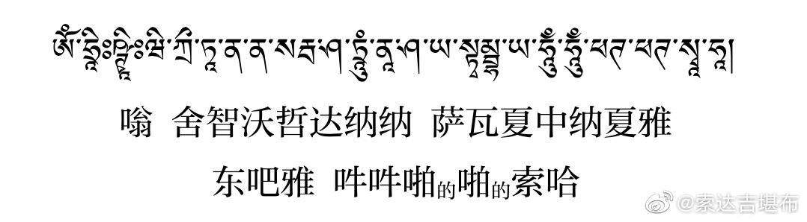
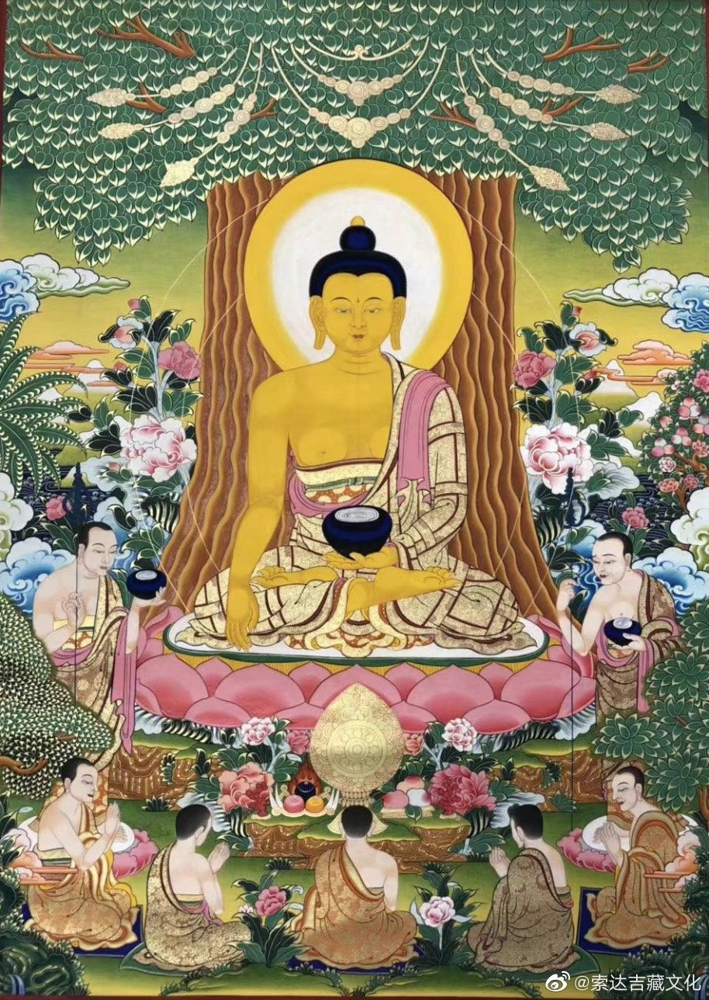

 ## 2020-01-10 15:28
བླ་མ་མཁྱེན།Oཆོས་རྗེ་བླ་མའི་རྣམ་ཐར་བསྡུས་པ། བརྙན་སྐད་རི...

 ## 2020-01-12 07:42
དུས་འཁོར་རྩ་རྒྱུད་ལས། བླ་མ་འདས་པའི་ལོ་ཟླ་ཚེས་གྲངས་དག ། ངེས་པར་བཟུང་སྟེ་མཆོད་པ་བྱས་གྱུར་ན། ། བསྐལ་པར་བསགས་པའི་སྡིག་པ་རབ་བཅོམ་ནས། ། ཤིན་ཏུ་མི་བཟད་གཤིན་རྗེའི་གྲོང་ལས་ཐར། ། ཞེས་གསུངས།
《时轮金刚根本续》：
上师圆寂年月日，若于此时供养者，摧毁累劫所造罪，解脱恐怖阎罗城。  L索达吉藏文化的微博视频

 ## 2020-01-29 16:16
མཁན་བསོད་དར་རྒྱས་ཀྱིས་བཤད་པའི་གློ་ཚད་གསར་བའི་སྐོར་གྱི་སྐད་ཆ་བསྡུས་པ།O致藏族老乡的一段话——索达吉堪布谈新型冠状病...

 ## 2020-01-30 15:23
བདག་གིས་དེ་རིང་ནས་བཟུང་ཉིན་བཅུ་ཚུན་ཆོད་ལ་བོའུ་ཧན་གྲོང་ཁྱེར་གཙོས་མི་ཤི་གསོན་རྣམས་ལ་མ་ཎི་འབུམ་ཐེར་ཞིག་འདོན་རྒྱུ་ཡིན།རྣམ་པ་ཚོས་ཀྱང་དེ་ལྟར་འདོན་རྒྱུ་མ་འཆུག—ཨོཾ་མ་ཎི་པདྨེ་ཧཱུཾ་ཧྲཱིཿ
我想从今天开始，10天内为以武汉为主的众生，念十万遍观音心咒“嗡玛尼贝美吽舍”。如果你想，也可以一起。

 ## 2020-01-31 15:20
ད་རུང་ཡར་འགྲོ་མར་འགྲོ་མི་བྱེད་པར་མཚམས་ལ་བསྡད་ན་དགའ་ས་རེད།མི་སུ་ལའང་མི་འཕྲད་པར་གཟབ་ན་དགའ་ས་རེད།
现在还不能到处乱跑，最好是“闭关”，跟谁都不接触，格外谨慎为好。O紧急扩散！这235个车次、航班发现患者，急寻...

 ## 2020-02-08 13:27
ས་ཡི་སྙིང་པོའི་མདོ་ལས། རིགས་ཀྱི་བུའམ་རིགས་ཀྱི་བུ་མོ་གང་ཞིག་གིས་བྱང་ཆུབ་སེམས་དཔའ་ས་ཡི་སྙིང་པོའི་སྐུ་གཟུགས་མཐོང་བ་དང་། མདོ་སྡེ་འདི་ཐོས་པ་དང་། མདོ་སྡེ་འདི་བཀླགས་པ་དང་། བློར་ཆུད་པ་དང་། སྤོས་དང་། མེ་ཏོག་དང་། བཟའ་བཏུང་དང་། གོས་དང་། རིན་པོ་ཆེ་ལ་སོགས་པས་སྦྱིན་པའམ་མཆོད་པ་འབུལ་བ་དང་། བསྟོད་ཅིང་བསྔགས་པ་དང་། བལྟ་བ་དང་། གུས་པས་ཕྱག་འཚལ་བར་བྱས་ན། ཕན་ཡོན་ཉེར་བརྒྱད་ཐོབ་པ་སྟེ།  གཅིག ། ལྷ་ཀླུ་རྣམས་ཀྱིས་དགོངས་ཤིང་སྲུང་བ་དང་། གཉིས། དགེ་བའི་འབྲས་བུ་ཉིན་རེ་བཞིན་འཕེལ་བ་དང་། གསུམ། ཐར་བ་ཆ་མཐུན་གྱི་དགེ་རྩ་འགྲུབ་པ་དང་། བཞི། བྱང་ཆུབ་ལས་ཕྱིར་མི་ལྡོག་པ་དང་། ལྔ། ཟས་གོས་ཕུན་སུམ་འཚོགས་པར་འགྱུར་བ་དང་། དྲུག ། ནད་དང་རིམས་ནད་མི་འབྱུང་བ་དང་།  བདུན། མེ་ཆུའི་འཇིགས་པ་རྣམས་ཞི་བ་དང་། བརྒྱད། ཆོམ་རྐུན་གྱི་གནོད་པ་མེད་པ་དང་། དགུ ། མི་རྣམས་ཀྱིས་མཐོང་ན་དགའ་ཞིང་གུས་པ་དང་། བཅུ། ལྷ་འདྲེ་རྣམས་ཀྱིས་སྡོང་གྲོགས་བྱེད་པ་དང་། བཅུ་གཅིག ། བུད་མེད་ཀྱི་ལུས་རྟེན་སྐྱེས་པར་འགྱུར་བ་དང་། བཅུ་གཉིས། རྒྱལ་པོ་དང་བློན་པོའི་སྲས་མོར་འགྱུར་བ་དང་། བཅུ་གསུམ། གཟུགས་བྱད་མཛེས་ཤིང་ལྟ་ན་སྡུག་པ་དང་། བཅུ་བཞི། ལྷ་ཡུལ་ལ་མང་དུ་སྐྱེ་བ་དང་། བཅོ་ལྔ། ཡུལ་འཁོར་སྲུང་བའི་རྒྱལ་པོར་འགྱུར་བ་དང་། བཅུ་དྲུག ། སྔོན་གནས་རྗེས་དྲན་གྱི་མངོན་ཤེས་དང་ལྡན་པ་དང་། བཅུ་བདུན། རེ་བ་ཐམས་ཅད་ཡིད་བཞིན་དུ་འགྲུབ་པ་དང་།  བཅོ་བརྒྱད། ཉེ་འཁོར་རྣམས་དགའ་ཞིང་མཐུན་པ་དང་། བཅུ་དགུ། དུས་མ་ཡིན་པའི་འཇིགས་པ་རྣམས་ཞི་བ་དང་། ཉི་ཤུ། ལས་ཀྱི་ལམ་ཡོངས་སུ་ཟད་པ་དང་། ཉེར་གཅིག ། གང་དུ་བགྲོད་ཀྱང་ཐོགས་པ་མེད་པ་དང་། ཉེེར་གཉིས། མཚན་མོའི་རྨི་ལམ་བདེ་ཞིང་སྐྱིད་པ་དང་། ཉེར་གསུམ། ཤི་བོ་རྣམས་སྡུག་བསྔལ་དང་བྲལ་བ་དང་། ཉེར་བཞི། ཚེ་རབས་སྔ་མའི་བསོད་ནམས་ཀྱིས་སྐྱེ་བ་ལེན་པ་དང་། ཉེར་ལྔ། འཕགས་པ་རྣམས་ཀྱིས་བསྟོད་ཅིང་བསྔགས་པ་དང་། ཉེར་དྲུག ། སྤྱང་གྲུང་འཛོམས་ཤིང་དབང་པོ་རྣོ་བ་དང་།  ཉེར་བདུན། བྱམས་དང་སྙིང་རྗེས་སེམས་རྒྱུད་ཕྱུག་པ་དང་། ཉེར་བརྒྱད། མཐར་ཐུག་སངས་རྒྱས་ཀྱི་གོ་འཕང་ཐོབ་པའོ། །ཞེས་གསུངས།

《地藏经》云：
“若未来世，有善男子、善女人，见地藏形像，及闻此经，乃至读诵，香华、饮食、衣服、珍宝布施供养，赞叹瞻礼，得二十八种利益：一者、天龙护念，二者、善果日增，三者、集圣上因，四者、菩提不退，五者、衣食丰足，六者、疾疫不临，七者、离水火灾，八者、无盗贼厄，九者、人见钦敬，十者、神鬼助持，十一者、女转男身，十二者、为王臣女，十三者、端正相好，十四者、多生天上，十五者、或为帝王，十六者、宿智命通，十七者、有求皆从，十八者、眷属欢乐，十九者、诸横消灭，二十者、业道永除，二十一者、去处尽通，二十二者、夜梦安乐，二十三者、先亡离苦，二十四者、宿福受生，二十五者、诸圣赞叹，二十六者、聪明利根，二十七者、饶慈愍心，二十八者、毕竟成佛。”

 ## 2020-02-19 20:35
ས་ཡི་སྙིང་པོའི་རྩ་བའི་སྨོན་ལམ་གྱི་མདོ་ལས།སྐྱེས་བུ་ཆེན་པོ་འདི་ནི་འཛམ་བུ་གླིང་གི་སེམས་ཅན་རྣམས་ལ་ཡང་ལས་ཀྱི་འབྲེལ་བ་ཁྱད་པར་ཅན་ཡོད་པས། སེམས་ཅན་གང་ཞིག་གིས་བྱང་ཆུང་སེམས་དཔའ་འདིའི་མཚན་ཐོས་པ་དང་། བྱང་ཆུབ་སེམས་དཔའ་འདིའི་སྐུ་གཟུགས་མཇལ་བ་ནས་བཟུང་། ཐ་ན་མདོ་སྡེ་འདིའི་ཡིག་འབྲུ་གསུམ་མམ། ཡིག་འབྲུ་ལྔའམ། ཡང་ན་ཚིག་གཅིག་གམ། ཚིགས་བཅད་གཅིག་ཐོས་པར་གྱུར་ན། དེ་ནི་ཚེ་འདིར་བདེ་བ་ཕུན་སུམ་ཚོགས་པ་དང་ལྡན་ཞིང་མ་འོངས་འཇིག་རྟེན་དུ་ཡང་ཚེ་རབས་བརྒྱ་ཕྲག། སྟོང་ཕྲག ། ཁྲི་ཕྲག་རྣམས་སུ་གཟུགས་བྱད་ཕུན་སུམ་ཚོགས་པར་འགྱུར་བ་དང་། རིགས་བཟང་པོའི་ཁྱིམ་དུ་སྐྱེ་བར་འགྱུར་རོ། ། ཞེས་གསུངས།
《地藏经》云：“阎浮众生，于此大士（指地藏菩萨），有大因缘。是诸众生，闻菩萨名，见菩萨像，乃至闻是经三字五字，或一偈一句者，现在殊妙安乐，未来之世，百千万生，常得端正，生尊贵家。”

 ## 2020-02-23 22:10
ལོ་སར་བཟང་།Oཆོས་རྗེ་འཇིགས་མེད་ཕུན...

 ## 2020-03-02 07:45
རྒྱལ་སྲས་ཞི་བ་ལྷས། སེམས་ཅན་ནད་པ་ཇི་སྙེད་པ། །མྱུར་དུ་ནད་ལས་ཐར་གྱུར་ཅིག །འགྲོ་བའི་ནད་ནི་མ་ལུས་པ། །རྟག་ཏུ་འབྱུང་བ་མེད་པར་ཤོག །
寂天菩萨：愿诸病有情，速脱疾病苦！亦愿众生疾，毕竟永不生！

 ## 2020-03-22 16:36
ཀུན་མཁྱེན་ཀློང་ཆེན་པའི་ཡིད་བཞིན་མཛོད་ལས། དམ་པའི་ཆོས་ལ་སྤྱོད་དུ་ཡོད་པ་འདི་བླ་མ་དགེ་བའི་བཤེས་གཉེན་ལས་བྱུང་བས་རྩ་བ་དང་བརྒྱུད་པ་བཅས་པའི་བླ་མ་བཀའ་དྲིན་ཆེ་སྙམ་པ་དང་། ཆོས་ནི་སངས་རྒྱས་ཀྱི་གསུང་ཡིན་པས་སངས་རྒྱས་བཀའ་དྲིན་ཆེ་སྙམ་པ་དང་། གྲོགས་དམ་པ་རྣམས་དང་ལྷན་ཅིག་ཐོས་པས་དགེ་བ་ལ་འདུན་པའི་གྲོགས་རྣམས་བཀའ་དྲིན་ཆེ་སྙམ་པ་དང་། ཆོས་ལ་བར་ཆད་མེད་པ་འདི་མཁའ་འགྲོ་དམ་ཅན་རྒྱ་མཚོའི་དྲིན་ཡིན་པས་སྲུང་མ་དམ་ཅན་རྒྱ་མཚོ་རྣམས་བཀའ་དྲིན་ཆེ་སྙམ་པ་དང་། ཆོས་ལ་སྤྱོད་པའི་ལུས་གསོ་སྐྱེད་བྱེད་པའི་ཕ་མ་བཀའ་དྲིན་ཆེ་སྙམ་པ་དང་། ཐམས་ཅད་སངས་རྒྱས་ཀྱི་བསྟན་པ་དམ་པའི་བཀའ་དྲིན་ཡིན་པས། ཕན་བདེའི་འབྱུང་གནས་སངས་རྒྱས་ཀྱི་བསྟན་པ་དམ་པ་བཀའ་དྲིན་ཆེ་བས་ཡུན་རིང་དུ་གནས་པར་གྱུར་ཅིག་སྙམ་དུ་བསམ་པར་བྱའོ།། ཞེས་གསུངས།
全知龙钦绕降《如意宝藏论》：
我们应当如此思维：拥有奉行正法的机会来源于上师善知识，因此，根本上师及传承上师的恩德很大；正法就是佛语，因此，佛陀的恩德很大；与诸位殊胜友伴一起听闻，因此，乐善的众道友恩德很大；无碍行持正法是如海空行护法之恩，因此，如海护法神众的恩德很大；生育养育此行持正法之身体，因此，父母的恩德很大；一切都是殊胜佛法的恩德，因此，利乐之源佛法的恩徳很大。祈愿佛法长住世间！

 ## 2020-03-26 11:01
དུས་རྟག་ཏུ་ཐམས་ཅད་སྣང་ལ་རང་བཞིན་མེད་པ་སྒྱུ་མ་ལྟ་བུའི་ངང་ནས་འདི་ལྟར་བསྔོ་སྨོན་བྱ། ཕན་བདེའི་འབྱུང་གནས་བསྟན་པ་འཕེལ་གྱུར་ཅིག།ཚེ་རབས་ཀུན་ཏུ་ཆོས་ལ་སྤྱོད་གྱུར་ཅིག།རྒྱལ་ཁམས་ཀུན་ཏུ་བཀྲ་ཤིས་རྒྱས་གྱུར་ཅིག།འགྲོ་ཀུན་ཕྱམ་གཅིག་སངས་རྒྱས་ཐོབ་པར་ཤོག།
应经常在万法现而无自性的如幻境界中，这样发愿和回向：
“祈愿利乐源泉佛教兴，祈愿世世享受微妙法，祈愿一切国土增吉祥，祈愿众生一同获正觉。”

 ## 2020-03-27 11:36
རྗེ་བཙུན་འཕགས་མ་སྒྲོལ་མ་ཁྱེད་མཁྱེན་ནོ།།འཇིགས་དང་སྡུག་བསྔལ་ཀུན་ལས་བསྐྱབ་ཏུ་གསོལ།།
至尊度母您垂念，祈祷救脱诸苦难。

 ## 2020-04-01 05:11
ལུང་རིང་མོ་ལས། གཟུགས་ནི་དབུ་བ་རྡོས་པ་འདྲ། །ཚོར་བ་ཆུ་ཡི་ཆུ་བུར་བཞིན། །འདུ་ཤེས་སྨིག་རྒྱུ་ལྟ་བུ་སྟེ། །འདུ་བྱེད་རྣམས་ནི་ཆུ་ཤིང་བཞིན། །རྣམ་ཤེས་སྒྱུ་མ་ལྟ་བུ་སྟེ། །ཞེས་གསུངས།
《阿含经》：色如聚沫，受如浮泡，想如野马，行如芭蕉，识为幻法。

 ## 2020-04-02 22:31
ཨོཾཨཱཧཱུཾཿབཛྲགུརུཔདྨསིདྡྷིཧཱུཾཿ嗡啊吽  班则格热班玛斯德吽

 ## 2020-04-04 00:05
དེ་རིང་ནི་ཤི་བོ་རྣམས་ལ་བསྔོ་སྨོན་བྱེད་པའི་དུས་ཆེན་ཞིག་ཡིན། ད་ཐེངས་ནད་ཡམས་འདིས་འཛམ་བུ་གླིང་གི་མི་གྲངས་ཁྲི་ཕྲག་ལྔ་ལྷག་གི་ཚེ་སྲོག་འཕྲོག་ཟིན་པ་དང་ད་དུང་ཡང་མང་པོ་ཞིག་འཆི་བཞིན་ཡོད། དེ་དག་གཙོར་བྱས་པའི་ཤི་བོ་རྣམས་ལ་མ་མཐའ་ཡང་མ་ཎི་ཁྲི་རེ་གསུང་རོགས་ཞུ། ངས་ཀྱང་འདོན་རྒྱུ་ཡིན། ཨོཾ་མ་ཎི་པདྨེ་ཧཱུཾ་ཧྲཱིཿ
今天是清明节。这次疫情已经在全世界夺去了5万多人的生命，还有许多人濒临死亡。
希望大家能为以他们为主的亡人，念至少一万遍观音心咒。我也如是发愿。
嗡玛尼贝美吽舍……

 ## 2020-04-08 19:18
མགོན་པོ་ཀླུ་སྒྲུབ་ཀྱིས། ཚེ་ནི་གནོད་མང་རླུང་གིས་བཏབ་པ་ཡི།   །ཆུ་ཡི་ཆུ་བུར་བས་ཀྱང་མི་རྟག་ན།   །དབུགས་རྔུབ་དབུགས་དབྱུང་གཉིད་ཀྱིས་ལོག་པ་ལས།   །སད་ཁོམ་གང་ལགས་དེ་ནི་ངོ་མཚར་ཆེ།  །ཞེས་གསུངས།
龙猛菩萨：
寿命多害即无常，犹如水泡为风吹，呼气吸气沉睡间，能得觉醒极稀奇！

 ## 2020-04-11 13:41
དེ་རིང་རྒྱབ་ཉི་མས་དྲོས། ཁ་ཇ་ཡིས་དྲོས། སེམས་ཆོས་ཀྱིས་དྲོས། ཅུང་རེ་སྐྱིད་པོ་འདུག་ཨ།
背后是暖暖的阳光，口中是暖暖的茶水，心里是暖暖的佛法。此时此刻，有点惬意啊~

 ## 2020-05-01 21:39
🙏🏻
 > @索达吉堪布
 > 若能念大威德心咒一万遍以上，极为殊胜🙏

 ## 2020-05-15 22:17
གྲུབ་ཆེན་མཻཏྲི་པས།ཉོན་མོངས་རང་རྒྱུད་ཤོར་གྱུར་ན།།བླ་མའི་གདམས་པ་དྲན་པར་གྱིས།།རྩེ་གཅིག་གསོལ་བ་མ་བཏབ་ན།།དམ་པའི་ཐུགས་དགོངས་ག་ལ་ལོངས།།ཞེས་གསུངས།
大成就者梅志巴：
若生自相烦恼，当忆上师教言。若未一心祈祷，岂得上师密意？

 ## 2020-05-24 22:19
ལྷ་མོ་དཔལ་ཕྲེང་གི་སེང་གེ་སྒྲའི་མདོ་ལས།    ལྷ་མོ་དཔལ་ཕྲེང་གིས་བཅོམ་ལྡན་འདས་ཀྱིས་སྤྱན་སྔར་སྨོན་ལམ་ཆེན་པོ་གསུམ་བཏབ་བོ། །གསུམ་གང་ཞེ་ན། བཅོམ་ལྡན་འདས། བདག་གིས་བདེན་པའི་བྱིན་གྱི་རླབས་འདིས་སེམས་ཅན་དཔག་ཏུ་མཆིས་པ་དག་ལ་སྨན་བཏགས་པ་གང་ལགས་པའི་བསོད་ནམས་བསགས་པའི་དགེ་བའི་རྩ་བ་དེས། བཅོམ་ལྡན་འདས། བདག་ཚེ་རབས་ཐམས་ཅད་དུ་དམ་པའི་ཆོས་རྟོགས་པ་ཐོབ་པར་གྱུར་ཅིག །བཅོམ་ལྡན་འདས། འདི་ནི་བདག་གི་སྨོན་ལམ་ཆེན་པོ་དང་པོ་ལགས་སོ། །བཅོམ་ལྡན་འདས། བདག་གིས་དམ་པའི་ཆོས་རྟོགས་པ་དེ་ཐོབ་ནས་ཀྱང་ངལ་བ་དང་ཡོངས་སུ་སྐྱོ་བ་མ་མཆིས་པར་སེམས་ཅན་རྣམས་ལ་ཆོས་སྟོན་པར་གྱུར་ཅིག །བཅོམ་ལྡན་འདས། དེ་ནི་བདག་གི་སྨོན་ལམ་ཆེན་པོ་གཉིས་པ་ལགས་སོ། །བཅོམ་ལྡན་འདས། བདག་གིས་དམ་པའི་ཆོས་བསྟན་པ་དེ་ཡང་ལུས་དང་སྲོག་ལ་མི་ལྟ་བར་དམ་པའི་ཆོས་བསྲུང་བ་དང༌། དམ་པའི་ཆོས་ཡོངས་སུ་གཟུང་བར་འཚལ་ལོ། །བཅོམ་ལྡན་འདས། འདི་ནི་བདག་གི་སྨོན་ལམ་ཆེན་པོ་གསུམ་པ་ལགས་སོ།།ཞེས་གསུངས།
《宝积经·胜鬘夫人会》（菩提流志翻译）：
尔时胜鬘夫人，复于佛前发三弘愿，以兹愿力，利益无边诸有情类。
第一愿者，以我善根，于一切生得正法智。
第二愿者，若我所生得正智已，为诸众生演说无倦。
第三愿者，我为摄受护持正法，于所生身不惜躯命。

 ## 2020-06-19 17:20
མདོ་ཕལ་པོ་ཆེ་ལས། ལྕགས་འཁོར་རབ་ཏུ་འབར་བ་གང་།།ཁྱོད་ཀྱི་མགོ་ལ་བསྐོར་བྱས་ཀྱང་།།ནམ་ཡང་དེ་འདྲའི་སྡུག་བསྔལ་གྱིས།།བྱང་ཆུབ་སེམས་དེ་འདོར་མི་བྱ།།ཞེས་གསུངས།
《华严经》：假使热铁轮，在汝顶上旋，终不以此苦，退失菩提心。

 ## 2020-07-04 05:32
རིག་འཛིན་འཇིགས་མེད་གླིང་པས། ཁྱིམ་ལ་གནས་ཀྱང་ཡང་དག་བསྟན་ལ་དད། །དཀོན་མཆོག་གསུམ་ལ་བླ་མར་བྱེད་པ་རྣམས།  །ཐེག་པ་ཆེན་པོའི་གདུལ་བྱ་ཉིད་ཀྱི་ཕྱིར།  །གཡེལ་བ་མེད་པའི་མེལ་ཙེ་སྲུང་སྐྱོབ་མཛོད།  །ཅེས་གསུངས།
晋美林巴尊者：
身虽在家信正法，恭敬皈依三宝众，此乃大乘所化故，祈请护法恒庇佑。

 ## 2020-07-07 06:20
ཕ་མའི་དྲིན་ལན་འཇལ་དཀའ་བའི་མདོ་ཞེས་བྱ་བ་བཞུགས་སོ།།
འདི་སྐད་བདག་གིས་ཐོས་པ་དུས་གཅིག་ན། བཅོམ་ལྡན་འདས་རྒྱལ་པོའི་ཁབ་རྒྱལ་བུ་རྒྱལ་བྱེད་ཀྱི་ཚལ་མགོན་མེད་ཟས་སྦྱིན་གྱི་ཀུན་དགའ་ར་བ་ན་བཞུགས་སོ།། དེའི་ཚེ། བཅོམ་ལྡན་འདས་ཀྱིས་དགེ་སློང་རྣམས་ལ་བཀའ་སྩལ་པ། ཕ་མ་གཉིས་ནི་བུ་ཕྲུག་ལ་དྲིན་ཤིན་ཏུ་ཆེ་བ་སྟེ། བུས་པ་འོ་མ་ནུ་བ་ནས་བཟུང་དུས་རྟག་ཏུ་གསོ་ཞིང་བསྐྱངས་ནས་འབྱུང་བཞི་ལེགས་པར་གྲུབ་སྟེ་ཆེར་བསྐྱེད་པའོ།། དེ་ཡང་བུ་ཕྲུག་གང་ཞིག་གིས་ལོ་སྟོང་གི་བར་དུ་ཕྲག་གཡས་པའི་ཐོག་ཏུ་ཕ། གཡོན་པའི་ཐོག་ཏུ་མ་བཞག་སྟེ་རང་ཉིད་ཀྱི་ལུས་པོ་ཡང་མི་གཙང་བས་བཙོག་པར་བྱས་ཀྱང་དེ་ལ་འཁང་ར་དང་ཡིད་ཆད་མེད་པར་ས་སྟེང་ཀུན་ཏུ་བསྐོར་ཡང་དེས་ཕ་མའི་དྲིན་ལན་འཇལ་མི་ནུས་སོ།། དེ་བས་བུ་ཕྲུག་གང་ཞིག་གིས་ཕ་མ་དད་པ་མེད་པ་ལ་དད་པ་སྐྱེས་སུ་བཅུག་ནས་བདེ་བ་ཐོབ་པར་བྱེད་པ་དང་། ཚུལ་ཁྲིམས་མེད་པ་ལ་ཚུལ་ཁྲིམས་ནོད་དུ་བཅུག་ནས་བདེ་བ་ཐོབ་པར་བྱེད་པ་དང་། ཆོས་མ་ཐོས་པ་ལ་ཆོས་ཐོས་སུ་བཅུག་ནས་བདེ་བ་ཐོབ་པར་བྱེད་པ་དང་། སེར་སྣ་ཅན་ལ་སྦྱིན་པ་བྱིན་དུ་བཅུག་ནས་དེའི་གདམས་པ་ལ་བསྐུལ་ཏེ་བདེ་བ་ཐོབ་པར་བྱེད་པ་དང་། ཤེས་རབ་མེད་པ་ལ་ཤེས་རབ་བསླབ་ཏུ་བཅུག་ནས་དེའི་གདམས་པ་ལ་བསྐུལ་ཏེ་བདེ་བ་ཐོབ་པར་བྱའོ།། དེ་ལྟར་བཅོམ་ལྡན་འདས་དེ་བཞིན་གཤེགས་པ་དགྲ་བཅོམ་པ་ཡང་དག་པར་རྫོགས་པའི་སངས་རྒྱས། རིག་པ་དང་ཞབས་སུ་ལྡན་པ། བདེ་བར་གཤེགས་པ། འཇིག་རྟེན་མཁྱེན་པ།  སྐྱེས་བུ་འདུལ་བའི་ཁ་ལོ་སྒྱུར་བ་བླ་ན་མེད་པ། ལྷ་དང་མི་རྣམས་ཀྱི་སྟོན་པ། སངས་རྒྱས་བཅོམ་ལྡན་འདས་ལ་དད་པར་བྱའོ།།དེ་ནས་དམ་པའི་ཆོས་ལ་དད་པར་བྱས་་པས་བདེ་བ་ཐོབ་པ་ཡིན་ནོ།། དམ་པའི་ཆོས་ནི་ཤིན་ཏུ་ཟབ་པ་དང་། ཚེ་འདིར་འབྲས་བུ་ཐོབ་པ་དང་། དོན་གྱི་རོ་ཕུན་སུམ་ཚོགས་པའོ།། དེ་ནས་མཁས་པ་རྣམས་ཀྱིས་རིག་གྲོལགཉིས་ལྡན་གྱི་འཕགས་པའི་དགེ་འདུན་ལ་དད་པར་བྱའོ།། དེ་བཞིན་གཤེགས་པའི་འཕགས་པའི་དགེ་འདུན་ནི་ཤིན་ཏུ་དུལ་བ་དང་། སྤྱོད་པ་རིགས་པར་ཞུགས་པ་དང་། དྲང་མོར་ཞུགས་པ་དང་། རྟག་ཏུ་མཐུན་པར་ཞུགས་པ་དང་། ཆོ་སོ་སོར་ཡོངས་སུ་གྲུབ་པ་དང་། ཚུལ་ཁྲིམས་ཡོངས་སུ་གྲུབ་པ་དང་། ཤེས་རབ་ཡོངས་སུ་གྲུབ་པ་དང་། རྣམ་པར་གྲོལ་བ་ཡོངས་སུ་གྲུབ་པ་དང་། རྣམ་པར་གྲོལ་བའི་ལྟ་བ་ཡོངས་སུ་གྲུབ་པའོ།། དེ་ལ་ཟུང་བཞི་ཡ་བརྒྱད་ཀྱི་འཕགས་པའི་དགེ་འདུན་ཞེས་བྱའོ།། དེ་བཞིན་གཤེགས་པའི་འཕགས་པའི་དགེ་འདུན་ནི་གོང་ན་མེད་པ། ཐལ་མོ་སྦྱར་བའི་འོས་སུ་གྱུར་པ། ཕྱག་བྱ་བའི་འོས་སུ་གྱུར་པ། འཇིག་རྟེན་ན་བླ་ན་མེད་པ་བསོད་ནམས་ཀྱི་དཔལ་གྱི་ཞིང་། ཡོན་ཡོངས་སུ་སྦྱོང་བ་ཆེན་པོའོ།། དེ་ལྟར་བུ་ཕྲུག་གང་ཞིག་གིས་ཕ་མ་གཉིས་ཆོས་ལ་བཙུད་ནས་དགེ་བ་སྒྲུབ་ཏུ་གཞུག་གོ ། དགེ་སློང་རྣམས་ནི་བུ་གཉིས་ལ་གནས་པར་བྱེད་པའོ།། དེ་གཉིས་ལ་སྐྱེས་པའི་བུ་དང་གསོ་བའི་བུ་ཞེས་བྱའོ།། དེས་ན་དགེ་སློང་རྣམས་ཀྱིས་སྐྱེས་པའི་བུ་ལ་བསླབ་པར་བྱ་སྟེ། དེའི་ཁ་ནས་ཆོས་ཀྱི་རོ་འབྱུང་བའི་ཕྱིར་རོ།། དགེ་སློང་རྣམས་ཀྱིས་དེ་ལྟར་བསླབ་པར་བྱའོ།། དེ་ནས་དགེ་སློང་རྣམས་ཀྱིས་དེ་སྐད་དུ་ཐོས་ནས་བཅོམ་ལྡན་འདས་ཀྱིས་གསུངས་པ་ལ་རྗེས་སུ་ཡི་རང་སྟེ་མངོན་པར་བསྟོད་དོ།། ཕ་མའི་དྲིན་ལན་འཇལ་དཀའ་བའི་མདོ་ཞེས་བྱ་བ་རྫོགས་སོ།། །། བསོད་དར་རྒྱས་ཀྱིས་མ་ཧཱ་ཙི་ནའི་སྐད་ནས་བོད་སྐད་དུ་བསྒྱུར་བ་དགེའོ།།

佛说父母恩难报经
後汉安息国三藏安世高译

闻如是：
一时婆伽婆在舍卫城祇树给孤独园。
尔时世尊告诸比丘：”父母於子，有大增益，乳哺长养，随时将育，四大得成。右肩负父、左肩负母，经历千年，正使便利背上，然无有怨心於父母，此子犹不足报父母恩。若父母无信，教令信，获安隐处；无戒，与戒教授，获安隐处；不闻；使闻教授，获安隐处；悭贪，教令好施，劝乐教授，获安隐处；无智慧，教令黠慧，劝乐教授，获安隐处。如是信如来．至真．等正觉．明行成为．善逝．世间解．无上士．道法御．天人师、号佛．世尊。教信法教授，获安隐处。诸法甚深，现身获果，义味甚深。如是智者，明通此行，教令信圣众。如来圣众甚清净，行直不曲，常和合，法法成就，戒成就、三昧成就、智慧成就、解脱成就、解脱见慧成就。所谓圣众——四双八辈，是谓如来圣众，最尊最贵，当尊奉敬仰，是世间无上福田。如是诸子！当教父母行慈。诸比丘有二子：所生子、所养子，是谓比丘有二子。是故诸比丘！当学所生子，口出法味。如是诸比丘，当作是学。“
尔时诸比丘闻佛所说，欢喜奉行。

 ## 2020-07-09 06:50
རབ་ཏུ་བྱུང་བའི་ཕན་ཡོན་ལ་བསྟོད་པ་ཚིགས་སུ་བཅད་པའི་མདོ་ཞེས་བྱ་བ་བཞུགས་སོ།།   རིང་མོ་ལུང་ལས་བསྡུས་པར་བསྟན།།    དགེ་འདུན་དཀོན་མཆོག་ཞིང་ལ་བསྟོད།།    ཚངས་པ་བརྒྱ་བྱིན་ལ་སོགས་པས།།  ཚངས་དབྱངས་སྙན་པོས་དགེ་འདུན་བསྟོད།།    ས་ཡི་ལྷ་མོ་བརྟན་མ་སོགས།།    དགེ་འདུན་དཀོན་མཆོག་རྣམས་ལ་བསྟོད།།  ང་ཡི་བསྟན་མཇུག་རབ་བྱུང་རྣམས།།  དགེ་འདུན་དཀོན་མཆོག་རྟག་ཏུ་གནས།།  དགེ་འདུན་འཕེལ་བར་བསྟན་པ་དར།།  བླ་མེད་བྱང་ཆུབ་འབྲས་བུ་ཐོབ།།  མ་རུངས་སྙིགས་མའི་འཇིག་རྟེན་འདིར།།  རྒྱལ་བའི་འདུས་སྡེ་གཙང་མར་གནས།།  འགའ་ཞིག་འབྲས་བུ་བཞི་འདོད་དང་།།  འགའ་ཞིག་འབྲས་བུ་མངོན་འགྱུར་བ།།    གང་ཟག་ཟུང་བཞི་ཡ་བརྒྱད་སོགས།།  མཐུན་པའི་དགེ་འདུན་རྒྱུན་ཆད་མེད།།  འགའ་ཞིག་སྦྱང་བའི་ཡོན་ཏན་ཅན།།  ལ་ལ་དབེན་པར་ཞི་བར་གནས།།  དེ་ཀུན་རང་གི་སྲོག་བཞིན་དུ།།  ཕྲ་བའི་ཚུལ་ཁྲིམས་ཡང་དག་སྲུང་།།  འགའ་ཞིག་ཟབ་རྒྱས་ཤེས་རབ་སློབ།།  འགའ་ཞིག་ཏིང་འཛིན་བསམ་གཏན་སྒོམ།།  ཐམས་ཅད་དགེ་འདུན་སྡེར་འདུས་ཏེ།།  ཆུ་བརྒྱ་རྒྱ་མཚོར་གཞོལ་བ་བཞིན།།  དཀོན་མཆོག་ཁྱད་འཕགས་དགེ་འདུན་གྱིས།།    སེམས་ཅན་རྣམས་ལ་དགེ་རྩ་སྐྲུན།།  ལྷ་མིའི་འབྲས་བུ་ཡང་དག་སྟེར།།  བསྟན་ལ་རབ་བྱུང་ཀུན་ལས་འཕགས།།  དྭངས་པའི་ཡིད་ཀྱིས་ཆུ་འཁྱོར་གང་།།  དེར་འཕུལ་བསོད་ནམས་དཔག་ཏུ་མེད།།  རྡུལ་ཕྲན་གྲངས་ནི་གཞལ་བར་ནུས།།    དགེ་འདུན་ལ་མཆོད་ཚད་ཡོད་མིན།།  གང་ཞིག་མྱུར་དུ་སྐྱེ་འཆི་ཡི།།  རྒུད་པའི་ཆུ་བོ་བརྒལ་འདོད་པས།།  དགེ་འདུན་སྡེ་ལ་བསྟེན་ནས་སུ།།  དགེ་རྩ་ཡང་དག་བསྐྲུན་པར་བྱ།།  བསོད་ནམས་དཔལ་གྱི་ཞིང་མཆོག་ཏུ།།  དགེ་བའི་ས་བོན་གང་བཏབ་པ།།  འབྲས་བུ་དཔག་མེད་ཐོབ་འགྱུར་ཏེ།།  སྤྲིན་པར་ཆར་ཆུ་སྦྲུམ་པ་བཞིན་།།  སྦྱིན་བདག་གཉིས་འཛིན་མེད་སེམས་ཀྱིས།།  མཐོ་དམན་མི་གཞལ་འདྲ་མཉམ་དུ།།  དགེ་འདུན་མཆོད་པའི་གང་ཟག་ལ།།  ལྷ་མིའི་འབྲས་བུ་ཡང་དག་ཐོབ།།  དཔག་མེད་ཡོན་ཏན་གྱིས་བརྒྱན་པའི།།  བརྩེ་ཆེན་སྟོན་པའི་རྗེས་འཇུག་རྣམས།།    ཐལ་བས་གཡོག་པའི་མེ་བཞིན་དུ།།  ཐ་མལ་མིག་གིས་མཐོང་བར་དཀའ།།  འགའ་ཞིག་ལྟ་སྣང་ཚུལ་འཆལ་ཡང་།།  ནང་གསང་ཡོན་ཏན་དཔག་མེད་ལྡན།།  དད་གུས་མཆོད་གནས་འཕགས་ཆེན་རྣམས།།    བྱིས་པས་གཏིང་དཔོག་མི་ནུས་སོ།།  འགའ་ཞིག་ཕྱི་ཚུལ་སྤྱོད་ལམ་བཙུན།།  འགའ་ཞིག་འདོད་པ་མ་སྤོང་བ།།  ཕྱི་ཚུལ་སོ་སོ་སྐྱེ་བོར་སྣང་།།  ནང་གི་དེ་ཉིད་འཕགས་པར་གནས།།    ཨ་མྲའི་འབྲས་བུ་རིགས་བཞི་ལྟར།།  སྨིན་དང་མ་སྨིན་འབྱེད་པར་དཀའ།།  རྒྱལ་བུ་སྲས་ཀྱང་དེ་བཞིན་ཏེ།།  ཚུལ་ཁྲིམས་ལྡན་མིན་དབྱེ་བར་དཀའ།།  དེས་ན་ཀུན་ལ་ནན་གྱིས་སྐུལ།།  དགེ་འདུན་དཀོན་མཆོག་སྨོད་མི་བྱ།།    སྡུག་བསྔལ་མཚོ་ལས་བརྒལ་འདོད་པས།།  རྟག་ཏུ་ཞིང་བཟང་སོ་ནམ་བྱ།།

赞僧功德经

阿含经中略集出，　　叹大福田诸僧宝，
大梵天王及帝释，　　以大梵音赞僧宝。
如地坚牢诸神等，　　赞叹一切僧宝众，
我末法中出家人，　　常住僧宝常住僧。
僧宝僧共兴佛法，　　志求菩提微妙果，
于浊苦恶世界中，　　常在如来清净众。
僧中或有求四果，　　或以证果在僧中，
此等八辈诸上人，　　和合僧中常不断。
或有头陀常乞食，　　或有山间乐寂静，
乃至于微细戒中，　　不犯如来严命教。
或有深广学智慧，　　或有息虑习诸禅，
并皆集在僧众中，　　犹如百川归大海。
殊胜妙宝大德僧，　　长养众生功德种，
能与人天胜果者，　　无过佛法僧宝众。
善心僧中施掬水，　　获福多于大海量，
微尘尚可有算期，　　僧中施宝无有尽。
若人当来求远离，　　越于生死贫穷河，
应当速疾志诚心，　　于僧宝中树因果。
于此最妙良福田，　　若有种植功德子，
当来收获无边畔，　　犹如云中含大雨。
施者不筹量度者，　　平等奉施无二心，
是人方可能堪任，　　受人天中胜妙果。
无量功德具庄严，　　大悲世尊弟子众，
凡人肉眼难分别，　　犹如灰覆于火上。
或有外现犯戒相，　　内秘无量诸功德，
应当信顺崇重之，　　贤圣愚凡不可测。
或有外现具威仪，　　或示未能舍其欲，
外相人观谓凡夫，　　不妨内即是其圣。
内如四种庵罗果，　　生熟难分不可别，
如来弟子亦如是，　　有戒无戒亦难辨。
是故殷勤劝诸人，　　不听毁骂僧宝众，
若欲不沉沦苦海，　　常当敬重植良田。

 ## 2020-07-10 06:35
རྒྱུན་དུ་བདེ་བ་མྱོང་འདོད་པས།།  དགེ་སློང་སྡེ་ལ་མཆོད་པ་འབུལ།།  སོ་སྐྱེས་དམན་པའི་སེམས་ཉིད་ཀྱིས།།  རྒྱལ་བུ་སྲས་རྣམས་གཞལ་མི་བྱ།།  དད་ལྡན་ཕོ་མོ་གང་ཞིག་གིས།།  དད་པའི་སེམས་ནི་མང་བསྐྱེད་དེ།།  མཉམ་དུ་དགེ་འདུན་མཆོད་བྱས་ན།།    རྣམ་སྨིན་དཔག་ཏུ་མེད་པ་ཐོབ།།  རབ་བྱུང་སྡེ་ལ་ལོག་ལྟ་བ།།  ངན་སོང་གནས་སུ་ངེས་པར་ལྟུང་།།    སྟོན་པའི་ཞལ་ནས་ཚངས་དབྱངས་སྒྲས།།  བསྒྲགས་པའི་བདེན་ཚིག་བསླུ་བ་མེད།།    རལ་གྲིས་ལྕེ་ནི་གཅོད་པ་དང་།།  གཏུན་གྱིས་རང་ལུས་འཐག་བླ་ཡི།།  སྐད་ཅིག་ཙམ་དུ་ཞེ་སྡང་གིས།།  རབ་བྱུང་རྣམས་ལ་སྨོད་མི་བྱ།།  ལྕགས་གོང་འབར་བ་ཟོས་པ་ཡིས།།  ཁ་ནས་མེ་ལྕེ་མཆེད་བླ་ཡི།།  སྤྲོས་བཅས་དམོད་པའི་ཚིག་དག་གིས།།  རབ་བྱུང་རྣམས་ལ་བརྙས་མི་བྱ།།  རལ་གྲི་རྣོན་པོས་རང་ལུས་ཀྱི།།  ལྷུ་ཚིགས་ཤ་ལྤགས་གཅོད་བླ་ཡི།།      བྱིས་བློ་རྡུང་རྡེག་འཕྱ་སྨོད་ཀྱིས།  །  དགེ་སློང་རྣམས་ལ་བརྙས་མི་བྱ།།  ལག་པས་མིག་གཉིས་དྲུས་ནས་ནི།།  བསྐལ་མང་ལོང་བར་གྱུར་བླ་ཡི།།  ཆགས་བྲལ་སྤྱོད་པའི་གང་ཟག་ལ།།  ལོག་པའི་མིག་གིས་བལྟ་མི་བྱ།།    དགོན་དང་འདུ་ཁང་བཤིག་པ་དང་།།  རིང་སྲེལ་མཆོད་རྟེན་སྲེག་བླ་ཡི།།  རྩུབ་མོའི་ཚིག་གིས་དགེ་འདུན་ལ།།  སྐུར་བ་གདབས་པར་མི་བྱའོ།།  མཆོད་རྟེན་བཤིགས་པས་རང་ལྟུང་ནས།།  བསྐལ་པ་དཔག་མེད་སྡུག་བསྔལ་མ ྱོང་།། དགེ་འདུན་སྐྱོན་སྨྲའི་ཉེས་པ་ཡིས།། གྲངས་མེད་སེམས་ཅན་རྣམས་ཀྱང་ལྟུང་།། དེས་ན་མཁས་པས་ལེགས་དཔྱད་དེ།། དགེ་འདུན་སྨོད་པར་མི་བྱ་བར།། ངག་གི་ཉེས་པ་ལེགས་སྲུང་ནས།། ཚུལ་འཆལ་ཡིན་མིན་བརྗོད་མི་བྱ།། ཚིག་རྩུབ་ངག་གིས་དགེ་སྦྱོང་སྨོད།། དམྱལ་བའི་སྡུག་བསྔལ་བཟོད་མེད་མྱོང་།། ཐར་ནས་མི་ལུས་ཐོབ་གྱུར་ཀྱང་།། འོན་ལོང་ལྐུགས་པ་ཉིད་དུ་འགྱུར།། འཇིག་རྟེན་བླུན་རྨོངས་འགའ་ཞིག་གིས།། བཙུན་པ་བཙུན་མར་སྐྱོན་བརྗོད་པས།། ངན་སོང་གནས་སུ་ལྟུང་ནས་ནི།། བསྐལ་མང་སྡུག་བསྔལ་མཚོ་རུ་བྱིང་།། བརྩེ་ཆེན་སྟོན་པ་ཉིད་ཀྱིས་ཀྱང་།། དགེ་འདུན་རྣམས་ལ་གུས་ཕྱག་མཛད།།  སངས་རྒྱས་རྣམས་ཀྱང་དེ་ལྟར་ན།། སོ་སོའི་སྐྱེ་བོས་སྨོས་ཅི་འཚལ།། འཇིག་རྟེན་དད་ལྡན་མང་པོ་ཡིས།། རབ་བྱུང་བཀུར་ཞིང་དད་ན་ཡང་།། དེ་ཡི་སྐྱོན་དག་ཐོས་པའི་ཚེ།། ལོག་ལྟ་སྐྱེས་ནས་སྤོང་བར་བྱེད།། དེས་ནི་སྐལ་ལྡན་དགེ་རྩ་འཇོམས།། རབ་བྱུང་སྡེ་ཡང་བརླག་པར་བྱེད།། བསྐལ་བཟང་སངས་རྒྱས་སྟོང་མི་མཇལ།།  དེས་ན་མཁས་པས་བརྟག་པར་བྱ།།

       常欲人中受乐者，　　亦当供养苾刍僧，
勿以凡夫下劣心，　　分别如来弟子众。
若有清信士女等，　　能于十念生信心，
平等供养苾刍僧，　　是人获得无量报。
若于僧中起邪见，　　当来定堕三恶道，
世尊亲自以梵音，　　金口弘宣诚不妄。
宁以利刀割其舌，　　或以捻杵碎其身，
不应一念嗔恚心，　　谤毁如来净僧众。
宁以吞大热铁丸，　　宁便口中出猛焰，
不应戏论以一言，　　毁骂出家清净众。
宁以利刀自屠割，　　残害支节毁肌肤，
不应戏笑调凡愚，　　何咒打骂苾刍众？
宁以自手挑两目，　　宁于多劫受生盲，
其于习行离欲人，　　不应恶眼而瞻视。
宁毁精舍及制多，　　宁焚七宝舍利塔，
勿于僧中出恶言，　　诽谤如来清净众。
毁塔之人自堕落，　　经无量劫受诸苦，
好说众僧短长者，　　自堕亦引无量众。
是故智者善思量，　　勿于僧中起轻慢，
善自防护口业非，　　莫谈此持彼犯戒。
若一恶言毁沙门，　　当堕泥犁受极苦，
从地狱出得人身，　　即招聋盲喑哑报。
世间多有愚劣人，　　谈说僧尼诸过恶，
因兹堕落恶道中，　　永劫沉沦没苦海。
大悲世尊礼大众，　　尊敬和合大德僧，
诸佛尚自致殷勤，　　何况凡夫轻慢众？
世间多有信心人，　　崇重世尊弟子者，
闻说三宝短长时，　　怨于僧中起邪见。
因此退败诸善人，　　毁坏如来清净众，
不见贤劫千世尊，　　是故智者应思忖。

 ## 2020-07-11 06:26
དགེ་སློང་ཀོ་ཀ་ལི་ཀ་ཡིས།། རབ་བྱུང་རྣམས་ལ་སྐུར་བཏབ་པས།། པད་ཆེན་ལྟར་གས་དམྱལ་བར་ལྟུང་།། ལྕེ་ཞིང་རྨོས་ནས་ཁྲི་ཚལ་གཏུབ།། འོད་སྲུང་སློབ་མས་འཇིག་རྟེན་པ།། མང་པོར་སྐུར་བ་བཏབ་པ་ཡི།།  ལས་ཀྱིས་ལུས་ངན་དོར་མ་ཐག ། ལྕེ་རྨོས་དམྱལ་བའི་སྡུག་བསྔལ་མྱོང་།། དགེ་སྦྱོང་ཁྲོས་པས་གཞན་སྨོད་ན།། ངག་གི་རྣམ་སྨིན་དཔག་མེད་མྱོང་།། ཁྲིམས་མེད་ཁྱིམ་པས་རབ་བྱུང་ལ།། སྨོད་པས་ངན་ལྟུང་སྨོས་ཅི་དགོས།། དེས་ན་མཁས་པས་རྩི་ཤིང་དང་།། སོ་ཕག་སོགས་ཀྱང་མི་སྨོད་ན།། ཆགས་བྲལ་དགེ་ལ་གཞོལ་བ་ཡི།། རབ་བྱུང་གཙང་མར་སྨོས་ཅི་དགོས།། འདོད་པའི་མེ་ཡིས་སེམས་བསྲེགས་ཏེ།། གཙང་མའི་ཚུལ་ཁྲིམས་གོས་གྱུར་ཀྱང་།། མི་རིང་མྱུར་དུ་བཤགས་བྱས་ན།། སླར་ཡང་འཕགས་པའི་གྲལ་དུ་ཚུད།།  གང་ཞིག་ལོག་ལམ་ཞུགས་གྱུར་ཀྱང་།། མིག་ལྡན་སླར་ཡང་ལམ་རྙེད་བཞིན།། དགེ་སྦྱོང་ཚུལ་ཁྲིམས་རལ་ན་ཡང་།། གནས་སྐབས་ཡིན་གྱི་མཐར་སོར་ཆུད།།  གང་ཞིག་ས་བདེར་འགྱེལ་བ་ན།། རྐང་ལྡན་མྱུར་དུ་ཡར་ལངས་བཞིན།། དགེ་སྦྱོང་ཚུལ་ཁྲིམས་སྐྱོན་ཞུགས་ཀྱང་།། མི་རིང་སླར་ཡང་གསོ་བར་འགྱུར།། དཔེར་ན་འཇིག་རྟེན་གསེར་གྱི་སྣོད།། ཆག་ཀྱང་རིན་ཐང་སྲིད་ན་མཐོ།། ཤིང་སྣོད་ཆག་མེད་ཕུན་ཚོགས་ཀྱང་། དེ་ཡིས་གསེར་སྣོད་འགྲན་དུ་མེད།། དགེ་སྦྱོང་ཁྲིམས་འཆལ་གཅིག་གིས་ཀྱང་།། ཐོག་མའི་ངེས་འབྱུང་ཡོན་ཏན་དེར།།  བྱེ་བ་ཕྲག་བརྒྱའི་ཁྱིམ་པ་ཡི།། ཡོན་ཏན་རྣམས་ཀྱིས་འགྲན་དུ་མེད།། རབ་བྱུང་རྣམས་ཀྱིས་རྒྱལ་བ་ཡི།། བརྒྱུད་འཛིན་ཕྱི་རབས་བསྟན་པ་སྤེལ།། ཡོན་ཏན་འབུམ་ལྡན་ཁྱིམ་པ་ཡིས།། བསྟན་པ་ཅུང་ཙམ་སྤེལ་མི་ནུས།། རབ་བྱུང་ཚུལ་འཆལ་ཐ་ཆད་ཀྱང་།། མཆོད་པས་བདེ་འབྲས་དཔག་མེད་ཐོབ།། སྟོན་པས་དེ་ཡི་རྒྱུར་བསྔགས་པས།། ལྷ་དང་མི་ཡིས་གཙུག་ཏུ་བཀུར།།  དེ་ཕྱིར་གཞན་ལ་ནན་སྐུལ་གྱིས།། དགེ་འདུན་དཀོན་མཆོག་སྨད་མི་བྱ།། ཚེ་འདིའི་བག་ཆགས་ངན་གོམས་ཀྱིས།།  ཕྱི་མའི་དགེ་འབྲས་བརླག་པར་བྱེད།། ལུས་ངག་ཡིད་གསུམ་མི་དགེའི་ལས།། འཇིག་རྟེན་ལྷ་མའི་ས་བོན་འཇོམས།། ངན་སོང་གནས་གསུམ་ལྟུང་ནས་སུ།། བསྐལ་པ་དུང་ཕྱིར་ངལ་གསོ་མེད།། རབ་བྱུང་རྣམས་ལ་དད་བྱས་ནས།། སྐུར་འདེབས་ཉེས་པ་མི་གསོག་པར།། རྟག་ཏུ་ངག་གི་ཉེས་པ་སྤོང་།། དགེ་འདུན་དཀོན་མཆོག་སྨད་མི་བྱ།། རབ་བྱུང་སྨོད་པའི་ཉེས་པ་རྣམས།། མྱུར་དུ་དྭངས་པའི་ཡིད་ཀྱིས་བཤག །  དེ་ལ་བརྟེན་པའི་ངན་སེམས་ཀྱིས།། མ་འོངས་སྡུག་མྱོང་བཤག་པར་བྱ།།

       昔有俱迦离苾刍，　　以一恶言骂僧众，
犹落钵头磨地狱，　　舌被犁耕数万段。
亦有迦叶佛弟子，　　谤毁无量世间人，
承斯恶业舍残形，　　还受耕舌地狱苦。
沙门怀忿毁诸人，　　尚招无量口业报，
何况无戒白衣人，　　骂僧免堕恶道者？
是故智人不应骂，　　乃至草木砖瓦等，
况毁清净出家人，　　习行离欲善法者？
纵使欲火炽烧心，　　点污尸罗清净戒，
不久速能自忏除，　　还入如来圣众位。
如人暂迷失其道，　　有目还能寻本路，
苾刍虽犯世尊禁，　　虽然暂犯还能灭。
如人平地蹶脚时，　　有足还能而速起，
苾刍虽暂缺尸罗，　　虽犯不久还能补。
犹如世间金宝器，　　虽破其价一种贵，
木器纵然全不漏，　　不可比于破宝器。
破禁苾刍虽无戒，　　初心出家功德胜，
百千万亿白衣人，　　功德纵多不及彼。
出家弟子能堪任，　　继嗣如来末代法，
万德无量在俗人，　　不能须臾弘圣教。
最下犯禁破戒僧，　　供养由获万亿报，
是故世尊赞胜因，　　天上人中受尊贵。
是故殷勤劝诸人，　　勿毁如来僧宝众，
今生习恶因缘故，　　当来业成亦毁佛。
缘兹身口意业支，　　永断世间人天种，
当堕三涂恶道中，　　亿劫沉沦无休息。
若于清众起正信，　　无有毁谤名僧罪，
常能防护口业过，　　不谈如来僧宝众。
若人于僧有骂罪，　　应须志诚速求忏，
于僧勿起憍慢心，　　来生受苦必当悔。

 ## 2020-07-12 05:52
སྐད་ཅིག་རབ་བྱུང་བསོད་ནམས་ཚོགས།། ས་ཆེན་འདིར་ཡང་མི་ཤོང་ན།། ལོ་ཟླ་ཞག་གི་ཕྲེང་བ་རུ།། ཚུལ་ཁྲིམས་ལེགས་སྲུང་སྨོས་ཅི་དགོས།། ཚུལ་ཁྲིམས་སྲུང་བའི་བསོད་ནམས་གང་།། རྒྱལ་བས་བསྐལ་པར་བརྗོད་མི་འཛད།། བསོད་ནམས་མཁའ་མཉམ་ཚད་མེད་པ།། སོ་སྐྱེས་དེའི་མཐའ་ག་ལ་ཤེས།། ཡོན་ཏན་གྱིས་བརྒྱན་རྒྱལ་བ་ཡི།། དགེ་འདུན་དཀོན་མཆོག་ཤེས་པར་བྱ།། དེས་ན་ཁྱིམ་པ་སྐྱེ་བོ་ཡིས།། རབ་བྱུང་རྡུང་དང་བརྙས་མི་བྱ།། དགེ་སྦྱོང་ཚུལ་འཆལ་མཐོང་ན་ཡང་།།  དག་སྣང་སྦྱོང་ཞིང་ངན་བརྗོད་སྤོང་།། དྲི་ལྡན་མེ་ཏོག་ཚལ་ཞུགས་ན།། ལོ་འདབ་སྐམ་པོ་འདེམས་མིན་བཞིན།། རྒྱ་ཆེར་རྣམ་དག་བསྟན་པའི་མཚོར།། ཚུལ་ལྡན་བརྩོན་བཅས་མང་དུ་བཞུགས།། དེ་ན་སྤྱོད་འཆལ་འགའ་ཡོད་ཀྱང་།། ཁྱིམ་པས་སྐུར་འདེབས་རིགས་མ་ཡིན།། ལོ་ཏོག་རྒྱས་པའི་ཞིང་བཟང་ན།། རྩ་དང་ལྡུམ་བུ་འགའ་ཡོད་ཀྱང་།། གུས་པས་སོ་ནམ་ལེན་པ་ལས།། རྟོག་པས་དེ་དག་འདེམས་མིན་བཞིན།། སྟོན་པས་ཀུན་ལ་འདི་སྐད་དུ།། གང་འདོད་དགེ་སྦྱོང་མི་བརྙས་ཤིང་།། དད་འདུན་གུས་པས་བསྟེན་བྱས་ན།། ལྷ་ཡི་བདེ་འབྲས་མྱོང་བར་གསུངས།། ཐུབ་དབང་ཉི་མ་རིང་ནས་ནུབ།། དགེ་འདུན་སྒྲོན་མེའི་ཆོས་འོད་སྣང་།། ཀླུ་ཡི་རྒྱལ་པོས་ཆར་ཕབ་སྟེ།། ས་ཆེན་མྱུ་གུ་ཡོངས་སྨིན་བཞིན།།  མཐུན་པའི་དགེ་འདུན་དེ་བཞིན་ཏེ།། དམ་ཆོས་སྦྲང་ཆར་འཇོ་བ་ཡིས།། སྐམ་རིད་སེམས་ཅན་བརླན་བྱས་ཏེ།། དགེ་བའི་ས་བོན་ལེགས་པར་སྨིན།།  བསྐལ་མང་ཞིང་ལས་ཐོབ་པ་ཡི།། སྟོན་པའི་རྗེས་འཇུག་དགེ་འདུན་རྨད།། འཕགས་ཆེན་ཆོས་ཀྱི་རྒྱ་མཚོར་གནས།། ཐར་བ་བདུད་རྩིའི་བཅུད་ལ་རོལ།། མ་འོངས་བསྟན་པ་འཛིན་སྐྱོང་མཛད།།  ཕྱོགས་བཅུའི་ཞིང་ཁམས་དར་བར་བྱེད།། སེམས་ཅན་རྣམས་ལ་ཕན་བདེ་ཡི།། སངས་རྒྱས་ཆོས་འཁོར་ནུབ་མི་གཞུག ། ནམ་ཞིག་བསྟན་པ་ནུབ་པའི་ཚེ།། ཀུན་དགའ་ར་བ་འདུ་ཁང་ཞིག། མཆོད་རྟེན་ག་འུ་སྐུ་གཟུགས་ནུབ།། མཆོད་པར་འདོད་ཀྱང་མཆོད་ཡུལ་མེད།། གྱང་རིས་རབ་བྱུང་མི་མཐོང་ན།། དངོས་སུ་ཆོས་ཐོས་སྨོས་ཅི་དགོས།། མི་ལུས་རྙེད་དཀའ་ད་རེས་ཐོབ།། བསྟན་པ་འཕྲད་དཀའ་ད་རེས་མཇལ།། རྨད་བྱུང་བསོད་ནམས་ཞིང་ས་ལ།། མ་འོངས་དགེ་རྩ་ཅིས་མི་བསྐྲུན།། མཚན་མོར་ལམ་རིང་བགྲོད་པ་ལ།། དགོས་པའི་ལམ་རྒྱགས་སྟ་གོན་བཞིན།། མ་འོངས་ཉེན་འཕྲང་ལམ་རྒྱགས་སུ།། བསོད་ནམས་ཞིང་མཆོག་ཅིས་མི་རྨོ།། དེས་ན་ཀུན་གྱིས་ལེགས་དཔྱད་དེ།། མདོར་གསུངས་དགེ་འདུན་མཆོད་པར་བྱ།། དེ་སྐད་དགེ་འདུན་བསྟོད་པ་ཡི།། བསོད་ནམས་དཔག་མེད་མཁའ་ཁྱབ་དེ།། སེམས་ཅན་ཐམས་ཅད་ལ་བསྔོས་པས།། མ་འོངས་བྱམས་པར་འཕྲད་གྱུར་ཅིག ། བསོད་དར་རྒྱས་ཀྱིས་མ་ཧཱ་ཙི་ནའི་སྐད་ནས་བོད་སྐད་དུ་བསྒྱུར་བའོ།།

       如僧刹那有功德，　　其福不容于大地，
何况经月累岁年，　　坚持如来严禁戒。
是人持戒功德报，　　佛于一劫说不尽，
况余凡俗知其边，　　福等虚空无有量。
当知功德广庄严，　　释迦如来僧宝众，
是故不听在家者，　　毁辱打骂出家僧。
纵见沙门犯戒时，　　当宽其意勿嫌毁，
如入芳丛采妙花，　　不应摘选枯枝叶。
广大清净佛法海，　　多有持戒精修者，
其中纵有犯威仪，　　白衣不应生毁谤。
譬如田中新苗稼，　　于中亦有稗莠草，
应可一种敬良田，　　不应拣选生分别。
是以世尊制诸人，　　不听毁谤沙门众，
唯当尊重生敬心，　　同此受胜诸天报。
佛日灭没虽久远，　　僧宝连晖传法灯，
犹如龙王降甘雨，　　大地萠芽普洽润。
和合僧宝亦如是，　　雨于如来妙法雨，
滋润枯渴诸群生，　　长养善牙功德种。
于多劫中宿植田，　　得为如来弟子众，
处在贤圣法海中，　　饮妙解脱甘露味。
传持世尊末代教，　　流化十方诸国土，
利益一切诸众生，　　令佛法轮恒不绝。
佛法久后灭没时，　　伽蓝精舍毁成聚，
龛塔尊像并荒凉，　　设欲供养难可得。
壁画僧形不可见，　　何况得闻于正法？
人身难得生人中，　　佛法难逢今已遇。
如何于妙良福田，　　不种当来功德种？
冥路悬远不可达，　　当办资粮备前所。
善福田中不种植，　　当来险路之资粮，
是故诸人应善思，　　闻经僧中应惠施。
依经我略赞僧宝，　　功德无量遍虚空，
回施一切诸群生，　　愿共当来值弥勒。

 ## 2020-07-15 13:33
མཁན་རིན་པོ་ཆེའི་འཁྲུངས་སྐར་ལ་བཀྲ་ཤིས་བདེ་ལེགས་དང་སྐུ་ཚེ་བརྟན་ཅིང་མཛད་ཕྲིན་རྒྱས་པའི་སྨོན་འདུན་ཡང་ཡང་ཞུ།
祝慈诚罗珠堪布仁波切生日快乐、长久住世、弘法利生事业广大！

 ## 2020-07-21 07:33
བྱང་ཆུབ་སེམས་དཔའ་ས་ཡི་སྙིང་པོའི་རྩ་བའི་སྨོན་ལམ་གྱི་མདོ་ཞེས་བྱ་བ་བཞུགས་སོ།།
སངས་རྒྱས་དང་བྱང་ཆུབ་སེམས་དཔའ་ཐམས་ཅད་ལ་ཕྱག་འཚལ་ལོ། ། འདི་སྐད་བདག་གིས་ཐོས་པ་དུས་གཅིག་ན། བཅོམ་ལྡན་འདས་སུམ་ཅུ་རྩ་གསུམ་གྱི་གནས་ནས་རང་གི་མ་ཡུམ་གྱི་ཆེད་དུ་ཆོས་གསུངས་ནས་བཞུགས་སོ།། དེའི་ཚེ། ཕྱོགས་བཅུའི་འཇིག་རྟེན་གྲངས་མེད་པ། བརྗོད་དུ་མེད་པ། བརྗོད་དུ་མེད་པའི་སངས་རྒྱས་དང་བྱང་ཆུབ་སེམས་དཔའ་སེམས་དཔའ་ཆེན་པོ་རྣམས་ལྷན་གཅིག་ཏུ་འདུས་ནས་བཅོམ་ལྡན་འདས་ཤཱཀྱ་ཐུབ་པས་སྙིགས་མ་ལྔ་བདོ་བའི་འཇིག་རྟེན་འདིར་བསམ་གྱིས་མི་ཁྱབ་པའི་ཤེས་རབ་དང་། བསམ་གྱིས་མི་ཁྱབ་པའི་རྫུ་འཕྲུལ་གྱི་སྟོབས་ལ་བརྟེན་ནས་སེམས་ཅན་གདུལ་བར་དཀའ་བ་རྣམས་བཏུལ་ཞིང་། བདེ་སྡུག་གི་ཆོས་རྣམས་ལེགས་པར་མཁྱེན་པ་ལ་རབ་ཏུ་བསྟོད་ཅིང་བསྔགས་པར་མཛད་དོ། ། དེ་དག་གིས་རང་རང་གི་ཉེ་གནས་མངགས་ཏེ་བཅོམ་ལྡན་འདས་ལ་ཁམས་འདྲི་བར་བྱས་སོ།། དེ་ནས་བཅོམ་ལྡན་འདས་ཀྱིས་ཞལ་འཛུམ་པར་མཛད་ནས་འོད་གསལ་བའི་སྤྲིན་ཆེན་པོ་བརྒྱ་སྟོང་བྱེ་བ་ཁྲག་ཁྲིག་འཕྲོས་པ་སྟེ། དེ་ཡང་རྫོགས་པ་ཆེན་པོ་འོད་གསལ་བའི་སྤྲིན་དང་། ཤེས་རབ་དང་སྙིང་རྗེ་ཆེན་པོ་འོད་གསལ་བའི་སྤྲིན་དང་། ཤེས་རབ་ཆེན་པོ་འོད་གསལ་བའི་སྤྲིན་དང་། ཕ་རོལ་དུ་ཕྱིན་པ་ཆེན་པོ་འོད་གསལ་བའི་སྤྲིན་དང་། ཏིང་ངེ་འཛིན་ཆེན་པོ་འོད་གསལ་བའི་སྤྲིན་དང་། བཀྲ་ཤིས་པ་ཆེན་པོ་འོད་གསལ་བའི་སྤྲིན་དང་། བསོད་ནམས་ཆེན་པོ་འོད་གསལ་བའི་སྤྲིན་དང་། ཡོན་ཏན་ཆེན་པོ་འོད་གསལ་བའི་སྤྲིན་དང་། སྐྱབས་འགྲོ་ཆེན་པོ་འོད་གསལ་བའི་སྤྲིན་དང་། བསྟོད་བསྔགས་ཆེན་པོ་འོད་གསལ་བའི་སྤྲིན་ནོ།། དེ་ལྟར་བརྗོད་དུ་མེད་པའི་འོད་གསལ་བའི་སྤྲིན་རྣམས་འཕྲོས་ནས་ངོ་མཚར་བའི་སྒྲ་ཡང་སྣ་ཚོགས་གྲགས་པར་བྱས་ཏེ། དེ་ཡང་སྦྱིན་པའི་ཕ་རོལ་དུ་ཕྱིན་པའི་སྒྲ་དབྱངས་དང་། ཚུལ་ཁྲིམས་ཀྱི་ཕ་རོལ་དུ་ཕྱིན་པའི་སྒྲ་དབྱངས་དང་། བཟོད་པའི་ཕ་རོལ་དུ་ཕྱིན་པའི་སྒྲ་དབྱངས་དང་། བརྩོན་འགྲུས་ཀྱི་ཕ་རོལ་དུ་ཕྱིན་པའི་སྒྲ་དབྱངས་དང་། བསམ་གཏན་གྱི་ཕ་རོལ་དུ་ཕྱིན་པའི་སྒྲ་དབྱངས་དང་། ཤེས་རབ་ཀྱི་ཕ་རོལ་དུ་ཕྱིན་པའི་སྒྲ་དབྱངས་དང་། བྱམས་པ་དང་སྙིང་རྗེའི་ཕ་རོལ་དུ་ཕྱིན་པའི་སྒྲ་དབྱངས་དང་། དགའ་བ་དང་བཏང་སྙོམས་ཀྱི་ཕ་རོལ་དུ་ཕྱིན་པའི་སྒྲ་དབྱངས་དང་། རྣམ་པར་གྲོལ་བའི་སྒྲ་དབྱངས་དང་། ཟག་པ་མེད་པའི་སྒྲ་དབྱངས་དང་། ཤེས་རབ་ཀྱི་སྒྲ་དབྱངས་དང་། ཤེས་རབ་ཆེན་པོའི་སྒྲ་དབྱངས་དང་། སེང་གེའི་ང་རོའི་སྒྲ་དབྱངས་དང་། སེང་གེའི་ང་རོ་ཆེན་པོའི་སྒྲ་དབྱངས་དང་། སྤྲིན་དང་འབྲུག་སྒྲའི་སྒྲ་དབྱངས་དང་། སྤྲིན་དང་འབྲུག་སྒྲ་ཆེན་པོའི་སྒྲ་དབྱངས་སོ།། དེ་ལྟར་བརྗོད་དུ་མེད་པའི་སྒྲ་དབྱངས་བསྒྲགས་ནས་མི་མཇེད་ཀྱི་འཇིག་རྟེན་འདི་དང་འཇིག་རྟེན་གཞན་པ་ནས་བསམ་དུ་མེད་པ། གྲངས་ལས་འདས་པའི་ལྷ། ཀླུ། མི་མ་ཡིན་སོགས་སུམ་ཅུ་རྩ་གསུམ་གྱི་གནས་དེར་འདུས་སོ།།  དེ་ཡང་རྒྱལ་ཆེན་རིགས་བཞི་དང་། སུམ་ཅུ་རྩ་གསུམ་དང་། འཐབ་བྲལ་དང་། དགའ་ལྡན་པ་དང་། འཕྲུལ་དགའ་དང་། གཞན་འཕྲུལ་དབང་བྱེད་དང་། ཚངས་རིས་དང་། ཚངས་པ་མདུན་ན་འདོད་པ་དང་། ཚངས་པ་ཆེན་པོ་དང་། འོད་ཆུང་དང་། ཚད་མེད་འོད་དང་། འོད་གསལ་དང་། དགེ་ཆུང་དང་། ཚད་མེད་དགེ་དང་། དགེ་རྒྱས་དང་། བསོད་ནམས་སྐྱེས་དང་། སྤྲིན་མེད་འོད་དང་། བསོད་ནམས་དགའ་བ་དང་། འབྲས་བུ་ཆེ་བ་དང་། འདུ་ཤེས་མེད་དང་།མི་ཆེ་བ་དང་། མི་གདུང་བ་དང་། གྱ་ནོམ་སྣང་བ་དང་། ཤིན་ཏུ་མཐོང་བ་དང་། འོག་མིན་དང་། དབང་ཕྱུག་ཆེན་པོ་དང་། ནམ་མཁའ་མཐས་ཡས་དང་། རྣམ་ཤེས་མཐའ་ཡས་དང་། ཅི་ཡང་མེད་དང་། ཡོད་མེད་མིན་མེད་བཅས་ལྷ་དང་ཀླུ། འདྲེ་གདོན་ལ་སོགས་པ་ཐམས་ཅད་གནས་དེར་འདུས་སོ། ། དེ་ནས་མི་མཇེད་ཀྱི་འཇིག་རྟེན་འདི་དང་འཇིག་རྟེན་གཞན་པ་ནས་འོངས་པའི་རྒྱ་མཚོའི་ལྷ་དང་། ཆུ་ཀླུང་གི་ལྷ་དང་། ཆུ་བོའི་ལྷ་དང་། ཤིང་གི་ལྷ་དང་། རི་བོའི་ལྷ་དང་། སའི་ལྷ་དང་། མཚེའུའི་ལྷ་དང་། ལོ་ཏོག་གི་ལྷ་དང་། ཉིན་མོའི་ལྷ་དང་། མཚན་མོའི་ལྷ་དང་། ནམ་མཁའི་ལྷ་དང་། གནམ་གྱི་ལྷ་དང་། བཟའ་བཏུང་གི་ལྷ་དང་། རྩི་ཤིང་གི་ལྷ་ལ་སོགས་པ་ཡང་གནས་དེར་འདུས་སོ།། དེ་ནས་མི་མཇེད་ཀྱི་འཇིག་རྟེན་འདི་དང་འཇིག་རྟེན་གཞན་པ་ནས་ལྷགས་པའི་འདྲེའི་རྒྱལ་པོ་རྣམས་ཏེ། མིག་ངན་པའི་འདྲེའི་རྒྱལ་པོ་དང་། ཁྲག་འབྱིན་པའི་འདྲེའི་རྒྱལ་པོ་དང་། ལུས་ཀྱི་ཟུངས་འབྱིན་པའི་འདྲེའི་རྒྱལ་པོ་དང་། མངལ་དང་ཁམས་དམར་འབྱིན་པའི་འདྲེའི་རྒྱལ་པོ་དང་། དུག་བསྡུ་བའི་འདྲེའི་རྒྱལ་པོ་དང་། བྱམས་པ་ཅན་གྱི་འདྲེའི་རྒྱལ་པོ་དང་། བསོད་ནམས་དང་ཕན་པ་སྦྱིན་པའི་འདྲེའི་རྒྱལ་པོ་དང་། དགའ་གུས་ཆེན་པོའི་འདྲེའི་རྒྱལ་པོ་སོགས་གནས་དེར་འདུས་སོ། །

地藏菩萨本愿经
唐于阗国三藏沙门实叉难陀译

忉利天宫神通品第一

  如是我闻：一时，佛在忉利天为母说法。尔时，十方无量世界不可说不可说一切诸佛，及大菩萨摩诃萨，皆来集会。赞叹释迦牟尼佛，能于五浊恶世，现不可思议大智慧神通之力，调伏刚强众生，知苦乐法。各遣侍者，问讯世尊。
  是时如来含笑，放百千万亿大光明云，所谓大圆满光明云、大慈悲光明云、大智慧光明云、大般若光明云、大三昧光明云、大吉祥光明云、大福德光明云、大功德光明云、大归依光明云、大赞叹光明云。
  放如是等不可说光明云已，又出种种微妙之音，所谓檀波罗蜜音、尸波罗蜜音、羼提波罗蜜音、毗离耶波罗蜜音、禅波罗蜜音、般若波罗蜜音、慈悲音、喜舍音、解脱音、无漏音、智慧音、大智慧音、狮子吼音、大狮子吼音、云雷音、大云雷音。
  出如是等不可说不可说音已，娑婆世界及他方国土，有无量亿天龙鬼神，亦集到忉利天宫。所谓四天王天、忉利天、须焰摩天、兜率陀天、化乐天、他化自在天、梵众天、梵辅天、大梵天、少光天、无量光天、光音天、少净天、无量净天、遍净天、福生天、福爱天、广果天、无想天、无烦天、无热天、善见天、善现天、色究竟天、摩醯首罗天，乃至非想非非想处天，一切天众、龙众、鬼神等众，悉来集会。复有他方国土及娑婆世界，海神、江神、河神、树神、山神、地神、川泽神、苗稼神、昼神、夜神、空神、天神、饮食神、草木神，如是等神，皆来集会。复有他方国土及娑婆世界诸大鬼王，所谓恶目鬼王、啖血鬼王、啖精气鬼王、啖胎卵鬼王、行病鬼王、摄毒鬼王、慈心鬼王、福利鬼王、大爱敬鬼王，如是等鬼王，皆来集会。

 ## 2020-07-22 15:34
སློབ་སྤྲིངས་ལས། མར་མེའི་མེ་ལྕེ་ཤུགས་དྲག་རླུང་གིས་བསྐྱོད་པ་ལྟའི༎
ཚེ་ནི་སྐད་ཅིག་གནས་པའི་གདེང་ཡང་ཡོད་མ་ཡིན༎ཞེས་གསུངས།
《致弟子书》：犹如狂风吹灯火，寿命刹那无可信。

 ## 2020-07-23 08:26
དེའི་ཚེ། སངས་རྒྱས་ཤཱཀྱ་ཐུབ་པས་བྱང་ཆུབ་སེམས་དཔའ་སེམས་དཔའ་ཆེན་པོ་ཆོས་ཀྱི་རྒྱལ་པོའི་སྲས་སུ་གྱུར་པ་འཇམ་དཔལ་དབྱངས་ལ་འདི་སྐད་དུ་བཀའ་སྩལ་པ། འཇམ་དཔལ་དབྱངས། ཁྱོད་ཀྱིས་ལྟོས་དང་། འཇིག་རྟེན་འདི་དང་། འཇིག་རྟེན་གཞན་དང་། ཞིང་ཁམས་འདི་དང་། ཞིང་ཁམས་གཞན་ནས་ལྷགས་པའི་སངས་རྒྱས་དང་བྱང་ཆུབ་སེམས་དཔའ། ལྷ་དང་། ཀླུ་དང་། འདྲེའི་རྒྱལ་པོ་རྣམས་དེང་གི་དུས་སུ་སུམ་ཅུ་རྩ་གསུམ་གྱི་གནས་འདིར་འདུས་པར་གྱུར་ན། ཁྱོད་ཀྱིས་དེ་དག་གི་གྲངས་གཞལ་བར་ནུས་སམ། འཇམ་དཔལ་གྱིས་སངས་རྒྱས་ལ་གསོལ་པ། བཅོམ་ལྡན་འདས། བདག་གིས་རྫུ་འཕྲུལ་གྱི་སྟོབས་ལ་བརྟེན་ནས་བསྐལ་པའི་བར་དུ་གཞལ་ཡང་དེ་དག་གི་གྲངས་འཚལ་བར་མ་ལགས་སོ། ། བཅོམ་ལྡན་འདས་ཀྱིས་འཇམ་དཔལ་ལ་བཀའ་སྩལ་པ།བདག་གིས་སངས་རྒྱས་ཀྱི་སྤྱན་གྱིས་ཡོངས་སུ་གཟིགས་ཏེ་དེ་དག་གི་གྲངས་གཞལ་བའི་མཐའ་ཡང་རྙེད་པར་མ་ལགས་སོ། དེ་ནི་བྱང་ཆུབ་སེམས་དཔའ་ས་ཡི་སྙིང་པོས་བསྐལ་པ་ཆེས་དཔག་ཏུ་མེད་པ་ནས་བཟུང་། བསྒྲལ་བར་གྱུར་པ་དང་། སྒྲོལ་བར་འགྱུར་བ་དང་། མ་བསྒྲལ་བར་གྱུར་བ་དང་། གྲུབ་པར་གྱུར་པ་དང་། འགྲུབ་པར་འགྱུར་བ་དང་། མ་གྲུབ་པའི་སེམས་ཅན་རྣམས་སོ། འཇམ་དཔལ་གྱིས་སངས་རྒྱས་ལ་གསོལ་པ། བཅོམ་ལྡན་འདས། བདག་གིས་སྔོན་ཆེས་ཐོག་མ་མེད་པ་ནས་དགེ་བའི་རྩ་བ་རྒྱ་ཆེན་པོ་བསྐྲུན་ཏེ་ཤེས་རབ་ཐོགས་པ་མེད་པ་ཡོངས་སུ་བརྙེས་ནས་སངས་རྒྱས་ཀྱི་གསུང་ཇི་ལྟ་བ་བཞིན་ལེགས་པར་འཛིན་པར་ནུས་ན་ཡང་། འབྲས་བུ་ཆུང་ངུ་ལ་སྤྱོད་པའི་ཉན་ཐོས་དང་། ལྷ་དང་། ཀླུ་དང་། སྡེ་བརྒྱད་དང་། མ་འོངས་པའི་སེམས་ཅན་རྣམས་ཀྱིས་དེ་བཞིན་གཤེགས་པའི་བདེན་པ་ཉག་གཅིག་གི་གསུང་དེ་དག་ཐོས་ནའང་ཐེ་ཚོམ་སྐྱེ་བར་འགྱུར་བའོ།། གལ་ཏེ་གུས་པས་སྤྱི་བོར་བཟུང་བར་གྱུར་ཀྱང་སྐུར་འདེབས་མི་བྱེད་པའི་ངེས་པ་ཡང་མེད་པས་དེ་བཞིན་གཤེགས་པས་བདག་ཅག་རྣམས་ལ་བྱང་ཆུབ་སེམས་དཔའ་ས་ཡི་སྙིང་པོས་སློབ་པ་ལམ་གྱི་གནས་སྐབས་སུ་སྤྱོད་པ་ཇི་ལྟར་སྤྱད་པ་དང་སྨོན་ལམ་ཇི་ལྟར་བཏབ་པ་ལ་སོགས་པའི་བསམ་གྱིས་མི་ཁྱབ་པའི་མཛད་པ་དང་སྐྱེ་རབས་རྣམས་རྒྱ་ཆེར་བསྟན་དུ་གསོལ།
སངས་རྒྱས་ཀྱིས་འཇམ་དཔལ་དབྱངས་ལ་བཀའ་སྩལ་པ། དཔེར་ན་སྟོང་གསུམ་གྱི་སྟོང་ཆེན་པོ་འདིར་རྩི་ཤིང་དང་། ནགས་ཚལ་དང་། འབྲས་དང་། གཏིལ་དང་། སྨྱུག་མ་དང་། འདམ་རྩྭ་དང་། ས་རྡོ་སོགས་རེ་རེ་ནས་རྡུལ་ཕྲ་རབ་ཏུ་གྱུར། རྡུལ་ཕྲ་རབ་ཀྱི་གྲངས་རེ་རེ་བཞིན་ཆུ་བོ་གང་གཱ་རུ་གྱུར། ཆུ་བོ་གང་གཱའི་བྱེ་མ་རེ་རེ་བཞིན་འཇིག་རྟེན་དུ་གྱུར། འཇིག་རྟེན་རེ་རེའི་ནང་དུ་རྡུལ་རེ་རེ་བཞིན་བསྐལ་པར་གྱུར། བསྐལ་པ་རེ་རེའི་ནང་རྡུལ་ཕྲ་རབ་ཇི་སྙེད་བསགས་པ་རེ་རེ་ནས་མཐའ་ལ་ཐུག་གི་བར་བསྐལ་པར་གྱུར་པ་ཞིག་ན། བྱང་ཆུབ་སེམས་དཔའ་ས་ཡི་སྙིང་པོས་ས་བཅུ་པ་བརྙེས་པ་ནས་བཟུང་མཛད་པ་ཇི་ལྟར་བགྱིས་པའི་གྲངས་ནི་གོང་གི་དཔེ་དེ་ལས་བརྒྱ་སྟོང་གི་ཚད་ལས་གཞལ་དུ་མེད་ན་བྱང་ཆུབ་སེམས་དཔའ་ས་ཡི་སྙིང་པོ། ཉན་ཐོས་དང་རང་སངས་རྒྱས་སུ་གྱུར་པའི་མཛད་པའི་གྲངས་ནི་སྨོས་མ་དགོས་སོ། ། འཇམ་དཔལ་དབྱངས། བྱང་ཆུབ་སེམས་དཔའ་འདིས་བསམ་གྱིས་མི་ཁྱབ་པའི་རྫུ་འཕྲུལ་དང་སྨོན་ལམ་ལ་བརྟེན་ནས་མ་འོངས་པར་རིགས་ཀྱི་བུ་དང་རིགས་ཀྱི་བུ་མོ་གང་ཞིག་གིས་བྱང་ཆུབ་སེམས་དཔའ་འདིའི་མཚན་ཐོས་པའམ། བསྟོད་བསྔགས་བྱས་པའམ། ཕྱག་འཚལ་བའམ། མཚན་ནས་བརྗོད་པའམ། མཆོད་པ་ཕུལ་བ་ནས་བཟུང་། དེའི་སྐུ་གཟུགས་ཚོན་རིས་ཀྱིས་བྲིས་པའམ། བརྐོས་པའམ། འདྲ་འབག་བཟོས་པའི་བར་དུ་བྱ་བ་བགྱིས་པའི་གང་ཟག་གང་དག་ལན་བརྒྱ་ཕྲག་ཏུ་སུམ་ཅུ་རྩ་གསུམ་གྱི་གནས་སུ་སྐྱེས་ནས་ངན་སོང་དུ་ལྟུང་བར་མི་འགྱུར་རོ།། འཇམ་དཔལ་དབྱངས། བྱང་ཆུབ་སེམས་དཔའ་སེམས་དཔའ་ཆེན་པོ་ས་ཡི་སྙིང་པོ་ནི་སྔོན་བརྗོད་དུ་མེད་པ་བརྗོད་དུ་མེད་པའི་བསྐལ་པ་ཆེས་དཔག་ཏུ་མེད་པའི་སྔ་རོལ་ལ་ཁྱིམ་བདག་གི་བུ་ཞིག་ཏུ་སྐྱེས།  དེའི་ཚེ། འཇིག་རྟེན་དེར་དེ་བཞིན་གཤེགས་པ་སེང་གེ་རྣམ་པར་བསྒྱིངས་བ་སྤྱོད་པ་ཐམས་ཅད་དང་ལྡན་པ་ཞེས་བྱ་བའི་སངས་རྒྱས་ཞིག་བྱོན་ནོ། ། དེའི་ཚེ། ཁྱིམ་བདག་གི་བུས་བསོད་ནམས་སྟོང་གིས་བརྒྱན་པ། མཚན་དང་དཔེ་བྱད་འབར་བའི་སངས་རྒྱས་ཀྱི་སྐུ་གཟུགས་མཐོང་ནས་དེའི་དྲུང་དུ་ཕྱིན་ནས་དྲིས་པ། ཁྱེད་ཀྱིས་སྔོན་སྤྱོད་པ་ཅི་སྤྱད་པ་དང་སྨོན་ལམ་གང་བཏབ་པས་འདི་འདྲའི་མཚན་དཔེ་ལྡན་པའི་གཟུགས་སྐུ་གྲུབ་པ་ལགས། དེ་ནས་དེ་བཞིན་གཤེགས་པ་སེང་གེ་རྣམ་པར་བསྒྱིངས་བ་སྤྱོད་པ་ཐམས་ཅད་དང་ལྡན་པས་ཁྱིམ་བདག་གི་བུ་ལ་བཀའ་སྩལ་པ། ཁྱིམ་བདག་གི་བུ། ཁྱོད་ཀྱིས་འདི་ལྟའི་སངས་རྒྱས་ཀྱི་སྐུ་མངོན་པར་ཐོབ་པར་འདོད་ན། ཆེས་ཡུན་རིང་པོའི་བར་དུ་སྡུག་བསྔལ་གྱིས་གཟིར་བའི་སེམས་ཅན་རྣམས་བསྒྲལ་བར་བྱ་དགོས་སོ།། འཇམ་དཔལ་དབྱངས། དེའི་ཚེ། ཁྱིམ་བདག་གི་བུས་འདི་ལྟར་དུ་ཐུགས་བསྐྱེད་པ་སྟེ། བདག་གིས་མ་འོངས་པར་བསྐལ་པ་ཆེས་གྲངས་མེད་པའི་བར་དུ། ཐབས་རྒྱ་ཆེན་པོ་ལ་བརྟེན་ནས་སྡིག་པ་དང་སྡུག་བསྔལ་གྱིས་ཡོངས་སུ་མནར་བའི་འགྲོ་བ་དྲུག་གི་སེམས་ཅན་རྣམས་བསྒྲལ་བར་བྱའོ།།བསྒྲལ་བར་བྱས་ནས་གཟོད་རང་ཉིད་མངོན་པར་འཚང་རྒྱ་བར་བྱའོ། ། སངས་རྒྱས་དེའི་མདུན་ནས་དེ་ལྟར་དུ་ཐུགས་བསྐྱེད་དེ་ད་ལྟའི་བར་དུ་བསྐལ་པ་བརྒྱ་སྟོང་བྱེ་བ་ཁྲག་ཁྲིག་བརྗོད་དུ་མེད་པ་འདས་ཀྱང་ད་དུང་ཁོང་བྱང་ཆུབ་སེམས་དཔའི་ཚུལ་མཛད་པའོ།  །

《地藏菩萨本愿经》（续）：
尔时，释迦牟尼佛告文殊师利法王子菩萨摩诃萨：“汝观是一切诸佛菩萨，及天龙鬼神，此世界、他世界，此国土、他国土，如是今来集会到忉利天者，汝知数否？”
文殊师利白佛言：“世尊，若以我神力，千劫测度，不能得知。”
佛告文殊师利：“吾以佛眼观故，犹不尽数。此皆是地藏菩萨久远劫来，已度、当度、未度，已成就、当成就、未成就。”
文殊师利白佛言：“世尊，我已过去久修善根，证无碍智，闻佛所言，即当信受。小果声闻、天龙八部，及未来世诸众生等，虽闻如来诚实之语，必怀疑惑；设使顶受，未免兴谤。唯愿世尊，广说地藏菩萨摩诃萨，因地作何行、立何愿，而能成就不思议事。”
佛告文殊师利：“譬如三千大千世界，所有草木丛林、稻麻竹苇、山石微尘，一物一数，作一恒河；一恒河沙，一沙之界；一界之内，一尘一劫；一劫之内，所积尘数，尽充为劫。地藏菩萨证十地果位以来，千倍多于上喻，何况地藏菩萨在声闻、辟支佛地！
“文殊师利，此菩萨威神誓愿，不可思议。若未来世，有善男子、善女人，闻是菩萨名字，或赞叹，或瞻礼，或称名，或供养，乃至彩画刻镂塑漆形像，是人当得百返生于三十三天，永不堕恶道。
“文殊师利，是地藏菩萨摩诃萨，于过去久远不可说不可说劫前，身为大长者子。时世有佛，号曰狮子奋迅具足万行如来。时长者子，见佛相好，千福庄严，因问彼佛，作何行愿，而得此相。时狮子奋迅具足万行如来，告长者子：‘欲证此身，当须久远度脱一切受苦众生。’文殊师利，时长者子因发愿言：‘我今尽未来际不可计劫，为是罪苦六道众生，广设方便，尽令解脱，而我自身方成佛道。’以是于彼佛前立斯大愿，于今百千万亿那由他不可说劫，尚为菩萨。

 ## 2020-07-24 17:47
དེ་རིང་འདི་བཞིན་བྱང་སྡོམ་བླངས་ན་བཟང་།
O菩萨戒略轨——法王如意宝晋美彭措传授

 ## 2020-08-07 18:24
ས་ཡི་སྙིང་པོའི་མདོ་ལས།ལས་ཀྱི་ནུས་པ་ནི་ཤིན་ཏུ་ཆེ་བའི་ཕྱིར་རི་རབ་ལས་ཀྱང་དཔངས་མཐོ་བ་དང་།རྒྱ་མཚོ་ལས་ཀྱང་གཏིང་ཟབ་པ་དང་།འཕགས་པའི་ལམ་རྣམས་ཀྱང་སྒྲིབ་པར་བྱས་པས་ན། སེམས་ཅན་རྣམས་ཀྱིས་ལས་ཆུང་ངུས་ཀྱང་མི་གནོད་སྙམ་དུ་སེམས་པར་མི་བྱ་སྟེ། ཤི་བའི་རྗེས་སུ་སྐྲ་ཉག་མ་ཙམ་ཡང་ཆུད་ཟོས་མེད་པར་ལས་ཀྱི་རྣམ་པར་སྨིན་པ་ཉམས་སུ་མྱོང་བར་འགྱུར་རོ།། ཞེ་གསུངས།
《地藏经》：
业力甚大，能敌须弥，能深巨海，能障圣道。是故众生莫轻小恶，以为无罪，死后有报，纤毫受之。

 ## 2020-09-01 16:39
སངས་རྒྱས་ཐོད་པ་ལས།སྟོང་ཕྲག་བདུ་ཅུ་རྩ་གཉིས་ཀྱི།།རྩ་རྣམས་ཀྱི་ནི་རིགས་བཤད་དོ།།ཞེས་གསུངས།
《如来顶骨续》：
宣说七万二，一切脉种类。

 ## 2020-09-14 13:52
ཐར་མདོ་ལས། སྔར་ཆོས་ཀྱི་ཕྱིར་ཞུ་བའི་རིགས་ཀྱི་གཞན་ནི་བསམ་མི་དགོས་སོ།། ཞེས་གསུངས།
《解脱经》：
先应为法，不须余念。

 ## 2020-10-01 07:35
རྒྱད་ལས།དེ་ཚེ་བླ་མའི་མན་ངག་རྣམས།།རང་གི་རྒྱུད་ལ་འདྲིས་པར་བྱ།།ཞེས་གསུངས།
密续：
尔时上师诸窍诀，融入于我相续中。

 ## 2020-10-17 20:49
རྩོམ་པ་པོ། མཁས་དབང་དགེ་འདུན་ཆོས་འཕེལ།
གང་ལ་བརྟེན་ན་བསླུ་བ་མ་མཆིས་པའི།།
སྐྱབས་གནས་རིན་ཆེན་གསུམ་གྱི་ཐུགས་རྗེའི་མཐུས།།
དོན་མེད་འཁོར་བའི་འཕྲུལ་སྣང་ཀུན་ཞི་ནས།།
བློ་སྣ་ཆོས་ལ་ཕྱོགས་པར་བྱིན་གྱིས་རློབས།
ཅི་ལ་བསམས་ཀྱང་འཇིག་རྟེན་བྱ་གཞག་ལ།།
ཡང་སྒོས་སྙིང་པོ་ཏིལ་ཙམ་མི་འདུག་པས།།
ཡུན་ཐུང་ཚེ་འདིའི་བློ་སྣ་བསྒྱུར་བྱས་ཏེ།།
ད་ནས་སྙིང་པོའི་ལྷ་ཆོས་བྱེད་པར་བྱ།།
དར་མའི་ན་ཚོད་དབྱར་གྱི་མེ་ཏོག་ཙམ།།
མཛེས་པའི་བཀྲག་མདངས་དགུན་གྱི་འཇའ་ཚོན་ཙམ།།
མི་ཡི་ཚེ་ལ་ཡུན་ལོང་མི་འདུག་པས།།
ད་ནི་སྙིང་པོའི་ལྷ་ཆོས་བྱེད་པར་བྱ།།
སྡུག་བའི་དུས་སུ་སྐྱིད་པའི་ཐབས་ལ་རེ།།
སྐྱིད་པའི་དུས་སུ་སྡུག་བསྔལ་ཡོང་གིས་དོགས།།
རེ་དོགས་འཕྲང་ལས་ཐར་དུས་མི་འདུག་པས།།
ད་ནི་སྙིང་པོའི་ལྷ་ཆོས་བྱེད་པར་བྱ།།
གཅེས་པར་བསྐྱངས་ཀྱང་ནད་དང་གཅོང་གི་གཞི།།
རྒྱན་གྱིས་མཛེས་ཀྱང་མི་གཙང་རང་བཞིན་ཉིད།།
མི་རྟག་ལུས་ལ་སྙིང་པོ་མི་འདུག་པས།།
ད་ནི་སྙིང་པོའི་ལྷ་ཆོས་བྱེད་པར་བྱ།
ཕྱུག་པོ་ཕྱུག་པོའི་ས་ནས་སྡུག་གཏམ་བྱེད།།
དབུལ་པོ་དབུལ་པོའི་ས་ནས་སྨྲེ་ངག་འདོན།།
མི་རེའི་སེམས་ལ་སྡུག་བསྔལ་ཁུར་པོ་རེ།།
འཁོར་བའི་གནས་ན་བདེ་བའི་སྐབས་མ་མཆིས།།
སྤྱིར་ན་ཕྱི་རོལ་བདེ་སྡུག་སྣང་བ་ཀུན།།
རང་གི་སེམས་ཉིད་གཅིག་པོའི་ཆོ་འཕྲུལ་ཏེ།།
ནང་གི་གཟུགས་བརྙན་ཕྱི་རུ་འཆར་བ་ལས།།
ཕྱི་ཡི་རྣམ་པ་ཚུར་ལ་འོངས་པ་མིན།།
དེ་ལྟར་ལེགས་པར་གོ་ནས་དཔྱད་པ་ཡིས།།
ཀུན་གཞི་སེམས་ཀྱི་རྩ་བ་ཆོད་པའི་ཚེ།།
སྣང་བའི་ན་བུན་འདི་ཡི་ཕ་རོལ་ན།།
ཆོས་ཉིད་དོན་གྱི་ནམ་མཁའ་དངོས་སུ་བཞུགས།།
ཡོད་ཅེས་བྱ་བ་འདི་ཡང་བཅོས་མ་སྟེ།།
མེད་ཅེས་བྱ་བ་འདི་ཡང་བཅོས་མ་ཉིད།།
དེ་འདྲའི་བཅོས་མ་ཀུན་གྱིས་མ་བསླད་པ།།
སེམས་ཀྱི་རང་བཞིན་རྫོགས་པའི་སངས་རྒྱས་ཡིན།།
ཡིན་མིན་རྣམ་རྟོག་ཆུ་ཡི་གཉེར་མ་བཞིན།།
གཅིག་རྗེས་གཅིག་གིས་མཐུད་དེ་འགྲོ་བ་འདི།།
གཏོད་མེད་ངང་དུ་ལྷོད་ཀྱིས་ཞིགས་པའི་ཚེ།།
ཆོས་དབྱིངས་གདོད་མའི་རྒྱ་མཚོར་སླེབས་པ་ལགས།།
མདོར་ན་སྣང་བ་སེམས་ཀྱི་ཆོ་འཕྲུལ་ཏེ།།
སེམས་ནི་སྟོང་པ་གཞི་མེད་རྩ་བྲལ་ཉིད།།
གཞི་མེད་ཆོས་ལ་བདག་ཏུ་བཟུང་བ་ཡིས།།
ཁྱོད་དང་ང་ཡང་འཁོར་བའི་གནས་སུ་འཁྱམས།།
དེ་ནི་སྣང་བའི་རྗེས་སུ་མ་འབྲང་བར།།
སྣང་མཁན་ཁོ་ལ་ཅེར་གྱིས་བལྟས་པའི་ཚེ།།
བརྗོད་དུ་མེད་པའི་རང་ངོ་མཐོང་འགྱུར་པས།།
སངས་རྒྱས་ཐོབ་པའི་ལམ་དེ་ཐག་མི་རིང་།།
དེ་ལྟར་རྩ་གསུམ་ལྷ་ཡི་བྱིན་རླབས་ཀྱིས།།
མྱུར་དུ་རང་སེམས་སྟོང་བའི་རྩད་ཆོད་དེ།།
ཀ་དག་རྫོགས་པ་ཆེན་པོའི་རྒྱལ་ས་ནས།།
མཐའ་མེད་འགྲོ་བའི་དོན་ཆེན་བྱེད་པར་ཤོག།

修行教言

根登群佩尊者 著
索达吉堪布 译

依彼永时无有欺惑者，怙主三宝大悲之妙力，

无义轮回迷现息灭已，祈祷加持心趋入妙法。

如何思维尘世之琐事，无有芝麻毫许之实义，

短暂此生心当急剧转，虔诚勤修精藏胜妙法。

妙龄韶华宛如夏日英，昳丽娇容瞬若冬时虹，

此生寿数短促不久长，今当勤修精藏胜妙法。

苦时希求幸福之良方，悦时担忧愁苦之临降，

永无逃离希忧险关时，今当勤修精藏胜妙法。

珍爱护持疾病沉疴因，修饰装扮不净之本性，

无常之身无丝毫实质，今当勤修精藏胜妙法。

大亨身处富位尚抱怨，穷汉身处贫地也呻吟，

每人皆为痛苦包袱累，轮回之中永无愉悦时。

总之外境苦乐之显现，皆为自心奇特之幻变，

内心影像如实而外现，外之显像非能入内心。

通晓彼等如理而思择，心根阿赖耶之断绝时，

迷乱现境雾霭烟云外，真实具足法性义虚空。

所谓之有假立非真实，所谓之无亦具虚幻性，

彼等一切假立无杂染，心性本为圆满正等觉。

是非妄念如水之涟漪，频频泛起此等之众生，

无缘之中自然安住时，趋至法界本始之大海。

总之境现乃为心幻化，心则本空无基而离根，

无基之法执为我所故，汝吾长时漂流轮回中。

自此当不追随外境转，无散直视自心之当下，

现见无可言说心自性，则获佛果道路不遥远。

依彼三根本尊之加持，愿能迅速证悟大空性，

获得本净大圆满王位，利益无边无际之众生。

以上文字，乃由漂泊者根登群佩为虔诚趋向善法之卓玛央宗而造。

 ## 2020-10-20 18:14
དམ་པ་གོང་མས། ནོར་དང་ལོངས་སྤྱོད་ཅི་ཙམ་ཆེ་ན་ཡང་།། ཡོད་ཀྱིན་ཡོད་དུ་སེར་སྣ་དེ་བས་ཆེ།། ཚོང་པ་ཕྱུག་པོ་ནོར་ཡོད་རིགས་སུ་ནི།།  ཚེ་རབས་ཀུན་ཏུ་མི་སྐྱེ་སྨོན་ལམ་ཐོབས།།  ཐོབ་དང་གོ་ས་ཅི་ཙམ་མཐོ་ན་ཡང་།།  མཐོ་བཞིན་མཐོ་ན་ང་རྒྱལ་དེ་བས་ཆེ།། བཙན་པོའི་སྡེ་དང་དཔོན་པོའི་རིགས་སུ་ནི།།  ཚེ་རབས་ཀུན་ཏུ་མི་སྐྱེ་སྨོན་ལམ་ཐོབས།།  འདི་སྣང་ཚེ་འདི་བསྒྲུབ་པའི་བན་འཁྱམ་དང་།། དཀོར་ནག་ཆུ་ལ་སྤྱོད་པའི་བླ་སྤྲུལ་སོགས།།  ཆོས་གཟུགས་ཤི་གསོན་མགོ་སྐོར་རིགས་སུ་ནི།།  ཚེ་རབས་ཀུན་ཏུ་མི་སྐྱེ་སྨོན་ལམ་ཐོབས།། ཞེས་གསུངས།
古德：
受用钱财越无忌，吝啬心则越炽盛，愿我世世勿投生，商贾富贵者之家。
地位权势越超胜，傲慢心则越炽盛，愿我世世勿投生，高官专横者之家。
贪着今生享信财，欺骗生者与亡人，愿我世世勿投生，伪善活佛上师僧。

 ## 2020-10-22 11:01
ཆེད་དུ་བརྗོད་པའི་ཚོམས་ལས། མེལ་ཚེ་བྱེད་ལ་མཚན་མོ་རིང་།།ལམ་གྱིས་དུབ་ལ་རྒྱང་གྲགས་རིང་།།དམ་ཆོས་རྣམ་པར་མི་ཤེས་པའི།།བྱིས་པ་རྣམས་ལ་འཁོར་བ་རིང་།།ཞེས་གསུངས།
《法集要颂经》：
不寐觉夜长，疲倦道路长，愚迷生死长，希闻于妙法。

 ## 2020-11-18 22:16
ལས་བརྒྱ་པ་ལས། རྒྱ་མཚོ་ཆུ་སྲིན་གནས་ཀྱི་རླབས།། དུས་ལས་ཡོལ་བར་གྱུར་སྲིད་ཀྱི།། གདུལ་བར་བྱ་བའི་སྲས་རྣམས་ལ།། སངས་རྒྱས་དུས་ལས་ཡོལ་མི་མངའ།། ཞེས་སོ།།
《百业经》：
假使大海潮，或失于期限，佛于所化者，济度不过时。

 ## 2020-12-24 20:25
མཁན་ངག་ཆུང་རང་རྣམ་ལས། ཉམས་སུ་བླངས་ན་ཆོས་པ་རབ་ལ་ཞག་སྐྱེད། འབྲིང་ལ་ཟླ་སྐྱེད། ཐ་མ་ལ་ལོ་སྐྱེད་མི་འོང་བ་མི་སྲིད། དེ་ཡང་ཆོས་ཉམས་སུ་ལེན་པ་ལ་གནད་ཤེས་དགོས་པ་ཡིན། ཉམས་སུ་བླངས་ཀྱང་སྐྱེད་མི་འོང་བ་གནད་མ་ཤེས་པའི་རྟགས་ཡིན། ཞེས་གསུངས།
《阿琼堪布自传》：
如果修行的话，上等者每日有进步，中等者每月有进步，下等者每年有进步。没有进步是不可能的。
不过，修法时必须懂得修行的要诀。
虽然修法但没有进步，主要是没有掌握要诀而已。

 ## 2020-12-30 16:04
འབྲོམ་སྟོན་པའི་ཞལ་ནས། ང་ཡི་བརྒྱུད་པ་འདི་ཆུ་ཕུག་གངས་ལ་ཐུག་པ་ལྟ་བུ་ཞིག་སྟེ།རྫོགས་པའི་སངས་རྒྱས་ནས་ང་ཡི་བླ་མ་ཨ་ཏི་ཤའི་བར་དེའི་བླ་མ་ནི་དེ་ཡིན་ཞེས་བརྒྱུད་པ་རེ་རེ་ནས་མཛབ་མོ་འཛུགས་ཆོག་པ་ཞིག་ཡིན། རིན་ཆེན་བྱང་ཆུབ་ཀྱི་སེམས་ཟམ་མ་ཆད་པས་བརྒྱུད་པའི་བྱིན་རླབས་དང་ལྡན་པ་ཡིན། ཟབ་མོ་ལྟ་བ་དང་རྒྱ་ཆེན་སྤྱོད་པའི་མན་ངག་ཡོངས་སུ་རྫོགས་པས་ཐེག་པ་ཆེན་པོའི་གནད་ལུས་པ་མེད་པར་ཚང་བ་ཞིག་ཡིན། ཞེས་གསུངས་པ་བཞིན་བླ་མ་ཡིད་བཞིན་ནོར་བུའི་བརྒྱད་པའི་མན་ངག་ཀྱང་དེ་དང་འདྲའོ།།
仲敦巴尊者曾说：“我的传承，就像水来源于雪山一样，从佛陀到阿底峡尊者之间的传承，每一个都可以具体指出。珍宝菩提心的传承一直连续不断，极具加持力，甚深见派和广大行派的所有窍诀具足圆满，因此，大乘要诀完整无缺。”
法王如意宝传承法脉的窍诀，也是如此。

