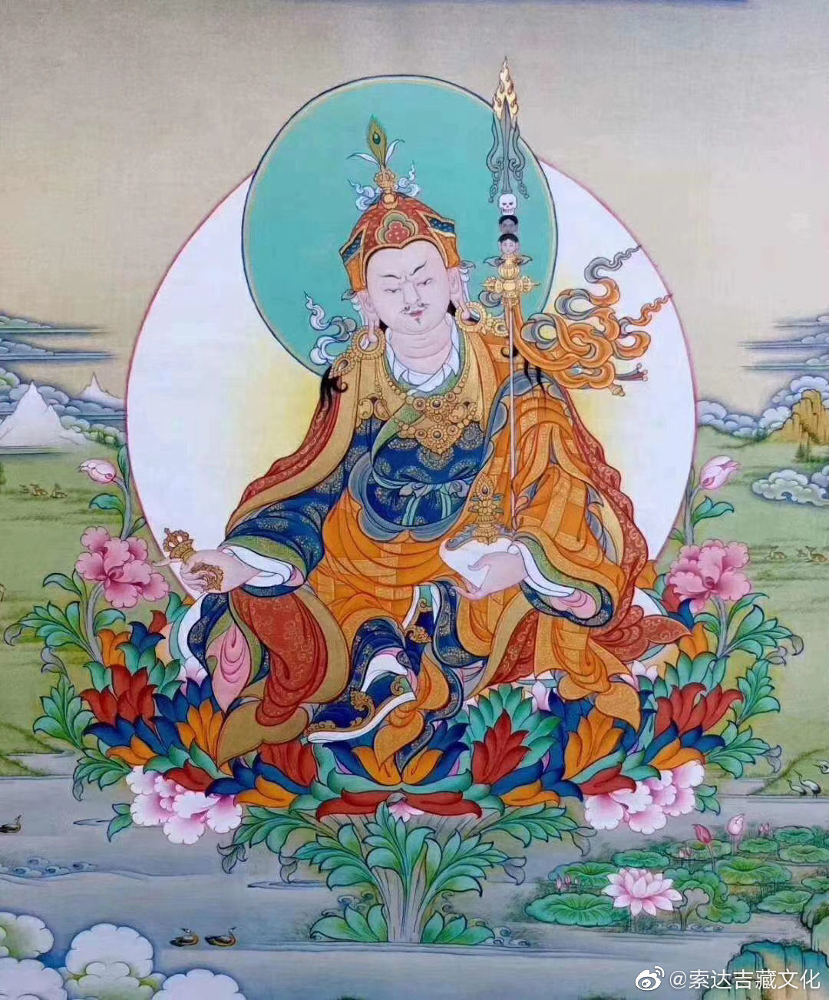
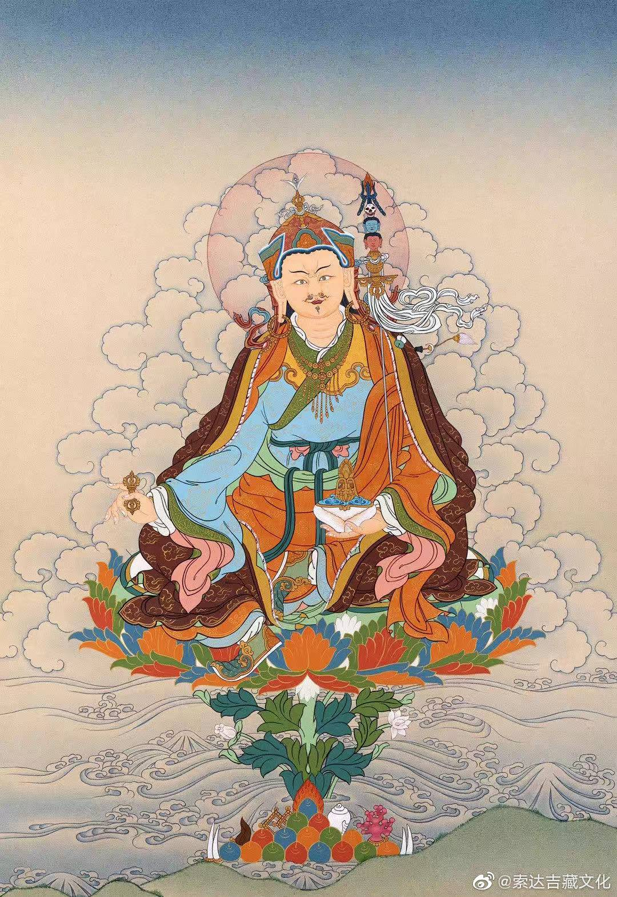
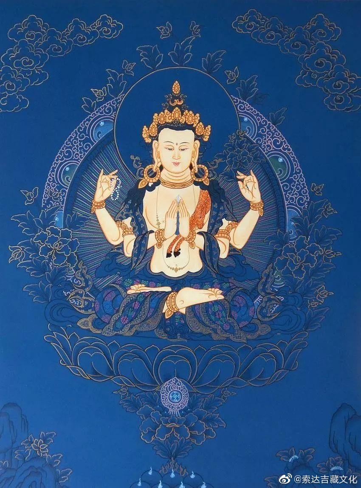
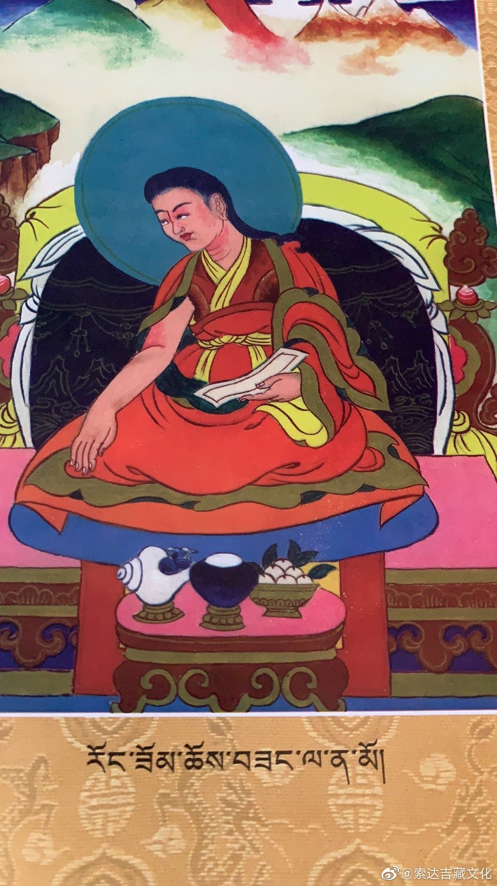
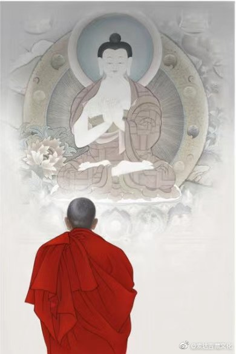
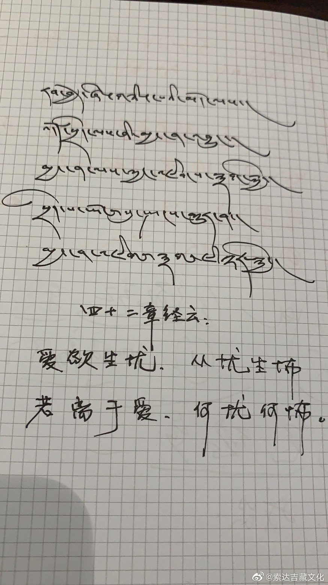
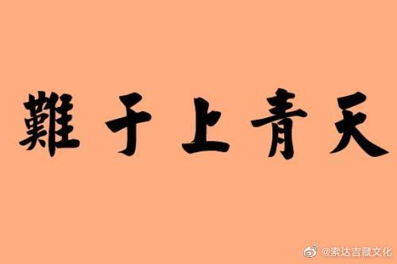

 ## 2021-01-06 15:23
འདི་བཏོན་ན་བྱིན་རླབས་ཤིན་ཏུ་ཆེ།         
དུས་གསུམ་སངས་རྒྱས་གུ་རུ་རིན་པོ་ཆེ།། དངོས་གྲུབ་ཀུན་བདག་བདེ་བ་ཆེན་པོའི་ཞབས།། བར་ཆད་ཀུན་སེལ་བདུད་འདུལ་དྲག་པོ་རྩལ།། གསོལ་བ་འདེབས་སོ་བྱིན་གྱིས་བརླབ་ཏུ་གསོལ།། ཕྱི་ནང་གསང་བའི་བར་ཆད་ཞི་བ་དང་།། བསམ་པ་ལྷུན་གྱིས་འགྲུབ་པར་བྱིན་གྱིས་རློབས།།

若以此时时祈祷莲花生大士，则会获得巨大的加持——
三时佛陀莲师尊，悉地遍主大乐者，
除障降魔忿怒相，汝前祈祷赐加持，
灭除内外密违缘，加持任运成所愿。

 ## 2021-01-18 22:14
དཔལ་ལྡན་ཟླ་བ་གྲགས་པས།  གང་ཚེ་རང་དབང་འཇུག་ཅིང་མཐུན་གནས་པས། །གལ་ཏེ་འདི་བདག་འཛིན་པར་མི་བྱེད་ན། །གཡང་སར་ལྷུང་བས་གཞན་དབང་འཇུག་འགྱུར་བ། །དེ་ལ་ཕྱི་ནས་གང་གིས་སློང་བར་འགྱུར། །ཞེས་གསུངས།
月称论师：
若时自在住顺处，设此不能自摄持，堕落险处随他转，后以何因从彼出。

 ## 2021-01-20 11:53
འཇམ་མགོན་ས་པཎ་གྱིས།               གདམས་པ་རྒྱ་མཚོ་ཁུང་དུ་མ་ཆུད་ཀྱང་།།
སྤྱི་བོར་བླ་མ་སྒོམ་ཞིང་དད་པ་ཡིས།།
མིག་ནས་མཆི་མ་འཁྲུགས་ཤིང་གསོལ་འདེབས་པ།།ཐར་བའི་ལམ་སྣ་ཟིན་པའི་སྒོམ་ཆེན་ཡིན།།ཞེས་གསུངས།
萨迦班智达：
虽未精通如海教，虔信于顶观上师，热泪盈眶而祈祷，乃入正道大修者。

 ## 2021-01-26 09:13
ལྟོ་འགྲངས་ཉི་མས་དྲོ་དུས་ཆོས་པའི་གཟུགས། རྐྱེན་ངན་ཐོག་ཏུ་བབས་ཚེ་ཐ་མལ་པ།
不要在一帆风顺的时候，装成修行人；不要在遇到挫折的时候，变回普通人。

 ## 2021-01-28 07:38
མི་ཚེ་ཐུང་ཐུང་འདི་ལ། འདི་ལྟ་བུའི་བླ་མ་དང་ཆོས་བཟང་པོར་འཕྲད་དུས། བྱང་ཆུབ་ཀྱི་སེམས་དང་རྫོགས་ཆེན་གང་རུང་ལ་གདེང་ཅུང་ཙམ་རེ་མ་ཐོབ་ན་ཧ་ཅང་ཕངས་བས་འདི་ལ་ངེས་པར་དུ་ནན་ཏན་དགོས་འུ་འདུག
在短暂的人生中，遇到如此殊胜的上师和正法，此时，在菩提心和大圆满方面若没有得到一点有把握的境界，则是最大的遗憾。我们对此应该值得精进。

 ## 2021-02-23 07:01
གཡུ་ཁོག་ཆོས་དབྱིངས་རང་གྲོལ་གྱིས། རང་གི་མདུན་གྱི་ནམ་མཁར་སྐྱབས་གནས་ཀུན་འདུས་ཀྱི་ངོ་བོ་སྤྱན་རས་གཟིགས་གསལ་བཏབ་ལ།     སྤྱན་རས་གཟིགས་ཀྱི་སྐུ་ལས་འོད་ཟེར་དཔག་ཏུ་མེད་པ་འཕྲོས། རང་གཞན་སེམས་ཅན་ཐམས་ཅད་ལ་ཕོག་པས་རྒྱུ་མི་དགེ་བ་འབྲས་བུ་སྡུག་བསྔལ་ཐམས་ཅད་དག་ནས་སངས་རྒྱས་པར་བསམ། དེའི་ངང་ནས་མ་ཎི་བཟླས་ན་སྐྱབས་འགྲོ་སེམས་བསྐྱེད་བསྔོ་བ་སྨོན་ལམ་རྣམས་ཚང་གསུངས།
意科·秋阳让卓尊者：
我们在自己前方的虚空中，观想一切皈依处总集的本体——观世音菩萨，其身体发出无量光芒融入自他一切众生，以此清净了不善的恶因和痛苦的恶果，最终获得无上正等觉。如果在这样的境界中念诵六字真言“嗡玛尼贝美吽”，则已具足了皈依、发心、回向和发愿。

 ## 2021-03-03 20:14
རྗེ་མི་ལ་རས་པས། མདོར་ན་མི་རྟག་མ་དྲན་པའི།།དམ་ཆོས་ཅི་བྱེད་གྱི་ནར་གདའ།། ཞེས་གསུངས།
米拉日巴尊者：
若不观无常，修法皆枉然。

 ## 2021-03-13 17:39
རོང་ཟོམ་་པཎ་ཆེན་གྱིས། ཆོས་སྤྱོད་རྣམ་བཅུ་ཤིང་ལེབ་ཀྱི་ངོས་ལྟར་གཅིག་ལ་གཅིག་སྒྲིབ་པར་གྱུར་པས། དེ་བས་ན་བསམ་གཏན་ལ་སྩོགས་པ་དོན་ཆེན་པོ་ལ་གནས་པ་རྣམས་ཀྱིས། ཡྀ་གེ་འདྲི་བ་ལ་སྩོགས་པ་དོན་ཆུང་ངུའྀ་ཆོས་སྤྱོད་མི་སྤྱད་དོ།། ཞེས་གསུངས།
荣索大班智达：
十种法行如同层层叠叠的板子一样彼此遮障。因此，安住禅定等大义者，不能行持缮写等小义之事。

 ## 2021-03-14 06:53
་རྗེ་ེབཙུན་ཏཱ་ར་ནཱ་ཐས། སྲིད་གསུམ་བདག་པོ་སྔར་ཡང་ལན་བརྒྱར་ཐོབ། །ངུར་སྨྲིག་རྒྱལ་མཚན་འཛིན་པ་ད་རེས་ཙམ། །ངུར་སྨྲིག་ན་བཟས་ཉིན་གཅིག་སྒྲིབ་པ་སྦྱངས། །ཞེས་གསུངས།
多罗那他尊者：
曾得百次三界主，身着袈裟唯此世，仅穿僧衣净日障。

 ## 2021-03-15 05:02
རྗེ་བཙུན་ཏོལ་བོ་པས། བདག་ནི་ཚེ་རབས་ཐམས་ཅད་དུ། །བསྟན་པ་གསལ་བར་བྱེད་གྱུར་ཅིག། བསྟན་པ་གསལ་བར་མི་ནུས་ནའང༌། །བསྟན་པའི་ཁུར་ཆེན་འཁུར་བར་ཤོག །ཁུར་ཆེན་ཁུར་བར་མི་ནུས་ནའང༌། །བསྟན་པའི་སེམས་ཁྲལ་བྱེད་པ་དང༌། །བསྟན་པ་ཉམས་ཀྱིས་དོགས་པ་ཡི། །བྱ་ར་ཙམ་ཡང་བྱེད་པར་ཤོག །མཁའ་ཁྱབ་ཕ་མ་ཐམས་ཅད་ཀྱི། །སྡུག་བསྔལ་ཐམས་ཅད་སེལ་བར་ཤོག །སྡུག་བསྔལ་སེལ་བར་མ་ནུས་ནའང༌། །དེ་ཡི་སྡུག་གྲོགས་བྱེད་པར་ཤོག །ཞེས་གསུངས།
多沃巴尊者：
愿我生生世，广弘如来法；纵不能弘法，愿担法大任；不能担大任，愿心系佛法，忧虑佛法衰，唯愿作护法。
愿我除天下，父母众生苦；纵不能除苦，亦作彼难友。
 ## 2021-03-17 08:11
🙏

 ## 2021-03-20 06:41
རབ་བྱེད་ཞེ་གཉིས་པའི་མདོ་ལས། བཅོམ་ལྡན་འདས་ཀྱིས་བཀའ་སྩལ་པ། གང་ཟག་རྣམས་ལ་ཆེས་དཀའ་བ་ཉི་ཤུ་ཡོད་དེ། དབུལ་པོས་སྦྱིན་པ་གཏོང་བ་ནི་ཆེས་དཀའོ།། ཕྱུག་པོས་ལམ་ཉམས་སུ་ལེན་པ་ནི་ཆེས་དཀའོ།། སྲོག་དོར་ནས་འཆི་བར་བྱེད་པ་ནི་ཆེས་དཀའོ།། སངས་རྒྱས་ཀྱི་མདོ་སྡེ་མཐོང་བ་ནི་ཆེས་དཀའོ།། སངས་རྒྱས་འབྱུང་བ་དང་འཕྲད་པ་ནི་ཆེས་དཀའོ།། མཛེས་པའི་གཟུགས་དང་འདོད་ཡོན་ལ་མི་ཆགས་པ་ནི་ཆེས་དཀའོ།། ཡིད་དུ་འོང་བ་མཐོང་ནས་དོན་དུ་མི་གཉེར་བ་ནི་ཆེས་དཀའོ།། གཞན་གྱིས་བརྙས་པ་ལ་ཞེ་སྡང་མི་སྐྱེ་བ་ནི་ཆེས་དཀའོ།། དབང་ཐང་ཆེ་ལ་རང་མཐོང་མི་ཆེ་བ་ནི་ཆེས་དཀའོ།། བྱ་བ་དང་འཕྲད་དུས་སེམས་མི་གཡོ་བ་ནི་ཆེས་དཀའོ།། མཐོང་རྒྱ་ཆེ་ཡང་གཏིང་ཟབ་མོར་དཔོག་པ་ནི་ཆེས་དཀའོ།། རང་ལྟ་དང་ང་རྒྱལ་གཞོམ་ཐུབ་པ་ནི་ཆེས་དཀའོ།། གསར་བུ་དག་ལ་བརྙས་བཅོས་མི་བྱེད་པ་ནི་ཆེས་དཀའོ།། སེམས་དང་སྤྱོད་པ་འདྲ་མཉམ་འོང་བ་ནི་ཆེས་དཀའོ།། གཞན་གྱི་སྐྱོན་མི་བརྗོད་པ་ནི་ཆེས་དཀའོ།། དགེ་བའི་བཤེས་གཉེན་དང་འཕྲད་པ་ནི་ཆེས་དཀའོ།། སེམས་ཉིད་མཐོང་ནས་ལམ་ཉམས་སུ་ལེན་པ་ནི་ཆེས་དཀའོ།། སེམས་ཅན་གྱི་ཁམས་དབང་མོས་པ་དང་བསྟུན་ནས་སྒྲོལ་བར་བྱེད་པ་ནི་ཆེས་དཀའོ།། ཡུལ་རྣམས་མཐོང་ནས་དེ་ལ་སེམས་མི་གཡོ་བ་ནི་ཆེས་དཀའོ།། ཐབས་ལ་མཁས་པའི་ཚུལ་ལེགས་པར་ཤེས་པ་ནི་ཆེས་དཀའོ།། ཞེས་གསུངས་སོ།།
《四十二章经》云：
佛言：人有二十难。贫穷布施难，豪贵学道难，弃命必死难，得睹佛经难，生值佛世难，忍色忍欲难，见好不求难，被辱不嗔难，有势不临难，触事无心难，广学博究难，除灭我慢难，不轻未学难，心行平等难，不说是非难，会善知识难，见性学道难，随化度人难，睹境不动难，善解方便难。

