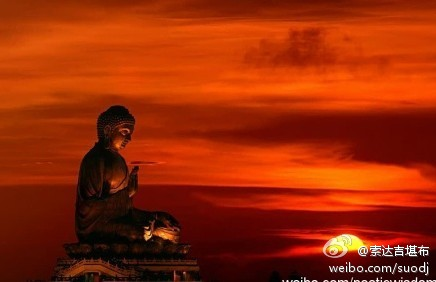

 ## 2011-01-01 09:56
今天是元旦节，也是西元纪年中一年365天的岁首，希望我们在新的一年里，能有一个行持善法的计划。文殊根本续云：“诸法即缘故，住于意乐上，何处发何愿，彼等定成就。”同时，我也默默祈祷上师三宝加持，祝你福慧双增、圆满吉祥，慈悲菩提心日日增上，能够利益更多的众生！
 ## 2011-01-03 15:21
明天14时40分到19时01分是日偏食。《时轮金刚》中说，在出现日食或月食的日子里，无论作任何善行，功德均会成千上万倍增长。汉地的《苏悉地经》亦云：“于月蚀时，成就最上之物；于日蚀时，通上中下成就之物。”故希望大家把握良机，精进行持善法！
 ## 2011-01-04 11:35
佛教比世间学问更甚深，世间学问尚要学十多年，佛教更不能只看几本书就自以为通达了。现在不少人看几页佛书就断章取义，自以为是，对不了解的就信口开河、肆意诋毁。莎士比亚在《仲夏夜之梦》中说：“千万不可评论你所不知道的道理，否则，你可能会用生命的代价，来补偿你所犯过的错误。”故不可不慎！
 ## 2011-01-05 12:37
近日看到一则消息：某省上半年仅餐桌上的浪费就超过10亿元。如此数量令人触目惊心，试想，若能将这些钱节省下来，资助失学儿童、孤寡老人、重病患者，这该是多么有意义！ 故我在此强烈呼吁：我们每一个人，尤其是高官富豪，请务必要减少浪费，量力而“吃”，将节省下来的钱多做慈善！
 ## 2011-01-07 08:38
如今许多人对出家的认识,多是来自影视,那里面演的出家人,尽是在万念俱灰后,心不甘情不愿地泪别红尘.于是大家普遍认为出家是种逃避之举.其实那些编剧几乎都是佛教盲,对出家的理解也是天马行空乱写一通,这种以盲导盲的下场,就是如今人们一见出家人,就觉得他肯定受了挫折,却从不知出家的伟大.可悲!可叹!
 ## 2011-01-08 08:03
若想探究事物的真相，必须要深入了解、多方观察，不能仅听一两句，便开始人云亦云。现在有些人听几句佛经，就认为佛教只是什么都不执著，于是千篇一律地排斥一切。却不知道什么都不执著，是佛教中的胜义谛，要想达到这种悟境，前提必须要积资净障；而且就算已经达到了，世俗中也不能轻视断恶行善
 ## 2011-01-09 12:58
作为地球上的一分子,关爱生命,付出爱心是我们每个人的负责,无论是什么宗教,乃至非宗教人士,让我们摒除狭隘的门户之见,以广阔包容的心,携手共同爱护整个地球,关注人类的环保.教育.健康等,为这个世间增添一分祥和与温暖.
 ## 2011-01-10 10:15
孔子有弟子问：“一生若行持一个法，该是什么？”孔子曰：“己所不欲，勿施于人。”自己希望怎样，别人亦如此，这是一种社会准则。如此换位思考、推己及人，佛教中也推崇备至，《入行论》云：“自与他双方，恶苦既相同，自他何差殊？何故唯自护？”故望大家处理任何事时，不求以心换心，但求将心比心
 ## 2011-01-11 17:40
现在许多人常陷入一种误区:科学无法解释的东西,就认为不科学,包括前世后世、因果轮回…其实科学的定义,是"暂时可被知而还没有被推翻的知识",所以科学不一定就是真理.假如一味地用科学衡量一切,此举本身也是种迷信.因此,我们对不了知的事物,要有一种理性的态度,不能轻易接受一切,也不要轻易否定一切
 ## 2011-01-12 00:25
西方学者经研究发现：一个人在社会生存，真正起作用的，思想和行为的态度占了85％，智慧只占15％。可现在的教育有点颠倒，老师、家长只重视分数、文凭，至于孩子的德行操守，根本不在考虑之列。所以，家长在教育下一代时，希望应将道德教育放在首位，要注重子女的“德才兼备”，而不是“才德兼备”
 ## 2011-01-13 05:05
联合国报告指出：2007年十大自然灾害，九件是因全球暖化而造成。全球暖化的主因，其实就是肉食。2009年欧洲议会气候委员会也承认这一点，瑞典议员扬斯.荷姆说：“你所能做的最有影响力的事，就是减少肉食，或完全停止吃肉。”倘若大家都吃素，就可以减少80%的全球暖化，我们的地球家园就能因此得救
 ## 2011-01-14 09:04
“问世间情为何物？直叫人生死相许。”男女之间的感情，历来为人们争相传颂。由于教育和媒体的引导，现在许多人对感情极为执著，因情而痛苦的比比皆是。其实，你若能了解一些佛教道理，比如万法皆为无常，缘合则聚、缘灭则散，以及一切都是空性之理，就会明白“情”也不过如此
 ## 2011-01-15 07:44
逢年过节，电视上、报纸上的广告，多是与酒有关。古往今来，芸芸众生借助于酒，演出了林林总总的醉生梦死。大家都高唱着“无酒不成席”，却忽略了酒是“穿肠毒药”。据世界卫生组织统计，酒中含有60种有害物质，中国每年死于酒精中毒的人数超过11万。故大家在对待酒这一问题上，但愿能有个正确态度!
 ## 2011-01-16 07:26
不少人让我推荐佛教的书，我个人觉得，对自己利益最大的就是《大圆满前行》。这本书深入浅出介绍了从开始学佛到最终成就的修行次第，不仅涵盖了藏传四大教派的修法引导文，汉传净土宗、华严宗、禅宗、天台宗的教义也包含于此。法王如意宝曾说：“依靠它，今生不修其他法也能成就。”
 ## 2011-01-17 00:25
假如把自己的希望与幸福，完全寄托在金钱、感情等上，那么这些一旦出现问题，人生就会像垮了墙基的墙壁一样，陷入崩溃。所以，我们活着到底是为了什么？务必要有个正确定位。倘若心胸十分宽广，将短暂的一生用来利他，那无论出现什么荣辱得失，都不会对自己有太大损害。
 ## 2011-01-18 00:05
我经常想:我们每个人虽然只是全球六十多亿人口的一员,但行为却能不同程度地影响周围很多人,倘若我们从自身做起,用内心慈悲,宽容,平和的光芒去照亮周围,就会给人类带来一份宁静,温暖与祥和.请记住!
 ## 2011-01-19 04:15
莲花生大士说：身语所做的善事里，没有比转经轮功德更大的了。故藏地很多人常使用转经轮。其实汉地也有转经轮的传承，早期的转经轮称为“轮藏”，相传是南朝梁代傅大士发明的，《神僧传》云：“有发于菩提心者，能推轮藏，是人即与持诵诸经功德无异。”所以凡欲求解脱者,望能经常使用转经轮
 ## 2011-01-20 01:20
现在有些人不承认因果，原因是看不到善有善报、恶有恶报。其实，因果报应并非想象得那么简单，农民播下了种子，尚且不会立即发芽结果，种子与果实之间还需要一段时间，那你又怎能要求造了善业或恶业后，很快就现前报应？但不管你是否承认因果，它的存在都真实不虚，大家万万不要“以身试法”
 ## 2011-01-21 07:54
命运虽然是存在的，但也并非一成不变。好命的人若肆无忌惮造恶，就算本该享受安乐，最终也会大打折扣，人生变得坎坷多舛；歹命的人若尽量行善积德，就算命中本该受苦，也会减少乃至消弭，命运会往好的方向转变。故命运掌握在自己手中，至于如何才能改变，却要遵循它的“游戏规则”。
 ## 2011-01-22 00:40
我不羡慕任何有钱财、有权势、有名声、有相貌的人,毕竟水泡再美也不堪一击,在这个世间上,我唯一羡慕心地善良、很有修行的人,因为他这种善根可以伴随生生世世,形影不离.同时,我对自己从小就遇到佛法,并能享用真理的美味甘露感到万分幸运
 ## 2011-01-23 01:05
假如遭遇疾病、痛苦、挫折等一切不顺，应当如何面对？理当一心一意地祈请三宝：“如果我生病对众生有利，请加持我生病；如果我病愈对众生有利，请加持我病愈！”面对痛苦和死亡等也是同样如此.这即是大乘窍诀的精要所在
 ## 2011-01-24 00:01
我们的心若被嗔火焚烧，即使身处优雅的环境，周围充满美丽的花朵、动听的歌声、可爱的微笑，也不可能感到快乐；而一个内心柔和清净的人，纵然所处的环境极其恶劣，自己也是充满愉悦的。所以，外在的环境并没那么重要，调伏自心才是一切快乐的源泉
 ## 2011-01-26 00:15
今天看《大藏经》时，发现了个特别喜欢的教证—《如来不思议秘密大乘经》云：“世间财宝聚还散，王官水火贼盗分，诸佛多闻妙法财，多俱胝劫不坏失。”意思是说，世间的财富辛苦赚了，也会离散，终被国王、水灾、火灾、盗贼瓜分；而听闻佛法的圣财，多生累劫也不失坏，这才是每个人应追求的!
 ## 2011-01-27 02:05
发生在我们身边的任何一件事，无论祸福，都不是绝对的。表面上看似不如意的坏事，可能是激发潜力、让自己一鸣惊人的因缘；表面上顺风顺水的好事，也许会让自己玩物丧志，最终身败名裂、一败涂地。因此，祸与福可以互相转化，诚如《老子》所云：“祸兮，福之所倚；福兮，祸之所伏。”
 ## 2011-01-27 23:15
有人问，佛教大德为何不以神通度化众生？《长阿含经》中就有现成的答案，佛告坚固：“我终不教诸比丘为婆罗门、长者、居士而现神足上人法也，我但教弟子于空闲处静默思道。若有功德，当自覆藏，若有过失，当自发露。”可见，若无特殊必要，高僧大德除了开显佛理引导众生外，一般不会轻易示现神通
 ## 2011-01-29 00:12
每个人都有本俱的佛性，但因被无明烦恼所遮障，故无法现见。若能通过上师的窍诀遣除障碍，当下就会通达佛性在凡夫时不减、在成佛时不增之理。就像宋代的宁茶陵郁禅师开悟时所说：“我有明珠一颗，久被尘劳关锁。今朝尘尽光生，照破山河万朵。”那么，你的“明珠”呢？
 ## 2011-01-30 00:01
每当过年过节、聚餐宴会时，人们在酒足饭饱之后，餐桌上常一片狼藉，剩的食物堆积如山，让人看了非常心痛。虽然很多人会背“锄禾日当午，汗滴禾下土，谁知盘中餐，粒粒皆辛苦”，但真正做到的却寥寥无几。要知道，一粥一饭皆来之不易，吃不完应该“兜着走”，每个人当惜福啊！
 ## 2011-01-31 05:29
现在有些学净土宗的人，认为自己往生就可以，其他众生都不管，如果你有这种想法，那绝对无法往生。大乘经论的“往生四因”中就强调了菩提心的重要性，汉传佛教的弘一大师也说过：“唯求自利的人，不能往生。”因此，求往生者一定要发菩提心!
 ## 2011-02-01 00:07
有些人骂人、挖苦人特别刻薄，什么话都说得出口。虽然凡夫人难免有脾气，但有时还是要克制一下。否则，气头上说的话，往往是口不择言，就算后来意识到不对，但话已出口，想收回来就难了。因此，语言上要温和，切莫伤害别人，不然，“利刀割体痕易合，恶语伤人恨难消”，偶尔的伤害也许需要一生来抹平
 ## 2011-02-02 00:20
父母关心孩子的话，方法其实尤为重要。很多人认为，让孩子考上大学，给他买房子、买轿车，留下丰厚的家产，为他成家立业做好准备，就是为人父母的责任。虽然我们也不排斥这些，但最关键的应该是，让孩子从小就接受人格教育，培养慈悲心、利他心，这比给他什么都有意义！
 ## 2011-02-02 23:45
我合掌祈请八吉祥佛、八吉祥菩萨、八吉祥天女、八吉祥护法，在新的一年里，赐予你健康、安乐、圆满，遣除一切不顺、违缘、痛苦，昼夜六时恒吉祥，殊胜菩提心日日增上，能够利益更多众生！
 ## 2011-02-04 00:36
前不久，我翻阅了一些有影响的人物传记，发现许多人之所以成功，是因为内心极其坚强，就算面对难忍的逆境，也能迎难而上、从不言退；而有些人之所以失败，是因为内心十分脆弱、不堪一击，即便是微不足道的挫折，也能让他终生一蹶不振。所以，成败的关键在哪里？就在自己的心力强大与否，请牢记！
 ## 2011-02-04 23:30
很多人都知道佛教承许一切皆空，但“空”又是什么，却很少有人能解释清楚。其实，真正的“空”并非什么都没有，而是远离了空、不空等一切戏论，这种境界以语言和思维无法表达，唯有证得圣果才能了知。故大家不要望文生义！
 ## 2011-02-06 07:19
这次在放生过程中，我再次深深体会到了生命的可贵。《佛报恩经》云：“如我不喜死，一切三界二十五有、有形无形四足多足，乃至蚁子有命之属，亦复如是。是故菩萨，乃至自丧身命，终不枉夺他命。”这段话有特别甚深的涵义，你能明白吗？
 ## 2011-02-07 00:05
现在很多人看到佛塔、佛像等时，不知道该怎么转绕。其实一般而言，左绕（逆时针）有毁坏的过失，右绕（顺时针）有兴建的功德，对此大家务必要注意。汉地大藏经中的《右绕佛塔功德经》，也广讲了右绕的功德。世俗当中缘起不灭，故作为佛教徒，这些基本常识一定要懂！
 ## 2011-02-08 06:58
近来常有不少人说，自己有很多烦恼、痛苦，问我该如何才能遣除？其实方法虽然有，但并非只说寥寥几句，就能让你的烦恼荡然无存。若想真正自在解脱，就必须系统听闻佛法、深入学习佛法，否则，其他方法只能是隔靴搔痒、望梅止渴。佛陀在《正法念处经》中也说：“若离闻法，无有一法能调伏心。”
 ## 2011-02-09 02:52
尽管出家修行功德很大,但每个人的善根和责任毕竟不同,故不可能一概而论,让每个人都舍弃红尘.然而,一个人若能行善利他,就算是在家修行,也与出家差别不大,诚如佛陀在《过去现在因果经》中说：“一切造善恶，皆从心想生，是故真出家，皆以心为本。”
 ## 2011-02-10 00:45
这次出来在个别城市讲了几堂课，内容主要有《信心的重要性》、《劝阅大藏经》、《金钱有多重要》、《护持佛法的必要》、《佛教的核心》、《寻找大乘的方向》等，并在几次放生中作了随机开示，但愿这些能给大家带来点滴的利益！
 ## 2011-02-11 00:21
我们理应做到日行一善,就算每天只有一丝微笑、一句爱语、一点悲心,也会给周围带来一分温暖和谐.如此积少成多,便可积善成德,自己也会如古人所说:"苟日新,日日新,又日新."
 ## 2011-02-27 09:32
如果未以正知正念经常观察起心动念、言谈举止，即使你看起来很了不起，但由于法没有融入心，行为也容易与正法背道而驰，不知不觉就误入歧途。所以，我们要时时观察自己的身口意，一旦发现不如法之处，务必要当下断除；倘若觉得自己还不错，则应以欢喜心继续行持！
 ## 2011-02-28 00:14
昔日寒山问拾得曰：“世间谤我、欺我、辱我、笑我、轻我、贱我、恶我、骗我，如何处治乎？”拾得云：“只是忍他、让他、由他、避他、耐他、敬他、不要理他，再待几年你且看他。”
 ## 2011-02-28 23:27
我从小就很喜欢莲花生大师，心中经常观想、祈祷，并持诵莲师心咒。因为莲师是一切诸佛的总集，尤其在末法时代，他是降伏一切鬼神魔众的本尊。回忆自己的修行历程，莲师对遣除违缘的加持非常大。你若是对莲师有信心，就算不会念些仪轨、祈祷文，最好也能多念莲师心咒：嗡啊吽 班则革日班玛色德吽
 ## 2011-03-02 00:41
佛陀在大乘经典中亲口说，众生的语言，大致分为三种：上等者为称心如意之语；犹如蜂蜜；中等者为真实语，好似鲜花；下等者为虚语或颠倒语，如同不净粪。人与人之间互相交流，语言确实非常关键，故我们应舍弃最后一种语言，尽量说真实、称心的话语。
 ## 2011-03-03 00:13
别人有求于自己时，作为智者，首先会慎重思考，从不轻易承诺。一旦已经承诺了，则会一诺千金，至死也不改变。而愚者与之不同，做任何事之前不会观察，别人拜托什么马上答应，这种轻易许诺必定很少守信用。《老子》也说：“夫轻诺必寡信，多易必多难。”
 ## 2011-03-04 00:05
无论遇到什么逆境与磨难，都不要扰乱自己平静的心。倘若事情还可以补救，就没有必要生气、忧恼；倘若事情已无法挽回，那生气忧恼又有什么用呢？我也经常用这段话来提醒自己,收获还是蛮大的,哈哈~
 ## 2011-03-05 00:51
昔日，娑竭罗龙王问佛陀：“是否有一法简单易行，却能涵盖一切？”佛陀回答：“有四殊胜法，若能受持读诵、深解其意，用功虽少，获福甚多，与读诵八万四千法藏功德无异。四殊胜法是什么？诸行无常，一切皆苦，诸法无我，寂灭为乐。”这在《佛为海龙王说法印经》中有记载，望大家经常读诵，并领会其意
 ## 2011-03-06 01:26
《观世音菩萨授记经》中说，观世音菩萨在因地时，是个可爱聪明的小童子，他曾在金光师子游戏如来面前问：“香花、音乐、卧具、衣服、医药这些供养里，哪一种是最好的？”佛陀告诉他：“能发起利益一切众生的菩提心，这就是最好的供养。用无数珍妙的物品供养诸佛，不如以菩提心，回向成佛的菩提道。”
 ## 2011-03-07 00:16
现在很多人都希望发财，想方设法改变风水、生辰，以期自己财富盈门、财源广进。其实，佛陀曾明明白白告诉过我们，发财的因是什么？不是发财树，不是貔貅兽，不是水晶球，而是布施。舍得舍得，有舍才有得；舍不得舍不得，不舍则不得。假如你始终把非因当成因，最终只能是南辕北辙。
 ## 2011-03-08 00:12
中华慈善总会一项统计表明：中国拥有80%以上社会财富的富人，对慈善事业的捐赠小于15%。与之形成强烈反差的是，中国却是世界上最大的奢侈品消费市场之一。其实且不说这些富人，就算是城市里的普通人，把一顿大餐或一件名牌衣服的钱节省下来，也足以资助贫困地区的孩子上学，从而改变他们一生的命运
 ## 2011-03-09 00:23
说话要掌握分寸，倘若你想什么就说什么，即便对方碍于情面，不好意思当面拒绝，但心里也很不舒服。其实，不恰当的语言，往往是一切祸害的根本，诚如憨山大师所言：“惹祸只因闲口舌，招愆多为狠心肠。”故我们平时与人交往时，说话应张弛有度，不要信口开河。
 ## 2011-03-10 00:36
好事，坏事？行善，造恶？这之间到底该如何区分呢？关键要看自己的发心。如果你发的是善心，就算结果不尽如人意，但也是功德一件；如果你发的是恶心，就算结果皆大欢喜，但仍算不上是善法。宗喀巴大师也说：“心善地道亦贤善，心恶地道亦恶劣，一切依赖于自心，故应精勤修善心。”
 ## 2011-03-11 00:17
昨天见了两位从耶鲁毕业的复旦老师，在交流过程中，他们说经过多年研究，觉得佛教确实是揭开真理面纱的捷径。对此，鲁迅也有过类似感慨。他的挚友许寿裳在《亡友鲁迅印象记》中写道，鲁迅对他说：“释迦牟尼真是大哲，我平常对人生有许多难以解决的问题，而他居然大部分早已明白启示了，真是大哲！”
 ## 2011-03-12 00:08
近来云南和日本都发生了严重地震,许多人一下子就家破人亡,流离失所,死伤相当惨重!为了超度已逝的亡者,抚慰幸存的生者,让我们共同祈祷阿弥陀佛和观音菩萨,共诵圣号与心咒!相信以诸佛菩萨的发愿力与咒语的谛实力,以及我们的净信力,定可令存亡获益!嗡玛尼贝美哄~
 ## 2011-03-12 23:43
昨晚，我在上海复旦大学，与老师和同学们进行了佛法交流，主题是“佛教眼中的物质世界”。期间，我对量子力学与空性之间的关系，进行了比较与分析,并在结束时引用了原中国科技大学校长朱清时院士的一句话——“当科学家千辛万苦爬到山顶时，佛学大师已经在此等候多时了！”希望有缘者也可以思维此理。
 ## 2011-03-13 21:59
日本9级地震后，海啸、余震、核泄漏、火山爆发等一系列灾难此起彼伏，不断威胁着更多人的生命。我看了之后非常难过，深感科技再发达、财富再圆满，在死主面前也都同样脆弱。今天，我再次发出强烈呼吁：祈请大家猛烈祈祷莲花生大士、度母等诸佛菩萨加持，希望灾难不要升级，不要再发生更严重的险情！
 ## 2011-03-15 00:11
有些人学佛、行善被人嘲笑，自己就开始闷闷不乐。其实这也没什么可忧恼的。古人曾说：“下士闻道，大笑之，不笑不足以为道。”对于真正的大道，下士总是大声嘲笑，若不被他们嘲笑，也就谈不上是真正的“道”了。所以，大家的善行遭人讥笑时，没必要以此为耻，而应当引以为荣。
 ## 2011-03-16 00:11
看了这两天日本地震的系列报道，不禁让我想到了《佛所行赞》中的一句话：“如是观三界，无常无有主，众苦常炽然，智者岂愿乐？”
 ## 2011-03-16 15:44
昨天在南京放生后，去一户农家吃饭，吃了野生的荠菜、芦蒿、马兰头、菊花脑，看到了大棚里正在生长的草莓。此情此景，让我想起了自己十几岁放牦牛时，在山上采的野草莓……这顿饭吃得很香，觉得大城市里忙忙碌碌的人，也应该去寻找一种回归自然、返璞归真的快乐。
 ## 2011-03-18 00:22
我们应经常这样念诵并发愿：愿我乃至生生世世中，获得具足七德之善趣；愿我出生立即遇正法，具有如理修持之自由；愿我能令上师生欢喜，日日夜夜之中行正法；愿我悟法后修精华义，彼生越过三有之大海；愿我能为众生传妙法，成办他利无有厌倦心；愿我能以无偏大事业，令诸有情一同成正觉。
 ## 2011-03-19 01:31
美丽的净土,是我梦中的天堂;慈悲的佛陀,是我终生的偶象.忙碌的人们,你趋向何方?正法的明灯,为你而点亮!
 ## 2011-03-20 00:50
父母在世时，作为子女，最好能多抽出时间关心他们、体贴他们、照顾他们。否则，一旦父母离开了人间，到时就算想报答他们的恩德，也没有这个机会了，正所谓“树欲静而风不止，子欲养而亲不待”。
 ## 2011-03-21 00:47
当你了悟贪嗔等烦恼的本来面目时，烦恼即是菩提；而假如你没有认识它，那么烦恼就是烦恼，与菩提的距离遥不可及~
 ## 2011-03-22 00:11
  
 ## 2011-03-22 06:36
关于该如何为人处世，法王如意宝曾告诉我们一个极好的窍诀：对上者应当恭敬有加，对平等者理应和睦相处，对下者应该慈悲爱护。多年以来，此窍诀令我受益匪浅，面对很多事情都游刃有余。
 ## 2011-03-24 00:19
当前许多知识分子最需要的，是宗教信仰的教育，道德伦理的教育，假如没有这些，即使你外在的物质再丰富，世间的才智再敏锐，也不会找到真正的快乐！
 ## 2011-03-24 22:32
只要有时间，不管跟什么人交谈，我都很乐意，只要有吃的，不管是什么口味，我都不挑剔，只要有意义，不管到什么地方，我都有回家的感觉。我们每个人应该学会适用，随缘，自在，在日常生活中时时发现快乐。
 ## 2011-03-25 12:20
反观自心，当下了悟，超离言思，感恩上师。哈哈！
 ## 2011-03-26 12:11
对人事物的执著越大，引生的痛苦就会越多。断除痛苦最根本的方法就是要证达无我空性。可是如今人们^_^
 ## 2011-03-27 08:30
人身难得如昙花，寿命无常如闪电，轮回皆苦如火宅，从中解脱极重要。祈请三宝赐加持，正法融入自心中，即身成就殊胜果，利益无量诸有情！——在马尔康的一家面馆中有感而发
 ## 2011-03-27 22:22
早上在路边吃面很香。吃完后走了约200米，突然听到背后一声大吼，回头一看，一个60多岁的老妇女，穿着花上衣，戴着脏围裙，朝我冲了过来，紧紧拽住我不放。我茫然地问她干什么，她狠狠地说：“面钱！”我这才恍然大悟，发现不小心吃了霸王餐。面钱是7元，我赶紧掏出10元给她，她受之无愧地扬长而去了
 ## 2011-03-27 22:23
这一幕实在让人哭笑不得！不禁想起了几年前和慈诚罗珠堪布参加一个佛教论坛，在去素餐馆的路上，我俩看到一个称体重的服务，就兴致勃勃称了一下。那个老太太说要一人一元，结果我们翻遍了身上所有的角落，也没有发现钱的影子。老太太使劲抓住我俩不放，我们只好打电话请人送钱，这才化解了一场尴尬~
 ## 2011-03-28 09:02
有句俗话说：“众口铄金，积毁销骨。”意即众口一词，能熔化金石之坚；毁谤不止，能颠倒是非，置人于死地。昔日一代名伶阮玲玉，自杀时留下的遗书中，就提到了“人言可畏”。所以，语言虽然没有形色，但有时比武器还具有杀伤力。故我们每个人平时说话时，都要心存厚道、口下留情！
 ## 2011-03-29 08:56
印光大师说：“菩萨畏因，众生畏果。”菩萨从“因”上可以看到“果”的可怕，故会不惜一切断除恶因，防患于未然；而凡夫造恶“因”时肆无忌惮，直至遭受苦“果”时，才会避之唯恐不及，但此时“果”已成熟，想改变也是千难万难了。看看周围发生的一切，你对此会有所感触吧！
 ## 2011-03-30 00:07
现在很多人所追求的幸福，就像手中的沙，握得越紧，流失得越快，到头来只是空欢喜一场。倒不如怀着一种“得之我幸，不得我命”的心态，在为事情努力的同时，对结果如何不要过于放在心上，一切随缘……
 ## 2011-03-30 18:44
我们不能过于崇拜现在的理论知识，其实在宗教信仰中，存在许多无法用这些解释的甚深现象。我确信，一个人不管内心有何所求，只要一心一意祈祷佛，必会带来与自己根基和业缘相应的利益。甚至仅仅称一声“南无佛”，对今生来世也有不可估量的意义！
 ## 2011-03-31 00:38
凡是看我微博的人，不管你信不信佛，我本人都有一事相求：假如你不是很为难，在心甘情愿的情况下，请无条件地出声各念三遍：“南无本师释迦牟尼佛”、“南无阿弥陀佛”、“南无莲花生大师”、“南无观世音菩萨”。谢谢！这对自他都有利！
 ## 2011-04-01 08:42
春天踏着轻快的脚步来了。花儿开始吐露芬芳，风儿变得和煦温暖，天是那么碧蓝，云是那么舒卷，放眼四周是如此美丽，我们又何必为了一点区区小事而斤斤计较呢？
 ## 2011-04-01 09:18
今天是西方的愚人节，听说东方不少人也效仿他们，纷纷以骗人为乐。在当今时代，唯一不缺的就是骗人，又何必独为它设个节日呢？口说一句妄语，就算是开玩笑，过失也极大，佛陀曾言：“乃至戏笑尚不应妄语。”哎，多希望以后能有个“智”人节啊！
 ## 2011-04-02 06:45
什么样的人才最快乐？是富可敌国者？倾国倾城者？权倾一时者？还是名震天下者呢？都不一定。佛陀告诉我们，知足之人才是天底下最快乐的。《佛遗教经》中云：“知足之人，虽卧地上，犹为安乐。不知足者，虽处天堂，亦不称意。”对照自己，你快乐吗？
 ## 2011-04-02 10:03
学院突然下雪了

 ## 2011-04-02 10:06
我的小院子

 ## 2011-04-02 10:07
我的小木屋

 ## 2011-04-03 00:28
也许你少请一顿饭，这世界就会少一个挨饿的人；也许你少买一件衣服，这世界就会少一个受冻的人；也许你少看一场电影，这世界就少一个无书可读的孩子；也许你少买一盒营养品，这世界就会少一个无钱买药的病人。其实，营造美好的世界，只是来自你小小的改变：一份心，一点力，一滴水，爱成海……
 ## 2011-04-04 00:06
有一次，我见到一个著名企业家，月赚一亿，问及他心中的理想，他回答：“做大！”后来我遇到一个小饭店老板，月赚一百，问及她心中的愿望，她也回答：“做大！”听到同样的答案，我不禁哑然失笑。“做大”也许是现在不少人的梦想，但幸福真是建立在这个基础上吗？
 ## 2011-04-16 08:58
祈祷上师三宝恒时加持我们一切众生：从根本上认识心的本来面目，远离一切烦恼痛苦，获得最究竟的无上安乐，而不要一直被虚幻不实的外境迷惑！一旦我们真正认识了心的本性,此时所得到的快乐,会远远超过外境任何五欲所带来的感官刺激!
 ## 2011-04-18 08:49
当你拥有一切美好时，切莫狂妄自大；当你遭人冷遇时，也不必垂头丧气。人生的路本来就弯弯曲曲，遇事不乱、淡然处之，才是智者之举！
 ## 2011-04-19 08:52
当你拥有令人羡慕的青春，请不要忘了，这一切迟早会变成鸡皮鹤发；当你自由自在地幸福活着，请不要忘了，死亡的恐怖也许会突如其来；当你为今生短短几十年而殚精竭虑，请不要忘了，漫长的来世也需要你为它奠定方向……
 ## 2011-04-20 10:38
以智慧来寻求究竟真理，以悲心来爱护一切生命，以正信来获得明心见性——这是自古以来无数大成就者所经历的历程！
 ## 2011-04-21 09:48
法王如意宝曾说，佛菩萨的十万大愿，汇集起来就是普贤十大愿王；而普贤十大愿王若进一步浓缩的话，则是弘扬佛法、利益众生！你知道吗？
 ## 2011-04-22 08:43
我们宗教徒与非宗教徒之间，应以开放包容的心态，互相学习、互相理解、互相关爱。对此，我觉得雷蒙德.约翰.鲍思有一句话非常好：“我们的时代要求我们，敞开堵住的洞穴，并且发现彼此。只有如此，我们才能愈合苦痛的灵魂，并且开放我们的心胸去爱！”
 ## 2011-04-23 00:34
世间八法是什么？愿获得利养，不愿遭受衰败；愿获得快乐，不愿感受痛苦；愿获得称赞，不愿被人讥讽；愿获得荣誉，不愿遭遇诋毁。修行人若没有平息这世间八法，则没有看破今世；若没有看破今生，想解脱就难如登天。
 ## 2011-04-24 06:00
人与人之间的矛盾与摩擦，实际上大多是由于耽执自己而引起的，如果对自己一点都不耽著，很多摩擦也不会出现。
 ## 2011-04-25 06:28
对于伤害自己的人，纵然生不起慈悲心，也不应当生嗔恨心，因为对方是被无明烦恼所迫，身不由己……
 ## 2011-04-26 08:58
人生短短几十年，想找个与自己相濡以沫的伴侣，尚且要经过长期接触，了解对方的家世背景、学识、人格，那我们寻找生生世世慧命所依的上师，又岂能过于轻易草率？法王如意宝说，现在不少人一听有个上师来了，就像饿狗遇到精肉般饥不择食，不经观察就匆忙依止，不久又开始四处诽谤，这种现象不太合理啊！
 ## 2011-04-26 10:47
好花不常开，好景不常在，一切皆无常...

 ## 2011-04-27 08:19
当我们感受快乐时，应意识到这是往昔善业的果报，在自己享受的同时，也要将此善根回向给一切众生；当我们遭受痛苦时，应意识到这是往昔恶业的果报，在自己励力忏悔的同时，也要发愿代受其他众生的痛苦——这是将顺境、逆境转为道用的殊胜窍诀，也是日常生活中最关键的修行。
 ## 2011-04-28 08:35
随着全球工业化越来越发展，对资源的占用、浪费、摧毁，到了无以复加的程度：土壤破坏、温室效应、生物灭绝、森林锐减、水源污染、臭氧层空洞……使昔日的青山绿水、蓝天白云，已成了故事里的神话。印度圣雄甘地曾说：“地球所提供的，足以满足每个人的需要，但不足以填满每个人的欲望。”望大家深思！
 ## 2011-04-29 08:58
生命如风中之油灯，随时面临熄灭的危险。米兰.昆德拉说：“生活是一棵长满可能性的树。”谁也难以断定，下一步可能面临什么。所以，我们每个人要珍惜眼前啊！
 ## 2011-04-30 05:31
在古代，人们日出而作、日落而息，生活非常悠闲自在。后来人们发明了机器，目的是为了减少自己的工作时间，以便拥有更多空闲。然而适得其反的是，现在人们反而要跟着机器跑，比以往更加忙碌不堪，“过劳”的现象此起彼伏。其实人要学会放松、随缘，这样才能令浮躁的心沉淀下来，慢慢显露出智慧的光芒
 ## 2011-05-01 00:20
今天是五一劳动节，但大多数人却不用劳动，好多已在劳动中麻木的人，终于等到了一个在休息中升华的机会。其实，适当休息放松一下，也有利于今后更好地工作。祝福大家节日快乐，疲劳身心得休息~
 ## 2011-05-02 08:18
在我少年的记忆里，最佩服的人就是依罗喇嘛。我读小学时，一直住在他家。每天天还没亮，他就起床念咒、磕头、看书，下午坐禅，晚上念经。十几年来，从不间断。直至他去世，已念了五亿多心咒。“不积跬步，无以至千里；不积小流，无以成江海。”一时的勤奋不算什么，一生的勤奋才是最重要的！
 ## 2011-05-02 08:35
我最喜欢的释迦牟尼像

 ## 2011-05-03 00:04
身体所在的环境，往往会随心而改变。心若是调伏了，周遭的环境自会随之安静。哪怕是身居闹市，也能如如不动。晋代陶渊明就说过：“结庐在人境，而无车马喧，问君何能尔？心远地自偏。”
 ## 2011-05-03 23:37
心净

 ## 2011-05-04 00:05
自暴自弃是人生最大的失败。对心力强大的人来说，磨难再大也挡不住自己，只要在困难面前永不言败、誓不低头，相信自己肯定能战胜它，迟早有一天会见证到这种力量的不可思议。苏东坡也曾说：“古之立大事者，不唯有超世之才，亦必有坚忍不拔之志。”
 ## 2011-05-05 00:32
对于身边需要帮助的人，我们当有钱出钱、有力出力、有智出智，诚如《大宝积经》中所言：“无慧劝慧，贫者给财，病者施药，无护作护，无归作归，无依作依。”这一点不单我们佛教提倡，墨子也曾说：“有力者疾以助人，有财者急以分人，有道者劝以教人。若此，则饥者得食，寡者得衣，乱者得治。”
 ## 2011-05-06 00:28
常有人认为，学佛后就什么都不执著。却不知自己津津乐道的“什么都不执著”，也是一种极大的执著。其实，在没有明心见性之前，我们必须要执著善的、对的，这就相当于渡河的舟船，在未到彼岸之前不能将它抛弃。否则，刚到河中就把船给扔了，结果会怎么样？相信你我都很清楚。
 ## 2011-05-07 00:04
有人问：“我身体不能出家，但心出家也可以吧？”我的回答是：“身体出家还算简单，心出家才是最难的。你身体不能出家，恐怕就是因为心没出家吧。”其实，说大话谁都没问题，然而你真正能做到吗？真能看破一切、舍弃今生吗？自己要好好掂量一下！
 ## 2011-05-08 00:02
藏族有一句话：“母心如水，子心如石。”在这个以自我为中心的当今社会，太多的子女纷纷以家庭、工作为借口，将母亲拒在自己的世界之外，对她身体的衰老、内心的孤独不闻不问，忘记了她养育自己是如何含辛茹苦、任劳任怨。今天正逢“母亲节”，让我们重新唤醒对母亲的感恩吧~
 ## 2011-05-08 22:31
要想制服自己的心，灭除一切烦恼，只看一两本书,修行很短的时间，是远远不够的。就像一位重病缠身的慢性病患，仅仅服了几颗药，便希望自己大病痊愈、健康如初，这无疑不太现实~
 ## 2011-05-10 08:10
今天农历四月初八，是释迦牟尼佛的诞辰日。我们应当感恩佛陀，为众生开启了如此殊胜的智慧与大悲之门，望大家多念“南无本师释迦牟尼佛”！

 ## 2011-05-10 11:33
这是1995年法王如意宝在国外参加“浴佛节”的情景。这张照片是我当时亲手所拍，一直珍藏至今，今与大家分享：

 ## 2011-05-11 05:32
昨晚我得到一本书——《雪域求学记》，然后就以好奇心，一口气把它读完了。书中描写了在战乱时代，一个人从13岁学佛到80多岁的曲折经历，详细刻画了当年来赴藏地求法的经过。作者说在学佛的过程中，无论发生什么情况，“自己始终以一颗惭愧心依法修行，不敢有丝毫懈怠！”
 ## 2011-05-11 22:22
供养佛尊

 ## 2011-05-11 23:41
当今社会很多怪病层出不穷，不管是身体上的四大不调，还是精神上的抑郁症、自闭症，许多人罹患之后四处求医，却常药石无效。之所以如此，佛教中说，疾病的成因有两种，一是前世的业力，二是今生的外缘。后者治疗起来相对容易；但前者的话，单靠求医问药很难治愈，此时就需要忏悔业障了！
 ## 2011-05-12 08:47
三年前的今天，汶川遭受了8级强烈地震，据资料统计，6.9万人瞬间失去了最宝贵的生命。三年后的今天，让我们一起为亡者共诵观音心咒：嗡玛呢叭美吽。希望每个人至少念100遍以上~

 ## 2011-05-12 23:52
济公，不少人都听过他的大名，并以为这是神话人物，却不知他在历史上真真实实出现过。他举止似痴若狂，但却是得道高僧，并被尊为禅宗第五十祖。他曾说：不礼爹娘礼世尊，敬什么？冤冤相报几时休，结什么？世事如同棋一局，算什么？聪明反被聪明误，巧什么？是非到底见分明，辩什么？

 ## 2011-05-13 14:56
我在等它开花....

 ## 2011-05-14 00:05
当今时代，需要大家有互相合作的能力。但一个人若没有良好的人格，与人合作时就会经常发生矛盾，战火不断、硝烟弥漫。这样的话，就算他有再过硬的技术、再绝伦的才华，最终也会如梦中摔碎的杯子、水泡上破裂的月影一样，这些都无有用武之地。那么，人格的基础是什么呢？就是要心地善良，不损害任何人。
 ## 2011-05-14 00:10
一切枝叶等依树根

 ## 2011-05-15 00:52
若多念南么阿弥陀佛，西方极乐刹土不遥远。

 ## 2011-05-15 08:47
战场上，士兵正要用枪打死一位老僧。老僧问：“你可以等一下吗？”说罢腾空而起，落地时盘腿而坐，瞬间他已坐化了，眼角还挂着一滴泪。他为什么如此呢？原来，佛经中记载，杀圣者要堕入地狱，老僧悲悯这位士兵，为免他造下恶业，宁可提前结束自己的生命。那眼角的泪，正是对众生的大悲~
 ## 2011-05-16 00:03
佛在《涅槃经》中曾说：“有信无解，增长无明；有解无信，增长邪见。”一个人光有信心、却无智慧，这种信心就是迷信，只能徒增自己的无明愚痴；光有智慧、却无信心，这种智慧会成为自己傲慢的资本，最终只能增长无边的邪见。所以，信心与智慧犹如人的双足，缺少一个的话，在解脱的道路上都走不了多远!
 ## 2011-05-17 00:12
从前，有个不孝子想把年迈的母亲背去山林扔掉。他一路走，母亲一路用树枝做标记。为了防止母亲沿标记回来，他专挑弯曲偏僻的羊肠小道，把自己累得浑身是汗。最后，他把母亲往地上一扔，狠狠地说：“走了这么远，看你还怎么回去！”母亲低声说：“我做标记不是想自己回去，是怕你迷路。”这，就是母爱~
 ## 2011-05-17 23:22
刚才吃了几粒樱桃，口中满是甜甜的滋味，不禁让我饮水思源，想到这些樱桃从播种、采摘、贩卖、运输……中间每一个环节，都充满了无数人的汗水。古人曾说：“一粥一饭，当思来处不易；半丝半缕，恒念物力维艰。”愿我们对身边每一件事物，都懂得感恩、惜福！

 ## 2011-05-18 23:25
佛教并非劝所有的人都割爱出家，对男女间的爱情、婚姻也并非一味否定。如佛陀在《善生经》中，就教导夫妻之间理应相敬如宾，丈夫应以五事爱敬妻子，妻子应以十三事敬顺丈夫，如此才能夫妻异体同心，家和万事兴

 ## 2011-05-19 23:16
如果你面前有两个选择：一是变成牛马等畜生，却天天得闻佛号；一是大富大贵、尊荣无比，但一生中也听不到佛名。有智慧的人当选哪个呢？应当选前者。因为只要听了佛号，就会很容易解脱，而暂时的利禄却生不带来、死不带去。佛在《华严经》中也说：“宁在诸恶趣，恒得闻佛名，不愿生善道，暂时不闻佛。”

 ## 2011-05-20 22:54
当你觉得特别痛苦时，应当去找这颗痛苦的心在哪里，当你遍寻不得它时，痛苦自然就解脱了。这个窍诀极为殊胜！当年禅宗二祖慧可，也请达摩祖师为他安心，达摩祖师说：“把心拿来，我为你安。”慧可怎样都找不到这颗心，达摩祖师说：“我已为你将心安好了。”

 ## 2011-05-21 23:20
如果你是狮子，别人骂你是狗，你不会真的变成狗，故不用为此而生嗔；如果你是狗，别人赞叹你是狮子，你也不会真的变成狮子，故不必为此而生喜。所以，别人的赞叹，不会让你变好；别人的指责，也不会让你变坏，这些没什么可执著的。我们应以这样的心态，对待他人对自己的评价。
 ## 2011-05-22 22:52
一个人能不能交到好朋友，关键也在自己。当朋友揭露你的过失时，你没必要暴跳如雷，而应把他当作最好的老师。为什么呢？因为就算是再完美的人，也难免会有发现不了的过失，需要旁边有人经常提醒，就像唐太宗以魏征为镜。假如你冥顽不灵、顽固不化，不肯虚心接受并改正，那“完美”就会慢慢离你而去。
 ## 2011-05-23 23:19
刚才有个人经深思熟虑后剃度出家了，她原是美国田纳西大学的博士后，在出家申请中她是这样写的：“三十年来一场梦，来去空空无由头。莫道韶华诚可惜，苦海沉浮不计秋。但抛尘中万千事，坐观弥陀金颜开。何日识得真面目，还报老母未展眉。”
 ## 2011-05-24 22:55
有人认为，皈依、出家等都是一种形式，只要自己心善就可以了，没必要去走这个过场。但实际上，在某些情况下，特定的形式还是非常有必要。否则，如果说所有的形式都多此一举，那世间男女只要心中有爱就可以了，又何必大费周章去登记结婚、举办婚礼呢？
 ## 2011-05-26 00:04
当你被人误会、冤枉或不理解，怒不可遏、火冒三丈时，千万不要在冲动的情况下，做出任何决定和行为。请停一停、缓一缓，深吸一口气，在心里默数十个数，这样给自己一个冷静的机会，就不会冒然做出不理智的傻事。假如你本身真的没有错，那清者自清，是非以不辩为解脱~
 ## 2011-05-26 23:34
这是20多年前，我在国外红花花园的一张照片。这一切就像刚发生在昨天，逝者如斯夫啊~

 ## 2011-05-27 23:32
我们佛教提倡知足少欲、生活简单，其实世间上不少的科学家也是如此。爱因斯坦就说过：“我相信，简单淳朴的生活，无论在身体上还是在精神上，对每个人都是有益的。”
 ## 2011-05-28 17:38
开了一朵供养三宝

 ## 2011-05-28 17:52
献给诸位喜欢花儿的人，愿你们花开见佛...

 ## 2011-05-28 23:20
许多人都听说过“大乘佛教”这个词，但大乘佛教最甚深的精髓是什么呢？不少人却不甚了了。其实，用一句话来概括的话，就是《华严经》中所说的：“不为自己求安乐，但愿众生得离苦。”
 ## 2011-05-29 23:00
听到有人赞美自己，理应心怀恐惧之感，唯恐自己生起骄慢；听到有人讲自己缺点，应当生大欢喜心，因为这有利于自己进步。若能做到这一点，一切功德就会渐渐亲近你。
 ## 2011-05-30 22:39
有些道理，并不是仅仅明白就可以了，明白之后还要尽量去做。《黄帝内经》中也说：“道者，圣人行之，愚者佩之。”对于真正的大道，圣人会依这个法则来活着，而愚者只是记在心里，把它当成玉佩一样挂着。
 ## 2011-05-31 23:43
送给可爱的小朋友们祝儿童节快乐

 ## 2011-06-01 08:30
今天是“六一”儿童节，我学校的很多孩子兴奋得一整夜没睡，一大早就爬起来化妆，准备节目。看着一张张天真、激动的小脸，我也不禁被他们的喜悦所感染……但愿普天下的孩子都有个快乐的童年，对周围的一切能懂得感恩！
 ## 2011-06-01 08:37
今天好开心

 ## 2011-06-01 23:00
在生命的旅途中，偶尔会突然出现一个陌生人，改变我们命运的方向。就像今天有人跟我说，多年前在她父亲死亡之际，彷徨无助、不知所措，此时有人送了一本佛书，她不经意翻了一下，当下心灵有了归宿感。时至今日，她仍感激那个送书的人——相信在你我身上，或多或少都有这样的经历，都有值得我们感激的人
 ## 2011-06-02 23:23
我们在处理问题、解决纠纷时，不管一方的理由听起来多么言之凿凿，也不能单单听信一面之词，而要尽量了解双方的情况，这样才能做到公平、合理。这也是我自己多年以来的经验之谈~
 ## 2011-06-03 22:25
你心中有什么样的目标，就会成就什么样的人生。在实现它的过程中，即使你面临无数风雨，以及周围人的不理解和攻击，但只要自己是对的，就不要太在意别人的看法。是否成功，时间自然会证明一切！
 ## 2011-06-04 21:39
不要觉得自己不行，只要付出了努力，迟早会有属于你的一片天！像大名鼎鼎的爱因斯坦，小时候说话结巴、行为迟钝，大家都觉得他愚蠢笨拙；大发明家爱迪生，幼年以健忘而闻名，在全校中成绩最差。他们后来都成了著名的科学巨人，以自己的能力改变了世界。看看他们，你又有什么资格自暴自弃呢？
 ## 2011-06-05 23:48
有人认为，极乐世界只是唯心所现，实际上根本不存在，所以不必希求往生净土。有这种想法的人，不妨看看你对这个世界的执著如何？倘若你能把这个世界的一切也看空，不吃饭、不睡觉对自己丝毫无损，那把极乐世界看空也可以；否则，如果这个世界对你是真实的，那极乐世界也是如此。
 ## 2011-06-06 21:45
学习佛法应当一门深入，还是博览群书呢？这个不能一概而论，因为众生的根基各不相同。有些人性格比较简单，信心非常具足，这种人就可以选择一门深入；有些人分别念比较多，甚至对佛教常生怀疑、邪见，这种人就必须广闻博学，以遣除内心疑惑。所以，这不能千篇一律，要具体问题具体分析。
 ## 2011-06-07 23:09
西红柿最早被称为“狼桃”，人们认为有剧毒，连碰都不敢碰，结果第一个吃西红柿的人，需要很大的勇气，才发现了它美味可口。我们探索未知的真理也应如此，除了自身的压力以外，还有来自外界的种种阻力。但如果你带着顽强的毅力勇往直前，好运给你带来的成就，也是无人能及的。
 ## 2011-06-08 11:12
龙井茶田

 ## 2011-06-08 22:33
佛教最关键的一个问题，就是要分清二谛——世俗与胜义。万法在胜义中皆为空性，无有一法可执著；在世俗中，却是因果、轮回无欺存在，必须要断恶行善。若不明白这一点，往往就会将二谛混淆，认为一切皆空，行持善法也没有必要，如此，则无法通达佛教的究竟意趣。
 ## 2011-06-09 20:13
从今天开始，喇荣五明佛学院将举办为期七天的金刚萨埵法会。佛经云：若能念诵十万或四十万遍金刚萨埵心咒“嗡班杂萨埵哄”，则失毁根本誓言的罪过，也能得以清净。故在这个殊胜的日子里，祈请大家能为清净自他一切众生的罪障，而精勤、认真地念诵。

 ## 2011-06-10 15:37
在佛经中，常用芭蕉树，比喻万法显现上非常壮观，但从外到里一层层剥开后，结果却是“外强中干”，根本找不到实质的部分。正如《三摩地王经》云：“如湿芭蕉树，人析求其坚，内外不得实，诸法亦复然。”

 ## 2011-06-11 13:43
到了武汉，吃了当地特色小吃“热干面”后，那种感觉就像禅宗所说的一样，无法形容，用任何语言都表达不出来，呵呵~

 ## 2011-06-11 23:20
现在常流行一些莫名其妙的说法，都戴上“佛教”的帽子，好像佛教就是给人算命、怪力乱神的。其实，我们在听到任何一种“佛教说……”时，最好是问问对方：“佛教在那部经论中这样说？”否则，没有明辨是非的话，就会全盘接收、人云亦云，被似是而非的观点引入歧途。
 ## 2011-06-13 02:20
精进、看破、放下、自在、解脱。
 ## 2011-06-13 17:18
在大乘佛教中，对怨恨的敌人不但不能报复，还要想办法施恩予他。正如澳大利亚著名的畅销书作家安德鲁•马修斯所说：“一只脚踩扁了紫罗兰，它却把香味留在那脚跟上，这就是宽恕。”
 ## 2011-06-14 21:51
身为一个演员，在全心投入角色时，并不会忘记自己是谁。同样，我们在轮回中饰演各种角色时，也不要忘记心的本来面目，不要忘记轮回中的一切，只是演戏而已。
 ## 2011-06-15 19:15
明天（6月16日）凌晨2：23—6：03，将出现月全食。此时修持善法，功德将呈七千万倍增长。汉地《苏悉地经》亦云：“于月蚀时，成就最上之物。”本月又恰逢佛陀诞生、成佛、涅槃的萨迦月，原本行善功德就会成万上亿倍增长。故此良机望大家把握，精进修行！

 ## 2011-06-16 19:55
一个人的心胸，多欲则窄，寡欲则宽。
 ## 2011-06-17 15:26
当我们遇到悦意的对境时，无论是幽静的山谷、清澈的河流、芬芳的鲜花、可口的美味，都应将上师三宝观想在自己上方，然后在其面前作意幻供养。如此在日常生活中，无勤便可积累很多资粮。就像这一朵花，我们现在就可以观想供养上师三宝~

 ## 2011-06-18 13:58
但凡做一件事情，即使它困难重重，只要坚持不懈、持之以恒，也有成功的一天。假如你不能坚持，做段时间就放弃了，腐朽的木头也不能折断；但若你矢志不渝、坚持到底，那金子、石头也能被雕刻。诚如《荀子》所云：“锲而舍之，朽木不折；锲而不舍，金石可镂。”
 ## 2011-06-19 15:02
一个贪财的修行人，整天心心念念想着怎么弄到钱，修行必定一无所成；一个贪财的世间人，为赚钱而损人利己、作奸犯科，即使拥有一时的风光，下场也不会尽如人意。所以，生活宁静淡泊就好，没必要不择手段追求不属于自己的东西

 ## 2011-06-20 15:14
惩恶即是扬善，这种说法对吗？其实关键要看自己的心态。如果有些人冥顽不化、屡教不改，你不是以嗔恨心、而是以慈悲心去惩治他，不想让他继续错下去，就像妈妈责打孩子的心一样，这在佛教中也是提倡的。
 ## 2011-06-21 12:03
安身不如安心，屋宽不如心宽，养身不如养心，外求不如内求~
 ## 2011-06-22 11:26
磕头，除了佛经中说功德不可思议以外，对我们强身健体，其实也非常有利。我家乡就有一位老人，从年青起就坚持每天磕100个头，至今也从不间断。现在他虽有96岁了，但仍身体硬朗、精神矍铄，上楼梯也不需要人扶。

 ## 2011-06-23 11:39
我的窗外有一棵树，现在是夏天，它长得枝繁叶茂、赏心悦目。不过一切美好皆为无常，还是不能太留恋这些，而应抓紧时间尽快修行。记得明代一元大师说过：“西方急急早修持，生死无常不可期，窗外日光弹指过，为人能有几多时？”

 ## 2011-06-24 11:34
“好莱坞传奇影星”伊丽莎白.泰勒说：在这一生中，我拥有美貌、声名、成功和财富，但却没有拥有幸福。她的这句话，让你明白了什么？

 ## 2011-06-25 11:30
昨天惊喜地在山上发现几朵小花，勾起了我小时候的回忆——记得14岁前我天天放牛，当时最喜爱山上三种花，这就是其中之一。这种花非常奇特，只生长在夏天的雪山上。那时我在雪地上光着脚，每天不间断念一两万遍观音心咒，虽然自己学习知识很晚，但对三宝的信心倒是很足！

 ## 2011-06-26 10:29
“一寸光阴一寸金”，这句话不少人一听，可能没有什么触动。但如果我们换一种说法：假设你可以活80岁，一年365天算下来，你一生才2万9千多天，不到3万天。所以，人生真的很短啊！你现在在干什么呢？

 ## 2011-06-27 07:34
心好命又好，富贵直到老；命好心不好，福变为祸兆；心好命不好，祸转为福报；心命俱不好，遭殃且贫夭。——《心命歌》
 ## 2011-06-28 11:14
心胸狭窄的人极度敏感，不经意的一句话，就能把他伤得体无完肤，跟他相处就像守着一颗“定时炸弹”，时时提心吊胆，不知何时就会突然爆炸；心胸宽阔的人豁达大度，不但自己不会整天患得患失、怨天尤人，也会给周围带来平和安乐，让人不由自主想与之接近。所以，容人的气度非常重要，凡事不必太过计较
 ## 2011-06-29 10:23
吃肉，就是在吃众生的生命。吃得太多，不管你信不信，迟早都会用自己的命来偿还。所以，若能断肉茹素，以五谷、蔬菜、水果代替肉类，这是再好不过的。但若实在做不到，也请尽量少吃，一周减少一次，一天减少一顿，一顿减少一菜……这样积少成多，定对自己有利。附：《吃肉之过患》O网页链接
 ## 2011-06-30 15:48
明天（7月1日）15：53——17：25将发生日食，这是今年4次日食中的第3次。望大家不要错失良机，精进修行！
 ## 2011-06-30 15:49
为什么日月食是极为重要的修法时机呢？《时轮金刚》认为，外在的日、月，是人体内在气脉明点的一种投影。我们每个人每天的呼吸次数是21600次，其中绝大多数是业气，智慧气的比例很少。但在这些特殊的日子里，多数业气就变成了智慧气，气脉明点运行处于特殊阶段，在这时候精进修行，其效果会非比寻常！
 ## 2011-07-01 07:36
英国物理学家、化学家法拉第，晚年拒绝了国家授予的爵位,常去实验室做些杂事。一天,有位年轻人来做实验,他对正扫地的法拉第说:"干这活，给的钱不少吧?"他笑笑:"再多点，我也用得着。""老头,你叫什么名字?""迈克尔.法拉第。"年轻人惊呼:"天哪！您就是伟大的法拉第先生!"他纠正:"不,我是平凡的法拉第。"

 ## 2011-07-02 07:22
人生之所以痛苦，是因为追求了错误的东西……

 ## 2011-07-03 09:51
这是我们学校在进行德育考试——考《弟子规》。通过学习，孩子们一个个变化很大，尊老爱幼、知书达礼、进退有度……令老师、家长都赞不绝口。而如今，很多大人对此却置若罔闻，从来没有学习过，这是相当遗憾的。其实，这本书真的特别好，如果你有时间能学一下，对为人处世会有很大帮助！

 ## 2011-07-04 10:14
请静心想一下：你的人生中，哪几个人对你最有恩德？你打算如何对他（她）报恩？
 ## 2011-07-05 09:18
无论做什么事，都要有一种心力。古人云：“人一能之，己百之；人十能之，己千之。果能此道矣，虽愚必明，虽柔必强。”别人一次就能行的，我可以花上百次功夫；别人十次就能行的，我可以花上千次功夫。若真能如此，再笨的人也会变得聪明，再柔弱的人也会变得坚强。

 ## 2011-07-06 09:26
现在的社会，人们对生活标准定得太高，不论是房子、车子、手机、穿戴，都喜欢追求心目中的最好。这样一来，由于欲望是无有止境的，不管你是否达到了目标，内心也不会感到真正满足。其实，生活的轻松快乐，要从充实内心做起，而不是盲目地攀比、追求~

 ## 2011-07-07 10:03
雅奈兹.德尔诺夫舍克博士，是一位素食总统，他严格奉行素食主义，深信动物和人类一样，拥有生存和享受生命的权利。关于吃素、打猎、动物实验、穿皮草等一系列问题，他都有自己独到且精彩的见解，大家不妨一阅：O一位素食总统的故事 -智悲佛网

 ## 2011-07-08 10:17
不少人认为，只要找到个好上师，就像买了永久保险，以上师的大悲加持，自己肯定解脱无疑。其实，佛陀亲口说过：“吾为汝说解脱法，解脱依赖于自己。”所以，佛陀或上师的大悲，是通过开示真理，给你指出解脱的方向，至于去不去，关键还是靠你自己。
 ## 2011-07-09 08:24
心不清净，就会将别人的缺点无限放大；心若清净，周围无一不是菩萨。
 ## 2011-07-10 10:12
假如我们详细观察，就会发现一切痛苦的来源，其实都是在维护“我”。所以，佛陀宣讲了斩断我执的空性，以此可根除一切痛苦。
 ## 2011-07-11 09:17
性格不好的人，本事再大也让人退避三舍。就像有毒的罂粟花，再妖娆夺目也令人不敢问津。

 ## 2011-07-12 08:42
什么叫修行呢？修行分为观察修、安住修。观察修是先听经闻法，再进行思维，以自己的智慧观察这些法义；安住修，是在寂静的环境中，断除粗大的分别念去观修。所以，不仅仅打坐是修行，听法也是一种修行。
 ## 2011-07-13 08:35
现在不少人对出家人不满，其实佛陀在《宝积经》中说：“在家处忧，出家欢喜；在家系缚，出家解脱；在家多患，出家无患。” 《本缘经》亦云：“以一日一夜出家故，二十劫不堕三恶道。”所以，真正的出家，确实具有无比功德。即使你暂时做不到，最好也应尽量随喜！

 ## 2011-07-14 10:35
对一位清华学子来说，读了这么多年书，学历好歹也是个博士了，为什么还要信佛呢？学识渊博+教授职称+足够的钱+清闲的日子+贤慧的妻子=生命价值，这样的人生能让自己满意吗？活着，到底又是为了什么呢？请看：一位清华学子学佛感悟O网页链接

 ## 2011-07-15 09:25
在行动中思考，在生活中修行~

 ## 2011-07-16 09:25
世界上最珍贵的是什么？对我来说，是生命。不仅仅是我，包括你在内，一切众生莫不如此。所以，我们万万不能杀生，不能随意去掠夺他众的生命！

 ## 2011-07-17 09:07
近来，我参加了首届世界关爱论坛，它的主题是“关爱环境、关爱生命”。此论坛倡议，将每年的7月17日设立为“世界关爱日”。我当时在发言时说：关爱的对象不仅仅是人类的弱势群体，还应该包括那些被残杀的动物，希望大家也能在每年的“7.17”尽量多放生。
 ## 2011-07-18 07:42
俗话说：“哀莫大于心死。”世上最悲哀的事，莫过于心已经死了。心若没有死，即使自己身体残疾、命运坎坷，人生也能柳暗花明，总有走出低谷的一天，就像美国盲聋女作家、慈善家海伦.凯勒一样。那么，心要怎么才能活过来呢？就是要尽量利益众生，多想别人，少想自己。
 ## 2011-07-19 08:34
我们要习惯于做对他人有益的事，而不是损人利己的事；口中要多赞美他人的功德，而不能口如利刃，处处伤人；心里要与人为善,宽厚包容，而不要刻薄、尖锐，总寻找别人的过失。
 ## 2011-07-20 09:50
现在的人们，欲望越来越大，空间越来越小，车子越来越多，马路越来越窄，房子越来越高，道德越来越低，怎么办呢？

 ## 2011-07-21 09:28
若想改变社会的风气，就要从改变孩子的教育抓起。不要从小就灌输他们找更好的工作、赚更多的钱、买更大的房子、开更贵的车……而应该告诉他们尽量舍己为人，为大众服务。这样的话，未来才有希望，人们才会更快乐！
 ## 2011-07-22 09:42
什么是慈善呢？佛陀在《涅槃经》中说：“若于一众生，不生嗔恚心，而愿与彼乐，是名为慈善。”如果对于一个生命，不生起害他（它）的嗔心，希望他（它）得到快乐，这即是慈善。所以，做慈善不一定是有钱人的专利，只要有利他的善心，人人都可以参与。
 ## 2011-07-23 09:50
现在越来越多的人对“慈善”开始予以关注，甚至不少明星以自己的影响力，纷纷宣传慈善，救济弱势群体，“不独亲其亲，不独子其子”。其中，李连杰、姚明就是很典型的例子。姚明说：“在国外做慈善，习惯成自然，就像喝水一样平常。”这种“习惯”实在令人羡慕。但愿我们也能早日养成~
 ## 2011-07-24 10:03
有些人学佛之后，出现一些感应、梦境，就自以为得。其实，这些都没什么了不起，不必太过执著。若想知道你的修行有没有增上，关键不是看这些外相，而要看你看破一切的出离心、利益众生的菩提心有没有增长。如果没有，这些感应就会成为你傲慢的因，反而是解脱的大障。
 ## 2011-07-25 07:03
近来，发生了挪威袭击血案、温州动车追尾特大事故，很多人瞬间就与我们阴阳相隔，幸存的人心存梦魇、极其哀痛。索马里等非洲国家也出现了罕见大旱，超过1100万人受灾。除了人类以外，每天还有大量动物遭杀。他（它）们真的很可怜！为了减轻其痛苦，望大家多念观音心咒：嗡玛尼贝美哄~
 ## 2011-07-26 07:50
请假条：这几天我要前往一个城市讲法，因为那里没这个信号，故暂时无法发微博，特此请假几天~

 ## 2011-08-02 10:26
我回来了！明天正好是我的生日，尽管我本人微不足道、不值一提，但若有人对我有一点点好感，我不需要其他什么，只要你们能作些放生，哪怕只是一条生命，这也是给我最好的礼物！
 ## 2011-08-03 07:51
今天是藏历六月初四——佛陀初转法轮日，我们佛学院也正在举办地藏法会，此日行持任何善法，功德都不可思议。最近阿秋法王示现了圆寂，不管是哪位大德前往什么刹土，他的遗愿都是希望我们利益众生。所以望大家多多放生，尽量行持善法！

 ## 2011-08-03 21:43
今天也和大家一起放生了！祈愿天下太平、众生安乐、佛法久住、普利有情！

 ## 2011-08-04 06:04
昨天我依靠微博、博客的种种途径，得知了各地放生、行善的情况，内心由衷高兴。十分感恩大家！如今中国微博使用人数已超过2亿，人人都在用它成办各种利益，我们也应依此多做对自他有利的事！
 ## 2011-08-04 09:59
有些人对放生不太了解，比如很多人围着放生的动物在干什么？淡水的动物放到海里，是放生还是放死？放生为什么很重要？……我以前讲过这方面的问题，大家如有兴趣，可以看看O网页链接
 ## 2011-08-05 06:35
有些人明知不能造恶业，但遇到一些诱惑时，却往往随波逐流。这是什么原因呢？就是因为你信心不够，对造恶的过失只是了解而已，心底里却没有完全相信。如果你真的信了，就像明知是毒药就肯定不会喝一样，又岂敢让自己随便造业呢？
 ## 2011-08-06 07:03
爱有两种，一是占有，只要自己快乐，不考虑对方如何；一是付出，只要对方快乐，不考虑自己如何。红尘中的芸芸众生，口口声声说爱，朝朝暮暮谈情，但仔细观察，多数人的爱只是自私的占有——对方让自己快乐，才爱他；一旦他背叛了，就因爱生恨。这样的爱，只会让自他痛苦，又有什么可津津乐道的呢？
 ## 2011-08-06 07:40
在藏地花草里若一休息会让l你忘记赶路

 ## 2011-08-07 07:10
作为大乘菩萨，爱众生之心，就像母亲慈爱独子一样，不是口头上说说，而是从骨髓里发出来的。这种爱是无私的、无条件的，正如《大乘庄严经论》所言：“爱他过自爱，忘己利众生。”
 ## 2011-08-08 09:12
很多人在微博中都说想要了解佛教，问我应该怎么样学习。如果你有时间，最好能系统学一下印度寂天菩萨造的大乘窍诀精要——《入行论》。虽然我讲得不一定很好，但这些是佛菩萨的金刚语，不论你修显宗或密宗，都需要通达此论的内容。O网页链接

 ## 2011-08-09 08:00
在学佛的过程中，闻法和实修必须要并重，缺一不可。如果你不喜欢闻法，没有通达佛教的基本理念，修行就会成为盲修瞎炼；如果你只懂理论，却从来没有修过，只会说而不会做，就会变成“法油子”。
 ## 2011-08-10 08:25
佛教是一门非常深奥的学问，不经过系统学习，很多道理你不会明白。许多人刚学佛很有热情，但渐渐地，信心就退失了，修行不能善始善终。原因是什么呢？就是因为你不懂佛法，很多言行只停留在表面上，面对烦恼却不能对治~
 ## 2011-08-11 07:24
现在很多人因为生活、工作的压力，内心焦躁不安，经常患得患失。若想调整这些不良心态，佛教中的禅修非常有效。禅修最简单的窍诀，就是先专注盯着一尊佛像，看一会儿再闭目观想，如此不断训练，直至观想得非常明显、清晰。这样做不但可调心养身，还可以开启智慧、消除业障，有诸多殊胜利益。

 ## 2011-08-12 07:30
庄子在《秋水》中说：跟井底之蛙不可以讲大海，因它被狭小的环境所局限；跟夏天之虫不可以讲冬天的冰雪，因它被短暂的生命所局限；跟乡曲之士不可以谈论大道，是因为教养的束缚。所以，我们提起佛教中的神秘领域，比如极乐世界的存在，许多人常嗤之以鼻，这应该也是他们见识狭隘所致。
 ## 2011-08-13 09:15
天好宽广啊！但比天空更宽广的，是人的心。让我们都不要再被自私自利所束缚了，让心回归到本有的宽广状态中吧~

 ## 2011-08-14 08:19
现在很多人常说，不喜欢佛教的某种形式，只喜欢它的理论。其实，很多“形式”是理论的载体，有了这种“形式”，理论会以此而传承下去、延续下去。就像在世间上，仪式、习俗是传统文化的载体，有了它，许多传统文化便不会断灭。所以，真正有意义的“形式”，可起到传承文化的作用，必须要保留下去

 ## 2011-08-15 07:39
密宗为什么要保密？密宗是专搞神通的喇嘛教吗？密宗是藏传佛教独有的吗？视师如佛，是否依人不依法？密宗的即生成佛是否合理？……如果你有这些疑惑，可以了解一下“什么是密宗”O网页链接
 ## 2011-08-16 07:38
没有正确方向的人生是盲目的、迷茫的。许多人忙了一辈子，到头来却一事无成，甚至苦不堪言，原因就是他们没有明确的人生追求，从来没思考过人生什么最重要？这些自以为重要的东西，是不是真的有价值？
 ## 2011-08-17 08:32
大乘佛教的人生观、价值观是什么？承认前世后世存在，就是它的人生观；一心唯求利他，则是它的价值观。
 ## 2011-08-18 09:24
有个画家，在白纸上画了一个点，装在相框里，作为自己的座右铭。其实，这张画的意义非常深刻：我们执著于一点，往往会钻进死胡同，忽略周围的很多很多，全然不发现还有大片的空间。所以，大家也可以在白纸上画个黑点，放在床头桌前，不开心时就看一看，以此来提醒自己~
 ## 2011-08-19 09:44
一个人的信仰，最好要通过智慧来抉择、观察。有了智慧的信仰，就不太会改变，这种信仰也很稳定；没有智慧的信仰，则容易成为一种迷信，随着别人说好说坏，自己就会人云亦云、变来变去。
 ## 2011-08-20 10:10
在关于藏地的许多影视、图片中，常会出现一个旋转的转经轮，作为藏地风光的代表；无论去藏地的哪个寺院，也能发现大大的转经轮，好几个人的力量才可以推动。转经轮到底有什么功德呢？经常转动经轮又有何必要？如果你想知道，可以看看O网页链接

 ## 2011-08-21 08:25
学佛的人有几种发心：为自己今生的人天福报、为自己来世的人天福报、为自己的解脱、为众生的解脱。就算做同一件善事，不同发心的话，功德也各不相同。所以，对于表面上相似的行为，我们不要以经验去妄加评论，因为我们看不到他们的内心~
 ## 2011-08-22 07:31
我们的两所小学，这两天正在为新学期而招生，昨天一共收了330多个藏族孩子，大多数都是贫困儿童和孤儿。看着他们绽放的笑脸、期盼的眼神，我和老师们虽然辛苦一点，但也是值得的！

 ## 2011-08-23 08:19
一棵大树需要不断吸收水分、养料，才能茁壮成长、枝繁叶茂。同样，我们的人生也要经常吸取有价值的知识，慈悲、智慧的养料水分，才会焕发出它的光彩。一旦离开了这些，生命就会暗淡无光，日趋枯萎…

 ## 2011-08-24 09:07
现在人们有句俗话叫:"恨爹不成钢."痛恨自己的爹为什么不是李嘉诚,为什么不是李钢?其实按照佛教的因果观,你今生有什么样的爹,是你前世的业力造成的,所以没必要一味抱怨外境不公平,而应该从自己行善积福做起!
 ## 2011-08-25 07:59
一根纤细的毛发，放在手掌上，不会有什么感觉；但若放进眼睛里，就会痛苦万分。同样，一件小事，对心量大的人来说，并不会放在心上；但若落到心量小的人头上，则会反应非常强烈，一直耿耿于怀、不能释然~

 ## 2011-08-26 09:12
大至一个国家，小至一个家庭，大大小小的战争、冲突，都是以自我为中心而爆发的。若能拥有一颗利他的心，那不管遇到什么样的敌人，都可以化敌为友，没有什么矛盾是化解不了的。如此，则不难实现所谓的“和谐社会”~

 ## 2011-08-27 08:31
如今，平均每5秒钟就有一个儿童死于饥饿。但我们缺少食物吗？并非如此。人类为了吃肉，把36％的谷物、74％的大豆用于饲养牲畜，而其中90%的营养却白白浪费，变成了它们的粪便。据统计，1人吃素1天，就能让20人1天免于饥饿。对比了这些数据之后，你还在等什么呢？

 ## 2011-08-28 08:26
好多人虽然口头上会说“一切法如梦如幻”，但梦、幻到底是什么样，可能并没有思维过。如果用佛法的智慧观察这一切，就会彻底明白，胜义中，万事万物远离一切相，空性无我；世俗中，如梦如幻，现而无自性。这一点，通过推理或修行就可以证实，只可惜懂得它的人并不多

 ## 2011-08-29 09:51
我院子里有几棵大黄，长得比房子还高。记得小时候放牦牛时，我常常以它为食，后来才知道它是一种药材，有消食、泻火、凉血、祛瘀、解毒等功效~

 ## 2011-08-29 10:12
一个人降生到人间，很有福报的话，是源于前世所造的善业。那么不说别的，仅仅是为了你来世有点福报，今生也要尽量行持善法，断绝造恶。就像手机充电一样，你今天打电话用的电，是以前充的，今天用尽就没有了；明天若想打电话，就要今天给它充电。我们为来世断恶行善、积累资粮，也是同样的道理。
 ## 2011-08-30 09:03
人们拼命渴望得到的财富、爱人、地位等，在历尽艰辛、刚刚拥有时，会觉得幸福万分，但慢慢地，这种幸福就不断缩水，用经济学的话来说，这叫“边际效益递减”。而修行人所追求的通达万法本性，则与此截然相反。一旦证悟，所获得的，会比预期更多、更令人惊喜，并且这种感觉经久不衰、历久弥新。

 ## 2011-08-31 09:20
格物致知，是儒教的一个重要概念，源于《大学》。“格物”，就是格掉自己的物欲；“致知”，指本具的智慧就能显露出来。也就是说，物欲太大了，便会把我们的智慧遮盖住；若想真正净化心灵、开启智慧，就要先从断除对物质的贪求开始，安贫乐道！

 ## 2011-09-01 10:03
理论上、学术上的研究，固然相当重要，但关键还是要将这些与自己的心结合起来，调伏内心的烦恼。这样的理论，才会保持鲜活的生命力，而不是一纸苍白的空文，不是让自己炫耀的资本~

 ## 2011-09-02 08:44
一般来说，真正有智慧的人，不会认为自己有智慧；真正有道德的人，不会承认自己有道德。古人也说：“上德不德，下德执德，执著之德，不明道德。”
 ## 2011-09-03 09:14
《大智度论》中有一个偈颂说：“世间人心动，爱好福果报，而不好福因，求有不求灭。”世人只知追求快乐的果，却偏偏舍弃快乐的因，可是，不种“因”又哪来的“果”？世人只知追求世间小乐，却不知追求解脱大乐，捡了芝麻而丢了西瓜，实在是不值啊~
 ## 2011-09-04 09:14
藏地有一位著名的大成就者，叫热罗多吉扎。一次，他准备在寂静处长期闭关，安住于如如不动的禅定中。此时，本尊现身对他讲：“你安住在寂静的灭定中，纵然长达千百万劫，也不如对一个众生播下解脱种子的功德大。”得到这样的教言后，他从此不断云游各方，度化众生。由此可见，利他才是最有意义的修行！
 ## 2011-09-04 10:34
今天的天气很好，我在树下看《释量论大疏》~

 ## 2011-09-05 08:47
释迦牟尼佛曾在因地时，为利益众生发下五百大愿，其中有一愿就是：为播植善根于一众生心相续中，我愿十大劫中以欢喜心感受无间地狱痛苦！为播植善根于一众生心相续中，我愿于旁生、饿鬼、贫穷夜叉、困苦众人中感受各种痛苦！
 ## 2011-09-06 09:19
做人，一定要懂得自尊自重。如果很多行为肆意妄为，自己先把人格踩在脚下，那遇到事情时就不能怨天尤人，一味地抱怨外境对自己不公平。古人也说：“物必自腐，而后虫生；人必自侮，而后人侮之。”
 ## 2011-09-07 09:23
信心，要建立在智慧的基础上。如果对某个人、某个事物，没有以自己的智慧详加观察，只是听别人说好，就强迫自己生信，这是一种盲从，并非真正的信心。佛陀也曾说：“弟子们对我的教言，不要因为我是佛陀就全盘接收。你可以进行再三观察，就像锤炼黄金一样，经过千锤百炼，才能得到纯正无杂的正见。”

 ## 2011-09-08 07:05
信心有感性、理性两种。见到佛像、佛寺、高僧大德等，莫名其妙就留下眼泪，内心非常激动，这是感性的信心，它并不牢固，很容易退转；而通过学习听闻佛法，对“佛陀永远是无欺的”产生真实的定解，这是理性的信心，这种信心即使遇到“文革”那样的逆境，自己也不会舍弃三宝。
 ## 2011-09-08 09:39
我窗外的树上，一只小猫懒懒地晒太阳~

 ## 2011-09-09 04:41
有亲人围绕、好友欢聚的日子，对很多人来说，是非常温馨、非常美好的。但这一切也会示现无常，聚际必散是亘古不变的规律。所以，大家应当珍惜眼前的缘分，互敬互爱，不要等到失去时才发现它的宝贵~
 ## 2011-09-09 10:57
今天是9月9日，让我想起了1999年的9月9日，我曾前往泰国呆了一个星期，并将此行的见闻感想立成文字，写了一本《泰国游记》。如今12个春秋过去了，当时的很多经历虽已不太记得，但泰国佛教非常兴盛的场面，仍让我久久难忘。你在茶余饭后若有兴趣了解，也可以随手翻一翻O网页链接

 ## 2011-09-10 04:36
今天是教师节。首先，感谢我们自己所有的老师，没有你们的谆谆教诲，就没有我们今天的学识；同时，也感谢普天下所有的老师，未来的希望肩负在你们身上。我想说一声：“老师，您辛苦了！谢谢您！”
 ## 2011-09-10 07:36
去年的教师节，我写了一首《感恩老师》的歌词，后有人把它变成了一曲优美的歌，今天也一并献给所有的老师：O网页链接
 ## 2011-09-11 04:57
但愿每日精勤修持并早日现见心性。
 ## 2011-09-11 07:04
明天是中秋节，是个合家团圆的日子。但你在团圆的时候，是否剥夺了其它众生的团圆呢？你餐桌上的美味佳肴，是否建立在他众的生离死别、骨肉分离之上呢？易地而处、将心比心，你若是它，感觉会怎么样？

 ## 2011-09-12 04:56
苏东坡曾在中秋时，想念远方的亲人，写下了千古佳句：“人有悲欢离合，月有阴晴圆缺，此事古难全，但愿人长久，千里共婵娟。”此时，我与你虽相隔千里，但今晚一抬头，就可看到同一个月亮。当你看到月亮时，就会看到我的祝福：祝你中秋节快乐，利他心如上弦月般日日增上，最终似十五的月亮一样圆满！
 ## 2011-09-13 05:44
杀生时，被杀的动物非常可怜，但杀生的人更为可怜——被杀者以此消除了往昔的业障，但杀生者却酿下了来世以命相还的苦果。所以，提倡戒杀放生，并不仅仅是为了动物。这一点不管你信不信，事实都是如此！
 ## 2011-09-14 01:05
大海退潮后，无数小鱼留在海滩的许多沙坑里，水很少，太阳出来就会晒干。一个小孩东跑西颠地把小鱼，一条条扔回海里。大人见了，嘲笑道：“小鱼这么多，哪里救得完，你这样做谁在乎？”小孩边扔边回答：“这条小鱼在乎…这条小鱼也在乎…”同样，如今苦难的众生虽多，但你哪怕帮一个也行，因为他在乎！
 ## 2011-09-15 00:05
为了将爱心落到实处，我们“慈慧”基金会创立虽不到半年，但还是做了一点实事。如今，主要项目有资助百名大学生、关爱老人、大学生公益大赛，此外，在提倡环保、继承传统文化、周一素食、日行一善等方面也不遗余力。愿我们的点滴爱心，成为这社会的一股清流，唤醒众人心中的白莲！O网页链接

 ## 2011-09-15 10:14
麦彭仁波切说过：“末法时代，度母的加持最为灵验。”若能经常祈祷度母，念诵她的心咒“嗡 达列 度达列 度列 梭哈”，除了极为特殊的定业以外，可遣除修行中的一切磨难，也可避免水灾、火灾等天灾人祸。希望大家平时多念！

 ## 2011-09-16 00:16
印度大智者阿底峡尊者说过：佛教徒与非佛教徒的界限，以是否皈依三宝来分；大乘与小乘之间的区别，以是否发菩提心来分。
 ## 2011-09-16 09:33
对于真宝，能认识的人寥寥无几；对于真理，能接受的人更是凤毛麟角。所以，当你遇到不熟悉的知识时，不要急于否决它，而应该先停一停、看一看，给自己留一个余地~
 ## 2011-09-17 05:00
当我们刚来这个世上，身体十分脆弱，连眼泪和粪便也不会擦。正是母亲，含辛茹苦、任劳任怨地把我们养大，有好吃的、好穿的，母亲从来也舍不得自己享用，一心只想留给我们；母亲如此恩重如山，作为子女，又岂能不懂得念恩、报恩呢？
 ## 2011-09-17 23:31
我院子里，每天都有一只野猫光临，为了不让它挨饿，也为了不让它捉老鼠，我都会把它喂饱。今年它在外面生了四只小猫，每到吃饭时间，就把孩子们也一起带来。我躲起来偷偷观察，看它总是让孩子先吃，等它们一个个都吃饱了，肚子圆滚滚的，它才过去把剩下的一点残羹冷炙使劲舔光——这，就是母爱！

 ## 2011-09-18 23:08
每一个众生，包括蚂蚁、蚊子，生生世世在流转轮回的过程中，都曾做过我们的母亲。如今我们彼此间因胎障所蔽，早已将昔日的恩情忘得一干二净。但他们在过去世，也曾像今生的母亲一样保护我们、疼爱我们。我们若能忆起这些，又怎么忍心去伤害他们呢？又怎会不希望他们离苦得乐呢？
 ## 2011-09-19 23:12
有人说：“前世已不记得了，后世又看不到，所以知道前世后世没有意义。”其实话不能这样说。拿今生而言，你昨天之前的的事，好多也都不记得了，但它并非不存在；你的明天也看不到，但你仍会为了自己的未来努力奋斗。既然短短几十年的今生，你都如此重视，那漫无边际的后世，又怎能不提前做好准备呢？

 ## 2011-09-20 23:13
告诉大家一个好消息：浙江金华湖头的“狗肉节”，终于被政府叫停了，以后一年一度的“狗肉节”也被取消，很多狗的悲惨命运从此得以终结O网页链接
 ## 2011-09-21 23:25
不少人对“众生是佛”这一点不太明白。其实，众生的本性是佛，但由于被无明客尘所蔽，暂时无法现前佛的功德。就像一面布满污垢的镜子，镜子本体是光明的、清净的，但因为镜面的障垢太重，故而不能显现一切。所以，从自性清净的角度讲，众生是佛；但从离垢清净的角度而言，众生则不是佛。

 ## 2011-09-22 23:22
当今社会跟古代完全不同，现在人无论出家、在家，时时处处都离不开合作。假如一个人合作能力差，跟大家不配合，不管他到哪个集体，都无有容身之地。所以，你、我、他都要学会与人和睦相处~

 ## 2011-09-23 23:04
痛苦犹如双刃剑，对脆弱者来说，它是致命的危害；对坚强者而言，它是成功的强大助缘。如何将痛苦转为成功的助缘，则是大乘佛教的修行核心~

 ## 2011-09-24 23:20
博朵瓦格西，在他的传记中后学者如是评价：“他的一生中，从未生起过损害众生之心，甚至连自己先成就的念头都没有过，唯有的就是利益众生、让众生成佛。”这种境界实在让人羡慕~
 ## 2011-09-25 23:06
诸葛亮54岁临终前，曾写给儿子一纸《诫子书》。书中云：“夫君子之行，静以修身，俭以养德。非淡泊无以明志，非宁静无以致远。夫学须静也，才须学也。非学无以广才，非志无以成学。慆慢则不能励精，险躁则不能冶性。年与时驰，意与日去，遂成枯落，多不接世，悲守穷庐，将复何及！”你懂其中的意义吗？
 ## 2011-09-27 00:42
有些人一边念“阿弥陀佛”，一边把家里的蚊子、蟑螂打死，认为这样可一举两得，不但自己不再受害虫所扰，同时也能超度它们。其实，且不论你现在有没有超度的能力，单单想一下：如果有人一边念佛一边把你杀死，你的感觉怎么样？它们只侵害你一点点，你却要了它们的命，这是真正的慈悲吗？
 ## 2011-09-27 00:44
分享图片

 ## 2011-09-27 22:57
有些人认为，蚊子、苍蝇这些是害虫，因为它们损害了人类的利益。那么，人类为了自己的生存，损害了无数动物的利益，对它们来说，人类岂不是更大的害虫？

 ## 2011-09-28 22:44
在生命的平等线上，动物和人类共同拥有生存的权利。我们没有任何可靠的依据，证明我们有资格掠夺它们的生命，吃其血肉，穿其毛皮。有些人这样做，是没有经过详细观察，以至于被迷惑的阴影覆盖了自己的慧眼。

 ## 2011-09-29 23:00
若想事业顺利、家庭和合、身体健康，必须要积累福报；若想修行无违缘，不会误入歧途，必须要积累福报；若想打开智慧，乃至证悟空性，必须要积累福报……而福报的根本因，则是多行持善法，处处为他众着想。
 ## 2011-09-30 23:10
一起恶念，即是魔；一生善心，则为佛。一念之差，佛魔相隔~
 ## 2011-10-01 23:13
当你忆念佛菩萨时，这个念头就是佛菩萨，此窍诀相当甚深！汉地黄檗禅师也说：“汝心是佛，佛即是心，心佛不异，故云：即心是佛。若离于心，别更无佛。”
 ## 2011-10-02 23:07
每个时代中，人们执著的各有不同。楚灵王喜欢腰身纤细的人，宫人为投其所好，饿得头昏眼花，甚至一命呜呼；唐玄宗独宠杨贵妃，天下女子又无不以肥为美。现在看来，这些就如同一场梦。同样，我们今天执著的一切，不管是什么，也会成为明天的梦~

 ## 2011-10-03 07:52
哇我们这里现在就开始下大雪~

 ## 2011-10-03 07:53
花盘

 ## 2011-10-03 07:54
她还坚持着

 ## 2011-10-03 22:45
今年初，有个山西煤老板花了三千万买了一只藏獒；前两天，也有人耗资一千万，从玉树买了一只藏獒。人们一边对狗追捧到极点；一边又吃狗、杀狗，摧残到极点，这种分别念实在让人琢磨不透！

 ## 2011-10-04 23:19
俗话说：“黄泉路上无老少。”死亡的到来，并非我们想得那样缓慢而有规律。它出现的方式、时间，永远是无法确定的，谁又怎能保证自己会活到明年、甚至明天呢？所以，我们要尽快放下对今生的贪执，为漫长的来世多做准备！
 ## 2011-10-05 23:36
近代，随着显微镜的问世，人们才发现自己体内有大量细菌的存在。而早在2500多年前，佛陀就以无误的智慧在《心地观经》中揭示道：“如大肠，八万四千虫所住。”可见，佛教的教义不但科学，而且超前~
 ## 2011-10-06 17:58
嗡玛呢呗美吽~
 > @索达吉藏文化
 > 真诚地为乔布斯先生的辞世致以深切的哀悼！他将我们的藏文输入法装入苹果系统，为藏族人走向国际大道的最前端，作出了不可磨灭的巨大贡献！为了感谢他的恩典，让我们一起念诵观音心咒，并发愿回向吧！.

 ## 2011-10-07 23:10
如果你把每天都当成生命最后一天来过，那么，错误的追求自然而言就消失了，并知道什么对自己才是最有意义的。
 ## 2011-10-08 22:04
有人认为，杀动物跟杀人是不同的，因为它们不会说话，也没有人类这么高的心智。关于这一点，18世纪的英国哲学家边沁曾驳斥说：“问题不在它们是否有心智，或是有没有说话的能力，而在于它们是否有感受苦乐的能力。”这句话讲得非常到位！
 ## 2011-10-09 22:18
美国总统林肯，1831年到1860年这三十年中，八次竞选、八次落败，两次经商失败，订婚后即将结婚时，未婚妻却死了，他精神崩溃。然而面对这一切，他并没有妥协，最终依靠顽强的意志，成为美国最伟大的总统之一。那么，我们在行善面对阻挠时，也应像他一样有强大的心力，不要轻言放弃！
 ## 2011-10-10 22:36
道理再好，如果只停留在字面上，觉得自己已经懂了，而从来没有深入体会其中的涵义，更没有在现实生活中运用过一次。那么，道理就是道理，你就是你，你与道理之间的距离可以跑一匹马~

 ## 2011-10-11 18:14
近来才知道，微博粉丝也可以造假。我在这里开微博，只想跟少部分人交流心得，并不需要什么人气，也不会为此花一分钱。我的粉丝应该不会有这么多~
 ## 2011-10-11 22:48
今晚，我刚圆满讲完了净土宗的《观经》。加上前面所讲的《阿弥陀经》、《无量寿经》，至今“净土三经”已经大功告成了！尤其是看到《观经》中的中辈往生、下辈往生，感觉自己也有希望往生极乐世界一样，非常开心，希望大家有空也看看这些经典！
 ## 2011-10-12 19:09
窗外的秋叶一片金黄，在瑟瑟的秋风中摇来摆去，相信过不了多久，它们都会一一掉落，一片不留。同样，我们的生命也是如此，最终都会逐一离开人间，没有一个人可以生而不死。所以，我们周围的一切，都是在宣讲无常的“善知识”~

 ## 2011-10-13 18:49
当你遇到为难的事情时，最好是向经验丰富的智者求教；当你的心过于放逸时，最好是看一下圣者的教言；当你身心比较疲惫时，最好是泡一杯浓浓的普洱茶

 ## 2011-10-14 18:02
即使是一条短短小路，也可以让很多人通往目的地；即使是一个无名小卒，也可以让许多众生获得快乐；即使是一句简单格言，也可以成为解除众人烦恼的良药。所以，不要轻视微小啊~

 ## 2011-10-15 21:19
很多人一直认为，钱财越多，快乐越大。其实这是一种错觉，钱财多了，需要担惊受怕的事情也多，正如藏地古德所言：“有一条茶叶，就有一条茶叶的烦恼；有一匹马，就有一匹马的痛苦。”同样，有一辆车就有一辆车的烦恼，有一栋房子就有一栋房子的痛苦。你看是不是这样？

 ## 2011-10-16 20:05
提到“死”字，虽然好多人非常忌讳，觉得很不吉利，但实际上这是人人都要面对的。就算你再有钱、再有才、再有貌，到了最后，也仍是“死路一条”。你对它有过准备吗？死时能带走什么呢？这是我们不能不想的。喇嘛钦！

 ## 2011-10-16 21:29
前不久，我为我们“慈慧”基金会写了一首会歌，与大家分享 O网页链接
 ## 2011-10-17 18:32
过去七八十年代，影视媒体中演的出家，大多是逃避红尘之举，以致人们一看到出家人，就觉得他肯定受过打击。我曾去西方国家时，发现人们就不会有这种想法，因为媒体没有这样宣传过。所以，祈愿今后有人拍这方面的影视时，最好能先了解一下佛教，不然很容易会误导群生
 ## 2011-10-18 18:10
一个人造了善恶业之后，果报什么时候现前呢？佛陀告诉我们，有些是今生中很快成熟；有些是下一世才成熟；还有些要等好多世才会成熟。但不管怎样，只要种下了“因”，无论过多久，哪怕是千年、万年，它的“果”都会成熟，而且绝不会有丝毫减损。这，就是因果的可怕！

 ## 2011-10-19 17:59
1926年，印度出生了一个小女孩，叫萨娜提。她会讲话时，就开始谈论自己的前世。父母刚开始觉得她在胡说，结果她把前世描述得很详细，说她死于1925年，因怀孕做剖腹产不成功而过世……为调查它的真实性，1930年印度圣雄甘地任命了一个调查委员会，汇集各国300多位专家，对此进行核实，结果证明是真的。
 ## 2011-10-20 21:46
不少人认为，科学家是最理性的人群，不应该承认任何宗教。但美国的盖洛普曾对过去300年以来300位最著名科学家的信仰进行调查，结果发现其中242位信仰宗教，20位不信宗教，38位无法确定其对宗教的态度。换句话说，也就是92%的科学家都有宗教信仰。尤其是诺贝尔奖获得者中，信仰宗教者竟占93.27％

 ## 2011-10-21 19:01
现在有许多人，对不该相信的，深信不疑；对该相信的，疑惑重重。我曾遇到过有些知识分子，对前后世存在也有类似的疑惑，我们之间就此有过一番交流。不过，微博中短短数语实在难以倒尽，大家若有兴趣，可以看看O网页链接
 ## 2011-10-22 20:33
人既需要清净的空气、寂静的环境，更需要高尚的道德、利他的行为！

 ## 2011-10-22 22:42
是我拍的，还有一张。

 ## 2011-10-23 20:11
对自我的执著越大，痛苦就会越多。一旦你不再执著自我，将生活的重心转为造福他众，那么不知不觉间，你就会卸掉原来压得你喘不开气来的东西，比如对名利的殚精竭虑、对感情的患得患失……真正变得快乐起来

 ## 2011-10-24 18:29
当我们非常气愤时，就会很难注意自己的过错，而一味把和解的途径，建立在希望对方改变的基础上，不愿心平气和倾听他的语言。这样一来，化解矛盾的动力，就会大大减少。

 ## 2011-10-25 21:35
学佛，不是为了保佑自己，而是为了舍弃自己——不是让佛保佑自己多发财，而是保佑自己断除对财物的执著；不是让佛保佑自己长命百岁，而是保佑自己不要贪爱这个身体；不是让佛帮忙铲除自己遇到的鬼魔，而是加持自己对鬼魔不要起嗔心，要以大悲心对待他们。

 ## 2011-10-26 18:00
上等领导，是一心为大众，利益很多百姓；中等领导，是只关心自己的衣食温饱；下等领导，是以权谋私、伤天害理，为了赚钱无所不用其极。同样，上等佛教徒，是所做的一切皆为利益众生；中等佛教徒，是学佛只求自己解脱苦海；下等佛教徒，则是打着佛教的旗号欺诳他人。
 ## 2011-10-26 18:27
小花猫：“今天好冷哦，晚上吃点什么呢？去抓只老鼠怎么样？”小灰猫：“算了吧，还是呆在这里喝牛奶吧，吃肉对健康不太好~”

 ## 2011-10-27 18:09
佛教并不是宿命论，认为一切都是命中注定，半点不由人；佛教也不是非宿命论，认为命运根本不存在，人定胜天。佛教告诉我们：命运确实是存在的，但它是我们自己造的，所以也可以由我们自己改。
 ## 2011-10-28 19:23
一个人若遇到意外而丧生，这似乎是一种偶然，但实际上，此人前世肯定造过受此果报的恶因，所以这其中存在一种必然规律。就像一个以前犯过罪的人，即使逃得再远、躲得再久，但后来在某个地方，也会突然被警察抓住。
 ## 2011-10-29 17:55
有一则寓言：北风和南风比武，看谁能把一个人身上的大衣吹掉。北风先展开攻势，猛厉地刮，那人觉得很冷，反而把大衣裹得更紧。南风则徐徐吹动，顿时风和日丽，那人浑身暖和，于是脱掉大衣。良言好比南风，粗语就像北风。愚者认为做事用粗暴的语言才能成功，而智者以婉转的语言，就能把事情处理得圆满
 ## 2011-10-29 17:58
分享图片

 ## 2011-10-30 17:58
佛陀所揭示的因果，并不是用来吓唬人的，而是用来提醒人的。这个真理，不管你是否相信，它都在那里，不增不减~

 ## 2011-10-31 14:41
分享图片

 ## 2011-10-31 15:56
如今很多人莫名其妙地生在这个世界，在压力、痛苦、竞争中无可奈何地活着，最后又万般不舍地抛弃最珍爱的一切，融入茫茫的轮回大海。真是可怜！
 ## 2011-11-01 17:55
佛陀，并不是造世主，可以决定我们的生死荣辱；而是一位好老师，将他自己所洞彻的万法实相，慈悲地告诉我们，引导我们懂得取舍，并最终也像他一样具有通达一切的智慧。

 ## 2011-11-02 18:12
每个人来到这个世上，接触的第一个老师是父母，第一所学校就是自己的家。假如父母没有给孩子灌输正确的道德之水，那孩子的“根”就会出问题。以后就算他读的大学再好、得的学历再高、赚的钱再多，也无法长成一棵顶天立地的参天大树，给芸芸众生带来绿荫的清凉~

 ## 2011-11-03 17:10
佛教中提倡什么样的生活呢？不能穷奢极欲、挥金如土；也不能衣食无着、极度拮据。而应选择中道，在维持基本生活的基础上，学会知足少欲，不要纵容自己的欲望，让自己成为欲望的奴隶。
 ## 2011-11-04 18:52
人生中唯一不变的，就是什么都在变。位高权重的，突然会一落千丈；生死相许的，竟然会势同水火；合家欢聚的，终究会曲终人散；寿比南山的，迟早会撒手人寰。所以，一切的美好都难逃变化，变化就会带来痛苦，这即是佛陀给我们揭示的“无常皆苦”。
 ## 2011-11-05 16:07
有些人崇尚奢华、追逐名牌，认为这是一种生活品味，以此可体现自己的不凡。但在拼命追求外在华丽的同时，他们往往忽略了内心的修养。一堆高档名牌堆砌下的，并不是高雅，是一颗颗攀比心。香奈儿(CHANEL)的创始人香奈儿女士曾说：“真正的奢华，是内外兼修。”愿这句话能给有些人带来一点启示~
 ## 2011-11-06 16:40
中国科技大学原校长朱清时院士，曾前往西藏访问了八天，他回去之后，觉得一个人一生最值得访问的地方就是西藏。那在他的眼里，西藏到底是什么样的神秘世界？藏传佛教对净化心灵又起到什么作用呢？O网页链接
 ## 2011-11-08 17:21
认识痛苦、正视痛苦，才能解决痛苦。不然，一味地蒙蔽自己、以苦为乐，那永远也离不开痛苦。其实，佛陀不仅仅告诉了我们人生皆苦，还告诉了我们这些苦是怎么来的，又该如何彻底消除，才能获得最究竟的快乐？这就是佛陀当年出家的目的，也是佛教的主要内容。
 ## 2011-11-09 12:18
当你痛苦时，最好用一下大乘自他相换的窍诀。此时观想：“世间上也有许多跟我一样的受苦者，愿他们的痛苦成熟于我身，由我代受，他们都离苦得乐。”然后当自己向外呼气时，观想自己的一切安乐，变成白气施给众生；当向内吸气时，观想他们一切痛苦，变成黑气融入自己。这是除苦的最佳方法！
 ## 2011-11-10 12:17
一只小狐狸说：我有件美丽的衣裳，一年四季穿身上。我一辈子只有这么一件衣裳，是妈妈生我的时候送我的，我从此天天穿着它，晚上睡觉也不脱。人呀，我的衣裳只一件，而你的衣橱已满又满。我的衣裳是我的毛皮，失去毛皮，我只有血肉一团。你的衣服可以一天三换，我衣服脱下，就命丧九泉。

 ## 2011-11-11 17:17
平时学到的道理再好，也需要去长期体会，让它潜移默化地影响我们，改变自己对一些事物的看法。否则，只是心血来潮看了几眼、用了几次，不一定有立竿见影的效果。
 ## 2011-11-13 07:14
从今天开始，我们佛学院举行“极乐法会”，所有四众弟子将在八天中，念满30万遍阿弥陀佛心咒：“嗡阿弥德瓦阿依斯德吽舍”。如果你也能参与共修，这是最好的；即便不能，尽力念此心咒观想阿弥陀佛，也会有不可思议的功德。

 ## 2011-11-14 20:01
人生在世，除了生死，其他都是闲事~
 ## 2011-11-15 17:23
医生给你治病，你只拿着药方却不吃药的话，自己的病也好不了；同样，有些人给你指明人生的道路，你只是听听却不去做的话，自己的痛苦也难以消除。
 ## 2011-11-16 13:10
法门寺的佛指舍利，被联合国称为“世界第九大奇迹”。佛陀在《金光明经》中曾说：“舍利者，是戒定慧之所熏修，甚难可得，最上福田。”《大智度论》亦云：“供养佛舍利，乃至如芥子许，其福报无边。”故望大家见此舍利时，多发善愿善心，如此定可种下无量善根。

 ## 2011-11-17 05:02
今天是藏历的天降日，算算日子，我这个微博正好满一周岁了。在这一年的时间里，通过微博我结交了你们很多新朋友，从大家的评论中，我也学到了很多，非常感恩！相信依靠这个平台，在将来，我们还会擦出更多的智慧火花，利益更多的生命！
 ## 2011-11-17 05:14
今天是天降日，希望每个人行善积资、为利有情发愿回向，别散乱度日。
 ## 2011-11-18 12:03
从古至今，藏地的医学研究，从未做过动物的活体解剖。藏药中的动物性成份，也都是动物自然死亡后才入药的。藏医学的治病理念，是给予众生安乐，但绝不把人的安乐与杀生划上等号。这一点，唐代药王孙思邈也非常提倡，他在《千金方》之《大医精成》中也说：“杀生求生，去生远矣。”

 ## 2011-11-07 13:43
在人生中，虽然也会有一些快乐，但它往往是短暂的、稍纵即逝的。所以，快乐只是偶尔的点缀，却不是人生的底色。曾国藩也说：“人生不如意，十有八九。”
 ## 2011-11-21 14:35
“科学，之所以被世人倍加推崇，是因为它具备三个特点。同样，佛教也完全具备科学理论的三大特性。”“佛经中很多论述，与现代科学惊人地吻合。”若想了解这种观点，请看诺贝尔物理学奖得主、科学家杨振宁谈“物理学与佛教” O网页链接
 ## 2011-11-22 08:26
近来我要去一个地方讲几天课，可能不方便发微博，过一个星期左右才会回来！
 ## 2011-11-29 12:23
早上起来时，若能稍微抽几分钟时间，在床上打打坐，让自己的心平息下来，并安住一会儿。这样有助于缓解各种精神压力，对身心健康大有裨益，将来也不容易得抑郁症、老年痴呆等。

 ## 2011-11-30 14:22
很多人之所以自杀，主要是没认清这个世界的本质。要知道，这个世界本来就充满痛苦，不管你有没有钱或爱情，都必定要经历各种苦，偶尔有一两个快乐，那也是稍纵即逝的。但你若一直以为这个世界应该充满快乐，对它寄予很大的希望，那一旦遇到几次挫折，就会很难接受和面对，进而选择一条“不归路”。

 ## 2011-12-01 10:56
今天是“世界艾滋病日”，联合国报告显示：全世界约有3400万人携带艾滋病毒。这些人不但要面临死亡的恐惧，还要遭受冷眼、背弃的痛苦。希望我们大家尽量为他们多念药师七佛的名号，祈祷上师三宝加持他们减少病痛、恐惧等一切痛苦。同时，如果你身边有诸如此类的患者，请尽己所能地给予他们关爱和照顾！

 ## 2011-12-01 11:00
药师七佛的名号：南无善名称吉祥王如来、南无宝月智严光音自在王如来、南无金色宝光妙行成就如来、南无无忧最胜吉祥如来、南无法海雷音如来、南无法海胜慧游戏神通如来、南无药师琉璃光如来。

 ## 2011-12-02 11:56
抑郁症、自闭症，仅次于癌症的第二大杀手，如今有日趋蔓延之势，令无数人深受其苦。那么，抑郁症、自闭症的来源是什么？如何正确面对它、解决它呢？对此我也曾作过思考。大家若有兴趣，可以看一下《心灵从沉睡中苏醒》O网页链接
 ## 2011-12-03 09:47
人生中做什么事情，都不可能永远一帆风顺，只要自己努力了，就不必太计较结果如何。毕竟结果能否尽如人意，这也要靠因缘。因缘不成熟的话，强求只能徒增烦恼，于事无补；因缘成熟的话，自然会水到渠成、瓜熟蒂落。所以，事在人为固然重要，但笑看成败更是一种境界。
 ## 2011-12-04 10:55
一个人要想在世间上成功，智商（IQ）只能发挥30%的作用，而情商（EQ）和逆商（AQ）则占了70%。情商，是你的心理素质以及人际关系的能力；逆商，则是你承受失败和挫折的能力。现在大多数学校，只关心培养一个人的智商，而更关键的两个因素，却反而被忽略了，这是相当遗憾的！
 ## 2011-12-05 08:24
一个真正明白佛理的修行人，对大至国家、社会，小至家庭、个人，都会有百利而无一害。因为有了宽容、忍耐、无私的心态，很多伤害就不是伤害了，很多问题也就不是问题了。
 ## 2011-12-06 07:22
有个问题是最关键，也是最容易被忽视的——生死大事。世上大多数人一生中追名逐利，自以为得。却从不知用短暂的人生，追寻一条永久解脱生死的道路。当然，“把思想放入一个人的脑袋中，就像把钱从别人的口袋里掏出来一样困难”，很多人或许对此并不认可。但你有没有想过，如果这是真的呢……
 ## 2011-12-07 08:10
现在很多人特别忙碌,脚下的步伐越来越快,然而如果方向错了,速度越快越会南辕北辙,与期望的结果越来越远~
 ## 2011-12-08 07:53
一个人放下杯中酒而选择饮料,放下盘中肉而选择蔬菜,这是一种最清净、最健康的生活!
 ## 2011-12-08 07:55
分享图片

 ## 2011-12-09 15:32
如果将手头的工作，当成一种乐趣和享受，那即使自己再累也会甘之如饴，并会不断想方设法去完善它，而从来不会认为是一种压力。这样的心态，造就了一代又一代世出世间的奇迹。所以，假如你也想让自己做的事非常精彩，首先，就要发自内心地去喜爱它！
 ## 2011-12-10 10:39
今天晚上8点45分至12点17分有月全食，《时轮金刚》中说，在出现日食或月食的日子里，无论作何善法，功德均会成千上万倍增长。故望大家把握良机，各自修持善法。今晚8点30分，我们也会在网上共诵藏文版《普贤行愿品》，为世界和平、众生安乐而共同祈愿。你若有兴趣，也可以来参加O网页链接

 ## 2011-12-11 11:50
如今很多年轻人，不吃早餐是家常便饭。其实，此举的危害性极大，会导致我们精神不振，脑力无法集中；抵抗力低，从而患上慢性病；易患胆结石、胃溃疡，加速肥胖、衰老。不但有损身体健康，还影响学习和工作效率。所以，为了保护这个人身，以用其来做更多有意义的事，大家一定要吃早餐啊！
 ## 2011-12-12 09:53
如何做人，是一个人成功的关键，也是一个人修行的基础。如果平时锋芒毕露、咄咄逼人，就算你有再超群的才华、再尖锐的智慧，也很难有一展抱负的余地，就像太硬的木头最容易折断一样。所以，无论在什么情况下，我们都要懂得谦和、忍让、与人为善。
 ## 2011-12-14 14:48
这几年由于各种因缘，我接触了汉地不少知识分子，发现他们大多数人仅仅关心眼前的利益，成天盘算着短短几十年怎么过得舒服一点。至于更为漫长的来世，他们往往不屑一顾、嗤之以鼻，觉得是一种杞人忧天。这样的心态，很难接受更高深的佛法。就算学了一些大法，也只是为了人天福报~
 ## 2011-12-15 14:38
对许多人来说，人生几乎有一半的时间，都用在了睡眠上，但怎样睡才对身体好呢？好多人却并不清楚。按中医的观点，每晚11点到3点，是造血排毒的黄金时间，此时要达到深度睡眠。我们佛教中，也要求初夜、后夜精进修行，中夜一定要入睡。所以，希望大家不要熬夜，不然，熬一次很久都补不回来！
 ## 2011-12-13 11:51
在佛教中，诸佛菩萨经常会示现不同的身相，如双身像、忿怒像、寂静像，这完全是因为众生的根基不同，为了度化他们而相应示现，就像观音菩萨示现三十二应身的道理一样。

 ## 2011-12-17 15:35
当年唐太宗跟玄奘法师谈话时，说：“对您这样的高僧大德，我能恭敬，但对僧团中不怎么修行的出家人，我恭敬不起来怎么办？”玄奘回答：“不能这样。要祈祷龙王下雨，就先要向泥塑的龙像祈祷。同样，要向佛菩萨求福，首先就要对凡夫僧恭敬。”唐太宗听后觉得言之有理，从此见到一个小小的僧人也恭敬有加。
 ## 2011-12-18 20:20
“好花不常开，好景不常在”，这句话是无常的最好诠释。它并不是对谁不公平，而是一种自然规律；它并不是倒霉的人才会遇到，而是每个人都需要面对的~

 ## 2011-12-19 14:46
天下任何一件事要想成功，离不开信心、勇气、努力，以及前世的福报。
 ## 2011-12-20 09:24
近日来，网上接连两次出现了“超度僧”，让人们在世态炎凉的当下，感到一丝丝真诚与慰藉。大乘佛教的核心，就是应当无条件利益一切众生。希望我们更多佛教徒能以自己的行为，让这个世间感受到大爱的温暖~

 ## 2011-12-21 12:29
外表一样，本质不一定相同。就像疯子的无取无舍，跟大成就者的无取无舍，完全有云泥之别。所以，单看表面行为，无法判断一个人的境界有多高。但即便如此，有些人的虚张声势，暂时可以糊弄一些人，可时间久了，迟早也会原形毕露的。
 ## 2011-12-21 19:05
别人都说吃方便面对身体不好，但忙的时候，它还是很“可爱”。把它当做菜、糌粑当做饭，还是吃得很香很饱~
 ## 2011-12-22 16:01
对于外在的环境，我们永远无法彻底改变，让它一直顺应自己的心意。我们唯一可以做的，就是改变自己。就如同整个大地布满了荆棘，愚者会想方设法铺满地毯，改变整个大地，以防荆棘刺伤；而智者只需在自己脚下垫一块皮革，就可以畅行无阻，不受丝毫伤害。所以，孰难孰易？相信一目了然。

 ## 2011-12-23 12:33
上师的恩德，比父母还大。父母给了我们这一世的身体，上师却给了我们解脱轮回的力量。上师在世时，弟子们可能并没有特别珍惜，而一旦失去了这种缘分，上师已经离开了我们，才深刻体会到昔日的幸福与珍贵无比。上师生前的音容笑貌、谆谆教诫，此时也成了自己最奢侈的回忆。喇嘛钦~
 ## 2011-12-23 23:20
喇嘛钦！

 ## 2011-12-24 14:04
今天是平安夜，明天是圣诞夜，这算是西方最隆重的节日了。如今东方很多非基督教徒，也喜欢趁此放松一下、庆祝一番。这种做法固然也无可厚非，但希望大家过得清净一点，不要将自己的快乐建立在动物的痛苦之上。试想，假如别人在欢庆节日的同时，把你给杀掉、吃掉，你会作何感想呢？
 ## 2011-12-25 23:21
很多人以为学佛就是要绝情绝爱，视而不见、听而不闻，把自己修炼成一块“无眼耳鼻舌身意”的木头，这就美其名曰“四大皆空”。这完全是一种误解！大乘菩萨以救度天下苍生为己任，视他苦为己苦，为众生甘愿付出一切，又怎会置他人痛苦于不顾呢？当然，这一点要深入大乘经论才能了知~
 ## 2011-12-26 16:27
很多人看到庄严的寺院，自然会感受到一份宁静，浮躁的心也随之沉淀下来。不过，这只是一种偶然的清净，很容易随外境的改变而消失。只有深入寺院真正的精髓——佛法，才能给我们带来永恒不变的寂静，并最终迈入幸福之道。

 ## 2011-12-27 04:01
佛教的信仰，为什么不是“迷信”呢？因为佛陀对自己所讲的道理，并不是让我们盲目地接收，而是要尝试去证明这些是否正确。这方面，在佛教的中观、因明等中，有一系列的观察方法及逻辑推理。所以，佛陀是要我们知道，而不只是相信。
 ## 2011-12-27 04:20
慈慧人找到这位老人，我很高兴，感恩！
 ## 2011-12-28 18:30
在登地之后，显宗与密宗所证悟的境界完全一样，无有任何差别；但在登地之前，由于密宗具有一些特殊的方便方法，比如灌顶、上师的窍诀、直接抉择显空之义等，故比显宗可以更快成就。
 ## 2011-12-29 23:37
当你遇到想不开的事情时，不要一时冲动而走极端。此时最好强迫自己好好睡一觉，也许醒来之后，你的心境就会大不相同，对有些事情也有了重新思考的余地~
 ## 2011-12-30 15:11
世人对爱情多溢美之词，许多人都将“执子之手，与子偕老”当成幸福的最高境界。那么在佛教眼里，爱情的本质又是什么？海誓山盟与不共戴天为何只在一念间？学佛是否就意味着彻底离欲呢？我曾在《佛眼看“爱情”》中有过一番解密，你有兴趣的话不妨看看O网页链接
 ## 2011-12-30 00:24
分享图片

