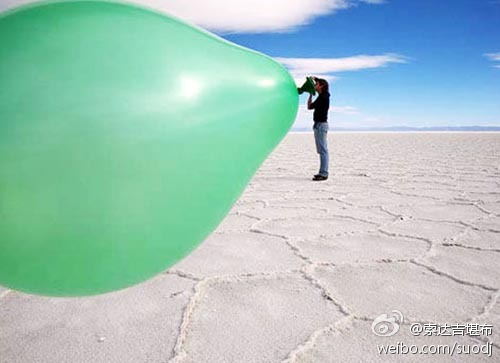
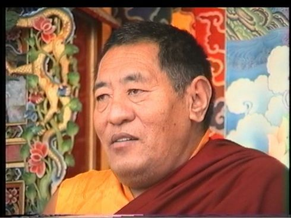
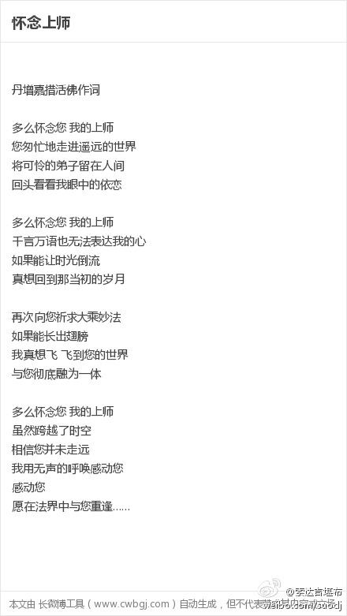
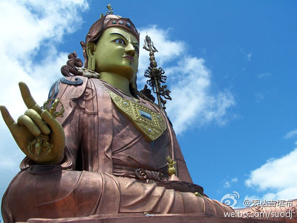
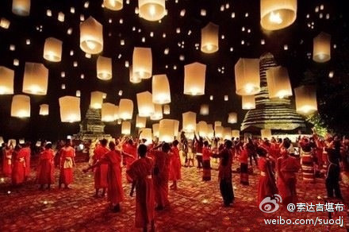
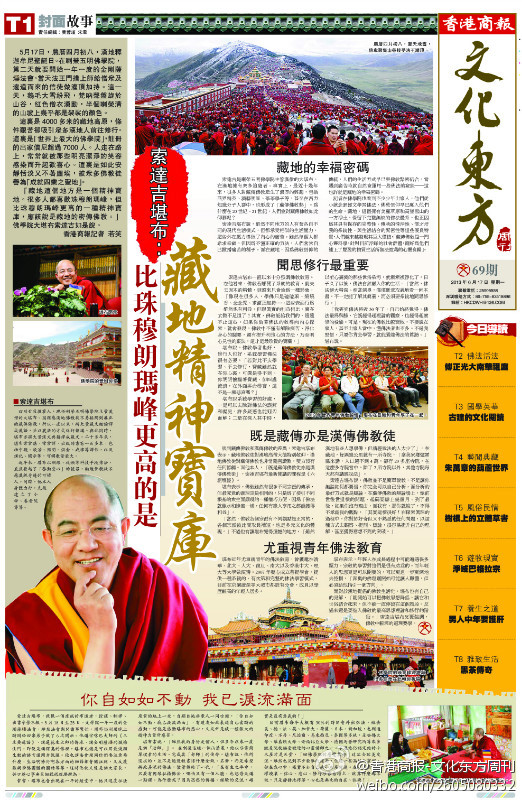
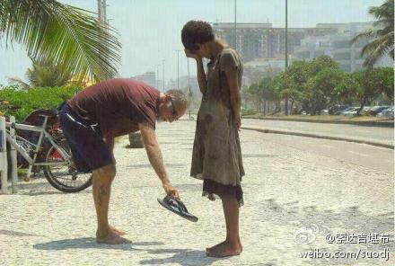
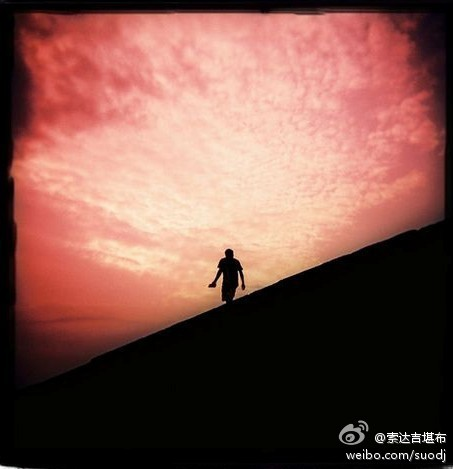

 ## 2013-01-01 07:45
新年开始的第一天，祈祷诸佛菩萨非常重要。尤其按照古大德的传统，若能念莲师心咒“嗡啊哄 班则格热班玛斯德哄”至少100遍以上，以此可保佑在新的一年里，遣除一切违缘、魔障，增上顺利吉祥、健康长寿。希望大家为了自己或家人，今天多祈祷莲师！

 ## 2013-01-02 08:25
我们得这个人身，非常难；有缘听闻佛法，也非常难；遇到真正的善知识，更是难上加难。善知识的一句教言，往往可以改变我们的一生，比任何金银珠宝都珍贵。但善知识陪伴我们的时间，通常不会太长。所以，在有缘遇到真正的善知识时，务必要好好珍惜！

 ## 2013-01-03 08:25
一个人的心量，是被磨难撑大的。

 ## 2013-01-05 09:04
我们身上发生一些不顺心的事情，比如突然生病了、飞机误点了，这些看似偶然，背后实则有必然的复杂因缘。明白了这一点后，不管遇到什么逆境，都不必太抱怨。

 ## 2013-01-07 08:51
我们眼睛看到的东西，实在太有限了！且不说更深奥的层面，单是身边的事物，也常常见不到它的真相。这是沙子在250倍放大率下的美丽世界，每一颗沙子的独特个性，让人不得不惊叹“一沙一世界”——

 ## 2013-01-08 09:02
金字塔，有一种不为人知的神奇力量，仅仅按它的比例做一个小模型，也能让里面的刀具变锋利，食品保鲜久，幼苗长得快，伤口迅速愈合……其实，人体打坐的形状，就是一个典型的“金字塔”，它能汇聚高层次的能量到人体。长期打坐不但会令身体健康、头脑清醒、心情放松，还能开发意想不到的智能、潜能。

 ## 2013-01-09 08:32
当我们生起愤恨等负面情绪时，应当下观察它的来处、去处、颜色、形状……若能了悟其本体了不可得，这颗不安分的心便会荡然无存，一切幻相也会依此粉碎。

 ## 2013-01-10 08:35
佛陀不是神，也不是造物主。他只是揭示了万法的规律，让我们去照做。假如不照做，也不是佛陀在惩罚你，而是规律在惩罚你，就像不怕火便会被烧伤一样。

 ## 2013-01-11 08:08
不要总让自己去追求完美。月亮一旦圆了，就要变缺；杯里的水满了，就要溢出；树上的苹果熟了，就要掉落。太完美了只能物极必反，还不如给自己留个空间，虽然多一点欠缺，但也少一点遗憾。

 ## 2013-01-12 07:59
2012年7月，“第二届世界青年佛学研讨会”在香港召开，来自世界各国的许多著名教授、年轻学子，不管是否信仰佛教，都各抒己见表达了自己对佛教的认识、对心灵的探索。非常随喜他们的正见，以及对真理的追求！O网页链接
 ## 2013-01-12 09:15
昨天，我朝拜了一座南传佛教的寺院，看见一位小沙弥正在为排队的信众作加持。见到这一幕，让人不禁产生恭敬心、欢喜心。我也默默排在队伍后面，对他恭敬地合掌、顶礼，接受他的洒水、念咒、加持，得到一条加持绳。

 ## 2013-01-13 08:29
现在这个时代，许多人都标榜要“做自己”，听起来似乎很有个性，走自己的路，就让别人说去吧。但你有没有想过，如果你选的路越走越危险，甚至只有死路一条，可你仍不顾别人的眼光而义无反顾，这只能是一种愚笨，没什么可炫耀的。所以，“做自己”也要有智慧，方向选对了倒没问题，但若是选错了呢？

 ## 2013-01-14 07:53
我看了莫言得诺贝尔文学奖的获奖感言。他平实的语言中，透露着对人生的反思，大家有必要看一下。他还在其中提到：“我对佛教经典并没有深入研究，对佛教的理解自然十分肤浅……我觉得佛教的许多基本思想，是真正的宇宙意识。人世中许多纷争，在佛家的眼里，是毫无意义的。”O网页链接
 ## 2013-01-17 08:05
智者经常观察自己的过失，愚者老是挑剔别人的毛病，正如藏族谚语所说：“自己脸上有大牦牛都发现不了，别人脸上有小虱子也能看得见。”

 ## 2013-01-18 08:11
用金钱帮人，用完就没了，只能解决一时的问题；用真理指引人，常会改变他的一生，使其终身受益。但有些人往往喜新厌旧，对没听过的道理兴趣盎然，对已听过的却从不深入挖掘。其实，有用的话语哪怕只有一句，也应长期琢磨，不要听时挺有感觉，却转头就忘。

 ## 2013-01-18 11:34
我们都有责任保护动物！//@杨幂: //@turbosun: 拒绝熊胆从我做起！从我自己看到的，了解到的，所谓的无痛取胆，一切都是谎言！看到萱萱因长期被取胆，而已发生病变的胆囊，为萱萱痛心，更为那些迷信熊胆的人而担心，当你有机会看到那几乎糜烂的胆囊，相信你就能知道你所服用的，究竟是药，还是毒？！
 > @亚洲动物基金AAF
 > #2013 黑熊救助# 看到孙俪在手术室中握着“萱萱"的手，看到她充满童趣的抱着月月玩偶，看到她亲自为关爱月熊学校颁奖......今天她不是当红的影视明星，不是《甄嬛传》中的小主，只是一个关爱动物的普通人，一个关心小朋友成长的母亲，期望你的下一次到来！@turbosun @孙俪官方影迷会

 ## 2013-01-19 09:29
上师啊，昔日我扶过您的手，至今还留有您的味道；曾经我得过您的法，至今还在血液中流淌；过去我听过您的教言，至今还在耳畔回荡。虽然您的色身离开了我，但您的智慧法身从未远去，仍如当日一般，是我一切的源泉。

 ## 2013-01-19 10:09
转发微博
 > @慈诚罗珠堪布
 > 我内心中所有金钱无法买到的东西，都来自于我的上师。如果没有遇见上师，我一定会内心空虚、活无目标，一辈子都沉迷于追求感官的刺激当中，白白虚度人生。

 ## 2013-01-19 10:12
怀念上师 O网页链接

 ## 2013-01-20 08:12
佛法并不是一大堆教条，而是有许多解除困惑、减轻压力的实用方法。这些方法的除苦效果不可思议，你只有依靠网络等途径，系统学习一些佛典的内容，才能对此深有体会。否则，只是依止一位师父，跟他偶尔聊聊天、诉诉苦，这样的学佛，不可能从根本上解决问题。

 ## 2013-01-21 08:01
曾有一位老堪布叫贡噶旺秋，“文革”期间他被关进监狱，受尽折磨20多年。被释放后，有人问他：“你在监狱里，最害怕的是什么？”他回答说：“我最怕的，就是对伤害我的人失去慈悲心。”——香港科技大学演讲：科技发达时代的佛法教育O科技发达时代的佛法教育――香港科技大学演讲 -...

 ## 2013-01-21 18:26
愿一切众生身心自在！
 > @三宝眷属
 > 大自在加持云！愿你永远自在喜悦。

 ## 2013-01-22 08:32
一把盐放入一杯水中，会咸得发苦，而撒进一个湖里，会没什么味道。同样，我们生命中的痛苦是盐，它的咸淡，也取决于盛它的容器。

 ## 2013-01-23 08:12
嗡玛尼贝美吽
 > @索达吉藏文化
 > 经常念诵观音心咒“嗡玛尼贝美吽”，能令一切魔众无可乘之机，罪障清净、长寿无病、增上财富、安享快乐等，有无边殊胜功德。

 ## 2013-01-24 07:39
有一种节约叫光盘，有一种公益叫光盘！所谓光盘，就是吃光你盘子中的食物。2000亿元，是中国人一年在餐桌上浪费掉的粮食价值；2亿人，是一年倒掉的食物可以解决口粮的人数。“舌尖上的浪费”触目惊心，令人痛心。一粥一饭，当思来之不易。从今天开始，做个“光盘族”吧！

 ## 2013-01-25 07:53
现在许多人整天一直忙忙碌碌，忙得不知身在何方，也许到了生命穷尽的那一天，还不知道生命的意义。真心希望每个人在生活中能找到生命的真相！

 ## 2013-01-26 08:03
万般皆下品，唯有利他高。

 ## 2013-01-26 13:55
转发微博
 > @益西彭措官方微博
 > 文殊菩萨左手持经函，右手持宝剑，这昭示我们，修行就是举起智慧的宝剑，消灭各种错误的知见及其所导致的烦恼。宝剑锋从磨砺出，文殊菩萨的智慧宝剑，来自于哪里呢？就来自于经函，也就是从对经论的反复闻思修中，锻造出来的。

 ## 2013-01-26 16:23
转发微博
 > @索达吉藏文化
 > “净土三经”中的《观无量寿佛经》（简称《观经》），以前在藏地没有，印度的梵文本也失传了，但在新疆曾发现过维吾尔文译本的残片。这次我依靠汉地的可靠版本，将《观经》译成了藏文，愿与此经结缘的众生皆往生极乐净土！

 ## 2013-01-27 07:42
我们不应该听的语言有三种：一、不要听别人赞叹自己的功德；二、不要听喜新厌旧之人的挑唆；三、不要听愚者的教诲。——华智仁波切《自我教言》

 ## 2013-01-28 07:59
演一部戏，需要正面和反面的人物，同样，我们人生这出戏，也需要有支持力和反对力。不管怎么样，我们都要感恩他们，因为若没有他们的参与，人生或许会变得毫无精彩之处。

 ## 2013-01-29 05:49
我们不管是做一件事，还是修一个法，最好能善始善终，不要像蝌蚪一样头大尾小；也不要开头、结尾只做个仪式，中间过程如何却毫不关心，就像蚂蚁一样头尾大、腰很细。

 ## 2013-01-30 08:09
我不曾远离那些信仰我、甚至不信仰我的人，虽然他们没有看到我，但我的这些孩子们，将永远受到我慈悲心的保护！——莲花生大士在一千多年前许下的誓言

 ## 2013-01-31 08:46
昨天不小心弄坏了手机，通讯录里的电话，现在一个也没有了。要联系的人，一个都联系不上了。刚开始有点傻眼，但转念一想也是个好事，这也是提醒自己不要过于依赖手机，外在的一切确实是无常的、不可靠的！手机族们，你说是吗？

 ## 2013-02-01 08:33
在生活中遇到痛苦、失望、不顺，有些人什么都不做，只是整天悲伤、找人哭诉，或者拼命酗酒，用酒精一直麻痹自己。当然，有这种情绪很正常，但不能让它时时刻刻折磨你，而应把注意力转到积极的事物上，提升正能量来控制你的心，自己学会慢慢站起来！

 ## 2013-02-02 08:08
当你的生活遇到挑战，迷茫找不到方向时，若以无比的恭敬心，祈祷自己最有信心的佛菩萨，比如念“南无观世音菩萨”。当圣者的加持与你的信心融为一体，自然会出现一条光明之路。这，就是甚深缘起的不可思议。

 ## 2013-02-03 08:25
人被赋予两个眼睛、两个耳朵、两只手，只有一张嘴。就是在提醒我们要多看、多听、多做，而少说废话。这个道理虽然很多人都懂，但你真正做到了吗？

 ## 2013-02-04 11:00
我家木屋的屋檐下，五六只红嘴山鸦在此安家。它们作息极有规律，每天按点起床，准时睡觉。小山鸦挺调皮，偶尔早上赖床，或想在外多玩会儿，大山鸦就发出尖厉的大叫，直到它乖乖听话为止。它们会在阳光下梳理羽毛，又会在夜幕降临时，飞回各自固定的寝室。有了这群小邻居为伴，生活还是别有一番趣味！

 ## 2013-02-05 08:18
对真正的修行人来讲，除非是为了利益众生，否则，世间的名利福报完全是一种毒药。正如古大德所说：美誉是魔鬼给你下的毒，恭敬也是束缚你的绳索，一切福报都是解脱的绊脚石，所以不要把毒药当妙药！

 ## 2013-02-05 14:33
转发微博
 > @上海慈慧公益基金会
 > 巴西一只流浪狗3年前到一戶教授家讨食，好心的教授给它吃的，却发现它一直盯着其他食物，于是教授用塑料袋装了一包给它“外带”。他跟着它走了3公里发现它回到垃圾场的家把食物分送給猫、狗、骡子还有鸡。从此教授天天为它准备一包食物，3年来它每天来回 6 公里路为家人带回食物O网页链接
 ## 2013-02-06 08:15
有傲慢心之人，自认为智慧出类拔萃、傲视群雄。但只要认真去观察，就会明白这些根本不值一提。在一段时期内，或特定的小范围里，你的才华或长相等各方面，或许有过人之处，但不要忘了：在这世上，还有无数人千百万倍地超胜于你。——法王如意宝

 ## 2013-02-07 08:33
去过寺院的人都会发现，在佛陀身边，常有十六位形态各异的阿罗汉。他们是遵循佛陀嘱咐，在佛涅槃后一直住于世间、护持正法的圣者。若经常祈祷他们，有助于十方高僧大德长久住世，利益众生的教法得以广弘。今晚7:30，我们来一起学习《十六罗汉礼供文》。直播讲堂：O网页链接

 ## 2013-02-08 08:29
今天是除夕的前一天，在藏历中，最好在今天的黄昏念9遍《心经》。此经中说：“能除一切苦，真实不虚。”依靠般若空性的强大威力，可以遣除我们往年的一切不顺、烦恼、障碍，迎接来年的顺利、圆满、吉祥！

 ## 2013-02-08 09:13
你若有时间，今晚7：30可以到法音频道来，跟僧众一起共诵9遍《心经》。同时，我也会给大家传授《心经》的传承。法音频道：O网页链接
 ## 2013-02-09 08:04
祝福你在新的一年里，身心自在，家庭和乐，事事如意，福泽绵长！愿昼吉祥夜吉祥，三宝加被恒吉祥，护法龙天除灾障，一切圆满大吉祥！

 ## 2013-02-10 08:16
俗话说：“一年之计在于春，一日之计在于晨。”新年的第一天，我们对今年要做的有意义的事情，应该有个计划、打算，并将此作为一年的动力，而不能让人生白白空过！

 ## 2013-02-10 23:16
现在是“神变月”（公历2.11—3.12），每一天都是吉祥日，行持任何善法，功德均会成十亿倍增长，故望大家切莫散乱。同时，从2月11日起，我们佛学院将开15天的持明大法会，僧众共诵九本尊心咒，为全世界和一切众生祈福。你若想参与但又不会念此心咒，也可以念怀业祈请文，或观音心咒“嗡玛尼贝美吽”。

 ## 2013-02-11 09:34

 > @索达吉堪布
 > 现在是“神变月”（公历2.11—3.12），每一天都是吉祥日，行持任何善法，功德均会成十亿倍增长，故望大家切莫散乱。同时，从2月11日起，我们佛学院将开15天的持明大法会，僧众共诵九本尊心咒，为全世界和一切众生祈福。你若想参与但又不会念此心咒，也可以念怀业祈请文，或观音心咒“嗡玛尼贝美吽”。

 ## 2013-02-12 09:42
我们的人生中，充满着喜怒哀乐、悲欢离合、起伏不定……这些现象对每个人来说，虽然都是实实在在的，但它并不是究竟真相。只有通达了一切本来无“我”，才会明白人生到底是什么，才会拥有一种超越的人生。

 ## 2013-02-13 09:48
“出家人不打诳语”，这是影视中刻画出家人时，出现频率最高的一句话。其实，出家人又岂止不能说谎这么简单？在家人说谎就理所应当吗？佛教如今已被渲染得面目全非，倘若你没有学习佛教的典籍，只是从荧幕上听了几句话，就认为这是佛教的全部，实在是有点遗憾！

 ## 2013-02-14 09:36
瑞典有一句谚语：“无论你转身多少次，你的屁股还是在你后面。”是什么意思呢？就是无论你怎么做，都会有人说你不对。若能明白这一点，听到跟自己相反的声音，不要让沮丧、恼怒左右你的心情，而应觉得这很正常。反而，如果没有这些，才不正常。

 ## 2013-02-16 09:56
任何一个宗教，都难免有良莠不齐的现象，为什么其他宗教的很少报道，佛教的却常见诸报端，任人调侃？佛教还能被肆意歪曲，无底限地娱乐？因为在有些人看来，佛教以慈悲为怀，似乎怎么践踏都没危险。但实际上，慈悲并非像石头一样不懂取舍，佛教的神圣性，我们也有责任捍卫，因为它是全人类的心灵财富！

 ## 2013-02-16 23:22
佛教中讲究“慈悲为本，方便为门”，但若没以智慧摄持，则容易导致“慈悲多祸害，方便出下流”。所以，我在此双手合掌请求：今后你若有机会参与佛教题材的创作或传播，请先了解一下它的真实教义，否则，也许你一不小心，就毁掉了许多人的善根。或许你可以辩称自己并非故意，但因果不会因此就一笑了之。

 ## 2013-02-18 12:56
问：我痛苦的时祈祷佛，为什么不起作用？答：这就像去医院看病，有些病能完全治好，有些病则效果不大。既然有些病治不了，我们还要不要看病呢？还是要看。祈祷佛也是这个道理。——香港科技大学问答O网页链接

 ## 2013-02-20 15:43
佛教与科学之间到底有什么关系？截至2012年，国外已有超过8000名的前沿科学家，投入到了这一研究中。为了与大家分享这些研究成果，用科学的眼光重新认识佛教，2011年11月我们成立了“智悲翻译中心”，迄今已将100多篇文章译成了中文：O网页链接

 ## 2013-02-21 08:30
我们遇到坎坷困境，用不着拼命想方设法逃避，它可能是通往成功的基石；时时一帆风顺，也不一定就是好事，它常会令人增长傲慢，迷失自己。

 ## 2013-02-22 07:03
许多人在学佛的过程中，常会出现很多问题和疑惑，不知道该如何抉择。其实，佛陀是真实语者，他的智慧无与伦比，在给我们留下的《大藏经》中，对各类问题也几乎都有答案。所以，我们在遇到问题时，若按照佛经中的佛陀教言来作取舍，远比凡夫人的想象臆造更为可靠。

 ## 2013-02-23 09:50
风水对我们有没有影响？确实有，但并非一成不变。据说范仲淹曾因一念善心，死时要求儿子将其葬于凶地，结果当晚雷电交加、地动山摇，凶地变成吉地。古来最能拥有风水宝地者，莫过于皇帝，但也并非每一位皇帝都福厚、命长。所以，风水的根本在于人心，心善，坏风水也能变好；心恶，好风水也会变差。

 ## 2013-02-24 09:15
在新年的第一个月圆之日，愿你的智慧、善心、福德，如今晚的月亮一样圆满！元宵节快乐！

 ## 2013-02-25 19:16
十分见效的美容秘笈——佛陀告诉我们：喜欢发脾气的人，今生会长得越来越难看，来世还会投生为丑陋者。所以，若想长得漂亮，光用昂贵化妆品是不够的，还应学会控制自己的情绪，不能乱发脾气，也不能动不动就口不择言地伤人。

 ## 2013-02-26 08:27
用石头打狗，狗不追人而反咬石头；用石头打狮子，狮子不追石头而直接攻击人。同样，在遇到痛苦、打击时，愚者只知一味怨恨外境，从来不往内观察，看自己有何不足；智者却明白痛苦并非来自怨敌，而是源于自己的烦恼，若没有烦恼，怨敌再厉害也无济于事。所以，不一样的智慧，成就不一样的人生。

 ## 2013-02-28 08:27
如果你把追女人或赚钱这类让你分心的时间，抽出十分之一用来修行，几年内包管你开悟！——印度圣者拉玛克里胥那

 ## 2013-03-01 07:35
若想选择一位佛法的老师，之前务必要长期、再三地观察，而不能不加辨别就草率依止。在观察的时候，最主要是看他有没有真正的大悲心。有了这颗心，就算其他法相不具足，也可以依止；但若没有大悲心，哪怕具足百般功德，也不算是大乘的善知识。

 ## 2013-03-02 10:07
“心情愉快法”——双目直视虚空，不执著一切而自然放松，心胸尽量放大，在这样的境界中坦然安住。然后念诵“达雅他 嗡 措姆迷勒那 德卡踏母索哈”，这个咒语念7遍、108遍都可以。如此观修，有助于我们天天好心情，人际关系趋于改善，许多不顺迎刃而解。

 ## 2013-03-03 08:01
随着中国步入老龄化，“老年痴呆”这一疾病日益突显，有专家称：未来几十年，中国将成为“痴呆大国”。其实，佛法所传输的圣能量，能够开智慧、安心神，对预防此病极有帮助。我身边有许多七八十岁的学佛老人，头脑非常清晰，思维非常敏捷，也足以证明这一点。附：日本研究——抄佛经可防老年痴呆

 ## 2013-03-04 08:44
我们总会遇到痛苦，但痛过了，有些人就故意淡忘了，不愿正视它，更不愿提起它。其实，痛苦也是人生的一种“维他命”，认真反思它的人，可以找出苦的根源，痛过一次就够了；而不愿正视它的人，会接二连三犯同样的错误，遭受同样的“痛”与“苦”。

 ## 2013-03-05 07:52
老子、孔子，年轻时都当过图书馆的管理员。因寄身于浩瀚的书海中，整日与书香为伴，久而久之，造就了自己的广闻博学。谁都不可能一生下来就是圣贤，所以，我们应当多看书，看好书，把学到的知识为我所用！

 ## 2013-03-06 08:10
“钱”字，从字形来看，一边是金，一边是二“戈”。双方拿着兵器，为了金子争得你死我活，这应该就是钱的本意。所以，有了钱不一定就真的幸福，不信的话，你可以问问现在的有钱人。对他们来讲，或许内心的平静才是最大的奢侈品。

 ## 2013-03-07 08:11
照相机的镜头干净了，才能拍出栩栩如生的美景，同样，我们的心清净了，才能看到生活中的美好。

 ## 2013-03-08 06:44
淡定的心，让她不再浮躁；自在的心，让她不再寂寞；轻松的心，让她不再忙碌；解脱的心，让她不再苦恼……祝普天下的女人节日快乐！

 ## 2013-03-09 08:13
研究证明：80%的人体免疫力，受情绪的影响。恐惧、忧郁、压力、悲观等负面情绪，会造成免疫力紊乱；而快乐的情绪，能使大脑分泌一些有益健康的物质，激活人体免疫功能。所以，哪怕是为了身体的健康，学会调心也非常重要！

 ## 2013-03-10 08:06
“人如果做了坏事，向神祈祷，就可以得到幸福吗？”这个问题一直困惑着许多人。那么，身为佛教教主的佛陀，到底是怎么说的呢？让我们看看《中阿含经》的精彩小故事吧——

 ## 2013-03-11 07:59
罪业不是实有不变的，它依因缘而生，故也可依因缘而灭。但灭罪的因缘，并不是我们想得那么简单，后悔、求饶就可以了。它需要对以往的过错真心忏悔，并发誓永不再犯，然后修持专门的灭罪法门，比如观修金刚萨埵，念一定数量的佛号或心咒……如此，未来的苦果才会减至最小，乃至不会出现。

 ## 2013-03-12 08:31
从来没有实地修持过空性，只是口头上会说“一切皆空，什么都不要执著”，这就像平民自称为国王一样，只是逞口头之利，终究没有什么益处。诚如禅宗六祖所言：“终日说空，心中不修此行，恰似凡人自称国王，终不可得。”

 ## 2013-03-13 13:43
若有人问佛陀：“应当如何对待爱情？”佛陀不会劝所有人出家，也不会让所有人学佛。佛陀会说：对感情不要太执著了，否则一定会带来痛苦，这些痛苦不是别人强加给你的，完全是自作自受、作茧自缚。————厦门大学演讲《问佛陀情为何物》O网页链接

 ## 2013-03-14 08:00
所有的历史，当其外壳被除去之后，都是属于心灵的历史。——著名历史学家汤因比（Arnold Toynbee）

 ## 2013-03-15 09:05
每个优秀的宗教，都有对身心的高层教育，让信众自觉约束自己的行为。有了信仰的人，内在的自律远比外在的法律，要管用得多；而没有信仰的人，做事往往没有底限，为了蝇头小利就无恶不作。所以，一个和谐社会的建立，不能单单依赖于法律，信仰也是必不可少的。

 ## 2013-03-16 08:42
据美国民调机构皮尤研究中心（Pew Research Center），在2010年发表的《全球宗教景观》报告中说：在全球69亿人口中，有58亿多人有宗教信仰，10亿多人没有宗教信仰——可见，有宗教信仰的人，在这个世界上还是占绝大多数。

 ## 2013-03-17 07:55
今天身体康健，明朝也许会身染重病；今天花容月貌，明朝也许会仙姿不再；今天荣华富贵，明朝也许会穷困潦倒；今天誉满天下，明朝也许会遭人唾骂……不要总以为这些只发生在别人身上，它随时可能在你身上呈现。这就是我们生活中的“无常”！

 ## 2013-03-18 08:54
现在许多人都认为自己“心理健康”，但实际上，若想达到这个标准，也没有那么简单。且不说别的，仅仅在生活中，你处事乐观、极少抱怨吗？遇到缺陷和挫折，能迎难而上、积极面对吗？在处理人际关系时，能既认清自己，又包容别人吗？……所以，只有具备了化解外界刺激的良好心态，才是真正的“健康”。

 ## 2013-03-20 08:52
“幸福”是人人都渴望的，但怎样才能得到幸福，思考它的人并不多。其实，幸福的根本是心，只要心满足了，哪怕是粗茶淡饭，也会怡然自得；若是心不满足，即便是金玉满堂，也依然悲戚愁苦。今天是“国际幸福日”，趁这个吉祥的日子，祝愿每个人都能找到幸福的方法，得到真正的幸福！

 ## 2013-03-21 08:06
面对同样的失去，有些人内心豁达，不会纠结很久，遇到什么都能随遇而安，心安了也就自在了；有些人则耿耿于怀，难以面对，要么愤世嫉俗，要么自暴自弃，给自己和他人都带来了困扰。所以，外境好坏并不是苦乐的来源，真正的始作俑者，就是我们的心。

 ## 2013-03-21 23:35
从小到大，我们了解的“幸福”，全来自于外在。比如有钱了就幸福，没钱了就痛苦；有人爱就幸福，失恋了就痛苦……但实际上，这一切并不稳定，随时可能发生变化。而佛教所揭示的“幸福”，建立在内心的基础上，这是人人平等具有的，只是很少人懂得该怎样挖掘。可一旦你认识了它，才知道何为不变的幸福。

 ## 2013-03-24 08:04
常有人说：“这个说起来容易，做起来难！”话虽如此，但你从不试着去做的话，那永远都做不到。就像你从家里步行去拉萨，虽然目标遥不可及，但路就在你脚下，只要一步一步走，就会一点一点接近。不要总抱着投机的心理，奢望人生中会出现“捷径”，让自己不费力气就一步登天，那只是小说中才有的情节。

 ## 2013-03-25 08:37
当我们习惯了冷漠，遇到事情只想保护自己，对身边的人不闻不问，对社会也没有责任感，那终究会为此而付出代价。其实，每个人的心中都潜藏着慈悲，只是它被覆盖了而已，若能将其挖掘出来，这一定会成为你人生中的无价之宝，于人、于己都将受益无穷。

 ## 2013-03-26 07:55
我们的人生中，能用得上的时间特别少！年幼时代少不更事，年老时代身心衰退，这期间都做不了什么；而青壮年时代就算有体力、有能力，时间也多被忙碌、散乱、睡眠占据了，剩下来留给自己的，可谓寥寥无几。所以，我们应该把握当下，不要虚耗时光，人活了一辈子，至少要做一件让自己感觉有意义的事！

 ## 2013-03-27 07:59
你现在拥有的一切，实际上就已经很幸福了。但欲望越大，幸福感越小；知足越大，幸福感越多。

 ## 2013-03-28 08:03
在平坦的大路上开车，看不出每个司机有什么不同，可一旦遇到了紧急情况，他们的技术即见分晓。同样，在平稳安乐的生活中，每个人的修行似乎都不错，可一旦遇到了逆境，他们的境界立见高下。

 ## 2013-03-29 07:45
经常听到有种说法是要“关心下一代”，其实不仅仅要关心下一代，我们还要“关心下一世”。假如从不考虑这个问题，所作所为就会非常可怕，正如佛陀在经中所言：“不见后世，无恶不造。”——西北大学演讲《来世生命及往生净土》O网页链接及问答O网页链接

 ## 2013-03-30 07:47
有人说：“人做什么都要考虑后世，那多累啊！把握这一世才最重要。”其实，你今天做的，难道不用考虑明天吗？你年轻时做的，难道不用考虑晚年吗？如果不考虑，那今天就把存款挥霍一空多好，干嘛还要顾忌那么多？所以，有理智的人，不管眼前做什么，永远都在为未来打算，只不过这个“未来”有近有远而已

 ## 2013-03-31 07:47
一个人修学佛法，需要理性、感性两种智慧。若没有理性的智慧，就会人云亦云，不能明辨真假，遭受挫折容易放弃；若没有感性的智慧，对于不可思议的超胜境界，就不会心向往之，进而去争取。

 ## 2013-04-01 08:15
许多成功人士在接受采访时，都说自己没想到会有今天，一开始只是踏踏实实把分内事做好，让大家满意。久而久之，事业竟然慢慢变大，“十年寒窗无人问，一旦成名天下知”。然而可惜的是，如今许多人不懂这一点，他们总觉得自己怀才不遇，却从来不愿从小事做起，如此只能让人觉得他眼高手低，不敢重用！

 ## 2013-04-02 07:54
佛性，是人人本自具足的。所谓“夜夜抱佛眠，朝朝还共起”，我们每天夜里都抱着它入睡，清晨又与它一同醒来，从来没有远离过。不过，虽未远离，我们却不认识，这也是最悲哀的地方。——香港大学演讲《自心宝藏的探索》O网页链接

 ## 2013-04-04 08:34
今天是“清明节”。汉地许多地方都有烧纸钱的习俗，这对生者是一种慰藉和缅怀，但光是烧了很多纸，亡人能否真得到“钱”也不好说。假如大家在烧纸钱时，至少念108遍观音心咒“嗡玛尼巴美吽”，则绝对会给亡人带来利益！

 ## 2013-04-05 18:02
整整20年了！当我重新踏上您20年前走过的路，当年的一切竟变得如此清晰。如今，最敬爱的您虽已不在身边，您的笑容和言教却一直陪着我，从来没有一刻舍离……

 ## 2013-04-07 14:41
从前，一个不会游泳的人，不慎跌进了池塘。他用四肢死命地划动、大声呼救，但越是挣扎，身体下沉得越快。到了最后，他想死就死吧，索性把心一横，全身放松，结果竟浮了起来。我们在生活中也是如此，遇到事情越是紧张，越容易坏事；越不执著，反而容易成功。

 ## 2013-04-08 12:15
在西方，人们越来越发现，钱财换不回内心的自在。于是许多人宁愿每天禅修5分钟以上，从佛教中寻找心灵的宁静、快乐。他们不仅认为这种习惯很“酷”，是一种时尚，而且从中得到了真正的受益。

 ## 2013-04-09 12:54
我们需要竭力改变的，是自己的欲望，而非世界的秩序。——著名法国哲学家笛卡尔

 ## 2013-04-10 13:03
俗话说：“善泳者死于水，善武者死于斗。”越是自己擅长的东西，越容易让自己栽跟头。所以，我们即便在某方面有一技之长，也不应自以为是，恃才而骄。

 ## 2013-04-14 13:03
怎样才算是好医生？当看到每一个病人时，都很自然地将他当成自己的骨肉至亲，这才是一位真正的好医生。否则，哪怕医术再精湛高明，恐怕也不算是一名良医。

 ## 2013-04-16 19:28
曾有一个50多岁的德国男子，开着法拉利回家的路上，发现一只刺猬正在横穿马路。他来不及刹车，只好向公路的护栏撞去。人和刺猬没有受伤，但法拉利严重受损，维修费用约人民币30万元。事后记者问他为什么这样做，他说：“没有什么东西比生命更珍贵，哪怕是一只小刺猬，也值得我为它让路……”

 ## 2013-04-19 18:31
天道无亲，常与善人，但行好事，莫问前程。

 ## 2013-04-20 11:33
得知雅安地震了！希望大家多念“南无救苦救难观世音菩萨”，为生者与亡者祝福、祈祷！

 ## 2013-04-22 21:24
前两天，我在哈佛大学图书馆，看到那里的藏文书多得不得了，于是随手抽取几本，翻开一看，竟然是：《入中论》、《释尊广传》、《缘起赞》，以及一部我最喜欢的密法。都是自己特别熟悉的法本，非常亲切！非常开心！

 ## 2013-04-24 20:51
大事，一定要从小事开始。不追求有大的成就，才有大的成就。等把小事都做好了，大事也就自然成功了。

 ## 2013-04-29 08:10
一提到“痛苦”，许多人唯恐避之不及，却不知它也有功德的一面：痛苦能挫败你的优越感，打消你傲气十足；能让你对其他的受苦众生心生悲悯；能让你慢慢看清事情的真相，明白什么该做、什么不该做……故痛苦也并非一无是处，关键看你懂不懂从中提炼“养分”。

 ## 2013-04-30 07:28
常有人戴着佛法的假面具，自称是佛菩萨的化身，到处招摇撞骗，以此给佛教、众生造成很大的损害。虽然在藏传佛教中，是有“视师如佛”的传统，即把具德的上师当成真佛来依止，但这是很高级的修法，并不适合一切人，尤其是初学者。所以，在依止上师之前，一定要用智慧仔细观察，不要轻信各种“广告”！

 ## 2013-05-03 07:40
回佛学院的感觉真好！这次去欧美交流，虽然也见到不少豪华的建筑，住过一些高档的宾馆，但在我心中，确实不如自己的小木屋舒适。在这样简单的环境里，信心、悲心、修行很容易增上，就算什么都不做，只是静静地待着，心也是无比的自在、快乐！

 ## 2013-05-04 08:02
古往今来，关于《金刚经》的著述比比皆是，这本书虽不敢说带给你完全与众不同的感受，但至少，你可以从另一个角度了悟该经的密意。(当当：O网页链接 亚马逊：O网页链接 京东：O网页链接 淘宝：O网页链接）

 ## 2013-05-05 08:44
当你心中充满善念，周围无一不是好人；当你心中充满恶意，周围无一不是敌人；当你心中充满坚强，一切遭遇都是通往成功的大道！

 ## 2013-05-07 08:21
佛经中说，我们的心一旦被嗔心之箭射中了，当下就会处于“无心”的状态，所作所为极不明智，连自己都不知道在干什么，直到事后冷静下来，才开始后悔不已。嗔心之箭令人防不胜防，所以我们平时一定要警惕！

 ## 2013-05-08 08:09
人的情绪就像天空中的云，不知道突然从哪里来，也不知道突然就到哪里去了。一会儿还因为一点小事耿耿于怀，怎么想都想不通，但一会儿这种心态就没有了，想找也找不回来了。所以，我们的心真的很无常，不要总把一些烦恼当真！

 ## 2013-05-09 08:27

 > @索达吉藏文化
 > 我们不管是谁，都曾造过许多恶业，所以忏悔非常重要。本月（阳历5月10日—6月8日）是藏历的萨迦月，我们喇荣五明佛学院将召开“金刚萨埵法会”，为自他一切众生忏悔罪业。倘若你也能念40万遍金刚萨埵心咒“嗡班杂萨埵吽”，便可获得与僧众共修的功德。望大家尽量与此结上善缘！

 ## 2013-05-10 08:43
如今，许多人都在追求如雷贯耳的名声、腰缠万贯的财富，可这一切在面对生死时，真的一文不值！生死大事唯有修行才能解决，假如你从来没有做过准备，死到临头肯定很可怜，有再大的名、再多的财，也换不来真正的安乐！

 ## 2013-05-12 08:33
今天是母亲节！在许多国家的语言中，“妈妈”的发音是完全一样的，她是最原始的呼唤，是一切的来源；在大乘佛教中，了知母恩、忆念母恩，也是最重要的修法。如果你母亲还健在，请平时多打打电话，有空陪陪她、关心她；假如她已不在了，那请多念观音心咒回向她离苦得乐！

 ## 2013-05-14 08:36
年轻人学佛，不应该止于一种简单的信仰。信佛不像崇拜神一样，你若要真正相信佛，就一定要先全面了解佛的思想。

 ## 2013-05-15 08:57
对动物残忍，就会对人类残忍。善待动物，无疑有助于人类道德的提升，真正促进世界和平。

 ## 2013-05-17 13:57
今天是四月初八，汉地释迦牟尼佛圣诞日。在我们喇荣，明天就开金刚萨埵法会了，今天门措上师刚给大家灌了顶，非常殊胜，鹅毛大雪一直下到现在，全学院都变成了金刚萨埵的颜色……

 ## 2013-05-18 06:32
从今天起，喇荣五明佛学院召开为期8天的金刚萨埵法会，每天念金刚萨埵心咒“嗡班杂萨埵吽”5万遍，从早上7点到晚上7点。我们每个人都曾造过各种不同程度的恶业，为了忏悔，希望大家珍惜机会，与僧众共修此法门！法会直播网址：O网页链接

 ## 2013-05-20 16:09
正确评价自己，不要过高要求自己。做可以胜任的事，不要承诺做不到的事。

 ## 2013-05-22 15:32
许多人都误以为“房子是我的，存款是我的，轿车是我的”，自认为是这一切的主人，却不知自己只是一个过客。一旦无常降临到了自己头上，这些身外之物没有一样带得走。那什么可以带走呢？只有现在所造的善恶业，才与自己如影随形，正所谓“万般带不走，唯有业随身”。

 ## 2013-05-23 16:20
散乱，是世人安慰痛苦的唯一方法，但也是最大的痛苦。——法国哲学家布莱斯•帕斯卡尔

 ## 2013-05-26 20:32
“子非鱼，焉知鱼之乐？”用自以为是的目光，否定别人的幸福，这是错误的。

 ## 2013-05-28 07:43
无论发生什么意外，只要有挽救的机会，哪怕只有一点点，我们也要抓住不放。但如果有些结局真的无法避免，我们也要理智地告诉自己：不要白费力气！

 ## 2013-05-30 08:25
无论我们做什么事，都必须要有智慧。如果自己缺乏这方面的能力，就应向有头脑的人请教，在权衡得失之后，方可付诸行动。——全知麦彭仁波切

 ## 2013-05-31 07:57
六祖的“无相颂”中有这么一句：“佛法在世间，不离世间觉，离世求菩提，恰似觅兔角。”其实，它有不同层次的解释方式，你是怎么理解的呢？

 ## 2013-06-01 07:40
今天是六一儿童节，祝愿普天下的孩子拥有一个充满爱心和智慧的童年，节日快乐！

 ## 2013-06-02 07:09
昨天和今天，我分别在我的两所小学——上罗科玛小学、下罗科玛小学，跟孩子们共渡“六一儿童节”。我想跟孩子们说的话，就是这些L2013-05-31说给孩子第二季 索达吉堪布

 ## 2013-06-04 08:00
智悲光尊者说：我们在修行过程中遇到的违缘、挫折，应把它看成是上师和佛法的慈悲加持，是自己修行的一种成功！

 ## 2013-06-05 08:01
多行不义之人，自以为聪明，所作所为神不知鬼不觉，但却不知因果丝毫不爽，自己所做的一切，早晚都要为它付出代价。

 ## 2013-06-06 08:34
人与人之间在聊天，如果交流的内容是慈悲、智慧，那确实是一种享受；而如果是经济、私利方面的话题，那确实是一种难受。

 ## 2013-06-07 10:29
汉地有一句俗话：“师傅领进门，修行在个人。”佛陀也曾说：“我为汝说解脱法，解脱依赖于自己。”所以，不管做什么事情，总指望别人是不行的，关键还得要自己来。

 ## 2013-06-08 08:18
转发微博
 > @索达吉藏文化
 > 享用素食，可以保护脆弱的生命，有助于我们身心健康；享用肉食，与践踏生命无别，剥夺了众生的自由、平等。对此我们应引起深思！

 ## 2013-06-09 08:38
苦难，对于天才是一块垫脚石，对能干的人是一笔财富，对弱者是一个万丈深渊。——巴尔扎克

 ## 2013-06-11 08:27
听到别人不悦耳的话语，应将之观为空谷回声。如此自己不会因之不乐；没有不乐，就不会有嗔心；没有嗔心，就有从中解脱的机会。

 ## 2013-06-12 08:19
今年藏地的夏天姗姗来迟，我的院子里只开了一处小花。供养你们，祝端午节快乐！

 ## 2013-06-14 08:57
不少人认为：只要满足几次欲望，让自己不再有新鲜感了，欲望就可以减轻。这种想法很天真，无始以来我们在轮回中，满足了无数次欲望了，为什么现在仍烦恼深重呢？其实，满足欲望就像喝盐水来止渴一样，只会让自己越喝越渴，只有依靠佛法从根本上断除执著，才能一劳永逸。

 ## 2013-06-15 09:03
如果常以“已所不欲，勿施于人”的心态来为人处世，生活中的抑郁、纠结、焦虑、烦躁就会一扫而光，不但这些区区小事不在话下，甚至更大的事业也可以顺利成功。

 ## 2013-06-17 08:10
常有人问：“你觉得我跟佛有缘吗？”其实，每个众生皆具佛性，到了一定时候就会苏醒，因此，可以说人人都跟佛有缘。只不过，对有些人来讲，这种因缘暂时还没成熟而已。

 ## 2013-06-18 13:09
转发微博
 > @生活与人文周刊
 > 【索達吉堪布:比珠穆朗瑪峰更高的是藏地精神寶庫】适逢漢地釋迦牟尼聖誕日，在喇榮五明佛學院要開始一年一度的金剛薩埵法會。佛學院大堪布索達吉說:「藏地這個地方是一個精神寶地。很多人都喜歡珠穆朗瑪峰，但比珠穆朗瑪峰更高的一種精神寶庫，應該說是藏地的密傳佛教。」O网页链接

 ## 2013-06-19 09:24
吃素，不仅仅如佛教中所说，可以保护小动物的生命，而且从养生的角度而言，也可以让心情舒畅，身体轻安，促进睡眠……尤其对年轻人喜爱的美容、减肥大有帮助。所以，即使你不能长期茹素，也最好能一周吃一次，或者一个月吃几次。

 ## 2013-06-20 08:20
痛苦的时候，逃避现实、麻痹自己很容易，但若想认清真相，有时候需要一定的勇气！

 ## 2013-06-21 06:20
做一件事情，要让人人都说好，这个要求太高了，连佛陀也做不到。所以，凡事只要问心无愧就好，不管别人怎么说，只要自己发心清净，就应该坚持到底。

 ## 2013-06-22 07:19
现在很多人在与亲友共聚一堂、推杯换盏时，常爱把济公的“酒肉穿肠过，佛祖心中留”挂在嘴边，成为可以肆意吃肉喝酒的铁证。却不知在这句话后面，济公还说了一句：“世人若学我,如同进魔道。”济公的高深境界，绝非我们所能企及，故万不可乱学表面行为，以免自欺欺人、自误误人！

 ## 2013-06-23 07:50
人生在世，注定要受许多委屈。而一个人越是成功，他所遭受的委屈也越多。要使自己的生命获得价值和炫彩，就不能太在乎委屈，不能让它们揪紧你的心灵、扰乱你的生活。要学会一笑置之，要学会超然待之，要学会转化势能。智者懂得隐忍，原谅周围的那些人，在宽容中壮大自己。——莫言

 ## 2013-06-24 08:35
一提到佛教，不少人就认为要青灯古佛、绝情绝爱。但实际上，佛陀并没有要求每个人一学佛就出家，他只是告诉了我们情爱的真相，通过一些理性的分析，让你放弃非理性的执著！

 ## 2013-06-26 08:05
家人和朋友，是命中注定的，也是你自己选择的。既然有缘聚在了一起，就应该对他们好一点，不要整天挑三拣四、无事生非。否则，这样充满火药味的生活，自他都不会感到快乐。

 ## 2013-06-27 09:39
禅宗大德常说要见自己的本来面目，那么，这个“本来面目”到底是什么？所谓明心见性，“见”的究竟又是什么？——厦门大学演讲《“如来藏”思想》O网页链接

 ## 2013-06-29 00:01
许多人常抱怨外境不公平，别人对自己不好。其实心若是摆正了，一切现象都会摆正；心若是颠倒了，别人再怎么做，在你眼里也是颠倒的。如《宗镜录》云：“心若正，万法皆正；心若邪，万法亦邪。”

 ## 2013-06-30 09:21
昨天带僧众们去草原上放松了一天，在藏地，这俗称“耍坝子”。来回五六个小时的路程，走起来虽然不轻松，回来的途中还突逢大暴雨，把每个人淋成了落汤鸡，但在遍满鲜花的草地上野炊，互相分享自己的快乐，空气中到处都是野花和青草的芬芳……大家再累也甘之如饴。

 ## 2013-07-01 08:03
当你走过一段遥远的路，就会见到沿途的各种风光，有鲜花小溪，也有荆棘坎坷；同样，当你走在人生漫长的大路上，也会遇到这样那样的痛苦、快乐，但不管它是什么，都请记住：这只是通往目的地的一小段必经之路，不要因为快乐而放弃了行进，也不要因为痛苦而倒在地上、爬不起来……

 ## 2013-07-02 08:00
学习佛法，布施、供养等修积福报也很重要，但最重要的是，应当通达空性智慧，认识心的本性。否则，福报再大也会消尽，无法从根本上断除痛苦！

 ## 2013-07-03 08:33
我的院子里，不知道从何时起，长了很多菜：路边突然冒出来的小白菜，以前放牛时最爱吃的大黄，还有一种不知名的野菜……看起来很好吃，怎么办？

 ## 2013-07-04 07:59
佛菩萨不是高高在上，而是把自己放在最低位，承载着一切众生的苦乐。所以，无论你外在的地位是高是低，若想与佛菩萨相应，内心就也要放低自己。放得越低，佛菩萨越容易住进你的心里。

 ## 2013-07-05 07:44
一位老教授问自己的一个学生：“你心中最美好的事物是什么？”学生想了很久，列出一张清单：健康、才能、金钱、爱情、事业、权利、名誉。教授扫了一眼，说：“你忽略了最重要的一项！没有它，即使得到了上述种种，也只会带来痛苦。”随后用笔把学生清单上的事物一笔勾销，在纸上写下了：心灵的宁静。

 ## 2013-07-05 23:25
别忘了经常吃素！
 > @索达吉堪布
 > 吃素，不仅仅如佛教中所说，可以保护小动物的生命，而且从养生的角度而言，也可以让心情舒畅，身体轻安，促进睡眠……尤其对年轻人喜爱的美容、减肥大有帮助。所以，即使你不能长期茹素，也最好能一周吃一次，或者一个月吃几次。

 ## 2013-07-07 07:52
若想参与者，需发愿在100天内，念满莲师心咒“嗡啊吽 班则革日班玛色德吽”1万遍，即平均每天100遍。从今日起，我也发愿跟大家一起念诵，以此遣除一切众生的违缘，祈愿世界和平，大家心想事成！
 > 转发的微博已被删除
 ## 2013-07-08 07:54
这个世界正因为不同，才变得更加精彩。所以，当我们遇到跟自己不一样的人，听到不一样的声音时，用不着排斥、烦恼、生气，而应把这一切视为理所当然，心怀宽容地接受它。

 ## 2013-07-10 07:36
自以为不需要修行了，是更加需要修行的标志。——无等塔波仁波切

 ## 2013-07-11 08:31
昨天下山遇到了暴雨，路上处处都是塌方，坐了15个小时的车，还是没有到目的地。只好更换路线，不知今天能否如期到达……

 ## 2013-07-12 11:36
今天是我生日，一大早就搭乘飞机，匆匆忙忙赶往某地讲课。虽然没人送我生日蛋糕，但很多人纷纷发来了有形无形的各种祝福，并为此做了大量放生，对我而言，这是最好的生日礼物！尽管无法一一回应大家，但我内心感受得到你们的情意，非常感恩！祈愿跟我结上善缘、恶缘的一切众生，皆能离苦得乐！

 ## 2013-07-13 08:22
爱因斯坦说：“我们切莫忘记，仅凭知识和技巧，并不能给人类的生活带来幸福和尊严。人类完全有理由把高尚的道德标准和价值观的宣道士，置于客观真理的发现者之上。在我看来，释迦牟尼、摩西和耶稣对人类所作的贡献，远远超过那些聪明才智之士所取得的一切成就。”——《爱因斯坦谈人生》

 ## 2013-07-15 08:05
一个人活着，要有原则、有骨气、有脊梁。古人说：“宁可清贫，不守浊富。”我们宁可选择简单而平凡的生活，也不要为了五斗米折腰。

 ## 2013-07-16 06:42
《吕氏春秋》云：“天无私覆也，地无私载也，日月无私烛也，四时无私行也。”因此，人要想放宽心量，就应该效法天地，去除私心。——兰州商学院演讲《心底无私天地宽》O网页链接

 ## 2013-07-16 13:48
今天，第三届世界青年佛学研讨会在香港拉开帷幕，各地年轻学子们济济一堂，共唱《世界青年佛学研讨会会歌》：O网页链接

 ## 2013-07-17 07:41
佛教的慈悲，是最高层次的爱。在这种爱的面前，我们不但能接受别人的缺陷和不完美，而且面对他们无有理由的伤害，自己也可以坦然受之。那这样会带来痛苦吗？不，只会给自他带来无限的快乐。

 ## 2013-07-18 07:36
许多人常被失眠、焦虑、压力、情绪等困扰，生活质量大大下降。近期美国科学家发现：声音对改善并治疗这些有显著效果，尤其是出声念佛菩萨的名号或心咒，疗效竟然更为明显——将此方法推荐给你，不管你是否信佛教，它都有效！

 ## 2013-07-19 07:09
昨天听一欧洲留学生说：她从国内飞往欧洲的途中，13个小时的路程让自己又累又困，但机上一个小孩的哭声，让她烦躁不已。后来皈依、学佛之后，回国的飞机上，又遇到一个小孩大哭，这次她对孩子生起悲心，默默念经给他回向，结果一路上哭声对自己没有任何影响。可见，面对同样的逆境，学佛是不错的选择。

 ## 2013-07-21 08:13
这一届的世界青年佛学研讨会圆满了！它为期5天，有来自美、英、德、荷、澳等13个国家的116位教师，394位大学生，113位各界人士，以及佛教、天主教、伊斯兰教、道教、儒教等八大宗教的人士参与，以“可持续发展”为主题，讨论了跨宗教、佛教价值观、藏传佛教的修学、为什么利他等内容，大家受益良多！

 ## 2013-07-22 07:32
磨难，对坚强的人来说，能转化为成功的推动力；对脆弱的人而言，只能令其怨天尤人、一蹶不振。犹如狂风，可以助燃森林大火，却也能吹灭小小的灯火。

 ## 2013-07-22 20:05

 > @生活与人文周刊
 > 【第三屆世界青年佛學研討會 對話心靈環保】16日，世界各地的學子及青年教師，帶著對佛陀的虔誠心和對佛法智慧的追尋心，參加在香港教育学院举办的第三屆世界青年佛學研討會,并圍繞「佛教與其他宗教的對話」、「佛教的價值觀」、「藏傳佛教的學修體系」進行研討。 @索达吉堪布 O网页链接

 ## 2013-07-22 20:05
转发微博
 > @生活与人文周刊
 > 【禪修調心 安住當下】學佛最要緊是聞思修，而修行在藏傳佛教中尤其顯得重要。第三屆世界青年佛學研討會期間，每天早上6點20分開始就是一個小時的禪修時間，來自喇榮五明佛學院的法師會教導大家數息、觀想等禪修法。索達吉堪布也在會議的最后一天帶領大家一起禪修。 @索达吉堪布 O网页链接

 ## 2013-07-23 08:05
人生恰似采花蜂，飞南飞北飞西东，采得百花成蜜后，一场辛苦一场空。

 ## 2013-07-25 07:40
有记者问英国前首相邱吉尔，遇到烦恼时如何面对？他幽默地说：“如果我碰到烦恼，就会想起一个老人临终时说的话——他说自己大半辈子都活在烦恼之中，可是大部份烦恼的事从未发生过。”

 ## 2013-07-25 18:01
转发微博
 > @淘宝大学
 > #悟道之旅#索达吉堪布：我们应该对佛教有正确的认知，即非沉迷亦不能认为是迷信，用公正的智慧来解读和思考，朝着应有的方向获得正能量！尤其对金钱对人生要拥有自己的价值观。

 ## 2013-07-25 23:59
在淘宝大学讲座之后，他们给我送来了一个特殊的礼物，据说是独一无二的，像我吗？哈哈！

 ## 2013-07-26 07:44
俗话说：“台上一分钟，台下十年功。”许多事情看似绚丽多姿，其实隐藏着许多人的默默付出；我们当下所享受的任何一个美好，背后也有很多不为人知的艰辛。所以，我们应时常有惜福、感恩之心！

 ## 2013-07-26 15:15
转发微博
 > @四川监狱
 > 【普洒佛教善文化 传递中国正能量】结合少数民族普具宗教信仰这一特点，近日，甘孜监狱邀请五明佛学院索达吉勘布来狱为服刑人员授课，用佛家“善”的文化为服刑人员做一次心的洗礼。索达吉勘布希望服刑人员能够把刑期当学期，学一技之长，早日回归社会，回到亲人的身边，做一个守法公民。

 ## 2013-07-27 07:41
年轻人应该了解一下佛教，这对你们真的有用！O网页链接
 ## 2013-07-29 07:40
人生在世，还是要尽量行一些善，为未来多做点准备。日本“商圣”稻盛和夫，是佛学造诣很深的大企业家，他曾说：“人为什么来到这个世上？是为了比出生时有一点点的进步，或者说是为了带着更美一点、更崇高一点的灵魂死去。”

 ## 2013-07-30 06:01
无常如此的明显，为什么人们却视而不见，总认为自己会有例外？

 ## 2013-07-31 08:55
青春，为何经常让人感到无助不安？到底情为何物？为什么自己活得不如人？如何才能得到想要的一切？…这本书也许会给你一点点启示。《残酷才是青春》，献给正在年轻的你，或年轻过的你！当当 O网页链接 亚马逊 O网页链接 京东 O网页链接紫图 O（新版）索达吉堪布:残酷才是青春(苦才是人生...

 ## 2013-08-02 07:43
世人结交须黄金，黄金不多交不深。纵令然诺暂相许，终是悠悠行路人。——唐朝进士张渭对世人重金钱、轻承诺的描述

 ## 2013-08-04 08:04
转发微博
 > @索达吉藏文化
 > 真正的修行人，常会处于一种快乐、愉悦的境地中。诚如大智者霞嘎巴所说：“一旦你能做到不管住在哪里，都觉得舒心悦意；无论与谁交往，都觉得甘之如饴，这就是修行成就的验相。”

 ## 2013-08-05 07:32
当今社会给人们带来的痛苦林林总总，究其根源，主要来自于竞争、奢侈。假如我们像古人那样具有淡泊知足的美德，吃饭能果腹就好，穿衣能蔽体就行，那又岂会经常“自讨苦吃”？

 ## 2013-08-06 07:47
近日，美国前总统老布什突然剃了个光头。他的发言人透露，保安团队一位成员的两岁小孩患上白血病，在治疗中头发掉光了。听说患病小孩要来，怕孩子害羞，老布什赶紧把头发剃了，其他随从也都剃成光头，老布什告诉小宝贝儿：我们都是天生光头党。你要好好治疗哦。

 ## 2013-08-07 09:58
西部助学计划——从捐出15元开始。少许的付出，可帮他们走出辍学的绝望O网页链接
 > @上海慈慧公益基金会
 > 上海慈慧公益基金会的西部助学项目——“春华秋实”，已经走过两个年头了。资助学子从2011年的151人，增为2012年的367人，几千元就能改变一个孩子的命运。今年我们预计资助600位贫困学子，遍及四川、云南、青海、武汉、杭州、北京、上海等地。感恩大家的参与、信任、支持，让我们共同携手，播种爱！

 ## 2013-08-08 08:36
问：每天花两个小时念经磕头，不闻佛法不读佛书；每天花两个小时听闻佛法阅读佛书，不念经磕头，哪一个更有功德？答：每天吃饭不吃菜，或者每天吃菜不吃饭，哪一个更有营养？

 ## 2013-08-09 07:32
许多人特别害怕生病，一得病就抱怨连天。其实，只要有这个身体在，就一定随时有病。正如佛经所说：“身不离病，病不离身。”所以，一旦我们患了重病，也没必要痛苦万分、如临大敌，用放松的心来面对它，病情或许会有意想不到的转机。

 ## 2013-08-11 06:48
曼德拉曾被关压27年，受尽虐待。他就任总统时，邀请了三名曾虐待过他的看守到场。当曼德拉起身恭敬地向看守致敬时，在场的所有人乃至整个世界都静了下来。他说：“当我走出囚室、迈过通往自由的监狱大门时，我已经清楚：若不能把悲痛与怨恨留在身后，那么我仍在狱中。”

 ## 2013-08-12 06:40
现实生活中，有人遇到上师特别冲动，一上来就把上师看作佛：“上师您是佛，太了不起了！”其实，在最初依止上师时，不要急着视师如“佛”，最好先把上师看作是一个“人”。

 ## 2013-08-13 07:45
“妈”字，是“女”和“马”组成的，也就是说，在我们的生命中，有个女人一辈子在给自己当牛做马，她就是妈妈。所以，母亲的恩德无法言喻。今天恰逢中国的情人节，当你对所爱的人传递爱意时，请不要忘了这个最爱你的女人。假如，她已不在这个人间了，请用观音心咒“嗡玛尼贝美吽”祝福她！

 ## 2013-08-14 07:53
豆腐渣、地沟油、PM2.5……让无数人连走路、吃饭、呼吸都没了安全感。培根在《论贪婪》中说：“贪婪者为了煮熟自己的一颗鸡蛋，不惜烧掉邻居的一座房子。”所以，人的贪欲若不加控制，这个世界将变得极其可怕。

 ## 2013-08-15 07:40
道德常常能弥补智慧的缺陷，然而，智慧却永远填补不了道德的空白。——意大利文艺复兴著名诗人但丁

 ## 2013-08-16 20:49
十多年来，我一直有个小小的梦想——建一所中学。经过长期努力，因缘终于成熟了，今天实在是一个特殊的日子。当然，做这件事，现在只是迈出了第一步，下面还有筹资、规划、测评、勘探、招聘、监工、招生、管理等许多复杂的程序，自己也面临着诸多压力。但只要能让贫困孩子学到知识，付出一切我也愿意。

 ## 2013-08-18 07:26
现在许多年轻人喜欢佛教，但若只停留在表层的形象上，没有触及更深、更广的佛教智慧，那实在有点可惜！最近，世界青年佛学研讨会倡导年轻人学习《金刚经》，若能深入了解佛教的般若空性，对万事万物的真相定会有新的认识。O网页链接

 ## 2013-08-19 07:46
没有正确的方向，人生是盲目的、迷茫的。许多人忙了一辈子，到头来却一事无成，甚至苦不堪言，原因就是他们没有明确人生追求，从来没思考过：到底什么最重要？这些自以为最重要的东西，是不是真的有价值？

 ## 2013-08-20 08:02
作为一个大乘行人，根据经论中所说：利益众生的，事情越多越好；为了自己的，琐事越少越好。在这个如梦似幻的人生中，我们当以此观察自己的言行！

 ## 2013-08-21 08:03
每个人都渴望幸福，并希望这种感觉不断加强。如今研究者发现，在我们的成长中，有三个因素可以为幸福加分——感恩、慷慨、换位思考。所以，不要总抱怨得不到幸福，若能培养自己的这些善心，幸福就会离你不远！

 ## 2013-08-23 07:41
印光大师告诉我们改变命运的窍诀——心好命又好，富贵直到老；命好心不好，福变为祸兆；心好命不好，祸转为福报；心命俱不好，遭殃且贫夭。

 ## 2013-08-24 07:49
“诸行无常，是生灭法，生灭灭已，寂灭为乐。”这一偈是过去、现在、未来诸佛的心髓，是释迦牟尼佛因地时用生命换来的珍贵教言。它有无比殊胜的密意。即使你不懂其中意思，若能写在办公桌的便签上，贴在显眼的地方常看看，或做成手机墙纸、电脑桌面，或把它写下来供于佛堂，也能带来无穷的加持和利益。

 ## 2013-08-25 07:26
爱情，就是人性自私中的最高境界！所有爱情都是“我”爱你，因为有“我”，才有爱，所有一切都是为了“我”，不是为了爱。——南怀瑾

 ## 2013-08-26 07:54
冈波巴大师的开示：十件会弄错的事

 ## 2013-08-27 08:18
若有人问佛陀：“应该如何对待爱情？”佛陀并不会劝所有人出家，也不会让所有人学佛。佛陀只会说：对爱情不要太执著了，否则一定会活得很苦，而且，这些苦不是别人强加给你的，完全是自作自受。——《残酷才是青春》

 ## 2013-08-29 08:23
放下一点自私的执著，就会减轻一点痛苦；而放下了全部执著，就会获得最自在的快乐。因为，自私自利的执著，总是与痛苦绑在一起，不离不弃。

 ## 2013-08-30 07:55
转载：没钱的养猪，有钱的养狗。没钱的想结婚，有钱的想离婚。没钱的假装有钱，有钱的假装没钱。说股票是毒品，都在玩；说金钱是罪恶，都在捞；说美女是祸水，都想要；说高处不胜寒，都在爬；说烟酒伤身体，都不戒；说天堂最好，都不去。

 ## 2013-08-31 07:50
不要在一帆风顺的时候，装成修行人；不要在遇到挫折的时候，变回普通人。

 ## 2013-09-02 07:09
昨天我们的中学招了180多名贫困学生，今天，是他们上课的第一天！建筑虽然只是刚刚动工，但为了不耽误孩子学习，我们临时搭建了板房。看着他们一个个兴奋的眼神，看着他们一点点接近自己的梦想，什么疲倦都忘到九霄云外了……（照片是在小学院内的全体合影）

 ## 2013-09-03 07:30
调，不能定得太高，高了难以合声。事，不能做得太绝，绝了难以进退。

 ## 2013-09-04 07:50
忘我，才能找到真正的自我。

 ## 2013-09-05 08:42
这是一个最好的时代，这是一个最坏的时代。无论怎样，这是我们的时代，我们得爱它。——狄更斯

 ## 2013-09-06 06:19
将近100年前，大成就者德钦朗巴在一个山洞中，开取了大鹏仪轨的伏藏。今天因为种种缘起，我要去寻找这个山洞。其实在这世上，除了我们眼睛看到、耳朵听到的事物以外，还有很多不可思议的神秘现象存在，关键看你有没有兴趣去挖掘它。

 ## 2013-09-07 09:02
喇嘛钦！

 ## 2013-09-08 08:25
总感觉自己太苦了，有没有办法改变下半辈子的命运？既然诸法是空性，又何必执著于幸福？如何克制不清净的念头？我妈妈患了癌症，有什么方法能帮助她？……答案详见《上海交通大学问答》O网页链接

 ## 2013-09-09 08:26
现在很多人的爱情、家庭、合作……有时候就因为对方不经意的一句话，而宣告彻底破裂。其实，这是没有智慧的表现。萨迦班智达说过：智者之间的关系，很难被人分开，即使分开了也能很快复合；愚者则与之恰恰相反。所以，我们要学会运用智慧观察，不能只盯着一句话的表面，轻易就改变自己的初衷。

 ## 2013-09-10 08:20
一转眼，我已经当了28年的佛教老师了！一大早接了好多电话，可没有一个提到“教师节”，放下电话后，我只好对着自己说：教师节快乐[呵呵]。也祝福天下的老师节日快乐，把我写的这首歌送给你们，就当是礼物了O网页链接

 ## 2013-09-11 08:13
聪明反被聪明误，巧什么？实际上，“笨”也有一种正能量——详见凤凰网连载之《残酷才是青春》O网页链接

 ## 2013-09-12 07:53
我们享受的每一次美好，终究会烟消云散，并给自己带来痛苦。这是什么原因呢？佛陀告诉我们，万事万物皆为无常，无常一定会带来变损，变损就不是真正的安乐。因此，凡是被“无常”笼罩的事物，皆为苦。

 ## 2013-09-13 08:08
它在YOUTUBE上被点击了数百万次。据说素材全都来源于行车记录仪，而并非精心导演。短短5分钟的视频，看一次，就感慨一次：所谓的“正能量”，不在于嘴上的夸夸其谈，而在于身边的点点滴滴。LAerowing的优酷视频

 ## 2013-09-14 09:16
面对同一份恩情，不同的人，态度可谓天差地别：有人是滴水之恩，粉身以报；有人却如石沉大海，杳无音讯，再相见时已是路人。

 ## 2013-09-15 07:56
无论在什么环境中，都会存在不同的声音。即使它与自己的意见相左，也不要急着否定、排斥。用大一点的心量去包容它，或许，它对你更有利。

 ## 2013-09-16 07:47
日子怎么样才算美满？事业怎么样才算成功？爱情怎么样才算甜蜜？……你确定你想要的是什么吗？

 ## 2013-09-17 09:19
我在生活中随笔写下的心声，著名音乐人浮克、郭乔伊把它变成了动听的歌声。愿这张《佛赞》专辑，能给热浪滔天、滚滚红尘中的人们带来一丝宁静、自在、清凉！当当O网页链接 京东O网页链接 亚马逊O佛赞(CD)

 ## 2013-09-18 07:57
在欧洲，总的来说，对于佛教的看法是：佛教是非常先进、非常理性和非常复杂的。所以，当我来到亚洲，发现这里的许多人认为佛教是过时的、非理性和与封建迷信过从甚密的宗教时，着实使我大吃一惊。【洋博士看到东方人把佛教当迷信大惑不解——西方人普遍认为佛教非常科学先进】O网页链接

 ## 2013-09-19 08:38
你我虽然相隔千里，但今夜举头，却可以看到同一个月亮。当你瞧见它时，就会在上面看见我的祝福——愿你的利他心如上弦月般渐渐增上，终似今晚的月亮一样圆满，中秋快乐！

 ## 2013-09-20 08:48
转发微博
 > @国际佛学网
 > 1970年，世界上近80％的人口宣称有宗教信仰，到2010年这一数字已经增长至88％左右，预计2020年将接近90％。报告指出，宗教人口比例的持续增长较大程度上归结于中国宗教的持续回潮。O网页链接预计2020年全球有宗教信仰者将接近90％

 ## 2013-09-21 07:56
做善事不要拖延，因缘具足时，要立即行动，不然，机会很容易稍纵即逝。

 ## 2013-09-23 10:01
在生命的天平上，人和动物是平等的，谁也没有权力杀谁。倘若违背了这一规律，就会给自己带来各种不顺。当然，这并不是什么在作怪，而是规律在惩罚你。

 ## 2013-09-24 08:57
她的每一个回答都很到位！O王菲求佛路曝光：爱情里学到的最大功课是因果...

 ## 2013-09-25 07:45
当今时代，越来越需要人心向善的正能量。我们若偏执于“我的宗教”、“我的民族”……你的东西我很排斥，我的东西你不接受，就无法携手为人类的未来共同努力。只有放下狭隘的包装，着眼于共同的善念、真理，我们的明天才有希望。

 ## 2013-09-26 07:46
人生是一场梦，有人在死的那一刻会醒来，有人这辈子永远醒不过来，有人依靠殊胜因缘当下醒悟。不管怎么样，真相不会因我们不知道而不存在。我们的不知道，只会让自己因为执著受苦。

 ## 2013-09-26 23:11
10月3日14:00-16:00 ，上海汽车会展中心，【一个女人和她的钻石项链——金钱与无常】，到时见！

 ## 2013-09-27 07:22
【《残酷才是青春》：没信仰的人不可靠】如今许多刚出校门的年轻人，不缺知识、不缺文凭，看上去似乎样样具足。但他们最缺的是什么呢？（分享自腾讯网O网页链接）

 ## 2013-09-27 07:34
【《做才是得到》：做人要厚道】一句话会伤天地和气，一件事会酿成终身祸患。我们平时说话时，一定要心存厚道、口下留情，不能想什么就说什么。（分享自凤凰网连载O网页链接）

 ## 2013-09-28 09:59
昨天，看到一个腿脚不便的人，艰难地一步一步挪动。我担心他见我走路正常很羡慕，就默默地跟在后面，不忍心超过他。跟很多人相比，我们拥有的东西已经很多了，不要总抱怨得不到什么，珍惜当下的一切吧！

 ## 2013-09-30 07:59
我们对爱自己的人心怀感恩，却忽略了害自己的人也恩重如山，他让你不断强大，强大到足以承受各种风雨；我们愿意接受诸般赞美，却忘了诽谤声也功不可没，它让你的心沉静下来，面对一切宠辱不惊。再丑恶的东西也能转为正能量，关键在于你的心。

 ## 2013-10-01 07:49
当你出现违缘时，应祈祷莲花生大士，他加持的飓风会吹散障碍你的厚云；当你被迷茫的黑暗笼罩时，应祈祷文殊菩萨，他智慧的阳光会为你指引方向；当你内心卷起粗暴的热浪时，应祈祷观音菩萨，他慈悲的甘霖会让你的心得以清凉。

 ## 2013-10-02 07:45
有些人以慈悲心来对待一切。即使别人因嫉妒而伤害他，让他暂时心里生起一点厌烦，但究竟来讲，他不但不会倒下，事业反而会越来越兴盛。——法王晋美彭措

 ## 2013-10-03 07:46
知道自己迟早会死，这是没用的，随时为死亡做好准备，才是最积极的活法。假如明天死亡就降临，今天你会做什么呢？还会因一些小事耿耿于怀吗？还会不计一切地争名夺利吗？……只有明白了什么对自己最重要，才会把不重要的东西把生命中轻易剔除。

 ## 2013-10-04 07:15
佛法，不能等老了再修学。它是一种甚深的智慧，年纪大了的话，身体脆弱无力，心智大不如前，很难体会到其中真谛。所以，我们应趁年轻就开始接触、深入探索，如此才能品尝到常人难以企及的洒脱与自在。

 ## 2013-10-05 07:47
留一点时间给家人吧，有些东西是钱买不到的。

 ## 2013-10-06 07:38
洞察100次外在的事物，不如审视1次自己的内心。

 ## 2013-10-08 08:27
弘扬佛法，不是为了招揽信徒，希望更多的人都来皈依。而是想帮助普天下的每一个众生，即使他们不是佛教徒，也渴望他们全都离苦得乐，发掘人生的真相，得到眼前和长远的利益。

 ## 2013-10-09 08:16
一个人的性格如果咄咄逼人，就算才华再超群、智慧再尖锐，也难有一展抱负的余地，如同太硬的木头最容易折断。所以，我们要懂得谦和、忍让、与人为善。

 ## 2013-10-09 14:10
我的大恩上师法王晋美彭措，在临终前留下教言“莫舍己道，勿扰他心”。今晚8点，我想给大家讲讲其中的涵义。（法音频道：O网页链接）
 ## 2013-10-10 08:42
许多人百思不得其解：“为什么我总是得不到幸福？为什么我总是痛苦不堪？”原因非常简单：一是心里的欲望太大，二是所有的努力奋斗都是为了自己。如果能放弃过多的欲望，从为自己奋斗转变为利益他人，幸福就会随之而来。——清华大学职业经理训练中心演讲O网页链接

 ## 2013-10-10 12:24
转发微博
 > @索达吉藏文化
 > 明天是“国际素食日”，大家若方便的话，可否选择吃素？吃肉相当于吃生命，为了少许的口腹之欲而践踏其他生命，这种行为值得我们反思。

 ## 2013-10-11 08:24
没有慈悲，纵然微笑也是恶；怀有慈悲，即使怒目也是善。

 ## 2013-10-12 08:12
有人抱怨生活压力大、感情不顺利、事业不成功，究其根源，这些痛苦多来自于强求。若能做到一切随缘，像达摩祖师说的“得失从缘，心无增减”，苦恼自会消于无形。就算没有这种境界，经常念这两句话，心境也会大不相同。

 ## 2013-10-13 08:02
心如果被烦恼缠缚，身处愉悦的环境中，也感受不到快乐；心若是清净柔和，人际关系极其恶劣，也依旧安之若素。所以，外在的一切没那么重要，调伏内心才是安乐的源泉。

 ## 2013-10-15 08:19
面对死亡，这些行为来自教育？还是人性？

 ## 2013-10-16 08:35
有些人认为，追逐名牌是一种品味，以此可体现自己不凡。但在外表奢华的同时，往往忽略了内心修养。各种名牌堆砌下的，不是高贵的灵魂，是一颗攀比之心。他们忘了香奈儿女士（香奈儿CHANEL创始人）的一句话 ：真正的奢华，是内外兼修。

 ## 2013-10-17 07:48
有人说，杀动物跟杀人不同，因为它们不会说话，也没有人类这么高的心智。对此，英国哲学家边沁是这样回答的：问题不在动物是否有心智，或是有没有说话的能力，而在于它们是否有感受苦乐的能力。

 ## 2013-10-18 08:17
下大雪了，我院子里的树，全换上了白衣服

 ## 2013-10-19 08:11
遇到问题时，很多人常选择换个环境。但没有问题的地方是不存在的，另一个环境中，你仍会碰到其他问题。所以，与其回避，不如解决。很多事情当你去解决时，也许并没有那么难。你觉得很难，有时候，只是“你觉得”而已。

 ## 2013-10-19 10:36
转发微博
 > @索达吉藏文化
 > 明天是星期天（20日），晚上8-9点，我在网上用藏语跟藏族聊天http://www.zhibeifw.com/Tibetan/?page_id=2394；9-10点，用汉语跟汉族佛子聊天O网页链接。若有时间和兴趣，你也可以来分享。

 ## 2013-10-21 08:08
并不是每一份努力都会得到回报，并不是每一次坚持都有人看到，并不是每一点付出都能得到公正待遇，并不是每一个善意都能被理解……这就是人生。很多时候，我们需要一点耐心、勇气。

 ## 2013-10-22 08:32
身体健康的可贵，没病时不觉得，病了才知道；心理健康的难得，没烦恼时不觉得，生了烦恼才清楚。有些东西直到没了，才发现自己曾拥有过。套句俗话说，这叫“身在福中不知福”。

 ## 2013-10-24 08:01
面对人生，修行人有另一种解读：念身不求无病，交友不求利己，环境不求舒适，处世不求无难，谋事不求易成，究心不求无障。这种心态源自什么，你知道吗？

 ## 2013-10-25 08:54
如果为了突出自己，经常把长处挂在嘴边，不由自主地贬低别人，这无形之中，就会给自己设置许多障碍，增加与人交往的难度，到头来，终会因傲慢吃下苦头。

 ## 2013-10-27 07:58
一个人心量有多大，快乐就有多大；一个人的心能容多少，成就会有多少。

 ## 2013-10-28 08:20
学佛，不是为了保佑自己，而是为了舍弃自己——不是让佛保佑自己多发财，而是保佑自己断除对财物的执著；不是让佛保佑自己长命百岁，而是保佑自己不要贪爱这个身体；不是让佛帮忙铲除自己遇到的鬼魔，而是加持自己对鬼魔不要起嗔心，要以大悲心对待他们。

 ## 2013-10-29 08:45
很多人想通过各种方法发大财、赚大钱。其实，佛陀告诉我们，致富之因不是勤奋、不是知识、不是管理、不是供财神……就像庄稼的成长，阳光、水分、土壤只是助缘，种子才是主因。若无种子，无论怎样浇水施肥也没有结果。播种财富也是同样的道理，这个种子就是布施。

 ## 2013-10-30 08:19
不放过每一个能帮助别人的机会

 ## 2013-11-01 08:07
常有人抱怨自己烦恼很多，问我如何才能遣除？方法虽有，但并非是寥寥几句。若想让自己的心寂静欢喜，就应系统听闻佛法、深入学习佛法，此外，并没有其他“秘诀”可言。佛陀在《正法念处经》中也说：“若离闻法，无有一法能调伏心。”

 ## 2013-11-02 14:30
环境好坏，常常随心而变。心若调伏了，周遭的环境自会安静。哪怕身居闹市，也可如如不动。陶渊明就说：“结庐在人境，而无车马喧，问君何能尔？心远地自偏。”

 ## 2013-11-04 08:36
不管你是多忙的人，其实都可以修行、可以利他，关键看自己如何挤时间而已。

 ## 2013-11-05 08:03
有“舍”，才有“得”

 ## 2013-11-06 08:15
世人选择终身伴侣，尚不可能在街上随便抓个人就结婚，需要用几个月或几年的时间，了解一下对方的家庭背景、性格等。那希求生生世世的解脱比这更重要，依照佛典中的标准，观察上师是否具备资格更是必不可少了。

 ## 2013-11-08 08:01
无论你多么优秀，总有人不喜欢你。若想人见人爱，一味地讨好，只可能适得其反。画眉在森林开演唱会，动物们都说它唱得好，乌鸦却说：“你唱的一点也不好，没我好！”画眉为了让所有动物都喜欢，就拜乌鸦为师。不久又开演唱会，它就用了乌鸦的叫声。结果，动物们都走了，只剩下乌鸦说它唱得好。

 ## 2013-11-10 07:39
父母为子女规划人生时，应在反复考量的基础上，尽量尊重“他们喜欢什么”，不是“你觉得他们需要什么”。巴菲特的儿子，就没有继承“股神”衣钵，而成了一名音乐家。他说：“父母希望我和我的兄弟都能找到热爱的事业。假使我宣布我生活的乐趣是捡垃圾，父母看到我整天待在垃圾车上，也会高兴。”

 ## 2013-11-11 08:13
今天，我到了心中向往的佛国——泰国。14年前我也来这儿呆了七天左右，还把当时的见闻写了一部《泰国游记》O网页链接

 ## 2013-11-12 08:02
一个人的福报，源于自己往昔的善业，就像手机充电，今天的电是昨天充的。而电用尽就没了，明天若想打，就要今天充，所以，佛陀告诉我们：未来的安乐，来自于当下的断恶行善。

 ## 2013-11-13 09:14
我们信仰的东西，如果除了金钱、物质以外，没有更高的心灵追求，那是不是就跟“牦牛眼里只有草”区别不大了？

 ## 2013-11-15 07:45
我们如果想做一些善事，有了机缘一定要做，不必瞻前顾后、担心太多，只要动机是好的，肯定有极大功德。

 ## 2013-11-17 07:56
许多人在遭受挫折时，要么埋怨亲友没有本事，要么抱怨环境没提供足够的机遇，却不知苦乐的根源是自己。打个比方，如果脸上没有污渍，在镜子中也照不出来；同样，我们往昔若从未造过引生“苦”的恶业，如今绝不会无缘无故感召痛苦。——法王晋美彭措《不离》

 ## 2013-11-18 08:57
柬埔寨洞里萨湖的湖里，有几万的越南难民。因为战争的缘故，他们回不了越南，也无法登陆柬埔寨，一辈子没有人身自由，只能在船上度日，以吃活鱼、喝湖水为生……你若看到他们的悲惨境遇，就会感到：在陆地上自由地活着，就是幸福！

 ## 2013-11-19 07:43
有人问雅典的执政官梭伦：“为什么作恶的人往往富裕，善良的人却往往贫穷？”梭伦回答：“我们不愿拿自己的道德与财富交换，因为道德是永远的，而财富每天都在更换主人。”

 ## 2013-11-20 07:39
11月20日（藏历九月十八）至11月27日（藏历九月二十四），喇荣五明佛学院将举办为期8天的“极乐法会”。按法会要求，每人需圆满30万阿弥陀佛心咒“嗡阿弥得瓦阿依斯德吽舍”。 若有时间，于此天降月中参加此法会，你将获得与全体僧众共修一样的功德。共修：O网页链接

 ## 2013-11-21 07:07
生命中的喜剧、闹剧、悲剧，只不过是一场“戏”，没有必要太较真。有了这些不同的元素，人生才更加耐人寻味。如果从头到尾全是笑、笑、笑……如此枯燥单一，这样的戏又有谁喜欢？

 ## 2013-11-22 08:45
人在做事之前，很多时候，总是先考虑对自己有没有好处。这种心态应该调整。人活在世上，要怀着一颗善心，为他人做点有利的事情，把善良当成一生的信念。

 ## 2013-11-24 07:21
今天是“天降日”，无论作何善行，功德皆会成千上万倍增长。望大家把握良机，有条件的话，多放生、供佛、吃素、念《普贤行愿品》等，尽量断恶行善、切莫散乱！

 ## 2013-11-24 09:15
开博三周年寄语：微博小朋友，今天你满三岁了！谢谢你给了我这个神奇的空间，让我结识这么多新朋友，跟大家分享生命中的每一天，生日快乐！

 ## 2013-11-25 07:57
许多人常问我：你为什么出家？你会生气吗？怎么看待当今佛教的一些现象？什么是最适合城市白领的修行方法？如何面对“剩男”“剩女”现象？怎样避免“信息焦虑症”“手机强迫症”？面对雾霾，如何调整心态？……前不久我做客凤凰网时，对此逐一作了回答，希望对你有一点启发。O网页链接

 ## 2013-11-26 07:55
当我们过于依赖外在的一切，内心就会迷失自己。

 ## 2013-11-28 07:56
发明机器，本想拥有更多休息时间，结果人越来越累；发明手机，本想交流越来越多，结果人越来越孤单；发明网络，本想让人更有智慧，结果智慧日益迟钝……我们猜到了开始，却猜不到这结果，这是因为忽略了什么？

 ## 2013-12-01 06:46
《不离》，字字句句是法王如意宝的珍贵教言。不要轻言你懂，静下心来，你将发现：它的加持力完全不同。通过这本书，愿你成为法王的有缘人，远离一切痛苦，获得一切幸福。当当O网页链接京东O网页链接亚马逊O网页链接淘宝O包邮 不离:上师人生开示录(佛学励志书&amp;lt...

 ## 2013-12-03 08:02
有人问大哲学家亚里士多德：“你和一般人有什么不同？”亚里士多德回答：“他们活着是为了吃饭，我吃饭是为了活着。”只追求物质之乐，不如追求智慧之乐、利他之乐。

 ## 2013-12-05 08:08
你抱过妻子，抱过丈夫 ，抱过孩子，抱过母亲吗？

 ## 2013-12-06 08:24
我们感觉社会冷漠，但吝于付出一个笑脸；埋怨环境污染，又不愿意捡一片垃圾；感叹道德下降，却不愿身体力行去做一件善事……抱怨、咒骂，不可能把人心骂善，把雾霾骂走，把道德水平骂上来。一切的改变必须用行动，让我们从小事做起！从现在开始！

 ## 2013-12-07 07:10
只想着一己私利，不照顾他人，自己也会不顺。肯替别人想，是为人处世第一等学问。

 ## 2013-12-08 07:31
命运掌握在你的手里：心好命又好，富贵直到老。命好心不好，福变为祸兆。心好命不好，祸转为福报。心命俱不好，遭殃且贫夭。——印光法师

 ## 2013-12-11 07:29
生命的延续，我们都需要了解——O网页链接
 ## 2013-12-12 08:11
两个人非常渴，喝同一口井水时，一个用金杯，一个用泥杯。前者觉得自己富贵，后者认为自己贫贱；前者得到了虚荣的满足，后者陷入无谓的烦恼中。他们都忘了，自己需要的是“水”，而不是“盛水的杯”。我们在生活中也是如此，不要被自己不需要的东西所烦恼。

 ## 2013-12-13 07:45
一本好书，一天可以看完，却需要一辈子回味；一对夫妻，一天可以结婚，却需要一辈子磨合；一颗善心，一天可以发起，却需要一辈子实践。无论做什么，短时间是不够的，需要长期。

 ## 2013-12-14 08:02
没智慧的信心是迷信，没智慧的爱变成困兽，没智慧的仁义容易被利用，没智慧的坚持是顽固，没智慧的果决是武断，没智慧的勇气叫莽夫……人生最值得追求的，是智慧。

 ## 2013-12-15 11:20
回去之路，白雪茫茫

 ## 2013-12-16 08:13
凡真心助人者，最后没有不帮到自己的。

 ## 2013-12-17 08:15
一旦认识到自己的心散乱了、迷失了，就在这一刻，心已经回来了。

 ## 2013-12-18 12:15
今明两天，喇荣五明佛学院的僧众共修莲师心咒，旨在为一切众生遣除身心上的痛苦，增上福德与安乐。你若想参与共修，也可发愿念1万遍以上莲师心咒“嗡阿吽 班则格热班玛斯德吽”，届时僧众将共同回向。（注：这两天若念不完，尽快完成即可）

 ## 2013-12-19 08:27
我们在生活中要学会原谅，这是受到伤害后显露的一种无私的爱。没有它，仇恨会耿耿于怀很久；有了它，可以发现自己的不足，让执著无所遁形。每一次打击，是考验自己的机会；每一次原谅，是一次进步。

 ## 2013-12-20 07:57
信仰是最好的财富。
 > 转发的微博已被删除
 ## 2013-12-21 08:15
推荐！L专访慈诚罗珠堪布：我只是一名学员

 ## 2013-12-22 08:20
佛教，会给每个人带来不同程度的快乐。如果它没有这个作用，我们不必弘扬和修行，但事实证明：它可以。在压力过大的今天，或许它比钱更重要。

 ## 2013-12-23 08:31
食草动物与食肉动物，在生理结构上有很大不同：前者的牙齿是宽、平，后者的牙齿是尖、弯；前者的唾液是弱碱性，后者的是强酸性；前者的肠子比较长，后者的很短。巧的是，人类的牙齿、唾液、肠子，跟食草动物都一样，这说明什么？人类天生适合吃素。

 ## 2013-12-25 08:14
总拿自己的长处跟别人的短处比，自己会永远在原地踏步。如果随时从每个人身上发现比自己强的地方，才能让自己不断完善，日新月异。

 ## 2013-12-26 07:50
拿破仑拥有世人梦寐以求的一切：权力几乎控制整个欧洲；财富在当时无人能及，他却说：“在我的一生中，从来没有过快乐的日子。”海伦•凯勒是一个又盲又聋又哑的残疾人，生活本应与痛苦相伴，可她说：“生活是多么美好啊！”所以，你能否快乐，不在老天，在你自己。

 ## 2013-12-28 08:37
真正的爱，不是自私的贪执，是建立在利他的基础上。做到了，就能给自己和对方带来快乐。

 ## 2013-12-29 08:27
看过一些好书，听过一些道理，这远远不够，有时候它会让你傲慢，甚至变成“老油条”。知道一点就做一点，才能让它属于自己，这才是最要紧的。

 ## 2013-12-30 07:15
想念上师O网页链接

 ## 2013-12-30 12:19
#幸好有烦恼#许多人一听到佛教，马上就想到：剃发出家。谁说在家不能学佛？我采访过31位高级知识分子，个个都是在家人。我记录了发生在他们身上的故事，也许，对你的人生有一点启示。当当：O网页链接 亚马逊：O网页链接 京东： O网页链接

 ## 2013-12-31 08:26
一个人的气质，从外在举止中就看得出来。而一个人的智慧，必须与之长期相处、深入交谈，才能心里有数。

