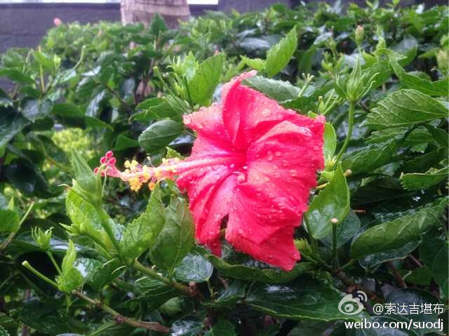
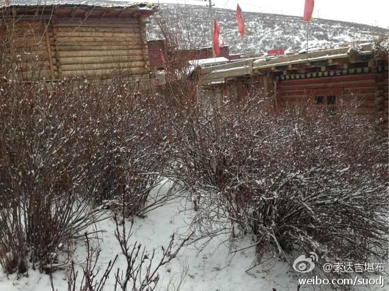
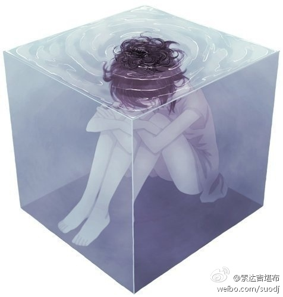
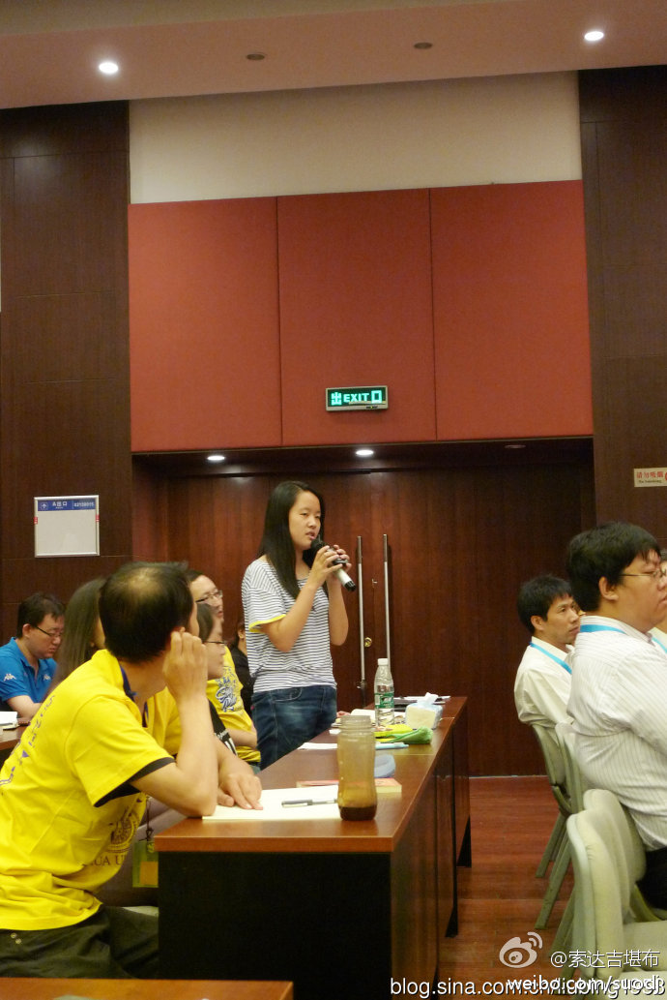

 ## 2014-01-01 08:29
一年之计在于始。新年的第一天，若能念诵八吉祥1遍，莲师心咒、度母心咒、观音心咒各100遍，依靠佛菩萨的加持，可护佑自己和他人在这一年里吉祥圆满、遣除障碍、身心自在、快乐连连。祝福大家元旦吉祥！

 ## 2014-01-01 08:40
新年的第一顿饭，吃完了，好吃！

 ## 2014-01-02 09:06
昨天是2013年年终的毕业典礼。300多僧众经过6年的闻思修行，如今已圆满毕业。对他们个人来说，这不是一种结束，而是弘法利生的开始。

 ## 2014-01-03 09:05
现在，人们把手机当成了身体的一个器官，去哪儿也离不开它。走路、坐车、上班、聚会……随时随地在低头看手机。一旦手机丢了，都不知道怎么活了。早上醒来，第一件事是摸手机；晚上睡前，最后一件事是看手机。也许在临终前，最放不下的还是手机。这到底是人类控制了科技，还是科技控制了人类？

 ## 2014-01-06 09:05
有些人天真地认为，自己只享受一次欲乐，就足够了。但若想以此令贪欲变淡，这无疑是异想天开。如同饮用盐水，只会越喝越渴，贪欲越享受就会越炽盛，永远也不可能让你心甘情愿地舍离。——法王如意宝

 ## 2014-01-07 08:27
“贪”会带给人一时快乐，结局却是无尽麻烦；“嗔”能让人瞬间压倒对方，却会埋下无穷祸患；这二者都来自“痴”，由于不明道理，所以不懂取舍。

 ## 2014-01-08 18:45
我只是一名非常普通的僧人，惭愧！希望更多人了解到佛教的美好，信仰的可贵。
 > @人物
 > 【1月号封面：年度面孔】我们以影响力为首要标准，评选并报道过去一年中对中国社会产生影响力、在时代进程中具有标志性意义的人物。他们或因个人的成功，或因坚持，或因激起大众热情，已被记入历史。一起看看，他们是谁？ O网页链接  

 ## 2014-01-10 14:15
昨晚学院失火，一些僧房被毁，但无人员因此丧生，请大家放心。

 ## 2014-01-11 10:08

 ## 2014-01-13 07:36
1月13日至19日，学院将举办为期7天的法王圆寂十周年纪念法会。凡参与法会者，最好能念诵金刚萨埵心咒“嗡班杂萨多吽”十万遍，看一遍法王的珍贵教言《不离》。直播：O网页链接

 ## 2014-01-15 10:10

 > @索达吉藏文化
 > 今天是法王如意宝圆寂十周年的日子，望大家以猛厉的信心多念《上师供》，或者法王祈祷文“自大圣境五台山，文殊加持入心者，祈祷晋美彭措足，证悟意传求加持”。

 ## 2014-01-15 10:45
接受媒体采访时，霍华德金森一脸愧疚：“20多年前，我太过年轻，误解了‘幸福’的真正内涵。而且，我还把这种不正确的幸福观传达给了我的许多学生。在此，我真诚地向我的这些学生致歉，向‘幸福’致歉！”

 ## 2014-01-16 09:18
不要老想着争第一，要努力做唯一。这是竞争中最好的出路。

 ## 2014-01-16 20:43
明天（17日）11点-12点，我在新浪读书做微访谈。你若有问题，可以来互相交流O网页链接

 ## 2014-01-17 07:26
过去的你，已经消失了；未来的你，还没有出现；现在的你，刹那都在变化。真正的你，到底在哪里？

 ## 2014-01-17 10:45
#不离：上师人生开示录#我的微访谈"现代人为何活得不快乐？"开始啦！今天我会在微访谈跟大家聊天,访谈时间是11:00-12:00,快来提问吧！访谈地址：O网页链接
 ## 2014-01-17 11:01
#不离：上师人生开示录#人生解知足，烦恼一时除。
 > @1028X666666
 > 对 @索达吉堪布 提问:心里总是不开心 压抑 感觉笑不起来 不是乐观激情向上的态度。请问大师怎么快乐 O网页链接
 ## 2014-01-17 11:02
#不离：上师人生开示录#伟大的翻译家，真正的大成就者。
 > @lixintong1974
 > #不离：上师人生开示录#向@索达吉堪布 提问：你好上师，请问你怎么看鸠摩罗什的一生？ O网页链接
 ## 2014-01-17 11:02
#不离：上师人生开示录#但行好事，莫问前程。
 > @1028X666666
 > 对 @索达吉堪布 提问:怎么开心 怎么对事都积极向上 O网页链接
 ## 2014-01-17 11:03
#不离：上师人生开示录#བཀྲ་ཤིས་ཤོག
 > 转发的微博已被删除
 ## 2014-01-17 11:03
#不离：上师人生开示录#先从道理上弄明白：这一切不值得执著。
 > 转发的微博已被删除
 ## 2014-01-17 11:04
#不离：上师人生开示录#恭敬祈祷。
 > @崇·彭措绕吉
 > 对 @索达吉堪布 提问:怎么能够的得到上师的加持？ O网页链接
 ## 2014-01-17 11:05
#不离：上师人生开示录#可以的，但不要忘记佛法
 > @ahead2012
 > 向 @索达吉堪布 提问: #不离：上师人生开示录# 顶礼尊敬的大恩上师！我是一名在家弟子，现在很想结婚，请问可不可以？请大恩上师开示。 O网页链接
 ## 2014-01-17 11:06
#不离：上师人生开示录#当你的心准备好了，就知道了。
 > @AngelaKwok
 > 对 @索达吉堪布 提问:顶礼上师！请问怎样才能遇到自己的根本上师呢？ O网页链接
 ## 2014-01-17 11:07
#不离：上师人生开示录#培养打坐禅修的习惯。
 > @胖妞妞更要努力学习
 > 向 @索达吉堪布 提问: #不离：上师人生开示录#对于修行念咒的时候，自己无法集中，总是东想西想的，需要用什么方法来改进 O网页链接
 ## 2014-01-17 11:07
#不离：上师人生开示录#多祈祷文殊菩萨，多念文殊心咒
 > 转发的微博已被删除
 ## 2014-01-17 11:08
#不离：上师人生开示录#可以，可以
 > @邬金让雄多杰
 > 对 @索达吉堪布 提问:顶礼大恩上师般若摄诵可以给小动物佩戴吗？可以随亡人一起焚烧吗！喇嘛钦 O网页链接
 ## 2014-01-17 11:09
#不离：上师人生开示录#无得无失
 > 转发的微博已被删除
 ## 2014-01-17 11:10
#不离：上师人生开示录#种子种下，会马上结果吗？一切需要时间。
 > @阿荫嘤嘤嘤
 > 对 @索达吉堪布 提问:上师，好人都会有好报吗？为什么我看到的很少呢？ O网页链接
 ## 2014-01-17 11:12
#不离：上师人生开示录#先要系统学习佛法，明白了道理才能放下
 > @查理白白
 > 向 @索达吉堪布 提问：#不离：上师人生开示录#怎样不执著？怎样才能放下？ O网页链接
 ## 2014-01-17 11:12
#不离：上师人生开示录#得病不一定坏事，关键看你的心。
 > 转发的微博已被删除
 ## 2014-01-17 11:13
#不离：上师人生开示录#在这个世间上，你想得到什么，就必须先付出什么。想要得到爱，就要先学会爱别人。
 > 转发的微博已被删除
 ## 2014-01-17 11:15
#不离：上师人生开示录#遇到问题时，先处理心情，再处理事情。
 > 转发的微博已被删除
 ## 2014-01-17 11:15
#不离：上师人生开示录#ཚན་རིག་ལ་སློབ་སྦྱོང་ལེགས་པོ་བྱས་ན་ལས་སླ་པོ་རེད།
 > 转发的微博已被删除
 ## 2014-01-17 11:15
#不离：上师人生开示录#需要修行。不然，就算有人告诉你最好的方法，但从来不去做，也无济于事。就像口干舌燥的人呆在河边，但不去喝水，仍会渴死一样。
 > 转发的微博已被删除
 ## 2014-01-17 11:16
#不离：上师人生开示录#所有发生的事都不是偶然的，是因缘际会。
 > 转发的微博已被删除
 ## 2014-01-17 11:18
#不离：上师人生开示录#可以送，烦恼即菩提
 > @菩提心秋尼卓玛
 > 向 @索达吉堪布 提问: #不离：上师人生开示录#顶礼大恩上师！《不离：上师人生开始录》是我这辈子见过最好的书，我一天内拜读完，还会反复阅读。请问上师，我身边的朋友有不学佛可以送给他们看吗？会不会让他们引起烦恼？请上师开示！ O网页链接
 ## 2014-01-17 11:18
#不离：上师人生开示录#任何快乐都逃不过无常，所以不要太过执著，事先要有心理准备。
 > @密斯蟹的下午茶
 > 向 @索达吉堪布 提问: #不离：顶礼大师。上师人生开示录#友的老公出轨，理由就是现在的妻子不会持家，没有女人味。请问，该怎样帮助我的朋友处理这件事呢？ O网页链接
 ## 2014-01-17 11:19
#不离：上师人生开示录#如果无法控制欲望，心就被它踩在脚下，永远做它的奴仆。
 > @褰裳兰沚
 > 向 @索达吉堪布 提问: #不离：上师人生开示录#顶礼上师，我发现自己很贪心，好的东西总是想占为己有，应该怎样断除这种贪心呢？ O网页链接
 ## 2014-01-17 11:21
#不离：上师人生开示录#བླ་མའི་རྣལ་འབྱོར་ཞལ་གསུང་མ་དེ་བཏོན་ན་ལེགས།
 > @潘秀其美旺堆
 > 向 @索达吉堪布 提问：#不离：上师人生开示录#མཁན་རིན་པོ་ཆེར་ཞུ་རྒྱུ་ཞིགལ། རྗེས་སུ་བླ་མ་ཡིད་བཞིན་ནོར་བུའི་བླ་སྒྲུབ་ཀྱི་ཁྲིད་ཅིག་ཞུ་འདོད་རབ་ཏུ་ཆེ། O网页链接
 ## 2014-01-17 11:22
#不离：上师人生开示录#互相理解、谦让、成全，不要天天当”警察“
 > @宝贝熙雨
 > 向 @索达吉堪布 提问：#不离：上师人生开示录#夫妻的相处之道是什么呢？ O网页链接
 ## 2014-01-17 11:22
#不离：上师人生开示录#没有这种说法
 > 转发的微博已被删除
 ## 2014-01-17 11:23
#不离：上师人生开示录#回向积资等
 > @持明-云南
 > 向 @索达吉堪布 提问: 要达到生生世世不离师，除了发愿，还要怎么做？ O网页链接
 ## 2014-01-17 11:23
#不离：上师人生开示录#念莲师心咒1万遍
 > @yneeipo纸月亮
 > 对 @索达吉堪布 提问:上师你好，我今年是本命年，是不是本命年真的就不顺，用什么方法可以解除不顺呢 O网页链接
 ## 2014-01-17 11:25
#不离：上师人生开示录#有利他心的人，就是好人。
 > 转发的微博已被删除
 ## 2014-01-17 11:26
#不离：上师人生开示录#先学习《大圆满前行》，圆满修持五加行。不然，再高的修行都是冰上建筑
 > @善慧海
 > 上师：请问我求了很多法，包括从玛哈瑜伽、阿努瑜伽和阿底瑜伽（包括心部、界部和窍诀部）的法，我应该怎么修？现在是想齐头并进地修每一部法。我该怎么办？ O网页链接
 ## 2014-01-17 11:26
#不离：上师人生开示录#若有利他心，则发心即修行
 > 转发的微博已被删除
 ## 2014-01-17 11:27
#不离：上师人生开示录#指望这些，无疑守株待兔。想不如做，从点滴开始
 > 转发的微博已被删除
 ## 2014-01-17 11:28
#不离：上师人生开示录#《大圆满前行》O网页链接
 > 转发的微博已被删除
 ## 2014-01-17 11:30
#不离：上师人生开示录#从道理上、修行上明白“我”不存在，看到很多人不明白此理而痛苦，就会自然想利益他们
 > @素缕禅心
 > 向 @索达吉堪布 提问：#不离：上师人生开示录#怎样尽快去掉我执，做到真正的无我利他？ O网页链接
 ## 2014-01-17 11:30
#不离：上师人生开示录#别执着，它是梦中之梦！
 > @海印秋月
 > 向 @索达吉堪布 提问：#不离：上师人生开示录#上师，如何提高游戏中的技术水平？？？ O网页链接
 ## 2014-01-17 11:31
#不离：上师人生开示录#念观音心咒就不会紧张
 > @wenjin1996
 > 向 @索达吉堪布 提问: #不离：上师人生开示录#顶礼上师，当众讲话紧张是何原因，如何对治？ O网页链接
 ## 2014-01-17 11:33
#不离：上师人生开示录#可以追求，但都躲不过无常，要懂得随缘。
 > 转发的微博已被删除
 ## 2014-01-17 11:33
#不离：上师人生开示录#随缘，是积极做事，但对结果如何不放在心上。尽人事，听天命。
 > @ShiningForU
 > 对 @索达吉堪布 提问:对 @索达吉堪布 提问:上师您好🙏，人们常说随缘，“随缘”请，问应该怎么正确的理解“随缘”？是处处不争吗？ O网页链接
 ## 2014-01-17 11:34
#不离：上师人生开示录#显现上，分
 > @昕喜
 > 向 @索达吉堪布 提问：#不离：上师人生开示录#大师，人分等级吗？ O网页链接
 ## 2014-01-17 11:35
#不离：上师人生开示录#学习《入行论》的“安忍品”来化解，不然，硬憋会内伤。
 > @卓玛旺拉姆-仁增拉姆
 > 向 @索达吉堪布 提问: #不离：上师人生开示录#顶礼上师，如何去掉发脾气的习性，如何去掉嗔心？感恩上师，阿弥陀佛 O网页链接
 ## 2014-01-17 11:36
#不离：上师人生开示录#对“我”太执著。
 > 转发的微博已被删除
 ## 2014-01-17 11:36
#不离：上师人生开示录#看＜前世今生论＞
 > @LimeJuiceOo
 > 向 @索达吉堪布 提问: #不离：上师人生开示录#顶礼上师！请问有什么办法能让一个人相信轮回的存在呢？ O网页链接
 ## 2014-01-17 11:37
#不离：上师人生开示录#请出家僧众为他念《普贤行愿品》回向。
 > @手机用户3234535914
 > 对 @索达吉堪布 提问:师傅，问一下，梦见已故的父亲脚被砍掉，我该怎么做才能对他好呀？[推荐]亲您告诉我😭😭😭父亲还说在阴曹地府不太好，怎么办呀？我该怎么做？爸爸是不是不好？ O网页链接
 ## 2014-01-17 11:38
#不离：上师人生开示录#养心
 > @光芒姐姐W
 > 对 @索达吉堪布 提问:你好，请问佛法讲究如何养生呀？ O网页链接
 ## 2014-01-17 11:39
#不离：上师人生开示录#多做利益众生的事。
 > @甘增加措的微博
 > 对 @索达吉堪布 提问:顶礼上师.弟子.如何做才能够让上师欢喜长久住世.让众生欢喜发菩提心。 O网页链接
 ## 2014-01-17 11:40
#不离：上师人生开示录#明白吃肉的过失、吃素的功德
 > @小拉姆老师
 > 对 @索达吉堪布 提问:怎样戒肉？师父？困惑？ O网页链接
 ## 2014-01-17 11:40
#不离：上师人生开示录#把目标降一降。成功率不代表你生活的意义
 > 转发的微博已被删除
 ## 2014-01-17 11:42
#不离：上师人生开示录#不一定，很多大成就者都是在家人
 > @1133lgx_108
 > 向 @索达吉堪布 提问: #不离：上师人生开示录#修法一定要出家才能得到解脱吗？ O网页链接
 ## 2014-01-17 11:42
#不离：上师人生开示录#看到了，有缘
 > @diaoyudao1981_126
 > 向 @索达吉堪布 提问: #不离：上师人生开示录#您为何看不到我的问题，是因为缘还没到吗，顶礼 O网页链接
 ## 2014-01-17 11:42
#不离：上师人生开示录#等。强扭的瓜不甜
 > 转发的微博已被删除
 ## 2014-01-17 11:44
#不离：上师人生开示录#多念金刚萨埵心咒、百字明忏悔。
 > 转发的微博已被删除
 ## 2014-01-17 11:45
#不离：上师人生开示录#学习这方面的道理，同时一定要修行
 > 转发的微博已被删除
 ## 2014-01-17 11:46
#不离：上师人生开示录#有一些，但不严重
 > @密斯蟹的下午茶
 > 向 @索达吉堪布 提问: #不离：上师人生开示录#大师，您有苦恼吗？ O网页链接
 ## 2014-01-17 11:47
#不离：上师人生开示录#བོད་མི་རིགས་ཀྱི་ནང་སེམས་ཀྱི་འབྱོར་བ་ཆེས་སྔོན་ཐོན་ཡིན་པས་རྗེས་ལུས་མཚན་ཉིད་པ་མིན་སེམས།
 > 转发的微博已被删除
 ## 2014-01-17 11:47
#不离：上师人生开示录#还是因为不知道。你知道一个东西有毒，还会吃吗？
 > @缘起性空O
 > 向 @索达吉堪布 提问: #不离：上师人生开示录#顶礼上师，明知道有些事做得不如法，但是还是没有做到，一时还做不到。 O网页链接
 ## 2014-01-17 11:47
#不离：上师人生开示录#从《大圆满前行》开始，学习、修行，缺一不可。
 > @小糖wzy
 > 向 @索达吉堪布 提问：#不离：上师人生开示录#我想修行佛法怎么开始？ O网页链接
 ## 2014-01-17 11:48
#不离：上师人生开示录#暂时没有
 > 转发的微博已被删除
 ## 2014-01-17 11:50
#不离：上师人生开示录#在多念的同时，最好能懂得经义
 > 转发的微博已被删除
 ## 2014-01-17 11:51
#不离：上师人生开示录#好好闻思修行
 > 转发的微博已被删除
 ## 2014-01-17 11:51
#不离：上师人生开示录#长期不离，每年看一遍
 > 转发的微博已被删除
 ## 2014-01-17 11:52
#不离：上师人生开示录#真正懂了佛法，就知道学佛让自己更积极；对佛法一知半解，觉得它让自己消极
 > @吧唧嘴的大护卫
 > 对 @索达吉堪布 提问:我觉终有一日，我会与佛结缘，这是不是逃避现实？ O网页链接
 ## 2014-01-17 11:54
#不离：上师人生开示录#有些缘分是注定的，但并不是不能改，行善断恶就是钥匙。什么是善，什么是恶，在佛教中有答案。
 > 转发的微博已被删除
 ## 2014-01-17 11:55
#不离：上师人生开示录#明白你是空的，你所执著的是空的，欲望自然也是空的。
 > @Eversir
 > 向 @索达吉堪布 提问：#不离：上师人生开示录# 上师，请问如何控制欲望？ O网页链接
 ## 2014-01-17 11:56
#不离：上师人生开示录#把跟家人相处当成一种修行
 > @Fan-YuanYang
 > 向 @索达吉堪布 提问: #不离：上师人生开示录#在家人如何平衡修行与家庭？并很好地修持出离心。 O网页链接
 ## 2014-01-17 11:56
#不离：上师人生开示录#不求回报的学习是最无上
 > 转发的微博已被删除
 ## 2014-01-17 11:57
#不离：上师人生开示录#学习佛法。明白道理了，就会生起不退的信心。不然，有些信心只是一时热情
 > 转发的微博已被删除
 ## 2014-01-17 11:58
#不离：上师人生开示录#加油！
 > @大树刚巴勒
 > 向 @索达吉堪布 提问: #不离：上师人生开示录#为了他，我默默地学习和充实自己，现在觉得有点累了，老师，给我个鼓励，让我有动力继续加油吧 O网页链接
 ## 2014-01-17 11:59
#不离：上师人生开示录#需要出离心
 > @付庆华
 > 向 @索达吉堪布 提问: #不离：上师人生开示录#师傅，出家需要什么？ O网页链接
 ## 2014-01-17 12:00
#不离：上师人生开示录#放生，念观音心咒
 > @菜菜当妈咪
 > 向 @索达吉堪布 提问：#不离：上师人生开示录#上师，为什么不回我呢？弟子诚心发问呀，想14年怀个健康足月宝宝，每天抄写经书，我还想做些什么，能为宝宝积福的！上师····还有5分钟就结束了。555555 O网页链接
 ## 2014-01-17 12:00
#不离：上师人生开示录#书中有答案。
 > 转发的微博已被删除
 ## 2014-01-17 12:01
#不离：上师人生开示录#你觉得没错
 > 转发的微博已被删除
 ## 2014-01-17 12:01
#不离：上师人生开示录#当然可以
 > @yspf_7390
 > 对 @索达吉堪布 提问:顶礼上师  净土和加行可以一起修吗？感恩上师 O网页链接
 ## 2014-01-17 12:02
#不离：上师人生开示录#人生不是只有一条路，这条走不通，换一条可能更光明。有心，就有希望
 > @去人大不改名字了
 > 对 @索达吉堪布 提问:大师，该如何面对高三的失败？  O网页链接
 ## 2014-01-17 12:02
#不离：上师人生开示录#严格说，没有信仰，也是一种“信仰”。有些人追求金钱，这就是他的信仰。信仰不是有或没有，关键是对或不对。
 > 转发的微博已被删除
 ## 2014-01-17 12:03
#不离：上师人生开示录#学会感恩，你比很多人幸福多了
 > @gxx1228
 > 向 @索达吉堪布 提问: #不离：上师人生开示录#   顶礼上师，我总是觉得自己长得丑，各方面都不是很好，不自信，有点自卑，请上师开示。 O网页链接
 ## 2014-01-17 12:05
#不离：上师人生开示录#先要明白上师的“教”言，才能依“教”奉行，不然容易成为一种盲目
 > 转发的微博已被删除
 ## 2014-01-17 12:08
#不离：上师人生开示录#知道你做的一切，不是表演，不要被观众的掌声或嘘声所转。
 > @gogo冰淇凌
 > 对 @索达吉堪布 提问:请问怎样才能不在乎世人的眼光，静心地过自己想过的生活？ O网页链接
 ## 2014-01-17 12:09
#不离：上师人生开示录#这是一种清净的信心，但不稳固。要了解佛法到底是什么、对自己有何利益，如此，这种信心才能升级、稳固
 > @我想fxxkit
 > 对 @索达吉堪布 提问:为什么每次去庙里都想哭，听师傅念经也是，怎么回事 O网页链接
 ## 2014-01-17 12:11
#不离：上师人生开示录#很快乐！修行给我带来的快乐，什么也无法替代
 > @2013快乐土豆
 > 对 @索达吉堪布 提问:请问您快乐吗？ O网页链接
 ## 2014-01-17 12:11
#不离：上师人生开示录#当然
 > @丹增让姆
 > 对 @索达吉堪布 提问:顶礼大恩上师！我现在正在学习入菩萨行论 我想反复学直到学透为止 可以吗？ O网页链接
 ## 2014-01-17 12:12
#不离：上师人生开示录#不好意思，问题太多了，看不过来
 > @仁切康卓
 > 对 @索达吉堪布 提问:上师，你怎么老是看不到我的问题？都没信心再问了！顶礼！ O网页链接
 ## 2014-01-17 12:12
#不离：上师人生开示录#若修心，家庭就是天堂
 > 转发的微博已被删除
 ## 2014-01-17 12:13
#不离：上师人生开示录#严格来说，有矛盾，但作为世间人，可以好好安排时间，尽量兼顾。
 > @喜福灵
 > 对 @索达吉堪布 提问:上师，出离心和世间法矛盾吗？如何对待工作和修行？ O网页链接
 ## 2014-01-17 12:14
#不离：上师人生开示录#时间到了，我要去开法会了，谢谢大家！
 > 转发的微博已被删除
 ## 2014-01-19 09:42
在某种程度上，物质与精神是呈反比的。物质越发达，精神越空虚；物质越简单，精神越充实。若一味追求物质发展，其代价就是人心沦丧、道德败坏。所以，古人提倡安“贫”乐道，不丹也被称为最幸福的国家之一。

 ## 2014-01-20 08:14
要想解决一些实际问题，比如贩卖婴儿，纯粹靠立法是不够的。再完美的制度，都能找到漏洞。只有让每个人真正有信仰，懂得因果不虚、善恶有报，才能自己约束自己，从根本上解决问题。

 ## 2014-01-21 08:26
爱因斯坦说：“我担心有一天科技充斥人间时，世界将仅剩下白痴的一代。”

 ## 2014-01-23 07:39
许多人经常问：如何治疗抑郁症？我暂且不引用佛教观点，只用一个科学实验来告诉你答案——2005年，心理学家派崔克研究了441位有宗教信仰的人，之后得出结论：慈悲心会大幅降低忧郁和压力。他还认为，在生活中真正有益的，是实践慈悲的行动，即使没有宗教信仰，只要付出慈悲就能有助人们更加健康。

 ## 2014-01-24 08:49
不执著便没有苦乐。当你遇到一件事，不管可喜还是可憎，只要不去分别、妄执，它当下就消失了。曾有个小和尚问师父：“听说您德行高深，假如美女、妖魔以及世间一切同时现在您眼前，您会不会眼花撩乱？”师父回答：“让青色归于青光、黄色归于黄光，让看只是看、听只是听，哪来的眼花撩乱？”

 ## 2014-01-25 09:51
现在不少人对佛教感兴趣，常问我该如何学佛？其实，佛教并不是只有心灵鸡汤，或磕头、念经、吃素、打坐等形式，它的智慧才是对我们心灵最有帮助的。这种智慧在藏传佛教中有系统的宣说，尤其以《大圆满前行》为甚。我在中国文化书院简单讲过这部法，并针对各种常见问题进行了答复。O网页链接

 ## 2014-01-26 08:08
为减少全世界的灾祸，让人们更加安乐，喇荣五明佛学院从明天起，举办为期两天的莲师除障祈福大法会，从早上8点半到晚上6点，共诵莲师七句祈祷文，每人两万遍。任何人想参与都可以，即使两天内无法完成，尽快完成即可。

 ## 2014-01-26 22:48
此次莲师除障祈福大法会（1月27日-28日，8点半-18点），与僧众共修“莲师七句祈祷文”，机会非常难得。为便于大家参与，特安排了网络直播O网页链接【关于“莲师七句祈祷文”的功德，我曾讲过八节课O网页链接】

 ## 2014-01-29 08:06
爱因斯坦说：有些人认为宗教不合乎科学道理。我是一位研究科学的人，我深切知道，今天的科学，只能证明某种物体存在，而不能证明某种物体不存在。

 ## 2014-01-29 08:36
今天是除夕的前一天，按藏传佛教的传统，最好在今天的黄昏念9遍《心经》。此经中说：“能除一切苦，真实不虚。”依靠般若空性的强大威力，可遣除我们往年的一切不顺、烦恼、障碍，迎接来年的圆满、吉祥、平安。

 ## 2014-01-31 07:48
新的一年，祝福大家马上慈悲，马上欢喜，马上自在，马上吉祥！

 ## 2014-01-31 07:56
辞“旧”迎“新”，不仅仅是外面的节日庆祝，更应该是内心的净化与重新定位。人有善念，天必从之。在新年的第一天，让我们根据自己的情况，发个坚定的善愿吧。

 ## 2014-02-01 19:52
烟花再炫，不过一瞬；爆竹再响，惊雷即逝。看烟花绽放，听鞭炮连连，让人不禁想到一切无常，珍惜当下。

 ## 2014-02-03 07:52
用智慧来观察，现在的一切苦乐，都是虚幻的。但我们往往把它当真，为它哭、为它笑，不愿意从梦中醒来。

 ## 2014-02-05 07:49
如果你想认识佛教，除了学习它的教义，每年最好能抽出一段时间闭关，哪怕只有七天。若将修行变成一种习惯，心的力量就会增强，面对任何烦恼都不在话下，不知不觉间，快乐会天天与你相伴。

 ## 2014-02-07 08:09
俗话说：“良药苦口利于病，忠言逆耳利于行。”它的本意是，越是苦的良药，越对治病有帮助；越是不顺耳的劝告，越有利于改正缺点，对自己的行为有帮助。但有时候，逆耳的忠言也会使人产生抵触情绪，较难达到真正的目的。所以，掌握分寸很重要。

 ## 2014-02-08 08:16
近期，我以闭关的方式，听上师早年讲法的录音，观自己的心。每天只用固定的时间发微博、处理一些事物，其余时间都关掉手机。人生真的很短，若没有通过实修品尝到佛法的滋味，就算把佛法讲得再精妙，也很难用得上。

 ## 2014-02-09 08:12
河，明明在不停地奔流，人们仍以为它是一条不变的河；“我”，明明没有一刹那停止过变化，人们仍把它执著为不变的“我”。总把无常当做常有，这就是佛教所说的“愚痴”。

 ## 2014-02-11 08:16
一旦被欲望的毒箭射中，心会变得麻木，失去觉知，甚至疯狂。如果没有及时清醒，就会如同爱美的飞蛾扑向火焰、贪吃的鱼儿被鱼钩钓起，当发现自己身处险境时，后悔也来不及了。

 ## 2014-02-12 08:07
一个人去某地出差，办完事情后，会考虑自己怎么回家。同样，我们在人间几十年，寿命穷尽也会离开，这时候，你知道该怎么“回家”吗？

 ## 2014-02-13 08:06
不以过去的历史为鉴，也不关心未来的命运，只顾眼前的一时感受，这是当今时代的悲哀。

 ## 2014-02-14 07:54
在马年的第一个月圆之日，愿你的智慧、慈悲、福气，如今晚的月亮一样圆满。元宵节快乐！

 ## 2014-02-15 08:04
今天，一年半的时间到期，你念满一万遍了吗？利益众生是无有止境的，由于种种缘起，从今日起，我发愿再念一万遍，时间一年半。若想参与者，可以发愿。
 > @索达吉堪布
 > 前段时间，我在五台山发愿：一年半内念诵“大自在祈祷文”一万遍。若有人想生生世世与我一起闻思修行，顺利成办弘法利生事业，也可参与这次共修（念诵藏文、汉文皆可）。O网页链接

 ## 2014-02-16 07:56
佛教不是神秘主义，而是现实主义。它并非充满玄妙的神话，而是指出如何面对情绪、衰老、疾病、死亡，让我们乐观，不再忧郁。

 ## 2014-02-18 08:09
从小到现在，我们感兴趣的东西不断在换。现在自己最喜欢的，还可靠吗？

 ## 2014-02-19 07:55
禅宗、密宗是非常正宗的法门，其最高境界都提倡“不立文字”。但没证悟这种境界的人，必须先通过文字来学习佛法。否则，什么佛理都不懂，就打着这种旗号来弘扬佛法，所作所为一定会与佛法相违。

 ## 2014-02-21 08:33
心会散发出一种气场，善良的人让陌生人都觉得亲切、可信任，乐意与之交往，如此，他的路越走越宽广。心恶的人让大家害怕与他接触，一提起他的名字都发憷，慢慢地，他的路越走越窄，人生也出现各种不顺。所以，心决定了自己的人生轨迹，若想改变命运，就要从心入手。

 ## 2014-02-22 12:03
这是号称全球点击最多的视频。里面的东西，你我他都有，改变世界就靠它了，别错过。L号称世界上点击最多的视频

 ## 2014-02-22 17:09
我刚拍的这朵花挺美，献给微博上的所有朋友，愿它给你带来好心情。

 ## 2014-02-24 07:58
若想爱更多的人，就要从爱自己的家人开始练起。假如对家人的爱，是一种成全，有一种责任，多一分体谅，懂一点尊重，自然就会以这种方式去对待别人。否则，一屋不扫，何以扫天下？

 ## 2014-02-25 07:52
有人说：心静了，才能念佛，不然是一种亵渎。岂不知，念佛的作用，就是让心清净，古大德云：“念佛入于乱心，乱心不得不佛。”所以，当我们的心烦乱时，可以念佛号、抄佛经、听佛乐、唱佛歌。

 ## 2014-02-27 09:15
我们生命中拥有的一切，表面上源于自己的努力，实际上离不开众生的帮助。了悟到众生的珍贵和助益，我们对他们的负面态度将有所改变。

 ## 2014-02-28 07:56

 > @索达吉藏文化
 > 经过12年，我翻译出来了一部大论，此论极为殊胜难得，结尾是这样说的：“任何众生，不论是恼怒我还是喜欢我，伤害我还是跟随我，愿我都能尽快去帮助他们，令其获得解脱。”这部论不能随意公开，但此句可与大家分享。

 ## 2014-03-01 10:35
有些人想修学无上密法，但如果与道友之间不和，对闻法没有珍惜感，连这些最基本的资格都达不到。那就算你得过灌顶、修完加行，也仍不是密法的法器。不如不学为好。

 ## 2014-03-02 07:46
从今天起进入神变月（公历3.2—3.30），每天都是吉祥日，行持任何善法，功德增为平时的十亿倍。这是一年里最好的修行机会，大家切莫散乱。喇荣五明佛学院将开15天的持明法会，僧众诵九本尊心咒，为全世界和一切众生祈福。你若想参与却又不会念此咒，也可念大自在祈请文，或观音心咒“嗡玛尼贝美吽”。

 ## 2014-03-03 07:31
我们的生活需要规划，想好一年有什么打算，一个月准备做什么，一天需要完成什么。然后尽量严格地按照计划去做，当日事当时毕。只有这样，人生才不会迷迷糊糊就过完了。

 ## 2014-03-05 07:27
个别佛教徒的行为不良，有些人就非常不理解：“学佛怎么也这样？”其实，佛法是十分清净的，关键在于人有没有达到它的标准。鉴于此，佛陀才教导我们：要依“法”不依“人”。

 ## 2014-03-06 07:54
生气，是一种破坏性的情绪。处理棘手的问题时，随意发泄不满，只会带来麻烦，若能心平气和、微笑面对，让别人感觉轻松自在，许多困境都容易突围。

 ## 2014-03-07 07:28
对某个事物，因为最爱，有时候就会生起最恨的情绪，引爆最大的痛苦。所以，在生活中掌握一种“度”比较好，这样，才能得到长久的幸福。

 ## 2014-03-08 08:42
愿她淡定的心，不再浮躁；自在的心，不再寂寞；轻松的心，不再忙碌；解脱的心，不再迷惑。女人节快乐！

 ## 2014-03-09 00:04
让我们为马航的的乘客们祈福，每人念一百遍以上观音心咒：嗡玛尼贝美吽。

 ## 2014-03-10 09:07
很多年轻人对佛法感兴趣，对人生有诸多疑问。我自己虽然智慧有限，但在不同场合中作过解答，与你分享。O大学演讲 - 智悲佛网

 ## 2014-03-11 17:30
对于前世今生的存在，如果你怀有疑惑，或者不承认，最好能看看这本书。

 ## 2014-03-12 08:27

 > @索达吉藏文化
 > རང་ཚུགས་མ་ཤོར།།གཞན་སེམས་མ་དཀྲུགས།།莫舍己道，勿扰他心

 ## 2014-03-13 07:39
我们做的有些事情，如果对众生有利，哪怕被千夫所指，也应该责无旁贷；如果对众生有害，就算令万人敬仰，也没有意义。

 ## 2014-03-14 07:44
佛缘
 > @赵薇
 > @索达吉堪布 昨日一起对于人生，生活和经历的探讨，获益匪浅，感谢! 我在这里:O网页链接

 ## 2014-03-14 09:27
什么才是真正的福报？是名声、地位、财富，还是智慧、慈悲、宽容？

 ## 2014-03-15 07:36
爱是这世上最大的成功

 ## 2014-03-16 07:17
今天是藏历神变月十五号，持明法会的最后一天，如果你有时间，请念一遍《普贤行愿品》，届时僧众会将此善根一起回向，祈愿世界和平、消灾息难。

 ## 2014-03-16 14:07
共同努力
 > @上海慈慧公益基金会
 > 昨天，慈慧举办了3周年感恩汇报会。在此，首要感恩社会及各位爱心人士陪伴我们走过了1111个日夜，有爱的三年，不平凡的三年，三年只是开始，这一路有欢笑和挫折，但有您和慈慧家人的相伴。今年我们将继续秉承“ 慈善是心、日行一善”的理念，以西部助学、孝亲敬老，大学生公益为主，一路向阳继续前行。

 ## 2014-03-18 07:48
父母为孩子积财，不如教他们做人。如果连接人待物都不会，独立生活的能力也没有，甚至连脏衣服都要快递回家，一旦他们进入社会，又该如何自处？所以，不要把爱变成害，适当让孩子吃苦也是一种爱。

 ## 2014-03-19 08:05
人生是一次博弈，较劲你就输了；人生是一场游戏，当真你就出局了。

 ## 2014-03-20 07:35
古希腊人说：如果你选择计较，余生将会在黑暗中度过；如果你选择宽容，它会让阳光撒满大地。

 ## 2014-03-21 17:54
回寺之路有春风、白云、蓝天、碧水，无有雾霾。

 ## 2014-03-23 08:34
一个真正的佛教道场，不能沦为旅游观光、娱乐的场所。它存在的价值，不单是让人来烧香拜佛、放松心灵，更重要的是以讲经说法的方式，来传播正法、引导实修，让朝圣者了解人生的真相。

 ## 2014-03-25 08:09
正因为我执的存在，才会有担忧、恐怖、迷茫、孤独。一旦认清我执只不过是纸老虎，一切痛苦自然解脱，你会发现：天地是如此广阔。

 ## 2014-03-26 08:15
这些年轻人对佛教的研讨和认识，让你有什么体会？第三届世界青年佛学研讨会：上O网页链接 下O网页链接
 ## 2014-03-27 08:36
人体最软的是舌头，最硬的是牙齿，但这两个看似矛盾的东西，却相处得很好、很久。为什么？对立中往往存在着统一。祸福、好坏、阴阳、黑白等也是如此。

 ## 2014-03-28 09:16
一个人物质上穷，容易解决；精神上穷，就比较棘手了。若想找到解决之道，心就要“穿越”回古代，从古人的传统文化中找答案。

 ## 2014-03-30 07:58
我们虽然不是伟大的人，但如果用一颗伟大的心去做微小的事，就能成就伟大的事业。这颗心就是利他。

 ## 2014-04-01 07:49
存心不善，风水无益；父母不孝，奉神无益；兄弟不和，交友无益；行止不端，读书无益；作事乖张，聪明无益；心高气傲，博学无益；为富不仁，积聚无益；巧取人财，布施无益；不惜元气，服药无益；淫逸骄奢，仕途无益。——林则徐《十无益格言》

 ## 2014-04-02 08:10
每个人是不同的，他所处的位置，决定了他的见识。不要埋怨别人无知，不要指望别人和你站在同样的高度。与其把自己的意见强加于人，不如用一种亲近、平和的心，去看看他的世界。也许，你会有意想不到的收获。

 ## 2014-04-03 08:14
活在别人的世界里，纵然衣食无忧，也很累；活在自己的世界里，哪怕一贫如洗，也自在。

 ## 2014-04-05 05:36
今天是“清明节”。许多地方都有烧纸钱的习俗，这对亡者是缅怀，对生者的慰藉。但只是烧了很多纸，亡人能否得到钱也不好说。假如大家在烧纸钱时，至少念108遍观音心咒“嗡玛尼巴美吽”，绝对会给亡人带来利益。

 ## 2014-04-05 20:12
4月6日至9日，喇荣五明佛学院举行四天的“长寿法会”。期间，僧众会共诵长寿仪轨，并念长寿佛心咒“嗡格热阿耶色德吽舍，阿玛热那则万达意梭哈”，祈请十方大德长久住世。如果你希望自己或他人长寿，诵此心咒也是最好的秘诀之一。祈愿大家健康长寿、无病快乐！

 ## 2014-04-09 08:09
“我们所有的人都要学习佛陀的大悲精神，他的永恒教言可以帮助我们驾驭许多当今所面临的全球性问题。”潘基文在他的报告中说。

 ## 2014-04-10 10:58
为了消除整个世界的灾难，给众生带来平安吉祥，4月10-12日，喇荣五明佛学院全体僧众共修“莲师七句祈祷文”。下午将有法会的网络直播O网页链接。今晚8点-8点半，我也会在此简单讲解七句祈祷文的重要性。此举功德极大，机会难得，望大家尽量参与，每人尽快念满三万遍即可。

 ## 2014-04-12 12:21
放下，不是让你什么都没有，或什么都不做，而是让你对什么都不执著。没执著就不痛苦，所以，这种智慧并不消极，它会给我们带来快乐。

 ## 2014-04-13 10:57
钱常被称作“万恶之源”，其实，这是错怪了钱。钱本身是中性的，谈不上善恶。可怕的并不是钱，而是对钱的态度。所以，佛教不是让你不赚钱，而是告诉你用什么心去赚钱。

 ## 2014-04-14 18:57
4月15日12：53—18：37是月全食。《时轮金刚》中说，在出现日食或月食的日子里，无论作任何善行，功德均会成千上万倍增长。汉地的《苏悉地经》亦云：“于月蚀时，成就最上之物；于日蚀时，通上中下成就之物。”故希望大家把握良机，精进行持善法！
 > @索达吉堪布
 > 为什么日月食是极为重要的修法时机呢？《时轮金刚》认为，外在的日、月，是人体内在气脉明点的一种投影。我们每个人每天的呼吸次数是21600次，其中绝大多数是业气，智慧气的比例很少。但在这些特殊的日子里，多数业气就变成了智慧气，气脉明点运行处于特殊阶段，在这时候精进修行，其效果会非比寻常！
 ## 2014-04-16 08:33
世界上的事情最好是一笑了之，不必用眼泪去冲洗。——印度诗人泰戈尔

 ## 2014-04-17 07:49
倾听不同的声音//@易立竞: 这不是日常版的《易见》,这次,我们请来了身份职业成长背景毫无交集的两位嘉宾,听他们聊自己、聊他们对这个世界的看法。在这个舞台上,我是个手艺人,负责捡拾他们思想的珠贝。此刻,在这里,把他们的思想供养给你们。然后,随缘。
 > @凤凰网娱乐
 > #《易见》特别节目#【索达吉堪布VS赵薇——《少有人走的路》】这是一场特别对话,@易立竞 主持,宗教领袖@索达吉堪布 和演员导演@赵薇 探讨青春、信仰、金钱、死亡等话题。他们的相同之处 “走少人有走的路,做对思想有供养的事。”点击@凤凰娱乐 专题：O《易见》特别节目之赵薇 视频：O网页链接

 ## 2014-04-18 08:48
我们遇到一些打击刁难时，先要控制自己的情绪，冷静几分钟，什么都不要做、什么都不要说。否则，冲动下做的任何事，都不会是正确的。只有以温和的态度、平静的心态，才能做出正确的决定。

 ## 2014-04-21 08:34
世界上最极致的东西是什么？是心。它可以最快也可以最慢，可以最大也可以最小，可以最真也可以最假，可以最弱也可以最强，可以最残忍也可以最慈悲。心是每个人最大的秘密，它决定了命运的走向，所以，调心是世上最好的工作。

 ## 2014-04-22 07:52
剃除须发，不是菩萨的出家。为了利益众生而非常精进，才是真正的菩萨出家。——文殊菩萨

 ## 2014-04-24 08:15
我们不要随意批评其他宗教，或许它对你没效，但并不意味着对百千万人丧失了价值。若依靠不同的宗教传统，将一个本来很坏的人变成好人，这就是宗教的目的，也是宗教的结果。我们必须承认每个宗教都有潜力，并要尊敬所有信奉它的人。

 ## 2014-04-25 07:53
有人对美国1000多位富翁进行调查，归纳出最常见的发家类型：勤劳型、机遇型、利人利己型。有趣的是，前两种竟然只占20％，80％的富翁靠利人利己起家。

 ## 2014-04-26 08:09
不要小看自己随手之劳的善举。美好的善行，常能带来意想不到的回报；就算没有任何回报，也能带给我们心灵上的满足，而这种满足，是再多钱也买不到的幸福滋味。

 ## 2014-04-27 08:03
轮回中的众生，都是贪玩的小孩。

 ## 2014-04-28 10:09
我们佛学院还在下雪，好冷啊

 ## 2014-04-29 07:28
今天有日食，时间约11：52—16：14。请大家把握难得的机会，精进行持善法。

 ## 2014-05-01 10:02
观察一个人，德比才更重要。康熙皇帝曾说：“观人必先心术，次才学。心术不善，纵有才学何用？”所以，我们不要本末倒置。

 ## 2014-05-02 08:31
利益他人的生活，并不是自我牺牲，而是自我实现。

 ## 2014-05-03 08:21
当我们发脾气时，强迫自己不要生气，是不可能的；光靠祈祷，让自己不要生气，也不现实。如何才是正确的方法？了解什么因缘让你生气，透过对因缘的认识，消灭嗔心之根，这才是解决之道。

 ## 2014-05-04 06:27
不管时代的潮流和社会的风尚怎样，人总可以凭着自己高贵的品质，超脱时代和社会，走自己正确的道路。现在，大家都为了电冰箱、汽车、房子而奔波、追逐、竞争，这是我们这个时代的特征了。但是也还有不少人，他们不追求这些物质的东西，他们追求理想和真理，得到了内心的自由和安宁。——爱因斯坦

 ## 2014-05-06 07:30
转发：戴三百块的表和三百万的表，时间是一样的。 喝三十块的酒和三千块的酒，呕吐是一样的。 住三十平米的房子和三百平米的房子，孤独是一样的。 总有一天你会明白，内心真正的快乐，是物质世界永远都给不了的。

 ## 2014-05-08 08:24
梦中执著的一切，当醒来的时候，一无所有；今天我们追求的这些，当死的时候，都用不上。这样的死亡什么时候到来，你和我都不知道。

 ## 2014-05-08 17:20
如果你想了解藏传佛教和藏文化，可以读读这篇文章 //@易立竞:从去年5月我第一次采访@索达吉堪布 到今天这篇文章刊出,耗时整一年,共采访8次——藏地4次,北京、香港、成都等地4次,采访录音16万字,成稿2万字,最终刊出1万2千字…能从中读到什么,依各人的缘分🙏
 > @南方人物周刊
 > 388期封面：索达吉堪布 上师下山——在信仰市场日渐兴盛的时代，佛教与上师们如何应对。

 ## 2014-05-11 08:21
影视，可以说是现代人的宗教。在各种影视剧熏陶下长大的一代，现实中面对事情时，剧中情节成了自己最本能的反应：有人攻击几句就接受不了，总觉得别人在陷害自己，被爱人误会就要寻死觅活……他们并不知道，自己混淆了现实与虚幻的界限，不知不觉间已被这些文化洗脑，心越来越脆弱，不堪一击。

 ## 2014-05-13 07:39
据统计，我们这一生中，40%的时间在为已发生的事情懊悔，50%的时间在为未发生的事情担忧，而这一切只不过是杞人忧天、庸人自扰，我们应该把握眼前可以够得着的一切。

 ## 2014-05-15 08:31
听说有些人没买到这期杂志，可以看电子版O网页链接和O网页链接

 ## 2014-05-16 08:28
我们并非每一生、每一世都能遇到佛法。这辈子有幸值遇，一定要好好珍惜，尽量利用这来之不易的因缘，找到人生的真相。

 ## 2014-05-19 08:07
世间上的很多理念，往往只能盛极一时，然后随着时代的不同而褪色，但有一种理念，放诸四海而皆准。它就是人类真正的爱，也叫慈悲。

 ## 2014-05-20 08:23
这是我每天的早餐：糌粑、酥油。

 ## 2014-05-21 08:30
密宗是非常严密的佛法教育，但现在人们的认识，有一些比较极端的观点——要么把密宗太神圣化了，要么把密宗太妖魔化了。【腾讯佛学华严讲堂】：什么是密宗O【华严讲堂】索达吉堪布：什么是密宗

 ## 2014-05-23 08:21
莫道老来方学道，孤坟多是少年人。——顺治皇帝

 ## 2014-05-24 11:48
奢侈带来的虚荣，永远不能让人真正满足。

 ## 2014-05-27 07:25
忙碌采蜜的蜜蜂、安然入睡的燕子，就如同被琐事缠绕的世间人、宁静思维的修行人。这两种生活方式，你钟意哪一种？

 ## 2014-05-28 08:00
当我们与人冲突时，不要马上以牙还牙、斤斤计较，而要尽量让自己宽容。其实，宽容不代表无能、怯懦、无原则地原谅别人，这是一种将心比心，自他相换的修行，到头来，它在你身上所起的正面作用会日益明显。

 ## 2014-05-29 08:01
人如果没有自信，也不信任他人，这种生活是一种孤独。

 ## 2014-05-31 08:15
一个人的愤怒，往往源于对自己的不确定，是一种怯懦的表现。当你非常自信时，即使对方有一些攻击，自己也会非常淡定，泰山崩于前而面不改色。

 ## 2014-06-01 06:04
六一儿童节快乐！愿普天下的孩子有一个充满爱心的童年。

 ## 2014-06-03 07:17
脆弱、计较、无知是痛苦的源泉，造就痛苦的并非问题本身，而是我们的心没有调伏，对外境过于执著。

 ## 2014-06-04 07:23
学佛如果不是为了根除“自我”，不管你学多久、学多高的法，也只不过是在满足它，依旧是在门外徘徊。

 ## 2014-06-04 14:33
度母，是救“度”众生的“母”亲，她如同妈妈，能带给我们绵绵不绝的温暖。人一生会有各种心愿，若想达成，并非磕几个头、烧几炷香就行，关键要懂得方法。希望你通过此书，找到适合自己的方法，遣除苦难，成就所愿。当当：O网页链接亚马逊：O网页链接京东：O网页链接

 ## 2014-06-05 07:22
6月6日至13日，喇荣五明佛学院将举办为期8天的金刚萨埵法会。念修金刚萨埵心咒“嗡班杂萨多吽”，是忏悔业障最有力、最灵验的法门。若能念诵40万遍，即便是最难忏悔的罪业，也能得以清净。任何人想参与都可以，即使8天内无法完成，尽快完成即可。在线直播：O网页链接

 ## 2014-06-07 14:09
密法，看起来比很多法门容易修，因为任何事物均可转化为修行的手段。但实际上，自由越高的修行，越难以驾驭，这比简单要求你“不能做这个、不能做那个”难度大多了。

 ## 2014-06-11 08:30
出发点一样，但手段不同，结果也会不一样。

 ## 2014-06-13 07:51
想成功地与人相处，就要尊重别人的意见；看到别人的作用；赞美别人的好处；学习别人的长处；感谢别人的帮助；原谅别人的过失。

 ## 2014-06-15 07:52
在这世上，伟大的事情都是由小事组成。当我们遇到任何一件小事，都不要忽略它、拖延它，因为它很有可能就是成功的钥匙。

 ## 2014-06-15 15:40
昨天，在清华与几位教授交流《盗梦空间》的启示与思考：科学与佛学的对话°《盗梦空间》的启示与思考：科学与佛学的对话

 ## 2014-06-17 07:37
许多人认为，没有爱的人生就没味道，但却不知道什么是爱。他们的爱是占有、掠夺、限制，不是包容、无私、成全。这样的爱，只会让自己和别人越来越痛苦，而不是快乐。

 ## 2014-06-17 18:06
起飞延误，喝茶等待~

 ## 2014-06-17 20:15
[呵呵]

 ## 2014-06-19 08:31
当我专注佛法的时候，工作就使不上劲了；专注工作的时候，佛法又疏离了，即使勉强观修一下，也会不由自主想工作上的事情，为此我特别烦恼。请问，工作和修行如何协调？——中国文化书院问答

 ## 2014-06-19 11:26
昨天（6月18日），在中科大做了《喧嚣中的宁静之道》的交流。O网页链接

 ## 2014-06-20 09:44
我们不管遇到什么棘手的事情，如果它可以改变，自己应竭尽全力去做，没必要抱怨；如果这事已无法挽回，那最好是改变自己的心态，不必抱怨。不抱怨的世界是很美好的。

 ## 2014-06-21 08:14
一位西方哲人说：“真正的自由不是可以选择做什么，而是选择不做什么。”

 ## 2014-06-23 05:58
昨天，我去了山东的一所监狱，为近四千人做心灵开导。深深体会到众生所造的恶业一旦成熟，果报很难改变，不管今生还是来世。因此，我们取舍因果很重要，同时，也要发愿竭尽全力帮助这类群体及其亲属。

 ## 2014-06-25 07:25
有些人烦恼极为严重，却不愿长期听受佛法，总希望有个特效灵丹——140字之内的微博，让自己一下子康复。病入膏肓的重患，只吃一次药就好了，有可能吗？佛教不是神话，是智慧。

 ## 2014-06-26 07:05
当我们置身于错综复杂的社会中，对任何一件事情如果没有通达它的真相，很容易随波逐流，心随境转；假如能够了悟到真相，即使外境再绚丽，也不会被它迷惑，犹如出于淤泥的莲花，一尘不染。

 ## 2014-06-27 08:18
愿众生永离痛苦及痛苦因，愿众生永具安乐及安乐因。
 > @山东监狱
 > #一线传真#【索达吉堪布上师到监狱和服刑人员谈人生】6月22日，藏传佛教索达吉堪布上师应邀到青岛监狱，为服刑人员作了“认清往昔、恭迎未来、 把握现在”为题的讲座，并为监狱赠送书籍。

 ## 2014-06-29 09:09
大乘佛教最殊胜的精进，是为了哪怕一个众生产生一丝善念，千百世中不生厌烦心。这是很多人无法想象的高贵境界。

 ## 2014-06-30 08:01
你想幸福吗？应该看看《我们为何不幸福》。

 ## 2014-07-01 07:46
现在，人们眼睛看到的形色太多了，耳朵听到的声音太多了，心里追求的欲望太多了。我们应该在放松的状态中，让心安宁，休息一下。如此，你会找到你真正需要的东西。

 ## 2014-07-03 12:12
出行的生活

 ## 2014-07-05 09:54
相信做好事L【发现最热视频】泰国感人广告！真诚的付出和...

 ## 2014-07-07 07:58
如果没有生起想要出离轮回的心，哪怕今生的名声再大，弘法事业再广，做的善事再多，修证境界再玄妙，也不算佛教中真正的修行人。

 ## 2014-07-07 18:06
与人分享佛教中的智慧，对大家的人生特别有利，哪怕只有一句也可以。

 ## 2014-07-14 08:26

 > @凤凰网视频
 > 【@索达吉堪布 ：没有信仰，生活就没有底线】生活总是充满变数，懂得无常之意，才能让你处变不惊；世上充满痛苦与快乐，遇到痛苦时，要健翔，恰逢快乐时，要谨慎谦卑，对身边的人要有感恩的心；培养真正的信仰会让你们的生活更加幸福。@凤凰佛教 #说给孩子#精彩回顾 视频：L2013-05-31说给孩子第二季 索达吉堪布  ¡查看图片

 ## 2014-07-15 08:09
如果太注重眼前的利益，计较一时的得失，那即便是自己最拿手的本事，也无法充分施展开来。双眼一定会被蒙住，心也一定会失去分寸。所以，不管做什么，保持一颗平常心很重要。

 ## 2014-07-16 08:18
我们的烦恼全部来自于心，而心，又如掠过天空的云彩。它来自虚无，归于虚无，不会停留，也不会伤害谁。除非是我们一开始就把它当真。

 ## 2014-07-17 09:15
不管是谁，人生中都会遇到痛苦。这种痛苦，就像坐火车时经过的黑暗隧道，它并不是旅途的全部。当你身陷其中时，黑暗只是暂时的，光明其实就在不远处等着你。所以，请不要放弃自己，也不要伤害周围的人。

 ## 2014-07-18 17:22
生命极其无常、脆弱！让我们为马航亡者多念观音心咒，嗡玛呢贝美吽，嗡玛呢贝美吽，嗡玛呢贝美吽……

 ## 2014-07-20 07:52
走的路难，越来越好走；走的路好，越来越难走。

 ## 2014-07-21 08:00
很多人一提到学佛，马上想到不吃肉、不结婚。这些行为在佛教中是有，但只是一部分，并非全部。佛教中最根本的，不单单是戒律，还有智慧。如果没有智慧，一切行为只会成为盲目之举。

 ## 2014-07-23 07:24
高明的医生，可将山上所有的草都变成良药。同样，真正有智慧的人，不管遇到什么样的经历、生起什么样的情绪，都能将之化为完美人生的动力。

 ## 2014-07-26 08:19
过几天是我生日（藏历六月初四，今年公历7月31日）。每年这个时候，不少人都想送生日礼物。但我一个普通僧人，不需要其他什么东西，所以这次提前声明：如果你想“送礼”，我最想要的礼物是——放生，哪怕让一只小鸟回归大自然，也是我特别开心的事。感恩！

 ## 2014-07-27 08:10
对于佛教，只是理论研究并不够，还要有实地修持；只是盲修瞎炼也不行，还要有理论依据。这两者，任何人都值得下一番功夫。

 ## 2014-07-28 07:14
当寺院没有讲经说法，只剩旅游观光；当僧人不求闻思修行，只会算命念经；当信众不解佛法教义，只懂烧香拜佛。这样的佛教，仍是佛教吗？

 ## 2014-07-30 07:33
不会游泳，换多少游泳池也没用；不会做事的人，换多少工作也没用；不会修行的人，换多少道场也没用。

 ## 2014-07-31 07:30
今天是个特殊的日子，我的微信公众平台开通了，欢迎光临。

 ## 2014-07-31 16:29
8月1日-5日，第四届“世界青年佛学研讨会”在香港召开，大会实况将中英文直播。中文：O世界青年佛学研究会官方网站；O网页链接（首选）。英文：O网页链接；O网页链接

 ## 2014-08-04 06:58
现在的电影，成了人们的宗教信仰。因为电视里面的每一个屏幕和每一个思想，已经植入到我们心灵的底层。——清华大学《“盗梦空间”的佛学实相》O让我们进入梦的世界（预告片：L清华解梦） ¡查看图片

 ## 2014-08-06 18:03
今晚7：30，我在香港中文大学有一场讲座，主题是《残酷才是青春》。直播网址：O网页链接

 ## 2014-08-07 07:47
你给别人的，其实是给自己的。你若想被爱，就要先去爱人； 你期望被人关心，就要先关心别人；你要别人对你好，就要先对别人好。这是一个绝对有效的秘方，适用于任何时候。

 ## 2014-08-08 05:52

 > @上海慈慧公益基金会
 > #传递爱携手鲁甸##云南鲁甸县6.5级地震#   慈慧在光明村13社发放的物资有方便面20箱，矿泉水55箱，软面包和蛋黄派42箱，双氧水40瓶医用棉签3包 。光明村共21个社，户数不详，约9000人，55人死亡，5人失踪，不同程度受伤约五六百人。

 ## 2014-08-09 06:50
有一次上课，苏格拉底布置了一道作业，让他的弟子们做一件事——每天甩手100下。一个星期后，问多少人还在坚持，90%的人举手。一个月后，他又问，只剩一半的人。一年后，他再问，只有一个人坚持下来。那人就是柏拉图。可见，脚踏实地比一时热情，离成就更近。

 ## 2014-08-11 06:53
唐朝药王孙思邈说过：“胆愈大而心愈小，智愈圆而行愈方。”意思是，胆要大而心要细，智慧要全面而行为要端正。这是他对良医的要求。放在今日，也是我们为人处事的良方。

 ## 2014-08-13 07:27
只承认今天，不承认明天，只顾现在挥霍，不管晚年窘迫，就太目光短浅了。同样，只承认今生，却不承认来世，不行善法、天天作恶，将来感受难忍痛苦时，必定后悔莫及。

 ## 2014-08-15 10:58
接受命运的挑战时，强者说：“我永远不会放弃。”弱者说：“算了，我承受不住。”所以，外境不会让你失败，让你失败的，是你的心。

 ## 2014-08-16 07:32
忙忙碌碌处理各种杂务，来不及梳理思绪写微博，灵感的田地里长不出一棵小草。

 ## 2014-08-17 10:37
愚人当旁观者时，专挑人毛病，特别会说；一旦自己亲自去做，所作所为极其糟糕，连母亲都不忍去看。——藏地谚语

 ## 2014-08-18 10:03
色达草原上可爱的小精灵~

 ## 2014-08-19 08:32
闻法、思维、修行，是学佛最重要的途径。它是一辈子的事，不是一阵子的事。

 ## 2014-08-20 08:32
前不久，我学到了不少有用的知识。通过交流我发现，如今越来越多的人，把目光投注于心灵世界，不是一味地追求物质。O索达吉堪布：你也可以是菩萨

 ## 2014-08-21 08:51
今天是喇荣供护法的日子。若以信心祈祷供养格萨尔王等护法，则可成办一切所愿。

 ## 2014-08-22 09:54
判断自己的行为，或是别人的行为，不能轻易下定论。按佛教的观点，一件事情是对是错，不看表象，而看发心。

 ## 2014-08-23 08:36
父母怎样对待子女？林则徐有一段名言：“儿孙若如我，留钱做什么？贤而多财，则损其志。儿孙不如我，留钱做什么？愚而多财，益增其过。”这应成为天下父母之座右铭。

 ## 2014-08-24 10:02
一个人大喜大悲时，要学会淡定，否则，激动心情下所做的一切，事后很容易让自己后悔。弘一大师很喜欢一句格言：“盛喜中，勿许人物；盛怒中，勿答人书。”也就是说，极度欢喜时，不要许诺给别人东西；极度愤怒时，不要回复别人书信。为什么呢？“喜时之言，多失信；怒时之言，多失体。”

 ## 2014-08-25 08:19
现在东方文明几乎被全部西化，不管是看问题的方式，还是我们住的房子，甚至是衣服上一个小洞，都带有明显的西方痕迹。罗素曾说，东方有最好的哲学，不需要来西方学，你们来西方只学科技就可以。遗憾的是，很多人已经把孩子和脏水一起倒掉了。

 ## 2014-08-26 04:52
怒气 是一种奇怪的力量，一旦产生，就会骂人、砸东西、昏倒、疯狂，甚至让你得心脏病、出精神问题。不过，制止它也很容易，在刚刚生起时，暂时不要说话、不要做事，让自己像棵树一样，然后观察其本体，它当下就会消失。那时，你会吃惊地发现：愤怒竟从来也没产生过。

 ## 2014-08-27 06:27
我代表很多贫困的家长和孩子，感恩上海慈慧公益基金会“西部助学”项目！依靠你们的爱心，让很多孩子读得起书，从而改变了一生的命运。每当看到这些，我都极为欣慰。

 ## 2014-08-28 08:29
如今，看书的人越来越少，人们只爱看非常简单的微博，140个字刷来刷去，成为自己的日常生活。这样不要说形成一种观念，连基本的碎片思想也形成不了。O在废墟中，寻找书——索达吉堪布与出版界谈纸媒...纸媒的未来L纸媒的未来

 ## 2014-08-29 09:03
你的命运，是吸引来的，不是追求来的。花开蝴蝶自然来，一直善良下去，总会离幸福更近。

 ## 2014-08-30 09:02
秋天的院子，还剩下这些

 ## 2014-08-30 09:16
十多年前我种的小树，今天已超过房顶，成了小木屋的窗帘

 ## 2014-08-31 09:10
人有时候需要独自在寂静处，像画中的仙人一样内观自心，如此，你发现内心的深层宝藏；有时候需要游历四方，像驴友一样与各类人交往，如此，你会了解外境的酸甜苦辣。若将二者圆融，就可以修成传说中的“智悲双运”。

 ## 2014-09-01 07:45

 > @索达吉藏文化
 > 最殊胜的财富是知足；最殊胜的功德是利他；最殊胜的装饰是智慧；最殊胜的朋友是不欺。——华智•晋美秋吉旺波

 ## 2014-09-02 11:16
看似非常完美的人，一旦进入他的世界，也会发现他存在各种问题。此时我们只能接受，因为这就是世界的真相。

 ## 2014-09-05 07:52
说再多好话，永远不如做一件好事。给别人一个 真诚的笑脸，也比整天空谈来得实际。

 ## 2014-09-06 08:43
情绪对我们健康非常不利。比如，科学家发现，一个刚发过脾气的人，他呼气所凝结成的水珠，注射在老鼠身上，老鼠会死掉。这说明什么？嗔心是有毒的。在2500多年前，佛陀很超前地把贪、嗔、痴称为三毒。因此，我们不要过分地随情绪所转，保持心态平静很重要。

 ## 2014-09-07 09:27
现在许多人喜欢佩戴佛珠。佛珠其实还有一层意思：弗诛，也就是不杀众生。所以，佛珠是一种爱的象征，智慧的象征。若看到手上的佛珠时，常提醒自己爱惜物命，长养慈悲之心，这就是佛珠带给我们的最大加持。

 ## 2014-09-08 07:49
你我虽然相隔千里，今夜一抬头，却可看到同一个月亮。当你瞧见它时，会在上面看见我的祝福——愿你的智慧、慈悲、幸福、安乐，如上弦月般日渐增上，终似今晚的月亮一样圆满。仲秋快乐！

 ## 2014-09-10 08:13
在家庭的乐园里，父母是第一任老师；在学校的乐园里，师长是我们的老师；在社会的乐园里，智者是我们的老师；在心灵的乐园里，上师是我们的老师。感恩您们一路上的指点、开导，教师节快乐！《想念上师》O网页链接

 ## 2014-09-11 09:21
成功，中文定义是获得预期结果，而英文原意是从低处到高处努力的过程。现在很多人只把成功当做结果，为了幻想中的那个目标，整天忙忙忙，最后变成了忙=心+亡。其实，哪怕你没得到最渴望的东西，只要有一心付出的过程，从中积累了经验，也可算是“成功人士”。天下的路，不是只有一条的。

 ## 2014-09-12 08:49
作为明智的决策者，在承办一些重大事情时，与相关人员共同商量非常重要。若能如此，即使这件事办不成，你也不用承受各种怨言。否则，单凭自己的想法就贸然决定，失败了的话，苦果只能由自己独享。

 ## 2014-09-13 07:57
当我们的心乌云密布时，当下反观自己的内心，此时会发现，原来它是晴空万里。

 ## 2014-09-15 08:01
不论你伤害谁，从长远来看，都会伤害到你自己。或许你现在并没有觉知，但它一定会绕回来。凡是你对别人做的，就是对自己做的；你让他人经历什么，有一天也将自己经历。这是历来智者们的教诲。

 ## 2014-09-17 07:35
这辈子，无论我们得到什么，迟早都会失去。据说凯撒大帝在每次凯旋归来时，会受到全城人的欢呼迎接，此时，他总会让一个奴隶在身边不断地提醒：“这一切都是过眼云烟。”

 ## 2014-09-19 07:57
很多人喜欢练瑜伽，在大汗淋漓中获得一身轻松。其实瑜伽分为身、语、意三种，除了身瑜伽的各种身姿，还有语瑜伽持诵佛号心咒，意瑜伽谛观心的本性。若能通过这整套瑜伽来净化生命，不但会让身心愉悦，承办事情的效率也会非常高。

 ## 2014-09-22 07:50
许多人情绪上来时，经常管不住自己的心，说了不该说的话，做了不该做的事，又开始后悔莫及。其实，若能经常禅修观心，对心的把控力会不断增强。观心就是管心。

 ## 2014-09-23 16:04
下山途中，依依不舍。藏地。

 ## 2014-09-24 08:06
祈祷度母是成办事业、遣除违缘的最佳方法。（《度母赞：21倍温暖》原声首发L度母赞：21倍温暖）O《度母赞：21倍温暖》原声首发——索达吉堪布的...

 ## 2014-09-27 08:22
学了佛，是不是就不会老、不会死？不是。相反，佛教会清楚地告诉你：你会生病，也会老、会死。然而，这不是为了打击你，而是在善意提醒你：生命本来就是无常。明白了这一点，再面对无常，不管是什么意想不到的伤害，心态都会完全不同。

 ## 2014-09-29 08:20
贪执今世，不是修行人；贪执三界，不是出离心；贪执自我，不是菩提心；出现执著，不是正知见。——萨迦根噶酿波

 ## 2014-10-01 17:45
经过十多个小时的海上飞行，我到了世界上最年轻的国家——新西兰。在接下来的几天，会跟一些师生交流以《入菩萨行论》为主的佛法。虽然有点累，但只能安忍，因为我要讲的内容是——安忍品。

 ## 2014-10-02 18:26
依止上师，最好是以佛法依止，而不只是师徒之间的一句承诺。

 ## 2014-10-10 09:45
无论到地球的哪一个角落，看外在的世界，都不觉得十分精彩、令人迷恋。我还是喜欢参观内心的世界，它才是最美好、最稳固的。

 ## 2014-10-11 08:25
第一次吃牛油果，它就像新鲜的酥油，回味起来有点甘甜，似乎可以帮你进入放松、沉静、不可言说的禅定状态中，哈哈

 ## 2014-10-14 08:34
一个人吃的专挑自己喜欢的，住的专挑自己喜欢的，交往的人专挑自己喜欢的……那一旦遇到不喜欢的，就会感觉无法接受。其实，外境不可能永远给你提供快乐，只有学会适应不喜欢的，才能让快乐永远下去。

 ## 2014-10-15 07:48
同感
 > @慈诚罗珠堪布
 > 我喜欢梦中的世界，因为在那里，我可以像以前一样伺候我的上师。

 ## 2014-10-18 07:29
心若自由，哪怕在监狱里也是闭关；心若不自由，纵然住在五星级宾馆也是囚徒。L索达吉堪布2014监狱行-你并没有失去自由 ¡查看图片

 ## 2014-10-20 11:31
现在很多人的慈悲心，只是对亲人、朋友或是自己同情的人，提供一些短暂帮助。我们若能长期、深层地以窍诀而修慈悲心，最终会对所有众生，哪怕是最大的怨敌，也能提供长时间利益。到了那时，帮助众生的力度将完全不同。

 ## 2014-10-23 18:58
从墨尔本到多伦多， 20多个小时在飞机上没怎么睡。本想好好地睡一觉，结果却很清醒，干脆起来看一本好书。天亮了，书看完了，内心很有收获。以后谁睡不着的话，也可以试着开心地看书，也许，这会是一个难忘而有意义的夜晚。

 ## 2014-10-25 12:31
很多人都抱怨压力太大。其实，若把压力当成一种包袱，不断地催眠自己，就会分泌对身体有害的荷尔蒙；相反，若能将压力视为动力，欢喜地接受它，所分泌的荷尔蒙会令身心健康。因此，压力是好是坏，关键看你如何认识。

 ## 2014-10-27 20:10
喜欢大海，它给我们开阔；喜欢阳光，它给我们温暖；喜欢智慧，它给我们觉悟。

 ## 2014-10-30 19:49
不管你信仰基督教、佛教还是其他宗教，最好不要改变自己的信仰。宗教徒有一个开放的心态，非常重要。地球上的花朵五彩缤纷，才会让地球显得更美。L当上帝遇到佛陀——与索达吉堪布相约新西兰 ¡查看图片

 ## 2014-10-31 22:55
没有时间想微博，这是我在加拿大的一个瀑布亲自照的，欣赏一下~

 ## 2014-11-04 20:27
哪怕只为极少数的几个人，带来短暂的点滴利益，也应该值得努力。O网页链接

 ## 2014-11-08 07:59
2014年11月9日—16日（藏历九月十八日至二十四日），喇荣五明佛学院将举行为期八天的“极乐法会”。按法会要求，每人需圆满30万阿弥陀佛心咒“嗡阿弥得瓦阿依斯德吽舍”。 若有时间，于此天降月中参加法会，将获得与全体僧众共修的功德。直播安排如下：

 ## 2014-11-10 22:08
若能认清痛苦，其实它是个很好的老师。它让我们逐渐成长，让我们忏悔罪业，让我们摧毁傲慢，让我们生起悲心。所以，我们没有理由拒绝它。

 ## 2014-11-13 13:31
天降日送给大家的一份礼物O网页链接。所有专辑均由出家人录制，在海拔4000米的寺院，唤醒红尘梦迷人O众生生死如“听”戏——索达吉堪布官方电台喜马拉...

 ## 2014-11-16 11:11
多听反面意见，可以看到自己的不足；只听正面赞美，会让自以为是一发不可收拾。

 ## 2014-11-18 20:35
平等、仁爱、包容，并不是某个宗教提倡的，而是人人都具有的潜力。可是这些若没有从小培养，就很难在人生中体现出来。所以，教育不能离开人类内在的基本价值观。

 ## 2014-11-24 23:44
我在西雅图为微软、谷歌、波音等公司的精英讲座时，提到了亚当斯密的一句话：虽然我们是自私的，但还是希望看到别人快乐。这并不是具有同情、慈悲的高尚人才有，只不过他们的这种特质更明显、敏感、有深度而已。对此不用举例说明，每个人都本自具足，甚至恶棍暴徒也不例外。以此说明经济学不能离开爱。

 ## 2014-11-29 08:56
一个人刚降生到这个世上，并不知道什么叫幸福。后天的环境里，不断提醒他有钱、有人爱、长得好就是幸福，他也就接受了这一套逻辑，然后变成自己的人生。然而，那些东西非常难得，就算得到了，也不会长存，迟早会给自己带来痛苦。倒不如寻找容易得到、不容易改变的幸福元素，重新组合自己的人生。

 ## 2014-11-30 08:38
若向外走，你会做梦；若向内走，你会觉悟。L直击澳洲——索达吉堪布悉尼、墨尔本高校巡讲 O网页链接

 ## 2014-12-02 08:24
同一个事情，两人常因观点不同而发生争执。其实，有时候并没有绝对的对错，只是角度不同而已。

 ## 2014-12-03 09:11

 > @索达吉藏文化
 > 少数民族对艾滋病的认识比较薄弱，这几年来，我们一直在这方面尽力做些事情，前几天刚开了交流会。希望唤醒更多人对艾滋病的防范意识，保护自身的健康，也希望更多人关心艾滋病人这个群体。

 ## 2014-12-07 09:27
我的音乐就是诵经O网页链接
 ## 2014-12-08 08:44
做一件事情，只有最初五分钟热情的，叫失败者；最后五分钟仍有热情的，叫成功者。

 ## 2014-12-09 09:00
许多人常说，开心是一天，不开心也是一天，那不如开心一点。同样，抱怨要活着，不抱怨也要活着，那还不如不怨地活着。抱怨多了，人老得快。

 ## 2014-12-10 08:15
有人经常问：“佛教常说有因果，如果真有，为什么做好事总不见好报？干坏事也没见惩罚？”

 ## 2014-12-11 09:41
一个简单的微笑，一句简短的关怀，就能温暖一颗冰凉的心。

 ## 2014-12-13 08:40
当看到可爱的外境时，人往往会生起贪心，觉得“好美啊”、“好萌啊”……此时要提醒自己，这是分别心在作怪。若能当下反观内心，心中会有更美的风光。

 ## 2014-12-15 08:59
没有哪个行业特别好，也没有哪个行业特别差，或许有报道说哪个行业的平均收入比较高，但他们并没说，那个行业的平均压力也比较大。看上去很风光的行业，一旦进入才发现很多地方其实并不那么完美，只是外人看不见。

 ## 2014-12-16 09:07
别人有求于自己时，不要一冲动就轻易许诺。古人说：“轻诺必寡信。”若未经观察就随便答应，必定很少守信用，到时候做也不是、不做也不是，会陷入进退两难的尴尬境地。所以，有智慧的人承诺一件事情时，事先务必要考虑清楚。

 ## 2014-12-18 08:24
许多人都想获得佛教的殊胜之道，迅速开悟，却不愿帮助哪怕一个众生。莲师说，殊胜之道就是服务于他人，任何厌倦“无我地服务于他人”的心增长时，证悟的路途就加长了。

 ## 2014-12-19 08:26
很多人不太会安排时间，在打扮、吃饭、聊天上用掉了太多。其实，若能稍微调配一下，把时间移出来一部分，就能做有意义的事、说有意义的话，比如看书、修行、探讨真理。

 ## 2014-12-22 09:31
当你富裕的时候，不要得意骄傲，因为一切都是无常的；当你贫穷的时候，不要伤心沮丧，因为一切都是无常的。

 ## 2014-12-23 22:06
20多年前跟法王一起去夏威夷，这是那里的云、那里的树、那里的孔雀、那里的笑容。当时天气很热，法王就换了从藏地穿下来的厚鞋。这双鞋子，至今还留在那个海岛上。喇嘛钦~

 ## 2014-12-25 08:32
藏地有一种丫丫柴，烧的时候声音很响，火焰也大，但烧一会儿就没了，连灰烬都不剩下。有些人做事也是如此，一开始特别有激情，各种承诺、各种计划，但很快就烟消云散了。其实我们不管做什么，长期坚持才能有结果，恒常勤奋是成功秘诀，这叫“做才是得到”。

 ## 2014-12-26 08:14
人人都能看到的，你也能看到，这不算什么。用甚深、多元的智慧，发现普通人发现不了的神秘，这才是智者的选择。要记住，世界上最真实的东西，往往是很多人看不到的。

 ## 2014-12-28 08:43
心的力量

 ## 2014-12-28 20:30
马来西亚亚航QZ8501航班失联。我们可以想象得到飞机上那162人的恐惧和痛苦，及其家人现在的焦急与盼望。让我们每个人为他们念108遍观音心咒：嗡玛尼贝美吽。

 ## 2014-12-31 08:13
佛教的少欲知足，与经济学的某些原理是相反的。经济学研究如何将有限的资源，满足无限的欲望，这是不现实的。有限的地球资源能填满我们的欲望吗？不要说全人类，就连一个人，也不可能。L在心里种朵花—索达吉堪布北京大学等高校演讲

