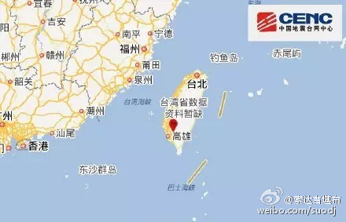
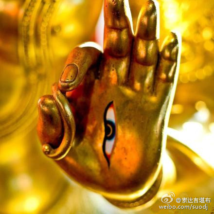
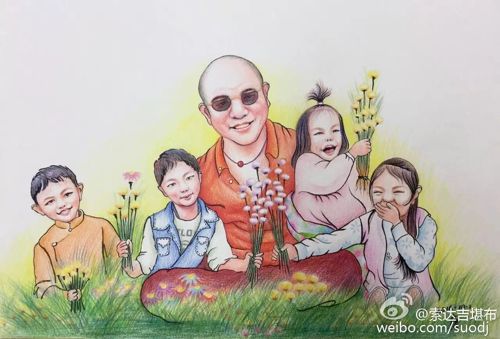

 ## 2016-01-06 11:31
独自闭关、翻译的生活，从今天开始~

 ## 2016-01-07 22:15
即使被全世界赞叹，也不应该欣喜，或许赞叹会带来不利；即使被全世界诋毁，也不应该沮丧，或许诋毁会带来好处。

 ## 2016-01-08 13:20
门措上师是当今公认的女性大德。藏历木羊年十二月初二（公历2016年1月11日），是门措上师的生日，希望大家在这一天尽量放生吃素，多行持善法。L门措空行母——色达喇荣五明佛学院院长

 ## 2016-01-09 20:08
“我们科学家去了解佛教修行，佛教的修行者也要开始了解科学。”O【独家专访】中科院院士朱清时：我没有盲从佛...

 ## 2016-01-10 10:51
现在很多人学佛比较表面，仅仅是依止一位上师，参加两三天法会，听几次佛教开示，办个精美的皈依证……这都无法动摇自己根深蒂固的习气，用不了多久，那些善念就会随环境改变而淡化、消失。若能对佛法典籍长期熏习，信心会更加坚固，智慧更加深入，慈悲更加广泛，一切修行才会水到渠成。

 ## 2016-01-11 07:29
我们做人做事，既要柔和，也要坚强；既要随顺他人，也要有自己的主见。不过，这中间的分寸很难拿捏，如果没有智慧，该柔和的时候坚强，该随顺的时候固执，这也是一种麻烦。

 ## 2016-01-12 07:20
电脑不如人脑，人脑不如人心。常观自心，会看到更多精彩的节目哦

 ## 2016-01-14 12:33
古人说：“天之道，利而不害；圣人之道，为而不争。”所以，做人一定要尽量利他，同时不要与人竞争。不争与利他，在我们人生中真的很重要。

 ## 2016-01-18 08:52
很多人都希望，工作、家庭、修心之间可以找到一种平衡。但平衡不能只是一个中心思想，也要体现在各种细节中。若能善巧应对同事的嫉妒、上司的刁难、家人的过度关心，每次遇到事情，尽量从对方的角度思考，你才能接近你想要的。不然，平衡只是一句空话。

 ## 2016-01-20 11:30
很多人的心不稳定，不管做世间、出世间的事，都像蜻蜓点水，缺少一种长期的耐心。其实，做任何事都不可能顺顺利利，如果你得不到利益就不断换，舍弃之前的积累，一切又从零开始，最后很可能一事无成。所以，除非你走投无路了，否则，一旦是自己选中的事，最好不要半途而废，只有坚持才能接近成功。

 ## 2016-01-23 10:58
要想征服自己的妄念，不能靠打压念头，而要靠认识念头。当我们认识到心念在生起的一刹那，当下即灭，各种执著会自动瓦解，各种不忿会烟消云散。这是消除痛苦最强大的武器。

 ## 2016-01-25 22:11
看到夜深人静的星空，会让人身心清净，妄念当下寂灭；看到水中倒映的月影，会让人认清虚幻，不为物欲所累。

 ## 2016-01-27 12:33
回忆过去有意义，关心未来也重要，活在当下更美好、幸福。

 ## 2016-01-27 21:24
最快乐的生活，是远离烦躁的尘埃，在智慧的书海里游泳。

 ## 2016-01-30 06:05
不管是学佛还是学知识，放假期间都不能把它丢在一边，否则，过段时间再捡起来会有点麻烦。我们不要把学习当成包袱，如果深入了解会发现，它是人生最大的享受。

 ## 2016-01-31 08:56
最高的境界是什么？L索达吉堪布：度母温暖世界 ¡查看图片

 ## 2016-02-01 10:53
强烈的爱与强烈的恨，在世人眼里，前者应当拥有，后者应当舍弃。而在佛教眼里，这二者并没有什么不同，都是一模一样的执著，都会给自己带来巨大的苦，所以都需要避开。

 ## 2016-02-05 19:00
做好事容易，做好人难；说好话容易，存好心难。但就算再难，也要努力地存好心、做好人，这就是修行。

 ## 2016-02-05 21:22
金猴年吉祥！L这才是真正的过年——索达吉堪布拜猴年 ¡查看图片

 ## 2016-02-06 08:26
台湾高雄发生地震了，嗡玛尼贝美吽ཨོཾམཎིཔདྨེཧཱུཾཧྲཱིཿ，嗡玛尼贝美吽ཨོཾམཎིཔདྨེཧཱུཾཧྲཱིཿ，嗡玛尼贝美吽ཨོཾམཎིཔདྨེཧཱུཾཧྲཱིཿ……

 ## 2016-02-07 08:25
新年来临，祈祷佛菩萨非常重要。
按照古大德的传统，若在今天念满九遍《心经》，并诵莲师心咒“嗡啊吽 班则格热班玛斯德吽”100遍以上，可护佑自己在新的一年里，远离宿怨、违缘、道障，增上顺利、平安、健康。若为亲人朋友祈福，也可依此行持。
祝福大家猴年快乐，吉祥如意！L索达吉堪布“莲师七句祈祷文”原声贺岁

 ## 2016-02-08 16:35
这是法王如意宝的原声祈祷文。一年的第一天若多听、多念，会带来无尽的吉祥。L“怀”念 怀业祈祷文 ¡查看图片

 ## 2016-02-08 18:38
过年了

 ## 2016-02-10 08:30
做什么事情都要掌握分寸。太松不行、太紧也不行，没有观察不行、观察太过分也不行，倘若过于极端，事情不会圆满成功。

 ## 2016-02-11 09:40
人活在世上，有钱有权虽会得到一些便利，但对大多数人而言，当钱越来越多、权越来越大时，对取舍也会越来越麻木，不经意就会下造各种业，毁坏自己的未来。

 ## 2016-02-12 08:05
什么是金刚乘？
佛教与其他宗教最大的区别是什么？
叙利亚难民问题，佛教怎样看待？
什么情况下你可以打骂另一个人？
一个佛教徒应如何面对嗔怒？
非佛教徒如何化解生命中遇到的嗔怒、争执或压力？
佛教有没有负面的部分？
佛法到底有多酷？
……
这是我对此的简单答复，或许，能给你带来一点启发。 

 ## 2016-02-14 06:48
人们很执著爱。世间的爱是，你爱我，我就爱你，你不爱我了，我就恨你；而出世间的爱是，你爱我，我也爱你，你不爱我了，我仍然爱你。但这对一般人来讲很难做到。

 ## 2016-02-16 20:33
“生活佛教”，会给我们每个人都带来快乐。

 ## 2016-02-18 15:06
佛教不但要广，也要深。

 ## 2016-02-19 09:36
经过这段时间白天晚上的努力，今年的翻译终于完成了。其实，学习一本书容易，但翻译一本书还是有点难，需要翻阅大量相关资料，保证很多词句、意义的准确性。从今天开始，我在一段时间内，要以另一种形式闭关，可能不能发微博了，特此请假，请大家谅解。

 ## 2016-03-14 07:55
这是修心的起点，也是终点。L索达吉堪布著名译作《大圆满前行》隆重上市
当当O网页链接；京东O网页链接；亚马逊O网页链接；文轩O大圆满前行 华智仁波切著 索达吉堪布译 释修...；博库O正版现货 大圆满前行：普贤上师言教 华智仁波... ¡查看图片

 ## 2016-03-21 16:03
有人认为，东方是“陆地农夫”文化，西方是“海洋渔夫”文化。当这两种文化开始交融时，我们要有什么样的心态呢？L法国巴黎演讲：东方智慧和西方生活（节录） ¡查看图片

 ## 2016-03-22 07:47
佛法所讲的一切，不是佛陀发明的，而是佛陀发现的。它不会因佛陀圆寂而减少，也不会因佛陀降生而增加。

 ## 2016-03-23 09:26
人们特别羡慕和追求的爱情、钱、官位，得不到时日思夜想，一旦得到了就会发现，它并不像预期那样给自己带来巨大的快乐，反而会平添许多烦恼，让自己动不动就患得患失。更让人伤心的是，不但拥有它的过程如此煎熬，而且到头来，什么都不会长久，一切都是一场梦。

 ## 2016-03-24 08:10
修行人在生老病死面前应该淡定。佛法中有很多内容，是训练我们如何面对生死。如果遇到这些就手忙脚乱，说明你的修行不深入。所以，不管面对自己的生死，还是亲友的生死，都应看作检验修行的一面镜子。

 ## 2016-03-27 07:56
我们在生活中，经常依靠一个偶然的机会，改变了命运。L意大利都灵公开演讲：生命中的偶遇（节录） ¡查看图片

 ## 2016-04-02 10:28
母亲给我打电话说，我们有四个多月没见面了。

 ## 2016-04-03 09:36
嗡玛尼贝美吽~L穿越迷雾森林 索达吉堪布超度日本“自杀圣地” O【清明】带你穿越一座迷雾森林——索达吉堪布超...

 ## 2016-04-04 07:42
清明节，也是感恩节。我们不但应追念已故去的先人，也应感念那些仍活着的恩人。

 ## 2016-04-05 08:35
现在的教育，是以自我为中心，让人精于自我成功、自我宣传，但有“我”一定是痛苦。佛陀的教育，是以无我为中心，让人认识到“我”只是虚假的概念，没有“我”，何来“我”的痛苦？

 ## 2016-04-07 07:16
一个人要胸怀宽大，但宽大不是狂妄；要心思细腻，但细腻不是琐碎；要品味清雅，但清雅不是单调。

 ## 2016-04-08 07:10
在佛教中，用空性可对治实有，但最后，空性也是空性的。就像洗衣服时，用洗衣粉可去掉污渍，但最后，洗衣粉也不能留。

 ## 2016-04-09 07:46
刚开始学佛不能太冲动

 ## 2016-04-10 10:03
我希望：当绚烂的阳光照耀大地时，我的智慧融入阳光，消除所有生命的无明黑暗；当清凉的月光遍撒大地时，我的悲心融入月光，遣除所有生命的烦恼酷热。

 ## 2016-04-11 17:55
做人要记住一个字：稳
做事要记住两个字：分寸
修行要记住三个字：菩提心

 ## 2016-04-14 16:18
你的心越大，有些事就越小。以前折磨你的，现在就烦不着你了。

 ## 2016-04-17 15:17
不管醒来或是梦中，本质都是一场虚幻。所以，做一个噩梦没什么关系，醒来后另一种梦就开始了 ；做一个好梦没什么意义，醒来后另一种梦又继续了。梦中忆梦，梦里说梦，何时才能彻底清醒？

 ## 2016-04-19 16:00
修行要建立在善良的基础上，若连基本的人格都没有，更高的境界无从谈起。就像没有良田不可能出生庄稼，人都做不好，甚深的修行根本谈不上。

 ## 2016-04-20 07:57
不管我们活多久，这都是新鲜的话题，永不过时。L荷兰鹿特丹公开演讲：慈悲与智慧 ¡查看图片

 ## 2016-04-22 12:38
我们因欲望而生烦恼，因欲望而生恐惧。若能从欲望中解脱，就会没有烦恼，也没有恐惧。

 ## 2016-04-24 10:57
每个孩子纯净的天空里，都有一个美丽的梦想。我们应该帮他们实现~
 > @索达吉藏文化
 > བྱིས་པ་རྣམས་རེ་རེ་བཞིན་དངས་གཙང་གི་སེམས་མཁའ་ན་མཛེས་སྡུག་གི་རྨི་ལམ་རེ་ཡོད་ལ།དེ་མངོན་དུ་འགྱུར་ཆེད་ང་ཚོས་བརྩོན་པར་བྱ།
Oསྒྲོལ་མའི་གསོལ་འདེབས། ཏྲེ་ཧོར་ལྷ་མོ་སྒྲོལ་...

 ## 2016-04-26 09:55
人心要虚，不然很难容纳别人的意见；人心要实，不然很难抵挡外在的诱惑。人心要硬，不然很难扛住人生的风雨；人心要软，不然很难生起真正的悲心。

 ## 2016-04-28 07:58
人在气头上，往往控制不住情绪，所做的事、所说的话，事后非常后悔。所以，我想给大家一个方法：如果你特别想吵架，不管跟谁，能不能先缓缓，让自己明天再吵？若能把“今天吵”改签成“明天吵”，有些事也许就不一样了。

 ## 2016-04-29 22:02
万般皆下品，惟有读书高。

 ## 2016-05-02 09:06
听法功德，于一切功德，最胜最上。 ——《正法念处经》

 ## 2016-05-04 09:16
不少人认为，所有的幸福建立在金钱上，只要有钱，快乐就没有任何问题。是这样吗？L奥地利维也纳公开演讲：什么是最大的财富 ¡查看图片

 ## 2016-05-06 10:57
今天看到一池莲花，很美，献给你，让你开心笑一下

 ## 2016-05-07 12:18
说话是个技术活儿，平时跟别人交流，要懂得“点到为止”。自己在乎的事情，不管是好是坏，都不能喋喋不休一直讲，丝毫不在乎对方感受。说话能否让人舒服，是对情商的一个考验。

 ## 2016-05-08 09:40
美国历史上第一次以总统名义给全球佛教徒发的佛诞节问候

 ## 2016-05-10 07:42
南无本师释迦牟尼佛
南无善名称吉祥王如来
南无宝月智严光音自在王如来
南无金色宝光妙行成就如来
南无无忧最胜吉祥如来
南无法海雷音如来
南无法海胜慧游戏神通如来
南无药师琉璃光如来 

 ## 2016-05-11 15:00
十年。L【索达吉堪布】时代微纪录 十年回家路

 ## 2016-05-13 07:26
5月14日至21日（藏历四月初八~十五），喇荣五明佛学院将举办为期8天的金刚萨埵法会。
念修金刚萨埵心咒“嗡班杂萨多吽”，是忏悔业障最有力、最灵验的法门。若能念诵40万遍，即便是最难忏悔的罪业，也能得以清净。任何人想参与都可以，即使8天内无法念完，尽快完成即可。
发愿念诵的数量，可于5月19日前上报此网页，法会结束前僧众会做集体回向。O网页链接
此次法会有直播，有条件的话，可通过网络参与共修。直播地址如下：

 ## 2016-05-15 10:21
现在很多人看了一些影视剧，就开始学着里面人物的样子，察言观色。结果变得非常多疑、敏感。其实，透视一些细节窥测人心，虽然有道理，但也不是完全准确，弄不好的话，很容易把一个大象尾巴当成整头大象。所以，我们最好不要总盯着别人的一些细节，否则，这种不正常的习惯会让别人痛苦，自己也痛苦。

 ## 2016-05-20 01:05
明天（5月21号）是“金刚萨埵法会”最后一天，佛学院全体僧众将共诵《药师七佛经》，网上也会同步直播，欢迎大家参与共修。

 ## 2016-05-21 06:48
第一座 07：00 - 09：00， 第二座 10：00 - 12：00， 第三座 14：00 - 16：00， 第四座 17：00 - 19：00（大回向）
 > @索达吉堪布
 > 明天（5月21号）是“金刚萨埵法会”最后一天，佛学院全体僧众将共诵《药师七佛经》，网上也会同步直播，欢迎大家参与共修。

 ## 2016-05-23 14:18
在我们眼里的一些天大的事情，如果换一个角度，或者换一个人来看，也许微不足道，甚至根本不存在。所以，痛苦并非实有，只不过是执著产生的。

 ## 2016-05-25 08:52
真正的学佛，应该是利益众生，而不是变得神神叨叨；应该让自己成为周围环境中最好的那个人，而不是最奇怪的那个人。

 ## 2016-05-27 08:26
修安忍必须依靠众生，没有众生的损害，对谁生起安忍之心？所以，如果有人伤害你，这是修安忍的最好机会，不能以牙还牙。

 ## 2016-05-28 08:35
胜爱论师在《百论》中说，有些人的性格，就像秤杆，因为一点点重量，就忽高忽低。这样的人，自己不幸福，周围的人也反感。所以，我们要善于控制自己的情绪，不要因为一些微不足道的小事，就让生活大起大落。

 ## 2016-05-28 20:27
现在的喇荣，心中的净土。

 ## 2016-05-30 10:20
若能长期修禅，心性就会寂静，即使发生再大的事，也不会觉得天塌地陷，更何况是区区小事了。

 ## 2016-05-31 07:10
如影随形~
 > @国际佛学网
 > O网页链接师父说：“我从来没离弃过你……”徒弟疑惑地说：“可在我最生不如死的日子里，梦里明明只有我自己的一排脚印啊。”师父说：“在你生不如死、最软弱的日子里，的确只有一排脚印。那一排脚印不是你的，是我的。在那些日子里，是我把你背在我背上，扛着你走那段最难走的路的……”

 ## 2016-06-01 07:17
在我的人生中，第一次过儿童节是16岁。因为上学晚，我这个已算不上儿童的儿童，混迹于一群真正的儿童中，在学校得到了一份让人兴奋的礼物：一碗酸奶、两颗糖。到了晚上，我跟同学们围着篝火跳着舞。当时没什么化妆品，我就用炭在脸上随便一画，登台给大家献歌，“我们是同一学校，丫丫几所……”如今，这一份记忆依然崭新。不知你的儿童节过得如何？祝每一个曾经的儿童和现在的儿童吉祥快乐！

 ## 2016-06-02 08:42
清风明月，山川河流，日月星辰，都是免费的。人生不需要太多，身心自在，足矣。

 ## 2016-06-05 14:44
我的大恩母亲仁措，今早8时离开了这个世界。请有缘者为她念百遍以上观音心咒＂嗡嘛呢贝美吽＂或放点生🙏

 ## 2016-06-06 08:00
今天我开始传讲“经中之王”——《妙法莲华经》。希望大家有条件的话，尽量听受圆满。即使条件不具足，哪怕听一节课也可以，因为这部经功德极大，对你的利益不可思议。

 ## 2016-06-09 07:52
每个人都在追求完美，却不知在获得完美的这条路上，有无数的荆棘、野兽。如果你对此没有心理准备，不考虑如何面对“苦”，只想着如何享受“乐”，那你最终得到的，一定不是你想要的。

 ## 2016-06-10 07:52
人必须要有自己的立场，凡事不能人云亦云。即使全世界的人都赞叹，我们也应保持冷静；即使人人都提出非议，我们也不要沮丧。

 ## 2016-06-11 16:01
天葬，嗡嘛呢贝美吽~

 ## 2016-06-14 07:31
因为爱，所以用最好的方式去爱。L此生无憾 索达吉堪布最后一次听阿妈说

 ## 2016-06-19 07:59
为人处世，不可为“我”斤斤计较，有时放下“我”反而能解决问题。

 ## 2016-06-25 08:07
生活中的很多纠纷，都因为只站在“我”的角度去看问题。若能换位成“你”的角度，甚至更高一点——超越“你”“我”的范畴，换成“道”的角度，一切都会豁然开朗，万里无云。

 ## 2016-07-07 13:04
今天的喇荣

 ## 2016-07-08 13:08
非常随喜汉地各位大德的护教之心！ 这次法华版本之辩，无意引起诸多争论，如果大家对我有很多意见，在此真诚地忏悔。既然大家对根据藏文版调整的《法华经》有争议，我可以一字不动，按照鸠摩罗什的原版传讲，之前的版本不再流通。
弘扬八宗，本无轻毁汉传各派之心。我本人学修宁玛派，但也曾传讲格鲁、噶举、萨迦、觉囊等诸派教典，从未敢认为对方教中无人，唯我一人能讲法 。汉传弘扬藏传，藏传弘扬汉传，本属正常，但如果汉地诸大德认为我弘扬八宗不妥，我也可以退出。
网上信息真真假假，希望大众身心清净，把宝贵的人身用来闻思修行、弘法利生，不要在我这个微不足道的人身上浪费时间。
索达吉顶礼
2016.7.8
 ## 2016-07-09 15:36
过去的你，已经消失了；未来的你，还没有出现；现在的你，刹那都在变化。真正的你，到底在哪里？

 ## 2016-07-16 07:08
英国作家萨克雷说：“生活就是一面镜子，你笑，它也笑；你哭，它也哭。”

 ## 2016-07-21 07:51
广阔的天空中，乌云不会停留太久，它来自于天空，也消失于天空。同样，一切烦恼也并非实有，它来自于法界，也消失于法界。之所以能带来痛苦，是因为你把它当真了。

 ## 2016-07-21 12:33
在新加坡大众佛学会，看到了20多年前我随上师如意宝一起来新加坡的照片。岁月~

 ## 2016-07-24 07:43
又回到自己的小木屋

 ## 2016-07-26 08:20
一切的痛苦，来自希望和担忧。这两者又来自我们的心。心的本体到底是什么呢？

 ## 2016-08-01 21:28
当我们在新闻里看到一个人的痛苦遭遇，或仅从别人口中听到时，只感慨几句“他太可怜了”，这是远远不够的。我们应该把自己想象成那个人，试着去体会他所经历的一切绝望与恐惧，哪怕你的想象力有限。通过这样再三的练习，我们这颗冰冻的心才会开始融化，解放出它本有的爱与慈悲。

 ## 2016-08-03 23:25
8月3日-10日佛学院在举办“地藏法会”。若虔敬祈祷地藏菩萨，念诵“南无地藏菩萨”或地藏心咒，有助于增长财富、寿命、福报、智慧等，容易实现一切所愿。
其中8月6日（藏历六月初四）是释迦牟尼佛初次传法的纪念日，行善功德不可思议。望大家尽量用最适合自己的方式，如放生、茹素、念经、持咒等，积累善法功德，并请不要伤害任何一个众生。

法会同步转播：                                
1、 新浪show：                                 
智悲讲堂一（房间号：491755）                                   
智悲讲堂九（房间号：491337）              
2、 YY：                                        
智悲讲堂一（频道号：10935063）

 ## 2016-08-05 14:54
人一忙起来，值得欢喜和痛苦的事都忘了，什么病痛和烦恼都没了，这是一种境界吗？

 ## 2016-08-08 07:53
戒律是保护自己的最好工具。没有它的话，你今天太自由了，明天可能就不自由。而今天暂时不自由，明天也许会很自由。

 ## 2016-08-13 00:01
我不曾远离那些信仰我、甚至不信仰我的人，
虽然他们没有看到我，但我的这些孩子们，将永远受到我慈悲心的保护！
——莲花生大士在一千多年前许下的誓言
O网页链接

 ## 2016-08-16 09:30
快乐与痛苦，是永远都分不开的伴侣。如果你追求快乐，痛苦必定买一送一，免费赠送。只有懂得随缘，断除了“一定要快乐”的念头，这才是远离痛苦的开始。

 ## 2016-08-18 07:19
见到了好久不见的妈妈，她用温暖的手摸着我的脸，亲切地跟我说着话……就这样醒了，原来是一场梦。妈妈，很想在现实中再见您一面，我还有好多话没有说。嗡玛尼贝美吽~

 ## 2016-08-23 08:09
时时不忘祈祷上师，喇嘛钦

 ## 2016-08-26 16:07
有智慧的人，不但知道自己要什么，更知道自己不要什么。越是懂得哪些是不需要的，让自己不受诱惑干扰，才越有把握找到真正想要的东西。

 ## 2016-08-28 17:46
秋天 . 今天……

 ## 2016-08-31 17:24
明天（9月1日，藏历六月三十）有日食，北京时间为14：13-20：00。《时轮金刚》中说，出现日食或月食时，无论作何善行，功德均增长成千上万倍。望大家把握机会多行善法，如供灯、放生、念经、闻法、修行等，为利益众生而积累资粮。

 ## 2016-09-04 18:35
人生有成功，就会有失败。人们追求向往的成功，往往是磨难、挫折的组合体，只不过很多人看不到罢了。

 ## 2016-09-06 08:15
人，可以沦为至恶，也可以成为至善。怎么选择，决定权在你。当然，不管你以前选了什么，只要想改变，一切还来得及。

 ## 2016-09-08 08:11
据佛典记载，药王星每年会出现7天，此时依靠它放光和药师佛的加持，江河湖海等一切水源皆具药性，若用来沐浴，对遣除疾病、身心健康有极大利益。藏地大德历来对此比较提倡。
今年9月8日～9月14日，正值药王星当空，望大家勤洗澡、多淋雨，观想药随水流下来，病障、业障顺着全身毛孔排出去。同时，多念“南无药师琉璃光如来”或药师心咒。

 ## 2016-09-10 08:25
在家庭的乐园里，父母是第一任老师；在学校的乐园里，师长是我们的老师；在社会的乐园里，智者是我们的老师；在心灵的乐园里，上师是我们的老师。
感恩您们一路上的指点、开导，教师节快乐！O网页链接

 ## 2016-09-15 07:22
你我虽然相隔千里，今夜一抬头，却可看到同一个月亮。当你看到它时，希望可以看见我的祝福——愿你的智慧、慈悲、福德、安乐，如上弦月般日渐增上，终似今晚月亮一样圆满。仲秋节快乐！

 ## 2016-09-17 07:56
两个人在一起时，做什么事情功德很大？
一个讲法，一个听法。
《大法炬陀罗尼经》云：“若人常说法，若人常来听，如是二种人，咸得无量福。”

 ## 2016-09-21 19:07
今天是法王如意宝撰写《胜利道歌》20周年的纪念日。

 ## 2016-09-29 15:51
现在很多人有点脆弱，被在乎的人冤枉一下、质疑一句，就认为对方不信任自己。其实别人是否信任你，哪有这么容易判断？通过一句话就知道别人心的，是电视里的场景。何况人心随时在变，他都不一定信任自己，今天想的明天就后悔了，又怎么可能完全相信别人。所以，不要因为一句话就上纲上线，有玻璃心的人会很痛苦。

 ## 2016-09-30 09:48
击中要害的批评，是最殊胜的教言。指摘弟子过失的师父，是最好的上师。
——阿底峡尊者

 ## 2016-10-01 10:49
开

 ## 2016-10-15 07:26
要辨别一个人，不能单凭他的语言。不要因为他很会说，就认可他的一切；因为他不会说话，就不采纳他的意见。愚笨者讲的话，偶尔也是对的；聪明人讲的话，有时也是错的。孔子也说：“不以言举人，不以言废人。”

 ## 2016-10-19 16:13
通过佛陀的方法调节内心，最终不是要把我们变成一个无情无欲、不哭不笑、什么念头都没有的木头怪人，而是让我们看清每个念头的的本质，从此不再受控于它，甚至还可以跟它一起游戏。

 ## 2016-10-21 08:41
没有一个敌人在折磨你，真正折磨你的，是你自己。准确说，是你的念头。

 ## 2016-10-24 08:07
10月15日，多芒寺的阳塘活佛示现圆寂。他是这个时代非常难得的修行人、大成就者，寺院正在举行49天的祈祷法会，祈愿他早日乘愿再来。望大家也多念《普贤行愿品》，行持放生、供灯等相关善法，与之结上殊胜因缘。

 ## 2016-10-30 08:55
一次难忘的“采访”

 ## 2016-10-31 07:01
冰毯在身上烤干了

 ## 2016-11-01 05:01
一只生死未卜的猫

 ## 2016-11-01 08:28
从今天开始，色达喇荣五明佛学院的全体僧众，进行为期一个月的闭关。去年闭关修的是三根本中的上师，今年开始修本尊，随喜功德。

 ## 2016-11-02 09:33
今天翻译了法王如意宝的一段教言，供养大家：

乐时一起笑、苦时一起哭的兄弟姐妹，请不要伤心，我们不管怎么样都很快乐。要想到誓言的金线把我们连在一起，情意把我们如水乳般融在一起，无论感受怎样的苦乐，以业缘相会的师徒永不分离。将文殊菩萨的密语记在心里，一处又一处地观赏轮回的幻化城市，这是多么幸福啊！
土兔年藏历元月一日，以某因缘触动，阿旺罗珠宗美（晋美彭措）即兴而唱。愿吉祥。

索达吉 译于2016年11月2日

 ## 2016-11-03 21:05
今天我们拜见了门措上师，聊了许多事情，很开心

 ## 2016-11-04 20:44
有了坚定的心，不会半途而废，逐渐会有好的结果；有了宽容的心，不会斤斤计较，恒常给自他带来快乐；有了精进的心，不会一曝十寒，做事长期会保持激情。我很欣赏这三种特质，但凡这世上成功的人，应该都离不开它。

 ## 2016-11-06 15:59
读取命运的U盘

 ## 2016-11-09 11:08
有人对米拉日巴尊者说：“您一生闭关，能忍这么多的苦行，真不容易啊！”尊者回答：“你们更能忍啊。我只是忍这一生，你们却能忍受生生世世。”

 ## 2016-11-13 21:54
来也匆匆去也忙 再见松花江

 ## 2016-11-14 22:29
马克思到底怎么说？

 ## 2016-11-15 07:52
身体的美，若不与聪明才智相结合，是某种动物性的东西。——古希腊哲学家德谟克利特

 ## 2016-11-16 20:14
每个人心里潜伏着无穷的力量，只要自己不颓废绝望，不断酝酿内在的智慧、善良、慈悲，今生就没有到不了的目标，迟早会成为心灵上的“土豪”。

 ## 2016-11-17 09:16
修行需要花大量的时间和精力沉淀。如果没有长期闻思的底子，一时热情起得很快，落得更快，遇到一点逆境，什么境界都会一扫而光。

 ## 2016-11-19 09:45
剧毒的珍宝药丸

 ## 2016-11-19 11:25
法王在《教诲甘露明点》里讲过，人格贤善有七个方面：心地善良、无狡诈、性格好、有远见、稳重、包容、智慧。

 ## 2016-11-20 09:38
今天是“天降日”，希望大家念108遍释迦牟尼佛心咒：嗡 牟尼牟尼 嘛哈牟尼耶 索哈。

 ## 2016-11-21 06:12
发过菩提心的人，至少应无条件承担弘法利生的一两件事。一般人为了自己的蝇头小利，尚且能披星戴月辛劳忙碌，利益众生的大事就更值得付出了。倘若以各种借口从发心中退下来，或者从来也不愿发心，这种人除了在懈怠无聊中度日，闻思修上也没有发现更大的进步。

 ## 2016-11-23 07:05
这是一面镜子，希望我们每个人都照一照——

有一次，苏格拉底趟水过河，脚一滑，落水了。他拼命地挣扎，大喊救命。不远处有个钓鱼者，不仅不帮助苏格拉底，反而转身就走。最后是他的学生救了他。
后来，那个钓鱼者趟水过河，也落水了，他拼命地挣扎，大喊救命。苏格拉底和他的学生正巧在河边散步，便用竹竿把他救了上来。
当学生知道救上来的人就是上次那个钓鱼者时，非常后悔，苏格拉底却说：“不，应该救他。这正是我们和他的区别。”

 ## 2016-11-24 21:14
很多人认为，幸福生活不能有任何负面的东西。但实际上，万事万物是由正反两方面所组成，苦与乐、成与败都是幸福生活的一部分，如果追求一个，却排斥另一个，就如同只要白天、不要黑夜一样，这样的幸福根本不存在。因此，我们要学会接受生活的全部。

 ## 2016-11-27 09:32
忙中偷闲，与书对话~

 ## 2016-11-28 05:05
用显微镜对准自己的过失，用放大镜对准别人的功德，别常常对错哦

 ## 2016-11-29 05:12
十年前见到本焕老和尚，那是我们第一次见面，也是最后一次。老和尚一句“弘法是我们的家务事”，多年来言犹在耳，一直回荡在我心里。O网页链接
 ## 2016-12-01 19:57
这是一本很有意思的小书。你平时想不通的问题，也许在这里就有现成答案，让你在思考事情时多个角度。推荐大家看一看。

 ## 2016-12-02 07:14
让我们一起共同承诺，终生学习，终生修行，终生利他。乃至生生世世。

 ## 2016-12-03 10:06
假如释尊还在人间

 ## 2016-12-04 08:55
给后代留下精神财富，是最佳的选择。

 ## 2016-12-05 16:47
今天对照藏文的《教王经》，看了一遍其汉文版本的《如来示教胜军王经》，自己有三个体会：1、不管是什么身份的领导，都要如法行持，不能做非法；2、一切都是无常的；3、死时什么也带不走。强烈推荐每个人看一遍，并结合自身潜心体会。

 ## 2016-12-06 09:15
近来翻译了一部佛经，法王如意宝当年极为推崇，望大家依此修行。

 ## 2016-12-08 08:42
与九零后的互动O最新视频抢鲜看！索达吉堪布仁波切 VS 九零后...

 ## 2016-12-09 18:46
2016年“智悲百日大放生”，今天圆满了！这次放生，大家按照科学化、合理化、小型化、规范化、清净化的原则，做得很如法，我很欢喜，非常随喜大家的功德。届时，放生总数将会请僧众进行回向，祝愿世界和平、众生安乐。

 ## 2016-12-10 10:04
如果选择君子之道，纵然命运多舛，这种遭遇也不会长久；如果选择小人之行，即使一直走大运，这种福报也不会延续。自然规律即是如此，古人也说：“君子不长衰，小人无久运，道之故也。”

 ## 2016-12-12 07:39
我们跟不同的人说同样的话，可能有人很反感，有人却说有内涵。可见，每个人的心是不一样的。如果你凡事只以自己的标准为标准，对自己不喜欢、不熟悉的东西一概贬低，那生存空间会越来越窄。所以，面对“不同”，即使你无法理解，但也应学会融入。

 ## 2016-12-13 13:32
上师，您在我身边时，我的眼一直系在您色身的微笑上；您不在我身边时，我的心一直系在您法身的微妙上。您从来没有离开过我，不离~

 ## 2016-12-16 06:12
昨天我回到藏地，因为时间关系，连夜听了《大方广善巧方便经》等几部经的传承。《大方广善巧方便经》所讲的是利根者的境界，一般人很难通达，对密宗行为难以接受的人，值得研究和学习一下。

 ## 2016-12-16 06:16
轮回中的孩子，跟他一起，用他喜欢的玩具来玩，他一定会很开心。但长期这样，并没有这么多时间。为了大家早日成熟，还是需要深入修学。

 ## 2016-12-19 09:40
太执著自己，会产生痛苦；太执著于自己的方式，也会产生痛苦。

 ## 2016-12-20 07:59
免费送你金子啦~

 ## 2016-12-21 15:03
跟上师德巴堪布在一起的生活，多么美好！想念上师！

 ## 2016-12-25 11:50
铃儿响叮当，福报一大筐。

 ## 2016-12-29 16:15
与香港卫视的一次相遇：我们的时代O网页链接

 ## 2016-12-30 13:58
认清万法的本质是空性，现象是虚幻，就会对世间一切快乐不起羡慕，一切痛苦不受折磨。

 ## 2016-12-31 16:27
近十年来，我去过国内、国外很多学校。从2017年起，打算每周六公布一期大学演讲。
我走过的路，你也可以走走试试。

第1集：台北大学

《生命科学与价值观》

1、演讲：
视频：O网页链接
文字：O网页链接

2、现场互动：
视频：O网页链接
文字：O网页链接 

