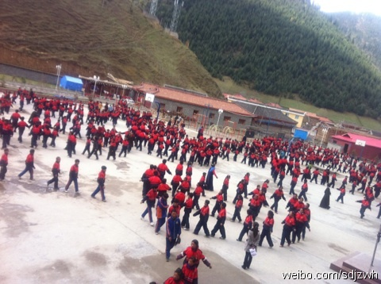
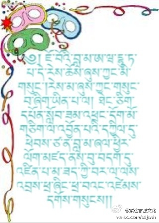

 ## 2011-04-14 08:13
在如今这个信息时代，藏族知识分子依靠自己的母语做有意义的事情，是非常重要的。去年4月14日，玉树的很多藏族同胞不幸遇难，让我们一起为他们念诵观音心咒“嗡玛尼八美吽”吧！同时，为了纪念这个特别的日子，也为了更多的人了解藏文化，我的藏文化微博正式开通。

 ## 2011-04-15 10:37
据懂行的人介绍，如果在电脑中安装了喜马拉雅和孟兰字体，就可以显出藏文网页，而不用把藏文做成图片上网，我也想尝试一下直接用电脑打藏文上网。如果想看我的藏文网页，具体操作方法，是把字体安装在C盘的WINDOW文件夹的FONT文件夹中。字体下载链接 O网页链接
 ## 2011-04-15 16:16
༄།ས་སྐྱ་པཎ་ཆེན་གྱིས།  རང་ལ་དགོས་པའི་བསྟན་བཅོས་རྣམས།  ཉི་མ་རེ་རེར་ཚིག་རེ་ཟུངས། གྲོག་མཁར་དར་ནི་སྦྲང་རྩི་ལྟར། རིང་པོར་མི་ཐོགས་མཁས་པརའགྱུར།།

 ## 2011-04-15 16:18
ཞེས་པ་འདི་དེང་གི་པོད་ཕྲན་རིག་པར་ཆེས་ མཐུན་པས་བརྩོན་དགོས་པར་སྣང་།
 ## 2011-04-15 16:18
萨迦班智达告诉我们：自己需要的文献警句，应该每天记住一句。就像辛勤采蜜的蜜蜂与积筑穴巢的蚂蚁，经过点点滴滴的积累，天长日久之后，自然而然会变成大智者。我想，这句话对微博盛行时代的人们来说，是十分相宜的。我们应该为此而努力。
 ## 2011-04-16 07:43
༄ ། མི་རིགས་གང་ཡིན་ཡང་སྐད་དང་ཡི་གེ་ནི་དེའི་བླ་སྲོག་ཡིན། 无论对任何民族来说，语言文字都是它的生命!
 ## 2011-04-17 16:24
假如不能找到内心的安乐，则无论外在的物质财富如何丰盛，也无法满足无限增长的欲望，因此，唯有知足少欲才是幸福生活的源泉。

 ## 2011-04-18 08:09
༄། བྱ་བ་གང་བསྒྲུབ་ཀྱང་དམ་བཅའ་བརྟན་པ་དང་སྙིང་སྟོབས་ཆེ་བ་དང་ཐབས་ལ་མཁས་པ་གསུམ་དེ་ངེས་པར་དགོས། 无论做任何事情，都应具备誓言稳固、意志坚定与随和善巧三个条件。
 ## 2011-04-19 09:41
༄། བསམ་པ་བཟང་ཞིང་བློ་ཁོག་་ཡངས་བ་གཞན་ལ་བསྟུན་ཤེས་མཁན་ལ་མི་བཟང་བ་ཟེར་ཆོག ། 心地善良、心胸宽广与随顺他众，即所谓贤善之人格。
 ## 2011-04-19 09:56
贤善之人的标准

 ## 2011-04-20 07:59
༄། མི་རིགས་གང་ཡིན་ཡང་ནང་བསམ་བློ་དང་ཕྱིའི་དཔལ་འབྱོར་གཉིས་གའི་ཡར་ཐོན་ལ་འཕེལ་རྒྱས་ཟེར་ཆོག  ཕྱོགས་བསྡུས་རང་བཞིན་གྱི་འཕེལ་རྒྱས་མི་སེམས་པར་
 ## 2011-04-20 07:59
སྒོར་མོ་ཁོ་ན་བསྙེགས་པ་ནི་ཕྱོགས་མ་གོ་བ་ཡིན་ནོ།། 无论对任何民族而言，内心世界与外在物质的双重进步，才可称之为发展。如果不考虑综合性的发展，而一味追求钱财，就会迷失方向，前往歧途。
 ## 2011-04-21 08:04
༄། སྔོན་གངས་ཅན་ན་ཁ་མ་ཎི་ལག་འཁོར་ལོ་ཟེར་ཡང་ད་ལྟ་གཞོན་རབས་ཚོས་ཤེས་ཀྱིན་མེད་པས་ཤིན་ཏུ་ཕངས་བ་ལ། 以前的雪域人都是口中念着玛尼，手里摇着转经轮。而现在的年轻人却不懂得这些了，这实在是太可惜了！

 ## 2011-04-22 08:16
龙树菩萨说过：“智者不会轻易地作出承诺，然而一旦承诺了，就会像在镌刻在石头上的花纹一样，至死也不会改变。”的确如此，只要将不变的誓言花纹铭记于心，则无论世出世间两方面的福德圆满，都会像夏日的潮水一样蒸蒸日上。

 ## 2011-04-23 08:16
对当代年轻人的劝诫：在祖辈们留下的文化宝库中，储藏着数之不尽的珍贵金箧，不争气的子孙们却不知珍惜、随意抛弃，土匪强盗们正虎视眈眈地准备将之毁弃！

 ## 2011-04-24 08:14
藏传佛教与藏族人的信心与慈悲，无疑是对世界人民的最佳献礼与利益。这一切，都来源于前辈译师与智者们的恩德，我们永远也不要忘记报恩。

 ## 2011-04-25 07:52
无条件地为众生暂时与究竟的利益而努力，就称为菩提心。它是漫长的人类历史中最伟大、最超越的思想。

 ## 2011-04-25 14:50
仓央嘉措情歌分享O网页链接
 ## 2011-04-26 08:13
༄།  བསམ་པ་བཟང་པོའི་ནང་ཡོན་ཏན་ཐམས་ཅད་འདུ་བས་རྒྱུན་དུ་བསམ་པ་བཟང་པོ་རེ་སྐྱེ་བའི་ཐབས་ལ་རྩེ་གཅིག་ཏུ་འབད་པར་བྱའོ། 心地善良，自然会聚集一切功德。为了内心一个个善念的生起，努力吧！
 ## 2011-04-26 10:56
法王如意宝朝拜鸡足山 O网页链接
 ## 2011-04-26 11:34
༄། དེང་སྐབས་ཀྱི་བླ་རུང་ནང་བསྟན་སློབ་གྲྭ་ཆེན་མོ། 现在的喇荣佛学院

 ## 2011-04-26 11:42
为了拍这两张照片，专门爬到了对面的山头，累得老头子我气喘吁吁！哈哈哈！

 ## 2011-04-27 07:37
如今，美丽的高原正日益受到现代化工厂乌烟废气的污染，人心也正受着各种污浊之风的侵袭，我们应对此提起高度的关注！

 ## 2011-04-28 07:42
外在的环保与心灵的环保，都是值得每个人关心并付诸实践的！

 ## 2011-04-29 11:30
分享歌曲O网页链接
 ## 2011-04-29 14:38
人总是这样，拥有的时候，不懂得珍惜；一旦失去，才明白丢失物的可贵。当我们对这片葱郁广袤的草原随意践踏的时候，可曾意识到：在将来，当我们需要付出千百倍的代价，去还原草原之一角的时候，我们会不会因今天的暴殄天物而后悔？！

 ## 2011-04-30 11:00
如今，大多数高原农牧民们内心世界的富裕程度还是比较令人欣慰的，但在外在物质的发展方面，很多人却一筹莫展了。我们应该在此方面加大力度，建立藏药厂、藏香厂等比较清净的产业，以促进两方面的共同进步。

 ## 2011-05-01 11:15
我们的文字，是无与伦比的，她是慈悲与智慧的体现，是由文殊菩萨的化身创制的。我们应该像爱护自己的生命一样地加以爱护，并厉力弘传，使其发扬光大。

 ## 2011-05-02 08:38
藏族的主流文化，是佛教。如果没有修学佛法，而将精力投入到其他方面，无异于舍根求叶。

 ## 2011-05-02 13:17
བླ་མ་ཨོ་རྒྱན་རིན་པོ་ཆེ་མཁྱེན་ནོ།分享图片

 ## 2011-05-03 14:31
我曾遇到过一个所谓的藏族知识分子。他告诉我说：“我藏文一窍不通，虽然是藏族人，但藏语也仅略知一二。”我除了苦笑着哼出一句“呵呵”以外，再也无言以对了。

 ## 2011-05-04 07:31
༄། རྗེ་བཙུན་འཕགས་མ་སྒྲོལ་མ་ཁྱེད་མཁྱེན། །འཇིགས་དང་སྡུག་བསྔལ་ཀུན་ལས་བསྐྱབ་ཏུ་གསོལ། 祈请至尊圣度母， 解救痛苦诸恐怖。

 ## 2011-05-04 09:27
这个女孩子名叫央金。她在玉树去年的地震中，被埋在地下三天三夜后获救。如今她和弟弟都在我们的智悲学校读书，她经常向大家提起那一段难忘的经历。

 ## 2011-05-04 09:27
与央金姐弟合影

 ## 2011-05-05 10:37
仓央嘉措说过：＂柳树爱着小鸟 ,小鸟迷恋柳树 ，若能心心相印，鹞鹰无隙可入 ＂也就是说，只要团结一心，一切难关都能不战而胜！

 ## 2011-05-05 14:36
小鸟与？树，应该不是柳树哈！

 ## 2011-05-06 07:51
我们藏传佛教的特色之一，是依靠正理的辩论，消除他众的无知与邪见，并使自己生起稳固不变的信念，这是其他宗派所没有的。

 ## 2011-05-06 07:58
佛学院的僧人们正在辩论

 ## 2011-05-07 08:11
在过去，只要有稍许条件的藏族信众，都会在佛像前不间断地点起长明灯。我们也永远不要忘记这一传统，尽力在三宝前供养、祈祷与顶礼！

 ## 2011-05-07 08:14
释迦佛唐卡前的酥油灯

 ## 2011-05-08 07:33
1847年，一个美国人因为不知道自己的田地里有金矿，便把它卖给了别人，自己最后在寻找金矿的过程中饿死了。同样的道理，如果藏族人不知珍惜，随意丢弃藏文化中的佛法与传统，而不务正业于其他行当，也是应该值得反思的问题。

 ## 2011-05-09 07:12
གངས་རིའི་དཔྱིད་དཔལ།雪峰的春光

 ## 2011-05-10 09:40
第五世达赖喇嘛的上师——宁玛派的德达浪巴尊者，曾一边摇动着铃鼓，一边吟唱着：“现声识乃本尊咒法身，身与智慧游舞广无边，深密瑜伽士之境现中，无别密意明点一本体。”之后安详示寂。

 ## 2011-05-10 10:48
看到青海达日县藏文中学校园内的吞米桑布扎塑像，欣喜之余，不禁想起他对我们的莫大恩德。

 ## 2011-05-10 10:53
我前天在达日县藏文中学校园内拍的吞米桑布扎塑像。

 ## 2011-05-11 13:25
若能经常念诵皈依偈一一＂皈依上师，皈依佛，皈依法，皈依僧＂，定能战胜一切违缘魔障，达成一切内心所愿。

 ## 2011-05-12 18:58
分享图片

 ## 2011-05-12 22:14
བླ་མ་ཡིད་བཞིན་ནོར་བུ། 上师如意宝

 ## 2011-05-12 22:20
在我没有见到法王如意宝之前，就看到了这张照片，当时立即生起了无以言表的信心与恭敬心，从此之后，我的人生之路发生了巨大的扭转。直到如今，自己内心仅存的稍许善念，都无不是他老人家的莫大恩情所致。上师知！

 ## 2011-05-13 10:24
虽然我们藏族人中的有些人会杀生，但就其社会总体而言，还是不忍杀害乃至蚊蚁以上小生灵的，具有强烈慈悲心的民族。这一点，也是为东西方众多智者啧啧称奇的特质。

 ## 2011-05-14 08:35
中国科技大学前校长，中国科学院院士朱清时曾说过一句掷地有声的话：“科学家千辛万苦爬到山顶时，佛学大师已经在此等候多时了！”我们应该反复思维、琢磨这句话中的内涵。 @Fotolr照片工坊

 ## 2011-05-15 09:04
དད་པ་ཅན།坚信的佛教徒

 ## 2011-05-16 23:58
༄། བསམ་པ་བཟང་ན་ས་དང་ལམ་ཡང་བཟང་།།བསམ་པ་ངན་ན་ས་དང་ལམ་ཡང་ངན།།心善前途光明，心恶前途黑暗。

 ## 2011-05-17 16:15
吞米桑布扎在创制藏文之后，踌躇满志地说道：“在这边鄙荒蛮的藏区，出现的第一位智者是我。我是遣除黑暗的明灯，除了像日月一般高高在上的国王您之外，在众友群臣当中，没有人可以与我比肩。雪域藏区的人们啊，吞米我对你们的恩德难道不是很大吗？”我们都应该时时想想这段真实语啊！

 ## 2011-05-17 16:15
吞米桑布扎画像

 ## 2011-05-17 16:26
༄།  ང་ཚོ་ལ་སྙིང་སྟོབས་དང་བརྩོན་འགྲུས་དགོས།我们都需要毅力和精进！

 ## 2011-05-18 08:47
印度智者圣雄甘地曾说过：“要活，就要像明天你就会死去一般活著；要学习，就要好像你会永远活著一般学习。”在没有意义的事情上，我们应该有无常观；在有意义的事情上，我们应该有持续的精进与勤奋，这一点十分重要。

 ## 2011-05-19 14:09
གཡག་ལྟོག་གིས་རྩྭ་ཟ་བ་བཞིན་སྒོམ་སྒྲུབ་བྱེད།像饥牛吃草一样修行！

 ## 2011-05-19 22:27
在今天这个吉日良辰，我的藏文网站正式启用了O网页链接！但愿以我微不足道的力量，能为藏文化的继承与弘扬，贡献一分绵薄之力~

 ## 2011-05-20 09:32
我们学校的校舞配曲，是仓央嘉措那首著名的情歌：“洁白的仙鹤啊，请把双翅借给我，不飞遥远的地方，转一转理塘就飞回。”孩子们唱得婉转悠扬，跳得翩然优美，不禁让人心花怒放。

 ## 2011-05-20 09:32
孩子们正在跳校舞

 ## 2011-05-21 07:38
佛经云：＂无论始终受到赞叹，还是毕生遭遇诋毁的人，都是前所未有，现在不存在，将来也不会出现的。＂所以，对世间微不足道的毁誉称讥，我们都不必挂怀，既不反感，也不渴求，应有不以物喜、不以己悲的胸怀，这才真正算得上是一个顶天立地的人。

 ## 2011-05-22 08:59
佛经云：“仅仅见此不空成就罥索像，也能清净多生累劫的恶业罪障，增上无量无边的福德，并于死后往生西方极乐世界。”我们一定要对此加以重视。当然，具有邪见，即使见到佛陀也不生信心的那种人，是无法实现上述结果的。

 ## 2011-05-22 09:00
不空成就罥索唐卡

 ## 2011-05-23 09:40
如今汉地与西方的无数知识分子，通过学习与研修藏传佛教，使自己的人生观发生了巨大的变化，并获得了无法言表的利益。作为藏族的在家知识分子，又怎能不在此方面加大力度呢？

 ## 2011-05-24 07:53
想学佛法的人，一定不要错过研学《普贤上师言教》这部论著的机会。当今世界上的很多人依靠此等书籍，使自己的人生变得充实而有意义，我们千万不要自绝善缘，而应刻苦攻读，力争早日领悟其义。

 ## 2011-05-24 08:25
青海民族出版社出版的《普贤上师言教》

 ## 2011-05-25 07:34
无论任何一个民族，都不能忘记具有特色的历史，不能抛弃具有荣耀的前程，不能改变具有利他的品行。

 ## 2011-05-26 14:43
如果人生观能建立在承认前世今生与业因果的基础之上，其价值观就不会是仅仅追求金钱与地位，世界观也会变得更加完美。

 ## 2011-05-27 11:00
以前的历史学家利巴班智达、达仓译师、果译师、布顿大师等尊者都异口同声地认为：藏地的人文文化和大陆板块都像印度一样历史悠久且渊源绵长，这一点是有着确凿的典籍记载并经得起逻辑推敲的，是谁也无法否认的历史！

 ## 2011-05-28 13:48
法王如意宝即将示现圆寂之际的临终遗言是：＂不要丢弃自己的本质，不要扰乱他众的心。＂这两句话中，包含了世间与出世间两方面的甚深道理，我们应该认真思维其义并付诸实践。

 ## 2011-05-28 14:19
顶礼三宝！

 ## 2011-05-29 08:48
吽 邬金由吉奴江参[邬坚刹土西北隅] 贝玛给沙东波拉[莲华梗茎胚蓬上] 牙参丘给屋珠涅[得证稀有胜悉地] 贝玛窘涅谢苏札[圣名尊称莲花生] 阔杜堪卓芒波果[空行眷属众围绕] 却记杰苏答珠记[我愿随尊而修成] 钦吉拉企谢苏唆[祈请降临赐加持] 咕噜贝玛悉地吽 若能经常如此念诵，定能生起一切加持与悉地！

 ## 2011-05-30 00:40
我家乡的神树一柏树

 ## 2011-05-30 07:45
尽管藏地有一句著名的谚语：“说话开头难，办事收尾难”但无论做任何有意义的事，我们都应该善始善终。

 ## 2011-05-31 08:31
社会发展的范围，不能理解得太狭隘，而应兼顾外在物质与内心世界两方面的共同发展；人们的幸福安乐，也不能仅仅盯着眼前的利益，而应考虑今生与来世两方面的安乐。

 ## 2011-06-01 08:29
今天是六一国际儿童节，我在此向所有的孩子们致以衷心的祝福，尤其是要向那些没有机会接受教育的孩子们表示一份深深的祝愿！

 ## 2011-06-01 08:32
སེམས་པ་སྤྲོ་བའི་བྱིས་པ་ཚོ།罗科玛欢天喜地准备过节的孩子们

 ## 2011-06-02 09:37
风霜雨雪中的柏神树啊，无论春夏秋冬、雨打风吹，您都坚强不屈地昂然屹立，始终保持着自己的苍翠本色；我们也要像您一样，无论在任何时候，都不抛弃自己的本质，时刻拥有一种生机勃勃的顽强毅力。

 ## 2011-06-02 09:39
ཁྱོད་ངོ་མ་དཔའ་བོ་རེད། 柏神树啊！您是真正的英雄！

 ## 2011-06-03 11:00
若想了知佛教的密意或要领，即是万万不可伤害众生。正如印度的圣天论师所云：“诸大佛陀都说过：所谓的佛法，归根结底，即是不伤害众生。”

 ## 2011-06-04 07:44
刚刚拍到的美景

 ## 2011-06-04 08:46
我们学校六年级的学生即将毕业离开母校，大家都依依不舍、悲痛万分。我便给他们说了以下四点：一、一切有为法都是无常变迁的，我们不必过于悲伤；二、父母和老师对我们有着深恩厚德，我们永远也不要忘记；三、如今的社会纷繁复杂，切不可掉以轻心；四、你们是藏族未来的希望，一定要树立坚定的意志。

 ## 2011-06-05 09:39
世上最深奥的生命观，是佛教《因缘品》中所说的：“所有众生都万分珍爱自己的生命，都害怕遭受杀戮的命运。我们应该将心比心、以己推他，既不能殴打他众，更不能杀害其他生灵。”任何有智之士，都应该为自他的前途着想。

 ## 2011-06-06 21:08
慈悲心是大乘佛教的根本。只要有了它，世上的一切安宁、快乐、平等、团结等等，都可以轻而易举地实现。我们一定要对此加以重视！

 ## 2011-06-07 10:25
我认为：如果能懂得里里外外的一切事物，都是无常的本性，则即使在生活中遇到一些鸡毛蒜皮的不顺，也不会痛苦不堪。所以，某些重要的关键性诀窍，我们非得掌握不可。

 ## 2011-06-08 11:02
慈善是心，若能日行一善，则像小小溪流也能汇成江河一样，点滴善行的集聚，也能对整个社会产生巨大的利益。希望大家能尽心尽力地投入到利他的伟大事业当中！

 ## 2011-06-09 12:51
从今天开始，喇荣五明佛学院将举办为期七天的金刚萨埵法会。佛经云：若能念诵十万或四十万遍金刚萨埵心咒，则失毁根本誓言的罪过也能得以清净。在这个殊胜的日子里，诚请大家能为清净自他一切众生的罪障而精勤、认真地念诵。

 ## 2011-06-09 18:17
དགེ་ཚུལ་སློབ་གྲྭའི་གྲ་ཆུང་ཚོས་སྔ་འདོན་བྱེད་བཞིན་པ།沙弥学院的小僧们在早读

 ## 2011-06-10 11:16
在我们这个世界上，有无以数计的人们，都在为今生或自己的利益而没日没夜地奔波、操劳着，根本没有考虑到今后的生生世世，以及其他众生的利益。这是多么愚蠢而可怕的事情啊！有些自诩为智者的人的确可怜之至！

 ## 2011-06-10 15:12
མ་བུའི་བརྩེ་གདུང་།母子之爱

 ## 2011-06-11 18:39
无论遇到任何对境，都应保持一颗善良的心。它就像纯金一般洁净。既可令今生一切如愿以偿，也可令来世越来越安乐。于世间与出世间，都具有不可估量的珍贵价值。是不可多得的、唯一的如意宝。

 ## 2011-06-13 06:59
བློ་ཆོས་སུ་འགྲོ་བར་ཤོག །ཆོས་ལམ་དུ་འགྲོ་བར་ཤོག།愿心入于法，法趣于道。

 ## 2011-06-13 18:53
当别人诽谤、诋毁自己或四处传播自己过失等等的时候，正是给了我们一个极好的修安忍的良机，我们一定要心存感激哦！

 ## 2011-06-14 23:50
世间的财富、地位与感情等等都是这样，当自己没有得到的时候，会欣羡不已、渴慕万分，一旦真正落入手中，又会感到不过如此而已，并不会有持续不断的快乐。但内心觉知的快乐，却并非如此。

 ## 2011-06-15 21:20
拥有 坚毅的强壮身体，创新的聪慧妙智，慈悲的灿烂微笑的高原民族，定能给世界人民洒下利乐的妙雨甘霖。何乐而不为呢?

 ## 2011-06-16 23:09
如果能通达心的本性，则异彩纷呈的世界都会显现无余，因此，内观是十分重要的。

 ## 2011-06-17 11:22
无论境遇是苦还是乐，都应该转为道用，并念诵以下偈颂回向：“遇乐回向诸善根，利乐周遍虚空界；遇苦代受一切苦，但愿苦海尽干涸。”

 ## 2011-06-18 09:21
在科学技术日益发达的时代，人们的欲望和琐事也越来越多。如果没有简单朴素、知足少欲的理念，轻松自在、逍遥安闲而度日的人也会寥若晨星，所以，我们有必要对此进行反思，并借鉴一些古人的生活态度与生活方式。

 ## 2011-06-19 15:41
夏天的清凉雨水啊，您洗净了我们身上的污垢，并使花草树木欣欣向荣；三乘的妙法甘露啊，您清除了我们心灵的垢染，并使善根之果实累累丰硕！

 ## 2011-06-20 10:46
阿底峡尊者的上师阿瓦德达巴的行事总是让人捉摸不定——有时向他请法，他不传；有时没有向他请法，他又主动传授。一次，师徒二人途径一座非常狭窄的小桥中部时，上师忽然回过头来对弟子说道：“弟子啊！在没有证达无我之前，一定要小心翼翼地取舍哪怕每一个细微的因果啊！”

 ## 2011-06-21 10:14
གཟའ་ཉི་མར་སློབ་མ་འགའ་འདྲུད་འཐེན་བསྡད་ནས་རང་ཁྱིམ་ལ་འགྲོ་བ།星期天，我们学校的一些孩子坐着拖拉机回家。

 ## 2011-06-21 10:17
མ་འོང་བའི་ཁམས་པའི་ཕོ་སར།未来的康巴汉子！.

 ## 2011-06-21 10:19
每当我们回顾自己的人生经历时，大多数人会发现，自己的生命，都耗费在造作恶业等毫无意义的琐事上面了。我们应该发誓：从现在开始，一定要把自己的精力花在对今生来世有利的修持正法方面，并为了实现这一宏愿，而再三祈祷上师三宝。

 ## 2011-06-22 09:25
如今城市里面的人，连找个停车的地方，都越来越困难了；而心胸开阔、舒适悠然的住山修行人，却又过着那么安闲轻松、无忧无虑、无牵无挂、无拘无束的生活啊！.

 ## 2011-06-23 08:23
如果没有信心，则不能趋入佛法；如果没有智慧，则不能懂得佛法；如果没有悲心，则不能以佛法利他。尤其是对大乘行人来说，这三者的结合就好比是三脚架，有着互相支撑、彼此依赖的关系，更是缺一不可。

 ## 2011-06-24 16:39
朝气蓬勃的青春，像夏天的鲜花一般稍纵即逝；遍布四海的美名，像空谷声一般虚无缥缈。任何时处都绝对有利的，唯有殊胜妙法。内心与法相融的人，是多么的令人羡慕啊！.

 ## 2011-06-25 14:41
就像我们人类的生命一样，所有众生的生命都值得珍爱且无比可贵。懂得尊重并珍惜一切生命的理念，是极其崇高而伟大的思想。不管谁有了这种思想，就是我们应该恭敬的对象。

 ## 2011-06-26 09:29
我们流下的大多数眼泪，只是为了自己；为了他众而洒下的热泪究竟有几滴，大家数一数，就心知肚明了。.

 ## 2011-06-27 10:46
犹如精通医术的良医，能将世间所有的草木都变成良药一样，智者无论遇到任何苦乐善恶，都能将其转化为提高心智的动力，与勤修佛法的善因。

 ## 2011-06-28 11:14
心乐一切乐，心悟一切悟！.

 ## 2011-06-29 14:02
有福报的人，会常遇善缘，平安快乐；没有福报的人，则与之恰恰相反。若考虑自身前途，则点点滴滴积累福报是十分重要的。

 ## 2011-06-30 12:20
今天是雪域智者之顶饰，全知麦彭仁波切的圆寂纪念日。希望大家于此殊胜之时，能各尽其力，在家里供灯、念修麦彭仁波切祈祷文或文殊菩萨心咒“嗡阿热巴匝纳德”。

 ## 2011-07-01 10:10
有人问：你们学院的校训是什么？我的回答是：清净戒律，闻思修行，利益他众。 .

 ## 2011-07-01 22:51
སློབ་མ་རྣམས་སུ་མ་ཅུ་པ་འདོན་བཞིན་པ།罗科玛的学生们正在背诵＜文法三十颂＞.

 ## 2011-07-02 08:14
良好的品德胜过了单纯的智慧，所以在幼年时代，就应该学习慈悲爱心、孝顺父母、尊敬师长等高尚如法的理念。特别是藏族少年儿童，更应熏习自己祖辈们流传下来的珍贵传家宝一一佛法。

 ## 2011-07-03 23:04
དབྱར་གྱི་མཛེས་སྡུག夏天的美丽.

 ## 2011-07-03 23:40
转发微博。
 > @索达吉藏文化
 > 我家乡的神树一柏树

 ## 2011-07-04 08:13
幸福的根本，是心；心的根本，是知足少欲；知足少欲的根本，是彻知物质之本质。

 ## 2011-07-05 22:16
ཆུ་བོ་རྙོགས་ན་ཉ་མོ་མི་མཐོང་།།སེམས་པ་བྲེལ་ན་བྱ་བ་མི་འགྲུབ།། 河水若浑浊，不能见鱼儿；内心若急躁，不能成大事！

 ## 2011-07-05 22:47
河水若浑浊，不能见鱼儿；内心若急躁，不能成大事！

 ## 2011-07-06 10:14
谁想见到究竟了义的佛，就应当通达诸法缘起之理。如经云：“何者见缘起性，彼则见诸法；何者见诸法，彼则见如来。”.

 ## 2011-07-07 17:45
如今个别人对佛法，尤其是对藏传佛教颇有微词。但若稍加分析即可得知，这些都是不懂佛教教义的无知之见。所以，无论是谁，先要把学习放在首位。

 ## 2011-07-08 20:52
སེམས་ཀྱི་རང་བཞིན་ནམ་མཁའ་འདྲ།心之本性如虚空.

 ## 2011-07-09 08:32
无论是谁，在临终之际，其它一切都只能舍弃，唯一能随己而行的，只有正法。

 ## 2011-07-09 14:18
这里的大多数藏族人不但不懂藏文，而且在别人去世的时候，还会造作杀生等恶业，我正在给他们讲解一些浅显的道理。.

 ## 2011-07-09 14:19
前文配图

 ## 2011-07-10 15:01
虽然在幸福时刻能忆念正法的人很多，但在痛苦之时也能忆念三宝的人，才算是好修行人。喇嘛亲！

 ## 2011-07-11 15:09
能主宰自心，则一切皆为快乐的显现；若不能掌控自心，则一切都是痛苦的根源。.

 ## 2011-07-12 11:01
多芒寺大伏藏师德钦朗巴曾在这个山洞内（位于丹巴境内）闭关禅修，进入甚深光明境界，前往红色吉祥铜山，在钨金莲花生大师座前得受精妙法要。返回人间后，依此经历写下了《莲师刹土游记》。

 ## 2011-07-12 11:02
前文配图

 ## 2011-07-12 11:04
སྒྲུབ་ཕུག་་ནང་གི་ཆོས་རྔ།  禅修洞内的法鼓.

 ## 2011-07-13 11:47
多年以前，我曾去过丹巴的阳热寺。当时这个女孩刚出生几个月，我为她起名为扎西秋措（吉祥法海）。如今，当年的小婴儿已经是两个孩子的妈妈了。眼前的这一幕，将人生快速无常的本性表现得淋漓尽致，我不由得感触良多啊！.

 ## 2011-07-13 11:48
前文配图

 ## 2011-07-16 16:43
世上的任何众生，即使不会说话，没有智慧，但在感知苦乐方面，也是没有任何差别的。所以，仅仅依自身感受而推己及他，也不能伤害其他生命。

 ## 2011-07-17 08:39
无论如何对自相续都没有丝毫益处的所谓高深大法，只能算是口头之法，而非有实质意义之法；只有能调服自心的法，才是真正的法。.

 ## 2011-07-18 10:12
如果每天连念诵等善法都没有做，自心就很容易散乱，因此，长期持续不懈的断恶行善十分重要。.

 ## 2011-07-19 08:23
若对实情不予研究、不加了解而妄下结论，最终只能成为他人讥笑与自己后悔之因。

 ## 2011-07-20 20:21
若与轻易狂浪大笑，动辄嚎啕大哭的恶友为伴，将引生无边无际的痛苦；若以性情稳固、矢志不渝的人士为友，则自他均会感受无穷无尽的欢喜。.

 ## 2011-07-21 17:05
作为佛教徒，如果我们没有修学佛教之精华一一慈悲和智慧，并令其深入人心，一旦佛教仅剩下一些外在的建筑形象，这将是人类最大的损失。所以我认为，当今时代的佛教徒应该精勤于修学佛法。

 ## 2011-07-22 12:50
在犹如梦境般的轮回之中，所有的幸福快乐与痛苦哀伤都是不确定的。所以即使富如龙王，也不应心生傲慢；哪怕穷若饿鬼，也无需自卑怯弱。.

 ## 2011-07-23 16:04
世界和平的特征，是人与人之间，以及人与动物之间和谐共存、友好相处。如果人类只知肆无忌惮且丧心病狂地一味残杀动物，则即使口中成百上千次地高呼和平，事实上连和平的名称与外壳都没有得到。

 ## 2011-07-24 11:03
我们的生活模式，应该依照佛陀所制定的：不陷入无谓苦行、寒酸自虐与随心所欲、荒淫无度的两个极端，而应享受平淡朴素、清心寡欲的生活。这是现代人不能不懂得的道理。.

 ## 2011-07-25 12:29
二十世纪，两次世界大战占领了主导地位，人类彼此争斗、相互残杀，是一个鲜血淋漓的时代；二十一世纪，人类依靠无穷无尽的奢靡之欲与日新月异的科学技术，残害了无量无边的生命，所以仍然是一个鲜血淋漓的时代。我们永远不要忘记这一点！

 ## 2011-07-26 08:48
世间人在婴儿诞辰之际，往往会大摆筵席、喜不自禁，殊不知，在自此之后的二十多年甚至更多的时日里，自己不得不倾尽全力为儿孙操劳，感受不可计数的痛苦。到头来，懂得回报的儿孙却寥寥无几，可怜啊可怜！.

 ## 2011-07-26 08:51
请假条：这几天我要前往一个城市讲法，因为那里没这个信号，故暂时无法发微博，特此请假几天！Bye~

 ## 2011-08-02 13:07
十九世纪名著《黑奴吁天录》（《汤姆叔叔的小屋》）中，淋漓尽致地描述了黑奴惨遭欺凌的不幸遭遇。时至今日，比黑奴的命运凄惨成千上万倍的，是无数动物被血腥杀戮的境遇，但又有谁能出面为动物们奔走、呐喊、呼吁呢？动物们何时才能获得拯救与解放呢？观音菩萨啊！请保佑吧！.

 ## 2011-08-04 08:49
在如今这个新时代，很多人依靠网络完成了各种各样的事情；我们这些散布在世界各地的佛教徒，也应该利用网络这一良机，成办自身的修学与利他事业。

 ## 2011-08-05 08:27
若未通达心的本性，则无论怎样断恶修善，其能力都是有限的，所以，想方设法了知心的实相，是首当其冲的任务。.

 ## 2011-08-06 08:10
ང་ཚོ་ཚང་མ་འབྲོག་པའི་བུ་ཕྲུག་ཡིན། 我们都是牧民的孩子

 ## 2011-08-07 07:48
其他的大多数学问，只能完成今生的生活，而佛教却对今生来世二者都有利，因此，勤奋修学并实践佛法，是重中之重。

 ## 2011-08-08 11:50
ང་ཚོ་མཉམ་དུ་རིག་གནས་ལ་སློབ་སྦྱོང་ལེགས་པོ་བྱས་ཏེ་གཞན་ལ་ཕན་པ་བསྒྲུབ་པའི་དམ་བཅའ་བྱས།།我们共同发愿：努力学习文化知识，将来利益他众！

 ## 2011-08-09 20:09
我们应该经常祈祷：根本上师啊！愿您的加持融入我的相续，让我能无勤地成办众生之利！

 ## 2011-08-10 07:33
不懂前世今生之人的人生观，是只能看到今生的几十年时光，此外茫然无知的，所以不得不在痛苦与恐怖中虚度人生。.

 ## 2011-08-11 07:46
年老和年轻的朋友们啊！为什么你们不去看看价值珍贵的传统文化与佛教典籍，却整天死死地盯着危害自相续的电视等等呢？这是大错特错了啊！

 ## 2011-08-13 15:41
在雪域的蓝天白云之下，绿草鲜花之上，年轻的人儿欢聚一堂、载歌载舞，喜迎美好的未来。

 ## 2011-08-13 18:53
载歌载舞的年轻人

 ## 2011-08-15 22:24
无论任何人，都应该只考虑自己如何利益他众，而不要计较别人给了自己什么好处。.

 ## 2011-08-18 08:38
我们心坎深处所拥有的信仰是不可改变的。正如法国著名智者沙特所说：世上有两种东西不可改变，一是头顶上的日月星辰，二是内心深处的信心。

 ## 2011-08-19 18:18
真正的佛教徒应该做到，无论在任何地方，都能心生欢喜；与任何人相处，都能欢快愉悦；遇到任何事情，都不离幸福快乐！

 ## 2011-08-20 22:36
分享图片

 ## 2011-08-23 20:05
ང་ཚོ་ཉིན་བཞིན་གཞན་ཕན་གྱི་བྱ་བ་གཅིག་རེའམ་བསམ་བཟང་ཐེངས་གཅིག་རེ་སྐྱེས་ན་ཧ་ཅང་ལེགས།我们每天能作一件利他之事或生一次善心也非常好
 ## 2011-08-23 20:16
ངའི་མི་ཚེར་འབྲལ་ཐབས་མེད་པའི་དཔེ་ཆ།吾终生无法离开藏文经函

 ## 2011-08-24 08:29
利他主义与大乘佛法是漫长的人类历史中行进在最美好、最伟大的通衢大道之上的群体行为，这个群体的人都是毫无自私、不图回报，一心一意利益其他生命的人。.

 ## 2011-08-25 09:27
自私心就像毒品，利他心犹如良药。我们务必分清对自他有利与有害的工具究竟是什么！

 ## 2011-08-26 08:58
若能通达心的奥秘，数之不清的毫无意义的痛苦会立即消失无踪，所有快乐而善妙之功德也会轻而易举地出现，所以必须尽力了达心之堂奥。这些结论很容易通过佛教经典而得知，我们应该对此竭力思维。.

 ## 2011-08-27 22:39
ཧང་གང་གི་ཞོགས་པ香港的一个早晨，这是我亲手拍的哈哈

 ## 2011-08-28 22:05
不管佛法还是世间法，假如有了勤奋，就不可能不成功；假如离开了勤奋，则即使拥有何等的智慧与财富等等，也会像没有油的汽车一样无法抵达目标。.

 ## 2011-08-28 23:43
ང་ཚོས་རྒྱུན་དུ་ཡི་དམ་གང་རུང་གི་སྔགས་བཀླག་ན་ལྷ་དེའི་བྱི་རླབས་ཐམས་ཅད་ཉི་ཟེར་མེ་ཤེལ་ལ་ཕོག་པ་ལྟར་རང་ལ་འགོ་བར་འགྱུར་བས་དགོས་པ་ཆེན་པོ་ཡོད།
 ## 2011-08-28 23:47
吾等常念本尊心咒则得一切加持，如同阳光照镜，是故极为重要。
 ## 2011-08-28 23:50
分享图片

 ## 2011-08-29 08:45
真的 圣人即使遇到生命危险，也不会变成本性恶劣之人，就像真金无论被火如何煅烧，也不会变成石头一样。

 ## 2011-08-30 23:13
我们佛教徒仅仅对佛陀有信心还不够，一定要以智慧诀择佛为量士夫，并生起真实定解。为此，就必须再三学习成量品等论著，这样才能生起不退转之信心。.

 ## 2011-08-31 08:53
如今个别人借助各种仪器等等而发明了一些东西，便自诩为智慧大王；而佛陀不依靠任何仪器，却能以无漏智慧照见一切万法，这难道不是很希有吗？

 ## 2011-09-01 08:43
自认为具有智慧的人，最好能学习一下《集量论》、《释量论》等论典。即使不能如此，至少也应依“敬礼定量欲利生，大师善逝救护者”中的涵义，对本师佛陀生起不可摧毁的信心。.

 ## 2011-09-02 07:33
今天，我在寂静处忆念佛陀的功德，并生起了极大的恭敬心与信心，一段藏语偈颂情不自禁地自心底油然而生，翻译成汉文即是：“真语每一偈，入耳之当下，摧毁轮回根，敬礼日亲尊。”

 ## 2011-09-03 13:00
སངས་རྒྱས་གྱི་མཚན་རྣ་ལམ་དུ་སོན་པའམ་སྐུ་མིག་གིས་མཐོང་ནའང་ཕྱིར་མི་ལྡོག་བས་རྒྱུ་མཚན་ཤེས་པའི་དད་པ་བསྐྱེད་པར་བྱའོ།
 ## 2011-09-03 13:05
若仅闻佛号或见佛像亦得不退转，是故应生理智之信心。
 ## 2011-09-03 13:17
分享图片

 ## 2011-09-04 11:36
每天修一些对自他有利的法；每天做一些对他众有利的事；每天观察几次自己的心；每天阅读一些圣者的典籍。.

 ## 2011-09-05 10:49
降央庆哲旺波尊者十六岁时，于境界中面见莲花生大士，莲师对其面授机宜云：＂不为所取对境沾，不为能取妄念染，护持赤裸觉空性，即一切佛之密意＂，并融入尊者。自此，尊者之大圆满见解得以稳固。.

 ## 2011-09-06 09:52
《俱舍论释》中云：“讲法者即使为凡夫，但从果的角度而言，其功德也无量无边....总而言之，因行持诸佛一切事业，故而为大善知识。”所以，宣讲佛法的人是非常伟大的。

 ## 2011-09-07 11:52
对具相上师具有稳固信心，则成千上万之魔众等等均无力加害。保持对上师的信心，即受持了诸魔众之命咒。 .

 ## 2011-09-08 10:14
无论遇到何等严重的病痛等自己不愿遭遇的违缘，也不但不生反感之心，且能了知其为修道之助缘的潜能，并以极大的欢喜心来承担一切众生之苦报，同时将所有善根回向他众。

 ## 2011-09-09 10:07
对我们来说，想方设法断除肉食，不穿用皮革制品，是至关重要的。因为在美味佳肴与锦衣柔服的背后，是无数众生最珍爱之生命的丧失，以及血流成河悲剧的上演。.

 ## 2011-09-09 14:01
ང་ཚོའི་ཡིད་འོང་གི་ཁ་མིག་དང་དངས་གཙང་གི་སེམས་ཉིད་དུས་ངན་གྱི་དྲི་མས་གོས་པར་མ་གྱུར་ཅིག清纯的眼神，洁净的心灵，千万不要被污染了啊！

 ## 2011-09-10 14:00
世间大多数快乐的根源，都无法超离痛苦之本，就像抽鸦片、吸毒、喝酒等等，虽然暂时会有稍许的快感，但很快就会心识迷乱、情绪紊乱乃至疯狂，然而世间人却并不知道这些道理。

 ## 2011-09-11 07:48
如果详细分析观察，世间的一切事物都与梦境与幻术没有丝毫差别。这个道理，是非常重要的知识点，我们应该懂得。依靠它，即能令身心之所有痛苦消失无踪。.

 ## 2011-09-12 10:37
圆满皎月笑靥展露时，一再忆起具德师金颜；凉光纯净喜雨洒落时，妙法甘露珠串令心安。呜呼上师如意宝！内心反复诚祈祷，速得加持慈悲心，弘法利生诸愿成！.

 ## 2011-09-13 10:17
至尊文殊菩萨是集三世诸佛智慧于一体的智慧本尊。谁想让自己拥有无穷的智慧，并于生生世世中摆脱愚痴蒙昧的缠缚，就应当祈祷文殊菩萨，并念诵其心咒“嗡阿热巴匝纳德”

 ## 2011-09-14 11:03
我们藏族，是一个从小就信仰佛法；打会叫阿妈起，就会念诵观音心咒；在见到他众杀害众生时，也会不由自主地生起悲心的民族。可惜，随着时代的演变，环境的更替，如今很多年轻的藏族后代已经丧失了这些优良传统。.

 ## 2011-09-15 10:10
《月王药诊》等医药典籍中说：“在一开始，冬虫夏草还是冬天蛰伏于泥土中的飞蛾幼虫，后因其他小虫进入其身体而死亡，之后，其身体逐渐演化为一种新的植物草药。”

 ## 2011-09-16 09:43
无论任何一个民族的人，如果对自己的母语、文字、传统与民族服装等等都一窍不通，他只能算是这个民族的败类与绊脚石，而且必将会受到先进发达国家人们的讥笑与鄙视。.

 ## 2011-09-17 09:52
无论任何民族或任何人，如果将自己先辈的光荣传统与优良作风全然抛弃，而一味追求物质财富，就只能将之列入癫狂者的行列了。所以，我们不但要前瞻未来，更要回顾历史。

 ## 2011-09-18 15:20
大乘修行人不能为了自己的衣食而奔波，而应为了可怜众生才步入社会群体，并为之而操劳，这也是佛陀的意趣。如≪宝积经≫云：“菩萨不为法衣饮食而入施主家，旦为彼等众生脱离轮回而入施主家探视。”因此，我们应该尽心竭力地利益他众。.

 ## 2011-09-19 10:07
我们一定要知道：佛教徒的正见，是以实相真理与正直公平为主，此外绝不偏袒自方。正如《胜出天神赞》所说：“我不执佛方，不嗔淡黄等，谁具正理语，认彼为本师。”作为现代社会的有智之士，如果能深刻品味这段话的内涵，则是对自他都有着深远意义的事情。

 ## 2011-09-20 08:11
我们的衣食生活，只需干净卫生、简简单单已经足够，而对今生来世与自他双方有利的事情，则是多多益善。.

 ## 2011-09-21 07:31
在这个信息时代，我们藏族知识分子应该尽量以藏文的方式来使用网络、博客与微博等等，可惜目前能这样做的人太少了，在此方面的确有待加强。现在的很多人，都把关注点投入在房子、轿车与钱财等上面了，其实到头来，这些都是毫无价值的。

 ## 2011-09-21 07:54
བླ་རུང་ཇོ་མོའི་འདུ་ཁང་གི་རྒྱང་རིང་ཡུལ་ལྗོངས།喇荣觉姆大经堂远景

 ## 2011-09-22 08:43
白色的雪山是我的宫殿，碧蓝的雪水是我的甘露，雪莲花是我的亲密友伴，雪域文库是我的传家宝。我为您讲述雪域的故事，我为您发出雪狮的吼声，我为您展示雪子的微笑，我为您献上雪色的哈达。.

 ## 2011-09-22 08:50
༄། གངས་རི་དཀར་པོ། 美丽的雪山

 ## 2011-09-23 08:15
治疗身体上的疾病，有世间的各种药物，但针对心灵上的疾病，则除了内明佛教这个殊胜药物外，再没有更好的治疗手段了。病人们啊！为什么不及时吃点药呢？

 ## 2011-09-23 08:18
གསེར་གྱི་རྒྱ་ཕིབས།金顶

 ## 2011-09-24 05:53
即使是亲密无间的朋友，最秘密的话也不能告诉对方，否则一旦说出去，你的密友就会传给他的密友，这样传来传去，最后只能毁了我们自己。.

 ## 2011-09-24 05:55
ངའི་སེམས་ཀྱི་མཆོད་རྟེན་དཀར་པོ། 我心中的白塔

 ## 2011-09-25 11:08
ཇོ་གུར། 经旗

 ## 2011-09-25 11:09
རྫ་ཆུ་དངས་མ། 山涧清泉

 ## 2011-09-26 11:25
若能洞彻到人生恰如秋日的白云与夏季的鲜花一般速即消逝的本性，则自己的生活规划与未来理想等等，都会有新的突破，并会突显出新的丰硕成果。

 ## 2011-09-27 09:56
内心满足一切都富裕，内心喜欢一切都美丽，内心高兴一切都太平，内心善良一切都贤善。 .

 ## 2011-09-27 09:58
སེམས་པ་སྤྲོ་བའི་གྲྭ་ཆུང་། 快乐的小僧人

 ## 2011-09-28 15:57
在我们的生活当中，虽然也有解决温饱问题等不得不做的很多事情，但诸如为追求名声而与他人竞争之类毫无意义、可有可无的事情也数不胜数。如果没有详细观察，这些都纯粹是徒劳无益、作茧自缚。

 ## 2011-09-29 10:49
凡夫俗子就像山口的旌旗，根本无法做到独立自主。倘若没有长期依靠贤良的友伴，并令自心与正法相融，则即使在转瞬之间，都会被浊世恶境的各种违缘所转，从而陷入痛苦的深渊、漩涡且无力自拔。祈祷上师三宝！

 ## 2011-09-30 11:04
无论对智者还是愚者来说，若能学习并行持佛法的见修行，才能品尝到佛法超胜殊妙的美味，这是任何其他学问都无法比拟的，所以，将着眼点放在佛法方面才是正道。.

 ## 2011-10-01 14:10
这个月的28日，由根确邦活佛主持的，描述法王如意宝晋美彭措吉祥贤相关传记的纪录片≪如意宝≫在喇荣举行了开机仪式。该片旨在利用现代技术等最先进的各种编辑、制作、处理手段，向后人真实地展现如意宝光辉的一生。鄙人在此表示真诚地随喜与感谢！

 ## 2011-10-01 14:49
开机仪式现场

 ## 2011-10-02 09:25
最近有一个领导告诉我：“我六十岁以前，必须好好工作；六十岁到七十岁之间，就好好陪同家人，旅游、休闲，享受天伦之乐等等；从七十岁开始，我再专心致志地修行。”我认为，虽然这种想法很好，但到时候除了恒常的执着以外，他的肉身是否还在世间就很难说了。.

 ## 2011-10-03 11:58
这位老僧人今年八十二岁了。在他年轻的时候，造作了打猎等许多罪业。二十年前，他开始依止诸位上师，厉力忏悔，并念诵了四亿观音心咒。如今，信心与悲心等善念源源不断地在他相续中生起。最近他又再次发愿：力争临死之前再念诵一亿观音心咒！

 ## 2011-10-03 12:45
བླ་མ་ཁོང་རེད།就是这位老僧人

 ## 2011-10-04 10:01
见自心性之刹那，乃见三世一切佛，此中无有不可知，更无胜此之精髓。呜呼于此浊世中，修行人亦逐钱财，能于自心如意宝，勤擦拭者若晨星。劝友勿散观自心，此乃最胜之收获！.

 ## 2011-10-05 11:15
我们长期以来所固有的常乐我净之执着，全都是颠倒的。若能深入研学≪中观四百论≫等佛学经典，则上述所有执着之假象都能彻底破灭，并于相续中生起正确的见解。

 ## 2011-10-06 11:24
真诚地为乔布斯先生的辞世致以深切的哀悼！他将我们的藏文输入法装入苹果系统，为藏族人走向国际大道的最前端，作出了不可磨灭的巨大贡献！为了感谢他的恩典，让我们一起念诵观音心咒，并发愿回向吧！.

 ## 2011-10-06 11:25
ཆ་པོ་ཧྲི་གསོན་པོའི་སྐབས་ཀྱི་འདྲ་དཔར། 乔布斯先生生前照

 ## 2011-10-06 16:47
ཨོཾ་མ་ཎི་པད་མེ་ཧཱུཾཿ 嗡玛呢呗美吽！

 ## 2011-10-07 10:54
三百年前，藏族的科学技术与经济条件远不如现在发达，但当时所建的庄严雄伟、金碧辉煌、坚不可摧、工艺精巧的布达拉宫，却能以超出常人想像的魅力屹立于世界建筑辉煌之林。这难道不是令人感叹的奇迹吗？

 ## 2011-10-07 10:55
གཟི་འོད་འབར་བའི་པོ་ཏ་ལ། 熠熠生辉的布达拉宫

 ## 2011-10-08 12:36
哪怕今生的寿命再长，也不过匆匆几十年的光阴。而在来世的时日当中，我们却需要经历无数年的喜怒哀乐。可惜世上知道这些真相的人太少，即使有人知道，也似乎并不在乎。.

 ## 2011-10-09 10:45
二十一世纪，人类正上演着两大前所未有的恐怖剧：一是各民族自身的传统正在消失；二是无数生灵正在惨遭涂炭。

 ## 2011-10-10 09:58
如今的很多人，总是会被心灵空虚、痛苦、恐惧、渴求、担忧、贪婪等疾病所困扰而无力自拔，若能服用大乘佛法的灵丹妙药，就能药到病除，安享美妙快乐的生活。.

 ## 2011-10-10 10:00
ལྷ་ཁང་གི་གསེར་ཏོག 佛殿金顶

 ## 2011-10-11 12:47
无论做任何益于自他的事，都不应漫不经心、心思旁骛，抓住机遇、立即成办，是成功的关键。我们应以智慧之眼详加观察。

 ## 2011-10-12 09:54
我们藏族文化的命脉，正面临着苟延残喘、微若游丝的困境。于此危急之际，千万不要把兄弟之间的相互揭发、相互指责放在首位，而应各尽其力，做一点有价值的实事。其中，在网络、电脑与手机等现代设备与环境中应用藏文，更显得尤为重要。.

 ## 2011-10-12 10:09
ཁྱོད་ཀྱི་གློག་རྡུལ་ཡིག་ཚགས་དེ་བོད་ཡིག་ཡིན་ནམ། 您的电子文档用的是藏文吗？

 ## 2011-10-13 10:07
无论任何民族的教育，如果离开了本民族的传统文化、宗教信仰、道德观念与高尚情操等核心，则其培养出来的所谓人才，也不可能对社会有什么贡献。

 ## 2011-10-14 09:20
往昔商主以七粒豌豆供养如来，并发愿：“以此布施广大因，得佛世间自然智，愿我速越生死流，先佛未度者皆度。”以此愿力，后转生为我乳王。此公案，出自于《顶生王因缘经》。我们在上供下施时，若能念此偈颂，必能获得极大加持。.

 ## 2011-10-14 09:23
སངས་རྒྱས་ལ་ཕྱག་འཚལ་ལོ་མཆོད་དོ་སྐྱབས་སུ་མཆིའོ། 顶礼供养皈依佛！

 ## 2011-10-15 10:01
最近在与藏汉各地的众多大学生接触的过程中，我发现一个奇怪的现象：与如今的藏族大学生相比，汉地的大学生在对藏传佛教的了解、感受、体会，以及信心、恭敬心与修学的渴求心方面居然更强烈。百思不得其解，这究竟是为什么？

 ## 2011-10-16 10:06
与东西方的其他知识分子相比，我们藏族人当中能利用网络、博客等手段，长期系统学习、研究佛教的智者也寥寥无几，这又是为什么呢？ .

 ## 2011-10-17 08:37
与其他民族的人相比，藏族知识分子在了悟所有人都必须去往来世的轮回观，修持前行的四种厌离心、五十万加行、生圆次第、大手印、大圆满等方面下功夫的人实在是微乎其微，这难道不值得反思吗？

 ## 2011-10-18 10:50
《亲友书》云：“此生即苦称谓爱，爱即彼之集谛因，灭尽此等即解脱，能得即八圣道支。” .

 ## 2011-10-19 11:19
སྡིག་པ་ཅི་ཡང་མི་བྱ་སྟེ། །དགེ་བ་ཕུན་སུམ་ཚོགས་པར་སྤྱད། །རང་གི་སེམས་ནི་ཡོངས་སུ་འདུལ། །འདི་ནི་སངས་རྒྱས་བསྟན་པ་ཡིན། ། 诸恶莫作，众善奉行，自净其意，是诸佛教。

 ## 2011-10-20 09:37
荣华富贵不生傲慢，卑微衰落也不沮丧。观赏世间的幻化戏剧，即是如梦人生的价值。

 ## 2011-10-21 11:21
无论行持何等善法，具备三种殊胜是极为重要的。即：首先希望将一切众生安置于佛果的菩提心，中间心不散于外境而专心致志地成办，最后将一切善根施于众生的回向。.

 ## 2011-10-22 12:32
哪怕仅仅修持一周或一个月的慈悲心，我们的性格都会日益改善。关于这一结论，现代科学家也可以通过观察、调研来予以证实。

 ## 2011-10-23 08:52
我们对一件事物的执着越深，它给我们带来的痛苦也就越大。所以不管遇到任何事，放松心情、打开心量，就能保持愉快的心情，且能取得卓越成效。.

 ## 2011-10-24 11:15
纵然全世界的人们都在做着见不得人的恶劣勾当，我们也应该像莲花一样出淤泥而不染，竭尽所能地秉持高尚、纯净之美德，并力保永不退失。

 ## 2011-10-25 11:30
没有任何人的劝请与要求，仅仅出于一种纯净的发心：若能让更多有缘人直观地了解藏民族的传统文化，尤其是前译宁玛派摄人心魂的种种历史事迹，那是多好的一件事啊！今天，《顿珠佛教大史》的汉文译稿终于完成了。但愿在我离世之后，这本藏文版与我同龄的书能继续利益更多的众生。.

 ## 2011-10-26 10:53
如能融合自心进行实际修持，则前辈高僧大德或品行贤善之师的一句话，都可以将自己的人生命运牵引至善妙之方向，并让今生来世都安享幸福与快乐。

 ## 2011-10-27 10:25
听闻、思维、受持或念诵殊妙之正法，必将源源不断地产生美妙之果报。其中有的会于现世现前，有的会于来世凸显。能对因果之甚深奥秘产生理智之智信的人，就是名副其实的智者。.

 ## 2011-10-27 10:53
藏文版的《顿珠佛教大史》共有六百多页

 ## 2011-10-28 11:10
作为学生，应该有远大志向与学习宗旨，那就是：“心地善良，前途光明；心地丑恶，前途暗淡。”，“为寻求真理而走进来，为服务社会而走出去！”

 ## 2011-10-29 12:35
智悲学校可爱的孩子们

 ## 2011-10-29 14:15
在国外或藏地生活几十年的汉族人，都没听说过有谁会忘记自己的母语，而身处汉人群体中的藏族人，在短短几年中，把自己的母语忘得一干二净的事情，却比比皆是、随处可见，这究竟是为什么呢？.

 ## 2011-10-30 10:30
即使遇到生命危险，也决不能造作违背正法与危害众生之事。虽然愚者对这一道理不会认同，但智者却清楚明了。

 ## 2011-10-31 11:14
一个特殊日子里，阿底峡尊者一边修菩提心一边转绕着。此时，金刚座东边虚空中，出现两个女人。其中年老女人向年轻女人问道：“若想迅速成佛，应修持何种法门？”年轻女人回答：“若想迅速成佛，应修持菩提心。”之后，阿底峡尊者将此窍诀传给了弟子仲敦巴，并代代相传、绵延至今。.

 ## 2011-10-31 16:06
རྔ་ལ་སྟག་རྩེ། 阿拉神山

 ## 2011-11-01 10:36
很多人往往会让自己卷入分别念的波涛之中，即使自以为是且没日没夜地做了很多事情，从长远来看，其中有意义的部分却微乎其微。

 ## 2011-11-02 10:48
国外的人会为了自己的子孙后代，会倾心倾力地保护一切森林与矿产资源，而我们这些人却根本不考虑后代的权益，为了寥寥可数的金钱，竟敢肆无忌惮地将资源出售、变卖他人，并任其随意开采、挖掘，乃至彻底毁坏，这难道不是可怕至极的行径吗？.

 ## 2011-11-02 10:58
མཛེས་པའི་ནགས་རི་བྱེ་མའི་ཕུང་པོར་བརྗེ་བ། 美丽的山林正在被沙堆所代替！

 ## 2011-11-03 14:09
如今的藏族人喜欢在汉族人后面跟风，汉族人又总是追捧着西方人，西方人却反而对西藏高原的优美环境、地藏矿产与宗教文化心驰神往、推崇备至。我们藏族人在劳命伤财地绕了一个大圈之后，恐怕只有在极度忧伤中灭亡了吧！

 ## 2011-11-04 07:36
河南南阳的面条，一大碗只要五块钱。当地人似乎很爱吃，却不太合我的胃口。

 ## 2011-11-04 07:38
虽然古代的经济实力与科学技术都不够发达，但古人依靠智慧与毅力，却创造了历经成百上千年之沧桑岁月，始终巍然屹立的一个个神奇。现代人以自私自利建造的产物，却仅仅在几十年间，便被时间的风吹得无影无踪了。.

 ## 2011-11-04 07:48
རྒྱ་ནག་ལོང་མིན་དུ་བརྐོས་པའི་སངས་རྒྱས་སྐུ་གཟུགས། 龙门石窟之古佛像

 ## 2011-11-05 10:45
贫穷的农民和牧民因为向往城市，不惜变卖牲畜与田地而移居他乡；城市里的富贵之人又因为散乱而心生厌倦，反而一心梦想并盘算着要前往寂静的山野与草原。但是，如果没有源于内在的真实快乐，无论在哪里都得不到幸福。

 ## 2011-11-07 12:13
若能持续不断地修持禅定、慈悲心，念诵具有加持力的金刚语，就能自然而然地产生息灭烦恼痛苦，获得身心快乐等可见与不可见的无量功德利益。

 ## 2011-11-08 11:19
恶劣时代的犀利狂风，已经将传统文化的船只吹得摇摇欲坠、行将毁灭，在这千钧一发、命悬一线之际，我们不能将自己的名誉、利益以及快乐等等放在首位，而应同心协力、千方百计地施以援手，以尽早挽救即将衰落的传统文化。.

 ## 2011-11-09 09:33
藏传佛教远离四贪的法门，是及其深奥殊胜的：贪执今生非教徒，贪执轮回非出离，贪执自利非菩萨，耽于执着非见解。我们应该尽己之力，精进修持。

 ## 2011-11-10 12:56
བླ་མ་མཁྱེན།བླ་མ་མཁྱེན།བླ་མ་རང་མཁྱེན་ནོ།喇嘛亲！喇嘛亲！喇嘛让亲诺！

 ## 2011-11-11 11:35
有一定佛教修行境界的人无论在何时何地，遇到什么样的人，遭遇什么样的事，都是无忧无虑、满心欢喜、幸福洋溢；反之，修行差的人却总是怨天尤人，随时都处于痛苦的折磨、煎熬之中。

 ## 2011-11-12 10:48
不管遇到来自众生或地水火风四大等等的任何危害时，应了知均为自己前世恶业之果报。对不懂佛法的人来说，恶缘的确会构成障碍；但对真正的修行人来说，恶缘却可以转为菩提助伴。这是甚深的窍诀，但被世间毒液陶醉的人，却不一定懂得。.

 ## 2011-11-13 10:00
不管对谁而言，死后能往生极乐世界，都是最好的结果。上师如意宝说：念诵十万金刚萨垛心咒和一百万阿弥陀佛佛号，必定能够往生净土。为了来生的前途，我们都应该精勤积累善德。

 ## 2011-11-14 18:21
能诚信今生来世与业因果的人之所以寥寥无几，不仅仅是环境等等的原因造成的，更像懂得珍宝价值的人为数不多一样，是一种自然的规律。.

 ## 2011-11-16 09:42
真理总是掌握在少数人的手里。如云：“百里挑一英雄，千人出一智者。”这些都是古人智慧结晶中提炼出来的警句嘉言啊！.

 ## 2011-11-06 14:27
清朝年间，满族人不仅统治了整个国政，甚至连所有的政府公文也全是满文文书。但辛亥革命爆发至今，只不过短短的一百年，而沿袭三百年占领主导地位的满文却已经彻底退出了历史舞台。事到如今，懂满文的人已经寥寥无几。如果不对藏文加以保护，她也同样将面临短寿的命运。.

 ## 2011-11-19 16:10
美化装点我们这个世界的，既不是五彩缤纷的彩虹，也不是绚烂夺目的鲜花，只有无私的慈悲心，才真正能让这个世界变得美好起来。.

 ## 2011-11-20 08:44
无论做任何事情，如果因违缘障碍过多而不顺利，从而心烦意乱的时候，应知道这都是自己前世给别人行持善法制造麻烦的异熟果报。此时若能厉力发誓利益他众，并努力忏悔业障，则一切都会往好的方面扭转。

 ## 2011-11-20 09:21
昨天经过湖北省境内的浏阳河时，情不自禁地想起年少时广为传唱的同名歌曲，以及当时的种种社会现状等许多前尘往事。现在看来，这些都成了揭示无常的最佳教材。.

 ## 2011-11-20 09:22
浏阳河，弯过了几道湾，几十里水路到湘江。。

 ## 2011-11-21 10:10
如今一些都市老人的现状就是这样：口中不念一句观音心咒，只是在重重叠叠的皱纹中，费力地睁着一双了无生机的眼睛，朦朦胧胧、模模糊糊地看着千篇一律的电视。看着这些无聊空虚、浪费时光，在无奈中等待死亡的种种场景，情不自禁地生起悲悯之情。

 ## 2011-11-21 10:34
无所追求、无所寄托的可怜老人。

 ## 2011-11-22 07:58
从今天开始，将于一周内暂停藏微博。望大家在此期间能看一遍≪大圆满前行引导文≫或≪西藏生死书≫等有意义的书籍。.

 ## 2011-11-30 15:35
在梦中的城市，又一次见到了大恩根本上师。您的音容笑貌、慈爱面容、大慈大悲、明眸皓齿一一浮现在我的眼前，是那么真切、那么美妙、那么神奇，让我悲喜交集、难以遏制！喇嘛亲！.

 ## 2011-12-01 12:10
有些人说：“佛法兴盛的地方，其经济的发达程度却赶不上其他大都市，所以不应该如此。”这都是行善必须今世得报或发财，并将幸福与物质财富划等号的“经济动物”的论调而已，其中没有甚深因果真理的成分。

 ## 2011-12-02 13:47
在悲喜交织、崎岖坎坷、漫长遥远的人生旅途中，若能静心思维昨天来自何方，现今住于何处，明天去往哪里等问题，就能恍然大悟，并涌起一股前所未有的强大心力，同时还会情不自禁地对众多迷茫众生生起悲悯之情。.

 ## 2011-12-04 14:13
如果经常不洗澡，我们的身体就会由内向外分泌出很多汗液与油脂。一旦毛孔堵塞，排泄物不能疏散，就会滋生病菌，且发出难闻的恶臭等等，继而衍生出种种不舒服的症状。若坚持洗澡，不但可以提高免疫力，而且白天神清气爽，夜晚睡眠安详，种种快乐都会随之而至。.

 ## 2011-11-29 13:51
在如今这个时代，能享受外在物质财富的人不计其数，而拥有内在七种财富（信心、持戒、知惭、有愧、多闻、布施、智慧）的大富大贵之人却少之又少。我们应该尽自己最大的力量，争取早日品尝到内在的幸福与快乐。

 ## 2011-12-06 10:08
虽然人和人之间，会有矛盾、冲突与偏见等不良因缘，但我们也有着共同的梦想与追求美好明天的愿望。所以，我们应该抱着一颗热忱利他的心，相互关心、相互爱护、和睦相让、融洽和合。相信在不远的前方，会有神奇美妙的景色在等待着我们的到来。.

 ## 2011-12-07 17:32
དད་པ 信心！

 ## 2011-12-08 10:05
最重要的是，如果能懂得，一切幸福的根源，都在于心，则美好绚烂的景象，将展现在我们眼前。  

 ## 2011-12-09 17:26
无论是谁，都不可能不受朋友的影响。若能长期与性情贤善、一心利他、智慧超群的人交往，自己耳濡目染地也会发生潜移默化的改变，从而踏上善妙之道。总有一天，自己将如同群星中之皎月一般，普降利他之甘露妙雨。前辈诸大德的事迹，已经充分说明了这一点。

 ## 2011-12-10 10:58
人类最有价值的财富，是慈悲心、平等心、利他心与空性见。谁能拥有这一切，就是货真价实的富翁；如果没有，则至少也是心灵荒芜的穷人。.

 ## 2011-12-11 14:18
爱敌人，是增长菩提心的因素；爱自方，是所有凡夫的本性；爱钱财，是滋生痛苦的缘由。

 ## 2011-12-13 17:18
如果没有父母、师长与上师的教诲，我们就不可能懂得高尚的情操、世间的学问与佛法的奥义等等，所以即使舍弃头盖骨，也不能忘怀他们的深恩厚德。.

 ## 2011-12-14 16:05
嘴甜心狠的微笑，怎能与嘴尖心善的呵斥相比？  

 ## 2011-12-15 09:41
如果能断除杀生，则今生来世均会获致无比之幸福安乐。如《地藏十轮经》云：“若离于杀生，一切皆爱敬，恒无病长寿，常乐不害法，一切所生处，恒乐佛所行，常遇佛法僧，速成无上觉。”.

 ## 2011-12-16 17:10
一切万法自性，原本明空无别。佛陀在般若法门中，主要强调了本性为空的一面；在如来藏法门中，则主要强调自性光明的一面；而密续中，又侧重强调了显空的无二无别。只有系统而完整地闻思，才能彻底通达实相之真实面目。

 ## 2011-12-17 16:14
不管是谁，每天至少应该尽己所能地做一些有意义的小事，并最好能在一生当中，成就几件意义深远的大事。内心的发愿越大，拥有的能力越强。千万不要让自己成为好吃贪睡的懒猪，或东游西逛的野狗！.

 ## 2011-12-18 16:48
如果详加观察，如今很多研究佛教的所谓智者，以及自诩为修持显密法门的修行人中，连起码的承认因果轮回的世间正见都不具备的人并不在少数。这些都只是舍弃根源而寻找枝叶的做法而已！

 ## 2011-12-19 16:02
如果没有对业因果生起诚信，更没有如理取舍，只是一味地寻求高深之法，则不管在哪个方面，都与冰上之建筑没有任何差别了。对这些道理，我们应该以周密细致的智慧长期抉择并次第修持。.

 ## 2011-12-20 15:11
没有信仰的老人就像西山的落日，只能在无奈中等待死亡，真是可怜可叹；而在佛号声中安度余生的老人，却恰恰与之相反。

 ## 2011-12-21 16:28
若能每天以闻思修的方式来受持佛陀的甚深妙法，我们的人生就有了意义，其功德也不可思议。如经云：“持法之福德，佛陀俱祗劫，郑重而宣说，终不能言尽。”

 ## 2011-12-22 16:13
应当观察或反问自己：所谓的“我”怎么可能成立呢？既然我都不成立，我所又从何而来呢？ .

 ## 2011-12-23 16:40
如果对佛法没有信心，则不会见其功德。正如《宝积经》第一品中所讲的：善星比丘虽然看到了佛陀的神变等等，但自己却仍然一味地生起邪见。恶分别念足以让自他陷入迷惑之网。我们应该随时观察自心，对一切对境修习信心与清净心，并无有懈怠地祈祷三宝。

 ## 2011-12-24 14:09
寂静之地的修行人啊！没有怨敌，没有亲友，没有奢求，没有担忧。安享着知足常乐的甘露，安住于仅可容身的窝棚，他们的安乐与幸福，世上的富翁权贵又岂可拥有？.

 ## 2011-12-25 23:04
真正的大乘修行人就是这样，无论别人怎么对他说三道四、吹毛求疵，他不但不会心生厌憎，反而会将别人的挑刺视为恩德，并尽力予以回报。这在世间其他人来说，是做不到的。

 ## 2011-12-26 16:05
究竟哪儿有佛菩萨的化身，我们并不知道，所以从今以后，我们应该对一切有情做本师想，同时生起欢喜心与恭敬心，这样诸多功德也会不请而至。 .

 ## 2011-12-27 03:47
གསལ་སྟོང་དབྱེར་མེད 显空无别
 ## 2011-12-29 23:57
ཟླ་ཟེར་ཀུ་མད་ལ་སིམ།ཞལ་གདམས་སྙིང་ལ་སྨན།། 月光唤清莲，师言映心田~
 ## 2011-12-30 00:29
分享图片

 ## 2011-12-30 10:31
如果我们的人生，仅仅是以吃喝玩乐、四处游逛、积累财产等毫无意义的方式度过的，就与其他动物没有差别了。因此，竭尽所能地以贤善之心断恶行善，是十分重要的。

 ## 2011-12-31 15:29
最近，我翻译了一篇由怙主龙树菩萨撰著的，十分著名的论典——《百论》。从明天开始的一百天中，我将在藏博客上以藏汉对照的方式，每天为大家奉献一个偈颂，希望能成为诸位心里的甘露。

