 ## 2012-01-01 11:04
嘉言集萃之一： 修行的时候，什么都不用观修，只需双目直视虚空，毫不动摇。 一一喇嘛给德（一世顿珠法王）

 ## 2012-01-01 11:05
针对不同的病症，需服用不同的药物；针对不同根器的众生，也应有分门别类的各种法门。若能修持自己喜欢的法，其效果与利益也不可小觑。

 ## 2012-01-02 15:56
嘉言集萃之二： 朋友们啊！纵然安住十方的诸佛菩萨，在我前面的虚空中出现，并对我说：除了这个以外，还有别的解脱道。我的心也不会有丝毫动摇！ 一一至尊仁达瓦.

 ## 2012-01-02 16:17
生命，宛若马尾般细弱；身体，犹如水泡般易灭。无论想起什么，都不能超越无常的本性。故应破除常执，修习正法。

 ## 2012-01-03 15:20
就像每天依靠食物，可以长养身体一样，每天饮用前辈高僧大德的教言甘露，就能令身心健康快乐，进而散发出利乐之熠熠光芒。.

 ## 2012-01-03 15:46
嘉言集萃之三： 在此世界中，无论从智慧、慈悲、力量等等的强度与加持速度来看，没有任何事物能超越佛陀。哪怕诚心祈祷一次佛陀，也必将对今生来世产生无欺的利益。 一一麦彭仁波切

 ## 2012-01-04 22:14
通过思维前辈大德之事迹，而生起信心；通过思维三恶趣之痛苦，而生起悲心；并掌握了斩断轮回之根的智慧，便是当之无愧的修行人，且不会受到怨敌与烦恼魔众的侵害。

 ## 2012-01-04 22:40
嘉言集萃之四： 无论任何人，哪怕在一刹那间修持菩提心，其所积累的福德，即使是佛陀，也无法度量。 一一龙树菩萨

 ## 2012-01-05 23:14
嘉言集萃之五： 人类的生命，就像屠宰场待宰的牲口，都将毫无逆转地一步步迈向阎罗王的虎口。 一一『因缘品』

 ## 2012-01-05 23:37
若想亲眼目睹生老病死的真相，你只需要到医院去看看，并深深地思索，一种全新的感悟将从心底油然而生。

 ## 2012-01-07 10:12
སང་ཉིན་ནས་ཉིན་བརྒྱད་ཀྱི་རིང་ཆོས་རྗེ་ཡིད་བཞིན་ནོར་བུའི་འདས་མཆོད་འཚོགས་ཀྱིན་ཡོད་པས་བླ་མ་མཆོད་པ་་བཟང་སྤྱོད་ལ་བརྩོན་ན་ཕན་ཡོན་བསམ་མི་ཁྱབ་བོ།།
 ## 2012-01-07 10:42
从明天开始，就是法王如意宝纪念法会了。在这为期八天的时间里，若能念诵上师供和普贤行愿品，则得不可思议功德。
 ## 2012-01-07 22:47
མར་ལས་བཟོས་པའི་བླ་མ་མཆོད་པའི་མཆོད་རྫས། 酥油作的上师供供品
 ## 2012-01-07 22:48
分享图片

 ## 2012-01-08 13:24
ཇི་སྟེ་སངས་རྒྱས་རྣམས་ཀྱི་སྐུ།།མཚན་དང་དཔེ་བྱད་ཀྱིས་བརྒྱན་པའི།།རྡོ་རྗེ་སྐུ་ཡང་མི་རྟག་ན།།ཆུ་ཤིང་སྡོང་པོ་ལྟ་བུ་ཡི།།ལུས་ཅན་རྣམས་ལྟ་སྨོས་ཅི་དགོས།།
 ## 2012-01-08 13:46
诸佛相好庄严的金刚身，尚且都会示现无常的话，我们如芭蕉般的凡胎肉身就更不用说了。
 ## 2012-01-09 22:04
嘉言集萃之六： 永恒的东西，无论在任何地方，都不存在。万事万物，都是变化无常的。阿难啊，你不要悲伤！ 一一『毗奈耶经』.

 ## 2012-01-09 22:07
一位司机告诉我：“富人以富贵的方式生活，穷人以贫穷的方式生活。无论如何，现在的笑声都是一样的，最终命归黄泉之际，也都只能一样地空手而去。”

 ## 2012-01-10 15:48
嘉言集萃之七：愿以寂静妙乐的甘露，滋养世间的生命，让他们得以满足，生起欢喜。众生的所有痛苦，我甘愿独自一人去担当、去承受！——《七十发愿文》马鸣菩萨

 ## 2012-01-10 15:52
新加坡的许哲女士于上个月辞世，享年113岁。她终身不吃肉食，并全力扶助可怜的生命。一开始，她是天主教徒，后来皈依佛门，并发愿往生极乐。专家们认为：她长寿的秘诀，就在于吃素。.

 ## 2012-01-10 22:23
嘉言集萃之八：我愿将自己的身体与生命，奉献给一切众生！愿我的慈爱与悲心，能遍及一切生命！——世亲菩萨

 ## 2012-01-11 09:50
嘉言集萃之九：愿我能成为一切众生生存之因的如意宝珠之身！——《华严经》.

 ## 2012-01-11 21:14
人生再长，也仅有百年的光阴，而来世的前路，却是千百万年、遥遥无期的。今生哪怕微乎其微的善恶之行，也会衍生未来生生世世的快乐与痛苦。自诩为智者的人们啊，难道不想想吗？

 ## 2012-01-11 21:16
嘉言集萃之十：若能以诚挚的恭敬心，猛厉地祈祷我，我必定会来到此人跟前。——《密集教言》邬金莲花生大师

 ## 2012-01-12 12:35
嘉言集萃之十一：如今供养我本人，与未来供养我的身像，二者的福德与果报，是完全等同、别无二致的。——华智仁波切所引用之佛经 .

 ## 2012-01-12 12:49
新闻中说：在过去的十四年间，日本每年有三万多人因经济萧条而自杀。按照佛教的观点，若能通晓财物受用都依赖于前世所集福报、人身难得以及内外一切事物都具无常迁转的特性等道理，则绝不会出现这样的悲剧。

 ## 2012-01-13 18:00
仅仅在一刹那间忆念根本上师的金颜，或对上师做一份微薄的供养，其功德利益，也远远超出了凡夫心的范畴。任何世间的语言，都无法描述。依照词义修持上师瑜伽，更是尤为关键。但那些唯一耽着今生的人们，又怎么会想到这些呢？.

 ## 2012-01-13 18:02
嘉言集萃之十三：即使是技巧高超，能将数之不尽的乘客摆渡到对岸的船夫，也有葬身鱼腹的可能。不愿实修的人，也会面临同样的厄运。——《华严经≫

 ## 2012-01-13 19:57
བླ་མ་མཆོད

 ## 2012-01-14 14:35
若能习惯于内观自心，就能通达心的奥秘；若能通达心的奥秘，则能了悟万法之真相。——邬金晋美秋吉旺波（华智仁波切）.

 ## 2012-01-14 15:03
佛陀很早以前就告诉过世人，在火中，存在着很多生命。最近，英国的一些科学家证实了这一点，他们发现，在温度高达450摄氏度的炽热海底火山口周围的水域中，居然生活着海虾等海洋动物。尽管他们对此惊异万分，但对佛教徒而言，这只是再简单不过的常识而已。

 ## 2012-01-15 13:36
ངའི་ཡིག་བསྒྱུར་གྱི་འཚོ་བ། 我的翻译生活（现场直播，哈哈）

 ## 2012-01-15 23:19
心，如电、如风、如云、如大海之波涛，奸黠狡诈、随欲而转、散于外境、游移不定、动荡不安，故当策励调伏。 一一≪妙臂请问经≫.

 ## 2012-01-16 00:06
自己在多年的闻思经历中，心中珍藏着苦心积累的嘉言妙语，为了防止遗忘，也为了与大家分享，我的藏微博将以简单易懂的白话词句，把这些珍宝翻译成汉语，每天为大家奉上一段。这些教言的价值，远远超过了分别念的千百倍，但愿能成为滋养众生心灵的甘露。

 ## 2012-01-16 15:52
显密经论，浩如烟海。作为年轻人，如果想学修佛法，首先不妨以《入行论》及其解释、龙树菩萨的《中观宝鬘论》以及拉喇秋哲仁波切所写的注释作为敲门砖。但不能像看小说一样浮皮潦草地匆匆带过，而是要长期不断、完完全全地将自己的聪明才智投入其中，如饥似渴地学习、钻研与修习。.

 ## 2012-01-16 16:26
大王啊！在这个时候（死亡之际），除了佛法以外，没有其他的庇护和依靠。唯有佛法，才是临终之际的庇护、怙主、依靠、宝洲与亲眷啊！——≪波斯匿王请问经≫

 ## 2012-01-17 14:07
听到、见到和供养诸佛，将增长无量无边的福德，能祛除烦恼轮回的一切苦难，在苍茫浩渺的世间当中，这个因果的真理，永远也不会消失、穷尽。 一一≪华严经≫
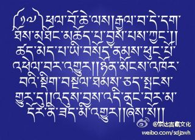
 ## 2012-01-17 14:11
内心幸福快乐，是养育身体的良药；修持佛之妙法，是内心幸福快乐的源泉；生起信心，是修持佛法的门径。 .

 ## 2012-01-18 16:39
因劝请听法而面朝上师吹响海螺，即是殊胜供养；因听闻此音之诸多众生免堕三途，故应知，诸佛菩萨之行境及方便不可思议。一一≪前行引导文一一解脱妙梯≫持明无畏洲（智悲光尊者）

 ## 2012-01-18 16:42
前辈高僧大德观修无常的甚深要诀，包括三个根本、九个原因与三个决定。其中三个根本为：1、必定死亡；2、死期不定；3、死时除了佛法，其他任何东西都毫无助益。.

 ## 2012-01-19 12:15
即使没有利益众生的能力，也要永葆一颗利益众生的心。谁有了利他之心，就已经身在利他者的队伍之中了。  

 ## 2012-01-19 12:22
九个原因包括：没有不死之前人，身体为有为法，寿命刹那坏灭，为必定死亡之因；寿命不定、身体无实、死缘众多，为死期不定之因；亲友无益、饮食财物无益、身体无益，为死时除佛法外其他无益之因。.

 ## 2012-01-20 13:45
世间男女常说：“美丽英俊与否，由前世的因缘决定，所以无论自己的爱人长相如何，都应恩爱体贴。”这种说法虽然是善意的，但如果没有为来世积攒盘缠，大限来临的时候，情投意合的爱人也起不到呵护的作用啊！——法王如意宝

 ## 2012-01-20 13:49
三个决定包括：因为必定死亡，所以决定修持临终必定有利之佛法；因为死期不定，所以决定从现在开始修法；因为死时除佛法外其他任何东西都没有用，所以决定唯以修法为生。.

 ## 2012-01-21 17:25
与任何人交往，都免不了是是非非，这是谁都无法逃脱的局面。所以，平时与亲朋好友相聚时，不要因为鸡毛蒜皮的事情而令大家不快，而应以慈爱宽容、互帮互助之心和睦相处。——麦彭仁波切

 ## 2012-01-21 17:31
身处汉地，却断绝一切来往，品尝着藏地的食物——糌粑、酥油茶，阅读着犹如洒落一地的宝珠般的前辈大德的教言论典，实乃惬意之事啊！ .

 ## 2012-01-22 18:03
从今天开始，汉地翻开了龙年的新篇章。然而，各个城市的人们为了满足自己短暂的口腹之乐，却不惜以践踏无量众生之生命为代价，让可怜的生灵们饱受了不可言说的苦难。。。让我们发起猛厉的慈悲心，一起尽力念诵“嗡玛尼巴美哄”吧！

 ## 2012-01-22 18:08
依靠佛陀加持，而宣示之梵音妙语，无论怎样演释，都极易理解。一句善说，哪怕经过千百万年，仍历久弥新、魅力长存。即使心智稍逊的人，也能明白其中之几分。一一华智仁波切（晋美秋吉旺波）.

 ## 2012-01-23 11:14
我们应当知道，虽然表面看来，凡夫智者的论著也说得头头是道，但却存在着缺乏深度等遗憾。而诸佛菩萨以谛实语写成的经论，却不但意义广远、博大精深，而且 永远不需要改革、变更与发展。

 ## 2012-01-23 20:49
若能证达无作之境界，则即使表面的身体是普通的人天之身，但其内在证境却已经与法身佛无异。一一≪普作续≫.

 ## 2012-01-24 22:41
无论寻遍十方四时的任何一个角落，都无法找到圆满正等觉佛陀的踪迹。自己之心性，即是圆满正等觉。除此之外，无需他处寻觅。即使是佛陀，也不可能在别处找到。一一≪密藏续≫

 ## 2012-01-24 22:44
若不能通晓苦乐之本性，即使获得了快乐，也不能超越痛苦。.

 ## 2012-01-25 19:04
因为显现，故而不成立有；因为空性，故而不成立无。应当通晓无二任运自成之大自性。一一≪法界宝藏论第七品≫全知无垢光尊者

 ## 2012-01-25 19:07
若想得到快乐，必须先明白快乐的因缘是什么。如果不懂得这一点，愚昧地制造恶业，则会感受痛苦，这是不可更改、无法逆转的世间法则。.

 ## 2012-01-26 20:53
当生菩提心，为众宣妙法，寻求菩提道。一一≪宝积经三戒品≫

 ## 2012-01-26 20:56
不计回报、无需条件地利益他众，即使被对方迫害，仍能以德报怨，即是大乘佛法的特点与精髓。

 ## 2012-01-27 21:34
万事万物都与如来一样清净，但愚昧的人却执着于外相，且沉醉迷恋于世上并不存在的东西。一一≪宝箧经≫

 ## 2012-01-27 21:35
现在绝大多数人就是这样，素质低下、不学无术、擅长造恶、喜爱劣行、自由散漫。。。身处这样的社会之中，能让身口意浸淫于正法的人，实在是少之又少。

 ## 2012-01-28 17:42
任何事物都自因缘而生，所以无生，因为自因缘而生的都无有自性。因此，凡是依赖因缘的事物，都必然是空性。一一≪三摩地王经≫.

 ## 2012-01-28 17:46
过去的人们，都是知惭有愧、顾忌颜面的，现在的人们，却会为了一星半点的钱财和名声，厚颜无耻到哪怕在公众场合赤身裸体都毫不羞愧、恬不知耻。这样的社会究竟是在进步还是倒退，的确值得大家深思啊！

 ## 2012-01-30 00:01
芸芸众生的表现，真是稀奇啊！不真实的执为真实，一切就似乎真实了；不迷乱的执为迷乱，一切就似乎迷乱了；不确定的执为确定，一切就似乎确定了；不是的执为是，一切就似乎是了；不合理的执为合理，一切就似乎合理了。——《法界宝藏论》.

 ## 2012-01-30 00:22
尽管我发现，如今一些人对前辈祖师大德的教言并不感兴趣，但这些金玉良言，却是对今生来世有着重大意义的真理之语。弘扬这些珍宝，也是我毕生的主要奋斗方向。从明天开始的二十天中，我准备将龙树菩萨撰著的《大乘二十颂》译成汉语，并陆续在微博上发表，以飧读者。望有缘者能一睹为快并有所受益。

 ## 2012-01-30 15:55
《大乘二十颂》 梵音：玛哈雅那波协噶；汉译：大乘二十颂 顶礼文殊童子！证达无贪佛，非能所说境，恭礼力超思，大悲所现佛！胜义无生故，亦无有解脱，如来若虚空，众生一体相。

 ## 2012-01-30 16:17
《大乘二十颂浅释》 ，译者在开篇之初，便按照藏地经论翻译的常规，首先恭敬顶礼智慧本尊文殊童子。之后是顶礼偈：证达对万法无有贪执的佛陀，绝非能所之语与所说之义的境界。在大悲心所化现的，力量超越思维意识的佛陀前，作者龙树菩萨毕恭毕敬地顶礼！
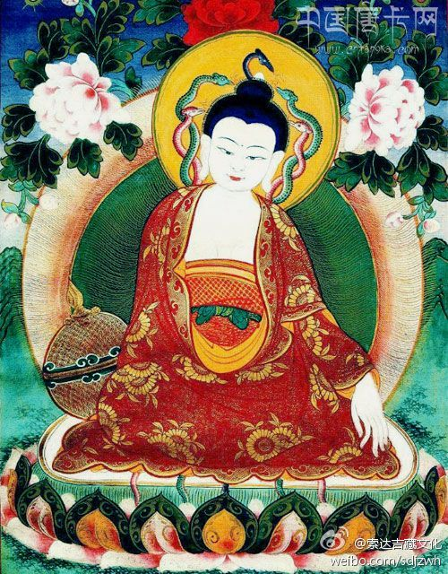
 ## 2012-01-30 16:29
在胜义当中，没有产生，所以也没有众生与轮回；没有解脱，故而也没有从轮回中解脱的佛陀。如来就像虚空一般清净本空，众生也与其一味一体、无二无别，但在名言当中，众生与佛陀都真实存在，不可混淆（下文也应如是理解）。

 ## 2012-01-31 10:35
此彼岸无生，无涅槃自性，有为法皆空，遍知佛行境。 .

 ## 2012-01-31 10:36
无论从自生、他生、共生、无因生等各个角度来观察，此岸所象征的轮回，与彼岸所象征的涅槃，都是无生的，所以没有自性存在的涅槃。同样，一切可见、可思、可言、可生、可灭的有为法都是空性，这不是普通凡夫所能了知的范畴，而是智慧不可思议之遍知佛的行境。

 ## 2012-02-01 10:16
通晓万法性，有如影像故，真如性平等，清净寂无二。

 ## 2012-02-01 10:16
通晓一切万法在世俗谛中，如同镜中之影像一般如梦如幻、自性本空；于胜义谛中，则为清净、寂灭，与世俗谛一体无二之平等真如法性。

 ## 2012-02-02 11:20
我无我皆空，凡夫心假立。苦乐相观待，惑解亦如是。.

 ## 2012-02-02 11:22
在真实义中，我与无我都是空性无实，都不存在，但凡夫俗子却以分别之心而将其假立为有或者无。快乐与痛苦也是互相依存、互相观待的，一者不存在，另一者也不可能存在，如同长与短、父与子、大与小等等一样。同样，流转轮回的烦恼与解脱的智慧也是如此。

 ## 2012-02-03 11:58
流转六道众，各于自境中，感受善趣乐，地狱大痛苦。

 ## 2012-02-03 12:02
在没有证悟万法实相之前，流转于六道轮回的众生，只能在自己业力所感的环境中，感受有漏的人间、天界、阿修罗等三善趣之安乐，与难以堪忍、无量无边之地狱、饿鬼、旁生等三恶趣之痛苦，别无选择。

 ## 2012-02-04 17:15
不善生极苦，喜乐瞬时灭，善业必定生，胜妙之安乐。.

 ## 2012-02-04 17:20
众生流转轮回所遭遇的一切，都是咎由自取，而不是无因无缘的偶然。因不善之业的大小程度，而产生相应之细微与剧烈之苦，即使是欢喜快乐，也会瞬间化为乌有，而变为痛苦。而善业又必定会产生胜妙之安乐。如同毒和药的种子分别产生各自之果一般，这都是谁也无法转移的自然规律。

 ## 2012-02-05 19:02
众生妄分别，烦恼火炽燃，现地狱等象，苦如火烧林。

 ## 2012-02-05 19:07
众生因虚妄分别念的驱使，引起烦恼之火熊熊炽燃，以烦恼而造业，以致显现地狱等六趣之现象，并承受极度猛烈之痛苦煎熬，犹如野火焚烧森林一般势不可挡。.

 ## 2012-02-06 10:52
虽然≪大乘二十颂≫很难，大家却学得很认真，心里十分欣慰。尽管万事开头难，但若能每天坚持学习一些具有加持与价值的词句，经过长期的日积月累，内心潜移默化，一定会往好的方向发展。让我们大家一起继续努力、共同进步。

 ## 2012-02-06 11:24
众生所取境，如同幻化相，有情本幻性，皆为缘起生。.

 ## 2012-02-06 12:47
众生执着、贪恋、缘取、行持的对境，都如同幻师以幻术幻化出的景象一般虚无不实；有情众生本身，也是犹如梦幻的本性。若以智慧观察，无论内在与外在，宇宙与生命，一切的一切，都是现而无实有，因为都是各种因缘缘起而生。

 ## 2012-02-07 09:54
如画师自画，夜叉像自怖，无智者流转，亦为同等理。  

 ## 2012-02-07 09:59
就像画师画出栩栩如生的夜叉图像后，自己却被自己所画的像吓得惊魂不定，其实都是自己吓自己一样，没有通达万法真相的愚者，也是因为自己的虚幻之心幻化出虚无缥缈的轮回现象，从而流转轮回、漂泊不定，感受轮回中的种种恐怖与痛苦，其实都是自己把自己约束于六道之中而不得解脱。

 ## 2012-02-08 10:10
如自作泥潭，愚童沉其中；陷分别泥中，众生难自拔。

 ## 2012-02-08 10:41
犹如愚昧的顽童在玩耍时自己造作泥潭，最后自己沉入其中而难以自拔一样，众生因愚痴分别妄念的驱使，将无常执为常有，不净的执为不净，无我执为有我，空性执为实有，从而作茧自缚，陷入轮回泥沼中，长时受苦、永无出期。

 ## 2012-02-09 22:24
外境与心识，分别念所缚，无实执实有，感受诸痛苦。 .

 ## 2012-02-09 22:25
没有证悟境界的凡夫，会因色声香味触法等六种外境，与眼耳鼻舌身意六种根识之因缘，而产生有毒之分别妄念，从而将无实之法执为实有，并因实有之执着而产生烦恼，继而造作恶业，之后饱尝各种痛苦之果，始终束缚于轮回之中，长时不得解脱。

 ## 2012-02-10 09:55
当证无实性，生起智悲心，为利众生故，置彼于佛地。  

 ## 2012-02-10 09:57
我们应当洞彻一切万法原本无实之本性，从而生起超然之智慧与大悲菩提心，为了利益天边无际的众生而精勤修持，力争早日度尽一切众生，将他们安置于佛的无上安乐之地。

 ## 2012-02-11 13:43
世俗中积资，获无上觉果，超离分别缚，此佛乃世亲。.

 ## 2012-02-11 13:45
在世俗中广泛积累福德与智慧资粮，并以此等善根获得无上菩提妙果，从而超越脱离分别妄念之网的缠缚，这样的佛陀，犹如日轮般既可带来温暖，又能指明前程，的确堪称世间众生之至亲。

 ## 2012-02-12 09:34
佛证缘起性，真实之本意；洞彻众生空，远离初中后。

 ## 2012-02-12 09:45
唯有断证圆满的佛陀，能够彻底照见一切万法无欺缘起而生的真实之意，并洞彻三界六道之轮回与其间之众生原本为空，远离初中后等一切时空概念，不可言表、超离思维。

 ## 2012-02-13 16:08
通达诸轮回，涅槃皆非有，无有烦恼相，亦无初中后。

 ## 2012-02-13 16:09
若能通达万法的自性，不清净的轮回与清净的涅槃，在究竟实相中均不存在。包括我们所产生的贪、嗔、痴等烦恼，也全部了不可得，根本没有最初的产生、中间的安住、最后的消失。

 ## 2012-02-14 14:01
如感梦寐境，智分辨则无，愚痴梦若醒，轮回不可得。 .

 ## 2012-02-14 14:02
犹如梦境中所感受的一切痛苦与快乐、安然与惊恐、富贵与贫穷等等，若以智慧观察、辨别，或从梦中醒来，都了不可得一样。若能从无明愚痴所制造的大梦中苏醒，则所有轮回间的一切功名利禄、穷苦窘迫、至爱亲朋、怨敌仇人，乃至生老病死、上升下堕等等，都将灰飞烟灭、不复存在。

 ## 2012-02-14 18:18
分享图片

 ## 2012-02-15 16:40
如见诸幻师，幻化诸聚集，彼时纤毫无，此乃诸法性。 .

 ## 2012-02-15 16:45
如同在见到魔术师幻化出的各种幻变景象时，一切集聚都是虚无缥缈的幻像，哪怕其中的一丝一毫，都并不存在一样。在见到大千世界所集聚之森罗万象的当下，一切也都只是幻像而已，这是一切万法的本质。

 ## 2012-02-16 16:01
此等皆为心，如幻而安存，以善不善业，衍生贤劣果。  

 ## 2012-02-16 16:03
所有我们能够感知的一切现象与感受，都仅仅是心的造作而已。现实生活中的一切，都只能以如梦如幻的方式而安存于世。在这个梦幻泡影似的世界中，众生将以杀盗淫妄等不善业，感召三恶道等恶劣果报；同时以布施、持戒、安忍等善业，感召人天福德等善果。

 ## 2012-02-16 16:07
公告：《大乘二十颂》学完后，准备仍按照每天一个偈颂的学习进程，为大家翻译并略解前辈大德土观秋吉尼玛仁波切撰著的《世间规》。敬请各位，继续关注！.

 ## 2012-02-17 10:13
若除心根本，诸法皆灭尽，法性本无我，亦为清净界。  
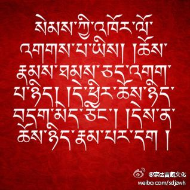
 ## 2012-02-17 10:19
若能从根本上断除一切分别妄心，则芸芸众生与山河大地等一切，都将土崩瓦解、不复留存。本来法性实相远离言思戏论，无有任何人我与法我，是清净、空性、光明之法界。

 ## 2012-02-18 07:31
若于物本性，恒存安乐想，无明愚痴障，凡愚漂轮回。 .

 ## 2012-02-18 07:32
如果不能通达万法之实质，对一切事物及其本性，一直存有恒常、安乐、有我、清净之颠倒妄想，则因为这些无明愚痴的障碍，凡夫有情只能在生死轮回的茫茫大海中，时上时下、漂泊不定、终难出头。
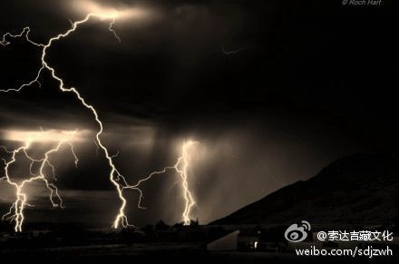
 ## 2012-02-19 14:26
轮回大苦海，溢满分别流，不登大乘筏，谁能达彼岸？

 ## 2012-02-19 14:31
在无边无际的轮回六道大苦海中，充溢着大大小小的贪嗔痴分别妄念瀑流，波涛滚滚、流淌不尽。如果没有登上大乘妙法之殊胜宝舟，又有谁能抵达解脱之光明彼岸呢？

 ## 2012-02-20 14:14
无明缘所生，世间解方知，彼等分别念，皆从何处生。龙树菩萨撰著之《大乘二十颂》圆满译竟。 .

 ## 2012-02-20 14:16
唯有堪称世间解的佛陀，才能通晓由无明之因缘所产生的一切内外世界的因果关系及其本质，也知道众生的喜怒哀乐等分别妄念，都是从何处而生。更重要的，是知道在这些表面现象的背后，世界是怎样一副模样，以及最终彻见这一万法本相的途径。

 ## 2012-02-21 13:27
《世间规之忠言》     土观·洛桑却吉尼玛 著     顶礼上师三宝！     虽然年轻人教育老年人不合情理，但老一辈教诲下一辈却应当应分，这篇讲述遵循世间准则的忠言，就是为了利益年轻人而写下的。

 ## 2012-02-21 13:42
《世间规之忠言》作者土观·洛桑却吉尼玛简介链接O网页链接，O网页链接

 ## 2012-02-22 13:04
心地正直固然很好，但如果过于正直，在此污浊不堪的末法时代，就会像乞丐的猴子一般被人戏弄。因此，把握好正直的尺度，是我的忠告。.

 ## 2012-02-23 10:05
能说会道、能言善辩虽然也不错，但如果何时何地都口无遮拦，滔滔不绝地夸夸其谈，则自己内在的一切，都会被别人一览无遗。因此，把握好说话的分寸，是我的忠告。

 ## 2012-02-24 10:48
韬光养晦、大智若愚固然很好，但如果过于保持缄默，任谁都不知道自己内在的智慧，就会像暗暗涌动，却不为人知的甘泉一般不起作用。因此，把握好外显与内敛的尺度，是我的忠告。.

 ## 2012-02-25 16:35
虽然世人都说嫉恶如仇很好，但如果经常无缘无故地发起强烈的无名之火，就会像看门狗一样与所有人结仇。因此，不要轻易发怒，是我的忠告。
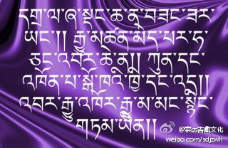
 ## 2012-02-26 18:47
嘴甜心善固然很好，但在这个好人不受待见，坏人称王称霸的时代，过分善良软弱却会被人蔑视与欺辱。因此，掌握好软弱与强硬的分寸，是我的忠告。.

 ## 2012-02-27 13:51
不贪钱财固然很好，但在这个不名一文的乞丐，会遭到所有人唾弃；大户人家的走狗，却会被奉为上宾的时代，适当地积攒一些财物，是我的忠告。

 ## 2012-02-28 11:07
短斤少两、不讲诚信的奸商行为，会搅得整个国家都不得安宁。摈弃贪求暴利、实则无义之不良经营方式，君子积财取之以道，是我的忠告。.

 ## 2012-02-29 10:22
善于理财固然很好，但如果一毛不拔、吝啬成性，就会众叛亲离、于己不利，像守护宝藏的恶鬼一般孤立无援，因此，掌握好积财与施舍的尺度，是我的忠告。

 ## 2012-03-01 14:42
朋友众多、交际广泛固然很好，但秉性恶劣的朋友却会把自己引向邪路，最终毁坏自他，以致双双坠入江河般的险境，因此，交往的朋友不要搞错，是我的忠告。.

 ## 2012-03-02 13:43
无喜无忧、心态如如不动的人虽然很少，但若过于喜怒无常，就会遭人轻视、唾弃，以致失却友伴，因此，保持心境的相对稳定，是我的忠告。  

 ## 2012-03-03 23:03
如果对信任、投靠自己的亲友，都暗中算计，毫无怜悯之心，像野狗一样不知好歹，这种对投靠者都敢欺哄吓诈的人，就是所谓的无愧者。因此，知耻有愧、值得信赖，是我的忠告。.

 ## 2012-03-04 13:18
当面吹捧赞叹、阿谀奉承，背后说三道四、指责过失，当面一套背后一套，一张嘴巴吐出两根舌头，就像毒蛇一样可恶，因此，人前人后都不要说得太多，是我的忠告。

 ## 2012-03-05 16:17
凡事都唯唯诺诺、点头称是，事后也出言必行的人十分罕见。答应得越爽快，就越容易弃之脑后或拒不执行。所以，不要随便相信那些轻易承诺的人，是我的忠告。.

 ## 2012-03-06 13:33
心思太多，琐事也会随之增多；琐事一多，最后大多不能善始善终；若不能善始善终，则不但于己有害，也会招致别人的嘲笑。所以，不要让心思和琐事太多，是我的忠告。

 ## 2012-03-07 11:34
受到众人恭敬时，要把握住自己；遭到众人排挤时，也要奋发自强。独立自主，是我的忠告。以上内容，是关于世间法的部分。关于佛法的内容，将在别处宣说。无论是否有人听从，以上所述，都是本人以利他之心而写成的。愿吉祥！（《世间规之忠言》译竟）.

 ## 2012-03-07 13:21
明天开始，将翻译并共同学习阿底峡尊者撰著的《中观入二谛论》。这个论典稍微有点难，但一旦学懂，却会受益匪浅。尤其对知识分子来说，通达二谛之理是必不可少的一个环节。敬请大家继续关注！

 ## 2012-03-08 12:54
《入二谛论》 梵音：萨得达雅巴达热 ；藏音：顶巴尼拉杰巴；汉译：入二谛论 顶礼大悲观世音菩萨！诸佛说正法, 真实依二谛: 世间世俗谛，以及胜义谛。.

 ## 2012-03-08 13:07
《入二谛论》浅释      三世诸佛在宣说解脱正法时，必定真实如理地依靠世俗胜义二谛之理。其中世间万事万物之现象部分，属于世俗谛；甚深寂灭远离一切戏论之出世间解脱境界部分，属于胜义谛。

 ## 2012-03-09 19:13
世俗可分二: 颠倒与真实。初分二水月，宗派恶分别。

 ## 2012-03-09 19:15
其中的世俗谛，又可以分为两种：颠倒世俗谛与真实世俗谛。其中的颠倒世俗谛，又分为两种：犹如水月、阳焰、梦幻一般，在正常的世俗五根前都无法成立的假立之法；以及因宗派所灌输的邪分别见而产生的，执着神我、常法等等的遍计执著。

 ## 2012-03-10 18:25
未察似成立，生与灭诸法, 具有作用者, 许为真世俗。 .

 ## 2012-03-10 18:26
在未经观察的情况下，在凡夫的五根六识前似乎真实成立，从产生、留驻与毁灭等各个程序来看，都井然有序，并且具有一定的功效与能力，如火的热性、水的湿性等等，像这样的各种事物与现象，就承许为真实的世俗。

 ## 2012-03-11 08:27
胜义乃一体, 余许有二种。法性无所成, 何有二三等?  

 ## 2012-03-11 08:28
在真实的胜义谛法界光明中，一切都是圆融一体、无二无别的。虽然在胜义之外的世俗谛中，可以承认有胜义与世俗二谛，但器情世间一切现象之本质或法性本身都不可成立，又怎么可能存在什么二谛、三谛等等的概念呢？

 ## 2012-03-12 15:26
言词诠表故, 无生无灭等, 胜义无异故, 无有法法性。

 ## 2012-03-12 15:30
在用语言文字为众生宣讲诸法真相时，为了便于众生理解，相合众生根机，而不得不用无生、无灭、无来、无去等词汇来表述，但真正的胜义谛，是没有异体之相，都是清净、平等之光明法界，所谓的有法与法性、世俗与胜义、现象与本质都是凡夫的增上安立，都是不存在的。

 ## 2012-03-13 08:57
于空性界中, 丝亳无异相。无分别而悟, 名言谓见空。

 ## 2012-03-13 09:00
在空性法界光明境界中，没有一丝一毫的异体之相。都是一体无别、不可思议之平等法性。诸佛菩萨以无有分别的方式而通达、体悟时，我们只能用世俗名言来诠表，就称之为见到空性。

 ## 2012-03-14 05:47
甚深经中云: 彼不见即见。无所见能见，始终皆空寂。

 ## 2012-03-14 05:48
在宣说胜义谛的甚深般若经典中说：不见任何法，即是最殊胜的见。其实，真正的觉悟，是没有能见的心识或智慧，也没有所见的空性或法界，包括开始、中间与终结等过程，都是彻头彻尾的空寂，原本一无所有。

 ## 2012-03-15 06:58
离有实无实, 无分别离缘, 无住与住处, 无来去离喻。

 ## 2012-03-15 06:59
胜义谛远离了有实无实、实有空性等一切概念，既没有作为有境的分别妄念，也远离了所缘之对境；既没有安住的过程，也没有可住的住处；既没有来，也没有去，远离了一切可以诠表的比喻。

 ## 2012-03-16 20:02
离言无可见, 无变异无为, 瑜伽士证彼, 断惑所知障。

 ## 2012-03-16 20:06
胜义谛远离了一切语言所能诠释的范围，也没有可以见到的任何色法，没有任何变化迁移，属于没有造作、没有改变之无为法。任何修行的瑜伽士若能证达如此境界，则能断除一切烦恼障与所知障，现前无垢离障之佛果。

 ## 2012-03-17 05:45
短视愚人言: 现量及比量, 佛徒持彼二, 以二量证空。

 ## 2012-03-17 05:47
不承认因果轮回，缺乏卓然智慧，目光短浅、追求现世的世间人说：佛教徒必须掌握以五根直接观察世界自相的现量，以及用逻辑推理推导出事物总相的比量。依靠这两种量，即可以证悟空性。

 ## 2012-03-18 23:29
则外道声闻, 皆可悟法性，何况唯识宗，中观更无异。

 ## 2012-03-18 23:30
照此说来，则一切外道与小乘声闻, 都应该完全证悟法性，何况说见解更胜一筹的唯识宗呢。唯识之上的中观宗，也与这些宗派没有差别了。

 ## 2012-03-20 23:58
故一切宗派, 以量量故同，众思辩异故, 量所量法性,岂非成众多？.

 ## 2012-03-21 00:06
如此说来，由于内外道的一切宗派都是以量来衡量的缘故，所以都没有区别。但因为各个宗派在思维、辨别、研究的方向与原则等等有着本质的差异，则以各宗派所承许之量所衡量的法性，岂不是也成了很多种了吗？

 ## 2012-03-21 18:54
无需现比量, 遮止外道诤, 故诸智者说。

 ## 2012-03-21 18:56
本来证悟法性、获得解脱，并不需要具有能取所取等二元化概念的现量，以及逻辑推导而得的比量，但为了遮止外道无中生有的各种诤论、辩驳，诸大智者便暂时安立了这些世间的学说。

 ## 2012-03-22 13:27
清辩阿阇梨，及经教均言，以有无分别，二识不可悟。 .

 ## 2012-03-22 13:29
无论是在佛经教典中，还是在印度大班智达清辩阿阇梨的论著中，都异口同声地指出：无论是以无分别的现量识，还是以有分别的比量识，都不能证悟无以言说、深不可测之万法实相。

 ## 2012-03-23 13:53
依谁证空性？如来所授记，照见法性谛，龙树徒月称。  

 ## 2012-03-23 14:04
依靠谁的教言和引导来了悟、印证万法之空性呢？希求证悟实相空性的诸众，应当依照佛陀在《楞伽经》、《金光明经》等经典中所授记的，现证一地果位，照见甚深法性义谛之圣者龙树菩萨的首座大弟子——月称菩萨的教言，严格奉守尊者教诲，以巨大之精进勇猛不断地闻思修持。

 ## 2012-03-24 20:43
依彼传窍诀, 能悟法性谛。经说众法蕴, 有八万四千，皆归此法性。.

 ## 2012-03-24 20:48
依靠月称菩萨所传下来的窍诀, 就能证悟法性实相的真谛。虽然佛陀在经典中宣说的对治烦恼，获得解脱的众多法蕴, 一共有八万四千种。但这些千差万别的法门，最终都将如同江河流入大海一般，归入证悟法性的光明大海。

 ## 2012-03-26 00:15
悟空得解脱, 余修皆为此。

 ## 2012-03-26 00:19
若能证悟空性，即能获得解脱。所有的六度万行，都是为了达到这一目标。

 ## 2012-03-26 23:37
近期我即将返回藏地，之后信号也许会时有时无。但我会想尽一切办法，力争发出每天的微博，随时与大家保持交流。如同小小水滴源源不断的灌溉，也能使花的种子生根发芽一样，希望所有的心灵都能因此而获得利益。.

 ## 2012-03-27 09:24
རྒྱ་རོང་། 嘉绒藏区

 ## 2012-03-27 15:02
若舍正世俗，即使修空性，因果善恶等，来世必欺辱。

 ## 2012-03-27 15:03
如果舍弃了正世俗，不顾因果规律，不懂善恶取舍，为非作歹、有恃无恐，则即使精勤修习空性，自己所做的善恶因果，也必将在来世现前，使自己遭受果报的严厉惩处。

 ## 2012-03-28 10:40
依少分听闻，不知真谛义，亦不修福者，沦为卑劣人。

 ## 2012-03-28 10:43
仅仅浮光掠影地听闻了少量经教论典，便浅尝辄止，不愿深入经函、广泛闻思。其结果，是不可能了知万法真谛之义的。在缺乏智慧的基础上，又不积累福德资粮，终将沦为卑下拙劣之愚者，实在是太可惜了。

 ## 2012-03-29 09:42
若错解空性,浅慧者将堕。  .

 ## 2012-03-29 09:43
如果错误地理解了空性的真实含义，以为空性就是什么都没有，不顾因果取舍、不知修福行善，等待这种智慧低劣之愚夫的，只有惨堕恶途的下场。

 ## 2012-03-30 07:34
月称论师云: 世俗乃方便，胜义方便生，不知二差别, 邪见堕恶趣。

 ## 2012-03-30 07:37
阿阇梨月称论师在《入中论》中指出：六度万行、因果轮回等方便法门，都属于世俗谛的范畴；通过修持这些方便法，最后所抵达的境界，就是胜义谛。如果不知道世俗谛和胜义谛之间的差别，一切都按照胜义谛的规则行事，轻毁了世俗谛的因果规律，最终必将因恶分别邪见而投生恶趣，饱受痛苦。

 ## 2012-03-31 09:49
若不依名言, 不能证胜义。 .

 ## 2012-03-31 09:51
如果不依靠世俗名言的种种方便，勤奋地积资净障，就不可能证悟超越一切戏论言思之胜义谛实相。

 ## 2012-04-01 09:02
无正世俗梯，欲渐次抵达，真实大厦顶，智者不容有。  

 ## 2012-04-01 09:04
如果没有正世俗的种种方便阶梯，而妄想拾级而上，最终抵达真实胜义谛之大厦顶端，这是任何智者都清楚绝不可能的事情。

 ## 2012-04-02 09:15
世俗诸现象, 理析无所得, 不得即胜义, 本住之法性。 .

 ## 2012-04-02 09:17
如果以正理进行观察剖析，则世俗中山河大地、日月星辰、喜怒哀乐等一切现象，一丝一毫也了不可得。无有所得的境界，也就是真实胜义——本然安住之自然智法性。

 ## 2012-04-03 07:50
诸因缘若生, 世俗显现成, 若彼不能成, 水月等谁生？

 ## 2012-04-03 07:51
如果因缘能够产生世俗显现，则世俗中的一切显现就能够成立。如果因缘不能让世俗中的种种显现成立，那水月等一切幻象又从何产生呢？

 ## 2012-04-04 07:34
故诸因缘生, 所有现象成。诸缘若断绝, 世俗亦不生。  

 ## 2012-04-04 07:36
由此可见，正是因为各种因缘，才产生了所有世俗显现，才令世俗显现有了成立的基础。如果诸种因缘消失、断绝了，则世俗间的一切也不可能产生。

 ## 2012-04-05 08:19
见解不蒙昧, 行为极清净, 则不入歧途, 趋往清净刹。.

 ## 2012-04-05 08:28
如果见解上毫不颠倒愚昧，具有世出世间之智慧，行为取舍方面也极为清净，纤尘不染，则不会误入歧途，最终必将去往清净安乐之佛刹。

 ## 2012-04-06 06:36
寿短所知众, 寿量且不知, 如鹅取水乳, 修持适己法。

 ## 2012-04-06 06:40
世间与出世间的学问浩如烟海，而南瞻部洲众生却寿命短促，并且无法预知寿命长短，所以要像天鹅从水乳相混的液体中吸出乳汁一样取其精华，选出适合自己根机意乐的法门进行修持。

 ## 2012-04-07 08:24
短视愚者吾, 无力择二谛, 然依师所说, 立龙树二谛。.

 ## 2012-04-07 08:25
我本是见识短浅、智慧匮乏者，仅凭自力根本无法抉择二谛甚深之理，但依靠诸大具德上师所说的教言，便撰写了这篇综述龙树菩萨之二谛意趣的论典。

 ## 2012-04-08 08:07
金洲王请作, 若今有人信, 应善察而持，非唯因信敬。  

 ## 2012-04-08 08:08
这篇论著，是应金洲王的劝请而写下的，若现今时代有人对此生信，希望能妥善地钻研、析察，最好不要仅仅只有一个肤浅的信心与恭敬。

 ## 2012-04-09 12:22
格日帕拉王, 遣得瓦玛德，比丘请造此, 今智者当察。.

 ## 2012-04-09 12:23
应金洲王格日帕拉派遣的比丘得瓦玛德之劝请，而撰写出这篇《入二谛论》，诚恳地期望当今时代的诸位智者能够认真观察抉择此中所说之道理。

 ## 2012-04-10 18:26
世间人总是会珍惜安乐远过于珍惜痛苦，但我们修行人却应该与之相反一一珍惜痛苦远超过珍惜安乐，因为贪恋有漏安乐有着数之不尽的过患，而接受痛苦却有着不可胜数的利益一一仙阿瓦格西

 ## 2012-04-11 09:34
身体无常，有如秋季之鲜花；生命无常，恰似空中之闪电；朋友无常，犹若集市之过客。。。朋友们啊！应当为来世做打算啊！——土观洛桑秋吉尼玛.

 ## 2012-04-12 16:30
对任何事物有耽执，都要把它放下。一旦能够证悟，则所有的执着，都将烟消云散。一一大成就者帝洛巴

 ## 2012-04-14 16:16
呜呼！具有信心的人们啊！像如今这样一帆风顺的状况，绝不可能一直持续下去，总有一天，会发生天翻地覆的转变，为了应对这一突变，还是趁早修持殊胜妙法吧！ ——遍知龙钦巴尊者.

 ## 2012-04-15 15:07
从今天开始，我们将以长行散句的形式，翻译、重温法王如意宝撰著的≪宣示寿命无常之悲情道歌——瀑布妙音≫，欢迎大家踊跃参与、共同学习，以提高对万法无常的认知。

 ## 2012-04-15 15:11
≪宣示寿命无常之悲情道歌——瀑布妙音≫ 发散、汇集浩瀚无垠的一切本尊坛城之作者，无与伦比的大恩上师法王麦彭仁波切啊，请您安住在我心中的莲花妙垫之上，自然而然地唱起一串串无常之歌。

 ## 2012-04-16 16:32
夏日的青青草原，草木茂盛、鲜花盛开，宛若天境一般令人赏心悦目，一旦遭遇冬季风霜雨雪的横扫，萧瑟荒凉的景象，不禁让人心中哀伤倍增。.

 ## 2012-04-17 10:20
五彩缤纷、绚烂多姿的花园中，辛勤可爱的蜜蜂们，争先恐后地吟唱着悦耳动听的歌谣，虽然人人都希望这种欢乐嬉戏、浪漫追逐的美好时光能天长地久，但又怎能阻挡前世业果的力量？

 ## 2012-04-18 14:46
葱郁茂密的森林中，杜鹃鸟儿啁啾欢唱，清脆婉转的歌声令人神往，这是多么美妙的供品啊！但到了初秋来临之际，若能想想此情此景，这又是多么殊胜的宣示寿命无常的善知识啊！.

 ## 2012-04-19 16:52
蒙蒙细雨，氤氲出缤纷绚丽的彩虹，横跨在朵朵白云点缀的虚空之中，那么的凄美迷离、风情飘逸，转瞬之间，却又消失无影，找不到来去的踪迹。若能细细思量，这便是生动鲜活的无常景象。

 ## 2012-04-20 13:55
秋天，朵朵白云亲密地堆积在一起，像层层叠叠的雪山峻岭，刹那之间却又消失于虚空，不留下一丝痕迹。这一切的一切，难道不都是在向厌世者们喻示着：“今生今世的一切荣华安乐，都是漂泊不定、不可信赖的”吗？.

 ## 2012-04-21 21:09
坚固辽阔的三千大千世界之广大宇宙，终将被火水风的灾难毁灭殆尽，区区人类所建的宫苑墙垣，更是难以自保、不可依靠。

 ## 2012-04-22 11:09
纵然是寿命过劫、神通在身，并以禅悦为食的天人与大仙，面对阎罗与怨敌，也无从逃避、身不由己。若认为自己可以躲避死亡，则是颠倒、邪恶之想。

 ## 2012-04-23 11:24
往昔虽然出现了个别在四大部洲权倾一时、一呼百应的所谓“转轮王”，但如今也只能让后人念知他们曾经辉煌一时的威名，由此推知，我们自己微弱的身体，也不可能有什么实质的意义。

 ## 2012-04-24 13:14
断证圆满的如来与佛子，也曾像满天的繁星一般数不胜数，但他们却相继为了揭示无常的道理而示现涅槃，这些现象，都明明白白地宣示了无常之理。.

 ## 2012-04-25 10:07
在堪称清净刹土的桑耶宝顶大殿中，回想起师君三尊及眷属在世时的历历场景，不由得心花怒放、欢喜异常，思绪一回到现实，又怎能不让人愁肠百结、满怀悲伤？

 ## 2012-04-26 10:51
如果没有如理如法地闻思经得起三种观察的清净殊胜之经论，仅仅凭着自己的思度与揣测胡乱行事，就不可能断除轮回之根源。等到年老体迈之时，反而成家娶妻生子，成为家眷满堂的家长。临终之际，老僧必将因为没有行持善法而被迫转生，漂泊于恶趣之中。.

 ## 2012-04-27 12:05
如果不好好学修《集密意续》（经）、《幻化网》（幻）以及《十八母子续》（心）的经幻心三部，却把敲鼓吹萧弹奏等表面形式当成甚深法义，贪得无厌、肆无忌惮地安享信众财物，等到出现死相，就会显露出自己过去所犯的种种恶行。

 ## 2012-04-28 09:55
聪明伶俐、能言善辩的寺院小僧人啊，虽然你们一心贪恋着讲法、辩论等场合的各种名望，但要等到博得格西学位，那已经是头发像海螺一般苍白之时了啊。你们这些人在世间所享受那些快乐，终究都逃不过昙花一现的命运啊。.
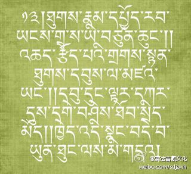
 ## 2012-04-29 20:40
轻视戒定慧三学等修道功德，一门心思地追求今生利益的形象修行人啊，哪怕死到临头并没有达到自己的目标，怎奈何阎罗王的严厉法规，却是不讲情面、不容拖延的啊！

 ## 2012-04-30 18:01
白发苍苍、体态龙钟的老人们啊，却不知时日地做着多年的人生规划，仿佛不知自己犹若灯油枯尽的油灯，即将结束此生的旅程。难道还不赶快为死亡中阴的前路积攒一些盘缠吗？.

 ## 2012-05-01 15:01
朝气蓬勃、风华正茂的青年男女啊，虽然你们以飞扬的青春而自傲，心里从没有过死亡的影子。但死期何时来临，谁都不知道。当阎罗王的使者赶到，捆绑起你们的脖颈时，你们一定会追悔莫及。

 ## 2012-05-02 14:25
心心相印、情投意合的妙龄男女啊，虽然你们私下倾诉着无尽的甜言蜜语、海誓山盟，妄想着一生相伴、永不分离的美梦，怎奈寿命的长短，却是谁也无法预知的啊！.

 ## 2012-05-03 23:29
往年家财圆满、富贵亨通的人，如今却变成可怜兮兮的穷汉，当这些场景在内心的明镜中清清楚楚地映现出来，怎能不对一切有漏事物生起悲哀与厌倦？

 ## 2012-05-04 10:48
三十几颗洁白的牙齿，已经散得七零八落。浑身的皱褶，犹如纵横交错的盘山路。这一切由盛至衰的景象，都是在无声地警示：你的死期即将临近！如果还迷迷糊糊、懵懵懂懂，那与牦牛又有什么差别呢？.

 ## 2012-05-05 10:35
再过一个春秋，等到明年此时，将有数之不尽的人奔赴黄泉之路，谁敢说在此行列中绝对没有自己呢？所以啊！来世其实并不遥远。

 ## 2012-05-06 20:35
再过一百年以后，大地之上现存的人将一个不剩，所有生命都注定会迈向死亡。在犹如短暂梦境一般的迷乱显现中，追求今生利益有什么意义呢？

 ## 2012-05-07 17:32
自己儿时的同龄好友，如今大多漂泊他方、居无定所。众多的生命，已经流落于中阴暗处。我自己一个人，又怎么可能独存于世呢？

 ## 2012-05-08 19:07
当所向无敌的阎罗使者来临之时，即使自己躲在坚不可摧、无门无缝的城堡中，企图凭借十万名身着甲胄、手持武器的士兵作护卫，却终不能在人间多停留一时半会儿。.
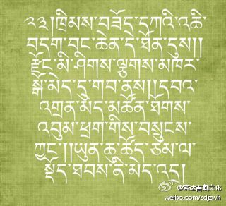
 ## 2012-05-09 12:10
即使你的财宝遍布三界，但阎罗王的狱卒魔众却拒不受贿。哪怕统帅三千大千世界的梵天王与帝释天王，也绝对想不出可以免于死亡的招数。  

 ## 2012-05-10 17:12
即使容貌娇艳得像天边的彩虹一般明媚动人，风情万种、千娇百媚，精通各种勾引、挑逗、诱惑之术，怎奈何夺命的阎罗王大军，却一根汗毛都不会为你的伎俩所动摇。.

 ## 2012-05-11 10:49
看到很多有病和没有病的人都相继死亡之后，一定要静下心来慎重仔细地抉择思维：这一切，都是自己决定死亡的警钟和鞭策，所以必须将自己的注意力，转移到精勤修持解脱的大道上来。

 ## 2012-05-12 08:15
统领众多部落之千家万户的大首领、大官员，死的时候不要说带走一个部下，甚至连带走一口食物的权力都没有。此时绝对有利的，唯有殊胜之正法，请不要一再推迟耽延、白白蹉跎时光了。.

 ## 2012-05-13 05:57
བླ་མ་མཁྱེན།上师念知

 ## 2012-05-13 09:00
当今生今世业力所感的一切现象彻底结束的痛苦出现时，即使有再多的亲友伙伴，也不能为自己分担一份，哪怕哭得泪流满面，也无可奈何、无济于事。不要再坐以待毙了，赶紧趁着现在，勤奋修持对死亡有利之法吧！

 ## 2012-05-14 16:40
若能善加思索，则内外器情之一切万法，都是开示寿命无常的教科书。虽然内心自然流露的感慨无穷无尽，但此处仅以这首云彩一般的道歌，奉献给您这位知心好友。.

 ## 2012-05-15 09:58
རྩེད་མོ斗牛

 ## 2012-05-15 11:56
志同道合的好朋友啊！您一定要再三地聆听：轮回世间的万事万物都是不可靠的，为了获得永恒不变的无漏大乐圆满财富，应当从现在开始，心无旁骛地披上修法的精进铠甲。

 ## 2012-05-16 15:45
愿我从现在开始，乃至虚空穷尽之际，能始终如一地恭敬顶戴怙主文殊上师，同时为可怜的众生宣讲甚深妙法，并获得与文殊勇士一样的智慧与心力。.

 ## 2012-05-16 15:57
以上具有三十二妙相数字的偈颂，是因好朋友俄则亚纳反复劝请为助缘，兼以自己心相续中对无常生起的强烈厌离心为内因，而在心中自然流露出的真实情感。阿旺罗珠宗美于甲辰年元月二十七日撰著完毕。愿吉祥！

 ## 2012-05-16 16:01
从明天开始，我们将学习大恩上师法王如意宝撰写的《瑜伽欢歌吉祥如意妙音》。我将每天翻译四句一个偈颂为汉文，希望诸位能从中感知到修行人内在的欢喜与大乐。.

 ## 2012-05-17 11:13
《瑜伽欢歌吉祥如意妙音》  在生生世世的业力之链中，以善妙之业愿花朵串成的，永不分离的顶饰，仅以言语美称难以表达其内在功德的无等大恩上师如意宝图登秋培仁波切，请您念知我等！

 ## 2012-05-18 09:59
在心间无尽不灭的心轮帷幕中央，无有分离地以三种信心之甘露供云，恭敬依止无量总持、辩才之功德宝藏的拥有者，百部遍主智慧无垢麦彭仁波切，请您念知我等！.

 ## 2012-05-19 08:25
如今的幸福、快乐，都来源于上师的慈悲加持，内心渴望修习正法的心愿得以实现。虽然我老朽的身体不能跳起欢快的舞蹈，但纵然在床榻之上，我也要情不自禁地放声高歌。

 ## 2012-05-20 18:05
六道轮回中的快乐与痛苦，都是轮番交替、此起彼伏的，就像春天变化莫测的天气一样摇晃不定。我们这些具有善缘的修行人，却能时时刻刻都处于快乐之中，这是多么的幸福啊！.

 ## 2012-05-21 17:21
被业愿布谷鸟美女婉转悠扬的歌声所召唤，小小少年时代，便有幸来到殊胜妙法的喜乐花园，享用胜乘甘露凝珠的精华妙味，最初的缘起，由此而得以起始于佛法。

 ## 2012-05-22 17:50
内心，萦绕着前辈圣尊的事迹；耳中，聆听着无等上师的言教。上师与弟子欢聚一堂的美好场景，如今仍历历在目。身体与内心，都不由自主地散发出喜乐的能量与气氛。.

 ## 2012-05-23 16:14
我曾紧紧地拉着汇集如海皈依处之至尊上师的慈悲妙衣一角，并发愿生生世世永不分离，所以如今无论遭遇如何，我都快乐无比。   

 ## 2012-05-24 17:34
前辈持明传承祖师心髓之精要，成就虹身法身之顶乘法义，若能与之相遇，则必定今生今世决定解脱，无需再流转轮回。能把此心交付与如此究竟、透彻之密法，瑜伽士我是多么的快乐啊！.

 ## 2012-05-25 17:01
诸部遍主智慧无垢麦彭尊者啊，我恭敬地将您依止于心间虔诚信心之虚空中，永不分离，终得抛弃寻思造作之见解与修持，获证明空本来金刚之自性光明。

 ## 2012-05-26 23:48
无需劳苦精进地辛勤研读与学修，二取之心的结缚，已经从心底彻底解开。显密百论之密要，无勤得以显现。身为顶乘密道的修行瑜伽士，我是多么的快乐啊！.

 ## 2012-05-27 13:29
承蒙无缘大慈大悲胜心的召唤，为引导具缘众生去往贤妙刹土，而披挂起无有胆怯懦弱的坚毅精进铠甲，承办他众之利如愿以偿，瑜伽士我是多么的高兴啊！

 ## 2012-05-28 23:06
在这五浊猖獗的漆黑幽暗深夜，能将利乐之源的佛法如意宝顶，镶嵌在讲修善妙胜幢之顶端，瑜伽士我是多么的高兴啊！.

 ## 2012-05-29 16:15
虽然四大聚合的幻化有漏蕴身，接连不断地遭受着病痛与衰老之苦的折磨，但此暇满人身却能浸淫于具有意义的正法之中，一轮光芒万丈的幸福太阳，正在内心冉冉升起。
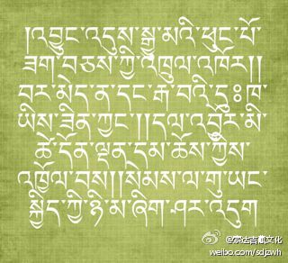
 ## 2012-05-30 13:29
耳边，传来上师、本尊、空行三根本的慈悲安慰密语妙音；内心，获得了安乐解脱的确定把握。纵使孑然一人，也忍不住哼起幸福的道歌。.

 ## 2012-06-01 15:34
དྲུག་གཅིག་བྱིས་པའི་དུས་ཆེན 六一节快乐

 ## 2012-06-01 15:35
རྩྭ་ཐང་ཐོག་གི་བོད་ཀྱི་སློབ་མ། 草原上的藏族学生

 ## 2012-06-01 21:39
快乐的六一[呵呵]

 ## 2012-06-03 12:28
活着，很欢喜，因为可以成办广大的弘法利生事业；死了，也快乐，因为必定可以往生清净刹土。无论值遇痛苦快乐等任何业感现象，均超离了希望、担忧等患得患失的心态。

 ## 2012-06-03 16:03
ང་དང་སློབ་གྲྭའི་སྤྱི་བྲི་རུ་ཁག་པ་ཚོ།我和校舞队成员在一起

 ## 2012-06-04 21:55
当有朝一日脱离这有漏蕴身的躯壳，我将唾弃这无法自主之业力所感的幻化之身，且能如愿往生极乐刹土的莲花苞蕊之上，获得悦意美妙的相好庄严殊胜之身。.

 ## 2012-06-06 10:44
在真实的佛陀上师前，听受了胜乘之教言。获得证悟的身体已经羽翼丰美、力道圆满。正以幻化游舞的形式，与诸大持明勇士勇母密切同道，携手并肩，共同趋往各种清净与不清净刹土观光游览。

 ## 2012-06-07 19:18
从现在开始披挂起精进的铠甲，受持普贤之如海行迹，为了救度一切老母有情脱离轮回苦海，而生起乃至虚空际勤奋不倦之欢喜心。.

 ## 2012-06-08 22:42
无论胜劣高低各道的任何众生，只要耳边听到以上这些发自于喉间受用轮的美妙乐音——成就吉祥之义的欢乐道歌，愿他们都能安享无忧无虑之美满幸福。                    十七胜生周土兔年萨嘎月初二上午，阿旺洛珠聪美依心间自然流出之词句而忠实记录。愿吉祥！.

 ## 2012-06-09 21:08
དེ་རིང་ལོ་རིམ་དྲུག་པའི་སློབ་མ་རྣམས་དང་མཉམ་དུ་སྤྲོ་བསང་ལ་ཕེབས་ས། 与六年级毕业班的学生一起，消遣、娱乐、耍坝子。。。

 ## 2012-06-11 18:34
从今天起，我们将开始学习上师如意宝撰写的《师徒欢喜之歌——无改心之自相》。我将每天翻译其中的一个偈颂，并在微博中与大家分享，但愿诸位能从中感受到佛法的喜乐甘露。

 ## 2012-06-11 18:37
《师徒欢喜之歌——无改心之自相》                                       善妙无比的本尊啊！您是无有欺惑的殊胜依靠如意珍宝，您是汇集三宝于一体之代表，请您安住在我顶部大乐轮百倍信心虹光萦绕之光环彩晕中吧！.

 ## 2012-06-12 15:27
南方门隅飞来的布谷幼雏，沉迷陶醉于夏日王妃的青春美貌容颜，而在茂密森林的树梢上，发出悦耳的啾鸣，回荡在缘分和合的人儿耳边，仿佛品尝到滋味甜美的玉液琼浆甘露一般舒心悦意。

 ## 2012-06-13 17:59
无改赤裸的觉醒境界中，自然而然生起喜悦安乐之美妙觉受。在志同道合的道友行列间，唱起了源自心坎深处的欢乐幸福之歌。 .

 ## 2012-06-14 19:32
在让我一往情深犹如大海的石渠寂静之地，受到慈父般上师的护佑、栽培与疼爱，孩儿从幼年直至青壮年的黄金时代，都沉浸于听闻、思维佛法精要的幸福之中，现在再再回想，不由得心花怒放。

 ## 2012-06-15 17:21
大恩上师的金颜，在心里浮现。难以比拟的慈悲神态，宛若眼前；想起当年同行的金刚道友，共同辩论研讨教理的善妙场景，便历历再现。.

 ## 2012-06-16 23:26
虽然今生，没有真正再次重逢的机缘，但因为朝思暮想、日思夜念，感得在夜半三更的梦中，又能与大恩上师和金刚道友欢聚、相见，喜悦的泪水珠串啊，顺着脸颊，连连不断。。。

 ## 2012-06-17 22:59
一想起持明传承成就者的加持醍醐精华所滋养的密意传承甘露融入心间明点之殊胜缘分，不禁又哼起了幸福的歌儿。.

 ## 2012-06-18 16:45
在无而显现的迷乱空色三有大城中，纵使浊世的衰败痛苦狂风任意肆虐，但在获得明空本地的瑜伽师境界中，这一切，都是一味等性幻化之游戏。  

 ## 2012-06-19 17:29
像大鹏鸟一样的上师，已经展开雄健有力的智慧翅膀，展示着遨游天际的精彩舞姿。若有羽翼丰满、力量成熟的幼子，也应借着证悟的翅膀，冲向法界虚空，与上师一起，演绎比翼双飞的绝唱。.

 ## 2012-06-20 11:36
具备誓言的弟子们啊！虽说上方极乐世界的美妙庄严，远在无量众多世界之外，但对通达善业胜愿幻化境界的人儿来说，此等景象，其实并非遥远。  

 ## 2012-06-21 15:11
当舍弃此等如幻蕴身躯壳的时候，我的明觉心识将直接飞往西方极乐。因为在母胎中，我的羽翼已经丰满成熟，有了不再坠落凶恶之地的把握。.

 ## 2012-06-22 08:41
获得了能引导结缘众生往生极乐的无欺金刚语之授记安慰，在内心描绘了一生的宏伟蓝图，已经有了可以无碍现前的缘分。我，是多么的幸福啊！  

 ## 2012-06-23 19:04
虽然人生的年龄，已进入耋耄之期。四大不调的各种病痛，也在轮番肆意攻击。但一想起证悟无改自然本智的无限幸福，即使独自一人，也禁不住快乐地放声大笑。.

 ## 2012-06-25 16:10
虽然寿命的皎月已渐渐西沉，而内心安乐的朝阳，却正在冉冉升起。这，应该是心中有了踏上解脱之路的远大宏伟理想，而终身修持佛法的结果吧！  

 ## 2012-06-26 17:20
幸福的时候，一起发出快乐的笑声；痛苦的时候，一起流出悲伤的泪雨。心心相印的妹妹和侄女啊，不要忧愁、不要沮丧，无论如何，幸福快乐都环绕在我们身旁。.

 ## 2012-06-28 16:56
誓言的金线，已经紧紧地把我们，捆在一起。再想起水乳交融的情意，所以，无论前路有怎样的快乐痛苦、艳阳风霜，共同的业力，已经让我们不分彼此，迈向前方！
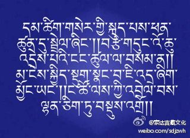
 ## 2012-06-29 12:55
祈愿乃至生生世世间，我们师徒能永不分离。将本尊的秘诀，牢记于心。随着殊胜的缘分，游走四方，一起欣赏这幻化般的轮回大城。                  十七胜生周萨嘎月上弦初一，因某因缘之召唤，阿旺洛珠聪美随性而歌，并拟成文字，愿一切善妙吉祥！

 ## 2012-06-30 08:04
从今天开始，我们将开始翻译、分享并共赏法王如意宝撰著的《教诲天人甘露》。敬请诸位一如既往地予以关注。 .

 ## 2012-06-30 08:08
教诲天人甘露                       我的唯一怙主虹身金刚之尊（麦彭仁波切）啊，您是获得十力自在的佛子。仅仅忆念您，也能断除三有之根源。愿您加持我们的心，转入菩提之路，永不退转！

 ## 2012-07-19 08:23
知心的挚友，请你稍许倾听片刻：空口说再多好听的话语，对你也并无太大的益处，故将甚深教言的醍醐心语，与你分享少许，望你能够铭记于心。

 ## 2012-07-20 07:12
依善知识，是行道的根本；闻思正法，是增长功德旳助伴；无垢戒律，是千万利乐的宝藏；修持禅定，是生出四圣的佛母。

 ## 2012-07-21 08:52
这四种要点在修行菩提中必不可少，如果具备，那就足矣。因此，诸位同心挚友，行住坐卧时时刻刻，切莫忘记，铭刻于心！

 ## 2012-07-22 08:42
那又该怎样依止善知识呢？要比自己的心脏与眼睛更为珍爱，完全依教奉行，语言赞不绝口，身体恭敬承侍，毫不吝惜供养一切所需。

 ## 2012-07-22 09:39
ང་དེ་རིང་ས་ཆ་འདི་ན་ཡོད། 我今天在这里
 ## 2012-07-22 09:41
分享图片

 ## 2012-07-22 10:18
ཁྱབ་བདག་འཇམ་པའི་རྡོ་རྗེར།། གསོལ་བ་སྙིང་ནས་འདེབས་སོ།། བྱིན་རླབས་ཡེ་ཤེས་མཆོག་གིས།། བདག་རྒྱུད་གང་བར་མཛོད་ཅིག།
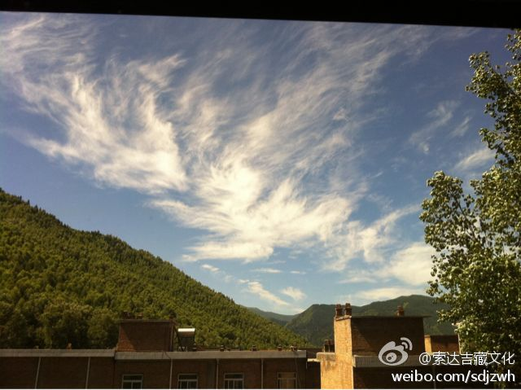
 ## 2012-07-23 08:25
白天将一切皈依处之总集的上师，观在自己的头顶，晚上观在心间，生起信解、虔诚祈祷受四灌顶，最后，在自己的心与上师的智慧无二无别的见解中安住。

 ## 2012-07-24 09:19
所闻思的范围内，尽管显密知识典籍浩如烟海，但如果学了任何一门，就会驱散内心的黑暗，成办今生来世的利益，圆满广大二种资粮。

 ## 2012-07-25 08:38
尤其要实修精华的窍诀要义，绝不能只停留在表面听听、表面懂懂的层面上，务必要做到哪怕自己一个人单独修行，对它的教义也没有丝毫疑惑。这样的观修法，万万不可舍弃！

 ## 2012-07-26 09:36
如果离开了清净戒律的装饰，那么即使具备种族、容貌、多闻，也不美；纵然拥有布施等如海的福德善资，也无济于事。到头来，只会踉踉跄跄走向恶趣。

 ## 2012-07-27 10:09
དེ་རིང་གི་ལོངས་སྤྱོད། 今天的享受

 ## 2012-07-27 10:10
如果具足了戒律，纵然无有其他功德，但包括天人在内的众生，也会交口称赞、抛撒鲜花；即使没有招揽财富，财富也会自然集来。最终，必定从安乐趋入安乐，步入解脱之路。

 ## 2012-07-28 08:40
如同没有喝水就不会解渴一样，没有修行，则不会依靠正法获得解脱。所以，应当修持人身难得、寿命无常、轮回痛苦、因果不虚这四种厌世心，以及皈依、发心、生起次第、圆满次第、大圆满胜道。

 ## 2012-07-29 10:02
如何修行以上胜道的次第？应按照全知上师无垢光尊者所著的善说甘露妙法、汇集九乘之精髓的《心性休息》中所讲，依次修持，并将此融入心相续。

 ## 2012-07-30 08:15
以宣说此文的善根，祈愿所有众生远离二障过患，获得无上佛果。也祈愿你我生生世世蒙麦彭仁波切摄受。以上教言是应哲罗劝请，阿旺罗珠宗美（法王如意宝）造，增上善妙！2012年7月30日译竟于五台山

 ## 2012-08-01 11:36
最近在香港开佛教研讨会，主要是跟一些大学生、知识分子、佛教人士，探讨“佛教科学与环保”、“佛教的心灵教育”、“认识藏传佛教”这方面的课题。在此期间，时间安排得非常紧，不一定有空发微博。实在抽不出时间的话，过几天回来再跟大家交流。

 ## 2012-08-09 14:21
昨夜的梦乡，浮现怎样悲喜的画面，到了今天一切都成了虚妄，由此不禁让人生起一缕伤感。人生的喜怒哀乐又何尝不是如此？

 ## 2012-08-10 21:31
看到臭甲虫吃力地往墙上爬，又掉落下来，可它仍旧不厌其烦苦苦坚持，人人会觉得它太过愚昧，不知这样做徒劳无义，其实追求名誉、高位，又何尝不是如此呢？

 ## 2012-08-11 08:56
佛说，心才是一切一切的根本。所以，你该把主要精力放在调柔、净化这颗心上，不要舍本逐末啊！

 ## 2012-08-13 08:51
不过分贪恋亲人，不过分憎恨敌人，不喜新厌旧而情意长久，不屡次冒犯别人，也不被他人牵着鼻子走，这是世间高尚者的行为风范。

 ## 2012-08-15 07:49
每个人都渴求完美的自我，当然，要做到十全十美的确太难，如果谁能研习智者的著作，那就意味着完善自己。

 ## 2012-08-16 06:33
在这个世界上，善良的朋友比黄金还珍贵，即使是敌人，也要化干戈为玉帛；罪恶的朋友比毒品还可怕，即使是亲人，也要舍离为妙。

 ## 2012-08-17 08:34
不管你有钱没钱，也不管你漂不漂亮，有一颗善良的心才是最可贵的。

 ## 2012-08-18 08:44
大庭广众话不要多，一人独处手不要贱，交心的挚友绝不能蒙，别人的财物切莫眼红。

 ## 2012-08-20 14:13
没人能一手把谁拽到极乐世界，也没人能一脚把谁踹到地狱，自己是苦是乐，命运完全掌握在自己手里，所以，千万不要自己欺骗自己！

 ## 2012-08-21 10:49
当别人衰败、落破、受罪的时候，不要痛斥辱骂；当自己兴盛、风光、安逸的时候，不要骄傲自满。

 ## 2012-08-21 23:23
གསེར་ཐང་གི་སྟོན་དུས། 色达的秋季

 ## 2012-08-21 23:26
རང་དབང་གི་འཚོ་བ། 自由的生活

 ## 2012-08-21 23:34
分享图片

 ## 2012-08-21 23:46
分享图片

 ## 2012-08-23 09:21
如果心没得自在，看到自己的容颜日渐衰老，就会情不自禁流下悲伤的泪。只有内心自在，才是真正永恒的快乐。

 ## 2012-08-24 22:16
不要把自己知道的、想到的，通通都讲出来。常言道：“想什么就说什么，那是癫狂者；想什么就做什么，那是愚痴者。”

 ## 2012-08-27 10:41
有智慧的人，常常反观自心；没智慧的人，常常心随境转。

 ## 2012-08-29 13:58
澄清无浊的净水，能为热恼的生命消暑止渴，同样，哲理格言的甘露水，也能为有智慧的你带来无限安慰。

 ## 2012-08-31 07:45
富豪在愚人中也有，英雄在猛兽中也有，而具备智慧、仁慈的高尚人，在这个世界上稀有。

 ## 2012-09-02 10:40
是好是坏？是敌是友？可急着下结论，必须仔细观察分析，再作定夺。

 ## 2012-09-03 08:24
自己无能为力的事，别人再怎么怂恿，也绝不能去做。就像明知自己不会游泳，别人再劝又岂会往河里跳？

 ## 2012-09-05 08:36
傲气十足、蛮横粗暴的上司，谁也不愿做他的下属，极其湍急的漩涡，鱼儿也不会停留。

 ## 2012-09-12 08:49
去挑战一些无有价值的事，只会损坏自己，而并不是“勇士”。

 ## 2012-09-13 00:01
ངའི་མ་ཡུམ་སློ་གྲྭ་ལི་ཁོག་སློབ་ཆུང་གི་སློབ་མ་རྣམས། 我的母校罗科小学的学生们

 ## 2012-09-13 09:10
高尚的人纵然沦落卑微，也绝不会做违背正法的事，就像求雨的燕子再怎么口渴，也不会喝落地的水。

 ## 2012-09-17 07:58
对没有目标的人，不要寄予太大希望；对素昧平生的人，不要轻易信任依赖。

 ## 2012-09-17 08:14
རྒྱུན་དུ་སངས་རྒྱས་སྨན་ལྷ་མཆེད་བརྒྱད་ལ་གསོལ་བ་བཏབ་ན་ཕན་ཡོན་ཆེན་པོ་ཡོད། 若经常祈祷药师佛， 得极大的利益。

 ## 2012-09-18 13:55
སྟོན་པ་ཐུགས་རྗེ་ཅན་མཁྱེན

 ## 2012-09-19 08:53
萨迦班智达说：凡事，智者通过详细的观察去了解，而愚人总是跟着传言跑。如同老狗听到动静就狂吠乱叫，群狗也附和老狗的狂叫跟着乱跑。

 ## 2012-09-23 22:37
༄།སྔོན་ཆད་བོད་ཡིག་བོད་སྐད་མི་ཤེས་པ་དག་གིས་ཀྱང་ནན་ཏན་གྱིས་བསླབ་ན་ངེས་པར་དུ་ཤེས་ཐུབ་པས་རང་ནས་བརྩམས་ཏེ་འབད་བརྩོན་བྱེད་པར་སྙིང་ནས་ཞུ།།
 ## 2012-09-23 22:41
以前不懂藏文、藏语的人，只要肯付出努力，就一定能学好的。所以，非常希望大家从自己做起，精勤学习。
 ## 2012-09-25 16:53
༄།རྒས་པ་རྣམས་ནི་གཏམ་ཉོག་མང་པོར་དགའ་བས་གཞན་ཡིད་སུན་པར་བྱེད།གཞོན་པ་རྣམས་ནི་བྱ་ངན་མང་པོར་དགའ་བས་རང་ཉིད་སྡུག་བསྔལ་བསྐྱེད།ལྟོས་དང་ཤེས།

 ## 2012-09-25 17:03
老人闲话说得多，是自讨人嫌。青年人琐事做得多，是自讨苦吃。请环顾四周吧！
 ## 2012-09-28 09:44
静心沉思：我们死亡末日何时到来是不定的，谁也避免不了，一直放荡不羁、悠闲度日，实在是迷惑。你想过吗？

 ## 2012-09-30 12:25
这次的伦敦奥运会上，女子20公里竞走中，藏族姑娘切阳什姐获得了铜牌。她是首位夺得奥运奖牌的藏族选手，恭喜她！

 ## 2012-10-03 11:25
一般来说，一个人内在的功与过，通过外在的行为能够推测，就像由水鸟盘旋可知有河、由烟可知有火一样。

 ## 2012-10-04 08:46
若想增长智慧，可以修持法王如意宝的《妙音天女之修法—赐语智德》，其加持极为迅速、不可思议！

 ## 2012-10-04 08:46
༄།ཤེས་རབ་འཕེལ་བར་འདོད་ན་ཆོས་རྗེ་ཡིད་བཞིན་ནོར་བུའི་དབྱངས་ཅན་མའི་སྒྲུབ་ཐབས་འདི་ཉམས་སུ་བླང་ན་བྱིན་རླབས་ཆེས་མྱུར་བ་ཡིན།
 ## 2012-10-05 09:08
དེ་རིང་གི་བླ་རུང་། 今天的喇荣

 ## 2012-10-05 09:10
分享图片

 ## 2012-10-06 11:55
现在身居大城市的个别藏族年轻人，既不精通汉族的传统文化和现代文化，也丢失了藏族的语言、文字和佛教传统，如此不伦不类，看起来实在可怜！

 ## 2012-10-10 08:24
若是好朋友，当别人遇到危难、感到无助的关键时刻，自己会不顾一切地伸出真诚的援手，这才真令人佩服。

 ## 2012-10-13 09:47
有些人当拥有一个贤良的伴侣时，不知道珍惜，整天争吵不休，一旦失去时才后悔莫及。所以，每个人都要学会珍惜。

 ## 2012-10-19 07:41
不管是谁，都很需要不失尊严、不丢脸面而与人为善、和睦相处。在交往时非常重要的一点，是常常换位思考。

 ## 2012-10-24 09:17
我们的脸不要像夏天云层中的太阳一样喜怒无常，要用微笑迎接生命旅程中的一切。

 ## 2012-10-26 19:35
一个行路人走得太疲惫，躺在路边睡着了。一条毒蛇从草丛里钻了出来，爬向那个沉睡的路人，昂头吐着红色的毒信子。就在这时，另一个过路人经过这里，他赶走了那条毒蛇，却没有惊醒行路人的好梦，就悄悄走开了。人一生很多时候都生活在别人的恩泽之中，但很多时候他可能永远都不知道。

 ## 2012-10-28 10:02
我们藏地很多人，在揉糌粑、吃饭时，经常没有洗手。如此一来，病从口入，手上的细菌，就成了各种疾病的来源。所以，希望大家平时在接触食物时，一定要先洗手！

 ## 2012-10-31 19:28
今年是好人也有明年变坏的，所以不要过早赞扬谁，详细观察再说；坏人也有变好的可能，所以不要急着贬损谁，想想办法改变他。

 ## 2012-11-01 08:24
从今天开始，喇荣五明佛学院开为期8天的“极乐大法会”。大家若能念《极乐愿文》、《普贤行愿品》，并持诵阿弥陀佛心咒“嗡阿弥德瓦阿依斯得吽舍”30万遍，则可得到与僧众共修的一切功德。望大家精进努力！

 ## 2012-11-03 16:08
不管是什么人，如果明明不懂本民族的语言、文字、传统、宗教等，却宣称自己是某某民族的人，此举除了成为自己羞愧、他人讥笑的因之外，不会带来更大的优势。

 ## 2012-11-05 09:33
一位贤德曾说：＂以前虽然拥有珍贵的人生，却一直只是忙碌着温饱，真的和动物没有两样，实在悲伤。＂想来这正是现在多数人的人生写照。

 ## 2012-11-10 08:23
一直以来，我都将无著菩萨的一句话，作为自己的座右铭——无论爱我或是恨我，赞我或是损我，助我或是害我，甚至见到我、听到我、忆念我，愿他们都能迅速获得解脱的菩提圣果。
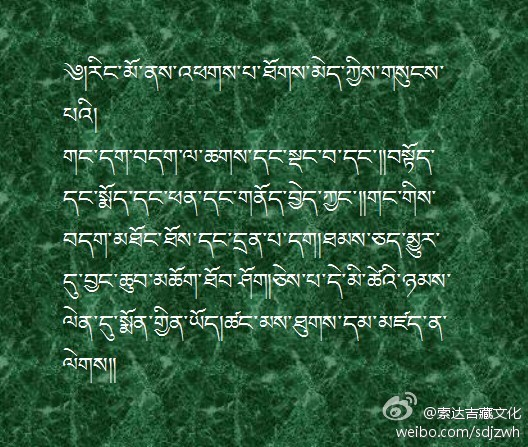
 ## 2012-11-17 08:43
身为人父人母，对于性情顽劣的儿女，不能一味娇惯放纵、助长恶习，要软硬兼施使他们步入正道。若能从小就培养其慈悲等善心，未来的人生必定是光明的。

 ## 2012-11-23 09:39
如果你想要顺利快乐，那凡事就必须掌握分寸，量力而行；假设非要往不堪的痛苦里钻，想什么就做什么，结果如何只有自己最清楚。

 ## 2012-11-28 18:05
转发微博
 > @索达吉藏文化
 > 不管你有钱没钱，也不管你漂不漂亮，有一颗善良的心才是最可贵的。

 ## 2012-11-30 08:25
转发微博
 > @索达吉藏文化
 > 自己无能为力的事，别人再怎么怂恿，也绝不能去做。就像明知自己不会游泳，别人再劝又岂会往河里跳？

 ## 2012-12-02 08:36
转发微博
 > @索达吉藏文化
 > 不过分贪恋亲人，不过分憎恨敌人，不喜新厌旧而情意长久，不屡次冒犯别人，也不被他人牵着鼻子走，这是世间高尚者的行为风范。

 ## 2012-12-04 08:36
转发微博
 > @索达吉藏文化
 > 对没有目标的人，不要寄予太大希望；对素昧平生的人，不要轻易信任依赖。

 ## 2012-12-06 08:22
请往内反观一下自己的心！假如你通达了心的自性，痛苦的乌云就会当下消散，喜乐的太阳会冉冉升起。

 ## 2012-12-16 10:46
据统计，如今有些少数民族地区，2%或9%的人都感染了艾滋病毒，而且此病已经蔓延到了藏地。如果没有大家的共同努力，采取各种措施加以防范，这个民族很可能会遭受极大威胁。在此给大家敲响警钟！

 ## 2012-12-26 09:09
认为快乐是快乐、痛苦是痛苦，二者之前水火不容，这是一般人的想法。而能在痛苦中发现快乐，在快乐中认清痛苦，这才是智者的高明。

 ## 2012-12-31 18:55
师垂念！2012年最后一天的落日，给我们带来怎样的生命无常之提示？

