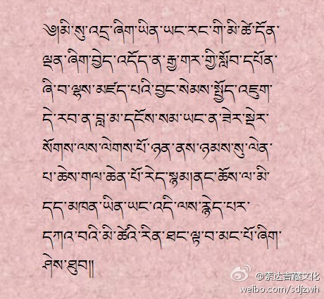
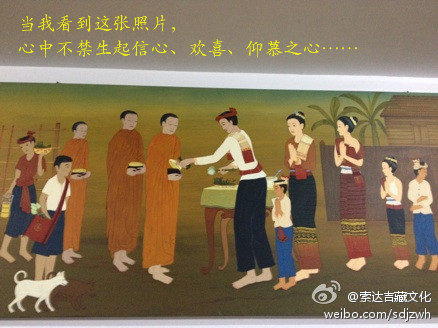
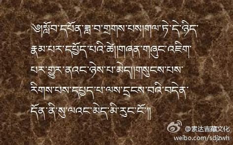
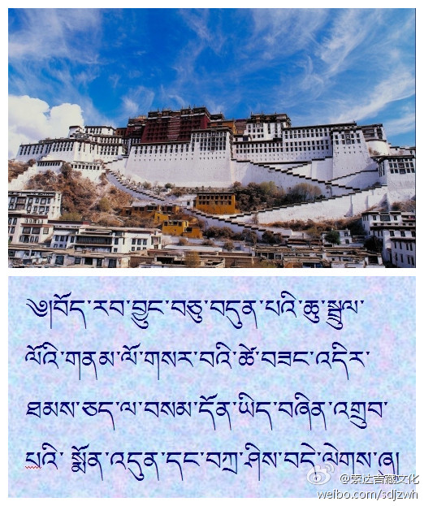
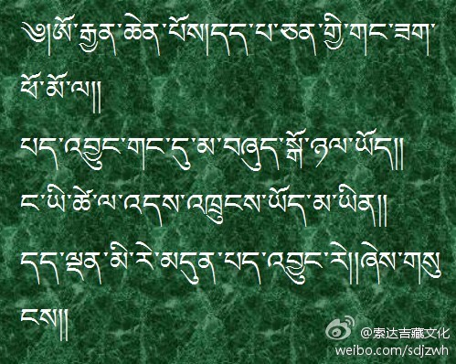
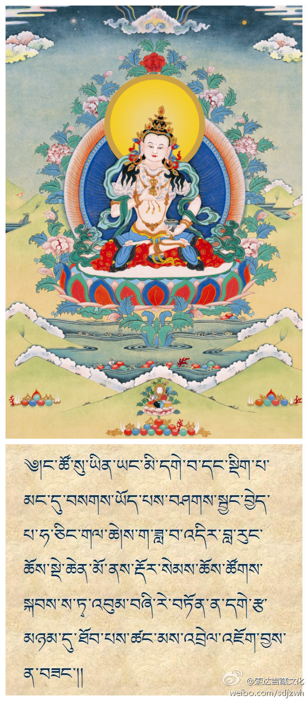
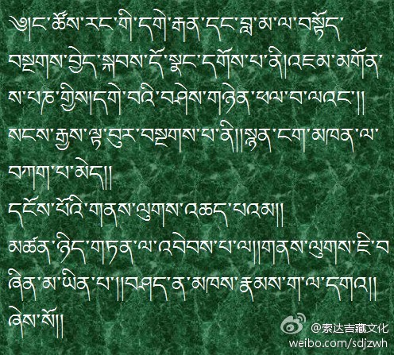
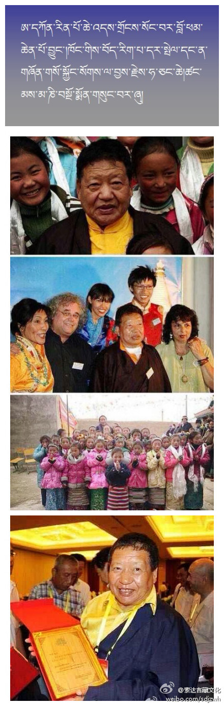
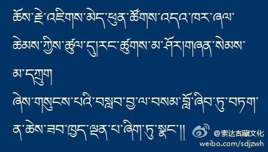
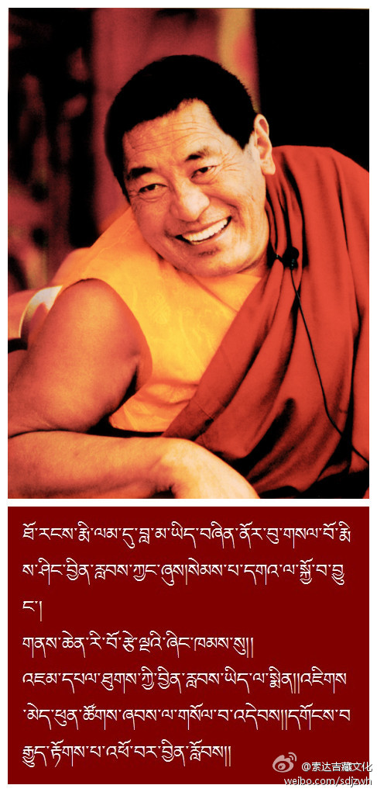

 ## 2013-01-07 21:20
当今时代，哪怕在短期内受持一分戒律，也有极大的功德。世亲论师说：“何人以信心，百年作布施，不如于一日，受戒功德大。”

 ## 2013-01-08 11:08
不管是什么身份的人，若想自己的人生有意义，最好通过上师或光盘，学习一下印度寂天菩萨所造的《入菩萨行论》。即便是不学佛的人，从中也可以收获对人生有利的知识。O网页链接

 ## 2013-01-10 09:17
༄། པར་རིས་འདི་མཐོང་སྐབས་ང་ལ་དགའ་དད་ཡིད་སྨོན་ཚད་མེད་ཅིག་སྐྱེ།ཁྱོད་ལ་ཇི་འདྲའི་ཚོར་སྣང་འདུག།

 ## 2013-01-12 10:27
如今很多人被邪见、无明、嫉妒的毒水所迷醉，毫无任何理由就说些污蔑他人、诽谤正法的语言。此时，我们打开智慧的眼目细致观察，趋入正道极为重要！

 ## 2013-01-18 12:12
凭借智慧观察而引出的真义，对谁来讲都不可缺失。印度月称论师说：“在追求真理时，即便摧毁他人的观点，也没有过失。”

 ## 2013-01-19 09:56
དེ་རིང་གྲོགས་པོ་ཞིག་གིས་བསྐུར་བའི་ལོ་ཉི་ཤུའི་སྔོན་གྱི་པར་འདིས་ང་ལ་འདས་སོང་གི་དྲན་སྐུལ་དྲག་པོ་ཞིག་བྱས་སོང་།今天，朋友发来一张20年多前的照片，使我又想起了许多依止上师的美好往事

 ## 2013-01-21 23:13
朋友啊，不忘记传统的故乡，并非因为守旧与怯懦；要铺就创新的道路，也不依于空谈和强求。你和我都不例外……

 ## 2013-01-23 08:11
经常念诵观音心咒“嗡玛尼贝美吽”，能令一切魔众无可乘之机，罪障清净、长寿无病、增上财富、安享快乐等，有无边殊胜功德。

 ## 2013-01-26 16:22
“净土三经”中的《观无量寿佛经》（简称《观经》），以前在藏地没有，印度的梵文本也失传了，但在新疆曾发现过维吾尔文译本的残片。这次我依靠汉地的可靠版本，将《观经》译成了藏文，愿与此经结缘的众生皆往生极乐净土！

 ## 2013-02-11 09:58
今天是藏历新年——水蛇年的第一天，在这个特别的日子里，祝福大家心想事成，吉祥如意！

 ## 2013-02-22 06:59
莲花生大士亲口承诺：“对于具有信心的善男善女，我莲师永远都不离开，而会时刻安住在他的面前。我的寿命不生不死，在每位具信心者面前，都会有一位莲师，随时赐予加持。”

 ## 2013-03-03 09:46
释迦牟尼佛说：一盏灯可以点燃成千上万盏灯，在点亮其他灯的同时，自身的光明并不会因此而减弱。同样，我们应当对更多人传播自己的幸福窍诀，在与别人分享的同时，自己的幸福也不会因此而减少。

 ## 2013-05-09 08:25
我们不管是谁，都曾造过许多恶业，所以忏悔非常重要。本月（阳历5月10日—6月8日）是藏历的萨迦月，我们喇荣五明佛学院将召开“金刚萨埵法会”，为自他一切众生忏悔罪业。倘若你也能念40万遍金刚萨埵心咒“嗡班杂萨埵吽”，便可获得与僧众共修的功德。望大家尽量与此结上善缘！

 ## 2013-05-25 08:10
我本人对各教派没有偏袒心，最近个别苯教僧人有一些想法，可能是早年我曾传讲《中观庄严论释》所致。但实际上，我当时除了对论典原文作字面解释外，基本上没有加个人意见，只要对照一下《中观庄严论释》即可明了。苯教也有自己的解脱道，我们佛学院还建有苯教殿堂，所以，大家若互相团结对自他都有利！

 ## 2013-06-08 08:17
享用素食，可以保护脆弱的生命，有助于我们身心健康；享用肉食，与践踏生命无别，剥夺了众生的自由、平等。对此我们应引起深思！

 ## 2013-06-15 10:44
宗喀巴大师曾说：“佛法如意宝尚未遍及的地方，或者曾经遍及、现已衰退的地方，我们应在大悲心的推动下，将这一利乐的宝藏（佛法），竭力在那里弘扬开来。”我本人也如是真诚地发愿，同时，望有缘者好好思考，并力所能及地付出一份力量。

 ## 2013-06-24 08:50
当我们赞叹自己的老师或上师时，有一点要值得注意：萨迦班智达说过，在诗学中，虽然可以用夸张的手法，将普通的善知识赞美成佛陀，但在抉择万法真相、揭示事物本质时，若没有实事求是、客观如实，智者又么会喜欢呢？

 ## 2013-07-29 07:56
生活里希求快乐、远离痛苦的唯一窍诀，除了通达自心的奥秘以外，在整个世界的所有知识中，都找不到比这更好的方法了。因此，依靠佛法来证悟本性，是多么美妙的事啊！喇嘛钦！

 ## 2013-08-04 08:03
真正的修行人，常会处于一种快乐、愉悦的境地中。诚如大智者霞嘎巴所说：“一旦你能做到不管住在哪里，都觉得舒心悦意；无论与谁交往，都觉得甘之如饴，这就是修行成就的验相。”

 ## 2013-08-22 18:59
近日，甘孜洲炉霍县境内的一所中学需要几位老师，要求是：签两年协议，工资每月1500-2000，教学内容是藏文数学、藏文生物学，教学时间从今年9月1号开始。联系电话：18919541859 谢绕罗佩

 ## 2013-10-09 14:18
惊闻阿贡仁波切遇害，令人十分悲痛。他对弘扬藏文化、培养藏族年轻人等方面，贡献巨大。望大家多念观音心咒、多行善法进行回向。

 ## 2013-10-09 14:52
O网页链接

 ## 2013-10-10 12:23
明天是“国际素食日”，大家若方便的话，可否选择吃素？吃肉相当于吃生命，为了少许的口腹之欲而践踏其他生命，这种行为值得我们反思。

 ## 2013-10-19 10:35
明天是星期天（20日），晚上8-9点，我在网上用藏语跟藏族聊天http://www.zhibeifw.com/Tibetan/?page_id=2394；9-10点，用汉语跟汉族佛子聊天O网页链接。若有时间和兴趣，你也可以来分享。

 ## 2013-12-23 08:15
法王晋美彭措圆寂前的最后教言是“莫舍己道，勿扰他心”，若认真思维这句话，就会发现它的甚深。

 ## 2013-12-30 06:45
凌晨清楚地梦见上师如意宝，并求得加持，醒来后心情既欢喜又悲伤。自大圣境五台山，文殊加持入心者，祈祷晋美彭措足，证悟意传求加持。

