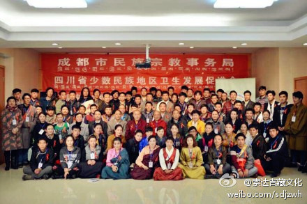

 ## 2014-01-15 10:07
今天是法王如意宝圆寂十周年的日子，望大家以猛烈的信心多念《上师供》，或者法王祈祷文“自大圣境五台山，文殊加持入心者，祈祷晋美彭措足，证悟意传求加持”。

 ## 2014-01-15 10:10
今天是法王如意宝圆寂十周年的日子，望大家以猛厉的信心多念《上师供》，或者法王祈祷文“自大圣境五台山，文殊加持入心者，祈祷晋美彭措足，证悟意传求加持”。

 ## 2014-02-28 07:55
经过12年，我翻译出来了一部大论，此论极为殊胜难得，结尾是这样说的：“任何众生，不论是恼怒我还是喜欢我，伤害我还是跟随我，愿我都能尽快去帮助他们，令其获得解脱。”这部论不能随意公开，但此句可与大家分享。

 ## 2014-03-02 07:57

 ## 2014-03-11 09:19
རང་ཚུགས་མ་ཤོར།།གཞན་སེམས་མ་དཀྲུགས།།莫舍己道，勿扰他心

 ## 2014-04-20 10:04
རྩ་བ་བོར་ནས་ཡལ་ག་མ་འཚོལ།别舍本逐末

 ## 2014-05-13 17:50
大圆满道歌    喇嘛钦！ O网页链接  

 ## 2014-05-26 07:06
ང་ཚོ་དགེ་རྒན་ཚོས་རང་གིས་སློབ་སྦྱོང་རྒྱན་ལྡན་དང་གཞན་ལ་ལྷག་བསམ་ཟོལ་མེད་ཀྱིས་ཕན་པ་སྒྲུབ་པའི་བརྩོན་ལེན་བྱེད་རྒྱུའི་དམ་བཅའ་ཡོད།

 ## 2014-06-15 15:50
最近在北京中青院讲座时，遇到许多藏族学生，很开心ང་རང་ཉེ་ཆར་པེ་ཅིན་ནས་ཀྲུང་གོ་ན་གཞོན་སློབ་གྲྭར་འཆད་ཁྲིད་བྱེད་སྐབས་བོད་རིགས་སློབ་མ་མང་པོ་དང་འཕྲད་པས་ཆེས་དགའ་པོ་བྱུང་།

 ## 2014-06-22 12:39
【视频：མཁན་པོ་བསོད་དར་རྒྱས།】 （分享自 @优酷） Lམཁན་པོ་བསོད་དར་རྒྱས།  ¡查看图片

 ## 2014-06-28 08:21

 ## 2014-07-14 08:38

 > @凤凰网视频
 > 【@索达吉堪布 ：没有信仰，生活就没有底线】生活总是充满变数，懂得无常之意，才能让你处变不惊；世上充满痛苦与快乐，遇到痛苦时，要健翔，恰逢快乐时，要谨慎谦卑，对身边的人要有感恩的心；培养真正的信仰会让你们的生活更加幸福。@凤凰佛教 #说给孩子#精彩回顾 视频：L2013-05-31说给孩子第二季 索达吉堪布  ¡查看图片

 ## 2014-08-29 09:09
ང་ཚོའི་མ་འོངས་པའི་ལམ--ཤེས་རིག་དང་སྤྱོད་བཟང་།未来的路需要知识和道德

 ## 2014-09-01 07:44
最殊胜的财富是知足；最殊胜的功德是利他；最殊胜的装饰是智慧；最殊胜的朋友是不欺。——华智•晋美秋吉旺波

 ## 2014-11-18 00:55
我在美国弗吉尼亚大学，遇到了一些藏族学生，他们很努力地在学习。无论在任何地方，以学习度过人生是最有意义的幸福生活。

 ## 2014-12-03 09:09
少数民族对艾滋病的认识比较薄弱，这几年来，我们一直在这方面尽力做些事情，前几天刚开了交流会。希望唤醒更多人对艾滋病的防范意识，保护自身的健康，也希望更多人关心艾滋病人这个群体。

 ## 2014-12-28 20:16
ངའི་མི་ཚེའི་ཆུ་ཟླའི་རྨི་ལམ་ཐེངས་ཅིག།我生命中的一次水月之梦O网页链接
