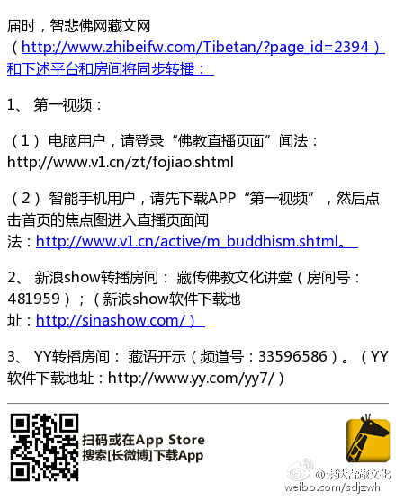

 ## 2016-01-20 18:00
གསལ་བརྡ

 ## 2016-02-04 19:13
ལོ་སར་བཟང་།L贺年卡｜索达吉堪布祝福火猴年（藏语） ¡查看图片

 ## 2016-04-06 16:32
རྒྱ་ནག་གི地藏经ཞེས་པ་སྟེ་ས་ཡི་སྙིང་པོའི་མདོ་འདི་ོབོད་ཡིག་ནང་རྙེད་ན་ང་ལ་གསུང་རོགས་ཞུ།

 ## 2016-04-22 14:22
ངས་ཧོར་ཟླ་གསུམ་པའི་ཚེས་ཉེར་གསུམ་གྱི་དགོང་མོ་ཆུ་ཚོད་དགུ་པ་ནས་བཅུ་པའི་བར་བོད་སྐད་གྱི་ལམ་ནས་ང་ཚོའི་བུ་ཚ་སྐྱེ་རྒྱུད་རྣམས་ཀྱི་ཅི་བྱ་ཞེས་པའི་བསམ་ཚུལ་གླེང་རྒྱུ་ཡིན།藏历三月二十三日（公历4月30日）晚上9点-10点，我将会用纯藏语讲一下＂我们的子孙后代该怎么做＂。

 ## 2016-04-24 10:46
བྱིས་པ་རྣམས་རེ་རེ་བཞིན་དངས་གཙང་གི་སེམས་མཁའ་ན་མཛེས་སྡུག་གི་རྨི་ལམ་རེ་ཡོད་ལ།དེ་མངོན་དུ་འགྱུར་ཆེད་ང་ཚོས་བརྩོན་པར་བྱ།
Oསྒྲོལ་མའི་གསོལ་འདེབས། ཏྲེ་ཧོར་ལྷ་མོ་སྒྲོལ་...

 ## 2016-06-06 05:53
ངའི་མ་རྒན་རིག་མཚོ་འཇིག་རྟེན་ཕ་རོལ་ཏུ་བུད་སོང་།དེའི་དོན་དུ་མ་ཎི་ཕྲེང་སྐོར་རེ་གསུང་རོགས།ཨོཾ་མ་ཎི་པདྨེ་ཧཱུཾ།

 ## 2016-06-14 15:01
L此生无憾——索达吉堪布最后一次听阿妈说（藏文... ¡查看图片

